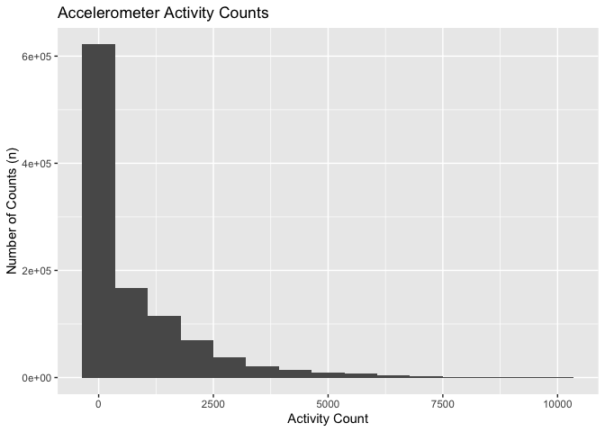
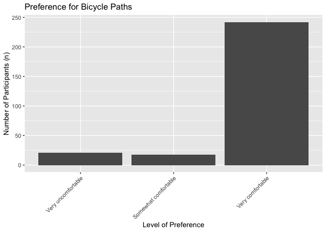
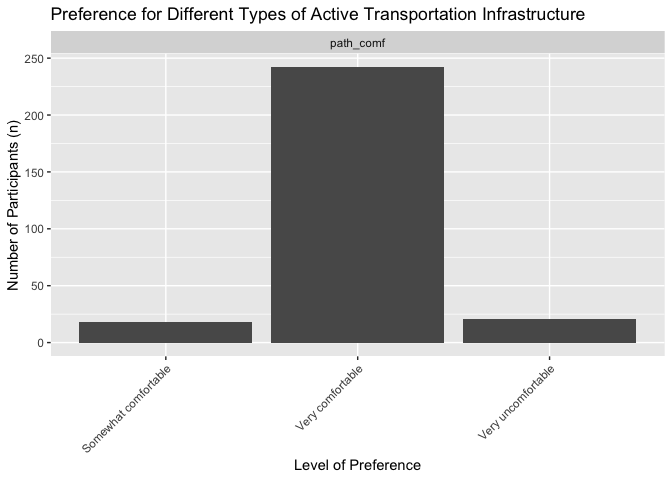
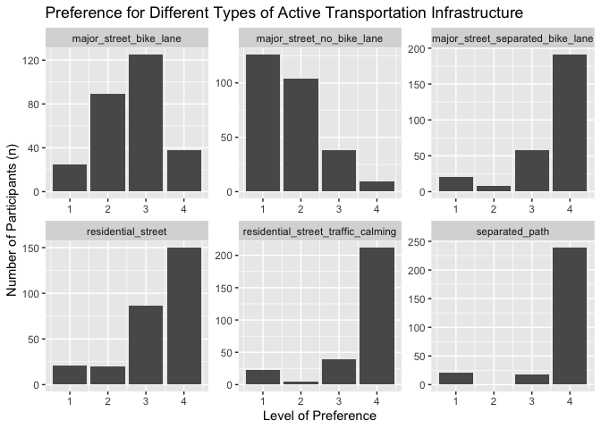

## Loading Packages

```r
library(lmtest)
```

```
## Loading required package: zoo
```

```
## 
## Attaching package: 'zoo'
```

```
## The following objects are masked from 'package:base':
## 
##     as.Date, as.Date.numeric
```

```r
library(tidyverse)
```

```
## ── Attaching packages ─────────────────────────────────────────────────────────────────────────────────── tidyverse 1.2.1 ──
```

```
## ✔ ggplot2 3.2.0     ✔ purrr   0.3.2
## ✔ tibble  2.1.3     ✔ dplyr   0.8.1
## ✔ tidyr   0.8.3     ✔ stringr 1.4.0
## ✔ readr   1.1.1     ✔ forcats 0.3.0
```

```
## ── Conflicts ────────────────────────────────────────────────────────────────────────────────────── tidyverse_conflicts() ──
## ✖ dplyr::filter() masks stats::filter()
## ✖ dplyr::lag()    masks stats::lag()
```

```r
library(ggplot2)
library(haven)
library(janitor)
library(pastecs)
```

```
## 
## Attaching package: 'pastecs'
```

```
## The following objects are masked from 'package:dplyr':
## 
##     first, last
```

```
## The following object is masked from 'package:tidyr':
## 
##     extract
```

```r
library(psych)
```

```
## 
## Attaching package: 'psych'
```

```
## The following objects are masked from 'package:ggplot2':
## 
##     %+%, alpha
```

```r
library(car)
```

```
## Loading required package: carData
```

```
## 
## Attaching package: 'car'
```

```
## The following object is masked from 'package:psych':
## 
##     logit
```

```
## The following object is masked from 'package:dplyr':
## 
##     recode
```

```
## The following object is masked from 'package:purrr':
## 
##     some
```

```r
library(Hmisc)
```

```
## Loading required package: lattice
```

```
## Loading required package: survival
```

```
## Loading required package: Formula
```

```
## 
## Attaching package: 'Hmisc'
```

```
## The following object is masked from 'package:psych':
## 
##     describe
```

```
## The following objects are masked from 'package:dplyr':
## 
##     src, summarize
```

```
## The following objects are masked from 'package:base':
## 
##     format.pval, units
```

```r
library(ggm)
```

```
## Loading required package: igraph
```

```
## 
## Attaching package: 'igraph'
```

```
## The following objects are masked from 'package:dplyr':
## 
##     as_data_frame, groups, union
```

```
## The following objects are masked from 'package:purrr':
## 
##     compose, simplify
```

```
## The following object is masked from 'package:tidyr':
## 
##     crossing
```

```
## The following object is masked from 'package:tibble':
## 
##     as_data_frame
```

```
## The following objects are masked from 'package:stats':
## 
##     decompose, spectrum
```

```
## The following object is masked from 'package:base':
## 
##     union
```

```
## 
## Attaching package: 'ggm'
```

```
## The following object is masked from 'package:igraph':
## 
##     pa
```

```
## The following object is masked from 'package:Hmisc':
## 
##     rcorr
```

```r
library(polycor)
```

```
## 
## Attaching package: 'polycor'
```

```
## The following object is masked from 'package:psych':
## 
##     polyserial
```

```r
library(tableone)
library(forcats)
library(gmodels)
library(QuantPsyc)
```

```
## Loading required package: boot
```

```
## 
## Attaching package: 'boot'
```

```
## The following object is masked from 'package:survival':
## 
##     aml
```

```
## The following object is masked from 'package:lattice':
## 
##     melanoma
```

```
## The following object is masked from 'package:car':
## 
##     logit
```

```
## The following object is masked from 'package:psych':
## 
##     logit
```

```
## Loading required package: MASS
```

```
## 
## Attaching package: 'MASS'
```

```
## The following object is masked from 'package:dplyr':
## 
##     select
```

```
## 
## Attaching package: 'QuantPsyc'
```

```
## The following object is masked from 'package:base':
## 
##     norm
```

```r
library(KernSmooth)
```

```
## KernSmooth 2.23 loaded
## Copyright M. P. Wand 1997-2009
```

```r
library(raster)
```

```
## Loading required package: sp
```

```
## 
## Attaching package: 'raster'
```

```
## The following objects are masked from 'package:MASS':
## 
##     area, select
```

```
## The following objects are masked from 'package:Hmisc':
## 
##     mask, zoom
```

```
## The following object is masked from 'package:pastecs':
## 
##     extract
```

```
## The following object is masked from 'package:janitor':
## 
##     crosstab
```

```
## The following object is masked from 'package:dplyr':
## 
##     select
```

```
## The following object is masked from 'package:tidyr':
## 
##     extract
```

```r
library(sp)
library(sf)
```

```
## Linking to GEOS 3.6.1, GDAL 2.1.3, PROJ 4.9.3
```

```r
library(lubridate)
```

```
## 
## Attaching package: 'lubridate'
```

```
## The following object is masked from 'package:igraph':
## 
##     %--%
```

```
## The following object is masked from 'package:base':
## 
##     date
```

```r
library(anytime)
library(stringr)
library(stringi)
library(finalfit)
```

## Reading in Data to make sure timestamps code was right

```r
wear_time_stamps_updated_final <- read_csv("wear_time_stamps_updated_final.csv")
```

```
## Parsed with column specification:
## cols(
##   doy = col_integer(),
##   interact_id.y = col_integer(),
##   unique_days = col_integer(),
##   unique_seconds = col_integer(),
##   n_traces = col_integer(),
##   min_time = col_datetime(format = ""),
##   max_time = col_datetime(format = ""),
##   total_time = col_double(),
##   unique_hours = col_double(),
##   hours_per_day = col_double()
## )
```

```r
#wear_time_stamps <- read_csv("wear_time_stamps.csv")
#wear_time_stamps_updated <- read_csv("wear_time_stamps_updated.csv")
##everything looks great

colnames(wear_time_stamps_updated_final)[colnames(wear_time_stamps_updated_final)== "interact_id.y"] <- "interact_id"
```

## Reading in other data

```r
gps_join_all_percent_updated <- read_csv("gps_join_all_percent_updated.csv")
```

```
## Parsed with column specification:
## cols(
##   interact_id.y = col_integer(),
##   n.x = col_integer(),
##   n.y = col_integer(),
##   amount = col_double(),
##   percent = col_double()
## )
```

```r
victoria_gps_only <- read_csv("victoria_gps_only.csv")
```

```
## Parsed with column specification:
## cols(
##   .default = col_integer(),
##   date_of_survey.x = col_date(format = ""),
##   month = col_character(),
##   day = col_character(),
##   gender_vic.x = col_character(),
##   residence_cp = col_character(),
##   date_of_survey.y = col_date(format = ""),
##   preferred_mode_f_txt = col_character(),
##   car_share = col_character(),
##   car_share_txt = col_character(),
##   house_tenure_txt = col_character(),
##   dwelling_type_txt = col_character(),
##   living_arrange = col_character(),
##   living_arrange_txt = col_character(),
##   residence = col_date(format = ""),
##   group_id = col_character(),
##   gender_vic.y = col_character(),
##   sensedoc_ID = col_character(),
##   ethica_ID = col_character(),
##   age_categories = col_character(),
##   gender = col_character()
##   # ... with 27 more columns
## )
```

```
## See spec(...) for full column specifications.
```

```r
sd_days <- read_csv("all_sds_victoria_phase_1.csv")
```

```
## Parsed with column specification:
## cols(
##   `Sensedoc ID` = col_character(),
##   `Serial #` = col_character(),
##   `Dates Worn` = col_character(),
##   Notes = col_character()
## )
```

```r
weather_data <- read_csv("weather_data_1.csv")
```

```
## Parsed with column specification:
## cols(
##   .default = col_character(),
##   `Date/Time` = col_date(format = ""),
##   Year = col_integer(),
##   Month = col_integer(),
##   Day = col_integer(),
##   `Max Temp (°C)` = col_double(),
##   `Min Temp` = col_double(),
##   `Mean Temp` = col_double(),
##   `Heat Deg Days (°C)` = col_double(),
##   `Cool Deg Days (°C)` = col_double(),
##   `Total Rain (mm)` = col_double(),
##   `Total Snow (cm)` = col_double(),
##   `Total Precip (mm)` = col_double(),
##   `Snow on Grnd (cm)` = col_integer(),
##   `Snow on Grnd Flag` = col_logical(),
##   `Dir of Max Gust (10s deg)` = col_integer()
## )
## See spec(...) for full column specifications.
```

```r
doy_start_end_filtered <- read_csv("doy_start_end_filtered.csv")
```

```
## Parsed with column specification:
## cols(
##   interact_id = col_integer(),
##   gps_id = col_integer(),
##   doy = col_integer(),
##   doy_start = col_integer(),
##   doy_end = col_integer(),
##   unique_seconds = col_integer()
## )
```

## Total hours, number of days and average hours 

```r
wear_time_stamps_updated_final <- wear_time_stamps_updated_final %>% group_by(interact_id) %>% mutate(total_hours = sum(unique_hours))

wear_time_stamps_updated_final <- wear_time_stamps_updated_final %>% group_by(interact_id) %>% mutate(number_days = sum(unique_days))

wear_time_stamps_updated_final <- wear_time_stamps_updated_final %>% group_by(interact_id) %>% mutate(average_hours = total_hours/number_days)
```

## Weather data

```r
weather_data_updated <- weather_data %>% dplyr::select("Date/Time", "Year", "Month", "Day", "Mean Temp", "Total Precip (mm)")

weather_data_updated <- weather_data_updated %>% mutate(doy = lubridate::yday(`Date/Time`))

colnames(weather_data_updated)[colnames(weather_data_updated)== "Mean Temp"] <- "mean_temp"
colnames(weather_data_updated)[colnames(weather_data_updated)== "Total Precip (mm)"] <- "total_precip"

weather_time_stamps_1 <- left_join(wear_time_stamps_updated_final, weather_data_updated, by = "doy")

weather_time_stamps_2 <- weather_time_stamps_1 %>% group_by(interact_id) %>%
  mutate(mean_temp_date = mean(mean_temp, na.rm = TRUE),
           total_precip_date = sum(total_precip, na.rm = TRUE))

summary_wear_stamps  <- dplyr::select(weather_time_stamps_2, "interact_id", "total_hours", "number_days", "average_hours", "mean_temp_date", "total_precip_date") #creating a new data frame with just this info. Includes wear stamps and weather data

summary_wear_stamps <- summary_wear_stamps %>% distinct(interact_id, .keep_all = TRUE) #removes duplicates

write_csv(summary_wear_stamps, "summary_wear_stamps.csv")
```

## Wear time plots 

```r
histo_gps_points_updated <- ggplot(wear_time_stamps_updated_final) + 
                      geom_histogram(aes(unique_seconds)) + 
                      geom_vline(xintercept=7500)
plot(histo_gps_points_updated)
```

```
## `stat_bin()` using `bins = 30`. Pick better value with `binwidth`.
```

<!-- -->

```r
##plot is correct. No GPS days under 7500
```


## Renaming columns in exposure file and filtering for NA

```r
colnames(gps_join_all_percent_updated)[colnames(gps_join_all_percent_updated)== "interact_id.y"] <- "interact_id" #changing to interact_id to help make joining easier later
gps_join_all_percent_updated[is.na(gps_join_all_percent_updated <- gps_join_all_percent_updated)] <- 0 #converted NA's to zero to make merging easier. 

colnames(gps_join_all_percent_updated)[colnames(gps_join_all_percent_updated)== "n.x"] <- "total_points" 

colnames(gps_join_all_percent_updated)[colnames(gps_join_all_percent_updated)== "n.y"] <- "exposure_points" 
```

## Merge gps_join_all_percent_updated with victoria_gps_only 

```r
gps_join_all_percent_updated[, "interact_id"] <- apply(gps_join_all_percent_updated[, "interact_id"], 1, function(x) as.integer(x))
victoria_gps_only[, "interact_id"] <- apply(victoria_gps_only[, "interact_id"], 1, function(x) as.integer(x))
#converting to integar first so both interact_id are using the same data format

victoria_gps_only_merged <- left_join(victoria_gps_only, gps_join_all_percent_updated, by = "interact_id") #successfully merged 
```

## Recoding PA total and cycling PA for outlier 

```r
victoria_gps_only_merged$total_pa_met_formula[victoria_gps_only_merged$total_pa_met_formula == 29622.0] <- 22309
tabyl(victoria_gps_only_merged$Cycling_formula)
```

```
##  victoria_gps_only_merged$Cycling_formula  n     percent
##                                         0  4 0.026143791
##                                       120  1 0.006535948
##                                       180  3 0.019607843
##                                       300  2 0.013071895
##                                       360  5 0.032679739
##                                       420  2 0.013071895
##                                       480  2 0.013071895
##                                       540  2 0.013071895
##                                       600  6 0.039215686
##                                       630  1 0.006535948
##                                       720  8 0.052287582
##                                       750  3 0.019607843
##                                       810  1 0.006535948
##                                       840  1 0.006535948
##                                       900  6 0.039215686
##                                       960  2 0.013071895
##                                      1080  6 0.039215686
##                                      1200  1 0.006535948
##                                      1260  4 0.026143791
##                                      1350  5 0.032679739
##                                      1440 13 0.084967320
##                                      1470  1 0.006535948
##                                      1500  1 0.006535948
##                                      1560  1 0.006535948
##                                      1620  3 0.019607843
##                                      1680  7 0.045751634
##                                      1800 15 0.098039216
##                                      1890  5 0.032679739
##                                      1980  1 0.006535948
##                                      2160  8 0.052287582
##                                      2520 15 0.098039216
##                                      2880  1 0.006535948
##                                      3600  2 0.013071895
##                                      4320  2 0.013071895
##                                      5040  7 0.045751634
##                                      5760  1 0.006535948
##                                      6480  1 0.006535948
##                                      7200  1 0.006535948
##                                      7560  2 0.013071895
##                                     10080  1 0.006535948
```

```r
victoria_gps_only_merged$Cycling_formula[victoria_gps_only_merged$Cycling_formula == 10080] <- 7561
```

##Filtering for participants who GPS data isn't valid

```r
victoria_gps_only_merged_updated <- victoria_gps_only_merged %>% filter(total_points >= 0)

write_csv(victoria_gps_only_merged_updated, "victoria_gps_only_merged_updated.csv")
```

## Connect PA total and cycling PA with exposure data

```r
PA_total_and_cycling <- dplyr::select(victoria_gps_only_merged_updated, "interact_id", "Cycling_formula", "total_pa_met_formula", "proportion_PA", "total_points", "exposure_points", "amount", "percent")

write_csv(PA_total_and_cycling, "PA_total_and_cycling.csv")
```

## Filtering for file with just SD Days 

```r
doy_start_end_final <- doy_start_end_filtered %>% dplyr::select("interact_id", "gps_id", "doy_start", "doy_end")

victoria_gps_only_merged_updated_1 <- left_join(victoria_gps_only_merged_updated, doy_start_end_final, by = "interact_id")
write_csv(victoria_gps_only_merged_updated_1, "victoria_gps_only_merged_updated_1.csv")
```

## Reducing Data frame into a more manageable file

```r
victoria_small <- victoria_gps_only_merged_updated_1 %>% dplyr::select("interact_id", "sensedoc_ID", "ethica_ID", "gps_id.x", "residence_cp", "age_calculated", "age_categories", "gender", "health_status", "marital", "income_1", "income_2", "income_satisfy", "ethnicity", "born_canada", "children_1", "car_access", "transp_bikes_adults", "bike_safety",  "bike_freq_a", "bike_freq_b", "bike_freq_c", "bike_freq_d", "path_comf", "residential_street_comf", "res_street_traffic_calming_comf", "major_street_no_bike_lane", "major_street_bike_lane", "major_street_separated_bike_lane", "aaa_familiarity_1", "aaa_idea_1", "aaa_bike_more_1", "Cycling_formula", "total_pa_met_formula", "proportion_PA", "total_points", "exposure_points", "amount", "percent", "doy_start", "doy_end")

write_csv(victoria_small, "victoria_small.csv")

##merging summary time stamps with victoria small

victoria_small_merged <- left_join(victoria_small, summary_wear_stamps, by = "interact_id")

write_csv(victoria_small_merged, "victoria_small_merged.csv")
```

## Recoding and ordering variables for regression 

```r
victoria_small_merged <- victoria_small_merged %>% mutate(ethnicity_updated = case_when(
  ethnicity == "Caucasian" ~ "Caucasian",
  ethnicity == "Aboriginal" ~ "Racialized Group",
  ethnicity == "Asian" ~ "Racialized Group",
 ethnicity == "Latin American" ~ "Racialized Group",
  ethnicity == "Unknown" ~ "Racialized Group",
))

victoria_small_merged$income_2 <- factor(victoria_small_merged$income_2, c("$49,000 or less", "$50,000 to $99,999", "$100,000 to $149,999", "$150,000 or more", "I don't know/Prefer not to answer")) 

victoria_small_merged <- victoria_small_merged %>% mutate(gender_updated = case_when(
  gender == "Women" ~ "Women",
  gender == "Men" ~ "Men"
)) 
tabyl(victoria_small_merged$gender_updated)
```

```
##  victoria_small_merged$gender_updated  n    percent valid_percent
##                                   Men 71 0.47019868     0.4765101
##                                 Women 78 0.51655629     0.5234899
##                                  <NA>  2 0.01324503            NA
```

```r
victoria_small_merged <- victoria_small_merged %>% mutate (gender_check = case_when(
  gender == "Women" ~ 1,
  gender == "Men" ~ 1
))

victoria_small_merged_1 <- filter(victoria_small_merged, gender_check == 1) 

write_csv(victoria_small_merged_1, "victoria_small_merged_1.csv")
```

##Plotting exposure 

```r
exposure_plot <- ggplot(victoria_small_merged_1) + 
                      geom_histogram(aes(percent), bins =80) +
  labs(title = "Exposure to the Pandora Protected Cycling Lane",
       x = "Percent Exposure",
       y = "Number of Participants (n)")
                
plot(exposure_plot)
```

<!-- -->

```r
summary(victoria_small_merged_1$percent)
```

```
##    Min. 1st Qu.  Median    Mean 3rd Qu.    Max. 
##   0.000   0.400   1.639   5.004   5.068  62.648
```

```r
sd(victoria_small_merged_1$percent)
```

```
## [1] 9.42698
```

```r
describeBy(victoria_small_merged_1$percent)
```

```
## Warning in describeBy(victoria_small_merged_1$percent): no grouping
## variable requested
```

```
##    vars   n mean   sd median trimmed  mad min   max range skew kurtosis
## X1    1 149    5 9.43   1.64    2.84 2.16   0 62.65 62.65 3.58       15
##      se
## X1 0.77
```

## Self-report PA stats

```r
summary(victoria_small_merged_1$total_pa_met_formula)
```

```
##    Min. 1st Qu.  Median    Mean 3rd Qu.    Max. 
##     408    1986    3450    4818    5932   22309
```

```r
sd(victoria_small_merged_1$total_pa_met_formula)
```

```
## [1] 4486.3
```

```r
describeBy(victoria_small_merged_1$total_pa_met_formula)
```

```
## Warning in describeBy(victoria_small_merged_1$total_pa_met_formula): no
## grouping variable requested
```

```
##    vars   n    mean     sd median trimmed     mad min   max range skew
## X1    1 149 4817.76 4486.3   3450  3969.8 2389.95 408 22309 21901 1.97
##    kurtosis     se
## X1      3.8 367.53
```

## Plotting outcome 

```r
pa_total_plot <- ggplot(victoria_small_merged_1) + 
                      geom_histogram(aes(total_pa_met_formula), bins = 80) +
  labs(title = "Total MET-minutes of Physical Activity",
       x = "Total MET-minutes of PA",
       y = "Number of Participants (n)")
                
plot(pa_total_plot)
```

<!-- -->

```r
cycling_plot <- ggplot(PA_total_and_cycling) + 
                      geom_histogram(aes(Cycling_formula))
                
plot(cycling_plot)
```

```
## `stat_bin()` using `bins = 30`. Pick better value with `binwidth`.
```

<!-- -->

## GPS Wear Time 

```r
summary(victoria_small_merged_1$total_hours)
```

```
##    Min. 1st Qu.  Median    Mean 3rd Qu.    Max. 
##   7.406  57.066  80.848  77.452  97.601 140.328
```

```r
sd(victoria_small_merged_1$total_hours)
```

```
## [1] 29.37937
```

```r
summary(victoria_small_merged_1$number_days)
```

```
##    Min. 1st Qu.  Median    Mean 3rd Qu.    Max. 
##   2.000   9.000  10.000   9.221  10.000  13.000
```

```r
sd(victoria_small_merged_1$number_days)
```

```
## [1] 1.663786
```

```r
summary(victoria_small_merged_1$average_hours)
```

```
##    Min. 1st Qu.  Median    Mean 3rd Qu.    Max. 
##   2.368   6.473   8.284   8.175   9.760  14.033
```

```r
sd(victoria_small_merged_1$average_hours)
```

```
## [1] 2.430844
```

## Filtering accelerometer data

```r
power_victoria_merged_filtered <- read_csv("power_victoria_merged_filtered.csv")
```

```
## Parsed with column specification:
## cols(
##   .default = col_integer(),
##   utc_date = col_datetime(format = ""),
##   lon = col_double(),
##   lat = col_double(),
##   speed = col_double(),
##   alt = col_double(),
##   northing = col_double(),
##   easting = col_double(),
##   zone = col_character(),
##   summary_count = col_double(),
##   activity_levels = col_character(),
##   gender.x = col_character(),
##   city_id = col_character(),
##   sensedoc_ID = col_character(),
##   residence_cp = col_character(),
##   age_categories = col_character(),
##   gender.y = col_character(),
##   health_status = col_character(),
##   marital = col_character(),
##   income_1 = col_character(),
##   income_2 = col_character()
##   # ... with 22 more columns
## )
```

```
## See spec(...) for full column specifications.
```

```
## Warning in rbind(names(probs), probs_f): number of columns of result is not
## a multiple of vector length (arg 1)
```

```
## Warning: 507604 parsing failures.
## row # A tibble: 5 x 5 col     row col       expected   actual file                                 expected   <int> <chr>     <chr>      <chr>  <chr>                                actual 1  7528 ethica_ID an integer NA - 3 'power_victoria_merged_filtered.csv' file 2  7529 ethica_ID an integer NA - 3 'power_victoria_merged_filtered.csv' row 3  7530 ethica_ID an integer NA - 3 'power_victoria_merged_filtered.csv' col 4  7531 ethica_ID an integer NA - 3 'power_victoria_merged_filtered.csv' expected 5  7532 ethica_ID an integer NA - 3 'power_victoria_merged_filtered.csv'
## ... ................. ... ........................................................................ ........ ........................................................................ ...... ........................................................................ .... ........................................................................ ... ........................................................................ ... ........................................................................ ........ ........................................................................
## See problems(...) for more details.
```

```r
table(power_victoria_merged_filtered$summary_count)
```

```
## 
##                0                4                5 5.65685424949238 
##           327857            13357             1058              472 
##                6 6.40312423743285 6.92820323027551                7 
##               92              147                7               22 
## 7.07106781186548 7.21110255092798 7.54983443527075 7.81024967590665 
##               22               17                6                8 
##                8 8.06225774829855 8.12403840463596 8.24621125123532 
##            10518                5                1                1 
## 8.48528137423857 8.60232526704263 8.94427190999916                9 
##                3                3              482             3032 
## 9.21954445729289  9.4339811320566 9.48683298050514 9.65685424949238 
##                2               41                1              194 
## 9.79795897113271  9.8488578017961 9.89949493661166               10 
##               23              274                1             1518 
## 10.2469507659596  10.295630140987 10.4031242374328 10.6301458127346 
##                1               48               67               12 
## 10.6568542494924  10.770329614269  10.816653826392 10.9282032302755 
##               24              154                2                5 
##               11 11.0453610171873 11.0710678118655 11.1803398874989 
##              454                4                6               31 
##  11.211102550928 11.3137084989848 11.4017542509914 11.4031242374328 
##               10              192                1               21 
## 11.4455231422596 11.4891252930761 11.5325625946708 11.5498344352707 
##                1                6                1                6 
## 11.5758369027902 11.6568542494924 11.6619037896906 11.7046999107196 
##                1                3                9               71 
## 11.8102496759067 11.8743420870379  11.916375287813 11.9282032302755 
##                3                7                1                1 
##               12 12.0415945787923 12.0599784869252 12.0622577482985 
##             4958              123               11                2 
## 12.0710678118655 12.0830459735946  12.124038404636 12.2065556157337 
##                2               21                1                2 
##  12.211102550928 12.2462112512353  12.328828005938  12.369316876853 
##                7                1                2                2 
## 12.4031242374328 12.5299640861417 12.6491106406735 12.6885775404495 
##                2               11              122               17 
## 12.7279220613579 12.8062484748657 12.8102496759067 12.8452325786651 
##               42               89                4                1 
## 12.9442719099992               13 13.0384048104053 13.0622577482985 
##              150             3287                1                1 
##  13.114877048604 13.1529464379659  13.211102550928 13.2664991614216 
##                1                1                2                7 
## 13.3416640641263 13.4164078649987 13.4339811320566 13.4536240470737 
##                4               11               25               53 
## 13.4741920492983 13.6014705087354 13.6142267883608 13.6568542494924 
##                3              188                3              108 
## 13.6747943311773 13.7477270848675 13.7979589711327 13.8488578017961 
##                2                1                3               87 
##  13.856406460551 13.8924439894498 13.9283882771841 13.9442719099992 
##                3                3               17               11 
##               14 14.0356688476182 14.0498756211209 14.0622577482985 
##             2383                5                1                2 
##  14.142135623731 14.1774468787578 14.2126704035519 14.2469507659596 
##               24               10               24                3 
##  14.295630140987 14.3178210632763 14.3527000944073 14.4031242374328 
##               16                2                1               35 
##  14.422205101856 14.4339811320566  14.456832294801 14.4913767461894 
##              111                7                3                5 
## 14.5271626420688  14.560219778561 14.6011261594915 14.6301458127346 
##                1              140               13                5 
## 14.6568542494924 14.6969384566991 14.7648230602334  14.770329614269 
##               52                2                4               54 
##  14.816653826392 14.8488578017961 14.8660687473185 14.9282032302755 
##                2               11               33                3 
## 14.9442719099992 14.9498743710662 14.9666295470958               15 
##                2                1                8             1059 
## 15.0213522268346 15.0332963783729 15.0453610171873 15.0665191733194 
##                1                1                9                3 
## 15.0710678118655  15.090835381549 15.0996688705415 15.1803398874989 
##                5                2                8                7 
## 15.1951062165014  15.211102550928 15.2315462117278 15.2469507659596 
##                1                9                5                1 
## 15.2643375224737  15.295630140987 15.2970585407784 15.3137084989848 
##              111                6                1               49 
##  15.347396147432 15.3948043183407 15.4017542509914 15.4031242374328 
##                4                3                1               13 
## 15.4339811320566 15.4455231422596 15.4891252930761 15.5057120512885 
##                2                1                1               10 
##   15.52417469626 15.5498344352707  15.556349186104 15.6204993518133 
##               81                1                1               19 
## 15.6301458127346 15.6568542494924 15.6619037896906 15.6843871413581 
##                1               25                4                3 
## 15.7046999107196  15.770329614269 15.7797338380595 15.8102496759067 
##               24               15               11                4 
## 15.8113883008419 15.8488578017961 15.8743420870379 15.9524843904794 
##               52                2                2                3 
##               16 16.0153397218646 16.0312195418814 16.0415945787923 
##             3214                2                2               62 
## 16.0453610171873 16.0599784869252  16.062378404209 16.0710678118655 
##                1                6                1                2 
## 16.0830459735946 16.1245154965971 16.1554944214035 16.1803398874989 
##                5              114                3                2 
## 16.1864140562387 16.2065556157337 16.2462112512353 16.2480768092719 
##                2                3                1                1 
##  16.251982039229 16.2788205960997 16.2906122691584 16.2955310501452 
##                9               11                1                2 
##  16.295630140987 16.3095064303001 16.3137084989848  16.369316876853 
##                2                3                4                1 
## 16.4012194668567 16.4031242374328 16.4271838637614 16.4847210464237 
##               25               13               10                1 
## 16.4891252930761 16.4924225024706 16.5299640861417 16.5498344352707 
##                1               95                1                2 
## 16.5529453572468 16.5850574797679 16.6132477258361 16.6433169770932 
##                3                1                5               34 
## 16.6491106406735 16.6568542494924 16.6619037896906 16.6733320005331 
##               60                2                1                1 
## 16.6885775404495 16.6987543784198 16.7046999107196 16.7279220613579 
##                4                2                8               17 
## 16.7630546142402  16.770329614269 16.7749643873921 16.8062484748657 
##               18                3                1               41 
## 16.8102496759067 16.8371941369913 16.8743420870379 16.8819430161341 
##                1                2                1                2 
## 16.9115345252878 16.9199256136616 16.9442719099992 16.9705627484771 
##                1                1              141               34 
##               17 17.0293863659264 17.0297941331995 17.0415945787923 
##             2079               12                1                8 
## 17.0710678118655 17.0830459735946  17.102377391752 17.1172427686237 
##                3                3                1                5 
## 17.1734538517019 17.1894168441632 17.2046505340853  17.211102550928 
##                3                1               23                2 
## 17.2336879396141 17.2664991614216 17.3313274677084 17.3416640641263 
##                2                2                1                2 
##  17.361554160212  17.369316876853 17.3781471969828 17.3986922370669 
##                1                1                2                1 
## 17.4031242374328 17.4164078649987 17.4339811320566 17.4536240470737 
##                4                2                5               19 
##  17.464249196573 17.4928556845359  17.506732691915 17.5580195366926 
##               64               34                1                1 
## 17.5834641249318 17.6014705087354 17.6491106406735 17.6568542494924 
##                3               59                8               68 
## 17.6591074777028 17.6619037896906 17.6635217326557 17.6918060129541 
##                1                1                1               37 
## 17.6984488282847 17.7012136246001 17.7046999107196 17.7168327364176 
##                6                1                1                3 
## 17.7200451466694 17.7279220613579 17.7477270848675 17.7979589711327 
##               13                5                2                4 
## 17.8044938147649 17.8062484748657 17.8412483636626 17.8488578017961 
##                8                6                1               55 
## 17.8877216382574 17.8885438199983 17.9164728671689 17.9282032302755 
##                1               74                5                1 
## 17.9283882771841 17.9442719099992 17.9443584449264               18 
##                7               39                1             2317 
## 18.0261711263454 18.0277563773199 18.0356688476182 18.0415945787923 
##                1               23                1                1 
## 18.0599784869252 18.1078241481525 18.1107702762748 18.1383571472171 
##                1                3                1                2 
##  18.142135623731 18.1659021245849 18.1774468787578 18.1934053986603 
##                8                1                3                2 
## 18.2126704035519 18.2419117292603 18.2482875908947  18.295630140987 
##                3                1                3                9 
## 18.3059648901659 18.3178210632763 18.3303027798234 18.3575597506858 
##                6                1                3               26 
## 18.3782530420558 18.3847763108502 18.4031242374328  18.422205101856 
##                2               21               13               38 
## 18.4339811320566 18.4390889145858 18.4447188162251 18.4536240470737 
##               10              131                2                4 
##  18.456832294801 18.4631027243581 18.4661853126194 18.4861702110274 
##                1                3                3                1 
## 18.4913767461894 18.5248110499127  18.560219778561 18.5741756210067 
##                2                1               50                2 
## 18.5945195193264 18.6010752377383 18.6011261594915 18.6014705087354 
##                1                5                7               10 
## 18.6301458127346 18.6491106406735 18.6568542494924 18.6815416922694 
##                2                1               38               12 
## 18.7082869338697 18.7279220613579 18.7422308811319 18.7648230602334 
##                3                1                1                1 
##  18.770329614269 18.7882942280559 18.7931297117953 18.7979589711327 
##               34               49                5                1 
## 18.8062484748657 18.8148877222268 18.8325873625676 18.8488578017961 
##                1                4                1               32 
## 18.8660687473185 18.8679622641132 18.8789115746905 18.9158024616476 
##               12               20                1                2 
## 18.9208879284245 18.9282032302755 18.9283882771841 18.9442719099992 
##                3                2                3               32 
## 18.9666295470958 18.9736659610103 18.9905895634056 18.9985183136187 
##                4                3                1                1 
##               19 19.0262975904404 19.0332963783729 19.0356688476182 
##             1216                4                2                3 
## 19.0453610171873 19.0522348781064 19.0665191733194 19.0710678118655 
##                1                4                2                4 
## 19.0996688705415 19.1049731745428 19.1104782965661 19.1310462987907 
##                1               32                7                2 
##  19.142135623731 19.1774468787578 19.1803398874989 19.2093727122985 
##                2                1                7               18 
##  19.211102550928 19.2126704035519 19.2315462117278 19.2353840616713 
##                4                6                1               17 
## 19.2583247582278 19.2643375224737 19.2733602992265 19.2828389338527 
##                5               28                1                2 
## 19.2873015219859 19.2941485245225  19.295630140987  19.313207915828 
##                1                1                3                1 
## 19.3137084989848  19.347396147432 19.3907194296653 19.3948043183407 
##               47                2                1                1 
## 19.4031242374328 19.4164878389476  19.422205101856 19.4339811320566 
##               15               62                3                4 
## 19.4536240470737 19.4852813742386 19.4891252930761 19.5057120512885 
##                1                1                2                6 
## 19.5192212959431   19.52417469626  19.556349186104  19.560219778561 
##                3               41                3                7 
## 19.5852425266765 19.5884572681199 19.6010318980071 19.6011261594915 
##                2                1                1                3 
## 19.6014705087354 19.6204993518133 19.6214168703486 19.6468167729288 
##                5                9                1                1 
## 19.6468827043885 19.6491106406735 19.6524758424985 19.6568542494924 
##               14                2                1               25 
## 19.6656212617375 19.6977156035922 19.7046999107196 19.7146015242682 
##                1               63               11                6 
##  19.723082923316 19.7484176581315  19.770329614269 19.7797338380595 
##               17                1               20                3 
## 19.7989898732233 19.8113883008419  19.816653826392  19.824227601599 
##                9                7                2                6 
## 19.8371053694894 19.8488578017961 19.8494332412792 19.8567482845066 
##                1               10               25                2 
## 19.8660687473185 19.8695246530443 19.8702281628319 19.8743420870379 
##                4                2                1                2 
## 19.8746069143518 19.8932956495012 19.8997487421324 19.9390246122858 
##                1                2                1                1 
## 19.9442719099992   19.94993734326               20 20.0045947461683 
##                5                1             2243                1 
## 20.0095543438997 20.0173510257937 20.0249843945008 20.0312195418814 
##                1                1                4                2 
## 20.0415945787923 20.0453610171873 20.0499376557634 20.0599784869252 
##               30                1                2                4 
## 20.0710678118655 20.0790593513483 20.0830459735946 20.0886728863769 
##                2                4                4                1 
## 20.0996688705415 20.0997512422418 20.1245154965971 20.1246117974981 
##                2                6               43               38 
## 20.1444879427831 20.1494416796099 20.1554944214035 20.1803398874989 
##                1                1                1                4 
## 20.2043107463256  20.211102550928 20.2170740280534 20.2237484161567 
##                1                4                7                1 
## 20.2480768092719 20.2484567313166  20.251982039229 20.2579804089839 
##                1               10                1                5 
## 20.2601492738954 20.2643375224737 20.2788205960997  20.295630140987 
##                1                3                5                1 
## 20.3095064303001 20.3137084989848 20.3224014329016  20.328828005938 
##                2               14                1                1 
##  20.347396147432 20.3537927061914  20.369316876853 20.3948043183407 
##                1                1                1                1 
## 20.3960780543711 20.4012194668567 20.4031242374328 20.4271838637614 
##               66               12               15                1 
## 20.4694894904587 20.4924225024706 20.4939015319192 20.5182845286832 
##                1               43                2               15 
## 20.5229229968109   20.52417469626 20.5246918589392 20.5268759530309 
##                2                4                1                1 
## 20.5452598611638 20.5498344352707 20.5529453572468  20.556349186104 
##                1                1                1                1 
##  20.560219778561  20.591260281974 20.6014705087354 20.6132477258361 
##                1               16                1                1 
## 20.6155281280883 20.6157946409847 20.6191874160651 20.6204993518133 
##               80                2                5                1 
## 20.6301458127346 20.6397674405503 20.6433169770932 20.6489718207188 
##                1                2               16                1 
## 20.6491106406735 20.6524758424985 20.6568542494924 20.6602540378444 
##               31                1               11                1 
## 20.6619037896906 20.6725383206009 20.6885775404495 20.6987543784198 
##                1                2                2                1 
## 20.7046999107196  20.712315177208 20.7279220613579 20.7545215859058 
##               13                2               12                1 
## 20.7565231200339 20.7630546142402  20.770329614269 20.7749643873921 
##                1                7                8                1 
## 20.7797338380595 20.7846096908265 20.7901798096564 20.7979589711327 
##                1                4                1                1 
## 20.8062484748657 20.8086520466848 20.8102496759067 20.8113883008419 
##               11               10                3                7 
##  20.816653826392 20.8253293392888 20.8326666559997 20.8488578017961 
##                2                1                3                6 
## 20.8566536146142 20.8679568004204 20.8806130178211 20.8819430161341 
##                1                1                1                2 
## 20.8884004612202 20.9045449603669 20.9211917719661 20.9282032302755 
##                1                3                1                2 
## 20.9442719099992 20.9705627484771  20.976176963403 20.9858664887915 
##               66                7                2                4 
##               21 21.0172803802286 21.0237960416286 21.0293863659264 
##             1743                1               18                4 
## 21.0312195418814 21.0415945787923  21.051658567833 21.0586085004838 
##                1               17                1                1 
## 21.0622577482985 21.0710678118655 21.0830459735946  21.095023109729 
##                2                1                4                4 
## 21.1037923933301 21.1172427686237 21.1187120819429  21.124038404636 
##                1                1                5                1 
## 21.1245154965971 21.1340441000891 21.1386810427762 21.1394908281121 
##                3                1                1                1 
## 21.1464281994822 21.1554944214035 21.1625663007809 21.1734538517019 
##                1                1                5                3 
## 21.1803398874989 21.1810289457524 21.1896201004171 21.2046505340853 
##                1                1                2                3 
##  21.211102550928 21.2126704035519 21.2132034355964 21.2336879396141 
##                1                1                4                3 
## 21.2367605815953 21.2602916254693 21.2643375224737 21.2664991614216 
##                1               24                1                1 
## 21.2691929847514 21.2837382154174 21.3095064303001 21.3137084989848 
##                3                1                1                9 
## 21.3287569097201 21.3401346383682 21.3416640641263 21.3541565040626 
##                1                1                2                2 
##  21.369316876853 21.3775583264319 21.4009345590327 21.4012194668567 
##                1               45               16                3 
## 21.4031242374328 21.4117201846421 21.4164078649987 21.4242852856285 
##                5                1                3                1 
## 21.4339811320566 21.4355957741627 21.4536240470737  21.464249196573 
##                5                2                7               28 
## 21.4682425503343 21.4709105535839 21.4755757108489 21.4924225024706 
##                3               12                1                2 
## 21.4928556845359 21.5170271056512   21.52417469626  21.540659228538 
##                5                1                1               49 
## 21.5498344352707 21.5535577125157 21.5638586528478 21.5850574797679 
##                2                2                1                1 
##  21.586983440661 21.5870331449229 21.5878753153617 21.5933825506727 
##                1                9                1                4 
## 21.6014705087354 21.6023252670426 21.6101827849743 21.6142267883608 
##               49                1                3                1 
## 21.6204993518133 21.6301458127346 21.6312875904265 21.6328494504487 
##                2                1                1                1 
## 21.6333076527839 21.6433169770932 21.6491106406735 21.6564078277077 
##               23                4               14                3 
## 21.6568542494924 21.6635217326557  21.672193971357 21.6747943311773 
##               44                1                3                2 
## 21.6794833886788 21.6843871413581 21.6880737913738 21.6918060129541 
##                2                1                1               10 
## 21.6984488282847 21.7046999107196 21.7200451466694  21.723199888834 
##                1                4                4                1 
## 21.7279220613579 21.7485631709316 21.7505203848649 21.7630546142402 
##                6                3                3                1 
## 21.7680062685645  21.770329614269 21.7749643873921 21.7808926541283 
##                1                3                1                1 
## 21.7813697460895 21.7847554340631 21.7979589711327 21.8044938147649 
##                6                1                1                5 
## 21.8062484748657 21.8113883008419  21.839553549925 21.8403296678416 
##                3                1                1                3 
## 21.8488578017961  21.856406460551 21.8819430161341 21.8877216382574 
##               34                1                1                1 
## 21.8885438199983 21.8904523805884 21.9088545556502 21.9089023002066 
##               24                2                1                1 
## 21.9164728671689 21.9199256136616 21.9272989336929 21.9283882771841 
##                3                1                4                4 
## 21.9317121994613 21.9319037753907 21.9442719099992 21.9443584449264 
##               25                1               36                1 
##  21.950669501768 21.9544984001001 21.9594734235369 21.9705627484771 
##                1                8                1                2 
## 21.9772609758359  21.981432165197               22 22.0003300517066 
##                2                1             1740                1 
## 22.0227155455452 22.0236235892462 22.0277563773199 22.0293863659264 
##               14                2                9                1 
## 22.0415945787923 22.0556000799314 22.0599784869252 22.0622577482985 
##                6                1                2                2 
## 22.0710678118655 22.0830459735946 22.1172427686237 22.1359436211787 
##                1                1                1                1 
## 22.1383571472171  22.142135623731  22.149276751963 22.1734538517019 
##                1                3                1                1 
## 22.1744705179925 22.1934053986603 22.2036033111745 22.2046505340853 
##                1                1               20                4 
## 22.2126704035519 22.2181746786491 22.2419117292603 22.2469507659596 
##                6                1                1                1 
## 22.2482875908947 22.2594549073451 22.2664991614216 22.2859359741255 
##                1                1                1                1 
##  22.293496809608  22.295630140987 22.3001712265856 22.3059648901659 
##                4                2                3                4 
## 22.3137084989848 22.3146574955042 22.3159136044214 22.3303027798234 
##                1                1                1                1 
## 22.3575597506858 22.3606797749979 22.3764348961276 22.3782530420558 
##               10               56                1                1 
## 22.3786761145816 22.3830292855994 22.3847763108502 22.3978959570729 
##                1                1                8                2 
## 22.4031242374328  22.411952639522  22.422205101856 22.4339811320566 
##               20                1               22                4 
## 22.4343437793143 22.4390889145858 22.4447188162251 22.4495214180075 
##                1               34                2                1 
## 22.4499443206436 22.4536240470737  22.456832294801 22.4631027243581 
##                1                8                1                2 
##  22.464249196573 22.4661853126194 22.4722050542442 22.4750295249886 
##                9                1               56                1 
## 22.4754400734017 22.4913767461894 22.4924225024706 22.4928556845359 
##                1                3                1                3 
##  22.494443758404 22.5258810324906 22.5276397340299 22.5374353422456 
##                1                1                1                1 
## 22.5457424187346 22.5586186588364  22.560219778561  22.561028345357 
##                2                1               33                5 
##  22.576779863154 22.5831795812724 22.6010752377383 22.6011261594915 
##                2                1                8                6 
## 22.6014705087354 22.6274169979695 22.6491106406735 22.6551062766618 
##               17               14                6                5 
## 22.6568542494924 22.6602540378444 22.6619037896906 22.6715680975093 
##               36                1                1                9 
## 22.6763184232252 22.6815416922694 22.6819448335326 22.6885775404495 
##                2                2                1                1 
## 22.6918060129541 22.6984488282847 22.7046999107196 22.7156333832011 
##                3                1                2                1 
## 22.7200451466694 22.7279220613579 22.7500609279069  22.770329614269 
##                1                2                1               21 
## 22.7882942280559 22.7931297117953 22.7979589711327 22.8035085019828 
##               14                1                2               17 
## 22.8043437042896 22.8044938147649 22.8062484748657 22.8113883008419 
##                2                2                5                1 
## 22.8119241930613 22.8254244210266 22.8316019027413 22.8473193175917 
##                2               10                1               13 
## 22.8488578017961 22.8533755878636 22.8615047835776 22.8660687473185 
##               24                2                1                6 
## 22.8679622641132 22.8726601871833 22.8885438199983 22.8910462845192 
##                7                1                1                1 
## 22.8955467399035 22.9128784747792 22.9283264956171 22.9283882771841 
##                3                2                1                2 
## 22.9346898823594 22.9442719099992 22.9447407816605 22.9666295470958 
##                1               20                1                3 
## 22.9782505861521               23 23.0217288664427 23.0224908517699 
##                3             1351               20                1 
## 23.0235522023449 23.0262975904404 23.0277563773199  23.035451640792 
##                2                1                3                1 
## 23.0356688476182 23.0415945787923 23.0453610171873 23.0464412145261 
##                2                2                1                2 
## 23.0522348781064 23.0555464865592 23.0651251893416 23.0710678118655 
##                1                1                2                3 
## 23.0830459735946 23.0867927612304  23.090835381549 23.0996688705415 
##                1                3                2                1 
## 23.1018786158527 23.1049731745428 23.1104782965661  23.142135623731 
##                1               12                1                2 
## 23.1497099340283 23.1516738055804   23.15411378546 23.1661788516731 
##                3                1                1                1 
## 23.1693994218232 23.1732604525129 23.1774468787578 23.1803398874989 
##                1                2                2                3 
## 23.1938252037957 23.1948270094864 23.2046505340853 23.2093727122985 
##                1                1                1                2 
##  23.211102550928 23.2126704035519 23.2133739133395 23.2163735324878 
##                2                1                1                2 
## 23.2353840616713 23.2469507659596 23.2583247582278  23.259406699226 
##               11                1                1               13 
## 23.2633858610935 23.2643375224737 23.2664991614216 23.2828389338527 
##                2               23                1                1 
## 23.2873015219859  23.295630140987 23.3024818488698 23.3137084989848 
##                2                4                1               25 
## 23.3238075793812 23.3390796058137 23.3452350598575  23.347396147432 
##               16                1               85                1 
## 23.3486602624465 23.3498884079652 23.3553030777771 23.3623694092407 
##                2                1                1                1 
## 23.3664770118551 23.3666428910959 23.3768993961617 23.3847763108502 
##                3                1                3                1 
##  23.388031127053 23.3907194296653 23.4031242374328 23.4093998214393 
##                1                1               12               33 
## 23.4164878389476 23.4194402549425  23.422205101856   23.43074902772 
##               17                3                7               12 
## 23.4339811320566 23.4356486561886 23.4390889145858 23.4415290478381 
##                8                2                8                1 
## 23.4503283105315 23.4536240470737  23.464249196573 23.4891252930761 
##                3                2                1                1 
## 23.4928556845359 23.5044916885602 23.5057120512885 23.5192212959431 
##                1                5                1                2 
##   23.52417469626 23.5372045918796 23.5453980694907 23.5498344352707 
##               16                5                3                1 
##  23.560219778561 23.5733271166613 23.5765780891347 23.5959179422654 
##               19                1                1                1 
## 23.6008474424119 23.6010752377383 23.6014705087354 23.6023252670426 
##               17                1                7                1 
## 23.6142267883608 23.6204993518133 23.6301458127346 23.6466515356085 
##                1                9                1                1 
## 23.6468827043885 23.6491106406735 23.6568542494924 23.6619037896906 
##               10                3               25                1 
## 23.6815416922694 23.6846106268123  23.685438564654 23.6969384566991 
##                1                1                5                2 
## 23.6977156035922 23.7046999107196 23.7065391822594 23.7143847889587 
##               25                3                6                1 
## 23.7146015242682  23.723082923316 23.7241615379891 23.7486841740758 
##                1                5                1                5 
## 23.7648230602334 23.7697286480094  23.770329614269 23.7765142471345 
##                1               21               16                1 
## 23.7797338380595 23.7877458843142 23.7882942280559 23.7907545067406 
##                3                1                4                3 
## 23.7989898732233 23.8062484748657 23.8102496759067 23.8103406573177 
##                2                1                1                1 
## 23.8113883008419  23.824227601599 23.8294505281725 23.8488578017961 
##               20                1                1               11 
## 23.8494332412792 23.8537208837531 23.8660687473185 23.8673734340058 
##                4               28                5                1 
## 23.8679622641132 23.8746069143518 23.8746727726266 23.8885438199983 
##                2                1                3                1 
## 23.8959799219687 23.8971006497224 23.9109014570949 23.9208879284245 
##                2                1                1                1 
## 23.9347651725038 23.9374184071716 23.9442719099992 23.9582971014219 
##                1                2               19                1 
## 23.9628191396583  23.971809876861 23.9942009106176               24 
##                2                1                1             1653 
## 24.0045947461683 24.0263046805539 24.0312195418814 24.0332963783729 
##                1                1                1                1 
## 24.0351072915481 24.0384048104053 24.0415945787923 24.0416305603426 
##                1                1               14                8 
## 24.0453610171873 24.0499376557634 24.0599784869252 24.0622577482985 
##                3                3                1                1 
##  24.062378404209 24.0641269447913 24.0665191733194 24.0790593513483 
##                1                1                1                1 
## 24.0830459735946 24.0831891575846 24.0856132046114  24.090835381549 
##                1               20                1                1 
## 24.0959431640782 24.0997512422418 24.1039415863879 24.1049731745428 
##                1                2                3                2 
## 24.1057807260519 24.1190393939046 24.1199569738505 24.1245154965971 
##                1                1                3               24 
## 24.1246117974981 24.1657508881031 24.1660919471891 24.1803398874989 
##               12                1               15                4 
## 24.1867732448956 24.2074368738204 24.2076180521977 24.2086094324729 
##               17                6                2                3 
## 24.2093727122985  24.211102550928 24.2126704035519 24.2170740280534 
##                1                2                2                1 
## 24.2239536613427 24.2280828791714 24.2316163214701 24.2353840616713 
##                2                2                1                1 
## 24.2399020509862 24.2469507659596 24.2484567313166  24.251982039229 
##                1                1                6                1 
## 24.2579804089839 24.2643375224737 24.2710629036521 24.2788205960997 
##                4                4                2                5 
## 24.2899156029822 24.2916680574312  24.295630140987 24.3095064303001 
##                2                2                3                2 
## 24.3137084989848 24.3178210632763 24.3310501211929 24.3383959417618 
##               15                1               45                1 
## 24.3402137620483 24.3474826823592 24.3515913237718 24.3538105513931 
##                1                1               31                1 
##  24.369316876853 24.3718001230045 24.3721152139079 24.3924524268485 
##                1                3                2                1 
## 24.3926218353009 24.3948043183407 24.3960780543711 24.4012194668567 
##                1                1               20                4 
## 24.4031242374328 24.4090775803571 24.4131112314674 24.4164878389476 
##                8                2               19               10 
##  24.422205101856 24.4271838637614 24.4308806147528 24.4339811320566 
##                2                2                2                3 
## 24.4390889145858 24.4450483002609 24.4451484775483 24.4684466062592 
##                2                1                2                2 
## 24.4735080758843 24.4913767461894 24.4924225024706 24.4939015319192 
##                1                1               24                1 
## 24.4948974278318 24.5057120512885 24.5083005445389 24.5153013442625 
##                1                2                1               10 
## 24.5182845286832 24.5192212959431 24.5203971837479   24.52417469626 
##                4                1                1               11 
## 24.5353170084385 24.5356882927706 24.5452940016611 24.5498344352707 
##                1                6                1                1 
## 24.5529453572468 24.5560583156174  24.556349186104 24.5585340899188 
##                1                1                1                1 
##  24.560219778561 24.5639234964014 24.5690263620178 24.5850574797679 
##                5                1                1                1 
##  24.591260281974 24.5967477524977 24.6010752377383 24.6014705087354 
##                5                3                1                4 
## 24.6023252670426 24.6132477258361 24.6155281280883 24.6204993518133 
##                1                1               20                1 
## 24.6214168703486 24.6397674405503 24.6433169770932 24.6468827043885 
##                1                1                8                2 
## 24.6489718207188 24.6491106406735 24.6568542494924 24.6576560118759 
##                1               22               18                1 
## 24.6655116281881  24.675351747501 24.6779253585061 24.6885775404495 
##                1                1                4                3 
## 24.6901506278653 24.6907052194658 24.6977156035922 24.6981780704569 
##                1                1                4               24 
## 24.6983186545304 24.6987178914531 24.7039582354639 24.7046999107196 
##                1                1                1                6 
## 24.7149265491146 24.7184141886166  24.723082923316 24.7279220613579 
##                1                1                1                5 
## 24.7321566142681  24.738633753706 24.7556602108411 24.7588368062799 
##                1                2                3               13 
## 24.7606839881187 24.7618274240352 24.7630546142402 24.7673325460585 
##                2                2                7                1 
##  24.770329614269 24.7790233867277 24.7797338380595 24.7846096908265 
##                9                1                1                1 
## 24.7931297117953 24.7979589711327 24.8062484748657 24.8086520466848 
##                1                3               11                5 
## 24.8102496759067 24.8113883008419  24.816653826392  24.824227601599 
##                2                5                1                1 
## 24.8371941369913 24.8394846967484 24.8488578017961 24.8494332412792 
##                1                9                8                1 
## 24.8660687473185 24.8679568004204 24.8693095500522 24.8806130178211 
##                3                1                1                1 
## 24.8892944484603 24.8922383111637 24.9045449603669 24.9055331580748 
##                1                1                2                1 
## 24.9115345252878 24.9151790077202 24.9198715887542 24.9211917719661 
##                1                3                5                1 
## 24.9248588451713 24.9257759537217 24.9282032302755 24.9399278266798 
##                1                1                2                3 
## 24.9442719099992 24.9477764930268 24.9633440159939 24.9705627484771 
##               40                2                1                7 
## 24.9737492943714  24.982845907142 24.9858664887915               25 
##                2                1                1             1402 
## 25.0199920063936 25.0237960416286 25.0293863659264 25.0384048104053 
##                4                3                5                2 
## 25.0415945787923 25.0453610171873 25.0544804838699 25.0599281722833 
##                8                1                1               11 
## 25.0599784869252 25.0622577482985 25.0687874065963 25.0710678118655 
##                4                2                2                2 
##   25.07334208844 25.0798724079689 25.0830459735946 25.0846659297023 
##                2               20                2                1 
## 25.0881506775454  25.095023109729 25.0988241891854 25.0996463709263 
##                1                5                1                1 
## 25.0998007960223 25.1049731745428  25.112283967379 25.1131953242699 
##                1                1                1                1 
## 25.1172427686237 25.1245154965971 25.1246117974981 25.1408736338274 
##                1                6                3                1 
## 25.1464281994822 25.1583239577933 25.1594912508182 25.1625663007809 
##                1                1                3                1 
## 25.1774468787578 25.1803398874989 25.1810289457524 25.1864140562387 
##                1                2                1                1 
## 25.1896201004171 25.1903655912957  25.192534716125 25.1992063367083 
##                2                1                1                2 
## 25.2046505340853  25.211102550928 25.2126704035519 25.2132034355964 
##                5                4                1                7 
## 25.2367605815953 25.2388589282479 25.2586618806302 25.2602916254693 
##                1               14                1                7 
## 25.2643375224737 25.2710865015461 25.2788205960997 25.2837382154174 
##                3                1                1                1 
## 25.2837966537928  25.295630140987  25.298221281347 25.3031053604426 
##                1                2               21                1 
## 25.3037369538809 25.3061704194551 25.3095064303001 25.3137084989848 
##                1                1                2                8 
## 25.3179778023443 25.3224755112299   25.33054939283 25.3377189186399 
##               36                2                2                1 
## 25.3541565040626 25.3545698530846  25.361554160212  25.369316876853 
##                1                4                1                1 
## 25.3730324980561  25.377155080899 25.3775583264319 25.3781471969828 
##                1                1               16                1 
## 25.3799371728084 25.3960780543711 25.3968501984006 25.4009345590327 
##                2                7                3                4 
## 25.4012194668567 25.4031242374328 25.4164078649987 25.4164878389476 
##                5                6                1                1 
##  25.418458322946 25.4205778566621 25.4339811320566 25.4366944124698 
##                1                1                6                2 
## 25.4536240470737 25.4558441227157  25.464249196573  25.467103925399 
##                3               15               14                1 
## 25.4709105535839  25.475478405714 25.4891252930761 25.4924225024706 
##                4                2                1                7 
## 25.4928556845359 25.4950975679639 25.4994538385933 25.5057120512885 
##                3               20                1                3 
## 25.5080974119757   25.52417469626 25.5247941406943 25.5273958617762 
##                1                3                1                1 
##  25.529050887593 25.5341705362236 25.5366700206683  25.540659228538 
##                1                2                2               22 
## 25.5499287747842 25.5538646783613  25.556349186104  25.560219778561 
##                1               14                3                2 
## 25.5606592649444 25.5834641249318 25.5870331449229 25.5933825506727 
##                1                2                1                2 
## 25.6014705087354 25.6093386399718 25.6124969497314 25.6155281280883 
##               23                1               20                5 
## 25.6204993518133 25.6243584482181 25.6320112359526 25.6333076527839 
##                3                1               17                7 
## 25.6385082991042 25.6430650875277 25.6433169770932 25.6491106406735 
##                1                2                4               14 
## 25.6564078277077 25.6568542494924  25.660246102638 25.6709953059869 
##                1               32                1                1 
## 25.6721430496037 25.6815416922694 25.6875154510788 25.6904651573303 
##                1                1                1                1 
## 25.6918060129541 25.6984488282847 25.7046999107196 25.7099202643649 
##               11                1               11                1 
## 25.7200451466694 25.7279220613579 25.7293606605372 25.7482393492989 
##                2                1                1                1 
## 25.7485631709316 25.7526095041349 25.7630546142402  25.770329614269 
##                3                1                4                2 
## 25.7813697460895 25.7814660469905 25.7875939164553 25.8044938147649 
##                3                1                1                1 
## 25.8062484748657 25.8069758011279  25.816653826392 25.8196120763805 
##               14               11                1                2 
##  25.819804837247 25.8403296678416 25.8488578017961 25.8739282775458 
##                1                1               27                1 
## 25.8885438199983 25.8904523805884 25.8944833352084 25.9088362887213 
##               18                4                1                1 
## 25.9089023002066 25.9173703142715 25.9229627936314 25.9272989336929 
##                3                1                1                2 
## 25.9283882771841 25.9317121994613 25.9422435421457 25.9442719099992 
##                2               11               13               32 
## 25.9544984001001 25.9615099714943 25.9663606797925 25.9699828559764 
##                2                2                1                1 
## 25.9705627484771 25.9728962064321 25.9733732983932 25.9736659610103 
##                2                1                5                1 
##  25.976176963403 25.9807621135332  25.981432165197 25.9835881332154 
##                1                1                1                1 
##               26 26.0192236625154 26.0227155455452 26.0237960416286 
##             1638                3                5                1 
## 26.0277563773199 26.0415945787923 26.0500069418213 26.0529323038635 
##                6                7                1                2 
## 26.0622577482985 26.0710678118655 26.0768096208106 26.0830459735946 
##                1                1                8                1 
## 26.0870124905898 26.1008398410251 26.1070184418289  26.113344387496 
##                1                1                1                1 
## 26.1172427686237 26.1262071607489 26.1269050125756  26.142135623731 
##                1                1                1                1 
## 26.1459795425684 26.1469694345947 26.1489224440844  26.149276751963 
##                1                1                1                3 
## 26.1529464379659  26.153393661244 26.1543205089947 26.1585198061603 
##                1                1                1                1 
## 26.1725046566048 26.1751387781756 26.1779598496132 26.1793151036816 
##                7                2                1                1 
## 26.1815461084316 26.1896201004171 26.1916017074176 26.2036033111745 
##                3                1                2               17 
## 26.2046505340853 26.2093727122985  26.211102550928 26.2126704035519 
##                1                1                4                3 
## 26.2132034355964 26.2145125382747 26.2195444572929 26.2226563398644 
##                1                1                1                1 
## 26.2324547777626 26.2353840616713 26.2482875908947 26.2488094968134 
##                1                1                1               27 
## 26.2493385904924 26.2598725219394 26.2602916254693 26.2643375224737 
##                1                1                3                1 
## 26.2723823775807 26.2788205960997 26.2837966537928 26.2873015219859 
##                4                1                1                1 
##  26.293496809608  26.294504310529  26.295630140987 26.3058928759318 
##                2                6                3               39 
## 26.3059648901659 26.3064518735368 26.3095064303001 26.3137084989848 
##                1                1                1                6 
## 26.3159136044214 26.3224191069819 26.3293925700933 26.3303027798234 
##                1                1                2                1 
## 26.3381286633267 26.3412803042667 26.3575597506858 26.3606797749979 
##                1                4               12               27 
## 26.3691694267004  26.369316876853 26.3775583264319 26.3781471969828 
##                1                1                2                1 
## 26.3818119165458 26.3830292855994 26.3847763108502 26.3885494296858 
##                2                1                7                1 
## 26.3960780543711 26.4007575648882 26.4009345590327 26.4012194668567 
##                2                7                1                1 
## 26.4031242374328 26.4077189836011 26.4085211065721 26.4196896272458 
##               10                1                1               16 
##  26.422205101856 26.4339811320566 26.4371275945351 26.4386081328046 
##               14                7                1                1 
## 26.4390889145858 26.4446774099727 26.4536240470737 26.4621055276323 
##               33                1               10                1 
##  26.464249196573 26.4655062961772 26.4661853126194 26.4709105535839 
##                5                1                4                1 
## 26.4722050542442 26.4741920492983 26.4750295249886 26.4764045897474 
##               16                1                1               10 
## 26.4921747788893 26.4924225024706 26.4928556845359  26.494443758404 
##                1                4                2                1 
## 26.4952825989835 26.4979684424696 26.5182845286832   26.52417469626 
##                1                1                1                6 
## 26.5258810324906 26.5276397340299  26.527736034931 26.5325625946708 
##                1                1                4                1 
## 26.5329983228432  26.540659228538 26.5457424187346 26.5498344352707 
##                1                1                1                1 
## 26.5512239006803 26.5518360947035  26.560219778561  26.561028345357 
##                1                3               20                6 
## 26.5638586528478 26.5706605111729 26.5774989178576 26.5780460214585 
##                1               14                1                1 
## 26.5817179151109 26.5831795812724 26.5870331449229 26.6010752377383 
##                2                1                2                1 
## 26.6011261594915 26.6014705087354 26.6018143573533 26.6082693913001 
##                5                8                1                1 
## 26.6132477258361 26.6155281280883 26.6204993518133 26.6270539113887 
##                1                2                1                8 
## 26.6274169979695 26.6275903898756 26.6280421272339 26.6333076527839 
##                2                1                1                1 
## 26.6360779229533 26.6433169770932 26.6458251889485 26.6468827043885 
##                2                3                1                1 
## 26.6491106406735 26.6548761811792 26.6551062766618 26.6568542494924 
##                9                1                3               30 
## 26.6635217326557 26.6713294578154 26.6715680975093 26.6720997098726 
##                1                1                1                1 
## 26.6794833886788  26.680650291121 26.6815416922694 26.6833281282527 
##                1                2                1                3 
## 26.6862406154188 26.6885775404495 26.6918060129541 26.7020598456374 
##                1                1                2                3 
## 26.7046999107196 26.7156333832011  26.717950516254 26.7200451466694 
##                4                1                1                2 
## 26.7207784317748 26.7279220613579 26.7346367520498 26.7505203848649 
##                1                2                1                1 
## 26.7581763205193 26.7616630392937 26.7630546142402  26.770329614269 
##                1                2                1                9 
## 26.7715410570772 26.7768556779918 26.7797338380595 26.7880526434576 
##                1                2                1                1 
## 26.7882942280559 26.7912462644045 26.7931297117953 26.7955220139485 
##                8                1                4                1 
## 26.8035085019828 26.8043687812611 26.8044938147649 26.8062484748657 
##                9                1                2                5 
## 26.8102496759067 26.8119241930613  26.816653826392 26.8254244210266 
##                1                1                1                3 
## 26.8323253385057 26.8328157299975 26.8378831952448 26.8473193175917 
##                1               13                1                9 
##  26.847785149418 26.8488578017961 26.8514431641951 26.8606936230424 
##                1               20                1                1 
## 26.8660687473185 26.8679622641132 26.8700576850888 26.8743420870379 
##                3                2                4                1 
## 26.8819430161341 26.8885438199983 26.8904523805884 26.8948451108661 
##                1                7                1                1 
## 26.8955467399035 26.8982303286296 26.9072480941474 26.9128784747792 
##                1                1               13                2 
## 26.9158024616476  26.916375287813 26.9171458749617 26.9207279724727 
##                1                1                1                1 
##  26.921408766116 26.9258240356725 26.9283882771841 26.9317121994613 
##                2               16                4                4 
## 26.9342078507981 26.9389471180802 26.9442719099992 26.9447407816605 
##                1                1               24                1 
## 26.9544984001001 26.9666295470958 26.9714128228346 26.9782505861521 
##                2                1                1                1 
## 26.9814751264641               27 27.0178783737342 27.0185121722126 
##                1             1263                1                1 
## 27.0186523655212 27.0217288664427 27.0224908517699 27.0227155455452 
##                1                3                1                3 
## 27.0237960416286 27.0277563773199  27.029197689295 27.0293863659264 
##                1                2                1                4 
## 27.0332963783729 27.0344125759243  27.035451640792 27.0370116691915 
##                3                2                1                1 
## 27.0415945787923 27.0453610171873 27.0535083358814 27.0550945558092 
##                3                1                1                1 
## 27.0586847552272 27.0599784869252 27.0622577482985 27.0678508354345 
##                1                1                2                1 
## 27.0867927612304 27.0954744224917 27.0996688705415 27.1049731745428 
##                1                1                2                7 
## 27.1084400165827  27.113344387496 27.1245154965971 27.1293199325011 
##                1                1                2                1 
## 27.1477439209965 27.1516738055804 27.1554944214035 27.1569423135511 
##                1                1                1                2 
## 27.1661554144123 27.1803398874989 27.1975134780304 27.2029410174709 
##                1                2                1               35 
## 27.2034005047809 27.2036033111745 27.2093304192346 27.2093727122985 
##                1                2                2                3 
##  27.211102550928 27.2126704035519 27.2182529757946 27.2213151776324 
##                1                1                1                1 
## 27.2284535767217 27.2288746069797 27.2315462117278 27.2353840616713 
##                1                1                1                3 
## 27.2482875908947 27.2583247582278  27.259406699226 27.2627521167397 
##                1                3                4                3 
## 27.2643375224737 27.2652656667948 27.2661928894641 27.2763633939717 
##               15                1                1                1 
## 27.2788205960997  27.283866959312 27.2859359741255 27.2881418399189 
##                1                1                1                1 
## 27.2946881279124  27.295630140987 27.3001712265856  27.301831660685 
##               39                3                1                1 
##  27.304855384096 27.3090763288626 27.3130005674953 27.3137084989848 
##                1                1                6               17 
## 27.3178210632763 27.3238075793812 27.3290482208494 27.3390796058137 
##                2                5                2                1 
## 27.3416640641263 27.3452350598575 27.3473834960683  27.347396147432 
##                1               14                1                1 
## 27.3486602624465 27.3541565040626 27.3553030777771 27.3575597506858 
##                1                1                1                4 
## 27.3606797749979  27.361554160212  27.367864366808   27.37368698591 
##                2                1                1                1 
## 27.3775583264319 27.3833608245849 27.3861278752583 27.3960780543711 
##                1                6                1                1 
## 27.4009345590327 27.4031242374328 27.4093998214393 27.4136465913623 
##                1               18               16                1 
## 27.4164878389476 27.4199088637326  27.422205101856 27.4283953065696 
##               19                1                8                1 
##   27.43074902772 27.4339811320566 27.4382239955819 27.4390889145858 
##                3                4                1                9 
## 27.4408454680245 27.4447188162251 27.4503283105315 27.4536240470737 
##                2                1                3                5 
## 27.4589026247931  27.459060435492  27.464249196573 27.4722050542442 
##                1                9                5                6 
## 27.4772633280682 27.4861702110274 27.4924225024706 27.4928556845359 
##                1                1                1                1 
##  27.495454169735 27.4982516756269 27.5057120512885 27.5136329843952 
##                2                1                1               12 
##  27.515179387992 27.5184475310059 27.5192212959431   27.52417469626 
##                1                1                2               18 
## 27.5372045918796 27.5453471477374 27.5453980694907 27.5498344352707 
##                4                2                1                2 
## 27.5499287747842  27.560219778561 27.5657692750523 27.5733271166613 
##                1               14                1                1 
## 27.5831795812724 27.5862284482674 27.5870331449229 27.5893523405487 
##                1                9                1                1 
## 27.5902545487814 27.5939908086764 27.5957596708047 27.5959179422654 
##                1                1                1                1 
## 27.6008474424119 27.6010752377383 27.6011261594915 27.6014705087354 
##                6                2                2               16 
## 27.6043474836845 27.6157401877693 27.6204993518133 27.6258136022686 
##                1                1                1                1 
## 27.6274169979695 27.6333076527839 27.6433169770932 27.6468827043885 
##                2                2                1                3 
## 27.6491106406735 27.6540759250974 27.6568542494924 27.6586333718787 
##                9                1               32               11 
## 27.6596829171859 27.6619037896906 27.6620939306056 27.6643191323985 
##                1                1                1                1 
## 27.6727623899696 27.6795697950376 27.6815416922694 27.6819448335326 
##                1                3                3                1 
##  27.685438564654 27.6865959399538 27.6902552279306 27.6918060129541 
##                1                1                1                2 
## 27.6977156035922 27.7046999107196 27.7065391822594  27.712812921102 
##               15                6                4                1 
## 27.7146015242682 27.7200451466694  27.723082923316 27.7279220613579 
##                2                1                5                1 
## 27.7308492477241 27.7325661380551 27.7486841740758 27.7488738510232 
##                5                1                1                2 
## 27.7648230602334 27.7669084633242 27.7697286480094  27.770329614269 
##                2                1                6               15 
## 27.7797338380595 27.7806825638648 27.7848879788996 27.7882942280559 
##                1                4               15                4 
## 27.7884858255229 27.7979589711327 27.7989898732233  27.802362832902 
##                1                1                3                1 
## 27.8028775489157 27.8035085019828 27.8062484748657 27.8103406573177 
##               10                2                5                2 
## 27.8113883008419 27.8141409122873 27.8208554864871  27.824227601599 
##                8                1                1                1 
## 27.8254244210266 27.8403296678416 27.8460401923184 27.8473193175917 
##                3                1                1                2 
## 27.8488578017961 27.8494332412792 27.8537208837531 27.8567765543682 
##               25                4                9                5 
## 27.8604575606669 27.8638337523487 27.8660687473185 27.8679622641132 
##                1                1                6                3 
##  27.867964858448 27.8695246530443 27.8746727726266 27.8747197295327 
##                1                1                1                1 
##  27.876614179116 27.8773162867312 27.8885438199983 27.8944342744365 
##                1                1                3                1 
## 27.8997487421324 27.9018838426874 27.9082619488568 27.9115345252878 
##                1                1                1                1 
## 27.9134481631473 27.9283882771841 27.9437834659709 27.9442719099992 
##                1                3                1               16 
## 27.9503510591003  27.957025476078 27.9628191396583 27.9749801483543 
##                1                1                1                1 
##  27.981432165197 27.9901573823558 27.9942009106176               28 
##                1                1                1             1382 
## 28.0144140001782 28.0153397218646 28.0175340244903 28.0178514522438 
##                2                1                3               11 
## 28.0217288664427 28.0249843945008 28.0277563773199 28.0312195418814 
##                1                1                2                1 
## 28.0351072915481 28.0415945787923 28.0416305603426 28.0499376557634 
##                1               13                3                2 
## 28.0599784869252 28.0651251893416 28.0830459735946 28.0831891575846 
##                1                1                1               10 
## 28.0891438103763 28.0959431640782 28.0997512422418 28.1022873537469 
##                1                3                2                1 
## 28.1039415863879 28.1049731745428 28.1059193775764 28.1245154965971 
##                2                2                2               18 
## 28.1246117974981 28.1290593037366  28.141058680736  28.142135623731 
##               12                1                1                2 
## 28.1444879427831 28.1494416796099 28.1536446222977 28.1602556806574 
##                2                1                1               21 
## 28.1616902872965 28.1660919471891 28.1732853369335 28.1774468787578 
##                2                5                3                1 
## 28.1780056072107 28.1791605816195 28.1803398874989 28.1867732448956 
##               10                1                4                5 
## 28.1971224131903 28.2043107463256 28.2064175524819 28.2074368738204 
##                1                1                1                6 
## 28.2126704035519 28.2239536613427 28.2271108438519 28.2311884269862 
##                3                1                1                2 
## 28.2315462117278 28.2316163214701  28.234578810842 28.2353840616713 
##                1                1                1                4 
## 28.2385403949981 28.2399885859134 28.2462112512353 28.2495073613333 
##                1                1                1                1 
##  28.251982039229 28.2521799073163 28.2579804089839  28.259406699226 
##                1                1                2                4 
## 28.2643375224737 28.2664991614216 28.2710629036521 28.2788205960997 
##                8                1                1                1 
## 28.2824766123172 28.2842712474619  28.287000062227 28.2879467163819 
##                1               32                1                4 
## 28.2935766180212  28.295630140987 28.2975826561226 28.3019433961698 
##                1                4                1                8 
## 28.3024818488698 28.3095064303001 28.3137084989848 28.3150431144155 
##                1                1               11                1 
## 28.3196045170126 28.3233865183069 28.3238075793812 28.3267680869812 
##                5                1                3                1 
## 28.3310501211929 28.3402137620483 28.3452350598575  28.347396147432 
##               18                1                2                2 
## 28.3515913237718 28.3575597506858  28.357622637533 28.3606797749979 
##               12                2                1                2 
## 28.3607597489468 28.3721152139079 28.3725219182222 28.3782530420558 
##                2                1                1                1 
## 28.3948043183407 28.3960780543711 28.4005364187344 28.4012194668567 
##                1               16                1                2 
## 28.4031242374328 28.4090775803571 28.4093998214393 28.4131112314674 
##               15                1                2                5 
## 28.4164078649987 28.4164878389476  28.422205101856 28.4249584039308 
##                1                9                8                1 
## 28.4253408071038  28.426747826679 28.4271838637614   28.43074902772 
##               10                1                3                1 
## 28.4339811320566 28.4390889145858 28.4429253066558 28.4447188162251 
##                1                2                6                1 
## 28.4451484775483 28.4499330395344 28.4503283105315 28.4520787991171 
##                1                1                2                1 
## 28.4536240470737 28.4604989415154 28.4677545249598 28.4684466062592 
##                3               14                1                2 
## 28.4886080557452 28.4924225024706 28.4928556845359 28.5057120512885 
##                1               21                2                2 
## 28.5131548587665 28.5153013442625 28.5182845286832 28.5229229968109 
##                1                1                6                1 
## 28.5234527277114   28.52417469626 28.5325625946708 28.5340170812629 
##                1                6                1                1 
## 28.5356882927706 28.5372045918796 28.5393103621997 28.5419783654494 
##                1                1                1                1 
## 28.5498344352707  28.556349186104  28.560219778561  28.561028345357 
##                2                1               10                1 
## 28.5647712618125 28.5682885854017 28.5831795812724 28.5832118559129 
##                2                1                1                3 
## 28.5850574797679  28.591260281974 28.5967477524977 28.6006992921502 
##                1                5                4                5 
## 28.6010752377383 28.6011261594915 28.6014705087354 28.6120371099607 
##                1                1                8                1 
## 28.6136808620295 28.6155281280883 28.6176367757076 28.6191874160651 
##                1               15                2                2 
## 28.6204993518133 28.6292831406049 28.6301458127346 28.6333076527839 
##                2                1                2                1 
## 28.6356421265527  28.637152029852 28.6433169770932 28.6445890840719 
##               16                2               10                1 
## 28.6468827043885 28.6491106406735 28.6514118283275 28.6524758424985 
##                1               16                1                1 
## 28.6530975637888 28.6568542494924 28.6576560118759 28.6588734342673 
##                5               16                1                1 
## 28.6673548333152 28.6705423736629 28.6779253585061 28.6785831159351 
##                2                1                1                2 
## 28.6804064518372 28.6907052194658 28.6977156035922 28.6981780704569 
##                1                1                5                9 
## 28.7046999107196 28.7054001888147 28.7065391822594 28.7146015242682 
##                9                1                1                1 
## 28.7149265491146 28.7228132326901  28.723082923316 28.7279220613579 
##                2                1                2                7 
## 28.7309198626562  28.734216459157 28.7347190555728 28.7556602108411 
##                1                1                1                1 
## 28.7609257363911 28.7630546142402 28.7648230602334  28.770329614269 
##                1                1                1                9 
## 28.7790233867277 28.7882942280559 28.7907545067406 28.7923600977759 
##                2                3                2                8 
## 28.7931297117953  28.798085991589 28.7989898732233 28.8062484748657 
##                1                1                2                6 
## 28.8086520466848 28.8113883008419  28.816653826392 28.8225237628064 
##                4                8                2                1 
##  28.824227601599 28.8249020431555 28.8253293392888 28.8330167204633 
##                1                1                1                1 
## 28.8340457175353 28.8371053694894 28.8394846967484 28.8444102037119 
##                1                1                5                8 
##  28.847843053658 28.8488578017961 28.8494332412792 28.8537208837531 
##                1                6                3                1 
##  28.855849919548 28.8617393793236 28.8660687473185 28.8673734340058 
##                1                2                5                1 
## 28.8679622641132 28.8721459004531 28.8806130178211 28.8819430161341 
##                1                1                1                2 
## 28.8963665535998 28.8967563004785 28.8971006497224 28.8975679958368 
##                1                1                1                1 
## 28.9045449603669 28.9089023002066 28.9136645896019 28.9198715887542 
##                1                1                3                2 
## 28.9211917719661 28.9279312367732 28.9282032302755 28.9283882771841 
##                1                1                2                2 
## 28.9309522829789 28.9442719099992 28.9485266723376 28.9509187758207 
##                3               27                1                1 
##  28.953374489649 28.9538309763389 28.9666295470958 28.9705627484771 
##                1                1                1                4 
## 28.9736659610103  28.982424880417 28.9827534923789 28.9830000178209 
##                1                1                2                1 
## 28.9858664887915 28.9942009106176               29 29.0020893093499 
##                2                1             1245                4 
## 29.0042503969244 29.0055145119389 29.0120646073413 29.0126338539462 
##                1                1                1                1 
## 29.0140836318437 29.0172362570938 29.0211756386274 29.0237960416286 
##                1                1                1                2 
## 29.0277563773199 29.0293863659264 29.0305412354024 29.0344622819159 
##                1                1                1                1 
## 29.0356688476182 29.0415945787923 29.0503301075302 29.0582305140946 
##                1               16                1                1 
## 29.0599281722833 29.0599784869252 29.0662540709316 29.0665191733194 
##                6                1                1                1 
## 29.0687874065963 29.0688837074973   29.07334208844 29.0746923349421 
##                1               11                2                1 
## 29.0790593513483 29.0798724079689 29.0830459735946 29.0884986318678 
##                1                8                1                1 
##  29.095023109729 29.0988241891854 29.0996688705415 29.1049731745428 
##                2                1                1                2 
## 29.1130195132781 29.1131953242699 29.1204395571221 29.1245154965971 
##                1                1               16               10 
## 29.1246117974981 29.1316967356488 29.1376045686669 29.1383571472171 
##                1                1                3                1 
## 29.1415331431442 29.1432169859434 29.1547594742265 29.1554944214035 
##                3                1                8                1 
## 29.1734538517019 29.1803398874989 29.1810289457524 29.1914184654888 
##                1                1                2                2 
##  29.194058841372 29.1975555952555 29.2022523189831 29.2043107463256 
##                1                1                2                1 
## 29.2046505340853 29.2061637330205 29.2066327394156 29.2066886847631 
##                2               13                1                1 
## 29.2074368738204 29.2074679417224 29.2093727122985 29.2094185288548 
##                1                1                1                2 
##  29.211102550928 29.2126704035519 29.2232783924049 29.2285486584595 
##                2                2                1                1 
## 29.2336879396141 29.2353840616713 29.2388589282479 29.2484567313166 
##                1                3                5                1 
##  29.251982039229 29.2602916254693 29.2643375224737 29.2650123479156 
##                1                8                3                1 
## 29.2664991614216 29.2710865015461 29.2745623366089 29.2773536013057 
##                1                1               26                1 
## 29.2858253867556 29.2916370317536 29.2930187003819  29.295630140987 
##                1                2                1                3 
##  29.298221281347 29.2986709773363 29.3095064303001 29.3137084989848 
##                4                1                1                7 
## 29.3179778023443  29.318697034716 29.3224755112299 29.3238075793812 
##               14                1                1                1 
## 29.3310501211929 29.3452350598575 29.3454913768559 29.3515913237718 
##                4                3                1                5 
## 29.3541565040626 29.3545698530846 29.3574446662119 29.3575597506858 
##                2                1                1                2 
## 29.3664770118551  29.377155080899 29.3775583264319 29.3938769133981 
##                1                1                7                3 
## 29.3948043183407 29.3960780543711 29.3968501984006 29.4009345590327 
##                1               10                2                6 
## 29.4012194668567 29.4031242374328 29.4090775803571 29.4093998214393 
##                2                5                1                1 
## 29.4108823397055 29.4131112314674 29.4164878389476  29.422205101856 
##               15                1                3                1 
## 29.4234618418967  29.424745057389 29.4265828975018 29.4271838637614 
##                1                1                2                1 
## 29.4278779391243 29.4304731659589   29.43074902772 29.4308806147528 
##                3                1                1                1 
## 29.4339811320566 29.4366944124698 29.4390889145858 29.4451484775483 
##                4                1                3                2 
## 29.4516321546897 29.4536240470737 29.4558441227157 29.4625564386824 
##                1                4                3                1 
##  29.464249196573 29.4709105535839 29.4788059459673 29.4891252930761 
##               14                3                2                1 
## 29.4924225024706 29.4928556845359 29.4950975679639 29.4957405061846 
##               14                5                4                1 
## 29.5005268346188 29.5058437753653 29.5062874907716 29.5080974119757 
##                1                1                1                1 
## 29.5105751332455 29.5115463298066 29.5153013442625   29.52417469626 
##                2                1                2               10 
## 29.5296461204668  29.530294822576 29.5372045918796 29.5378996381848 
##               10                1                1                2 
##  29.540659228538 29.5465734053883 29.5538646783613 29.5584966286537 
##               15               10                1                1 
## 29.5599676634607  29.560219778561 29.5686623016138 29.5719407251121 
##                1                5                1                1 
## 29.5759016581305 29.5781395436708 29.5870331449229  29.591260281974 
##                1                1                4                1 
## 29.5915233535765 29.5932437307179 29.5933825506727 29.6010752377383 
##                1                2                2                1 
## 29.6011261594915 29.6014705087354 29.6124969497314 29.6132477258361 
##                1               16                4                1 
## 29.6141857899217 29.6155281280883 29.6164590533361 29.6194288020847 
##                1                8                1                1 
## 29.6196733891507 29.6204993518133 29.6320112359526 29.6333076527839 
##                2                1                5                6 
## 29.6430650875277 29.6433169770932 29.6491106406735 29.6515106767613 
##                1                7                9                1 
## 29.6564078277077 29.6568542494924  29.660246102638  29.666310319991 
##                1               31                1                1 
## 29.6721430496037 29.6816441593117 29.6885775404495 29.6918060129541 
##                1                8                1                5 
## 29.6952284610984 29.6977156035922 29.6981780704569 29.6982910430753 
##                1                5                3                1 
## 29.6984488282847  29.698484809835  29.701795696628 29.7046999107196 
##                1                5                1                2 
## 29.7065391822594 29.7099202643649 29.7121179799346 29.7200451466694 
##                1                1                1                3 
## 29.7259860053325 29.7279220613579  29.732137494637  29.738633753706 
##                3                4               12                2 
##  29.740043407077 29.7426359093747 29.7483592972903 29.7485631709316 
##                1                1                1                1 
## 29.7505203848649 29.7527974135705 29.7630546142402 29.7657521322744 
##                1                1                2                1 
##  29.769601249288 29.7697279378431  29.770329614269 29.7715410570772 
##                1                1                5                1 
## 29.7757677225851 29.7800236335946 29.7814660469905 29.7875939164553 
##                1                1                1                1 
## 29.7979589711327 29.7989898732233 29.8062484748657 29.8069758011279 
##                2                1                5                1 
## 29.8113883008419 29.8161030317511  29.816653826392 29.8245573010348 
##                6                1                1                2 
## 29.8253293392888 29.8328677803526 29.8371053694894 29.8394846967484 
##                1                7                1                1 
##  29.843627494388 29.8488578017961 29.8548435139304 29.8618815797684 
##                1               11                1                1 
##  29.865529874406 29.8660687473185 29.8679568004204 29.8706020353046 
##                1                2                1                1 
## 29.8885438199983 29.8904523805884 29.8924439894498 29.8983616286878 
##               11                1                1                1 
## 29.8998327754521 29.9109769390355 29.9148346584763  29.916375287813 
##                3                1                1                1 
## 29.9164728671689 29.9173703142715 29.9183871294572 29.9229627936314 
##                1                1                1                2 
## 29.9248588451713 29.9272989336929 29.9283882771841 29.9301383987906 
##                1                1                6                3 
## 29.9317121994613 29.9422435421457 29.9442719099992  29.946379798116 
##               19                2               31                2 
## 29.9544984001001 29.9615099714943 29.9666481275434  29.967945713893 
##                1                1                8                1 
## 29.9686341155549 29.9705627484771  29.976176963403 29.9879043706853 
##                1                2                1                2 
## 29.9942132827147               30 30.0039716798447 30.0057136759404 
##                1             1296                1                1 
## 30.0084455732642 30.0146110529107 30.0166620396073 30.0192236625154 
##                1                1                7                1 
## 30.0227155455452 30.0237960416286 30.0240587043938 30.0293863659264 
##                6                2                1                3 
##  30.035002690543 30.0356688476182 30.0399364144798 30.0415945787923 
##                1                1                1                6 
## 30.0495092601449 30.0499376557634 30.0500069418213 30.0599281722833 
##                2                3                1                1 
## 30.0710678118655 30.0768096208106  30.082188232438 30.0830459735946 
##                1                3                1                3 
## 30.0832179129827 30.0840381132538 30.0843944748211 30.0893620235223 
##               24                1                1                1 
## 30.0907220343745 30.0938930112061  30.095023109729 30.0959431640782 
##                1                5                1                1 
## 30.0998338865848 30.1049731745428 30.1078241481525 30.1094092200827 
##                2                3                2                1 
## 30.1096634196922  30.113344387496 30.1133598372465 30.1245154965971 
##                1                2                4                2 
## 30.1246117974981  30.134268690744 30.1419663252094  30.142135623731 
##                2                1                1                1 
## 30.1437888253054 30.1449489205085 30.1450633822662 30.1496268633627 
##                1                1                1                3 
## 30.1554944214035 30.1660919471891 30.1694460896846 30.1712592346977 
##                1                1                1                1 
## 30.1721555937549 30.1725046566048 30.1734538517019 30.1803398874989 
##                1                3                2                2 
## 30.1810730128188 30.1868174532166 30.1896201004171 30.1934053986603 
##                1                2                1                1 
## 30.2036033111745 30.2046505340853 30.2093727122985  30.211102550928 
##                7                1                1                2 
## 30.2126704035519 30.2132034355964 30.2158898594763 30.2207777458938 
##                1                1                1                1 
## 30.2324329156619 30.2349999774525 30.2353840616713 30.2385063152338 
##                6                1                1                1 
## 30.2426331787414 30.2433404989215 30.2447874858287 30.2449358561672 
##                1                1                1                1 
## 30.2469265834597 30.2469507659596 30.2481145314664 30.2488094968134 
##                1                1                1                9 
## 30.2489669245084  30.250581149409  30.250645164548 30.2514076993644 
##                1                1                1                1 
##  30.259406699226 30.2602916254693 30.2643375224737 30.2654919008431 
##                1                1                3               20 
## 30.2658469996983 30.2704976714387 30.2752050912358 30.2803380460805 
##                1                3                1                1 
## 30.2818800988535 30.2820078594534  30.294504310529  30.295630140987 
##                1                1                2                2 
##  30.298221281347 30.3058928759318 30.3059648901659 30.3137084989848 
##                4               13                2                6 
## 30.3179778023443 30.3303027798234   30.33054939283 30.3310501211929 
##                3                1                2                1 
## 30.3315017762062 30.3347796079985 30.3452064690319  30.347396147432 
##                2                1                1                2 
## 30.3550323199493 30.3575597506858 30.3606797749979 30.3644529013779 
##                1                6               11                4 
## 30.3645251229757  30.369316876853 30.3716080794029 30.3730324980561 
##                1                1                1                1 
## 30.3775583264319 30.3803835534036 30.3897125997975 30.3948043183407 
##               11                1                1                1 
## 30.3960780543711 30.3968501984006 30.3978959570729 30.4007575648882 
##                1                1                1                4 
## 30.4009345590327 30.4012194668567 30.4031242374328 30.4047310573957 
##                2                1               14                1 
## 30.4077189836011 30.4138126514911  30.415182463583 30.4172123186575 
##                1               13                1                1 
## 30.4196896272458 30.4201456375841 30.4208107796548  30.422205101856 
##                5                1                1               14 
## 30.4339811320566 30.4343437793143 30.4390889145858 30.4536240470737 
##                6                1               16                7 
## 30.4558441227157 30.4577771736852 30.4630924234556  30.464249196573 
##                1                1                6                7 
## 30.4643859298844 30.4661853126194 30.4680452178612 30.4682425503343 
##                4                2                1                1 
## 30.4722050542442 30.4764045897474 30.4795013082563  30.481333634431 
##                9                3               10                1 
## 30.4849311385372 30.4865680991318 30.4921747788893 30.4924225024706 
##                4                2                1                3 
## 30.4928556845359 30.4929941387756 30.4932729137214  30.493412537585 
##                1                1                1                1 
## 30.4950975679639 30.4963389462408 30.4979684424696 30.5018168395854 
##                2                1                2                1 
## 30.5057120512885 30.5070658238207 30.5153013442625 30.5182845286832 
##                2                1                1                1 
##   30.52417469626 30.5280913500888 30.5286750449475 30.5299640861417 
##                4                1                5                1 
## 30.5311963365303 30.5376544606718  30.540659228538 30.5440868723036 
##                1                1                1                1 
## 30.5457424187346 30.5467205984531 30.5490925606561 30.5500634523285 
##                2                1                1                1 
## 30.5538646783613 30.5563376107855  30.556349186104   30.55849869836 
##                1                1                1                1 
##  30.560219778561  30.561028345357 30.5706605111729 30.5720332572126 
##               10                2                3                1 
## 30.5726621748328 30.5870331449229  30.591260281974 30.5941170815567 
##                1                1                1                2 
## 30.5962434588802 30.6010752377383 30.6011261594915 30.6014705087354 
##                1                3                2               12 
## 30.6082693913001 30.6104557300279 30.6124969497314 30.6132477258361 
##                2                6                1                1 
## 30.6137581778894 30.6155281280883 30.6204993518133 30.6270539113887 
##                1                9                3                4 
## 30.6274169979695 30.6308568746618 30.6320112359526 30.6360779229533 
##                1                1                1                1 
## 30.6431068920891 30.6433169770932 30.6491106406735 30.6551062766618 
##                1                1                7                2 
## 30.6568542494924  30.658274581159 30.6591418408144 30.6619037896906 
##               25                1                1                1 
## 30.6715680975093 30.6757233003559 30.6774570481604 30.6815416922694 
##                3                3                2                1 
## 30.6847352751581 30.6918060129541 30.6920185064456 30.6977156035922 
##                1                2                1                1 
## 30.6981780704569  30.698793495905 30.7020598456374 30.7046999107196 
##                2                1                1                1 
## 30.7050929060225 30.7146015242682 30.7200451466694 30.7207784317748 
##                1                1                2                1 
##  30.723082923316 30.7245829914744 30.7256416560886 30.7279220613579 
##                2                2                1                3 
## 30.7301963379324 30.7341743586257 30.7408522978788  30.753402762163 
##                1                1                2                1 
## 30.7553833495671 30.7556784386778 30.7609257363911 30.7630546142402 
##                1                1                1                1 
##  30.770329614269 30.7771134507939 30.7797338380595 30.7813697460895 
##               11                1                1                1 
## 30.7882942280559 30.7885122187338 30.7896086366813 30.7912462644045 
##                4                1                2                1 
## 30.7931297117953 30.8035085019828 30.8044938147649 30.8058436014987 
##                1                5                1                5 
## 30.8062484748657 30.8113883008419 30.8119241930613 30.8196120763805 
##                6                3                1                1 
## 30.8202672700324 30.8220700148449 30.8254244210266 30.8328157299975 
##                1                1                3                9 
## 30.8329297949279 30.8340048521856 30.8347242905876 30.8390403746607 
##                1                1                1                1 
## 30.8459611492365 30.8473193175917 30.8488578017961 30.8531742102058 
##                1                4               16                1 
##  30.854497241083 30.8615047835776 30.8660687473185 30.8679622641132 
##                1                2                8                2 
## 30.8700576850888 30.8706980808663 30.8739282775458 30.8759841094605 
##                3                7                1                1 
## 30.8806130178211  30.886890422961 30.8876821693252 30.8885438199983 
##                1                6                1                5 
## 30.8924439894498 30.9030742807249 30.9072480941474 30.9076633261108 
##                1                1                4                1 
## 30.9128784747792 30.9147403969919 30.9258240356725 30.9283882771841 
##                1                1                5                1 
## 30.9317121994613  30.937136559184 30.9442719099992 30.9457405844921 
##                1                1               38                1 
## 30.9464797316096 30.9544984001001 30.9669874555444 30.9690530007274 
##                1                1                3                1 
## 30.9705627484771 30.9720395371267 30.9748320518367  30.976176963403 
##                1                1                3                1 
## 30.9782505861521 30.9793297607223 30.9874036423224               31 
##                1                1                1             1029 
## 31.0161248385416 31.0185121722126 31.0186523655212 31.0187863455856 
##                3                2                1                1 
## 31.0217288664427 31.0227155455452 31.0277563773199 31.0293863659264 
##                5                2                1                4 
##  31.035451640792 31.0415945787923 31.0483493925201 31.0522348781064 
##                1                8               14                1 
## 31.0582248411812 31.0620612373925 31.0644491340181 31.0657197053084 
##                1                1                6                1 
## 31.0710678118655 31.0713157425295 31.0757258233156 31.0768096208106 
##                1                1                1                2 
## 31.0825457414102 31.0880074906351 31.0881995552593 31.0935486619622 
##                1                1                2                1 
## 31.0943261932713  31.095023109729 31.1049731745428 31.1091494272654 
##                1                2                4                1 
## 31.1126983722081 31.1211034460654 31.1211877496672 31.1225683152053 
##                4                1                2                1 
## 31.1245154965971 31.1246761636296 31.1287648325468 31.1365512546891 
##                6                1                3                1 
## 31.1383571472171 31.1448230047949  31.149276751963 31.1512566567542 
##                1               10                1                1 
## 31.1516738055804 31.1519518174563 31.1521154751953 31.1608729017658 
##                1                2                1                1 
## 31.1670109759436 31.1769145362398 31.1774468787578 31.1803398874989 
##                1                1                1                2 
## 31.1867732448956 31.1956796093636 31.1975134780304 31.2029410174709 
##                1                1                1               14 
## 31.2035367556543 31.2036033111745 31.2043107463256 31.2046505340853 
##                1                3                1                1 
## 31.2093727122985 31.2126704035519 31.2219344662912 31.2264161282281 
##                1                5                1                1 
## 31.2353840616713 31.2409987036266 31.2420567694783 31.2482875908947 
##                2                4                1                1 
## 31.2488094968134 31.2501858784118 31.2569992161756  31.259406699226 
##                1                1               17                1 
## 31.2622081677057 31.2627521167397 31.2643375224737 31.2652656667948 
##                1                1               14                1 
## 31.2729915422238 31.2745746898225 31.2788205960997 31.2828348466823 
##                1                1                2                1 
##  31.288975694324 31.2901619022763 31.2932765216896  31.293496809608 
##                3                1                1                1 
## 31.2946881279124  31.295630140987  31.298221281347  31.301831660685 
##               13                1                2                1 
## 31.3024818488698 31.3041481179901 31.3049516849971 31.3058928759318 
##                1                1               14                3 
## 31.3059648901659 31.3130005674953 31.3137084989848 31.3194261826156 
##                1                1               13                2 
##   31.31976835538 31.3209195267316 31.3232743928012 31.3238075793812 
##                1                8                1                4 
## 31.3313007374329 31.3452350598575 31.3504083321315 31.3553030777771 
##                1               11                1                1 
## 31.3560617083249 31.3575597506858 31.3584912497891 31.3606797749979 
##                1                4                2               14 
## 31.3664770118551 31.3666428910959 31.3667745138573   31.37368698591 
##                1                1                1                1 
## 31.3830292855994 31.3833608245849 31.3847096529504 31.3847763108502 
##                1                1               18                5 
## 31.3858577423573 31.3888530190708 31.3908289660823 31.3927678503331 
##                3                1                1                1 
## 31.4006369362152 31.4007575648882 31.4009345590327 31.4012194668567 
##                7                1                2                1 
## 31.4017542509914 31.4021179330584 31.4031242374328 31.4093998214393 
##                1                1               11               11 
## 31.4164078649987 31.4164878389476   31.41655614481  31.422205101856 
##                1               10                1                8 
## 31.4339811320566 31.4374048687295 31.4382239955819 31.4390889145858 
##                6                3                2               13 
## 31.4483703870328 31.4536240470737  31.459060435492  31.464249196573 
##                2                4                3                9 
## 31.4682425503343 31.4722050542442 31.4764045897474   31.47683450467 
##                1                4                3                1 
## 31.4813804243937 31.4924225024706 31.4928556845359  31.495454169735 
##                1                2                3                4 
## 31.4960314960472 31.4979684424696 31.4982516756269 31.5057120512885 
##                1                1                1                2 
## 31.5119025131775 31.5136329843952 31.5160882115615 31.5170729047867 
##                2                3                1                1 
##   31.52417469626 31.5276397340299 31.5372045918796  31.540659228538 
##               10                1                2                3 
## 31.5421526721209  31.543620591175 31.5453980694907 31.5498344352707 
##                1                1                2                1 
## 31.5518360947035 31.5541331519988  31.559467676119  31.560219778561 
##                1                1                2                6 
##  31.561028345357 31.5706605111729 31.5716889079687 31.5734237050888 
##                3                2                1                1 
## 31.5753068076939 31.5764179418701  31.576779863154 31.5862284482674 
##                2                2                1                8 
##  31.586369156128 31.5885664489537 31.5911379978626 31.5920913730121 
##                1                1                1                1 
## 31.5933825506727 31.5945427029216 31.6007085612118 31.6008474424119 
##                1                1                1                1 
## 31.6011261594915 31.6014705087354 31.6155281280883 31.6183642209867 
##                1               19                1                1 
## 31.6204993518133 31.6227766016838 31.6232149292848 31.6268556359412 
##                3               12                1                1 
## 31.6270539113887 31.6274169979695 31.6320112359526 31.6333076527839 
##                2                2                1                1 
## 31.6361099318863 31.6433169770932 31.6458251889485 31.6468827043885 
##                1                1                1                2 
## 31.6486901928571 31.6491106406735 31.6546372539796 31.6551062766618 
##                1                5                1                1 
## 31.6568542494924 31.6586333718787 31.6619037896906 31.6626990901829 
##               26                5                1                1 
## 31.6715680975093 31.6723172221842 31.6795697950376 31.6815416922694 
##                2                1                1                3 
## 31.6846106268123  31.685438564654 31.6918060129541 31.6944716578608 
##                1                1                2                1 
## 31.6969384566991 31.6977156035922 31.7017349682947 31.7046999107196 
##                1                8                3                3 
## 31.7097865533559 31.7146015242682 31.7156333832011 31.7200451466694 
##                1                1                2                1 
## 31.7207784317748 31.7211020397772  31.723082923316 31.7308492477241 
##                1                1                2                3 
## 31.7346367520498 31.7393101823845 31.7477804119819 31.7480157480236 
##                1                1                1                1 
## 31.7528309508922 31.7647603485372 31.7665406945709 31.7692458823224 
##                1                6                1                1 
## 31.7697286480094  31.770329614269 31.7755663314353 31.7797338380595 
##                6               13                1                1 
## 31.7804971641414 31.7848879788996 31.7858047158006 31.7880526434576 
##               10                1                2                1 
## 31.7882942280559 31.7986485869487 31.7989898732233  31.801184175849 
##                7                1                5                1 
## 31.8028775489157 31.8035085019828 31.8044938147649 31.8061310014554 
##                1                2                1                2 
## 31.8062484748657 31.8069758011279 31.8111837977595 31.8113883008419 
##                2                1                1                6 
## 31.8148877222268  31.816653826392 31.8169320971824 31.8208554864871 
##                1                1                1                1 
##  31.824227601599 31.8253293392888 31.8276609256791 31.8293589060972 
##                1                1                3                1 
## 31.8328952359007 31.8403296678416 31.8433666561813 31.8454645762578 
##                1                1                2                1 
## 31.8473193175917 31.8488578017961 31.8494332412792 31.8529828796342 
##                1               23                1                1 
## 31.8537208837531 31.8561862339126 31.8607447771681 31.8612476215219 
##                5                1                1                1 
##  31.865352723998 31.8660687473185 31.8679622641132 31.8689174279485 
##                1                2                2                1 
## 31.8715733473413 31.8743420870379 31.8746069143518 31.8747549010185 
##                1                1                1                2 
## 31.8824561127074 31.8844947023449 31.8864542984289 31.8885438199983 
##                2                1                1                1 
## 31.8904374382039 31.8927129616595 31.8955467399035 31.8982218053968 
##                5                2                1                1 
##  31.904476416506 31.9049687809588 31.9056637463058 31.9061122670876 
##                1                1                1                1 
## 31.9072480941474 31.9088362887213 31.9105714739057 31.9116909895778 
##                1                1                1                1 
## 31.9128784747792 31.9258240356725 31.9272989336929 31.9283882771841 
##                1                1                1                3 
## 31.9292366270731 31.9317121994613 31.9347651725038 31.9374184071716 
##                1                2                1                1 
## 31.9442719099992 31.9530906173409 31.9544984001001 31.9582971014219 
##               17                3                3                1 
## 31.9590302594213 31.9628191396583 31.9633061230292 31.9642629082191 
##                2                2                1                1 
## 31.9666295470958 31.9687347262916  31.981432165197               32 
##                1                1                2             1192 
## 32.0096270762305 32.0156211871642 32.0165971987307 32.0175340244903 
##                1               16                1                1 
## 32.0178514522438  32.024468975134 32.0277563773199 32.0293863659264 
##                3                1                2                1 
## 32.0310646712296 32.0381212954339 32.0405594233212 32.0415945787923 
##                1                1                3                9 
## 32.0416305603426 32.0464412145261  32.049245084542 32.0524611129706 
##                1                1                1                2 
## 32.0622577482985 32.0655984796211 32.0710678118655 32.0765438767382 
##                1                2                4                2 
## 32.0780298646909 32.0830459735946 32.0831891575846 32.0891438103763 
##                1                2                3                2 
##  32.090835381549 32.0935893947631 32.0996688705415 32.1001239557519 
##                1                1                1                1 
## 32.1007779650908 32.1018786158527 32.1049731745428 32.1055492295659 
##                3                1                4                1 
## 32.1104782965661 32.1140111148101 32.1151297144012 32.1206539301406 
##                1                2                1                1 
##  32.124038404636 32.1245154965971 32.1246117974981 32.1277648030763 
##                1                9                5                1 
## 32.1290593037366 32.1383571472171 32.1444099003055 32.1444879427831 
##                1                1                1                1 
## 32.1477439209964 32.1557350384785  32.155870381627 32.1602556806574 
##                1                1                3               13 
## 32.1660919471891 32.1661100753894 32.1662063762904 32.1713216908831 
##                3                2                1                1 
## 32.1714158842908 32.1734538517019 32.1780056072107 32.1797959765485 
##                1                1                5                1 
## 32.1807051776949 32.1867732448956 32.1951372540295 32.1990098767242 
##                1                4                1                1 
## 32.2024843762092 32.2029410174709 32.2036033111745 32.2046505340853 
##               10                3                1                2 
## 32.2074368738204 32.2086094324729 32.2093727122985  32.209537576794 
##                2                1                4                3 
##  32.211102550928 32.2126704035519 32.2213151776324 32.2227363138133 
##                3                2                1                1 
## 32.2229844394028 32.2239536613427 32.2277597937769 32.2311884269862 
##                1                1                1                1 
## 32.2336341126463 32.2353840616713 32.2469507659596 32.2490309931942 
##                1                1                2               26 
## 32.2579804089839 32.2638163289066 32.2643375224737 32.2645316098034 
##                1                1                1                3 
## 32.2710629036521 32.2788205960997  32.280024783138 32.2842712474619 
##                2                1                6                7 
## 32.2895069698567 32.2946881279124 32.2955105239103  32.295630140987 
##                1                2                2                2 
## 32.2959601926936 32.3019433961698 32.3058928759318 32.3099267401134 
##                1                1                1                1 
##  32.310988842807 32.3137084989848 32.3179778023443 32.3183456865322 
##               10                8                1                1 
## 32.3196045170126 32.3238075793812 32.3264597504892 32.3303179438915 
##                1                2                1                1 
## 32.3310501211929 32.3452350598575 32.3459379686772 32.3468262442657 
##                5               10                1                2 
## 32.3486602624465 32.3515913237718 32.3536717314384 32.3573627591919 
##                1                9                1                1 
## 32.3575597506858 32.3606797749979 32.3651411833621 32.3718001230045 
##                3                2                1                1 
##  32.377558326432 32.3830292855994 32.3847763108502 32.3861278752583 
##                1                1                1                2 
## 32.3882694814033 32.3897647367914 32.3960780543711  32.397528298805 
##                8                2               14                1 
## 32.4009345590327 32.4012194668567 32.4031242374328 32.4037034920393 
##                1                5               12                2 
## 32.4053565024081 32.4090775803571 32.4093998214393 32.4131112314674 
##                1                2                2                5 
## 32.4164878389476 32.4191301548946 32.4194402549425  32.422205101856 
##               12                1                1                5 
## 32.4253408071038 32.4271838637614 32.4339811320566 32.4390889145858 
##                3                2                1               13 
## 32.4429253066558 32.4487635985594 32.4499614791759 32.4536240470737 
##                1                1                6                2 
## 32.4547052779351 32.4603627514751 32.4604989415154  32.464249196573 
##                1                1                4                6 
## 32.4653661614959 32.4674162602873  32.467539256054 32.4694327728486 
##                1                1                1                1 
## 32.4722050542442 32.4741920492983 32.4762747997656 32.4799338582434 
##                2                1                1                2 
## 32.4814765018788 32.4875674136728 32.4896699794899 32.4924225024706 
##                1                1                1               10 
## 32.4928556845359 32.4935192271881 32.4950975679639  32.495454169735 
##                1                1                1                1 
## 32.4961536185438 32.5057120512885 32.5182845286832   32.52417469626 
##                3                1                4                5 
## 32.5269119345812 32.5319034159013 32.5356882927706 32.5372045918796 
##                5                1                1                1 
## 32.5373665667193 32.5374353422456  32.540659228538  32.545119352411 
##                1                1                1                1 
## 32.5498344352708 32.5576411921994 32.5593748578553 32.5598791074755 
##                1                7                1                1 
##  32.560219778561 32.5657137141714  32.571558664934 32.5729949498047 
##               13                1                1                5 
## 32.5740001244541 32.5812245383167 32.5826782851649 32.5886608773599 
##                1                1                1                1 
##  32.591260281974 32.5967477524977 32.6006992921502 32.6008474424119 
##                1                2                2                2 
## 32.6014705087354 32.6155281280883 32.6169379990677 32.6190128606002 
##                7               13                1                1 
## 32.6191874160651 32.6204993518133 32.6301458127347 32.6304760764647 
##                1                4                1                1 
## 32.6339639345727 32.6356421265527 32.6419875135914 32.6433169770932 
##                1                4                1                5 
## 32.6468827043885 32.6491106406735  32.649655434629 32.6530975637888 
##                2               13                6                2 
## 32.6548423046284 32.6556817161449 32.6568542494924 32.6571227068806 
##                1                1               28                1 
## 32.6586333718787 32.6619037896906 32.6673548333152  32.672315572906 
##                1                1                1                2 
##  32.675351747501 32.6792319144757 32.6820131045119  32.685438564654 
##                1                1                1                1 
## 32.6918060129541 32.6955654485436 32.6977156035922 32.6981780704569 
##                1               10                8                6 
##  32.702355402292 32.7046999107196 32.7064436832782 32.7082869338697 
##                1                5                1                1 
## 32.7108544675922 32.7140005580086 32.7146015242682 32.7146430580175 
##                1                2                2                2 
## 32.7156333832011 32.7166825052401  32.723082923316 32.7279220613579 
##                1                1                1                2 
## 32.7308492477241 32.7347190555728 32.7486841740758 32.7566787083184 
##                2                1                1                4 
## 32.7577887114378 32.7588368062799 32.7638040124307 32.7648230602334 
##                1                4                1                1 
## 32.7697286480094  32.770329614269 32.7719392163479 32.7737224381716 
##                1                6                2                1 
## 32.7797338380595 32.7818103962344 32.7845262560168 32.7846096908265 
##                1                1                1                1 
## 32.7848879788996 32.7882942280559 32.8024389337135 32.8035085019828 
##                1                7                9                2 
## 32.8062484748657 32.8069814127062 32.8086520466848 32.8102496759067 
##                4                1                1                1 
## 32.8113883008419 32.8157372993176 32.8176781628439 32.8208554864871 
##                4                1                2                2 
## 32.8230096639046  32.824227601599 32.8251498858986 32.8254244210267 
##                1                1                1                2 
## 32.8368545704068 32.8394846967484 32.8407746667683 32.8444102037119 
##                1                2                1                1 
## 32.8473193175917 32.8488578017961 32.8494332412792 32.8537208837531 
##                1               16                2                1 
## 32.8597952669633 32.8612940164417 32.8617393793236 32.8658080312092 
##                1                1                2                1 
## 32.8660687473185 32.8724751402747 32.8736460491404 32.8819430161341 
##                3                1                1                1 
## 32.8885438199983 32.8937684067971 32.8969766066832 32.9003850341683 
##                3                4                1                1 
## 32.9017692131862 32.9045449603669 32.9105714739057 32.9136645896019 
##                1                1                1                1 
## 32.9151790077202 32.9198715887542 32.9279312367732 32.9283882771841 
##                3                1                1                1 
## 32.9317121994613 32.9332176434641 32.9442719099992 32.9515423774047 
##                1                1               32                2 
## 32.9538309763389 32.9581558283166 32.9666295470958 32.9705627484771 
##                1                1                1                2 
## 32.9736659610103 32.9848450049413 32.9858664887915 32.9927859806191 
##                1               12                1                1 
## 32.9942095657626 32.9993086931468               33 33.0020893093499 
##                1                2             1022                1 
## 33.0049385947862 33.0055145119389 33.0151480384384 33.0199920063936 
##                1                1                1                1 
## 33.0217288664427 33.0237960416286 33.0262975904404 33.0277563773199 
##                1                2                1                2 
## 33.0312195418814 33.0332963783729  33.035451640792 33.0410506678419 
##                2                1                1                1 
## 33.0415945787923 33.0429821247507 33.0454232837166 33.0599281722833 
##                7                1                1                3 
## 33.0599784869252 33.0622716699163  33.062378404209 33.0687874065963 
##                3                1                2                2 
## 33.0688837074973 33.0710678118655   33.07334208844  33.074123398887 
##                8                1                1                1 
## 33.0756708170824 33.0798724079689 33.0808638364451 33.0830917727301 
##                3                4                1                1 
## 33.0831891575846 33.0842418634674  33.095023109729 33.0959431640782 
##                1                1                2                1 
## 33.0996688705415 33.0997512422418 33.1049731745428 33.1056344697523 
##                1                1                2                1 
## 33.1058907144937 33.1068420152232 33.1074567695524 33.1104782965661 
##                5                1                1                1 
##  33.113344387496 33.1157549051658 33.1204395571221 33.1209903233584 
##                1                1                9                6 
## 33.1245154965971 33.1246117974981 33.1256452049955 33.1310093892669 
##                8                7                1                1 
## 33.1376045686669 33.1382359337496 33.1415331431442  33.142135623731 
##                1                1                1                1 
## 33.1464281994822 33.1513396506659 33.1517087838196 33.1523084192274 
##                1                1                1                1 
## 33.1528813424721   33.15411378546 33.1547594742265 33.1570640553726 
##                2                1                4                1 
## 33.1612950162993 33.1637723388555 33.1660919471891 33.1734538517019 
##                1                1                1                1 
## 33.1773336013899 33.1780690833236 33.1803398874989 33.1813200460741 
##                1                1                5                2 
## 33.1867732448956 33.1896201004171 33.1962539492281 33.2022523189831 
##                1                1                1                2 
## 33.2023265292368 33.2029410174709 33.2036033111745 33.2043107463256 
##                1                1                2                1 
## 33.2046505340853 33.2061637330205 33.2065556157337 33.2093727122985 
##                6                2                1                2 
##  33.211102550928 33.2126704035519 33.2232783924049 33.2236284980043 
##                1                2                1                1 
## 33.2264954516723 33.2316163214701 33.2353840616713 33.2365382780852 
##                2                1                4                1 
## 33.2388589282479 33.2415402771893 33.2417614708304 33.2453591392576 
##                5               33                2                1 
## 33.2454206984461 33.2488094968134 33.2519820392289 33.2579804089839 
##                1                1                1                1 
## 33.2582576232354 33.2602916254693 33.2643375224737 33.2653456407437 
##                1                5                9                2 
## 33.2682068990849 33.2692961019973 33.2710865015461 33.2728942994986 
##                1                1                1                1 
## 33.2745623366089  33.275322031192 33.2756374974149 33.2842712474619 
##               10                1                1                3 
## 33.2866339541865 33.2879467163819 33.2882738491745 33.2888588806362 
##                6                1                1                1 
## 33.2916370317536 33.2916680574312 33.2945631063688 33.2946881279124 
##                1                1                1                1 
## 33.2952114424745  33.295630140987  33.298221281347 33.2986709773363 
##                1                2                5                1 
## 33.2991861123277 33.3016516106934 33.3018862042616 33.3024818488698 
##                1                6                1                1 
## 33.3042439853778 33.3137084989848  33.315487621371 33.3179778023443 
##                1                7                1                5 
## 33.3245534320515 33.3250428387944 33.3286685110249 33.3310501211929 
##                1                1                1                6 
##   33.33642404453 33.3422928141464 33.3452350598575 33.3466640010661 
##                1                1                1                2 
##  33.348514006617 33.3515913237718 33.3541565040626 33.3604790296456 
##                1                4                1                1 
##  33.361554160212 33.3626307421413  33.369316876853 33.3725219182222 
##                1                1                2                1 
##   33.37368698591 33.3770327020314  33.377155080899  33.377558326432 
##                1                1                1               17 
## 33.3847763108502 33.3960780543711 33.4009345590327 33.4012194668567 
##                3               11                2                1 
## 33.4031242374328 33.4093998214393 33.4108823397055 33.4131112314674 
##                7                1                5                3 
## 33.4164878389476 33.4215499341368 33.4220431158504  33.422205101856 
##                3                7                2                3 
##  33.424745057389 33.4265828975018 33.4271838637614 33.4281820426742 
##                1                1                1                1 
## 33.4339811320566  33.436506994601 33.4390889145858 33.4429253066558 
##                6                2                7                1 
## 33.4480544652232 33.4536240470737 33.4553591155392 33.4558441227157 
##                1                4                1                1 
##  33.459060435492 33.4618397253125  33.464249196573 33.4661853126194 
##                1                1                7                1 
## 33.4709105535839 33.4722050542442 33.4788059459674 33.4813380855664 
##                1                1                1                2 
## 33.4899169986632 33.4913767461894 33.4924225024706 33.4928556845359 
##                1                1               15                2 
## 33.4950975679639 33.5012494769252  33.503194313796 33.5044916885602 
##                5                1                1                1 
## 33.5080974119757 33.5081954064005 33.5182845286832 33.5192212959431 
##                1                1                4                1 
## 33.5229229968109   33.52417469626 33.5261092284804 33.5296461204668 
##                1                7                3                3 
## 33.5299640861417 33.5314334475112 33.5341705362236 33.5366700206683 
##                2                1                1                1 
##  33.540659228538 33.5410196624968 33.5465734053883 33.5498344352708 
##                6                2                3                1 
## 33.5499287747842 33.5535577125157 33.5538646783613 33.5571447356658 
##                2                1                2                1 
## 33.5586238423249  33.560219778561  33.563490998189 33.5747921205018 
##                1                4                1                1 
## 33.5821585857501 33.5884572681199  33.591260281974 33.5957540352957 
##                1                1                1                1 
## 33.6005952328229 33.6008474424119 33.6010752377383 33.6014705087354 
##                3                1                1               15 
## 33.6023252670426 33.6030657266836 33.6093386399718 33.6126224419888 
##                1                1                1                1 
## 33.6154726279432 33.6155281280883 33.6176489318607 33.6207543769522 
##                7                7                1                1 
## 33.6258136022686 33.6320112359526 33.6333076527839 33.6364121101809 
##                1                5                5                1 
## 33.6424499804561 33.6430650875277 33.6433169770932 33.6468827043885 
##                1                1                6                2 
## 33.6482557291333 33.6491106406735 33.6501914655137 33.6514712005001 
##                1                4                1                1 
## 33.6524758424985 33.6553288381834 33.6564078277077 33.6568542494924 
##                1                1                1               19 
## 33.6591983108198 33.6600653594137 33.6619037896906 33.6635217326557 
##                1                1                1                1 
## 33.6706351263136 33.6729066823022 33.6747057017362 33.6749164809655 
##                1                1                3                3 
## 33.6779253585061 33.6815416922694 33.6816441593117 33.6840176910785 
##                1                2                3                1 
## 33.6843871413581 33.6907052194658 33.6918060129541 33.6969384566991 
##                1                1                3                1 
## 33.6970730365559 33.6977156035922 33.6981780704569 33.6983186545303 
##                1                3                3                1 
##  33.698484809835 33.6999321208402 33.7007692085066 33.7025786855492 
##                2                2                1                1 
## 33.7034264370595 33.7046999107196 33.7146717548795 33.7200451466693 
##                1                5                1                1 
##  33.723082923316 33.7259860053325 33.7260823062336 33.7279220613579 
##                1                1                1                4 
##  33.732137494637  33.738633753706 33.7402157263998 33.7430697926727 
##                1                1                1                1 
## 33.7485631709315 33.7490740613724 33.7527974135705 33.7543959401182 
##                1                1                1                1 
## 33.7545215859058 33.7556602108411 33.7560496405886 33.7588368062799 
##                1                1                1                1 
## 33.7607958358803 33.7630546142402 33.7638860322683 33.7681974534503 
##                1                2                1                1 
## 33.7697286480094  33.770329614269 33.7772460789802 33.7813697460895 
##                1                5                1                1 
## 33.7846096908265  33.785913553229 33.7882942280559 33.7917659902889 
##                1                2                1                2 
## 33.7923600977759 33.7928556237467 33.7934904974316 33.7979462305711 
##                1                1                1                1 
## 33.7979589711327 33.7989898732233 33.8062484748657 33.8069758011279 
##                1                2                5                3 
## 33.8086520466848 33.8103406573177 33.8113883008419 33.8161030317511 
##                2                1                8                2 
## 33.8171099301498 33.8196120763805 33.8243295831463 33.8328677803526 
##                2                1                1                4 
## 33.8378486313773 33.8381564623167 33.8394846967484 33.8403296678416 
##                4                1                1                2 
## 33.8422131520186 33.8488578017961 33.8526217596215 33.8537208837531 
##                1               21                3                1 
## 33.8566536146142 33.8621846729248 33.8679622641132 33.8739282775458 
##                1                1                4                1 
## 33.8740347910167 33.8753292916771 33.8802911048352 33.8819430161341 
##                1                1                1                1 
## 33.8885438199983 33.8904523805884 33.8924439894498 33.8940751513926 
##                7                1                2                1 
## 33.9088362887213 33.9130879039972 33.9151790077202 33.9164728671689 
##                1                1                1                1 
##  33.923871941637 33.9283882771841 33.9317121994613 33.9422435421457 
##                1                2                4                5 
## 33.9442719099992 33.9524843904794 33.9544984001001 33.9558536926993 
##               14                1                2                9 
## 33.9581558283166 33.9632636108458 33.9666481275434 33.9705627484771 
##                1                3                4                4 
## 33.9705755029261 33.9734695992942 33.9736659610103 33.9767076175086 
##                3                1                1                2 
## 33.9807621135332 33.9939699477599  33.998299481406               34 
##                1                1                1             1103 
## 34.0020893093499 34.0021693232464 34.0057136759404 34.0084455732642 
##                1                1                1                1 
## 34.0147027033899 34.0153397218646 34.0166620396073 34.0192236625154 
##                2                1                2                1 
## 34.0194519104621 34.0227155455452 34.0237960416286 34.0241443179681 
##                1                1                2                1 
## 34.0275461827057 34.0277563773199 34.0293863659264 34.0293990543471 
##                1                3                4                1 
## 34.0384048104053 34.0415945787923 34.0453610171873 34.0464086348175 
##                1                6                1                1 
## 34.0503301075302 34.0526317505297 34.0562946756165 34.0587727318528 
##                1                1                1                5 
## 34.0599281722833 34.0622596614054 34.0643101243375 34.0653796857175 
##                2                1                1                1 
## 34.0688837074973 34.0699654809598 34.0710678118655 34.0734500748016 
##                1                1                1                1 
## 34.0768096208106 34.0798724079689 34.0821950565962 34.0830459735946 
##                3                3                1                1 
## 34.0831891575846 34.0832179129826 34.0840381132538 34.0996688705415 
##                1                8                1                1 
## 34.0997795561482 34.1008398410251 34.1070184418289 34.1151297144012 
##                1                1                1                2 
## 34.1197550374186 34.1204395571221 34.1245154965971 34.1246117974981 
##                1                4               10                1 
##  34.132096331752 34.1361726616291 34.1415331431442  34.142135623731 
##                4                1                1                2 
## 34.1467421579278  34.149276751963 34.1547594742265 34.1602556806574 
##                1                1                4                1 
## 34.1659021245849 34.1660919471891 34.1662062579967  34.167364416098 
##                1                1                1                1 
## 34.1725046566048 34.1751387781756 34.1760149812701 34.1774468787578 
##                2                1               10                1 
##  34.179907922989 34.1803398874989 34.1831308382471 34.1847685119383 
##                2                3                1                1 
## 34.1851105272281 34.1880122163325 34.1896201004171 34.1902556914593 
##                1                1                1                1 
## 34.1906419945575 34.1928179383365 34.2020687539416 34.2036033111745 
##                4                1                1                3 
## 34.2045635354685 34.2046505340853 34.2052627529741 34.2060017863485 
##                1                1                8                1 
## 34.2061637330205 34.2074368738204 34.2093727122985  34.211102550928 
##                1                3                1                1 
##   34.21246764914 34.2126704035519 34.2132034355964 34.2169986368237 
##                1                2                2                1 
## 34.2260536478312 34.2324329156619 34.2340369000117 34.2344855372474 
##                1                3                1                8 
## 34.2353840616713 34.2388589282479 34.2449358561672 34.2459191506789 
##                1                1                1                1 
## 34.2484567313166 34.2488094968134 34.2490875790874 34.2504772154277 
##                1                5                1                2 
## 34.2519820392289 34.2579353821532 34.2583247582278 34.2586618806302 
##                1                1                1                1 
## 34.2602916254693 34.2619690332635 34.2643375224737 34.2654919008431 
##                4                1                3                5 
## 34.2723823775807 34.2729905039162 34.2745623366089 34.2773536013057 
##                1                1                1                1 
## 34.2788205960997 34.2893207876601 34.2926580247203  34.295630140987 
##                3                1                1                4 
##  34.298221281347 34.3019433961698 34.3037369538809 34.3058928759318 
##                5                1                1                9 
## 34.3059648901659 34.3074335968169 34.3095064303001 34.3101021544111 
##                1                1                1                1 
## 34.3137084989848 34.3173044080553 34.3174438032962 34.3179778023443 
##                5                1                1                4 
## 34.3218302364311  34.322004603461 34.3310501211929 34.3313274677084 
##                1                1                2                1 
## 34.3316043249707 34.3351229900474 34.3412803042667 34.3446110952743 
##                1                2                1                1 
## 34.3452350598575 34.3469077034037 34.3515913237718 34.3538584182716 
##                3                1                2                1 
## 34.3575597506858 34.3606797749979 34.3612297141418 34.3656805548792 
##                3               19                1                4 
## 34.3664770118551 34.3693106970166 34.3716080794029 34.3721152139079 
##                1                1                1                1 
## 34.3730324980561  34.377155080899  34.377558326432   34.38444738016 
##                1                1                4                1 
## 34.3847763108502 34.3852900432616 34.3960780543711 34.4012194668567 
##                1                1                5                1 
## 34.4022743537902 34.4031242374328 34.4077189836011 34.4085211065721 
##                1               15                1                2 
## 34.4093010681705 34.4093998214393 34.4096530198402 34.4131112314674 
##                5                2                1                2 
## 34.4138126514911 34.4164878389476 34.4165300542777 34.4196896272458 
##                7                6                1                3 
## 34.4209562198307  34.422205101856 34.4271838637614 34.4278779391243 
##                1               11                1                2 
##   34.43074902772 34.4339811320566 34.4371275945351 34.4383507154451 
##                1                3                2                6 
## 34.4386081328046 34.4390889145858 34.4437257485925 34.4456055542938 
##                1                7                1                1 
## 34.4464866125993 34.4495654519589 34.4536240470737 34.4558441227157 
##                1                1                6                2 
## 34.4600389112275 34.4600585380898 34.4630924234556  34.464249196573 
##                1                1                3                6 
## 34.4661853126194 34.4673758792282 34.4722050542442 34.4737102347723 
##                1                1                4                1 
## 34.4764045897474 34.4795013082563 34.4818792991333 34.4830997609096 
##                3                5                9                1 
## 34.4849311385372 34.4861702110274 34.4880884817015 34.4891252930761 
##                1                1                1                1 
## 34.4913767461894 34.4921747788893 34.4924225024706 34.4940483864837 
##                1                1                8                1 
## 34.4950975679639 34.4957624075053 34.5041474668801 34.5057906788403 
##                3                1                1                1 
## 34.5161567094891   34.52417469626 34.5246918589392 34.5286750449475 
##                1                5                1                4 
## 34.5301282473574 34.5372045918796  34.538662338046 34.5398320783411 
##                2                1                1                8 
##  34.540659228538 34.5457424187346 34.5465734053883 34.5520192283114 
##                2                1                1                1 
##  34.560219778561 34.5611729790041 34.5637843509107 34.5707686580381 
##                4                1                1                1 
## 34.5780460214585 34.5811298446436 34.5817179151109 34.5870331449229 
##                1                1                1                1 
## 34.5941170815567 34.5967820761722 34.5976877840124 34.6008474424119 
##                1                1                1                1 
## 34.6010752377383 34.6011261594915 34.6014705087354 34.6018143573533 
##                2                2               20                1 
##  34.608748457923 34.6104557300279 34.6121365997536 34.6155281280883 
##                2                6                2                4 
## 34.6164658813562 34.6267856622271 34.6270539113887 34.6274169979695 
##                2                2                1                4 
## 34.6291478708028 34.6320112359526 34.6333076527839 34.6345581262016 
##                1                2                2                1 
## 34.6433169770932 34.6450836829846 34.6468827043885 34.6478476750194 
##                2                1                2                1 
## 34.6489718207188 34.6491106406735 34.6500958046128 34.6554469023269 
##                1               10                1                4 
## 34.6568542494924 34.6623687614313 34.6650586205418 34.6698716467194 
##               25                2                1                5 
## 34.6715680975093 34.6754362881685 34.6757233003559  34.676846255886 
##                1                1                3                1 
## 34.6793505649551 34.6801855108399 34.6815416922694 34.6816441593117 
##                1                1                1                1 
## 34.6847352751581 34.6885775404495 34.6918060129541 34.6977156035922 
##                1                1                3                2 
## 34.6981780704569 34.6987543784198 34.7020598456374 34.7046999107196 
##                1                1                1                4 
## 34.7104629715641 34.7131099154196 34.7156333832011 34.7168146022165 
##                1                4                1                1 
## 34.7257379569896 34.7275107083707 34.7279220613579  34.732137494637 
##                1                2                1                1 
## 34.7371181313086  34.738633753706 34.7519589344009 34.7540637612527 
##                1                1                1                1 
## 34.7562943939655  34.770329614269 34.7772938066145 34.7797338380595 
##                1                7                1                1 
## 34.7854526008242 34.7882942280559 34.7923600977759 34.7931297117953 
##                1                5                1                3 
## 34.8035085019828 34.8044938147649 34.8058436014987 34.8062484748657 
##                1                1                3                5 
## 34.8069758011279 34.8076304468339 34.8086765098776 34.8148877222268 
##                2                1                1                1 
##  34.822725282294 34.8234245687127 34.8254244210267  34.828149534536 
##                1                2                1                2 
## 34.8328157299975 34.8328677803526 34.8394846967484 34.8444102037119 
##                5                1                1                1 
## 34.8473193175917 34.8488578017961 34.8514431641951 34.8533755878636 
##                1               16                1                1 
## 34.8537208837531 34.8545586061064 34.8660687473185 34.8670189998189 
##                1                1                4                1 
## 34.8673734340058 34.8679622641132 34.8697359228066 34.8700576850888 
##                1                1                1                1 
## 34.8706980808663 34.8747197295327 34.8790581563873 34.8813174877721 
##                2                1                1                1 
## 34.8821467894775 34.8855270850248 34.8865154521448 34.8873184185826 
##                1                4                1                1 
## 34.8885438199983 34.8904523805884 34.9048916856405  34.905310980809 
##                6                1                1                1 
## 34.9072480941474 34.9087859740794  34.912809724653 34.9146276043266 
##                1                1                1                1 
## 34.9160064030819 34.9163614753847 34.9258240356725 34.9283882771841 
##                1                1                2                1 
##  34.928498393146 34.9309522829789 34.9317121994613 34.9346898823594 
##               16                1                3                1 
## 34.9405924649098 34.9422435421457 34.9438809115251 34.9442719099992 
##                1                1                1               19 
## 34.9507876704158 34.9562978329322 34.9571048811089 34.9571165858971 
##                1                1                1                1 
## 34.9734695992942 34.9757250177921 34.9782505861521   34.97855428796 
##                1                1                1                1 
## 34.9857113690718 34.9874204457898 34.9878458104179 34.9905842439156 
##               10                1                1                1 
## 34.9924777607103               35 35.0008767277791  35.003823529583 
##                1              974                1                1 
## 35.0071388495481 35.0100053801998 35.0142828000232 35.0161248385416 
##                1                1                2                1 
## 35.0185121722126 35.0207610131404 35.0217288664427 35.0237960416286 
##                1                1                6                1 
## 35.0277563773199 35.0293863659264 35.0356688476182 35.0384048104053 
##                1                2                1                1 
## 35.0384331325831 35.0387663639856 35.0415945787923  35.046478081788 
##                1                1                4                1 
## 35.0483493925201 35.0526422810317 35.0535083358814 35.0570962859162 
##                3                1                1                2 
## 35.0580737163491 35.0599281722833 35.0599603527241 35.0599784869252 
##                1                3                1                1 
## 35.0644491340181 35.0651251893416 35.0688837074973 35.0710678118655 
##                4                1                1                1 
## 35.0751941129955 35.0768096208106 35.0785043072442  35.082405891679 
##                1                1                1                1 
## 35.0830459735946 35.0832179129826 35.0847321886167 35.0880074906351 
##                2                2                1                1 
## 35.0881995552593 35.0924343682881 35.0926528174106 35.1049731745428 
##                1                1                1                4 
## 35.1064197014513 35.1126983722081  35.113770763753 35.1140997321589 
##                1                1                1                7 
## 35.1151297144012 35.1204395571221 35.1219209380408 35.1245154965971 
##                1                1                1                7 
## 35.1262114031018 35.1264731099612 35.1324299603413 35.1359436211787 
##                1                1                1                1 
##  35.142135623731 35.1425667816112 35.1446740480733 35.1448230047949 
##                1                1                1                2 
## 35.1478752211737 35.1547594742265 35.1567916624939 35.1576111049089 
##                1                1                1                1 
## 35.1664076686401 35.1710107901379 35.1725046566048 35.1794071946262 
##                1                6                3                1 
## 35.1803398874989   35.18466169749 35.1975555952555 35.2029410174709 
##                1                1                1                6 
## 35.2035367556543 35.2036033111745 35.2046505340853 35.2074368738204 
##                1                1                2                1 
##    35.2120054288 35.2126704035519 35.2132034355964  35.213633723318 
##                1                1                1                2 
## 35.2143229635744 35.2213151776324 35.2218902998522 35.2278299076171 
##                1                1                1               16 
## 35.2284535767216 35.2297650578594 35.2336879396141 35.2347781615194 
##                1                1                1                2 
## 35.2353840616713 35.2372531649905 35.2399020509862 35.2409987036266 
##                5                1                2                1 
## 35.2482875908947 35.2484567313166 35.2488094968134 35.2569992161756 
##                1                1                1               11 
##  35.259406699226 35.2602916254693 35.2643375224737 35.2654919008431 
##                1                2               10                2 
## 35.2687430113378 35.2723823775807 35.2745623366089  35.277872983081 
##                1                1                3                1 
## 35.2807167305266 35.2814128892953 35.2820078594534 35.2842712474619 
##                1                1                1                1 
## 35.2855522142659 35.2873015219859 35.2889504067148 35.2946881279124 
##                1                1                1                5 
##  35.295630140987  35.298221281347 35.3010012780183 35.3013058070445 
##                3                1                1                1 
## 35.3049516849971 35.3058928759318 35.3130005674953 35.3131069983691 
##                4                3                2                2 
## 35.3137084989848 35.3179778023443 35.3209195267316 35.3231645694834 
##                6                2                1                1 
## 35.3238075793812 35.3265952707723  35.328828005938 35.3372247197793 
##                2                1                1                1 
## 35.3390796058137 35.3411940941446 35.3428015022424 35.3452350598575 
##                1                5                1                8 
##  35.347396147432 35.3515913237718 35.3553390593274 35.3569458762109 
##                1                1                2                1 
## 35.3574446662119 35.3575597506858 35.3603847665838 35.3606797749979 
##                1                3                1                5 
## 35.3640887647155 35.3654021581735 35.3664770118551 35.3666428910959 
##                1                1                2                1 
##  35.369316876853 35.3694783676548  35.377558326432 35.3799371728084 
##                2                1                7                1 
## 35.3833608245849 35.3836120259083 35.3847096529504 35.3862149100296 
##                1                6                6                1 
## 35.3889917441294 35.3960780543711 35.3977400408557 35.3994901588671 
##                2                5                2                1 
## 35.4006369362152 35.4007575648882 35.4009345590327 35.4031242374328 
##                1                3                3               11 
## 35.4085211065721 35.4093998214393 35.4108823397055 35.4138126514911 
##                1               10                2                1 
## 35.4145971595912 35.4164078649987 35.4164769642434 35.4164878389476 
##                1                1                2                9 
##   35.41655614481 35.4196896272458 35.4206764997466  35.422205101856 
##                1                1                1                1 
## 35.4248783632586 35.4278779391243   35.43074902772 35.4339811320566 
##                1                2                2                5 
## 35.4384725947826 35.4390889145858 35.4400902933387 35.4408454680245 
##                1               14                1                1 
## 35.4464576667199 35.4536240470737 35.4541958024717  35.459060435492 
##                1                1                4                2 
## 35.4604989415154 35.4613547515275 35.4630524097162 35.4630924234556 
##                1                1                1                2 
##  35.464249196573 35.4642654451046 35.4655062961772 35.4661853126194 
##                9                1                1                1 
## 35.4682957019364 35.4709105535839 35.4722050542442 35.4723436065123 
##                7                1                8                1 
## 35.4750295249886 35.4755757108489 35.4764045897474 35.4778502919352 
##                1                1                2                1 
## 35.4795013082563 35.4815968754068 35.4849311385372 35.4852561633836 
##                2                1                1                1 
## 35.4921747788893 35.4924225024706 35.4928556845359 35.4950975679639 
##                1                5                4                2 
## 35.4971839173339 35.4982516756269 35.5044916885602 35.5057120512885 
##                1                2                2                1 
## 35.5101567264512 35.5105618091294 35.5136329843952  35.514932421172 
##                1                4                5                1 
## 35.5149495866263 35.5172282115849 35.5235637945549   35.52417469626 
##                1                1                1               10 
## 35.5246393366632 35.5286750449475 35.5291664205489 35.5331827081968 
##                1                1                1                1 
## 35.5337435106158 35.5344890692349 35.5372045918796  35.540659228538 
##                1                1                1                3 
## 35.5410033355447 35.5457424187346 35.5465734053883  35.560219778561 
##                1                1                1                7 
##  35.561028345357 35.5634903143361 35.5668384875575 35.5706605111729 
##                4                1                2                2 
## 35.5753068076939 35.5808937493144  35.583123951777 35.5834641249318 
##                1                1                1                1 
## 35.5862284482674 35.5885664489537  35.591260281974 35.5933825506727 
##                3                1                1                2 
## 35.5952425081255 35.5967477524977 35.6008474424119 35.6011261594915 
##                1                1                1                3 
## 35.6014705087354 35.6043474836845 35.6089876295297 35.6104557300279 
##               12                1                5                1 
## 35.6155281280883 35.6158400075084 35.6204993518133 35.6227766016838 
##                1                1                3                6 
## 35.6230262611138 35.6232149292848 35.6270539113887 35.6274169979695 
##                1                1                1                1 
## 35.6320112359526 35.6333076527839 35.6385840391128 35.6433169770932 
##                3                2                2                3 
##  35.643739448671 35.6491106406735 35.6530975637888 35.6541917636425 
##                1                8                1                1 
## 35.6568542494924 35.6586333718787 35.6634158629021 35.6735162890997 
##               20                2                1                1 
## 35.6757233003559 35.6776865740417 35.6791255498225 35.6794392843288 
##                4                1                1                1 
## 35.6814123019231 35.6815416922694 35.6885775404495 35.6918060129541 
##                1                2                1                2 
## 35.6920185064456 35.6931365951495 35.6943408744066 35.6977156035922 
##                1                4                1                9 
## 35.6981780704569 35.6984488282847 35.7046999107196 35.7065391822594 
##                2                1                5                1 
## 35.7082869338697 35.7102574409489 35.7156333832011 35.7200451466693 
##                1                1                1                2 
## 35.7211275879909 35.7218822766158  35.723082923316 35.7279220613579 
##                1                1                1                1 
## 35.7308492477241 35.7325661380551 35.7374016217944 35.7408522978788 
##                3                1                1                1 
## 35.7451111493114 35.7488738510232  35.749125863439 35.7588368062799 
##                1                1                1                1 
## 35.7588569765331 35.7599903148958 35.7630546142402 35.7638726913213 
##                1                1                1                1 
## 35.7697286480094  35.770329614269 35.7749643873921 35.7757677225851 
##                2                8                1                1 
## 35.7768556779918 35.7770876399966 35.7789173874933 35.7797338380595 
##                1                4                1                1 
## 35.7804971641414 35.7805700012574 35.7813697460895 35.7814660469905 
##                3                1                1                1 
## 35.7848879788996 35.7882942280559 35.7910603363466 35.7911013439418 
##                4                4                1                1 
## 35.7979589711327 35.7987282189218 35.7989898732233 35.7997634282879 
##                3                1                4                1 
## 35.8035085019828 35.8050275799363   35.80507381991 35.8058436014987 
##                2                3                1                2 
## 35.8061310014554 35.8062484748657 35.8069758011279 35.8086059268165 
##                1                5                1                1 
## 35.8102496759067 35.8113883008419 35.8119241930613 35.8125730596634 
##                1                5                1                1 
##  35.816653826392 35.8222311001893 35.8328157299975 35.8329457343378 
##                2                1                1                3 
## 35.8384003579239 35.8394846967484  35.839553549925 35.8403296678416 
##                1                1                1                1 
## 35.8468966578698 35.8488578017961 35.8494332412792 35.8494948193483 
##                9               15                1                1 
## 35.8537208837531 35.8567765543682 35.8604575606669 35.8608421540822 
##                1                5                1                1 
## 35.8679622641132 35.8700959456717 35.8706980808663 35.8713402016505 
##                2                1                1                1 
## 35.8724813910423 35.8746727726267 35.8747549010184 35.8844947023449 
##                1                1                1                1 
##  35.886890422961 35.8885438199983 35.8904374382039 35.8910278200715 
##                1                8                1                1 
## 35.8944342744365  35.895606290697 35.8956380995157 35.8979336958214 
##                1                1                1                1 
## 35.9026461420325 35.9045449603669 35.9058211740007 35.9072480941474 
##               10                1                1                1 
## 35.9089023002066 35.9164728671689 35.9217793990247 35.9257033004882 
##                1                2                2                1 
## 35.9258240356725 35.9283882771841 35.9289377937709 35.9304884464434 
##                2                2                1                1 
## 35.9317121994613  35.937778104993 35.9422435421457 35.9442719099992 
##                2                1                1               20 
## 35.9443418097305 35.9463719511404 35.9463772249642 35.9496976428212 
##                1                1                1                1 
## 35.9544984001001 35.9553690645786 35.9583091927304 35.9611543375937 
##                1                1                2                1 
## 35.9642629082191 35.9660007764418 35.9705627484771 35.9807621135332 
##                2                1                1                2 
## 35.9869161906769 35.9984386759116               36 36.0144140001782 
##                1                1             1045                1 
## 36.0156211871642 36.0161248385416 36.0175340244903 36.0178514522438 
##               11                2                1                2 
## 36.0185121722126 36.0186523655211 36.0213624584009 36.0217288664427 
##                1                1                1                1 
## 36.0227155455452 36.0277563773199 36.0277670693036 36.0293863659264 
##                2                1                2                2 
## 36.0298572619884 36.0311303321449 36.0332963783729 36.0357500319125 
##                1                1                1                1 
## 36.0384248175797 36.0404595092137 36.0405594233212 36.0415945787923 
##                1                1                1                8 
## 36.0416425818802 36.0454076850486 36.0485538968697  36.049245084542 
##                1                1                1                1 
##  36.054699284812 36.0555127546399 36.0585104621128 36.0599784869252 
##                1               15                1                2 
##  36.061528205348 36.0622577482985 36.0644491340181 36.0693775937429 
##                1                2                2                6 
## 36.0705859973394 36.0736755629797 36.0780298646909 36.0798724079689 
##                1                1                1                1 
## 36.0801092005424 36.0810410450432 36.0831891575846 36.0832179129826 
##                1                1                2                1 
## 36.0832371053374 36.0871023588983 36.0883074166133 36.0891438103763 
##                1                1                1                1 
## 36.0907220343745 36.0939309222742 36.0996688705415 36.1026059421149 
##                1                1                1                1 
## 36.1039415863879 36.1049731745428 36.1091494272654 36.1101485533453 
##                1                2                1                1 
## 36.1104782965661 36.1126983722081 36.1129218542839 36.1172427686237 
##                1                1                1                1 
## 36.1187120819429 36.1211034460654  36.124038404636 36.1245154965971 
##                1                1                1                3 
## 36.1246117974981  36.124756808418 36.1247837363769 36.1269050125756 
##                2                1                3                1 
## 36.1287648325468 36.1386219991853 36.1397028243483  36.142135623731 
##                1                1                2                1 
## 36.1424945589406 36.1472129274701  36.155870381627 36.1581507311179 
##                1                1                1                1 
## 36.1591340612551 36.1602556806574 36.1616902872965 36.1659021245849 
##                1                6                1                1 
## 36.1660919471891 36.1774468787578 36.1780056072107 36.1801050302511 
##                1                1                3                1 
## 36.1901381060628 36.1990098767242 36.2024843762092 36.2029410174709 
##                1                1                3                4 
## 36.2036033111745 36.2043107463256 36.2046505340853  36.207466355213 
##                1                1                3                2 
## 36.2075614701917 36.2086094324729 36.2093727122985  36.209537576794 
##                1                1                3                1 
## 36.2132034355964 36.2133739133395 36.2155054257867 36.2166998195593 
##                2                1                1                1 
## 36.2170740280534 36.2200012549822 36.2215405525497 36.2229844394028 
##                2                1               23                1 
## 36.2230377606061 36.2271108438519 36.2311884269862 36.2353418639869 
##                1                1                1                5 
## 36.2353840616713 36.2359920177854 36.2389600379115 36.2487113059643 
##                4                1                1                1 
## 36.2488094968134 36.2490309931942 36.2491379207837 36.2519820392289 
##                1                5                1                1 
## 36.2525434246289 36.2569992161756 36.2602916254693 36.2643375224737 
##                1                2                3                8 
## 36.2645316098034 36.2647338474418 36.2664991614216 36.2670033063512 
##                1                1                2                1 
## 36.2680794893804 36.2767142944341  36.280024783138 36.2824766123172 
##                1                1                3                1 
## 36.2842712474619 36.2862298324007 36.2868788561898 36.2879467163819 
##                7                1                1                1 
## 36.2881418399189 36.2904946232481 36.2941485245225 36.2946881279124 
##                1                2                1                3 
##  36.295630140987 36.3019433961698 36.3049516849971 36.3058928759318 
##                2                1                1                5 
## 36.3087829494926 36.3095064303001  36.310988842807 36.3137084989848 
##                1                2                1               11 
## 36.3179778023443 36.3196045170126 36.3202280388079 36.3217919490757 
##                2                2                1                1 
## 36.3238075793812 36.3303997852575 36.3310501211929  36.331512514617 
##                3                1                7                1 
## 36.3325775498483 36.3379830948722 36.3418557437498 36.3452350598575 
##                1                1                1               12 
## 36.3504813301401 36.3515913237718 36.3538105513931 36.3553030777771 
##                1                6                1                1 
## 36.3575597506858 36.3593179253957 36.3606797749979 36.3607597489468 
##                5                6                3                1 
##  36.361554160212 36.3687742827162 36.3730669589464  36.377558326432 
##                1                1                1                3 
## 36.3833608245849 36.3847096529504 36.3882694814033 36.3926218353009 
##                1                1                2                1 
## 36.3960780543711 36.4005494464026 36.4007575648882 36.4012194668567 
##                1                9                2                1 
## 36.4026485828159 36.4031242374328 36.4037034920393 36.4047877140811 
##                1               10                1                1 
## 36.4090775803571 36.4093998214393 36.4125326881702 36.4131112314674 
##                1                4                1                1 
## 36.4164878389476 36.4196896272458  36.422205101856 36.4228320355881 
##                6                1                4                1 
## 36.4253408071038 36.4268949297621 36.4339811320566 36.4390889145858 
##                5                1                1                7 
## 36.4417343165772 36.4429253066558 36.4451484775483 36.4464628861737 
##                1                2                1                1 
## 36.4487635985594 36.4499614791759 36.4531018922414 36.4536240470737 
##                1                1                1                3 
## 36.4547058102597 36.4554522671164 36.4558441227157 36.4604989415154 
##                1                1                1                3 
##  36.464249196573 36.4642654451046 36.4668452919057 36.4684466062592 
##                9                1                1                1 
##  36.468988056559 36.4691220787677 36.4709105535839 36.4722050542442 
##                1                1                2                4 
## 36.4741306959187 36.4759117131848 36.4814765018788 36.4856648875369 
##                1                1                1                1 
## 36.4863421504155 36.4919319780223 36.4924225024706 36.4928556845359 
##                1                1                8                2 
##  36.494443758404 36.4947374447372 36.4948974278318 36.4950975679639 
##                2                1                1                1 
##  36.495454169735 36.4961536185438 36.4993764001024 36.5029581240177 
##                1                1                1                1 
## 36.5051269644735 36.5057120512885 36.5147181786612 36.5182845286832 
##                1                1                1                3 
## 36.5192212959431 36.5204258993054 36.5223584371599 36.5239647354994 
##                1                1                1                1 
##   36.52417469626 36.5258312643548 36.5269119345812 36.5299640861417 
##                6                1                2                1 
## 36.5372045918796  36.540659228538 36.5452598611638 36.5453980694907 
##                2                4                1                1 
## 36.5509176474335 36.5560706753988 36.5576411921994 36.5584379787795 
##                1                1                1                1 
##  36.559467676119  36.560219778561 36.5605995830284  36.561028345357 
##                1                3                1                2 
## 36.5620114553726 36.5647712618125 36.5657137141714 36.5661653798294 
##                1                1                1                1 
## 36.5692223711158 36.5729949498047 36.5741756210067 36.5759771228751 
##                1                1                1                1 
## 36.5774460618028  36.581642945111 36.5832118559129 36.5862284482674 
##                1                1                2                3 
##  36.586983440661 36.5872822158392 36.5885664489537  36.591260281974 
##                1                1                1                1 
## 36.6006992921502 36.6008474424119 36.6010752377383 36.6011261594915 
##                1                4                1                1 
## 36.6014705087354 36.6023252670426 36.6029052818778 36.6124969497314 
##                7                1                2                2 
## 36.6155281280883 36.6196668472011 36.6204993518133 36.6214168703486 
##                5                5                2                1 
## 36.6219848906335 36.6227766016838 36.6270539113887 36.6274169979695 
##                1                2                1                1 
## 36.6301458127347 36.6320112359526 36.6333181680284 36.6356421265527 
##                1                1                1                2 
##  36.637152029852 36.6376098043957 36.6433115512912 36.6433169770932 
##                1                1                1                6 
## 36.6468827043885 36.6491106406735  36.649655434629 36.6498857177397 
##                2                9                1                1 
## 36.6508110922586 36.6568542494924 36.6571227068806 36.6586333718787 
##                1               13                1                1 
## 36.6588734342673 36.6635217326557 36.6673548333152  36.668616138276 
##                1                1                1                1 
## 36.6715680975093  36.673662962279 36.6742416417845 36.6757233003559 
##                2                1                6                1 
## 36.6770782520313 36.6785831159351 36.6815416922694 36.6833281282527 
##                1                1                2                1 
## 36.6900030936227 36.6918060129541 36.6931457610224 36.6955654485436 
##                1                1                1                6 
## 36.6961771193878 36.6977156035922 36.6981780704569 36.7014986070051 
##                1                5                3                1 
## 36.7046999107196 36.7047670952248 36.7065391822594 36.7068649584332 
##                6                1                1                1 
## 36.7125731564147 36.7140005580086 36.7146015242682 36.7151195013716 
##                1                1                1                5 
## 36.7184141886165 36.7213033835105 36.7284959523483 36.7287353444139 
##                1                1                1                1 
## 36.7307569475765 36.7308492477241 36.7342045658602 36.7423461417477 
##                1                3                1                1 
## 36.7469816995519 36.7471494589148 36.7476896310414 36.7531443143159 
##                1                1                1                1 
## 36.7566787083184 36.7588368062799   36.75987933756 36.7606839881187 
##                2                4                1                1 
## 36.7617362765753 36.7668867538296 36.7675771388108 36.7679287745914 
##                1                1                1                1 
## 36.7695526217005 36.7697286480094  36.770329614269 36.7724411142858 
##                7                1                5                1 
## 36.7768556779918 36.7797338380595 36.7804971641414  36.783148315499 
##                1                1                1                1 
## 36.7845723186885 36.7848879788996 36.7882942280559 36.7923600977759 
##                1                2                5                2 
## 36.7931297117953 36.7962261911693 36.7967389859482 36.7989898732233 
##                2                2                2                1 
## 36.8024389337135 36.8028775489157 36.8049967510118 36.8062484748657 
##                4                1                1                3 
## 36.8071705445206 36.8086520466848 36.8088060669487 36.8113883008419 
##                1                1                1                2 
##  36.824227601599 36.8251498858986 36.8254244210267 36.8328157299975 
##                1                1                1                2 
## 36.8371053694894 36.8374809127877 36.8394846967484 36.8444102037119 
##                1                1                3                3 
## 36.8473193175917 36.8488578017961 36.8494332412792 36.8513706673967 
##                2               10                2                1 
## 36.8533755878636 36.8537208837531 36.8567482845066 36.8612940164417 
##                1                2                1                1 
## 36.8617393793236 36.8660687473185 36.8673699740087 36.8675101673173 
##                2                1                1                1 
## 36.8679622641132  36.868996367639 36.8746069143518 36.8758291489297 
##                1                1                1                1 
## 36.8781778291715 36.8885005568418 36.8885438199983 36.8917334913934 
##               13                1                5                7 
## 36.8930415675486 36.8937684067971  36.894014008547 36.9023661376775 
##                1                1                1                2 
## 36.9072480941474 36.9188963010146 36.9208995535589 36.9258240356725 
##                1                1                1                1 
## 36.9262054487162 36.9283882771841 36.9317121994613 36.9323706252388 
##                1                1                1                3 
## 36.9393381840012 36.9396931833451 36.9428342708738 36.9437834659709 
##                1                1                1                1 
## 36.9442719099992 36.9449960894113 36.9454098989034 36.9456441257137 
##               14                1                1                1 
## 36.9459064038223 36.9463772249642 36.9467055685929 36.9516808296866 
##                1                1                3                1 
## 36.9533334320598 36.9618059344894 36.9642629082191 36.9705627484771 
##                1                1                2                6 
## 36.9720282873191 36.9763787926744 36.9801607618664   36.98422286104 
##                1                1                1                1 
## 36.9848450049413 36.9864840178139  36.988423892833 36.9993086931468 
##                5                1                1                1 
##               37 37.0007019644454  37.001008401259 37.0020893093499 
##              870                2                1                1 
## 37.0045947461683 37.0099732331778 37.0108703301747 37.0135110466435 
##                1                1                1                3 
## 37.0144140001782 37.0151480384384 37.0153397218646 37.0178514522438 
##                1                2                1                1 
## 37.0185121722126  37.019590118789 37.0199920063936  37.020209580324 
##                2                1                1                1 
## 37.0217288664427 37.0293863659264 37.0327800485551 37.0348285744685 
##                1                2                1                1 
## 37.0394621161226 37.0415639024428 37.0415945787923 37.0426901198067 
##                1                1                5                1 
## 37.0453610171873 37.0496220998255 37.0503088050859  37.051798819267 
##                1                1                1                3 
## 37.0599281722833 37.0599784869252 37.0599897211436  37.061528205348 
##                2                1                1                1 
## 37.0622577482985 37.0662540709316 37.0687874065963 37.0688837074973 
##                1                1                1                4 
## 37.0756708170824 37.0768096208106 37.0798724079689 37.0847485483863 
##                1                1                3                1 
##  37.085249556062  37.090835381549 37.0944739819828  37.095023109729 
##                1                1                1                1 
## 37.0996688705415 37.1045275906566  37.107950630559 37.1204395571221 
##                1                1                3                7 
## 37.1209903233584 37.1214223865412  37.124038404636 37.1245154965971 
##                3                2                1                9 
## 37.1246117974981 37.1262605084946 37.1372985960586 37.1403173599764 
##                4                1                1                1 
##  37.142135623731 37.1429741458779 37.1435459297085 37.1444099003055 
##                1                1                1                1 
## 37.1464281994822 37.1517087838196 37.1528813424721 37.1547594742265 
##                1                1                1                3 
## 37.1602556806574 37.1616902872965 37.1618083521241 37.1619648001652 
##                4                1                3                1 
## 37.1660919471891 37.1710871791572 37.1752605908822 37.1754603369854 
##                1                1                1                1 
## 37.1780056072107 37.1803398874989 37.1867732448956  37.192534716125 
##                2                2                1                1 
## 37.1990098767242 37.1997974786835 37.2021504754765 37.2022523189831 
##                1                1                2                1 
## 37.2024843762092 37.2029410174709 37.2036033111745 37.2046505340853 
##                1                1                1                1 
## 37.2061637330205 37.2086094324729 37.2093727122985  37.211102550928 
##                2                1                1                1 
## 37.2126704035519 37.2132034355964 37.2155881318568 37.2159386078519 
##                2                2               24                1 
## 37.2170740280534 37.2273831426417 37.2290209379726 37.2353840616713 
##                2                1                1                4 
## 37.2368586809723 37.2388589282479 37.2415402771893  37.246215306169 
##                1                1                8                1 
## 37.2484567313166 37.2488094968134 37.2490309931942 37.2519820392289 
##                2                2                4                1 
## 37.2547980143887 37.2559520411304 37.2575628107042 37.2579804089839 
##                1                1                1                2 
## 37.2583247582278  37.259406699226 37.2602916254693 37.2643375224737 
##                1                1                2                4 
## 37.2646387687618 37.2654919008431 37.2664991614216 37.2670370344667 
##                2                1                2                1 
## 37.2692903071685 37.2695244194477 37.2716095192282 37.2745623366089 
##                2                1                1                3 
## 37.2796068295161 37.2796308511762 37.2842712474619 37.2858576500936 
##                1                1                6                1 
## 37.2866339541865 37.2879467163819 37.2897032698206  37.293496809608 
##                2                1                1                1 
## 37.2943204639106 37.2946881279124  37.295630140987  37.298221281347 
##                1                2                2                4 
## 37.3016516106934 37.3018252662857 37.3024818488698 37.3051576619043 
##                1                1                1                1 
## 37.3114741607324 37.3137084989848 37.3179778023443 37.3209195267316 
##                1                6                4                1 
## 37.3219049018425  37.322915213043 37.3264597504892 37.3294549609176 
##                1                3                1                1 
## 37.3303027798234 37.3310501211929 37.3363094051889 37.3403499643703 
##                2                5                4                1 
##  37.340828522652 37.3416640641263 37.3452350598575 37.3515083360295 
##                1                1                4                1 
## 37.3515913237718 37.3575597506858 37.3606797749979  37.361554160212 
##                8                3                4                1 
## 37.3630833845388 37.3637282805438 37.3668619195982  37.369612717103 
##                3                1                1                1 
## 37.3730324980561 37.3766385365573  37.377155080899  37.377558326432 
##                2                2                1               11 
## 37.3833608245849 37.3856441995877  37.388031127053 37.3895216165463 
##                2                1                1                1 
## 37.3960780543711 37.4004603819588 37.4006369362152 37.4009345590327 
##                7                1                1                1 
## 37.4031242374328 37.4090775803571 37.4093998214393 37.4108823397055 
##                8                1                3                7 
## 37.4127185162583 37.4128588095773 37.4131112314674 37.4164078649987 
##                1                1                4                1 
## 37.4164878389476 37.4165300542777 37.4165738677394 37.4191529052242 
##                6                1                1                1 
## 37.4196896272458 37.4215499341368  37.421776602954  37.422205101856 
##                1                1                1                2 
## 37.4265828975018 37.4278779391243 37.4291493843123 37.4299345444258 
##                1                1                1                4 
## 37.4339811320566  37.436506994601 37.4365880875519 37.4366944124698 
##                2                1                1                2 
## 37.4376726331634 37.4390889145858 37.4432904536981 37.4447188162251 
##                1                7                1                1 
## 37.4455231422596 37.4495654519589 37.4499614791759 37.4514736299529 
##                1                1                1                1 
## 37.4519690237781 37.4531072654018 37.4536240470737 37.4558441227157 
##                1                1                1                1 
## 37.4603486455394 37.4626309430692  37.464249196573 37.4653865050262 
##                1                1                5                1 
## 37.4709105535839 37.4722050542442 37.4813380855664 37.4833296279826 
##                3                4                2                4 
## 37.4848804633566 37.4891252930761 37.4924225024706 37.4950975679639 
##                1                2                3                4 
## 37.4962684488885 37.4966665185054 37.5044916885602 37.5057120512885 
##                1                1                2                3 
## 37.5083005445389  37.515179387992 37.5153013442625 37.5160767355402 
##                1                1                1                1 
## 37.5173118101593 37.5182845286832   37.52417469626 37.5261092284804 
##                1                5                6                3 
## 37.5269119345812 37.5290765768824 37.5296461204668 37.5341705362236 
##                1                1                2                1 
## 37.5355321919732 37.5366487582469 37.5368132046583 37.5393103621997 
##                1                4                1                1 
##  37.540659228538 37.5410196624968  37.541651943758 37.5440620891286 
##                4                4                1                1 
## 37.5465734053883 37.5472951701676 37.5499667110372 37.5538646783613 
##                3                1                3                3 
## 37.5576411921994  37.560219778561  37.561028345357 37.5618230304511 
##                1                4                2                1 
## 37.5634593260643  37.563490998189 37.5647712618125 37.5753068076939 
##                1                2                1                1 
## 37.5765884561119 37.5797070495202 37.5803989154981 37.5862284482674 
##                2                1                1                2 
## 37.5870331449229  37.589892258425 37.5905553503863  37.591260281974 
##                2                4                1                1 
## 37.6005952328229 37.6010752377383 37.6014705087354 37.6043474836845 
##                1                1               15                1 
## 37.6124969497314 37.6141857899217 37.6154726279432 37.6155281280883 
##                1                1                3                5 
## 37.6270539113887 37.6297754444536 37.6310647800581 37.6356421265527 
##                1                1                1                1 
## 37.6419875135914 37.6430604494374 37.6433169770932 37.6452076825214 
##                2                7                3                1 
## 37.6479540767266 37.6491106406735 37.6517353507118 37.6540915285237 
##                1                9                1                1 
## 37.6564078277077 37.6568542494924  37.660246102638 37.6610609208941 
##                1               16                1                1 
## 37.6651747251351 37.6651848934222 37.6651929531038 37.6691026470671 
##                1                1                1                1 
## 37.6696164036747 37.6709953059869 37.6761157796566 37.6815416922694 
##                1                1                1                1 
## 37.6816441593117 37.6885775404495 37.6918060129541 37.6939361712889 
##                3                1                1                1 
## 37.6961536499415 37.6977156035922 37.6981780704569  37.698484809835 
##                5                8                5                2 
## 37.7020598456374 37.7022152666796 37.7034264370595 37.7054001888147 
##                1                1                2                1 
## 37.7082869338697 37.7090388129568 37.7144660638729 37.7156333832011 
##                1                1                1                1 
##  37.723082923316 37.7240437641645 37.7277780074346 37.7279220613579 
##                2                1                1                1 
## 37.7308492477241  37.732137494637 37.7324562880396 37.7347190555728 
##                1                3                1                1 
## 37.7359245282264 37.7365828808622  37.739776578026 37.7467911122214 
##                1                1                1                1 
## 37.7483592972903 37.7485631709315  37.748949561287 37.7566787083184 
##                1                1                1                1 
## 37.7618274240352 37.7624151769984 37.7630546142402  37.770329614269 
##                1                1                1                8 
##   37.77689780345 37.7797338380595 37.7804971641414 37.7846096908265 
##                2                1                1                1 
## 37.7848879788996 37.7882942280559 37.7923600977759 37.7956038402324 
##                1                3                1                1 
## 37.7959108160593 37.7987951450561 37.8021163428716 37.8024389337135 
##                1                1                4                1 
## 37.8028775489157  37.803761173648 37.8044938147649 37.8062484748657 
##                1                1                1                3 
## 37.8069758011279 37.8077568854685 37.8089073825559 37.8113883008419 
##                1                1                1                5 
## 37.8148877222268 37.8163215095512 37.8196264777871 37.8326666559997 
##                1                1                1                1 
## 37.8328677803526 37.8348598567031 37.8385195488975 37.8394846967484 
##                1                1                1                2 
## 37.8444102037119 37.8488578017961 37.8494332412792 37.8537208837531 
##                1               16                1                1 
## 37.8549864614954 37.8567765543682 37.8593386257016 37.8602131916015 
##               10                2                2                1 
## 37.8654686634297 37.8662269617909 37.8667092540399 37.8679622641132 
##                1                1                2                4 
## 37.8695246530443 37.8747197295327 37.8813174877721 37.8848544712579 
##                1                1                1                1 
## 37.8885438199983  37.888933738907 37.9045449603669 37.9058852426866 
##                5                1                1                2 
## 37.9072039818594 37.9077828420497 37.9248588451713 37.9258240356725 
##                1                1                1                2 
## 37.9283882771841 37.9317121994613 37.9325206299283 37.9368790326303 
##                3                5                1                1 
## 37.9418786953947 37.9422435421457 37.9442719099992 37.9473319220205 
##                1                1               18                3 
## 37.9499582637439 37.9515423774047 37.9535239245728 37.9544984001001 
##                2                1                1                1 
## 37.9558536926993 37.9566716990436 37.9587976456622 37.9605057922046 
##                2                1                1                1 
## 37.9632636108458 37.9633330560545 37.9639452181983 37.9670884430178 
##                1                1                1                2 
## 37.9705627484771 37.9705755029261 37.9716515092566  37.973675092095 
##                2                1                1                1 
## 37.9797023265676 37.9848450049413 37.9879043706853 37.9963797505043 
##                1                1                2                2 
##               38 38.0057643085256 38.0091134824536 38.0131556174964 
##              870                1                1                3 
## 38.0147027033899 38.0151480384384 38.0192236625154 38.0195948438629 
##                3                1                1                1 
## 38.0217288664427 38.0227155455452 38.0230525442678 38.0237960416286 
##                2                1                1                3 
## 38.0263066836631 38.0293761677146 38.0303510544971 38.0318751872115 
##                1                1                1                1 
## 38.0364318902168 38.0415945787923 38.0453610171873 38.0483021516121 
##                1                9                1                1 
## 38.0599281722833 38.0622577482985 38.0678460244565 38.0688837074973 
##                2                1                1                2 
## 38.0699654809598  38.074123398887 38.0768096208106 38.0780298646909 
##                1                1                1                1 
## 38.0788655293195 38.0797773246613 38.0798724079689 38.0805181198866 
##                9                1                2                1 
## 38.0824919144424 38.0830459735946 38.0831891575846 38.0832179129826 
##                1                1                2               10 
## 38.0880074906351 38.0938930112061 38.0959767013998 38.1020027270407 
##                1                1                1                1 
## 38.1054574756078 38.1058907144937 38.1078241481525 38.1100581200909 
##                1                1                1                1 
## 38.1130680170079 38.1134282110735 38.1145859354557 38.1155646741265 
##                1                1                1                1 
## 38.1155785668566  38.116771852998 38.1199182766237 38.1204395571221 
##                1                1                1                3 
##  38.124038404636   38.12422627721 38.1245154965971 38.1246117974981 
##                1                1                6                3 
## 38.1246761636296 38.1253008557516 38.1257301552546  38.126287022341 
##                1                1                1                1 
## 38.1313519298752 38.1349438929178  38.142135623731 38.1442082086374 
##                1                1                2                1 
## 38.1489224440844 38.1496268633627 38.1517516773242 38.1523681748181 
##                1                1                1                1 
## 38.1536904388539 38.1547594742265 38.1575680566778 38.1583642320962 
##                1                2                1                1 
## 38.1602556806574 38.1661100753894   38.16788458597 38.1706693679846 
##                1                1                1                1 
## 38.1725046566048 38.1734538517019 38.1760149812701 38.1780056072107 
##                3                1                3                1 
## 38.1797294357083 38.1803398874989 38.1837661840736 38.1867732448956 
##                1                3                2                1 
## 38.1868174532166 38.1919337498654 38.1961646116921 38.1968585095686 
##                1                1                1                1 
## 38.1989450759443 38.2004491255679 38.2029410174709 38.2036033111745 
##                1                1                4                5 
## 38.2046505340853 38.2052627529741 38.2061637330205 38.2071024829495 
##                1                3                2                1 
## 38.2074368738204 38.2086094324729 38.2093727122985 38.2099463490856 
##                1                1                3               11 
##  38.211102550928  38.211303807176 38.2170740280534 38.2188342466081 
##                1                1                1                1 
## 38.2284465757139 38.2311884269862 38.2312719722262 38.2319907192381 
##                1                1                1                1 
## 38.2324329156619 38.2336879396141 38.2344855372474 38.2353840616713 
##                5                1                4                1 
## 38.2388589282479 38.2395325346573 38.2415402771893 38.2449358561672 
##                1                1                7                2 
## 38.2474487139159 38.2481145314664 38.2484567313166 38.2488094968134 
##                1                1                1                9 
## 38.2490309931942  38.252655617065 38.2543886941273 38.2573084928182 
##                1                1                1                1 
##  38.259451943448 38.2594549073451 38.2602916254693 38.2620925975814 
##                1                1                1                1 
## 38.2643375224737 38.2645316098034 38.2653456407437 38.2654919008431 
##                3                1                1                3 
## 38.2664991614216  38.266651120328 38.2685812898959 38.2723823775807 
##                1                2                1                2 
## 38.2745623366089 38.2753184180093 38.2758671100926 38.2788205960997 
##                7                9                1                1 
## 38.2835933550861 38.2842712474619 38.2883794381533  38.289763286855 
##                1                2                3                2 
## 38.2928563989645 38.2931087438222 38.2946881279124  38.295630140987 
##                2                1                3                2 
##  38.298221281347 38.3016516106934 38.3058928759318 38.3065096841214 
##                3                1                5                2 
## 38.3137084989848 38.3179778023443 38.3240439400078 38.3275357934736 
##                7                2                1                5 
## 38.3310501211929 38.3315017762062 38.3323608645059  38.337185900149 
##                1                1                1                1 
## 38.3405790253616 38.3412803042667 38.3452064690319 38.3452350598575 
##                1                1                1                4 
##  38.347981810987 38.3515913237718 38.3541565040626 38.3575597506858 
##                1                1                1                5 
## 38.3590755697675 38.3598061873814 38.3598576880868 38.3606797749979 
##                1                1                1                5 
##  38.361554160212 38.3639477597571 38.3644529013779 38.3677087170846 
##                1                1                3                1 
## 38.3716080794029  38.377155080899  38.377558326432  38.378762350741 
##                1                1                3                1 
## 38.3802268753422 38.3927076409049 38.3960780543711 38.3963733872235 
##                1                1                8                1 
## 38.4009345590327 38.4012194668567 38.4031242374328 38.4068190818075 
##                3                2                7                1 
## 38.4090775803571 38.4093010681705 38.4093998214393 38.4101225554203 
##                1                2                1                1 
## 38.4108823397055 38.4127185162583 38.4131112314674 38.4138126514911 
##                1                1                1                5 
## 38.4145715159675 38.4164078649987 38.4164878389476 38.4187454245971 
##                1                1                4                3 
## 38.4196896272458  38.422205101856 38.4317577011513 38.4339811320566 
##                1               10                3                7 
## 38.4366944124698 38.4390889145858 38.4423521436805 38.4447567739699 
##                2               14                1                1 
## 38.4604989415154 38.4630924234556  38.464249196573 38.4652935782528 
##                1                4                1                1 
## 38.4673758792282 38.4707681233427 38.4709105535839 38.4722050542442 
##                2                3                2                3 
## 38.4750295249886 38.4795013082563 38.4806834933781 38.4811811179849 
##                1                2                1                1 
## 38.4813380855664 38.4818792991333 38.4829563983512 38.4837628097877 
##                2                1                1                1 
## 38.4844999283488  38.485195271595 38.4876709063945 38.4880452382016 
##                1                1                1                1 
## 38.4890265703492  38.492028857479 38.4924225024706 38.4950975679639 
##                1                1                3                2 
## 38.4959013639538 38.4997951600903 38.5012644532043 38.5019553655849 
##                1                1                1                1 
## 38.5039022025236 38.5040719480866 38.5057120512885 38.5058437753653 
##                1                1                2                1 
## 38.5097390279394 38.5122926047847 38.5153013442625 38.5166604983954 
##                1                1                1                1 
## 38.5178457965484 38.5182845286832 38.5185366097764   38.52417469626 
##                1                1                1                5 
## 38.5261092284804 38.5286750449475 38.5296461204668 38.5356977359954 
##                2                6                1                1 
## 38.5388401568276 38.5393103621997 38.5398320783411  38.540659228538 
##                1                1                5                4 
## 38.5443876867666 38.5457424187346  38.547035872253 38.5535577125157 
##                1                1                1                1 
## 38.5538646783613 38.5589946190599  38.560219778561 38.5625474893612 
##                2                1                6                1 
## 38.5706605111729 38.5707686580381 38.5750291765546 38.5762831459517 
##                2                1                1                1 
## 38.5780460214585 38.5808228401348 38.5844705265564 38.5862284482674 
##                1                1                1                2 
## 38.5870331449229 38.5875627631495  38.591260281974 38.5913541828192 
##                3                6                2                1 
## 38.6005181312376 38.6011261594915 38.6014705087354 38.6056086136421 
##                1                4               14                1 
## 38.6104557300279 38.6113683560605 38.6117394871431 38.6124969497314 
##                1                1                1                3 
## 38.6134691526156 38.6154726279432 38.6155281280883 38.6157946409847 
##                1                1                4                1 
## 38.6160932774054 38.6183197208773 38.6191874160651 38.6204993518133 
##                1                1                2                1 
## 38.6258605512461 38.6270539113887 38.6274169979695 38.6310647800581 
##                1                1                4                1 
## 38.6320112359526 38.6333076527839 38.6334674926226 38.6348820682981 
##                1                4                1                1 
## 38.6410161513775 38.6431068920891 38.6433169770932 38.6472214647588 
##                1                1                3                1 
## 38.6478476750194 38.6491106406735 38.6524758424985 38.6568542494924 
##                1                6                1               21 
## 38.6673666157313 38.6698716467194 38.6747943311773 38.6764094046362 
##                1                1                1                1 
## 38.6781592116274 38.6815416922694 38.6910842443062 38.6918060129541 
##                1                1                1                4 
## 38.6928350809307 38.6946574400656 38.6977156035922 38.6981780704569 
##                1                1                4                1 
## 38.7046999107196 38.7121179799346 38.7156020545828 38.7197896310716 
##                5                1                1                1 
## 38.7200451466693 38.7207784317748 38.7228132326901  38.723082923316 
##                2                1                2                1 
## 38.7257379569896 38.7279220613579 38.7301963379324 38.7308492477241 
##                1                2                1                1 
## 38.7331617424711 38.7341743586257  38.738633753706 38.7399002230869 
##                1                1                1                1 
## 38.7408522978788 38.7469930234567 38.7476896310414 38.7488738510232 
##                1                1                1                1 
##  38.753637805057 38.7556447501522 38.7588368062799 38.7609569080015 
##                1                1                2                1 
## 38.7630546142402 38.7697286480094  38.770329614269 38.7770610320716 
##                3                1                8                1 
## 38.7813697460895 38.7850542618522 38.7875939164553 38.7882942280559 
##                1                3                1                4 
## 38.7930887803652 38.7955220139485 38.7979589711327 38.7989898732233 
##                1                1                4                1 
## 38.8000490078557 38.8014594246455 38.8014627045022 38.8024389337135 
##                1                1                1                1 
## 38.8026080509467 38.8028775489157 38.8058436014987 38.8062484748657 
##                1                2                1                7 
## 38.8069758011279 38.8072158238645 38.8080231579939 38.8103406573177 
##                1                1                1                1 
## 38.8113883008419 38.8163215095512 38.8254244210267  38.828149534536 
##                1                1                2                1 
## 38.8326666559997 38.8328157299975 38.8329756778952 38.8351669689569 
##                1                2                7                1 
## 38.8389732593776 38.8394846967484 38.8444102037119 38.8473193175917 
##                1                1                2                4 
## 38.8479822756412 38.8488578017961 38.8494332412792 38.8530857166088 
##                1               10                1                3 
## 38.8567765543682 38.8587184554509 38.8617621342047 38.8651837556057 
##                1                1                1                1 
## 38.8660687473185 38.8679622641132 38.8694097561175 38.8739282775458 
##                1                2                2                1 
## 38.8740347910167 38.8759841094605 38.8819430161341 38.8844441904472 
##                1                1                1                1 
## 38.8855270850248  38.886890422961 38.8885438199983  38.888913896384 
##                2                1                3                1 
## 38.8973006775535 38.8983945266817 38.8998567332303 38.9072480941474 
##                6                1                1                2 
## 38.9101529166874 38.9118111023329 38.9164728671689 38.9177415092934 
##                2                1                1                1 
## 38.9177795292469 38.9198715887542 38.9199256136616 38.9230009120571 
##                1                1                1                2 
## 38.9248588451713 38.9258240356725 38.9282032302755 38.9283882771841 
##                1                4                1                1 
##  38.928498393146 38.9315114170564 38.9317121994613  38.935416596516 
##                4                1                2                2 
## 38.9403288293125 38.9442719099992 38.9486841883009 38.9550035166053 
##                1               32                2                1 
## 38.9615194775563 38.9633440159939 38.9637662381198 38.9666295470958 
##                1                1                1                1 
## 38.9666481275434 38.9680679516278 38.9705627484771 38.9733310100284 
##                1                1                3                1 
## 38.9748320518367 38.9786255896345 38.9790288351674 38.9848450049413 
##                1                1                1                2 
## 38.9856822554303 38.9858664887915 38.9874036423224 38.9924777607103 
##                1                1                1                1 
##  38.999388038632               39 39.0084455732642 39.0088700092671 
##                1              786                1                1 
## 39.0156211871642 39.0161248385416 39.0164791009719 39.0185121722126 
##                1                2                1                1 
## 39.0187863455856 39.0217288664427 39.0227155455452 39.0237960416286 
##                1                5                1                1 
## 39.0277563773199 39.0303491965598 39.0381649212052 39.0415945787923 
##                2                1                1                2 
## 39.0416305603426 39.0483493925201 39.0498682055617 39.0512483795333 
##                1                1                1                3 
## 39.0550215348166 39.0570962859162 39.0595882663991 39.0599784869252 
##                1                1                1                1 
## 39.0622577482985 39.0633444535434 39.0644491340181 39.0655220789492 
##                2                1                1                2 
##  39.065959755256 39.0687874065963 39.0688837074973 39.0710678118655 
##                1                1                1                1 
## 39.0723810623193 39.0757258233156 39.0768096208106 39.0802024894642 
##                1                1                1                1 
##  39.082405891679 39.0832179129826 39.0905958018115 39.0931943540836 
##                1                1                1                1 
## 39.0998338865848 39.1001304603621 39.1013797354619 39.1018786158527 
##                1                1                2                1 
## 39.1049731745428 39.1058907144937 39.1074997020823 39.1076187654858 
##                3                1                1                1 
## 39.1104782965661 39.1140997321589 39.1164143840052 39.1209903233584 
##                1                2                1                1 
##  39.123420138405 39.1245154965971 39.1246117974981 39.1262071607489 
##                1                1                2                1 
## 39.1279950930277 39.1293199325011 39.1381923350588  39.142135623731 
##                1                1                1                1 
## 39.1425667816112 39.1448230047949 39.1478752211737 39.1491739083315 
##                1                4                1                1 
## 39.1496268633627  39.150909673009 39.1513396506659 39.1519518174563 
##                1                1                1                1 
## 39.1567916624939 39.1608388555619 39.1668356041404 39.1674293827379 
##                1                1                1                1 
## 39.1709594326641 39.1710107901379 39.1725046566048 39.1732604525129 
##                1                2                2                2 
## 39.1757479066493 39.1760149812701 39.1780056072107 39.1868174532166 
##                1                1                2                1 
## 39.1884184743835 39.1885036536584 39.1906419945575 39.1930814068125 
##                1                1                1                1 
## 39.2024843762092 39.2029410174709 39.2036033111745 39.2045915678253 
##                1                5                1               14 
## 39.2046505340853 39.2052627529741 39.2074368738204 39.2093727122985 
##                1                1                1                1 
##  39.211102550928 39.2126704035519 39.2132549209248 39.2158898594762 
##                5                1                1                1 
## 39.2170740280534 39.2173431022552 39.2264161282281 39.2278299076171 
##                1                5                1                6 
## 39.2288746069797 39.2300904918661 39.2311884269862 39.2324329156619 
##                1                1                1                1 
## 39.2352596684844 39.2353840616713 39.2388589282479 39.2415402771893 
##                1                5                2                1 
## 39.2438873944153  39.248132237958 39.2488094968134  39.250581149409 
##                1                1                9                1 
## 39.2569992161756 39.2577016919043 39.2583247582278  39.258397849018 
##                5                1                1                1 
## 39.2602916254693 39.2605998482016 39.2622497123435 39.2627242504344 
##                1                1                1                1 
## 39.2640403184843 39.2643375224737 39.2654919008431 39.2723823775807 
##                1                3                2                1 
## 39.2736644800925 39.2745623366089 39.2825565862661 39.2845575287547 
##                1                1                1                1 
##  39.288975694324  39.293765408777 39.2946881279124  39.295630140987 
##                1                1                5                3 
##  39.298221281347  39.300511353004 39.3019433961698 39.3049516849971 
##                2                1                1                3 
## 39.3058928759318 39.3130005674953 39.3137084989848 39.3145217171399 
##                3                1                3                1 
## 39.3179778023443 39.3190565848409  39.319206502675 39.3240121658574 
##                4                1                2                1 
## 39.3270434653114 39.3310501211929  39.331242523475 39.3324387689262 
##                1                3                1                1 
## 39.3338882088956 39.3348457234543 39.3411940941446 39.3420766906102 
##                1                1                1                1 
## 39.3436338749527   39.34395536976 39.3445983079807 39.3452350598575 
##                1                1                1               10 
## 39.3454913768559 39.3475266800583 39.3515913237718 39.3553030777771 
##                1                1                1                1 
## 39.3553390593274 39.3573373083089 39.3575597506858 39.3580845614903 
##                3                5                2                2 
## 39.3606797749979 39.3644529013779 39.3656805548792 39.3665988620107 
##                1                2                1                1 
## 39.3677374869459 39.3700393700591 39.3757071274529 39.3768993961617 
##                1                2                1                1 
## 39.3770327020314  39.377155080899  39.377558326432  39.381370091581 
##                1                1                8                1 
## 39.3818119165458 39.3833608245849 39.3836120259083 39.3847096529504 
##                2                2                1                2 
## 39.3847763108502 39.3879692423741 39.3889917441294 39.3890644251907 
##                2                1                1                1 
## 39.3908289660823 39.3954312071844 39.3959613960343 39.3960780543711 
##                1                2                1                6 
## 39.4006369362152 39.4009345590327 39.4012194668567 39.4027163925352 
##                4                3                3                1 
## 39.4031242374328 39.4038223561442 39.4059643235003 39.4059717408217 
##               11                1                1                1 
## 39.4081209904761 39.4093998214393 39.4123348804221 39.4131112314674 
##                1                3                1                1 
## 39.4138126514911 39.4164078649987 39.4164769642434 39.4164878389476 
##                1                1                2                5 
## 39.4196896272458  39.420806688854  39.422205101856 39.4231162438265 
##                3                1                5                1 
## 39.4237732182555 39.4292030485363 39.4318876526552 39.4335834457412 
##                1                1                1                1 
## 39.4339811320566 39.4343437793142 39.4364856891598 39.4390889145858 
##                7                1                1                5 
## 39.4400902933387 39.4421627946952 39.4429253066558 39.4456055542938 
##                3                1                1                1 
##  39.446165846632 39.4463086678111 39.4503283105315 39.4553591155392 
##                4                1                3                1 
## 39.4558441227157 39.4588393138977  39.459060435492 39.4601335441222 
##                1                1                1                1 
## 39.4628849562144  39.464249196573 39.4648899717552  39.468034791146 
##                1                4                1                1 
## 39.4680452178612 39.4682957019364 39.4685076847259 39.4722050542442 
##                1                1                1                7 
## 39.4795013082563 39.4818792991333 39.4892156900036 39.4895878896192 
##                2                2                1                1 
## 39.4900143287338 39.4924225024706 39.4928556845359 39.4950975679639 
##                1                5                6                1 
##  39.495454169735 39.5010512289139 39.5048217606709 39.5057120512885 
##                1                1                1                2 
## 39.5105618091294 39.5106281353313 39.5135125602165 39.5136329843952 
##                2                1                1                1 
## 39.5182845286832  39.522145690739 39.5223179314577   39.52417469626 
##                2                1                1                6 
## 39.5261092284804 39.5286750449475 39.5298587859196 39.5340170812629 
##                1                1                1                1 
##  39.540659228538 39.5457424187346 39.5465734053883 39.5518360947035 
##                7                1                1                1 
## 39.5538646783613  39.556349186104  39.559467676119  39.560080889705 
##                1                1                1                5 
##  39.560219778561 39.5614764650879 39.5706605111729 39.5727178748188 
##                9                1                1                2 
## 39.5741123520234 39.5852425266765 39.5862284482674 39.5870331449229 
##                1                1                2                2 
## 39.5885664489537  39.591260281974 39.5958843254711 39.5976877840124 
##                1                1                1                1 
## 39.5979797464467 39.5990977916381 39.6008474424119 39.6011261594915 
##                2                1                2                3 
## 39.6014560152287 39.6014705087354 39.6026229241493 39.6056806946027 
##                1                5                1                1 
## 39.6089876295297 39.6136049625846 39.6141857899217 39.6155281280883 
##                1                1                1                2 
## 39.6199952103551 39.6204993518133 39.6220236220354 39.6227766016838 
##                1                1                1                2 
## 39.6230262611138 39.6232255123179 39.6258459173266 39.6267856622271 
##                1                1                1                1 
## 39.6270539113887 39.6281162826479 39.6314621160425 39.6333076527839 
##                3                1                1                3 
## 39.6351701555053 39.6385840391128 39.6421183178913 39.6433169770932 
##                1                1                1                2 
## 39.6462069351927 39.6491106406735  39.649655434629 39.6543835826888 
##                1                4                1                1 
## 39.6568542494924 39.6586333718787 39.6610640301039 39.6619037896906 
##               29                1                2                1 
## 39.6649445702642 39.6652173618121 39.6727768541999 39.6772196359536 
##                1                2                1                1 
## 39.6795697950376 39.6808253614213 39.6815416922694 39.6816441593117 
##                1                1                3                1 
## 39.6918060129541 39.6931365951495 39.6977156035922 39.6979517777905 
##                4                1                3                1 
## 39.6981780704569 39.6984488282847 39.6988664825584 39.6993805400551 
##                2                1                1                1 
## 39.7006871141106 39.7013455187799 39.7017952147692 39.7046999107196 
##                1                1                1                4 
## 39.7065391822594 39.7131099154196 39.7200451466693  39.723082923316 
##                1                1                2                1 
## 39.7240481320824 39.7250270462379 39.7259860053325 39.7301963379324 
##                1                1                1                1 
## 39.7308492477241 39.7351367704113  39.735277247188  39.740072162475 
##                1                1                1                1 
## 39.7434742018031 39.7444575267047 39.7485631709315  39.748765724764 
##                1                1                1                1 
## 39.7488738510232 39.7501155114979 39.7595169230055 39.7617907041421 
##                2                2                1                2 
## 39.7630546142402 39.7687834154577 39.7697286480094  39.770329614269 
##                1                1                1                6 
## 39.7726314275766 39.7740712504599 39.7742074405002 39.7768556779918 
##                1                1                1                1 
## 39.7770876399966 39.7804971641414 39.7846881127679 39.7850542618522 
##                1                2                1                1 
## 39.7856402341382 39.7882942280559 39.7907545067406 39.7931297117953 
##                1                7                1                1 
## 39.7941507351815 39.7958941419403 39.7989898732233 39.8035964074201 
##                1                1                2                1 
## 39.8037275529627 39.8044938147649 39.8050275799363   39.80507381991 
##                1                5                1                1 
## 39.8061310014554 39.8086520466848 39.8102496759067 39.8113883008419 
##                1                1                1                5 
## 39.8120584747888 39.8125658933187 39.8148877222268 39.8225237628064 
##               12                1                1                1 
##  39.823702094095  39.824227601599 39.8246155034798 39.8254244210267 
##                1                1                1                1 
## 39.8298888068482 39.8300001873208 39.8328157299975 39.8328677803526 
##                1                1                1                1 
## 39.8329457343378 39.8334374512878 39.8392133217663 39.8400234736185 
##                3                1                1                1 
##  39.842964653637 39.8429795177549 39.8444102037119 39.8468966578698 
##                1                1                1                2 
## 39.8472784821724 39.8488578017961 39.8494332412792 39.8497176903425 
##                1               12                2                1 
## 39.8520516581444  39.856406460551 39.8567765543682 39.8584410599081 
##                1                1                1                1 
## 39.8608421540822 39.8621170024665 39.8622628559895 39.8660687473185 
##                1                1                3                3 
## 39.8679622641132 39.8747549010184 39.8748040747538 39.8781975809054 
##                2                1                1                1 
## 39.8796885065152 39.8855270850248 39.8885438199983 39.8899186739776 
##                1                3                5                1 
## 39.8904374382039 39.8914731556153 39.8932956495012 39.8934388334912 
##                4                1                1                1 
## 39.8942441446065 39.8948451108661 39.8949673183434 39.8957131777403 
##                1                1                1                1 
##   39.89987468652 39.9026461420325 39.9027236763193 39.9033381111588 
##                1                6                1                1 
## 39.9061122670876 39.9072480941474 39.9136252212276 39.9136645896019 
##                1                2                1                1 
## 39.9171458749617  39.917916783847 39.9211917719661  39.923353410914 
##                1                1                1                1 
## 39.9249295553543  39.928498393146 39.9292334659133 39.9317121994613 
##                4                7                1                3 
## 39.9320757147788 39.9336517612713 39.9364542508172 39.9374510954317 
##                1                1                1                1 
## 39.9422435421457 39.9437987685859 39.9442719099992 39.9463772249642 
##                2                3               15                1 
## 39.9480678054777 39.9541706031428 39.9582971014219 39.9583091927304 
##                1                1                1                1 
## 39.9594734235369 39.9624824053762 39.9625155929307 39.9661200575337 
##                1                4                1                1 
## 39.9663606797925 39.9666295470958 39.9668060627736 39.9671245564744 
##                1                1                1                1 
## 39.9705627484771 39.9716355927284 39.9775682883721 39.9782363803502 
##                1                1                1                1 
## 39.9797481431238 39.9857113690718 39.9858664887915 39.9877055634205 
##                1                1                1                1 
## 39.9917281883408 39.9922916149198               40 40.0077481209216 
##                1                1              822                1 
## 40.0138862107382 40.0156211871642 40.0165971987307 40.0175340244903 
##                1               10                1                1 
## 40.0178514522438 40.0180839636342 40.0185121722126 40.0199920063936 
##                1                1                3                1 
## 40.0211601359813 40.0217288664427 40.0237960416286 40.0245303688986 
##                1                3                3                1 
##  40.024992192379 40.0277563773199 40.0293863659264 40.0311303321449 
##                4                2                4                1 
## 40.0312347560939 40.0320159670359 40.0334700770805 40.0415945787923 
##                1                2                1                7 
## 40.0416305603426 40.0429607587596 40.0483493925201 40.0517296407391 
##                1                1                2                1 
## 40.0526422810317  40.055317346525 40.0555127546399 40.0592806691009 
##                1                1                1                1 
## 40.0599281722833 40.0624390837628 40.0652701893837 40.0693775937429 
##                1                1                1                6 
## 40.0706669009835 40.0713161880816 40.0758458339445  40.076696830622 
##                1                1                1                1 
## 40.0768096208106 40.0798724079689 40.0807249216672 40.0867927612304 
##                2                1                1                1 
## 40.0891438103763 40.0898245852262 40.0907220343745 40.0940044771009 
##                2                1                1                1 
## 40.0959431640782 40.0998753115269  40.100879007099 40.1049731745428 
##                1                1                1                2 
## 40.1081710761655 40.1126983722081 40.1129218542839 40.1140111148101 
##                1                1                1                1 
## 40.1196904209035  40.120894731142 40.1245154965971 40.1246117974981 
##                1                1                5                4 
## 40.1247837363769 40.1248052954778 40.1324848979701 40.1352617320699 
##                2                1                1                1 
## 40.1386219991853 40.1417344662763  40.142135623731  40.149276751963 
##                1                1                2                1 
## 40.1547506777279 40.1547594742265  40.155870381627 40.1581187026967 
##                1                1                1                1 
## 40.1602556806574 40.1621712560464 40.1641431977058 40.1644237820452 
##                7                2                1                1 
## 40.1659021245849 40.1660919471891 40.1757479066493 40.1760149812701 
##                1                1                1                1 
## 40.1780056072107 40.1795412785104 40.1796559716705 40.1805215689729 
##                4                1                1                1 
## 40.1812119539745 40.1840465496628 40.1867732448956 40.1888582155218 
##                2                1                1                1 
## 40.1950679275945 40.1968396127831 40.1995024844836 40.2024843762092 
##                1                1                6                2 
## 40.2029410174709 40.2036033111745 40.2046505340853 40.2064175524819 
##                2                1                1                1 
## 40.2074368738204  40.211102550928 40.2119385257662 40.2126704035519 
##                2                4                1                4 
## 40.2132034355964 40.2155054257867  40.219600186003 40.2213151776324 
##                1                1                1                1 
## 40.2215405525497 40.2243707222375 40.2263794005279 40.2278299076171 
##                6                1                1                5 
## 40.2285244201241 40.2291809029838  40.229754097208 40.2324329156619 
##                1                1                1                1 
##  40.235339088941 40.2353418639869 40.2388589282479 40.2389600379115 
##                1                1                1                1 
## 40.2398247335553 40.2409987036266 40.2415402771893 40.2434539052744 
##                1                2                1                1 
## 40.2484567313166 40.2488094968134 40.2490309931942 40.2491379207837 
##                1                1                3                1 
## 40.2492235949962 40.2545343459904 40.2557459970544 40.2569992161756 
##                6                1                1                2 
##  40.259406699226 40.2602916254693 40.2616442783948 40.2626704532872 
##                1                2                1                1 
## 40.2643375224737 40.2654919008431 40.2664991614216  40.268158550188 
##                6                2                1                1 
## 40.2695430926809 40.2727830057785 40.2730386062447  40.280024783138 
##                1                1                1                4 
## 40.2818522295841 40.2842712474619 40.2943809440557 40.2946881279124 
##                1                8                1                3 
##  40.295630140987 40.2959601926936 40.2970585407784 40.2983525473173 
##                7                1                1                1 
##  40.300120001648 40.3001712265856 40.3035303543728 40.3049516849971 
##                1                1                1                2 
## 40.3058928759318 40.3096237086281  40.310988842807 40.3112887414927 
##                4                1                2               14 
## 40.3126080890548 40.3131069983691 40.3132437316805 40.3137084989848 
##                1                1                1                8 
## 40.3147741530592 40.3179778023443 40.3196045170126 40.3209195267316 
##                1                3                1                1 
## 40.3238075793812 40.3246193275214 40.3289815629496 40.3310501211929 
##                1                1                1                5 
## 40.3319523704175 40.3386110514043 40.3449088462143 40.3452350598575 
##                1                1                1               10 
## 40.3461433862238 40.3515913237718 40.3553390593274 40.3575597506858 
##                1                5                1                3 
## 40.3578878892855 40.3593179253957 40.3606797749979 40.3608721412211 
##                1                1                7                1 
## 40.3644486440016 40.3644529013779 40.3687742827162 40.3699641649119 
##                1                1                1                1 
##  40.371925261332 40.3730324980561 40.3799625699164 40.3833608245849 
##                1                1                1                1 
## 40.3847096529504 40.3847763108502 40.3877703225485 40.3882694814033 
##                2                1                1                1 
##  40.389056662896 40.3935433230954 40.3960780543711 40.3967544725793 
##                1                1                4                1 
## 40.3977400408557 40.3986922370669 40.4005494464026 40.4006369362152 
##                2                1                5                1 
## 40.4007575648882 40.4009345590327 40.4031242374328 40.4037034920393 
##                1                1                8                1 
## 40.4074918563955 40.4085211065721 40.4090775803571 40.4093998214393 
##                1                1                1                2 
## 40.4098861471531 40.4108823397055 40.4131112314674 40.4136465913623 
##                1                1                1                1 
## 40.4164878389476 40.4176011244582 40.4199088637326  40.422205101856 
##               15                1                1                8 
## 40.4253408071038 40.4271838637614 40.4339811320566 40.4341569569199 
##                3                2                5                1 
## 40.4390889145858 40.4402838805762 40.4427054554392 40.4429253066558 
##               11                2                1                2 
## 40.4446774099727 40.4447188162251 40.4451484775483 40.4487635985594 
##                1                1                1                1 
## 40.4499614791759 40.4531018922414 40.4547058102597 40.4548132206251 
##                1                1                2                1 
##  40.456279532103 40.4598566482878 40.4599051105357 40.4604989415154 
##                1                1                1                3 
## 40.4618969692857  40.464249196573 40.4670287859073 40.4682957019364 
##                1                2                1                1 
## 40.4709105535839 40.4722050542442 40.4795013082563 40.4797951734191 
##                2                3                2                1 
##  40.484800224586 40.4919319780223 40.4924225024706 40.4928556845359 
##                1                1                5                2 
## 40.4965751817893 40.4969134626332 40.4990147226666 40.4999614315642 
##                1                3                1                1 
##  40.502467108906 40.5057120512885 40.5095663712988 40.5105618091294 
##                1                2                1                1 
## 40.5124426668027 40.5131548587665 40.5136329843952 40.5153013442625 
##                1                1                3                1 
## 40.5182845286832   40.51835903307 40.5198722320052 40.5206898518692 
##                1                1                1                1 
## 40.5215991787096   40.52417469626 40.5269119345812  40.540659228538 
##                2                3                1                2 
## 40.5457424187346 40.5465734053883 40.5499287747842 40.5538646783613 
##                1                1                1                2 
## 40.5540851736581  40.554305086342 40.5576411921994 40.5585995813465 
##                1                1                1                2 
##  40.560219778561  40.561028345357 40.5611220418301 40.5618252509768 
##               10                1                1                1 
## 40.5643407255869 40.5657137141714 40.5661653798294 40.5729949498047 
##                1                1                1                2 
## 40.5744429150821 40.5773054153969 40.5787991706719 40.5826782851649 
##                1                1                1                1 
## 40.5829353241063 40.5841028685434 40.5853526426383 40.5862284482674 
##                1                1                1                2 
##  40.591260281974 40.5933825506727 40.6006992921502 40.6010752377383 
##                1                1                3                2 
## 40.6014705087354 40.6029052818778 40.6078810084939  40.608386990407 
##                9                1                5                1 
## 40.6155281280883 40.6162770216493 40.6174454528656 40.6196668472011 
##                3                1                1                2 
## 40.6201920231798 40.6204993518133 40.6220236220354 40.6231993751781 
##                4                2                1                1 
## 40.6270539113887 40.6326524850648 40.6333076527839 40.6342662007688 
##                1                1                3                1 
## 40.6356421265527 40.6381816969859 40.6399428784082 40.6410161513775 
##                1                1                1                1 
## 40.6419875135914 40.6430650875277 40.6433169770932 40.6468827043885 
##                1                1                5                1 
## 40.6491106406735  40.649655434629 40.6530975637888 40.6565100012272 
##                9                3                1                1 
## 40.6568542494924 40.6586333718787 40.6606055596467 40.6649659421222 
##               23                1                1                1 
##  40.668616138276  40.670927816641 40.6742416417845 40.6749798356832 
##                1                1                1                1 
## 40.6757233003559 40.6768380480543  40.677236705345 40.6785831159351 
##                1                1                1                1 
## 40.6791255498225 40.6815416922694 40.6912668254167 40.6955654485436 
##                1                1                1                1 
## 40.6977156035922 40.6981780704569  40.701947696186 40.7035348335902 
##                6                3                1                1 
## 40.7045801817859 40.7046999107196 40.7062648740952 40.7065391822594 
##                1                1                2                2 
## 40.7151195013716 40.7191999629036 40.7195558826624 40.7228132326901 
##                2                1                1                1 
##  40.723082923316 40.7279220613579 40.7308237088326 40.7324247315396 
##                2                3                1                1 
## 40.7362471460132  40.738633753706 40.7408522978788 40.7488738510232 
##                1                1                1                1 
## 40.7492345964254 40.7500319408366 40.7553677446297 40.7566787083184 
##                1                1                2                1 
## 40.7596133534821 40.7612040071816 40.7638230897356 40.7695526217005 
##                2                1                1                1 
##  40.770329614269 40.7709539816513 40.7730195898612 40.7751527618601 
##                7                1                1                1 
## 40.7805700012574  40.781951049319   40.78423437284 40.7848879788996 
##                1                1                1                1 
## 40.7878604530293 40.7882942280559 40.7915912275909 40.7921561087423 
##                1                2                1                9 
##  40.795208114352 40.7967389859482  40.798085991589 40.7989898732233 
##                1                1                1                4 
## 40.7996744635745 40.8024389337135 40.8028775489157 40.8044115262063 
##                1                4                3                6 
## 40.8049967510118 40.8058436014987 40.8062484748657 40.8086520466848 
##                1                1                5                2 
## 40.8094842564305  40.810843221034 40.8113883008419 40.8132537040792 
##                1                1                2                1 
## 40.8152207160629  40.816653826392 40.8166632639171 40.8176781628439 
##                1                2                1                1 
## 40.8205114040303 40.8223959776071 40.8227856863678 40.8234726236635 
##                1                3                1                1 
## 40.8237450633052 40.8265751788712 40.8275787188128 40.8276609256791 
##                1                1                1                1 
## 40.8328157299975  40.832910318764 40.8358838855692 40.8394846967484 
##                2                1                2                1 
##  40.841474952878 40.8444102037119 40.8468966578698 40.8473193175917 
##                1                1                1                2 
## 40.8488578017961 40.8494332412792  40.853396431631 40.8537208837531 
##                9                1                2                1 
##  40.855849919548  40.856406460551 40.8567765543682 40.8584833529721 
##                1                1                2                1 
## 40.8612940164417 40.8660687473185 40.8673734340058 40.8679622641132 
##                1                1                1                2 
##  40.870500116661 40.8705866682388 40.8706980808663 40.8753292916771 
##                1                1                1                1 
## 40.8781778291715 40.8807370355206 40.8846841571095 40.8851450034439 
##                4                2                1                1 
##  40.886890422961 40.8885438199983 40.8917334913934 40.8937684067971 
##                2                4                1                2 
## 40.8944342744365 40.8948451108661  40.895606290697 40.8963665535998 
##                1                1                1                1 
## 40.8967563004785 40.9026461420325 40.9030655007277 40.9052841744919 
##                1                1                1                1 
## 40.9071743298578 40.9072480941474 40.9093435234835  40.910272686441 
##                1                1                1                1 
## 40.9128784747792 40.9144710762308 40.9208995535589 40.9258240356725 
##                1                1                1                2 
## 40.9282032302755  40.928498393146  40.931239999265 40.9317121994613 
##                1                1                1                1 
## 40.9334488353267 40.9393381840012 40.9422435421457 40.9442719099992 
##                1                1                1               16 
## 40.9459064038223 40.9463327274684 40.9515423774047 40.9530906173409 
##                1                1                1                1 
## 40.9538309763389 40.9566819499486 40.9628191396583  40.964839049608 
##                1                1                1                1 
## 40.9713534413429 40.9736659610103 40.9832334472129 40.9848450049413 
##                1                1                1                4 
## 40.9858664887915 40.9918975392305               41 41.0001172599427 
##                1                1              755                1 
##  41.011424102577 41.0116061824594 41.0156211871642  41.017958347683 
##                1                1                2                1 
## 41.0185121722126 41.0237960416286 41.0262975904404 41.0277563773199 
##                4                2                1                2 
## 41.0365690573664 41.0415945787923 41.0483493925201 41.0487515035476 
##                4                6                3                1 
## 41.0529323038635 41.0540146272978 41.0570962859162 41.0583028035364 
##                1                1                1                1 
## 41.0583714178384 41.0592814986926 41.0599281722833 41.0599603527241 
##                1                1                1                1 
## 41.0599784869252 41.0609303352956 41.0622577482985 41.0650966389849 
##                1                2                2                1 
## 41.0687874065963 41.0688837074973 41.0707159361652 41.0733538512998 
##                1                2                1                1 
## 41.0734500748016 41.0756708170824 41.0787391508704 41.0790593513483 
##                1                1                1                1 
## 41.0830459735946 41.0831891575846 41.0883074166133  41.095023109729 
##                1                1                1                1 
## 41.0983077701834 41.0996463709263 41.0996688705415  41.100641249748 
##                1                1                1                1 
## 41.1012058343934 41.1049731745428 41.1058907144937 41.1069386451104 
##                1                1                2                1 
## 41.1078241481525  41.107950630559 41.1087281646831 41.1096095821889 
##                1                4                1                6 
## 41.1104782965661 41.1135989816905 41.1155822504251 41.1176266113052 
##                1                1                1                1 
## 41.1199569738505 41.1204395571221 41.1209903233584 41.1217703899042 
##                1                3                1                1 
## 41.1225550406741 41.1239278816697 41.1245154965971 41.1246117974981 
##                1                1                3                2 
## 41.1258529918783 41.1316967356488 41.1333279523143 41.1338411889206 
##                1                1                1                1 
## 41.1366716459914 41.1384944392244  41.142135623731 41.1423546114041 
##                1                1                1                1 
## 41.1444879427831 41.1467562862084 41.1497099340283 41.1547594742265 
##                1                1                1                1 
## 41.1561859322126 41.1602556806574 41.1608729017658 41.1618083521241 
##                1                5                1                4 
## 41.1621035830952 41.1625663007809 41.1660919471891 41.1718536279832 
##                1                2                2                1 
## 41.1732853369335 41.1760149812701 41.1774468787578 41.1780056072107 
##                1                1                2                1 
## 41.1803398874989  41.182520563948 41.1867732448956 41.1872736899497 
##                2                4                3                1 
## 41.1876989570029 41.1883604220566 41.1900192415148 41.1929479209644 
##                1                1                1                1 
## 41.1940928616536  41.194659848092 41.1962539492281 41.1990069216132 
##                1                7                1                1 
## 41.2021504754765 41.2024843762092 41.2029410174709 41.2046505340853 
##                1                2                1                1 
## 41.2061637330205 41.2126704035519 41.2145125382747 41.2155881318568 
##                3                3                1                3 
## 41.2170740280534 41.2214541766595 41.2222753601125 41.2236927370499 
##                2                1                1                1 
## 41.2269915677112 41.2278299076171 41.2285431574611 41.2285486584595 
##                1                2                1                1 
## 41.2286420391111 41.2310562561766 41.2339778445824 41.2344855372474 
##                2                8                1                1 
## 41.2353418639869 41.2353840616713 41.2379957983993 41.2388589282479 
##                1                1                1                1 
## 41.2415402771893 41.2425346685132 41.2484567313166 41.2488094968134 
##                9                1                1                2 
## 41.2490309931942 41.2503678003119 41.2519820392289 41.2552607528062 
##                3                1                1                1 
## 41.2553026894725 41.2559520411304 41.2565782966318 41.2602916254693 
##                1                1                1                3 
## 41.2613602842582 41.2625843325453 41.2643375224737 41.2654919008431 
##                1                1                6                1 
## 41.2687666655287 41.2691929847514 41.2692903071685 41.2745623366089 
##                1                1                1                4 
## 41.2788205960997 41.2795348811006  41.280024783138 41.2828389338527 
##                1                2                3                1 
## 41.2842712474619 41.2857583745643 41.2866339541865 41.2881335641024 
##                3                1                1                1 
## 41.2946881279124  41.295630140987  41.298221281347   41.30161286967 
##                6                2                1                1 
## 41.3016516106934 41.3037528561268 41.3057615567075 41.3058928759318 
##                1                1                1                4 
## 41.3078983885665  41.310988842807 41.3130005674953 41.3135887868521 
##                1                2                2                1 
## 41.3137084989848  41.317196860451 41.3179778023443 41.3209195267316 
##                5                1                4                1 
## 41.3238075793812 41.3310501211929 41.3363094051889 41.3382738015627 
##                2                6                2                1 
## 41.3398158601393 41.3400532171888 41.3403499643703 41.3419232575924 
##                1                1                1                1 
## 41.3434501894462 41.3452350598575 41.3462754090364 41.3491973442257 
##                1                4                1                1 
## 41.3515913237718 41.3527000944073 41.3545698530846 41.3573831414666 
##                1                1                1                1 
## 41.3595155163701 41.3606797749979 41.3630833845388 41.3635641879106 
##                1                2                3                1 
## 41.3644529013779 41.3652529792032 41.3664770118551 41.3729914371774 
##                1                1                1                1 
## 41.3768303388052  41.377558326432 41.3863440700313 41.3884041731497 
##                1                3                1                1 
## 41.3895170303341 41.3905446832226 41.3938769133981 41.3960780543711 
##                1                1                1                2 
## 41.3969264119674 41.4004082845197 41.4004830889689 41.4005494464026 
##                1                1                3                1 
## 41.4007575648882 41.4012194668567 41.4031242374328 41.4047708515146 
##                1                1                4                1 
## 41.4053565024081 41.4093998214393 41.4108823397055 41.4131112314674 
##                1                4                1                1 
## 41.4156114210228 41.4164078649987 41.4164878389476 41.4165300542777 
##                1                1                1                1 
## 41.4172839604396 41.4196896272458  41.422205101856   41.42308236556 
##                1                1               10                1 
##  41.424630354416 41.4253408071038 41.4269164289302 41.4271838637614 
##                1                2                1                2 
## 41.4278779391243 41.4289906094702 41.4299345444258 41.4316540928485 
##                1                1                1                1 
## 41.4339811320566 41.4355957741627 41.4366987102013 41.4368421790785 
##                3                1                2                1 
## 41.4374242507498 41.4390889145858 41.4400902933387 41.4417343165772 
##                1                5                1                1 
## 41.4432904536981 41.4460529146249 41.4496023192208 41.4499614791759 
##                1                1                1                1 
## 41.4536240470737  41.459060435492 41.4604989415154 41.4630924234556 
##                3                3                1                1 
##  41.464249196573 41.4656529495407 41.4661853126194 41.4709105535839 
##                5                1                1                1 
##  41.471158071564 41.4711838445803 41.4722050542442 41.4728827066554 
##                1                1                4                1 
## 41.4788059459674 41.4795013082563 41.4813380855664 41.4860438142336 
##                2                1                1                1 
## 41.4897737946788 41.4920055738929 41.4924225024706 41.4928556845359 
##                1                1                4                1 
## 41.4950975679639 41.4952825989835 41.4961536185438 41.4969878424929 
##                3                1                2                1 
##  41.503927611257 41.5044916885602 41.5057120512885 41.5058437753653 
##                1                1                1                1 
## 41.5101567264512 41.5136329843952 41.5153013442625 41.5229229968109 
##                1                1                1                1 
##   41.52417469626 41.5249617423101 41.5289236142043 41.5296461204668 
##               10                1                1                2 
## 41.5331193145904 41.5334785400232 41.5344862448785 41.5357006552781 
##                1                1                1                1 
## 41.5366487582469  41.540659228538 41.5410196624968 41.5441846074681 
##                2                3                1                1 
## 41.5449712021493 41.5465734053883 41.5468902418053 41.5476104395879 
##                1                3                1                1 
## 41.5498344352708 41.5499667110372 41.5538646783613  41.556349186104 
##                1                1                2                1 
##  41.560219778561  41.561028345357 41.5686216832108 41.5702303984056 
##                5                2                1                1 
## 41.5729949498047 41.5760448421205 41.5761732157677 41.5803596193128 
##                2                1                1                1 
## 41.5812457725836 41.5835956473143 41.5852425266765 41.5860908765654 
##                1                1                1                1 
## 41.5870331449229 41.5874456121996  41.589892258425 41.5911546143877 
##                4                1                2                2 
##  41.591260281974 41.5932686861709  41.594717919296  41.595522351082 
##                1                2                1                1 
## 41.5957540352957 41.5965064925271 41.5967972709238 41.6005952328229 
##                1                1                1                2 
## 41.6006992921502 41.6008474424119 41.6010752377383 41.6011261594915 
##                2                2                2                1 
## 41.6014705087354 41.6124969497314 41.6138797255704 41.6155281280883 
##                5                2                1                8 
## 41.6173040933696 41.6176489318607 41.6196668472011 41.6204993518133 
##                2                1                1                3 
## 41.6251461193268 41.6282187603531 41.6301458127347 41.6315778141545 
##                1                1                1                1 
## 41.6316863013291 41.6320112359526 41.6328494504487 41.6330312128954 
##                1                4                1                1 
## 41.6333076527839  41.640449029387 41.6410276951353  41.641325627314 
##                4                1                1                2 
## 41.6428000252803 41.6430604494374 41.6430650875277 41.6433169770932 
##                1                2                1                1 
## 41.6441830100762 41.6468827043885 41.6469434528653 41.6491106406735 
##                1                1                1                9 
## 41.6519137532889 41.6558167472152 41.6568542494924 41.6586333718787 
##                1                1               14                1 
## 41.6728082039718 41.6744729762571 41.6747057017362 41.6773319683494 
##                1                1                1                1 
## 41.6816441593117 41.6841031260147  41.685438564654 41.6878726556883 
##                1                1                1                1 
## 41.6885775404495 41.6906143191117 41.6918060129541  41.693819308501 
##                1                1                1                1 
## 41.6955654485436 41.6961536499415 41.6969456709192 41.6977156035922 
##                1                3                1                2 
## 41.6978123653452 41.6981780704569 41.7046999107196 41.7123670041323 
##                1                1                3                2 
## 41.7149265491146 41.7151195013716 41.7157757785711 41.7168932297683 
##                1                1                1                1 
## 41.7179943481708 41.7200451466693  41.723082923316 41.7252920900501 
##                1                2                1                1 
## 41.7262318432352 41.7276210354093 41.7279220613579 41.7308492477241 
##                1                1                6                1 
##  41.732137494637 41.7342402100312 41.7347190555728 41.7366320077751 
##                2                1                1                1 
## 41.7372735094184 41.7392952400001 41.7403687583378 41.7451217026733 
##                1                1                1                1 
## 41.7460126812372 41.7486841740758 41.7488738510232 41.7491721763538 
##                1                1                1                1 
## 41.7505203848649  41.757919450282 41.7584632967602 41.7588368062799 
##                1                1                1                2 
## 41.7606839881187 41.7612260356422 41.7618274240352 41.7646783976449 
##                1                3                1                1 
## 41.7673325460585 41.7675624559246 41.7697286480094  41.770329614269 
##                1                1                3                2 
## 41.7716762806356 41.7731971484109 41.7733168414659 41.7768556779918 
##                1                7                1                1 
## 41.7770000056284 41.7794761159462 41.7808803823911 41.7811264804059 
##                1                1                1                1 
## 41.7811454407405 41.7816379858693 41.7818103962344  41.785913553229 
##                1                1                1                1 
## 41.7864544528107 41.7867362633411 41.7882942280559 41.7923600977759 
##                1                1                3                1 
## 41.7931297117953 41.7935985834566 41.8004580406283 41.8021163428716 
##                1                1                1                2 
##  41.803761173648 41.8044637175704 41.8062484748657 41.8069758011279 
##                1                1                7                4 
## 41.8090170975716 41.8090899207338 41.8102496759067 41.8113883008419 
##                1                2                1                3 
## 41.8161030317511  41.816653826392 41.8245573010348 41.8292154073167 
##                1                1                1                1 
## 41.8316049232952 41.8328157299975 41.8328677803526 41.8378486313773 
##                1                1                1                2 
## 41.8380060532266 41.8394846967484 41.8398512273232 41.8444102037119 
##                1                1                1                1 
## 41.8488578017961 41.8501656588381 41.8549864614954 41.8567765543682 
##                9                1                4                1 
## 41.8568990729127 41.8571263765838 41.8580713670515 41.8649708984438 
##                1                1                1                1 
## 41.8660687473185 41.8679622641132 41.8688428309166 41.8747549010184 
##                1                1                5                1 
## 41.8781694271248 41.8781778291715 41.8807831827438 41.8857417561973 
##                1                2                2                1 
## 41.8865444357895 41.8877976137612 41.8885438199983 41.8904374382039 
##                1                1                3                1 
## 41.8921961134793 41.8927201313068 41.8937684067971 41.8971006497224 
##                1                1                1                1 
## 41.8997991959775 41.9026461420325 41.9028286045422 41.9045449603669 
##                1                1                1                1 
## 41.9058852426866 41.9084816765256 41.9089510071103  41.913558343457 
##                1                1                1                1 
## 41.9151790077202 41.9229627936314 41.9236729772824 41.9264036345272 
##                1                1                1                1 
## 41.9265180152431  41.926887666487 41.9282032302755  41.928498393146 
##                1                1                1                1 
## 41.9307639714628 41.9317121994613 41.9367372829091 41.9411254969543 
##                2                1                1                2 
## 41.9422435421457 41.9442719099992 41.9473319220205 41.9473488727405 
##                1               12                1                1 
## 41.9523539268061 41.9524843904794 41.9558536926993 41.9565948968903 
##                2                1                3                2 
## 41.9594199484375 41.9605057922046 41.9628191396583 41.9632636108458 
##                1                1                1                1 
## 41.9642639163928 41.9642705167146 41.9666295470958 41.9666481275434 
##                1                4                1                3 
## 41.9670884430178 41.9705627484771 41.9705755029261 41.9733067782536 
##                1                2                1                1 
## 41.9761837236307 41.9782505861521 41.9848450049413 41.9861834889977 
##                3                1                3                1 
## 41.9875200704346 41.9879043706853 41.9914069332567 41.9998129643809 
##                1                1                1                1 
## 41.9998697763237               42 42.0003300517066 42.0046677605437 
##                1              783                1                1 
## 42.0105927866514    42.0119030752 42.0131556174964 42.0149497489852 
##                1                3                1                1 
## 42.0161721748881 42.0181114409978 42.0227155455452 42.0240587043938 
##                1                1                1                1 
## 42.0260005617675 42.0261433427049 42.0266689671055 42.0267767521269 
##                1                1                1                1 
## 42.0273288304446 42.0277563773199 42.0293863659264 42.0333148353624 
##                1                2                2                1 
## 42.0344125759243 42.0356915377524 42.0368359029866 42.0384779022132 
##                1                1                1                1 
## 42.0405594233212 42.0415639024428 42.0415945787923 42.0453610171873 
##                1                1                5                1 
## 42.0475920832573 42.0501626244929 42.0554700852678  42.055509478547 
##                5                1                1                1 
## 42.0594816896262 42.0599281722833 42.0599784869252 42.0601977976553 
##                5                2                1                1 
## 42.0622577482985 42.0651251893416 42.0688837074973 42.0691528120976 
##                1                1                1                1 
## 42.0710678118655 42.0713679359253 42.0718000895821   42.07334208844 
##                2                1                1                1 
## 42.0768096208106 42.0769885797978 42.0788655293195 42.0798724079689 
##                3                1                3                2 
## 42.0821950565962 42.0830917727301 42.0831891575846 42.0832179129826 
##                1                1                1                6 
## 42.0843944748211 42.0856267139913 42.0891438103763 42.0927966783081 
##                1                1                1                1 
## 42.0948352074329  42.095023109729  42.104919452202 42.1049731745428 
##                1                1                1                2 
## 42.1054803877898 42.1058907144937 42.1068157286683 42.1071825600239 
##                1                2                2                1 
## 42.1126983722081 42.1151297144012 42.1204395571221 42.1209903233584 
##                1                2                3                1 
## 42.1211034460654  42.124038404636 42.1245154965971 42.1246117974981 
##                1                1                9                3 
## 42.1253008557516 42.1310093892669  42.132096331752 42.1355439359577 
##                1                1                2                1 
## 42.1373291552137 42.1382798296179 42.1419663252094  42.142135623731 
##                1                1                1                2 
## 42.1464482268285 42.1561873566263 42.1590476285161 42.1602556806574 
##                1                1                1                1 
## 42.1616902872965 42.1660919471891  42.166337284616   42.16788458597 
##                1                2                1                1 
## 42.1689480515277 42.1699206578364 42.1700194825467 42.1725046566048 
##                1                2                1                1 
## 42.1752605908822 42.1780056072107 42.1797772463033 42.1803398874989 
##                1                2                1                2 
## 42.1858121871885 42.1867732448956  42.190046219458 42.1905712881281 
##                2                2                7                1 
## 42.1927286413157 42.1950259867569 42.1952879775602 42.1968139199998 
##                1                1                1                1 
## 42.1975134780304 42.2018956920184 42.2021141106562 42.2024843762092 
##                1                4                1                2 
## 42.2036033111745 42.2046505340853 42.2052627529741 42.2061637330205 
##                3                1                4                1 
## 42.2063884701512 42.2086094324729 42.2099463490856 42.2150484304942 
##                1                1                6                1 
## 42.2155881318568 42.2178825948493 42.2230297072328 42.2251815973255 
##                2                1                2                1 
## 42.2315462117278 42.2324329156619 42.2336879396141 42.2344855372474 
##                1                1                1                5 
## 42.2353840616713 42.2374241638857 42.2388589282479 42.2395325346573 
##                1                1                1                1 
## 42.2399020509862 42.2415402771893 42.2482875908947 42.2484567313166 
##                1                3                1                1 
## 42.2490309931942 42.2492603485552 42.2500772686528 42.2524845149222 
##                3                2                1                1 
## 42.2545680725243 42.2565782966318 42.2569992161756  42.259406699226 
##                2                1                2                2 
## 42.2610932182309 42.2612676250227 42.2616075904049 42.2617063604584 
##                1                1                1                1 
## 42.2643375224737 42.2654919008431 42.2664991614216 42.2668914508206 
##                1                6                1                1 
## 42.2745623366089 42.2753184180093 42.2782688957527 42.2796068295161 
##                4                1                1                1 
##  42.280024783138 42.2828775751668 42.2842712474619 42.2860663889164 
##                1                1                5                1 
## 42.2877928905893 42.2879467163819 42.2883794381533  42.288975694324 
##                1                1                2                1 
## 42.2910690262851 42.2929321724457 42.2946881279124  42.295630140987 
##                1                1                3                2 
## 42.2965719651132  42.298221281347 42.3001712265856  42.301586483172 
##                1                3                1                1 
## 42.3019433961698 42.3037338933214 42.3049516849971 42.3058928759318 
##                1                1                1                6 
## 42.3068706975501 42.3074335968169 42.3083916026124 42.3110672451119 
##                1                1                1                1 
##  42.311942391953 42.3137084989848 42.3179778023443 42.3196045170126 
##                1                3                1                1 
##  42.322004603461 42.3224014329016 42.3248931621764 42.3310501211929 
##                1                1                1                5 
## 42.3310958912769  42.332931666318 42.3372247197793 42.3412803042667 
##                1                1                1                1 
## 42.3416862351353 42.3447269051807 42.3451169784468 42.3452350598575 
##                1                1                1                2 
## 42.3454913768559 42.3475954505085 42.3515913237718 42.3553030777771 
##                1                1                8                1 
## 42.3556086279122 42.3556371690947 42.3575597506858 42.3583103889969 
##                1                1                2                1 
## 42.3606797749979 42.3634248152234 42.3644529013779 42.3656805548792 
##                9                1                3                2 
## 42.3726776376305  42.377558326432 42.3792402008342 42.3856641694987 
##                1                2                3                1 
## 42.3897647367914 42.3899840834111 42.3904370153353 42.3910367884533 
##                1                1                1                1 
## 42.3957510828549 42.3960780543711 42.4000651109616 42.4007575648882 
##                1                7                1                1 
## 42.4009345590327 42.4012194668567 42.4012415672625 42.4022743537902 
##                2                1                1                1 
## 42.4028300942284 42.4031242374328 42.4064989939955 42.4072571609469 
##                1               14                1                1 
## 42.4090775803571 42.4093010681705 42.4093998214393 42.4108823397055 
##                1                1                7                2 
## 42.4131112314674 42.4138126514911 42.4164878389476 42.4187083462129 
##                1                4                1                1 
## 42.4188261369979 42.4205778566621  42.422205101856 42.4253408071038 
##                1                1                6                1 
## 42.4264068711929 42.4265828975018 42.4278779391243 42.4279383031777 
##                3                1                2                1 
## 42.4314227904074 42.4318186368845 42.4339811320566 42.4363988971329 
##                1                1                3                1 
## 42.4366944124698 42.4390889145858 42.4399771579076 42.4423521436805 
##                1                9                1                1 
## 42.4432904536981 42.4447655734822 42.4464866125993 42.4495570939463 
##                2                1                1                1 
## 42.4499705535822 42.4535932354406 42.4536240470737 42.4558441227157 
##                1                1                6                2 
## 42.4603627514751 42.4630924234556  42.464249196573 42.4642654451046 
##                1                1                5                1 
## 42.4672785399446 42.4680452178612 42.4703811384796 42.4707681233427 
##                1                1                1                1 
## 42.4722050542442 42.4795013082563 42.4818792991333  42.481950151571 
##                3                2                2                1 
## 42.4820752472829  42.485195271595  42.485291572496 42.4891252930761 
##                1                1                7                1 
## 42.4913767461894 42.4924225024706 42.4933552814889 42.4970587217516 
##                1                4                1                1 
## 42.5020556888608 42.5044916885602 42.5047332847007 42.5057120512885 
##                1                1                1                2 
## 42.5136329843952 42.5153013442625 42.5205832509386 42.5222780721704 
##                1                1                2                1 
##   42.52417469626 42.5244839338903 42.5269119345812 42.5279079738097 
##                5                1                1                1 
## 42.5286750449475 42.5298587859196 42.5323406362735 42.5372045918796 
##                3                1                2                4 
##  42.538662338046 42.5389543065994 42.5398320783411  42.540659228538 
##                1                1                1                3 
## 42.5440947723653 42.5453980694907  42.546720598453 42.5472403275496 
##                3                2                1                1 
## 42.5518360947035 42.5520192283114 42.5547072026114  42.554971455415 
##                1                1                1                1 
## 42.5558456619064  42.556349186104 42.5590256503861 42.5599676634607 
##                1                1                1                1 
##  42.560219778561 42.5646996607965 42.5659336633129 42.5661977729759 
##                7                1                1                1 
## 42.5687720348872 42.5706605111729 42.5729949498047 42.5732071631847 
##                1                6                1                1 
## 42.5753979915859 42.5762831459517 42.5765884561119 42.5782998781711 
##                1                1                1                1 
## 42.5793377120875 42.5811755389601 42.5832510442877  42.584105563424 
##                1                1                1                1 
## 42.5862284482674 42.5870331449229 42.5875627631495  42.591260281974 
##                1                1                1                3 
## 42.5933825506727 42.5967477524977 42.6005181312376 42.6005952328229 
##                1                1                1                1 
## 42.6011261594915 42.6014705087354 42.6050839017526 42.6067275486074 
##                2                7                1                1 
## 42.6076232437958 42.6089783467516 42.6124969497314 42.6146509376258 
##                1                1                3                1 
## 42.6155281280883 42.6198443426468 42.6203682672248 42.6258621594814 
##                5                1                1                1 
## 42.6262829718942 42.6264158316559 42.6270539113887 42.6274169979695 
##                1                2                1                1 
## 42.6297754444536 42.6301292362117 42.6320112359526 42.6333076527839 
##                1                1                2                2 
## 42.6356421265527 42.6358160382746 42.6360779229533 42.6380112106557 
##                2                1                1                3 
## 42.6427567198342 42.6433169770932 42.6458251889485 42.6468827043885 
##                1                2                1                1 
## 42.6491106406735 42.6517593181377 42.6568542494924 42.6588734342673 
##                9                1               27                1 
## 42.6698716467194 42.6703652961359 42.6715680975093  42.679731978738 
##                1                1                1                1 
## 42.6803073609955 42.6815416922694 42.6846106268123 42.6880737913738 
##                1                2                1                1 
## 42.6885775404495 42.6918060129541  42.693268005508 42.6955654485436 
##                1                1                1                3 
## 42.6977156035922 42.6981780704569 42.6985102233455 42.7020598456374 
##                2                1                2                1 
## 42.7025786855492 42.7046999107196 42.7058206169547 42.7064763493179 
##                1                3                1                1 
## 42.7083130081252 42.7143454351999 42.7168327364176 42.7197896310716 
##                1                1                1                1 
## 42.7200187265876 42.7200451466693 42.7218878398577  42.723082923316 
##                7                2                1                1 
## 42.7259202614841 42.7260823062336 42.7279220613579 42.7315222466801 
##                1                1                6                1 
## 42.7336173627174 42.7382253857718  42.743420546325 42.7486841740758 
##                1                1                2                1 
##  42.754690576479 42.7551166528639  42.756757829369 42.7588368062799 
##                1                6                1                2 
## 42.7617228988051   42.76247047792 42.7630546142402  42.764730849854 
##                1                1                1                1 
## 42.7648230602334 42.7668095606862 42.7695526217005 42.7697286480094 
##                1                1                1                1 
## 42.7699828024328  42.770329614269 42.7727689344767 42.7756461556551 
##                1                6                1                1 
## 42.7779410384855 42.7852404465597 42.7882942280559 42.7931297117953 
##                1                1                2                1 
## 42.7944947177034 42.7946194555355 42.7947270200782 42.7979589711327 
##                1                1                1                2 
## 42.7994252826106 42.7999175546383 42.8019770317449 42.8035085019828 
##                1                1                1                1 
## 42.8062484748657 42.8094850766735 42.8113883008419 42.8167470502738 
##                4                1                2                1 
## 42.8188628241724 42.8191314392628 42.8276609256791 42.8279414286496 
##                1                2                1                1 
## 42.8329756778952 42.8337028067374 42.8340048521856 42.8368999812078 
##                7                1                1                1 
## 42.8378831952448 42.8394846967484 42.8402451806992 42.8403296678416 
##                1                2                1                1 
## 42.8430587124137 42.8444102037119 42.8468966578698 42.8484688800158 
##                1                1                1                1 
## 42.8488578017961 42.8493894091727 42.8494332412792 42.8505659707412 
##                7                1                2                1 
##  42.854497241083 42.8549864614954 42.8559557907651 42.8660687473185 
##                1                1                1                1 
## 42.8682831086154 42.8697262088611 42.8700576850888 42.8706980808663 
##                1                1                1                2 
## 42.8724423813492 42.8743420870379 42.8747018225522 42.8747197295327 
##                2                1                1                1 
## 42.8760328453443 42.8827985802876 42.8848368742871 42.8855270850248 
##                1                1                1                2 
##  42.886890422961 42.8885438199983 42.8922383111637 42.8948451108661 
##                1                6                1                1 
## 42.8973006775535 42.8978429418064 42.8996917900825 42.9001256026984 
##                3                1                1                1 
## 42.9025464194572 42.9058852426866 42.9061861863008 42.9068759058499 
##                1                1                1                1 
## 42.9101529166874 42.9146025415166 42.9148474129252 42.9151790077202 
##                1                1                1                1 
## 42.9198387465148 42.9243494080655 42.9258240356725 42.9283882771841 
##                1                1                2                1 
##  42.928498393146 42.9319037753907 42.9330996652636 42.9348614734048 
##                4                1                1                1 
##  42.935416596516 42.9411254969543 42.9418211071678 42.9422435421457 
##                1                1                2                4 
## 42.9442719099992 42.9473319220205 42.9482296522603 42.9530618325073 
##               22                1                1                1 
## 42.9534631898291 42.9571165858971 42.9614392454178 42.9632636108458 
##                8                1                1                1 
## 42.9646275567149 42.9651021178817 42.9705627484771 42.9727083930183 
##                1                1                1                1 
##  42.983235131752 42.9848450049413 42.9852909359329 42.9857113690718 
##                1                1                1                1 
## 42.9858664887915 42.9868662608746 42.9878458104179 42.9888351795997 
##                1                1                1                1 
## 42.9932782940224 42.9942832756117               43 43.0003044389385 
##                1                1              745                1 
## 43.0083876663817 43.0096515957167 43.0097838152985 43.0097904156714 
##                1                1                1                2 
## 43.0116263352131 43.0131556174964 43.0142828000232 43.0173352813595 
##                1                4                1                1 
## 43.0185121722126 43.0193606074632 43.0207187200764 43.0227155455452 
##                2                1                2                2 
## 43.0237960416286 43.0274898229818 43.0293863659264 43.0303491965598 
##                1                1                2                1 
## 43.0338149372897 43.0344125759243 43.0356688476182 43.0377332299443 
##                1                1                1                1 
## 43.0384048104053 43.0415945787923 43.0440743545293 43.0467723625132 
##                1                3                1                1 
## 43.0483493925201 43.0495092601449 43.0503301075302 43.0512483795333 
##                2                1                1                6 
## 43.0562218012217 43.0570962859162 43.0577888085251 43.0594648892468 
##                1                1                1                1 
## 43.0599603527241 43.0644491340181 43.0651251893416 43.0688837074973 
##                1                2                1                1 
## 43.0710678118655 43.0713157425295  43.072136194201 43.0723810623193 
##                1                1                1                1 
## 43.0733746373275 43.0734281172318 43.0740091315308 43.0787391508704 
##                1                1                1                1 
## 43.0798724079689 43.0802398318135  43.081318457076  43.082405891679 
##                2                1                4                1 
## 43.0830459735946 43.0831891575846 43.0832179129826 43.0847977692264 
##                1                1                1                1 
## 43.0877331823325 43.0899439713124 43.0927310471706 43.0959431640782 
##                1                1                1                1 
## 43.0965437839162 43.0972571743047 43.1015399891319 43.1039415863879 
##                1                1                1                1 
## 43.1049731745428 43.1140997321589 43.1161222746202 43.1161425518385 
##                2                2                1                1 
## 43.1170142730919 43.1204395571221 43.1209642251826   43.12422627721 
##                1                1                1                2 
## 43.1245154965971 43.1246117974981 43.1253256434658 43.1297941340516 
##                4                1                1                1 
## 43.1338903421221 43.1357394795639 43.1372669850427  43.139309220246 
##                1                1                1                3 
## 43.1406129406722  43.142135623731 43.1448230047949 43.1449991459436 
##                1                2                1                1 
## 43.1464281994822 43.1508980207828  43.155870381627 43.1602556806574 
##                1                1                1                2 
## 43.1608388555619 43.1619610437127 43.1656009510281 43.1659021245849 
##                1                1                1                1 
## 43.1661788516731 43.1725046566048 43.1732604525129 43.1736691937431 
##                1                1                1                1 
## 43.1740662898458 43.1757479066493 43.1774468787578 43.1787574472465 
##                1                2                1                1 
## 43.1813200460741 43.1837661840736 43.1843722824271 43.1851229981106 
##                1                1                1                1 
## 43.1856457633784 43.1865003699592 43.1881623321274 43.1906419945575 
##                2                1                1                1 
## 43.1909557002532 43.1923895376296 43.1971188685114 43.1972221329104 
##                1                1                1                1 
## 43.1975134780304 43.2021504754765 43.2024674805581 43.2029410174709 
##                1                1                1                8 
## 43.2036033111745 43.2045915678253 43.2052627529741 43.2082280134135 
##                3                2                3                1 
## 43.2086094324729 43.2093727122985 43.2107710714208  43.211102550928 
##                1                1                1                3 
## 43.2173431022552  43.217386411017 43.2232783924049 43.2278299076171 
##                2                1                1                6 
## 43.2288746069797 43.2294886711399 43.2297389009433 43.2315462117278 
##                1                1                1                1 
## 43.2344855372474 43.2353840616713 43.2399020509862 43.2415402771893 
##                3                1                1                4 
## 43.2434966208793 43.2453373894515 43.2453591392576 43.2453694328985 
##                2                1                1                1 
## 43.2457080001967 43.2467465079174 43.2488094968134  43.250581149409 
##                1                1                1                1 
## 43.2509007945577 43.2510032726412 43.2519820392289 43.2569992161756 
##                1                1                1                1 
##  43.259406699226 43.2643375224737 43.2649196892807 43.2654919008431 
##                1                5                1                1 
## 43.2666153055679 43.2668489124092 43.2698795819401 43.2723823775807 
##                1                1                1                1 
## 43.2745623366089 43.2781700167648 43.2781958627398 43.2820078594534 
##                4                3                1                1 
## 43.2842712474619 43.2845575287547  43.293765408777 43.2946881279124 
##                2                1                1                2 
##  43.295630140987 43.3012701892219  43.301831660685 43.3019433961698 
##                2                1                1                1 
## 43.3049516849971 43.3058928759318 43.3122002856152 43.3129693020198 
##                1                3                1                1 
## 43.3131950170178 43.3137084989848 43.3179778023443 43.3196045170126 
##                1                4                2                1 
## 43.3209195267316 43.3238075793812 43.3242812846466 43.3275357934736 
##                2                2                1                2 
## 43.3293925700933 43.3310501211929 43.3320567265321 43.3336080033725 
##                1                3                1                1 
## 43.3392706168896 43.3411940941446 43.3452350598575 43.3458306742295 
##                1                1                6                1 
## 43.3464318346881 43.3466640010661 43.3497245501133 43.3515913237718 
##                1                1                1                2 
## 43.3553390593274 43.3573373083089 43.3599958591695 43.3606797749979 
##                1                1                1                3 
## 43.3607597489468  43.361554160212 43.3618842119186 43.3644529013779 
##                1                1                1                1 
## 43.3664770118551  43.377558326432 43.3820239269677 43.3833608245849 
##                1                6                1                1 
## 43.3836120259083 43.3847096529504 43.3847763108502 43.3889493199719 
##                1                4                1                1 
## 43.3908298008533 43.3935479074943 43.3948043183407 43.3960780543711 
##                1                2                1                2 
## 43.4006369362152 43.4007575648882 43.4009345590327 43.4015208554807 
##                1                3                1                1 
## 43.4017542509914 43.4024155143118 43.4031242374328 43.4031487390043 
##                1                1                5                1 
## 43.4053565024081 43.4093998214393 43.4108823397055 43.4123487999851 
##                1                2                3                1 
## 43.4138126514911 43.4164769642434 43.4164878389476 43.4165866921848 
##                4                1                3                6 
## 43.4197316390693  43.422205101856 43.4237732182555 43.4246867231827 
##                2                1                1                1 
## 43.4263708896425 43.4278779391243 43.4339811320566 43.4388263628012 
##                1                1                1                1 
## 43.4390889145858 43.4400902933387  43.446165846632 43.4478635775171 
##                9                1                1                1 
##  43.449453034619 43.4534600308986 43.4536240470737 43.4541958024717 
##                1                2                1                1 
## 43.4548132206251 43.4626276242015 43.4638949366438  43.464249196573 
##                1                4                1                3 
## 43.4682425503343 43.4682957019364 43.4684466062592 43.4722050542442 
##                1                5                1                4 
## 43.4795013082563 43.4813380855664 43.4818792991333 43.4838485240729 
##                1                1                2                1 
## 43.4841039883402 43.4849311385372 43.4874756768642 43.4891252930761 
##                1                1                1                2 
## 43.4911317280679 43.4924225024706 43.4928556845359 43.4950975679639 
##                1                4                4                3 
##  43.500729481261 43.5012644135611 43.5044916885602 43.5074312068582 
##                1                1                2                1 
## 43.5136329843952 43.5141513689133 43.5170729047867 43.5235895280335 
##                1                1                1                1 
##   43.52417469626  43.527736034931 43.5296461204668 43.5398320783411 
##                5                1                1                1 
## 43.5404228334914  43.540659228538 43.5430821141545 43.5465734053883 
##                1                3                1                1 
## 43.5473426116311 43.5538254757167 43.5538646783613 43.5578837116594 
##                1                1                2                1 
## 43.5598435438782 43.5599676634607  43.560080889705  43.560219778561 
##                1                1                1               12 
## 43.5602621518651  43.565089037598 43.5660418215839 43.5664341828642 
##                1                1                1                1 
## 43.5696653053465 43.5701924775959 43.5706605111729 43.5727178748188 
##                1                1                2                1 
## 43.5738439527738 43.5753068076939 43.5808937493144 43.5825797861367 
##                1                2                1                1 
## 43.5839420394863  43.585225012172 43.5870331449229  43.591260281974 
##                1                1                2                1 
## 43.5941318365274 43.6004587131833 43.6008474424119 43.6010752377383 
##                1                6                2                2 
## 43.6011261594915 43.6014705087354 43.6033427711521 43.6120371099607 
##                1               14                1                1 
## 43.6124969497314 43.6127079421917 43.6134691526156 43.6142267883608 
##                1                1                1                1 
## 43.6147895222429 43.6155281280883 43.6159288462456 43.6176489318607 
##                1                5                1                1 
## 43.6187123692896 43.6191874160651 43.6227766016838 43.6230262611138 
##                2                1                3                1 
##  43.623924712768 43.6263160930285 43.6270539113887 43.6305202105027 
##                1                1                1                1 
## 43.6320112359526 43.6333076527839 43.6356421265527 43.6358160382746 
##                4                1                1                1 
## 43.6433169770932 43.6444616420285  43.645293851173 43.6458251889485 
##                4                1                1                1 
## 43.6468827043885  43.648455203198 43.6491106406735  43.649655434629 
##                1                1                3                1 
## 43.6530975637888 43.6544766556305 43.6554469023269 43.6564078277077 
##                1                1                3                2 
## 43.6568542494924 43.6577599058861 43.6586333718787 43.6617200884767 
##               15                3                1                1 
##  43.664345150688 43.6649659421222 43.6673802304232  43.668466669304 
##                1                1                1                1 
## 43.6698716467194 43.6715680975093 43.6746181716476 43.6805905619036 
##                1                2                1                1 
## 43.6806593356831 43.6815416922694 43.6846106268123 43.6867064331734 
##                6                2                1                1 
## 43.6878726556883 43.6918060129541 43.6961536499415 43.6974600331936 
##                1                3                1                1 
## 43.6977156035922 43.6981780704569 43.6988664825584 43.7013043953203 
##                4                3                2                1 
## 43.7025786855492 43.7035467668243 43.7046999107196 43.7065391822594 
##                1                1                5                1 
## 43.7122831412225 43.7135597746916 43.7146015242682 43.7149265491146 
##                1                1                1                1 
## 43.7207784317748 43.7211020397772  43.723082923316  43.723108320424 
##                1                1                2                1 
## 43.7259942692477 43.7275107083707 43.7279220613579 43.7294149610519 
##                1                1                2                1 
## 43.7308492477241  43.732137494637 43.7351367704113 43.7367266574613 
##                1                1                1                1 
## 43.7373101959328 43.7378554572581  43.746506577672  43.748765724764 
##                1                5                1                1 
## 43.7488067080135 43.7533296320899 43.7567600249444 43.7588368062799 
##                1                1                1                1 
## 43.7616143340306 43.7618274240352 43.7623346372822 43.7630546142402 
##                1                1                1                1 
## 43.7648230602334 43.7697286480094 43.7701420725048  43.770329614269 
##                1                2                1                7 
## 43.7742317809534 43.7790233867277 43.7797338380595 43.7804971641414 
##                1                1                1                1 
## 43.7848879788996 43.7875939164553 43.7882942280559 43.7923600977759 
##                3                1                3                2 
## 43.7949768809164 43.7957943553289 43.7974671901645 43.7979589711327 
##                1                1                1                1 
## 43.7985049590241 43.7989898732233 43.8006187440965 43.8035085019828 
##                1                1                1                1 
## 43.8050275799363 43.8062484748657 43.8062720809006 43.8069758011279 
##                1                1                1                1 
## 43.8084459437219 43.8086520466848 43.8113883008419 43.8119241930613 
##                1                1                6                1 
## 43.8119499933399 43.8120584747888 43.8125730596634 43.8162439954848 
##                1                1                1                1 
## 43.8166472410177  43.816653826392 43.8180686538738 43.8180769484517 
##                2                2                1                1 
## 43.8189893771446 43.8194333047222 43.8217393694674 43.8231394146953 
##                1                1                1                1 
##  43.824227601599 43.8246155034798 43.8254244210267 43.8255893977713 
##                2                1                2                1 
## 43.8276609256791  43.828149534536 43.8292140016223 43.8292397530857 
##                3                1                6                2 
## 43.8294505281725 43.8328157299975 43.8329756778952 43.8348797286204 
##                1                1                2                1 
## 43.8371053694894 43.8376575623281 43.8394846967484 43.8406204335659 
##                1                1                2                1 
##  43.843627494388 43.8444102037119 43.8468966578698 43.8473193175917 
##                1                1                2                1 
## 43.8488578017961 43.8526573186497 43.8537208837531 43.8602799023487 
##               12                1                2                1 
## 43.8634243989226  43.863486988908  43.866800598578 43.8679622641132 
##                3                1                1                2 
## 43.8681666360248 43.8694097561175 43.8706980808663 43.8737696846578 
##                1                1                2                1 
## 43.8743420870379 43.8748040747538 43.8757660200319 43.8757833270556 
##                2                1                1                1 
## 43.8781975809054  43.886890422961 43.8884004612202 43.8885438199983 
##                1                1                1                4 
## 43.8948451108661 43.8996917900825 43.9006724068844 43.9025345296781 
##                1                1                1                1 
## 43.9026461420325 43.9061098568491 43.9061122670876 43.9072480941474 
##                3                1                3                1 
## 43.9089968002003 43.9101529166874 43.9103893708668 43.9112216494085 
##                3                1                1                1 
## 43.9138539139846 43.9224427479831  43.923353410914 43.9249295553543 
##                1                1                1                1 
## 43.9258240356725 43.9273930455128 43.9283882771841  43.928498393146 
##                1                1                1                1 
## 43.9292366270731 43.9304656607752 43.9314165861013 43.9317121994613 
##                1                1                1                1 
## 43.9317652729776 43.9317891832101 43.9325725954431 43.9356748455921 
##                3                1                1                1 
## 43.9370185958173 43.9374510954317 43.9376441497504 43.9393357074695 
##                1                1                1                1 
##  43.940083972391 43.9422435421457 43.9423424273207 43.9426671896503 
##                1                2                1                1 
## 43.9437834659709 43.9442719099992 43.9443584449264 43.9530906173409 
##                1               17                1                1 
## 43.9545219516718 43.9550427419396 43.9558536926993 43.9626803197036 
##                1                1                1                1 
## 43.9632636108458 43.9633440159939 43.9658958739612 43.9666481275434 
##                1                1                1                1 
## 43.9705627484771 43.9705755029261 43.9738789396317 43.9749801483543 
##                1                1                1                1 
## 43.9848450049413 43.9858664887915 43.9889711581815  43.991082152896 
##                1                1                2                1 
## 43.9984386759116               44 44.0016845388186 44.0088373944364 
##                1              695                1                1 
## 44.0091894923366 44.0098856183726 44.0113621693308 44.0118698914583 
##                1                1                1                1 
## 44.0124980474851 44.0146523924307 44.0152831602265 44.0153483656395 
##                1                1                2                1 
## 44.0156211871642 44.0227214061103 44.0237960416286 44.0243044277322 
##                2                2                3                1 
##  44.024992192379 44.0252775419299 44.0262975904404 44.0277563773199 
##                1                1                1                2 
## 44.0312347560939 44.0346671367428 44.0357500319125 44.0374662640827 
##                1                2                1                1 
## 44.0416305603426 44.0454310910905 44.0455249080713 44.0462771558083 
##                1                1                1                1 
## 44.0483493925201  44.049306927364  44.051658567833 44.0526422810317 
##                3                1                1                1 
## 44.0555127546399 44.0610350434453 44.0622577482985 44.0624512480203 
##                1                1                1                1 
## 44.0644491340181 44.0655984796211 44.0665191733194 44.0687874065963 
##                2                1                1                1 
## 44.0713376952364 44.0788655293195 44.0830459735946 44.0832179129826 
##                1                1                3                2 
## 44.0864075337301 44.0867927612304 44.0891438103763  44.090835381549 
##                1                1                1                1 
## 44.0956595483038 44.0976672986095 44.0979164120936 44.1004541777919 
##                1                1                1                1 
## 44.1046799698204 44.1049731745428 44.1058907144937 44.1067931839493 
##                1                2                2                1 
##  44.107950630559 44.1092429459294 44.1126317143083 44.1197550374186 
##                1                1                1                1 
## 44.1199443033422 44.1208027115575 44.1209903233584 44.1245154965971 
##                1                1                1                3 
## 44.1246117974981  44.124756808418 44.1247837363769 44.1290593037366 
##                1                1                1                1 
## 44.1300407178234 44.1301455536829 44.1304745697578 44.1317554321505 
##                1                1                1                1 
## 44.1352966957151 44.1359436211787 44.1421297372735 44.1448230047949 
##                1                1                1                2 
## 44.1474801092882  44.149276751963 44.1524549650504 44.1531931957332 
##                2                1                1                1 
## 44.1588043316392 44.1598168228127 44.1602556806574 44.1608729017658 
##                1                1                3                1 
## 44.1624988540924 44.1660919471891 44.1661100753894 44.1662062579967 
##                1                1                1                1 
## 44.1662063762904 44.1710107901379 44.1725046566048 44.1753246452275 
##                1                1                1                1 
## 44.1780056072107 44.1801050302511 44.1803398874989  44.181444068749 
##                2                1                1                1 
## 44.1815461084316 44.1838068012976 44.1848455825117 44.1852957109809 
##                1                1                1                1 
## 44.1867732448956 44.1869538788622 44.1927595879687 44.1934053986603 
##                2                1                1                1 
## 44.1944366959301 44.1962539492281 44.1975134780304 44.1990098767242 
##                1                1                1                1 
## 44.1995024844836 44.2002610339247 44.2024843762092 44.2029410174709 
##                1                1                3                2 
## 44.2036033111745 44.2040722106007 44.2045915678253 44.2046505340853 
##                1                2                1                2 
## 44.2052627529741 44.2215405525497 44.2231627062978 44.2243707222375 
##                1                5                1                1 
##  44.226688774992 44.2291809029838 44.2311884269862 44.2324329156619 
##                1                1                1                1 
## 44.2344855372474 44.2349937931632 44.2353418639869  44.237433539668 
##                1                1                2                1 
## 44.2389600379115 44.2409728688101 44.2418322860254 44.2444170126419 
##                1                1                1                1 
## 44.2449358561672 44.2479952097081 44.2482875908947 44.2488094968134 
##                2                1                1                2 
## 44.2490309931942 44.2492235949962 44.2519820392289 44.2569992161756 
##                3                1                1                7 
##  44.257996021225 44.2616442783948 44.2626704532872 44.2627521167396 
##                1                2                2                1 
## 44.2643375224737 44.2654919008431 44.2659210802268 44.2718872423573 
##                8                7                1                2 
## 44.2745623366089 44.2771938090914  44.280024783138 44.2831796509691 
##                2                1                1                1 
## 44.2842712474619 44.2855303498038 44.2868788561898 44.2881418399189 
##                4                1                1                1 
## 44.2884139294457  44.288975694324 44.2906074437862 44.2918127513177 
##                1                1                1                1 
## 44.2939466864428 44.2944691807002 44.2946881279124  44.295630140987 
##                1                3                5                3 
## 44.2970649265705 44.3001712265856 44.3027631597883 44.3049516849971 
##                2                1                1                2 
## 44.3050382199243 44.3058928759318 44.3074335968169 44.3103328443769 
##                1                7                1                1 
## 44.3103723315803  44.310988842807 44.3112887414927 44.3130005674953 
##                1                3                2                1 
## 44.3137084989848 44.3178210632763 44.3178469234973 44.3179778023443 
##                6                1                1                3 
## 44.3194261826156 44.3196045170126 44.3202280388079 44.3209195267316 
##                1                1                1                2 
## 44.3238075793812   44.32432212794 44.3276327345841  44.328320518603 
##                1                1                1                1 
## 44.3310501211929 44.3355629971019 44.3360880601974 44.3452350598575 
##               11                1                1                3 
##  44.347396147432 44.3479384937986 44.3512242874422 44.3515913237718 
##                1                1                1                5 
## 44.3553390593274 44.3573373083089 44.3575597506858 44.3606797749979 
##                2                1                1                7 
## 44.3608721412211  44.361554160212 44.3644529013779 44.3664682534267 
##                4                1                1                1 
## 44.3708011140471 44.3721935639895 44.3725219182222  44.377558326432 
##                1                1                1                4 
## 44.3846820423443 44.3847096529504 44.3858022422122 44.3886898801372 
##                1                1                1                1 
## 44.3888532293993 44.3900732322455 44.3959457608462 44.3960780543711 
##                1                1                1                5 
## 44.4005494464026 44.4006369362152 44.4007575648882 44.4012194668567 
##                3                2                1                2 
## 44.4031242374328  44.407206622349 44.4076275245741 44.4090775803571 
##                5                2                1                2 
## 44.4093998214393 44.4108823397055 44.4126421527068 44.4131112314674 
##                2                1                1                2 
## 44.4164878389476 44.4196896272458 44.4199334256798 44.4201456375841 
##                4                1                1                1 
## 44.4215352380673 44.4218801646883  44.422205101856 44.4227658628155 
##                1                1                7                1 
## 44.4229509768871 44.4242852856285 44.4253408071038 44.4271838637614 
##                1                1                3                1 
##   44.43074902772 44.4320907333773 44.4337099274842 44.4339811320566 
##                1                1                1                1 
##   44.43591800739 44.4390889145858 44.4400902933387 44.4408454680245 
##                1               12                1                1 
## 44.4411163273946 44.4414971119326 44.4417343165772 44.4429253066558 
##                1                1                1                1 
## 44.4447188162251  44.446165846632 44.4483703870328 44.4499614791759 
##                1                1                1                1 
## 44.4503283105315 44.4511830688387 44.4536240470737 44.4554522671164 
##                1                1                3                1 
## 44.4558441227157 44.4560461507958  44.456832294801  44.459060435492 
##                1                1                1                1 
## 44.4598566482878 44.4604989415154 44.4630924234556  44.464249196573 
##                2                4                2                2 
## 44.4682425503343 44.4682957019364 44.4692490118414 44.4705012554942 
##                1                1                1                1 
## 44.4707681233427 44.4722050542442 44.4747119158742 44.4757528104568 
##                1                1                1                1 
## 44.4788059459674 44.4818836134749 44.4819914981924 44.4856648875369 
##                1                1                1                1 
## 44.4859780630157 44.4898299273876 44.4923730775427 44.4924225024706 
##                1                1                1                4 
## 44.4928556845359  44.495454169735 44.4958292966129 44.4960314960472 
##                1                1                1                1 
## 44.4969134626332 44.4995338125422 44.5002806750723 44.5008928939611 
##                2                1                1                1 
## 44.5019734395938 44.5041735670841 44.5044916885602 44.5057120512885 
##                1                1                1                1 
## 44.5083005445389 44.5115364140177 44.5128100402575 44.5141513689133 
##                1                1                1                1 
## 44.5153013442625 44.5153752217485 44.5182845286832 44.5213613425247 
##                1                1                1                1 
## 44.5231270278395   44.52417469626 44.5246393366632 44.5246918589392 
##                1                7                1                1 
## 44.5393103621997 44.5398320783411  44.540659228538 44.5426385841741 
##                1                1                1                1 
## 44.5437446724534 44.5465734053883 44.5494611096628 44.5498344352708 
##                1                1                1                2 
## 44.5533388198909 44.5538646783613 44.5552487761741 44.5559482752221 
##                3                1                1                1 
## 44.5598000380875  44.560080889705  44.560219778561  44.561028345357 
##                1                1                4                1 
## 44.5639234964014 44.5657137141714  44.568415605858 44.5689029484655 
##                1                2                1                1 
## 44.5692223711158 44.5706605111729 44.5709255502016 44.5714883108645 
##                1                1                1                1 
## 44.5753068076939 44.5773054153969 44.5774989178576 44.5815663128469 
##                1                1                1                1 
## 44.5826782851649 44.5850574797679 44.5862284482674 44.5870331449229 
##                1                1                1                1 
## 44.5875627631495 44.5880669949852  44.592348927064 44.5933825506727 
##                1                1                1                1 
## 44.5952700291838 44.5967477524977 44.5982062419555 44.5984197280593 
##                1                1                4                1 
## 44.6006992921502 44.6008474424119 44.6014705087354 44.6056771969629 
##                2                1                7                1 
## 44.6056806946027 44.6155281280883 44.6157946409847 44.6169379990677 
##                1                7                1                1 
## 44.6181760425084 44.6190128606002 44.6193488824696 44.6237995894313 
##                1                1                1                1 
## 44.6252328936013  44.626483055043 44.6270539113887 44.6275903898756 
##                1                2                1                1 
## 44.6284922579547 44.6301458127347 44.6318272088428 44.6320112359526 
##                1                1                1                1 
## 44.6322277016086 44.6333076527839 44.6356421265527 44.6405996055324 
##                1                1                1                1 
## 44.6430285710994 44.6433169770932 44.6440380947208 44.6443798157446 
##                3                1                1                1 
## 44.6446645146222 44.6462864588337  44.648455203198 44.6491106406735 
##                1                1                1                7 
## 44.6522961801754 44.6542271235322 44.6554469023269 44.6568542494924 
##                1                1                2               13 
## 44.6576560118759 44.6585144496598 44.6586333718787 44.6608434461475 
##                1                1                1                1 
## 44.6616155280571 44.6619037896906 44.6659196427536 44.6670661809859 
##                1                1                1                1 
## 44.6671902140439 44.6742416417845 44.6782119400199 44.6784426554421 
##                1                1                1                1 
## 44.6815416922694 44.6847352751581 44.6878059430087 44.6878726556883 
##                2                1                3                1 
## 44.6884275050782 44.6885775404495 44.6893994072225 44.6909803482322 
##                1                1                1                1 
## 44.6918060129541 44.6955654485436 44.6977156035922 44.6981780704569 
##                1                2                1                1 
## 44.7013659058131 44.7020418137303 44.7046999107196 44.7099202643649 
##                1                1                5                1 
## 44.7112930859948  44.711875784309 44.7123607419533 44.7140916111002 
##                1                1                1                1 
## 44.7147091202946 44.7151195013716 44.7167824217757 44.7213595499958 
##                1                2                1                3 
##  44.723082923316 44.7245829914744 44.7261833069683 44.7279220613579 
##                1                1                1                2 
## 44.7280979777878 44.7293606605372 44.7308492477241 44.7325384926901 
##                1                1                1                1 
## 44.7353449086302 44.7374016217944 44.7402157263998  44.741774013112 
##                1                1                1                1 
## 44.7419058141175 44.7435432485221 44.7449817905176 44.7462935135303 
##                1                1                1                1 
## 44.7486841740758 44.7565211279069 44.7566787083184 44.7581039204802 
##                1                1                1                1 
## 44.7594051169019 44.7606839881187 44.7617907041421 44.7630546142402 
##                1                1                1                1 
##  44.764628083003 44.7647603485372 44.7648230602334 44.7654325471785 
##                1                1                1                1 
## 44.7678351952312 44.7695526217005  44.770329614269 44.7706773014274 
##                1                1                5                1 
## 44.7726134339874 44.7772263544762 44.7772493779316 44.7778445728508 
##                1                2                2                1 
## 44.7790233867277  44.779031517053 44.7848879788996 44.7869581478712 
##                1                1                3                1 
## 44.7882942280559 44.7921561087423 44.7955220139485 44.7967389859482 
##                4                4                1                1 
## 44.7979589711327 44.8023013729839 44.8035085019828 44.8044115262063 
##                1                1                2                1 
## 44.8058436014987 44.8061607940048 44.8062484748657 44.8086520466848 
##                1                1                3                1 
## 44.8091892858385 44.8102496759067 44.8103981503962 44.8111837977595 
##                1                2                1                1 
## 44.8113883008419 44.8120584747888 44.8143678556708 44.8160506053759 
##                1                1                1                1 
## 44.8180314249928 44.8193472919817 44.8218696620299 44.8220176755265 
##                1                1                2                1 
## 44.8224606642134  44.822693567054  44.822789867955 44.8230059869774 
##                1                1                1                1 
## 44.8236773160004 44.8254244210267 44.8276609256791 44.8292154073167 
##                1                2                1                1 
## 44.8319684945767 44.8328157299975 44.8328848292421 44.8330235429198 
##                1                1                1                1 
## 44.8347093482031 44.8394846967484 44.8397243149406 44.8468966578698 
##                1                3                1                1 
## 44.8476817599708 44.8488578017961 44.8489161870314 44.8494332412792 
##                1                5                1                2 
## 44.8497176903425 44.8537208837531 44.8541676384557 44.8567765543682 
##                1                4                1                1 
##  44.858469724911 44.8615047835776 44.8660687473185 44.8662166608885 
##                1                1                2                1 
## 44.8673952976239 44.8694252476728 44.8705866682388 44.8706980808663 
##                1                1                1                1 
## 44.8743420870379 44.8755616266303 44.8781778291715 44.8807909772826 
##                1                1                1                1 
## 44.8808726676152 44.8848369102881 44.8858942883955 44.8885438199983 
##                1                1                1                7 
## 44.8919662446616 44.8944342744365 44.8955467399035 44.8967053787253 
##                1                1                1                1 
## 44.8969025133566 44.8973006775535 44.8998886412873 44.9026461420325 
##                1                1                2                2 
##  44.903805015452 44.9045449603669 44.9056637463058 44.9089653438087 
##                1                1                1                1 
## 44.9110231457712 44.9154935043332 44.9184255816954 44.9221548904324 
##                1                1                1                1 
## 44.9258240356725 44.9272989336929 44.9291354238115 44.9317992823803 
##                2                1                1                1 
##  44.931827857964 44.9389789809174 44.9393381840012 44.9402271218735 
##                1                1                1                1 
## 44.9422435421457 44.9442719099992 44.9444101084885 44.9462401879089 
##                2               12                6                2 
## 44.9465782492812  44.946817175964  44.948750158144 44.9511904588865 
##                2                1                1                1 
## 44.9515423774047 44.9544984001001 44.9661477750684 44.9705627484771 
##                1                1                1                1 
## 44.9769530545521 44.9800188189757 44.9801607618664 44.9807621135332 
##                1                1                1                1 
## 44.9827534923789 44.9837992486601 44.9848450049413 44.9857113690718 
##                1                1                4                2 
## 44.9864941408665 44.9880967729674 44.9929539108835 44.9997846646391 
##                1                1                1                1 
##               45 45.0003300517066 45.0029211920667 45.0036404073086 
##              675                1                2                1 
## 45.0066703913593 45.0135110466435 45.0151480384384 45.0156211871642 
##                1                1                2                3 
## 45.0177821726429 45.0178514522438  45.019272264224 45.0222167379617 
##                1                1                1                1 
## 45.0233122020167 45.0236756105914 45.0237960416286  45.023967381887 
##                1                1                1                1 
## 45.0277563773199 45.0284233947633 45.0322478725072 45.0332333996012 
##                2                1                1                1 
## 45.0358454949214 45.0365690573664  45.040851706768 45.0415945787923 
##                1                4                1                8 
## 45.0429687615863 45.0483493925201 45.0484990749002 45.0487515035476 
##                1                6                1                1 
## 45.0555127546399 45.0649752399684 45.0652536914312 45.0674949473099 
##                1                1                1                1 
## 45.0688837074973 45.0766877094132 45.0831891575846  45.090835381549 
##                1                1                1                1 
## 45.0920359473293  45.093798230789  45.095023109729 45.0972111545704 
##                1                1                2                1 
## 45.0997512422418 45.0997663314027 45.0998891351187 45.1007779650908 
##                2                1                1                1 
## 45.1049731745428  45.107950630559 45.1096095821889 45.1140997321589 
##                1                1                2                3 
## 45.1204395571221 45.1211877496672 45.1214223865412 45.1220566907139 
##                2                1                1                2 
## 45.1245154965971 45.1246117974981 45.1246983324253 45.1247837363769 
##                8                1                1                1 
## 45.1290593037366  45.132096331752 45.1373218827971 45.1386219991853 
##                1                1                1                2 
##  45.147485293286 45.1501271632138  45.157633171975 45.1594912508182 
##                1                1                1                1 
## 45.1602556806574 45.1613459380526 45.1619648001652 45.1663302586063 
##                4                1                1                1 
## 45.1663591625449 45.1710107901379 45.1710871791572 45.1725046566048 
##                1                1                1                1 
## 45.1726653811773 45.1734538517019 45.1774279923061 45.1791055821613 
##                1                1                4                1 
## 45.1803398874989  45.182520563948 45.1843722824271   45.18849411078 
##                2                2                1                2 
## 45.1906005729276 45.1906419945575 45.1923487192711 45.1934098307829 
##                1                1                1                1 
##  45.194659848092 45.1982075533933 45.1995024844836 45.2024843762092 
##                4                1                2                3 
## 45.2029410174709 45.2061637330205 45.2066327394156 45.2074368738204 
##                4                1                1                2 
## 45.2079990925896 45.2086094324729 45.2087573600645 45.2093727122985 
##                1                1                1                1 
## 45.2099463490856  45.211102550928 45.2132034355964  45.213633723318 
##                1                3                1                1 
## 45.2149171379904 45.2155881318568 45.2159445925775 45.2189276910499 
##                1                3                1                1 
## 45.2200012549822 45.2216762183801   45.22370493226 45.2264954516723 
##                1                5                1                2 
## 45.2275147606652 45.2290209379726 45.2306973947908 45.2310562561766 
##                1                1                1                4 
## 45.2321610571863 45.2327315115946 45.2335674547465 45.2353418639869 
##                1                1                2                2 
## 45.2353840616713 45.2367990774614 45.2383248363462 45.2409987036266 
##                2                1                1                3 
## 45.2415402771893 45.2425346685132 45.2431812546026  45.246215306169 
##                9                2                1                1 
## 45.2469507659596 45.2482875908947 45.2483532131239 45.2484567313166 
##                1                1                1                1 
## 45.2490309931942  45.254833995939 45.2555197788425 45.2569992161756 
##                1                1                1                1 
## 45.2579804089839 45.2602916254693 45.2621468016896 45.2627521167396 
##                1                1                1                1 
## 45.2643375224737 45.2645316098034 45.2664991614216 45.2671267454887 
##                5                1                2                1 
##  45.268421481319 45.2710629036521 45.2745623366089 45.2752184704791 
##                1                1                1                1 
## 45.2769256906871 45.2771213349631 45.2788205960997 45.2795348811006 
##                2                1                1                1 
## 45.2804535070402 45.2812849727528 45.2842712474619 45.2866339541865 
##                2                1                3                1 
## 45.2873015219859 45.2900146603939 45.2946881279124  45.295630140987 
##                1                1                3                2 
## 45.2957163771465  45.298221281347 45.2990066116245 45.3016516106934 
##                1                4                1                1 
## 45.3049516849971 45.3055444423495 45.3058928759318  45.310988842807 
##                2                1                5                1 
## 45.3119605261542 45.3130005674953 45.3137084989848 45.3171535037325 
##                1                1                4                1 
##  45.317196860451 45.3179778023443  45.322915213043 45.3238075793812 
##                1                4                1                1 
##   45.33054939283 45.3310501211929 45.3321717498356 45.3323197564595 
##                1                4                1                1 
## 45.3331891058254 45.3363094051889 45.3400532171888 45.3400933991442 
##                1                3                1                1 
## 45.3403499643703 45.3416640641263 45.3428015022424 45.3431361950185 
##                1                1                1                4 
## 45.3446760892172 45.3452350598575 45.3453365003938 45.3455700555749 
##                1                7                1                1 
## 45.3472218948889 45.3486602624465 45.3511010090924 45.3515913237718 
##                1                1                1                3 
## 45.3528445441037 45.3538105513931 45.3541618817943 45.3575597506858 
##                1                1                3                1 
## 45.3585091562188 45.3606797749979 45.3649129502583  45.367864366808 
##                1                4                1                1 
## 45.3679506054027 45.3729914371774  45.377558326432  45.382592206482 
##                1                1                6                1 
## 45.3833608245849  45.384697584288 45.3847096529504 45.3847763108502 
##                1                1                1                2 
## 45.3888346489517 45.3901391331568 45.3960780543711 45.3982378512647 
##                1                1                4                1 
## 45.4004830889689 45.4005494464026 45.4006369362152 45.4012194668567 
##                1                2                2                2 
## 45.4017542509914 45.4029962273634 45.4031242374328 45.4093998214393 
##                1                1               12                1 
## 45.4103947023535 45.4108823397055 45.4136142744368 45.4164078649987 
##                1                1                1                2 
## 45.4164878389476 45.4210489000136  45.422205101856 45.4228054567675 
##                5                1                9                1 
## 45.4240074717121 45.4241867955508 45.4253408071038 45.4260732309219 
##                1                1                2                1 
## 45.4271838637614 45.4287966188155 45.4310011091759 45.4366987102013 
##                1                1                1                2 
## 45.4385758782249 45.4390889145858 45.4400902933387 45.4411135148444 
##                1                8                1                1 
##  45.442271070007 45.4499614791759  45.453272709454 45.4533101253441 
##                1                1                3                1 
## 45.4536240470737 45.4595732542617 45.4596845101518 45.4604989415154 
##                2                1                1                2 
## 45.4630924234556 45.4631027243581  45.464249196573 45.4694327728486 
##                1                1                2                1 
## 45.4709105535839 45.4722050542442 45.4722126896961 45.4747722682658 
##                1               10                1                1 
## 45.4750295249886 45.4759504623401 45.4764045897474 45.4765944517711 
##                1                2                1                1 
## 45.4795013082563 45.4814697529721 45.4818792991333 45.4829966454018 
##                1                1                1                1 
## 45.4834395296886 45.4862131555896 45.4862616621766 45.4877271808052 
##                1                1                3                1 
## 45.4917029919798 45.4924225024706 45.4928556845359 45.4930324601536 
##                1                5                1                1 
## 45.4950975679639 45.4966665185054 45.5009622425426  45.501920734993 
##                2                1                1                1 
## 45.5020738230291 45.5044916885602 45.5058437753653 45.5065719398349 
##                1                1                1                1 
## 45.5077496585812 45.5133519574044 45.5136308038606  45.514204657771 
##                1                1                1                1 
## 45.5182720344532 45.5182845286832 45.5183386686487  45.518544589817 
##                1                1                1                1 
## 45.5206898518692 45.5229326643587   45.52417469626 45.5261092284804 
##                1                1                4                1 
## 45.5296461204668 45.5303994940655 45.5315739790251 45.5366487582469 
##                1                1                1                4 
## 45.5372045918796 45.5386383444016  45.540659228538 45.5411901469428 
##                2                1                3                1 
## 45.5413893617152 45.5425485420969 45.5465734053883 45.5498344352708 
##                1                1                1                1 
## 45.5518360947035  45.556349186104 45.5576411921994  45.558644355152 
##                1                1                1                1 
## 45.5598000380875  45.560219778561  45.561028345357 45.5656905382137 
##                1                5                3                1 
## 45.5727178748188 45.5741154604234 45.5761167557876 45.5776995232595 
##                1                1                1                1 
## 45.5805422769817 45.5812457725836 45.5832118559129 45.5862284482674 
##                1                2                1                1 
##  45.589892258425 45.5911379978626  45.591260281974 45.5957540352957 
##                2                1                1                1 
## 45.5967477524977  45.597977296841 45.6006992921502 45.6008474424119 
##                1                1                1                2 
## 45.6011261594915 45.6014705087354 45.6054227446656 45.6070170039655 
##                1                9                1                3 
## 45.6078810084939 45.6082693913001 45.6106592821106 45.6124969497314 
##                1                1                1                1 
## 45.6155281280883 45.6173040933696 45.6179789118282 45.6196668472011 
##                6                2                3                2 
## 45.6200911501221 45.6204993518133 45.6214168703486 45.6227766016838 
##                1                3                1                2 
## 45.6238483861226 45.6274169979695 45.6289381861993 45.6301458127347 
##                1                1                2                1 
## 45.6320112359526 45.6328548607663 45.6356421265527 45.6385840391128 
##                4                1                1                1 
## 45.6420299320567 45.6433169770932 45.6491106406735 45.6508488420533 
##                1                3                9                1 
## 45.6510352689015 45.6519337342462 45.6524758424985  45.656310338542 
##                1                1                1                1 
## 45.6568542494924 45.6583261401284 45.6586333718787 45.6593914113708 
##                9                1                3                1 
## 45.6653333119993 45.6664223716336 45.6715680975093 45.6729181507691 
##                1                1                2                1 
## 45.6742416417845 45.6816441593117 45.6818706742707 45.6829056637051 
##                1                3                1                1 
## 45.6830121252508 45.6843080548885  45.688578586732 45.6888702165283 
##                1                1                1                1 
## 45.6904651573303 45.6918060129541 45.6946386351835 45.6955654485436 
##                1                2                1                1 
## 45.6961536499415 45.6977156035922 45.6984488282847  45.698484809835 
##                1                5                1                1 
##  45.698828007415 45.6991077852941 45.6996332582443 45.7007779941107 
##                3                1                1                1 
## 45.7046999107196 45.7055795281058 45.7059148348554 45.7086084476248 
##                1                8                1                1 
## 45.7100182207036 45.7200451466693 45.7223807148794 45.7235775313288 
##                1                1                2                1 
## 45.7262318432352 45.7279220613579 45.7296112730436  45.732137494637 
##                1                1                1                2 
## 45.7337770424981 45.7359245282264 45.7485204440349 45.7488738510232 
##                1                1                1                1 
## 45.7493169347915 45.7515039438286 45.7520592144299 45.7529591702795 
##                1                2                1                1 
## 45.7541647995552 45.7566787083184 45.7588368062799 45.7612260356422 
##                1                1                3                1 
##  45.761950072843  45.762896493967 45.7630546142402 45.7631607960319 
##                1                1                1                1 
## 45.7695501977956 45.7697286480094 45.7700795964371  45.770329614269 
##                1                6                1                4 
## 45.7731971484109  45.774153143852 45.7770876399966 45.7843239744433 
##                5                1                1                1 
## 45.7846096908265 45.7851648315524 45.7877199107419 45.7882942280559 
##                1                1                1                2 
## 45.7885122187338 45.7894502667059 45.7921561087423 45.7924764872525 
##                1                1                2                1 
## 45.7930125674212 45.7931297117953 45.8012184821877 45.8035085019828 
##                3                1                1                1 
## 45.8044115262063 45.8062484748657 45.8068064002685 45.8086520466848 
##                1                5                1                1 
## 45.8112452279089 45.8113883008419 45.8116049272203 45.8120584747888 
##                1                2                1                1 
## 45.8148447558212  45.816653826392 45.8171099301498 45.8196595076473 
##                1                1                1                1 
## 45.8198388744139  45.820435044583 45.8257569495584 45.8354470052357 
##                1                1                1                1 
## 45.8394846967484 45.8473193175917 45.8475683571386 45.8488578017961 
##                1                1                1                8 
## 45.8505015019296 45.8526217596215 45.8537208837531 45.8544195280212 
##                1                1                1                1 
## 45.8546178460745 45.8549864614954 45.8563567339759 45.8567765543682 
##                1                2                1                1 
## 45.8595531079404 45.8651714635581 45.8655445936883 45.8660687473185 
##                1                1                1                1 
## 45.8679622641132 45.8683003198461 45.8706980808663 45.8781778291715 
##                4                1                1                1 
## 45.8790581563873 45.8802789878179 45.8841965899407 45.8885438199983 
##                1                5                1                3 
## 45.8911756223351 45.8922505523098 45.8951638346417 45.8963665535998 
##                2                1                1                1 
##  45.905310980809 45.9067686646612 45.9072480941474 45.9089023002066 
##                1                1                1                1 
## 45.9112279513406 45.9137494094353 45.9164728671689 45.9165838302694 
##                1                1                1                1 
## 45.9180832661158 45.9208946049718 45.9208995535589 45.9209704517171 
##                1                1                1                1 
## 45.9248588451713 45.9249757102151 45.9258240356725 45.9283882771841 
##                1                1                1                1 
## 45.9291140625429 45.9317121994613 45.9335059304326 45.9400608228297 
##                1                4                1                1 
## 45.9403288293125 45.9411254969543 45.9442719099992 45.9530906173409 
##                1                1               17                1 
## 45.9558536926993 45.9615099714943 45.9642705167146 45.9670884430178 
##                1                1                1                1 
## 45.9673797382448 45.9694623385472 45.9696196000003 45.9705627484771 
##                2                1                1                1 
## 45.9705755029261  45.971223754245 45.9737847486057 45.9741286513989 
##                1                1                1                1 
## 45.9761837236307 45.9765361996919 45.9774307520891 45.9782505861521 
##                2                1                1                1 
## 45.9844173683358 45.9848450049413 45.9857113690718 45.9879043706853 
##                1                1                1                1 
## 45.9917281883408 45.9931675676933 45.9936753250711 45.9954653008967 
##                1                1                1                1 
##               46 46.0020893093499 46.0028551416823 46.0045947461683 
##              673                2                1                1 
## 46.0131556174964 46.0147027033899 46.0149013570459 46.0170141078415 
##                1                1                2                1 
## 46.0184084097044 46.0199920063936  46.020910763678 46.0217288664427 
##                1                1                1                3 
## 46.0218554822812 46.0227155455452 46.0238027789014 46.0249989073964 
##                1                2                1                1 
## 46.0268634090069 46.0277563773199 46.0293863659264  46.029736313495 
##                1                2                2                1 
## 46.0299629107444 46.0305412354024 46.0324248328053 46.0344125759243 
##                1                1                1                1 
## 46.0356688476182 46.0415945787923 46.0434577328854 46.0440782288232 
##                1               10                1                1 
## 46.0475920832573 46.0483493925201 46.0487995006558 46.0499376557634 
##                1                1                2                1 
## 46.0555127546399 46.0587727318528 46.0599281722833 46.0624390837628 
##                1                2                1                1 
## 46.0651251893416 46.0651712251241 46.0662540709316 46.0665059125553 
##                1                3                1                1 
## 46.0693775937429 46.0710678118655 46.0713679359253  46.071372250804 
##                1                1                1                1 
##   46.07334208844 46.0754414596171 46.0756708170824 46.0764735984907 
##                1                1                1                1 
##  46.076696830622 46.0768096208106 46.0788655293195 46.0790593513483 
##                1                1                3                1 
## 46.0829823559683 46.0830459735946 46.0830917727301 46.0831891575846 
##                1                1                1                3 
## 46.0832179129826 46.0875879816464 46.0880074906351 46.0938930112061 
##                3                1                1                1 
## 46.0944739819828 46.0977222864644 46.1003673106451 46.1025874931709 
##                1                6                1                1 
## 46.1047748400372 46.1049731745428 46.1054345871933 46.1058907144937 
##                1                1                1                1 
## 46.1070065428546 46.1075661736662  46.107950630559 46.1088382806449 
##                1                1                3                1 
## 46.1121018074371 46.1167108977802 46.1199569738505 46.1204395571221 
##                1                2                1                3 
## 46.1209903233584 46.1211034460654 46.1218156188599   46.12422627721 
##                1                1                1                1 
## 46.1245154965971 46.1246117974981 46.1247837363769 46.1256686735964 
##                4                5                1                1 
## 46.1279950930277 46.1300077143879 46.1304084230073 46.1357394795639 
##                1                1                1                1 
## 46.1377854693803 46.1410879802373  46.142135623731 46.1424945589406 
##                1                1                2                1 
##  46.146081222882 46.1464281994822 46.1494416796099 46.1550392672194 
##                1                1                1                1 
## 46.1553744609271 46.1568156810566 46.1598600418559 46.1602556806574 
##                1                1                1                1 
## 46.1659021245849 46.1660512565707 46.1660919471891  46.166337284616 
##                1                1                4                2 
## 46.1689480515277 46.1689491072926 46.1728150674602 46.1734538517019 
##                1                1                1                1 
## 46.1735855224608 46.1753175522853 46.1760149812701 46.1774468787578 
##                4                1                1                1 
## 46.1780056072107 46.1801883183738 46.1803398874989 46.1810289457524 
##                2                1                1                1 
## 46.1885036536584 46.1898903824816  46.190046219458 46.1919337498654 
##                1                1                7                1 
## 46.1934053986603  46.194659848092 46.1956840460618 46.1974884794376 
##                2                2                1                1 
## 46.1992063367083 46.1997474381115 46.2021504754765 46.2024843762092 
##                1                1                1                1 
## 46.2029410174709 46.2036033111745 46.2046505340853 46.2049608717206 
##                1                2                2                1 
## 46.2052627529741 46.2061637330205 46.2065810646194 46.2087726893889 
##                1                2                1                1 
## 46.2093727122985  46.209537576794 46.2099463490856 46.2101000385607 
##                1                1                3                1 
##  46.211102550928  46.214400658751 46.2155881318568 46.2159386078519 
##                2                1                2                1 
## 46.2211949750793 46.2215405525497  46.222821249299 46.2229844394028 
##                1                1                1                1 
## 46.2239768934854 46.2276973253049 46.2310562561766 46.2310779280877 
##                1                2                1                1 
## 46.2324329156619 46.2344855372474  46.234578810842 46.2353418639869 
##                2                2                1                1 
## 46.2380787878091 46.2385120867876 46.2415402771893 46.2419664635015 
##                1                1                5                1 
## 46.2449358561672  46.246753758869 46.2475393640409 46.2490309931942 
##                1                1                1                1 
## 46.2494072481987 46.2500115512725 46.2558139268246 46.2569992161756 
##                1                1                1                2 
##  46.259406699226  46.259451943448 46.2602916254693 46.2627623206542 
##                2                1                3                1 
## 46.2643375224737 46.2646387687618 46.2647352579863 46.2654919008431 
##                5                1                1                3 
## 46.2659816339608 46.2664991614216 46.2700063319169 46.2701287487519 
##                1                2                1                1 
## 46.2729227756965 46.2745623366089 46.2753184180093 46.2765978674689 
##                1                4                1                1 
## 46.2797072587905 46.2820078594534 46.2842712474619 46.2850828518839 
##                1                1                3                1 
## 46.2860663889164 46.2883794381533 46.2916680574312 46.2924332646878 
##                1                1                1                1 
## 46.2930758435653 46.2932765216896 46.2946881279124 46.2948918851478 
##                1                1                2                1 
## 46.2965719651132 46.2976252210551  46.298221281347 46.2996485791924 
##                1                1                2                1 
## 46.3016516106934  46.303473616048 46.3037369538809 46.3037528561268 
##                1                1                1                1 
## 46.3049516849971 46.3058928759318  46.307355294538 46.3079141920137 
##                1                1                1                1 
## 46.3083916026124  46.313207915828 46.3137084989848 46.3179778023443 
##                1                1                5                3 
## 46.3196045170126  46.320447692771 46.3218302364311 46.3223262234568 
##                1                1                1                1 
## 46.3249392876019 46.3256668986289 46.3259259379974 46.3275357934736 
##                3                1                1                1 
## 46.3310501211929 46.3323197564595 46.3377189186399 46.3390624184868 
##                4                1                1                1 
## 46.3407130938624 46.3416640641263 46.3438307194803 46.3448887886255 
##                1                1                1                1 
## 46.3452350598575 46.3454317899419 46.3465209050259 46.3480168878129 
##                5                1                1                1 
## 46.3515913237718 46.3538105513931 46.3548937575157 46.3575597506858 
##                4                1                1                1 
## 46.3606797749979 46.3607597489468 46.3630833845388 46.3633934317518 
##                3                1                1                1 
## 46.3647440238746 46.3711770566809 46.3718001230045 46.3731427104582 
##                1                1                1                1 
##  46.377155080899  46.377558326432 46.3802268753422 46.3847096529504 
##                2                6                1                1 
## 46.3847763108502 46.3882694814033 46.3901391331568 46.3960780543711 
##                2                1                1                6 
## 46.3968501984006 46.4004310324807 46.4007575648882 46.4009345590327 
##                1                1                1                1 
## 46.4012194668567 46.4012634349187 46.4014252290288 46.4031242374328 
##                1                1                1               13 
## 46.4037034920393 46.4085211065721 46.4087316087138 46.4091605272686 
##                1                1                1                1 
## 46.4093010681705 46.4093998214393 46.4095662206695 46.4138126514911 
##                2                1                1                2 
## 46.4164078649987 46.4164878389476 46.4187454245971 46.4196896272458 
##                1                7                4                1 
##  46.422205101856 46.4253408071038 46.4257462447864  46.426163217193 
##                5                1                1                1 
## 46.4262718634385 46.4265828975018 46.4281164298118 46.4299345444258 
##                1                1                1                1 
## 46.4302481094059 46.4339811320566 46.4346660446163 46.4366987102013 
##                1                2                1                2 
## 46.4381903478459 46.4383507154451 46.4390889145858 46.4400400412925 
##                1                2               11                1 
## 46.4408454680245 46.4422220952236 46.4429253066558 46.4435140789325 
##                1                1                1                1 
## 46.4456055542938 46.4474143467294 46.4499614791759 46.4499705535822 
##                1                1                3                1 
## 46.4499839612876 46.4509944002316 46.4541958024717 46.4558441227157 
##                1                1                1                2 
##  46.459060435492 46.4617220881761 46.4631027243581  46.464249196573 
##                1                1                1                1 
## 46.4722050542442 46.4735211631906 46.4782227124549 46.4799452942374 
##                2                1                1                1 
## 46.4806834933781 46.4818792991333 46.4833296279826 46.4865571966779 
##                1                3                1                1 
## 46.4908453153875 46.4924225024706 46.4928556845359 46.4929299931113 
##                1                9                2                1 
## 46.4939093043399 46.4950975679639 46.4962030041975 46.4963766213207 
##                1                3                1                1 
## 46.4979814071178 46.5018541602376 46.5057120512885 46.5094633614428 
##                1                1                1                1 
## 46.5136329843952 46.5171706935367 46.5182845286832 46.5205832509386 
##                3                1                1                1 
## 46.5229724814353 46.5230389182193   46.52417469626 46.5248165136056 
##                1                1                9                1 
## 46.5269119345812 46.5279079738097 46.5286750449475 46.5295604965274 
##                1                1                2                2 
## 46.5296461204668 46.5299640861417 46.5323406362735 46.5340170812629 
##                2                1                1                1 
## 46.5366487582469 46.5393103621997 46.5398320783411  46.540659228538 
##                1                1                2                3 
## 46.5420994240788 46.5421620757064 46.5440947723653  46.544867142822 
##                1                1                1                1 
## 46.5465734053883  46.560219778561 46.5657137141714  46.569216184622 
##                1                8                1                1 
## 46.5693194874923 46.5725240887801 46.5775795627831 46.5777430906342 
##                1                2                1                1 
## 46.5795383018681 46.5875627631495  46.591260281974 46.5928261324382 
##                1                1                2                1 
## 46.5933825506727 46.5959179422654 46.5993445952432 46.6002107090667 
##                2                1                1                1 
## 46.6005181312376 46.6010752377383 46.6011261594915 46.6014705087354 
##                2                1                3                7 
## 46.6043474836845 46.6102267203824 46.6104557300279 46.6134858847991 
##                1                1                2                1 
## 46.6135122514843   46.61388440452 46.6148968028247 46.6154480832267 
##                1                1                1                5 
## 46.6154726279432 46.6155281280883 46.6184104234966 46.6196733891507 
##                1                3                1                1 
## 46.6204993518133 46.6207983201222 46.6267856622271 46.6270539113887 
##                2                1                1                1 
## 46.6274169979695 46.6274949596704 46.6301458127347 46.6320112359526 
##                2                1                1                2 
## 46.6333076527839 46.6349440931478 46.6356421265527 46.6357973953279 
##                4                1                1                1 
## 46.6373510599366 46.6380112106557 46.6384661014197 46.6427207382838 
##                1                1                1                1 
## 46.6433169770932 46.6476151587624 46.6491106406735  46.649655434629 
##                2                3                8                1 
## 46.6515984342385 46.6522961801754 46.6530975637888 46.6548423046284 
##                1                2                2                1 
## 46.6554469023269 46.6568542494924 46.6571036944126 46.6586333718787 
##                2                9                1                1 
## 46.6619037896906 46.6666242610205 46.6679878541893 46.6687269448483 
##                1                1                1                1 
## 46.6688487443334 46.6690475583121 46.6698716467194 46.6703652961359 
##                1                1                1                1 
## 46.6757233003559 46.6779253585061 46.6795319625563 46.6816441593117 
##                3                2                1                1 
## 46.6847352751581 46.6886098718787  46.690470119715 46.6918060129541 
##                1                1                3                4 
## 46.6939798987516 46.6955654485436 46.6961536499415 46.6977156035922 
##                1                1                1                2 
## 46.6978123653452 46.6981780704569 46.7008911168082 46.7046999107196 
##                1                3                1                2 
## 46.7114662255117 46.7121179799346 46.7122710987697 46.7168200659093 
##                1                1                1                1 
## 46.7193672849005 46.7194444700349 46.7200187265876 46.7208936160022 
##                1                1                5                1 
##  46.723082923316 46.7252920900501 46.7259344477769 46.7270356309676 
##                2                1                1                1 
## 46.7279220613579 46.7301963379324 46.7317146127838  46.732137494637 
##                3                1                1                1 
## 46.7324798980023 46.7332857821917 46.7335474085586 46.7347190555728 
##                1                1                1                1 
## 46.7364413533277  46.736689073603  46.739776578026 46.7426262085932 
##                1                1                1                1 
##  46.742741255621 46.7432478343237  46.743983570081 46.7444575267047 
##                1                1                1                1 
##  46.748949561287 46.7551166528639 46.7565061855225 46.7566787083184 
##                1                1                1                1 
## 46.7630546142402 46.7637649385788 46.7650904436431 46.7668867538296 
##                1                1                1                1 
##  46.770329614269  46.771688344954 46.7731971484109  46.776062254106 
##                7                1                3                1 
## 46.7765912591974 46.7768239777918 46.7797338380595 46.7814660469905 
##                1                1                1                1 
## 46.7820042009212  46.783148315499 46.7848879788996 46.7859110200475 
##                1                1                1                1 
## 46.7867502611583 46.7879178237023 46.7882942280559 46.7888872553824 
##                1                1                3                1 
## 46.7960835941064 46.7979589711327 46.7987375040362 46.8018691180654 
##                1                1                1                1 
## 46.8028775489157 46.8035085019828 46.8036736838354 46.8044115262063 
##                1                2                1                1 
## 46.8058436014987 46.8062484748657 46.8069758011279 46.8094181560496 
##                2                2                1                1 
##   46.80952323509 46.8102201547104 46.8102496759067 46.8113883008419 
##                1                1                1                2 
## 46.8125240588721 46.8130930370466 46.8162236919552  46.816653826392 
##                1                1                1                1 
## 46.8187996428785 46.8237963780161 46.8251256219436  46.828149534536 
##                1                1                1                1 
## 46.8328157299975 46.8329756778952 46.8371053694894 46.8376600446984 
##                1                1                1                1 
## 46.8378486313773 46.8403136941879 46.8450942229917 46.8473193175917 
##                1                1                1                1 
## 46.8485705712571 46.8488578017961  46.849927240052  46.853396431631 
##                1                3                1                1 
## 46.8537208837531 46.8555767535334 46.8568754038486 46.8586370308823 
##                3                1                1                1 
## 46.8614980554399 46.8617393793236 46.8630179825129 46.8642911233128 
##                2                1                1                1 
## 46.8643376249017 46.8650343127551 46.8651849648856  46.865822088424 
##                1                1                1                1 
## 46.8660687473185 46.8679568004204 46.8679622641132 46.8700499529278 
##                3                1                1                1 
## 46.8700576850888 46.8706980808663 46.8721665810319 46.8726558943959 
##                1                1                6                1 
## 46.8761283039338 46.8781778291715 46.8790581563873 46.8855270850248 
##                1                2                1                2 
## 46.8881044629219 46.8885438199983 46.8904523805884 46.8922383111637 
##                1                1                1                1 
## 46.8973006775535 46.8979697459746 46.8983945266817  46.900037700066 
##                2                1                1                1 
## 46.9022749479385 46.9054548384185 46.9068759058499 46.9072480941474 
##                1                1                1                4 
## 46.9088843492105 46.9101529166874 46.9118111023329 46.9148164229596 
##                2                1                1                2 
## 46.9152228504495 46.9173703142715 46.9211917719661 46.9214210040201 
##                1                1                1                1 
## 46.9248116324752 46.9254728266003 46.9258240356725  46.928498393146 
##                1                1                2                6 
## 46.9292366270731 46.9317121994613 46.9320727199715 46.9361268108053 
##                1                2                1                1 
## 46.9364396896584 46.9407509654974 46.9418211071678 46.9422435421457 
##                1                1                1                1 
##  46.943240045565 46.9442719099992 46.9486841883009 46.9499582637439 
##                1               13                1                1 
## 46.9513586756024 46.9534631898291 46.9558536926993 46.9571028591647 
##                1                2                2                1 
## 46.9574275274956 46.9612180624259 46.9621502837333 46.9666481275434 
##                1                1                1                2 
## 46.9700929719383 46.9705627484771 46.9770182990321 46.9822634561358 
##                1                1                1                1 
## 46.9848450049413 46.9858664887915 46.9878458104179 46.9946437095705 
##                2                1                1                1 
## 46.9995322118774               47 47.0003300517066 47.0027162872151 
##                1              618                1                1 
## 47.0106370941726 47.0109453758032 47.0110052459268  47.011424102577 
##                4                1                2                1 
## 47.0116263352131 47.0131556174964 47.0166620396073 47.0185121722126 
##                5                2                1                1 
## 47.0213522268346 47.0217288664427 47.0225018050027 47.0227155455452 
##                1                1                1                1 
## 47.0241011536281 47.0262975904404 47.0277563773199 47.0289694634003 
##                1                1                1                1 
## 47.0293863659264 47.0305178358157 47.0343708080691 47.0356688476182 
##                3                1                1                1 
##  47.039788206736 47.0406571919966 47.0413925179211 47.0415945787923 
##                1                1                1                5 
## 47.0429506634497 47.0433032942248 47.0448346866152 47.0464865000618 
##                1                1                1                1 
## 47.0483493925201 47.0498354399805 47.0512483795333 47.0534508478276 
##                6                1                1                1 
## 47.0544804838699 47.0550579716791 47.0587727318528  47.060038970047 
##                1                1                1                1 
## 47.0622577482985 47.0655984796211 47.0657326213486 47.0676461518804 
##                1                1                1                1 
## 47.0687874065963 47.0688837074973 47.0707773257029 47.0710678118655 
##                1                2                1                1 
## 47.0713157425295 47.0734500748016 47.0768096208106 47.0788655293195 
##                1                1                3                1 
## 47.0794556473935 47.0798724079689 47.0830459735946 47.0831891575846 
##                1                1                1                2 
## 47.0832179129826 47.0921864783746 47.0935529596937 47.0944739819828 
##                1                2                1                1 
## 47.0944892479182  47.095023109729 47.0996688705415 47.1024295920343 
##                1                1                1                1 
## 47.1039415863879 47.1078987450685 47.1079649732941 47.1084400165827 
##                1                1                1                1 
## 47.1091494272654 47.1106071408186 47.1145254786351 47.1149637078669 
##                1                1                1                1 
## 47.1152144312159 47.1178609707604 47.1204395571221 47.1209903233584 
##                1                1                2                2 
##  47.124038404636 47.1245154965971 47.1246117974981 47.1274866717927 
##                1                4                2                2 
## 47.1275797372159 47.1276754657639 47.1280380940727 47.1380949975707 
##                1                1                1                1 
## 47.1412854195629 47.1417912748755 47.1444879427831 47.1458933558846 
##                1                1                1                1 
## 47.1497099340283 47.1531036128479  47.154822691962 47.1602556806574 
##                1                1                1                3 
## 47.1619021472759 47.1625663007809 47.1655915804168 47.1660919471891 
##                1                1                1                2 
##  47.169905660283 47.1758882314693 47.1760149812701 47.1771577776288 
##                7                1                1                1 
## 47.1780056072107 47.1797294357083 47.1803398874989 47.1841739609853 
##                1                1                1                1 
## 47.1852597160962 47.1856457633784  47.190046219458 47.1906419945575 
##                1                3                1                1 
## 47.1911008559877 47.1971457057534 47.1989559436106 47.2001271156021 
##                1                1                1                1 
## 47.2001644717463 47.2009051842127 47.2016948848238 47.2029410174709 
##                1                1                1                3 
## 47.2036033111745 47.2045915678253 47.2046505340853 47.2052627529741 
##                1                5                1                1 
## 47.2061637330205 47.2086859477808 47.2093727122985 47.2099463490856 
##                2                1                1                1 
##  47.211102550928 47.2126704035519 47.2163735324878 47.2171308145712 
##                1                1                1                1 
## 47.2173431022552 47.2177038006479 47.2203443743206 47.2214521334209 
##                1                1                1                1 
## 47.2215405525497 47.2228313245943 47.2228758124704 47.2272241645423 
##                1                1                1                1 
## 47.2278299076171 47.2300904918661 47.2315462117278 47.2317878760703 
##                3                1                1                1 
## 47.2319326424346 47.2324329156619 47.2344855372474 47.2353840616713 
##                1                1                3                1 
##  47.236094743307 47.2394919717683 47.2400647295909 47.2415402771893 
##                2                1                1                3 
## 47.2462112512353 47.2469507659596 47.2486509088612 47.2488094968134 
##                1                1                1                2 
## 47.2490309931942 47.2490875790874 47.2501229356632 47.2569992161756 
##                1                1                1                1 
## 47.2579804089839  47.259406699226 47.2598725219394 47.2602916254693 
##                1                1                1                1 
## 47.2638737229804 47.2643375224737 47.2652091923859 47.2654919008431 
##                1                3                2                1 
## 47.2657837840041 47.2666153055679 47.2693511992238  47.274158342862 
##                1                1                1                1 
## 47.2745623366089 47.2753184180093 47.2756374974149 47.2773536013057 
##                3                2                1                1 
## 47.2781700167648 47.2784535291099 47.2785736113342 47.2831146680471 
##                1                1                1                2 
## 47.2837966537928 47.2839440518596 47.2842712474619 47.2845575287547 
##                1                1                3                1 
## 47.2946881279124  47.295630140987  47.298221281347 47.3012701892219 
##                2                4                5                1 
## 47.3019433961698 47.3046718604014 47.3058928759318  47.306125660657 
##                1                1                1                1 
## 47.3109457780161 47.3112887414927 47.3130005674953 47.3137084989848 
##                1                1                2                5 
## 47.3179778023443 47.3198018685776 47.3228831755344 47.3232749715159 
##                2                1                1                1 
## 47.3243580448689 47.3251992625329 47.3275357934736 47.3286382647969 
##                1                1                3                1 
## 47.3310501211929 47.3316534809992 47.3336080033725 47.3363094051889 
##                2                1                1                2 
## 47.3368792319848 47.3383959417618 47.3411940941446 47.3420985350768 
##                1                1                1                1 
## 47.3452064690319 47.3452350598575 47.3471419319238  47.347981810987 
##                1                4                1                1 
## 47.3486408432696 47.3515913237718 47.3527000944073 47.3550323199493 
##                1                5                1                1 
## 47.3553030777771 47.3553390593274 47.3563489754709 47.3575597506858 
##                1                4                1                2 
## 47.3606797749979 47.3627294383511 47.3630833845388 47.3692212536247 
##                5                1                1                1 
## 47.3704968844029 47.3766385365573  47.377558326432 47.3814309619285 
##                1                1                5                1 
## 47.3820239269677 47.3847763108502  47.385336246535  47.387556322177 
##                1                1                1                1 
## 47.3892444220047  47.391615714128 47.3919824442911 47.3933098036845 
##                1                1                1                1 
## 47.3938769133981 47.3960780543711 47.3991543294781 47.4001160327149 
##                1                3                1                1 
## 47.4007575648882 47.4009345590327 47.4031242374328 47.4077189836011 
##                1                1                6                1 
## 47.4081209904761 47.4093998214393 47.4096516630629 47.4108823397055 
##                1                3                1                1 
## 47.4130783645188 47.4131112314674 47.4136465913623 47.4150400333418 
##                2                1                1                1 
## 47.4151824635831 47.4164078649987 47.4164878389476 47.4165866921848 
##                1                1                5                2 
## 47.4187454245971 47.4196896272458 47.4206764997466  47.420806688854 
##                1                2                1                2 
##  47.422205101856 47.4230410766942 47.4277828340356 47.4302481094059 
##                3                1                1                1 
##   47.43074902772 47.4333972030752 47.4339811320566 47.4341649025257 
##                2                1                3                1 
## 47.4374321586547 47.4383507154451 47.4390889145858 47.4499614791759 
##                1                1                7                1 
## 47.4499705535822 47.4503283105315  47.450344746924 47.4509944002316 
##                1                1                1                1 
## 47.4536240470737 47.4539321710401 47.4588393138977 47.4604989415154 
##                2                1                1                1 
## 47.4621055276323 47.4626276242015 47.4630924234556  47.464249196573 
##                1                3                1                4 
## 47.4661853126194 47.4682425503343 47.4682957019364 47.4707681233427 
##                1                1                1                1 
## 47.4708554553482 47.4751805968515 47.4761327070907 47.4795013082563 
##                1                1                1                2 
## 47.4818792991333 47.4837628097877 47.4856298103178 47.4924225024706 
##                1                1                1                8 
## 47.4928556845359 47.4950975679639 47.4963766213207 47.4966665185054 
##                2                1                1                1 
## 47.4996769965322 47.5013336442946 47.5044916885602 47.5057120512885 
##                1                1                1                1 
## 47.5078634305426 47.5078940808788 47.5088876741827 47.5097390279394 
##                1                6                1                1 
## 47.5180844060102 47.5182845286832 47.5192212959431 47.5193583902853 
##                1                1                2                1 
##   47.52417469626 47.5259035782714 47.5261092284804 47.5263789025367 
##                4                1                1                1 
## 47.5296461204668 47.5329983228432 47.5338834993591 47.5369368942043 
##                1                1                1                1 
## 47.5372045918796 47.5394572960188  47.540659228538 47.5413521637608 
##                1                2                4                2 
## 47.5431954252143 47.5453980694907 47.5465734053883 47.5474671095556 
##                1                1                5                1 
## 47.5498344352708 47.5538444923304 47.5538646783613  47.556349186104 
##                1                1                3                1 
## 47.5576411921994 47.5585929295547 47.5595284717078  47.560080889705 
##                1                1                1                1 
##  47.560219778561 47.5602990543672 47.5604878023765 47.5628464197685 
##                1                1                1                2 
## 47.5668384875575 47.5687720348872 47.5691410127658 47.5706605111729 
##                1                1                1                1 
## 47.5714320169629 47.5765884561119 47.5767435196051 47.5781395436708 
##                1                1                1                1 
## 47.5822538073303 47.5862284482674 47.5875888870924 47.5920161371632 
##                1                1                1                1 
## 47.5932686861709 47.5944565528015 47.5991739593679 47.6000468770993 
##                2                1                1                1 
## 47.6005181312376 47.6008474424119 47.6010752377383 47.6011261594915 
##                1                2                2                3 
## 47.6014705087354 47.6082693913001 47.6149249847433 47.6154151508254 
##               14                1                1                1 
## 47.6155281280883 47.6204993518133 47.6227766016838 47.6242137823954 
##                3                1                2                1 
## 47.6264158316559 47.6267856622271 47.6274169979695 47.6308568746618 
##                1                1                1                1 
## 47.6320112359526 47.6333076527839 47.6340214552582 47.6351701555053 
##                1                3                2                1 
## 47.6385082991042 47.6430604494374 47.6433169770932 47.6434152101887 
##                1                1                1                1 
## 47.6450836829846 47.6452526476062 47.6491106406735 47.6554469023269 
##                1                1                6                1 
## 47.6568542494924 47.6577599058861 47.6584541404975 47.6586333718787 
##               18                2                1                1 
## 47.6589010563449 47.6634808202373 47.6640980210661 47.6674617599066 
##                1                1                1                1 
## 47.6678155643632  47.669271040388 47.6715680975093 47.6759897642409 
##                1                1                1                3 
## 47.6762851810504 47.6768380480543 47.6806593356831 47.6816441593117 
##                1                1                1                1 
##  47.685438564654 47.6869208912256 47.6878726556883 47.6885775404495 
##                3                1                1                1 
## 47.6918060129541  47.694792294864 47.6966821122349 47.6977156035922 
##                2                1                1                2 
## 47.7000669743154 47.7007590864095 47.7046999107196 47.7056343561643 
##                1                1                5                1 
## 47.7065124806925 47.7074417675062 47.7131099154196 47.7136512511947 
##                1                2                1                1 
## 47.7142990016496 47.7179211617606 47.7264287771623 47.7266590724693 
##                1                1                1                1 
## 47.7279220613579 47.7283982551269 47.7308492477241 47.7310928793291 
##                2                1                1                1 
##  47.732137494637 47.7338437393093 47.7341743586257 47.7351180771178 
##                2                1                1                1 
##  47.735364078312 47.7360923559602 47.7378554572581 47.7415398246351 
##                1                1                4                1 
## 47.7429858476347 47.7486841740758 47.7494217186462 47.7551166528639 
##                1                1                1                1 
## 47.7576082516742 47.7598157450382 47.7598371541156 47.7602580090125 
##                1                1                1                1 
## 47.7617907041421 47.7618090128816 47.7630546142402 47.7644789181828 
##                2                1                1                1 
## 47.7695924908596 47.7697286480094 47.7702836499847  47.770329614269 
##                1                1                1                8 
## 47.7715410570772 47.7731971484109 47.7770876399966 47.7770988593716 
##                1                1                1                1 
## 47.7772475878944 47.7797338380595 47.7823616904462 47.7850542618522 
##                1                1                1                1 
##  47.785873021663 47.7864008300926  47.787110630383 47.7878824159938 
##                1                1                1                1 
## 47.7882942280559 47.7889505812444 47.7893324060095  47.789728339844 
##                3                1                1                1 
## 47.7898074547342 47.7901130887322 47.7931297117953 47.7973358453169 
##                1                1                1                1 
## 47.7979589711327 47.7989898732233 47.8016736108685 47.8021163428716 
##                1                1                7                1 
## 47.8035085019828  47.804199479398 47.8050275799363 47.8057766935768 
##                1                1                1                1 
## 47.8062484748657 47.8069758011279 47.8113883008419 47.8120584747888 
##                3                1                4                2 
## 47.8122341741124 47.8125658933187 47.8143038220716 47.8166472410177 
##                1                1                1                1 
## 47.8191462609363 47.8240484524406 47.8248849278203 47.8252262107277 
##                1                1                1                1 
## 47.8292140016223 47.8322501920848 47.8329756778952 47.8381742955665 
##                1                1                1                1 
## 47.8403296678416 47.8468966578698 47.8473193175917 47.8488578017961 
##                1                5                3                7 
## 47.8497176903425 47.8519477241631  47.852713951848 47.8537208837531 
##                2                1                1                2 
## 47.8539444560216 47.8634243989226 47.8641975236607 47.8643917750973 
##                2                3                1                2 
## 47.8660687473185 47.8669668537101 47.8679622641132 47.8704258183059 
##                1                1                3                1 
## 47.8813174877721 47.8852795752515 47.8855270850248 47.8864542984289 
##                1                1                1                1 
##  47.886890422961 47.8880735535309 47.8885438199983 47.8904374382039 
##                1                1                3                2 
## 47.8904523805884 47.8973006775535 47.9000844467927 47.9026461420325 
##                1                1                1                5 
## 47.9068759058499 47.9071842869289 47.9073633846672 47.9089103414182 
##                1                1                1                1 
## 47.9102162560007 47.9116499156263 47.9198715887542 47.9256674226067 
##                1                1                1                1 
## 47.9258240356725  47.927027865287 47.9283371584766 47.9283882771841 
##                3                1                1                3 
##  47.928498393146  47.929983279071 47.9317121994613 47.9317652729776 
##                3                1                2                1 
## 47.9323706252388 47.9330883235745  47.935903797439   47.93600009834 
##                1                1                1                1 
## 47.9377247836257 47.9393381840012 47.9422435421457 47.9442719099992 
##                1                1                4               12 
## 47.9473151433313 47.9545219516718 47.9558536926993 47.9578785437575 
##                1                1                2                1 
## 47.9622478122137 47.9658958739612 47.9659821273138 47.9687398208458 
##                1                1                1                1 
## 47.9724601398456 47.9761837236307 47.9772609758359 47.9795619597514 
##                1                1                1                1 
## 47.9819868510541 47.9835205068193 47.9848450049413 47.9970781365854 
##                1                1                1                1 
## 47.9998719899305               48 48.0113621693308 48.0124980474851 
##                1              674                2                1 
## 48.0131556174964 48.0156211871642 48.0159237656644 48.0166620396073 
##                1                3                1                1 
## 48.0175340244903 48.0178514522438 48.0217288664427 48.0227155455452 
##                1                2                1                2 
## 48.0227217383397  48.024992192379 48.0277563773199 48.0285872375044 
##                1                1                1                1 
## 48.0312195418814  48.031668916069 48.0384425918863 48.0387663639856 
##                1                1                1                1 
## 48.0415945787923 48.0416305603426 48.0454310910905 48.0464865000618 
##                5                2                3                1 
## 48.0465019550647 48.0475920832573 48.0512483795333 48.0570962859162 
##                1                2                2                1 
## 48.0587064072232 48.0594460310361 48.0599281722833 48.0624512480203 
##                1                1                2                1 
## 48.0624593627916 48.0632476910413 48.0687874065963 48.0693775937429 
##                1                1                1                2 
## 48.0699654809598 48.0713157425295 48.0733746373275 48.0772981091498 
##                1                1                1                1 
## 48.0818158884594 48.0830459735946 48.0831891575846 48.0832179129826 
##                2                1                1                3 
## 48.0832611206852 48.0857160464959 48.0877331823325 48.0908153700972 
##                3                1                1                1 
## 48.0909415137087 48.0914130839798 48.0924343682881 48.0968681945645 
##                1                1                1                1 
## 48.0997512422418 48.1013926685536 48.1033401745972 48.1039415863879 
##                1                1                1                1 
## 48.1040538832228 48.1049731745428 48.1059193775764  48.113344387496 
##                2                2                1                1 
## 48.1133598372465 48.1134900002255 48.1140997321589 48.1142034425398 
##                2                2                2                1 
## 48.1204395571221 48.1209903233584 48.1213199717813 48.1245154965971 
##                1                1                1                4 
## 48.1246117974981 48.1256452049955 48.1278893649548 48.1293199325011 
##                1                1                1                1 
## 48.1304745697578 48.1313519298752 48.1386219991853  48.142135623731 
##                1                1                1                3 
## 48.1456124688429 48.1470790831431 48.1474801092882 48.1483115382257 
##                1                1                2                1 
## 48.1535439009038 48.1547594742265 48.1557350384785  48.155870381627 
##                1                2                1                1 
## 48.1616988883055 48.1618083521241 48.1621712560464 48.1663783151692 
##                1                1                1                2 
## 48.1664076686401 48.1712264092228 48.1715490811257 48.1734538517019 
##                1                3                1                1 
## 48.1751387781756 48.1760149812701 48.1767578817836 48.1769049649639 
##                1                2                1                1 
## 48.1769145362398 48.1779674458691 48.1780056072107 48.1805216962747 
##                1                1                4                1 
##  48.181444068749 48.1856457633784 48.1861156611418 48.1867732448956 
##                1                1                1                3 
## 48.1935463962486 48.1972221329104 48.1995024844836 48.2003050134893 
##                1                1                1                1 
## 48.2021141106562 48.2023265292368 48.2029410174709 48.2036033111745 
##                1                1                3                1 
## 48.2040722106007 48.2045915678253 48.2052627529741 48.2061637330205 
##                1                1                1                3 
## 48.2074769057818 48.2089730686545 48.2099463490856 48.2126704035519 
##                1                1                1                1 
## 48.2132034355964 48.2170740280534 48.2182538049648 48.2221150497322 
##                1                1                1                1 
## 48.2239536613427 48.2264161282281 48.2278299076171   48.22862220715 
##                1                1                5                1 
## 48.2290209379726 48.2311884269862 48.2344855372474  48.234578810842 
##                1                1                2                1 
## 48.2353840616713 48.2384778798436 48.2402296069223 48.2415402771893 
##                1                1                1                2 
## 48.2469507659596 48.2477409612706 48.2484567313166 48.2488094968134 
##                1                1                1                1 
## 48.2490309931942  48.249182527415 48.2492235949962  48.250581149409 
##                4                1                2                1 
## 48.2540647896963 48.2545314569327  48.255572852781 48.2569992161756 
##                1                1                1                1 
## 48.2583247582278 48.2586515421883  48.259406699226 48.2594549073451 
##                2                1                1                1 
## 48.2597140480546 48.2600537332332 48.2602916254693 48.2631852988049 
##                2                1                2                1 
## 48.2643375224737 48.2654919008431 48.2700735445887 48.2719670683495 
##                9                3                3                1 
## 48.2745441768021 48.2745623366089 48.2753184180093 48.2763700881712 
##                1                3                1                1 
## 48.2788446038187 48.2804308182932 48.2839074201767 48.2842712474619 
##                1                2                1                5 
## 48.2882905180579 48.2893013848865 48.2936335458576 48.2944691807002 
##                1                1                1                1 
## 48.2946881279124  48.295630140987 48.2975459162433  48.298221281347 
##                5                2                1                2 
## 48.3011387029333  48.301609218308 48.3019503489719 48.3047019245118 
##                3                1                1                1 
## 48.3049039718269 48.3058928759318 48.3059648901659 48.3061704194551 
##                1                6                1                1 
## 48.3064880140671 48.3085790758514  48.310988842807 48.3112887414927 
##                1                1                1                3 
## 48.3129422999177 48.3137084989848 48.3157978083346 48.3179778023443 
##                1                5                1                3 
## 48.3202963253062 48.3209195267316 48.3224592614822 48.3238075793812 
##                1                1                1                1 
## 48.3240744938388 48.3275666586562   48.33028551866 48.3310501211929 
##                1                1                1                4 
## 48.3313274677084 48.3321838943783 48.3326915978093 48.3348364368942 
##                1                1                1                2 
## 48.3401618546646 48.3407046203553 48.3428015022424 48.3452350598575 
##                1                1                1                3 
## 48.3455636907725 48.3486602624465 48.3515913237718 48.3553390593274 
##                1                1                4                1 
## 48.3575597506858 48.3599623743133 48.3606797749979 48.3608721412211 
##                1                1                7                2 
## 48.3621460256377  48.364138318496 48.3680041464848 48.3725219182222 
##                1                1                1                1 
## 48.3735464897913 48.3748206679922  48.377558326432 48.3780587945552 
##                5                1                4                1 
## 48.3795545100299 48.3833608245849 48.3838816136118 48.3846820423443 
##                1                1                2                2 
## 48.3847096529504 48.3847763108502 48.3858022422122 48.3860623936757 
##                1                2                1                1 
## 48.3882694814033 48.3942323813488 48.3948043183407 48.3948804949523 
##                1                1                1                1 
## 48.3954880031983 48.3959280193557 48.3960780543711 48.4012194668567 
##                1                1                2                1 
## 48.4017542509914 48.4031242374328 48.4039172537055 48.4052069879001 
##                1                2                1                1 
## 48.4057370421292 48.4068283486815 48.4085211065721 48.4093998214393 
##                1                1                1                6 
## 48.4103947023535 48.4108823397055 48.4128118134097 48.4133900637064 
##                1                1                1                1 
## 48.4138126514911 48.4145274004804 48.4164878389476 48.4184646290256 
##                2                1                1                1 
## 48.4196896272458 48.4215499341368  48.422205101856 48.4234731104334 
##                1                2                2                1 
## 48.4241347019319 48.4245678839972 48.4253408071038 48.4287196566269 
##                1                1                1                1 
##   48.43074902772 48.4315477261536 48.4320912957139 48.4339811320566 
##                3                1                1                2 
## 48.4379151575833 48.4390889145858 48.4400902933387 48.4428500271993 
##                1                7                1                1 
## 48.4429253066558 48.4455131198116  48.446825479076 48.4490136497499 
##                1                1                1                1 
## 48.4499614791759 48.4507163206901 48.4522215417857 48.4536240470737 
##                2                1                1                1 
## 48.4558441227157  48.459060435492 48.4599930709393 48.4604989415154 
##                1                1                1                2 
## 48.4608086200147 48.4613547515275 48.4630924234556  48.464249196573 
##                1                1                3                5 
## 48.4642654451046 48.4643859298844 48.4672854185635 48.4682957019364 
##                1                1                1                2 
## 48.4709105535839 48.4722050542442 48.4767985741633 48.4795013082563 
##                1                3                1                1 
## 48.4813380855664  48.481950151571 48.4819897667524 48.4821332741393 
##                1                1                1                1 
## 48.4837628097877 48.4839350489074 48.4852813742386 48.4894227257965 
##                1                1                1                1 
## 48.4898299273876 48.4900143287338 48.4921747788893 48.4924225024706 
##                1                1                1                6 
## 48.4948124363616 48.4950975679639 48.4968268654959 48.4969134626332 
##                1                2                1                2 
## 48.5032718875026 48.5033653378727 48.5077313425396 48.5136329843952 
##                1                1                4                1 
## 48.5153013442625 48.5158985353964 48.5173007133007 48.5180378828328 
##                1                1                1                2 
## 48.5214610134904   48.52417469626 48.5248165136056 48.5269119345812 
##                1                5                1                2 
## 48.5276397340299  48.527736034931 48.5286750449475 48.5298587859196 
##                1                1                2                1 
## 48.5305019611078 48.5306482058962 48.5321413658057 48.5336053430184 
##                1                1                1                1 
## 48.5340530628133 48.5356882927706 48.5398320783411  48.540659228538 
##                1                1                1                4 
## 48.5460736413143 48.5465734053883  48.551756782706 48.5576411921994 
##                1                1                1                1 
## 48.5597543266952  48.560219778561  48.561028345357 48.5625040938204 
##                1                6                2                1 
## 48.5672981711129 48.5706605111729 48.5765884561119 48.5798312059645 
##                1                1                1                1 
## 48.5826782851649 48.5832118559129 48.5870331449229 48.5911364537653 
##                1                1                1                1 
##  48.591260281974 48.5941170815567 48.5974209727276 48.5976877840124 
##                1                1                1                1 
## 48.6004115208915 48.6004587131833 48.6010752377383 48.6011261594915 
##                1                1                1                1 
## 48.6014705087354 48.6049919221946 48.6050199294512 48.6061756996898 
##               10                1                1                1 
## 48.6093472719746 48.6104557300279 48.6146127975247 48.6155281280883 
##                1                1                1                3 
## 48.6198311686084 48.6204993518133 48.6211383730329 48.6226515719681 
##                1                1                1                1 
## 48.6227766016838 48.6267856622271 48.6270539113887 48.6287037228628 
##                1                1                1                1 
## 48.6293165929973 48.6320112359526 48.6356421265527 48.6385840391128 
##                1                1                1                1 
## 48.6430285710994 48.6432657521556 48.6433169770932 48.6491106406735 
##                1                1                3                8 
##  48.649655434629 48.6514667273636 48.6521629676102 48.6530975637888 
##                3                1                1                1 
## 48.6541765846058 48.6568542494924 48.6576560118759  48.660246102638 
##                1               14                1                1 
## 48.6621002423858 48.6701656035035 48.6718039984776 48.6723740945518 
##                6                1                1                1 
## 48.6747943311773 48.6757233003559 48.6758083654188 48.6807198503808 
##                1                1                1                1 
## 48.6815416922694 48.6816441593117 48.6819448335326 48.6849061300834 
##                1                1                1                1 
##    48.6862524084 48.6885775404495 48.6918060129541 48.6956226869451 
##                1                1                3                1 
## 48.6977156035922 48.6981780704569 48.6984488282847 48.7008300444658 
##                2                3                1                1 
## 48.7031826475437 48.7046999107196 48.7062648740952 48.7065391822594 
##                1                2                1                1 
## 48.7134478352744 48.7146430580175 48.7151195013716 48.7185461430047 
##                1                1                3                2 
## 48.7213595499958 48.7237108603193  48.727128175564 48.7279220613579 
##                1                1                1                5 
## 48.7308492477241  48.732137494637 48.7322997982581 48.7325384926901 
##                2                1                1                1 
## 48.7401829042003 48.7414534956648 48.7485631709315 48.7544869729956 
##                1                1                1                1 
## 48.7545042671899 48.7549423555993 48.7551166528639 48.7576576261416 
##                1                1                1                1 
## 48.7588368062799 48.7630546142402 48.7645788430008 48.7647413609464 
##                1                1                1                4 
## 48.7647603485372 48.7687989258407 48.7692658891848 48.7695526217005 
##                1                1                1                2 
## 48.7697286480094  48.770329614269  48.776156735489 48.7772263544762 
##                1                2                1                2 
## 48.7808038913032  48.783148315499 48.7833261762318 48.7834852317654 
##                1                1                1                1 
## 48.7848879788996 48.7882942280559 48.7910603363466 48.7921561087423 
##                1                3                1                3 
## 48.7923600977759  48.792652694223 48.7935337352991 48.7941610258861 
##                1                1                1                1 
## 48.7947053158084 48.7954915950234 48.7987370328689 48.7989898732233 
##                1                1                1                2 
##  48.799078706809 48.7997686895837 48.8024389337135  48.802688778135 
##                1                1                2                1 
## 48.8035085019828 48.8035418159637  48.803881802321 48.8044115262063 
##                2                1                1                1 
## 48.8044938147649 48.8062484748657 48.8069758011279 48.8086520466848 
##                1                2                1                4 
##  48.809366321331 48.8113883008419 48.8120584747888 48.8122341741124 
##                2                5                1                1 
## 48.8126505412786 48.8134278179706 48.8173603682117 48.8186139970371 
##                1                1                1                1 
## 48.8202560194596 48.8218696620299 48.8254244210267  48.825690234078 
##                1                1                1                1 
## 48.8257116794042 48.8262224629348 48.8293004163525 48.8293404631065 
##                1                1                1                1 
## 48.8294505281725 48.8298888068482 48.8328157299975 48.8353473564504 
##                1                1                1                1 
## 48.8364617882991 48.8366187619239 48.8370843647453 48.8371941369913 
##                3                1                1                1 
## 48.8380907443934 48.8413145852787 48.8425000128707 48.8433666561813 
##                1                1                1                1 
## 48.8444102037119 48.8466989672793 48.8473193175917 48.8488578017961 
##                1                2                1               10 
## 48.8491951435885 48.8494332412792 48.8497176903425 48.8504154352217 
##                1                1                1                1 
##  48.853396431631 48.8535475272517 48.8535525313841 48.8537208837531 
##                1                1                1                4 
## 48.8550656103753 48.8556868644341 48.8567765543682 48.8569340012244 
##                1                1                1                1 
## 48.8575362351338 48.8591653707931 48.8640542651671 48.8660687473185 
##                1                1                1                2 
## 48.8679622641132 48.8700576850888 48.8706511932232 48.8706980808663 
##                2                1                1                2 
##  48.876614179116 48.8773976393997 48.8776113446337 48.8824561127074 
##                1                2                2                1 
##  48.886890422961 48.8876664117383 48.8885438199983 48.8904374382039 
##                1                1                2                3 
## 48.8917334913934 48.8990256013867 48.9026461420325 48.9052841744919 
##                1                1                1                1 
## 48.9072480941474 48.9084096907856 48.9089968002003 48.9111582690753 
##                1                1                1                1 
## 48.9115854069115 48.9129077710453 48.9136140085354 48.9147629183116 
##                1                1                1                1 
## 48.9148346584763   48.91829923454 48.9185902228421 48.9188252447562 
##                1                1                1                1 
## 48.9189249958673 48.9202880425764 48.9248588451713 48.9258240356725 
##                1                1                1                2 
## 48.9258465956839 48.9283882771841  48.928498393146 48.9304884464434 
##                1                3                6                1 
## 48.9317652729776 48.9374184071716 48.9386176105302 48.9393381840012 
##                1                1                1                1 
## 48.9422435421457 48.9434906218491 48.9442719099992 48.9486841883009 
##                1                1               13                1 
## 48.9511801770959 48.9520976384234 48.9534631898291 48.9544984001001 
##                1                1                1                2 
## 48.9628191396583 48.9632644998005 48.9637867746994 48.9665041555231 
##                1                1                1                1 
## 48.9677812592464 48.9705627484771 48.9722779402011 48.9737847486057 
##                1                2                1                1 
## 48.9786622981156 48.9787834701986 48.9832824252813 48.9848450049413 
##                1                1                1                4 
## 48.9878030638384  48.988887516808 48.9903280006176 48.9913265456116 
##                1                1                1                1 
## 48.9928656130288 48.9998719899305               49 49.0024909799758 
##                1                1              605                1 
## 49.0034163669984  49.004567489098 49.0121933088198 49.0135110466435 
##                1                1                1                1 
## 49.0153397218646 49.0156211871642  49.016747594945 49.0178514522438 
##                1                1                1                1 
## 49.0192236625154 49.0217288664427 49.0227155455452 49.0239965799717 
##                1                3                1                1 
##  49.024992192379 49.0253954945285 49.0277563773199 49.0306026885251 
##                1                1                1                3 
## 49.0333148353624 49.0333668247932 49.0365690573664 49.0407993409569 
##                1                1                1                7 
## 49.0415608020742 49.0415945787923 49.0440079032506 49.0444225182208 
##                1                3                1                1 
## 49.0483493925201 49.0486427873976 49.0495446446137 49.0500608121369 
##                1                1                1                1 
## 49.0500636946701 49.0512483795333 49.0514514908951 49.0522348781064 
##                1                1                1                1 
## 49.0534493696214 49.0544209729424  49.055317346525 49.0569702822072 
##                1                1                1                1 
## 49.0599281722833 49.0599784869252 49.0604996112062  49.062378404209 
##                1                1                1                1 
## 49.0644491340181 49.0656072235284 49.0688837074973  49.068947490172 
##                1                1                2                1 
## 49.0693775937429 49.0706669009835 49.0710678118655 49.0734409416772 
##                1                1                1                1 
## 49.0785368047361 49.0799453818446 49.0807249216672  49.081318457076 
##                1                1                1                1 
## 49.0815647672321 49.0829708870655 49.0830459735946 49.0831891575846 
##                1                1                1                2 
## 49.0832179129826 49.0898565054227 49.0914848374692 49.0917508345343 
##                1                2                1                2 
## 49.0924429491693 49.0926991014119 49.0944739819828 49.0979284022119 
##                1                1                1                1 
## 49.1008398410251 49.1015227510756 49.1045275906566 49.1049731745428 
##                1                1                1                2 
## 49.1058907144937 49.1060685967607 49.1091494272654 49.1104782862896 
##                2                1                1                1 
## 49.1118433176775 49.1131953242699 49.1137486929604 49.1140997321589 
##                1                1                1                1 
## 49.1172427686237 49.1184401536401 49.1204395571221 49.1209903233584 
##                1                1                5                1 
## 49.1214223865412 49.1220566907139 49.1245154965971 49.1247699290829 
##                1                2                4                1 
## 49.1327295518628  49.133136385587 49.1357394795639 49.1360830515618 
##                1                1                1                1 
## 49.1412826873697  49.142135623731 49.1429835336307 49.1529476035083 
##                1                2                1                1 
## 49.1542762584688 49.1547594742265 49.1582312545133 49.1598673463605 
##                1                3                1                1 
## 49.1602556806574 49.1618083521241 49.1621718379018 49.1629942131274 
##                2                1                1                2 
## 49.1635924051002 49.1655870876316 49.1680643044711 49.1686426322367 
##                1                1                1                1 
## 49.1719616232503 49.1721018176162 49.1746188532013 49.1774279923061 
##                1                1                1                2 
## 49.1796559716705 49.1803398874989 49.1856457633784 49.1861836392594 
##                1                2                1                1 
##   49.18849411078 49.1892034677153 49.1915499101574 49.1934955049954 
##                1                1                1                1 
##  49.194659848092 49.2004491255679  49.201024565051 49.2012970105543 
##                3                1                1                1 
## 49.2015443874936 49.2029410174709 49.2036584005702 49.2046505340853 
##                1                1                2                1 
## 49.2055631711463  49.207001711136 49.2093727122985  49.209537576794 
##                1                1                1                1 
## 49.2105692865243  49.211102550928 49.2155881318568 49.2215405525497 
##                1                2                4                1 
## 49.2216762183801 49.2225321171978 49.2264575430999  49.227428880214 
##                2                1                1                1 
## 49.2278299076171  49.228887506705 49.2293647186922 49.2324329156619 
##                4                1                1                1 
## 49.2324698277044  49.234578810842 49.2353418639869 49.2353668293724 
##                1                1                1                1 
## 49.2368586809723 49.2388589282479 49.2390087119929 49.2413920574758 
##                1                1                1                1 
## 49.2415402771893 49.2442890089805 49.2447463607144 49.2482875908947 
##                5                2                1                1 
## 49.2491379207837 49.2498099328237 49.2512733161079 49.2519820392289 
##                1                1                1                1 
## 49.2522089134023 49.2543136074977  49.254441424099 49.2564635681152 
##                1                1                2                1 
## 49.2565782966318 49.2569992161756 49.2577016919043  49.259406699226 
##                1                3                1                1 
## 49.2598725219394 49.2621511504801 49.2643375224737 49.2654919008431 
##                1                1                4                1 
## 49.2667474163811 49.2702778734657 49.2723268774356 49.2723823775807 
##                1                1                1                1 
## 49.2734256857933 49.2745623366089 49.2767142944341 49.2769256906871 
##                1                1                1                2 
## 49.2788205960997  49.280024783138 49.2824704868532  49.282949879024 
##                1                1                1                1 
## 49.2831796509691 49.2842712474619 49.2848861214064 49.2850484840667 
##                1                3                1                1 
## 49.2857583745643 49.2866339541865 49.2889480951348 49.2925906252812 
##                1                1                1                1 
##  49.293496809608 49.2943514352414 49.2946881279124  49.295630140987 
##                1                1                5                1 
##  49.298221281347 49.2990066116245 49.3016516106934 49.3024818488698 
##                5                1                1                1 
## 49.3049516849971 49.3054561510868 49.3058928759318 49.3061704194551 
##                1                1                3                1 
## 49.3067450313518 49.3082334472441  49.310988842807 49.3120003030924 
##                1                1                1                1 
## 49.3130005674953 49.3132771541203 49.3137084989848 49.3142834298375 
##                1                1                9                1 
## 49.3146141553785 49.3158565202272 49.3179778023443 49.3196045170126 
##                1                1                4                1 
## 49.3197040107869 49.3210767744986  49.322915213043 49.3238075793812 
##                1                1                1                1 
## 49.3260653712885 49.3283291392855 49.3310232563761 49.3310501211929 
##                1                1                1                3 
##  49.335585534176 49.3363094051889 49.3400532171888 49.3411940941446 
##                1                1                1                1 
## 49.3452350598575 49.3459346567451  49.347396147432 49.3515913237718 
##                4                1                1                1 
## 49.3527367842956 49.3537826713562 49.3553390593274 49.3558507170123 
##                1                1                1                1 
## 49.3573627591919 49.3605209157123 49.3606797749979 49.3608430008689 
##                1                1                4                1 
## 49.3611811238072  49.361554160212 49.3620233276373 49.3703614636606 
##                1                1                3                1 
## 49.3713582315854 49.3714723359644 49.3730324980561 49.3770524234414 
##                1                1                1                1 
##  49.377558326432 49.3785581487321 49.3828279234965 49.3836120259083 
##                4                1                1                1 
## 49.3847096529504 49.3847763108502 49.3879692423741 49.3888530190708 
##                1                1                1                1 
## 49.3900732322455  49.390653250716 49.3960780543711 49.3963561409139 
##                1                1                3                5 
## 49.3964913008914  49.397828317917 49.3982378512647  49.399174134107 
##                1                1                2                1 
## 49.3998943159045 49.4004830889689 49.4005494464026 49.4006369362152 
##                1                1                3                1 
## 49.4007575648882 49.4009345590327 49.4031242374328 49.4064773081425 
##                2                1                9                3 
## 49.4065051772929  49.407206622349 49.4085211065721 49.4090775803571 
##                1                1                1                1 
## 49.4093998214393 49.4108823397055 49.4127728031609 49.4131112314674 
##                4                1                1                2 
## 49.4164769642434 49.4164878389476 49.4165738677394 49.4165964024234 
##                1                2                1                1 
## 49.4194402549425  49.421776602954  49.422205101856 49.4238852505733 
##                1                1                9                1 
## 49.4269202790615 49.4302481094059 49.4339811320566 49.4354714921904 
##                1                1                4                1 
## 49.4366944124698 49.4366987102013 49.4382239955819 49.4390889145858 
##                1                1                2                9 
## 49.4392033844928  49.440500311169 49.4412407306044 49.4483671666053 
##                1                1                1                1 
## 49.4499614791759  49.453272709454 49.4535301110573 49.4604989415154 
##                1                2                1                3 
##  49.464249196573 49.4689127242811 49.4691650576209  49.470103174354 
##                6                1                1                1 
## 49.4722050542442 49.4768687965284 49.4772675074119 49.4775012125259 
##                2                1                1                1 
## 49.4806834933781 49.4813380855664 49.4823305245767 49.4825261581916 
##                1                2                1                1 
## 49.4833296279826 49.4873721266345 49.4894003147985 49.4924225024706 
##                1                3                1                3 
## 49.4927502183724 49.4928556845359 49.4948974278318 49.4969134626332 
##                1                1                1                1 
## 49.4982914390869 49.5091368017136 49.5092582010582 49.5094925302768 
##                1                1                1                1 
## 49.5105618091294 49.5131470192871 49.5197333225586  49.522145690739 
##                1                1                1                1 
##   49.52417469626 49.5267811682891 49.5273505146429 49.5295080929171 
##                8                1                1                1 
## 49.5302097513288 49.5311963365303 49.5355321919732 49.5366208370631 
##                1                1                1                1 
## 49.5372045918796 49.5395630212619 49.5398320783411  49.540659228538 
##                1                1                1                5 
## 49.5410196624968  49.545119352411 49.5462855554158 49.5494649013736 
##                1                1                1                1 
## 49.5499667110372  49.551296053142  49.552350674754 49.5538646783613 
##                1                1                1                1 
## 49.5569815666952 49.5576411921994  49.560219778561 49.5603748145109 
##                1                1                4                1 
## 49.5603995131367 49.5611630618603 49.5674888529647 49.5706605111729 
##                1                1                1                2 
## 49.5726621748328 49.5742207408051 49.5765884561119 49.5778825284781 
##                1                1                2                1 
## 49.5782210249622 49.5789401662434 49.5792003998279 49.5832582777753 
##                2                1                1                1 
## 49.5862284482674  49.591260281974 49.5932686861709 49.5933825506727 
##                1                1                1                1 
## 49.5967477524977 49.5990977916381 49.6006992921502 49.6008474424119 
##                1                1                1                2 
## 49.6011261594915 49.6014705087354 49.6060652549037 49.6063065692149 
##                1                6                1                1 
## 49.6067416685635 49.6070170039655 49.6077158052582 49.6077747715181 
##                1                1                1                1 
## 49.6089439938127 49.6089876295297 49.6093386399718 49.6155281280883 
##                1                1                1                5 
## 49.6161788133791 49.6176367757076 49.6196668472011 49.6227766016838 
##                1                1                1                4 
## 49.6267856622271 49.6281619820345 49.6290623395444 49.6293165929973 
##                1                1                1                2 
## 49.6333076527839 49.6333181680284 49.6356421265527 49.6360779229533 
##                3                1                1                1 
## 49.6375345335065 49.6385082991042 49.6385840391128 49.6433169770932 
##                1                1                1                2 
## 49.6458254076739 49.6468167729288 49.6468827043885 49.6487663492256 
##                1                1                1                5 
## 49.6489718207188 49.6491106406735 49.6498126051189 49.6530975637888 
##                1                4                1                1 
## 49.6555264344694 49.6568542494924 49.6569832633753 49.6588360717406 
##                1               17                1                5 
## 49.6600653594137  49.660246102638 49.6618002273235 49.6622516506096 
##                1                1                1                1 
## 49.6643191323985 49.6652720815064 49.6682776580578 49.6715680975093 
##                1                1                1                1 
## 49.6720022879307  49.672315572906 49.6724754366566 49.6742416417845 
##                1                1                2                1 
## 49.6773319683494 49.6815416922694 49.6831190528403 49.6847352751581 
##                1                1                1                1 
## 49.6910842443062 49.6918060129541 49.6942993357182 49.6953400607451 
##                1                2                1                1 
## 49.6955654485436 49.6960881307613 49.6961536499415 49.6977156035922 
##                1                1                3                2 
## 49.6981780704569 49.6984488282847  49.698484809835 49.7046999107196 
##                1                2                1                2 
## 49.7052036420124 49.7055795281058 49.7065391822594 49.7077048314734 
##                1                2                1                1 
## 49.7138245316996 49.7156333832011  49.717855528216 49.7192115786242 
##                1                2                1                1 
## 49.7200451466693 49.7213595499958  49.723082923316 49.7252920900501 
##                1                4                1                1 
##  49.727128175564 49.7279220613579 49.7292670366254 49.7293325376553 
##                1                1                1                1 
## 49.7308492477241 49.7351367704113 49.7359245282264 49.7361264324073 
##                1                1                1                1 
## 49.7369591613648 49.7372735094184 49.7393204617835 49.7400925079207 
##                1                1                1                1 
## 49.7440405995828 49.7462168216071 49.7485631709315 49.7486841740758 
##                1                1                1                1 
##  49.749371855331 49.7511060484199  49.752923956684 49.7549392245051 
##                1                1                1                1 
## 49.7567600249444 49.7588368062799 49.7601280234238 49.7612260356422 
##                1                3                1                2 
## 49.7618274240352 49.7630546142402 49.7648230602334 49.7649246871033 
##                1                1                1                1 
##  49.765886700942 49.7668867538296 49.7668931821566 49.7674401617135 
##                1                1                1                1 
## 49.7694685525172 49.7695166401502 49.7697286480094 49.7700795964371 
##                2                1                1                1 
##  49.770329614269 49.7731971484109 49.7736211218357 49.7737320734293 
##                1                4                1                1 
## 49.7756535350482 49.7797338380595 49.7804971641414  49.781951049319 
##                1                1                3                1 
## 49.7837566067476 49.7848879788996 49.7851481644006 49.7880496861781 
##                1                1                1                1 
## 49.7882942280559 49.7913828419058 49.7916767834249 49.7921068564474 
##                1                1                1                1 
## 49.7930125674212 49.7931297117953 49.7934904974316 49.7955877981181 
##                1                1                1                1 
## 49.7989898732233 49.8021163428716 49.8028775489157 49.8028991335357 
##                1                2                1                1 
## 49.8035085019828 49.8039299623951 49.8044938147649 49.8060445728442 
##                2                1                1                1 
## 49.8062484748657 49.8086520466848 49.8096376216491 49.8109276535016 
##                4                1                4                1 
## 49.8113883008419 49.8120584747888 49.8140508780083 49.8141409122873 
##                2                1                1                1 
##  49.816653826392 49.8169368889239 49.8187844808482 49.8195885503126 
##                2                1                1                1 
## 49.8196748283246 49.8197402104899 49.8237985675362  49.829710013204 
##                2                1                1                1 
## 49.8305758576593 49.8326666559997 49.8328677803526 49.8371941369913 
##                1                1                1                1 
## 49.8378486313773 49.8380572679474 49.8439365932392 49.8444102037119 
##                1                1                1                1 
## 49.8449582693201 49.8463083636528 49.8468966578698 49.8473193175917 
##                1                1                1                1 
##  49.848488736025 49.8488578017961 49.8494332412792 49.8504689710042 
##                1                9                2                1 
## 49.8505015019296 49.8519677517725  49.853396431631 49.8537208837531 
##                1                1                1                1 
## 49.8549864614954 49.8567482845066 49.8575812531917 49.8594509177194 
##                4                1                1                1 
## 49.8621846729248 49.8632218972449 49.8660687473185 49.8747549010184 
##                1                1                2                1 
## 49.8781778291715 49.8802789878179 49.8811251659392 49.8817318935161 
##                2                1                1                1 
## 49.8848572542826 49.8885438199983  49.888627597638 49.8892871651543 
##                1                4                1                1 
## 49.8895235671343 49.8917334913934 49.8944101561002 49.8998997994986 
##                1                1                1                1 
## 49.9040434897607 49.9059173454072 49.9089023002066 49.9101529166874 
##                1                1                1                1 
## 49.9110231457712   49.91129396883 49.9136645896019 49.9137494094353 
##                2                1                1                1 
## 49.9142106757489 49.9145556996522 49.9172442097939 49.9208995535589 
##                1                1                1                1 
## 49.9211917719661 49.9229627936314 49.9258240356725 49.9283882771841 
##                1                1                1                2 
##  49.928498393146 49.9299509312797 49.9317121994613  49.931827857964 
##                3                1                1                1 
##  49.937778104993 49.9438543117194 49.9442719099992 49.9447785870016 
##                1                1               13                1 
## 49.9487365527321 49.9495636517051 49.9499582637439 49.9503605789296 
##                1                1                1                1 
## 49.9530906173409 49.9558536926993 49.9581558283166 49.9590302594213 
##                2                4                1                1 
## 49.9605057922046 49.9607654296323 49.9611959339275 49.9614392454178 
##                1                1                1                1 
## 49.9624824053762 49.9633982965281 49.9658958739612 49.9660000356418 
##                1                1                1                1 
## 49.9666481275434 49.9690374331934 49.9705627484771 49.9705755029261 
##                1                1                1                1 
##  49.971408256258 49.9733732983932 49.9761837236307 49.9799959983992 
##                1                1                3                1 
## 49.9914263501874 49.9959368849392 49.9972413189896               50 
##                1                1                1              565 
## 50.0045948914295    50.0099990002  50.011424102577    50.0119030752 
##                1                1                1                1 
## 50.0131556174964 50.0135110466435 50.0142828000232 50.0147027033899 
##                1                1                1                2 
## 50.0156211871642 50.0178514522438  50.017958347683 50.0185381448228 
##                2                1                1                1 
## 50.0186523655211 50.0237960416286 50.0256529887384 50.0285137734666 
##                1                1                1                1 
## 50.0293863659264 50.0306558902208 50.0327034784743 50.0365690573664 
##                1                1                1                1 
## 50.0398524953412 50.0412727184252 50.0415362918367 50.0415945787923 
##                1                1                1                7 
## 50.0416305603426 50.0434577328854 50.0438527260506 50.0452934442315 
##                1                2                1                1 
## 50.0453610171873 50.0483493925201 50.0490565700951 50.0499750249688 
##                1                2                1                1 
## 50.0529323038635 50.0547501962887 50.0553219619632 50.0587727318528 
##                1                1                1                2 
## 50.0594816896262 50.0615146786228 50.0620612373925 50.0622577482985 
##                1                1                1                1 
## 50.0651712251241 50.0653231007555 50.0655220789492 50.0657326213486 
##                2                1                1                1 
## 50.0699510684802 50.0710678118655 50.0746116916387 50.0768096208106 
##                1                1                1                1 
##  50.077810469323 50.0799361021957 50.0830459735946 50.0831891575846 
##                1                1                1                4 
## 50.0832179129826 50.0868621936214  50.087716730044 50.0899191454728 
##                1                1                1                2 
## 50.0899341312816 50.0912599250415 50.0938930112061  50.095023109729 
##                1                1                1                2 
##  50.096201591091 50.0977222864644 50.0980813967923 50.1039415863879 
##                1                2                1                1 
## 50.1049731745428 50.1065504024821 50.1078241481525 50.1092137547876 
##                3                1                1                1 
## 50.1109401705356  50.113344387496 50.1188793773054 50.1198563445667 
##                1                1                1                1 
## 50.1204395571221 50.1211258236192 50.1214223865412 50.1245154965971 
##                2                1                2                3 
## 50.1246117974981 50.1251499514288 50.1290593037366 50.1308949275399 
##                4                1                1                1 
##  50.133129049258 50.1383647716528 50.1386219991853 50.1397028243483 
##                1                1                1                1 
## 50.1403446416939 50.1409796946909 50.1410879802373 50.1415331431442 
##                1                1                1                3 
##  50.142135623731 50.1442355987507 50.1444879427831 50.1448230047949 
##                1                1                1                1 
## 50.1451742485551 50.1464625115504 50.1468428211356 50.1483115382257 
##                1                1                1                1 
## 50.1530078680362 50.1534277662731 50.1547594742265 50.1587305170022 
##                1                1                1                1 
## 50.1597448159378 50.1602556806574 50.1635573239136 50.1666788650725 
##                1                4                1                1 
## 50.1682903281703 50.1685686031363 50.1725046566048 50.1735855224608 
##                1                1                1                2 
## 50.1751387781756 50.1774468787578 50.1780056072107 50.1796559716705 
##                1                1                1                1 
## 50.1803398874989 50.1813200460741 50.1848807873299 50.1852483126099 
##                3                1                1                1 
##  50.186227903985 50.1867732448956 50.1876367765306 50.1880288960248 
##                1                1                1                1 
##   50.18849411078 50.1889238788956 50.1891336594988  50.190046219458 
##                1                1                1                2 
##  50.192534716125 50.1944594547128  50.194659848092 50.1948270094864 
##                1                1                2                1 
## 50.1958363509484 50.1992063367083 50.1992927418526 50.2018956920184 
##                1                1                1                2 
## 50.2019736019034 50.2024843762092 50.2029410174709 50.2036033111745 
##                1                1                4                1 
## 50.2043107463256 50.2047279688395 50.2052627529741 50.2061637330205 
##                1                1                1                2 
## 50.2093727122985 50.2095608425328 50.2099463490856  50.211102550928 
##                3                3                1                1 
## 50.2126704035519 50.2155881318568 50.2167355650145 50.2169986368237 
##                2                1                1                1 
## 50.2195181179589 50.2222753601125 50.2227363138133 50.2276229075305 
##                1                1                2                1 
## 50.2276973253049 50.2278299076171 50.2302407535292 50.2315462117278 
##                1                2                1                1 
## 50.2324329156619 50.2337313216699 50.2344855372474  50.234674288799 
##                1                1                5                1 
## 50.2353418639869 50.2353840616713 50.2374241638857 50.2385578537925 
##                1                3                1                1 
## 50.2387696475621 50.2388589282479 50.2391681190372 50.2415402771893 
##                1                1                1                4 
## 50.2420786020034 50.2459053251179 50.2462451128775 50.2465074098808 
##                1                1                1                1 
## 50.2469507659596 50.2484567313166 50.2488094968134 50.2490309931942 
##                1                1                4                2 
## 50.2490875790874 50.2496316150537 50.2513167164739 50.2579804089839 
##                1                1                1                1 
##  50.259406699226 50.2639087780589 50.2643375224737 50.2648009627588 
##                3                1                2                1 
## 50.2654919008431 50.2681831581918 50.2685992003284 50.2710629036521 
##                4                1                1                2 
## 50.2745623366089 50.2753184180093  50.280024783138 50.2815362369629 
##                1                2                1                1 
## 50.2842712474619 50.2866339541865 50.2891638427206 50.2920938997937 
##                2                3                2                1 
## 50.2946881279124  50.295630140987 50.2957163771465 50.2959601926936 
##                2                3                1                1 
## 50.2965719651132 50.3008067128088 50.3019433961698 50.3029149933711 
##                1                1                1                1 
## 50.3033823365069 50.3058928759318 50.3070569999621 50.3078360979097 
##                1                4                1                1 
## 50.3095064303001 50.3136824378522 50.3137084989848 50.3166479155867 
##                1                1                8                2 
## 50.3179588959091 50.3179778023443 50.3189825016365 50.3224445052323 
##                1                2                1                1 
## 50.3238075793812 50.3249392876019 50.3275357934736 50.3289181286465 
##                1                1                2                4 
## 50.3303027798234  50.330370538592 50.3310501211929 50.3311154432742 
##                1                1                3                1 
## 50.3356907823012  50.336741304106 50.3398673834747 50.3411940941446 
##                1                1                1                1 
## 50.3412803042667  50.342677962385 50.3428015022424 50.3452350598575 
##                1                1                1                1 
## 50.3459578227854 50.3515913237718 50.3532381746589 50.3575597506858 
##                1                4                1                1 
##   50.35801760337 50.3585892177871 50.3595723811366 50.3606797749979 
##                1                1                1                7 
## 50.3630833845388 50.3664682534267 50.3686410378521 50.3718001230045 
##                1                1                1                1 
## 50.3733249934105 50.3746375061171  50.377558326432 50.3782137994882 
##                1                1                4                1 
## 50.3782530420558 50.3802268753422 50.3847096529504 50.3847763108502 
##                1                1                1                1 
## 50.3882694814033 50.3913198907843  50.391615714128 50.3921795319267 
##                1                1                1                1 
## 50.3960780543711 50.3984214457648 50.4004310324807 50.4005494464026 
##                5                1                2                1 
## 50.4009345590327 50.4012194668567 50.4031242374328 50.4087316087138 
##                1                1                8                1 
## 50.4093998214393 50.4131112314674 50.4138126514911 50.4164878389476 
##                1                4                3                7 
## 50.4196896272458 50.4209756896767 50.4212415369585  50.422205101856 
##                2                1                1                4 
## 50.4227658628155 50.4241280623266 50.4248468134795 50.4256677505599 
##                1                1                1                1 
## 50.4271838637614 50.4299345444258 50.4326126774893 50.4339811320566 
##                1                1                1                3 
## 50.4371275945351 50.4381903478459 50.4383507154451 50.4390889145858 
##                1                1                1                7 
## 50.4432904536981 50.4450483002609 50.4474411663407 50.4479930225178 
##                1                1                1                2 
## 50.4482761951699 50.4499614791759  50.451673980753 50.4536240470737 
##                1                1                1                1 
## 50.4579032461715  50.459060435492 50.4615346609636 50.4625564386824 
##                1                3                1                1 
## 50.4630924234556  50.464249196573 50.4655180737093 50.4657644670655 
##                6                5                1                1 
## 50.4661897235026 50.4678115237822 50.4693571536094   50.46981826653 
##                1                1                1                1 
## 50.4722050542442  50.473918030466 50.4777178564959 50.4792959673538 
##                6                1                1                1 
## 50.4818792991333 50.4825348114511 50.4837628097877 50.4849326562266 
##                2                1                1                1 
## 50.4849370253831  50.485291572496 50.4859528390705 50.4860098316481 
##                1                1                1                1 
## 50.4924225024706 50.4936606675992 50.4961536185438 50.4969134626332 
##                5                1                1                1 
## 50.4970513957704 50.4979684424696 50.4980099628167 50.4982516756269 
##                1                1                1                1 
##  50.503927611257 50.5063021447787 50.5071875048259 50.5122283018808 
##                1                1                1                1 
## 50.5125187471223 50.5182845286832 50.5205832509386   50.52241145367 
##                1                1                1                1 
## 50.5232168759583   50.52417469626 50.5241773688563  50.525398117275 
##                1                1                1                1 
## 50.5261092284804 50.5267831603022 50.5269119345812 50.5350320786639 
##                1                1                1                1 
## 50.5376755886148 50.5400582622784 50.5403051128804  50.540659228538 
##                1                1                1                2 
## 50.5410196624968 50.5411901469428 50.5440947723653 50.5456187963734 
##                1                1                1                1 
## 50.5465734053883 50.5469888382328 50.5471488448714 50.5530545765931 
##                2                1                1                1 
## 50.5569896980818 50.5598000380875  50.560219778561 50.5636044111829 
##                1                2                4                1 
## 50.5667875190821 50.5675933075855 50.5684136844585 50.5697327242716 
##                3                1                1                1 
## 50.5729949498047 50.5765884561119 50.5766744656072  50.576779863154 
##                1                1                3                1 
## 50.5817179151109 50.5823880890578 50.5853510128106 50.5862284482674 
##                1                1                1                1 
## 50.5870331449229 50.5875627631495  50.589892258425  50.593991028887 
##                1                1                1                1 
## 50.5941170815567 50.5967477524977 50.6008474424119 50.6011261594915 
##                2                1                1                1 
## 50.6014705087354 50.6033287356159 50.6036761668851 50.6054080989734 
##                6                1                1                1 
##   50.60632371552 50.6065337581124 50.6082693913001 50.6104557300279 
##                1                1                1                2 
## 50.6124969497314 50.6138135534664 50.6154726279432 50.6155281280883 
##                1                1                1                4 
## 50.6157325332009 50.6184104234966 50.6184957072936 50.6190128606002 
##                1                1                1                1 
## 50.6204993518133 50.6227766016838 50.6232255123179 50.6255544317219 
##                1                1                1                1 
## 50.6264158316559 50.6270539113887 50.6286409801486 50.6291582424995 
##                2                2                1                1 
## 50.6298902699182 50.6320112359526 50.6333076527839 50.6356421265527 
##                1                2                2                2 
## 50.6359556046887 50.6360209978865 50.6368243615645 50.6388221647228 
##                2                1                1                1 
## 50.6404255599407 50.6433169770932 50.6448875511845 50.6468827043885 
##                1                3                1                1 
## 50.6491106406735 50.6511969757065 50.6522621582166 50.6530975637888 
##                7                1                1                2 
## 50.6546994390614 50.6551062766618 50.6561084232829 50.6568542494924 
##                1                1                1               15 
## 50.6571027005123 50.6574865425742 50.6583325891528 50.6596052432244 
##                1                1                1                1 
## 50.6600830423649  50.660246102638 50.6674617599066 50.6715680975093 
##                1                1                1                3 
## 50.6736018444374 50.6757233003559  50.675779607779  50.677645620195 
##                1                1                1                1 
## 50.6792043180315 50.6813429167044 50.6815416922694  50.690470119715 
##                1                1                1                2 
## 50.6910842443062 50.6911856722037 50.6921717118082 50.6951674225463 
##                1                1                1                2 
## 50.6977156035922 50.6981780704569 50.6984488282847 50.7022152666796 
##                4                3                2                1 
## 50.7034264370595 50.7046999107196 50.7055795281058 50.7057894737623 
##                1                2                1                1 
## 50.7077913787705  50.707937867191 50.7099202643649 50.7146015242682 
##                1                1                1                1 
## 50.7148432620221 50.7165178026498 50.7168200659093   50.71746905841 
##                1                2                1                1 
## 50.7185103264156 50.7192662208839 50.7194306001747 50.7247474118896 
##                1                1                1                1 
## 50.7257379569896 50.7269109014007 50.7279220613579 50.7308492477241 
##                1                1                1                2 
## 50.7312021790532 50.7314447560358 50.7318076860811 50.7318967791669 
##                1                1                1                1 
## 50.7346035758633 50.7347190555728 50.7351367704113 50.7359245282264 
##                1                1                1                1 
## 50.7392077618577 50.7393101823845 50.7566787083184 50.7585555208788 
##                1                1                4                1 
## 50.7588368062799 50.7609369861987 50.7638860322683 50.7641336191667 
##                1                1                1                1 
## 50.7647603485372 50.7674401617135 50.7695526217005  50.770329614269 
##                1                2                2                6 
## 50.7715410570772 50.7731971484109 50.7740090991444 50.7746818374686 
##                1                2                1                1 
## 50.7753001742282 50.7770876399966 50.7782766360336 50.7797338380595 
##                1                1                1                1 
## 50.7804971641414 50.7821091609372 50.7838557023785 50.7860205821017 
##                1                1                1                1 
## 50.7875939164553 50.7878367827135 50.7918815687749 50.7921561087423 
##                1                1                1                1 
## 50.7944947177034 50.7947990807057 50.7955220139485 50.7979589711327 
##                2                1                1                1 
## 50.7992583714946  50.800238796953 50.8021163428716 50.8021540258894 
##                1                1                1                1 
## 50.8024389337135 50.8028775489157 50.8035085019828 50.8035431835222 
##                2                1                2                4 
## 50.8044115262063 50.8044938147649 50.8062484748657 50.8069758011279 
##                1                1                2                2 
## 50.8090292753744  50.810117117954 50.8102496759067 50.8103406573177 
##                1                1                1                1 
## 50.8113883008419 50.8120584747888 50.8135492572153 50.8138687963556 
##                2                1                1                2 
## 50.8152215651469 50.8166632639171 50.8174401141017 50.8187996428785 
##                1                1                1                1 
## 50.8195321024316 50.8196264777871 50.8284650445366 50.8294505281725 
##                1                1                1                1 
## 50.8298720641119 50.8308163457886 50.8328157299975 50.8328677803526 
##                1                1                1                1 
## 50.8329756778952 50.8330601085553 50.8371053694894 50.8378486313773 
##                2                1                1                2 
## 50.8385668516863 50.8394846967484 50.8425027803687 50.8444102037119 
##                1                1                1                2 
## 50.8473193175917 50.8488578017961 50.8494332412792 50.8501062309325 
##                1                7                3                1 
## 50.8527285403645 50.8543677275228 50.8549864614954 50.8590569897591 
##                1                1                1                1 
## 50.8591704778268 50.8608421540822 50.8614980554399 50.8620109812072 
##                1                1                1                1 
## 50.8660687473185 50.8673884437522  50.867573177346 50.8679622641132 
##                2                1                1                1 
##  50.868192457523 50.8700576850888 50.8705866682388 50.8721665810319 
##                1                1                2                2 
## 50.8726601871833 50.8733888249396 50.8747549010184 50.8751553922366 
##                1                1                1                1 
## 50.8781778291715  50.880696797389 50.8810200289314 50.8821759053412 
##                1                1                1                1 
## 50.8822169328342 50.8845809195311 50.8851140041852 50.8857991307098 
##                1                1                1                1 
##  50.886890422961 50.8885438199983 50.8888724122788 50.8897676443602 
##                1                2                1                1 
## 50.8904523805884 50.8948451108661 50.8971726239166 50.8973006775535 
##                2                1                1                2 
##  50.897545861348 50.9026461420325 50.9036086025625 50.9058852426866 
##                1                1                1                1 
## 50.9061122670876 50.9072480941474  50.907615925993 50.9089103414182 
##                1                1                1                1 
## 50.9128784747792 50.9140303299542 50.9148346584763 50.9169338597291 
##                1                1                1                1 
## 50.9177415092934 50.9195039955399 50.9215082258961 50.9248588451713 
##                1                1                1                1 
## 50.9249295553543 50.9283882771841  50.928498393146 50.9305852949265 
##                1                1                2                1 
## 50.9313263129874 50.9315114170564 50.9330883235745  50.935416596516 
##                1                1                1                1 
## 50.9358380862512 50.9371191747228 50.9377799139244 50.9386307001049 
##                1                1                1                1 
## 50.9411425078001 50.9418211071678 50.9422435421457 50.9430529930437 
##                2                1                3                1 
## 50.9431450854397 50.9442719099992  50.946361219349 50.9486841883009 
##                1               11                1                1 
## 50.9491270379604 50.9502121940431 50.9534631898291 50.9537704600054 
##                1                1                2                1 
## 50.9550755308394 50.9558536926993 50.9566716990436 50.9574275274956 
##                1                2                1                1 
## 50.9586711503453 50.9613790671481 50.9635488878077 50.9639612949268 
##                1                1                1                1 
## 50.9645538932743  50.966758008738 50.9674186144648 50.9681348349973 
##                1                1                1                1 
## 50.9690374331934 50.9705118628807 50.9705627484771 50.9714221681141 
##                1                1                2                1 
## 50.9733732983932 50.9736659610103  50.976176963403 50.9790288351674 
##                2                1                1                1 
## 50.9800029496104 50.9801607618664 50.9848450049413 50.9858664887915 
##                1                1                1                1 
## 50.9871483501205 50.9887991237913 50.9900272943012 50.9901951359278 
##                1                1                1                2 
## 50.9906805448166 50.9908524836954 50.9922595838316 50.9924291201063 
##                1                1                1                1 
## 50.9971771622757               51 51.0031450852168  51.004908425111 
##                1              591                1                1 
## 51.0090615220607 51.0108682813094  51.011424102577 51.0121573272694 
##                1                1                1                1 
## 51.0121933088198 51.0135110466435 51.0144867855034 51.0147027033899 
##                1                1                1                1 
## 51.0151480384384 51.0156211871642 51.0166620396073 51.0217288664427 
##                1                1                1                2 
## 51.0237960416286 51.0277563773199 51.0279084766848  51.029197689295 
##                1                2                1                1 
##  51.029736313495 51.0306952591372 51.0322412983658 51.0344125759243 
##                1                1                1                1 
## 51.0357567965019 51.0365690573664 51.0370363010811 51.0379775033364 
##                1                1                1                1 
## 51.0390714379937 51.0415945787923 51.0416305603426 51.0426530705916 
##                1                8                1                1 
## 51.0441899924894 51.0460340919542 51.0483493925201 51.0489622463252 
##                1                1                1                1 
## 51.0512483795333 51.0530138897431 51.0535800920414 51.0537806614598 
##                1                1                1                1 
## 51.0550921007571 51.0571296285843 51.0596116632704 51.0599281722833 
##                1                1                1                2 
## 51.0648444293959 51.0659318298495 51.0688837074973 51.0693775937429 
##                1                1                1                1 
## 51.0710678118655 51.0729043463944   51.07334208844 51.0762224902008 
##                1                1                1                1 
## 51.0768096208106 51.0783711564885 51.0786205515439 51.0790593513483 
##                1                1                1                1 
## 51.0798724079689 51.0799140579727  51.081318457076 51.0830459735946 
##                1                1                1                1 
## 51.0831891575846 51.0832179129826 51.0854527800804 51.0864569745551 
##                1                2                1                1 
## 51.0881590977792 51.0936780011357 51.0946200142103 51.0989356353451 
##                1                1                1                2 
## 51.0990313842257 51.1008398410251  51.100879007099  51.102085673958 
##                1                1                1                1 
## 51.1032461120646 51.1049731745428 51.1054518981526 51.1060764287542 
##                1                4                1                1 
## 51.1071154250315 51.1077293567225 51.1133559470909 51.1140997321589 
##                1                2                1                1 
## 51.1200993511283 51.1203153485996 51.1214507839999 51.1245154965971 
##                1                1                1                1 
## 51.1246117974981 51.1247837363769  51.125192144583 51.1272921246569 
##                3                1                1                1 
## 51.1274866717927 51.1280380940727 51.1293199325011 51.1296475396647 
##                1                1                1                1 
##  51.132096331752 51.1328734504612 51.1354917559826 51.1372669850427 
##                1                1                1                1 
## 51.1419659594943  51.142135623731 51.1424901712323 51.1442031730358 
##                1                1                1                1 
## 51.1448230047949 51.1490539770027 51.1519518174563 51.1547594742265 
##                1                1                1                2 
## 51.1566222497147 51.1566233606994 51.1569423135511 51.1571166101298 
##                4                1                1                1 
## 51.1585768073742 51.1594736865823 51.1595767041703 51.1602556806574 
##                1                1                1                1 
## 51.1618083521241 51.1621712560464 51.1644370253155 51.1660919471891 
##                1                1                1                1 
## 51.1663952218641 51.1674916733533 51.1681458028266 51.1684623188087 
##                2                1                1                1 
## 51.1689491072926 51.1693953634189  51.169905660283 51.1703831247012 
##                1                1                1                1 
## 51.1705716541639 51.1706594808842 51.1715757208124 51.1725046566048 
##                1                1                1                1 
## 51.1735855224608 51.1760149812701 51.1817356595711  51.184412955022 
##                1                1                1                1 
## 51.1852706136258 51.1856457633784 51.1867732448956  51.186818335634 
##                1                2                1                1 
##  51.190046219458 51.1904691468856 51.1906419945575 51.1921712579308 
##                2                1                1                1 
## 51.1933029031934  51.194659848092 51.1989559436106 51.1991980333513 
##                1                1                1                1 
## 51.1995024844836 51.1996268094385 51.2018956920184 51.2020116142257 
##                1                1                1                1 
## 51.2029410174709 51.2036033111745 51.2045915678253 51.2052627529741 
##                3                1                4                1 
## 51.2074368738204 51.2075357636392 51.2093727122985 51.2099463490856 
##                2                1                3                1 
## 51.2120252370571 51.2140992353971 51.2155881318568 51.2170740280534 
##                1                1                1                1 
## 51.2173431022552 51.2224646981759 51.2230297072328 51.2249938994628 
##                1                1                1                1 
## 51.2264161282281 51.2278299076171 51.2290209379726  51.231150766189 
##                1                2                1                1 
## 51.2311884269862 51.2324329156619 51.2344855372474  51.234753829798 
##                1                2                4                1 
## 51.2353840616713 51.2388589282479 51.2394239941633 51.2395325346573 
##                1                1                1                1 
## 51.2412401678529 51.2415402771893 51.2445119012758 51.2461861466176 
##                1                5                1                1 
## 51.2475393640409 51.2484139616008 51.2488094968134 51.2490309931942 
##                1                1                1                1 
## 51.2491379207837 51.2493035689451  51.254268114958 51.2569992161756 
##                1                1                1                1 
## 51.2638712534579 51.2640224719052 51.2643375224737 51.2654919008431 
##                1                1                3                1 
## 51.2683497276824 51.2693511992238 51.2736233370416 51.2745623366089 
##                1                1                1                1 
## 51.2748331613206  51.280024783138 51.2809734876118 51.2839440518596 
##                1                1                1                1 
## 51.2842712474619 51.2859359741255 51.2866339541865 51.2883794381533 
##                4                1                1                2 
## 51.2897216438267 51.2946881279124  51.295630140987 51.2961784192093 
##                3                1                2                1 
##  51.298221281347 51.2996485791924 51.3015263337379 51.3016516106934 
##                4                1                1                1 
## 51.3019433961698 51.3054209792155 51.3058928759318 51.3075046900595 
##                1                1                3                1 
## 51.3078669994396 51.3096841680143  51.310988842807 51.3132566933279 
##                1                1                1                1 
## 51.3137084989848 51.3179778023443 51.3196045170126 51.3198502771136 
##                8                3                1                1 
## 51.3209195267316 51.3219501099713 51.3236817321625 51.3238075793812 
##                1                1                1                1 
## 51.3243580448689 51.3269195335924 51.3275357934736 51.3277902538324 
##                1                1                1                1 
##  51.329329686149 51.3306523329429 51.3310501211929  51.331242523475 
##                1                1                6                1 
## 51.3363094051889 51.3403499643703 51.3404277650633 51.3411940941446 
##                2                1                1                2 
## 51.3452350598575  51.347396147432 51.3475594689582  51.347981810987 
##                6                1                1                1 
## 51.3515913237718 51.3517283058711 51.3519793921253 51.3553390593274 
##                4                1                1                1 
## 51.3575597506858 51.3606797749979  51.361554160212 51.3629397640369 
##                1                3                1                1 
## 51.3630973274767  51.377558326432 51.3781471969828 51.3787804789413 
##                1                4                1                1 
## 51.3820239269677 51.3847096529504 51.3847763108502 51.3858907176686 
##                1                1                1                1 
## 51.3882694814033 51.3898348247559 51.3907194296653 51.3939811462479 
##                1                1                1                1 
## 51.3942424635814 51.3960780543711 51.4004310324807 51.4006369362152 
##                1                2                1                1 
## 51.4031242374328 51.4042077941329 51.4045223325707 51.4047553908257 
##                3                1                1                1 
## 51.4081209904761 51.4101157361078 51.4108823397055 51.4112055434892 
##                3                1                1                1 
## 51.4130783645188 51.4131112314674 51.4164769642434 51.4164878389476 
##                2                1                1                5 
## 51.4194892250366  51.420806688854 51.4219775537406  51.422205101856 
##                1                1                1                2 
## 51.4236228055175 51.4241801747731 51.4253408071038 51.4271838637614 
##                2                1                1                1 
## 51.4292030485363 51.4295634824952   51.43074902772 51.4319399530866 
##                1                4                1                1 
## 51.4329256137745 51.4339811320566 51.4339811814902  51.434824699499 
##                1                3                1                1 
## 51.4366944124698 51.4378684378806 51.4382204005878 51.4383507154451 
##                1                1                1                2 
## 51.4389870370805 51.4390889145858 51.4391506285355 51.4400902933387 
##                1                6                1                1 
## 51.4405521829668  51.442126487967 51.4445712560535 51.4450483002609 
##                1                1                1                1 
## 51.4455313242298  51.446165846632 51.4499614791759 51.4503283105315 
##                1                1                1                1 
## 51.4522215417857  51.453112490031 51.4536240470737 51.4564569702308 
##                1                1                1                1 
## 51.4604989415154 51.4630924234556  51.464249196573  51.466821898683 
##                1                1                2                1 
## 51.4668880757147  51.467103925399 51.4682957019364 51.4722050542442 
##                1                1                2                3 
## 51.4764045897474  51.478150704935 51.4795013082563 51.4798545559245 
##                1                1                1                1 
## 51.4807194749284 51.4826111990508 51.4829027706837 51.4863133950174 
##                1                1                1                1 
##   51.48728493624  51.487862647424 51.4897499534387 51.4919182512335 
##                1                2                1                1 
## 51.4924225024706 51.4995152438178  51.499773812391 51.5008529049665 
##                3                1                1                1 
## 51.5044878997726 51.5057120512885 51.5086198356142 51.5128476909295 
##                1                1                1                1 
## 51.5136329843952 51.5153013442625 51.5190963115282 51.5196553091332 
##                2                1                1                1 
## 51.5229229968109   51.52417469626 51.5253765292713 51.5270209477972 
##                1                2                1                1 
## 51.5284066028675 51.5286750449475 51.5295604965274 51.5296461204668 
##                1                1                1                1 
##  51.530309053603 51.5305019611078 51.5314611638442 51.5334791205921 
##                1                1                1                1 
## 51.5352490515344 51.5372045918796 51.5394572960188  51.540659228538 
##                1                2                4                2 
## 51.5408086927367 51.5422151190223 51.5431448592289 51.5440947723653 
##                1                1                1                1 
## 51.5460958754395 51.5465734053883 51.5468760242148 51.5471488448714 
##                1                1                1                1 
## 51.5480298718274 51.5482985499999 51.5486705347928 51.5498344352708 
##                1                1                1                1 
## 51.5514364873453 51.5538646783613 51.5544176010622 51.5562769977164 
##                1                2                1                1 
## 51.5573242014347 51.5576411921994 51.5579099357153 51.5598000380875 
##                1                1                1                1 
##  51.560080889705  51.560219778561  51.561028345357 51.5657137141714 
##                1                4                1                1 
## 51.5682357555457 51.5683224080213 51.5706605111729 51.5734237050888 
##                1                1                3                1 
## 51.5767435196051 51.5790089773286 51.5796874508999 51.5803498329525 
##                1                1                1                1 
## 51.5805522297389 51.5822538073303 51.5845272371896 51.5845701314772 
##                1                1                1                1 
## 51.5848815061157  51.585552887588 51.5862284482674 51.5869928781861 
##                1                1                2                1 
## 51.5870331449229  51.591260281974 51.5955686455087 51.5958685997587 
##                1                1                1                1 
## 51.5991000278751 51.6005181312376 51.6008474424119 51.6014705087354 
##                1                2                1                7 
## 51.6025209416476 51.6082693913001 51.6114959241891 51.6127079421917 
##                1                1                1                1 
## 51.6139516022558 51.6154726279432 51.6155281280883 51.6174484967029 
##                1                1                3                1 
## 51.6191874160651 51.6200593766302 51.6201603725216 51.6204993518133 
##                1                1                1                1 
##  51.622120033205 51.6221972685053 51.6236379965612 51.6238529723348 
##                1                1                5                1 
## 51.6241860542807 51.6248004558129 51.6257382491052 51.6264158316559 
##                1                1                1                1 
## 51.6270539113887 51.6274169979695 51.6305239463921 51.6309033066905 
##                1                2                1                1 
## 51.6321220872947 51.6333076527839 51.6333225737023 51.6340226333485 
##                1                1                1                1 
## 51.6356421265527 51.6380112106557 51.6385082991042 51.6397674405503 
##                2                1                1                1 
## 51.6401965357868 51.6424499804561 51.6430604494374 51.6433169770932 
##                1                1                1                2 
## 51.6447586201776 51.6473054689694 51.6485074434406 51.6491106406735 
##                1                1                1                4 
## 51.6524758424985 51.6530975637888  51.655833602924 51.6564078277077 
##                1                1                1                1 
## 51.6568542494924 51.6573818254187 51.6586333718787 51.6610640301039 
##               13                1                1                1 
## 51.6611706436236 51.6619037896906  51.662365412358 51.6643191323985 
##                1                1                2                1 
##  51.665327838562  51.667625800302 51.6677225308017 51.6700098669888 
##                1                1                1                1 
## 51.6703542162327 51.6715680975093  51.672193971357 51.6759897642409 
##                1                1                1                1 
## 51.6772533501321 51.6794576708073 51.6806593356831  51.681019448751 
##                1                1                2                1 
## 51.6815416922694 51.6816441593117 51.6821131827373  51.684183079937 
##                1                1                1                1 
## 51.6846884217181 51.6847352751581 51.6850537486952 51.6860174078717 
##                1                1                1                1 
## 51.6864760702655 51.6891874696377  51.690470119715 51.6961132299559 
##                1                1                1                1 
## 51.6961536499415 51.6974136728136 51.6977156035922 51.6981780704569 
##                1                1                2                1 
## 51.6982910430753  51.698484809835 51.7010638188423 51.7034089104675 
##                1                1                1                1 
## 51.7046999107196 51.7073265242394 51.7074417675062 51.7111700081702 
##                5                1                1                1 
##  51.713737680103 51.7213595499958  51.723082923316 51.7273412217833 
##                1                1                1                1 
## 51.7285867190467 51.7296921030986 51.7309549322351  51.732137494637 
##                1                1                1                1 
## 51.7351180771178 51.7354803694432 51.7359136008407 51.7378554572581 
##                1                1                1                3 
## 51.7397332811061 51.7400436246854 51.7426359093747 51.7432617832225 
##                1                1                1                1 
## 51.7436061324664 51.7457735136017 51.7467327908959  51.748929761574 
##                1                1                1                1 
## 51.7489445272583 51.7492541880607 51.7493455452533 51.7516657088868 
##                1                1                1                1 
## 51.7546686997212 51.7588368062799 51.7598157450382  51.762102167565 
##                1                2                1                1 
## 51.7638040124307 51.7647603485372 51.7662369085614 51.7671056403045 
##                1                2                1                1 
## 51.7695501977956 51.7701390357787  51.770329614269 51.7770876399966 
##                1                1                9                1 
## 51.7783738639985 51.7797338380595 51.7851648315524 51.7867502611583 
##                1                1                1                1 
##   51.78719262151 51.7875801002532 51.7882942280559 51.7888417864816 
##                1                1                1                1 
## 51.7913709779231 51.7921561087423 51.7923600977759 51.7929373010542 
##                1                1                1                1 
## 51.7931297117953 51.7943823920918 51.7979589711327 51.7989898732233 
##                1                1                1                1 
## 51.8008889906941 51.8016736108685 51.8017600557504 51.8035085019828 
##                1                2                1                1 
## 51.8050275799363 51.8055978113326 51.8058436014987 51.8062484748657 
##                1                1                1                7 
## 51.8064811128551 51.8113883008419 51.8120584747888 51.8125730596634 
##                1                2                1                1 
## 51.8176781628439 51.8187996428785 51.8226038412607 51.8229461966815 
##                1                1                1                1 
## 51.8254244210267 51.8266340793997 51.8270094880061 51.8292140016223 
##                1                1                1                1 
## 51.8328157299975 51.8329756778952 51.8394846967484 51.8396360418331 
##                1                2                1                1 
## 51.8430107859248 51.8468966578698 51.8471744033164 51.8473193175917 
##                1                1                1                1 
## 51.8488578017961 51.8537022084988 51.8539444560216 51.8549864614954 
##                5                1                1                1 
## 51.8555686498567 51.8617621342047 51.8634243989226 51.8652099195598 
##                2                1                4                2 
## 51.8652243081671 51.8657405684459 51.8658066843558 51.8660687473185 
##                1                1                1                2 
## 51.8669624095786 51.8673734340058 51.8727816982172 51.8730700466424 
##                1                1                1                1 
## 51.8757660200319 51.8802789878179 51.8844870842914 51.8852795752515 
##                1                1                1                1 
## 51.8855270850248  51.886890422961 51.8941229813165  51.894368018905 
##                1                2                1                1 
## 51.9026461420325 51.9047492553993  51.905310980809 51.9059276685686 
##                1                1                1                1 
## 51.9061122670876  51.907654499567 51.9101529166874 51.9124067449965 
##                1                1                1                1 
## 51.9128784747792 51.9148346584763  51.916410837151 51.9189214648984 
##                1                1                1                1 
## 51.9230199429887 51.9254355393882 51.9269074875264  51.927027865287 
##                1                1                1                2 
##  51.928498393146 51.9317121994613 51.9333491913646 51.9348416757463 
##                2                2                1                1 
## 51.9387111292422 51.9397729956798 51.9406537863204 51.9419232439307 
##                1                1                1                1 
## 51.9422435421457 51.9442719099992 51.9453948003138 51.9463772249642 
##                1               20                1                1 
## 51.9466183049423 51.9484719922816 51.9493506255375 51.9545141065682 
##                1                1                1                1 
## 51.9558536926993 51.9558982452123 51.9559481079915 51.9625155929307 
##                1                1                1                1 
## 51.9658958739612 51.9666481275434 51.9705627484771 51.9711458407451 
##                1                1                2                2 
## 51.9736659610103 51.9743617797545 51.9790129859639 51.9833287011299 
##                1                1                1                1 
## 51.9859177461258 51.9944045048633               52 52.0020787918182 
##                1                1              547                1 
## 52.0096144957834 52.0113621693308 52.0124980474851 52.0143218865073 
##                2                1                1                1 
## 52.0147027033899 52.0151480384384 52.0156211871642 52.0217288664427 
##                1                1                1                1 
## 52.0227155455452 52.0249279495276  52.024992192379 52.0260697326055 
##                1                1                1                1 
## 52.0272578376563 52.0277563773199  52.028559776274 52.0285813380691 
##                1                1                1                1 
## 52.0288280003564 52.0293863659264 52.0311424625056 52.0326889055934 
##                1                1                1                1 
## 52.0351072915481 52.0355006995478 52.0384473250307 52.0415945787923 
##                1                1                1                3 
##  52.042675387349 52.0437727490677 52.0439539133084 52.0454310910905 
##                1                1                1                1 
## 52.0475920832573  52.048265542951 52.0541793975429 52.0555127546399 
##                1                1                1                1 
## 52.0561259133209 52.0576603392815 52.0599281722833 52.0599784869252 
##                1                1                2                1 
## 52.0642833492746 52.0644491340181 52.0650177421814 52.0688837074973 
##                1                1                1                3 
## 52.0705008408546 52.0706669009835 52.0713558335004 52.0721454341487 
##                1                1                1                1 
## 52.0798724079689 52.0830459735946 52.0831891575846 52.0832179129826 
##                1                1                2                1 
## 52.0832611206852 52.0840381132538 52.0864075337301  52.089094914794 
##                2                1                1                1 
##  52.089333165022 52.0937731993652 52.0941371936502 52.0997512422418 
##                1                1                1                1 
## 52.0998338865848 52.1009366027781 52.1011070811246 52.1013797354619 
##                1                1                1                1 
## 52.1040538832228 52.1042821876718    52.1084158257  52.109332143655 
##                3                1                1                1 
## 52.1096095821889 52.1117326850577 52.1126623906578 52.1126983722081 
##                1                1                1                1 
## 52.1140844569223 52.1152144312159 52.1204395571221 52.1221514793526 
##                1                1                3                1 
## 52.1231927554152 52.1245154965971 52.1248501196886 52.1303623253767 
##                1                3                1                1 
## 52.1308949275399 52.1309897063356 52.1310093892669 52.1339734851569 
##                1                1                1                1 
## 52.1380949975707 52.1386219991853 52.1399724969289  52.142135623731 
##                1                1                1                1 
## 52.1448230047949   52.14549221423  52.146081222882 52.1464223854757 
##                1                1                1                1 
## 52.1475114147386 52.1536192416212 52.1536446222977 52.1538420919852 
##                1                3                1                1 
## 52.1544565912751 52.1554944214035 52.1557869199955 52.1566504699496 
##                1                1                1                1 
## 52.1602556806574 52.1632054229799 52.1658525544879 52.1687800225723 
##                2                2                1                1 
## 52.1721310199083 52.1734538517019 52.1740662898458 52.1774279923061 
##                1                1                1                1 
## 52.1780056072107 52.1799517260093  52.180028251237 52.1803398874989 
##                2                1                1                2 
##  52.181444068749 52.1834408457364 52.1867732448956 52.1869824968498 
##                1                1                2                1 
## 52.1896092994506  52.190046219458 52.1906419945575 52.1908349357822 
##                1                1                2                1 
## 52.1919534027996 52.1920038249306 52.1927595879687 52.1927968093039 
##                1                1                1                1 
## 52.1930814068125  52.194959968685 52.1954879259373 52.1956704213728 
##                1                1                1                1 
## 52.1972041003044 52.1995024844836 52.2015325445527 52.2029410174709 
##                1                3                2                4 
## 52.2036033111745 52.2045915678253 52.2046305401247 52.2052627529741 
##                4                2                1                2 
## 52.2074368738204 52.2078682450795 52.2080962648189 52.2088479367235 
##                1                1                1                1 
## 52.2093727122985 52.2126077676986 52.2126704035519 52.2132034355964 
##                1                1                4                1 
## 52.2170740280534 52.2199903009433 52.2213151776324 52.2278299076171 
##                1                1                1                1 
## 52.2278925994631  52.229754097208 52.2344855372474  52.234578810842 
##                1                1                1                1 
## 52.2353840616713 52.2388589282479 52.2398315464359 52.2398461145239 
##                2                1                1                1 
## 52.2409987036266 52.2414241923517 52.2415402771893 52.2449358561672 
##                1                1                1                1 
## 52.2469507659596 52.2488094968134 52.2490309931942 52.2499948578972 
##                1                1                2                1 
## 52.2519820392289  52.255572852781 52.2569992161756 52.2602916254693 
##                3                1                2                1 
## 52.2643375224737 52.2654919008431 52.2659653010298 52.2661021464303 
##                2                5                1                1 
## 52.2693221990232  52.272302332719 52.2723823775807 52.2781700167648 
##                1                1                1                1 
## 52.2790616908569 52.2805813151881 52.2834032252507 52.2842712474619 
##                1                1                1                1 
## 52.2846619208878 52.2895069698567 52.2911275945315  52.293496809608 
##                1                1                1                1 
## 52.2944691807002 52.2946881279124  52.295630140987  52.298221281347 
##                1                1                1                3 
## 52.3016516106934 52.3049516849971 52.3051576619043 52.3058928759318 
##                1                3                1                7 
## 52.3065096841214 52.3092705258933 52.3095944017351 52.3112887414927 
##                1                1                1                1 
## 52.3113492767658 52.3137084989848 52.3179778023443 52.3215156554048 
##                1                5                2                1 
## 52.3238075793812 52.3244987853413 52.3251992625329  52.325619117624 
##                3                1                1                1 
## 52.3259018078045 52.3289534565939 52.3303027798234 52.3310501211929 
##                1                1                1                1 
## 52.3354564325181 52.3363094051889 52.3372546306095 52.3421589064172 
##                1                1                1                1 
## 52.3452350598575 52.3455636907725 52.3473243692074 52.3504083321315 
##                6                1                1                1 
## 52.3515913237718 52.3545604508337 52.3553390593274 52.3575597506858 
##                2                1                2                4 
## 52.3603073150153 52.3606797749979 52.3607170567787 52.3607597489468 
##                1                2                1                1 
## 52.3628604514469 52.3644529013779 52.3656805548792 52.3674604050465 
##                1                2                1                1 
## 52.3709062650989 52.3727194225589 52.3766385365573 52.3770327020314 
##                1                1                1                1 
## 52.3775328467436  52.377558326432 52.3792402008342 52.3802144115401 
##                1                2                1                1 
## 52.3813324567315 52.3820239269677 52.3830292855994 52.3832034148352 
##                1                1                1                1 
## 52.3847096529504 52.3856441995877 52.3882694814033 52.3927475897189 
##                1                1                1                4 
## 52.3930102910508 52.3960780543711 52.3965059236738 52.3977400408557 
##                1                1                1                1 
## 52.4005494464026 52.4006369362152 52.4007575648882 52.4017542509914 
##                1                1                2                1 
## 52.4022900262956 52.4023456621113 52.4031242374328 52.4039094424489 
##                1                1                4                1 
## 52.4085211065721 52.4093998214393 52.4108823397055 52.4112055434892 
##                1                2                3                1 
## 52.4112135077177 52.4119709023563 52.4125676119356 52.4130783645188 
##                1                1                1                1 
## 52.4148737476408 52.4164078649987 52.4164878389476 52.4165866921848 
##                1                1                3                1 
## 52.4175908235558 52.4187454245971 52.4194402549425 52.4196896272458 
##                1                1                1                2 
##  52.422205101856 52.4234731104334 52.4253408071038 52.4271838637614 
##                4                1                1                1 
## 52.4281015012169 52.4300513979032 52.4309069156733 52.4339811320566 
##                1                1                2                1 
## 52.4387861873657 52.4390889145858 52.4400902933387 52.4436045106507 
##                1                8                1                1 
## 52.4495692205478 52.4499614791759 52.4499839612876  52.450107957703 
##                1                1                1                1 
## 52.4536240470737  52.456832294801  52.459060435492 52.4606043000265 
##                3                1                1                1 
## 52.4628071947011 52.4630924234556  52.464249196573 52.4659039179012 
##                1                1                3                1 
## 52.4661853126194 52.4664832642105 52.4682957019364 52.4684466062592 
##                1                2                2                1 
## 52.4709105535839 52.4722050542442 52.4741920492983 52.4850753678319 
##                1                5                1                1 
## 52.4856648875369 52.4865571966779 52.4924225024706 52.4928556845359 
##                1                1                2                1 
## 52.4959013639538 52.4969134626332 52.4970374148193 52.5013466628843 
##                1                2                1                1 
## 52.5027356008404 52.5077313425396 52.5078940808788 52.5092582010582 
##                1                1                1                1 
## 52.5102739547144 52.5118470044293 52.5119025131775 52.5136329843952 
##                1                1                1                1 
## 52.5153013442625 52.5168914776047 52.5183862668949 52.5216403951759 
##                1                1                1                1 
## 52.5219902553157 52.5237515291731   52.52417469626  52.527294544408 
##                1                1                2                1 
## 52.5286750449475 52.5296461204668 52.5299640861417 52.5307952814871 
##                2                1                1                1 
## 52.5327279787785 52.5372045918796 52.5399805361466  52.540659228538 
##                1                1                1                3 
## 52.5437313583638 52.5452186216786 52.5453980694907 52.5457424187346 
##                1                1                1                2 
## 52.5465734053883  52.546720598453 52.5486705347928 52.5489443757534 
##                1                1                1                1 
##  52.549973711875 52.5518360947035 52.5538646783613 52.5562560201901 
##                1                1                1                1 
## 52.5574149955885 52.5576411921994  52.560219778561 52.5652644327222 
##                1                2                8                2 
## 52.5655062095925 52.5660418215839 52.5667751213549 52.5668384875575 
##                1                1                1                1 
## 52.5706605111729 52.5797070495202 52.5880077771129 52.5893875510776 
##                2                1                1                1 
## 52.5919275944688 52.5927751692188 52.5936412603096 52.5967477524977 
##                1                1                1                1 
## 52.5968277264465 52.5974426663009 52.5978288590787 52.5979797464467 
##                1                1                1                2 
## 52.6005940785018 52.6008474424119 52.6014705087354  52.602128462755 
##                1                1               10                1 
## 52.6078810084939 52.6082693913001 52.6089876295297 52.6091117342178 
##                1                1                1                1 
## 52.6093386399718 52.6117857518636 52.6130705865185  52.614281776988 
##                1                2                1                1 
## 52.6147895222429 52.6154726279432 52.6155281280883 52.6170672501823 
##                1                1                7                1 
## 52.6181278226405 52.6184631855764 52.6196668472011 52.6203498220069 
##                1                1                1                1 
## 52.6212884676915 52.6258136022686 52.6264158316559 52.6265908887046 
##                1                1                1                1 
## 52.6268928232633 52.6275493099052 52.6279235842968 52.6293165929973 
##                1                1                1                1 
## 52.6297309091433 52.6307894677631 52.6312656631513 52.6320112359526 
##                1                1                1                1 
## 52.6333076527839 52.6356421265527 52.6367583500792 52.6370593624109 
##                1                2                1                1 
##  52.637152029852 52.6375950685797 52.6393581727233 52.6402887530074 
##                1                1                1                3 
## 52.6433169770932 52.6468827043885 52.6485435398153 52.6491106406735 
##                2                2                1                6 
## 52.6497863243527 52.6554469023269 52.6568542494924 52.6586333718787 
##                1                1               19                1 
## 52.6602316398618 52.6612614259934 52.6621002423858 52.6647318278378 
##                1                1                1                1 
##  52.668507681032 52.6715427953272 52.6722464543443 52.6723740945518 
##                1                1                1                1 
## 52.6726317437594 52.6730661355794 52.6742416417845 52.6757233003559 
##                1                1                2                1 
## 52.6759897642409 52.6779253585061 52.6821273672572 52.6847352751581 
##                1                1                1                1 
##  52.685438564654 52.6878726556883 52.6895661300134 52.6909150207445 
##                1                1                1                1 
## 52.6917081953581 52.6918060129541  52.692184969577  52.692502974558 
##                1                3                1                1 
## 52.6955654485436 52.6960983474673 52.6967674384648 52.6972485050216 
##                1                1                1                2 
## 52.6977156035922 52.6981780704569 52.6982910430753 52.6984778531636 
##                2                2                1                1 
##  52.698484809835 52.6993881948487 52.7013455187799   52.70184011416 
##                1                1                1                1 
## 52.7046999107196 52.7062648740952 52.7111874968194 52.7131099154196 
##                2                1                1                1 
##  52.715567055836 52.7168327364176  52.720685592153 52.7213595499958 
##                1                1                1                2 
##  52.723082923316 52.7279220613579 52.7297397183551 52.7306600309064 
##                1                1                1                1 
## 52.7311933856237  52.732404566339 52.7348841141833 52.7358127927416 
##                1                1                1                1 
## 52.7378554572581 52.7483572016339 52.7484176581315 52.7506376069031 
##                1                1                1                1 
## 52.7527974135705 52.7544869729956  52.756757829369 52.7570667169301 
##                1                1                1                1 
## 52.7571129984594 52.7572567125735 52.7602539240508 52.7617907041421 
##                1                1                1                1 
## 52.7629469378761 52.7636238330917 52.7647413609464 52.7650168910468 
##                1                1                1                1 
## 52.7654825315352 52.7673730324219 52.7692836744644 52.7695526217005 
##                1                1                1                1 
## 52.7697286480094  52.770329614269 52.7704263355913 52.7716001694729 
##                2                4                1                1 
##  52.773099207835 52.7734859116214 52.7742074405002 52.7769321308756 
##                2                1                1                1 
## 52.7803694022437 52.7807550324708 52.7825728815866 52.7882942280559 
##                1                1                1                3 
## 52.7897856958763 52.7921561087423 52.7930125674212 52.7931297117953 
##                1                2                1                2 
## 52.7967398013202 52.7984340334346  52.799202291804 52.7994318838639 
##                1                1                1                1 
## 52.8015151297763  52.801642178615 52.8016736108685 52.8019289327707 
##                1                1                1                1 
## 52.8028775489157 52.8035085019828 52.8035552699136 52.8054432907176 
##                1                1                1                1 
## 52.8061310014554 52.8062484748657 52.8109837060436 52.8113883008419 
##                1                3                1                1 
## 52.8120584747888 52.8125658933187 52.8144075109337  52.816653826392 
##                3                1                1                1 
## 52.8201650542495 52.8218089472588 52.8218696620299  52.822789867955 
##                1                1                1                1 
## 52.8254244210267 52.8262224629348 52.8267599097754 52.8276609256791 
##                1                1                1                2 
## 52.8328157299975 52.8329756778952 52.8336559492842 52.8338732651528 
##                1                2                1                1 
## 52.8352299674251 52.8358506339351 52.8371941369913 52.8393792544916 
##                1                1                1                1 
## 52.8406204335659  52.846039533547 52.8468966578698 52.8488410468952 
##                1                1                1                1 
## 52.8488578017961 52.8489800593427 52.8497176903425 52.8537208837531 
##                9                1                2                3 
## 52.8540922597292 52.8549902146806  52.856406460551 52.8569340012244 
##                1                1                1                1 
## 52.8622628559895 52.8624174206387 52.8634243989226 52.8642911233128 
##                1                1                2                1 
## 52.8660687473185 52.8679622641132 52.8706980808663 52.8721665810319 
##                2                2                1                1 
## 52.8756249492148 52.8774396300309 52.8781778291715 52.8866712887094 
##                1                1                1                1 
##  52.886890422961 52.8885438199983  52.892454897877 52.8926513619627 
##                1                2                1                1 
## 52.8973006775535 52.8982218053968 52.8983342356697 52.9017852134131 
##                1                1                1                1 
## 52.9018223239099 52.9033381111588 52.9034436483023 52.9061098568491 
##                1                1                1                1 
## 52.9061122670876 52.9127992991704 52.9136645896019 52.9151790077202 
##                1                1                1                1 
## 52.9177553217977   52.91829923454 52.9209682137191 52.9223104031669 
##                1                1                1                1 
## 52.9234695550603  52.924474489597 52.9258240356725  52.928498393146 
##                1                2                1                1 
## 52.9285192909003 52.9291354238115 52.9317121994613 52.9317652729776 
##                1                1                2                3 
## 52.9341864825497 52.9393381840012 52.9411254969543 52.9433659677962 
##                1                1                1                1 
## 52.9442719099992 52.9444101084885 52.9528091794949 52.9538309763389 
##               14                1                3                1 
## 52.9544984001001 52.9571048811089 52.9582266509183 52.9588078170443 
##                1                1                1                1 
## 52.9589746133891 52.9603993821663 52.9609716088265 52.9611543375937 
##                1                1                1                1 
## 52.9664166137318 52.9692641023782 52.9695208467315 52.9716905525961 
##                1                1                1                1 
## 52.9764887547037 52.9786255896345 52.9789652031581 52.9842540820764 
##                1                1                1                1 
## 52.9843495577787 52.9848450049413 52.9893939080526 52.9905651979671 
##                1                3                1                2 
## 52.9926466271015 52.9970218016391 52.9999445059163               53 
##                1                1                1              548 
## 53.0026336564831 53.0034174936653 53.0084455732642 53.0091443488501 
##                1                1                1                1 
##    53.0119030752 53.0151480384384 53.0178514522438 53.0185121722126 
##                1                2                1                1 
## 53.0204039151046 53.0208288141719 53.0227155455452 53.0230525442678 
##                1                1                1                1 
## 53.0237960416286 53.0273178835937 53.0274610675838 53.0287657247851 
##                3                1                1                1 
## 53.0289914948992  53.029026046692 53.0293863659264 53.0306026885251 
##                1                1                1                1 
##  53.032534975924 53.0333209967908 53.0336105832807 53.0365690573664 
##                1                1                1                1 
## 53.0377224247045 53.0390533416963 53.0405301504126 53.0407993409569 
##                1                1                1                1 
## 53.0415945787923 53.0416305603426 53.0450075530906 53.0483493925201 
##                4                1                1                1 
## 53.0487515035476 53.0506848560038 53.0512483795333  53.051798819267 
##                1                1                1                1 
## 53.0519200996852 53.0520551069359 53.0526422810317 53.0532139173366 
##                1                1                1                1 
## 53.0555127546399 53.0562946756165 53.0570962859162 53.0599784869252 
##                1                1                1                1 
## 53.0608234545069 53.0622577482985 53.0636151941881 53.0657197053084 
##                1                1                1                1 
## 53.0665059125553 53.0706696661054 53.0754180388624 53.0798724079689 
##                1                1                2                1 
## 53.0819360931748 53.0832179129826  53.084837759948 53.0869056473956 
##                1                2                1                1 
## 53.0871753665937 53.0881995552593 53.0898776111427 53.0908153700972 
##                1                1                1                1 
## 53.0917508345343 53.0978654077426 53.1009250738539 53.1018259063195 
##                1                1                1                1 
## 53.1024295920343 53.1061639231715 53.1096095821889  53.113086899558 
##                1                1                1                1 
## 53.1140997321589 53.1152144312159  53.119265537729 53.1209224487577 
##                1                1                1                1 
## 53.1211034460654 53.1211877496672 53.1237559442104 53.1245154965971 
##                1                1                1                4 
## 53.1274866717927 53.1282565636974 53.1283361405006 53.1287648325468 
##                1                1                1                1 
##  53.131329294655 53.1341981737816 53.1353858267718 53.1359436211787 
##                1                1                1                1 
## 53.1406170592801  53.142135623731 53.1472129274701 53.1474801092882 
##                1                1                1                1 
## 53.1477439209964 53.1507290636732 53.1547594742265  53.155870381627 
##                1                4                2                1 
## 53.1602556806574 53.1609248483891 53.1618083521241 53.1629942131274 
##                3                1                2                3 
##  53.169905660283 53.1712913279894 53.1725046566048  53.173215846665 
##                1                1                1                1 
## 53.1752605908822 53.1760149812701 53.1772514332403 53.1803398874989 
##                1                1                1                1 
## 53.1838068012976 53.1839903500023 53.1867732448956  53.190046219458 
##                1                1                1                1 
##  53.194659848092 53.1995024844836 53.2024227312239  53.202596668227 
##                1                1                1                1 
## 53.2029410174709 53.2036287147067 53.2036584005702 53.2045915678253 
##                4                1                1                2 
## 53.2046505340853 53.2052627529741 53.2063277302778 53.2064883565367 
##                3                2                1                1 
## 53.2099463490856  53.211102550928 53.2126704035519 53.2126999113988 
##                1                1                1                1 
## 53.2132034355964 53.2140922723853 53.2153819388683 53.2155881318568 
##                1                1                1                1 
## 53.2173211534739 53.2203001678513 53.2215405525497 53.2216762183801 
##                1                1                1                1 
## 53.2259335286851 53.2278299076171 53.2310562561766 53.2336879396141 
##                2                2                2                1 
## 53.2349002709509 53.2353266168247 53.2353840616713 53.2388589282479 
##                1                4                2                1 
## 53.2399020509862 53.2401602265337 53.2415402771893 53.2447874858287 
##                1                1                7                1 
## 53.2484567313166 53.2488094968134 53.2491379207837 53.2498099328237 
##                1                3                1                1 
## 53.2501858784118 53.2519820392289  53.254833995939 53.2550208318534 
##                1                1                1                1 
##  53.255324383486 53.2554771167108 53.2595030906511 53.2602916254693 
##                1                1                1                2 
## 53.2643375224737 53.2645316098034 53.2648262159733 53.2654919008431 
##                6                1                1                2 
##  53.269560452708 53.2700735445887 53.2714252497266 53.2726433352475 
##                1                1                1                1 
## 53.2745623366089 53.2768401193388 53.2804308182932 53.2831796509691 
##                1                1                1                2 
## 53.2842712474619 53.2847527672262 53.2848141719156 53.2868257305176 
##                2                1                1                1 
## 53.2883794381533 53.2895069698567 53.2897216438267  53.293765408777 
##                1                1                1                1 
## 53.2943204639106  53.294504310529 53.2945069831253 53.2946881279124 
##                1                2                1                3 
##  53.295630140987  53.298221281347 53.3012491780191 53.3016516106934 
##                1                2                1                1 
## 53.3035303543728 53.3058928759318 53.3100430368368 53.3102359275169 
##                1                2                1                1 
## 53.3104117410474 53.3111458544428 53.3112887414927 53.3131566760502 
##                1                1                1                1 
##  53.313207915828 53.3137084989848 53.3158565202272 53.3179778023443 
##                1                4                1                3 
## 53.3205996285377 53.3215156554048  53.322915213043 53.3289539523435 
##                1                1                1                1 
## 53.3301524285495 53.3310501211929 53.3321835469303 53.3332626362235 
##                1                4                1                1 
## 53.3363094051889 53.3372247197793 53.3400532171888 53.3401036284539 
##                1                1                3                1 
##  53.342262739333 53.3452350598575 53.3455636907725 53.3457191659013 
##                1                5                1                1 
## 53.3474874547241 53.3512756342457 53.3515913237718 53.3553390593274 
##                1                1                1                2 
## 53.3571757532182 53.3577867662568 53.3606797749979 53.3608721412211 
##                1                1                4                1 
## 53.3621460256377 53.3621963480469 53.3630255877853 53.3638776102044 
##                1                1                1                1 
## 53.3666562565053 53.3668953386055 53.3670501651103 53.3711883389294 
##                2                1                1                1 
##  53.371497748723 53.3755498703579 53.3760245803301  53.377558326432 
##                1                1                1                4 
## 53.3778459850874 53.3820239269677 53.3833608245849 53.3836120259083 
##                1                1                1                1 
## 53.3846880733888 53.3847096529504 53.3858577423573 53.3863584876351 
##                1                2                1                1 
## 53.3872228716409 53.3897125997975 53.3931129184816 53.3942558712868 
##                1                1                1                1 
## 53.3948043183407 53.3960780543711 53.3978959570729 53.3991056291277 
##                1                2                1                1 
## 53.4005281600035 53.4005494464026 53.4006369362152 53.4009345590327 
##                1                2                1                1 
## 53.4031242374328 53.4041196912748 53.4064773081425 53.4078580784387 
##                6                1                1                1 
## 53.4090775803571 53.4093010681705 53.4093998214393 53.4134814442946 
##                1                1                1                1 
## 53.4138126514911   53.41489962338 53.4153481394446 53.4157239491703 
##                1                1                1                1 
## 53.4164878389476 53.4165866921848 53.4171657064236 53.4184646290256 
##               11                1                1                1 
## 53.4196896272458 53.4218801646883  53.422205101856 53.4248002836576 
##                2                1                2                1 
## 53.4371275945351 53.4383507154451 53.4386510936113 53.4389500863135 
##                1                1                1                1 
## 53.4390889145858 53.4400559630414 53.4417123570481 53.4422220952236 
##                3                1                1                2 
## 53.4447536538796 53.4460529146249 53.4503283105315 53.4509120595711 
##                1                1                1                2 
## 53.4517505142843 53.4518713065384 53.4523762634409 53.4536240470737 
##                1                1                1                2 
## 53.4558441227157 53.4579048943944 53.4604989415154 53.4620793456699 
##                1                1                1                1 
## 53.4630924234556  53.464249196573 53.4649058692224 53.4682957019364 
##                1                3                1                1 
## 53.4722050542442  53.473140088004  53.474032354237 53.4772675074119 
##                5                1                1                1 
## 53.4788059459674 53.4797994205792 53.4862616621766 53.4883164812653 
##                1                1                1                1 
## 53.4898299273876 53.4924225024706 53.4928556845359 53.4931454120105 
##                1                3                2                1 
## 53.4943685224698 53.4950975679639  53.497531449528 53.4979684424696 
##                1                1                1                1 
## 53.4982516756269 53.5003491051151 53.5006210961032  53.501230174699 
##                1                1                1                1 
## 53.5057120512885 53.5088338934027 53.5100628825432 53.5105618091294 
##                1                2                1                1 
## 53.5125968597036 53.5136329843952 53.5162162894138 53.5194396656179 
##                1                2                1                1 
## 53.5214948062648   53.52417469626 53.5261092284804 53.5265316041754 
##                1                4                1                1 
## 53.5268992734108 53.5273958617762 53.5286750449475 53.5296461204668 
##                1                1                1                1 
## 53.5339153180363 53.5356882927706 53.5372045918796 53.5388773996499 
##                1                1                1                1 
## 53.5398320783411  53.540659228538 53.5410196624968 53.5411452678393 
##                1                3                1                1 
## 53.5411901469428 53.5434976247257 53.5452598611638 53.5465734053883 
##                1                1                1                1 
## 53.5522115512746 53.5538646783613 53.5548330212524 53.5576411921994 
##                1                2                1                1 
## 53.5584379787795 53.5585678354025  53.559467676119  53.560219778561 
##                1                1                1                4 
##  53.561028345357 53.5612099090669 53.5625588038208 53.5645599103144 
##                2                1                1                1 
## 53.5702867956165 53.5735427416363 53.5769742868946 53.5813777642903 
##                1                1                1                1 
## 53.5818816846794 53.5821832216642 53.5853526426383 53.5870331449229 
##                1                1                1                1 
## 53.5910397237364  53.591260281974 53.5932686861709 53.5953876436666 
##                1                2                1                1 
## 53.5982062419555 53.5996825288978 53.6003010995601 53.6003731330296 
##                1                1                1                8 
## 53.6008474424119 53.6014705087354 53.6036090407737 53.6054507666697 
##                1                3                1                1 
## 53.6078810084939 53.6095707758782 53.6104557300279 53.6124969497314 
##                1                1                1                1 
## 53.6154726279432 53.6191874160651 53.6196668472011 53.6196947318415 
##                1                1                1                1 
## 53.6204993518133 53.6217505919217  53.629289855588 53.6294278030535 
##                1                1                1                1 
## 53.6320112359526 53.6374176710215 53.6376183315605 53.6415866509598 
##                1                1                2                1 
## 53.6433169770932 53.6447586201776 53.6491106406735 53.6496295042872 
##                2                1                5                1 
## 53.6499828696941  53.650035009473 53.6542308545947 53.6554469023269 
##                1                1                1                1 
## 53.6562564921691 53.6568542494924 53.6571227068806 53.6586333718787 
##                1               15                1                3 
## 53.6618291493058  53.665631459995 53.6669188222028 53.6678525077475 
##                1                1                2                1 
## 53.6715680975093 53.6742416417845 53.6751460717151 53.6789693934969 
##                1                1                1                1 
## 53.6790418005554 53.6816441593117 53.6818708128596 53.6830138399421 
##                1                1                1                1 
##  53.685438564654 53.6912668254167 53.6954456928005 53.6955654485436 
##                1                1                1                1 
## 53.6961536499415 53.6977156035922 53.6981780704569 53.6984121136198 
##                2                4                2                1 
## 53.6984488282847 53.7027128207957 53.7046999107196 53.7055795281058 
##                1                1                5                3 
## 53.7137947966771 53.7156333832011 53.7165178026498 53.7168932297683 
##                1                1                1                1 
## 53.7185461430047 53.7200451466693 53.7256217285119 53.7260823062336 
##                1                1                1                1 
## 53.7271364032902 53.7278160427518 53.7279220613579 53.7292042704198 
##                1                1                1                1 
##  53.732137494637 53.7334005917464  53.740072162475 53.7401829042003 
##                1                1                1                1 
## 53.7453894279483 53.7505203848649 53.7518214859786 53.7533296320899 
##                1                2                1                1 
## 53.7566787083184  53.756964930139 53.7587202228625 53.7612260356422 
##                1                1                3                1 
## 53.7630546142402 53.7631607960319 53.7647603485372  53.765348147813 
##                1                1                1                1 
## 53.7695526217005 53.7695924908596  53.770329614269 53.7727526303888 
##                2                1                7                1 
## 53.7731971484109 53.7749643873921 53.7772263544762 53.7772493779316 
##                4                1                1                1 
## 53.7794692628962 53.7800825172192 53.7804971641414 53.7813697460895 
##                1                1                1                1 
## 53.7848879788996 53.7881959857973 53.7882942280559 53.7888872553824 
##                1                1                2                1 
##  53.791093479807 53.7930125674212 53.7931297117953 53.7962261911693 
##                1                1                1                1 
## 53.7994931142693 53.8021163428716 53.8035418159637 53.8044115262063 
##                1                1                1                3 
## 53.8062484748657 53.8069758011279 53.8086520466848 53.8113883008419 
##                3                1                2                3 
## 53.8120584747888 53.8144961882948 53.8148447558212 53.8160792767559 
##                1                1                1                1 
## 53.8174223979803  53.817627988508  53.818202200835 53.8207756403079 
##                1                1                1                1 
## 53.8218696620299 53.8237865631915 53.8248272533717 53.8276609256791 
##                1                4                1                1 
## 53.8292154073167 53.8328005591633 53.8329756778952  53.833286575274 
##                1                1                1                1 
## 53.8397431775085 53.8411364238113 53.8448288830462 53.8470239051446 
##                1                1                1                1 
## 53.8485705712571 53.8488578017961 53.8489486670184  53.851648071345 
##                1                7                1                5 
## 53.8537208837531 53.8567765543682 53.8594734246453 53.8602131916015 
##                3                1                1                1 
## 53.8621846729248 53.8660687473185 53.8661126544928 53.8673734340058 
##                1                1                1                1 
## 53.8675479622341 53.8679622641132 53.8681215598152 53.8688428309166 
##                1                2                1                1 
## 53.8690610390279 53.8706980808663 53.8711153592204 53.8753292916771 
##                1                1                1                1 
## 53.8801668968501 53.8802789878179 53.8807831827438 53.8809408098078 
##                1                2                1                1 
##  53.881037691503 53.8834443422403 53.8840871026549 53.8885438199983 
##                1                1                1                3 
## 53.8910278200715 53.8917334913934 53.8967254803164 53.8969025133566 
##                1                1                1                1 
## 53.9003586140866 53.9026461420325 53.9033048421761 53.9033381111588 
##                1                1                1                2 
## 53.9045449603669 53.9061122670876 53.9073278877742 53.9073846165222 
##                1                1                2                1 
## 53.9111582690753 53.9113972488488 53.9115637892787 53.9148346584763 
##                1                1                1                1 
## 53.9208995535589 53.9214397801088 53.9227753297192 53.9233096320649 
##                1                1                1                1 
## 53.9238500128201 53.9249295553543   53.92540655999 53.9282032302755 
##                1                1                1                1 
##  53.929009311362 53.9299509312797 53.9317652729776 53.9323706252388 
##                1                1                1                1 
## 53.9350554487036 53.9422435421457 53.9442719099992 53.9444101084885 
##                1                3               14                1 
## 53.9467055685929 53.9473319220205 53.9550035166053 53.9594734235369 
##                1                1                1                1 
## 53.9625650305094 53.9629502529282 53.9632075044353 53.9666481275434 
##                1                2                1                1 
##  53.967390707247 53.9690591513195 53.9705627484771 53.9722150740545 
##                1                1                1                1 
## 53.9757661049014 53.9771718332564  53.977266854592 53.9794030398818 
##                1                1                1                1 
## 53.9942009106176 53.9984740281603 53.9996620247535               54 
##                1                1                1              523 
## 54.0006706109851 54.0092584655631 54.0108682813094 54.0113621693308 
##                1                1                1                3 
## 54.0121573272694 54.0131556174964 54.0135110466435 54.0145609630204 
##                1                1                1                1 
## 54.0155140771343 54.0156211871642  54.016124135673 54.0161558728013 
##                1                3                1                1 
## 54.0162514622552 54.0196126482223 54.0208288141719 54.0223296933702 
##                1                1                1                1 
## 54.0227155455452 54.0237960416286 54.0277563773199 54.0293418821858 
##                1                1                2                1 
## 54.0311927313857 54.0332700501675 54.0340518745633 54.0340613963426 
##                1                1                1                1 
## 54.0352205488525  54.038944080067 54.0392950197281 54.0407993409569 
##                1                1                1                1 
## 54.0415945787923 54.0425339453563 54.0447817657634 54.0475920832573 
##                4                1                1                2 
## 54.0483493925201 54.0484990749002  54.048857409047 54.0489494263813 
##                1                1                1                1 
## 54.0520551069359 54.0555127546399 54.0599281722833 54.0606953558796 
##                1                1                2                1 
## 54.0621459309151 54.0631876158299 54.0667477571659 54.0675711631192 
##                1                1                1                1 
## 54.0687272204713 54.0688251518487 54.0693177880726 54.0703983543458 
##                1                1                1                1 
## 54.0706669009835 54.0734409416772 54.0768096208106 54.0779129059997 
##                1                1                1                1 
## 54.0788475377888 54.0788655293195 54.0791140016737 54.0818859722806 
##                1                1                1                1 
## 54.0824414340853 54.0831891575846 54.0832691319598 54.0836827844446 
##                1                1                2                1 
## 54.0837288184089 54.0891438103763 54.0891702549683 54.0943690974465 
##                1                1                1                1 
##  54.096941024167 54.0977222864644  54.100485231402 54.1049731745428 
##                1                1                1                1 
## 54.1053833652114 54.1058907144937 54.1070166717627 54.1078241481525 
##                1                2                1                1 
## 54.1100842205726 54.1140997321589  54.114408699466 54.1172811767737 
##                1                1                1                1 
## 54.1192127845962 54.1204395571221 54.1209903233584 54.1239308469143 
##                1                2                1                1 
## 54.1246117974981 54.1247837363769 54.1265803181405 54.1294744108974 
##                1                1                1                1 
## 54.1295977543672 54.1320374527652  54.132096331752 54.1360663190373 
##                1                1                2                1 
## 54.1371439950831  54.139309220246 54.1398045468867  54.142135623731 
##                1                1                1                1 
## 54.1425667816112 54.1436332873833 54.1448230047949 54.1458162974928 
##                1                1                1                1 
##  54.146081222882 54.1479454827235 54.1486398652542 54.1519230368573 
##                1                4                1                1 
## 54.1583239577933 54.1591340612551 54.1593809707191 54.1597448159378 
##                1                1                1                5 
## 54.1600908214468 54.1602556806574 54.1616988883055 54.1618083521241 
##                1                1                1                1 
## 54.1629942131274  54.164411984936 54.1660919471891 54.1699206578364 
##                1                1                1                1 
## 54.1706034862462 54.1725046566048 54.1734538517019 54.1735855224608 
##                1                2                1                5 
## 54.1780056072107 54.1803398874989  54.181444068749  54.182520563948 
##                1                1                1                1 
## 54.1858121871885 54.1867732448956  54.190046219458 54.1907991096609 
##                1                1                3                1 
## 54.1909966041535 54.1910337549928 54.1921035013988 54.1937567923268 
##                1                1                1                1 
##  54.194659848092 54.1970019271062 54.1975134780304 54.1976822804462 
##                1                1                1                1 
## 54.1995024844836 54.2001751013539 54.2029410174709 54.2033209314706 
##                2                1                2                2 
## 54.2036033111745 54.2036584005702  54.204484205467 54.2045915678253 
##                1                1                1                1 
## 54.2046505340853 54.2061637330205 54.2068079752822 54.2074368738204 
##                1                2                1                1 
## 54.2077334095797 54.2093727122985 54.2095608425328 54.2099463490856 
##                1                1                1                2 
##  54.211102550928 54.2126704035519 54.2155881318568 54.2210954307431 
##                3                1                1                1 
## 54.2265147896076 54.2273423404483 54.2276973253049 54.2278299076171 
##                1                1                1                1 
##  54.229390049761  54.230987451825 54.2310562561766 54.2315462117278 
##                1                1                1                1 
## 54.2319326424346 54.2340949606249 54.2353840616713 54.2409987036266 
##                1                1                1                1 
## 54.2415402771893 54.2417614708304 54.2455112956503 54.2484567313166 
##                1                1                1                1 
## 54.2488094968134 54.2490309931942 54.2493035689451 54.2503670364539 
##                3                2                1                1 
## 54.2536364962843 54.2543149468359  54.254833995939 54.2558507940865 
##                1                1                1                1 
## 54.2569992161756 54.2592525041496  54.259406699226 54.2595791330478 
##                2                1                1                1 
## 54.2606590339062 54.2616442783948 54.2634664981233 54.2643375224737 
##                1                1                1                1 
## 54.2644961694005 54.2654919008431 54.2667498402649 54.2670221792258 
##                1                4                1                1 
## 54.2678542048605 54.2718872423573 54.2745623366089 54.2753184180093 
##                1                1                2                2 
##  54.275322031192  54.275713556227 54.2769256906871 54.2770669804476 
##                1                1                1                1 
## 54.2781700167648  54.280024783138 54.2831834241632 54.2842712474619 
##                1                1                1                2 
## 54.2879467163819 54.2895069698567 54.2946881279124  54.295630140987 
##                1                1                2                1 
##    54.2971722874 54.3044706717541 54.3058928759318 54.3087017795057 
##                1                1                2                1 
## 54.3106750201883  54.310988842807 54.3112887414927 54.3114292507147 
##                1                1                1                1 
## 54.3130005674953 54.3137084989848 54.3169129968016 54.3179778023443 
##                1                4                1                2 
## 54.3238075793812 54.3275357934736  54.328828005938 54.3289181286465 
##                1                2                1                2 
## 54.3303027798234 54.3310501211929  54.331998654398 54.3321838943783 
##                1                5                1                1 
## 54.3336080033725 54.3344618456827 54.3357143484261 54.3372546306095 
##                1                1                1                1 
## 54.3383215965168 54.3397119938705 54.3400532171888 54.3433073529603 
##                1                1                1                1 
## 54.3452350598575 54.3472887111305 54.3515913237718 54.3593179253957 
##                4                1                2                1 
## 54.3606797749979 54.3610808682725 54.3709825107953 54.3711770566809 
##                2                1                1                1 
## 54.3723380010874 54.3757697363773 54.3775328467436  54.377558326432 
##                1                1                1                1 
## 54.3783044972901 54.3847096529504 54.3859140755837 54.3872310007552 
##                1                2                1                1 
## 54.3882449254719 54.3882694814033 54.3884907493765 54.3902434435785 
##                1                2                1                1 
## 54.3931062159528 54.3960780543711 54.3962484481367 54.3963561409139 
##                1                4                1                1 
## 54.4006369362152 54.4007575648882 54.4009345590327 54.4012194668567 
##                1                1                3                1 
## 54.4018628365628 54.4031242374328 54.4032327552641 54.4058820349418 
##                1                3                1                3 
## 54.4064385193931 54.4064467505446 54.4093010681705 54.4100307808002 
##                1                1                2                1 
## 54.4108823397055 54.4128949347504 54.4135397740641 54.4138126514911 
##                1                1                1                1 
## 54.4154770858738 54.4156910557723 54.4164078649987 54.4164878389476 
##                1                1                2                4 
## 54.4167500478108 54.4187454245971 54.4188392886829 54.4190441782649 
##                1                2                1                1 
## 54.4196896272458 54.4198740959998 54.4214753738135 54.4215956104388 
##                1                1                1                1 
##  54.422205101856 54.4226739102113 54.4227367779441   54.42416460949 
##                1                1                1                1 
## 54.4257755956976 54.4299344443095 54.4341649025257 54.4381903478459 
##                1                1                1                1 
## 54.4390889145858 54.4426303552648 54.4429253066558 54.4463647525028 
##                7                1                1                1 
## 54.4479930225178 54.4499705535822 54.4502082344003 54.4522215417857 
##                2                1                1                1 
## 54.4526343043687 54.4548606271943 54.4562693187054 54.4582710052304 
##                1                1                1                1 
## 54.4598566482878 54.4604989415154 54.4609952167604 54.4613586346546 
##                1                2                1                1 
## 54.4626440680712 54.4630924234556  54.464249196573 54.4689290902991 
##                1                1                4                1 
##  54.468988056559 54.4709105535839 54.4722050542442 54.4729287746635 
##                1                1                3                1 
## 54.4742359961408 54.4747972646428 54.4764045897474 54.4766590867394 
##                1                1                1                1 
## 54.4788059459674 54.4795013082563 54.4818792991333 54.4841039883402 
##                1                1                2                1 
## 54.4843520084035 54.4849370253831 54.4860098316481 54.4862616621766 
##                1                1                1                1 
## 54.4885309033011 54.4888472771603 54.4891480970001 54.4896104133922 
##                3                1                1                1 
## 54.4900143287338 54.4911047321551 54.4924225024706 54.4933160377915 
##                1                1                5                1 
## 54.4939283133001 54.4942386210363 54.4969134626332 54.4969878424929 
##                1                1                1                1 
## 54.5059054494345 54.5101867213255 54.5136329843952 54.5153013442625 
##                1                1                1                1 
## 54.5178000293668 54.5182845286832 54.5221348881803   54.52417469626 
##                1                2                1                4 
## 54.5270964052208 54.5286750449475 54.5296461204668 54.5338965173912 
##                1                2                2                1 
## 54.5355321919732 54.5398320783411  54.540659228538 54.5406638147502 
##                1                1                2                1 
## 54.5426868684726 54.5440947723653 54.5443109608192 54.5489151262752 
##                1                1                1                1 
## 54.5499667110372 54.5518360947035 54.5532595395289 54.5560583156173 
##                1                1                1                1 
## 54.5579054634094 54.5601119175076  54.560219778561  54.561891462815 
##                1                1                8                1 
## 54.5619960898794 54.5623638144667 54.5641519117361 54.5651709571118 
##                1                1                1                1 
## 54.5658126074078 54.5667875190821  54.571054598569 54.5712880317902 
##                1                1                3                1 
## 54.5716889079687 54.5740001244541 54.5780460214585 54.5811298446436 
##                1                1                1                1 
## 54.5812245383167 54.5829085228533 54.5838953891524 54.5853735403927 
##                1                1                1                1 
## 54.5870331449229 54.5875888870924  54.588239245676 54.5885119634167 
##                1                1                1                1 
## 54.5893762558247 54.5932686861709 54.5933825506727 54.5939273446282 
##                4                1                1                1 
## 54.5968277264465 54.5985347788748 54.6006992921502 54.6008474424119 
##                1                1                3                1 
## 54.6010752377383 54.6011261594915 54.6014705087354 54.6017160177617 
##                1                1                5                1 
## 54.6025739844297 54.6051989899752 54.6076917659042  54.609300663664 
##                1                1                1                1 
## 54.6104557300279 54.6110074102086 54.6120951924559 54.6124969497314 
##                1                1                1                2 
## 54.6154726279432 54.6155281280883 54.6186601839818 54.6227766016838 
##                2                2                1                1 
## 54.6260011349906 54.6260575486971 54.6270539113887 54.6301458127347 
##                2                1                1                1 
## 54.6305635916185 54.6315778141545 54.6320112359526 54.6333076527839 
##                1                1                1                1 
## 54.6356421265527 54.6359556046887 54.6361840102147 54.6419875135914 
##                1                2                1                1 
## 54.6424965369366 54.6429741259925 54.6433169770932 54.6443013049282 
##                1                1                2                1 
##  54.644304369257 54.6450023868957 54.6455967877443 54.6468827043885 
##                2                1                1                2 
## 54.6484616268843 54.6491106406735  54.649655434629 54.6500289636701 
##                1                9                1                1 
## 54.6517625503575 54.6561735671172 54.6568542494924 54.6571027005123 
##                1                1                8                1 
## 54.6586333718787 54.6591074777028  54.662621687317 54.6626940187103 
##                1                1                1                1 
## 54.6627758795361 54.6643170566685 54.6649667820737 54.6650373882332 
##                1                1                1                1 
## 54.6651747251351 54.6709953059869 54.6717477313466 54.6756336857157 
##                1                1                1                1 
## 54.6757233003559  54.680650291121 54.6813806572287 54.6826569790972 
##                1                1                1                1 
## 54.6880490955584 54.6885775404495  54.690470119715 54.6907412010161 
##                1                1                1                1 
## 54.6923680123576 54.6947030509636 54.6955654485436 54.6961536499415 
##                1                1                1                1 
## 54.6981780704569 54.7046999107196 54.7050293363489 54.7054001888147 
##                1                1                1                1 
## 54.7055795281058 54.7064436832783 54.7083174663597 54.7085172323316 
##                2                1                3                1 
## 54.7138448520431 54.7194444700349 54.7200187265876 54.7209611828318 
##                1                1                2                1 
## 54.7210674699328 54.7213595499958 54.7215116452209 54.7219100658575 
##                1                1                1                1 
## 54.7232120829322 54.7279220613579  54.728970309067 54.7292670366254 
##                1                2                1                1 
## 54.7303360304499 54.7308492477241 54.7317146127838 54.7343136822905 
##                1                2                1                1 
## 54.7413848453969 54.7426359093747  54.744862772684 54.7458719960727 
##                1                1                2                1 
## 54.7483592972903 54.7524507930747 54.7551166528639 54.7564763017061 
##                1                1                1                1 
## 54.7588368062799 54.7600724891428   54.76247047792 54.7630546142402 
##                1                1                1                1 
## 54.7647413609464 54.7656660316931 54.7664638316813 54.7697286480094 
##                1                1                1                2 
##  54.770329614269 54.7719392163479 54.7720610029873 54.7731971484109 
##                4                1                1                1 
## 54.7736261372706 54.7740090991444  54.774148450414 54.7804971641414 
##                1                1                1                1 
## 54.7808019406239 54.7813697460895 54.7813836992094 54.7813959834396 
##                1                1                1                1 
## 54.7817603311107 54.7818103962344 54.7850542618522 54.7851648315524 
##                1                1                1                2 
## 54.7851687233046 54.7855724558284 54.7882942280559 54.7892933792662 
##                1                1                2                1 
##  54.790466086265 54.7921561087423 54.7929373010542 54.7931297117953 
##                1                1                1                1 
## 54.7950656497713 54.7984068399815 54.7992583714946  54.801948419137 
##                1                1                1                1 
## 54.8035085019828 54.8039154152202 54.8052153708455 54.8062484748657 
##                1                1                1                2 
## 54.8086520466848 54.8096376216491 54.8100593385512 54.8106412541738 
##                1                1                1                1 
## 54.8113883008419 54.8119499933399 54.8120584747888 54.8169366585424 
##                3                1                1                1 
##  54.817880294663 54.8182831562271 54.8187996428785 54.8223959776071 
##                5                1                1                1 
## 54.8227583169465 54.8246155034798 54.8247261182727  54.827561604264 
##                1                2                1                1 
##  54.828149534536 54.8316049232952 54.8328157299975 54.8329756778952 
##                1                1                1                1 
## 54.8347242905876 54.8402259124867 54.8444102037119  54.844651763338 
##                1                1                1                1 
## 54.8488578017961 54.8494332412792 54.8503497544878 54.8522488874106 
##                7                1                1                1 
## 54.8535475272517 54.8537208837531 54.8549864614954 54.8563567339759 
##                1                1                1                1 
## 54.8580597656282 54.8597251661404 54.8597952669633 54.8610545848473 
##                1                2                1                1 
## 54.8612565064036 54.8613206792007 54.8642226254751 54.8644789889603 
##                1                1                1                1 
## 54.8679622641132 54.8700576850888 54.8701986416357 54.8719875901994 
##                1                1                1                1 
## 54.8721231435573 54.8721665810319 54.8739282775458 54.8746727726267 
##                1                1                1                1 
## 54.8802789878179 54.8806130178211 54.8823773010822 54.8831262866542 
##                1                1                1                1 
## 54.8855270850248  54.886890422961 54.8885438199983  54.888913896384 
##                1                1                6                1 
## 54.8894376324503 54.8917334913934  54.892180851624 54.8922383111637 
##                1                2                1                1 
## 54.8938363829425 54.8955467399035 54.8983945266817 54.8996917900825 
##                1                1                1                1 
## 54.9017813816315 54.9021103352164 54.9038819205641 54.9101529166874 
##                1                1                1                2 
## 54.9110231457712 54.9146025415166 54.9163614753847  54.918235395539 
##                1                1                1                1 
## 54.9221548904324 54.9230221651467 54.9255924543265 54.9258240356725 
##                1                1                1                1 
##  54.928498393146 54.9313263129874 54.9317121994613 54.9325001263546 
##                4                1                2                1 
## 54.9326341002219 54.9405595796785 54.9418786953947 54.9422435421457 
##                1                1                1                1 
## 54.9442719099992 54.9484719922816 54.9486841883009  54.950956811428 
##                7                1                1                1 
## 54.9558536926993 54.9561749851992 54.9568084323551 54.9574275274956 
##                1                1                1                1 
## 54.9601270025587  54.962037180197 54.9633982965281 54.9637662381198 
##                1                1                1                1 
## 54.9649915361889 54.9666481275434 54.9669874555444 54.9709964228849 
##                1                2                1                1 
## 54.9723418708634  54.972720507539 54.9734695992942 54.9736582759256 
##                1                1                1                1 
## 54.9736659610103 54.9761837236307 54.9766464341471 54.9828699274844 
##                1                2                1                1 
## 54.9836235813357 54.9848450049413 54.9857113690718 54.9918975392305 
##                1                2                1                1 
## 54.9961289604428 54.9977939037264 54.9991169888254               55 
##                1                1                1              514 
## 55.0008767277791 55.0016246841409 55.0016756058941 55.0042000822825 
##                1                1                1                1 
## 55.0090901579003 55.0101812577369 55.0105927866514 55.0106370941726 
##                3                1                1                1 
##  55.013649503742 55.0147027033899 55.0148159557226 55.0156211871642 
##                1                3                1                1 
## 55.0166620396073 55.0181788139157 55.0185121722126 55.0197937869816 
##                1                1                1                1 
## 55.0199920063936 55.0208642930306 55.0217288664427 55.0221089132539 
##                1                1                2                1 
## 55.0222573365559 55.0225018050027 55.0237960416286 55.0265762998267 
##                1                1                1                1 
## 55.0273146241278 55.0277563773199 55.0293863659264 55.0392006206994 
##                1                1                2                1 
## 55.0415945787923 55.0419941964636 55.0425339453563 55.0427201902332 
##                7                1                1                1 
## 55.0454310910905 55.0454357780915 55.0483493925201 55.0512483795333 
##                1                1                4                1 
##  55.051658567833 55.0520551069359 55.0546008617309 55.0555213042752 
##                1                1                1                1 
## 55.0562946756165  55.056661901224 55.0566807146885 55.0573146314512 
##                1                1                1                1 
## 55.0580737163491 55.0597175718391 55.0599281722833 55.0599784869252 
##                1                1                2                1 
## 55.0615896825592 55.0622577482985 55.0633315576349 55.0635995917448 
##                1                1                1                1 
## 55.0638699533816 55.0648444293959 55.0662884939896 55.0672887848405 
##                1                1                1                1 
## 55.0688837074973 55.0710678118655 55.0728948424712  55.073199684898 
##                1                1                1                1 
## 55.0741899794133 55.0747483056236 55.0756708170824 55.0788655293195 
##                1                1                1                1 
## 55.0790593513483 55.0830459735946 55.0881590977792 55.0896117522761 
##                1                1                1                1 
## 55.0923749627358 55.0930254798109 55.0931217946208 55.0931594058219 
##                1                1                1                1 
## 55.0938986549356 55.0965680766994 55.0977222864644 55.0988241891854 
##                1                1                1                1 
## 55.0996688705415  55.100879007099 55.1009604296729 55.1027150961119 
##                1                1                1                1 
## 55.1027858099599 55.1043047435226 55.1058907144937 55.1060802621233 
##                1                1                1                1 
## 55.1077293567225 55.1119462027464 55.1131953242699 55.1204395571221 
##                2                1                1                1 
## 55.1245154965971 55.1246117974981 55.1250967998267 55.1251962762266 
##                2                1                1                1 
## 55.1262534349085 55.1283824433166 55.1287648325468 55.1290786179232 
##                1                1                1                1 
## 55.1311453287626  55.132096331752 55.1347591261673 55.1354489384396 
##                1                1                1                1 
## 55.1377982034892 55.1378058969309 55.1394615625625 55.1431963999079 
##                1                1                1                1 
##  55.145262715849 55.1453551185647 55.1468474101777 55.1473889251799 
##                3                1                1                1 
## 55.1478161492679 55.1519518174563 55.1547594742265 55.1566222497147 
##                1                1                2                2 
## 55.1589008386329 55.1597448159378 55.1602556806574 55.1659021245849 
##                1                1                1                1 
## 55.1710107901379 55.1724568965349  55.173247863892 55.1734538517019 
##                1                2                1                1 
## 55.1735855224608 55.1740662898458 55.1760149812701 55.1803398874989 
##                2                1                1                1 
## 55.1805044483418 55.1810289457524 55.1822167857308 55.1822434005965 
##                1                1                1                1 
## 55.1831308382471 55.1838068012976 55.1856457633784 55.1889735127871 
##                1                1                1                1 
##  55.190046219458 55.1906419945575 55.1935754789442 55.1936476351395 
##                2                1                1                1 
## 55.1947391949063 55.1951948105293 55.1957029446808 55.2012711261747 
##                1                1                1                1 
## 55.2020657415583 55.2021504754765 55.2029410174709 55.2034855339511 
##                1                1                3                1 
## 55.2036033111745 55.2045915678253 55.2050171437978 55.2052627529741 
##                2                2                1                1 
## 55.2061637330205 55.2074368738204 55.2088573042012 55.2099463490856 
##                1                1                1                1 
## 55.2100952831344 55.2105124370207 55.2132034355964 55.2144413397092 
##                1                1                1                1 
## 55.2150886590687 55.2154906635868 55.2166197334502 55.2169351391973 
##                1                1                1                1 
## 55.2173431022552 55.2177507691141 55.2188342466081  55.219145963609 
##                1                1                1                1 
## 55.2196210417811 55.2200968402472 55.2201390200917  55.220363774849 
##                1                1                1                1 
## 55.2215405525497 55.2242132426519 55.2243707222375 55.2268050859363 
##                2                1                1                3 
## 55.2278299076171 55.2297299829608 55.2344855372474 55.2358579185659 
##                2                1                2                1 
## 55.2365490196836 55.2371214313203 55.2374896340394 55.2388589282479 
##                1                1                1                1 
## 55.2412149818262 55.2423373070219 55.2440472440709 55.2453447627446 
##                1                1                1                1 
## 55.2469507659596 55.2488094968134 55.2490309931942 55.2494335732854 
##                1                3                2                1 
## 55.2496153666843 55.2526971297203 55.2565782966318 55.2569992161756 
##                1                1                1                2 
## 55.2616442783948 55.2622497123435 55.2633608151802 55.2643375224737 
##                1                1                1                4 
## 55.2654919008431 55.2658811910251 55.2663655394446 55.2669835823299 
##                2                1                1                1 
## 55.2731407905201  55.275322031192 55.2804535070402 55.2831689165562 
##                1                1                1                1 
## 55.2837966537928 55.2842712474619 55.2901437871163 55.2917064122686 
##                1                2                1                1 
## 55.2946881279124  55.295630140987 55.2969343615419  55.298221281347 
##                3                2                1                1 
## 55.2987523502356   55.30161286967 55.3019433961698 55.3024818488698 
##                1                1                1                1 
## 55.3037528561268 55.3039085343195  55.305620598718 55.3058928759318 
##                1                1                1                1 
## 55.3060001139046 55.3075046900595 55.3083507360186 55.3104141750906 
##                1                1                1                1 
##  55.310988842807 55.3112887414927 55.3126869149938 55.3130005674953 
##                1                1                1                1 
## 55.3137084989848 55.3150685912896 55.3155576016712 55.3179778023443 
##                7                1                1                3 
##   55.31976835538 55.3209195267316 55.3219501099713 55.3243580448689 
##                1                1                1                1 
## 55.3245764475171 55.3253981803659 55.3262194432203 55.3278496774424 
##                1                1                1                1 
## 55.3286380435079 55.3289181286465 55.3291070644224 55.3310501211929 
##                1                1                1                4 
## 55.3333024719287 55.3349235198132 55.3372546306095 55.3392015141785 
##                1                1                1                1 
## 55.3409901254419 55.3411413564542 55.3446220726606 55.3452350598575 
##                1                1                1                3 
## 55.3465209050259 55.3475554354564 55.3515913237718 55.3520840659323 
##                1                1                2                1 
## 55.3545698530846 55.3551542497046 55.3553390593274 55.3559570962769 
##                1                1                2                1 
## 55.3575597506858 55.3587132480567 55.3588064985128 55.3606797749979 
##                1                1                1                3 
## 55.3608721412211 55.3624421426656 55.3656805548792 55.3700393700591 
##                1                2                2                1 
## 55.3733249934105 55.3733477052235 55.3754646594877  55.377155080899 
##                1                1                1                1 
##  55.377558326432 55.3810956616425 55.3828599406746 55.3830860927276 
##                4                1                1                1 
## 55.3847763108502 55.3858577423573  55.387374716626 55.3881408425816 
##                1                1                1                1 
## 55.3910367884533 55.3942424635814 55.3960780543711 55.3968501984006 
##                1                1                4                1 
## 55.4003891035856 55.4004603819588 55.4006369362152 55.4007575648882 
##                2                1                1                1 
## 55.4009345590327 55.4031242374328 55.4064650043266 55.4081209904761 
##                1                5                1                1 
## 55.4086578398836 55.4087369092716 55.4093998214393 55.4096530198402 
##                2                1                1                1 
## 55.4125144603334 55.4138126514911 55.4150400333418 55.4164878389476 
##                1                1                1                2 
##   55.41879692078 55.4191301548946 55.4196896272458 55.4198405287298 
##                1                1                2                1 
##  55.422205101856 55.4240730207679 55.4256099955656 55.4271838637614 
##                1                1                1                1 
## 55.4275315509198 55.4295634824952 55.4302774636498 55.4312667664022 
##                1                1                1                1 
## 55.4317577011513 55.4339811320566 55.4340806039686 55.4341649025257 
##                1                2                1                1 
## 55.4366944124698 55.4381903478459 55.4390889145858 55.4429253066558 
##                1                1                9                2 
## 55.4431223860276 55.4432904536981 55.4434974445987 55.4441085643557 
##                1                1                1                1 
## 55.4536240470737 55.4539856191743 55.4541958024717  55.454568326165 
##                2                1                1                1 
## 55.4551213918052 55.4604989415154  55.464249196573 55.4642659045266 
##                1                1                2                1 
## 55.4672785399446 55.4682425503343 55.4707129934346 55.4708809499242 
##                1                1                2                1 
## 55.4709105535839 55.4711562841612 55.4722050542442 55.4741920492983 
##                1                1                4                1 
## 55.4762926549884 55.4788059459674 55.4822278079581 55.4844150548655 
##                1                2                1                1 
## 55.4862262089546 55.4883666823645 55.4887932907123 55.4908453153875 
##                1                1                1                1 
## 55.4913767461894 55.4924225024706 55.4928556845359  55.494443758404 
##                1                1                1                1 
## 55.4950975679639  55.495454169735 55.4974746830583 55.4995620352147 
##                2                1                1                1 
## 55.5048844136407 55.5055864250943 55.5057120512885 55.5067563455117 
##                1                1                2                1 
## 55.5105618091294  55.514508510505 55.5176736125598 55.5182845286832 
##                1                1                1                2 
##   55.51835903307 55.5193171678614 55.5205832509386   55.52417469626 
##                1                1                1                1 
## 55.5275307054076  55.527736034931 55.5318146840449 55.5337735076593 
##                1                1                1                1 
## 55.5368423834334 55.5371150739731 55.5376544606718 55.5394572960188 
##                1                1                1                1 
## 55.5398320783411  55.540659228538 55.5410588173836 55.5411901469428 
##                1                3                1                1 
## 55.5440265212343 55.5441216045419 55.5465734053883 55.5486087699356 
##                1                1                3                1 
## 55.5538646783613  55.560219778561  55.561028345357 55.5624798968508 
##                2               10                1                1 
## 55.5625179957981 55.5638586528478 55.5649402523856 55.5649966245062 
##                1                1                1                1 
## 55.5685827109759 55.5691410127658 55.5697759577992 55.5717823259259 
##                1                1                2                1 
## 55.5750291765546 55.5765884561119 55.5783154809466 55.5794870373647 
##                1                1                1                1 
## 55.5798596180063 55.5806542528809 55.5822583935425 55.5825797861367 
##                1                1                1                1 
## 55.5834641249318 55.5862284482674 55.5871795137237 55.5877684387492 
##                1                1                1                1 
## 55.5918854649833 55.5964582164615 55.5970032545524 55.5997188123261 
##                1                1                1                1 
## 55.6005952328229 55.6006992921502 55.6011261594915 55.6014705087354 
##                1                2                1                9 
## 55.6022200521872 55.6025209416476 55.6040174531596 55.6040799005112 
##                1                1                1                1 
##   55.60632371552 55.6089876295297 55.6104557300279 55.6122550899651 
##                1                1                1                1 
## 55.6122620029108 55.6136967109199 55.6154480832267 55.6155281280883 
##                1                1                1                5 
##   55.61694343489  55.617894096439 55.6179789118282 55.6196668472011 
##                1                1                1                1 
## 55.6197628555482 55.6204993518133 55.6206813146353 55.6236379965612 
##                1                4                1                5 
## 55.6252096636949 55.6282818245747 55.6291582424995 55.6301458127347 
##                1                1                1                1 
## 55.6303434416005 55.6320112359526 55.6336900451909 55.6355571530948 
##                1                2                1                1 
## 55.6356421265527 55.6360018061899 55.6364651836972  55.636850578325 
##                1                1                1                1 
## 55.6369429971247 55.6386088626527 55.6391379349747 55.6407283519807 
##                1                1                1                1 
## 55.6418958489057 55.6433169770932 55.6472214647588 55.6476151587624 
##                1                4                1                1 
##  55.648455203198 55.6487663492256 55.6491106406735 55.6530975637888 
##                1                1                6                1 
## 55.6551062766618 55.6563407675255 55.6568542494924 55.6588360717406 
##                1                1               14                1 
## 55.6589435588423  55.659680200303 55.6597877800942 55.6600653594137 
##                1                1                1                1 
##  55.662365412358 55.6643191323985 55.6690755181826 55.6698716467194 
##                3                1                1                1 
## 55.6720427310552 55.6757233003559 55.6762851810504 55.6777858763868 
##                1                3                1                1 
## 55.6808539411088  55.681019448751 55.6815416922694  55.681623583099 
##                1                1                1                1 
## 55.6847352751581 55.6878726556883 55.6879367600702 55.6918060129541 
##                1                1                1                1 
## 55.6930900097854 55.6951674225463 55.6952873820754 55.6961536499415 
##                1                1                1                1 
## 55.6961771193878  55.697014070296 55.6977156035922 55.6985696886369 
##                1                1                5                1 
## 55.6987347338204 55.6990194175564 55.6993885628631 55.7026525337883 
##                1                1                1                1 
## 55.7035467668243 55.7046999107196 55.7064436832783 55.7073939587755 
##                1                4                1                1 
## 55.7074417675062 55.7092980695894 55.7163002805285 55.7167567925539 
##                2                1                1                1 
## 55.7168327364176 55.7182203996249  55.718237566515 55.7185461430047 
##                1                1                1                2 
## 55.7191119977909 55.7194306001747 55.7200064275172 55.7203886642463 
##                1                1                1                1 
## 55.7218089839529  55.723082923316 55.7241941707616 55.7258632002471 
##                1                3                1                1 
## 55.7310221711575 55.7359245282264 55.7378554572581 55.7378810315917 
##                1                1                1                1 
##  55.738095398732 55.7386379530908 55.7413131142286 55.7442625397125 
##                1                1                1                1 
## 55.7457096207514 55.7483592972903 55.7488738510232  55.748902850441 
##                1                1                1                1 
## 55.7500484071522 55.7547260206729 55.7556602108411 55.7571129984594 
##                1                1                2                1 
## 55.7584074378026 55.7603511328832 55.7630546142402 55.7634854061227 
##                1                1                1                1 
## 55.7638230897356 55.7673325460585 55.7687164221791 55.7697286480094 
##                1                1                1                1 
## 55.7699853660038 55.7701420725048  55.770329614269 55.7719392163479 
##                1                1                5                1 
## 55.7731971484109 55.7737556268731 55.7739751653402 55.7753983197747 
##                1                1                1                1 
## 55.7770876399966 55.7783738639985 55.7804971641414 55.7806825638648 
##                1                1                2                1 
## 55.7881603665133 55.7881810665128 55.7882942280559 55.7943294825416 
##                1                1                2                1 
## 55.7949907826737 55.7966506740411 55.7989898732233 55.8024389337135 
##                1                1                1                1 
## 55.8028775489157 55.8035085019828 55.8050275799363 55.8054778758104 
##                1                3                1                1 
## 55.8062484748657 55.8069758011279 55.8100720044487 55.8106219616179 
##                1                1                1                1 
## 55.8113883008419 55.8120584747888 55.8166472410177 55.8166632639171 
##                2                2                1                1 
## 55.8177483926476 55.8187996428785 55.8224556100447 55.8234403692842 
##                1                1                1                1 
## 55.8246155034798 55.8249289715709 55.8254244210267 55.8276609256791 
##                1                1                1                1 
## 55.8292154073167  55.829710013204 55.8304397719532 55.8328157299975 
##                1                1                1                1 
## 55.8328677803526 55.8329756778952 55.8366617700378 55.8376575623281 
##                1                4                1                1 
## 55.8406204335659 55.8444102037119 55.8449298653933 55.8459255872629 
##                1                1                1                1 
## 55.8488578017961 55.8494332412792 55.8537208837531 55.8539444560216 
##                8                5                1                1 
## 55.8545978673857 55.8549864614954 55.8560385812597 55.8579704447024 
##                1                1                1                1 
## 55.8587184554509 55.8589038120573 55.8622628559895 55.8625407577436 
##                1                1                1                1 
## 55.8652099195598 55.8679568004204 55.8700576850888 55.8713838473044 
##                1                1                2                1 
## 55.8747549010184 55.8767889267447 55.8813938497516 55.8816290663604 
##                1                1                1                1 
## 55.8821241048427 55.8844870842914 55.8855270850248 55.8885438199983 
##                1                2                1                3 
## 55.8904374382039 55.8915185579204 55.8924293458851  55.898586747057 
##                1                1                1                1 
## 55.8992428867745 55.9001999798014 55.9016994374947 55.9026461420325 
##                1                1                1                1 
## 55.9028762520569 55.9039338307666 55.9047788221781 55.9072480941474 
##                1                1                1                3 
## 55.9091295316807  55.909976105391 55.9119147409403 55.9135818480454 
##                1                1                1                1 
## 55.9183509075631 55.9217793990247 55.9253941631167 55.9262915502015 
##                1                1                1                1 
##  55.927027865287 55.9277954545295 55.9283882771841  55.928498393146 
##                1                1                2                1 
## 55.9317092092613 55.9317121994613 55.9317652729776 55.9344922107881 
##                1                3                1                1 
##   55.93644765482 55.9371497833292  55.937465083788 55.9422435421457 
##                1                1                1                2 
## 55.9422628809799 55.9424409714027 55.9428204399814 55.9442719099992 
##                1                1                1               12 
## 55.9444101084885 55.9464029227975 55.9480120063607 55.9534631898291 
##                1                2                1                2 
##  55.955312256245 55.9558493447679 55.9558536926993  55.957373443269 
##                1                1                2                1 
## 55.9581239344785 55.9607028675299 55.9666295470958 55.9687398208458 
##                1                1                1                1 
## 55.9702801883373 55.9711458407451 55.9732078766261 55.9732197082027 
##                1                1                1                1 
## 55.9733067782536 55.9734695992942 55.9807656734681 55.9840313445478 
##                1                1                1                1 
## 55.9848450049413 55.9855940970025 55.9857113690718 55.9858664887915 
##                3                1                1                1 
## 55.9874432505193 55.9879043706853 55.9918701668187 55.9929447621412 
##                1                1                1                1 
##  55.993445801115 55.9938831700246 55.9975053173859               56 
##                1                1                1              482 
## 56.0027800113268 56.0043522231996 56.0060920781226 56.0072538065037 
##                1                1                1                1 
## 56.0096144957834 56.0105791123024 56.0144140001782 56.0161248385416 
##                1                1                1                1 
## 56.0171642183168 56.0187596412036 56.0192272145598 56.0208353226321 
##                1                1                1                1 
## 56.0227214061103 56.0237960416286 56.0285872375044 56.0311596612089 
##                1                1                1                1 
## 56.0350681749129  56.038979463018 56.0415945787923 56.0422632004564 
##                1                1               10                1 
##  56.045651645461 56.0465536777334 56.0467273897829 56.0470439087031 
##                1                1                1                1 
## 56.0472553049561  56.048127794007 56.0483493925201 56.0485893112665 
##                1                1                2                1 
## 56.0503395322696 56.0512483795333 56.0518905866585 56.0520551069359 
##                1                1                1                1 
## 56.0541205547702 56.0546170426741 56.0555127546399 56.0563814613596 
##                1                1                1                1 
## 56.0594816896262 56.0599784869252 56.0601616089721 56.0621261571163 
##                2                1                1                1 
## 56.0624390837628 56.0644491340181 56.0654219735525 56.0679961841267 
##                1                1                1                1 
## 56.0682192227951 56.0683593037281 56.0688837074973 56.0710678118655 
##                1                1                2                2 
## 56.0713376952364 56.0746923349421  56.075317064894 56.0765823238044 
##                1                1                1                1 
## 56.0768096208106 56.0814822151703 56.0822582371516 56.0831891575846 
##                1                1                1                2 
## 56.0832179129826 56.0839741789825 56.0847501159312 56.0892146495206 
##                6                1                1                3 
## 56.0919982579877  56.095023109729 56.0956595483038 56.0974857624606 
##                1                1                1                1 
## 56.1003639951659 56.1009366027781 56.1009927042764 56.1024598857741 
##                1                1                1                1 
## 56.1058907144937 56.1066390194579 56.1067319270396 56.1139893183186 
##                1                1                1                1 
## 56.1140997321589 56.1199569738505 56.1204395571221 56.1223541940188 
##                1                1                1                1 
## 56.1236323697186 56.1245154965971 56.1256452049955 56.1275359334681 
##                1                4                1                1 
## 56.1310824158951  56.139309220246 56.1417018287424 56.1419663252094 
##                1                1                1                1 
## 56.1421684235647 56.1423669488409 56.1426753904728 56.1428678239056 
##                1                1                1                1 
##  56.144321541987 56.1454623052375 56.1456435822014 56.1478752211737 
##                1                1                1                1 
## 56.1485063809885 56.1495076889761 56.1522335115751 56.1536192416212 
##                1                1                1                1 
## 56.1575680566778 56.1594570038738 56.1602556806574 56.1626125882841 
##                1                1                2                1 
## 56.1662062579967 56.1663783151692  56.169905660283 56.1708790606716 
##                1                2                1                1 
## 56.1710107901379 56.1731465169788 56.1760149812701 56.1774279923061 
##                1                1                3                1 
## 56.1780056072107 56.1782876207526 56.1803398874989  56.182520563948 
##                1                1                2                1 
## 56.1856457633784 56.1867732448956 56.1880122163325  56.190046219458 
##                1                1                1                2 
## 56.1927595879687 56.1941845737794 56.1942907853815   56.19522020215 
##                1                1                1                1 
## 56.1954022502668 56.1995024844836 56.2015325445527 56.2018956920184 
##                1                2                2                1 
## 56.2024843762092 56.2029410174709 56.2032802279985 56.2061637330205 
##                1                5                1                1 
## 56.2063920875405 56.2093727122985 56.2099463490856 56.2111099288265 
##                1                2                3                1 
## 56.2126704035519 56.2155881318568 56.2170740280534 56.2215405525497 
##                2                1                1                1 
## 56.2227711874824 56.2241943496989 56.2243707222375 56.2256732047265 
##                1                1                1                1 
## 56.2264161282281 56.2278299076171 56.2310562561766 56.2314490123617 
##                1                1                1                1 
## 56.2336253452408 56.2344855372474 56.2353418639869 56.2353840616713 
##                1                1                1                2 
## 56.2379927211893 56.2409987036266 56.2411302906594 56.2415402771893 
##                1                1                1                4 
##  56.242974712241 56.2433973719629 56.2488094968134 56.2490309931942 
##                1                1                3                3 
## 56.2492235949962 56.2493391003757 56.2504245522416 56.2519820392289 
##                2                1                1                1 
##  56.259406699226 56.2616075904049 56.2643375224737 56.2651914367308 
##                2                1                1                1 
## 56.2654919008431 56.2666153055679 56.2745623366089 56.2769256906871 
##                1                2                5                1 
## 56.2788205960997  56.280024783138 56.2807167305266 56.2831770092113 
##                1                1                1                1 
## 56.2831796509691 56.2842712474619 56.2876658496055 56.2890570882899 
##                2                3                1                1 
## 56.2938717801503 56.2940753760812 56.2946881279124  56.295630140987 
##                3                1                3                1 
## 56.2977994642334  56.298221281347  56.302753041037 56.3028533854623 
##                1                1                1                1 
## 56.3081995129979  56.308221330341 56.3112887414927 56.3128156554154 
##                2                1                1                1 
## 56.3130890260213 56.3137084989848 56.3179778023443 56.3205113613149 
##                1                2                4                1 
## 56.3209195267316 56.3229958261871 56.3237194313107 56.3243580448689 
##                1                1                1                1 
## 56.3259018078045 56.3270226996052 56.3293925700933 56.3301425281755 
##                1                1                1                1 
## 56.3310501211929 56.3321838943783  56.335961470218 56.3363094051889 
##                2                1                1                1 
## 56.3364540223633 56.3428015022424 56.3452350598575 56.3463715693905 
##                1                1                5                1 
## 56.3485928686014 56.3513485995374 56.3515913237718 56.3527930165713 
##                1                1                1                1 
## 56.3538105513931 56.3539173013173 56.3539186140364 56.3560112144215 
##                1                1                1                1 
## 56.3575597506858 56.3577004916974 56.3606797749979 56.3608721412211 
##                1                1                7                1 
## 56.3619331693915 56.3664770118551 56.3675860459798 56.3676712002481 
##                1                1                1                1 
## 56.3685848999719 56.3704968844029 56.3711770566809 56.3727250250939 
##                1                2                1                1 
## 56.3758484736706  56.377558326432  56.379135100956 56.3821793824977 
##                1                5                1                1 
## 56.3847096529504 56.3847763108502 56.3913694373312  56.391615714128 
##                1                2                1                1 
##  56.392747589719 56.3946002205307 56.3948043183407 56.3954312071844 
##                1                1                2                1 
## 56.3959613960343 56.3960252922297 56.3960780543711 56.3969336381197 
##                1                1                4                1 
## 56.4003546088143 56.4004310324807 56.4004830889689 56.4007575648882 
##                1                1                1                1 
## 56.4022743537902 56.4022900262956 56.4023525254316 56.4031242374328 
##                1                1                1                5 
## 56.4075982428028 56.4093998214393 56.4111154830456 56.4119709023563 
##                1                2                1                1 
## 56.4128588095773 56.4131112314674 56.4138126514911 56.4153705793319 
##                1                1                2                1 
## 56.4164078649987 56.4164878389476 56.4166352840763 56.4173971822044 
##                3                8                1                1 
## 56.4184646290256 56.4187454245971 56.4196896272458 56.4206764997466 
##                1                1                1                1 
## 56.4215499341368  56.422205101856 56.4227658628155  56.425200051213 
##                1                4                1                1 
## 56.4253408071038 56.4264068711929 56.4285139422081 56.4299345444258 
##                1                1                1                1 
##   56.43074902772 56.4309069156733 56.4339811320566 56.4339939398441 
##                1                1                3                1 
## 56.4341392052252  56.436877883087 56.4371275945351 56.4383507154451 
##                1                1                2                2 
## 56.4390889145858 56.4401180837701 56.4405521829668 56.4417343165772 
##                8                1                1                1 
## 56.4446631666803 56.4447979027396  56.446165846632 56.4503813228513 
##                1                1                1                1 
##    56.4521449248 56.4588026686294  56.459060435492 56.4604989415154 
##                1                1                1                1 
## 56.4621356272231 56.4630924234556  56.464249196573 56.4642654451046 
##                1                1                2                1 
## 56.4645164953985 56.4649682494525 56.4667170421399 56.4682957019364 
##                1                1                1                1 
## 56.4684466062592 56.4709105535839 56.4710444923575 56.4722050542442 
##                1                1                1                2 
## 56.4745350617002 56.4762747997656 56.4816867914821 56.4818792991333 
##                1                1                1                1 
## 56.4842126454814 56.4849370253831 56.4862616621766 56.4924225024706 
##                1                1                1                7 
## 56.4930346674358 56.4950975679639  56.496006666485 56.4964992480564 
##                1                1                1                1 
## 56.4979684424696 56.5019553655849 56.5024633207067 56.5053002553561 
##                1                1                1                1 
## 56.5057120512885 56.5077622243353 56.5079222227754 56.5083683470767 
##                1                1                1                1 
## 56.5143013976565 56.5153013442625 56.5154846037792   56.52417469626 
##                1                1                3                3 
## 56.5253530032641  56.525829281018 56.5261092284804 56.5283422342037 
##                1                1                1                1 
## 56.5286750449475 56.5289385532646 56.5321667326167 56.5325689590443 
##                1                1                1                1 
## 56.5339690358349 56.5369270450691 56.5386161957819 56.5396578128946 
##                1                1                1                1 
## 56.5398320783411  56.540659228538 56.5428931886191 56.5454973880487 
##                1                2                1                1 
## 56.5457424187346 56.5460958754395 56.5476512977011 56.5479707378887 
##                1                1                1                1 
##  56.549973711875 56.5501546970363 56.5507094050543 56.5514564977915 
##                1                1                1                1 
## 56.5533388198909 56.5583278021198  56.560219778561 56.5641592956658 
##                1                1                3                1 
## 56.5667875190821 56.5677237792326 56.5706587341994 56.5706605111729 
##                1                1                1                2 
## 56.5708382576402 56.5712934251811 56.5719822603511 56.5725240887801 
##                1                1                1                1 
## 56.5737972833231 56.5751878329105 56.5761732157677 56.5784471293569 
##                1                1                1                1 
## 56.5862531991886 56.5868467001971  56.591260281974  56.593788260795 
##                1                1                3                1 
## 56.5982062419555 56.6005952328229 56.6006992921502 56.6008474424119 
##                3                1                1                1 
## 56.6010752377383 56.6011261594915 56.6014705087354 56.6026267219164 
##                1                1                6                1 
## 56.6038867923396 56.6059033997903 56.6085422519862  56.609464863103 
##                1                1                1                1 
## 56.6127194188726 56.6128470964135 56.6142267883608 56.6154726279432 
##                2                1                1                1 
## 56.6155281280883  56.619197805989 56.6199818608899 56.6201920231798 
##                5                1                1                1 
## 56.6227766016838 56.6236379965612 56.6254977366372 56.6269035022986 
##                2                1                1                1 
## 56.6270539113887 56.6271343731156 56.6273909368369 56.6274169979695 
##                1                1                1                1 
## 56.6307479802646 56.6307894677631 56.6323665672955 56.6333076527839 
##                1                1                1                1 
## 56.6355272973069 56.6356421265527 56.6363983615875 56.6392090340252 
##                1                1                1                2 
## 56.6428963261813 56.6430604494374 56.6458251889485 56.6468827043885 
##                1                1                1                1 
## 56.6480361530742 56.6490352636714 56.6491106406735 56.6502664508379 
##                3                1                8                1 
## 56.6509864666703 56.6542271235322 56.6563407675255 56.6568542494924 
##                1                1                1               11 
## 56.6569486431859  56.658031666325 56.6597025340646 56.6610640301039 
##                1                1                1                2 
## 56.6620939306056 56.6621002423858 56.6621582502313 56.6665888528105 
##                1                1                1                1 
## 56.6686565517542 56.6715680975093 56.6723740945518 56.6724754366566 
##                1                1                1                1 
## 56.6731955720348 56.6742416417845 56.6757233003559 56.6774487539411 
##                1                1                1                1 
## 56.6774570481604 56.6779253585061 56.6784426554421 56.6806593356831 
##                1                1                1                1 
## 56.6815416922694 56.6816441593117 56.6841139891803 56.6865404398087 
##                1                1                1                1 
##  56.687064756732  56.690470119715  56.694792294864 56.6955654485436 
##                1                1                1                1 
## 56.6977156035922 56.6980214505409 56.6981780704569 56.6988664825584 
##                3                1                1                2 
## 56.7020418137303 56.7024169957946 56.7031826475437 56.7038635321993 
##                1                1                1                1 
## 56.7062648740952 56.7069798217891 56.7072628291295 56.7082869338697 
##                1                1                1                1 
## 56.7097700734656 56.7139630550203 56.7151195013716 56.7178613195435 
##                1                1                1                1 
## 56.7179885569665  56.718139449641 56.7194306001747 56.7200451466693 
##                1                1                1                1 
##  56.720402163943 56.7207784317748 56.7213595499958 56.7217635219465 
##                1                1                1                1 
## 56.7228132326901  56.723082923316 56.7231362710617   56.72600706159 
##                1                1                1                1 
## 56.7279220613579 56.7281015289627 56.7287353444139  56.732137494637 
##                1                1                1                1 
## 56.7351367704113 56.7373101959328 56.7376969550873  56.740043407077 
##                1                1                1                1 
##   56.74055966606 56.7538544946509 56.7551166528639 56.7565231200339 
##                1                2                1                1 
## 56.7584820803083 56.7588368062799 56.7598157450382 56.7612260356422 
##                1                1                1                1 
## 56.7617907041421 56.7630546142402 56.7638860322683 56.7647413609464 
##                1                3                2                1 
## 56.7697286480094  56.770329614269 56.7706773014274 56.7726806319146 
##                2               10                1                1 
## 56.7765648019984 56.7768556779918 56.7768754437498 56.7772263544762 
##                1                1                1                1 
## 56.7803694022437 56.7804971641414 56.7825728815866 56.7848879788996 
##                1                1                1                1 
## 56.7860286614365 56.7882942280559 56.7890834580027 56.7921561087423 
##                1                3                2                2 
## 56.7925753140894 56.7954915950234 56.7967389859482 56.7978872846517 
##                1                1                1                1 
## 56.7997329552214 56.8008392393123 56.8024389337135 56.8047316821685 
##                1                1                1                1 
## 56.8047918411775 56.8062484748657 56.8086520466848 56.8090899207338 
##                1                2                1                1 
## 56.8108890375902 56.8113883008419 56.8120584747888  56.814443539439 
##                1                2                2                1 
## 56.8160843828688 56.8162764162609 56.8176106441965 56.8208554864871 
##                1                1                1                1 
## 56.8241049449711  56.824227601599 56.8242905807015 56.8252262107277 
##                1                1                2                1 
## 56.8276609256791 56.8290455419436 56.8292140016223  56.829412339241 
##                1                1                1                1 
## 56.8328157299975 56.8378486313773 56.8380377730844 56.8394846967484 
##                1                1                1                1 
## 56.8431476661774 56.8473193175917 56.8484293736535 56.8488578017961 
##                1                1                1                8 
## 56.8497176903425 56.8508699920752 56.8510490168636 56.8516775943019 
##                1                1                1                1 
## 56.8537208837531 56.8539444560216  56.856408758767 56.8575362351338 
##                1                1                1                1 
## 56.8580102071041  56.859475903318 56.8597952669633 56.8601004766454 
##                1                1                1                1 
## 56.8604575606669 56.8608772079615 56.8613952426632 56.8615047835776 
##                1                1                1                1 
## 56.8630727106433 56.8652099195598 56.8655270832436 56.8673952976239 
##                1                1                1                1 
## 56.8680519007334 56.8688428309166 56.8706511932232 56.8706980808663 
##                1                1                2                1 
##  56.870854690035 56.8743420870379 56.8747549010184 56.8781778291715 
##                1                1                1                2 
## 56.8811942049155 56.8826632859099 56.8831055949679 56.8849705396121 
##                1                1                1                1 
## 56.8855270850248  56.886890422961 56.8876600028766 56.8885438199983 
##                1                1                1                4 
## 56.8912698997539 56.8916080792904 56.8924439894498 56.8930594386858 
##                1                2                1                1 
## 56.8976451752577 56.8981121659456 56.9026461420325 56.9061122670876 
##                1                1                1                1 
## 56.9089023002066 56.9089516134543 56.9093504448049 56.9199133740146 
##                1                1                1                1 
## 56.9199256136616 56.9203825119955 56.9209978830308 56.9218214780095 
##                1                1                1                1 
## 56.9221548904324 56.9230199429887 56.9232635394014 56.9258240356725 
##                1                1                1                1 
## 56.9262054487162  56.927616694556 56.9283882771841  56.928498393146 
##                1                1                2                3 
##  56.930641980412 56.9317121994613 56.9365886158009  56.938563381947 
##                1                1                1                1 
## 56.9391619507824 56.9395809334724 56.9422435421457 56.9442719099992 
##                1                1                1                8 
## 56.9444101084885 56.9456441257137 56.9462979727035 56.9486841883009 
##                1                1                1                1 
## 56.9497503297472 56.9528091794949 56.9530906173409 56.9558536926993 
##                1                1                1                1 
## 56.9559732268276 56.9561234635926 56.9567436705077 56.9567699574843 
##                1                1                1                1 
## 56.9577746431105 56.9582324578821 56.9607076878007  56.962123362243 
##                1                1                1                1 
## 56.9624824053762 56.9633982965281  56.965100724171 56.9666481275434 
##                1                1                1                1 
## 56.9671194518601 56.9672315258095 56.9678646314157 56.9681348349973 
##                1                1                1                1 
## 56.9685308809026 56.9698548169877 56.9722779402011 56.9761837236307 
##                1                1                1                1 
## 56.9764933472895 56.9795234832529 56.9848450049413 56.9857113690718 
##                1                1                3                1 
## 56.9858664887915 56.9901951359278  56.997013403009               57 
##                1                1                1              447 
## 57.0060554868659 57.0087712549569 57.0094331227943 57.0106370941726 
##                1                2                1                1 
## 57.0121860606024 57.0131556174964 57.0138105554464 57.0149497489852 
##                1                2                1                1 
## 57.0153397218646 57.0156211871642 57.0166620396073 57.0180572009203 
##                1                1                1                1 
## 57.0217288664427 57.0222167379617 57.0287657247851 57.0350563697949 
##                1                1                1                1 
## 57.0365690573664 57.0377224247045 57.0415608020742 57.0415945787923 
##                2                1                1                3 
## 57.0445039920102 57.0455988377537 57.0477133215048 57.0483493925201 
##                1                1                1                1 
## 57.0502636014921 57.0505526866199 57.0512483795333 57.0512903518281 
##                1                1                1                1 
## 57.0523945574504 57.0535202782111 57.0540146272978 57.0541442765925 
##                1                1                1                1 
## 57.0569635684555 57.0599281722833 57.0599486233449 57.0599784869252 
##                1                2                1                1 
## 57.0633138203601 57.0640981329369 57.0651712251241 57.0655984796211 
##                1                1                1                1 
## 57.0679644393369  57.068550895616 57.0688837074973 57.0696563751327 
##                1                1                1                1 
## 57.0701322935211 57.0709060001996 57.0720589739729 57.0732621144911 
##                1                1                1                1 
## 57.0749461013235 57.0771389499186 57.0783711564885 57.0788655293195 
##                1                1                1                1 
## 57.0808030294996 57.0822820443676 57.0830459735946 57.0831891575846 
##                1                1                3                3 
## 57.0832179129826 57.0833029060326 57.0840381132538 57.0852999026755 
##                2                1                1                1 
## 57.0864763550678 57.0869172271515 57.0880559364569 57.0936130717624 
##                1                1                1                1 
## 57.0938986549356 57.0959431640782 57.1043459884101 57.1096095821889 
##                1                1                1                1 
## 57.1109086396306 57.1116674701175  57.113086899558 57.1166119414951 
##                1                1                1                1 
## 57.1204395571221 57.1209903233584 57.1214223865412 57.1220566907139 
##                1                1                1                1 
## 57.1224999411737 57.1245154965971 57.1246761636296 57.1274866717927 
##                1                6                1                1 
## 57.1314274283428  57.132096331752  57.133136385587  57.139309220246 
##                1                1                1                1 
## 57.1413210223457 57.1424901712323 57.1436554083052  57.144311241111 
##                1                1                1                1 
## 57.1448230047949 57.1469350699747 57.1472129274701  57.147887940701 
##                3                1                1                1 
## 57.1495502949046 57.1507290636732 57.1512041609812  57.153393661244 
##                1                2                1                1 
## 57.1547594742265 57.1578196948395 57.1597448159378 57.1602556806574 
##                2                1                1                5 
## 57.1607379097986 57.1610853482159 57.1630615655535 57.1632054229799 
##                1                1                1                1 
## 57.1640110671984 57.1642900286655 57.1663783151692 57.1695401522338 
##                1                1                1                1 
##  57.169905660283 57.1710107901379 57.1713235136553 57.1720680758398 
##                1                1                1                1 
## 57.1734538517019 57.1735855224608 57.1760149812701 57.1766505387586 
##                1                1                1                1 
## 57.1771577776288 57.1774468787578 57.1780056072107 57.1803398874989 
##                1                1                1                1 
## 57.1810289457524  57.181444068749  57.182372502599 57.1842943432423 
##                1                1                1                1 
## 57.1843722824271 57.1889466272738  57.190046219458 57.1939973551184 
##                1                1                1                1 
##  57.194659848092 57.1975134780304 57.1990098767242 57.2015325445527 
##                1                1                1                2 
## 57.2019292219187 57.2023179511473  57.202596668227 57.2029410174709 
##                1                1                1                4 
## 57.2036033111745 57.2036584005702 57.2045915678253 57.2046505340853 
##                1                2                2                1 
## 57.2052627529741 57.2064230604792 57.2092014930874  57.209409611573 
##                2                1                1                1 
## 57.2099463490856 57.2105714410943  57.211102550928 57.2111099288265 
##                1                1                2                1 
## 57.2128095701533 57.2132034355964 57.2132820677389 57.2155881318568 
##                1                1                1                3 
## 57.2170740280534 57.2189267726611 57.2215405525497 57.2219344662912 
##                1                1                2                1 
## 57.2231981292286 57.2246135975715 57.2259335286851  57.227615711298 
##                1                1                1                1 
## 57.2278299076171  57.230278198263 57.2310562561766 57.2325008997222 
##                1                1                1                1 
## 57.2344855372474 57.2353266168247 57.2353418639869 57.2388589282479 
##                1                1                1                1 
## 57.2398315464359 57.2408402460872 57.2409728688101 57.2415402771893 
##                1                1                1                2 
## 57.2449358561672 57.2450871254469 57.2453694328985 57.2488094968134 
##                1                1                1                3 
## 57.2490309931942 57.2492235949962 57.2510032726412 57.2541078227774 
##                2                2                1                1 
## 57.2569992161756 57.2581622828454 57.2582576232354 57.2643375224737 
##                1                1                1                5 
## 57.2645133356124 57.2654919008431 57.2692903071685 57.2708811132644 
##                1                2                1                1 
## 57.2719046445833 57.2720570378436 57.2740611312045 57.2745623366089 
##                1                1                1                3 
## 57.2753184180093 57.2764558043774 57.2778863547118 57.2800139664787 
##                2                1                1                4 
##  57.280024783138 57.2818514899699 57.2831796509691 57.2847986369881 
##                2                1                1                1 
## 57.2848861214064 57.2852030288129 57.2866339541865 57.2872293105002 
##                1                1                1                1 
## 57.2880586947729 57.2897216438267 57.2904882104713  57.293496809608 
##                1                1                1                1 
## 57.2946881279124  57.295630140987 57.2959310044534 57.2961624642265 
##                7                1                1                1 
## 57.2969343615419  57.298819280972 57.2988773626071 57.2998723883803 
##                1                1                1                1 
## 57.3001712265856 57.3018290107741 57.3058928759318 57.3112887414927 
##                1                1                5                2 
## 57.3130005674953 57.3137084989848 57.3139668869155  57.316416994355 
##                1                7                1                1 
## 57.3173276613997 57.3238075793812 57.3238578610931 57.3254498205541 
##                1                1                1                1 
## 57.3258658262542 57.3310501211929 57.3321838943783 57.3323580185434 
##                1                3                1                1 
## 57.3325413914025 57.3344243721667  57.335585534176 57.3358973600409 
##                1                1                1                1 
##  57.341169787194 57.3452350598575 57.3469077034037  57.347396147432 
##                1                3                1                1 
##  57.347981810987 57.3498038357587 57.3515913237718 57.3545604508337 
##                1                1                1                1 
## 57.3548937575157 57.3553390593274  57.357622637533 57.3581398216173 
##                1                2                1                1 
## 57.3606797749979 57.3644529013779 57.3664194136779 57.3671955796889 
##                3                1                1                1 
## 57.3710289064192   57.37368698591 57.3764631820615  57.377558326432 
##                1                1                1                4 
## 57.3808145293717 57.3833608245849 57.3833953205431 57.3847096529504 
##                1                1                1                2 
## 57.3847763108502 57.3870090034594 57.3875558864079 57.3888872186995 
##                1                1                1                1 
## 57.3898101883059 57.3933286112926 57.3938692535337 57.3960780543711 
##                1                1                1                2 
## 57.3960849321995 57.3986756760061 57.4004830889689 57.4005494464026 
##                1                1                1                3 
## 57.4006369362152 57.4007034473902 57.4007575648882 57.4012194668567 
##                2                1                1                2 
## 57.4014760088605 57.4031242374328 57.4040077917103 57.4073643334548 
##                1                8                1                1 
## 57.4073890174905 57.4093010681705 57.4093998214393 57.4107289281826 
##                1                1                1                1 
## 57.4108003776293 57.4121652549137 57.4128344540802 57.4130783645188 
##                1                1                1                1 
## 57.4131112314674 57.4138126514911  57.414750572646 57.4164878389476 
##                1                1                1                2 
## 57.4165866921848 57.4165964024234 57.4170150879276 57.4190457811061 
##                2                1                1                1 
## 57.4195088798224  57.419518312969 57.4204750312691 57.4205778566621 
##                1                1                1                1 
## 57.4207985269082  57.422205101856 57.4227367779441 57.4254358909308 
##                1                3                1                1 
## 57.4268609287851 57.4279825840934 57.4282160614449 57.4339811320566 
##                1                1                1                2 
## 57.4348180172663 57.4366944124698 57.4366987102013 57.4371275945351 
##                1                1                1                1 
## 57.4389401207508 57.4390889145858 57.4399974101947 57.4400902933387 
##                1                2                1                2 
## 57.4429253066558 57.4433995367945 57.4448837543886 57.4494351421688 
##                1                1                1                1 
## 57.4524128079879 57.4536240470737 57.4543296888929 57.4553591155392 
##                1                3                1                1 
## 57.4558441227157 57.4603486455394 57.4626276242015 57.4630924234556 
##                1                1                1                1 
##  57.464249196573 57.4652066989063 57.4664832642105 57.4722050542442 
##                3                1                1                1 
##  57.474581856396 57.4747795071568 57.4753341747198  57.485044007084 
##                1                1                1                1 
## 57.4860682511146 57.4883164812653 57.4891294072192 57.4924225024706 
##                1                1                4                3 
## 57.4932974597582 57.4941063452699 57.4946385999344 57.4947374447372 
##                1                1                1                1 
## 57.4950975679639 57.4954706654142  57.496006666485 57.4969134626332 
##                1                1                1                1 
## 57.5006550142843 57.5041735670841 57.5051830549543 57.5057120512885 
##                1                1                1                3 
## 57.5092825075636 57.5094656321929 57.5122926047847 57.5136329843952 
##                1                1                1                2 
##  57.514932421172 57.5166640220035 57.5174336921527 57.5215991787096 
##                1                1                1                1 
##   57.52417469626  57.525094750134 57.5272884698451 57.5307952814871 
##                6                1                1                2 
## 57.5340170812629   57.53607777146 57.5363928337512 57.5373655205692 
##                1                1                1                1 
##  57.540659228538 57.5410196624968 57.5449712021493 57.5460958754395 
##                1                1                1                1 
## 57.5472522745412 57.5498344352708 57.5499287747842 57.5521678957215 
##                1                1                1                1 
## 57.5533388198909 57.5538646783613 57.5573987214719 57.5601923606511 
##                1                3                1                1 
##  57.560219778561  57.561028345357 57.5610474079925 57.5614135798723 
##                4                1                1                1 
## 57.5614764650879 57.5689029484654 57.5693194874923 57.5704022409077 
##                1                1                1                1 
## 57.5725903983822 57.5727178748188 57.5729949498047 57.5730298977159 
##                1                1                1                1 
## 57.5765057327787 57.5789401662434 57.5813184929888 57.5824607825134 
##                1                1                1                1 
## 57.5824998121879 57.5847201955519 57.5883357322419 57.5892994802243 
##                1                1                1                1 
## 57.5897408733983 57.5931316009612 57.5934023999277 57.5964425626941 
##                1                1                2                1 
## 57.5986348853736 57.5989256928367 57.5998844763631 57.6005952328229 
##                1                1                1                1 
## 57.6011261594915 57.6012126944187 57.6014705087354 57.6015473360285 
##                2                1                9                1 
## 57.6020832956587 57.6089876295297 57.6108445609289 57.6113526495925 
##                1                1                1                1 
## 57.6117857518636 57.6119124160363 57.6124969497314 57.6139516022558 
##                1                1                1                1 
## 57.6153393497273 57.6154726279432 57.6155281280883 57.6168075987135 
##                1                1                2                1 
## 57.6179789118282 57.6185449202211 57.6196668472011 57.6200403475267 
##                1                1                1                1 
## 57.6201920231798 57.6220288607282 57.6223940883071 57.6232255123179 
##                1                1                1                1 
## 57.6240504980221 57.6268124026635 57.6270539113887 57.6274169979695 
##                1                1                1                1 
## 57.6282602637713 57.6301458127347 57.6318276697089 57.6320112359526 
##                1                1                1                1 
##  57.634143427166 57.6371872057586 57.6378553309476 57.6430285710994 
##                1                1                1                1 
## 57.6430604494374 57.6463056855904 57.6468827043885 57.6487663492256 
##                1                1                2                1 
## 57.6491106406735  57.649655434629 57.6517234640206 57.6563099159849 
##                4                2                1                1 
## 57.6564078277077 57.6568542494924 57.6578077016281 57.6586333718787 
##                1               10                1                1 
## 57.6605257718211 57.6609162765849 57.6619037896906 57.6621002423858 
##                1                1                1                2 
## 57.6670964035437  57.668657051999 57.6690475583121 57.6759897642409 
##                1                1                1                2 
## 57.6785831159351 57.6816441593117 57.6831837564939 57.6846193352358 
##                1                1                1                1 
##  57.685438564654 57.6876970026991 57.6878726556883 57.6888204074238 
##                1                1                1                3 
## 57.6918060129541 57.6924121994962 57.6945729779472 57.6955654485436 
##                1                1                1                1 
## 57.6961536499415 57.6972485050216 57.6974869470066 57.6977156035922 
##                1                1                1                3 
## 57.6981780704569 57.6986211824723 57.7009379420084 57.7022853405829 
##                3                1                1                1 
##  57.703108716279 57.7034264370595 57.7046999107196 57.7055260880878 
##                1                1                1                1 
## 57.7055795281058  57.706152185014 57.7091478108781 57.7121960079831 
##                1                1                1                1 
## 57.7131099154196 57.7146015242682 57.7168200659093 57.7200064275172 
##                1                1                1                1 
## 57.7200187265876 57.7213595499958  57.721418842582 57.7223807148794 
##                1                1                1                1 
## 57.7257567119269 57.7279220613579 57.7292670366254 57.7308492477241 
##                1                1                1                1 
## 57.7321400954442 57.7322024134036 57.7359245282264 57.7439089307702 
##                1                1                2                1 
## 57.7440236324212 57.7441479207552 57.7442304278158 57.7458655419394 
##                1                1                1                2 
## 57.7465913294778 57.7529265592822 57.7544869729956 57.7551166528639 
##                1                1                2                1 
## 57.7580869428859  57.758196686901 57.7630546142402 57.7639693628279 
##                1                1                1                1 
## 57.7694685525172 57.7697286480094  57.770329614269 57.7703442497179 
##                1                3                5                1 
##  57.773910512326 57.7754273026172 57.7779576955577 57.7807336982983 
##                1                1                1                1 
## 57.7819723621479 57.7851481644006 57.7882942280559 57.7906802383576 
##                1                1                3                1 
##  57.794656087086 57.8013840664737 57.8021163428716 57.8035085019828 
##                1                2                1                1 
## 57.8035133410184 57.8044115262063 57.8062484748657 57.8077568854685 
##                1                1                3                1 
## 57.8086520466848 57.8086765098776 57.8113883008419 57.8120584747888 
##                1                1                2                2 
## 57.8133991483888 57.8171099301498 57.8196748283246 57.8215858958883 
##                1                1                1                1 
## 57.8233287735706 57.8237865631915  57.824227601599 57.8254244210267 
##                1                2                1                2 
##  57.825841230973 57.8261476891568 57.8276609256791  57.828149534536 
##                1                1                2                1 
## 57.8284703042697 57.8292140016223 57.8317044454739 57.8328157299975 
##                1                1                1                1 
## 57.8329756778952 57.8358726919168 57.8364617882991 57.8395793114333 
##                3                1                2                1 
## 57.8397431775085 57.8407445266043 57.8422131520186 57.8443327230758 
##                1                1                1                1 
## 57.8468966578698 57.8488578017961 57.8494332412792 57.8495319690549 
##                1                8                1                1 
##  57.851648071345 57.8537208837531  57.854203620006 57.8543816119619 
##                2                1                1                1 
## 57.8553590822432 57.8578717888481   57.85890510895 57.8593386257016 
##                1                1                2                1 
## 57.8604575606669 57.8634243989226 57.8660687473185 57.8671668914825 
##                1                1                2                1 
## 57.8679622641132 57.8688428309166 57.8694296049952 57.8700576850888 
##                3                1                1                1 
## 57.8706980808663 57.8707307045048 57.8724922448949 57.8726558943959 
##                2                1                1                1 
## 57.8735085370722  57.874261234792 57.8747549010184 57.8802789878179 
##                1                1                1                1 
## 57.8813682416359 57.8828326789242 57.8844947023449 57.8864542984289 
##                1                1                1                1 
##  57.886890422961 57.8869759359897 57.8885438199983 57.8905225583844 
##                1                1                4                1 
## 57.8911756223351 57.8927129616595 57.8937684067971 57.8941229813165 
##                1                1                2                1 
## 57.8961246894693  57.901081478062 57.9026461420325  57.905533733938 
##                1                1                1                1 
## 57.9062699734743 57.9077828420497 57.9116499156263 57.9123746052316 
##                1                1                1                1 
## 57.9134481631473 57.9139817545719 57.9154187022761 57.9165838302694 
##                1                1                1                1 
## 57.9179033463161 57.9182048354427 57.9204383750677 57.9208995535589 
##                1                1                1                1 
## 57.9223900354671 57.9249295553543 57.9282032302755 57.9283882771841 
##                1                1                1                1 
##  57.928498393146 57.9295304755776 57.9299509312797 57.9317121994613 
##                1                1                1                1 
## 57.9322715694946 57.9325298183367 57.9396237474839 57.9411254969543 
##                1                1                1                1 
## 57.9442719099992 57.9444101084885 57.9448009658743 57.9465227491361 
##               11                1                1                1 
## 57.9469415411516 57.9473319220205 57.9524843904794 57.9534631898291 
##                1                1                1                1 
##   57.95479789093 57.9553870106562 57.9555082410899 57.9580674459612 
##                1                1                1                1 
## 57.9607884341311 57.9621921291544 57.9632636108458 57.9655761146622 
##                1                1                1                1 
##  57.965599523666 57.9658958739612 57.9666295470958 57.9666481275434 
##                1                1                2                1 
## 57.9673797382448 57.9692359557319 57.9705755029261 57.9722150740545 
##                1                1                1                1 
## 57.9743670982861 57.9773224331083 57.9792622473285 57.9794131348145 
##                1                1                1                1 
## 57.9807621135332 57.9814783050631 57.9822369090604 57.9857113690718 
##                1                1                1                2 
## 57.9897030010896               58 58.0010047767982 58.0131556174964 
##                1              389                1                1 
## 58.0151067065769 58.0152241478286 58.0156211871642 58.0177263907135 
##                1                1                1                1 
## 58.0177828991958 58.0186523655211 58.0197676191171 58.0217288664427 
##                1                1                1                2 
## 58.0217339960154 58.0223718864467 58.0237960416286  58.024468975134 
##                1                1                1                1 
##  58.024992192379  58.025541817061 58.0266689671055 58.0287657247851 
##                1                1                1                1 
## 58.0334855982451 58.0351814611335 58.0356310466917 58.0356688476182 
##                1                1                1                1 
## 58.0370686610324 58.0414173026899 58.0415945787923 58.0425652310499 
##                1                1                2                1 
## 58.0465244662582 58.0480470620623 58.0480934977161 58.0483493925201 
##                1                1                1                3 
## 58.0509938737229 58.0512208157455    58.0517010948 58.0524751106496 
##                1                1                2                1 
## 58.0555127546399 58.0599281722833 58.0599784869252 58.0615865851859 
##                2                2                1                1 
## 58.0653796857175 58.0657326213486 58.0675059857013 58.0707815876904 
##                1                1                1                1 
## 58.0709032815841 58.0710678118655 58.0725538319385 58.0755996740895 
##                1                1                1                1 
## 58.0788655293195 58.0831891575846 58.0832179129826 58.0832611206852 
##                2                1                3                1 
## 58.0850294679742 58.0861143468807  58.086359485667 58.0882484453108 
##                1                1                1                1 
## 58.0926778278036 58.0959431640782 58.0988577560709 58.0991811914312 
##                1                2                1                1 
## 58.0997512422418 58.0998338865848 58.1007779650908 58.1023344891854 
##                1                1                1                1 
## 58.1023774125852 58.1027346877472 58.1084601869798 58.1096095821889 
##                1                1                1                2 
## 58.1105660049391 58.1119609030705 58.1126983722081  58.113344387496 
##                1                1                1                1 
## 58.1134900002255 58.1135454727016 58.1151297144012 58.1152535743537 
##                1                1                1                1 
## 58.1198563445667 58.1204395571221 58.1227369851772  58.123420138405 
##                1                1                1                1 
## 58.1245154965971 58.1246117974981 58.1247837363769 58.1269038082008 
##                3                1                1                1 
## 58.1277648030763 58.1279950930277 58.1287658935215 58.1291102427654 
##                1                1                1                1 
## 58.1377674149945 58.1414299900824  58.142135623731 58.1435459297085 
##                5                1                1                1 
## 58.1451019800343 58.1468685782261  58.147887940701 58.1479454827235 
##                1                1                1                1 
## 58.1481600513427 58.1496268633627 58.1497099340283 58.1525540878555 
##                1                1                1                1 
##  58.154477816716 58.1547594742265 58.1565477905851 58.1597448159378 
##                1                1                1                1 
## 58.1598600418559 58.1602556806574 58.1621712560464 58.1639966207927 
##                1                2                1                1 
## 58.1662062579967 58.1685300784236 58.1700159748867 58.1709288902087 
##                1                1                1                1 
## 58.1725046566048 58.1740662898458  58.175818121727 58.1760149812701 
##                1                1                1                1 
## 58.1767578817836 58.1774468787578 58.1799561956923 58.1813200460741 
##                1                2                1                1 
##  58.181444068749 58.1826825590296 58.1893461039046 58.1933070940214 
##                1                1                2                1 
##  58.193527431345  58.194659848092 58.1957029446808 58.1959475558693 
##                1                2                1                1 
## 58.1960723955083 58.1979381078059 58.1995024844836 58.2024843762092 
##                1                2                1                1 
## 58.2029410174709 58.2036033111745 58.2052627529741 58.2061637330205 
##                1                1                1                1 
## 58.2099463490856  58.211102550928 58.2117762841177 58.2126704035519 
##                2                2                1                2 
## 58.2132034355964 58.2140992353971 58.2155881318568 58.2169986368237 
##                1                1                1                2 
## 58.2174471368093 58.2187179475353 58.2189276910499 58.2197401448037 
##                1                1                1                1 
## 58.2215405525497 58.2216762183801 58.2224754578237 58.2237065120385 
##                2                1                1                1 
## 58.2243707222375 58.2278299076171 58.2307621448823  58.230987451825 
##                2                2                1                1 
## 58.2324329156619 58.2328210714651 58.2353840616713 58.2374241638857 
##                1                1                2                1 
## 58.2378493910985 58.2385120867876 58.2395325346573 58.2415402771893 
##                1                1                1                4 
## 58.2422155514367 58.2475393640409 58.2490309931942 58.2492235949962 
##                1                1                5                1 
## 58.2492937796752 58.2493781056045 58.2494635168428 58.2557361556035 
##                1                2                2                1 
## 58.2569017538889 58.2569992161756 58.2574798258271 58.2582576232354 
##                1                1                1                1 
##  58.259406699226 58.2602916254693 58.2626704532872 58.2628255354219 
##                1                1                1                1 
## 58.2638163289066  58.264773372673 58.2654755135008 58.2654919008431 
##                1                1                1                3 
## 58.2695244194477 58.2707486174221 58.2709412050371 58.2740083287104 
##                1                1                1                1 
## 58.2745623366089 58.2752091373339 58.2753184180093 58.2760416655575 
##                1                1                1                1 
## 58.2769256906871 58.2788205960997 58.2799862584252  58.280024783138 
##                1                1                1                1 
## 58.2812883668315 58.2842712474619 58.2891638427206 58.2916370317536 
##                1                3                1                1 
## 58.2928563989645 58.2946881279124  58.295630140987 58.2962902444003 
##                1                5                2                1 
##  58.298856256341 58.2996577446187 58.3016516106934 58.3023564714894 
##                1                1                1                1 
## 58.3023913043884 58.3049516849971 58.3058928759318  58.309518948453 
##                1                1                1                1 
## 58.3095607263505 58.3108240225355 58.3110308340982 58.3112887414927 
##                1                1                1                1 
## 58.3118646069533 58.3125357838294 58.3130005674953 58.3137084989848 
##                1                1                1                3 
## 58.3146226688475 58.3157276837597 58.3158565202272 58.3178210632763 
##                1                1                1                1 
## 58.3179778023443 58.3180932472933 58.3209195267316 58.3235067494283 
##                1                1                3                1 
## 58.3241058108293 58.3248512438884 58.3251291828105 58.3275357934736 
##                1                1                1                1 
## 58.3301893064095 58.3303618510658 58.3307625327264 58.3310501211929 
##                1                1                1                4 
## 58.3347417231005 58.3383959417618 58.3400532171888 58.3424270257445 
##                1                1                1                1 
## 58.3430375204324 58.3452064690319 58.3452350598575 58.3453998903151 
##                1                1                4                1 
## 58.3469899493758  58.347396147432 58.3515913237718 58.3520475293799 
##                1                1                3                1 
## 58.3529082292819 58.3545604508337 58.3550323199493 58.3563036120747 
##                1                2                1                1 
## 58.3564378111011 58.3575597506858 58.3576133359019 58.3580591571433 
##                1                5                1                1 
## 58.3604364871193 58.3606797749979 58.3623361214326 58.3630655099155 
##                1                5                1                1 
## 58.3674771917699 58.3744027307237 58.3759943625392 58.3763009621621 
##                1                1                1                1 
##  58.377558326432 58.3847096529504 58.3847763108502   58.38664230798 
##                3                3                1                2 
## 58.3884041731497 58.3895170303341 58.3900519928414 58.3960780543711 
##                1                1                1                1 
## 58.4004603819588 58.4007575648882 58.4009345590327 58.4012194668567 
##                1                1                1                1 
## 58.4031242374328 58.4064773081425 58.4085211065721 58.4092475089824 
##                1                1                1                1 
## 58.4093998214393 58.4107678071442 58.4127974357518 58.4131112314674 
##                2                1                1                1 
## 58.4138126514911 58.4141418648715 58.4149014440025 58.4164878389476 
##                1                1                1                2 
## 58.4165964024234 58.4190366300711 58.4194402549425 58.4196896272458 
##                1                1                1                1 
## 58.4215394174111  58.422205101856 58.4241949913781 58.4251438637242 
##                1                5                1                1 
## 58.4257475815006 58.4264068711929 58.4271838637614 58.4278779391243 
##                1                1                1                1 
## 58.4289229302006 58.4294446319662   58.43074902772 58.4317577011513 
##                1                1                1                1 
## 58.4339811320566 58.4344787820209 58.4347804813564 58.4350862500635 
##                3                1                1                1 
## 58.4371275945351 58.4390889145858 58.4393591785439 58.4400902933387 
##                1                7                1                1 
## 58.4417343165772 58.4429253066558  58.446165846632 58.4463193785099 
##                1                1                1                1 
## 58.4479672080272 58.4487033151386 58.4490103582347 58.4499614791759 
##                1                1                1                1 
## 58.4518034965555 58.4519816464798 58.4536240470737 58.4541539045931 
##                1                1                2                1 
## 58.4542785973477 58.4548669403664 58.4554522671164 58.4626276242015 
##                1                1                1                1 
## 58.4630924234556  58.464249196573 58.4661853126194 58.4671559978983 
##                2                3                1                1 
## 58.4682425503343 58.4684466062592 58.4688340923955 58.4692165787613 
##                3                1                1                1 
## 58.4722050542442 58.4727707722154 58.4772675074119 58.4778510603428 
##                2                1                1                1 
## 58.4795013082563 58.4833296279826 58.4835804432151 58.4849370253831 
##                1                1                1                1 
## 58.4854635113748 58.4890950084323 58.4900580646524 58.4908228238034 
##                1                1                1                1 
## 58.4917541279774 58.4921747788893 58.4924225024706 58.4928556845359 
##                1                1                4                1 
## 58.4950975679639 58.4963291444501 58.4969878424929 58.5039640784579 
##                1                1                1                1 
## 58.5044916885602 58.5057120512885 58.5071256696113  58.509323832275 
##                1                1                1                1 
## 58.5136924236088 58.5153013442625 58.5162185440993 58.5182845286832 
##                1                1                1                2 
## 58.5187920415965  58.518813398452 58.5190623375253 58.5193614755033 
##                1                1                1                1 
## 58.5202641147185 58.5234995535981 58.5237809119023   58.52417469626 
##                1                1                1                1 
## 58.5265069448715 58.5296461204668 58.5314401461796 58.5323406362735 
##                1                2                1                1 
## 58.5330258716412 58.5357006552781  58.540659228538 58.5418577860586 
##                1                1                5                1 
## 58.5476073842059 58.5477242843545 58.5491246732178 58.5495039563826 
##                1                1                1                1 
## 58.5519041920968 58.5527267879434 58.5533388198909 58.5542003949959 
##                2                1                1                1 
##  58.554923869126 58.5566536250426 58.5576411921994  58.560080889705 
##                1                1                1                1 
##  58.560219778561  58.561028345357  58.561891462815 58.5639387572003 
##                4                1                1                1 
## 58.5650495404494 58.5706605111729 58.5713818207876 58.5725240887801 
##                1                1                1                1 
## 58.5738587787619 58.5766744656072 58.5782081784396 58.5850852801659 
##                1                1                1                1 
## 58.5871682361805 58.5875627631495 58.5875888870924 58.5927321562612 
##                1                1                1                1 
## 58.5932686861709 58.5982062419555 58.6003412959345 58.6003731330296 
##                1                1                1                1 
## 58.6004587131833 58.6005181312376 58.6010752377383 58.6014705087354 
##                1                1                1               11 
## 58.6031913539263 58.6073926092427 58.6077936426549 58.6085723143726 
##                1                1                1                1 
## 58.6088730483704 58.6094160463909 58.6096634289873 58.6138244698917 
##                1                1                1                1 
## 58.6154480832267 58.6154726279432 58.6155281280883 58.6157946409847 
##                1                1                2                1 
## 58.6187725337378 58.6194288564185 58.6227766016838 58.6262139967382 
##                1                1                2                1 
## 58.6262773124567 58.6264158316559 58.6270539113887 58.6293165929973 
##                1                2                2                3 
## 58.6301458127347 58.6312656631513 58.6343508254375 58.6359556046887 
##                2                1                1                1 
##   58.63629299136  58.641325627314 58.6419977327411 58.6422938709425 
##                1                1                1                1 
## 58.6433169770932 58.6435050521474 58.6455967877443 58.6468186994274 
##                2                1                1                1 
## 58.6468827043885 58.6487663492256 58.6489718207188 58.6491106406735 
##                3                1                1                2 
## 58.6505367840944 58.6515106767613 58.6538692969901 58.6561981913745 
##                1                1                1                1 
## 58.6563099159849 58.6568542494924 58.6619037896906 58.6621699572689 
##                1                7                1                1 
## 58.6622662581699  58.670127543784 58.6707693392459 58.6715680975093 
##                1                1                1                1 
## 58.6751211577233 58.6772779840645 58.6779253585061 58.6789693934969 
##                1                1                2                1 
## 58.6795017226018 58.6815416922694 58.6820158941075 58.6824687219286 
##                1                1                1                2 
## 58.6833281282527  58.685438564654 58.6856030044848   58.68959890501 
##                1                1                1                1 
## 58.6897279958473  58.690470119715 58.6951674225463 58.6955654485436 
##                1                1                1                1 
## 58.6961536499415 58.6971958666831 58.6977156035922 58.6984488282847 
##                1                1                1                1 
## 58.7008508624884 58.7009506183176 58.7017349682947 58.7046999107196 
##                1                1                1                3 
## 58.7050427833559 58.7062648740952 58.7068770935596 58.7075854123829 
##                1                1                1                1 
## 58.7083174663597 58.7110039300539 58.7121960079831 58.7131099154196 
##                1                1                1                1 
## 58.7146015242682 58.7157560476609 58.7168327364176  58.717271878651 
##                1                1                1                1 
## 58.7174560812178 58.7181886798127 58.7185461430047 58.7190389057224 
##                1                1                1                1 
##  58.723082923316 58.7235288906976 58.7241484980258 58.7281874401041 
##                1                1                1                1 
## 58.7288601420498 58.7292670366254 58.7305497377608  58.732137494637 
##                1                1                1                1 
## 58.7322997982581 58.7351367704113 58.7359245282264 58.7373101959328 
##                1                1                2                1 
## 58.7403511893634 58.7458557414686  58.747379916716 58.7499654596242 
##                1                1                1                1 
## 58.7507536010069  58.752923956684 58.7532552230488 58.7551166528639 
##                1                1                1                1 
## 58.7566787083184 58.7579144033138 58.7588368062799 58.7627041547703 
##                1                1                4                1 
## 58.7630546142402 58.7638860322683 58.7648048800513 58.7695166401502 
##                4                1                1                1 
## 58.7697286480094  58.770329614269 58.7720418673029 58.7731971484109 
##                3                1                1                1 
## 58.7755009312994 58.7772263544762 58.7783738639985 58.7797338380595 
##                1                1                1                1 
## 58.7806825638648 58.7813836992094 58.7821205413764 58.7822098096253 
##                1                1                1                1 
## 58.7832725207498 58.7848879788996 58.7860650742448 58.7867362633411 
##                1                1                1                1 
## 58.7882942280559 58.7907204422312 58.7921561087423 58.7932098072411 
##                3                1                1                1 
## 58.7932679102846 58.7964124070283 58.7973089990204 58.7976967274478 
##                1                1                1                1 
## 58.7994308623292 58.8004058547321 58.8024389337135 58.8031651589425 
##                1                1                1                1 
## 58.8033562018962 58.8035085019828 58.8044938147649 58.8058436014987 
##                1                2                1                1 
## 58.8062484748657 58.8063254286463 58.8065906410898 58.8073782080337 
##                3                1                1                1 
## 58.8081619905041 58.8086520466848 58.8113883008419 58.8196748283246 
##                1                2                2                1 
## 58.8197109296177 58.8202560194596  58.821764679411 58.8234726236635 
##                1                1                3                1 
## 58.8246064153584 58.8246155034798 58.8270808085319  58.828149534536 
##                1                1                1                1 
## 58.8288158727427 58.8298888068482 58.8300591864277 58.8302643203309 
##                1                1                1                2 
## 58.8364617882991 58.8372945278016 58.8391568601315 58.8401537145215 
##                1                1                1                1 
## 58.8433666561813 58.8444102037119 58.8468966578698 58.8472368666676 
##                1                1                1                1 
## 58.8482385661029 58.8485705712571 58.8488578017961 58.8517073089005 
##                1                1                3                1 
## 58.8520516581444 58.8525448935048 58.8549864614954 58.8634243989226 
##                1                1                1                1 
## 58.8635910763778 58.8644297216896 58.8660687473185 58.8678122376151 
##                1                1                2                1 
## 58.8679622641132 58.8695246530443 58.8700576850888 58.8706980808663 
##                2                1                1                2 
## 58.8721665810319 58.8748040747538 58.8748219369606 58.8750347407723 
##                1                1                1                1 
## 58.8756031740458 58.8757642534125 58.8795802624032 58.8802789878179 
##                1                1                1                1 
## 58.8876664117383 58.8885438199983  58.888933738907 58.8915322241062 
##                1                2                1                1 
## 58.8964480917752  58.901572670643 58.9026461420325 58.9061122670876 
##                1                1                1                1 
## 58.9067059000926 58.9067543153753 58.9072044468987 58.9072480941474 
##                1                1                1                1 
## 58.9073278877742 58.9076385506838 58.9101529166874 58.9104457562954 
##                1                1                1                1 
##   58.91129396883 58.9116882454314 58.9142629045951  58.914568815774 
##                1                1                1                1 
## 58.9165699921359 58.9171458749617 58.9181208709839 58.9190343026668 
##                1                1                1                1 
## 58.9208879284245 58.9211917719661 58.9230691220528 58.9235855142202 
##                1                1                1                1 
## 58.9244290586828 58.9248588451713 58.9249295553543 58.9258240356725 
##                1                1                1                1 
## 58.9282032302755 58.9283098057244 58.9283882771841  58.928498393146 
##                1                1                2                3 
## 58.9300602470405 58.9313263129874 58.9317121994613 58.9317652729776 
##                1                1                2                2 
## 58.9325206299283 58.9333280701857  58.935416596516 58.9361268108053 
##                1                1                1                1 
## 58.9405284601723 58.9422435421457 58.9423930560529 58.9442719099992 
##                1                1                1                9 
##  58.944374945357 58.9444101084885 58.9473319220205 58.9502081574035 
##                1                1                1                1 
## 58.9530906173409 58.9531008336982 58.9534631898291 58.9574275274956 
##                2                1                3                2 
## 58.9575240595911 58.9599945478178 58.9608396359834 58.9615194775563 
##                1                1                1                1 
## 58.9687347262916 58.9688270922181 58.9705755029261  58.978550046655 
##                1                1                1                1 
## 58.9823990909798 58.9840179867472 58.9848450049413 58.9868653844826 
##                1                1                4                1 
## 58.9879043706853 58.9901951359278 58.9918701668187 58.9993505522416 
##                1                1                1                1 
##               59 59.0005792860075  59.002019955138 59.0024843979667 
##              445                1                1                1 
##  59.003608479524 59.0087210440173 59.0090901579003 59.0094517731174 
##                1                1                1                1 
## 59.0106370941726 59.0109580907367 59.0124980474851 59.0166620396073 
##                1                1                1                1 
## 59.0173510257937  59.017550436357 59.0184084097044 59.0185121722126 
##                1                1                1                4 
## 59.0191391110824 59.0193344370518 59.0217288664427 59.0235522023449 
##                1                1                1                1 
## 59.0245917364383 59.0292959132739 59.0298264774061 59.0303133657463 
##                1                1                1                1 
## 59.0312347560939 59.0344125759243 59.0352435753694 59.0356915377524 
##                1                1                1                1 
## 59.0408884305243 59.0415945787923 59.0433430248291 59.0433775644842 
##                1                3                1                1 
##   59.04453644395 59.0483493925201 59.0487515035476 59.0488419308855 
##                1                3                1                1 
## 59.0489960724009 59.0512483795333 59.0522854566768 59.0529193940728 
##                1                2                1                1 
## 59.0530000746822 59.0540512796138 59.0563239969594 59.0578708916896 
##                1                1                1                1 
## 59.0599784869252 59.0608957568049 59.0619694502509 59.0651712251241 
##                1                1                1                1 
## 59.0657197053084 59.0714683172023 59.0726792520575 59.0756708170824 
##                2                1                1                1 
## 59.0768096208106 59.0771712982465 59.0783711564885 59.0788655293195 
##                1                1                2                1 
## 59.0807979049854 59.0829860295314 59.0831891575846 59.0832179129826 
##                1                1                1                1 
## 59.0840764568859 59.0870786958454 59.0876032772123 59.0931943540836 
##                1                1                1                1 
## 59.0945751113588 59.0977222864644 59.0983525398074  59.099290937876 
##                1                1                1                1 
## 59.0993883239146 59.0996688705415  59.099833477361 59.0998891351187 
##                1                1                1                1 
## 59.1024295920343 59.1024939847904 59.1039415863879  59.104016725937 
##                1                1                1                2 
## 59.1088382806449 59.1091879697907 59.1100668245266 59.1104782965661 
##                1                1                1                1 
## 59.1139939891363 59.1140997321589 59.1204395571221   59.12164528517 
##                1                2                4                1 
## 59.1245154965971 59.1246117974981 59.1247837363769 59.1260600243765 
##                1                1                1                1 
## 59.1264999633026 59.1274866717927 59.1277173056956 59.1337044887411 
##                1                1                1                1 
## 59.1338920104162 59.1354377678901 59.1386219991853  59.143892330485 
##                1                2                1                1 
## 59.1448230047949 59.1474801092882 59.1499288297338 59.1513049440062 
##                2                1                1                1 
## 59.1535561679139 59.1553602064294 59.1566222497147 59.1567916624939 
##                1                1                1                1 
## 59.1598555944052 59.1598600418559 59.1604028465145 59.1606089679351 
##                1                1                1                1 
## 59.1627823284595 59.1629942131274 59.1655189663136 59.1660919471891 
##                1                1                1                1 
## 59.1661186266936 59.1665472701117 59.1669829609532 59.1692487699481 
##                1                1                1                1 
##  59.169905660283 59.1724568965349 59.1725046566048 59.1735855224608 
##                2                1                1                1 
## 59.1738079701585 59.1760149812701 59.1780056072107 59.1810289457524 
##                1                1                2                1 
## 59.1856457633784 59.1868174532166 59.1917784132116 59.1942121528239 
##                1                1                1                1 
## 59.1973255368777 59.1990098767242 59.1995024844836 59.1995059323958 
##                1                1                1                1 
## 59.2015325445527 59.2024843762092 59.2029410174709 59.2030404624627 
##                1                1                3                2 
## 59.2036033111745 59.2052627529741 59.2061637330205 59.2074368738204 
##                1                2                1                1 
## 59.2086094324729 59.2093727122985 59.2099463490856 59.2114853723499 
##                1                2                1                1 
## 59.2122457959575 59.2122787864398 59.2126704035519 59.2155881318568 
##                1                1                1                1 
## 59.2180990350422 59.2203655699486 59.2207881222811 59.2210204288949 
##                1                1                1                1 
## 59.2215405525497 59.2278299076171 59.2280828791714 59.2292938830515 
##                1                1                1                1 
## 59.2299815445164 59.2306478882424 59.2310562561766 59.2319937682871 
##                1                1                1                1 
## 59.2325447879274 59.2329963015447 59.2344855372474 59.2353418639869 
##                1                1                3                1 
## 59.2368128784795 59.2397073330929 59.2415402771893 59.2425346685132 
##                1                1                3                1 
## 59.2447874858287  59.246215306169   59.24788120189 59.2485053122965 
##                1                1                1                1 
## 59.2488094968134 59.2490309931942 59.2491379207837 59.2533168224202 
##                2                5                1                1 
## 59.2541454012757 59.2550728822086 59.2579353821532 59.2579804089839 
##                1                1                1                1 
##  59.259406699226 59.2602916254693 59.2628439251777 59.2632707360589 
##                2                1                1                1 
## 59.2643375224737 59.2652288552002 59.2653456407437 59.2654919008431 
##                2                1                2                2 
## 59.2657282560766 59.2718872423573 59.2745623366089 59.2753184180093 
##                1                1                2                2 
## 59.2796297203629  59.280024783138  59.281605139396 59.2831796509691 
##                1                1                1                1 
## 59.2842712474619 59.2855632535573 59.2866339541865 59.2872516477613 
##                2                1                1                1 
## 59.2924963760451 59.2946881279124  59.295630140987 59.2966500222661 
##                1                6                3                1 
## 59.2967160478828  59.298221281347 59.2991861123277 59.3019433961698 
##                1                2                1                2 
## 59.3058928759318 59.3067032331219 59.3107781794254   59.31180118486 
##                4                1                1                1 
## 59.3137084989848 59.3147643148004 59.3156903212329 59.3179700803261 
##                6                1                1                1 
## 59.3179778023443 59.3186774222702 59.3209195267316 59.3209411857081 
##                4                1                1                1 
## 59.3230611084941 59.3238075793812 59.3245862507839 59.3251136657381 
##                1                1                1                1 
## 59.3259018078045 59.3263169821439 59.3267258962118  59.327456514068 
##                1                1                1                1 
## 59.3275357934736 59.3289181286465 59.3310501211929 59.3327626593756 
##                1                1                2                1 
## 59.3362827067047 59.3363094051889 59.3403499643703 59.3448213564018 
##                1                2                1                1 
##  59.347396147432 59.3475292075515 59.3483732804334 59.3515913237718 
##                1                1                1                2 
## 59.3516190507273 59.3536717314384 59.3554353797487 59.3556086279122 
##                1                1                1                1 
## 59.3571069589443 59.3575597506858 59.3593179253957 59.3596083626869 
##                1                1                2                1 
## 59.3606797749979 59.3620578915048 59.3637282805438 59.3644529013779 
##                5                1                1                1 
## 59.3648497666613 59.3656805548792 59.3663878482786 59.3690549340829 
##                1                1                1                1 
## 59.3766385365573  59.377155080899 59.3772204651714  59.377558326432 
##                1                1                1                3 
## 59.3783438038285 59.3789702443238 59.3847096529504 59.3847763108502 
##                1                1                2                2 
## 59.3873809755213  59.387556322177 59.3894343223004 59.3897142623665 
##                1                1                1                1 
## 59.3910367884533 59.3960780543711  59.396509148086 59.4006369362152 
##                1                6                1                1 
## 59.4009345590327 59.4015868389388 59.4031242374328 59.4034542891395 
##                1                1                5                1 
## 59.4040704225992 59.4081209904761 59.4085211065721 59.4093998214393 
##                1                1                1                2 
## 59.4095141309842 59.4108823397055 59.4138126514911 59.4140449337941 
##                1                1                1                1 
## 59.4155852062366 59.4164078649987 59.4164878389476 59.4206000515519 
##                1                1                7                1 
## 59.4222044905079  59.422205101856 59.4256887788276 59.4299345444258 
##                1                2                1                1 
## 59.4302481094059   59.43074902772 59.4339811320566 59.4343788702338 
##                1                2                2                1 
## 59.4352667814375 59.4390444068543 59.4390889145858 59.4408454680245 
##                1                1                4                1 
## 59.4429253066558 59.4436651025164 59.4474557908074 59.4477059669185 
##                1                1                1                1 
## 59.4479930225178 59.4499614791759 59.4499967281445 59.4522215417857 
##                1                1                1                1 
## 59.4536240470737 59.4541958024717 59.4542106807412 59.4604989415154 
##                2                1                1                2 
## 59.4630924234556 59.4631027243581  59.464249196573  59.464274989274 
##                2                1                3                1 
## 59.4693571536094 59.4695361990198 59.4709105535839 59.4722050542442 
##                1                1                1                3 
## 59.4722126896961 59.4722872787222 59.4746816226562 59.4752680036083 
##                1                1                1                1 
## 59.4756108661509 59.4764045897474 59.4772675074119 59.4795013082563 
##                1                2                1                2 
## 59.4818792991333 59.4823746689934 59.4834903922015 59.4849045899415 
##                2                1                1                1 
##  59.485291572496 59.4873721266345 59.4887932907123 59.4912746991758 
##                1                1                1                1 
## 59.4918785915202 59.4924225024706 59.4928556845359 59.4947292831102 
##                1                4                1                1 
## 59.4950975679639 59.4963766213207 59.4970283400661 59.5037509073622 
##                2                1                1                1 
## 59.5044916885602 59.5046870022479 59.5105618091294 59.5132215329317 
##                1                1                1                1 
## 59.5138037511772 59.5153013442625 59.5182845286832 59.5185195736354 
##                1                1                1                1 
##  59.519256086609 59.5205832509386 59.5230219284258 59.5236548480704 
##                1                2                1                1 
## 59.5237308861992   59.52417469626 59.5310142026583 59.5331827081968 
##                1                2                1                1 
## 59.5335023783692 59.5350352572967 59.5356977359954 59.5371150739731 
##                1                1                1                1 
## 59.5372045918796 59.5399025864168  59.540659228538 59.5410033355447 
##                1                1                2                1 
## 59.5427763079953 59.5433492041302 59.5440947723653 59.5460593278986 
##                1                1                1                1 
## 59.5472951701676 59.5473224840637 59.5474440372872 59.5482997238376 
##                1                1                1                1 
## 59.5492283320326 59.5506766950758  59.551417220158 59.5551098381329 
##                1                1                1                1 
##  59.560080889705  59.560219778561  59.561028345357 59.5639773031677 
##                1                8                1                1 
## 59.5662809186436 59.5664341828642 59.5696057873505 59.5697759577992 
##                1                1                1                1 
## 59.5706605111729 59.5707686580381 59.5718781498642 59.5725240887801 
##                1                1                1                1 
## 59.5726621748328 59.5728385725754 59.5780957687379  59.578772926361 
##                1                1                1                1 
## 59.5799140365519 59.5809952964331 59.5851701374677 59.5870331449229 
##                1                1                1                1 
## 59.5881034833649 59.5893762558247  59.591260281974 59.5932686861709 
##                1                2                3                1 
## 59.5942368127141 59.5986577030054 59.5988320330645 59.6011261594915 
##                1                1                1                1 
## 59.6014705087354 59.6063918498866 59.6097994733993 59.6124969497314 
##                8                1                1                2 
## 59.6134691526156 59.6139516022558 59.6154726279432 59.6155281280883 
##                1                1                1                1 
## 59.6179789118282 59.6191874160651 59.6191922360645 59.6217730696911 
##                1                1                1                1 
## 59.6227766016838 59.6232311803459 59.6251694244875 59.6274082792063 
##                1                1                1                1 
## 59.6293165929973 59.6302275478856 59.6320112359526 59.6336543993267 
##                2                1                1                1 
## 59.6337487626777 59.6382513817207 59.6396164931361 59.6410397948437 
##                1                1                1                1 
## 59.6411327929059 59.6424499804561 59.6425086615073 59.6433169770932 
##                1                1                1                1 
## 59.6468827043885 59.6491106406735 59.6513303161083 59.6554469023269 
##                2                3                1                1 
## 59.6568542494924 59.6586333718787 59.6608215421211 59.6610640301039 
##                9                1                1                1 
## 59.6619037896906 59.6667765076216 59.6676367276877 59.6685326301207 
##                1                1                1                1 
## 59.6685403469092 59.6690475583121 59.6715441448228 59.6716014924434 
##                1                1                1                1 
## 59.6717477313466  59.673069867315 59.6731693450673 59.6748125971754 
##                1                1                1                1 
## 59.6755066150135 59.6757233003559 59.6759931484422 59.6787097317736 
##                1                1                1                1 
## 59.6815416922694   59.68451648233  59.687793186101 59.6904651573303 
##                1                1                1                1 
## 59.6918060129541 59.6939798987516 59.6942519638547  59.694792294864 
##                3                1                1                1 
## 59.6981780704569  59.698484809835 59.6996332582443 59.6999245228314 
##                1                1                1                1 
## 59.7046999107196 59.7131099154196 59.7135531087365 59.7136512511947 
##                3                1                1                1 
## 59.7146015242682 59.7151195013716 59.7156333832011 59.7186309133567 
##                1                1                1                1 
## 59.7197329099058 59.7200187265876 59.7203886642463 59.7211020397772 
##                1                1                1                1 
## 59.7225268630201  59.727021242393 59.7279220613579 59.7300686255103 
##                1                1                1                1 
## 59.7308492477241 59.7318741519733  59.732137494637 59.7351367704113 
##                2                1                1                1 
##  59.736402454427 59.7378554572581 59.7397726492492 59.7457845062601 
##                1                2                1                1 
## 59.7477270848675 59.7488738510232  59.751253588453 59.7518773592214 
##                1                1                1                1 
## 59.7525258828045 59.7527974135705 59.7551166528639 59.7566787083184 
##                1                1                2                1 
## 59.7617261893929 59.7627449639861 59.7648230602334 59.7697286480094 
##                1                1                1                1 
##  59.770329614269 59.7731971484109 59.7734232141575 59.7736363808031 
##                4                4                1                1 
## 59.7745765355138 59.7750560311962 59.7768556779918 59.7772938066145 
##                1                1                1                1 
## 59.7792148163273 59.7797338380595 59.7804971641414 59.7812351226892 
##                1                1                1                1 
## 59.7813836992094 59.7818959969411 59.7829407105405 59.7853027239254 
##                1                1                1                1 
## 59.7854376898101  59.787314015682 59.7882942280559 59.7888417864816 
##                1                1                4                1 
## 59.7896086366813 59.7921561087423 59.7923600977759 59.7943777518469 
##                1                1                1                1 
## 59.7968936696207 59.7979927937523 59.7996655509042 59.8006873269739 
##                1                1                1                1 
##  59.801332213382 59.8016736108685 59.8018691180654 59.8025686225463 
##                1                1                1                1 
## 59.8035085019828 59.8035431835222 59.8043184516111 59.8044938147649 
##                4                1                1                1 
## 59.8050275799363 59.8051748322802 59.8062484748657 59.8080262172227 
##                1                1                3                1 
## 59.8089409203402 59.8100504600542 59.8113232268017 59.8113883008419 
##                1                1                1                1 
## 59.8116769414544 59.8168946275434 59.8169368889239 59.8190163009565 
##                1                1                1                1 
## 59.8194205502732 59.8196748283246 59.8254244210267 59.8262224629348 
##                1                1                1                1 
## 59.8292140016223 59.8328157299975 59.8328677803526 59.8329756778952 
##                1                2                1                1 
## 59.8371454692481 59.8378486313773 59.8403296678416 59.8406204335659 
##                1                1                1                1 
## 59.8468966578698 59.8473193175917 59.8473299168953 59.8488578017961 
##                1                1                1                8 
## 59.8497176903425   59.84981202978 59.8505015019296 59.8537208837531 
##                1                1                1                1 
## 59.8538927076771 59.8539444560216 59.8567765543682 59.8644914023942 
##                1                1                1                1 
## 59.8652099195598 59.8660687473185 59.8664632650157 59.8664685483491 
##                1                3                1                1 
##  59.874169715794 59.8744706308754 59.8806130178211 59.8812655373479 
##                1                1                1                1 
## 59.8817643579997 59.8855270850248  59.886025799527 59.8868258512839 
##                1                2                1                1 
## 59.8885438199983 59.8928596706945 59.8937017049725 59.8937684067971 
##                5                1                1                1 
## 59.8941229813165 59.8944275968413 59.8973006775535 59.9005321112182 
##                1                1                1                1 
## 59.9005989204912 59.9010885305268 59.9016994374947 59.9026461420325 
##                1                1                3                1 
## 59.9072480941474 59.9073792473807 59.9080073603747 59.9082632030006 
##                1                1                1                2 
##  59.909233638393 59.9146276043266 59.9151790077202 59.9181208709839 
##                1                1                1                1 
## 59.9205010531447 59.9230199429887 59.9240259383062 59.9241094456261 
##                1                2                1                1 
## 59.9249295553543 59.9258240356725 59.9264055191593 59.9279171531444 
##                1                1                1                1 
## 59.9283882771841  59.928498393146 59.9314165861013 59.9317652729776 
##                1                1                1                1 
## 59.9347346307633 59.9347651725038 59.9349592634774 59.9353454309721 
##                1                1                1                1 
## 59.9369579890906  59.937778104993 59.9399001797059 59.9418211071678 
##                1                1                1                3 
## 59.9442719099992 59.9445621030469  59.944787265861 59.9459343520077 
##               15                1                1                1 
## 59.9467154024881 59.9469391985884 59.9473319220205 59.9486841883009 
##                1                1                1                1 
##  59.949209853025 59.9499791492875 59.9502856369648 59.9544984001001 
##                1                1                1                1 
## 59.9558536926993 59.9574275274956 59.9583072542237 59.9593419002268 
##                2                1                1                1 
## 59.9615501790342 59.9630050420405 59.9642849887693 59.9666295470958 
##                1                1                1                1 
## 59.9666574022598 59.9705627484771 59.9715950702055 59.9732078766261 
##                2                2                1                1 
## 59.9737959622327 59.9761837236307 59.9765264908109 59.9797481431238 
##                1                1                1                1 
## 59.9827788212124 59.9872774206181 59.9881254380324 59.9963797505043 
##                1                1                1                1 
## 59.9980576782453 59.9981595218861               60 60.0020893093499 
##                1                1              438                2 
## 60.0034973704624 60.0045947461683 60.0052688590698   60.00833275471 
##                1                1                1                1 
## 60.0096144957834 60.0104155366312 60.0116061824594 60.0131388086411 
##                3                1                1                1 
## 60.0131556174964 60.0147027033899 60.0151480384384 60.0156211871642 
##                1                1                1                2 
## 60.0166620396073 60.0178514522438 60.0193606074632 60.0202848600687 
##                1                1                1                1 
## 60.0210487982159 60.0227155455452 60.0237960416286 60.0306212848588 
##                1                1                2                1 
##  60.037426128606 60.0415945787923 60.0416522091123 60.0423159767599 
##                1                3                1                1 
## 60.0446250768082 60.0454232837166 60.0474321507911 60.0483493925201 
##                1                1                1                2 
## 60.0495092601449 60.0508648916649 60.0522348781064 60.0577888085251 
##                1                1                2                1 
## 60.0584733167334 60.0594816896262  60.059724842092 60.0616939747203 
##                1                1                1                1 
## 60.0644459336529 60.0644491340181 60.0649752399684 60.0657326213486 
##                1                1                1                1 
## 60.0659906987561 60.0688837074973 60.0693775937429 60.0699510684802 
##                1                2                1                1 
## 60.0716364704412 60.0798724079689 60.0832179129826 60.0832755431992 
##                1                1                3                1 
## 60.0843944748211 60.0892146495206 60.0915967502945 60.0952049649375 
##                1                2                1                1 
## 60.0959431640782 60.0959767013998 60.0964982344835 60.0971073334322 
##                1                1                1                1 
## 60.0983967303599 60.0998575495685 60.1049731745428 60.1053981199925 
##                1                1                3                1 
##  60.107950630559 60.1086678097403 60.1089166133367 60.1097240408994 
##                1                1                1                1 
## 60.1107230361803 60.1116099185358 60.1119904407187 60.1140844569223 
##                1                1                1                1 
## 60.1142034425398 60.1147060415989 60.1148930237182 60.1159513863928 
##                1                1                1                1 
## 60.1182404024707 60.1189338087664 60.1211034460654 60.1245154965971 
##                1                1                1                2 
## 60.1354917559826  60.136804518178 60.1377209906809 60.1401366837613 
##                1                1                1                1 
##  60.142135623731 60.1430244605198  60.146081222882 60.1496268633627 
##                1                1                1                1 
## 60.1514835347232 60.1524549650504 60.1567916624939  60.157439417571 
##                1                1                1                1 
## 60.1597448159378 60.1613459380526 60.1621712560464  60.164871320252 
##                2                1                1                1 
## 60.1664358259653 60.1684818830981  60.169905660283 60.1710107901379 
##                1                1                4                1 
## 60.1725046566048 60.1726896135822 60.1761663276959 60.1802832844621 
##                1                1                1                1 
## 60.1803398874989 60.1810289457524 60.1820416249261 60.1837661840736 
##                2                1                1                1 
## 60.1856457633784 60.1867732448956 60.1868057633221 60.1881826342748 
##                2                1                1                1 
## 60.1925331963187 60.1927257996579 60.1930954770845 60.1936992065811 
##                1                1                1                1 
## 60.1937567923268  60.194659848092 60.1948270094864 60.2015325445527 
##                1                2                1                2 
## 60.2018956920184 60.2029410174709 60.2036033111745 60.2045915678253 
##                2                2                1                4 
## 60.2046158530019 60.2046505340853 60.2074368738204 60.2079728939615 
##                1                1                1                1 
## 60.2099463490856 60.2110480452366  60.211102550928 60.2122457959575 
##                3                1                1                1 
## 60.2145125382747 60.2163755705002 60.2177507691141 60.2215405525497 
##                1                1                1                2 
## 60.2243707222375 60.2258349703365 60.2268050859363 60.2275147606652 
##                1                1                1                1 
## 60.2278299076171  60.229277021844 60.2310562561766 60.2353418639869 
##                1                1                1                1 
##  60.236673403823 60.2385120867876 60.2387169919826 60.2399020509862 
##                1                1                1                1 
## 60.2404133773914 60.2415402771893 60.2464761954903 60.2482875908947 
##                1                2                1                1 
## 60.2488094968134 60.2490309931942 60.2492235949962 60.2493781056045 
##                3                5                1                1 
## 60.2519820392289 60.2535007086572 60.2536592422516 60.2538666540225 
##                1                1                1                1 
## 60.2569992161756 60.2583247582278 60.2586200629394 60.2589705218157 
##                2                1                1                1 
##  60.259406699226 60.2604305490591 60.2621570486872 60.2640224719052 
##                1                1                1                1 
## 60.2643375224737 60.2652091923859 60.2654919008431 60.2660766932775 
##                3                1                1                1 
## 60.2685474290419 60.2699475013719 60.2745623366089 60.2749610449079 
##                1                1                2                1 
##  60.275322031192 60.2758741654726 60.2769256906871 60.2770165982084 
##                1                1                1                1 
## 60.2770525149786 60.2808934536456 60.2817867397191 60.2842712474619 
##                1                1                1                2 
## 60.2848674781556 60.2854660041437 60.2907504837541 60.2909291463704 
##                1                1                1                1 
## 60.2924276177668 60.2931087438222 60.2940386420008 60.2946881279124 
##                1                1                1                1 
## 60.3038862314791 60.3049516849971 60.3057703794653 60.3058928759318 
##                1                3                1                1 
## 60.3063379989217 60.3075451332584 60.3095064303001  60.310988842807 
##                1                1                1                1 
## 60.3112887414927 60.3124395297558 60.3130005674953 60.3137084989848 
##                1                1                1                4 
## 60.3152564696403 60.3156903212329 60.3158354000009 60.3161358154732 
##                1                1                1                1 
## 60.3179778023443 60.3219501099713 60.3232471024999 60.3273279025413 
##                3                1                1                1 
## 60.3275357934736 60.3291714472718 60.3306489455744 60.3310501211929 
##                2                1                1                3 
## 60.3324125159934  60.332646758494  60.333545061349 60.3407257652892 
##                1                1                1                1 
## 60.3411940941446 60.3416640641263  60.341713486332 60.3419232575924 
##                1                1                1                1 
## 60.3452350598575  60.348514006617 60.3515913237718 60.3526368464503 
##                7                1                4                1 
## 60.3536717314384 60.3541618817943 60.3545604508337 60.3553390593274 
##                1                1                1                1 
## 60.3556371690947 60.3575597506858 60.3580905659703 60.3581310172056 
##                1                1                1                1 
## 60.3602806865519 60.3606797749979 60.3630973274767 60.3648826841678 
##                1                3                1                1 
## 60.3654288473932 60.3660557737864 60.3663999004093 60.3664682534267 
##                1                1                1                1 
## 60.3695854463379 60.3708150535649 60.3735464897913 60.3738353924943 
##                1                1                2                1 
## 60.3763451758604  60.377155080899 60.3792402008342 60.3847096529504 
##                1                1                1                1 
## 60.3847763108502 60.3868296386498 60.3882694814033 60.3884041731497 
##                1                1                1                1 
## 60.3926218353009 60.3960780543711 60.3975512115836 60.3997297744425 
##                1                6                1                1 
## 60.4005494464026 60.4006369362152 60.4009345590327 60.4031242374328 
##                2                1                2                8 
## 60.4069532421558 60.4078352031444 60.4087694165133 60.4090775803571 
##                1                1                1                2 
## 60.4093998214393 60.4108823397055 60.4125144603334 60.4138709892107 
##                2                2                1                1 
## 60.4152298679729 60.4164878389476 60.4191048709543 60.4191529052243 
##                1                8                1                1 
## 60.4196896272458 60.4218801646883  60.422205101856 60.4236228055175 
##                1                1                3                1 
## 60.4258397829781 60.4260278097702 60.4281015012169 60.4318526959518 
##                1                1                1                1 
## 60.4339811320566 60.4340806039686 60.4341649025257 60.4341684822569 
##                2                1                1                1 
## 60.4359155885409 60.4379568332966 60.4382017994584 60.4390889145858 
##                1                1                1                4 
## 60.4400529450463 60.4400902933387 60.4429253066558 60.4435401981916 
##                1                1                1                1 
## 60.4437139499233 60.4442496226195 60.4474968323134 60.4483129324775 
##                1                1                2                1 
## 60.4499614791759 60.4503813228513 60.4512703402788 60.4522976092254 
##                1                1                1                1 
## 60.4535933604477  60.456832294801  60.459409958015 60.4617375093765 
##                1                1                1                1 
## 60.4624833143815 60.4631027243581 60.4649613693675 60.4678115237822 
##                1                1                1                1 
##  60.469232071485 60.4709105535839 60.4722050542442 60.4735047030316 
##                1                2                1                1 
## 60.4795013082563 60.4797544630629 60.4808690377487 60.4813380855664 
##                2                1                1                1 
## 60.4818792991333  60.482644791477 60.4833296279826  60.483729206018 
##                1                1                1                1 
## 60.4837628097877 60.4848134064848  60.485291572496 60.4921100913818 
##                1                1                1                1 
## 60.4921747788893 60.4924225024706 60.4925809338053 60.4928556845359 
##                1                1                1                2 
##   60.49552594946 60.4957624075053 60.5089039668619 60.5105618091294 
##                1                1                1                1 
## 60.5119025131775 60.5136329843952 60.5153013442625  60.515763527128 
##                1                1                1                1 
## 60.5192212959431  60.521405457225   60.52417469626 60.5248165136056 
##                1                1                2                1 
## 60.5296461204668 60.5315615527845 60.5350236766172 60.5372045918796 
##                1                1                1                1 
## 60.5394572960188 60.5403784131792 60.5404879546766  60.540659228538 
##                1                1                1                2 
## 60.5424135825828 60.5427763079953 60.5453980694907 60.5458077099614 
##                1                2                1                1 
##  60.546411318227 60.5476549359462 60.5525991739127 60.5537367266682 
##                1                1                1                1 
## 60.5538646783613  60.554305086342 60.5544330612757 60.5553964104417 
##                1                1                1                1 
##  60.559467676119 60.5598000380875  60.560080889705  60.560219778561 
##                1                1                1                7 
## 60.5607912921204  60.561028345357 60.5618651967596 60.5660143449709 
##                1                1                1                1 
## 60.5660418215839 60.5667875190821 60.5685424949238 60.5706605111729 
##                1                1                1                1 
## 60.5745100563255 60.5765884561119 60.5793377120875 60.5794068924825 
##                1                1                1                1 
## 60.5806543258319 60.5810144160642 60.5812840623273 60.5838104743133 
##                1                1                1                1 
## 60.5862284482674  60.587976155881  60.591260281974 60.5931126906598 
##                1                1                2                1 
## 60.5941629635484 60.5982062419555 60.6006992921502 60.6012643579808 
##                1                2                1                1 
## 60.6014705087354  60.603558416819 60.6046952684623 60.6078810084939 
##                1                1                1                1 
## 60.6082693913001 60.6092251943063 60.6139516022558 60.6154726279432 
##                1                1                1                1 
## 60.6155281280883 60.6196013749166 60.6215252601313 60.6217782649107 
##                1                1                1                1 
## 60.6227766016838 60.6230262611138 60.6236554478694 60.6240021061295 
##                1                1                1                1 
## 60.6244909516077 60.6264158316559 60.6267477257119 60.6270539113887 
##                1                1                1                1 
## 60.6299448022211 60.6305239463921 60.6307894677631 60.6333795803321 
##                1                1                1                1 
## 60.6355247200378 60.6356421265527 60.6358423652128 60.6382717431821 
##                1                1                1                2 
## 60.6385726144192 60.6433169770932 60.6464764847649 60.6484070037718 
##                1                1                1                1 
## 60.6487663492256 60.6491106406735  60.649655434629 60.6520032423462 
##                1                3                1                1 
##  60.653351616561 60.6542271235322 60.6551062766618 60.6567839126979 
##                1                1                1                1 
## 60.6568542494924 60.6585481965206 60.6586333718787 60.6601169845701 
##                7                1                1                1 
##  60.661126902137 60.6616568782496 60.6621002423858 60.6630035524124 
##                1                1                1                1 
## 60.6678815558811 60.6687293349703 60.6712452484701 60.6715680975093 
##                1                1                1                1 
##  60.672193971357 60.6739408848286 60.6740435001622 60.6742416417845 
##                1                1                1                1 
## 60.6743882739827 60.6744691252617 60.6757233003559 60.6770782520313 
##                1                1                1                1 
## 60.6806593356831 60.6815416922694 60.6816441593117 60.6847104959957 
##                3                2                2                1 
## 60.6878059430087 60.6918060129541 60.6920063194657 60.6942727575259 
##                1                2                1                1 
## 60.6942993357182 60.6951674225463 60.6960770701057 60.6970730365559 
##                1                1                1                1 
## 60.6977156035922 60.6981780704569 60.6984778531636  60.698484809835 
##                1                1                1                1 
## 60.7009520126894 60.7020598456374 60.7027306014728 60.7046999107196 
##                1                1                1                6 
## 60.7050676336027 60.7090171133647 60.7133637257173  60.713737680103 
##                1                1                1                1 
## 60.7139505354086  60.713968241025 60.7177006327127 60.7184362611847 
##                1                1                1                1 
## 60.7200064275172 60.7200187265876 60.7200451466693  60.721286999534 
##                1                1                1                1 
## 60.7213595499958  60.723082923316 60.7240481320824 60.7247690741406 
##                2                1                1                1 
##  60.725362939009 60.7261833069683 60.7273776237836 60.7279220613579 
##                1                1                1                2 
## 60.7291496502038 60.7292670366254 60.7293870796112  60.729400521801 
##                1                1                1                1 
## 60.7294884064429  60.732137494637 60.7338053010218 60.7368050950299 
##                1                1                1                1 
## 60.7373183115552 60.7378554572581 60.7399002230869 60.7470916137532 
##                1                2                1                1 
## 60.7483592972903 60.7488738510232 60.7546789102438 60.7574307993691 
##                1                1                1                1 
## 60.7612260356422 60.7629958101191 60.7636238330917  60.764449623389 
##                1                1                1                1 
## 60.7647413609464 60.7648230602334 60.7697286480094 60.7701420725048 
##                1                1                2                1 
## 60.7702836499847  60.770329614269 60.7714147422383 60.7724189236189 
##                1                2                1                1 
## 60.7736261372706 60.7740090991444 60.7743636027027 60.7765843175889 
##                1                1                1                1 
## 60.7769784515327 60.7771396903518 60.7773561949421 60.7804971641414 
##                1                1                1                2 
## 60.7813772794886 60.7814660469905 60.7832396946529 60.7832638198486 
##                1                1                1                1 
## 60.7853027239254 60.7882942280559 60.7896086366813 60.7907277089509 
##                1                3                1                1 
## 60.7921561087423 60.7931297117953 60.7954915950234 60.7959106252511 
##                1                2                1                1 
## 60.7979589711327  60.798085991589 60.7992321287069 60.8008392393123 
##                1                1                1                1 
##  60.800994809353   60.80132324554 60.8024389337135 60.8035085019828 
##                1                1                2                1 
## 60.8035726215639 60.8040587964655 60.8041544048759 60.8044115262063 
##                1                1                1                1 
## 60.8044938147649 60.8062484748657 60.8069758011279 60.8086520466848 
##                1                3                1                1 
## 60.8086765098776 60.8093734102632 60.8096376216491 60.8111831820431 
##                1                1                1                1 
## 60.8113883008419 60.8193662589942 60.8194778959095 60.8247253190678 
##                3                1                1                1 
## 60.8254244210267 60.8292397530857 60.8329457343378 60.8329756778952 
##                1                1                1                1 
## 60.8356284098446 60.8376575623281 60.8378486313773 60.8382983182414 
##                1                1                1                1 
## 60.8388329982897 60.8407748211842 60.8415159469824 60.8421401148224 
##                1                1                1                1 
## 60.8425000128707 60.8427549285475 60.8440138262425 60.8468966578698 
##                1                1                2                3 
## 60.8474331556789 60.8479573582083 60.8488578017961 60.8497176903425 
##                1                1                1                1 
## 60.8530139204209  60.853396431631 60.8537208837531 60.8549864614954 
##                1                1                1                1 
## 60.8564810589309 60.8569601750758  60.859475903318 60.8608421540822 
##                1                1                1                1 
## 60.8634243989226 60.8660687473185 60.8679622641132 60.8697331053213 
##                2                1                2                1 
## 60.8697359228066 60.8721665810319 60.8756884961004 60.8781703229537 
##                1                1                1                1 
## 60.8781778291715 60.8781975809054 60.8798653393132 60.8807370355206 
##                2                1                1                1 
## 60.8817212728353 60.8836593354287 60.8855270850248 60.8858506133116 
##                1                1                1                2 
## 60.8885438199983 60.8904374382039 60.8908273333747 60.8912698997539 
##                3                1                1                1 
## 60.8913397867398 60.8924439894498 60.8949910104233 60.8955529112263 
##                1                1                1                1 
## 60.8957200593122 60.8971531579058 60.8973006775535 60.8978140624088 
##                1                1                1                1 
## 60.8984544581862 60.8989199365411 60.8997487421324 60.9014248643307 
##                1                1                1                1 
## 60.9025674581462 60.9026461420325 60.9087023573999 60.9088622904913 
##                1                3                1                1 
## 60.9093504448049 60.9097693313643 60.9101529166874 60.9104604206913 
##                1                1                1                1 
## 60.9110231457712 60.9113793986337 60.9124040869502 60.9145450909576 
##                1                1                1                1 
## 60.9148164229596 60.9178732436467 60.9209978830308 60.9229627936314 
##                1                1                2                1 
##  60.924474489597 60.9256674226067 60.9264775484366 60.9276938943706 
##                1                1                1                1 
## 60.9283882771841  60.928498393146 60.9317121994613 60.9320469593807 
##                2                1                1                1 
## 60.9326511542619 60.9347363114234 60.9351273182825 60.9386922526076 
##                1                1                1                1 
## 60.9405267390624 60.9422435421457 60.9442407208248 60.9442719099992 
##                1                2                1                6 
## 60.9454274712646 60.9466309693597 60.9473319220205  60.947554728986 
##                1                1                1                1 
## 60.9528091794949 60.9537192465706 60.9541391794926 60.9555335859781 
##                1                1                1                1 
## 60.9615099714943 60.9619696225006 60.9633061230292 60.9633440159939 
##                1                1                1                1 
## 60.9666295470958 60.9666481275434 60.9669933161094 60.9671268248409 
##                1                1                1                1 
## 60.9692973589182 60.9717763612995 60.9738529786069 60.9763064443884 
##                1                1                1                1 
## 60.9766276435598 60.9809541335481 60.9813855413552  60.981432165197 
##                1                1                1                1 
## 60.9831921095774 60.9848450049413 60.9863747892323 60.9928584622123 
##                1                1                1                1 
## 60.9942009106176 60.9972066026818               61 61.0003575985142 
##                1                1              427                1 
## 61.0031450852168 61.0037535996253 61.0053080139566 61.0087210440173 
##                1                1                1                1 
## 61.0087712549569 61.0094331227943 61.0096144957834 61.0116263352131 
##                1                1                1                2 
##    61.0119030752 61.0124980474851 61.0125365063997  61.013181956515 
##                1                2                1                1 
## 61.0146329224733 61.0151480384384 61.0156211871642 61.0179717251011 
##                1                1                1                1 
## 61.0184084097044 61.0199920063936 61.0273059478641 61.0293863659264 
##                1                1                1                1 
## 61.0302910181569 61.0304464448934 61.0312195418814 61.0327780786685 
##                1                1                1                1 
## 61.0365690573664  61.039788206736 61.0403370205236 61.0409698481274 
##                1                1                1                1 
## 61.0415945787923 61.0416305603426 61.0441352308337 61.0449688783195 
##                2                1                1                1 
##  61.045314049048 61.0469266306772 61.0485492441091 61.0520551069359 
##                1                1                1                1 
## 61.0526422810317 61.0555127546399 61.0561149667765  61.057350089895 
##                2                2                1                2 
## 61.0576118143806 61.0588975061198 61.0609861877453  61.062378404209 
##                1                1                1                1 
## 61.0644491340181 61.0653648432028 61.0654896072642 61.0687874065963 
##                1                1                1                2 
## 61.0688837074973  61.069055646376 61.0764006487575 61.0768096208106 
##                1                1                1                2 
## 61.0774858093443 61.0788927713213 61.0790593513483 61.0829860295314 
##                1                3                1                1 
## 61.0831891575846 61.0832143832937 61.0836676651723 61.0869316998576 
##                1                1                1                1 
## 61.0872754576867 61.0882337233876 61.0909735184685 61.0936586256442 
##                1                1                1                1 
## 61.0943034939457 61.0956595483038  61.097800658356 61.0981814576074 
##                1                1                1                1 
##  61.098196548572 61.0983168315576 61.1030590429647 61.1048472720101 
##                1                1                1                1 
## 61.1049731745428 61.1057669796964 61.1059193775764  61.106092967586 
##                1                1                1                1 
## 61.1064636278672 61.1096755021597 61.1103905366928  61.112675221571 
##                1                1                1                1 
##  61.112961375769 61.1140997321589 61.1152144312159 61.1155646741265 
##                1                2                1                1 
## 61.1184784116945  61.123420138405 61.1245154965971 61.1246117974981 
##                1                1                2                1 
##  61.127670504545 61.1278953278595 61.1290593037366 61.1300407178234 
##                1                1                1                1 
## 61.1310068623117 61.1322019235758 61.1340331034062 61.1381940517069 
##                2                1                1                1 
## 61.1386219991853 61.1393052068591  61.139309220246 61.1401785086466 
##                2                1                1                2 
## 61.1403173599764  61.142135623731 61.1430244605198 61.1443840885312 
##                1                1                1                1 
## 61.1448230047949 61.1451207052176 61.1457340368501 61.1464281994822 
##                1                1                1                1 
## 61.1501271632138 61.1507290636732 61.1526809199795 61.1528813424721 
##                1                2                1                1 
## 61.1544688726875 61.1547594742265 61.1554944214035 61.1571349245646 
##                1                1                1                1 
##  61.160135440008 61.1603095729199 61.1613459380526 61.1629942131274 
##                1                1                1                2 
## 61.1648744602142 61.1662063762904  61.169905660283 61.1735855224608 
##                1                1                3                1 
## 61.1757479066493 61.1758623880207 61.1760208398419 61.1761663276959 
##                1                1                1                1 
## 61.1771977739975 61.1773078899593 61.1773217547199 61.1774279923061 
##                1                1                1                1 
## 61.1780056072107 61.1796029938326 61.1797081947763 61.1801050302511 
##                1                1                1                1 
## 61.1803398874989  61.181444068749 61.1815351577582  61.186635610217 
##                2                2                1                1 
## 61.1876758016743 61.1882341631134 61.1888162078288 61.1899876443082 
##                1                1                1                1 
## 61.1934955049954   61.19359746957 61.1993447922077 61.2013985843004 
##                1                1                1                1 
## 61.2029410174709 61.2041968611235 61.2045915678253 61.2061637330205 
##                1                1                2                1 
## 61.2067456910817 61.2079838553017 61.2079990925896 61.2092279503644 
##                1                1                1                1 
## 61.2093727122985 61.2095349151203  61.209537576794 61.2155881318568 
##                2                1                1                1 
##  61.216410417616 61.2165345843976 61.2170740280534 61.2171776498338 
##                1                1                2                1 
##  61.217471660212 61.2196562529898 61.2209114600559 61.2240754156884 
##                1                1                2                1 
## 61.2278299076171 61.2315462117278 61.2324329156619 61.2325624280571 
##                1                1                2                1 
## 61.2343912690778 61.2344855372474 61.2353418639869 61.2353840616713 
##                1                4                2                1 
## 61.2408700696821  61.241206271541 61.2415402771893 61.2433973719629 
##                1                1                3                1 
## 61.2442890089805 61.2453864982018 61.2465553786201 61.2488094968134 
##                1                1                1                5 
## 61.2490309931942 61.2490875790874 61.2492235949962 61.2494947380113 
##                1                1                1                1 
## 61.2505460406665 61.2552607528062 61.2556569523929 61.2569992161756 
##                1                1                1                1 
## 61.2579804089839 61.2583247582278 61.2604992823002 61.2613602842582 
##                1                1                1                1 
## 61.2617335699864 61.2621468016896 61.2626851200518 61.2654919008431 
##                1                1                1                3 
## 61.2661014174233 61.2664991614216 61.2672866831819 61.2696488569469 
##                1                1                1                1 
## 61.2710305047044 61.2723194633765 61.2745623366089 61.2758587827181 
##                1                1                1                1 
##  61.280024783138  61.281468724833 61.2828134254398 61.2828389338527 
##                2                1                1                1 
## 61.2842712474619 61.2845575287547  61.287000062227 61.2879467163819 
##                4                1                1                1 
##  61.289068052182 61.2901835237731  61.291472678451  61.293765408777 
##                1                1                1                1 
## 61.2946881279124  61.295630140987  61.298221281347 61.2988323608329 
##                4                1                2                1 
## 61.2996109693265 61.3010543697902 61.3049516849971 61.3058928759318 
##                1                1                2                5 
## 61.3065516559082 61.3112887414927 61.3125809192135 61.3137084989848 
##                1                2                1                4 
## 61.3138424685113 61.3141447076376 61.3179778023443 61.3196045170126 
##                1                1                2                1 
## 61.3243580448689 61.3244663315553 61.3272195456283 61.3275357934736 
##                1                1                1                1 
## 61.3280433023018 61.3296077440408 61.3296692192122 61.3310501211929 
##                1                1                1                3 
## 61.3321838943783 61.3328440137333 61.3363094051889 61.3391981161599 
##                1                1                1                1 
## 61.3400933991442 61.3401346383682 61.3410847473258  61.341713486332 
##                1                1                1                1 
## 61.3452350598575 61.3455636907725 61.3474874547241 61.3514466007119 
##                3                1                1                1 
## 61.3515085470188 61.3515913237718 61.3524555120697 61.3543430911226 
##                1                2                1                1 
## 61.3560617083249 61.3569904262575 61.3573373083089 61.3575597506858 
##                1                1                3                1 
## 61.3599420645444 61.3599958591695 61.3606797749979 61.3608442088719 
##                1                1                1                1 
## 61.3611990958049 61.3644529013779 61.3656805548792 61.3680924774785 
##                1                1                1                1 
## 61.3707529187773 61.3716080794029 61.3721097309934 61.3723007851353 
##                1                1                1                1 
## 61.3764631820615  61.377558326432 61.3803835534036 61.3836120259083 
##                1                2                1                1 
## 61.3846669416143 61.3846820423443 61.3853912601565 61.3858985733879 
##                1                1                1                1 
## 61.3882694814033 61.3884041731497 61.3892830645267 61.3895170303341 
##                1                1                1                1 
## 61.3898348247559 61.3908506597774 61.3919723266101 61.3921819126833 
##                1                1                1                1 
## 61.3954312071844 61.3960780543711 61.3967544725793 61.3968501984006 
##                1                4                1                1 
## 61.3977400408557 61.4002942891414  61.400325732035 61.4004310324807 
##                1                1                1                1 
## 61.4004754270037 61.4006369362152 61.4007575648882 61.4009345590327 
##                1                2                2                2 
## 61.4012194668567 61.4013705916888 61.4013716925577 61.4022900262956 
##                1                1                1                1 
## 61.4025197819646 61.4031242374328 61.4040077917103 61.4070091762429 
##                1                3                1                1 
## 61.4077189836011 61.4081209904761 61.4093010681705 61.4093998214393 
##                1                1                1                2 
## 61.4131112314674 61.4146451017628 61.4164878389476 61.4165866921848 
##                1                1                4                2 
## 61.4184646290256 61.4196896272458 61.4198405287298 61.4198740959998 
##                1                1                1                1 
##  61.420806688854 61.4215499341368  61.422205101856 61.4251074678264 
##                1                1                2                1 
## 61.4261383307867 61.4299374900328   61.43074902772 61.4326050871811 
##                1                1                2                1 
## 61.4326219720775 61.4339811320566 61.4341649025257 61.4390889145858 
##                1                2                1                2 
## 61.4402012609884 61.4403525037439 61.4446022356969 61.4451484775483 
##                1                1                1                1 
## 61.4453439464567 61.4460653057547 61.4474968323134 61.4479930225178 
##                1                1                1                1 
## 61.4503283105315 61.4536240470737 61.4558441227157 61.4573022512378 
##                1                3                2                1 
## 61.4580824177399 61.4604955995632 61.4604989415154 61.4622371428952 
##                1                1                1                1 
## 61.4631027243581 61.4634681508314 61.4635433373908  61.464249196573 
##                1                1                1                2 
## 61.4654374425172 61.4657771452233 61.4661853126194 61.4666504634405 
##                1                1                1                1 
## 61.4711812620444 61.4721362192863 61.4722050542442 61.4726895329794 
##                1                1                2                1 
## 61.4764045897474  61.476896595241 61.4795013082563 61.4799338582434 
##                1                1                1                1 
## 61.4822204602962 61.4827408940631 61.4843206643262 61.4843785234919 
##                1                1                1                1 
## 61.4913767461894 61.4944087279565  61.494443758404 61.4950975679639 
##                1                1                1                1 
## 61.4979684424696 61.4999508808865 61.5011123696344 61.5014459928415 
##                2                1                1                1 
##  61.502588915532 61.5054014501964 61.5057120512885 61.5072616194817 
##                1                1                2                1 
## 61.5078940808788 61.5105618091294 61.5115109486766 61.5127041690404 
##                1                1                1                1 
##  61.512707224828 61.5133996758959  61.514932421172 61.5176736125598 
##                1                1                1                1 
## 61.5219359038641 61.5229229968109 61.5232693415175 61.5235637945549 
##                1                1                1                1 
##   61.52417469626 61.5241773688563 61.5261092284804 61.5261457355141 
##                2                1                2                1 
## 61.5272884698451 61.5286750449475 61.5304802516606 61.5305019611078 
##                1                1                1                1 
## 61.5325625946708 61.5372045918796 61.5398320783411  61.540659228538 
##                1                1                1                5 
## 61.5453980694907 61.5499667110372 61.5511969040558 61.5512311716754 
##                1                1                1                1 
## 61.5538646783613 61.5548272618393 61.5584332638346 61.5586657246326 
##                1                1                1                1 
##  61.560219778561  61.561028345357 61.5614135798723 61.5617869072913 
##                7                3                1                1 
## 61.5629527007928 61.5650105975645 61.5652713428232  61.567351858497 
##                1                1                1                1 
## 61.5706131355484 61.5725240887801 61.5729949498047 61.5732295373054 
##                1                1                2                1 
## 61.5769645760825 61.5789816609538 61.5796757958375 61.5798312059645 
##                1                1                1                1 
## 61.5831586913765 61.5875627631495 61.5885664489537  61.589892258425 
##                1                1                1                2 
## 61.5910788780937  61.591260281974 61.5923116375894 61.5932004675614 
##                1                2                1                1 
## 61.5946915395884  61.595454377738 61.5955558249967 61.5990988789816 
##                1                1                1                1 
## 61.5995555413476 61.6003731330296 61.6004008205852 61.6004115208915 
##                1                1                1                1 
## 61.6006992921502 61.6008474424119 61.6014705087354 61.6023252670426 
##                2                1                3                1 
## 61.6032571722898 61.6070170039655 61.6085691710811 61.6104557300279 
##                1                2                1                1 
##  61.611208710724 61.6116872029975 61.6124969497314 61.6127194188726 
##                1                1                1                1 
## 61.6132477258361 61.6154726279432 61.6155281280883 61.6173040933696 
##                1                1                3                1 
## 61.6179789118282 61.6193366548686 61.6197973964664 61.6199696663321 
##                1                1                1                1 
## 61.6204993518133 61.6227766016838 61.6233831412109 61.6246973417918 
##                1                1                1                1 
## 61.6252704165399 61.6261536603807 61.6264204526194 61.6270539113887 
##                1                1                1                1 
## 61.6274169979695  61.628709139079 61.6301458127347 61.6315045401243 
##                1                1                1                1 
## 61.6320112359526 61.6333076527839 61.6376183315605 61.6376733276155 
##                1                2                1                1 
## 61.6383305745797 61.6385082991042 61.6385840391128 61.6392090340252 
##                1                1                1                1 
## 61.6399720944504 61.6430053347014 61.6430604494374 61.6433169770932 
##                1                1                1                1 
##  61.644295393442 61.6454681653294 61.6468827043885 61.6491106406735 
##                1                1                2                3 
## 61.6508848549893 61.6530823205183 61.6530975637888 61.6539763347187 
##                1                1                1                1 
## 61.6542271235322 61.6554414612671 61.6568542494924  61.660360037872 
##                1                1                8                1 
## 61.6610640301039 61.6619037896906 61.6621002423858 61.6671823160958 
##                1                1                1                1 
## 61.6704130380675 61.6712736201367  61.672193971357 61.6723740945518 
##                1                1                1                1 
## 61.6754688521277 61.6757233003559 61.6784764758594 61.6785831159351 
##                1                3                1                1 
##  61.684868390197 61.6859940825459 61.6907052194658 61.6913364077633 
##                1                1                1                1 
## 61.6961536499415 61.6977156035922 61.6981780704569  61.698484809835 
##                1                2                1                1 
## 61.7003590202068  61.700375018153 61.7023104882268 61.7046999107196 
##                1                1                1                3 
## 61.7055243919582  61.706152185014 61.7086084476248 61.7171051987498 
##                1                1                1                1 
## 61.7173711178342 61.7180892053161 61.7186036499489 61.7200451466693 
##                1                1                1                2 
## 61.7213595499958 61.7279220613579 61.7292670366254 61.7297481585454 
##                1                1                1                1 
## 61.7321281795165  61.732137494637 61.7321400954442 61.7333448860875 
##                1                1                1                1 
##  61.734255586866 61.7376666573189 61.7413131142286 61.7420390146014 
##                1                1                1                1 
## 61.7436668820373 61.7457735136017 61.7457870397755 61.7486834362055 
##                1                1                1                1 
## 61.7522623837619 61.7546125673168 61.7558131052284 61.7617907041421 
##                1                1                1                1 
## 61.7625476961963 61.7644911187243 61.7647603485372 61.7648230602334 
##                1                1                1                1 
## 61.7652849938583 61.7656199131823 61.7693481931577 61.7700949917511 
##                1                1                1                1 
##  61.770329614269 61.7712144684356 61.7728901821129 61.7731971484109 
##                3                1                1                2 
## 61.7735836182169 61.7753761087413 61.7772263544762 61.7795138586146 
##                1                1                1                1 
## 61.7806230747737 61.7819357369095 61.7840808527747 61.7848879788996 
##                1                1                1                1 
## 61.7882942280559 61.7896902217322 61.7906437838177 61.7907297036307 
##                1                1                1                1 
## 61.7931297117953  61.793974011444  61.794989478242 61.7952993177659 
##                1                1                1                1 
## 61.7955877981181 61.7960035058926 61.7979516001911 61.7980582219215 
##                1                1                1                1 
## 61.7989389876269 61.8003810324659 61.8015151297763 61.8017871680853 
##                1                1                1                1 
## 61.8019289327707 61.8021163428716 61.8031269920067 61.8032257132148 
##                1                1                1                1 
## 61.8036360637845 61.8044115262063 61.8058436014987 61.8062484748657 
##                1                1                1                3 
## 61.8069814127062 61.8086520466848 61.8095857989887 61.8109837060436 
##                1                2                1                1 
## 61.8111472004928 61.8113883008419 61.8116592147995 61.8120584747888 
##                1                2                1                1 
## 61.8127144586335 61.8140889642186 61.8142378421024 61.8162354689003 
##                1                1                1                1 
## 61.8174401141017 61.8200036425412 61.8215907794275 61.8218696620299 
##                1                1                1                1 
## 61.8237865631915 61.8252909099587 61.8276609256791 61.8293117082177 
##                1                1                1                1 
## 61.8322117863201 61.8329457343378 61.8329756778952 61.8347386969448 
##                1                1                2                1 
## 61.8378486313773 61.8394846967484  61.844731333646 61.8465843842649 
##                1                1                1                1 
## 61.8488578017961 61.8497176903425  61.851648071345 61.8541274037936 
##                1                2                1                1 
## 61.8541630003654 61.8549864614954 61.8579374580579 61.8609320379809 
##                1                1                1                1 
## 61.8637293596708 61.8656334834051 61.8660687473185  61.867573177346 
##                1                1                2                1 
## 61.8679622641132 61.8721665810319 61.8738372308675 61.8743127593931 
##                2                1                1                1 
## 61.8743420870379 61.8744717890651 61.8751360985606 61.8757660200319 
##                1                1                1                1 
## 61.8781778291715 61.8796254369748 61.8802789878179 61.8807831827438 
##                1                1                3                1 
## 61.8843582110896 61.8868870472206  61.886890422961 61.8885438199983 
##                1                1                1                7 
## 61.8887959156515 61.8941229813165  61.899179273228 61.9026461420325 
##                1                1                1                1 
## 61.9071745032288 61.9072480941474 61.9073278877742 61.9073633846672 
##                1                2                1                1 
## 61.9089023002066 61.9094681697894 61.9101529166874 61.9110183183117 
##                1                1                1                1 
## 61.9151790077202 61.9177380371546   61.91829923454 61.9202527506312 
##                1                1                1                1 
## 61.9203825119955 61.9209978830308 61.9221548904324 61.9236403546657 
##                1                1                2                1 
## 61.9238500128201  61.925627815611 61.9265003224799 61.9284454589922 
##                1                1                1                1 
##  61.928498393146 61.9291169149404 61.9304230416267 61.9314165861013 
##                1                1                1                1 
## 61.9319611857891 61.9327702011274 61.9346218708462 61.9369906629445 
##                1                1                1                1 
##  61.937778104993   61.93817561908 61.9392802073244 61.9393848604527 
##                1                1                1                1 
## 61.9396237474839 61.9419845223992 61.9428494228662 61.9442719099992 
##                2                1                1               15 
## 61.9467055685929 61.9534631898291 61.9535701416107 61.9538309763389 
##                1                1                1                1 
## 61.9542725370811   61.95492372398 61.9558536926993 61.9583748220219 
##                1                1                1                1 
## 61.9607692249636 61.9610985653877 61.9612278672993 61.9632639253447 
##                1                1                1                1 
## 61.9666295470958 61.9666481275434 61.9711458407451 61.9737247222846 
##                1                1                1                1 
## 61.9748320518367 61.9768534206874 61.9847246938576 61.9848450049413 
##                1                1                1                1 
## 61.9849738233027 61.9853935369786 61.9857113690718 61.9876925436147 
##                1                1                2                1 
## 61.9901573823558 61.9975485631066 61.9981615457375               62 
##                1                1                1              418 
## 62.0003300517066 62.0087712549569 62.0143440144204 62.0147027033899 
##                1                1                1                1 
## 62.0148404317707 62.0152831602265 62.0156211871642 62.0173316424551 
##                1                1                2                1 
## 62.0178514522438 62.0180210402575 62.0208820501969 62.0217288664427 
##                1                1                1                1 
## 62.0237960416286 62.0242363715509 62.0256052106674 62.0273259765347 
##                1                1                1                1 
## 62.0277563773199 62.0277670693036 62.0302891298275 62.0377581569681 
##                1                1                1                1 
## 62.0403094769844 62.0405594233212 62.0407993409569 62.0412662490626 
##                3                1                1                1 
## 62.0415945787923 62.0475920832573 62.0499174295962 62.0510013306221 
##                2                1                1                1 
## 62.0538840298929 62.0580737163491 62.0595670614217 62.0595679309114 
##                1                1                1                1 
## 62.0599603527241 62.0609303352956 62.0622577482985 62.0636813859877 
##                1                1                1                1 
## 62.0651868940066 62.0687874065963 62.0710678118655 62.0713376952364 
##                1                1                1                1 
## 62.0714119387931 62.0751948007225 62.0768096208106 62.0788927713213 
##                1                1                1                1 
## 62.0808108114746 62.0817925143154 62.0830459735946  62.083096056939 
##                1                1                1                1 
## 62.0831891575846 62.0832691319598 62.0845540834053 62.0864075337301 
##                3                1                1                1 
## 62.0868575442942 62.0875905563017 62.0884089984099  62.090835381549 
##                1                1                1                1 
## 62.0918952348419 62.0923169458236 62.0938930112061  62.095023109729 
##                1                1                2                1 
## 62.1040538832228 62.1049731745428 62.1078241481525  62.107950630559 
##                1                1                2                1 
## 62.1081851111038 62.1082896740977 62.1090202403704 62.1096095821889 
##                1                1                1                1 
## 62.1187120819429 62.1198563445667 62.1200920212759 62.1211877496672 
##                1                1                1                1 
## 62.1220566907139  62.124038404636 62.1245154965971 62.1256452049955 
##                1                1                5                1 
## 62.1282155490082 62.1288982680363 62.1294744108974  62.134623409804 
##                1                1                1                1 
## 62.1377674149945 62.1403173599764 62.1419618894374  62.142135623731 
##                1                1                1                1 
## 62.1442133611828 62.1455369783588 62.1474425690103 62.1479303105693 
##                1                1                1                1 
## 62.1512041609812  62.154596232115 62.1547222977869 62.1556719308377 
##                1                1                1                1 
## 62.1559293390471 62.1573040900133 62.1597448159378 62.1598466446031 
##                1                1                1                1 
## 62.1602556806574 62.1621712560464 62.1629942131274 62.1632144368733 
##                1                1                1                1 
## 62.1676979161163 62.1685581037949 62.1691241694782  62.169905660283 
##                1                1                2                1 
## 62.1710530120242  62.172285967193 62.1735855224608 62.1774279923061 
##                1                1                1                1 
## 62.1789400639904 62.1798969846245 62.1803505919091 62.1805044483418 
##                1                1                1                1 
## 62.1807528311554 62.1810289457524 62.1849250555743 62.1856393619984 
##                1                1                1                1 
## 62.1856457633784 62.1857593989204 62.1861314731888  62.186368686168 
##                3                1                1                1 
## 62.1867732448956 62.1869799398113   62.18849411078 62.1959745154046 
##                1                1                1                1 
## 62.1986004861105 62.1995024844836 62.2008502066309  62.201286160336 
##                1                2                1                1 
## 62.2013220830307 62.2018956920184 62.2022523189831 62.2029410174709 
##                1                1                1                1 
## 62.2034773268176 62.2040722106007 62.2045915678253 62.2048809202408 
##                1                1                1                1 
## 62.2061637330205 62.2085390179643 62.2086094324729 62.2093727122985 
##                1                1                2                2 
## 62.2099463490856  62.211303807176 62.2126704035519 62.2129333706488 
##                1                1                1                1 
## 62.2132034355964 62.2151183113115 62.2154780918173 62.2155881318568 
##                1                1                1                1 
## 62.2159807092142 62.2170740280534 62.2175759861783 62.2188531504397 
##                1                1                1                1 
## 62.2197780638248  62.219782648888 62.2215405525497 62.2216762183801 
##                1                1                1                1 
##  62.222501986329 62.2230297072328 62.2239536613427 62.2268050859363 
##                1                1                1                1 
## 62.2278299076171  62.229579865538 62.2316636780382 62.2333399621812 
##                1                1                1                1 
## 62.2344855372474 62.2347781615194 62.2360415409184 62.2389600379115 
##                3                1                1                1 
## 62.2398315464359 62.2408791142441 62.2414652783817 62.2415402771893 
##                1                1                1                5 
## 62.2420203734122 62.2432234056204 62.2442890089805 62.2449325160845 
##                1                1                1                1 
## 62.2453694328985  62.246215306169 62.2490309931942 62.2491379207837 
##                1                1                2                1 
## 62.2492235949962 62.2493523272593 62.2509269184761 62.2519820392289 
##                2                1                1                2 
## 62.2526971297203 62.2569992161756  62.257521377003 62.2583247582278 
##                1                1                1                1 
## 62.2585645890809 62.2597140480546 62.2602916254693 62.2605721715624 
##                1                3                1                1 
## 62.2616442783948  62.263095530657 62.2643375224737 62.2646988178034 
##                1                1                1                1 
## 62.2653456407437 62.2654919008431 62.2656930328015 62.2668489124092 
##                1                3                1                1 
##  62.268302916208  62.268640001356 62.2696563287043 62.2726942570008 
##                1                1                1                1 
## 62.2745623366089 62.2753220797902 62.2755156435424 62.2791123882042 
##                4                1                1                1 
## 62.2800087580404  62.282963087413 62.2830053702857 62.2842712474619 
##                1                1                1                2 
## 62.2845575287547 62.2868788561898 62.2873015219859 62.2923665671587 
##                1                1                1                1 
## 62.2924276177668 62.2941485245225 62.2944691807002 62.2946881279124 
##                1                1                1                1 
##  62.295005484652 62.2958679220257 62.2978769898992 62.3001863161294 
##                1                1                1                1 
## 62.3004299192251 62.3035657136981 62.3037528561268 62.3058928759318 
##                1                1                1                2 
## 62.3063463120745 62.3070251777623 62.3078995014288 62.3092289581122 
##                1                1                1                1 
## 62.3130005674953 62.3131069983691 62.3137084989848  62.313874529379 
##                1                1                4                1 
## 62.3179778023443 62.3190531814869 62.3209195267316 62.3217458035315 
##                1                1                1                1 
## 62.3238075793812 62.3250891584703 62.3259018078045 62.3310501211929 
##                2                1                1                1 
## 62.3363094051889 62.3378877267435 62.3415126767741 62.3434460441062 
##                1                1                1                1 
## 62.3452350598575 62.3468785205203 62.3471987100943 62.3473243692074 
##                1                1                1                1 
## 62.3515913237718 62.3518935607594 62.3530845341414 62.3533010775171 
##                2                1                1                1 
## 62.3540205884809 62.3544210780059 62.3553390593274 62.3593179253957 
##                1                1                2                1 
## 62.3595723811366 62.3606797749979 62.3609950604587 62.3628659418804 
##                1                4                1                1 
## 62.3656805548792 62.3666428910959 62.3675843492495 62.3675873077317 
##                1                1                1                1 
##  62.369316876853 62.3698645180507 62.3722881530327 62.3725219182222 
##                1                1                1                1 
## 62.3735932331903  62.376332114059  62.377558326432 62.3799598883976 
##                1                1                1                1 
## 62.3838816136118 62.3846820423443 62.3847096529504 62.3851052150448 
##                1                1                1                1 
## 62.3882694814033 62.3922352692611 62.3931062159528  62.393909959226 
##                1                1                1                1 
## 62.3951839695702 62.3960780543711 62.3963561409139 62.3982748820732 
##                1                3                1                1 
## 62.4005494464026 62.4007575648882 62.4022743537902 62.4031242374328 
##                1                1                1                4 
## 62.4042102417994 62.4055617464733 62.4068010095618 62.4086226871189 
##                1                1                1                1 
## 62.4093432597449 62.4093998214393 62.4136465913623 62.4138126514911 
##                1                3                1                2 
## 62.4150714416512 62.4164878389476 62.4187454245971  62.422205101856 
##                1                2                1                1 
## 62.4240011709248 62.4241867955509 62.4246115536583 62.4259561400544 
##                1                1                1                1 
## 62.4278779391243 62.4294446319662   62.43074902772 62.4327857585998 
##                1                1                1                1 
## 62.4339651151519 62.4339811320566 62.4383507154451 62.4385963039509 
##                1                2                1                1 
## 62.4390889145858 62.4426487626558 62.4429387796009 62.4464261600169 
##                2                1                1                1 
## 62.4475741021797 62.4499705535822 62.4512703402788 62.4572740243017 
##                1                1                1                1 
## 62.4579858785088  62.459060435492  62.459207486983 62.4597138930857 
##                1                1                1                1 
## 62.4599407170918 62.4604989415154 62.4608212712267  62.461378619038 
##                1                2                1                1 
## 62.4636639289739  62.464249196573 62.4676361929464 62.4682425503343 
##                1                2                1                1 
## 62.4692029203883 62.4711075384612 62.4714232000008 62.4722050542442 
##                1                1                1                1 
## 62.4764045897474 62.4786082577206 62.4795013082563 62.4796472695592 
##                1                1                1                1 
## 62.4813380855664 62.4818792991333  62.482437111473 62.4825721938331 
##                2                1                1                1 
## 62.4834238086727  62.485291572496 62.4853715464449 62.4891252930761 
##                1                1                1                1 
## 62.4924225024706 62.4928556845359 62.4956756871406 62.4960314960472 
##                3                1                1                1 
## 62.4963156196016 62.4969134626332 62.4979684424696 62.5028787848304 
##                1                2                1                1 
## 62.5048801436061 62.5058777996631 62.5059997120276 62.5080638169339 
##                1                1                1                1 
## 62.5090523104123 62.5139984323511 62.5158226096409 62.5161026137982 
##                1                2                1                1 
## 62.5176736125598  62.519455477708 62.5197697432755 62.5209354556553 
##                1                1                1                1 
## 62.5225180355294 62.5229229968109   62.52417469626 62.5304840386353 
##                1                1                1                1 
## 62.5314184103296 62.5321667326167 62.5324861437696 62.5339363990225 
##                1                1                1                1 
## 62.5356977359954 62.5377233095132  62.540659228538 62.5410196624968 
##                1                1                2                1 
## 62.5419894912589 62.5440947723653 62.5450647835023 62.5457424187346 
##                1                1                1                2 
## 62.5466301707598 62.5484713309809 62.5491246732178 62.5527267879434 
##                1                1                1                1 
## 62.5533618640157 62.5538646783613 62.5558456619064  62.560080889705 
##                1                2                1                2 
##  62.560219778561 62.5615376728574 62.5675933075855 62.5678820548944 
##                5                1                1                1 
## 62.5699608438426  62.570992606738 62.5727178748188 62.5739723653122 
##                1                1                1                1 
## 62.5744177227338 62.5787096527654 62.5819044780441 62.5829838642436 
##                1                1                1                1 
## 62.5836910660849 62.5842413783402 62.5860908765654 62.5862284482674 
##                1                1                1                1 
## 62.5878933337447 62.5883414736007 62.5901447889351 62.5901641233937 
##                1                1                1                1 
## 62.5903580255434 62.5930154323106 62.5947097584608 62.5961979262668 
##                1                1                1                1 
## 62.5966499235071 62.5967783772695 62.6002107090667 62.6005952328229 
##                1                1                1                1 
## 62.6011261594915 62.6014705087354 62.6016275285352 62.6025209416476 
##                3                3                1                1 
##  62.607595963889 62.6078810084939 62.6089783467516 62.6095429360353 
##                1                1                1                1 
## 62.6104557300279 62.6124969497314 62.6134838945721 62.6139516022558 
##                1                1                1                1 
## 62.6144256440201 62.6154480832267 62.6154726279432 62.6155281280883 
##                1                1                1                3 
## 62.6189402879259 62.6204993518133 62.6210794067729 62.6214168703486 
##                1                1                1                1 
## 62.6217075863395 62.6261729074991 62.6281181368956 62.6297754444536 
##                1                1                1                1 
## 62.6312875904265 62.6315075876075 62.6319908152093 62.6324993078201 
##                1                1                1                1 
##  62.632969633239 62.6356421265527 62.6357050041041 62.6359556046887 
##                1                2                1                1 
## 62.6418309981477 62.6418390534633 62.6421340542203 62.6430187251343 
##                1                1                1                1 
## 62.6433169770932 62.6448028658031 62.6474641211753 62.6487663492256 
##                1                1                1                1 
## 62.6491106406735  62.649655434629 62.6498204307083 62.6506364438252 
##                8                2                1                1 
## 62.6508488420533 62.6516340041233 62.6568542494924 62.6571227068806 
##                1                1               11                1 
## 62.6586333718787 62.6589435588423 62.6607923847813 62.6610640301039 
##                1                1                1                1 
## 62.6682783520694 62.6715569528823 62.6717477313466    62.6720003365 
##                1                1                1                1 
## 62.6744462327689 62.6745107430393 62.6759897642409  62.676537884866 
##                1                1                1                1 
## 62.6789136481411 62.6792812277233 62.6795697950376  62.680336038055 
##                1                1                1                1 
## 62.6816441593117 62.6817357768593 62.6824967273253 62.6844263040372 
##                2                3                1                1 
## 62.6888204074238 62.6897120746299  62.690470119715 62.6913444875202 
##                1                1                1                1 
## 62.6918060129541 62.6939798987516  62.694080356543 62.6951674225463 
##                2                2                1                1 
## 62.6955654485436 62.6977156035922 62.6981780704569 62.7015367978705 
##                2                2                1                1 
## 62.7042617639297 62.7046999107196 62.7068770935596 62.7082869338697 
##                1                2                1                1 
## 62.7140005580086 62.7146015242682 62.7151195013716 62.7156333832011 
##                1                1                1                2 
##   62.71746905841 62.7200187265876 62.7208936160022 62.7223910346074 
##                1                1                1                1 
## 62.7255655874925 62.7266274472012  62.726833506176 62.7279220613579 
##                1                1                1                2 
## 62.7281874401041 62.7313759420617  62.732137494637 62.7359245282264 
##                1                1                1                1 
## 62.7367266574613 62.7378554572581 62.7382253857718 62.7399197184549 
##                1                2                1                1 
## 62.7406662670419 62.7449817905176 62.7457520441285  62.746832927138 
##                1                1                1                1 
## 62.7494186015067 62.7538544946509 62.7546789102438 62.7551166528639 
##                1                1                1                1 
## 62.7553677446297 62.7562943939655 62.7570667169301  62.758208246601 
##                1                1                1                1 
## 62.7646775021083 62.7647603485372  62.766678002835 62.7694193059009 
##                1                2                1                1 
## 62.7695526217005  62.770329614269 62.7706322005708 62.7733651068582 
##                1                5                1                1 
## 62.7771676139455 62.7772263544762  62.777384462878  62.778878189094 
##                1                1                1                1 
## 62.7801563696817 62.7801931481942 62.7802773113917 62.7804971641414 
##                1                1                1                2 
## 62.7814660469905 62.7848879788996 62.7853486093691  62.787403750984 
##                1                1                1                1 
## 62.7880496861781 62.7882942280559 62.7896902217322 62.7908487799139 
##                1                2                1                1 
## 62.7921561087423 62.7923600977759 62.7940462324572 62.7976584447136 
##                1                2                1                1 
## 62.7989898732233 62.8008392393123 62.8012738724303 62.8016736108685 
##                1                1                1                1 
## 62.8035085019828 62.8035431835222 62.8044115262063 62.8062484748657 
##                1                1                2                3 
## 62.8069147548064 62.8086520466848 62.8089631064011 62.8113883008419 
##                1                2                1                4 
## 62.8120584747888 62.8124292674422 62.8125730596634 62.8165058100302 
##                1                1                1                1 
## 62.8175208119153 62.8184110783672 62.8194205502732  62.819574969589 
##                1                1                1                1 
## 62.8196120763805 62.8196748283246 62.8218696620299 62.8237963780161 
##                1                1                1                1 
## 62.8239619956215 62.8268974556884 62.8271162478843 62.8276609256791 
##                1                1                1                2 
##  62.828149534536 62.8289113251872 62.8290675334674 62.8292140016223 
##                1                1                1                1 
## 62.8295382875979 62.8328677803526 62.8347821151699  62.834870039594 
##                1                1                1                1 
## 62.8351669689569 62.8359789810134  62.836289369525 62.8371053694894 
##                1                1                1                1 
## 62.8371596725945 62.8400942449073 62.8429544467266 62.8488578017961 
##                1                1                1                6 
## 62.8505659707412 62.8515419190972  62.853396431631 62.8567174728734 
##                1                1                2                1 
## 62.8600983881444 62.8607447771681 62.8614980554399 62.8615047835776 
##                1                1                1                1 
## 62.8655198414034 62.8660687473185 62.8668975270841 62.8679568004204 
##                1                1                1                1 
## 62.8679622641132 62.8700576850888 62.8706980808663 62.8714199393692 
##                1                1                1                1 
## 62.8728876384726  62.873365596077 62.8746069143518 62.8758595086251 
##                4                1                1                1 
## 62.8781778291715 62.8797213544993 62.8801668968501   62.88083968905 
##                1                1                1                1 
## 62.8842358667343 62.8845751922756 62.8866712887094 62.8882606170686 
##                1                1                1                1 
## 62.8885438199983 62.8887907341205  62.889230830834 62.8917334913934 
##                6                1                1                1 
## 62.8927201313068 62.8948451108661 62.8949982242929 62.8973006775535 
##                1                1                1                1 
## 62.8984082231259 62.9012600031372 62.9026389113875 62.9026461420325 
##                1                1                1                1 
## 62.9061122670876 62.9072480941474 62.9101529166874 62.9111867090557 
##                1                1                1                1 
## 62.9126378401033 62.9208995535589 62.9221548904324 62.9272989336929 
##                1                1                1                1 
## 62.9283882771841 62.9317121994613 62.9317652729776 62.9319445991217 
##                1                1                1                1 
## 62.9332590941915 62.9345548007735 62.9351462406472 62.9360935339033 
##                1                1                2                1 
## 62.9364759102382 62.9406481131655 62.9422435421457 62.9439360468703 
##                1                1                1                1 
## 62.9442719099992 62.9460465495444 62.9512025056309 62.9530618325073 
##                9                1                1                1 
## 62.9542635128657 62.9566716990436 62.9577829566427 62.9627471254242 
##                1                1                1                1 
## 62.9636243346452 62.9658958739612  62.966738565544 62.9682459657247 
##                2                1                1                2 
## 62.9705755029261 62.9709381012179 62.9714538436905 62.9734695992942 
##                1                1                1                1 
## 62.9736659610103 62.9748320518367 62.9761837236307 62.9799959983992 
##                1                1                3                1 
## 62.9800615919814 62.9806734615923 62.9817474116687 62.9848450049413 
##                1                1                1                1 
## 62.9868398264452 62.9912352455268 62.9920629920945 62.9926081056038 
##                1                1                1                1 
## 62.9978806320709               63 63.0002377810387  63.003135810412 
##                1              381                1                1 
## 63.0035814410487 63.0079360080935 63.0094331227943 63.0111097397076 
##                1                2                1                1 
## 63.0116263352131 63.0125877106403 63.0135110466435 63.0151480384384 
##                1                1                1                1 
## 63.0156211871642 63.0158436563055 63.0175630766859 63.0176139984391 
##                1                1                1                1 
## 63.0178514522438 63.0186523655211 63.0199376340312 63.0210123773034 
##                1                1                1                2 
## 63.0217288664427 63.0232495285979 63.0272659687904 63.0278831559116 
##                1                1                1                1 
##  63.034285030371 63.0405594233212 63.0415945787923 63.0422136526106 
##                1                1                3                1 
## 63.0452584226421 63.0454310910905 63.0494063328622 63.0496600870761 
##                1                1                1                1 
## 63.0501923238741 63.0522225405581 63.0524611129706 63.0531101906441 
##                1                1                1                1 
## 63.0539745400379 63.0585177166705 63.0594816896262 63.0599784869252 
##                1                1                1                1 
##  63.062983991942 63.0634601017103 63.0634680861201 63.0644491340181 
##                1                2                1                1 
## 63.0650177421814 63.0688837074973 63.0710678118655 63.0713881248859 
##                1                2                1                2 
## 63.0798724079689 63.0826275240666 63.0830459735946 63.0832179129826 
##                1                1                1                2 
## 63.0866407450242 63.0870876846655 63.0888948235085 63.0903206674541 
##                1                1                1                1 
## 63.0932500166276 63.0948352074329 63.0996688705415 63.0997512422418 
##                1                1                1                1 
## 63.1000518569021 63.1027346877472 63.1049731745428 63.1078241481525 
##                1                1                1                1 
##  63.107950630559 63.1124207819979 63.1134900002255 63.1140997321589 
##                1                1                1                1 
## 63.1184952377499 63.1188793773054 63.1204395571221 63.1204417606943 
##                1                1                1                1 
## 63.1228825684516 63.1237396610277 63.1245154965971 63.1246117974981 
##                1                1                3                1 
## 63.1285725635169 63.1299083872075 63.1303389280071 63.1315318942737 
##                1                1                1                1 
## 63.1347433870816 63.1347764706584 63.1351570826525 63.1352407949016 
##                1                1                1                1 
## 63.1354377678901 63.1364132638337 63.1375377428705 63.1377674149945 
##                3                1                1                1 
## 63.1378819287211 63.1442082086374 63.1478752211737 63.1491582481921 
##                1                1                1                1 
## 63.1506136153878 63.1507290636732 63.1535439009038 63.1543432962057 
##                1                1                1                1 
##  63.154477816716 63.1547594742265 63.1566222497147  63.157482349044 
##                1                1                1                1 
##  63.160135440008 63.1650913012042 63.1658633259458 63.1663783151692 
##                1                1                1                1 
##  63.166446789415 63.1669282498636 63.1698010333106 63.1722969878189 
##                1                1                1                1 
## 63.1732853369335 63.1760149812701  63.179907922989 63.1803398874989 
##                1                1                1                1 
##  63.184567001667 63.1856457633784 63.1862122522352 63.1867732448956 
##                1                1                1                1 
##   63.18849411078 63.1901891119183 63.1903025978789  63.190314663167 
##                1                1                1                1 
## 63.1928131715561  63.192813541341 63.1936500156036  63.194659848092 
##                1                1                1                1 
##    63.1949527502 63.1961838134964 63.1970582001494 63.1995024844836 
##                2                1                1                1 
##  63.200791773291 63.2017875516788 63.2018956920184 63.2024843762092 
##                1                1                1                1 
## 63.2029410174709 63.2036033111745 63.2045915678253 63.2052627529741 
##                2                1                2                1 
## 63.2068279613673   63.20862221393 63.2093727122985  63.209537576794 
##                1                1                1                1 
## 63.2099463490856 63.2099667028109  63.211102550928 63.2114853723499 
##                2                1                1                1 
## 63.2130251678225 63.2151827122216 63.2155881318568  63.216315269062 
##                1                1                1                1 
## 63.2179531148553 63.2215405525497 63.2240913564114 63.2255603079001 
##                1                1                1                1 
## 63.2259335286851 63.2272483240122  63.227460191774 63.2278299076171 
##                1                1                1                1 
## 63.2290209379726 63.2310220961903 63.2324329156619 63.2344855372474 
##                1                1                1                2 
## 63.2368128784795 63.2415402771893 63.2422068921307 63.2445119012758 
##                1                2                1                1 
## 63.2450871254469 63.2458828324525 63.2472752010916 63.2488094968134 
##                1                1                1                3 
## 63.2490309931942 63.2502368579611 63.2514785941806 63.2534584034739 
##                1                1                1                1 
## 63.2562964793091 63.2577311635167  63.259406699226 63.2613626157388 
##                1                1                1                1 
## 63.2643375224737 63.2645316098034 63.2652091923859 63.2653456407437 
##                2                1                1                1 
## 63.2654919008431 63.2659513185881 63.2692658405327 63.2700735445887 
##                1                1                1                1 
## 63.2723268774356 63.2745623366089 63.2746439879577 63.2753184180093 
##                1                2                1                1 
## 63.2769256906871 63.2774153594444  63.280024783138  63.281605139396 
##                1                1                1                1 
## 63.2831796509691 63.2866339541865  63.289068052182 63.2901673659692 
##                1                1                1                1 
## 63.2923665671587 63.2923919744592 63.2928563989645  63.293496809608 
##                1                1                1                2 
##  63.293765408777 63.2946881279124 63.2976294752709  63.298221281347 
##                1                2                1                1 
## 63.3024959175552 63.3037369538809  63.303801118541 63.3058928759318 
##                1                1                1                1 
## 63.3068424705769 63.3112887414927 63.3125545239327 63.3137084989848 
##                1                1                1                3 
## 63.3172667437573 63.3179778023443  63.319206502675 63.3196045170126 
##                2                1                1                1 
## 63.3238858172074 63.3275357934736 63.3288401664907 63.3300168170467 
##                1                1                1                1 
## 63.3310501211929  63.331242523475 63.3318554704079 63.3327579996646 
##                4                1                1                1 
## 63.3410847473258 63.3415126767741  63.342167867072 63.3429041166351 
##                1                1                1                1 
## 63.3452350598575 63.3464340632192 63.3482438588474 63.3515913237718 
##                3                1                1                1 
## 63.3523738706186 63.3536717314384 63.3556371690947 63.3575597506858 
##                1                1                1                2 
## 63.3599335738793 63.3606797749979 63.3644529013779 63.3651552530527 
##                1                2                1                1 
##    63.3674862255 63.3680924774785 63.3719238733637 63.3745876342319 
##                1                1                1                1 
## 63.3758505022286 63.3771944981171  63.377558326432 63.3779252332498 
##                1                1                5                1 
## 63.3790838550493 63.3804421985869 63.3822985007262 63.3847096529504 
##                1                1                1                3 
## 63.3882694814033 63.3884041731497 63.3922028540507 63.3948727771263 
##                1                1                1                1 
## 63.3960780543711 63.3967454459249 63.3985559378582 63.3986487726864 
##                3                1                1                1 
## 63.4003308401147 63.4004310324807 63.4007575648882 63.4008284292873 
##                1                1                1                1 
## 63.4009345590327 63.4012194668567 63.4031242374328 63.4043510695272 
##                1                1                4                1 
## 63.4059643235003 63.4093010681705 63.4093998214393 63.4125584816973 
##                1                1                1                1 
## 63.4131112314674 63.4138126514911 63.4138330405933 63.4141626767766 
##                1                2                1                1 
## 63.4164769642434 63.4164878389476 63.4165866921848  63.422205101856 
##                2                2                2                2 
##   63.42814364964 63.4288488266862 63.4299345444258   63.43074902772 
##                1                1                1                1 
## 63.4317457773827 63.4335278143978 63.4339811320566 63.4390889145858 
##                1                1                5                3 
##  63.440769512089 63.4412136862439  63.442529137825 63.4429253066558 
##                1                1                1                1 
##  63.446399777668 63.4477063484227 63.4479930225178 63.4485553285233 
##                1                1                1                1 
## 63.4499614791759 63.4507683168612 63.4524805773032 63.4527186154214 
##                1                1                1                1 
## 63.4536240470737 63.4538636336281 63.4554522671164 63.4558441227157 
##                1                1                1                1 
## 63.4580824177399  63.463660951815 63.4661853126194 63.4664832642105 
##                1                1                1                1 
## 63.4665273347548 63.4673758792282 63.4684679732113 63.4685246489972 
##                1                1                1                1 
## 63.4698468573556 63.4709105535839  63.472083314114 63.4722050542442 
##                1                1                1                3 
## 63.4732562481528 63.4742633105632 63.4785670536077  63.479825089583 
##                1                1                1                1 
## 63.4807689041407 63.4810894318522 63.4833296279826 63.4862616621766 
##                1                1                1                1 
## 63.4868329805051  63.486997697448 63.4924225024706 63.4928556845359 
##                1                1                3                1 
## 63.4933639930431 63.4947988077428 63.4953124620244 63.4969134626332 
##                1                1                1                1 
##  63.505610110758 63.5057120512885 63.5059052372297 63.5078940808788 
##                1                1                1                1 
## 63.5088140617937 63.5119025131775  63.512101155079 63.5128218222803 
##                1                1                1                1 
## 63.5128288056418 63.5135913974915 63.5136329843952 63.5137780328017 
##                1                1                3                1 
## 63.5189186202851   63.52417469626 63.5261092284804 63.5267831603022 
##                1                4                1                1 
## 63.5275523303586 63.5296461204668 63.5334964550426 63.5340170812629 
##                1                1                1                2 
## 63.5372045918796 63.5399025864168  63.540659228538 63.5411901469428 
##                1                1                2                1 
## 63.5427763079953 63.5442477854185 63.5447900412367 63.5453471477374 
##                1                1                1                1 
## 63.5465734053883  63.547035872253 63.5486087699357 63.5553396230898 
##                2                1                1                1 
##  63.555353791109   63.55888002881  63.559467676119 63.5598000380875 
##                1                1                1                1 
##  63.560219778561 63.5682863247379 63.5755857174561 63.5777045902122 
##                3                1                1                1 
## 63.5798596180063 63.5811298446436 63.5826782851649 63.5850574797679 
##                1                1                1                1 
## 63.5851189020023 63.5869936192159 63.5880493373685 63.5893762558247 
##                1                1                1                1 
## 63.5941170815567 63.5964425626941 63.5967888359274 63.5974368107511 
##                1                1                1                1 
## 63.6003144646314 63.6004587131833 63.6008474424119 63.6011261594915 
##                2                1                1                2 
## 63.6014705087354 63.6059024178072 63.6059931785673 63.6077747715181 
##                7                1                1                1 
## 63.6104557300279 63.6114154249429 63.6130619117104 63.6132477258361 
##                1                1                1                1 
## 63.6154726279432 63.6164494483513 63.6179789118282 63.6201717658999 
##                3                1                1                1 
## 63.6204993518133 63.6235182124154 63.6261729074991 63.6262139967382 
##                2                1                1                1 
## 63.6264158316559 63.6267856622271 63.6277198537083 63.6317530797321 
##                1                1                1                2 
## 63.6333170903091 63.6334674926226 63.6337457806957 63.6356421265527 
##                1                1                1                2 
## 63.6359556046887 63.6385840391128 63.6396103067893 63.6425656185642 
##                1                1                1                1 
## 63.6450707824242 63.6452076825214 63.6453567325488 63.6468827043885 
##                1                1                1                3 
## 63.6487663492256 63.6489718207188 63.6490279235372 63.6491106406735 
##                1                1                1                3 
##  63.652155230627 63.6530975637888 63.6542271235322 63.6552520651599 
##                1                1                1                1 
## 63.6553218513582 63.6556573504367 63.6568542494924 63.6621002423858 
##                1                1                8                1 
##  63.665631459995 63.6657793585419 63.6678832733702 63.6679635215654 
##                1                1                1                1 
## 63.6682689498185 63.6698716467194 63.6725278993821 63.6741149913428 
##                1                1                1                1 
## 63.6747943311773 63.6759897642409 63.6824932455071 63.6866984966622 
##                1                2                2                1 
## 63.6867665075886 63.6868024814379 63.6876970026991  63.690470119715 
##                1                1                1                1 
## 63.6937456067939 63.6955654485436 63.6969891801868 63.6977156035922 
##                1                1                1                3 
## 63.6982910430753  63.698484809835 63.6990946360147 63.6994730328997 
##                1                1                1                1 
## 63.7024332345319 63.7054402009403 63.7061072010786 63.7062648740952 
##                1                1                1                1 
## 63.7098204596384 63.7102817447859  63.715567055836 63.7168932297683 
##                1                1                1                1 
## 63.7174977700541 63.7213595499958 63.7252920900501 63.7266483274875 
##                1                1                1                1 
## 63.7268246922967 63.7301475823798 63.7303050100748 63.7308492477241 
##                1                1                1                1 
## 63.7315366881143 63.7351367704113 63.7378554572581 63.7414331080013 
##                1                1                1                1 
##  63.743983570081 63.7459980598687 63.7484176581315 63.7486841740758 
##                1                1                1                1 
## 63.7493961317425 63.7540313352475 63.7546494405095  63.756983240381 
##                1                1                1                1 
##  63.757992556622 63.7587652344179 63.7598157450382 63.7603577080669 
##                1                1                2                1 
## 63.7610427387943 63.7612260356422 63.7645391800316 63.7647603485372 
##                1                1                1                1 
## 63.7671592735113 63.7688656780922 63.7695526217005  63.770329614269 
##                1                1                1                4 
## 63.7724032255678 63.7731971484109 63.7740090991444 63.7772263544762 
##                1                1                1                1 
##   63.77750589143 63.7784208174583 63.7819656391176 63.7847529913423 
##                1                1                1                1 
## 63.7877911790471 63.7878338903833 63.7939896003417 63.7945880382188 
##                1                1                1                1 
## 63.7959126939561 63.7965516309463 63.7993288515027 63.7997634282879 
##                1                1                1                1 
## 63.8028291711928 63.8035431835222 63.8044115262063 63.8062484748657 
##                1                1                1                4 
##  63.811129355262 63.8116137237189 63.8119601746116 63.8120584747888 
##                1                1                1                2 
## 63.8133925016728 63.8163857149527 63.8190163009565 63.8200595424354 
##                1                1                1                1 
## 63.8208554864871  63.821047332653 63.8218038374731  63.823014636055 
##                1                1                1                1 
## 63.8243305098275 63.8273414302255 63.8275570583645 63.8276609256791 
##                1                1                1                1 
## 63.8292154073167 63.8305719669513 63.8328677803526 63.8329756778952 
##                1                1                1                1 
## 63.8331171672846 63.8363804932209 63.8367897102681 63.8394846967484 
##                1                1                1                1 
## 63.8414572015087 63.8435587980495 63.8447946867354 63.8473853134888 
##                1                1                1                1 
## 63.8479502654927 63.8488578017961 63.8497021014448   63.85193523611 
##                1                9                1                1 
## 63.8537022084988 63.8537208837531 63.8549864614954  63.856406460551 
##                1                2                1                1 
## 63.8577870478034 63.8615047835776 63.8616081793702 63.8619731171838 
##                1                1                1                1 
## 63.8646984007974 63.8672349973037 63.8679622641132 63.8706980808663 
##                1                1                1                2 
## 63.8727703031451 63.8760220065028 63.8767888169567 63.8781778291715 
##                2                1                1                1 
## 63.8785644455472 63.8827050147378 63.8872580807988 63.8878153677407 
##                1                1                1                1 
## 63.8904374382039 63.8959799219687 63.8963294331372 63.8973006775535 
##                1                1                1                1 
## 63.8981415773706 63.8983567863838 63.8984799016216 63.9016994374947 
##                1                1                1                1 
## 63.9018223239099 63.9031732743524 63.9043986361344 63.9050189777149 
##                1                1                1                1 
## 63.9070883158908 63.9093847007491 63.9109200375426 63.9116041762482 
##                1                1                1                1 
## 63.9124593515425 63.9131331125787 63.9143816603553 63.9148202508661 
##                1                1                1                1 
## 63.9154780155774 63.9176452083924  63.921408766116 63.9215082258961 
##                1                1                1                1 
##  63.923282249996 63.9257460400058 63.9258240356725 63.9265874049963 
##                1                1                1                1 
## 63.9283882771841  63.928498393146 63.9317121994613 63.9317652729776 
##                1                3                1                1 
## 63.9374510954317  63.937559439021 63.9403288293125 63.9407613884448 
##                2                1                1                1 
## 63.9411254969543 63.9416382825828 63.9422756528822 63.9441438999297 
##                2                1                1                1 
## 63.9442719099992 63.9449294315115 63.9451436595571 63.9465993413014 
##               12                1                1                1 
## 63.9477371575223 63.9482188376048 63.9484719922816 63.9486841883009 
##                1                1                1                2 
## 63.9502184465189 63.9511514216978 63.9515423774047 63.9531078212779 
##                1                1                1                1 
##  63.953439095334 63.9558536926993  63.957373443269 63.9605912033733 
##                1                1                1                1 
## 63.9617571663769 63.9624075986052 63.9624824053762 63.9651472135243 
##                1                1                1                1 
## 63.9658958739612 63.9663866821129 63.9666481275434 63.9671194518601 
##                2                1                3                1 
## 63.9687398208458 63.9688270922181 63.9690989686985 63.9693822944303 
##                1                1                1                1 
## 63.9701330329714 63.9704760959299 63.9705627484771 63.9720282873191 
##                1                1                2                1 
##  63.973705521471 63.9761139722983 63.9762079030862 63.9783159060129 
##                1                1                1                1 
## 63.9800183287289 63.9800603326121 63.9807656734681  63.988423892833 
##                1                1                1                1 
## 63.9892915189966 63.9918072603748 63.9926213025192 63.9935006169221 
##                1                1                1                1 
##  63.994867828609 63.9955202895324 63.9993967789839               64 
##                1                1                1              386 
## 64.0020465258733 64.0023456263483 64.0023649437024 64.0042503969244 
##                1                1                1                1 
## 64.0066836642214 64.0102914405572 64.0113621693308 64.0135134119269 
##                1                1                1                1 
## 64.0140046236476 64.0147027033899 64.0199920063936 64.0202159333325 
##                1                1                1                1 
## 64.0217288664427 64.0227155455452 64.0271658191836 64.0292852794343 
##                2                1                1                1 
## 64.0306026885251 64.0315647467328 64.0331943974613 64.0336085976984 
##                1                1                1                1 
## 64.0344992632942  64.036351623268 64.0407993409569 64.0415945787923 
##                1                1                1                2 
## 64.0423239343096 64.0456292958726 64.0459903695591 64.0475920832573 
##                1                1                1                1 
## 64.0483493925201  64.048786489791 64.0490290636938 64.0494997442591 
##                2                1                1                1 
## 64.0512852254262 64.0530138897431 64.0535458289661 64.0542163378085 
##                1                1                1                1 
## 64.0549331178703 64.0555127546399 64.0569547735439 64.0570130552129 
##                1                2                1                1 
## 64.0570962859162 64.0583953785901 64.0587727318528 64.0588578454548 
##                1                1                1                1 
## 64.0592922409336 64.0651860395431 64.0710678118655 64.0711001505384 
##                1                1                1                1 
## 64.0718774311179 64.0722730104388 64.0740903293821 64.0765078808675 
##                1                1                1                1 
## 64.0776707329388 64.0780773744032 64.0783711564885 64.0788655293195 
##                1                3                1                2 
## 64.0790593513483 64.0832179129826 64.0842418634674 64.0879649813544 
##                1                2                1                1 
## 64.0880074906351 64.0918719014453 64.0945007321045 64.0959767013998 
##                1                1                1                1 
## 64.0967697396533 64.0977222864644 64.0992819615675 64.1020027270407 
##                1                1                1                1 
## 64.1049731745428 64.1062936708459 64.1082357085949 64.1096095821889 
##                1                1                1                1 
## 64.1101056434701 64.1117986583196 64.1125972805682 64.1149726487826 
##                1                1                1                1 
## 64.1186587096234 64.1187432418665 64.1204395571221 64.1209903233584 
##                1                1                3                1 
## 64.1223882998264 64.1240081173727 64.1245154965971 64.1246117974981 
##                1                1                2                3 
## 64.1248501196886 64.1248781675256 64.1257669737735 64.1276664550353 
##                1                3                1                1 
## 64.1293561680748 64.1335292879134 64.1390551478573  64.145262715849 
##                1                1                1                1 
## 64.1456124688429  64.146081222882 64.1463239768082 64.1465677533351 
##                1                1                1                1 
##  64.147912538992 64.1493444752475 64.1536192416212 64.1537246780904 
##                1                1                2                1 
## 64.1537467465136 64.1543849262763 64.1567760390842 64.1602556806575 
##                1                1                1                2 
## 64.1603545790298  64.161489713081 64.1629942131274 64.1697773285277 
##                1                1                1                1 
##  64.171010790138 64.1718773141923 64.1724568965349 64.1732037432771 
##                1                1                1                1 
## 64.1735855224608 64.1747347715305 64.1760149812701 64.1764177510582 
##                2                1                1                1 
## 64.1781934179263 64.1810289457524 64.1810668284147 64.1815461084316 
##                1                1                1                1 
## 64.1858198596771 64.1861370502256 64.1867732448956 64.1889639100173 
##                1                1                2                1 
## 64.1894168441632 64.1938509341424 64.1962539492281 64.1980073135805 
##                1                1                1                1 
## 64.1995024844836 64.2027022659974 64.2028036770981 64.2029410174709 
##                1                1                1                2 
## 64.2045915678253 64.2052627529741 64.2073699334083 64.2074368738204 
##                3                1                1                1 
##  64.209537576794 64.2097996067392 64.2126704035519 64.2138191974571 
##                1                1                1                1 
## 64.2146061733873 64.2155881318568  64.216744761826 64.2170740280534 
##                1                1                1                1 
## 64.2181055633735 64.2196901271853 64.2246249405417 64.2271693704823 
##                1                1                1                1 
## 64.2278299076171 64.2283715798434 64.2283803603072 64.2316636780382 
##                4                1                1                1 
##  64.232101482007 64.2344855372474 64.2360274799016 64.2364664451805 
##                1                2                1                1 
## 64.2408438751124 64.2415402771893 64.2442890089805 64.2449358561672 
##                1                1                1                1 
## 64.2453694328985 64.2475344411448 64.2480768092719 64.2488094968134 
##                1                1                1                2 
## 64.2490309931942 64.2494947380113 64.2519820392289  64.254441424099 
##                2                1                1                1 
## 64.2567595143551 64.2569029358827 64.2569992161756 64.2575822883545 
##                1                1                5                1 
## 64.2583409103606 64.2643375224737 64.2654919008431 64.2660766932775 
##                1                3                1                1 
## 64.2661928894641 64.2680210774214 64.2692903071685  64.273669422354 
##                1                1                1                1 
## 64.2741986088999 64.2745623366089 64.2753184180093 64.2756838518116 
##                1                1                1                1 
## 64.2762856030785 64.2770285171232 64.2781700167648 64.2784780597475 
##                1                1                1                1 
## 64.2800247831379 64.2825400854507 64.2842712474619 64.2849891178811 
##                2                1                2                1 
## 64.2855565119974 64.2876658496055 64.2881418399189 64.2884126417817 
##                1                1                1                1 
## 64.2897216438267 64.2932523868972 64.2938717801503 64.2940961133391 
##                1                1                2                1 
## 64.2946881279124 64.2950522844948 64.2963641865187  64.298221281347 
##                1                1                1                1 
## 64.3009410548329 64.3058928759318 64.3083916026124 64.3122574015318 
##                1                2                1                1 
## 64.3137084989848 64.3179778023443 64.3200455274316 64.3207648778236 
##                5                1                1                1 
## 64.3209195267316 64.3248586693626 64.3282473321438 64.3293371485627 
##                1                1                1                1 
## 64.3296997734898 64.3303027798234  64.333221229971 64.3402655561286 
##                1                1                1                1 
## 64.3430345431012 64.3452350598575 64.3455636907725 64.3484324380693 
##                1                4                1                1 
##  64.348514006617 64.3504669106185 64.3515913237718 64.3529091406456 
##                1                1                1                1 
## 64.3545395049372 64.3545728602603 64.3553498633042 64.3560359224517 
##                1                1                1                1 
## 64.3606797749979 64.3659801887899 64.3666428910959 64.3696081298668 
##                1                1                1                1 
## 64.3738353924943 64.3751322729698  64.377558326432 64.3775929119087 
##                1                1                3                1 
## 64.3783044972901 64.3797197627263 64.3810413429656 64.3814309619285 
##                1                1                1                1 
## 64.3818119165458 64.3839221958231 64.3839680758387 64.3847096529504 
##                1                1                1                1 
## 64.3847584052513 64.3876155869234 64.3886620687678 64.3891621098952 
##                1                1                1                1 
## 64.3927475897189 64.3953112320215 64.3960780543711 64.3977400408557 
##                1                1                2                2 
## 64.3980865958595 64.3986967407929 64.4004830889689 64.4005494464026 
##                1                1                1                1 
## 64.4006369362152 64.4007575648882 64.4031242374328 64.4057720052627 
##                1                1               10                1 
## 64.4091605272686 64.4093998214393 64.4100040277446 64.4108823397055 
##                1                1                1                1 
## 64.4127316607517 64.4128120539774 64.4138693141079 64.4143499829015 
##                2                1                1                1 
## 64.4152298679729 64.4164878389476 64.4184646290256 64.4188392886829 
##                4                3                1                1 
## 64.4192036245095 64.4194503677577 64.4196896272458 64.4200232278327 
##                1                1                1                1 
## 64.4203759303716  64.422205101856 64.4249931665782 64.4256469726683 
##                1                1                1                1 
##  64.426340213293  64.427484504672 64.4295634824952 64.4309069156733 
##                1                1                1                1 
## 64.4319167280091 64.4333972030752 64.4339811320566 64.4340782101978 
##                1                1                3                1 
## 64.4371275945351 64.4381903478459 64.4390889145858 64.4427484187395 
##                1                1                4                1 
## 64.4429253066558 64.4436651025164 64.4447536538796  64.447466651061 
##                2                1                1                1 
## 64.4483703870328 64.4499614791759 64.4509037500146 64.4536240470737 
##                1                1                1                2 
## 64.4553591155392 64.4558441227157 64.4569403668296  64.459060435492 
##                1                1                1                1 
## 64.4608177810285 64.4626276242015  64.464249196573 64.4650746878395 
##                1                1                1                1 
## 64.4669184529093 64.4688382972419 64.4709105535839 64.4722050542442 
##                1                1                1                2 
## 64.4741920492983 64.4744921733581 64.4767998004125  64.478150704935 
##                1                1                1                1 
## 64.4785670536077 64.4824878288113 64.4825387844226  64.482555780614 
##                1                1                1                1 
## 64.4826353555264 64.4871116011978 64.4888711923158 64.4903677854387 
##                1                1                1                1 
## 64.4919319780223 64.4924225024706 64.4928556845359 64.4939927836144 
##                1                3                2                1 
## 64.4950975679639 64.4959013639538   64.49726622813  64.501224105575 
##                1                1                1                1 
## 64.5019131021986 64.5020476934689 64.5032665290591 64.5040719480866 
##                1                1                1                1 
## 64.5057120512885 64.5067563455117 64.5078940808788 64.5125051323762 
##                1                1                1                1 
## 64.5135644651572 64.5136329843952 64.5143013976565 64.5154392492244 
##                1                1                1                1 
## 64.5182845286832 64.5223068275684 64.5234543319107   64.52417469626 
##                1                1                1                3 
## 64.5254437322582 64.5269119345812 64.5286750449475 64.5288417991752 
##                1                1                2                1 
## 64.5305526056764 64.5321348520898 64.5350352572967 64.5368112010502 
##                1                1                1                2 
## 64.5394572960188 64.5398320783411 64.5399025864168 64.5403051128804 
##                1                1                2                1 
##  64.540659228538 64.5411901469428 64.5427763079953   64.54323362199 
##                3                1                1                1 
## 64.5437446724534 64.5476104395879 64.5504281553757 64.5518360947035 
##                1                1                1                1 
## 64.5584379787795 64.5595003915248  64.560219778561  64.561028345357 
##                1                1                4                1 
## 64.5614764650879 64.5657311476555 64.5660418215839 64.5660724278987 
##                1                1                1                1 
## 64.5697156543521 64.5723809439155 64.5746030439718 64.5750291765546 
##                1                1                1                1 
## 64.5755371638518  64.576345290287  64.576779863154 64.5783806946942 
##                1                1                1                1 
## 64.5840118948598 64.5852425266765 64.5853648359656 64.5855844592574 
##                1                1                1                1 
##  64.589892258425 64.5911379978626  64.591260281974 64.5933825506727 
##                1                1                1                1 
## 64.5939158312537 64.5959113163134  64.599019071842 64.6003731330296 
##                1                1                1                1 
## 64.6004587131833 64.6008972667099 64.6014705087354 64.6042227205148 
##                1                1                6                1 
## 64.6051742570804 64.6068006692356 64.6082693913001 64.6101425524576 
##                1                1                1                1 
## 64.6103119991798 64.6117857518636 64.6128620595927 64.6155281280883 
##                1                1                1                3 
## 64.6169379990677 64.6204993518133  64.621977685614 64.6232255123179 
##                1                1                1                1 
## 64.6236379965612 64.6238207430554 64.6258321515791 64.6289381861993 
##                1                1                1                1 
## 64.6291034860583 64.6297145282261 64.6299334804127 64.6307894677631 
##                1                1                1                1 
## 64.6309975331013 64.6320112359526 64.6333076527839 64.6341060690873 
##                1                1                2                1 
## 64.6356421265527 64.6380112106557 64.6392090340252 64.6395003710976 
##                1                1                1                1 
## 64.6398008207478 64.6423693173302  64.643026288419 64.6433169770932 
##                1                1                1                2 
## 64.6434089361456 64.6456568184577 64.6462794516842 64.6468827043885 
##                1                1                1                1 
## 64.6478476750194 64.6479117232615 64.6479638262915 64.6480361530742 
##                1                1                1                1 
## 64.6489718207188 64.6491106406735 64.6508488420533 64.6509420043465 
##                1                3                2                1 
## 64.6521641278568 64.6524758424985 64.6568542494924 64.6576560118759 
##                1                1                9                1 
## 64.6598739645819 64.6606526413088 64.6619037896906  64.665109000254 
##                1                1                1                1 
## 64.6664720572275 64.6690475583121 64.6705377950858 64.6715680975093 
##                1                2                1                1 
## 64.6757233003559  64.676614310798  64.678068265849 64.6784930333324 
##                1                1                1                1 
## 64.6806593356831 64.6826414449647 64.6843991178258 64.6859468926551 
##                1                1                1                1 
## 64.6863891805203 64.6932055805016 64.6961536499415 64.6977156035922 
##                1                1                1                2 
## 64.6981780704569 64.6984488282847 64.7002319581472 64.7002955688675 
##                1                1                1                1 
##  64.703007121922 64.7046999107196 64.7099202643649 64.7100301196229 
##                1                2                1                1 
## 64.7135531087365 64.7151195013716 64.7199645944988 64.7210145510576 
##                1                1                1                1 
## 64.7211020397772 64.7213595499958 64.7224845011376 64.7226486092688 
##                1                1                1                1 
## 64.7236908183282 64.7255433444148 64.7263603298771 64.7275107083707 
##                1                1                1                1 
## 64.7277765804403 64.7279220613579 64.7280979777878 64.7289058027559 
##                1                1                1                1 
##  64.740072162475 64.7402157263998  64.742008251296  64.743420546325 
##                1                1                1                1 
## 64.7449817905176 64.7464202946602 64.7475564993604  64.748765724764 
##                1                1                1                1 
## 64.7492138287036 64.7518773592214 64.7536007163361 64.7551166528639 
##                1                1                1                1 
## 64.7571129984594 64.7605641197897 64.7630546142402 64.7652433139513 
##                1                1                1                1 
## 64.7673325460585  64.767451737032 64.7676953471325 64.7695991795817 
##                1                1                1                1 
## 64.7697286480094  64.770329614269 64.7704637005627 64.7713761690185 
##                1                7                1                1 
## 64.7728901821129 64.7731971484108 64.7740090991444 64.7756745534436 
##                1                1                1                1 
## 64.7781952626471  64.780147652018 64.7804971641414 64.7808501855655 
##                1                1                1                1 
## 64.7829407105405 64.7887629360221  64.791609320726 64.7921561087423 
##                1                1                1                1 
## 64.7922920173825 64.7949768809164 64.7967619509414 64.7989466026726 
##                1                1                1                1 
## 64.8024389337135 64.8034532371665 64.8035085019828 64.8041990448472 
##                1                1                2                1 
## 64.8044115262063 64.8044938147649 64.8059026680444 64.8062484748657 
##                1                1                1                1 
## 64.8069758011279 64.8072158238645 64.8078761767881 64.8086520466848 
##                2                1                1                1 
## 64.8109837060436 64.8113883008419 64.8120475332909 64.8120584747888 
##                1                1                1                1 
##   64.81340467831 64.8150321183478 64.8185375346864 64.8186790067891 
##                1                1                1                1 
## 64.8188209332685 64.8191379901334 64.8196264777871  64.823865225436 
##                1                1                1                1 
##  64.827377504967 64.8301720852406 64.8362932692911 64.8393792544916 
##                1                1                1                1 
##  64.843671702709 64.8441169473637 64.8444102037119 64.8446954682023 
##                1                1                1                1 
## 64.8466989672793 64.8473193175917 64.8473813544855 64.8486810931399 
##                1                2                1                1 
## 64.8488578017961  64.849902073945 64.8500830409803 64.8522991185536 
##                4                1                1                1 
## 64.8535475272517 64.8549864614954 64.8567765543682 64.8597602304361 
##                1                1                1                1 
## 64.8599487204365 64.8624702760874 64.8629442879227 64.8631173083721 
##                1                1                1                1 
## 64.8634243989226 64.8645174975001 64.8685780508097 64.8688428309166 
##                1                1                1                1 
## 64.8691407859439 64.8698312715266 64.8709839905396  64.874206845618 
##                1                1                1                1 
## 64.8746192696582 64.8768063332344 64.8769250208977 64.8770006185262 
##                1                1                1                1 
## 64.8783543744479 64.8791248900398  64.886426801519 64.8865348045593 
##                1                1                1                1 
## 64.8866712887094 64.8875701108373 64.8880454702977 64.8885438199983 
##                1                1                1                1 
## 64.8904523805884 64.8912698997539 64.8917334913934 64.8922383111637 
##                1                1                1                1 
## 64.8937684067971 64.8941429927345 64.8973006775535 64.8973918290269 
##                1                1                1                1 
##  64.897985741964 64.9016994374948  64.902569011421 64.9056637463057 
##                1                1                1                1 
## 64.9061122670876 64.9068010072179 64.9073633846672 64.9119420086826 
##                1                1                1                1 
## 64.9132581463751 64.9173703142715 64.9197384750912 64.9209978830308 
##                1                1                1                1 
##  64.927027865287 64.9276224536943 64.9283882771841  64.928498393146 
##                1                1                1                4 
## 64.9290233237044 64.9303511890828 64.9308602723638 64.9310441357761 
##                1                1                1                1 
## 64.9320469593807 64.9335139989126  64.935416596516 64.9384323802169 
##                1                1                1                1 
## 64.9405590784499 64.9406537863204 64.9425959407704 64.9428104193123 
##                1                1                1                1 
## 64.9442719099992 64.9444101084885 64.9459712255302 64.9512421443727 
##                6                1                1                1 
## 64.9538297562199 64.9539235057158 64.9558536926993 64.9568872130576 
##                1                1                1                1 
## 64.9577320095889 64.9589057666812 64.9607692249636 64.9628191396583 
##                1                1                1                1 
## 64.9629242755203 64.9629356746363 64.9652863551776 64.9666481275434 
##                1                1                1                2 
## 64.9669874555444 64.9704430363445 64.9733598517699 64.9733732983932 
##                1                1                1                1 
## 64.9734384280754  64.977674153726 64.9794602542368 64.9803363523696 
##                1                1                1                1 
## 64.9838060486602 64.9844312369083 64.9846312123759 64.9857113690718 
##                1                1                1                1 
## 64.9867003414677 64.9905285933268 64.9921999726462 64.9923072370877 
##                1                1                1                1 
## 64.9926213025192 64.9950094774136 64.9950254038136  64.996977120238 
##                1                1                1                1 
##               65 65.0019460107125 65.0054800515108 65.0063241449537 
##              359                1                1                1 
## 65.0067594336727 65.0077810194184    65.0099990002 65.0101255720312 
##                1                1                1                1 
## 65.0101412413984 65.0107558241884 65.0111402132191 65.0116263352131 
##                1                1                1                1 
## 65.0121940252123 65.0126469359953 65.0131556174964 65.0156656485903 
##                1                1                1                1 
## 65.0162998266095 65.0165774061844 65.0178514522438 65.0178606401579 
##                1                1                1                1 
## 65.0186523655211 65.0199920063936 65.0230728280354 65.0236756105914 
##                1                1                1                1 
## 65.0265436095302 65.0268612335853 65.0306026885251 65.0321606945077 
##                1                1                1                1 
## 65.0327780786685 65.0333240792145 65.0344125759243 65.0369763160567 
##                1                1                1                1 
## 65.0392006206994 65.0393140240665 65.0407993409569 65.0409226288532 
##                1                1                1                1 
## 65.0409698481274 65.0434577328853 65.0459124699427 65.0460986714971 
##                1                1                1                1 
## 65.0468945799211 65.0475920832573 65.0483493925201  65.048661496917 
##                1                1                2                1 
## 65.0503051779034 65.0511225269664 65.0512483795333 65.0520551069359 
##                1                1                1                1 
## 65.0561149667765 65.0572852819731 65.0587727318528 65.0589721825507 
##                1                1                1                1 
## 65.0633703400708 65.0644491340181 65.0650378666852 65.0663074424144 
##                1                1                1                1 
## 65.0683361605805 65.0688837074973 65.0691939399898 65.0698053341582 
##                1                1                1                1 
## 65.0700648037722 65.0701322935211 65.0762224902008 65.0786509507381 
##                1                1                1                1 
## 65.0788655293195 65.0790939636144 65.0791448253629 65.0798724079689 
##                1                1                1                1 
## 65.0808108114746 65.0816252268109 65.0823736595817 65.0824252565426 
##                1                1                1                1 
## 65.0826940324705 65.0832179129826 65.0881210981186 65.0881995552593 
##                1                2                1                1 
## 65.0902250774778 65.0907220343745 65.0938930112061 65.0962527830063 
##                1                1                1                1 
## 65.0972466007496 65.0973348525341 65.0984496973872 65.0999231950392 
##                1                1                1                1 
## 65.1028588045369 65.1049731745428 65.1051642326343 65.1056186644452 
##                1                1                1                1 
## 65.1070065428546 65.1091494272654  65.112921854284 65.1134900002255 
##                1                1                1                1 
## 65.1158414558522 65.1187120819429 65.1198563445667 65.1204395571221 
##                1                1                1                2 
## 65.1220566907139 65.1227921265042 65.1233626790927 65.1245154965971 
##                1                1                1                1 
## 65.1246117974981 65.1247837363769 65.1274866717927 65.1298314379771 
##                2                1                1                1 
## 65.1306361420041 65.1310068623117 65.1331855134916 65.1354917559826 
##                1                1                1                1 
## 65.1356999197744 65.1362685619785 65.1382419628957 65.1394343704798 
##                1                1                1                1 
## 65.1415331431442 65.1415917127806  65.142135623731 65.1424632497419 
##                1                1                1                1 
## 65.1445991018649  65.145262715849  65.149276751963 65.1496745894078 
##                1                1                1                1 
## 65.1498129672903 65.1498461408294 65.1506166024824 65.1507935323418 
##                1                1                1                1 
## 65.1536192416212 65.1572494044085 65.1577057790721 65.1618083521241 
##                1                1                1                1 
## 65.1663783151692  65.169905660283 65.1734538517019 65.1736427736614 
##                2                1                1                1 
## 65.1763213858437 65.1765909567981 65.1803398874989 65.1810289457524 
##                1                1                1                1 
##  65.181444068749 65.1822871297067  65.182520563948  65.184771004946 
##                1                1                1                1 
## 65.1856457633784 65.1860408402945 65.1887252605367 65.1901381060628 
##                2                1                1                1 
## 65.1904700694498 65.1909093529695  65.194659848092 65.1960438667932 
##                1                1                1                1 
##  65.196405123177 65.1995024844836 65.2012336890994 65.2029410174709 
##                1                2                1                3 
## 65.2046505340853 65.2058713030655 65.2072966268284 65.2098671356326 
##                1                1                1                1 
## 65.2099463490856  65.211102550928 65.2144857942919 65.2155881318568 
##                1                2                1                4 
## 65.2163546410172 65.2169431366787  65.219107284443 65.2215405525497 
##                1                1                1                1 
## 65.2226954364813 65.2227711874824  65.224090069432 65.2244549843018 
##                1                2                1                1 
## 65.2278299076171  65.230325210683 65.2307374600867 65.2324329156619 
##                1                1                1                1 
## 65.2325311827916 65.2344855372474 65.2365292485897 65.2391126193517 
##                1                1                1                1 
## 65.2415402771893  65.241772628115 65.2420567694783 65.2424931913462 
##                5                1                1                1 
## 65.2442890089805 65.2450871254468 65.2474677334834 65.2483826146072 
##                1                1                1                1 
## 65.2484567313166 65.2488094968134 65.2493781056044  65.250748160244 
##                1                3                1                1 
## 65.2528983859683  65.253206640743  65.254441424099 65.2545477792821 
##                1                1                1                1 
## 65.2555197788425  65.255572852781 65.2569992161756 65.2579804089839 
##                1                1                3                1 
## 65.2583247582278 65.2602916254693 65.2613362554557 65.2621468016897 
##                1                1                1                1 
##  65.263000673501 65.2643375224737 65.2654919008431 65.2667176208761 
##                1                2                3                1 
## 65.2695117826766 65.2700735445887 65.2731349327133 65.2745623366089 
##                1                1                1                3 
## 65.2753184180093  65.275868355573 65.2769786404636 65.2804544248896 
##                1                1                1                1 
## 65.2811218766261 65.2831796509691 65.2837031572959 65.2837966537928 
##                1                1                1                1 
## 65.2839949757979 65.2842712474619 65.2846968885487 65.2847527672262 
##                1                4                1                1 
## 65.2861790303839 65.2895069698567 65.2897216438267 65.2916680574312 
##                1                1                1                1 
## 65.2946881279124  65.295630140987  65.295863233771 65.2961391876343 
##                6                2                1                1 
## 65.2969720044065 65.2979436414376  65.298221281347  65.299310869258 
##                1                1                1                1 
##  65.300120001648 65.3010318849457 65.3022551413507 65.3047019245118 
##                1                1                1                1 
## 65.3049516849971 65.3050730437492 65.3057360635842 65.3065394463817 
##                2                1                1                1 
## 65.3069756925977 65.3075791654466 65.3102359275169  65.310988842807 
##                1                1                1                1 
## 65.3116287035106 65.3137084989848 65.3149195236284 65.3157978083346 
##                1                2                1                1 
## 65.3179778023443 65.3191134807667 65.3192196618503 65.3243580448689 
##                2                1                1                1 
## 65.3246159996106 65.3248512438884 65.3249392876019 65.3265952707723 
##                1                1                1                1 
## 65.3269924258479 65.3290482208494 65.3310501211929 65.3316226305788 
##                1                1                1                1 
## 65.3335592556885 65.3351449007826  65.335585534176 65.3369631968776 
##                1                1                1                1 
## 65.3392015141785 65.3400532171888 65.3401036284539 65.3419232575924 
##                1                2                1                1 
## 65.3421589064172 65.3429699947233 65.3443196441786 65.3445611678364 
##                1                1                1                1 
## 65.3452350598575 65.3461655772452 65.3462880158782 65.3463911440697 
##                3                1                1                1 
## 65.3465619362948  65.347396147432 65.3515913237718 65.3519802723556 
##                1                1                2                1 
## 65.3556371690947 65.3574454935079 65.3589667773576 65.3606797749979 
##                1                1                1                1 
## 65.3626704153652 65.3630833845388 65.3644529013779 65.3656805548792 
##                1                1                1                2 
## 65.3671131323946 65.3683093930445 65.3687697220943 65.3703420099499 
##                1                1                1                1 
## 65.3707220866382 65.3718001230044 65.3732438246972 65.3733249934105 
##                1                1                1                1 
## 65.3738353924943 65.3750937751761  65.377558326432 65.3784368125249 
##                1                1                2                1 
## 65.3785581487321 65.3815147127727 65.3821224402197  65.382592206482 
##                1                1                1                1 
##  65.382771714138 65.3833608245849 65.3841938670404 65.3847096529504 
##                1                1                1                1 
## 65.3847763108502  65.388420823058 65.3903542088709 65.3921819126833 
##                2                1                1                1 
## 65.3943569984539 65.3960780543711 65.4004830889689 65.4005494464026 
##                1                4                1                1 
## 65.4007575648882 65.4009345590327 65.4012194668567 65.4027224801574 
##                1                1                1                1 
## 65.4028779811766 65.4031242374328 65.4033323454911 65.4041196912748 
##                1               10                1                1 
## 65.4064217030713 65.4087778683134 65.4093010681705 65.4093998214393 
##                1                1                1                2 
## 65.4131112314674 65.4134814442946 65.4172188649458 65.4187454245971 
##                1                1                1                1 
## 65.4192036245095 65.4192999254105 65.4194402549425 65.4215499341368 
##                1                1                1                1 
##  65.422205101856  65.422576147895 65.4264068711929 65.4265551936679 
##                2                1                1                1 
## 65.4266593439213 65.4277703115971 65.4316112051492 65.4348180172663 
##                1                1                1                1 
## 65.4361990438264 65.4366944124698 65.4368432805323 65.4390889145858 
##                1                1                1                5 
## 65.4400902933387 65.4417343165772 65.4480718869348 65.4485452995833 
##                1                1                1                1 
## 65.4491924599549 65.4499590735377 65.4536240470737 65.4563810183805 
##                1                1                3                1 
## 65.4570621853595 65.4592501507537 65.4599113962126 65.4600295892839 
##                1                1                1                1 
## 65.4604337351927 65.4625564386824 65.4638356621986  65.464249196573 
##                1                1                1                7 
## 65.4654374425172 65.4673758792282 65.4682957019364 65.4707681233427 
##                1                1                1                1 
## 65.4722050542442 65.4729758661095 65.4742110843496 65.4764045897474 
##                1                1                1                1 
## 65.4787480717143 65.4804592138446 65.4810818510914 65.4813380855664 
##                1                1                1                1 
## 65.4815968754068 65.4818792991333 65.4837628097877 65.4839928630494 
##                1                1                1                1 
## 65.4863853581181 65.4866542358741 65.4904573201318  65.490737563232 
##                1                1                1                1 
## 65.4913204556242 65.4924225024706 65.4928556845359  65.493139472722 
##                1                2                1                1 
## 65.4932040001289 65.4938922364734 65.4941063452699 65.4950909494847 
##                1                1                1                1 
## 65.4962710482095 65.4969416510138 65.4991589043188 65.5020738230291 
##                1                1                1                1 
## 65.5041359869027 65.5071423713003 65.5078940808788 65.5088254671527 
##                1                1                1                1 
## 65.5136329312408 65.5136329843952 65.5179406477288   65.52417469626 
##                1                2                1                2 
## 65.5261092284804 65.5265512738596 65.5274946530823 65.5275415574738 
##                1                1                1                1 
## 65.5277699881592 65.5296461204668 65.5342725841042 65.5350352572967 
##                1                1                1                1 
## 65.5354186950396 65.5389543065994 65.5434085022016 65.5483869532818 
##                1                1                1                1 
## 65.5489443757534 65.5515064662895 65.5515745020879 65.5548535860496 
##                2                1                1                1 
## 65.5563479820647 65.5576411921994 65.5579975079653 65.5585536869871 
##                1                1                1                1 
## 65.5586657246326 65.5593727047958  65.560219778561 65.5660418215839 
##                1                1                4                1 
## 65.5664931788614 65.5664999383096 65.5668520564706 65.5706605111729 
##                1                1                1                3 
## 65.5763558996285 65.5765884561119 65.5804993439028 65.5829085228533 
##                1                1                1                1 
## 65.5841387393953 65.5867853497145 65.5868388504506 65.5875627631495 
##                1                1                1                2 
## 65.5890305301768 65.5893762558247  65.591260281974 65.5920161371632 
##                1                2                1                1 
## 65.5932004675614 65.5941668536215 65.5967477524977 65.5972718149572 
##                1                1                1                1 
## 65.5986623704473 65.6000308784479 65.6003731330296 65.6004008205852 
##                1                1                1                1 
## 65.6004587131833 65.6010752377383 65.6011261594915 65.6014705087354 
##                1                1                2                5 
## 65.6034013994297 65.6070170039655 65.6089876295297 65.6093774330012 
##                1                1                1                1 
## 65.6095688308171 65.6104386783997 65.6117857518636 65.6154726279432 
##                1                1                1                1 
## 65.6155281280883 65.6170916958997 65.6183642209867 65.6197014681872 
##                1                1                1                1 
## 65.6207476575624 65.6210499382098 65.6220022835842 65.6226342259577 
##                1                1                1                1 
## 65.6250172974716 65.6266887842041 65.6279063218873  65.628372888002 
##                1                1                1                1 
## 65.6297754444536 65.6298448471734 65.6320112359526 65.6345575426075 
##                1                1                1                1 
## 65.6382717431821  65.638897329076 65.6402887530074 65.6419876723172 
##                1                1                1                1 
## 65.6430604494374 65.6438962229548 65.6468827043885 65.6480219352502 
##                1                1                1                1 
## 65.6487663492256 65.6489761217735 65.6491106406735 65.6518240519098 
##                2                1                4                1 
## 65.6554167155981 65.6568542494924 65.6570034283316 65.6578508176226 
##                1                8                1                1 
## 65.6586333718787 65.6637453790453 65.6651747251351 65.6654228682546 
##                1                1                1                1 
## 65.6657914078927 65.6662494657313 65.6678091807772 65.6691026470671 
##                1                1                1                1 
## 65.6723104712208 65.6743882739827 65.6785402093406 65.6789365595987 
##                1                1                1                1 
## 65.6810474946921 65.6815416922694 65.6816441593117 65.6820863817082 
##                1                1                1                1 
## 65.6827420123062 65.6855086219892 65.6875456459024 65.6910613481714 
##                1                1                1                1 
## 65.6920791041901 65.6922055425124 65.6951121559432 65.6961186901238 
##                1                1                1                1 
## 65.6961536499415 65.6968263836293 65.6971062222098 65.7010638188423 
##                1                1                1                2 
## 65.7011797015523 65.7029874800167 65.7046999107196 65.7062648740952 
##                1                1                3                1 
## 65.7064436832783 65.7067435627346 65.7074417675063  65.708165479069 
##                1                1                1                1 
## 65.7110864977669 65.7136389483087 65.7138245316996 65.7179615695475 
##                1                1                1                1 
## 65.7183689281152 65.7201410617077 65.7277544240312 65.7279220613579 
##                1                1                1                1 
## 65.7295948373167 65.7296683807312 65.7309367198881  65.732137494637 
##                1                1                1                1 
## 65.7355913520279 65.7372735094184 65.7383975658968 65.7398250812329 
##                1                1                1                1 
## 65.7401288451451   65.74055966606 65.7419196555744 65.7474073849428 
##                1                1                1                1 
## 65.7492641843601 65.7532552230488 65.7546789102439 65.7551166528639 
##                1                1                1                1 
## 65.7560966242156 65.7564763017061 65.7613639550793 65.7617907041421 
##                1                1                1                1 
## 65.7647321898295  65.765330668965 65.7654245623023 65.7656444860623 
##                1                1                1                1 
## 65.7669848390795 65.7675339731954 65.7677488313942 65.7684995115982 
##                1                1                1                1 
## 65.7694582065041 65.7696451327585 65.7697286480094  65.770329614269 
##                1                1                1                8 
## 65.7704263355913 65.7706773014274  65.772176562944 65.7751805346863 
##                1                1                1                1 
## 65.7761825687441 65.7772263544762 65.7797338380595 65.7804971641414 
##                1                1                1                1 
## 65.7813697460895 65.7848879788996 65.7851928568753 65.7859508014332 
##                1                1                1                1 
## 65.7873520749794 65.7875368135941 65.7880295048962 65.7882900339732 
##                1                1                2                1 
## 65.7882942280559 65.7884362769758 65.7923600977759 65.7937051512784 
##                1                1                1                1 
## 65.7940461653796 65.7951365983839 65.7954915950234 65.7979589711327 
##                1                2                1                1 
## 65.8016736108685 65.8027355054484 65.8044115262063 65.8062484748657 
##                1                1                1                4 
## 65.8069758011279 65.8077223759538 65.8077876526459 65.8086520466848 
##                1                1                1                1 
##  65.810243565747 65.8102496759066 65.8103335350916 65.8113883008419 
##                1                1                1                3 
##  65.816653826392 65.8187996428785 65.8196748283246 65.8246155034797 
##                1                3                2                1 
## 65.8257153484527 65.8263431402899 65.8273291792038 65.8276597273484 
##                1                1                1                1 
## 65.8329756778952 65.8431571978965 65.8468966578698 65.8488578017961 
##                2                1                1                6 
## 65.8529448681466 65.8537208837531 65.8539520309037  65.854475583199 
##                1                1                1                1 
## 65.8549864614954 65.8552404907786 65.8581253756671 65.8589683601486 
##                2                1                1                1 
## 65.8627513128862 65.8634243989226 65.8659192581284 65.8667092540399 
##                1                3                1                1 
## 65.8673734340058 65.8674366985648 65.8675103786357 65.8679622641132 
##                1                1                1                2 
## 65.8679745764081 65.8692430837035 65.8702144046225 65.8706639300663 
##                1                1                1                1 
## 65.8730700466424 65.8744103087898 65.8746078864207 65.8768635611816 
##                1                1                1                1 
## 65.8781778291715 65.8785179579559 65.8802789878179 65.8807831827438 
##                1                1                1                1 
## 65.8809327958529 65.8813615150185 65.8819430161341 65.8831055949679 
##                1                1                1                1 
## 65.8851186898738 65.8862656401165  65.888070678585 65.8885896371814 
##                1                1                1                1 
## 65.8888680955993 65.8901649587125 65.8904374382039 65.8937684067971 
##                1                1                1                1 
## 65.8945340834125 65.8950694951283 65.8955467399035 65.8961246217528 
##                1                1                1                1 
## 65.8971006497224 65.8973006775535 65.9026461420325 65.9072480941474 
##                1                1                3                1 
## 65.9082619488568 65.9091734030124 65.9110951396485 65.9128784747792 
##                1                1                1                1 
## 65.9131529837492 65.9135282144991 65.9146462598052 65.9193023216509 
##                1                1                1                1 
## 65.9194483110798 65.9198715887542 65.9221548904324 65.9224137430865 
##                1                1                1                1 
## 65.9234020415413 65.9236922202218  65.924198895398  65.924833940647 
##                1                1                1                1 
## 65.9249295553543   65.92737231654 65.9283882771841  65.928498393146 
##                1                1                1                1 
## 65.9308945946898 65.9317652729776 65.9343909463285 65.9347363114234 
##                1                1                1                1 
## 65.9371057257329 65.9404690145562 65.9422435421457 65.9430268238496 
##                1                1                1                1 
## 65.9433945017392 65.9434449343763 65.9442719099992 65.9443584449264 
##                1                1               13                1 
## 65.9461447442379 65.9469483751902 65.9503009182056 65.9528634968003 
##                1                1                1                1 
## 65.9535239245728 65.9537309039138 65.9542733789236  65.954605718586 
##                1                1                1                1 
## 65.9558536926993 65.9566716990436 65.9607557143583 65.9629502529282 
##                2                1                1                1 
## 65.9630612443359 65.9645914713549 65.9666295470958 65.9696900098826 
##                1                1                1                1 
## 65.9705627484771 65.9715721221412  65.971938076448 65.9726340435574 
##                3                1                1                1 
## 65.9749947894954 65.9764575268121 65.9767076175086 65.9777210473649 
##                1                1                1                1 
## 65.9777664880894 65.9794614652167 65.9795740649027 65.9797651701096 
##                1                1                1                1 
## 65.9799959983992 65.9808671217421 65.9877165271992  65.988423892833 
##                1                1                1                1 
## 65.9897691471691 65.9901528672662 65.9926213025192  65.996925496783 
##                1                1                1                1 
## 65.9971347002053               66  66.005394980242 66.0055145119389 
##                1              345                1                1 
## 66.0084401367113 66.0086200490927 66.0106659372969 66.0135110466435 
##                1                2                1                1 
## 66.0153397218646 66.0156211871642 66.0163235639004 66.0175340244903 
##                1                2                1                1 
## 66.0216444644937 66.0217288664427 66.0248724493825 66.0272659687904 
##                1                1                1                1 
## 66.0273288304446 66.0277563773199 66.0288381573143 66.0291263186081 
##                1                2                1                1 
## 66.0302960768767 66.0310070697402 66.0320159670359 66.0321736119066 
##                1                1                1                1 
## 66.0327780786685 66.0334177968037 66.0344125759243 66.0356688476182 
##                1                1                1                1 
## 66.0378679243962 66.0385710738025 66.0408978570135 66.0415945787923 
##                1                1                1                6 
## 66.0433126625049 66.0434131303144 66.0442909846183 66.0476026092843 
##                1                1                1                1 
## 66.0480135148864 66.0483493925201 66.0487515035476 66.0546357671875 
##                1                1                1                1 
## 66.0552794680599 66.0562039363822 66.0563332637325 66.0594816896262 
##                1                1                1                1 
## 66.0599784869252 66.0609303352956 66.0657326213486 66.0670931996894 
##                1                1                1                1 
## 66.0713376952364 66.0720841174652 66.0723810623193 66.0740824703958 
##                1                1                1                1 
## 66.0754180388624  66.079259274382 66.0797342952687 66.0831891575846 
##                1                1                1                1 
## 66.0833459480783 66.0842418634674 66.0843944748211 66.0857793830936 
##                1                1                1                1 
##  66.088689348232 66.0888595947811 66.0902193282724 66.0914848374692 
##                1                1                1                1 
## 66.0942558098331  66.096201591091 66.0964645781713  66.098411478643 
##                1                1                1                1 
## 66.1004541777919 66.1029719208974 66.1075007307309 66.1079506305589 
##                1                1                1                1 
## 66.1081641373657 66.1096095821889 66.1131953242699 66.1134118271679 
##                1                1                1                1 
## 66.1134900002255 66.1152144312159 66.1201966980034 66.1204395571221 
##                1                1                1                1 
## 66.1209903233584 66.1224999411737 66.1245154965971 66.1246117974981 
##                2                1                1                3 
## 66.1254506046395 66.1304156034979  66.132096331752 66.1359918871789 
##                1                1                1                1 
## 66.1363555577487 66.1374829846074 66.1375748131925 66.1377674149945 
##                1                1                1                3 
## 66.1384511248992 66.1386219991853 66.1414998150196 66.1445160803276 
##                1                1                1                1 
## 66.1474801092882 66.1489250649984 66.1507290636733 66.1508980207828 
##                1                1                1                1 
##  66.150995712788 66.1528643899273 66.1536192416212 66.1596137596849 
##                1                1                1                1 
## 66.1597448159378 66.1602556806575 66.1616667225236 66.1660919471891 
##                1                1                1                1 
## 66.1663783151692 66.1666185151712 66.1668002397941 66.1691096558959 
##                1                1                1                1 
## 66.1691241694782 66.1695401522338 66.1706880382272 66.1732727495884 
##                1                1                1                1 
## 66.1734538517019 66.1735855224608 66.1740130262628 66.1753281661758 
##                1                1                1                1 
## 66.1774279923061 66.1807528311554  66.182520563948 66.1840934871243 
##                2                1                1                1 
## 66.1856457633784  66.186818335634 66.1877685308785  66.190046219458 
##                1                1                1                3 
## 66.1932756384209  66.194659848092 66.1995024844836 66.2012774998321 
##                1                2                2                1 
## 66.2021504754765 66.2024843762092 66.2029410174709 66.2035367556543 
##                1                1                1                1 
## 66.2042506880912 66.2045915678253 66.2047820670035 66.2052627529741 
##                1                1                1                1 
## 66.2066327394156 66.2075764328677 66.2093727122985 66.2099463490856 
##                1                1                2                3 
## 66.2109686454753 66.2119170335734 66.2126704035519 66.2155881318568 
##                1                1                2                1 
## 66.2216762183801 66.2216895390961 66.2257136038387  66.226719674493 
##                1                1                1                1 
## 66.2268827591938 66.2278299076171 66.2280250778197 66.2291251331236 
##                1                1                1                1 
## 66.2310562561766 66.2311884269862   66.23121291238 66.2337788798558 
##                1                1                1                1 
## 66.2344855372474 66.2374733710212 66.2389600379115 66.2415402771893 
##                2                1                1                5 
## 66.2449358561672 66.2469507659596 66.2490309931942 66.2494179198776 
##                1                1                1                1 
## 66.2495283002075 66.2545880203753 66.2548903395819 66.2569992161756 
##                2                1                1                2 
## 66.2575305408307  66.259406699226 66.2602916254693 66.2607093093609 
##                1                1                2                1 
## 66.2623926872857 66.2629189457191 66.2643375224737 66.2654919008431 
##                1                1                2                4 
## 66.2691929847514 66.2700735445887 66.2702396923723 66.2702468377902 
##                1                1                1                1 
## 66.2725410034752 66.2745623366089 66.2753184180093 66.2753285836346 
##                1                1                1                1 
## 66.2770669804476 66.2800247831379  66.280440524164 66.2828730082424 
##                1                1                1                1 
## 66.2842712474619 66.2883352822482 66.2896460095897 66.2911950030921 
##                3                1                1                1 
## 66.2924450479755 66.2946881279124  66.295630140987 66.2969594583119 
##                1                1                2                1 
## 66.3001712265856 66.3029167015135 66.3043222514533 66.3045580007488 
##                2                1                1                1 
## 66.3058928759318 66.3077440125522 66.3112887414927 66.3137084989848 
##                4                1                1                2 
## 66.3149195236284  66.317418526357 66.3179700803261 66.3179778023443 
##                1                1                1                3 
## 66.3195057794094 66.3217472964157 66.3219426773661 66.3250534286761 
##                1                1                1                1 
## 66.3275357934736 66.3297724002615 66.3306523329429 66.3307065682595 
##                2                1                1                1 
## 66.3310501211929 66.3328493143323 66.3389423875446 66.3390762283398 
##                2                1                1                1 
## 66.3417420176631 66.3434986865121 66.3448728161273 66.3452350598575 
##                1                1                1                4 
## 66.3460560491468  66.347396147432 66.3490427615137 66.3509058554427 
##                1                1                1                1 
## 66.3515913237718 66.3528696149463 66.3538105513931 66.3550323199493 
##                3                2                1                1 
## 66.3553390593274 66.3559920946413 66.3596322713619 66.3604415798172 
##                1                1                1                1 
## 66.3606797749979 66.3630833845388 66.3631367767814 66.3648826841678 
##                8                1                1                1 
## 66.3671423304793  66.367975287317 66.3683223739643 66.3690964318831 
##                1                1                1                1 
## 66.3730324980561  66.377558326432 66.3778806950028 66.3791611577554 
##                1                1                1                1 
## 66.3846820423443 66.3882694814033 66.3895170303341 66.3927330318091 
##                1                1                1                1 
## 66.3927475897189  66.393909959226 66.3947613644988 66.3948043183406 
##                2                1                1                1 
## 66.3950686445031 66.3963561409139 66.3967537266988 66.3977400408557 
##                1                1                1                1 
## 66.3985747487221 66.4003012041361 66.4006369362152 66.4007575648882 
##                1                1                1                1 
## 66.4009345590327 66.4012194668567 66.4031242374328 66.4077400608306 
##                2                1                3                1 
##  66.407830863536 66.4093998214393 66.4099156505124 66.4108823397055 
##                1                2                1                1 
## 66.4114085997666 66.4138126514911 66.4148737476408  66.415210137856 
##                1                1                1                1 
## 66.4156211842336 66.4164078649987 66.4164878389476 66.4168338168158 
##                1                1                3                1 
## 66.4179115616567 66.4192260192856 66.4196896272458 66.4197650233736 
##                1                1                3                1 
## 66.4205778566621 66.4215499341368  66.422205101856 66.4253408071038 
##                1                1                2                1 
## 66.4263369951497 66.4269164289302 66.4271838637614 66.4299345444258 
##                1                1                1                1 
## 66.4300233021416 66.4339651151519 66.4339811320566 66.4350136350163 
##                1                1                1                1 
## 66.4390889145858 66.4397260797342 66.4404424085076 66.4432904536981 
##                2                1                1                1 
## 66.4446631666803 66.4455528505802 66.4464244942183 66.4481005138968 
##                1                1                1                1 
## 66.4499614791759 66.4499832858521 66.4509120595711 66.4513483948276 
##                1                1                1                1 
## 66.4516694148684 66.4524061185605 66.4526191426563 66.4536240470737 
##                1                1                1                2 
## 66.4539719026094 66.4558441227157 66.4579858785088 66.4602104513886 
##                1                1                1                1 
## 66.4625564386824 66.4722050542442 66.4738324065265 66.4766673540805 
##                1                1                1                1 
## 66.4772675074119  66.478477180779 66.4791240279657 66.4828726939094 
##                1                1                1                1 
## 66.4830805543787 66.4862616621766 66.4906285880481 66.4916090497739 
##                2                1                1                1 
## 66.4924225024706 66.4949504323728 66.4961536185438 66.4963766213207 
##                1                1                1                1 
## 66.4969134626332  66.501224105575 66.5032976250998 66.5041735670841 
##                2                1                1                1 
## 66.5042733315144 66.5045027623849 66.5055171012245 66.5074911736748 
##                1                1                1                1 
##   66.51191392493 66.5123104284137 66.5153717178451 66.5158985353964 
##                1                1                1                1 
## 66.5162713378386  66.517669440582  66.519480561496 66.5206734782504 
##                1                1                1                1 
##   66.52417469626 66.5242530282544 66.5265069448715 66.5268185679732 
##                2                1                1                1 
## 66.5269119345812 66.5286750449475 66.5287370520716 66.5296461204668 
##                1                1                1                2 
## 66.5331193145904 66.5331827081968 66.5340170812629  66.534340035129 
##                1                1                2                1 
## 66.5378643060033 66.5394572960188 66.5398320783411 66.5398756645867 
##                1                1                1                1 
##  66.540659228538 66.5416315377088 66.5446450430288 66.5459830844476 
##                1                1                1                1 
## 66.5465734053883 66.5517979056005  66.553438617225 66.5538646783613 
##                1                1                1                2 
## 66.5548535860496 66.5560814412898 66.5576411921994  66.560080889705 
##                1                1                1                1 
##  66.560219778561  66.561891462815 66.5629034702504 66.5633753169594 
##                7                1                1                1 
## 66.5641775700289 66.5642464038057 66.5676923461481 66.5685424949238 
##                1                1                1                1 
## 66.5702303984056  66.571054598569 66.5754230757933  66.576779863154 
##                1                1                1                1 
## 66.5770533074857 66.5811298446436 66.5831445368452 66.5834641249318 
##                1                1                1                1 
## 66.5862284482674 66.5870331449229 66.5893762558247 66.5908747367131 
##                1                1                1                1 
## 66.5909640798238 66.5914463110928 66.5922708460084 66.5933426379387 
##                1                1                1                1 
## 66.5933825506727 66.5959979916684 66.5967477524977 66.6003731330296 
##                1                1                1                1 
## 66.6008474424119 66.6014705087354 66.6033032213869 66.6055324657442 
##                1               10                1                1 
## 66.6077747715181 66.6104557300279  66.610577470696 66.6121211081916 
##                1                1                1                1 
## 66.6155281280883 66.6169925703782 66.6176186069208 66.6227766016838 
##                1                1                1                1 
## 66.6232255123179 66.6236379965612  66.623859600604 66.6238963338755 
##                1                1                1                1 
## 66.6246107295349 66.6260011349906 66.6274169979695 66.6318276697089 
##                1                1                1                1 
## 66.6356421265527 66.6376097746802 66.6408283261845 66.6420299320567 
##                1                1                2                1 
## 66.6430285710994 66.6433169770932 66.6445054681265 66.6445082838833 
##                1                3                1                1 
## 66.6498204307083 66.6506636014737 66.6528147350036 66.6530717494571 
##                1                1                1                1 
## 66.6530975637888  66.655833602924 66.6568542494924 66.6576560118759 
##                1                1               10                1 
## 66.6586333718787 66.6600375042499  66.660360037872 66.6621002423858 
##                2                1                1                1 
## 66.6644981228041 66.6662636389925 66.6727489866769 66.6751211577233 
##                1                1                1                1 
## 66.6789693934969 66.6815416922694  66.686502791131 66.6890081087451 
##                1                1                1                1 
##  66.690470119715 66.6918060129541 66.6921511322334 66.6923161103131 
##                1                1                1                1 
## 66.6936785949219 66.6955361287763 66.6972485050216 66.6981780704569 
##                1                1                1                1 
## 66.6984488282847 66.6988664825584 66.7001710724491 66.7010475614109 
##                1                1                1                1 
## 66.7013455187799 66.7019831673001 66.7024402757332 66.7025693389982 
##                1                1                1                1 
## 66.7046999107196 66.7056343561643 66.7060626141412   66.71164093601 
##                3                1                1                1 
## 66.7119441569347 66.7133072292284 66.7134478352744 66.7142043393874 
##                1                1                1                1 
## 66.7146086922143 66.7153370048923 66.7174560812178 66.7194306001747 
##                1                1                1                1 
## 66.7200187265877 66.7200451466693 66.7205013026311 66.7249833225538 
##                1                1                1                1 
## 66.7254355829416 66.7287311025838 66.7302245582821 66.7308492477241 
##                1                1                1                1 
## 66.7311429600603 66.7326053539111  66.733085375021 66.7351367704113 
##                1                1                1                1 
## 66.7375236744202 66.7378554572581 66.7388115331819 66.7448962770457 
##                1                1                1                1 
## 66.7473636709175 66.7486841740758 66.7498797293032 66.7546789102439 
##                1                1                1                1 
##  66.756316117792 66.7583006786501 66.7587233871173 66.7622429659322 
##                1                1                1                1 
## 66.7627877080203 66.7630546142402 66.7648230602334 66.7658366024645 
##                1                1                1                1 
## 66.7678730277469 66.7679629301725 66.7682559304944 66.7692937105638 
##                1                1                1                1 
## 66.7693471516128 66.7694193059009 66.7695526217005 66.7697286480094 
##                1                1                1                1 
##  66.770329614269  66.773099207835 66.7731305768868 66.7753001742282 
##                8                1                1                1 
## 66.7772460789802 66.7775485059421 66.7787833615263 66.7867502611583 
##                1                1                1                1 
## 66.7871162721138 66.7875939164553 66.7881136825776 66.7882942280559 
##                1                1                1                2 
## 66.7891136505491 66.7896086366813 66.7900598009561 66.7907179179862 
##                1                1                1                1 
##  66.791168567869 66.7914263554806 66.7921561087423 66.7923600977759 
##                1                1                1                1 
## 66.7927899706598 66.7931297117953 66.7946993441279 66.7959823997328 
##                1                1                1                1 
## 66.7961980672939 66.7979589711327 66.8013840664737 66.8027461834897 
##                1                1                1                1 
## 66.8035085019828 66.8035431835222 66.8040587964655 66.8044115262063 
##                1                1                1                1 
## 66.8062484748657 66.8102496759066 66.8113883008419 66.8120584747888 
##                3                1                1                2 
##   66.81220181779 66.8125658933187  66.813476499207 66.8158405203448 
##                1                1                1                1 
##  66.816653826392 66.8184691455592 66.8187996428785 66.8234726236635 
##                1                1                1                1 
##  66.825055092743 66.8254938795969 66.8257569495584 66.8267264156119 
##                1                1                1                1 
## 66.8267599097754 66.8276754237875 66.8281377864145  66.828149534536 
##                1                1                1                1 
## 66.8281694253563 66.8296441620166 66.8321276144188   66.83223836261 
##                1                1                1                1 
## 66.8328157299975 66.8328347328666 66.8329457343378 66.8329756778952 
##                2                1                1                2 
## 66.8334785352395 66.8348283938687 66.8366314957956 66.8368540979383 
##                1                1                1                1 
##  66.836927918595 66.8371053694894 66.8391170208653 66.8394846967484 
##                1                1                1                3 
## 66.8430616396018 66.8430998682736 66.8444910260229 66.8465843842649 
##                1                2                1                1 
## 66.8473193175917 66.8488578017961 66.8497176903425  66.851648071345 
##                2                6                1                1 
## 66.8537208837531 66.8557558782486 66.8562644671285 66.8586370308823 
##                4                1                1                1 
## 66.8597952669633 66.8634243989226 66.8634527464396   66.86395883561 
##                1                2                1                1 
## 66.8640050475748 66.8642911233128 66.8656683140635 66.8660687473185 
##                1                1                1                2 
## 66.8662088275898 66.8679622641132 66.8686250907917 66.8727441181401 
##                1                1                1                1 
## 66.8739282775458 66.8753292916771 66.8759841094605 66.8781778291715 
##                1                1                1                2 
## 66.8804904288239 66.8806442033115 66.8807370355206 66.8807831827438 
##                1                1                1                1 
##   66.88083968905 66.8844870842914 66.8854986802995 66.8856788722531 
##                1                1                1                1 
## 66.8864716268744 66.8879660327626 66.8884912366621 66.8911756223351 
##                1                1                1                1 
## 66.8931800673588 66.8939350111848 66.8955467399035 66.8972638529056 
##                1                1                1                1 
## 66.8982218053968 66.9001733951816 66.9022468435163 66.9030742807249 
##                1                1                1                1 
## 66.9042062506118 66.9043029634083 66.9072201062371 66.9105714739057 
##                1                1                1                1 
## 66.9110231457713 66.9181208709839 66.9208099249861 66.9208995535589 
##                1                1                1                1 
## 66.9230511385979 66.9246550217931  66.928498393146 66.9317652729776 
##                1                1                2                1 
## 66.9325298183367 66.9395532747767 66.9422446825618 66.9423677080941 
##                1                1                1                1 
## 66.9442407208248 66.9442719099992 66.9444101084885 66.9486841883009 
##                1               12                1                1 
## 66.9524843904794 66.9529586727036 66.9529929540165 66.9538309763389 
##                1                1                1                1 
## 66.9552089086428 66.9555335859781 66.9558536926993  66.958467383985 
##                1                1                4                1 
## 66.9622021892921 66.9634873403651 66.9678620283122 66.9682459657247 
##                1                1                1                2 
## 66.9705604480376 66.9705627484771 66.9711458407451 66.9761837236307 
##                1                1                1                2 
## 66.9848450049413 66.9854393349259 66.9863779573854 66.9903061152401 
##                3                1                1                1 
## 66.9913825654535  66.992767559591 66.9929535929471   66.99479942688 
##                1                1                1                1 
## 66.9959919076445 66.9963441630486 66.9977921882102 66.9981595218861 
##                1                1                1                1 
## 66.9987935579678               67 67.0003073162377 67.0007019644454 
##                1              357                1                1 
## 67.0013304793884 67.0039716798447 67.0039967520911 67.0042503969244 
##                1                1                1                1 
## 67.0074622710038 67.0096144957834 67.0100197043754 67.0102030193714 
##                2                1                1                1 
##  67.010771576906 67.0156211871642 67.0192236625154 67.0207271437179 
##                1                2                1                1 
## 67.0207970636675 67.0236756105914 67.0249843945008 67.0262975904404 
##                1                1                1                2 
## 67.0274151379636 67.0318871688235 67.0332963783729 67.0338302448636 
##                1                1                1                1 
## 67.0338885725818 67.0384425918863 67.0407993409569  67.040986907407 
##                1                1                1                1 
## 67.0415639024428 67.0415945787923 67.0437791859181 67.0470625543862 
##                1                3                1                1 
## 67.0494282777967 67.0515524189486 67.0520551069359 67.0522348781064 
##                1                1                1                1 
## 67.0524611129706 67.0531132495246 67.0564788320545  67.058605579868 
##                1                1                1                1 
## 67.0594816896262 67.0650280271234 67.0654986816705 67.0671305484289 
##                1                1                1                1 
## 67.0674399109447 67.0744091837593 67.0793151516406 67.0820393249937 
##                1                1                1                1 
## 67.0821493640232 67.0830459735946 67.0832179129826 67.0840381132538 
##                1                2                2                1 
## 67.0844104013546 67.0846586374272 67.0886018363557 67.0886163881203 
##                1                1                1                1 
##  67.089814946173 67.0977222864644 67.0978862262698 67.0984731684804 
##                1                1                1                1 
## 67.0998575495685 67.1007527853947 67.1039415863879 67.1058907144937 
##                1                1                1                1 
## 67.1082557959136 67.1100668245266 67.1139710030213 67.1158601150966 
##                1                1                1                1 
## 67.1192967781993 67.1204395571221 67.1214223865412 67.1219209380409 
##                2                2                1                1 
## 67.1225683152053 67.1245154965971 67.1246117974981 67.1262038687863 
##                1                2                1                1 
## 67.1269775194446 67.1283824433166 67.1291676987938 67.1295224873594 
##                1                1                1                1 
## 67.1377674149945 67.1391832001085 67.1401785086466 67.1415950808062 
##                1                1                1                1 
## 67.1428670076546 67.1436839034928 67.1464281994822 67.1467828602129 
##                1                1                1                1 
## 67.1478752211737 67.1479454827235  67.149276751963 67.1531226983808 
##                1                2                1                1 
## 67.1547594742265 67.1559652211323 67.1566222497146 67.1597448159378 
##                1                1                1                2 
## 67.1598466446031 67.1602556806575 67.1652068170918 67.1661788516731 
##                1                1                1                1 
## 67.1691009670465 67.1740666617823 67.1760149812701 67.1760225752547 
##                1                1                1                1 
## 67.1796292300972 67.1810289457524 67.1810730128188 67.1845126324434 
##                1                1                1                1 
##  67.185207244167 67.1856457633784 67.1863081289633 67.1876989570029 
##                1                2                1                1 
##   67.18849411078 67.1906419945575 67.1940564103153 67.1940928616536 
##                1                1                1                1 
##  67.194659848092 67.1956871847238 67.1982180018549 67.2013655736495 
##                3                1                1                1 
## 67.2016948848238 67.2045915678253 67.2052627529741 67.2077499932045 
##                1                2                1                1 
## 67.2086094324729 67.2088479367235 67.2093727122985 67.2099463490856 
##                1                1                1                2 
## 67.2108271985542  67.211102550928 67.2126704035519 67.2139510730444 
##                1                1                1                1 
## 67.2143761019876 67.2155881318568  67.216315269062 67.2171425775223 
##                1                1                1                1 
## 67.2171699143602 67.2173431022552 67.2180357285207 67.2195181179589 
##                1                1                1                1 
## 67.2195939411912 67.2215405525497 67.2278299076171  67.230987451825 
##                1                4                1                2 
## 67.2310562561766 67.2344855372474 67.2356583863439 67.2382815525014 
##                1                1                1                1 
## 67.2398315464359 67.2415402771893 67.2437627010318 67.2441283787759 
##                1                1                1                1 
## 67.2445119012758 67.2455532033676 67.2459235206926 67.2484567313166 
##                1                2                1                1 
## 67.2488094968134 67.2505345212957  67.250581149409 67.2516079471428 
##                4                1                1                1 
## 67.2526498915708 67.2555028701295  67.258046654518 67.2583247582278 
##                1                1                1                1 
##  67.258397849018 67.2597140480546 67.2607526788646 67.2638071565393 
##                1                1                1                1 
## 67.2643375224737 67.2643375224738 67.2654919008431 67.2685414524898 
##                3                1                3                1 
## 67.2687270944754 67.2709412050371 67.2722271136195 67.2731571571339 
##                1                1                1                1 
## 67.2745623366089  67.279040705827 67.2811377463117 67.2830662862883 
##                2                1                1                2 
## 67.2831796509691 67.2933187026015 67.2938717801503 67.2944691807002 
##                1                1                1                1 
##  67.298221281347 67.2988060448394 67.3023728205497 67.3043782921349 
##                1                1                1                1 
## 67.3046426102746 67.3049516849971 67.3058928759318 67.3061261885957 
##                1                1                3                1 
## 67.3086602818944  67.310988842807 67.3112887414927 67.3113501675196 
##                1                1                1                1 
## 67.3137084989848 67.3139024560011 67.3140113689291 67.3144221544901 
##                3                1                1                1 
## 67.3146583179154 67.3161569154012 67.3166747791294 67.3174036734576 
##                1                1                1                1 
## 67.3178210632763 67.3238075793812 67.3269531950961 67.3275575080516 
##                2                1                1                1 
## 67.3310501211929 67.3368615261943 67.3375156628957 67.3382227348085 
##                2                1                1                1 
## 67.3411650944169 67.3457201782032 67.3466640010661  67.347396147432 
##                1                1                1                1 
## 67.3481569102273 67.3515913237718 67.3536525451404 67.3561362458286 
##                1                1                1                1 
## 67.3572564761956 67.3573831414666 67.3583109690038 67.3600368970361 
##                1                1                1                1 
## 67.3606797749979 67.3608562470217 67.3624421426656 67.3630707567325 
##                3                1                1                1 
## 67.3640657216552 67.3651122735173 67.3664770118551 67.3696444809838 
##                1                1                1                1 
##  67.372419008274 67.3752098611449 67.3760245803301  67.377558326432 
##                1                1                1                2 
## 67.3783044972901 67.3841916738577  67.384242282053 67.3843532760017 
##                1                1                1                1 
## 67.3847096529504 67.3847763108502 67.3864822242015 67.3900073974402 
##                1                1                1                1 
## 67.3905181197954 67.3918524253917 67.3960780543711 67.3963561409139 
##                1                1                4                1 
## 67.3989678686515 67.4015358223405 67.4031242374328 67.4041541962265 
##                1                1                2                1 
## 67.4064773081425 67.4081134912175 67.4087935798692 67.4093998214393 
##                1                1                1                1 
## 67.4106264215372 67.4119515470587 67.4138126514911 67.4158626413846 
##                1                1                1                1 
## 67.4164878389476 67.4166151627327 67.4187454245971  67.419061314418 
##                1                1                2                1 
##  67.422205101856  67.428312058254 67.4339811320566 67.4341649025257 
##                1                1                4                1 
## 67.4366944124698 67.4366987102013 67.4376726331634 67.4383384736993 
##                1                1                1                1 
## 67.4390889145858 67.4405521829668 67.4420190810447 67.4429253066558 
##                6                1                1                1 
## 67.4434662682718 67.4437724610712 67.4447655734822  67.446165846632 
##                1                1                1                1 
##  67.446821072594  67.447087308728 67.4499592447605 67.4501059705983 
##                1                1                1                1 
## 67.4518135602479 67.4519720106651 67.4579048943944 67.4590034596043 
##                1                1                1                1 
## 67.4604989415154  67.464249196573  67.464274989274 67.4682957019364 
##                2                1                1                3 
## 67.4684369298311 67.4688812689756 67.4695477304806 67.4702893571868 
##                1                1                1                1 
## 67.4707681233427 67.4722050542442  67.472682804797 67.4728516829351 
##                1                5                1                1 
## 67.4735014905101 67.4785190131011 67.4806834933781 67.4813380855664 
##                1                1                1                1 
##  67.481461372808 67.4814821510298 67.4821451594511 67.4839621216964 
##                1                2                1                1 
## 67.4847192891227 67.4854515203937 67.4879911505586 67.4882017475423 
##                1                1                1                1 
## 67.4885309033011 67.4891252930761 67.4921747788893 67.4923410801624 
##                1                1                1                1 
## 67.4923832778469 67.4924225024706 67.4949903618551 67.4962145600532 
##                1                1                1                1 
##   67.49778530313 67.4994959675679 67.5019418111124  67.507570540909 
##                1                1                1                1 
## 67.5086198356142 67.5094395691047 67.5099755955748 67.5105618091294 
##                1                1                1                1 
##  67.512037948628 67.5127102479015 67.5130289580559 67.5132109834683 
##                1                1                1                1 
## 67.5136329843952 67.5137780328017 67.5142297589636 67.5143233913095 
##                2                1                1                1 
##  67.514825533742 67.5166495164556 67.5176220885489 67.5189613225547 
##                1                1                1                1 
## 67.5204400291057 67.5226433859728   67.52417469626 67.5257165962673 
##                1                1                2                1 
## 67.5271353101012 67.5286750449475 67.5298587859196 67.5316693691053 
##                1                2                1                1 
## 67.5357756973302 67.5369273960697 67.5369491321084  67.538107767304 
##                1                1                1                1 
## 67.5400804212579  67.540659228538 67.5411901469428 67.5416769421057 
##                1                1                1                1 
## 67.5421258073041 67.5421526721209 67.5423743636357 67.5425791630731 
##                1                1                1                1 
## 67.5446246128438 67.5469480888246 67.5493072704582 67.5498344352708 
##                1                1                1                1 
## 67.5522084376188 67.5526685368963 67.5538646783613 67.5549326489415 
##                1                1                1                1 
##  67.559467676119  67.560080889705  67.560219778561  67.561187730236 
##                1                1                2                1 
## 67.5637382450001 67.5655857036847 67.5706605111729  67.571054598569 
##                1                1                1                1 
## 67.5725558316741   67.57421141659 67.5753068076939 67.5755098968286 
##                1                1                1                1 
## 67.5756807377876 67.5762190882355 67.5765780891347 67.5774989178576 
##                1                1                1                1 
## 67.5780460214585 67.5790112162386 67.5816210556812 67.5870331449229 
##                1                1                1                1 
## 67.5875627631495  67.591260281974 67.5933825506727 67.5941170815567 
##                1                1                1                1 
## 67.5960302921354 67.5967477524977 67.5982062419555 67.5986577030054 
##                1                1                2                1 
## 67.5996813655457 67.6003412959345 67.6004587131833 67.6008474424119 
##                1                2                1                1 
## 67.6014705087354 67.6018005604421 67.6033447747917 67.6056124578018 
##                3                1                1                1 
## 67.6079414254807 67.6089876295297 67.6124969497314 67.6130705865185 
##                1                2                1                1 
## 67.6139913892646 67.6154726279432 67.6155281280883 67.6164658813562 
##                1                1                5                1 
## 67.6165365293473 67.6170916958997 67.6173040933696 67.6183263543133 
##                1                1                1                1 
## 67.6204993518133 67.6227766016838 67.6229277593305 67.6239602507869 
##                1                1                1                1 
## 67.6261652222609 67.6295653510925 67.6312875904265 67.6317530797321 
##                1                1                1                1 
## 67.6430604494374 67.6480600936001 67.6486901928571 67.6487663492256 
##                1                1                1                1 
## 67.6491106406735  67.649655434629 67.6497742067855 67.6530975637888 
##                1                1                1                3 
## 67.6550902201575 67.6552480750818 67.6565238013502 67.6568542494924 
##                1                1                1               10 
## 67.6575438533816 67.6576560118759 67.6607651329658 67.6619066888273 
##                1                1                1                1 
## 67.6639382346522 67.6639665726864 67.6652173618121 67.6657355607052 
##                1                1                1                1 
## 67.6662304726292 67.6698716467194 67.6715680975093 67.6724754366566 
##                1                1                1                1 
## 67.6736485861214 67.6742416417845 67.6756972627545 67.6757233003559 
##                1                1                1                1 
## 67.6806593356831 67.6825606085335 67.6857897491226 67.6885775404495 
##                1                1                1                1 
## 67.6901048292554 67.6917081953581 67.6918060129541 67.6955654485436 
##                1                1                2                1 
## 67.6964589957104 67.6977156035922 67.6981780704569  67.698746041071 
##                1                2                1                1 
## 67.6998179182525 67.7000912605708 67.7023688515562 67.7023870391997 
##                1                1                1                1 
## 67.7024332345319 67.7046999107196 67.7055795281057 67.7065391822594 
##                1                2                1                1 
## 67.7072925352187 67.7074417675063 67.7126280689208 67.7131099154196 
##                1                1                1                1 
## 67.7136273021774  67.715357200249 67.7153950251107 67.7155735325135 
##                1                1                1                1 
## 67.7186036499489 67.7200451466693 67.7202524100877 67.7234195763227 
##                1                1                1                1 
## 67.7273776237836 67.7279220613579 67.7306600309064 67.7308492477241 
##                2                1                1                1 
##  67.732137494637 67.7327043365444 67.7359245282264 67.7378554572581 
##                1                1                1                1 
##  67.738633753706 67.7416651813493 67.7421582177598 67.7448953010847 
##                2                1                2                1 
## 67.7462604324514 67.7499075428111 67.7559803029522 67.7573525171803 
##                1                1                1                1 
## 67.7576637518193 67.7588368062799 67.7612260356422 67.7624315722597 
##                1                1                1                1 
## 67.7630546142402 67.7638860322683  67.767279827311 67.7677409204799 
##                1                1                1                1 
## 67.7689217893323 67.7695526217005 67.7697286480094  67.770329614269 
##                1                1                5                4 
## 67.7790772166057 67.7804971641414 67.7813697460895 67.7850542618522 
##                1                2                1                1 
## 67.7869268129997 67.7881503027853 67.7882942280559 67.7895931713928 
##                1                1                1                1 
## 67.7901937312742 67.7909621689342 67.7931297117953 67.7941152651663 
##                1                1                1                1 
## 67.7962261911693 67.7975387717619 67.7979285557735 67.7979589711327 
##                1                1                1                1 
## 67.7989898732233 67.7992267933754 67.8024493836047 67.8062484748657 
##                1                1                1                1 
## 67.8100337311785 67.8110030239565 67.8120584747888 67.8154379672023 
##                1                1                1                1 
## 67.8172230129121 67.8194634086844  67.822146186235 67.8254244210267 
##                1                1                1                1 
## 67.8255492099725 67.8306715284465     67.834717021 67.8360015424149 
##                1                1                1                1 
## 67.8360099187813 67.8362623310275 67.8363011664959 67.8407829622814 
##                1                1                1                1 
## 67.8438542367358 67.8458254724216 67.8466383163653 67.8466989672793 
##                1                1                1                1 
## 67.8468399416339 67.8468966578698 67.8488578017961 67.8496231131986 
##                1                2                3                1 
## 67.8502800055488  67.854497241083 67.8549864614954 67.8567765543682 
##                1                1                1                1 
## 67.8597952669633 67.8614980554399 67.8618590711809 67.8621846729248 
##                1                1                1                1 
## 67.8625437644293 67.8633630580656 67.8642001147168 67.8682831086154 
##                1                1                1                1 
## 67.8700576850888 67.8700959456717 67.8705451849212 67.8706980808663 
##                1                1                1                1 
## 67.8724813910423 67.8733888249396 67.8750804678465 67.8780859200053 
##                1                1                1                1 
## 67.8781778291715 67.8786054735417  67.879889863083 67.8800773436775 
##                1                1                1                1 
## 67.8802789878179 67.8807831827438 67.8809233526281 67.8810200289314 
##                1                1                1                1 
## 67.8848288331904 67.8851186898738 67.8860923831049  67.887069648101 
##                1                1                1                1 
## 67.8881777420153 67.8885438199983 67.8906778096584 67.8954623688857 
##                1                2                1                1 
## 67.8969807870718 67.8971422794737 67.8973006775535 67.8979999329324 
##                1                1                1                1 
## 67.8983945266817 67.9026461420325 67.9028151894923 67.9060586253682 
##                1                2                1                1 
## 67.9061122670876 67.9072480941474 67.9100967799644 67.9109743435112 
##                1                1                1                1 
## 67.9112956735914 67.9116882454314  67.912439991049 67.9146708088604 
##                1                1                1                1 
## 67.9157126295942  67.917842416094 67.9196772123923 67.9213104889166 
##                1                1                1                1 
## 67.9215082258961 67.9225531373728 67.9249295553543 67.9258240356725 
##                1                1                1                1 
## 67.9278716984933 67.9283882771841  67.928498393146 67.9305424134313 
##                1                1                1                1 
## 67.9309503687414 67.9314635081249  67.932726920137 67.9342129633837 
##                1                1                1                1 
##  67.938540908445 67.9392005287157 67.9404330067901 67.9418211071678 
##                1                1                1                1 
## 67.9440565746382 67.9442719099992 67.9518200402085 67.9544984001001 
##                1                4                1                1 
## 67.9610985653877 67.9650075424631 67.9659956317111 67.9660081215478 
##                1                1                1                1 
## 67.9661843850507 67.9663606797925 67.9666295470958 67.9666481275434 
##                1                1                1                2 
## 67.9680679516278 67.9682459657247 67.9686658083421 67.9732078766261 
##                1                1                1                1 
## 67.9750344864838 67.9765582068933 67.9812122943613  67.981432165197 
##                1                1                1                1 
## 67.9829815403507 67.9842301046463 67.9858664887915  67.987509786645 
##                1                1                1                1 
## 67.9882636309569  67.990543722893 67.9954106127468 67.9970220205859 
##                1                1                1                1 
## 67.9993837707046               68 68.0010162739985 68.0038684317362 
##                1              327                1                1 
## 68.0060121076106 68.0066433068894 68.0067227721687 68.0071523385273 
##                1                1                1                1 
## 68.0073525436772 68.0113621693308 68.0116263352131 68.0142828000232 
##                2                1                2                1 
## 68.0143768583399 68.0147042925278 68.0156211871642 68.0180524106923 
##                1                1                1                1 
## 68.0192236625154 68.0208288141719 68.0217288664427 68.0227155455452 
##                1                1                1                1 
## 68.0237960416286 68.0255315849053 68.0266155697365 68.0271686190699 
##                1                1                1                1 
## 68.0277563773199 68.0293863659264 68.0305681614302 68.0310367156551 
##                1                2                1                1 
## 68.0313080209108  68.035451640792 68.0367547726962 68.0410093159086 
##                1                1                1                1 
## 68.0415945787923 68.0423239343096 68.0458940048642 68.0465115871739 
##                3                1                1                1 
## 68.0483493925201 68.0512484305268 68.0541011796422 68.0553748046263 
##                3                1                1                1 
## 68.0555127546399 68.0561434137848 68.0562361496831 68.0587727318528 
##                1                1                1                1 
## 68.0599603527241 68.0599784869252 68.0616065246061 68.0687874065963 
##                1                1                1                1 
## 68.0688837074973  68.068905578451 68.0693935666814 68.0703619513977 
##                1                1                1                1 
## 68.0710678118655 68.0745885635803 68.0778978331833 68.0788655293195 
##                1                1                1                1 
## 68.0792714681587 68.0793466985666 68.0830459735946 68.0831891575846 
##                1                1                1                2 
## 68.0832179129826 68.0832755431992 68.0841423597208 68.0874546614986 
##                3                2                1                1 
## 68.0908340833573  68.090835381549 68.0917508345343 68.0920359473293 
##                1                1                1                1 
## 68.0935943571479 68.0950782450742 68.0955211449329  68.096212465344 
##                1                1                1                1 
## 68.1014820421494 68.1024992228031 68.1058907144937 68.1062720304003 
##                1                1                1                1 
## 68.1082357085949 68.1096095821889 68.1106256960522 68.1133598372465 
##                1                1                1                1 
## 68.1140997321589  68.115936773477 68.1170614527803 68.1175454637056 
##                1                1                1                1 
## 68.1189313463848 68.1196704864913 68.1200174672012 68.1204395571221 
##                1                1                1                1 
## 68.1209030540457 68.1244337384232 68.1245154965971 68.1246761636296 
##                1                1                2                1 
## 68.1247837363769 68.1276923734609 68.1313413032135 68.1336540499049 
##                1                1                1                1 
## 68.1338769234087 68.1343181294571 68.1363627335466 68.1399268280812 
##                1                1                1                1 
##  68.140183877475 68.1402816444087 68.1404708432983 68.1417579911388 
##                1                1                1                1 
## 68.1417614215651 68.1455405989388 68.1459404948293 68.1469330911802 
##                1                1                1                1 
## 68.1474801092882 68.1477439209964 68.1496268633627  68.149687761227 
##                1                1                1                1 
## 68.1531825887601 68.1543262921612 68.1549926064257 68.1560552095271 
##                1                1                1                1 
## 68.1573344640799 68.1629942131274 68.1636497985606 68.1660919471891 
##                1                1                1                1 
## 68.1689572076438 68.1710867752426 68.1719616232503 68.1725056365189 
##                1                1                1                1 
## 68.1728689471863 68.1732525734595 68.1738423922166 68.1757479066493 
##                1                1                1                1 
## 68.1769825273133 68.1780056072107 68.1789270460317 68.1803398874989 
##                1                1                1                2 
## 68.1807528311554 68.1846172918072 68.1852206763649 68.1856457633784 
##                1                1                1                2 
## 68.1883445878888 68.1890332718849  68.190046219458 68.1906419945575 
##                1                1                2                2 
##   68.19071768466 68.1915619193794  68.191720623915 68.1934955049954 
##                1                1                1                1 
##  68.194659848092 68.1950153828161 68.1951645389402 68.1952071676988 
##                3                1                1                1 
## 68.1956704213728 68.1977443130815 68.1995024844836 68.2012711261747 
##                1                1                1                1 
## 68.2024843762092 68.2027022659974 68.2028036770981 68.2029410174709 
##                1                1                1                2 
## 68.2036033111745 68.2041358905608 68.2045915678253 68.2052627529741 
##                3                1                3                1 
## 68.2079728939615 68.2093727122985 68.2097638108423 68.2099463490856 
##                1                1                1                1 
## 68.2110686206143  68.211303807176 68.2132034355964 68.2139923858828 
##                1                1                1                1 
## 68.2165387826003 68.2188342466081 68.2213455935424 68.2215405525497 
##                1                1                1                1 
##  68.226586973764 68.2278299076171 68.2284535767216 68.2285431574611 
##                1                5                1                1 
## 68.2309856500171 68.2311884269862 68.2324946649457 68.2344855372474 
##                1                1                1                3 
## 68.2353840616713 68.2363863249809 68.2380998478879 68.2385120867876 
##                2                1                1                1 
## 68.2415402771893 68.2424434488849 68.2447874858287 68.2462065900411 
##                2                1                1                1 
## 68.2488094968134 68.2490309931942  68.250164785931 68.2526186897499 
##                2                2                1                1 
## 68.2568659424203 68.2571006685957 68.2602916254693 68.2617465686311 
##                1                1                1                1 
## 68.2643375224737  68.264759107948 68.2654919008431 68.2677236088496 
##                1                1                2                1 
## 68.2691305793618 68.2701400429259 68.2710196227556  68.271474300443 
##                1                1                1                1 
## 68.2723823775807 68.2745623366089  68.274634318392 68.2776839291304 
##                1                1                1                1 
## 68.2788205960997 68.2793955987374 68.2800247831379 68.2817458616245 
##                1                1                2                1 
## 68.2830122010049 68.2842712474619 68.2844501030608 68.2846959158437 
##                1                2                1                1 
## 68.2850394170343  68.286385582102 68.2888055252626  68.289645168346 
##                1                1                1                1 
## 68.2922809671465 68.2946881279124  68.295630140987  68.298221281347 
##                1                2                3                2 
## 68.2984148957424 68.2984498505492 68.2986365631055 68.3024818488698 
##                1                1                1                1 
## 68.3038108033125 68.3046609743145 68.3071224611857 68.3131069983691 
##                1                1                1                1 
## 68.3137084989848   68.31438272218 68.3179778023443 68.3189825016365 
##                6                1                2                1 
## 68.3196045170126 68.3261283180398 68.3287368252905 68.3297398324486 
##                1                1                1                1 
## 68.3310501211929 68.3311454733291 68.3338459158317 68.3362827067047 
##                4                1                1                1 
## 68.3396855541034 68.3403499643703 68.3412998565128  68.341713486332 
##                1                1                1                1 
## 68.3425364993412 68.3430855675366 68.3441978330809 68.3450197244966 
##                1                1                1                1 
## 68.3452350598575 68.3453397040306  68.346564175551 68.3473710382212 
##                4                1                1                1 
## 68.3506557360735 68.3527930165713 68.3540277088489 68.3575597506858 
##                1                1                1                2 
## 68.3593179253957 68.3594043900713 68.3606797749979 68.3624421426656 
##                1                1                3                1 
## 68.3632883186233 68.3634755345086 68.3644529013779 68.3656805548792 
##                1                1                1                1 
## 68.3704968844029 68.3713337560113  68.377155080899  68.377558326432 
##                1                1                1                4 
## 68.3782530420558 68.3833608245849 68.3847096529504 68.3847763108502 
##                1                1                2                1 
## 68.3849503600611  68.386444874247 68.3866396282229 68.3882937379917 
##                1                1                1                1 
## 68.3917277008066 68.3927475897189 68.3930355085585 68.3932951133401 
##                1                1                1                1 
## 68.3960780543711 68.3961753105345 68.3969598367372 68.3987534884051 
##                2                1                1                1 
## 68.4000502805594 68.4005494464026 68.4006369362152 68.4009345590327 
##                1                2                2                1 
## 68.4015845897395 68.4021768043935 68.4031242374328 68.4054115922808 
##                1                1                4                1 
## 68.4058820349418  68.407206622349 68.4093010681705 68.4105255059483 
##                1                1                1                1 
## 68.4108823397055 68.4111882291428 68.4138709892107 68.4148737476408 
##                1                1                1                1 
## 68.4153931456551 68.4164878389476 68.4177212627777 68.4178339323893 
##                1                4                1                1 
## 68.4184132079824 68.4196896272458  68.422205101856 68.4240249287589 
##                1                1                2                1 
##  68.426332440092 68.4268473403066 68.4271838637614 68.4280347197869 
##                1                1                1                1 
##  68.429324195998 68.4366944124698 68.4366987102013 68.4390889145858 
##                1                1                1                4 
## 68.4400529450463 68.4400902933387 68.4414609701423 68.4421440251949 
##                1                1                1                1 
## 68.4422373796203 68.4429253066558 68.4433235103805 68.4438740829418 
##                1                1                1                1 
## 68.4444812946602 68.4487635521254 68.4490942015143 68.4499721711596 
##                1                1                1                1 
## 68.4509120595711 68.4511257743512  68.453272709454 68.4536240470737 
##                1                1                1                1 
## 68.4553591155392  68.459060435492 68.4626276242015 68.4630924234556 
##                1                1                1                1 
##  68.464249196573 68.4649238449269 68.4664832642105 68.4682957019364 
##                1                1                2                1 
## 68.4689710744948 68.4707681233427 68.4713556809235 68.4722050542442 
##                1                2                1                1 
## 68.4731345309634 68.4777178564958 68.4777991185547 68.4785670536077 
##                1                1                1                1 
## 68.4791539044342 68.4808690377487 68.4817875507163  68.483412163925 
##                1                1                1                1 
## 68.4837628097877 68.4851457363013 68.4859780630157 68.4872122649328 
##                1                1                1                1 
## 68.4882219239012 68.4900757013681 68.4924225024706 68.4929299931113 
##                1                1                4                1 
## 68.4939755801856 68.4950975679639 68.4953937786504 68.4954733765532 
##                1                2                1                1 
##  68.496692263538 68.4977477020464 68.5012363873339 68.5018109339351 
##                1                1                1                1 
## 68.5018342462725 68.5092582010582 68.5104020051053 68.5104358525441 
##                1                1                1                1 
## 68.5119025131775 68.5127661823268 68.5136329843952 68.5143702138518 
##                2                1                2                1 
## 68.5153013442625 68.5154846037792 68.5163526410386 68.5182845286832 
##                1                1                1                1 
## 68.5197126759781 68.5213631746367 68.5217656069347 68.5230255549516 
##                1                1                1                1 
##   68.52417469626 68.5295604965274 68.5303901447977 68.5317678743003 
##                3                1                1                1 
## 68.5338834993591 68.5339153180363 68.5340116189374 68.5372045918796 
##                1                1                1                2 
## 68.5394572960188 68.5398320783411 68.5400259452948 68.5404648744945 
##                1                1                1                1 
## 68.5411901469428 68.5427425230636 68.5458576793504 68.5486006373563 
##                1                1                1                1 
## 68.5488085151013 68.5522893440212 68.5533388198909 68.5547333738836 
##                1                1                1                1 
##  68.554923869126 68.5597454728093  68.560219778561  68.561498182138 
##                1                1                4                1 
## 68.5619692784682  68.562719221239 68.5629190133855 68.5642671203542 
##                1                1                1                1 
## 68.5648714512931 68.5653303090832 68.5685424949238 68.5690263620178 
##                1                1                2                1 
## 68.5697759577992 68.5713847767749 68.5758837281267 68.5773054153969 
##                1                1                1                1 
##  68.578672592585 68.5786821775517 68.5786823163438  68.578772926361 
##                1                1                1                1 
## 68.5847201955519 68.5848815061157 68.5862284482674 68.5880629176396 
##                1                1                1                1 
## 68.5907468400481 68.5911546143877 68.5930025585701 68.5965514136786 
##                1                1                1                1 
## 68.5967913078004 68.5975723368225   68.60029154457 68.6006530180783 
##                1                1                3                1 
## 68.6006992921502 68.6008474424119 68.6010100209707 68.6011261594915 
##                1                1                1                1 
## 68.6014705087354 68.6033447747917 68.6038331269714 68.6074358169452 
##                5                1                1                1 
## 68.6078810084939 68.6082428625119 68.6089876295297 68.6119124160363 
##                2                1                1                1 
## 68.6124969497314 68.6127194188726  68.613529842767 68.6142297721619 
##                1                2                1                1 
## 68.6142847234965 68.6155281280883 68.6160148381323 68.6179789118282 
##                2                5                1                1 
## 68.6189722151568 68.6204993518133 68.6208828552157 68.6221538571911 
##                1                1                1                1 
## 68.6239537257277 68.6258084130305 68.6258533602663 68.6265797673646 
##                1                1                1                1 
## 68.6274297524184 68.6278230270597 68.6295747570314 68.6297145282261 
##                1                1                1                1 
## 68.6320112359526 68.6333076527839 68.6356421265527 68.6382513817207 
##                2                1                2                1 
## 68.6385840391127 68.6387663360055 68.6405902049938 68.6411516477241 
##                1                1                1                1 
##  68.642845704838 68.6433169770932 68.6451090475653 68.6491106406735 
##                1                2                1                4 
## 68.6530975637888 68.6554847535972 68.6559619183335 68.6568542494924 
##                1                1                1                8 
## 68.6586333718787 68.6606526413088 68.6618291493058 68.6628155373909 
##                1                1                1                1 
## 68.6632051401836  68.663728257034 68.6643170566685 68.6650586205418 
##                1                1                1                1 
## 68.6684805847055 68.6690942797487 68.6716494338302 68.6722981710803 
##                1                1                1                1 
## 68.6726871079282 68.6731388535576  68.675779607779 68.6770564763403 
##                1                1                1                1 
## 68.6779478428337 68.6814717630418 68.6815416922694  68.685133076766 
##                1                1                1                1 
##  68.686502791131 68.6865356010149 68.6865426243297 68.6873954848948 
##                1                1                1                1 
## 68.6880890055863 68.6885775404495 68.6886832399549 68.6907052194658 
##                1                1                1                1 
## 68.6912085145786  68.692104549907 68.6951674225463 68.6977156035922 
##                1                1                1                4 
## 68.6981780704569 68.6997697893299 68.7019709303029 68.7026404857567 
##                1                1                1                1 
## 68.7027002395078 68.7036948211781 68.7046999107196 68.7050676336027 
##                1                1                2                1 
## 68.7065391822594 68.7087312912819 68.7090171133647 68.7099202643649 
##                1                1                1                1 
## 68.7131099154196 68.7147292318925 68.7151195013716 68.7155931617488 
##                2                1                1                1 
## 68.7163359391186 68.7165105596223 68.7165435514698 68.7200451466693 
##                1                1                1                1 
## 68.7207784317748 68.7210334892471  68.722576085706 68.7227223619327 
##                1                1                1                1 
## 68.7248906471404 68.7276078645339 68.7279220613579 68.7301114270644 
##                1                1                2                1 
##  68.730304324294 68.7308492477241 68.7316115700804  68.732137494637 
##                1                1                1                1 
## 68.7335668404875 68.7347190555728 68.7350822596478 68.7359245282264 
##                1                1                1                1 
## 68.7367006223537 68.7378554572581  68.743983570081 68.7459089691888 
##                1                2                1                1 
## 68.7463943996375 68.7483592972903 68.7508540711575 68.7588368062799 
##                1                1                1                1 
## 68.7589600429653 68.7597366123329 68.7598157450382 68.7608200536761 
##                1                1                1                1 
##  68.761615487222 68.7618090128816 68.7632788608595 68.7663904897437 
##                1                1                1                1 
## 68.7694685525172 68.7698805635211 68.7702821112232  68.770329614269 
##                1                1                1                2 
##  68.773099207835 68.7745765355138 68.7749954561976 68.7767986749112 
##                1                1                2                1 
## 68.7768556779918 68.7793258666016 68.7794761159462 68.7842739207465 
##                1                1                1                1 
## 68.7848879788996 68.7853027239254 68.7857701597854 68.7869633023172 
##                1                1                1                1 
##  68.787077209214 68.7879178237023 68.7882942280559 68.7939670565757 
##                1                1                3                1 
## 68.7954197258482 68.7954915950234 68.7964145488295 68.7967389859482 
##                1                1                1                1 
## 68.7991877378462 68.7997230204486 68.8016736108685 68.8028775489157 
##                1                1                1                2 
##  68.802960454241 68.8035085019828 68.8044115262063 68.8058436014987 
##                1                1                1                1 
## 68.8069758011279 68.8076278131945 68.8080262172227 68.8119241930613 
##                1                1                1                2 
## 68.8120584747888 68.8154554376435 68.8155194927271 68.8181551607143 
##                1                1                1                1 
## 68.8241522549867  68.824227601599 68.8246155034797 68.8258672302791 
##                1                1                1                1 
## 68.8292140016223 68.8326666559997 68.8351669689569 68.8354258732267 
##                1                1                1                1 
## 68.8365729903034 68.8374162373766 68.8380377730844 68.8415219310972 
##                1                1                1                1 
## 68.8419124396613 68.8422131520186 68.8430107859248 68.8433580357054 
##                1                1                1                1 
## 68.8459713474939 68.8466989672793 68.8468966578698 68.8488578017961 
##                1                1                1                6 
## 68.8494332412792 68.8508960382086 68.8510490168636 68.8535475272517 
##                1                1                1                1 
## 68.8539444560216  68.858981137889 68.8660687473185 68.8661390701546 
##                1                1                2                1 
## 68.8679622641132 68.8682688324517 68.8711153592204 68.8753292916771 
##                1                1                1                1 
## 68.8767014308903 68.8781778291715 68.8794931734499  68.881678195332 
##                1                1                1                1 
## 68.8839603971781 68.8851216446861 68.8864538654155  68.886890422961 
##                2                1                1                1 
## 68.8885438199983 68.8901496603134 68.8904374382039 68.8953004836472 
##                5                1                1                1 
## 68.8953332073653 68.8973006775535 68.8983425610357 68.8996917900825 
##                1                1                1                1 
## 68.8999089252432  68.902372329398 68.9026461420325 68.9026767758466 
##                1                1                1                1 
## 68.9036086025625 68.9051932532524 68.9056596582557 68.9073278877742 
##                1                1                1                1 
##   68.90733146492 68.9123459031268 68.9129886160802 68.9143534551682 
##                1                1                1                1 
##  68.918564646006 68.9194483110798 68.9202427942332 68.9240200531229 
##                1                1                1                1 
##  68.924474489597 68.9258240356725 68.9267111600431 68.9276612852926 
##                1                1                1                1 
## 68.9283882771841 68.9284731954385  68.928498393146 68.9300744302068 
##                3                1                2                1 
## 68.9310125923544 68.9312841961174 68.9317121994613 68.9320469593807 
##                1                1                1                1 
## 68.9332590941915 68.9387257964564 68.9442719099992 68.9464373795809 
##                1                1                9                1 
## 68.9469308680455 68.9469399858134 68.9475823764211 68.9492567037528 
##                1                1                1                1 
## 68.9529949204015 68.9531476738728 68.9555335859781 68.9556907898854 
##                1                1                1                1 
## 68.9565080322373 68.9574275274956 68.9583188556851 68.9642398115377 
##                1                1                1                1 
## 68.9649322017457 68.9658958739612 68.9662998352667 68.9705627484771 
##                1                1                1                2 
## 68.9713295677196 68.9716620188086 68.9736659610103 68.9743670982861 
##                1                1                1                1 
## 68.9744059230242 68.9777445494072 68.9806606363213 68.9806618288736 
##                1                1                1                1 
## 68.9812939611249 68.9836443732057 68.9879043706853 68.9881446367026 
##                1                1                1                1 
##  68.988407297829  68.988423892833 68.9886467121113 68.9896834930715 
##                1                1                1                1 
## 68.9897948556636 68.9911726145219 68.9926213025192  68.993656882641 
##                1                1                2                1 
## 68.9952296813912               69 69.0043522231996 69.0045947461683 
##                1              336                1                1 
## 69.0116376809465 69.0149013570459 69.0153315797517 69.0156211871642 
##                1                1                1                3 
## 69.0161248385417 69.0175340244903 69.0227155455452 69.0237960416286 
##                1                1                2                1 
## 69.0277563773199 69.0293863659264 69.0313783657441 69.0338754171675 
##                2                2                1                1 
## 69.0340607712521 69.0347971333252 69.0415945787923  69.042357063476 
##                1                1                7                1 
##  69.043209150316 69.0457207373491 69.0471558763543 69.0483493925201 
##                1                1                1                2 
## 69.0485180748857 69.0487935103561 69.0499376557634 69.0499750249688 
##                1                1                1                1 
## 69.0502732973305  69.051343997312 69.0548999896654 69.0555127546399 
##                1                1                1                1 
## 69.0567815438214 69.0597989131598 69.0599281722833 69.0601977976553 
##                1                1                1                1 
## 69.0604192940361  69.062448815664 69.0685508956161 69.0688837074973 
##                1                1                1                1 
## 69.0690721303004 69.0693687098258 69.0737259384099 69.0777470446229 
##                1                1                1                1 
## 69.0798724079689 69.0832179129826 69.0832691319598 69.0832755431992 
##                2                2                1                1 
## 69.0841159665099 69.0869316998576 69.0880074906351 69.0892661736264 
##                1                1                1                1 
##  69.090835381549 69.0917508345343 69.0918885253434  69.093388759969 
##                1                1                1                1 
## 69.0988786970988 69.0999738452766 69.1021541423999 69.1037959583088 
##                1                1                1                1 
## 69.1049731745428 69.1077293567225 69.1095022897126  69.109787091705 
##                1                1                1                1 
## 69.1126983722081 69.1131953242699 69.1138690629309 69.1153586852417 
##                1                1                1                1 
## 69.1158447825099 69.1204395571221 69.1213156949178 69.1214223865412 
##                1                2                1                1 
## 69.1229606206597 69.1230786351418 69.1245154965971 69.1264904409418 
##                1                1                9                1 
## 69.1274866717927 69.1286703251442  69.128761822519 69.1293462148399 
##                1                1                1                1 
## 69.1299176733775 69.1310068623117 69.1315905650536 69.1359436211787 
##                1                1                1                1 
## 69.1393574753448 69.1398877753251  69.142135623731 69.1442468167307 
##                1                1                1                1 
##  69.145262715849 69.1467421579277 69.1472129274701 69.1496745894078 
##                3                1                1                1 
## 69.1506136153878 69.1507290636733 69.1530280621174 69.1534503929457 
##                1                1                1                1 
## 69.1543233915446 69.1558083007311 69.1559442351263 69.1566222497146 
##                1                1                1                1 
## 69.1597448159378  69.160135440008 69.1602556806575 69.1605440334353 
##                3                1                1                1 
## 69.1627252631748 69.1637147334921 69.1660919471891 69.1679452492269 
##                1                1                1                1 
## 69.1698987161663 69.1706242012255 69.1727109030879 69.1740662898458 
##                1                1                1                1 
## 69.1759559173549 69.1767578817836 69.1774279923061 69.1796979465851 
##                1                1                1                1 
## 69.1801689307779 69.1802434350964  69.181444068749  69.184412955022 
##                1                1                1                1 
## 69.1852241715184 69.1854010559202 69.1856457633784 69.1864140562386 
##                1                1                2                1 
##  69.187793068936  69.190046219458 69.1906419945575 69.1937837502392 
##                1                1                1                1 
## 69.1943893831989 69.1948270094864 69.1950153828161 69.1995024844836 
##                1                1                1                1 
## 69.2015325445527 69.2016948848238 69.2024843762092 69.2033209314706 
##                1                2                1                1 
## 69.2036033111745 69.2046505340853 69.2047844604492 69.2077046541817 
##                1                1                1                1 
## 69.2079728939615 69.2085199621149 69.2086094324729  69.211102550928 
##                1                1                1                1 
## 69.2113485879874 69.2155881318568 69.2167302285126 69.2197266953233 
##                1                1                1                1 
## 69.2197711518464 69.2201868689282 69.2215405525497 69.2231481830577 
##                1                1                2                1 
## 69.2235351944271 69.2240453170196 69.2242471104192  69.226688774992 
##                1                1                1                1 
## 69.2274552425293 69.2278299076171 69.2287952420936  69.230730027381 
##                1                3                1                1 
## 69.2314957226839  69.234354166761 69.2344855372474 69.2359399674303 
##                2                1                2                1 
## 69.2363520850167 69.2386061962654 69.2388589282479 69.2415402771893 
##                1                1                1                1 
## 69.2445119012758 69.2445687713486 69.2455148883026 69.2459383671201 
##                1                1                1                1 
## 69.2488094968134 69.2490309931942 69.2491379207837 69.2497430753219 
##                1                2                1                1 
## 69.2500705436672 69.2501121860802 69.2523046704845 69.2536799460077 
##                1                1                1                1 
##  69.253899708354 69.2569992161756  69.258046654518  69.259406699226 
##                1                5                1                1 
## 69.2597140480546 69.2602916254693 69.2616442783948 69.2634784126742 
##                1                1                1                1 
## 69.2643375224737 69.2643375224738 69.2654919008431 69.2667751706928 
##                1                1                2                1 
## 69.2672882141752 69.2704435334789 69.2718247249682 69.2718297634339 
##                1                1                1                1 
## 69.2723823775807 69.2745623366089 69.2752091373339 69.2756756960449 
##                1                1                1                1 
## 69.2781024904309 69.2788205960997 69.2800139664787 69.2828613664534 
##                1                1                1                1 
## 69.2839949757979 69.2842712474619 69.2842725365636 69.2846218743695 
##                1                2                1                1 
## 69.2866026394699   69.28924880528 69.2901437871163 69.2923859999883 
##                1                1                1                1 
## 69.2944691807002 69.2946881279124  69.295630140987 69.2958311480704 
##                2                6                3                1 
## 69.2994192859003 69.3058928759318 69.3069332398891 69.3075046900595 
##                1                1                1                1 
##  69.307866518079 69.3080182853948 69.3104274483843 69.3112887414927 
##                1                1                1                2 
##   69.31276644267 69.3128499318075 69.3132003001249 69.3137084989848 
##                1                1                1                1 
## 69.3163308050023 69.3165430208042  69.319206502675 69.3196045170126 
##                1                1                1                1 
## 69.3225096814254 69.3229239333313 69.3235933263707 69.3237608144847 
##                1                1                1                1 
## 69.3238075793812 69.3257771640368 69.3260234918606 69.3275357934736 
##                1                1                1                1 
## 69.3276327345841 69.3306523329429 69.3337031096842  69.338676770687 
##                1                1                1                1 
## 69.3425779779505 69.3448213564018 69.3450093132096 69.3452350598575 
##                1                1                1                2 
## 69.3455636907725 69.3456515880426 69.3468262442657 69.3469537903432 
##                1                1                1                1 
## 69.3515913237718 69.3526259439964 69.3527177033268 69.3537701541595 
##                1                1                1                1 
## 69.3553030777771 69.3575597506858 69.3606797749979  69.361554160212 
##                1                1                3                1 
## 69.3654194159331 69.3655939252289 69.3663240135662 69.3689407096673 
##                1                1                1                1 
## 69.3693106970165  69.370877129308 69.3721152139079 69.3738353924943 
##                1                1                1                1 
## 69.3766385365573  69.377558326432 69.3778979414049 69.3810078712296 
##                1                2                1                1 
## 69.3829950348066 69.3847096529504 69.3856375642294 69.3869660979316 
##                1                2                1                1 
## 69.3892411011722 69.3919824442911 69.3934063646482 69.3935479074943 
##                1                1                1                1 
## 69.3959697920846 69.3960780543711 69.3970923592049 69.3980684099383 
##                1                1                1                1 
##  69.400325732035 69.4003891035856 69.4012194668567 69.4031242374328 
##                1                1                2                3 
## 69.4033360926968 69.4039627998899 69.4053009772499 69.4064217030713 
##                1                1                1                1 
## 69.4074738306478 69.4093998214393 69.4108823397055 69.4122830051973 
##                1                2                1                1 
## 69.4125857481569 69.4138126514911 69.4164878389476 69.4190366300711 
##                1                2                4                1 
## 69.4196896272458  69.422205101856 69.4228415567723 69.4234659582239 
##                1                2                1                1 
## 69.4236365145925 69.4241493946357 69.4262198308391 69.4272085708496 
##                1                1                1                1 
## 69.4283933135351 69.4308806147528 69.4313142503473 69.4322922624993 
##                1                1                1                1 
## 69.4336101816275 69.4339811320566 69.4349486783616  69.435491802545 
##                1                2                1                1 
## 69.4358745320845 69.4369219230975 69.4369925959315 69.4390889145858 
##                1                1                1                3 
## 69.4407638312222 69.4417343165772 69.4429253066558 69.4453433013874 
##                1                1                1                1 
## 69.4483671666053 69.4492160589664 69.4514896783149 69.4522215417857 
##                1                1                1                1 
## 69.4536240470737 69.4547329713462  69.459060435492 69.4613547515275 
##                1                1                1                1 
##  69.462219947249 69.4630924234556   69.46357518227  69.464619125051 
##                2                2                1                1 
## 69.4649777710915 69.4661853126194 69.4681017671035 69.4682957019364 
##                1                1                1                3 
## 69.4690057526405 69.4707681233427 69.4712918439099 69.4725347607231 
##                1                1                1                1 
## 69.4752417813447 69.4766375057191 69.4772675074119  69.478150704935 
##                1                1                1                1 
## 69.4782334830018 69.4808999341112 69.4818512867168 69.4823922088106 
##                1                1                1                1 
## 69.4852813742386  69.489722029845 69.4924225024706 69.4932837155019 
##                1                1                5                1 
## 69.4940416905119 69.4969134626332 69.4980613066558 69.4987747725686 
##                1                2                1                1 
##   69.50160437408 69.5037846718014 69.5055618635207 69.5075517005816 
##                1                1                1                1 
## 69.5085237862769 69.5090944628864 69.5109093290468 69.5110413721683 
##                1                1                1                1 
## 69.5136329843952 69.5182845286832 69.5197768444939 69.5209890035247 
##                1                1                1                1 
##  69.522014087916 69.5238605442025 69.5241237010019   69.52417469626 
##                1                1                1                3 
## 69.5286750449475 69.5287403557851 69.5296461204668 69.5341120243148 
##                1                1                1                1 
## 69.5350352572967 69.5354568926392  69.535686831539 69.5373235326064 
##                1                1                1                1 
##  69.540659228538 69.5410196624968 69.5431581185735 69.5448085349048 
##                1                1                1                1 
## 69.5455268967073 69.5472456066244 69.5491246732178 69.5500634523285 
##                1                1                1                1 
## 69.5510542576908 69.5513830413746 69.5547276400271 69.5563376107855 
##                1                1                1                1 
## 69.5564735203713 69.5576411921994 69.5586657246326  69.560219778561 
##                1                1                1                3 
##  69.561028345357  69.561891462815 69.5626137233169 69.5629758864855 
##                1                1                1                1 
## 69.5637131821902 69.5669684345697 69.5674098752136 69.5701085237043 
##                1                1                1                1 
## 69.5773054153969 69.5773806392625 69.5782210249622 69.5786823163438 
##                1                1                1                1 
## 69.5873369975269 69.5880935111801 69.5887359843305 69.5893762558247 
##                1                1                1                1 
## 69.5899933874595  69.592348927064 69.5936625847427 69.5939273446282 
##                1                1                1                1 
## 69.5941706008973 69.5953411059345 69.5953876436666 69.5967477524977 
##                1                1                1                2 
## 69.5982062419555 69.5987615980368 69.5988505652213 69.6005181312376 
##                1                1                1                2 
## 69.6005952328229 69.6008474424119 69.6011261594915 69.6014705087354 
##                1                1                3                5 
## 69.6030402255796 69.6077747715181  69.613529842767 69.6155281280883 
##                1                1                1                6 
## 69.6194288020847 69.6196668472011 69.6204993518133 69.6210115673529 
##                1                1                1                1 
## 69.6236379965612 69.6248004558129 69.6263813007324 69.6267909329958 
##                3                1                1                1 
## 69.6305239463921 69.6320112359526 69.6335196449847 69.6374367348159 
##                1                2                1                1 
## 69.6385726998819 69.6385840391127 69.6411005288115  69.641325627314 
##                1                1                1                1 
## 69.6419413859206 69.6433169770932 69.6441421912085 69.6491106406735 
##                1                2                1                3 
## 69.6492409454412 69.6497130833663 69.6498126051189 69.6521697892877 
##                1                1                1                1 
## 69.6533041685355  69.656299069072 69.6568542494924 69.6576560118759 
##                1                1                4                1 
##  69.660246102638 69.6621002423858  69.662365412358  69.665109000254 
##                1                1                1                1 
## 69.6742416417845 69.6760870733722 69.6773319683494 69.6786186619147 
##                2                1                1                1 
##  69.678927581653 69.6798373284298 69.6815416922694  69.685438564654 
##                1                1                1                1 
## 69.6885775404495 69.6888204074238 69.6906851582561 69.6907052194658 
##                1                1                1                1 
## 69.6939798987516 69.6949991154978 69.6955654485436 69.6961536499415 
##                1                1                1                1 
## 69.6977156035922 69.6978925254852 69.6981780704569 69.6984488282847 
##                1                1                4                1 
##  69.698484809835 69.7003855380783 69.7013189239861 69.7022152666796 
##                1                1                1                1 
## 69.7028304845844 69.7031826475437  69.704078449935 69.7046999107196 
##                1                1                1                2 
## 69.7052036420124 69.7054005188207 69.7055795281057  69.706152185014 
##                1                1                1                1 
## 69.7066363516907 69.7080759224299 69.7093542265548  69.709364437019 
##                1                1                1                1 
## 69.7109668246131 69.7122006845905 69.7131099154196 69.7146015242682 
##                1                1                1                2 
##  69.720402163943 69.7213595499958 69.7219100658575 69.7228811571824 
##                1                1                1                1 
##  69.723082923316 69.7308492477241  69.735277247188  69.741231999284 
##                1                1                1                1 
## 69.7452594316273 69.7454238996993 69.7464545267142 69.7488738510232 
##                1                1                1                1 
## 69.7493169347915  69.751247711127 69.7530686340981 69.7542159519101 
##                1                1                1                1 
## 69.7545146060453 69.7549326631666  69.756647927682 69.7566787083184 
##                1                1                1                1 
## 69.7581763205193 69.7588368062799 69.7604615457417  69.761381840149 
##                1                1                1                1 
## 69.7630546142402 69.7647321898295 69.7648230602334  69.769601249288 
##                1                1                1                1 
## 69.7702905372455  69.770329614269 69.7724214445352 69.7745765355138 
##                1                3                1                1 
## 69.7772263544762 69.7775360759103 69.7804971641414 69.7806825638648 
##                1                1                1                1 
## 69.7820536230779 69.7828639757116 69.7835008545683 69.7846096908265 
##                1                1                1                1 
## 69.7854132470654 69.7882942280559 69.7904919490772 69.7910603363466 
##                1                4                1                1 
## 69.7915912275909 69.7921561087423 69.7922270349496 69.7931297117953 
##                1                1                1                1 
## 69.7938433497677 69.7951365983839 69.7951965390334 69.7984904187899 
##                1                1                1                1 
## 69.7989312386627 69.7998571014777 69.8014742711901 69.8016736108685 
##                1                1                1                1 
## 69.8019289327707 69.8019939890656 69.8044115262063 69.8050275799363 
##                1                1                1                1 
## 69.8062484748657 69.8085280550728 69.8086520466848 69.8096376216491 
##                1                1                1                1 
## 69.8113883008419 69.8117820773164 69.8120584747888 69.8138654907101 
##                1                1                1                1 
## 69.8140387028282  69.816653826392 69.8170586405922 69.8196748283246 
##                2                1                1                1 
## 69.8242905807015 69.8246155034797 69.8253879233619 69.8254244210267 
##                1                2                1                1 
## 69.8276609256791  69.828149534536 69.8299046181454 69.8300591864277 
##                1                1                1                1 
## 69.8303019746447 69.8328157299975 69.8328677803526 69.8329756778952 
##                1                1                1                1 
## 69.8330753347791 69.8338892042533 69.8355210476732 69.8390865035368 
##                1                1                1                1 
## 69.8393792544916 69.8394780181714 69.8406204335659 69.8406494209924 
##                1                1                1                1 
## 69.8408165431755  69.842039904363 69.8425468101082 69.8438154153581 
##                1                1                1                1 
## 69.8446194559183 69.8468966578698 69.8476277234189  69.847843053658 
##                1                2                1                1 
##  69.848532741129 69.8488578017961 69.8497176903425 69.8499258760182 
##                1                6                1                1 
## 69.8506252257032 69.8508066692789 69.8515200041466  69.853396431631 
##                1                1                1                1 
## 69.8535987462289 69.8536066780077 69.8539444560216  69.854497241083 
##                1                1                1                1 
## 69.8549864614954 69.8553433526963 69.8580744539138   69.86168475925 
##                1                1                1                1 
## 69.8652099195598 69.8660687473185 69.8674124669129 69.8696529835323 
##                1                5                1                1 
## 69.8700746773525 69.8713102782537 69.8745759166718 69.8775060314941 
##                1                1                1                1 
## 69.8789822736872  69.879895833838 69.8802789878179  69.881577629412 
##                1                1                2                1 
##  69.881731548151 69.8823564657054 69.8831870896253 69.8855270850248 
##                1                1                1                1 
## 69.8855469714144  69.886890422961 69.8885438199983 69.8901093443001 
##                1                1                3                1 
## 69.8906509178628 69.8913397867398 69.8938251246385 69.8942056954434 
##                1                1                1                1 
## 69.8962797676941 69.8974996896705 69.8999191331257 69.9022224395015 
##                1                1                1                1 
## 69.9040019706688 69.9052727856356 69.9056637463057 69.9072262251201 
##                1                1                1                1 
## 69.9072480941474 69.9082632030006 69.9087822234115 69.9121121297164 
##                1                1                1                1 
## 69.9143625830543 69.9165838302694 69.9192727045526 69.9213844256534 
##                1                1                1                2 
## 69.9244988253411 69.9246508787896 69.9258240356725 69.9261848469113 
##                1                1                2                1 
##  69.928498393146 69.9313846483155 69.9317121994613 69.9332590941915 
##                2                1                4                1 
## 69.9335326729898  69.933907512536 69.9343557191294 69.9343909463285 
##                1                1                1                1 
## 69.9360783343435 69.9388655456973 69.9397504465149 69.9432389592414 
##                1                1                1                1 
## 69.9442719099992 69.9443959041148 69.9538267228767 69.9629853738422 
##                3                1                1                1 
## 69.9664844131013 69.9667993864721 69.9673706412385 69.9699354498257 
##                1                1                1                1 
## 69.9714227381436 69.9733732983932 69.9769954804341 69.9803977164954 
##                1                1                1                1 
## 69.9807976352232 69.9825140937259 69.9827560572969 69.9832753580297 
##                1                1                1                1 
## 69.9857113690718 69.9906028490396 69.9918027279076 69.9927555106352 
##                1                1                1                1 
## 69.9945800971909 69.9974448208099               70 70.0020314639738 
##                1                1              347                1 
## 70.0048151515164 70.0052532861095 70.0062454427544 70.0071424927486 
##                1                1                1                1 
##   70.00806399171 70.0094331227943    70.0099990002 70.0108682813094 
##                1                1                1                1 
## 70.0113621693308 70.0131556174964 70.0152936277614 70.0156211871642 
##                1                1                1                3 
## 70.0159493113644 70.0173444837981 70.0180270655702 70.0180572009203 
##                1                1                1                1 
##  70.020198535237 70.0207271437179 70.0223723630872 70.0224433242569 
##                1                1                1                1 
## 70.0226844102697  70.024992192379 70.0298666995135 70.0305076668732 
##                1                1                1                1 
## 70.0322496770833 70.0325606823552 70.0336180393661 70.0346671367428 
##                1                1                1                1 
## 70.0357051795725 70.0375274291826 70.0391385038086 70.0402486113989 
##                1                1                1                1 
## 70.0405594233212 70.0407993409569 70.0415945787923 70.0416305603426 
##                1                1                4                1 
## 70.0420990776944  70.042667326686 70.0428701121596 70.0438427878067 
##                1                1                1                1 
## 70.0446250768082 70.0464412145261 70.0467203628972 70.0483493925201 
##                1                1                1                1 
## 70.0487416662119 70.0545627287778 70.0555127546399 70.0560067943221 
##                1                1                1                1 
##  70.056186575887 70.0585104621128 70.0594816896262 70.0606148058163 
##                1                1                1                1 
## 70.0607662850135 70.0657326213486 70.0670970300488 70.0688008375424 
##                1                1                1                1 
## 70.0688837074973 70.0710678118655 70.0723810623193 70.0743206492955 
##                1                1                1                1 
## 70.0762219509677 70.0762224902008 70.0766736662092 70.0832179129826 
##                1                1                1                2 
## 70.0867335000808 70.0869250421149 70.0900763645511 70.0925604148345 
##                1                1                1                1 
## 70.0927956355002 70.0938930112061  70.094395328982 70.0949225175098 
##                2                1                1                1 
##  70.098411478643 70.0990895023622 70.0997795561482 70.1001529446897 
##                1                1                1                1 
## 70.1007787692023 70.1013023078898 70.1058907144937 70.1071825600239 
##                1                1                2                1 
## 70.1096095821889 70.1098350050659 70.1104782965661 70.1108677598803 
##                1                1                1                1 
## 70.1134900002255 70.1136880571003 70.1141925718324 70.1148585512074 
##                1                1                1                1 
## 70.1158300215295 70.1164208829352 70.1173584833163 70.1173735994164 
##                1                1                1                1 
## 70.1204395571221  70.121995907683 70.1228904196508 70.1230737600886 
##                1                1                1                1 
## 70.1245154965971 70.1248781675256 70.1268564083465 70.1276923734609 
##                4                1                1                1 
## 70.1287186983799 70.1298910667317 70.1319853210158  70.132096331752 
##                1                1                1                1 
## 70.1331012195331 70.1377674149945 70.1379580369742 70.1386219991853 
##                1                1                1                1 
## 70.1411888516963 70.1413210223457 70.1414940429095 70.1417765665364 
##                1                1                1                1 
## 70.1507290636733 70.1528252275471 70.1536192416212 70.1547594742265 
##                1                1                1                1 
## 70.1566222497146 70.1566645820447  70.157178656204 70.1596473574667 
##                1                1                1                1 
## 70.1602556806575 70.1615513984404 70.1642740810969 70.1644126374182 
##                2                1                1                1 
## 70.1644290559588 70.1655501826362 70.1660919471891 70.1663783151692 
##                1                1                1                1 
## 70.1673734436172 70.1686426322367 70.1692487699481  70.171010790138 
##                1                1                1                1 
## 70.1740662898458 70.1754603369854 70.1769443718439 70.1774279923061 
##                1                1                1                1 
## 70.1780056072107  70.178344238091 70.1793485587871 70.1803398874989 
##                1                2                1                1 
## 70.1804180440473  70.180794650579 70.1813200460741 70.1831476312062 
##                1                1                1                1 
## 70.1831829372579 70.1838049470408 70.1881886800931   70.18849411078 
##                1                1                1                1 
## 70.1911397881435 70.1920240520265 70.1927595879687   70.19597747767 
##                1                1                1                1 
## 70.2006165776167 70.2019062379884 70.2029410174709 70.2033209314706 
##                1                1                3                1 
## 70.2045915678253 70.2046505340853 70.2052627529741 70.2055247842851 
##                3                1                2                1 
## 70.2086094324729 70.2093727122985 70.2094185288548 70.2112689395046 
##                1                2                1                1 
## 70.2119385257662  70.214567352684  70.215128901731 70.2152938659118 
##                1                1                1                1 
## 70.2155881318568 70.2159710706124 70.2178577105511 70.2201908696103 
##                1                1                1                1 
## 70.2207777458938  70.221079456243 70.2215405525497 70.2232144178905 
##                1                1                1                1 
## 70.2251398856324 70.2278299076171 70.2281994643178 70.2310562561766 
##                1                2                1                2 
## 70.2338308362254 70.2339957583863 70.2353187506115 70.2353266168247 
##                1                1                1                1 
## 70.2353840616713 70.2415402771893 70.2426313898355 70.2427075050765 
##                1                2                1                1 
##  70.242987262389 70.2430826977598 70.2438418760817 70.2459593502494 
##                1                1                1                1 
## 70.2461895069537 70.2464126273461 70.2469828957411 70.2488094968134 
##                1                1                1                1 
## 70.2494472051535 70.2524502776158 70.2566092943489 70.2569992161756 
##                1                1                1                3 
##  70.257249738549 70.2575296650935 70.2586618806302 70.2595526527565 
##                1                1                1                1 
## 70.2597140480546 70.2602916254693 70.2623553323317 70.2635707511212 
##                1                2                1                1 
##  70.264087669769 70.2649956266873 70.2654919008431 70.2655603042324 
##                1                1                1                1 
## 70.2655637047906 70.2664832328128 70.2665862851157  70.268154570301 
##                1                1                1                1 
## 70.2693221990232 70.2745623366089 70.2752091373339 70.2753604218925 
##                1                2                1                1 
## 70.2766875986354 70.2769256906871 70.2779736348046 70.2788205960997 
##                1                1                1                2 
## 70.2797581560614 70.2800139664787 70.2800247831379 70.2807454544513 
##                1                1                1                1 
## 70.2831796509691 70.2842712474619 70.2926419132801 70.2946881279124 
##                1                3                1                1 
##  70.296820557724 70.2976725086901  70.298221281347 70.2987119365671 
##                1                1                4                1 
## 70.3010745491555 70.3019433961698 70.3022499645083 70.3037528561267 
##                1                1                1                2 
## 70.3063144631255 70.3076571943973 70.3095064303001  70.309733849835 
##                1                1                1                1 
## 70.3114893167246 70.3134922213195 70.3137084989848 70.3172550452626 
##                1                1                2                1 
## 70.3179778023443 70.3196045170126 70.3208514214157 70.3237822154662 
##                1                1                1                1 
## 70.3249392876019 70.3266896451044 70.3268035308166 70.3269924258479 
##                1                1                1                1 
## 70.3272195456283 70.3275357934736  70.327803890069 70.3310501211929 
##                1                1                2                2 
## 70.3361895643082 70.3382335270383 70.3384378120252 70.3388517946129 
##                1                1                1                2 
## 70.3422364186031 70.3426437995679 70.3452350598575 70.3495622934055 
##                1                1                4                1 
## 70.3509171096779 70.3511135272453 70.3515913237718  70.352626830295 
##                1                1                1                1 
## 70.3538105513931 70.3551861248974 70.3555630036166 70.3565871615994 
##                1                1                1                1 
## 70.3604364871193 70.3606797749979 70.3625285557175 70.3630173345963 
##                1                5                1                1 
## 70.3640239280293 70.3645251229757 70.3649484097458 70.3655582504863 
##                1                1                1                1 
## 70.3666428910959 70.3668816914728 70.3670773667667 70.3674381957389 
##                1                1                1                1 
## 70.3685848999719 70.3711991567449 70.3725893993208 70.3746824397519 
##                1                1                1                1 
## 70.3750309021576  70.377155080899  70.377558326432 70.3792402008342 
##                1                1                3                1 
## 70.3816110136737 70.3857638574245 70.3873581958173 70.3879767569538 
##                1                1                1                1 
## 70.3880984175948  70.388200733567 70.3888640349903 70.3896540189728 
##                1                1                1                1 
##  70.392546619677 70.3960780543711 70.3962896061016 70.3970041889141 
##                1                1                1                1 
## 70.4006729458007 70.4008815426597 70.4012194668567 70.4015362150499 
##                1                1                1                1 
##  70.402787621012 70.4031242374328  70.404710804584 70.4056867008289 
##                1                3                1                1 
## 70.4058820349418 70.4083326445142 70.4093998214393 70.4108823397055 
##                1                1                1                2 
## 70.4121059563634 70.4130783645188 70.4131112314674 70.4138126514911 
##                1                1                1                1 
## 70.4164878389476 70.4165866921848 70.4184646290256 70.4187454245971 
##                2                1                1                1 
##  70.422205101856 70.4259561400544 70.4277828340356 70.4278779391243 
##                3                1                1                2 
##  70.428313522085 70.4293218108354  70.430179883895 70.4309069156733 
##                1                1                1                1 
## 70.4314227904075 70.4339811320566 70.4343666117613 70.4355207132434 
##                1                3                1                1 
## 70.4358042380898 70.4366944124698 70.4390889145858 70.4440790199008 
##                1                1                4                1 
## 70.4453350167429 70.4483879823286 70.4484423063106 70.4499614791759 
##                1                1                1                1 
## 70.4499705535822 70.4503283105315 70.4518135602479   70.45332402522 
##                1                1                1                1 
##   70.45337298522 70.4536240470737 70.4543296888929 70.4546637471404 
##                1                1                1                1 
## 70.4556598152341 70.4580824177399 70.4595592822446 70.4597647871194 
##                1                1                1                1 
## 70.4607762394146  70.464249196573 70.4648658313239 70.4650568854875 
##                1                2                1                1 
## 70.4654374425172 70.4658710887088 70.4673562889916 70.4682425503343 
##                1                1                1                1 
## 70.4682957019364 70.4685246489972 70.4707801900724 70.4750280154113 
##                1                1                1                1 
## 70.4750295249886 70.4764884443165 70.4776378860891 70.4803992054373 
##                1                1                1                1 
## 70.4810818510914 70.4818792991333 70.4830805543787 70.4837628097877 
##                1                1                1                1 
## 70.4861702110274  70.488830194073 70.4891294072192 70.4901504684657 
##                1                1                1                1 
## 70.4903497740027 70.4913767461894 70.4924225024706  70.494443758404 
##                1                1                4                1 
## 70.4948614533694 70.4950975679639 70.4967531098403 70.4981609507753 
##                1                1                1                1 
## 70.5017922050681 70.5041735670841 70.5057120512885 70.5070102406812 
##                1                1                1                1 
## 70.5080840252842  70.511095852107 70.5153013442625 70.5161026137982 
##                1                1                1                1 
## 70.5196558255947 70.5204271137987 70.5216094559665   70.52417469626 
##                1                1                1                2 
##  70.524185946551 70.5258115246512 70.5261092284804 70.5270580901671 
##                1                1                1                1 
## 70.5294105333498 70.5301243317463  70.530714745296 70.5310142026583 
##                1                1                1                1 
## 70.5341834718495 70.5352490515344 70.5356985548061 70.5398320783411 
##                1                1                1                1 
##  70.540659228538 70.5411616990187 70.5415472514911 70.5473592021308 
##                1                1                1                1 
## 70.5482997238376 70.5490340585209 70.5496567643519 70.5533388198909 
##                1                1                1                2 
## 70.5535577125157 70.5544634627519 70.5559724235386 70.5585340899188 
##                1                1                1                1 
##  70.559467676119  70.560219778561 70.5618519195619 70.5626050997067 
##                2                4                1                1 
## 70.5634023739397 70.5636706530006 70.5662498131743 70.5706605111729 
##                1                1                1                1 
## 70.5765121202838 70.5765884561119 70.5769322075914 70.5773806392625 
##                1                2                1                1 
## 70.5791621260901  70.579215263701 70.5804299931057 70.5832587954085 
##                1                1                1                1 
## 70.5832841400852 70.5849326799386 70.5852425266765 70.5883414736007 
##                1                1                1                1 
## 70.5887700008112  70.589148335849 70.5893762558247 70.5902922557492 
##                1                1                1                1 
##  70.591135849883 70.5954878656378 70.5967477524977 70.5982062419555 
##                1                1                1                1 
##  70.598369655738  70.598659363496 70.5990977916381 70.6005181312376 
##                1                1                1                1 
## 70.6008474424119 70.6011261594915 70.6014705087354 70.6016505255325 
##                1                1                3                1 
## 70.6021626240747 70.6035540927255 70.6045324324154 70.6059452992413 
##                1                1                1                1 
##  70.608748457923 70.6089410613174 70.6117857518636 70.6130705865185 
##                1                1                1                1 
## 70.6154726279432 70.6155281280883 70.6168765562762 70.6176789911735 
##                1                1                1                1 
## 70.6194288020847 70.6198311686084 70.6281181368956 70.6304591049785 
##                1                1                1                1 
## 70.6310254748832 70.6320112359526 70.6333076527839 70.6352599867109 
##                1                1                1                1 
## 70.6359556046887 70.6382225255951 70.6417172146973 70.6448875511845 
##                1                1                1                1 
## 70.6469550156078 70.6480361530742 70.6489718207188 70.6491106406735 
##                1                1                1                5 
## 70.6511080108416   70.65243042336  70.652941743262  70.655833602924 
##                1                1                1                1 
## 70.6568542494924 70.6589435588423 70.6608827080865 70.6621002423858 
##               12                1                1                1 
## 70.6631541055876 70.6636794929306 70.6647685158276 70.6673548333152 
##                1                1                1                1 
## 70.6715680975093 70.6725383206009 70.6769196001249  70.682756555655 
##                1                1                1                1 
## 70.6827867119766 70.6840653553945 70.6844118355856   70.68811990778 
##                1                1                1                1 
## 70.6894617322837 70.6921511322334 70.6944023449922 70.6955654485436 
##                1                1                1                1 
## 70.6957544596659 70.6977156035922 70.6981780704569  70.698484809835 
##                1                1                1                1 
## 70.7031252679713 70.7037199971606 70.7046999107196 70.7074791722487 
##                1                1                2                1 
## 70.7107338953916 70.7109748042626 70.7135680299501 70.7146015242682 
##                1                1                1                1 
## 70.7146038329649 70.7151195013716 70.7155045492979  70.716201310395 
##                1                1                1                1 
##  70.717271878651 70.7184346768121 70.7185461430047 70.7203878456997 
##                1                1                1                1 
## 70.7249984802748 70.7260360179219 70.7270356309677 70.7279220613579 
##                1                1                1                4 
## 70.7289058027559  70.732137494637 70.7347190555728 70.7370124463285 
##                1                1                1                1 
## 70.7378554572581 70.7379076652155 70.7393172261473 70.7393204617835 
##                1                1                1                1 
## 70.7393461639348 70.7406832180589 70.7424892529088 70.7436002460089 
##                1                1                1                1 
## 70.7436212534519  70.743793374144 70.7494186015067 70.7525476869279 
##                1                1                1                1 
## 70.7526181341247 70.7544869729956 70.7551166528639 70.7552692535816 
##                1                1                1                1 
## 70.7569649301389 70.7570709066286 70.7587202228625  70.759394426539 
##                1                1                1                1 
## 70.7595587579314 70.7617228988051 70.7630546142402 70.7647388807666 
##                1                1                2                1 
## 70.7647413609464 70.7647603485372 70.7655077003891 70.7682161448187 
##                1                1                1                1 
##  70.768804792312 70.7697286480094  70.770329614269  70.773099207835 
##                1                1                1                1 
## 70.7731433532642 70.7731971484108 70.7735010463974 70.7739751653402 
##                1                2                1                1 
## 70.7770876399966 70.7772263544762 70.7793999623832 70.7805700012574 
##                1                1                1                1 
## 70.7813534767456 70.7813836992094 70.7846096908265 70.7848879788996 
##                1                2                1                1 
## 70.7868780556681 70.7880295048962 70.7882942280559 70.7891136505491 
##                1                1                2                1 
## 70.7907332188254 70.7921561087423 70.7959106252511 70.7979589711327 
##                1                4                1                1 
## 70.7989898732233 70.8006069679515 70.8015151297763 70.8018691180654 
##                1                1                1                1 
## 70.8025423272357 70.8032674255833 70.8040671769624 70.8057373676497 
##                1                1                1                1 
## 70.8062484748657 70.8069758011279 70.8086520466848 70.8087236569315 
##                3                2                1                1 
## 70.8102496759066 70.8116741752294 70.8120584747888 70.8121323515277 
##                1                1                1                1 
## 70.8129726565955 70.8143620978937 70.8155997409033 70.8194205502732 
##                1                1                1                1 
## 70.8220700148449 70.8285006943618 70.8300591864277 70.8304417439838 
##                1                1                1                1 
## 70.8305719669513 70.8307842678591 70.8310021765572 70.8311445351784 
##                1                2                1                1 
## 70.8330718456837  70.833929124354 70.8358446970205 70.8360833538215 
##                1                1                1                1 
## 70.8368999812078 70.8378429936993 70.8386542696323 70.8403296678416 
##                1                1                1                1 
## 70.8407909265746 70.8413145852787 70.8422131520186 70.8432062600304 
##                1                1                1                1 
##  70.843627494388 70.8460513214428 70.8465843842649 70.8468966578698 
##                1                1                1                1 
## 70.8473193175917 70.8488578017961  70.851648071345 70.8549864614954 
##                2                6                1                1 
## 70.8567765543682 70.8588804675605 70.8596057893121 70.8619635513306 
##                1                1                1                1 
## 70.8629132575399 70.8632807383771 70.8633784252006 70.8679622641132 
##                1                1                1                1 
## 70.8690481840344 70.8700576850888 70.8720841386597  70.874252772514 
##                1                1                1                1 
## 70.8769977767399 70.8780541036205 70.8789643036811 70.8802789878179 
##                1                1                1                1 
## 70.8844571316054 70.8848136016188  70.886890422961 70.8872343937891 
##                1                1                1                1 
## 70.8880302896408 70.8885005568418 70.8885438199983 70.8921264739066 
##                1                1                1                1 
## 70.8930248786608 70.8944101561002 70.8954397389105 70.8957200593122 
##                1                1                1                1 
## 70.8964262108779 70.9026461420325 70.9074353989013  70.908910219455 
##                1                1                1                1 
## 70.9092845514143 70.9095513792127 70.9111155500946 70.9122510796648 
##                1                1                1                1 
## 70.9126196691288 70.9147284198207 70.9174189145925 70.9181208709839 
##                1                1                1                1 
## 70.9203712346613 70.9221548904324  70.928498393146 70.9285192909003 
##                1                1                1                1 
##  70.930729927023 70.9317121994613 70.9331222600746  70.935416596516 
##                1                2                1                1 
## 70.9365914038728 70.9394786539973 70.9400608228297 70.9442719099992 
##                1                1                1                5 
## 70.9444199274249 70.9444462567348 70.9446403712652 70.9453014534822 
##                1                1                1                1 
## 70.9474690189111 70.9496668902411  70.952290615922  70.954036757441 
##                1                1                1                1 
## 70.9558536926993 70.9633440159939 70.9672681237722 70.9679108762045 
##                1                1                1                1 
## 70.9699393572079 70.9710750117767 70.9721451760728 70.9732078766261 
##                1                1                1                1 
## 70.9761837236307 70.9774648054157 70.9799959983992 70.9815477955467 
##                1                1                1                1 
##  70.982511208696  70.983111199294 70.9848450049413  70.987129188934 
##                1                1                1                1 
##  70.988093550434 70.9935569810301 70.9942009106176 70.9943065077544 
##                1                1                1                1 
## 70.9999930433796               71 71.0020535716387 71.0036883203637 
##                1              305                1                1 
##  71.005992878192 71.0079515629982 71.0079913213045 71.0104155366312 
##                1                1                1                1 
## 71.0116263352131 71.0121933088197 71.0126731489619 71.0131556174964 
##                1                1                1                1 
## 71.0136822807044 71.0151480384384 71.0152983124922 71.0156211871642 
##                1                1                1                1 
## 71.0158710167526 71.0161248385417 71.0162489879905 71.0187634620791 
##                1                1                1                1 
## 71.0193606074632 71.0209759055707 71.0215977384022 71.0217288664427 
##                1                1                1                1 
## 71.0237960416286  71.024992192379 71.0250422311093  71.028163428319 
##                1                1                1                1 
## 71.0303491965598 71.0328204967757 71.0340819733145 71.0348844839391 
##                2                1                1                1 
##  71.036351623268 71.0373030483775 71.0415639024428 71.0415945787923 
##                1                1                1                3 
## 71.0416305603426 71.0418719490571 71.0420121499419 71.0453756807075 
##                1                1                1                1 
## 71.0493450716371 71.0499687890016 71.0523620857654 71.0550945558091 
##                1                1                1                1 
## 71.0554903199397 71.0562946756165 71.0566915651276 71.0576317472457 
##                1                2                1                1 
## 71.0583953785901 71.0584218685197 71.0594816896262 71.0599281722833 
##                1                1                1                1 
##  71.062240261692 71.0634601017103 71.0644491340181 71.0658559010041 
##                1                1                1                1 
## 71.0683297960092 71.0688837074973 71.0693775937429 71.0700542491775 
##                1                1                1                1 
## 71.0703804655988 71.0705239009151 71.0713376952364 71.0713881248859 
##                1                1                1                1 
## 71.0717403757088  71.071786876476 71.0744091837593 71.0758692423342 
##                1                1                1                1 
##  71.077246254308 71.0817574156816 71.0831741655528 71.0831891575846 
##                1                1                1                1 
## 71.0832179129826 71.0832611206852 71.0832691319598  71.085203041617 
##                1                1                1                1 
## 71.0855880471003 71.0870555629382 71.0880074906351 71.0899191454728 
##                1                1                1                1 
## 71.0931468107766  71.096671644851 71.0977222864644 71.0994815039539 
##                1                1                1                1 
## 71.1012394410579 71.1021541423999 71.1077293567225 71.1079506305589 
##                1                1                1                2 
## 71.1101611884693 71.1113450559105 71.1118807046551 71.1130149322829 
##                1                1                1                1 
## 71.1147106325249 71.1151534771255 71.1174696726328 71.1209788803889 
##                1                1                1                1 
## 71.1214223865412 71.1220566907139 71.1245154965971 71.1268564083465 
##                1                1                3                1 
## 71.1274866717927 71.1291376081682 71.1296027546902 71.1314274283428 
##                1                1                1                1 
## 71.1315496458688 71.1337730170282 71.1377674149945 71.1410879802373 
##                1                1                1                1 
##  71.142135623731 71.1429494585787 71.1436448456591 71.1437888253054 
##                1                1                1                1 
## 71.1446862744775 71.1463823270941 71.1477439209964 71.1478752211737 
##                1                1                1                1 
## 71.1507290636733 71.1515835766838 71.1523775621352 71.1536192416212 
##                1                1                1                1 
## 71.1566222497146 71.1567832572764 71.1575154736607 71.1583642320962 
##                1                1                1                1 
## 71.1591839098816 71.1597448159378  71.160135440008 71.1693318216827 
##                1                1                1                1 
## 71.1732604525129 71.1735855224608 71.1761135054182 71.1762703653311 
##                1                2                1                1 
## 71.1774279923061 71.1781934179263 71.1795985268238 71.1803398874989 
##                3                1                1                2 
## 71.1814317231741 71.1835412995005 71.1856457633784 71.1861636347828 
##                1                1                1                1 
## 71.1868057633221 71.1891229734916 71.1893146802463 71.1927286413157 
##                1                1                1                1 
## 71.1936500156036 71.1958619051137 71.1992926004167 71.1995024844836 
##                1                1                1                1 
##  71.199776139587 71.2003357594348 71.2013985843004 71.2024843762092 
##                1                1                1                2 
##  71.202888832226 71.2029410174709 71.2040722106007 71.2046505340853 
##                1                1                1                1 
## 71.2065556157337 71.2093727122985 71.2104993299119 71.2126704035519 
##                1                1                1                1 
## 71.2129876537746 71.2155881318568 71.2179752590594 71.2215405525497 
##                1                4                1                2 
## 71.2239536613427 71.2268050859363 71.2268263315278 71.2278299076171 
##                1                1                1                2 
## 71.2297389009433 71.2310556735286 71.2312192364697 71.2353418639869 
##                1                1                1                1 
## 71.2353840616713 71.2354344433081 71.2360999153281 71.2377891294395 
##                1                1                1                1 
## 71.2386518672444  71.239034243875 71.2395044723318 71.2409269680955 
##                1                1                1                1 
## 71.2409987036266 71.2415402771893 71.2419182751296 71.2424931913462 
##                1                1                1                1 
## 71.2436745113292  71.246215306169 71.2469507659596 71.2488094968134 
##                1                1                1                1 
## 71.2490309931942 71.2492235949962 71.2494635168428 71.2499901477808 
##                2                2                2                1 
## 71.2513074479778 71.2540129148243  71.254833995939 71.2559777568216 
##                1                1                1                1 
## 71.2565782966318 71.2569992161756 71.2572673379523 71.2582426984244 
##                1                3                1                1 
## 71.2616442783948 71.2622497123435 71.2626001407509  71.263374298426 
##                1                1                1                1 
## 71.2640595580851 71.2643375224737 71.2661021464303 71.2661255553413 
##                1                1                1                1 
## 71.2693511992238 71.2698745213689 71.2709992875484 71.2723128152984 
##                1                1                1                1 
## 71.2745623366089  71.275322031192 71.2764833706854 71.2781700167648 
##                1                1                1                1 
## 71.2788602534174 71.2790013411157 71.2790646189925 71.2800139664787 
##                1                1                1                1 
## 71.2800247831379 71.2804668903141 71.2810734955806 71.2814659015904 
##                1                1                1                1 
## 71.2825821340626 71.2842712474619 71.2861064800681 71.2863605568118 
##                1                4                1                1 
## 71.2864082321775 71.2866339541865  71.287000062227 71.2891570156949 
##                1                2                1                1 
## 71.2899427331411 71.2908757047506 71.2921075251046 71.2946881279124 
##                1                1                1                2 
## 71.2985817864429 71.2986962016945 71.2989766599269 71.3026987649884 
##                1                1                1                1 
## 71.3049516849971 71.3053486086956 71.3058260702112 71.3058928759318 
##                1                1                1                1 
## 71.3094774201854 71.3095064303001 71.3098786004016 71.3100971049064 
##                1                2                1                1 
##  71.310988842807 71.3126632245614 71.3129794616888 71.3137084989848 
##                1                1                1                1 
## 71.3166746169541 71.3179778023443 71.3185743379691  71.319206502675 
##                1                3                1                3 
## 71.3194039225753 71.3205071130539 71.3209195267316 71.3243580448689 
##                1                1                3                1 
## 71.3275357934736 71.3275575080516 71.3310501211929 71.3322616458639 
##                1                1                1                1 
## 71.3352097118533 71.3352383853144  71.335406633354 71.3365197610493 
##                1                1                1                1 
## 71.3376513191261 71.3384320160352  71.338498408804 71.3427291918811 
##                1                1                1                1 
## 71.3430474890878 71.3451364543187 71.3452350598575 71.3466561132457 
##                1                1                4                1 
## 71.3487873922467  71.351220379183 71.3541618817943 71.3606797749979 
##                1                1                1                3 
## 71.3618345656879 71.3618473106755 71.3620888966264 71.3652576538472 
##                1                1                1                1 
## 71.3656339411703 71.3662564189355 71.3664770118551 71.3682518461222 
##                1                1                1                1 
##  71.377558326432 71.3813995045342 71.3825668535055 71.3847096529504 
##                1                1                1                1 
##  71.386241602989 71.3951756367858 71.3959613960343 71.3960780543711 
##                1                1                1                2 
## 71.3964781241741 71.3994487152043 71.3999956854117 71.4003891035856 
##                1                1                1                1 
## 71.4006369362152 71.4007575648882 71.4012194668567 71.4023408502216 
##                2                1                1                1 
## 71.4031242374328 71.4058820349418 71.4086214926512 71.4089386915011 
##                1                1                1                1 
## 71.4090186992358 71.4093998214393 71.4105900639914 71.4108823397055 
##                1                1                1                1 
## 71.4138126514911 71.4142680341755 71.4152298679729 71.4164878389476 
##                1                1                1                2 
##   71.41702771319 71.4187454245971 71.4196896272458 71.4212853426764 
##                1                1                1                1 
## 71.4221721735243  71.422205101856 71.4339811320566 71.4340471631657 
##                1                1                1                1 
## 71.4341649025257 71.4377191789902 71.4387500602211 71.4389785052117 
##                1                1                1                1 
## 71.4390889145858 71.4393694779631   71.44212837559 71.4429253066558 
##                4                1                1                1 
## 71.4442451949722 71.4448637286709 71.4460529146249 71.4488988389226 
##                1                1                1                1 
## 71.4492143472683 71.4515321772881 71.4528663539044  71.453272709454 
##                1                1                1                1 
## 71.4535207050898 71.4566416006561 71.4577575289987 71.4609242801763 
##                1                1                1                1 
## 71.4616984954482 71.4634681508314  71.464249196573 71.4680374315355 
##                1                1                1                1 
## 71.4682957019364 71.4702735408225 71.4720645825637 71.4747212699731 
##                1                1                1                1 
## 71.4750295249886 71.4759216313494 71.4798703837372 71.4813380855664 
##                1                1                1                1 
## 71.4818792991333 71.4842640026461  71.485291572496 71.4857178988603 
##                1                1                1                1 
## 71.4889280085363 71.4924225024706 71.4928556845359 71.4932420089069 
##                1                2                1                1 
## 71.4946090749021 71.4949903618551 71.4950975679639 71.4965481570197 
##                1                1                2                1 
## 71.4969134626332 71.4975762371489 71.5004920820734 71.5019687688648 
##                1                1                1                1 
## 71.5020935203077 71.5044916885602  71.505244562899 71.5054662225412 
##                1                1                1                1 
## 71.5058298440975 71.5062874907716 71.5071686044297 71.5080974119757 
##                1                1                1                1 
## 71.5136329843952 71.5143220142453 71.5153013442625 71.5168586951986 
##                1                1                1                1 
## 71.5173237612604 71.5182845286832  71.519916623184 71.5276397340299 
##                1                1                1                2 
## 71.5286750449475 71.5306174438501 71.5325596418732 71.5352490515344 
##                1                1                1                1 
## 71.5369723845683 71.5371150739731 71.5392648459768  71.540659228538 
##                1                1                1                1 
## 71.5408683537672  71.541385245277   71.54354491511 71.5449653336079 
##                1                1                1                1 
## 71.5459414843953 71.5465734053883 71.5473019016826 71.5480445393295 
##                1                1                1                1 
## 71.5483465200833  71.548802430756 71.5504978128316 71.5507079762098 
##                1                1                1                1 
## 71.5535577125157 71.5538646783613  71.555409452354 71.5558496521511 
##                1                1                1                1 
## 71.5566257733119 71.5568626145268 71.5579652499731 71.5598000380875 
##                1                1                1                1 
##  71.560219778561  71.561891462815 71.5647837264355 71.5674712851773 
##                5                1                1                1 
## 71.5685424949238  71.568934426027 71.5706605111729 71.5718122597428 
##                1                1                1                1 
## 71.5725240887801 71.5729949498047 71.5739875919582 71.5756262639665 
##                1                1                1                1 
## 71.5761732157677 71.5763094083633 71.5800530223925 71.5821145401329 
##                1                1                1                1 
## 71.5853338409281 71.5862174031804 71.5885664489537 71.5886608773599 
##                1                1                1                1 
## 71.5891053163818 71.5901824598068  71.591260281974 71.5925556389302 
##                1                1                2                1 
##  71.593092384199 71.5932686861709 71.5934023999277 71.5970321451229 
##                1                1                1                1 
## 71.5972718149572 71.5988603415466 71.5990977916381 71.6003241344872 
##                1                1                1                1 
## 71.6003412959345 71.6008474424119 71.6014705087354 71.6043922205552 
##                1                1                6                1 
## 71.6068950811669 71.6073652715274 71.6077747715181 71.6078810084939 
##                1                1                1                1 
## 71.6089783467516 71.6099221587011 71.6104557300279 71.6131552044316 
##                1                1                1                1 
## 71.6140435275384 71.6141186675724 71.6154726279432 71.6155281280883 
##                1                1                2                1 
## 71.6170370791755 71.6183617895245 71.6191874160651 71.6208286887911 
##                1                1                1                1 
## 71.6227766016838 71.6236379965612 71.6239602507869 71.6249091576176 
##                2                1                2                1 
## 71.6259394838695 71.6264158316559 71.6320112359526 71.6333076527839 
##                1                1                1                1 
## 71.6342198602997 71.6367440853565 71.6378347190338 71.6392241527609 
##                1                1                1                1 
## 71.6433169770932 71.6449579523919 71.6468827043885 71.6491106406735 
##                1                1                1                6 
## 71.6495598270034 71.6511713591978 71.6542271235322 71.6568542494924 
##                1                1                1                8 
## 71.6576560118759 71.6586333718787 71.6588360717406 71.6588868000478 
##                1                1                1                1 
##  71.660246102638 71.6630035524124 71.6632320910237 71.6657930638257 
##                1                1                1                1 
## 71.6696088498563 71.6711459915533 71.6728679487573  71.675366421705 
##                1                1                1                1 
## 71.6756132818172 71.6756972627545 71.6757233003559 71.6773319683494 
##                1                2                1                1 
## 71.6794193797532 71.6830850360709 71.6844303769175 71.6852105659845 
##                1                1                1                1 
## 71.6865298332186 71.6877482438955 71.6885775404495  71.690470119715 
##                1                1                1                2 
## 71.6918060129541 71.6918062569569 71.6919293831701 71.6921602234781 
##                1                1                1                1 
## 71.6945837571767 71.6950305004537 71.6961536499415 71.6963578191658 
##                1                1                1                1 
## 71.6974869470066 71.6975062186212 71.6977156035922 71.6981780704569 
##                1                1                2                1 
##  71.698884477316 71.6994057419274 71.7007670809734 71.7008245826092 
##                1                1                2                1 
## 71.7039697602107 71.7045152087344 71.7046999107196 71.7055795281057 
##                1                1                4                1 
##  71.706152185014 71.7076410226136 71.7098479804161 71.7128017281563 
##                1                1                1                1 
## 71.7143029089986 71.7150816339155 71.7151195013716 71.7176102319278 
##                1                1                1                1 
## 71.7200187265877 71.7200451466693 71.7211294449521 71.7216071222669 
##                1                1                1                1 
## 71.7218063038046  71.723082923316 71.7230918642513 71.7232267982567 
##                1                1                1                1 
## 71.7232446771923 71.7266074362516 71.7279220613579 71.7281874401041 
##                1                1                2                1 
## 71.7286553617172 71.7296921030986 71.7308492477241  71.732137494637 
##                1                1                1                2 
## 71.7371785881438 71.7378554572581 71.7408522978788 71.7432380008655 
##                1                2                1                1 
## 71.7437495952153 71.7438642685889  71.745823287605 71.7474517664843 
##                1                1                1                1 
## 71.7482126666632 71.7490740613724 71.7528150664796 71.7534859589489 
##                1                1                1                1 
## 71.7552657281353 71.7566881360772  71.758519769512 71.7590477113486 
##                1                1                1                1 
## 71.7592497671623 71.7603420378505 71.7631611118101 71.7651942677194 
##                1                1                1                1 
## 71.7657149734493 71.7681780159567 71.7682323265135 71.7683715015287 
##                1                1                1                1 
## 71.7694193059009 71.7697161433237 71.7697286480094  71.770329614269 
##                1                1                1                7 
## 71.7731971484108 71.7736363808031 71.7740090991444 71.7766937499325 
##                1                1                1                1 
## 71.7811454407405 71.7813836992094 71.7816379858693  71.782157149497 
##                1                1                1                1 
##  71.783231428256 71.7843994193724 71.7853027239254 71.7892948405318 
##                1                1                1                1 
## 71.7916944557843 71.7930125674212 71.7931297117953 71.7977923865702 
##                1                1                2                1 
## 71.7979589711327 71.7990000714808 71.7996655509042 71.8035418159637 
##                1                1                1                1 
## 71.8044938147649 71.8058436014987 71.8083211123076 71.8110904139511 
##                1                1                1                1 
## 71.8113883008419 71.8119241930613 71.8120584747888 71.8122007883622 
##                1                1                1                1 
## 71.8138791662981 71.8171099301498  71.817880294663 71.8186571089742 
##                1                1                1                1 
## 71.8186985536409 71.8195489215241 71.8195619156798 71.8203047553435 
##                1                1                1                1 
## 71.8204429531206 71.8218696620299 71.8228420380711 71.8236568645922 
##                1                1                1                1 
## 71.8257569495584 71.8297032461278 71.8329756778952 71.8361583745257 
##                1                1                1                1 
## 71.8363275330322 71.8398661146143 71.8401106444651 71.8401537145215 
##                1                1                1                1 
## 71.8408746307494 71.8422687105356 71.8423298151213 71.8426864512056 
##                1                1                1                1 
## 71.8428684953167 71.8430974678114 71.8434948556227 71.8437109216639 
##                1                1                1                1 
## 71.8441749436761 71.8456227753608 71.8473193175917 71.8479385084599 
##                1                1                3                1 
## 71.8488578017961 71.8503062896077 71.8505015019296 71.8514940729265 
##                1                1                1                1 
## 71.8526107097958 71.8534525479644 71.8540530785499 71.8589638597424 
##                1                1                1                1 
##  71.859737693362 71.8634243989226 71.8643917750973 71.8660687473185 
##                1                1                1                2 
## 71.8671297504828 71.8679344353238 71.8688428309166 71.8693609984947 
##                1                3                1                1 
## 71.8694878750738 71.8705692196085 71.8707564176117 71.8727441181401 
##                1                1                1                1 
##  71.872986221231 71.8739282775458 71.8781778291715 71.8785644455472 
##                1                1                1                1 
## 71.8790581563873 71.8791768059289 71.8803470009954 71.8807370355206 
##                1                1                1                1 
##  71.880820732766   71.88083968905 71.8855270850248 71.8871141241575 
##                1                1                3                1 
## 71.8874958502085 71.8879695689214 71.8885438199983 71.8910825423066 
##                1                1                4                1 
## 71.8915686887562 71.8916453091868 71.8927544499285 71.8941229813165 
##                1                1                1                1 
## 71.8944342744365 71.9009781682648 71.9010640385425 71.9026461420325 
##                1                1                1                1 
## 71.9028286045422 71.9086192894037 71.9094407066434 71.9127070272897 
##                1                1                1                1 
## 71.9140047250992 71.9200059581831 71.9221524427444 71.9221548904324 
##                1                1                1                1 
## 71.9230199429887 71.9236729772824 71.9258240356725 71.9278872839315 
##                1                1                1                1 
## 71.9283882771841  71.928498393146 71.9291573730359 71.9295804327404 
##                1                2                1                1 
## 71.9299509312797 71.9302197478251 71.9317121994613 71.9325298183367 
##                1                1                2                1 
## 71.9400281009827 71.9406481131655 71.9418211071678 71.9421341597646 
##                1                1                1                1 
##  71.944085344185 71.9442719099992 71.9486841883009 71.9489889197002 
##                1                3                1                1 
## 71.9528091794949 71.9534631898291 71.9545267581825 71.9558536926993 
##                1                2                1                1 
## 71.9563199172887 71.9622507074614 71.9632051271378 71.9672276910275 
##                1                1                1                1 
## 71.9765582068933 71.9830000178209 71.9857113690718 71.9907399467724 
##                1                1                1                1 
## 71.9930164958579 71.9961437897986               72 72.0013642705461 
##                1                1              300                1 
##  72.004908425111 72.0087712549569 72.0096144957834 72.0098113423307 
##                1                1                1                1 
## 72.0113859862849 72.0125660310287 72.0131556174964 72.0135917105345 
##                1                1                1                1 
## 72.0138875495553 72.0148024554184 72.0156211871642 72.0157818649826 
##                1                1                1                1 
## 72.0178514522438 72.0224433242569 72.0236235892462 72.0236756105914 
##                1                1                1                1 
## 72.0285493566882 72.0293863659264 72.0314663139458 72.0319738926638 
##                1                1                1                1 
## 72.0323907812699 72.0378679243962 72.0394305738706 72.0415945787923 
##                1                1                1                4 
## 72.0425339453563 72.0439397309426 72.0454310910905 72.0475920832573 
##                1                1                1                1 
## 72.0483493925201  72.049245084542  72.049693030614 72.0502636014921 
##                3                1                1                1 
## 72.0509657858319 72.0512483795333 72.0515858643172 72.0520551069359 
##                1                1                1                1 
## 72.0563210067594 72.0572157659565 72.0594816896262 72.0599784869252 
##                1                1                1                1 
## 72.0606804513706 72.0622107519005 72.0624593627917 72.0642407496128 
##                1                1                1                1 
##  72.065959755256 72.0688837074973 72.0692347273204  72.069410986909 
##                1                1                1                1 
## 72.0713376952364  72.072542061298 72.0763484091696 72.0768096208106 
##                1                1                1                1 
## 72.0788655293195 72.0816644467735 72.0822992571576 72.0829801312895 
##                1                1                1                1 
## 72.0835252026292 72.0838015627649 72.0858093508748 72.0858798800485 
##                1                1                1                1 
## 72.0880074906351 72.0881330931219 72.0892009340122 72.0899632761627 
##                2                1                1                1 
## 72.0902212508742  72.095023109729 72.0950445973383  72.096590396015 
##                1                1                1                1 
## 72.0971566707037 72.0991506910994 72.1013797354619 72.1024925331829 
##                1                1                1                1 
## 72.1028633759257 72.1039378284891 72.1039644510144 72.1040538832228 
##                1                1                1                1 
## 72.1053391309721 72.1079506305589 72.1096095821889 72.1179589284112 
##                1                1                1                1 
## 72.1192967781993 72.1204395571221 72.1211010192662 72.1246117974981 
##                1                1                1                1 
## 72.1268564083465 72.1276417231136 72.1278972661847 72.1308099962399 
##                2                1                1                1 
## 72.1310462987907 72.1326749792959 72.1327237320614 72.1328373758455 
##                1                1                1                1 
## 72.1332406449838 72.1354377678901 72.1362248947928 72.1371397691305 
##                1                1                1                1 
## 72.1372982838353 72.1376827667089 72.1386219991853 72.1387551874857 
##                1                1                1                1 
## 72.1395753589877 72.1411775362044  72.142135623731 72.1437569367863 
##                1                1                1                1 
## 72.1453192857243 72.1479505192243 72.1496350477853 72.1504356430196 
##                1                1                1                1 
## 72.1508529746186 72.1524591944611 72.1532077428424 72.1547594742265 
##                1                1                1                1 
## 72.1597448159378 72.1602556806575 72.1619239510006 72.1629942131274 
##                1                1                1                1 
##  72.164585592032 72.1688143828975 72.1711019803079 72.1751694356912 
##                1                1                1                1 
## 72.1754974137857 72.1755411472158 72.1757479066493 72.1774468787578 
##                1                1                1                1 
## 72.1778610671247 72.1785618410668 72.1804180440473 72.1807191303743 
##                1                1                1                1 
## 72.1814512157483 72.1827934100905 72.1839762056313 72.1845270523776 
##                1                1                1                1 
## 72.1856457633784 72.1867732448956 72.1870956651616 72.1875872018661 
##                1                1                1                1 
## 72.1895869919496 72.1910337549928 72.1916017074176  72.192534716125 
##                1                1                1                1 
## 72.1937567923268 72.1954843352088 72.1957029446808 72.1957585139769 
##                1                1                1                1 
## 72.1979130714295 72.1995024844836 72.2011080247388 72.2021216105351 
##                1                1                1                1 
## 72.2024843762092 72.2029410174709 72.2031779000561 72.2045915678253 
##                1                3                1                2 
## 72.2053048796888 72.2060335550143 72.2074368738204 72.2099463490856 
##                1                1                1                2 
##  72.211102550928 72.2143363050541 72.2151236716478 72.2155881318568 
##                1                1                1                2 
## 72.2193658494369 72.2215405525497 72.2243707222375 72.2248776440237 
##                1                1                1                1 
## 72.2268050859363 72.2287758539244    72.2308091392  72.232101482007 
##                1                1                1                1 
## 72.2325684256074 72.2336428189924 72.2336649238625 72.2344855372474 
##                1                1                1                2 
## 72.2353418639869 72.2390087119929 72.2415402771893 72.2433438492938 
##                1                1                2                1 
## 72.2440472440709 72.2447874858287 72.2482564072982 72.2488094968134 
##                1                1                1                1 
## 72.2489669245084 72.2490309931942 72.2493781056044 72.2494635168428 
##                1                2                1                1 
## 72.2495684283892 72.2512904099909 72.2546120875407  72.256146742065 
##                1                1                1                1 
## 72.2569992161756 72.2577920589774 72.2586686068457  72.258704588396 
##                2                1                1                1 
## 72.2600582386573  72.263374298426 72.2643375224737 72.2645656412564 
##                1                1                4                1 
## 72.2645787063686 72.2651987657694 72.2654919008431 72.2669549736545 
##                1                1                1                1 
##  72.268244635403 72.2684728765181 72.2686086321898 72.2721563405301 
##                1                1                1                1 
## 72.2723823775807 72.2731087774306 72.2745623366089  72.275369815489 
##                1                1                1                1 
## 72.2770326595286 72.2785447176473 72.2790329154614 72.2798574441752 
##                1                1                1                1 
## 72.2828389338527 72.2839143947004 72.2865304349595 72.2873015219859 
##                1                1                1                1 
## 72.2897216438267 72.2920299829985   72.29246779514 72.2946881279124 
##                1                1                1                1 
##  72.295630140987  72.298221281347 72.2992533081952 72.3010405333901 
##                1                2                1                1 
##  72.303694132697 72.3058928759318 72.3059648901659 72.3078234498068 
##                1                2                1                1 
## 72.3090072944686 72.3117407632541 72.3118247591637 72.3137084989848 
##                1                1                1                6 
## 72.3149767336036 72.3165900101071 72.3179778023443 72.3180932472933 
##                1                1                2                1 
##  72.319206502675 72.3193188287652 72.3198502771136 72.3214566199064 
##                1                1                1                1 
## 72.3240165162029 72.3242279009107 72.3272881443016 72.3295368981499 
##                1                1                1                1 
## 72.3310501211929 72.3320682499892 72.3325051002225 72.3357313528124 
##                2                1                1                1 
## 72.3364899745569 72.3373873925065 72.3401989858868 72.3412803042667 
##                1                1                1                2 
## 72.3435952465333 72.3452350598575 72.3475242817689 72.3475594689582 
##                1                3                1                1 
##  72.348514006617 72.3515913237718 72.3520299625402 72.3546783471122 
##                1                2                1                1 
## 72.3556400093482 72.3588688350837 72.3598365118064 72.3606797749979 
##                1                1                1                1 
## 72.3644464448063 72.3666428910959 72.3692273133764 72.3707153681822 
##                1                1                1                1 
## 72.3771693776395 72.3771884890199  72.377558326432 72.3783044972901 
##                1                1                1                1 
## 72.3800623112469 72.3817952275313 72.3818119165458 72.3833608245849 
##                1                1                1                2 
## 72.3838816136118 72.3847096529504   72.38664230798 72.3877984636176 
##                1                1                1                1 
## 72.3882694814033 72.3960780543711 72.3963561409139 72.3965059236738 
##                1                2                1                1 
## 72.4003891035856 72.4004830889689 72.4031242374328 72.4051443012433 
##                1                1                5                1 
## 72.4075283062818  72.408203770445 72.4090538219011 72.4093998214393 
##                1                1                1                3 
## 72.4097298731459 72.4108823397055 72.4127728031609 72.4143891732365 
##                1                1                1                1 
## 72.4151824635831  72.416906868543 72.4187454245971 72.4198405287298 
##                1                1                1                1 
## 72.4199088637326  72.422205101856 72.4236228055175 72.4247306006613 
##                1                2                1                1 
##  72.425141578224 72.4253000299446 72.4253408071038 72.4254971034515 
##                1                1                1                1 
## 72.4259658720036 72.4292460969004 72.4300513979032 72.4308806147528 
##                1                1                1                1 
## 72.4332898252034 72.4334133672603 72.4339811320566 72.4344461866307 
##                1                1                2                1 
## 72.4353739145161 72.4359782757304 72.4381903478459 72.4388612003495 
##                1                1                1                1 
## 72.4390889145858 72.4391506285355  72.441220310838   72.44667407699 
##                3                1                1                1 
## 72.4470598345904 72.4493759330337 72.4495616508471 72.4499614791759 
##                1                1                1                1 
## 72.4500701046694 72.4505255979133 72.4509120595711 72.4514988991336 
##                1                1                1                1 
## 72.4515293317998 72.4543296888929 72.4571368578962  72.458755845899 
##                1                1                1                1 
## 72.4626276242015 72.4637236738573 72.4637840579693 72.4646257578925 
##                1                1                1                1 
## 72.4648658313239 72.4682957019364 72.4683353636271 72.4689710744948 
##                1                1                1                1 
## 72.4709105535839 72.4722050542442  72.472682804797 72.4729469549467 
##                2                2                1                1 
## 72.4737973611675 72.4739659769015 72.4749002643006 72.4759504623401 
##                1                1                1                1 
## 72.4764045897474 72.4817695763952 72.4830805543787 72.4835165304416 
##                1                1                1                1 
## 72.4837232974474 72.4837628097877 72.4846753172232 72.4857799513236 
##                1                1                1                1 
## 72.4863421504155 72.4891294072192 72.4897230026406 72.4920740960971 
##                1                1                1                1 
## 72.4924225024706 72.4928556845359 72.4950975679639 72.4959013639538 
##                3                3                2                2 
## 72.4968268654959 72.4979684424696 72.4985394933649 72.4996877992443 
##                1                1                1                1 
## 72.5018996225199  72.502467108906 72.5077313425396 72.5090478738563 
##                1                1                1                1 
## 72.5098860653318 72.5101567264512  72.512598589093 72.5148515251499 
##                1                1                1                1 
##  72.514932421172 72.5153013442625  72.517233054217 72.5182845286832 
##                1                1                1                2 
## 72.5243597559954 72.5249480755335 72.5252730614853 72.5256892427653 
##                1                1                1                1 
## 72.5263789025367 72.5286750449475  72.528991559837 72.5296461204668 
##                1                1                1                1 
## 72.5315042645489 72.5356824618538 72.5357021462548 72.5372045918796 
##                1                1                1                1 
##  72.537551076076 72.5394572960188  72.540659228538 72.5410196624968 
##                1                1                1                1 
## 72.5425960056897 72.5440947723653 72.5451459966518 72.5465734053883 
##                1                1                1                1 
## 72.5466728031641 72.5491246732178 72.5495672008753 72.5514364873453 
##                1                1                1                1 
## 72.5594452178316  72.560219778561 72.5620924539918 72.5631815028195 
##                1                2                1                1 
## 72.5637234354139 72.5653478565705 72.5696565176499 72.5702047383986 
##                1                1                1                1 
## 72.5704957369794 72.5706627023159 72.5727178748187 72.5729949498047 
##                1                1                1                1 
## 72.5750464336149  72.576099118842 72.5761385059606 72.5761486493791 
##                1                1                1                1 
## 72.5763025605722 72.5765884561119 72.5776401722301 72.5789637859553 
##                1                1                1                1 
## 72.5808937493144 72.5816083500063 72.5847007431063  72.586124246472 
##                1                1                1                1 
## 72.5862284482674 72.5870331449229 72.5891516706345 72.5907198675134 
##                1                1                1                1 
## 72.5921494515921 72.5934023999277 72.5935667313017 72.5953411059345 
##                1                1                1                1 
## 72.5958130349702 72.5984990335314 72.6000670713148 72.6003731330296 
##                1                1                1                1 
## 72.6008474424119 72.6014705087354 72.6018143573533 72.6023252670426 
##                2                2                1                1 
## 72.6034241064398 72.6078810084939 72.6082693913001 72.6099018841583 
##                1                1                1                1 
## 72.6117857518636 72.6132477258361  72.613529842767 72.6154253585283 
##                2                1                1                1 
## 72.6154342431555 72.6155281280883 72.6170499251559 72.6174603774181 
##                1                3                1                1 
## 72.6194166504551 72.6204993518133 72.6223106214612 72.6226099633851 
##                1                1                1                1 
## 72.6227115276436 72.6236379965612 72.6291478708028 72.6320112359526 
##                1                3                1                1 
## 72.6343572756656 72.6359556046887 72.6392686695719 72.6433169770932 
##                1                3                1                1 
## 72.6443516675599 72.6491106406735 72.6518144557723 72.6524009853183 
##                1                3                1                1 
## 72.6542271235322 72.6551039994339 72.6557312133287 72.6568542494924 
##                1                1                1               12 
##  72.660246102638 72.6640618833724 72.6651929531038 72.6654547767931 
##                1                1                1                1 
## 72.6657355607052 72.6670572688638 72.6681583049505 72.6692896252328 
##                1                1                1                1 
## 72.6702250361548 72.6708854354895  72.671573430811 72.6730264243805 
##                1                1                1                1 
## 72.6754374554629 72.6759897642409 72.6774976452734 72.6799837812907 
##                1                1                1                1 
## 72.6804193347711 72.6816441593117 72.6822764692749 72.6832735741227 
##                1                2                1                1 
## 72.6858874566106 72.6875341209321  72.689495958135  72.690470119715 
##                1                1                1                1 
## 72.6918060129541 72.6929152957594 72.6951623712497 72.6955654485436 
##                1                1                1                1 
## 72.6961536499415 72.6977156035922 72.6981780704569 72.7022165134359 
##                3                2                1                1 
## 72.7025193714591 72.7048829171742 72.7055795281057 72.7137992576212 
##                1                1                2                1 
## 72.7156333832011 72.7203918586567 72.7204754592185  72.729372257588 
##                1                1                1                1 
##  72.732137494637 72.7334872136155 72.7352480760576 72.7378554572581 
##                1                1                1                1 
## 72.7392603756733 72.7400355880523 72.7424778620645  72.742955060544 
##                1                1                1                1 
## 72.7459444558274  72.748182760523 72.7503648739021 72.7530068107154 
##                1                1                1                1 
## 72.7551870694278 72.7556286758515 72.7588368062799  72.759879054325 
##                1                1                2                1 
##  72.760589468807 72.7610035848037 72.7620954659501 72.7630546142402 
##                1                1                1                1 
## 72.7639467383238 72.7647603485372 72.7647627904909 72.7668867538296 
##                1                1                1                1 
## 72.7669034827865 72.7676566523814 72.7695608308386 72.7697286480094 
##                1                1                1                1 
##  72.770329614269 72.7710126922285 72.7713737906033 72.7714408098239 
##                1                1                1                1 
## 72.7733507468992 72.7739287145874 72.7740475896334 72.7774467811741 
##                1                1                1                1 
## 72.7791629808507 72.7794563514918 72.7799985840177 72.7804971641414 
##                1                1                1                2 
## 72.7813697460895 72.7850542618522 72.7882942280559 72.7903835374058 
##                1                1                2                1 
## 72.7954915950234 72.7967389859482 72.7969721968373 72.7970409641337 
##                1                1                1                1 
## 72.7973972614205 72.7985077693116  72.799715617349 72.7999865178564 
##                1                1                1                1 
## 72.8032980089096 72.8035085019828 72.8039299623951 72.8050275799363 
##                1                1                1                1 
## 72.8058436014987 72.8060620765608 72.8062484748657 72.8066224462037 
##                1                1                3                1 
## 72.8120584747888 72.8196748283246 72.8200327133706 72.8218089472588 
##                3                2                1                1 
## 72.8230110612851 72.8234245687127 72.8254244210267 72.8262207738259 
##                1                1                1                1 
## 72.8277559479427 72.8292140016223 72.8307262084281 72.8310344192166 
##                1                1                1                1 
## 72.8328848292421 72.8351669689569 72.8353305962282 72.8360975171431 
##                1                1                1                1 
## 72.8378486313773 72.8412677250829 72.8448215927552 72.8459185235248 
##                2                1                1                1 
## 72.8468966578698 72.8473193175917 72.8488578017961 72.8494332412792 
##                1                1                8                1 
##  72.853396431631 72.8556912234404 72.8563567339759 72.8607907848763 
##                2                1                1                1 
## 72.8612405069839 72.8613080086924 72.8614980554399  72.862833025878 
##                1                1                2                1 
## 72.8632668912925 72.8634243989226 72.8635006622536 72.8648575296429 
##                1                1                1                1 
## 72.8649333160309 72.8650343127551 72.8652099195598 72.8653932514125 
##                1                1                1                1 
## 72.8654846476786 72.8660687473185 72.8673734340058 72.8682743294702 
##                1                1                1                1 
## 72.8700959456717 72.8705451849212 72.8718827904093 72.8762673589569 
##                1                1                1                1 
## 72.8781778291715 72.8803963877622 72.8809645287863 72.8855270850248 
##                1                1                1                1 
## 72.8885438199983 72.8886593194975 72.8892439385581 72.8911756223351 
##                2                1                1                1 
## 72.8912607088108 72.8940681182976 72.8948451108661 72.8958970930604 
##                1                1                1                1 
##  72.897852953119 72.9003586140866 72.9004813232428 72.9014368857702 
##                1                1                1                1 
## 72.9022026341624 72.9026461420325 72.9056637463057 72.9061122670876 
##                1                3                1                1 
## 72.9151790077202 72.9195198227637 72.9221998902361 72.9229617249052 
##                1                1                1                1 
## 72.9243615627642  72.924474489597 72.9248771230113 72.9283882771841 
##                1                2                1                1 
##  72.928498393146  72.932307775067 72.9333777079545 72.9336324078821 
##                1                1                1                1 
## 72.9342302189565 72.9347363114234 72.9367880287223  72.939045941906 
##                1                1                1                1 
## 72.9411254969543 72.9415382584403 72.9421489720127 72.9442719099992 
##                2                1                1                8 
## 72.9451848993475   72.94573995061  72.946385158627 72.9482968914675 
##                1                1                1                1 
## 72.9515415682435 72.9534631898291  72.953668183674 72.9545267581825 
##                1                1                1                1 
## 72.9553393341511  72.955868032128 72.9566716990436 72.9605057922046 
##                1                1                1                1 
## 72.9628707245803 72.9632450882267 72.9632636108458 72.9633105218237 
##                1                1                1                1 
## 72.9649084490082 72.9674186144648 72.9681756464559 72.9711458407451 
##                1                1                1                1 
## 72.9736659610103 72.9739035139313  72.976522300151 72.9767072175248 
##                1                1                1                1 
## 72.9767936463005 72.9781815171636 72.9782574439221 72.9799810294662 
##                1                1                1                1 
##  72.983235131752 72.9834678794659 72.9841476849817 72.9848450049413 
##                1                1                1                2 
## 72.9857113690718  72.988423892833  72.988537357862 72.9915772995949 
##                2                1                1                1 
## 72.9923944094754 72.9941042845338 72.9946402938712 72.9994560890496 
##                1                1                1                1 
##               73 73.0002676560181 73.0003300517066 73.0019484679476 
##              299                1                1                1 
## 73.0026336564831  73.003920419328 73.0068489937759    73.0099990002 
##                1                1                1                1 
## 73.0109593352727 73.0111154255238  73.011648260207 73.0131556174964 
##                1                1                1                1 
## 73.0135110466435 73.0147027033899 73.0156211871642 73.0161248385417 
##                1                1                3                1 
## 73.0166787494506  73.018515344278 73.0189281898669 73.0193606074632 
##                1                1                1                1 
## 73.0217288664427 73.0227155455452 73.0260708775188 73.0263727271612 
##                2                2                1                1 
## 73.0268792191692 73.0272659687904 73.0274898229818 73.0277563773199 
##                1                1                1                2 
## 73.0289794216893 73.0311345676412  73.032834712086 73.0333588014025 
##                1                1                1                1 
## 73.0352694128383 73.0356688476182 73.0370410728116  73.039815790817 
##                1                2                1                1 
## 73.0415945787923 73.0464412145261 73.0495774048384  73.050135869281 
##                5                1                1                1 
##  73.050317219548 73.0523422526907 73.0527387601633 73.0535987519781 
##                1                1                1                1 
##  73.054141454998 73.0555127546399 73.0565071467913 73.0616178304313 
##                1                1                1                1 
## 73.0622577482985 73.0657197053084 73.0676558213548  73.069253783883 
##                1                1                1                1 
## 73.0734500748016 73.0753089213437 73.0757597333743 73.0785043072442 
##                1                1                1                1 
## 73.0788655293195 73.0794556473935 73.0802995712398 73.0830459735946 
##                1                1                1                1 
## 73.0832179129826 73.0832691319598 73.0874237272112  73.088851041621 
##                1                1                1                1 
## 73.0892029506565 73.0917229466476 73.0931468107766  73.095023109729 
##                1                1                1                1 
## 73.0956156992015 73.0961164343659 73.0990313842257 73.1024295920343 
##                1                1                1                2 
## 73.1027346877472 73.1031449515493 73.1049369269899 73.1049731745428 
##                1                1                1                1 
## 73.1069386451104 73.1074206603179 73.1079506305589 73.1095137930016 
##                1                1                1                1 
## 73.1096095821889 73.1163456417236 73.1163678552129  73.116776566604 
##                1                1                1                1 
## 73.1196514132128 73.1245154965971 73.1252307693532 73.1308802897339 
##                1                2                1                1 
## 73.1407644845876 73.1410879802373 73.1446740480733 73.1449422147772 
##                1                1                1                1 
## 73.1464281994822  73.146835109971 73.1471918039666 73.1474801092882 
##                1                1                1                2 
## 73.1487241868218 73.1496465860638  73.155561034918 73.1561615980678 
##                1                1                1                1 
## 73.1567916624939 73.1583767502491 73.1602556806575 73.1616902872965 
##                1                1                2                1 
## 73.1620539183632 73.1653609459869 73.1664076686401  73.169905660283 
##                1                1                1                1 
## 73.1704872338876 73.1766412800451 73.1770688557211 73.1772211009435 
##                1                1                1                1 
##  73.179954286639 73.1836287227807 73.1838780387623 73.1856457633784 
##                1                1                1                1 
##  73.190046219458 73.1920240520265 73.1922310145136 73.1938770568202 
##                1                1                1                1 
## 73.1945628144324  73.194659848092 73.1959201423861 73.1963579693105 
##                1                1                1                1 
## 73.1992927418526 73.1993294822212  73.199337741083 73.1995024844836 
##                1                1                1                2 
## 73.2010498858892 73.2010975297741 73.2029410174709 73.2033209314706 
##                1                1                2                1 
## 73.2036033111745 73.2045915678253 73.2046505340853 73.2076865259814 
##                1                1                1                1 
## 73.2093727122985  73.211102550928 73.2122860629966 73.2126704035519 
##                1                1                1                1 
## 73.2136945752016 73.2188531504397 73.2215405525497 73.2268050859363 
##                1                1                1                1 
## 73.2275147606652 73.2315462117278 73.2353840616713 73.2365898744983 
##                1                1                1                1 
## 73.2367387019221 73.2371956760178 73.2394365867683 73.2415402771893 
##                1                1                1                4 
## 73.2422156732913 73.2424547412289 73.2425346685132 73.2442890089805 
##                1                1                1                1 
## 73.2450056676314 73.2452824885405 73.2467004651241 73.2490309931942 
##                1                1                1                3 
## 73.2520061037625 73.2529100406739 73.2551042988219 73.2569992161756 
##                1                1                1                1 
## 73.2588394179193  73.259438398377 73.2602916254693 73.2654919008431 
##                1                1                2                4 
## 73.2666363360568  73.268863676361 73.2696099924868 73.2700965475077 
##                1                1                1                1 
##  73.270412044808 73.2709412050371 73.2712842531054 73.2735562442252 
##                1                1                1                1 
## 73.2740014901975 73.2745623366089 73.2745925482394 73.2761645520622 
##                1                2                1                1 
## 73.2778967368559 73.2800247831379  73.280283842245 73.2820078594534 
##                1                1                1                1 
## 73.2866339541865 73.2868166976551 73.2877928905893 73.2891638427206 
##                1                1                1                1 
## 73.2897216438267 73.2926065057476 73.2946881279124  73.295630140987 
##                1                1                2                1 
## 73.2957402747919 73.2996146775543 73.3005207049436 73.3012701892219 
##                1                1                1                1 
## 73.3037528561267 73.3039085343195 73.3049516849971 73.3058928759318 
##                1                1                2                1 
## 73.3059321012661 73.3065897323554 73.3068230094463 73.3072786408974 
##                1                1                1                1 
## 73.3112887414927 73.3118727097328 73.3130005674953 73.3137084989848 
##                1                1                1                3 
## 73.3141447076376 73.3157594965141 73.3179778023443 73.3196045170126 
##                1                1                2                2 
## 73.3209195267316 73.3210628560403 73.3211448860792 73.3214120232605 
##                1                1                1                1 
##  73.323155204139 73.3232743928012 73.3238075793812 73.3240460812445 
##                1                1                2                1 
## 73.3275590520665 73.3289181286465 73.3310501211929 73.3325806864583 
##                1                1                4                1 
## 73.3348484691964 73.3355732747576 73.3359069959461 73.3397432934389 
##                1                1                1                1 
## 73.3397599131975 73.3403499643703 73.3411940941446 73.3411985171512 
##                1                1                2                1 
## 73.3416096808797 73.3419784573703 73.3429117672409 73.3437812743236 
##                1                1                1                1 
## 73.3452350598575 73.3472631741846  73.347396147432  73.348483283569 
##                2                1                1                1 
## 73.3487901997398 73.3497717162695 73.3515913237718 73.3527789876356 
##                1                1                2                1 
## 73.3532785505985 73.3552921707935 73.3553030777771 73.3553390593274 
##                1                1                1                1 
## 73.3560423135719 73.3573831414666 73.3575597506858 73.3577029709732 
##                1                1                1                1 
## 73.3579589240788 73.3599384143228 73.3606797749979 73.3612873731845 
##                1                1                2                1 
## 73.3613725354393 73.3644587223729 73.3646950165189 73.3665338663942 
##                1                1                1                1 
## 73.3666562565053 73.3677905118502 73.3711358989741 73.3764443730821 
##                1                1                1                1 
## 73.3772769737286  73.377558326432 73.3820239269677 73.3834841531101 
##                1                3                1                1 
## 73.3836120259083 73.3851173780237 73.3867556109064 73.3911308970873 
##                1                1                1                1 
## 73.3927475897189  73.395496729688 73.3957997497025 73.3960780543711 
##                1                1                1                2 
## 73.3977400408557 73.3980197534483 73.3982378512647 73.4027224801574 
##                1                1                1                1 
## 73.4031242374328 73.4035476062002 73.4064773081425 73.4078901449838 
##                1                1                1                1 
## 73.4082294223533 73.4083862735039 73.4085211065721 73.4093998214393 
##                1                1                1                3 
## 73.4104615866362 73.4108823397055 73.4115811185935 73.4118307255146 
##                1                1                1                1 
## 73.4131112314674 73.4135953664246 73.4147372130516 73.4152298679729 
##                1                1                1                1 
## 73.4164769642434 73.4164878389476 73.4215419011846  73.422205101856 
##                1                5                1                3 
## 73.4239557715416 73.4262198308391 73.4278779391243 73.4289792794263 
##                1                1                1                1 
## 73.4293130143368 73.4338709853317 73.4372840033673 73.4381903478459 
##                1                1                1                1 
## 73.4390889145858 73.4392845984467 73.4395226450751 73.4403321391603 
##                6                1                1                1 
## 73.4460497880972 73.4468779450027  73.447136749553  73.447990668125 
##                1                1                1                1 
## 73.4499614791759 73.4499705535822 73.4506637138154 73.4522445320822 
##                1                1                1                1 
## 73.4536240470737  73.459060435492 73.4610996516724  73.464249196573 
##                1                1                1                4 
## 73.4655826663401 73.4675552544028 73.4676536228318 73.4682957019364 
##                1                1                1                1 
## 73.4684830264293 73.4693571536094 73.4709105535839 73.4722050542442 
##                1                1                1                2 
## 73.4736357481978  73.474073244229 73.4745350617002 73.4779061367123 
##                1                1                1                1 
## 73.4817616135706 73.4818792991333 73.4859816478303 73.4869731483675 
##                1                1                1                1 
## 73.4879591456909 73.4891294072192 73.4924225024706 73.4928556845359 
##                1                1                4                2 
## 73.4969134626332 73.4969633550569 73.4970408682192 73.4970587217516 
##                1                1                1                1 
## 73.4974711442224 73.4980915752513  73.502336420314 73.5038757123391 
##                1                1                1                1 
## 73.5057120512885 73.5058136914806 73.5078940808788 73.5085000769615 
##                1                1                1                1 
## 73.5106448489309 73.5136329843952  73.514491535186  73.516054235925 
##                1                2                1                1 
## 73.5168550226894 73.5170045587866 73.5181513534355 73.5187051028512 
##                1                1                1                1 
## 73.5187322200036 73.5206086467154   73.52417469626 73.5269119345812 
##                1                1                2                1 
## 73.5290803532723 73.5311775680531 73.5315384131921 73.5339363990225 
##                1                1                1                1 
## 73.5340170812629 73.5372045918796 73.5376544606718 73.5376755886148 
##                1                1                1                1 
## 73.5394572960188 73.5398320783411 73.5399025864168 73.5401898522646 
##                1                1                1                1 
##  73.540659228538 73.5453980694907 73.5460958754395 73.5485194104752 
##                3                1                1                1 
## 73.5507527144028 73.5518360947035 73.5536920399224 73.5537708532358 
##                1                1                1                1 
## 73.5538646783613 73.5556455924605 73.5574239924237 73.5576411921994 
##                1                1                1                2 
## 73.5586657246326  73.560219778561  73.561028345357 73.5626897120449 
##                1                2                1                1 
## 73.5662966309981 73.5720894674789 73.5729949498047 73.5730929076656 
##                1                1                1                1 
## 73.5763025605722 73.5764652982308 73.5765884561119  73.578772926361 
##                1                1                1                1 
##  73.579482052075 73.5800811143871 73.5815090134813 73.5885664489537 
##                1                1                1                1 
## 73.5893762558247  73.589892258425 73.5901708621245  73.591260281974 
##                1                1                1                1 
## 73.5967477524977 73.5987434246053 73.5994460408972 73.6002717386288 
##                1                1                1                1 
##   73.60029154457 73.6011261594915 73.6014705087354 73.6025209416476 
##                1                2                3                1 
## 73.6030481985229 73.6033481447794 73.6057434167699   73.60632371552 
##                1                1                1                1 
## 73.6070170039655 73.6078810084939 73.6096989862062 73.6098144776737 
##                2                1                1                1 
## 73.6126744370466 73.6132325650077 73.6153894959337 73.6154342431555 
##                1                1                1                1 
## 73.6154480832267 73.6154726279432 73.6155281280883 73.6162941553875 
##                1                2                3                1 
## 73.6183513083055 73.6204993518133 73.6236379965612 73.6264158316559 
##                1                3                1                1 
## 73.6296916541904 73.6305073800746 73.6311557537463 73.6319761636973 
##                1                1                1                1 
## 73.6333076527839 73.6340214552582 73.6356421265527  73.637980048452 
##                1                1                1                1 
## 73.6414429723064 73.6416475208243 73.6424961953009 73.6433169770932 
##                1                1                1                1 
##  73.645573136505 73.6458251889485  73.646046797842 73.6471819766971 
##                1                1                1                1 
## 73.6477469762221 73.6486901928571 73.6487663492256 73.6490130007414 
##                1                1                3                1 
## 73.6490877951785  73.649655434629 73.6498126051189 73.6513240831595 
##                1                1                1                1 
## 73.6554469023269 73.6568542494924 73.6586333718787 73.6588360717406 
##                1                9                1                1 
##  73.660246102638  73.660360037872 73.6616859147734 73.6626221483045 
##                1                1                1                1 
## 73.6634187750098  73.663502638444 73.6659212352459 73.6675299966314 
##                1                1                1                1 
## 73.6691668813278 73.6715680975093 73.6717677711383 73.6739283287465 
##                1                2                1                1 
## 73.6742416417845 73.6748264944431 73.6763855572454 73.6829402873745 
##                1                1                1                1 
## 73.6836069423041 73.6864708669587 73.6885775404495 73.6918060129541 
##                1                1                1                2 
## 73.6923964302727 73.6933197842672  73.694327993203 73.6949657526335 
##                1                1                1                1 
## 73.6951674225463 73.6959075947691 73.6969925443057 73.6977156035922 
##                2                1                1                1 
## 73.6981780704569   73.70120025361 73.7030664769475 73.7042981069717 
##                5                1                1                1 
## 73.7046999107196 73.7065391822594  73.706694102832 73.7074417675063 
##                2                3                1                1 
## 73.7106232632493 73.7121960079831 73.7131099154196 73.7146015242682 
##                1                1                1                1 
## 73.7151195013716 73.7170964968379 73.7200187265877 73.7207784317748 
##                1                1                2                1 
## 73.7213595499958 73.7221344560192 73.7225268630201 73.7228928952766 
##                1                1                1                1 
## 73.7252920900501 73.7279220613579 73.7298057857376 73.7304605312725 
##                1                1                1                1 
## 73.7308492477241 73.7308894761193  73.732137494637 73.7324446431734 
##                1                1                1                1 
## 73.7327244351658 73.7350203346345 73.7351405515316 73.7354429926893 
##                1                1                1                1 
## 73.7374016217944 73.7378554572581 73.7401153701776 73.7402157263998 
##                1                1                1                1 
## 73.7403118644652 73.7408792337872 73.7434037401045 73.7468789649447 
##                1                1                1                1 
## 73.7477586818013 73.7491721763538 73.7505203848649 73.7536144879118 
##                1                1                2                1 
## 73.7545940633226 73.7551166528639 73.7556244544976 73.7576142798293 
##                1                1                1                1 
##  73.757823149381 73.7583871999942  73.760137431928 73.7631344236401 
##                1                1                1                1 
## 73.7695526217005 73.7697286480094  73.770329614269  73.771322329489 
##                2                1                4                1 
## 73.7731971484108 73.7745765355138 73.7756917266532 73.7762216781878 
##                1                1                1                1 
## 73.7762568809298 73.7764691198802 73.7765811329117 73.7770011136836 
##                1                1                1                1 
## 73.7772263544762 73.7787467065135 73.7804971641414 73.7813955166518 
##                1                1                1                1 
## 73.7815839908895  73.781951049319 73.7848998342511 73.7876528786286 
##                1                1                1                1 
## 73.7882942280559 73.7888872553824 73.7891159598546 73.7902432574931 
##                3                1                1                1 
##  73.794253934745 73.8000938571028 73.8003366343358 73.8013840664737 
##                1                1                1                1 
## 73.8035085019828 73.8038446493098 73.8045307272855 73.8058436014987 
##                1                1                1                1 
## 73.8062484748657 73.8103406573177   73.81061874801 73.8111831820431 
##                2                1                1                1 
## 73.8113883008419 73.8146463101365 73.8147413167451 73.8152215651469 
##                3                1                1                1 
## 73.8175005237978 73.8184698239291 73.8196748283246 73.8270258441831 
##                1                1                1                1 
## 73.8276253029822 73.8276609256791 73.8311509797575 73.8319267953185 
##                1                1                1                1 
## 73.8328677803526 73.8330753347791 73.8351669689569 73.8362623310275 
##                1                1                1                1 
## 73.8364617882991 73.8376363814485 73.8380354232986 73.8398229476342 
##                1                1                1                1 
## 73.8434948556227 73.8444102037119 73.8449505007568 73.8458491991101 
##                1                1                1                1 
## 73.8488578017961 73.8502466254771 73.8514257684579  73.851648071345 
##                1                1                1                1 
## 73.8536707593024 73.8537611747588 73.8539444560216 73.8549864614954 
##                1                1                1                2 
## 73.8552248174529 73.8575977221705 73.8597497395066 73.8598180003801 
##                1                1                1                1 
## 73.8629470102876 73.8634243989226 73.8641434987534 73.8645167182567 
##                1                1                1                1 
## 73.8660687473185 73.8679568004204 73.8689485352241 73.8744632145448 
##                1                1                1                1 
## 73.8753496753538 73.8759841094605 73.8781778291715 73.8803260447203 
##                1                1                4                1 
## 73.8805725959969 73.8809860533301 73.8832515631681 73.8844870842914 
##                1                1                1                1 
## 73.8845127900333  73.886890422961 73.8878720020905 73.8885438199983 
##                1                1                1                4 
## 73.8898297736413 73.8900002896094 73.8900217747224 73.8902252966356 
##                1                1                1                1 
## 73.8933414486368 73.8942888928866 73.8952763877714 73.8957186414331 
##                1                1                1                1 
## 73.8971531579058 73.8979459653367 73.8981416338677 73.8985791473693 
##                1                1                1                2 
## 73.8994301990454 73.9026461420325 73.9039484848474 73.9053448676075 
##                1                2                1                1 
## 73.9053500536639 73.9074171123515 73.9090813452504 73.9104562514825 
##                1                1                1                1 
## 73.9149264963215   73.91829923454  73.918831123666 73.9203825119955 
##                1                1                1                1 
## 73.9209978830308 73.9215815019584 73.9248588451713 73.9256383131049 
##                1                1                1                1 
## 73.9258905149484  73.927027865287 73.9282032302755 73.9283882771841 
##                1                1                1                2 
##  73.928498393146 73.9291169149405 73.9317121994613 73.9345268522188 
##                3                1                1                1 
## 73.9356847396235 73.9422435421457 73.9437987685859 73.9438572673738 
##                1                1                1                1 
## 73.9441721074632 73.9442719099992 73.9447407816605 73.9496200773012 
##                1                4                1                1 
## 73.9535239245728 73.9558536926993 73.9573904917574 73.9579342736045 
##                1                1                1                1 
## 73.9581294599575 73.9613236577472 73.9616208660865 73.9631165773505 
##                1                1                1                1 
## 73.9636243346452 73.9641525827898 73.9666481275434 73.9673797382448 
##                1                1                1                1 
## 73.9692234831231 73.9732078766261 73.9736659610103 73.9751382060637 
##                1                1                1                1 
## 73.9757938166378 73.9762878770351 73.9788850933802 73.9797269527267 
##                1                1                1                1 
## 73.9806312766913 73.9809427768847 73.9816862842717 73.9827676380282 
##                1                1                1                1 
## 73.9848450049413 73.9859780574255 73.9897832610562 73.9953635646786 
##                1                1                1                1 
## 73.9958090997399               74 74.0006542854021 74.0008044688267 
##                1              302                1                1 
## 74.0037147375983 74.0075229242756 74.0125853042045 74.0143853726913 
##                1                1                1                1 
## 74.0146110529107 74.0147027033899 74.0166620396073 74.0208288141719 
##                1                1                1                1 
## 74.0210975474181 74.0221159501146 74.0227155455452  74.022791084634 
##                1                1                1                1 
## 74.0244410308204 74.0264929413856 74.0289794216893 74.0311927313857 
##                1                1                1                1 
## 74.0367786367596 74.0377224247045 74.0378072167392 74.0381867062238 
##                1                1                1                1 
## 74.0394239660656 74.0415945787923 74.0427945206649 74.0454310910905 
##                1                1                1                1 
## 74.0475920832573 74.0478595949998  74.048237300034 74.0483493925201 
##                2                1                1                3 
## 74.0534976539923 74.0538238691624 74.0567815438214 74.0599953918118 
##                1                1                1                1 
##  74.060210207131 74.0607858451421 74.0651943587569 74.0657326213486 
##                1                1                1                1 
## 74.0660111333422 74.0660632996278 74.0677577024894 74.0693775937429 
##                1                1                1                1 
## 74.0694238741219 74.0705008408546 74.0710678118655 74.0714359053303 
##                1                1                1                1 
##   74.07334208844 74.0736988590137 74.0738811523432 74.0744524192019 
##                1                1                1                1 
## 74.0765156659046 74.0768096208106 74.0796641566822 74.0797773246613 
##                1                1                1                1 
## 74.0798724079689 74.0831891575846 74.0832179129826 74.0832691319598 
##                1                1                1                1 
## 74.0842418634674 74.0846659297023 74.0851231217952 74.0858372682451 
##                1                1                1                1 
## 74.0869891230895 74.0877857679658 74.0878867706693 74.0907294807321 
##                1                1                1                1 
## 74.0940599170453 74.0950214318739  74.095023109729  74.097445176069 
##                1                1                1                1 
## 74.0995896717892 74.0998007960223 74.1025327511448 74.1029793436884 
##                1                1                1                1 
## 74.1045275906566  74.104750220897 74.1079506305589 74.1080292545956 
##                1                1                1                1 
## 74.1083838126242 74.1089672889613 74.1096095821889 74.1097044324125 
##                1                1                1                1 
## 74.1140997321589 74.1147758547511 74.1152325949903 74.1152827001371 
##                1                1                1                1 
## 74.1173270778055 74.1182437388045 74.1204395571221 74.1240160432189 
##                1                1                6                1 
## 74.1246117974981 74.1248197179272 74.1248608016091 74.1256576445663 
##                3                1                1                1 
## 74.1280480216347 74.1290593037366 74.1294504129966  74.136804518178 
##                1                1                1                1 
## 74.1371316509706 74.1383571472171 74.1386219991853 74.1393474100058 
##                1                1                1                1 
## 74.1400303858175 74.1404087148533 74.1413210223457 74.1431250783658 
##                1                1                1                1 
## 74.1466188177488  74.147887940701 74.1479454827235   74.14913691867 
##                1                1                1                1 
##  74.156315605448 74.1566222497146 74.1663783151692 74.1675503024041 
##                1                1                1                1 
##  74.169905660283 74.1704568395829 74.1705880869569 74.1714643017616 
##                2                1                1                1 
## 74.1730471246864 74.1730818381537 74.1735855224608 74.1743096392267 
##                1                1                1                1 
## 74.1748648281979 74.1771662268393 74.1780056072107 74.1781934179263 
##                1                1                1                1 
## 74.1798127909528 74.1824291968488 74.1856457633784 74.1867732448956 
##                1                1                1                2 
##  74.190046219458 74.1905268243349 74.1910337549928 74.1934955049954 
##                2                1                1                2 
## 74.1936867722866 74.1937391245979  74.197000953782 74.1995024844836 
##                1                1                1                1 
##  74.200910306025 74.2023179511473 74.2024843762092  74.202596668227 
##                1                1                1                1 
## 74.2029410174709 74.2035109777741 74.2036033111745 74.2036584005702 
##                2                1                1                1 
## 74.2043107463256 74.2046505340853 74.2052627529741 74.2061637330205 
##                1                1                1                1 
## 74.2065216223426 74.2065810646194 74.2077225075318 74.2080793634545 
##                1                1                1                1 
## 74.2091638546076 74.2093304192346 74.2107189278537  74.210887215567 
##                1                1                1                1 
##  74.211102550928 74.2126704035519 74.2137963294469 74.2155881318568 
##                2                1                1                4 
## 74.2159012611179 74.2162391059329 74.2203445638285 74.2208133885891 
##                2                1                1                1 
## 74.2230297072328 74.2236757720444  74.224835523991 74.2255089586377 
##                1                1                1                1 
## 74.2257109130626 74.2262431662955 74.2324329156619 74.2327315115946 
##                1                1                2                1 
## 74.2343433753925 74.2344855372474 74.2348985925566 74.2368128784796 
##                1                1                1                1 
##  74.238837298995 74.2388589282479 74.2415402771893 74.2420683759489 
##                1                1                4                1 
## 74.2424931913462 74.2427961360495 74.2430451178482 74.2456637730678 
##                1                1                1                1 
## 74.2473655173689 74.2488094968134 74.2490309931942 74.2491379207837 
##                1                3                1                1 
## 74.2504435550246 74.2519820392289  74.252613920297 74.2529974330131 
##                1                1                1                1 
## 74.2543101067745  74.254833995939 74.2569992161756 74.2591032992986 
##                1                1                1                1 
## 74.2591265206113 74.2591914336275 74.2609881825212  74.262082622692 
##                1                1                1                1 
## 74.2640224719052 74.2643375224737 74.2643375224738 74.2650587143262 
##                1                2                1                1 
## 74.2654919008431 74.2712842531054 74.2725418935232 74.2745623366089 
##                1                1                1                1 
## 74.2745846823707 74.2766126207387 74.2831140261684 74.2840180277931 
##                1                1                1                1 
## 74.2842712474619 74.2854193279309 74.2866339541865 74.2882738491745 
##                1                1                1                1 
## 74.2883794381533 74.2928097983389  74.293496809608 74.2954878419929 
##                1                1                1                1 
##  74.298221281347 74.3011719960571 74.3019433961698 74.3025659203087 
##                1                1                1                1 
##  74.302753041037 74.3058928759318 74.3059648901659 74.3093908313023 
##                1                2                1                1 
## 74.3095064303001 74.3097681589645  74.309785722369  74.310988842807 
##                1                1                1                1 
## 74.3137084989848 74.3162235317209  74.316416994355 74.3172667437573 
##                1                1                1                1 
## 74.3179778023443  74.319206502675 74.3209195267316 74.3272881443016 
##                2                1                1                2 
## 74.3275357934736 74.3292184794518 74.3310501211929  74.331442834414 
##                1                1                5                1 
## 74.3325458619448 74.3349235198132 74.3363094051889  74.337057831242 
##                1                1                1                1 
## 74.3387990830249 74.3390298574159 74.3419942258338 74.3423118746201 
##                1                1                1                1 
## 74.3448213564018 74.3448405253081 74.3452350598575 74.3469537903432 
##                1                1                3                1 
## 74.3482438588474  74.348899611906 74.3511498593783 74.3571583093082 
##                1                1                1                1 
## 74.3592982582599 74.3593179253957 74.3603847665838 74.3606797749979 
##                1                1                1                2 
## 74.3607597489468 74.3656805548792 74.3668684622941 74.3677796211897 
##                1                1                1                1 
## 74.3680924774785 74.3692802645803 74.3703841333008 74.3710231304359 
##                1                1                1                1 
##  74.371973750864 74.3735464897913 74.3757882838098 74.3767586642169 
##                1                1                1                1 
##  74.377558326432 74.3781786023643 74.3792340579129 74.3797518809926 
##                2                1                1                1 
## 74.3846574190711 74.3870285722621 74.3886842969685 74.3888530190709 
##                1                1                1                1 
## 74.3919454332583 74.3927475897189 74.3960780543711 74.3960947578962 
##                1                1                2                1 
## 74.3963340874284 74.3968501984006 74.3990916197117  74.400555616085 
##                1                1                1                1 
## 74.4006369362152 74.4006939311517 74.4009345590327 74.4017959578468 
##                1                1                1                1 
## 74.4023408502216 74.4027175055654 74.4028779811766 74.4053565024081 
##                1                1                1                1 
## 74.4060491183856 74.4087316087138 74.4089935151889 74.4093998214393 
##                1                1                1                1 
## 74.4099025591283 74.4110206891425 74.4122967912119 74.4130614208261 
##                1                1                1                1 
## 74.4131112314674 74.4138126514911 74.4151878119825 74.4196298095049 
##                1                1                1                1 
## 74.4198841541495  74.422205101856  74.423952562881 74.4253408071038 
##                1                3                1                2 
## 74.4290250765495 74.4311113169709 74.4368314177861 74.4381903478459 
##                1                1                1                1 
## 74.4383299403976 74.4390444068543 74.4390889145858 74.4499705535822 
##                1                1                4                1 
## 74.4506415689304 74.4536240470737 74.4543734143337 74.4544863479703 
##                1                2                1                1 
## 74.4558441227157 74.4564794084212  74.457323033603 74.4579231562637 
##                2                1                1                1 
##  74.459060435492 74.4599113962126 74.4601335441222 74.4604989415154 
##                1                1                1                2 
##  74.464249196573 74.4647791158555 74.4649943853267 74.4656546783965 
##                2                1                1                1 
## 74.4661220945588 74.4664832642105 74.4694177318336 74.4694260759208 
##                1                1                1                1 
## 74.4699496484193 74.4703561371615 74.4707681233427 74.4722050542442 
##                1                1                1                1 
## 74.4732107078363 74.4743174669199 74.4752680036083 74.4764045897474 
##                1                1                1                2 
## 74.4770079260256 74.4772611795373 74.4772675074119 74.4776986208329 
##                1                1                1                1 
## 74.4791188107825 74.4799338582434 74.4803992054373 74.4817458021288 
##                1                1                1                1 
## 74.4818792991333 74.4820752472829  74.483729206018 74.4837628097877 
##                2                1                1                1 
## 74.4846043631237 74.4857161008877 74.4894321318375 74.4896408773595 
##                1                1                1                1 
## 74.4899013752645 74.4924225024706 74.4928556845359 74.4947771627167 
##                1                2                1                1 
## 74.4973117502507 74.4981473471618 74.4994127969283 74.5004813080702 
##                1                1                1                1 
## 74.5007497409549 74.5020775098249  74.502092391046 74.5052158679723 
##                1                1                1                1 
## 74.5054441820049 74.5057120512885 74.5095432528224 74.5097324575922 
##                1                1                1                1 
## 74.5119070102854 74.5136329843952 74.5152153781936 74.5153013442625 
##                1                2                1                1 
## 74.5197989141276  74.522145690739   74.52417469626 74.5263421669101 
##                1                1                2                1 
## 74.5265231086796 74.5296461204668 74.5309838016862 74.5310109602548 
##                1                1                1                1 
##   74.53270786687 74.5336440396781  74.535123564292 74.5364577358163 
##                1                1                1                1 
## 74.5394572960188  74.540659228538 74.5410996364457  74.545119352411 
##                2                2                1                1 
## 74.5460474493297  74.546976075154  74.547310524915  74.547385535334 
##                1                1                1                1 
## 74.5481760773284 74.5486984967747 74.5500634523285 74.5542972521215 
##                1                1                1                1 
##  74.555270119067 74.5554128647638 74.5563587348209 74.5578837116593 
##                1                1                1                1 
## 74.5586657246326 74.5590281975923  74.560080889705  74.560219778561 
##                1                1                1                3 
##  74.560471244713 74.5604878023765  74.561028345357 74.5616989202748 
##                1                1                1                1 
## 74.5621652303013 74.5657137141714 74.5671614585708 74.5697928439933 
##                1                1                1                1 
## 74.5706261240835 74.5721127500086 74.5721998271319 74.5729949498047 
##                1                1                1                1 
##  74.573806689288 74.5759664205205 74.5767435196051 74.5773911507382 
##                1                1                1                1 
## 74.5800427026412 74.5822203275476 74.5846258584506 74.5857789786826 
##                1                1                1                1 
## 74.5875627631495 74.5883050728698 74.5893762558247 74.5896061444874 
##                1                1                1                1 
## 74.5903755410239 74.5908574294026 74.5913104720082 74.5936799699694 
##                1                1                1                1 
## 74.5939908086764 74.5953576784685 74.5958793149487 74.5966846643318 
##                1                1                1                1 
## 74.5972170990864 74.5982062419555 74.5982367007434 74.5998793414744 
##                1                1                1                1 
## 74.6003144646314 74.6003731330296 74.6011261594915 74.6014705087354 
##                1                1                1                4 
## 74.6015838461807 74.6023252670426   74.60397445466 74.6057550978314 
##                1                1                1                2 
## 74.6070170039655 74.6097674471139 74.6119124160363 74.6124633150174 
##                1                1                1                1 
## 74.6124969497314 74.6132477258361 74.6138954618829 74.6154480832267 
##                2                1                1                1 
## 74.6154726279432 74.6155281280883 74.6190128606002 74.6196668472011 
##                1                1                1                1 
##  74.620143343373 74.6216396172571 74.6238999866797 74.6241691746582 
##                1                1                1                1 
## 74.6321619086107 74.6324326281811 74.6338209428071 74.6340434723663 
##                1                1                1                1 
## 74.6352421116068 74.6364721388415 74.6385082991042 74.6389105451826 
##                1                1                1                1 
## 74.6415460280612 74.6419413859206 74.6421772134045 74.6430381851338 
##                1                1                1                1 
## 74.6431297793901 74.6489718207188 74.6491106406735  74.649655434629 
##                1                1                7                3 
## 74.6518604791242 74.6525284233561 74.6542271235322 74.6557619072918 
##                1                1                1                1 
## 74.6568542494924 74.6586333718787 74.6592821827263  74.660360037872 
##                8                2                1                1 
## 74.6609521983616 74.6619037896906  74.662365412358 74.6632971797067 
##                1                1                1                1 
##  74.665840950502 74.6658643230003 74.6671902140439 74.6685599428986 
##                1                1                1                1 
## 74.6702847677747 74.6720550554679  74.672315572906 74.6728543261643 
##                1                1                1                1 
## 74.6737347771165 74.6780732091128 74.6806593356831 74.6813232246264 
##                1                1                1                1 
## 74.6815416922694 74.6817357768593 74.6818674694094 74.6821621739715 
##                1                1                1                1 
## 74.6903809552756 74.6918060129541  74.692104549907 74.6927037936103 
##                1                1                1                1 
## 74.6955654485436 74.6977156035922 74.6978123653452 74.6979061606769 
##                1                1                1                1 
## 74.6981780704569 74.6985986590525 74.6993975879324 74.7031826475437 
##                1                1                1                1 
## 74.7046999107196 74.7055795281057 74.7064436832783 74.7085817500293 
##                3                1                1                1 
## 74.7094965305241 74.7107282723742 74.7143303269531 74.7157141999645 
##                1                1                1                1 
## 74.7166849399513 74.7183109334299 74.7193073147658 74.7200187265877 
##                1                1                1                1 
## 74.7200451466693 74.7213595499958 74.7223910346074 74.7261667690776 
##                1                1                1                1 
## 74.7279220613579 74.7338214765128 74.7339377979216 74.7350612781243 
##                1                1                1                1 
## 74.7357197788119 74.7358288579511 74.7365258317611 74.7371407411498 
##                1                1                1                1 
## 74.7378554572581  74.738633753706 74.7392217640644 74.7403642461461 
##                1                1                1                1 
## 74.7428258684667 74.7435283571973 74.7459089691888 74.7488738510232 
##                1                1                1                1 
## 74.7492994899355 74.7508950687652 74.7518846204873 74.7522368901037 
##                1                1                1                1 
## 74.7538544946509 74.7546765125456 74.7557086925689 74.7566787083184 
##                2                1                1                1 
## 74.7630546142402 74.7638860322683 74.7641660915316 74.7647321898295 
##                1                1                1                2 
## 74.7675793091985 74.7697286480094  74.770329614269  74.773099207835 
##                1                1                3                1 
## 74.7772263544762 74.7787032077281 74.7797338380595 74.7824994544879 
##                1                1                1                1 
## 74.7829407105405 74.7848879788996 74.7896086366813 74.7899249420375 
##                1                1                1                1 
## 74.7931297117953 74.7942012994449 74.7947670513154 74.7967389859482 
##                1                1                1                1 
## 74.7989898732233 74.8014763567359 74.8021722991246 74.8032257132148 
##                2                1                1                1 
## 74.8065718111539 74.8083211123076 74.8087579266912 74.8111472004928 
##                1                1                1                1 
## 74.8143277672312 74.8169712016274 74.8181551607143 74.8197593015883 
##                1                1                1                1 
## 74.8209200057088 74.8218696620299 74.8219096392922 74.8242703081142 
##                1                1                1                1 
## 74.8246155034797 74.8255942271287 74.8284273855269 74.8293004163525 
##                1                1                1                1 
## 74.8297683118044 74.8307842678591 74.8317089024087 74.8329457343378 
##                1                1                1                1 
## 74.8364617882991 74.8368999812078 74.8378429936993 74.8381416683719 
##                1                1                1                1 
## 74.8422131520186  74.843627494388 74.8444102037119 74.8446618397873 
##                1                1                1                1 
## 74.8468966578698 74.8488578017961 74.8494332412792 74.8497020195976 
##                1                4                1                1 
##  74.851055419935 74.8513772833358  74.853396431631 74.8535354595338 
##                1                1                1                1 
## 74.8537208837531 74.8549864614954 74.8567482845066 74.8567765543682 
##                1                2                1                1 
## 74.8573085859138 74.8593277100091 74.8644960797701 74.8652099195598 
##                1                1                1                1 
## 74.8666608729685 74.8679622641132 74.8683396218422 74.8689657331102 
##                1                1                1                1 
## 74.8695246530443 74.8732261893395 74.8741973517475  74.876614179116 
##                1                1                1                1 
## 74.8769405482906 74.8774396300309 74.8775377268802 74.8781778291715 
##                1                1                1                3 
## 74.8790581563873 74.8811651225175 74.8822537344314 74.8847239456812 
##                1                1                1                1 
## 74.8857417561973 74.8885438199983 74.8891291105544 74.8894376324503 
##                1                1                1                1 
## 74.8897659501491 74.8904374382039 74.8917334913934 74.8927909332894 
##                1                1                1                1 
## 74.8932573734111 74.8937684067971 74.8944342744365  74.898409242091 
##                1                1                1                1 
## 74.8988017013638 74.8998232416086  74.900173649068 74.9012494485381 
##                1                1                1                1 
## 74.9012715845947 74.9014257590426  74.902139924784 74.9026461420325 
##                1                1                1                1 
## 74.9061812346818 74.9063959333063 74.9087286866944 74.9089103414182 
##                1                1                1                1 
## 74.9090249376963 74.9130452310859 74.9135786649351 74.9148346584763 
##                1                1                1                1 
## 74.9210124218011 74.9232940114104 74.9244059500575 74.9249295553543 
##                1                1                1                1 
## 74.9269916296004 74.9283882771841  74.928498393146 74.9305852949265 
##                1                1                1                1 
## 74.9317992823803 74.9338791284776 74.9375833172796  74.938004838928 
##                1                1                1                1 
## 74.9396237474839 74.9404690145562  74.941668421408 74.9422435421457 
##                1                1                1                1 
## 74.9429201208571 74.9442719099992 74.9447019779558 74.9466476902069 
##                1                7                1                1 
##  74.948370277418 74.9486841883009 74.9558536926993 74.9574275274956 
##                1                1                2                1 
##  74.959514052152 74.9626527091407 74.9626761711328 74.9628191396583 
##                1                1                1                1 
##  74.966319759267 74.9666975749866 74.9673216395478 74.9716439814993 
##                1                1                1                1 
## 74.9719106850625 74.9724599952955 74.9732078766261 74.9744944574491 
##                1                1                1                1 
## 74.9748320518367 74.9785839133036 74.9807656734681 74.9809676580232 
##                1                1                1                1 
## 74.9824576951619 74.9865240103038 74.9875200704346 74.9896329271864 
##                1                1                1                1 
## 74.9901704680603 74.9901951359278 74.9905092148326 74.9924037315046 
##                1                1                1                1 
## 74.9930277680177 74.9971003102401               75  75.002325401195 
##                1                1              287                1 
##    75.0099990002 75.0106370941726 75.0113621693308 75.0156211871642 
##                1                1                1                1 
## 75.0199579060941 75.0211236182588 75.0217288664427 75.0236235892462 
##                1                1                1                1 
## 75.0245207227413 75.0248713982235 75.0259406027766 75.0272659687904 
##                1                1                1                1 
## 75.0276550651857 75.0304303932656 75.0312195418814 75.0317018763986 
##                1                1                1                1 
## 75.0319778893491 75.0371868693369 75.0405594233212 75.0415945787923 
##                1                1                1                1 
## 75.0434577328853 75.0473512211828 75.0483493925201 75.0494496816707 
##                1                1                2                1 
## 75.0509001112596 75.0512483795333 75.0512903518281 75.0520551069359 
##                1                1                1                1 
## 75.0530458373732 75.0536987174166 75.0550215348166 75.0587422560507 
##                1                1                1                1 
## 75.0587727318528 75.0599784869252 75.0681466366357 75.0684468998259 
##                1                1                1                1 
## 75.0687874065963 75.0688105034616 75.0702739185654 75.0713157425295 
##                1                1                1                1 
## 75.0722339334153 75.0788655293195 75.0806221557652  75.080790604101 
##                1                1                1                1 
## 75.0817961713727 75.0830459735946 75.0832179129826 75.0848438360061 
##                1                1                1                1 
## 75.0852712851125 75.0862732580036 75.0886030904996 75.0888628023529 
##                1                1                1                1 
## 75.0891049454245 75.0935943571479 75.0942339149725 75.0966987850401 
##                1                1                1                1 
## 75.0992778873744 75.0998007960223  75.100788217791 75.1010990282899 
##                1                1                1                1 
## 75.1017144962517 75.1027024469327 75.1040538832228 75.1040661031182 
##                1                1                1                1 
## 75.1046459303343 75.1049209558618 75.1050929868176 75.1060749151017 
##                1                1                1                1 
## 75.1065909225016 75.1079506305589 75.1142725548845 75.1159513863928 
##                1                1                1                1 
## 75.1204395571221 75.1205313233706 75.1209903233584 75.1214223865412 
##                2                1                1                1 
## 75.1230481252761 75.1245154965971 75.1294503446255 75.1309560154231 
##                1                3                1                1 
## 75.1314411652502 75.1330720536697 75.1342633932148 75.1345586231756 
##                1                1                1                1 
## 75.1347764706584 75.1351722014869 75.1386219991853  75.143892330485 
##                1                1                1                1 
## 75.1445500572304 75.1468474101777 75.1496268633627 75.1522535567801 
##                1                1                1                1 
## 75.1523006210712 75.1536294043861 75.1539336397045 75.1547594742265 
##                1                1                1                1 
## 75.1580010948422 75.1597448159378 75.1602556806575 75.1621712560464 
##                1                1                1                1 
## 75.1625663007809 75.1627436250687 75.1635573239136 75.1659316653596 
##                1                1                1                1 
## 75.1660919471891 75.1668356041404 75.1679058214883 75.1692390577778 
##                1                1                1                1 
##  75.169905660283 75.1700483991514  75.171010790138 75.1721018176162 
##                1                1                1                1 
## 75.1724568965349 75.1726148857626 75.1734538517019 75.1735855224608 
##                1                1                1                3 
## 75.1747455333215  75.175838597097 75.1760149812701 75.1774279923061 
##                1                1                1                1 
## 75.1806951925581 75.1816616441135 75.1856457633784  75.190046219458 
##                1                1                2                1 
## 75.1919337498654 75.1934955049954 75.1936368109236 75.1949141534168 
##                1                1                1                1 
## 75.1956585615107 75.1967946800735 75.1969100453102 75.1995024844836 
##                1                1                1                1 
##  75.201286160336 75.2020657415583 75.2021504754765 75.2024843762092 
##                1                1                1                1 
## 75.2027022659974 75.2029410174709 75.2036033111745 75.2036584005702 
##                1                1                1                1 
## 75.2040722106007 75.2045915678253 75.2046505340853 75.2061637330205 
##                1                2                1                1 
## 75.2065216223426 75.2074368738204 75.2099463490856 75.2103400612974 
##                1                1                2                1 
## 75.2107189278537  75.211102550928 75.2127972617483 75.2155881318568 
##                1                1                1                2 
## 75.2169351391973 75.2215405525497 75.2226235245447 75.2231285877427 
##                1                1                1                1 
## 75.2247664848177 75.2249938994628 75.2263251794211 75.2278299076171 
##                1                1                1                3 
## 75.2283678236879  75.229141560308 75.2311015787412 75.2313778558642 
##                1                1                1                1 
## 75.2328990916129 75.2344855372474 75.2362095428019 75.2381436901494 
##                1                1                1                1 
## 75.2388589282479 75.2415402771893 75.2418933103546 75.2436422935859 
##                1                3                1                1 
## 75.2446185988167 75.2450871254468 75.2460969524363 75.2481340518731 
##                1                1                1                1 
## 75.2482875908947 75.2488094968134 75.2490309931942 75.2492235949962 
##                1                1                2                2 
## 75.2493523272593 75.2493781056044  75.254058820287 75.2588220707236 
##                1                1                1                1 
##  75.261444316934 75.2621137732873 75.2621295601162 75.2654919008431 
##                1                1                1                2 
## 75.2655841033136 75.2675784369085 75.2675970421957 75.2682635210661 
##                1                1                1                1 
## 75.2695664905539 75.2699380134994 75.2723823775807 75.2735565693175 
##                1                1                1                1 
## 75.2745623366089 75.2751470911544 75.2753184180093 75.2781700167648 
##                1                1                1                1 
## 75.2794792755635 75.2796008505537 75.2842712474619 75.2845333763441 
##                1                1                1                1 
## 75.2864082321775 75.2868154006929 75.2881476824865 75.2915220763217 
##                1                1                1                1 
## 75.2927619363243  75.294564956131 75.2946881279124   75.29470958044 
##                1                1                3                1 
## 75.2954908581697 75.2965719651132  75.298221281347 75.2991861123276 
##                1                1                4                1 
## 75.3003960860036 75.3014684494727 75.3033476111609 75.3035653143048 
##                1                1                1                1 
## 75.3058928759318 75.3059648901659 75.3083916026124 75.3104291162363 
##                3                2                1                1 
## 75.3128156554154 75.3129239847369 75.3130005674953 75.3134621238709 
##                1                1                1                1 
## 75.3136986863838 75.3137084989848  75.313711171023 75.3153807342604 
##                1                3                1                1 
##  75.315487621371 75.3156376326092 75.3179778023443 75.3196045170126 
##                1                1                1                1 
## 75.3209195267316 75.3235933263707 75.3240428682966 75.3275357934736 
##                1                1                1                2 
## 75.3283449966873 75.3300800647988 75.3310501211929 75.3323491356765 
##                1                1                2                1 
## 75.3341862178418 75.3375045406134 75.3400331624879 75.3415212604045 
##                1                1                1                1 
## 75.3420456156692 75.3452350598575  75.347408963966 75.3484939995949 
##                1                2                1                1 
## 75.3510421275865 75.3515913237718  75.351989560625 75.3555662233123 
##                1                1                1                1 
## 75.3564031391019 75.3568867496547 75.3575597506858 75.3595178598807 
##                1                1                1                1 
##  75.360446156273 75.3606797749979 75.3608562470217 75.3624421426656 
##                1                3                1                1 
## 75.3651122735173 75.3656805548792 75.3690201113941 75.3700393700591 
##                1                1                1                1 
## 75.3702507418923 75.3761482608736 75.3764498604129  75.377558326432 
##                1                1                1                1 
##   75.37856687124 75.3838144578167 75.3889907262243 75.3910973890752 
##                1                1                1                1 
## 75.3913049571125 75.3920879445389 75.3927475897189 75.3929352703461 
##                1                1                1                1 
## 75.3933367382341 75.3960704986445 75.3960780543711 75.3976100154475 
##                1                1                5                1 
## 75.4005494464026 75.4007575648882 75.4012194668567 75.4030394346982 
##                2                1                2                1 
## 75.4031242374328 75.4064773081425 75.4069477670159 75.4081019606194 
##                7                1                1                1 
## 75.4108823397055 75.4117835904255 75.4133253025672 75.4152298679729 
##                1                1                1                1 
## 75.4164078649987 75.4198405287298  75.422205101856 75.4254598925323 
##                1                1                1                1 
## 75.4259382705297 75.4273524643778 75.4312888334478 75.4320940603674 
##                1                1                1                1 
## 75.4339811320566 75.4375368133572 75.4381903478459 75.4387794779154 
##                1                1                1                1 
## 75.4390889145858 75.4400529450463 75.4422220952236 75.4432904536981 
##                5                1                1                1 
## 75.4453070833823 75.4498154393813 75.4498547393193 75.4503817088575 
##                1                1                1                1 
## 75.4536491671208 75.4565244529078 75.4567322214966  75.459060435492 
##                1                1                1                1 
## 75.4598696413862 75.4599595703313 75.4613773271984 75.4633146460488 
##                1                1                1                1 
##  75.464274989274 75.4657771452233   75.46648026821 75.4664832642105 
##                1                1                1                1 
## 75.4665273347548 75.4671458662366 75.4683108367609 75.4752023818857 
##                1                1                1                1 
## 75.4752107453794  75.475478405714 75.4779804490776 75.4815025215345 
##                1                1                1                1 
## 75.4817707235504 75.4819784210261 75.4820863185687  75.482788394115 
##                1                1                1                1 
## 75.4837628097877 75.4849311385372 75.4855018513436 75.4863997806321 
##                1                1                1                1 
## 75.4877465264477 75.4889169530279 75.4891252930761 75.4893441455977 
##                1                1                1                1 
## 75.4893761469292 75.4907401055878 75.4908453153875 75.4924225024706 
##                1                1                1                5 
## 75.4928556845359 75.4950975679639 75.4967531098403 75.4969134626332 
##                2                1                1                2 
## 75.4973117502507 75.4992451499178 75.5043669123757 75.5044916885602 
##                1                1                1                1 
## 75.5049667240507 75.5052777813437 75.5105618091294  75.512707224828 
##                1                1                1                1 
## 75.5130043952012 75.5137584567179 75.5166517261645 75.5169675247546 
##                1                1                1                1 
## 75.5231404588412   75.52417469626 75.5255038091555 75.5268857795564 
##                1                1                1                1 
## 75.5281517754701 75.5294323701213 75.5301732257558 75.5311537483521 
##                1                1                1                1 
##  75.531527022119 75.5316042694357 75.5337583492726 75.5366487582469 
##                1                1                1                1 
##  75.538069872085 75.5380924288965 75.5399025864168 75.5401113509222 
##                1                1                1                1 
## 75.5407470552247 75.5437446724534 75.5450295785612 75.5465734053883 
##                1                1                1                2 
## 75.5467676044102 75.5478560978291 75.5483869532818 75.5535577125157 
##                1                1                1                1 
## 75.5538646783613 75.5573087482626 75.5582931166286 75.5586657246326 
##                2                1                1                1 
##  75.560219778561  75.561028345357 75.5628637169907 75.5647837264355 
##                2                1                1                1 
## 75.5725240887801 75.5734320117074  75.578706523468 75.5813637300949 
##                1                1                1                1 
## 75.5820097282784 75.5843899227876 75.5844758585332 75.5851827511605 
##                1                1                1                1 
## 75.5852425266765 75.5862594235905 75.5891053163818 75.5893762558247 
##                1                1                1                1 
## 75.5898468729113  75.589892258425 75.5921821951384 75.5942036465604 
##                1                1                1                1 
## 75.5974458621533 75.5976555846011  75.599234544812 75.6003731330296 
##                1                1                1                1 
## 75.6004008205852 75.6005181312376 75.6008079126385 75.6008474424119 
##                1                1                1                1 
## 75.6011261594915 75.6014705087354 75.6026468761327   75.60366332137 
##                2                1                1                1 
## 75.6043474836845 75.6052556517368 75.6055266853268 75.6078810084939 
##                1                1                1                1 
## 75.6118665457696 75.6118819675071 75.6124969497314 75.6154726279432 
##                1                1                1                1 
## 75.6155281280883 75.6179241585823 75.6179789118282 75.6191874160651 
##                3                1                1                1 
## 75.6194288020847 75.6201942901382 75.6227766016838 75.6239602507869 
##                1                1                1                2 
## 75.6260079963749 75.6263857214546 75.6293165929973 75.6295973723039 
##                1                1                1                1 
## 75.6302078132731 75.6320112359526 75.6321220872947 75.6322082682244 
##                1                1                1                1 
##  75.632456680592 75.6324851894588 75.6333076527839 75.6339094005448 
##                1                1                2                1 
## 75.6359556046887 75.6367230587072 75.6385961227594  75.640687165794 
##                2                1                1                1 
## 75.6419875135914 75.6420897235919 75.6422559922733 75.6422950650274 
##                2                1                1                1 
## 75.6430604494374 75.6463737627908 75.6468827043885 75.6476151587624 
##                1                1                1                1 
## 75.6505122256287 75.6508488420533 75.6509239841418 75.6521790915451 
##                1                1                1                1 
## 75.6529343292449 75.6544366394998 75.6568542494924 75.6601796628074 
##                1                1                8                1 
## 75.6609480714807 75.6621002423858  75.662365412358 75.6628541896086 
##                1                1                1                1 
## 75.6634768009751 75.6638181226039 75.6657022093904 75.6662211548272 
##                1                1                1                1 
## 75.6707065158796 75.6742416417845 75.6759897642409 75.6774189210012 
##                1                1                1                1 
## 75.6798373284298 75.6816441593117 75.6821286266145 75.6826414449647 
##                1                1                1                1 
## 75.6864760702655 75.6885139250347 75.6895080876269 75.6895871580578 
##                1                1                1                1 
## 75.6896337273413 75.6918060129541  75.692392237938 75.6942159754616 
##                1                1                1                1 
##  75.694792294864 75.6961536499415 75.6974869470066 75.6977156035922 
##                1                1                1                2 
##  75.697999531023 75.6981514234629 75.6981780704569 75.6984115329024 
##                1                1                1                1 
## 75.6984304969299 75.6984488282847 75.6987543784198 75.7007670809734 
##                1                1                1                1 
## 75.7013455187799  75.701913444339 75.7031826475437 75.7046999107196 
##                1                1                1                1 
## 75.7052036420124 75.7053170595976 75.7055795281057  75.706291966255 
##                1                1                3                1 
## 75.7065391822594 75.7073265242394 75.7073486928442 75.7079621497666 
##                1                1                1                1 
## 75.7100917064556 75.7149639993243 75.7151385383425 75.7163359391186 
##                1                1                1                1 
## 75.7168327364176 75.7186772514032 75.7200187265877 75.7200451466693 
##                1                1                1                1 
## 75.7213595499958  75.723082923316  75.724935332855 75.7259333917995 
##                1                1                1                1 
##  75.727128175564 75.7273360315032 75.7279220613579 75.7308008179302 
##                1                1                1                1 
## 75.7308492477241 75.7309957910779 75.7327964550186 75.7337188559645 
##                1                1                1                1 
## 75.7354171921706 75.7359136008407 75.7375485654325 75.7378554572581 
##                1                1                1                1 
## 75.7388389888238 75.7402157263998 75.7452047795349 75.7482393492989 
##                1                1                1                1 
## 75.7495335895344 75.7530493032397  75.755112698593 75.7551166528639 
##                1                1                1                1 
## 75.7563565834151 75.7586400737716 75.7588368062799 75.7626230081538 
##                1                1                1                1 
## 75.7630546142402 75.7632558081975 75.7638040124307 75.7647321898295 
##                1                1                1                1 
## 75.7688403884175 75.7700795964371  75.770329614269 75.7740000189453 
##                1                1                1                1 
## 75.7745765355138 75.7772938066145 75.7808748764079 75.7814265333229 
##                1                1                1                1 
## 75.7814665201659 75.7837650543558  75.784611128664 75.7851648315524 
##                1                1                1                1 
## 75.7890189595245 75.7923600977759 75.7927019862588 75.7944353465157 
##                1                1                1                1 
## 75.7964103749729 75.7967389859482 75.8035085019828 75.8041228331363 
##                1                1                1                1 
## 75.8061511293811 75.8062484748657 75.8086704368787 75.8090012950052 
##                1                2                1                1 
## 75.8113883008419 75.8115238014283 75.8120584747888 75.8131147409158 
##                1                1                1                1 
## 75.8150728147781 75.8153554076197  75.816465465546  75.816653826392 
##                1                1                1                1 
## 75.8166632639171 75.8170586405922 75.8178977102636  75.819129689147 
##                1                1                1                1 
## 75.8196120763805 75.8216000624935 75.8267518228479 75.8328157299975 
##                1                1                1                1 
## 75.8329756778952  75.833401018749 75.8355895139648 75.8378486313773 
##                1                1                1                1 
## 75.8378529859485 75.8389924371549 75.8402622282802 75.8431742798702 
##                1                1                1                1 
## 75.8468461943265 75.8473193175917 75.8488578017961 75.8549864614954 
##                1                1                6                1 
##  75.855849919548 75.8567765543682 75.8587785418316 75.8619995419582 
##                2                1                1                1 
## 75.8631153755162 75.8635682918393 75.8640828247001 75.8666797011213 
##                1                1                1                1 
## 75.8681505344531 75.8682461465659  75.868298768537 75.8700576850888 
##                1                1                1                1 
## 75.8731004782357 75.8781778291715 75.8783455905269 75.8801282581196 
##                1                1                1                1 
## 75.8802789878179 75.8822832126065 75.8827828070078 75.8857417561973 
##                1                1                1                1 
## 75.8865154521448 75.8877117277475 75.8885438199983 75.8886303549255 
##                1                1                2                1 
## 75.8906900872599  75.891443691111   75.89652918375  75.896613879533 
##                1                1                1                1 
## 75.8983945266817 75.9012516365837 75.9026461420325 75.9027120489902 
##                1                1                2                1 
## 75.9068759058499 75.9072480941474 75.9101529166874 75.9105714739057 
##                1                2                1                1 
## 75.9118111023329 75.9126728046811 75.9162609487184 75.9183474199333 
##                1                1                1                1 
## 75.9199256136616 75.9221548904324  75.924198895398 75.9243005674667 
##                1                1                1                1 
## 75.9258240356725 75.9283882771841  75.928498393146  75.928928530517 
##                1                1                2                1 
## 75.9313263129874 75.9317121994613 75.9317652729776  75.933322611641 
##                1                1                1                1 
## 75.9335434866867 75.9361603848713 75.9367372829091 75.9370037559719 
##                1                1                1                1 
## 75.9372885022027 75.9380102290763 75.9422435421457 75.9442719099992 
##                1                1                4                5 
## 75.9444101084885 75.9473319220205  75.948112016758 75.9499791492875 
##                1                1                1                1 
## 75.9503510591003 75.9530906173409 75.9544984001001 75.9554113483774 
##                1                1                1                1 
##  75.956358532527 75.9582971014219 75.9607692249636 75.9624824053762 
##                1                1                1                1 
## 75.9633440159939 75.9640010957265 75.9692234831231 75.9705627484771 
##                2                1                1                1 
## 75.9710714289489  75.971266657612 75.9762580498366 75.9767076175086 
##                1                1                1                1 
## 75.9792622473285 75.9799041005868 75.9806618288736 75.9827560572969 
##                1                1                1                1 
## 75.9848450049413 75.9899963679952 75.9901951359278  75.993725669999 
##                1                1                1                1 
## 75.9942009106176 75.9959368849393 75.9972172230761               76 
##                1                1                1              243 
## 76.0014537884526  76.001857700879 76.0030524829004 76.0045947461683 
##                1                1                1                1 
## 76.0079360080935 76.0086376830221 76.0095236406078    76.0099990002 
##                1                1                1                1 
## 76.0106370941726 76.0107607216915 76.0112986115813 76.0121933088197 
##                1                1                1                1 
## 76.0124980474851 76.0131556174964 76.0135110466435 76.0147911955527 
##                1                1                1                1 
## 76.0149497489852 76.0156211871642 76.0163413732613 76.0166620396073 
##                1                1                1                1 
## 76.0175340244903 76.0177219848008 76.0178514522438 76.0183582223167 
##                2                1                1                1 
##  76.020828221545 76.0227155455452 76.0231548695374 76.0244785740441 
##                1                1                1                1 
##  76.024992192379 76.0252136038223 76.0263112349928 76.0276908476038 
##                2                1                1                1 
## 76.0277563773199 76.0284228452303 76.0292412468527 76.0295400690888 
##                1                1                1                1 
##   76.03060194315 76.0316578318501 76.0325588962542  76.035748392542 
##                1                1                1                1 
## 76.0361524563585 76.0415945787923 76.0424747842677 76.0483493925201 
##                1                3                1                3 
## 76.0493491857803 76.0495239141138 76.0524143126522 76.0538233433883 
##                1                1                1                1 
## 76.0555127546399 76.0597402290575 76.0610484766031 76.0634653362182 
##                1                1                1                1 
## 76.0638350067385 76.0641970974314 76.0645522803596 76.0662540709316 
##                1                1                1                1 
## 76.0688837074973  76.069410986909  76.070124110726 76.0713679359253 
##                3                1                1                1 
## 76.0713881248859 76.0717715575583 76.0721390783275 76.0723339986358 
##                1                1                1                1 
## 76.0762219509677 76.0768096208106 76.0779462020603  76.081318457076 
##                1                1                1                1 
## 76.0832179129826 76.0840856931408 76.0880074906351 76.0893940266293 
##                1                1                1                1 
## 76.0894719987428 76.0917508345343 76.0917651914664 76.0920495189872 
##                1                1                1                1 
## 76.0929895078623 76.0944048504977 76.0966987850401 76.0978887949903 
##                1                1                1                1 
## 76.0982650499948 76.0996688705415 76.1008790070991 76.1027150961119 
##                1                1                1                1 
## 76.1087252094331 76.1094997397106 76.1123422402632  76.113344387496 
##                1                1                1                1 
## 76.1143466940693 76.1146372293483 76.1149251421223 76.1175454637056 
##                1                1                1                1 
## 76.1198563445667 76.1209903233584 76.1224999411737 76.1245154965971 
##                1                1                1                1 
## 76.1246117974981  76.124897372673 76.1256591568757 76.1257051349846 
##                1                1                1                1 
## 76.1268284971694 76.1277173056957 76.1287845974784 76.1310068623117 
##                1                1                1                1 
## 76.1320883450387  76.133129049258  76.134558078219 76.1345586231756 
##                1                1                1                1 
## 76.1377674149945 76.1386219991853 76.1386423202755 76.1415061396712 
##                1                1                1                1 
## 76.1426753904728 76.1448230047949  76.145262715849  76.145297844114 
##                1                1                1                1 
## 76.1473511259593 76.1479454827235 76.1489224440844 76.1489845186611 
##                1                1                1                1 
## 76.1501058636723 76.1508011979659 76.1518021175307 76.1536192416212 
##                1                1                1                1 
## 76.1545957782881 76.1561683576247 76.1566222497146 76.1582312545133 
##                1                1                1                1 
## 76.1593547068437 76.1594166191193 76.1602556806575 76.1608793374272 
##                1                1                2                1 
## 76.1618674091732 76.1621712560464 76.1642723201577 76.1661100753894 
##                1                2                1                1 
## 76.1686083784057  76.169905660283 76.1725046566048 76.1740850013638 
##                1                1                2                1 
## 76.1755830695594 76.1780056072107 76.1803398874989 76.1856457633784 
##                1                1                2                2 
## 76.1867732448956 76.1893461039046 76.1903982068951 76.1924366366771 
##                2                1                1                1 
## 76.1937017019117 76.1937423428141 76.1956192369443 76.1971224131903 
##                1                1                1                1 
## 76.2011904656458 76.2022523189831 76.2024843762092 76.2029410174709 
##                1                1                1                1 
## 76.2034276548807 76.2041968611235 76.2046505340853 76.2052627529741 
##                1                1                1                1 
## 76.2055631711463 76.2064187116888 76.2098752131901 76.2099463490856 
##                1                1                1                1 
## 76.2132034355964 76.2139348835252 76.2155881318568  76.218746284149 
##                1                1                1                1 
## 76.2216762183801 76.2219344662912 76.2223033878497 76.2227711874824 
##                1                1                1                1 
## 76.2229164582624 76.2237580749617 76.2241011534521 76.2255776583287 
##                1                1                1                1 
## 76.2273831426417 76.2278299076171  76.229584972289 76.2310562561766 
##                1                1                1                1 
## 76.2315462117278 76.2324329156619 76.2327394154079 76.2339888887458 
##                1                1                1                1 
## 76.2357252334328 76.2380743438294 76.2409987036266 76.2415402771893 
##                1                1                1                1 
## 76.2418639378727 76.2442890089805 76.2450871254468 76.2464338086385 
##                1                1                1                1 
## 76.2470198730971 76.2481364180775 76.2481693866288 76.2490309931942 
##                1                1                1                3 
## 76.2492469053817 76.2500999176277 76.2512034639074 76.2554771167109 
##                1                1                1                1 
##  76.255572852781 76.2569992161756 76.2571827106491 76.2579804089839 
##                1                3                1                2 
## 76.2581178618386 76.2616442783948  76.262341102919 76.2625740458706 
##                1                1                1                1 
## 76.2643375224737 76.2652091923859 76.2662098904856 76.2680794893804 
##                2                1                1                1 
## 76.2692903071685 76.2718872423573 76.2729227756965 76.2730396041578 
##                1                1                1                1 
## 76.2745623366089 76.2750148790629 76.2753184180093  76.275322031192 
##                8                1                2                1 
##  76.276289150256 76.2770533071896 76.2800247831379 76.2816884581098 
##                1                1                1                1 
## 76.2830624374614 76.2842712474619 76.2851046830601 76.2866542656541 
##                1                2                1                1 
##  76.287967496897 76.2884740355057 76.2891324156189 76.2900790650838 
##                1                1                1                1 
## 76.2909611799314 76.2927779626107 76.2940611604158 76.2946881279124 
##                1                1                1                2 
## 76.2996330226348 76.3012036463119 76.3016023959318 76.3031402983254 
##                1                1                1                1 
## 76.3034916848136 76.3042697213427 76.3048508582443 76.3059648901659 
##                1                1                1                1 
## 76.3075342061487   76.30838662027  76.309518948453 76.3112887414927 
##                1                1                1                1 
## 76.3116600819864 76.3117309356675 76.3120403302107 76.3137084989848 
##                1                1                1                4 
## 76.3160720330036 76.3161569154012 76.3166624979154 76.3170962819652 
##                1                1                1                1 
## 76.3172667437573 76.3199990607106 76.3238075793812 76.3243580448689 
##                2                1                1                1 
## 76.3249392876019 76.3258829236728 76.3342533541839 76.3343756083404 
##                1                1                1                1 
## 76.3345373131566 76.3354564325181 76.3359464239487  76.338719721656 
##                1                1                1                1 
## 76.3403420372723 76.3406993661823 76.3412584542592 76.3423009380767 
##                1                1                1                1 
## 76.3452350598575 76.3455636907725 76.3478879865055 76.3484869003685 
##                1                1                1                1 
## 76.3492403842499 76.3495991172867 76.3515913237718 76.3519937104057 
##                1                1                2                1 
## 76.3526900483158 76.3544366752843 76.3568114423356 76.3580617382576 
##                1                1                1                1 
## 76.3590724356254 76.3606797749979 76.3608721412211 76.3614820555698 
##                1                1                1                1 
## 76.3637282805438 76.3656805548792  76.367864366808  76.369316876853 
##                1                1                1                1 
## 76.3735464897913  76.377558326432 76.3777674095789 76.3783044972901 
##                1                2                1                1 
## 76.3809100217536 76.3828485215106   76.38449872064 76.3846669416143 
##                1                1                1                1 
## 76.3848071220664 76.3851750601567 76.3882694814033 76.3889917441294 
##                1                1                1                1 
## 76.3938769133981 76.3959630827917 76.3960780543711 76.3962538894225 
##                2                1                3                1 
## 76.4002617796562 76.4007575648882 76.4011907803662 76.4019230472908 
##                1                1                1                1 
## 76.4019412661668 76.4031242374328 76.4093998214393 76.4104676087236 
##                1                4                1                1 
## 76.4111036249244 76.4131112314674 76.4133305511985 76.4164078649987 
##                1                1                1                1 
## 76.4164878389476 76.4196896272458  76.420806688854 76.4208866759141 
##                2                1                1                1 
## 76.4214748779907  76.422205101856 76.4238761563613 76.4246172358509 
##                1                1                1                1 
## 76.4259561400544 76.4264068711929 76.4271838637614 76.4274883026999 
##                1                1                1                1 
## 76.4287196566269 76.4306166518044 76.4317475868634 76.4319010420935 
##                1                1                1                1 
## 76.4337078319848 76.4360147743481 76.4382340576208 76.4390889145858 
##                1                1                1                1 
## 76.4410570623404 76.4418353438925 76.4483250388297 76.4499827467198 
##                1                1                1                1 
## 76.4506495626311 76.4536240470737 76.4542620653512 76.4551109827019 
##                1                1                1                1 
## 76.4564727255043 76.4587800995219  76.459060435492 76.4604989415154 
##                1                1                1                1 
## 76.4608920145861 76.4610653490768 76.4613480642572 76.4627750197795 
##                1                1                1                1 
##   76.46284744568 76.4631027243581  76.464249196573 76.4645369121684 
##                1                1                2                1 
## 76.4654469732127 76.4682957019364 76.4688905934999  76.471578123739 
##                1                2                1                1 
## 76.4722050542442 76.4722797175648 76.4813380855664 76.4822536914793 
##                2                1                1                1 
## 76.4827613687856  76.482766882813 76.4837628097877 76.4849762448916 
##                1                1                1                1 
## 76.4857811750626 76.4901960514763 76.4907172264568 76.4924225024706 
##                1                1                1                2 
## 76.4934765424149 76.4995338125422 76.5000547775026 76.5013967821264 
##                1                1                1                1 
##  76.501413208605 76.5078922018419 76.5104266098222 76.5121068947982 
##                1                1                1                1 
## 76.5136329843952 76.5151380480159 76.5156763178574 76.5169954268598 
##                2                1                1                1 
## 76.5182845286832  76.518390651571 76.5195473830759 76.5237149830796 
##                1                1                1                1 
##   76.52417469626  76.525744384089 76.5271448510426 76.5289865980656 
##                3                1                1                1 
## 76.5295206970744 76.5312666558845 76.5327874371996 76.5348424831074 
##                1                1                1                1 
## 76.5350080119139  76.535785865524 76.5375724726098 76.5376632047715 
##                1                1                1                1 
## 76.5399025864168 76.5440947723653 76.5449258946462 76.5461486979526 
##                1                1                1                1 
## 76.5485840178611 76.5538646783613 76.5576411921994 76.5579975079653 
##                1                1                1                1 
## 76.5585106807818 76.5594778762633  76.560219778561 76.5608231917143 
##                1                1                3                1 
##  76.565641813932 76.5681166488183 76.5685424949238 76.5697759577992 
##                1                1                1                1 
## 76.5701693186158 76.5706605111729 76.5729949498047 76.5751364697457 
##                1                1                1                1 
## 76.5773806392625 76.5787404281621 76.5817925194386 76.5862284482674 
##                1                1                1                1 
## 76.5891861283873 76.5892994802243 76.5927810763208 76.5942367107614 
##                1                1                1                1 
## 76.5951653122453 76.5957839159827   76.60029154457 76.6003731330296 
##                1                1                1                1 
## 76.6010752377383 76.6014705087354 76.6017751246223 76.6060995564677 
##                1                9                1                1 
## 76.6083966268971 76.6117857518636 76.6120371615922 76.6123256273633 
##                1                1                1                1 
## 76.6124969497314 76.6128666440202 76.6151114171154 76.6156595337292 
##                1                1                1                1 
## 76.6164658813562 76.6209622037905 76.6209714004672 76.6210794067729 
##                1                1                1                1 
## 76.6222307911248 76.6236374260766 76.6238417050368 76.6256080159623 
##                1                1                1                1 
## 76.6264158316559 76.6270539113887 76.6320112359526 76.6329031409951 
##                1                1                1                1 
## 76.6331401225803 76.6343065877208 76.6355009117837 76.6360954460241 
##                1                1                1                1 
## 76.6378499519012 76.6381184003849 76.6382906171527 76.6430650875277 
##                1                1                1                1 
## 76.6469549383021 76.6480361530742 76.6491106406735  76.649655434629 
##                1                1                2                1 
## 76.6507313043377 76.6508488420533 76.6513043240385 76.6524758424985 
##                1                1                1                1 
## 76.6557005676558 76.6568542494924 76.6578769253468 76.6582099625045 
##                1                7                1                1 
## 76.6596342608192 76.6605152614353 76.6621002423858 76.6655890256983 
##                1                1                1                1 
## 76.6682911065183 76.6690475583121 76.6698716467194 76.6708200244357 
##                1                1                1                1 
## 76.6712614294674 76.6716987699253 76.6719042094244 76.6742416417845 
##                1                1                1                1 
##  76.675779607779 76.6759897642409 76.6794977217662 76.6798064863152 
##                1                1                1                1 
## 76.6812734222297 76.6815416922694 76.6819999656871 76.6833308830736 
##                1                1                1                1 
## 76.6843363584235 76.6847218526313 76.6851771014644 76.6864760702655 
##                1                1                1                1 
## 76.6882155684715 76.6896143128263  76.690470119715 76.6910842443062 
##                1                1                1                1 
##  76.692511259298  76.694197955256 76.6956095625756 76.6964517039982 
##                1                1                1                1 
## 76.6977156035922 76.7016650708506 76.7106781186548 76.7156333832011 
##                1                1                1                1 
## 76.7159339666383 76.7174061037315 76.7179615695475 76.7187353672325 
##                1                1                1                1 
## 76.7200451466693 76.7213777224876 76.7234455711437 76.7237564355231 
##                1                1                1                1 
##  76.723861207461 76.7263033879471  76.726922922472  76.728669259969 
##                1                1                1                1 
## 76.7292004784179 76.7308492477241 76.7318022413889   76.73225532662 
##                1                1                1                1 
## 76.7357818365123 76.7376431703646 76.7378554572581 76.7393204617835 
##                1                1                1                1 
## 76.7398740079884 76.7417274770006 76.7438147682163 76.7458043294263 
##                1                1                1                1 
## 76.7459089691888 76.7488981203894 76.7493618153702 76.7519589344009 
##                1                1                1                1 
## 76.7538544946509 76.7539332877669 76.7547155612047 76.7551166528639 
##                1                1                1                1 
## 76.7559842056141 76.7574577949695 76.7587202228625 76.7588368062799 
##                1                1                2                1 
## 76.7605681606423 76.7606778604599 76.7612509851069 76.7617228988051 
##                1                1                1                1 
## 76.7636238330917 76.7637551667879 76.7647413609464 76.7695526217005 
##                1                1                2                2 
##  76.770329614269 76.7723908706769 76.7731971484108 76.7802798433118 
##                6                1                1                1 
## 76.7806818704551 76.7814736943593 76.7822401746534 76.7853941841881 
##                1                1                1                1 
##  76.786567647687 76.7882942280559 76.7896902217322  76.790115909698 
##                1                1                1                1 
##  76.791606903849 76.7923767651488 76.7924324105071 76.7937051512784 
##                1                1                1                1 
##  76.793783632552 76.7963657662171 76.7967389859482 76.7979589711327 
##                1                1                1                1 
## 76.7990638217105 76.8000114196899 76.8002045939899 76.8011799307357 
##                1                1                1                1 
## 76.8028775489157 76.8051279008687 76.8062484748657 76.8066749966015 
##                1                1                1                1 
## 76.8077754323605 76.8086520466848 76.8100915855503 76.8103406573177 
##                1                1                1                1 
## 76.8123372951304 76.8173623013774  76.823702094095 76.8246155034797 
##                1                1                1                1 
## 76.8253293392888 76.8268270820911 76.8269671949421 76.8273050967009 
##                1                1                1                1 
## 76.8276258760894  76.828149534536 76.8285813525873 76.8296913466731 
##                1                1                1                1 
## 76.8325194212766 76.8325972425475 76.8326928465894 76.8328157299975 
##                1                1                1                1 
## 76.8328677803526 76.8329756778952 76.8334647432664 76.8395185250332 
##                1                1                1                1 
## 76.8440138262425 76.8468966578698 76.8488578017961 76.8494332412792 
##                1                1                4                1 
## 76.8537208837531 76.8549864614954  76.855849919548 76.8574225097277 
##                1                1                1                1 
## 76.8610271872974 76.8640736777838 76.8644789889603 76.8645563856261 
##                1                1                1                1 
## 76.8648575296429 76.8652747599039 76.8658080312092 76.8660687473185 
##                1                1                1                1 
## 76.8671644400795 76.8679622641132 76.8697528321235 76.8700201639105 
##                1                1                1                2 
## 76.8726538434247 76.8744399329431 76.8745221808047 76.8781778291715 
##                1                1                1                1 
## 76.8802720083392 76.8802789878179 76.8804866568643 76.8805998684011 
##                1                2                1                1 
## 76.8855270850248 76.8857347343303 76.8862340146887 76.8885438199983 
##                1                1                1                2 
## 76.8900904646972 76.8904374382039 76.8912698997539 76.8917334913934 
##                1                1                1                2 
## 76.8927201313068 76.8927977208245 76.8929719488732 76.8943026677132 
##                1                1                1                1 
## 76.8944101561002 76.8957067319748 76.8987703100993   76.89987468652 
##                1                1                1                1 
## 76.9015599143405  76.902777770185 76.9051841102108 76.9073633846672 
##                1                1                1                1 
## 76.9082861703262 76.9088181545202 76.9088337911156 76.9101529166874 
##                1                1                1                1 
## 76.9110231457713  76.913008919899 76.9149785005083 76.9195967252104 
##                1                1                1                1 
## 76.9199718257723 76.9220149230115 76.9224185425684 76.9261824596081 
##                1                1                1                1 
## 76.9283882771841 76.9299509312797 76.9317121994613 76.9321657232535 
##                1                1                1                1 
## 76.9370605089107 76.9384323802169 76.9418211071678  76.943454477138 
##                1                1                1                1 
## 76.9442719099992 76.9443584449264 76.9457046554541 76.9463772249642 
##                6                1                1                1 
## 76.9464029227975 76.9473319220205 76.9480344128425 76.9493018120774 
##                1                1                1                1 
## 76.9511904588865 76.9524843904794 76.9558536926993 76.9559620205581 
##                1                1                1                1 
## 76.9577643980142 76.9580072290615 76.9624824053762 76.9643884961014 
##                1                1                1                1 
## 76.9645538932743 76.9647223177827 76.9668680288186 76.9687350350526 
##                1                1                1                1 
## 76.9687785072443  76.968828223401 76.9705627484771 76.9733732983932 
##                1                1                1                1 
## 76.9734563076137 76.9736575214093 76.9741732460568 76.9743670982861 
##                1                1                1                1 
## 76.9760904764032 76.9771865432213 76.9780342684507 76.9797107306855 
##                1                1                1                1 
## 76.9803259806515  76.980724917606 76.9848450049413 76.9858664887915 
##                1                1                1                2 
## 76.9871309087632 76.9878030638384 76.9901951359278 76.9909302759862 
##                1                1                1                1 
## 76.9910931742501 76.9918701668187  76.993923343938               77 
##                1                1                1              249 
## 77.0042289264328 77.0069546479367 77.0103449072874 77.0109917079506 
##                1                1                1                1 
## 77.0113621693308 77.0116941268096 77.0121343572998 77.0124320581912 
##                2                1                1                1 
## 77.0156211871642 77.0161558728013  77.017129371935 77.0237960416286 
##                1                1                1                1 
##  77.024992192379 77.0259696466068 77.0262573476704 77.0264395837336 
##                1                1                1                1 
## 77.0278267627132 77.0292607347178 77.0298025010266 77.0343716648088 
##                1                1                1                1 
## 77.0354256204288 77.0372441463776 77.0382038164668 77.0389040212541 
##                1                1                1                1 
## 77.0407993409569 77.0415945787923 77.0416522091123 77.0425339453563 
##                1                4                1                1 
## 77.0467149176665 77.0469571417575 77.0510013306221 77.0520754758935 
##                1                1                1                1 
## 77.0537806614598 77.0541067555783 77.0546170426741 77.0555127546399 
##                1                1                1                1 
## 77.0555270069583 77.0579466824782 77.0619887033494 77.0620285711321 
##                1                1                1                1 
##  77.062030667824 77.0640608718414 77.0645768983913  77.065959755256 
##                1                1                1                1 
##  77.066105304685 77.0693775937429 77.0710678118655 77.0714164940039 
##                1                1                2                1 
## 77.0721175439119 77.0723897383888 77.0732368261027 77.0744091837593 
##                1                1                1                1 
## 77.0765438767382 77.0769885797978 77.0773955115134 77.0780222163986 
##                1                1                1                1 
##  77.078627051631 77.0788655293195  77.080362809128 77.0817781604734 
##                1                2                1                1 
## 77.0819983376945 77.0824874800815 77.0832179129826 77.0832251391349 
##                1                1                1                1 
## 77.0889868584864 77.0915665643774 77.0926766676734 77.0955027365798 
##                2                1                1                1 
## 77.0979217948341 77.1038261048049 77.1058570179717 77.1082938519017 
##                1                1                1                1 
##  77.109436059454 77.1117364774305 77.1194818736938 77.1196504137268 
##                1                1                1                1 
## 77.1202868912693 77.1204395571221 77.1209903233584 77.1214223865412 
##                1                1                1                1 
## 77.1214885654808 77.1219209380408 77.1223636289251 77.1245154965971 
##                1                1                1                2 
## 77.1263589080307 77.1268564083465 77.1279950930277 77.1288982680363 
##                1                1                1                1 
## 77.1298353053508 77.1324631017253 77.1363037672866 77.1386219991853 
##                1                1                1                1 
##  77.142135623731 77.1422271631245 77.1424507321186 77.1442082086375 
##                1                1                1                1 
## 77.1448230047949  77.146081222882 77.1463670404265 77.1466688813894 
##                1                1                1                1 
##  77.147887940701 77.1479454827235 77.1487377969636 77.1507290636733 
##                1                1                1                1 
## 77.1514835347232 77.1544720500419 77.1556867638413 77.1561700046179 
##                1                1                1                1 
## 77.1566222497146 77.1582145451076 77.1585306985525 77.1613548599261 
##                1                1                1                1 
## 77.1616015057764 77.1621712560464 77.1627684556379 77.1640055865607 
##                1                2                1                1 
## 77.1674351953806  77.169905660283 77.1704770559429 77.1718705058312 
##                1                2                1                1 
## 77.1734538517019 77.1735855224608 77.1745959080724 77.1762904712634 
##                1                1                1                1 
## 77.1774528748772 77.1803398874989 77.1810289457524 77.1812399856275 
##                1                1                1                1 
## 77.1821847691349  77.183783819335  77.185167206985 77.1856457633784 
##                1                1                1                1 
## 77.1880384758728  77.190046219458 77.1922459190255 77.1925418502249 
##                1                1                1                1 
## 77.1962539492281 77.1979528134221 77.1988281904394  77.202535167615 
##                1                1                1                1 
## 77.2029410174709 77.2034441339795 77.2036033111745 77.2037145923242 
##                3                1                1                1 
## 77.2045915678253 77.2086094324729 77.2093727122985  77.211102550928 
##                1                1                1                1 
## 77.2120805791449 77.2123237698043 77.2126704035519  77.213780967828 
##                1                1                3                1 
## 77.2144871679345 77.2153584115452 77.2155881318568 77.2177507691141 
##                1                1                1                1 
## 77.2188780036799 77.2209016797636 77.2264954516723 77.2271839885233 
##                1                1                1                1 
## 77.2280682187501 77.2286734474054 77.2310562561766 77.2322575839028 
##                1                1                1                1 
## 77.2344855372474  77.235126065338 77.2353418639869 77.2362904084346 
##                1                1                1                1 
## 77.2377252959916 77.2393336944022 77.2395208838013 77.2415402771893 
##                1                1                1                1 
## 77.2425346685132 77.2459439623054   77.24616030892 77.2488094968134 
##                1                1                1                2 
## 77.2491379207837 77.2504238560446 77.2534284036632 77.2563651820954 
##                1                1                1                1 
## 77.2568968908278 77.2588133574493  77.259406699226 77.2603782836912 
##                1                1                2                1 
## 77.2634784126742 77.2640074434982 77.2643375224737 77.2654919008431 
##                1                1                1                1 
## 77.2670290519761  77.270058532771 77.2704077359329 77.2727606935711 
##                1                1                1                1 
## 77.2729281291336 77.2753184180093 77.2754974867071 77.2769256906871 
##                1                1                1                2 
## 77.2774602729763 77.2780766514727 77.2784504491413 77.2788024770849 
##                1                1                1                1 
## 77.2794768243651 77.2798928021738 77.2802649252304 77.2842712474619 
##                1                1                1                1 
## 77.2853509180248 77.2865038106704 77.2906189379212 77.2938717801503 
##                1                1                1                1 
## 77.2941659999066  77.294504310529 77.2946881279124  77.298221281347 
##                1                1                2                2 
## 77.2984148957424  77.299676029904 77.2998331956895 77.2998924346261 
##                1                1                1                1 
## 77.3004249149863 77.3022387273951 77.3039487025353 77.3045437478341 
##                1                1                1                1 
## 77.3049516849971 77.3058928759318 77.3061951275776 77.3095474721234 
##                1                1                1                1 
## 77.3104117410474 77.3108938046538 77.3118791311958 77.3137084989848 
##                1                1                1                4 
## 77.3152046237298 77.3179778023443 77.3215724506781  77.322915213043 
##                1                1                1                1 
## 77.3250705884188 77.3265379355364 77.3310501211929 77.3347466345133 
##                1                1                1                1 
## 77.3377130828915 77.3415126767741 77.3431361950185 77.3455636907725 
##                1                1                1                2 
## 77.3467815400766  77.347396147432 77.3478421460313 77.3505003309168 
##                1                1                1                1 
## 77.3514466007119 77.3515913237718 77.3518804129359 77.3536717314384 
##                1                4                1                1 
## 77.3545874634403 77.3563184232549 77.3575597506858 77.3585376406276 
##                1                1                1                1 
## 77.3606797749979 77.3630833845388 77.3649129502583 77.3657956488302 
##                1                1                1                1 
## 77.3664770118551 77.3685116099889  77.369316876853 77.3708038857477 
##                1                1                1                1 
## 77.3738353924943 77.3752723423442 77.3757882838098 77.3766385365573 
##                1                1                1                1 
##  77.377558326432  77.380966322469  77.381607320387 77.3845460945667 
##                1                1                1                1 
## 77.3847763108502 77.3851425912903  77.386080199562 77.3924781698691 
##                1                1                1                1 
## 77.3960780543711 77.3979098805679 77.3986250635327 77.4031242374328 
##                3                1                1                6 
## 77.4071727590619 77.4080715906474 77.4093998214393 77.4104598884224 
##                1                1                3                1 
## 77.4108823397055   77.41270592008 77.4127427552224 77.4131112314674 
##                2                1                1                1 
## 77.4138126514911 77.4164878389476 77.4173520578249 77.4174805028983 
##                1                2                1                1 
## 77.4196896272458 77.4198210506363  77.422205101856  77.424630354416 
##                1                1                3                1 
## 77.4253139784456 77.4254698832571 77.4278779391243 77.4332425504926 
##                1                1                1                1 
## 77.4390889145858 77.4414127037967 77.4451484775483 77.4467428170629 
##                3                1                1                1 
## 77.4496940330884 77.4507683168612  77.452203967692 77.4524769184978 
##                1                1                1                1 
## 77.4554522671164 77.4558441227157 77.4577771736852  77.462219947249 
##                1                1                1                1 
## 77.4626276242015 77.4636335367813  77.464249196573 77.4664001899966 
##                1                1                1                1 
## 77.4673758792282 77.4682425503343 77.4682957019364 77.4698292022633 
##                1                1                1                1 
## 77.4699491869333 77.4707681233427 77.4722050542442 77.4747115703868 
##                1                1                2                1 
## 77.4754474513002 77.4764045897474 77.4775924184213 77.4820561056617 
##                1                1                1                1 
## 77.4825315009748 77.4832632046425 77.4833296279826 77.4852813742386 
##                1                1                1                1 
## 77.4853431697467 77.4867578231358 77.4876919605161 77.4883164812653 
##                1                1                1                1 
## 77.4894678169736 77.4896685393465 77.4916877453297 77.4924225024706 
##                1                1                1                3 
## 77.4928556845359 77.4950975679639 77.4957624075053 77.4961080047027 
##                1                1                1                1 
## 77.4980562906942 77.4981960724515 77.4994891096592 77.5010706311755 
##                1                1                1                1 
## 77.5010965685404 77.5017439864179 77.5054663846803 77.5057120512885 
##                1                1                1                1 
## 77.5063735215881 77.5090149519265 77.5105618091294 77.5112895003044 
##                1                1                1                1 
## 77.5127725318426 77.5151745982799 77.5195982752799 77.5199193069265 
##                1                1                1                1 
## 77.5205832509386   77.52417469626 77.5268425496186 77.5296461204668 
##                1                3                1                1 
## 77.5330353925209 77.5331827081967 77.5332449431542 77.5342314967077 
##                1                1                1                1 
## 77.5352812793155 77.5372045918796 77.5394572960188 77.5398320783411 
##                1                1                1                2 
## 77.5399025864168  77.540659228538 77.5410196624968 77.5426340306923 
##                1                2                2                1 
## 77.5427763079953 77.5430336107438 77.5449712021493 77.5457424187346 
##                1                1                1                1 
## 77.5465734053883  77.546961269286 77.5472403275496 77.5496896366523 
##                1                1                1                1 
## 77.5533388198909 77.5538646783613 77.5575712446678 77.5595662984826 
##                1                1                1                1 
##  77.560219778561 77.5625040938204 77.5650105975645 77.5693238335877 
##                1                1                1                1 
## 77.5706605111729 77.5713818207876 77.5715727694478 77.5729949498047 
##                2                1                1                1 
## 77.5733753960575 77.5757694128779 77.5800811143871 77.5844810284592 
##                1                1                1                1 
## 77.5853517848137 77.5893762558247  77.589892258425 77.5934779718964 
##                1                1                2                1 
## 77.5972381312854 77.6005181312376 77.6008474424119 77.6010752377383 
##                1                1                1                1 
## 77.6014705087354 77.6017751246223 77.6017984607062 77.6018710775062 
##                7                1                1                1 
## 77.6019114318229 77.6028474850866 77.6055687805649 77.6056178267405 
##                1                1                1                1 
## 77.6089876295297 77.6092825319565 77.6095725823313 77.6104557300279 
##                1                1                1                1 
##  77.611246266046 77.6114409551714 77.6116872029975 77.6132477258361 
##                1                1                1                1 
## 77.6133542803939 77.6136078853051 77.6154726279432 77.6155281280883 
##                1                1                1                1 
## 77.6190045332257 77.6240021061295  77.624370280498 77.6264158316559 
##                1                1                1                1 
## 77.6280844864558 77.6290419468696 77.6297068432397 77.6302773189676 
##                1                1                1                1 
## 77.6319083695387 77.6320112359526 77.6356421265527 77.6375844432311 
##                1                4                1                1 
## 77.6382844105306 77.6396950139894 77.6398373585428 77.6416992544337 
##                1                1                1                1 
## 77.6432845054082 77.6490279235372 77.6491106406735  77.650973376195 
##                1                1                1                1 
## 77.6518295118679 77.6529965687765 77.6534536877588 77.6562359045675 
##                1                1                1                1 
## 77.6568542494924 77.6576560118759   77.65813964162 77.6590017414756 
##                6                1                1                1 
## 77.6621002423858 77.6683465823137 77.6684604319518 77.6691361836941 
##                1                1                1                1 
## 77.6696013852241 77.6713876237301 77.6747339026244 77.6759897642409 
##                1                1                1                1 
## 77.6774570481604 77.6794833886788 77.6806556278716 77.6813429167044 
##                1                1                1                1 
## 77.6831528616635 77.6847352751581 77.6868004130601 77.6878109735848 
##                1                1                1                1 
## 77.6889896962174  77.689447657342 77.6901607770223 77.6912660773517 
##                1                1                1                1 
##  77.695164324263 77.6955654485436 77.6961536499415 77.6969885172313 
##                1                1                1                1 
## 77.6973433529631 77.6974472101352 77.6977156035922 77.6987347338204 
##                1                1                1                1 
## 77.6990101401805 77.7002319581472 77.7011871194436  77.702167180706 
##                1                1                1                1 
## 77.7046999107196 77.7055795281057 77.7058683744139 77.7062648740952 
##                4                1                1                2 
## 77.7082869338697 77.7091573590078 77.7110639824921 77.7156333832011 
##                1                1                1                1 
## 77.7164269443824 77.7185461430047 77.7190720220607 77.7200187265877 
##                1                2                1                1 
## 77.7200451466693 77.7203607519862  77.720402163943 77.7207037869786 
##                1                1                1                1 
## 77.7207784317748 77.7218085021923 77.7225268630201 77.7232287475953 
##                1                1                1                1 
## 77.7238702072922 77.7255984678511 77.7279220613579 77.7287353444139 
##                1                1                2                1 
## 77.7300105820634 77.7300284420678 77.7309449196329  77.732137494637 
##                1                1                1                2 
## 77.7339911847961 77.7365130056284 77.7366320077751 77.7378554572581 
##                1                1                1                1 
## 77.7388115331819 77.7388785153089 77.7413131142286 77.7427227922236 
##                1                1                1                1 
## 77.7440296571153 77.7491117848525 77.7500777573928 77.7546613093318 
##                1                1                1                1 
## 77.7551166528639 77.7563303847879 77.7588368062799 77.7610166148513 
##                1                1                1                1 
## 77.7618274240352 77.7619298386288 77.7628738248196  77.764471191459 
##                1                1                1                1 
##  77.770329614269 77.7726314275766 77.7726789083013 77.7727675495571 
##                4                1                1                1 
## 77.7728901821129 77.7732000583948 77.7751447657854 77.7768556779918 
##                1                1                1                1 
## 77.7770876399966 77.7783738639985   77.77979788743 77.7810395935628 
##                1                2                1                1 
## 77.7847331558181 77.7854376898101  77.786507332668 77.7881739083776 
##                1                1                1                1 
## 77.7882942280559 77.7968563716766 77.7970189099804 77.7970434642034 
##                1                1                1                1 
## 77.7979042318571 77.7979927937523 77.7983153784024 77.7989898732233 
##                1                1                1                1 
## 77.8024389337135 77.8034113452777 77.8035431835222 77.8086520466848 
##                1                1                1                1 
## 77.8091892858385 77.8104988717901 77.8109837060436 77.8119241930613 
##                1                1                1                1 
## 77.8139116606177 77.8177914518839 77.8196748283246 77.8197595215092 
##                1                1                1                1 
## 77.8198284423265 77.8210733702407 77.8235696419576 77.8260362679988 
##                1                1                1                1 
## 77.8263431402899 77.8276609256791 77.8276745852815  77.828149534536 
##                1                1                1                1 
## 77.8308446528502 77.8319595938317 77.8328677803526 77.8368471814438 
##                1                1                1                1 
## 77.8371053694894 77.8371385807152 77.8378720712571 77.8385269544753 
##                1                1                1                1 
## 77.8386151496595 77.8400785042386 77.8468966578698 77.8480691018519 
##                1                1                1                1 
## 77.8487841223413 77.8488578017961 77.8492900840649 77.8494332412792 
##                1                1                1                1 
## 77.8497743224581 77.8500308126741  77.851648071345 77.8524732943484 
##                1                1                1                1 
## 77.8529828796342 77.8549864614954 77.8583283311501 77.8598148058024 
##                1                1                1                1 
## 77.8602379834737 77.8604745356475 77.8614980554399 77.8617121045805 
##                2                1                1                1 
## 77.8647517230845 77.8657040595197 77.8660687473185 77.8679568004204 
##                1                1                1                1 
## 77.8679622641132 77.8703928574276 77.8721665810318  77.872269735969 
##                1                1                1                1 
## 77.8727441181401  77.875132182363 77.8755999617997 77.8771741568214 
##                1                1                1                1 
## 77.8775538362667 77.8781778291715 77.8798311808442 77.8802789878179 
##                1                1                1                1 
##  77.881449600816 77.8816903171708 77.8864593046267  77.886890422961 
##                1                1                1                1 
## 77.8885438199983 77.8904046385615 77.8912443978037 77.8927382667118 
##                2                1                1                1 
## 77.8982218053968 77.9007773872179 77.9017842282815 77.9026461420325 
##                1                1                1                1 
## 77.9053448676075 77.9073633846672 77.9082632030006 77.9169022702345 
##                1                1                1                1 
## 77.9230328058345 77.9236484578439 77.9244487101096 77.9262054487162 
##                1                1                1                1 
## 77.9267430278042 77.9276884293605 77.9283882771841 77.9317652729776 
##                1                1                3                1 
## 77.9319789826894 77.9344463557172 77.9348477817781 77.9358710735949 
##                1                1                1                1 
##  77.935903797439 77.9381578751016 77.9420806256312 77.9426061885084 
##                1                1                1                1 
## 77.9428104193123 77.9439554503381 77.9442719099992 77.9463125202122 
##                1                1                7                1 
## 77.9501750010697 77.9515423774047 77.9523629421486 77.9524843904794 
##                1                1                1                1 
## 77.9527755803203 77.9528091794949   77.95604036182 77.9615099714943 
##                1                1                1                1 
##  77.965412712726 77.9666481275434 77.9690761398635 77.9705627484771 
##                1                1                1                1 
## 77.9720244990928 77.9753890339933 77.9760131585876 77.9766464341471 
##                1                1                1                1 
## 77.9780062251656 77.9805985773511 77.9833593882706 77.9857128276907 
##                1                1                1                1 
## 77.9871267801872 77.9901951359278 77.9905170453588    77.9932679824 
##                1                1                1                1 
## 77.9937817730318 77.9942665674678 77.9993086931468               78 
##                1                1                1              264 
## 78.0024179402649 78.0054673039184 78.0056630488533   78.00806399171 
##                1                1                1                1 
## 78.0082043710495 78.0096144957834 78.0097966297461 78.0104351693241 
##                1                1                1                1 
## 78.0117014001109 78.0121933088197 78.0124980474851 78.0141239027827 
##                1                1                1                1 
## 78.0151480384384 78.0156211871642 78.0156285748651 78.0161248385417 
##                1                1                1                1 
## 78.0166620396073 78.0167875468028 78.0220054362308 78.0227155455452 
##                1                1                1                1 
## 78.0230728280354  78.024992192379   78.02599514894  78.026602927138 
##                1                1                1                1 
## 78.0266066753372  78.029197689295 78.0303936789916 78.0316559546793 
##                1                1                1                1 
## 78.0337926830178 78.0347424737845 78.0382127851307 78.0405594233212 
##                1                1                1                1 
## 78.0407505470759 78.0416305603426 78.0416522091123 78.0438427878067 
##                1                1                1                1 
## 78.0453610171873 78.0465440120361 78.0483493925201 78.0487515035476 
##                1                1                1                1 
##  78.048937950268  78.049206182781 78.0509289716434 78.0509719124523 
##                1                1                1                1 
## 78.0509938737229 78.0512652043514 78.0555127546399 78.0571708518776 
##                1                1                1                1 
## 78.0577493851537  78.058371642158 78.0592381991671 78.0594816896262 
##                1                1                1                1 
## 78.0608268672421 78.0618154086452 78.0675319659489 78.0687874065963 
##                1                1                1                1 
## 78.0688837074973 78.0691592263615 78.0723129120612 78.0726826338687 
##                1                1                1                1 
##   78.07334208844 78.0741071563294 78.0831836091866 78.0831891575846 
##                1                1                1                1 
## 78.0845458931544 78.0847485483863 78.0883074166133 78.0896920214186 
##                1                1                1                1 
## 78.0929652229505 78.0931353878237 78.0945342113708  78.095023109729 
##                1                1                1                1 
## 78.0954292310792 78.0962844557303 78.0989334328435 78.1003639951659 
##                1                1                1                1 
## 78.1022561284187 78.1024967590665 78.1058907144937  78.107319825079 
##                1                1                1                1 
## 78.1079506305589 78.1082357085949 78.1096095821889 78.1151869519173 
##                1                1                1                1 
## 78.1154388880403 78.1189725403208 78.1211718067693 78.1212309058956 
##                1                1                1                1 
##  78.123056410696  78.123151494523 78.1245154965971 78.1246117974981 
##                1                1                3                1 
## 78.1248501196886 78.1250221386719 78.1256452049955 78.1268564083465 
##                1                1                1                1 
## 78.1278732786191 78.1280646290234 78.1295266749034 78.1310882264848 
##                1                1                1                1 
##  78.131258968645 78.1323832960712 78.1344994224702 78.1350173647317 
##                1                1                1                1 
## 78.1377674149945 78.1381996091904  78.139309220246 78.1398263058143 
##                1                1                1                1 
##  78.140227038227 78.1411210598822  78.142135623731  78.145685941711 
##                1                1                1                1 
## 78.1464816793036 78.1471172106356 78.1472129274701 78.1473185975914 
##                1                1                1                1 
## 78.1474801092882  78.152271873917 78.1525634229606 78.1562181848012 
##                1                1                1                1 
## 78.1602556806575 78.1621712560464 78.1633334178449  78.169905660283 
##                2                1                1                1 
## 78.1699381623099 78.1710325197069 78.1721018176162 78.1725046566048 
##                1                1                1                1 
## 78.1736689249437 78.1744532761528 78.1750487437486 78.1758933232386 
##                1                1                1                1 
## 78.1760149812701 78.1795505572206  78.181444068749 78.1837661840736 
##                2                1                3                1 
## 78.1866261759155  78.187965470369 78.1890746880805 78.1942631839009 
##                1                1                1                1 
## 78.1950679275945 78.1954284756632 78.1974150522663 78.1995024844836 
##                1                1                1                2 
## 78.2001867913872 78.2003608687656 78.2014054595233 78.2024843762092 
##                1                1                1                1 
## 78.2028829502789 78.2030554330442 78.2034276548807 78.2046505340853 
##                1                1                1                2 
## 78.2074368738204 78.2084518099884 78.2097638108423 78.2099463490856 
##                2                1                1                2 
## 78.2110235340244 78.2110377446448  78.211102550928 78.2126704035519 
##                1                1                6                1 
## 78.2150289427215 78.2155881318568 78.2157684680519 78.2162955256385 
##                1                1                1                1 
## 78.2170740280534 78.2173431022552 78.2188485991171 78.2199646589297 
##                1                1                1                1 
## 78.2212118406712 78.2219746905533  78.222638056054  78.224822148975 
##                1                1                1                1 
## 78.2278299076171 78.2284467082026 78.2310562561766 78.2311884269862 
##                1                1                1                1 
## 78.2332071192618 78.2336879396141 78.2340284777592 78.2353418639869 
##                1                1                1                1 
## 78.2353840616713 78.2355399537939 78.2377225480131 78.2415402771893 
##                1                1                1                3 
## 78.2419164966802 78.2432105680742  78.245838922775 78.2486876595479 
##                1                1                1                1 
## 78.2488094968134 78.2490309931942 78.2569992161756 78.2575535416426 
##                1                1                1                1 
## 78.2588059545149 78.2602916254693 78.2604104623507 78.2604288254004 
##                1                1                1                1 
## 78.2604992823002 78.2626704532872 78.2643375224737 78.2647593028125 
##                1                1                1                1 
## 78.2654444939809 78.2654919008431 78.2694787320231 78.2714789591278 
##                1                1                1                1 
## 78.2723823775807 78.2729830003545 78.2738314950436 78.2742254306254 
##                1                1                1                1 
## 78.2745623366089 78.2750203890907 78.2753184180093 78.2760096622277 
##                2                1                1                1 
## 78.2764085739765 78.2795348811006 78.2822523103029 78.2842712474619 
##                1                1                1                2 
## 78.2866339541865 78.2868301328061 78.2872536767062 78.2928097983389 
##                1                1                1                1 
##  78.292895612793 78.2939377739221 78.2943716828878 78.2944691807002 
##                1                1                1                2 
## 78.2946881279124 78.2952060940705 78.2954433541989 78.2967668267655 
##                7                1                1                1 
## 78.2989952775488 78.2992772857439 78.3001712265856 78.3047019245118 
##                1                1                1                1 
## 78.3058928759318 78.3076602739518 78.3081254317523 78.3083121916697 
##                1                1                1                1 
## 78.3114854259976 78.3130005674953 78.3137084989848 78.3149811845775 
##                1                1                4                1 
## 78.3156150195281 78.3162090656622 78.3165039645401 78.3179778023443 
##                1                1                1                1 
##  78.319206502675  78.322711849904 78.3238075793812 78.3243580448689 
##                1                1                1                1 
## 78.3244979563148 78.3284112023747 78.3303588143397 78.3343405418158 
##                1                1                1                1 
## 78.3363094051889 78.3369793009024 78.3400532171888 78.3409964256359 
##                1                1                1                1 
##  78.341137101511 78.3417517534425 78.3423418207178 78.3452350598575 
##                1                1                1                7 
## 78.3455636907725 78.3475696615935 78.3515913237718 78.3523916363866 
##                1                1                1                1 
## 78.3538227869612 78.3544344398056 78.3575597506858  78.359090148904 
##                1                1                1                1 
## 78.3606797749979 78.3607597489468 78.3631205833369 78.3644529013779 
##                2                1                1                1 
## 78.3645138484843 78.3650599485916 78.3663271948644 78.3683110515912 
##                1                1                1                1 
## 78.3689287109378 78.3697539749674 78.3700411975646  78.372306110211 
##                1                1                1                1 
## 78.3730324980561 78.3733286356398 78.3735464897913 78.3744857610323 
##                2                1                1                1 
## 78.3765647003005  78.377558326432 78.3781681484939 78.3783044972901 
##                1                5                1                1 
## 78.3814309619285 78.3816491333636 78.3872014807104 78.3938769133981 
##                1                1                1                1 
## 78.3953664395474 78.3960780543711 78.3963561409139 78.3966190273228 
##                1                1                1                1 
## 78.3994769249815 78.4006211745346 78.4007575648882 78.4012194668567 
##                1                1                2                1 
## 78.4016574395918 78.4024155143118 78.4041833062117 78.4091831356507 
##                1                1                1                1 
## 78.4093010681705 78.4093998214393 78.4099373186287 78.4110206891425 
##                1                1                1                1 
## 78.4142392787775 78.4150714416512 78.4151824635831 78.4164878389476 
##                1                1                1                4 
## 78.4184233393208 78.4196419729631 78.4198405287298 78.4207054059346 
##                1                1                1                1 
##  78.422205101856 78.4236228055175 78.4244583453585 78.4247186373073 
##                1                1                1                1 
## 78.4249963077567 78.4259877459017 78.4270705027626 78.4305840627703 
##                1                1                1                1 
## 78.4307846080931 78.4327549247234 78.4333491096871 78.4339811320566 
##                1                1                1                3 
##  78.434641465663 78.4346862045103 78.4351172253866 78.4367335926553 
##                1                1                1                1 
## 78.4376726331634 78.4400902933387 78.4429253066558 78.4451326596676 
##                1                1                1                1 
##  78.446274915669 78.4492555714198 78.4518461461219 78.4558441227157 
##                1                1                1                1 
## 78.4566907165949 78.4599448077586 78.4607762394146  78.464249196573 
##                1                1                1                6 
## 78.4649893555126 78.4659958034278 78.4664178753382 78.4685076847259 
##                1                1                1                1 
## 78.4693571536094 78.4725816471302 78.4740562289553 78.4741920492983 
##                1                1                1                1 
## 78.4746420478708  78.474708689962 78.4750280154113 78.4763098818769 
##                1                1                1                1 
## 78.4772675074119 78.4777178564958 78.4796087977509 78.4818792991333 
##                1                1                1                1 
## 78.4824621875797 78.4857355945196 78.4865571966779 78.4875430799818 
##                1                1                1                1 
## 78.4878789253662 78.4906599002418 78.4916090497739 78.4924225024706 
##                1                1                1                3 
## 78.4936355624994 78.4939596189818 78.4940483864837 78.4950975679639 
##                1                1                1                1 
## 78.4954057946504 78.4981430768454 78.5038185712142 78.5044916885602 
##                1                1                1                1 
## 78.5105618091294  78.512342519585 78.5139984323511 78.5158459192146 
##                1                1                1                1 
## 78.5182845286832 78.5234995535981   78.52417469626 78.5251635355469 
##                1                1                3                1 
## 78.5251837823618 78.5275995168059 78.5277720645365 78.5286750449475 
##                1                1                1                1 
## 78.5288270084954 78.5296461204668 78.5339563139972 78.5354265243868 
##                1                1                1                1 
## 78.5356977359954  78.540659228538 78.5410196624968 78.5411901469428 
##                1                3                1                1 
## 78.5447900412367 78.5477997789932 78.5480298718274 78.5493475466219 
##                1                1                1                1 
## 78.5533388198909 78.5538646783613 78.5554128207135 78.5578399547459 
##                1                3                1                1 
##  78.558673213528  78.560080889705  78.560219778561  78.561028345357 
##                1                1                3                1 
## 78.5628464197685 78.5670110660509  78.569531906073 78.5719407251121 
##                1                1                1                1 
## 78.5736468131117 78.5749751204763 78.5760579697958 78.5764179418701 
##                1                1                1                1 
## 78.5774989178576 78.5793377120875 78.5820191930775 78.5837905379969 
##                1                1                1                1 
## 78.5847201955519 78.5888213564523 78.5893012207758  78.591260281974 
##                1                1                1                1 
## 78.5920027811256 78.5931943979177 78.5936967680089 78.5949405844899 
##                1                1                1                1 
## 78.5964425626941 78.6000468770993  78.600104658083   78.60029154457 
##                1                1                1                1 
## 78.6004273442778 78.6011261594915 78.6014705087354 78.6048998905211 
##                1                3                4                1 
## 78.6064822198309 78.6075797561756 78.6089876295297 78.6093860814555 
##                1                1                1                1 
## 78.6096816380345 78.6142344058588 78.6155281280883 78.6181526577252 
##                1                1                2                1 
## 78.6185729792207 78.6188006505561 78.6196013749166 78.6204993518133 
##                1                1                1                1 
## 78.6247346779641 78.6257411710566 78.6294278030535 78.6301458127347 
##                1                1                1                1 
## 78.6319273564103 78.6320112359526 78.6342386080617 78.6349913082668 
##                1                1                1                1 
##  78.636117920851 78.6363931325214 78.6418958489057 78.6419999409054 
##                1                1                1                1 
## 78.6433169770932 78.6441949617737 78.6446645146222  78.644770964127 
##                1                1                1                1 
## 78.6463550556195 78.6487864937581 78.6491106406735  78.649655434629 
##                1                1                3                1 
## 78.6517484392318 78.6522961801754 78.6568542494924  78.660360037872 
##                1                1               10                1 
## 78.6606294671354 78.6608291413792 78.6610640301039 78.6612349363611 
##                1                1                1                1 
## 78.6649659421222  78.665631459995 78.6688241889704 78.6735744518332 
##                1                1                1                1 
## 78.6736677254278 78.6759897642409 78.6764743234028 78.6779253585061 
##                1                1                1                1 
## 78.6803639718226 78.6805103108528 78.6806593356831 78.6808377371846 
##                1                1                1                1 
##   78.68451648233 78.6846820531645 78.6902785874797 78.6907428220742 
##                1                1                1                1 
## 78.6910718232034 78.6960003020922 78.6980333685982 78.7009754372397 
##                1                1                1                1 
## 78.7011963864973 78.7023688515562 78.7025086463986 78.7051198719404 
##                1                1                1                1 
## 78.7057565157412 78.7085860722332 78.7133056139861 78.7140005580086 
##                1                1                1                1 
## 78.7146430580175  78.715408711348 78.7167990877459 78.7185419569372 
##                1                1                1                1 
## 78.7185461430047 78.7188508714154 78.7213595499958  78.723082923316 
##                1                1                1                1 
## 78.7243615408006 78.7292080537886 78.7292829734613 78.7303384292805 
##                1                1                1                1 
## 78.7311044811291 78.7327244351658 78.7339893520389 78.7359245282264 
##                1                1                1                1 
## 78.7378554572581 78.7385050801157 78.7392383378709 78.7397608792351 
##                1                1                1                1 
## 78.7401399255864 78.7425541804466 78.7454892881317 78.7473401244707 
##                1                1                1                1 
## 78.7481537123202 78.7499114247802 78.7505203848649 78.7517073564867 
##                1                1                1                1 
## 78.7527584947006 78.7587202228625 78.7595378015277 78.7595967730151 
##                1                1                1                1 
## 78.7598157450382  78.760888705319 78.7611703523402 78.7613639550793 
##                1                1                1                1 
## 78.7702619590779  78.770329614269  78.770494372934 78.7705652196545 
##                1                2                1                1 
## 78.7721366338912 78.7729385579495 78.7731971484108 78.7737921529539 
##                1                1                1                1 
## 78.7772611744086 78.7848154143533 78.7882170340401 78.7887139752098 
##                1                1                1                1 
## 78.7890834580027 78.7954915950234 78.7962112853461 78.7974246773994 
##                1                1                1                1 
## 78.7977538725668 78.7979589711327 78.7980486920363 78.8015252430224 
##                1                1                1                1 
## 78.8017600557504 78.8021077233905 78.8035085019828 78.8060864107709 
##                1                1                1                1 
## 78.8069758011279 78.8086520466848 78.8102496759066 78.8103406573177 
##                1                1                1                1 
##  78.810400304815 78.8113883008419 78.8135492572153 78.8137869568106 
##                1                1                1                1 
## 78.8142418858676 78.8176486197707 78.8176631751918 78.8206691465386 
##                1                1                1                1 
## 78.8234726236635 78.8254244210267  78.825611982236 78.8263174848795 
##                1                1                1                1 
## 78.8278650396303  78.828149534536 78.8292140016223 78.8328157299975 
##                1                1                1                1 
## 78.8329626799986 78.8329756778952 78.8340511109393 78.8341454239312 
##                1                3                1                1 
## 78.8349198539983 78.8418075230049 78.8444089810159  78.845210924914 
##                1                1                1                1 
## 78.8458491991101 78.8465521044698 78.8466989672793 78.8473193175917 
##                1                1                1                2 
## 78.8488578017961 78.8493889656174 78.8542960148653 78.8544248266866 
##                2                1                1                1 
## 78.8549864614954 78.8555469680683 78.8565282703324  78.858337745872 
##                1                1                1                1 
## 78.8602009628957 78.8610274836043 78.8617393793236 78.8660687473185 
##                1                1                1                1 
## 78.8666653845445 78.8706980808663 78.8721665810318 78.8736490180122 
##                1                1                1                1 
## 78.8744029934657 78.8764988561998 78.8789373233526 78.8795298333018 
##                1                1                1                1 
## 78.8811651225175 78.8839603971781 78.8858410188986 78.8908006864538 
##                1                1                1                1 
## 78.8908134980335 78.8911756223351 78.8941229813165 78.9002729957498 
##                1                1                1                1 
## 78.9026461420325 78.9055711459286 78.9060178688952 78.9067756504374 
##                4                1                1                1 
## 78.9072480941474 78.9095568429055 78.9101529166874 78.9101607558556 
##                2                1                1                1 
## 78.9110231457713  78.913362054686 78.9184067426708 78.9209134538118 
##                1                1                1                1 
## 78.9256557526994 78.9258240356725 78.9264279182922 78.9268023797373 
##                1                2                1                1 
## 78.9283882771841 78.9284495364564  78.928498393146 78.9317652729776 
##                1                1                1                1 
## 78.9338018511697 78.9347517584563 78.9366143446136 78.9380051050056 
##                1                1                1                1 
## 78.9384631049678 78.9385610724568 78.9417359474212 78.9442719099992 
##                1                1                1               10 
## 78.9444101084885 78.9458760775172 78.9477848333234 78.9489224665665 
##                1                1                1                1 
##  78.949827211059 78.9513732008145 78.9528091794949 78.9529586727036 
##                1                1                1                1 
## 78.9530906173409 78.9534631898291 78.9534948036494 78.9544984001001 
##                1                1                1                1 
## 78.9555335859781 78.9558536926993  78.963826431331 78.9705627484771 
##                1                2                1                1 
## 78.9741759736227 78.9761837236307 78.9767343033669 78.9778906312102 
##                1                1                1                1 
## 78.9795397893068  78.980002450745 78.9814751264641 78.9834563766817 
##                1                1                1                1 
##  78.983838120938 78.9848450049413 78.9858664887915 78.9881023053327 
##                1                1                1                1 
## 78.9924291201063 78.9991471664531 78.9992258824048 78.9995470394817 
##                1                1                1                1 
##               79 79.0022280736236 79.0031413809534 79.0036416325921 
##              248                1                1                1 
## 79.0057136759404 79.0063288604147 79.0071424927486 79.0108703301747 
##                1                1                1                1 
## 79.0113621693308 79.0163569268582 79.0199920063936 79.0228115544676 
##                1                1                1                1 
## 79.0237113708452 79.0237960416286  79.023850587542 79.0241280420868 
##                1                1                1                1 
## 79.0262857941022 79.0277563773199 79.0277716067838 79.0287280058991 
##                1                1                1                1 
## 79.0306026885251 79.0357500319125 79.0415945787923 79.0425339453563 
##                2                1                4                1 
## 79.0434935695474 79.0453610171873 79.0464865000618 79.0478896400286 
##                1                1                1                1 
## 79.0483682299543 79.0489569595347 79.0490568497961 79.0517999682164 
##                1                1                1                1 
## 79.0535249341923 79.0555127546399 79.0569415042095 79.0570962859162 
##                1                1                2                1 
##  79.057350089895 79.0599281722833 79.0608673357686 79.0655576495534 
##                1                2                1                1 
## 79.0670102763694 79.0682178523423 79.0693775937429 79.0699878887474 
##                1                1                1                1 
## 79.0714917473812 79.0742492940053 79.0748065409894 79.0757923238858 
##                1                1                1                1 
## 79.0759785024342 79.0778713052978 79.0798724079689  79.081318457076 
##                1                1                1                1 
## 79.0815647672321 79.0822741860494 79.0830459735946 79.0831891575846 
##                1                1                2                1 
## 79.0832179129826 79.0832611206852  79.086079144498 79.0863509031355 
##                1                1                1                1 
## 79.0864075341185 79.0883149416895  79.088801270382 79.0910716714446 
##                1                1                1                1 
## 79.0943261932713 79.0949367088203  79.095023109729 79.0959431640782 
##                1                1                1                1 
## 79.0983477983645 79.0986072166957 79.1044697562127 79.1051043196509 
##                1                1                1                1 
## 79.1058987636392 79.1067260168177 79.1070674509451 79.1079506305589 
##                1                1                1                1 
## 79.1097327347123 79.1125867902441 79.1134900002255 79.1195075776796 
##                1                1                1                1 
## 79.1196986783199 79.1199041532935 79.1204395571221 79.1218816542006 
##                1                1                1                1 
## 79.1222775172099 79.1223468981816 79.1229606206597 79.1245154965971 
##                1                1                1                1 
## 79.1274866717927 79.1278930677251 79.1289876930376 79.1299176733775 
##                1                1                1                1 
## 79.1300958300862 79.1304062697923 79.1327280552999 79.1328734504612 
##                1                1                1                1 
## 79.1334129988078 79.1339439201654 79.1354377678901 79.1386751006151 
##                1                1                1                1 
## 79.1402570698179 79.1402706714248 79.1420495210874  79.142135623731 
##                1                1                1                1 
## 79.1476529359158 79.1482124196126 79.1495787906236 79.1497099340283 
##                1                1                1                1 
## 79.1507290636733 79.1511419150823 79.1514835347232 79.1518084115087 
##                1                1                1                1 
## 79.1536192416212 79.1547594742265 79.1548689023269 79.1553351870967 
##                1                1                1                1 
## 79.1560575909608 79.1561873566263 79.1566222497146 79.1588043316392 
##                1                1                1                1 
## 79.1592928085643 79.1602556806575 79.1606051568546 79.1636512695062 
##                1                2                1                1 
## 79.1650096252459 79.1651176607798 79.1660919471891 79.1663783151692 
##                1                1                1                1 
## 79.1685789848918 79.1693928064496 79.1701098920554 79.1725046566048 
##                1                1                1                2 
## 79.1735855224608 79.1739353539785 79.1744654585401 79.1760149812701 
##                1                1                1                2 
## 79.1774279923061 79.1774468787578 79.1780056072107 79.1789423929057 
##                1                1                1                1 
## 79.1805044483418 79.1807528311554 79.1827413655633  79.182887011423 
##                1                1                1                1 
## 79.1837661840736 79.1856457633784 79.1869577851967 79.1876367765306 
##                1                2                1                1 
##   79.18849411078 79.1913447529347  79.192534716125 79.1932268830987 
##                1                1                2                1 
##  79.194659848092 79.1948270094864 79.1957236014854 79.1960029825169 
##                1                1                1                1 
## 79.1990911772255 79.1995024844836 79.2000080167663 79.2008674233795 
##                1                1                1                1 
##  79.201286160336 79.2029410174709 79.2036033111745 79.2045915678253 
##                1                3                1                1 
## 79.2056419567355 79.2065216223426 79.2074368738204  79.207466355213 
##                1                1                1                1 
## 79.2086094324729 79.2099463490856  79.211102550928  79.213310703174 
##                1                1                1                1 
## 79.2145125382747 79.2149407582868 79.2155881318568 79.2208138164447 
##                1                1                1                1 
## 79.2233589534409 79.2263384280867 79.2276991464421 79.2278299076171 
##                1                1                1                2 
## 79.2278766231377 79.2279046967687 79.2290509572702 79.2310562561766 
##                1                1                1                1 
##  79.232218626381 79.2329374199695 79.2330617907207 79.2353840616713 
##                1                1                1                1 
## 79.2368128784796 79.2375825764283 79.2397936648927 79.2415402771893 
##                1                1                1                6 
## 79.2417976566075 79.2425976357975 79.2429169623014  79.243431338827 
##                1                1                1                1 
## 79.2434451559459 79.2462217052443 79.2488094968134 79.2490309931942 
##                1                1                1                3 
## 79.2492603485552 79.2493781056044 79.2534903416398 79.2556233977106 
##                1                1                1                1 
##  79.257813751351 79.2626705242474 79.2650962443907 79.2652091923859 
##                1                1                1                1 
## 79.2654919008431 79.2688824992244 79.2692658405327  79.275322031192 
##                1                1                1                1 
## 79.2754043683487 79.2777355366884 79.2788205960997 79.2800247831379 
##                1                1                1                1 
## 79.2817938968111 79.2822554314404 79.2841322250408 79.2842712474619 
##                1                1                1                1 
## 79.2872293105002 79.2874358035995 79.2888008924216  79.288865485445 
##                1                1                1                1 
## 79.2934639436817 79.2946881279124  79.295630140987 79.2957857253129 
##                1                2                1                1 
##  79.297850123956  79.298221281347 79.2986709773363  79.299262420032 
##                1                1                1                1 
## 79.3000360295171 79.3004618234004 79.3039610557489 79.3050316589459 
##                1                1                1                1 
## 79.3058928759318 79.3070864796354 79.3094107309422 79.3128433739019 
##                3                1                1                1 
## 79.3137084989848 79.3150910162882 79.3218928795254 79.3232119883288 
##                4                1                1                1 
## 79.3266896451044 79.3275357934736  79.327953035116 79.3303027798234 
##                1                1                1                1 
## 79.3305915934054 79.3309441203648 79.3310501211929 79.3363094051889 
##                1                1                2                2 
## 79.3403445995257 79.3450211703306 79.3452350598575 79.3465209050259 
##                1                1                2                1 
## 79.3475159272768 79.3486759040516 79.3515913237718 79.3537725501321 
##                1                1                1                1 
## 79.3579479828677 79.3593179253957 79.3594107435827   79.35966087263 
##                1                1                1                1 
## 79.3599305126623 79.3603928931067 79.3605334533456 79.3606797749979 
##                1                1                1                5 
## 79.3607597489468 79.3624421426656 79.3630833845388 79.3656805548792 
##                1                1                1                1 
## 79.3737959308326  79.377558326432 79.3831888546045 79.3832264044916 
##                1                3                1                1 
## 79.3837845781546 79.3847096529504 79.3850416895965 79.3879920677832 
##                1                2                1                1 
## 79.3882694814033 79.3884172113966 79.3894441478087 79.3898191149058 
##                1                1                1                1 
## 79.3935123170978 79.3960780543711 79.3981200686866 79.3987865765803 
##                1                1                1                1 
## 79.3991146089054 79.3991269057819 79.3991543294781 79.4005494464026 
##                1                1                1                2 
## 79.4009345590327 79.4012194668567 79.4031242374328 79.4051123681099 
##                1                1                4                1 
## 79.4055773657659 79.4056343513148 79.4062852189577 79.4076015101909 
##                1                1                1                1 
## 79.4081209904761 79.4093998214393 79.4108823397055 79.4117201846421 
##                1                2                1                1 
## 79.4131112314674 79.4134699429504 79.4138126514911 79.4164878389476 
##                1                1                1                2 
## 79.4179461373089 79.4204750312691  79.422205101856  79.424100589177 
##                1                1                2                1 
## 79.4253408071038  79.428082109355 79.4284861139705 79.4295634824952 
##                1                1                1                1 
## 79.4339811320566 79.4352029564129 79.4366987102013 79.4370700376034 
##                3                1                2                1 
## 79.4381020045311 79.4390889145858 79.4400902933387 79.4429253066558 
##                1                4                1                1 
## 79.4432904536981 79.4437460437007 79.4448471112725  79.446484923198 
##                1                1                1                1 
## 79.4494476021389 79.4499705535822 79.4503283105315  79.450970826641 
##                1                1                1                1 
## 79.4536240470737 79.4548234761473 79.4563527392259 79.4571323802951 
##                1                1                1                1 
## 79.4592853766234 79.4613872973353 79.4624093360629  79.464249196573 
##                1                1                1                4 
## 79.4649985804207  79.468172553292  79.468511173732 79.4691650576209 
##                1                1                1                1 
## 79.4694177318336 79.4707129934346 79.4707681233427 79.4728827066554 
##                1                1                1                1 
## 79.4747521616598 79.4759216313494  79.476524336668 79.4785461106012 
##                1                1                1                1 
## 79.4795013082563 79.4806834933781 79.4837628097877  79.485291572496 
##                2                2                1                1 
## 79.4859049253775 79.4865571966779 79.4871908313931 79.4915377498439 
##                1                1                1                1 
## 79.4924225024706 79.4928556845359  79.493101461623 79.4933160377915 
##                4                2                1                1 
##  79.494173686189 79.4969134626332 79.4973117502507 79.4975806609368 
##                1                1                1                1 
## 79.4985711584579 79.5004480961444 79.5044916885602 79.5058261041533 
##                1                1                1                1 
## 79.5071747140809 79.5079652794989 79.5118407109878 79.5128569061025 
##                1                1                1                1 
## 79.5157142927586 79.5182845286832 79.5205832509386 79.5209593981762 
##                1                1                1                1 
## 79.5234995535981   79.52417469626 79.5282528118039 79.5314611638442 
##                2                2                1                1 
## 79.5398320783411 79.5399025864168  79.540659228538 79.5420150428714 
##                1                1                2                1 
## 79.5421238437469 79.5427763079953 79.5447375443411 79.5453980694907 
##                1                2                1                1 
## 79.5475559687452 79.5489443757534 79.5499897318177 79.5507325278993 
##                1                1                1                1 
## 79.5548535860496 79.5549668927196 79.5570651203936 79.5580467734555 
##                1                1                1                1 
## 79.5580963423506   79.56007889038 79.5601972190847 79.5602154715922 
##                1                1                1                1 
##  79.560219778561 79.5608323801219 79.5659837146542 79.5667875190821 
##                2                1                1                1 
## 79.5692223711158 79.5694458799375  79.569729023545 79.5717668696695 
##                1                1                1                1 
## 79.5765884561119 79.5767253010093  79.578772926361 79.5808937493144 
##                1                1                1                1 
## 79.5834641249318 79.5853526426383 79.5870331449229 79.5875888870924 
##                1                1                2                1 
## 79.5877145218562 79.5885664489537  79.589892258425 79.5903084398093 
##                1                1                1                1 
##  79.591306808391  79.592808194146  79.593991028887  79.595233932117 
##                1                1                1                1 
## 79.5957822204814 79.5960464763431  79.598404583608 79.5990977916381 
##                1                1                1                1 
## 79.6005810038442 79.6006992921502 79.6008474424119 79.6014705087354 
##                1                1                1                8 
## 79.6057550978314 79.6066565994553 79.6071328098256  79.608374512855 
##                1                1                1                1 
## 79.6113801931941 79.6116872029975 79.6135599804759 79.6139516022558 
##                1                1                1                1 
## 79.6219848906335  79.622054950207 79.6250944317279  79.629187404167 
##                1                1                1                1 
## 79.6303962064738  79.633683064579 79.6359556046887 79.6372923894027 
##                1                1                1                1 
## 79.6378379661676 79.6406937414766 79.6418390534633 79.6443189406961 
##                1                1                1                1 
## 79.6448875511845 79.6467476699697 79.6468257408362  79.646960147918 
##                1                1                1                1 
## 79.6471143200775 79.6486264913798 79.6487663492256 79.6491106406735 
##                1                1                1                1 
## 79.6496330465503 79.6499407040126 79.6548616000228  79.656299069072 
##                1                1                1                1 
## 79.6568542494924  79.656914572544 79.6655206613171 79.6698716467194 
##                2                1                1                1 
## 79.6712452484701 79.6733374766076 79.6752738674856 79.6753876096108 
##                1                1                1                1 
## 79.6757233003559 79.6773319683494 79.6775178091588 79.6785036288107 
##                1                1                1                1 
## 79.6814318369481 79.6816212209728 79.6816441593117 79.6833592376611 
##                1                1                1                1 
## 79.6844303769175 79.6860093993514 79.6872257357019 79.6873954848948 
##                1                1                1                1 
##  79.687488068805 79.6888204074238 79.6910842443062 79.6920185064456 
##                1                1                1                1 
##  79.692104549907 79.6923730427129 79.6935303386848 79.6951535871674 
##                1                1                1                1 
## 79.6951674225463 79.6952331506362 79.6955875670954 79.6981780704569 
##                1                1                1                3 
## 79.6994353806851 79.7017676434083 79.7046999107196 79.7055795281057 
##                1                1                4                1 
## 79.7062379673708 79.7065391822594 79.7072807222111 79.7083216467174 
##                1                1                1                1 
##  79.708994482166 79.7105512378173 79.7113683889721 79.7121960079831 
##                1                1                1                1 
## 79.7148079853574 79.7153309546992 79.7182132166781 79.7213595499958 
##                1                1                1                1 
## 79.7239441769741 79.7262318432353 79.7270115642176 79.7276315751953 
##                1                1                1                1 
## 79.7279220613579 79.7282464989964 79.7285843242988 79.7289351454736 
##                1                1                1                1 
## 79.7297499161477  79.732137494637 79.7324539235819 79.7328575661335 
##                1                1                1                1 
## 79.7336227721009 79.7359245282264 79.7372806861083 79.7378554572581 
##                1                1                1                1 
## 79.7384109478256 79.7393841557573 79.7401662510573 79.7404209810352 
##                1                1                1                1 
## 79.7407862430826 79.7414534956648 79.7427915310811 79.7439463735737 
##                1                1                1                1 
## 79.7488181825876 79.7488531234443 79.7496081495076 79.7500777573928 
##                1                1                1                1 
## 79.7513611571524 79.7521076257963  79.752363832375 79.7538544946509 
##                1                1                1                1 
## 79.7542718111086  79.756117399563 79.7566116538195 79.7606081576091 
##                1                1                1                1 
## 79.7616458362328 79.7617228988051 79.7623089116438 79.7641843580958 
##                1                1                1                1 
## 79.7647833140295 79.7648230602334 79.7651490921297 79.7693869580584 
##                1                1                1                1 
##  79.770329614269 79.7710541700496 79.7731971484108  79.774289116882 
##                5                1                2                1 
## 79.7755579013092 79.7756756841902 79.7766937499325 79.7770876399966 
##                1                1                1                1 
## 79.7771676139455 79.7772263544762 79.7811608795401 79.7820624533261 
##                1                1                1                1 
## 79.7854132470654 79.7863044938786 79.7865148668122 79.7875402157302 
##                1                1                1                1 
## 79.7882942280559 79.7903704479962 79.7933721592809 79.7951365983839 
##                2                1                1                1 
## 79.7980845212907 79.7981356958509 79.8002408723425 79.8018691180654 
##                1                1                1                1 
##  79.803620984212 79.8053069040079 79.8062484748657 79.8086520466848 
##                1                1                1                1 
## 79.8092507717552 79.8103335350916 79.8103406573177 79.8109223862903 
##                1                1                1                1 
## 79.8113883008419  79.812096815342 79.8125658933187  79.816653826392 
##                1                1                1                1 
##  79.817880294663 79.8199582959442  79.821815072564 79.8222063006291 
##                1                1                1                1 
## 79.8237985675362 79.8278935889318 79.8293117082177  79.829599070415 
##                1                1                1                1 
## 79.8310716450681 79.8351669689569 79.8369848716586 79.8393684627695 
##                1                1                1                1 
## 79.8393792544916   79.84275491244 79.8434948556227 79.8443521371669 
##                1                1                1                1 
## 79.8444102037119 79.8450942229917 79.8459853302825 79.8473193175917 
##                1                1                1                1 
## 79.8488578017961 79.8494811072726 79.8498591107085 79.8508332026606 
##                4                1                1                1 
## 79.8511646306513 79.8535354595338 79.8561862339126 79.8568719958585 
##                1                1                1                1 
## 79.8601503092942 79.8609320379809 79.8609992231821 79.8662100822721 
##                1                1                1                1 
## 79.8717093497309 79.8721665810318 79.8724423813492 79.8733891620405 
##                1                1                1                1 
## 79.8757322531722 79.8781778291715 79.8792016008752 79.8838628848603 
##                1                1                1                1 
## 79.8840587424299 79.8875466152365  79.888114652529 79.8885585665661 
##                1                1                1                1 
## 79.8886438085693 79.8904374382039 79.8913397867398 79.8923703401337 
##                1                1                1                1 
## 79.8957851343568 79.8966008855991 79.8973006775535 79.9039446366126 
##                1                1                2                1 
## 79.9065735725615 79.9074967597798 79.9146462598052 79.9149838304423 
##                1                1                1                1 
## 79.9202527506312 79.9209978830308 79.9221548904324 79.9224929059886 
##                1                1                1                1 
## 79.9234934613184 79.9236016707214  79.923855840719 79.9258240356725 
##                1                1                1                1 
## 79.9259995705002 79.9283882771841  79.928498393146 79.9317121994613 
##                1                1                1                2 
## 79.9317652729776 79.9318975636048 79.9320103969043 79.9336150235529 
##                1                1                1                1 
## 79.9337229779053 79.9340359890228 79.9344509857114 79.9350031339758 
##                1                1                1                1 
## 79.9354959393439 79.9365739713859 79.9374066587628 79.9394970132031 
##                1                1                1                1 
## 79.9411254969543 79.9422435421457 79.9431525375851 79.9436315605571 
##                1                2                1                1 
## 79.9442719099992 79.9443362078851 79.9464029227975 79.9480536117527 
##                9                1                1                1 
## 79.9489829574678 79.9537024246396 79.9548076421888 79.9550755308394 
##                1                1                1                1 
##  79.958455927922 79.9585547100224 79.9606686401047 79.9609255717895 
##                1                1                1                1 
## 79.9614392454178  79.962123362243 79.9666486270601 79.9705627484771 
##                1                1                1                2 
## 79.9708920896578 79.9746336948659 79.9761837236307 79.9797269527267 
##                1                1                1                1 
## 79.9799346397239 79.9812478022192 79.9818281564698 79.9856970724695 
##                1                1                1                1 
## 79.9857113690718 79.9882136868272 79.9900356061067 79.9919366329339 
##                1                1                1                1 
## 79.9930309543752 79.9930864545203 79.9937252402569 79.9939244096756 
##                1                1                1                1 
## 79.9955372382601 79.9963411485672 79.9983609297706               80 
##                1                1                1              227 
## 80.0011294927774 80.0016780503398 80.0094331227943 80.0103900073167 
##                1                1                1                1 
## 80.0105513253271 80.0106370941726 80.0109199312352 80.0116263352131 
##                1                1                1                1 
## 80.0121179344557 80.0130533530047 80.0172093636958 80.0208288141719 
##                1                1                1                2 
##  80.021103149261 80.0217288664427 80.0231743287536 80.0262857941022 
##                1                1                1                1 
## 80.0272020398871 80.0277563773199  80.028266988875 80.0287657247851 
##                1                1                1                1 
## 80.0293863659264 80.0298654575277 80.0344125759243 80.0357189623133 
##                1                1                1                1 
## 80.0389030615071 80.0415945787923 80.0455113113071 80.0474379954573 
##                1                4                1                1 
## 80.0483493925201 80.0495416731542 80.0525615840969 80.0529323038635 
##                1                1                1                1 
## 80.0533293170294 80.0574872128073 80.0579466824782 80.0587727318528 
##                1                1                1                1 
## 80.0599281722833 80.0604100980811 80.0617013863875 80.0624756049924 
##                1                1                1                1 
## 80.0627371786009 80.0652802065269 80.0654431815255 80.0673835341555 
##                1                1                1                1 
## 80.0676617884604 80.0685889048746 80.0688837074973  80.069410986909 
##                1                1                1                1 
## 80.0768096208106 80.0779041587296 80.0783711564885 80.0788655293195 
##                1                1                2                1 
## 80.0830459735946 80.0831891575846 80.0832179129826 80.0865420435216 
##                1                1                1                1 
##  80.089314761154 80.0941371936502 80.0951662173894 80.0979451641649 
##                1                1                1                1 
## 80.0998338865848  80.101679840479 80.1040648828458 80.1049731745428 
##                1                1                1                1 
## 80.1062924040143 80.1111479956607 80.1117946177502 80.1141925718324 
##                1                1                1                1 
## 80.1155646741265 80.1159513863928  80.116875957559 80.1199569738505 
##                1                1                1                1 
## 80.1202365109392 80.1204395571221 80.1211010192662 80.1233472162815 
##                1                2                1                1 
## 80.1246117974981 80.1247837363769 80.1253861727134 80.1268564083465 
##                1                1                1                1 
## 80.1304062697922 80.1311425102625 80.1316201897811  80.132096331752 
##                1                1                1                1 
## 80.1331855134916 80.1423546642309 80.1425779036104 80.1440865250028 
##                1                1                1                1 
##  80.145262715849 80.1470522162525 80.1532786812866 80.1566222497146 
##                1                1                1                1 
## 80.1569423135511 80.1600924575646 80.1602556806575 80.1611388427828 
##                1                1                1                1 
## 80.1617568591091 80.1625663007809  80.165818886777 80.1660919471891 
##                1                1                1                2 
## 80.1674293827379  80.169905660283 80.1700386703353 80.1701852412353 
##                1                1                1                1 
##  80.170654589885 80.1706718672181 80.1729611696702 80.1740662898458 
##                1                1                1                1 
## 80.1751387781756 80.1754603369854 80.1774279923061 80.1803398874989 
##                1                1                1                1 
## 80.1810451416044 80.1813446434859 80.1814020545083 80.1815615896584 
##                1                1                1                1 
## 80.1837483663719 80.1852241715184 80.1860825215754 80.1888176333622 
##                1                1                1                1 
##  80.190046219458 80.1905712881281 80.1919425730079 80.1927307907094 
##                2                1                1                1 
##  80.192856813374  80.194659848092 80.1950153828161 80.1986873765659 
##                1                2                1                1 
## 80.1995024844836 80.1996677731697  80.201078641989 80.2015325445527 
##                2                1                1                2 
## 80.2017010762107 80.2029410174709 80.2036584005702 80.2052627529741 
##                1                2                1                1 
## 80.2079728939615 80.2092204608722 80.2093727122985 80.2099463490856 
##                1                1                1                1 
## 80.2101389860305 80.2145125382747 80.2157733262679  80.215966156919 
##                1                1                1                1 
## 80.2164625991401 80.2166033658266 80.2192997963894 80.2195444572929 
##                1                1                1                1 
## 80.2216762183801 80.2254127316649 80.2262266794642 80.2281994643178 
##                1                1                1                1 
## 80.2290209379726 80.2295142222472 80.2324329156619 80.2341921969342 
##                1                1                1                1 
## 80.2344855372474  80.235004596827 80.2369189377592 80.2394919717682 
##                2                1                1                1 
## 80.2398315464359 80.2398927399898 80.2415402771893 80.2419122599743 
##                1                1                3                1 
## 80.2421940209269 80.2426331787414 80.2441131419298 80.2445060357142 
##                1                1                1                1 
## 80.2455739356617 80.2484567313166 80.2492235949962 80.2494635168428 
##                1                1                1                1 
## 80.2496105909555   80.25008973216  80.250581149409  80.251037570437 
##                1                1                1                1 
## 80.2513079705443 80.2569992161756 80.2592801231139  80.259406699226 
##                1                2                1                1 
## 80.2614390872985 80.2617898550798 80.2639375243768 80.2643375224737 
##                1                1                1                2 
## 80.2643375224738 80.2646942333422 80.2652091923859 80.2654919008431 
##                2                1                1                1 
## 80.2672869672998 80.2683078321437 80.2683253232506 80.2689117487775 
##                1                1                1                1 
## 80.2714318703717 80.2716559678344  80.272064592481 80.2721571160504 
##                1                1                1                1 
## 80.2737216738998 80.2745623366089 80.2800247831379 80.2803548348446 
##                1                3                1                1 
## 80.2814025064884 80.2839081608811 80.2841541684591 80.2842712474619 
##                1                1                1                2 
## 80.2878325926649 80.2895069698567  80.290818184065 80.2910159208506 
##                1                1                1                1 
## 80.2938717801503 80.2946881279124  80.295630140987 80.2959916174358 
##                1                2                1                1 
##  80.298221281347 80.3016610121972 80.3032117406529 80.3036552196112 
##                1                1                1                1 
## 80.3049516849971 80.3058928759318 80.3059648901659 80.3075855993175 
##                1                2                1                1 
## 80.3103924627597  80.310988842807 80.3112853964948 80.3112887414927 
##                1                1                1                2 
## 80.3118247591637 80.3137084989848 80.3167598900975 80.3179778023443 
##                1                1                1                1 
## 80.3188285892493 80.3188360449303 80.3190402774492  80.319206502675 
##                1                1                1                1 
## 80.3209195267316 80.3224014329016  80.322915213043 80.3242090828076 
##                1                1                1                1 
## 80.3263047744922 80.3282285329788 80.3301958873625 80.3310501211929 
##                1                1                1                1 
## 80.3367288306733 80.3380130854534 80.3382640840131 80.3388517946129 
##                1                1                1                1 
## 80.3400532171888 80.3452350598575 80.3495391402841 80.3515913237718 
##                1                2                1                1 
## 80.3539389343793 80.3542148937088 80.3573373083089 80.3575597506858 
##                1                1                1                1 
## 80.3580928174024 80.3587516264339  80.360435429805 80.3606797749979 
##                1                1                1                1 
## 80.3608832623971  80.361554160212 80.3616824114578  80.363961537245 
##                1                1                1                1 
##  80.365301781406 80.3657824400035 80.3666562565053 80.3686410378521 
##                1                1                1                1 
## 80.3693855057939 80.3709891705955 80.3713582315854 80.3732459967733 
##                1                1                1                1 
##  80.376760612638  80.377533676994  80.377558326432 80.3778806950028 
##                1                1                1                1 
## 80.3783044972901 80.3792402008342 80.3847096529504 80.3868296386498 
##                1                1                1                1 
## 80.3890108637605 80.3917454770725 80.3929369779161 80.3930826371988 
##                1                1                1                1 
## 80.3938769133981 80.3954312071844 80.3975864283601 80.3990049689671 
##                2                1                1                1 
## 80.3996462072663 80.4002562544805 80.4004370588554 80.4006369362152 
##                1                1                1                1 
## 80.4012194668567 80.4017570400891 80.4031242374328 80.4040436256777 
##                2                1                1                1 
## 80.4043567223627 80.4069532421558 80.4074949021386 80.4093998214393 
##                1                1                1                1 
## 80.4096530198402 80.4108823397055 80.4114419718985 80.4129912356514 
##                1                1                1                1 
## 80.4134033466781 80.4134814442946 80.4148881553295 80.4151276850344 
##                1                1                1                1 
## 80.4154700527936 80.4187454245971 80.4196896272458 80.4201110661589 
##                1                2                1                1 
##  80.422205101856 80.4222633786769 80.4260737336926 80.4261143064497 
##                1                1                1                1 
## 80.4332010827395 80.4339811320566 80.4366987102013 80.4370613251099 
##                1                1                1                1 
## 80.4383507154451 80.4390889145858 80.4401180837701 80.4402838805762 
##                1                3                1                1 
##   80.44049018703 80.4409989214052 80.4421960391844 80.4428904269983 
##                1                1                1                1 
## 80.4475882390693  80.449282711585 80.4513727849686 80.4518202632232 
##                1                1                1                1 
## 80.4519720106651 80.4521475909717 80.4522380243767 80.4536240470737 
##                1                1                1                2 
## 80.4549563420427 80.4554522671164 80.4618283435375    80.4623624366 
##                1                1                1                1 
## 80.4631027243581  80.464249196573 80.4674678727085 80.4676486908598 
##                1                2                1                1 
## 80.4680570607668 80.4684466062592  80.471987989591 80.4722050542442 
##                1                1                1                2 
## 80.4747119158742 80.4756780693714  80.476614770727 80.4825493484987 
##                1                1                1                1 
## 80.4833296279826 80.4836471551796 80.4836652168739 80.4840106214345 
##                1                1                1                1 
## 80.4886677413652 80.4907900093857 80.4924225024706 80.4926880408331 
##                1                1                5                1 
## 80.4945431711738 80.4980619863884 80.5000074802713 80.5002969195103 
##                1                1                1                1 
## 80.5052516481302 80.5054662225412 80.5056558049026 80.5057120512885 
##                1                1                1                1 
## 80.5067563455117 80.5080455955875 80.5131470192871 80.5131491757141 
##                2                1                1                1 
## 80.5154846037792  80.522180079213 80.5224352269233 80.5228539452839 
##                1                1                1                1 
##  80.522963737873 80.5231372914601 80.5233316521357   80.52417469626 
##                1                1                1                2 
## 80.5251524328123 80.5258115246512 80.5367304574844 80.5368803277568 
##                1                1                1                1 
## 80.5376544606718 80.5392434706612  80.540659228538 80.5410196624968 
##                1                1                1                1 
## 80.5479707378887 80.5492726389268 80.5498344352708 80.5505956255191 
##                1                1                1                1 
## 80.5506368360185 80.5510042487501 80.5513554090997 80.5538646783613 
##                1                1                1                1 
## 80.5542591704407 80.5564724717199 80.5566408496611 80.5567625417671 
##                1                1                1                1 
## 80.5580759844822  80.560080889705 80.5609456042776 80.5625588038208 
##                1                1                1                1 
## 80.5692289001847 80.5731100886622 80.5740454994387 80.5745903848982 
##                1                1                1                1 
## 80.5764606157244 80.5777882060511 80.5798728673784 80.5802076183613 
##                1                1                1                1 
## 80.5811156639594 80.5812942117982 80.5820097282784 80.5822203484563 
##                1                1                1                1 
## 80.5869863408159 80.5875627631495 80.5893762558247 80.5936236504182 
##                1                1                1                1 
## 80.5937557489652  80.593991028887 80.5940975857346 80.5950039419758 
##                1                1                1                1 
## 80.5962083806906 80.5982062419555 80.5985439039626 80.5986550994955 
##                1                1                1                1 
## 80.6003412959345 80.6005952328229 80.6006992921502 80.6008474424119 
##                1                1                1                1 
## 80.6014705087354 80.6014736862678 80.6019279218751 80.6022200521872 
##                3                1                1                1 
## 80.6034558113194 80.6044136478311 80.6064076355185 80.6075413497594 
##                1                1                1                1 
## 80.6078810084939 80.6094892718113 80.6101638900859 80.6101730552664 
##                1                1                1                1 
## 80.6106204295488 80.6128620595927 80.6154726279432 80.6155281280883 
##                1                1                1                2 
## 80.6163755077093 80.6200092432296 80.6204749996184 80.6204993518133 
##                1                1                1                2 
## 80.6222981174378 80.6225774829855 80.6227766016838 80.6236379965612 
##                1                1                2                1 
## 80.6239602507869 80.6244953337788 80.6246894780652 80.6270539113887 
##                1                1                1                2 
## 80.6274169979695 80.6293165929973 80.6318641330524 80.6320112359526 
##                2                1                1                1 
## 80.6333076527839 80.6337457806957 80.6359556046887 80.6376280142736 
##                1                1                1                1 
## 80.6427747771064 80.6430604494374 80.6485824378332 80.6491106406735 
##                1                1                1                2 
##  80.649655434629 80.6512967355096 80.6524195710176 80.6535802057168 
##                1                1                1                1 
## 80.6540955684819 80.6542271235322 80.6549888032515 80.6554962658666 
##                1                1                1                1 
## 80.6562305619607 80.6568542494924  80.657579996204 80.6577599058861 
##                1                2                1                1 
## 80.6627966954453 80.6652710260361 80.6727401860837 80.6734151028309 
##                1                1                1                1 
## 80.6736058147449 80.6774570481604 80.6782167078933 80.6817480791546 
##                1                1                1                1 
## 80.6843323198827 80.6848853591329 80.6866231693034 80.6897010021471 
##                1                1                1                1 
## 80.6901242996599 80.6917140399224 80.6918060129541 80.6930376347632 
##                1                1                1                1 
## 80.6933878312826 80.6946386351835 80.6977156035922 80.6981780704569 
##                1                1                1                1 
## 80.6987543784198 80.7010297393682 80.7028966310472 80.7046999107196 
##                1                1                1                2 
## 80.7061037626948 80.7114797886612 80.7149286679024 80.7150546276372 
##                1                1                1                1 
## 80.7160879335699 80.7169730568615 80.7185094486873 80.7206665061749 
##                1                1                1                1 
## 80.7212018993424 80.7213595499958 80.7223379101346  80.723082923316 
##                1                1                1                1 
## 80.7231996014034 80.7252462495286 80.7279220613579 80.7299447128079 
##                1                1                1                1 
## 80.7317808212643  80.732137494637  80.733663870303 80.7346063677092 
##                1                1                1                1 
##  80.736879641515 80.7371504398308 80.7375931070833 80.7392906642042 
##                1                1                1                1 
## 80.7395714970647 80.7401153701776 80.7410914379352 80.7414551719033 
##                1                1                1                1 
## 80.7425530039783 80.7441479207552 80.7453304599516 80.7471494589148 
##                1                1                1                1 
## 80.7475379601405 80.7494566467291 80.7546789102439 80.7551166528639 
##                1                1                1                2 
## 80.7554386865739 80.7566787083184 80.7567201063812  80.757070199607 
##                1                1                1                1 
## 80.7588368062799 80.7598157450382 80.7611195332867 80.7617907041421 
##                1                1                1                1 
## 80.7658218250702 80.7677249878168 80.7678488239046  80.768134308442 
##                1                1                1                1 
## 80.7697286480094  80.770329614269 80.7708616154177 80.7721398767201 
##                3                5                1                1 
## 80.7731971484108 80.7735197224662 80.7737224381716 80.7770876399966 
##                1                1                1                1 
## 80.7810711100298 80.7823972566672 80.7829357620514 80.7833025036975 
##                1                1                1                1 
## 80.7852398516056 80.7860155546732 80.7873599950649 80.7881008771226 
##                1                1                1                1 
## 80.7907204422312 80.7920584807117  80.793931558367 80.7955220139485 
##                1                1                1                1 
## 80.7979589711327 80.8021163428716 80.8028775489157 80.8030025074468 
##                1                1                1                1 
## 80.8047008028054  80.805328752191 80.8058436014987 80.8062402824183 
##                1                1                1                1 
## 80.8062484748657 80.8064811128551 80.8074204033634 80.8086520466848 
##                1                1                1                1 
## 80.8088911108131 80.8089631064011 80.8102496759066 80.8104139758003 
##                1                1                1                1 
## 80.8120584747888 80.8148336535901 80.8150593923491 80.8160506053759 
##                1                1                1                1 
## 80.8179905275529 80.8182225411389 80.8183546833939  80.818744618948 
##                1                1                1                1 
## 80.8191527229997 80.8212064262955 80.8218696620299  80.824227601599 
##                1                1                1                1 
## 80.8259822789208  80.828149534536 80.8292140016223 80.8329457343378 
##                1                1                1                1 
## 80.8329756778952 80.8329865742089 80.8348085681643 80.8358446970205 
##                1                1                1                1 
## 80.8364667105204 80.8399637864402 80.8403296678416 80.8405939253433 
##                1                1                1                1 
## 80.8422131520186 80.8430998682736 80.8435666459404 80.8460200575128 
##                1                1                1                1 
## 80.8481947438633 80.8488578017961 80.8489395930732 80.8494332412792 
##                1                5                1                1 
## 80.8507089765071  80.851648071345  80.853396431631 80.8549864614954 
##                1                2                1                2 
## 80.8555767535334  80.856406460551 80.8587404904924 80.8623927809831 
##                1                1                1                1 
## 80.8647517230845 80.8649931954733 80.8661126544928 80.8679568004204 
##                1                1                1                1 
## 80.8682028374798 80.8695246530443 80.8718896664506 80.8762727541495 
##                1                1                1                1 
## 80.8777020070406 80.8781778291715 80.8802789878179 80.8813870465064 
##                1                1                3                1 
## 80.8831421453167 80.8849676694583 80.8885438199983 80.8891575021478 
##                1                1                2                1 
## 80.8894825832775 80.8904374382039 80.8904523805884 80.8904883621387 
##                1                1                1                1 
## 80.8911756223351 80.8917334913934 80.8918842306504 80.8957578720748 
##                1                1                1                1 
## 80.8973006775535 80.8979038102449 80.8986693685781 80.8998567332303 
##                1                1                1                1 
## 80.8999165274877 80.9013390035359 80.9023071714175 80.9030763776603 
##                1                1                1                1 
## 80.9151373059215 80.9186895732704 80.9187206331603 80.9198715887542 
##                1                1                1                1 
## 80.9221548904324 80.9223461503355 80.9226831555057 80.9239071711067 
##                1                1                1                1 
## 80.9258240356725 80.9282032302755  80.928498393146 80.9298273712001 
##                1                1                1                1 
## 80.9306334394047 80.9312654897362 80.9372953235459 80.9392558807815 
##                1                1                1                1 
##  80.941429124613 80.9426351923053 80.9434828272535 80.9442719099992 
##                1                1                1                5 
##  80.944387170615 80.9449960894113 80.9464797316096 80.9472562215992 
##                1                1                1                1 
## 80.9473319220205 80.9473319220206 80.9515415682435 80.9543890249191 
##                2                1                1                1 
## 80.9558536926993 80.9578984071796 80.9612891316318 80.9643221961651 
##                3                1                1                1 
## 80.9646640260053 80.9651175819841  80.965623447501 80.9658958739612 
##                1                1                1                1 
## 80.9666481275434 80.9677697380009 80.9687398208458 80.9705627484771 
##                2                1                1                1 
## 80.9735595568883 80.9763276224479 80.9779476664667 80.9797481431238 
##                1                1                1                1 
## 80.9799959983992 80.9820945270795  80.982424880417 80.9830421833448 
##                1                1                1                1 
## 80.9857113690718 80.9888122261026 80.9901951359278 80.9932191232994 
##                1                1                1                1 
## 80.9973825293175 80.9983191257971               81 81.0015909377364 
##                1                1              218                1 
## 81.0026899755922 81.0035829506161 81.0043944672823 81.0065978719881 
##                1                1                1                1 
## 81.0068489937759 81.0068571755351 81.0073525436772 81.0074622710038 
##                1                1                1                1 
## 81.0081961706786 81.0084479220593 81.0085368565262 81.0113621693308 
##                1                1                1                1 
## 81.0116263352131 81.0118541732439 81.0147027033899 81.0156211871642 
##                1                1                1                1 
## 81.0165966274181 81.0169896909828  81.019272264224 81.0202361703585 
##                1                1                1                1 
## 81.0209150351957  81.024844763297  81.024896983331 81.0253397975625 
##                1                1                1                1 
## 81.0276466066455 81.0278046925342 81.0310646712296 81.0356310466917 
##                1                1                1                1 
##  81.036351623268   81.03706592674 81.0415945787923 81.0454357780915 
##                1                1                1                1 
## 81.0467130621364 81.0469836633998 81.0475920832573 81.0491956599327 
##                1                1                1                1 
## 81.0493183980176 81.0493593139515 81.0499728988682 81.0514319879113 
##                1                1                1                1 
##    81.0517010948 81.0519228939955  81.052684684584 81.0530138897431 
##                1                1                1                1 
## 81.0555127546399 81.0555365166378 81.0577888085251 81.0579020635582 
##                2                1                1                1 
## 81.0587727318528 81.0595520560096 81.0648207523458 81.0652537864451 
##                1                1                1                1 
## 81.0688837074973 81.0693722149382 81.0722303804915 81.0736755629797 
##                1                1                1                1 
## 81.0757661802958 81.0765438767382 81.0774082955862 81.0788655293195 
##                1                1                1                1 
## 81.0798596683935 81.0832179129826 81.0873393150811 81.0888118321933 
##                1                1                1                1 
## 81.0902433514823 81.0908385161991 81.0923926007084 81.0929497851706 
##                1                1                1                1 
## 81.0936612151309 81.0949613724802 81.0957799814951 81.0971073334322 
##                1                1                1                1 
## 81.0990313842257 81.0999962915475 81.1000845225901 81.1002788974759 
##                1                1                1                1 
## 81.1018786158527 81.1025238268351 81.1039415863879 81.1049731745428 
##                1                1                1                2 
## 81.1081460140881 81.1095069057369 81.1125867902441 81.1131953242699 
##                1                1                1                1 
## 81.1150786788266 81.1152959532929 81.1154255560652 81.1156935633901 
##                1                1                1                1 
## 81.1159513863928 81.1192967781993  81.119629073998 81.1204395571221 
##                1                1                1                1 
## 81.1239308236443 81.1245154965971 81.1265648551143 81.1283683596065 
##                1                2                1                1 
## 81.1297607930947 81.1298729472399 81.1309095638272 81.1310068623117 
##                1                1                1                1 
## 81.1314274283428 81.1314414045937 81.1330973558788 81.1354377678901 
##                1                1                1                1 
## 81.1370870170928 81.1375733531236  81.140520314316 81.1413025870765 
##                1                1                1                1 
## 81.1415686527201 81.1421297372735  81.142135623731 81.1462328141283 
##                1                1                1                1 
## 81.1483512420134 81.1493514128672 81.1530304156656 81.1552361889316 
##                1                1                1                1 
## 81.1596760935574 81.1602556806575 81.1619648001652 81.1655234068112 
##                1                2                1                1 
## 81.1661124505506  81.171010790138 81.1727898429823 81.1760208398419 
##                1                1                1                1 
## 81.1788149704096 81.1810289457524  81.181444068749 81.1824217981057 
##                1                1                1                1 
## 81.1824444544089    81.1891217141 81.1893461039046  81.190046219458 
##                1                1                1                1 
## 81.1919054554298  81.192534716125 81.1944366959301 81.1946683011367 
##                1                1                1                1 
## 81.1977134652073 81.1986887583451 81.1991582927478 81.1995024844836 
##                1                1                1                1 
## 81.2015302187247 81.2018956920184 81.2029410174709 81.2030404624627 
##                1                2                1                1 
## 81.2045915678253 81.2046505340853 81.2085258454129 81.2089678389316 
##                2                1                1                1 
## 81.2093304192345 81.2095608425328 81.2110091765382 81.2117814289874 
##                1                1                1                1 
##  81.214567352684 81.2155881318568 81.2157620169878 81.2170740280534 
##                1                2                1                1 
## 81.2264954516723 81.2278299076171  81.230987451825 81.2310562561766 
##                1                1                1                2 
## 81.2315462117278 81.2326254984415 81.2339651678241 81.2344855372474 
##                1                1                1                1 
## 81.2349159039329 81.2353840616713 81.2359399674303 81.2390608415249 
##                1                1                1                1 
## 81.2415402771893 81.2427682459917 81.2442890089805 81.2445119012758 
##                3                1                1                1 
## 81.2450871254468 81.2488094968134 81.2490309931942 81.2498232047121 
##                1                2                1                1 
## 81.2501285410872  81.250164785931 81.2503428882704 81.2515863683934 
##                1                1                1                1 
## 81.2526922630875 81.2558139268246 81.2569992161756 81.2579804089839 
##                1                1                1                1 
## 81.2583247582278 81.2592934256478 81.2602916254693  81.260831431154 
##                1                1                2                1 
## 81.2616442783948 81.2643375224737 81.2643375224738 81.2652091923859 
##                1                1                1                1 
## 81.2654919008431 81.2674160954994 81.2674979937404 81.2678675104789 
##                1                1                1                1 
## 81.2691017597258 81.2713266326421 81.2741839530241 81.2745623366089 
##                1                1                1                2 
## 81.2767357409204 81.2789591036459 81.2800247831379 81.2812018648115 
##                1                1                2                1 
## 81.2814114523796 81.2825565862661 81.2851861613854 81.2889480951348 
##                1                1                1                1 
## 81.2907267277087  81.294504310529 81.2946881279124 81.2966461904089 
##                1                1                3                1 
## 81.2966906976126  81.298221281347 81.2989044055045 81.3000498793751 
##                1                1                1                1 
## 81.3014668747785 81.3020149239724 81.3036147067469 81.3037135807037 
##                1                1                1                1 
## 81.3037528561267 81.3062309878599 81.3075451332584 81.3078658769872 
##                1                1                1                1 
## 81.3079227565004 81.3099026211267 81.3137084989848 81.3179778023443 
##                1                1                2                4 
## 81.3187468323061 81.3204058065089 81.3244663315553 81.3269924258479 
##                1                1                1                1 
##  81.330410503974 81.3310501211929 81.3323197564595 81.3332023593649 
##                1                1                1                1 
## 81.3360655196069 81.3363094051889 81.3374461330372 81.3396001476711 
##                1                1                1                1 
## 81.3406438847501 81.3406993661823 81.3442359269479 81.3447099275988 
##                1                1                1                1 
## 81.3452350598575 81.3460890968928 81.3519305923532 81.3541618817943 
##                2                1                1                1 
## 81.3545365621013 81.3558507170123 81.3573373083089 81.3575597506858 
##                1                1                1                1 
## 81.3605150105721 81.3606797749979 81.3635811876611 81.3644529013779 
##                1                2                1                1 
## 81.3648826841678 81.3666647764549 81.3673320072669  81.367743970265 
##                1                1                1                1 
## 81.3689586331819 81.3705664036985 81.3720359187413   81.37368698591 
##                1                1                1                1 
##  81.377558326432 81.3792402008342 81.3815629142268 81.3819174906595 
##                3                1                1                1 
## 81.3821165578021 81.3830292855994 81.3847428772409 81.3847763108502 
##                2                1                1                1 
## 81.3863250951192 81.3887657791487 81.3941029804985 81.3960780543711 
##                1                1                1                2 
## 81.3970322006058 81.3989685448557 81.4002801114954 81.4005494464026 
##                1                1                1                1 
## 81.4017542509914 81.4017982228412 81.4022743537902 81.4029755124075 
##                1                1                1                1 
## 81.4038223561442 81.4040077874189 81.4049790107182 81.4093998214393 
##                1                1                1                1 
## 81.4127185162583 81.4129982429464 81.4138126514911 81.4149400573548 
##                1                1                2                1 
## 81.4164878389476 81.4165738677394 81.4165866921848 81.4198405287298 
##                4                1                1                1 
## 81.4199697287121  81.427798235295  81.433461691952 81.4366632232954 
##                1                1                1                1 
## 81.4366987102013 81.4370922860093 81.4374924349077 81.4377932758293 
##                1                1                1                1 
## 81.4385619081599  81.438818723935 81.4390889145858 81.4400529450463 
##                1                1                4                1 
## 81.4400565540998 81.4424776346864 81.4428486104725 81.4450483002609 
##                1                1                1                1 
## 81.4500284741021 81.4509714074581 81.4526893937644 81.4528453058223 
##                1                1                1                1 
## 81.4536240470737 81.4540758652558 81.4551109827019 81.4557555585252 
##                1                1                1                1 
## 81.4606043000265 81.4612048647004 81.4630924234556 81.4636639289739 
##                1                1                1                1 
##   81.46371928035  81.464249196573 81.4685574969361 81.4694177318336 
##                1                3                1                1 
##  81.469840355466 81.4707681233427 81.4715281938243 81.4715444221502 
##                1                1                1                1 
## 81.4722050542442 81.4760922581575 81.4806643426695 81.4810894318522 
##                2                1                1                1 
## 81.4813380855664 81.4820863185687 81.4821021615391 81.4831093102959 
##                3                1                1                1 
## 81.4838644936658  81.485291572496 81.4861342321031 81.4879553131972 
##                1                1                1                1 
## 81.4891294072192 81.4894387273792 81.4895749716574 81.4924225024706 
##                1                1                1                1 
## 81.4928556845359 81.4946016692257 81.4950975679639 81.4952010901905 
##                1                1                1                1 
## 81.4969134626332 81.4970305644737 81.4980619863884 81.5011736634296 
##                1                1                1                1 
## 81.5051722292969 81.5058087129889 81.5063566379152 81.5090351610345 
##                1                1                1                1 
## 81.5090950357375 81.5105972160997 81.5106845067129 81.5107438399236 
##                1                1                1                1 
##  81.511613821778 81.5129510555086 81.5139984323511 81.5152002914973 
##                1                1                1                1 
## 81.5154846037792 81.5173030843766  81.521326717225 81.5213966890397 
##                1                1                1                1 
## 81.5229229968109   81.52417469626 81.5252235208623 81.5258115246512 
##                1                2                1                1 
## 81.5263110750524 81.5269992732562 81.5275523303586  81.527736034931 
##                1                1                1                1 
## 81.5286750449475 81.5295604965274 81.5296461204668 81.5298294233169 
##                1                1                1                1 
## 81.5319789839118 81.5356882927706 81.5363485299405 81.5382881250692 
##                1                1                1                1 
## 81.5384330295665 81.5387126715609 81.5432800174554 81.5437446724534 
##                1                1                1                1 
## 81.5457424187346 81.5499838813652 81.5499921555327 81.5520572496377 
##                1                1                1                1 
## 81.5521872982538 81.5522768371957 81.5535577125157 81.5549336985645 
##                1                1                1                1 
##  81.554949921192  81.556349186104 81.5578093487802 81.5580467734555 
##                1                1                1                1 
## 81.5586238423249 81.5586657246326 81.5600495662759  81.560080889705 
##                1                1                1                1 
##  81.560219778561 81.5609943282828  81.561028345357 81.5617393920332 
##                3                1                1                1 
## 81.5641023436398 81.5650105975645 81.5706605111729  81.573737124952 
##                1                1                1                1 
## 81.5771213604478 81.5786495747481 81.5800984890824 81.5861138939879 
##                1                1                1                1 
## 81.5862284482674 81.5870331449229  81.591260281974 81.5933825506727 
##                2                1                1                1 
## 81.5942785654626 81.5967205508413 81.5969580386376 81.5979797464467 
##                1                1                1                1 
## 81.5982027669393  81.598383182024 81.5991693976214 81.6003144646314 
##                1                1                1                1 
## 81.6014705087354 81.6022200521872  81.605280298007 81.6078810084939 
##                2                1                1                1 
## 81.6097569768485 81.6154480832267 81.6154726279432 81.6155281280883 
##                1                1                1                2 
## 81.6160196413457  81.616577614727 81.6169379990677  81.619982680948 
##                1                1                1                1 
## 81.6214811944458  81.622054950207 81.6227766016838 81.6236379965612 
##                1                1                2                1 
## 81.6246647899825 81.6252731813937 81.6262625447462 81.6262829718942 
##                1                1                1                1 
##  81.626804028437 81.6270892765556 81.6277718281262 81.6281181368956 
##                1                1                1                1 
## 81.6317530797321 81.6339639345726 81.6356421265527 81.6433169770932 
##                1                1                1                1 
## 81.6464947131821 81.6468827043885 81.6489069589885 81.6491106406735 
##                2                1                1                1 
## 81.6499568082935 81.6501914655138 81.6504240950132 81.6539129366177 
##                1                1                1                1 
##   81.65524288829 81.6553388017822 81.6568542494924 81.6570693548505 
##                1                1                2                1 
##  81.657863902697 81.6586333718787 81.6608426186658 81.6610640301039 
##                1                1                1                1 
## 81.6621002423858  81.662365412358 81.6631325460046 81.6643875363899 
##                2                1                1                1 
## 81.6659262684187 81.6668810842931 81.6677225308017 81.6740616456682 
##                1                1                1                1 
## 81.6751460717151 81.6751588863565 81.6757233003559 81.6779455402621 
##                1                1                2                1 
## 81.6788259593269 81.6798252529098 81.6833281282527  81.688103314547 
##                1                1                1                1 
## 81.6885775404495 81.6931164620935 81.6951674225463 81.6957580704166 
##                1                1                1                1 
## 81.6961536499415   81.69622451496 81.6962443956593 81.6977156035922 
##                2                1                1                1 
## 81.6985328445445  81.699388562863 81.7020800910123 81.7024332345319 
##                1                1                1                1 
## 81.7054555166961 81.7073612232291 81.7083174663597 81.7093084383288 
##                1                1                1                1 
## 81.7115956591823 81.7121491865862 81.7129120763665 81.7132801897672 
##                1                1                1                1 
## 81.7142450731267 81.7146015242682 81.7149265491146 81.7182810091436 
##                1                1                1                1 
## 81.7184540151828 81.7212484127486 81.7213595499958 81.7213743387333 
##                1                1                3                1 
## 81.7214430621623 81.7230557629431 81.7255231099283 81.7264355091096 
##                1                1                1                1 
## 81.7279220613579 81.7283823230757 81.7287353444139 81.7289013769314 
##                2                1                1                1 
##  81.729003018469  81.730282388516 81.7310045912735 81.7313611097583 
##                1                1                1                1 
##  81.731721238443  81.732137494637 81.7327900718027 81.7373101959328 
##                1                2                1                1 
## 81.7398740079884 81.7426552509207 81.7430870697996 81.7447096081607 
##                1                1                1                1 
## 81.7452581907198 81.7562075901727 81.7579020972008 81.7581754246869 
##                1                1                1                1 
## 81.7627418151426 81.7630546142402 81.7643314524345 81.7650595487184 
##                1                1                1                1 
## 81.7697286480094  81.770329614269 81.7722557505166 81.7731971484108 
##                1                2                1                2 
## 81.7745765355138  81.777508179633 81.7812032957463 81.7827785119323 
##                1                1                1                1 
## 81.7851648315524  81.787110630383 81.7871648671924  81.787309798751 
##                1                1                1                1 
## 81.7877538267963 81.7879005482831 81.7882462474397 81.7882942280559 
##                1                1                1                2 
## 81.7905574621813 81.7973226582525 81.7977244579636 81.7979589711327 
##                1                1                1                1 
## 81.8000938571028 81.8005426089517 81.8009508540073 81.8019606747768 
##                1                1                1                1 
## 81.8044115262063 81.8050275799363 81.8062484748657 81.8078436248498 
##                1                1                2                1 
## 81.8085540326587 81.8086520466848 81.8096765066628 81.8111831820431 
##                1                1                1                1 
## 81.8120584747888 81.8181858589964 81.8196748283246 81.8203058333749 
##                2                1                1                1 
## 81.8228138646787 81.8245562552863 81.8246155034797 81.8254244210267 
##                1                1                1                1 
## 81.8258672302791 81.8285290125913 81.8328677803526 81.8329756778952 
##                1                1                1                1 
## 81.8378486313773 81.8383319200679 81.8390301792087 81.8391559364659 
##                2                1                1                1 
## 81.8391568601315 81.8394846967484 81.8397340031757 81.8450942229917 
##                1                1                1                1 
## 81.8465843842649 81.8473193175917 81.8488578017961 81.8493304946861 
##                1                2                3                1 
## 81.8506816142076 81.8523977810789 81.8526549494496 81.8537208837531 
##                1                1                1                1 
## 81.8556979902436 81.8558019113749 81.8567765543682 81.8586164602017 
##                1                1                1                1 
## 81.8617393793236 81.8640058402345 81.8646001539594 81.8660687473185 
##                1                1                1                1 
## 81.8662093446287 81.8665428891241 81.8678269258247 81.8679622641132 
##                1                1                1                1 
## 81.8706980808663 81.8743356871523 81.8752333632456 81.8840643837371 
##                1                1                1                1 
## 81.8866712887094 81.8880047007894 81.8885438199983 81.8906509178628 
##                1                1                1                1 
## 81.8926805096234 81.8954144747137 81.8963665535998 81.8979201374869 
##                1                1                1                1 
## 81.8981493500777 81.9015905103834 81.9067059000926 81.9070312262651 
##                1                1                2                1 
## 81.9072480941474 81.9073278877742 81.9085894979346 81.9089968002003 
##                1                1                1                1 
## 81.9097110387663 81.9111679270677 81.9221548904324 81.9258240356725 
##                1                1                1                1 
## 81.9283882771841 81.9285499259507 81.9315731089395 81.9317121994613 
##                1                1                1                1 
## 81.9317652729776  81.935416596516 81.9411254969543 81.9442719099992 
##                1                1                1                7 
##  81.949065959244 81.9499791492875 81.9519908653354 81.9558112465955 
##                1                1                1                1 
## 81.9558536926993 81.9592604109707 81.9620830560975 81.9633639336138 
##                1                1                1                1 
## 81.9648849989404 81.9656074521871 81.9705627484771 81.9711458407451 
##                1                1                1                2 
## 81.9723404220548 81.9753808725922 81.9760697802172 81.9761837236307 
##                1                1                1                1 
## 81.9772688128267 81.9798669260195 81.9847084230258 81.9848450049413 
##                1                1                1                1 
## 81.9851167950932  81.985763118119 81.9876727165242 81.9901951359278 
##                1                1                1                1 
## 81.9920465646469 81.9962071742721 81.9969127160588               82 
##                1                1                1              219 
##  82.001926565397 82.0036331215881 82.0044266373386 82.0059170564628 
##                1                1                1                1 
## 82.0070997342424 82.0082757178072 82.0091885425169 82.0110309487419 
##                1                1                1                1 
## 82.0118842690022    82.0119030752 82.0121933088197 82.0128184062623 
##                1                1                1                1 
## 82.0130939915588 82.0131556174964 82.0154476934663 82.0161095641584 
##                1                1                1                1 
## 82.0161248385417 82.0161558728013 82.0184206576865 82.0199920063936 
##                1                1                1                1 
##  82.020190005393 82.0202720405709 82.0215307294834 82.0217288664427 
##                1                1                1                1 
## 82.0228185959578 82.0243866176395 82.0263046805539 82.0272659687904 
##                1                1                1                1 
## 82.0277563773199 82.0277871735989 82.0285656000464 82.0327780786685 
##                3                1                1                1 
## 82.0333240792145 82.0364318902168 82.0370116691915  82.037126875706 
##                1                1                1                1 
## 82.0407993409569 82.0415945787923 82.0424592249432 82.0426728304439 
##                1                4                1                1 
## 82.0437483331899 82.0499658265349 82.0510522813376 82.0566724207584 
##                1                1                1                1 
## 82.0571335757681 82.0583953785901 82.0584494802813 82.0589864866927 
##                1                1                1                1 
## 82.0597613364253 82.0599281722833 82.0619603091734 82.0648412487193 
##                1                2                1                1 
## 82.0651251893416 82.0657197053084 82.0659497010906 82.0681290730614 
##                1                1                1                1 
## 82.0688022699433 82.0699878887474 82.0719052585545 82.0729395566552 
##                1                1                1                1 
##   82.07334208844 82.0770109366035 82.0773022598856 82.0787986367648 
##                1                1                1                1 
## 82.0788655293195 82.0810211073763 82.0832179129826 82.0866979454707 
##                1                1                1                1 
## 82.0907220343745 82.0936586256442  82.095023109729 82.0955420060255 
##                1                2                2                1 
## 82.0959607136124 82.0975030070952 82.0977222864644  82.098411478643 
##                1                1                2                1 
## 82.1041319865528 82.1077476327463 82.1079506305589 82.1133598372465 
##                1                1                1                1 
## 82.1143147985877 82.1157964278618 82.1169864865486  82.119172287574 
##                1                1                1                1 
## 82.1202868912693 82.1204395571221 82.1209532856203 82.1214223865412 
##                1                1                1                1 
##   82.12422627721 82.1245154965971 82.1246117974981 82.1290593037366 
##                1                2                1                1 
## 82.1294744108974 82.1310867886467 82.1333454133266 82.1343066019891 
##                1                1                1                1 
## 82.1354377678901 82.1363875849208 82.1377674149945 82.1381661124645 
##                1                1                1                1 
## 82.1389541117062 82.1391656775384 82.1401731570275 82.1401785086466 
##                1                1                1                1 
## 82.1413210223457  82.142135623731 82.1426232105731 82.1444879427831 
##                1                1                1                1 
## 82.1451712829097 82.1479454827235  82.149131700976 82.1507290636733 
##                1                1                1                1 
## 82.1536192416212 82.1536446222977 82.1558405770252  82.159305283722 
##                1                1                1                1 
## 82.1594912508182 82.1597448159378 82.1656292070643 82.1660919471891 
##                1                2                1                1 
## 82.1668713740491 82.1679215638097  82.169905660283 82.1716058581633 
##                1                1                1                1 
## 82.1727608054126 82.1728118605639 82.1743348226387 82.1774279923061 
##                1                1                1                1 
## 82.1780056072107 82.1803297304744 82.1816823004266 82.1829373651168 
##                1                1                1                1 
## 82.1839762056313  82.184406579851 82.1845761726847 82.1847087566863 
##                1                1                1                1 
## 82.1856457633784 82.1867732448956 82.1893919697946 82.1894566965886 
##                1                2                1                1 
##  82.190046219458 82.1906005729276 82.1911783966669 82.1916334150036 
##                1                1                1                1 
## 82.1919888054658 82.1929221121332 82.1934955049954 82.1944267221022 
##                1                1                1                1 
## 82.1950153828161 82.1971188685114 82.1996361544466 82.2026011071838 
##                1                1                1                1 
## 82.2028930777252 82.2029410174709 82.2029511576707 82.2033209314706 
##                1                4                1                1 
## 82.2037658348387 82.2037743632929 82.2070556582584  82.207466355213 
##                1                1                1                1 
## 82.2099463490856  82.211102550928 82.2145125382747 82.2155881318568 
##                1                1                1                1 
## 82.2178025967779 82.2180169007518 82.2205277739164  82.221378705512 
##                1                1                1                1 
## 82.2215405525497 82.2224697489703 82.2240184181711 82.2259871129184 
##                2                1                1                1 
##  82.227615711298 82.2277674318423 82.2278299076171 82.2283715798434 
##                1                1                1                2 
## 82.2290645987441 82.2309670695695 82.2313808712951 82.2344855372474 
##                1                1                1                2 
## 82.2389600379115 82.2403709226475 82.2442890089805 82.2467984246859 
##                1                1                1                1 
## 82.2491379207837 82.2500366973353 82.2506698095397  82.253927915097 
##                1                1                1                1 
## 82.2540647896963 82.2553143514193 82.2569992161756 82.2578385133635 
##                1                1                1                1 
## 82.2605998482016 82.2622497123435 82.2630856437636 82.2634070605586 
##                1                1                1                1 
## 82.2640224719052 82.2643375224737 82.2647282299133 82.2653642807223 
##                1                2                1                1 
## 82.2654919008431 82.2660919053038 82.2708913946528 82.2712842531054 
##                1                1                1                1 
## 82.2713680837065 82.2728370662352 82.2734493322901 82.2738267723111 
##                1                1                1                1 
##  82.273950700327 82.2743899643292 82.2745623366089 82.2784535291099 
##                1                1                2                1 
## 82.2800097228968 82.2814261252282 82.2842712474619 82.2858835877728 
##                1                1                1                1 
## 82.2891638427206  82.290732499576 82.2915847766142 82.2928560556823 
##                1                1                1                1 
## 82.2928563989645 82.2938695862173 82.2946881279124 82.2947409935978 
##                1                1                2                1 
## 82.2989940286007 82.3002615633614 82.3032850944786 82.3036857754151 
##                1                1                1                1 
## 82.3042482278615 82.3080937402139  82.310988842807 82.3128245555472 
##                1                1                1                1 
## 82.3137084989848 82.3145299403591 82.3145490194046 82.3148431097832 
##                1                1                1                1 
## 82.3179778023443 82.3193214746135 82.3194995252458 82.3237777724989 
##                1                1                1                1 
## 82.3310501211929   82.33309191241 82.3373062637114 82.3377189186399 
##                3                1                1                1 
## 82.3377883165507 82.3383959417618 82.3400532171888 82.3401036284539 
##                1                1                1                1 
##   82.34259815096   82.34395536976 82.3439795335071 82.3446265188135 
##                1                1                1                1 
## 82.3452350598575 82.3479114551644 82.3499490887615 82.3510448701954 
##                3                1                1                1 
## 82.3527000944073 82.3561342132041 82.3562629644991 82.3568654951152 
##                1                1                1                1 
## 82.3606797749979 82.3624421426656 82.3635688131362 82.3656805548792 
##                1                1                1                1 
## 82.3664682534267 82.3717602319217 82.3762246742023 82.3771813064759 
##                1                1                1                1 
##  82.377558326432 82.3777071011043 82.3802213199656 82.3811058676762 
##                1                1                1                1 
## 82.3847763108502 82.3852042399153 82.3853875640793 82.3888084182348 
##                1                1                1                1 
## 82.3889917441294 82.3891081581387 82.3906606301184  82.393379409127 
##                1                1                1                1 
## 82.3936903546447 82.3960780543711 82.3987844260574 82.4003011732969 
##                1                2                1                1 
## 82.4005494464026 82.4007575648882 82.4031242374328 82.4043480576511 
##                1                1                2                1 
## 82.4069532421558  82.407206622349 82.4081209904761 82.4085211065721 
##                1                1                1                1 
## 82.4103088876363 82.4150714416512 82.4164878389476 82.4170117869882 
##                1                2                1                1 
## 82.4180802851346 82.4183921810729  82.420806688854 82.4214727017396 
##                1                1                1                1 
## 82.4264068711929 82.4271838637614 82.4278779391243 82.4298956491754 
##                1                1                1                1 
## 82.4310026639777 82.4311762637136 82.4370478709486 82.4390889145858 
##                1                1                1                4 
## 82.4400902933387 82.4416523315731 82.4438472268964 82.4485214190888 
##                1                1                1                1 
## 82.4499705535822 82.4536240470737 82.4569126375068  82.459060435492 
##                1                1                1                1 
## 82.4598566482878 82.4606320575545 82.4630924234556  82.464249196573 
##                1                1                1                1 
## 82.4674535657482 82.4678316986228 82.4682425503343 82.4694177318336 
##                1                1                1                1 
## 82.4699281077848 82.4722050542442 82.4740283126775 82.4764045897474 
##                1                3                1                1 
## 82.4765244773464 82.4772675074119 82.4785670536077 82.4818792991333 
##                1                1                2                1 
##  82.482269193044 82.4848140780067 82.4862664306631 82.4871623506866 
##                1                1                1                1 
## 82.4881883939696 82.4888628152872 82.4889023320409   82.48914909658 
##                1                1                1                1 
## 82.4913767461894 82.4916449136545 82.4917029919798 82.4924225024706 
##                1                1                1                2 
## 82.4931260000547 82.4950870628888 82.4969134626332 82.4969878424929 
##                1                1                1                1 
## 82.4997576728675 82.5044766968533 82.5057120512885 82.5077313425396 
##                1                1                1                1 
## 82.5100690801296 82.5105869152156 82.5115364140177 82.5118896360527 
##                1                1                1                1 
## 82.5133062546169 82.5136329843952 82.5137971337599 82.5139984323511 
##                1                2                1                1 
##  82.520278648415 82.5213367386493 82.5243824342222 82.5261092284804 
##                1                1                1                1 
## 82.5296461204668 82.5302596037585 82.5357819293829  82.540659228538 
##                1                1                1                1 
## 82.5410196624968 82.5415384066018 82.5415950209265 82.5418846742182 
##                1                1                1                1 
## 82.5486193936837 82.5488309270928 82.5498344352708 82.5521408821323 
##                1                1                1                1 
## 82.5526958820482  82.553304898121 82.5533388198909 82.5541549270458 
##                1                1                1                1 
## 82.5580209820918  82.560219778561 82.5619660965755 82.5624508193588 
##                1                2                1                1 
##  82.563161817595 82.5651258098721 82.5685424949238 82.5701085237043 
##                1                1                2                1 
## 82.5703023777027 82.5703704585013 82.5707686580381 82.5708690923162 
##                1                1                1                1 
## 82.5722893255009 82.5726024822856 82.5766584334735  82.576779863154 
##                1                1                1                1 
## 82.5782210249622 82.5786537172069  82.578772926361 82.5790541397285 
##                1                1                1                1 
##  82.579876635618 82.5835175320765 82.5837230078525 82.5870331449229 
##                1                1                1                1 
## 82.5880730125786 82.5882439788337 82.5899447953184  82.591260281974 
##                1                1                1                1 
## 82.5915130527168 82.5939273446282   82.59766390755 82.5985923794809 
##                1                1                1                1 
## 82.6000730792457 82.6002717386288 82.6004115208915 82.6030887669817 
##                1                1                1                1 
## 82.6041945582124 82.6045324324154 82.6060244034567 82.6115935711906 
##                1                1                1                1 
## 82.6117857518636 82.6132608848804 82.6147704968901 82.6155281280883 
##                1                1                1                2 
## 82.6172262721389 82.6176073521228 82.6211108370751 82.6216748307826 
##                1                1                1                1 
## 82.6274169979695 82.6291478708028 82.6301458127347 82.6307894677631 
##                1                1                1                1 
## 82.6322043492105 82.6340214552582 82.6341915138304 82.6347756177291 
##                1                1                1                1 
## 82.6358413025023 82.6380634104148 82.6388245349663 82.6400677816475 
##                1                1                1                1 
## 82.6419875135914 82.6427207382838 82.6430604494374 82.6433169770932 
##                1                1                1                1 
## 82.6441733680935 82.6446717013069 82.6447586201776 82.6491106406735 
##                1                1                1                2 
##  82.649655434629 82.6506963119061 82.6532613580326 82.6555216846063 
##                1                1                1                1 
## 82.6564703288749 82.6568542494924 82.6588360717406 82.6596342608192 
##                1                3                1                1 
## 82.6597877800942 82.6611046464168  82.662365412358 82.6626246614304 
##                1                1                1                1 
## 82.6643191323985  82.665631459995  82.667252241783 82.6675968241286 
##                1                1                1                1 
## 82.6699275135663 82.6756330197575 82.6773319683494 82.6777978416949 
##                1                1                1                1 
## 82.6780101825306 82.6787097317736  82.678762281993 82.6806593356831 
##                1                1                1                1 
## 82.6816441593117  82.684258183197 82.6845679027658 82.6846106268123 
##                1                1                1                1 
## 82.6868024814379 82.6884819235426 82.6918060129541  82.692136073047 
##                1                1                1                1 
## 82.6926500194843 82.6941223633168 82.6942993357182 82.6977156035922 
##                1                1                1                1 
## 82.6981780704569 82.7002459625924 82.7007902033307 82.7026875092424 
##                1                1                1                1 
## 82.7046999107196 82.7054120951233 82.7057894737623 82.7069738694505 
##                1                1                1                1 
## 82.7070666023791 82.7083130081252 82.7090891275987 82.7101431502523 
##                1                1                1                1 
## 82.7124508307732 82.7135697328285 82.7137453314336 82.7146015242682 
##                1                1                1                1 
## 82.7151195013716 82.7156333832011 82.7174560812178 82.7208532595511 
##                2                2                1                1 
## 82.7211020397772 82.7213595499958  82.723082923316 82.7234806182887 
##                1                2                1                1 
## 82.7271238585214 82.7279220613579 82.7287662640854 82.7302083064866 
##                1                3                1                1 
## 82.7337770424981 82.7347424158226 82.7349320015623 82.7351819370548 
##                1                1                1                1 
## 82.7369777418124 82.7372735094184 82.7378554572581 82.7396230952113 
##                1                1                1                1 
## 82.7408522978788 82.7464284904401 82.7479814455636 82.7488738510232 
##                1                1                1                1 
## 82.7516235753939 82.7522678388046 82.7538544946509 82.7540379208929 
##                1                1                1                1 
## 82.7543101617981 82.7550844292573 82.7551166528639 82.7569099778621 
##                1                1                2                1 
## 82.7588368062799 82.7618217520423 82.7632103728324 82.7652373040429 
##                1                1                1                1 
## 82.7669848390795 82.7697286480094  82.770329614269 82.7720712613333 
##                1                1                2                1 
## 82.7731971484108 82.7734859116214 82.7741323966252 82.7769181836654 
##                2                1                1                1 
## 82.7797761575709 82.7835469134531 82.7843994193724 82.7844143879414 
##                1                1                1                1 
## 82.7848879788996 82.7858114087201 82.7877721750651 82.7882942280559 
##                1                1                1                1 
## 82.7900894963997 82.7921561087423 82.7921984247326 82.7923600977759 
##                1                1                1                1 
##   82.79306023111 82.7967389859482 82.7969058465369 82.7978872846517 
##                1                1                1                1 
## 82.7981308730128 82.8000537791202 82.8016736108685 82.8025164021385 
##                1                1                1                1 
## 82.8062484748657 82.8086520466848 82.8111643805284 82.8120584747888 
##                1                1                1                1 
## 82.8152913727345 82.8170586405922 82.8177769284339 82.8179324594359 
##                1                1                1                1 
## 82.8181351092137 82.8225501790547 82.8236178710585 82.8239935711729 
##                1                1                1                1 
## 82.8243967718796 82.8276253029822 82.8292140016223 82.8298888068482 
##                2                1                1                1 
## 82.8311708652002 82.8347321784478 82.8392760280637 82.8394846967484 
##                1                1                1                1 
## 82.8401537145215 82.8444910260229 82.8446816395045 82.8454125199339 
##                1                1                1                1 
## 82.8459713474939 82.8473193175917 82.8479549512858 82.8488548796974 
##                2                1                1                1 
## 82.8488578017961 82.8494332412792  82.853396431631 82.8552955459094 
##                5                1                1                1 
## 82.8569601750758 82.8634121712608 82.8686951084616 82.8719856664176 
##                1                1                1                1 
## 82.8719918164414 82.8729314841462 82.8737881154051 82.8748040747538 
##                1                1                1                1 
## 82.8755267689016 82.8756883002829 82.8760328453443 82.8764117568066 
##                1                1                1                1 
##  82.876614179116 82.8784583925489 82.8802789878179 82.8802990676597 
##                1                1                1                1 
## 82.8822509939086 82.8828628574579 82.8836134731598 82.8848544712579 
##                1                1                1                1 
## 82.8876051791303 82.8885438199983 82.8889059418614 82.8899081096393 
##                1                1                1                1 
## 82.8899921788225 82.8922383111637 82.8927299710949 82.8941229813165 
##                1                1                1                1 
## 82.8973389382927 82.8999352952618 82.9010081908645 82.9042023952032 
##                1                1                1                1 
## 82.9048397534801 82.9054548384185 82.9063160321511 82.9077828420497 
##                1                1                1                1 
## 82.9085358263919 82.9095770658903 82.9097796682714 82.9117073853986 
##                1                1                1                1 
##  82.915619758885 82.9179033463161 82.9190077401245 82.9220149230115 
##                1                1                1                1 
## 82.9221548904324 82.9230199429887 82.9230819694587 82.9254728266003 
##                1                1                1                1 
##  82.928498393146 82.9294552784761 82.9313263129874 82.9315114170564 
##                1                1                1                1 
## 82.9317652729776 82.9321643926303 82.9322550625491 82.9362813897102 
##                1                1                1                1 
## 82.9422435421457 82.9442719099992 82.9444101084885 82.9473309702765 
##                1                5                1                1 
## 82.9473319220205 82.9492472344006 82.9508801468034 82.9529214439861 
##                1                1                1                1 
## 82.9534631898291  82.953620430338 82.9558258540841 82.9565018929051 
##                1                1                1                1 
## 82.9572880994119 82.9573916316835 82.9579716029633 82.9585961446036 
##                1                1                1                1 
## 82.9592550959594 82.9597867250038 82.9607692249636 82.9617971912262 
##                1                1                1                1 
## 82.9626761711328 82.9632636108458 82.9633440159939 82.9646776328861 
##                1                1                1                1 
##  82.964989462361 82.9669780082304 82.9698740507662 82.9705818718657 
##                1                1                1                1 
## 82.9720282873191 82.9739329254435 82.9740168388481 82.9748320518367 
##                1                1                1                1 
## 82.9779375974294 82.9783025082305 82.9787927617665 82.9824583024316 
##                1                1                1                1 
## 82.9826536599472 82.9838688692469 82.9848450049413 82.9856880665325 
##                1                1                1                1 
## 82.9920629920945 82.9924777607103 82.9939083354174 82.9940401496414 
##                1                1                1                1 
## 82.9970680115407 82.9975485631066 82.9982592377324               83 
##                1                2                1              199 
## 83.0020893093499 83.0021074449506 83.0032427418085 83.0066128193955 
##                1                1                1                1 
## 83.0074177835301 83.0079519968506 83.0096230789112 83.0108682813094 
##                1                1                1                1 
## 83.0155140771343 83.0156211871642 83.0159761511228 83.0171349360443 
##                1                2                1                1 
## 83.0171869319989 83.0189741361083 83.0192236625154 83.0222167379617 
##                1                1                1                1 
## 83.0231594212811 83.0237960416286 83.0247939522444 83.0263246756576 
##                1                1                1                1 
## 83.0282510721539 83.0298991732526 83.0312195418814 83.0333259292163 
##                1                1                1                1 
## 83.0337907417528 83.0344214090185 83.0346804242068 83.0377664760076 
##                1                1                1                1 
## 83.0382206231173 83.0401409212788 83.0469108593326 83.0483493925201 
##                1                1                1                1 
## 83.0509820084032 83.0522348781064  83.052340084179 83.0526124273455 
##                1                1                1                1 
## 83.0633520177595 83.0634601017103 83.0649025168543 83.0651712251241 
##                1                1                1                1 
## 83.0681466366357 83.0690576909643 83.0693775937429  83.070421093122 
##                1                1                1                1 
## 83.0707697702172 83.0722086127144 83.0747813746728  83.075998846905 
##                1                1                1                1 
## 83.0764756068867 83.0782763422545 83.0788655293195 83.0802670193634 
##                1                1                1                1 
##  83.081318457076 83.0829602015969  83.083222779648 83.0832691319598 
##                1                1                1                2 
## 83.0867418879817 83.0867830291641 83.0870042138124 83.0875115176096 
##                1                1                1                1 
## 83.0922046597497 83.0937659610283 83.0982427380926 83.0991681420142 
##                1                1                1                1 
## 83.0992013692973 83.0995282592354 83.0996688705415 83.1029377619843 
##                1                1                1                1 
## 83.1046553785994 83.1049731745428 83.1052086635273 83.1080094306509 
##                1                1                1                1 
## 83.1092816992984 83.1097738152204 83.1112896953926  83.112057537142 
##                1                1                1                1 
## 83.1123065166087 83.1126983722081  83.114095858573 83.1147106325249 
##                1                1                1                1 
## 83.1147486899898 83.1194020239256 83.1198563445667 83.1211010192662 
##                1                1                1                1 
## 83.1211077757184 83.1245154965971 83.1247837363769 83.1254991810018 
##                1                1                1                1 
## 83.1268564083465 83.1284948116605 83.1308802897339 83.1310068623117 
##                2                1                1                2 
##   83.13503560334 83.1354377678901 83.1372669850427 83.1382910093659 
##                1                1                1                1 
## 83.1417756216158 83.1447494687596  83.146081222882  83.149276751963 
##                1                1                1                1 
## 83.1527563989016 83.1554944214035 83.1592333615543 83.1597448159378 
##                1                1                1                2 
## 83.1602556806575 83.1608080270478 83.1611585803513  83.165781566637 
##                1                1                1                1 
## 83.1659481283792 83.1688345605169 83.1691879199108  83.169905660283 
##                1                1                1                1 
## 83.1708790606716 83.1734538517019 83.1735855224608 83.1746137007812 
##                1                2                1                1 
## 83.1759494522322 83.1767503747035 83.1772048005858 83.1773574888113 
##                1                1                1                1 
## 83.1788691223377 83.1803398874989  83.181444068749 83.1837661840736 
##                1                1                2                1 
## 83.1851177484816  83.188053112071 83.1882341631134 83.1906419945575 
##                1                1                1                1 
##  83.194010845099 83.1940928616536 83.1944213158148  83.194659848092 
##                1                1                1                2 
## 83.1995575199581 83.2018956920184 83.2029737402879 83.2033209314706 
##                1                1                1                1 
## 83.2036584005702 83.2045915678253 83.2060573835713 83.2061637330205 
##                1                1                1                1 
## 83.2135950444138 83.2151805963748 83.2155881318568 83.2193597063331 
##                1                1                2                1 
## 83.2215405525497 83.2216762183801  83.222352766717 83.2227711874824 
##                1                1                1                1 
## 83.2240450959653 83.2256785560912 83.2279894471402 83.2307871017327 
##                1                1                1                1 
## 83.2324329156619 83.2331225355333 83.2341438660233 83.2341605593523 
##                1                1                1                1 
## 83.2353418639869 83.2353840616713 83.2358838828965 83.2378259474547 
##                1                1                1                1 
## 83.2380373187762 83.2388589282479 83.2391376439148 83.2413686002253 
##                1                1                1                1 
## 83.2415402771893 83.2425346685132 83.2434510947813 83.2438122747964 
##                1                1                1                1 
## 83.2444562578789 83.2449574765087 83.2460620939311 83.2461035706841 
##                1                1                1                1 
## 83.2476062907478 83.2481145314664 83.2487353730209 83.2488094968134 
##                1                1                1                1 
## 83.2490309931942 83.2491379207837 83.2492235949962 83.2510217123483 
##                2                1                1                1 
## 83.2521985924666 83.2565384041068  83.256719139031 83.2569992161756 
##                1                1                1                1 
##  83.257350042705 83.2575296650935 83.2577016919043 83.2579804089839 
##                1                1                1                1 
## 83.2584488402516 83.2597706417455 83.2603746709541 83.2616442783948 
##                1                1                1                1 
## 83.2633858610935 83.2643375224737 83.2643375224738 83.2652091923859 
##                1                1                1                2 
## 83.2654919008431 83.2679014127428 83.2687318977959 83.2743023212867 
##                1                1                1                1 
## 83.2748628365785 83.2771680782255 83.2785279644049 83.2788205960997 
##                1                1                1                2 
## 83.2792203599061  83.285135160943 83.2856295007786 83.2866144628246 
##                1                1                1                1 
## 83.2891638427206 83.2895069698567  83.293765408777 83.2946881279124 
##                1                1                1                1 
## 83.2946893966599 83.2955175755507 83.2990677692655 83.3029233171436 
##                1                1                1                1 
## 83.3061704194551 83.3063797833456 83.3137084989848 83.3159496431254 
##                1                1                1                1 
## 83.3163026765018 83.3166311882582 83.3179778023443 83.3196671989435 
##                1                1                3                1 
##  83.321608545271 83.3239035192324  83.324593857645 83.3249372410493 
##                1                1                1                1 
## 83.3264786212007 83.3271069422058 83.3275357934736 83.3290412643946 
##                1                1                2                1 
## 83.3310501211929 83.3315599512286 83.3322962142092 83.3323346764482 
##                2                1                1                1 
## 83.3328367867872 83.3348364368942 83.3349834781297 83.3363094051889 
##                1                1                1                1 
##  83.336496177557 83.3370511938913 83.3383959417618 83.3452350598575 
##                1                1                1                2 
## 83.3455938791838 83.3456045361174 83.3498298060258 83.3508725273181 
##                1                1                1                1 
## 83.3517377105675 83.3541001260442 83.3541618817943 83.3546163001957 
##                1                1                1                1 
## 83.3546639366988 83.3574855913586 83.3575597506858 83.3593769571622 
##                1                1                2                1 
## 83.3606797749979 83.3607597489468 83.3624421426656 83.3630894068359 
##                2                1                1                1 
## 83.3644175475833 83.3652648000121 83.3668425275492 83.3673372612394 
##                1                1                1                1 
## 83.3673994971211 83.3681879816169 83.3694274059071 83.3695560131833 
##                1                1                1                1 
## 83.3704968844029 83.3713708601688  83.372306110211 83.3731176508129 
##                1                1                1                1 
## 83.3734425314021 83.3734798609143 83.3736388672797 83.3754578994413 
##                1                1                1                1 
##  83.377558326432 83.3783863696365 83.3810092508378 83.3816757013348 
##                1                1                1                1 
## 83.3833395651469 83.3833608245849 83.3836120259083 83.3846508657319 
##                1                1                1                1 
##  83.387751592062 83.3927475897189 83.3938981954674  83.393909959226 
##                1                1                1                1 
## 83.3939793434991 83.3942867971784 83.3960780543711 83.3963561409139 
##                1                1                1                1 
## 83.3982214767334 83.3984126734166  83.400912504188 83.4012850931271 
##                1                1                1                1 
## 83.4013602241845 83.4031242374328 83.4040301244213 83.4046107978425 
##                1                3                1                1 
## 83.4057370421292 83.4089041849301 83.4093010681705 83.4093998214393 
##                1                1                1                1 
## 83.4120528578974 83.4128588095773 83.4131112314674 83.4134814442946 
##                1                1                1                1 
## 83.4154262150583 83.4164353716584 83.4180771722339 83.4184646290256 
##                1                1                1                1 
## 83.4195142244942 83.4196558784463 83.4196896272458 83.4205454127712 
##                1                1                1                1 
## 83.4246117674389 83.4263708896425 83.4273102562065 83.4278779391243 
##                1                1                1                2 
## 83.4287724076573 83.4289606899295   83.43074902772 83.4335015894636 
##                1                1                1                1 
## 83.4366944124698 83.4379892076838 83.4390889145858 83.4394350202255 
##                1                1                2                1 
## 83.4408102401629 83.4417343165772 83.4424777151562 83.4449863020993 
##                1                1                1                1 
## 83.4452882130725 83.4462836265372  83.449282711585 83.4495517619547 
##                1                1                1                1 
## 83.4499614791759 83.4501706344661 83.4515593953519 83.4524783324154 
##                1                1                1                1 
## 83.4526825320471 83.4531986181512 83.4536240470737 83.4538433951561 
##                1                1                2                1 
## 83.4541958024717 83.4545240356773 83.4593529052899 83.4599120477414 
##                1                1                1                1 
## 83.4604989415154 83.4607214734815  83.462219947249 83.4623300420125 
##                1                1                1                1 
## 83.4625102502924 83.4649617618684 83.4682957019364  83.469157621684 
##                1                1                2                1 
## 83.4694894904587 83.4709105535839  83.471372682587 83.4718068038078 
##                1                1                1                1 
## 83.4722050542442 83.4730554365276 83.4741302385683 83.4759216313494 
##                3                1                1                1 
## 83.4764045897474 83.4805366537614 83.4833296279826 83.4864422450272 
##                1                1                1                1 
## 83.4875891595482 83.4885309033011 83.4904573201318 83.4915218020988 
##                1                1                1                1 
## 83.4915847390675 83.4924225024706 83.4937269475028  83.494196707979 
##                1                5                1                1 
## 83.4950975679639 83.4981545410322 83.4987711862889 83.5017384557339 
##                2                1                1                1 
## 83.5040286849301 83.5050868492578  83.505167717781 83.5061052268796 
##                1                1                1                1 
##  83.508125592901 83.5083683470767 83.5114722723717 83.5121748353299 
##                1                1                1                1 
## 83.5128693056433 83.5133574166368 83.5138392360768 83.5153013442625 
##                1                1                1                1 
##  83.516987489565 83.5192871184743 83.5206972677452 83.5223536610881 
##                1                1                1                1 
## 83.5225652752565   83.52417469626 83.5251635355469  83.526675459985 
##                1                2                1                1 
## 83.5286197016235 83.5356977359954 83.5372542298133 83.5394572960188 
##                1                1                1                1 
## 83.5401000194793 83.5412966636157 83.5420707550565 83.5472727616062 
##                1                1                1                1 
## 83.5499814951862 83.5512365500329 83.5521678957215 83.5533388198909 
##                1                1                1                1 
## 83.5535733077021 83.5549797533817 83.5551814089431 83.5576411921994 
##                1                1                1                2 
##  83.560219778561 83.5622350216391 83.5637007120839 83.5659921004182 
##                2                1                1                1 
## 83.5662018618397 83.5663896560091 83.5673288392459 83.5690821719024 
##                1                1                1                1 
## 83.5700524872964 83.5720930356413 83.5729949498047 83.5746466154316 
##                1                1                1                1 
## 83.5752552573412 83.5763611786775 83.5772645984556 83.5787876386636 
##                1                1                1                1 
## 83.5837820435734 83.5861505673011 83.5862284482674 83.5884586873617 
##                1                1                2                1 
## 83.5889917600558 83.5893762558247 83.5894268449355  83.591808301161 
##                1                1                1                1 
## 83.5923833998853 83.5929116660347 83.5932686861709 83.5935568974083 
##                1                1                1                1 
## 83.5977295808934 83.5979797464467 83.5988505652213 83.6003144646314 
##                1                1                1                1 
## 83.6004115208915 83.6005181312376 83.6008474424119 83.6014705087354 
##                1                1                2                3 
##  83.601779625293 83.6048227780312 83.6054419068922 83.6061751393371 
##                1                1                1                1 
## 83.6099912420939 83.6104557300279 83.6117857518636 83.6120258432755 
##                1                2                1                1 
## 83.6127079421917 83.6155281280883 83.6179789118282 83.6193686838708 
##                1                3                1                1 
## 83.6204993518133 83.6230613061065 83.6236379965612 83.6241591885981 
##                1                1                2                1 
## 83.6259872479097 83.6270539113887 83.6283614593242  83.628765867605 
##                1                1                1                1 
## 83.6302275478856 83.6333076527839 83.6334872109373 83.6354584294034 
##                1                1                1                1 
## 83.6360779229533 83.6361417404508 83.6372984679335 83.6379610158824 
##                1                1                1                1 
## 83.6405015992906  83.644466527369 83.6446142533821 83.6452812046622 
##                1                1                1                1 
## 83.6491106406735 83.6492310069595 83.6507053419987 83.6510289725722 
##                3                1                1                1 
## 83.6530975637888 83.6540495134575 83.6546384226489 83.6550514578857 
##                2                1                1                1 
## 83.6568542494924 83.6586333718787 83.6610427364656 83.6615437886502 
##                6                2                1                1 
## 83.6637297521078 83.6683571476241 83.6684805847055 83.6687763290548 
##                1                1                1                1 
## 83.6690475583121 83.6699634136687 83.6725383206009 83.6768624780436 
##                1                1                1                1 
## 83.6783875450822 83.6791255498225 83.6794212776993 83.6806593356831 
##                1                1                1                3 
## 83.6811473835581 83.6873954848948 83.6904651573303  83.690470119715 
##                1                1                1                1 
## 83.6910842443062 83.6918598570087 83.6955654485436 83.6969600708473 
##                1                1                2                1 
## 83.6972485050216 83.6981780704569 83.6994730328997 83.7008562035253 
##                1                2                1                1 
## 83.7009283369853 83.7031826475437 83.7043668862438 83.7046999107196 
##                1                1                1                1 
## 83.7055795281057 83.7062648740952 83.7078890294179 83.7080284442145 
##                1                1                1                1 
## 83.7096800265264 83.7098158129468 83.7137824613723 83.7161554479384 
##                1                1                1                1 
##  83.717176276432 83.7185461430047 83.7197706638044 83.7200451466693 
##                1                1                1                1 
## 83.7206384183667  83.723082923316 83.7255825031776 83.7256668490782 
##                1                1                1                1 
## 83.7298910847895 83.7301536189702 83.7305298124721 83.7308024828115 
##                1                1                1                1 
##  83.732137494637 83.7328575661335 83.7338214765128 83.7343664622149 
##                1                1                1                1 
## 83.7359358961114 83.7374248642475 83.7374490661292 83.7413131142286 
##                1                1                1                1 
## 83.7505203848649 83.7533551579733 83.7551166528639 83.7554670191541 
##                1                1                1                1 
## 83.7566411710322 83.7576104725052 83.7590284365122 83.7593731251404 
##                1                1                1                1 
## 83.7639000724253 83.7656558688108 83.7695526217005 83.7697286480094 
##                1                1                1                1 
##  83.770329614269 83.7713797942432 83.7714015293274  83.772460235647 
##                2                1                1                1 
##  83.773504164503 83.7740090991444 83.7772263544762 83.7779343456725 
##                1                1                1                1 
## 83.7783738639985 83.7802841549986 83.7826805855113 83.7851499269543 
##                1                1                1                1 
## 83.7851648315524 83.7853465891656 83.7855349805183 83.7861665942491 
##                1                1                1                1 
## 83.7872387668432 83.7882437536311 83.7882888443695 83.7882942280559 
##                1                1                1                1 
## 83.7907970863815 83.7911899620308 83.7915028310484 83.7951365983839 
##                1                1                1                1 
## 83.7955276966976  83.795563370389  83.796454545448 83.7984763912564 
##                1                1                1                1 
## 83.7997686895837 83.8012882961545 83.8015151297763 83.8035085019828 
##                1                1                1                2 
## 83.8052922840649 83.8069758011279 83.8077772959065 83.8080520389735 
##                1                1                1                1 
## 83.8113883008419 83.8114426013921 83.8120584747888   83.81379336861 
##                2                1                1                1 
## 83.8150472978533  83.816653826392 83.8195839890025 83.8203087982787 
##                1                1                1                1 
##  83.824227601599 83.8246155034797 83.8267306264371 83.8276253029822 
##                1                1                1                1 
## 83.8281833133304 83.8292140016223 83.8328157299975 83.8329756778952 
##                1                1                3                1 
## 83.8342513322126 83.8347143489283 83.8392133217663 83.8393555237357 
##                1                1                1                1 
## 83.8401537145215 83.8419424909494 83.8445619793251 83.8459713474939 
##                2                1                1                1 
## 83.8465843842649 83.8468966578698 83.8475206614249 83.8479549512858 
##                1                2                1                1 
## 83.8488578017961 83.8502911988391 83.8517404278663 83.8528432072849 
##                3                1                1                1 
## 83.8530578840786  83.853396431631 83.8539406001083 83.8539444560216 
##                1                1                1                1 
## 83.8543870563362 83.8549864614954 83.8567492921351 83.8569813650945 
##                1                2                1                1 
## 83.8576415652701 83.8587099341712 83.8590077592233  83.860087075927 
##                1                1                1                1 
##  83.860848668105 83.8612940164417 83.8613690637343 83.8614292418898 
##                1                1                1                1 
## 83.8679344353238 83.8746069143518 83.8862165149834 83.8873480900437 
##                1                1                1                1 
## 83.8874630148833 83.8876664117383 83.8904374382039 83.8906730955203 
##                1                1                1                1 
## 83.8931113090963 83.8934752940961 83.8951099567242 83.8963975807794 
##                1                1                1                1 
## 83.8967563004785 83.8973006775535 83.8990687237589 83.9023138637626 
##                1                1                1                1 
## 83.9033048421761 83.9035431874224 83.9087693784919 83.9088362887213 
##                1                1                1                1 
## 83.9092935368653 83.9093435234835 83.9139724366075 83.9146025415166 
##                1                1                1                1 
##  83.915040188832 83.9197186230066 83.9198715887542 83.9233953727687 
##                1                1                1                1 
##  83.924198895398 83.9258240356725 83.9274166201549  83.928498393146 
##                2                1                1                3 
## 83.9305901970247 83.9310222649161 83.9317121994613 83.9332962550868 
##                1                1                1                1 
## 83.9338479353892 83.9364006648365 83.9386816934995 83.9389471180803 
##                1                1                1                1 
## 83.9415466956468 83.9422435421457 83.9425913724349 83.9426269631897 
##                1                1                1                1 
## 83.9442719099992 83.9459309263068 83.9464029227975 83.9486841883009 
##                1                1                1                1 
## 83.9491162105649 83.9534631898291  83.954238457498 83.9574275274956 
##                1                1                1                1 
## 83.9582472213435 83.9608774971207 83.9620257933861 83.9627471254242 
##                1                1                1                1 
## 83.9666295470958 83.9690564005888 83.9695734468769 83.9697297591552 
##                1                1                1                1 
## 83.9742144166614 83.9744168655721 83.9758017293847 83.9774478906459 
##                1                1                1                1 
## 83.9782557302906 83.9799959983992 83.9800175764645 83.9852745631565 
##                1                1                1                1 
## 83.9898936466931 83.9905458007569 83.9913824025182 83.9916588863168 
##                1                1                1                1 
##  83.991990595276 83.9935569810301 83.9942180984544 83.9953657894372 
##                1                1                1                1 
## 83.9985839567809               84 84.0001649242203 84.0032752495107 
##                1              208                1                1 
##   84.00564946429   84.00978523052 84.0147581730559 84.0156211871642 
##                1                1                1                1 
## 84.0175340244903 84.0179789437997 84.0210711757621  84.021156759864 
##                1                1                1                1 
## 84.0214717763832 84.0221362756648 84.0227155455452 84.0232891515619 
##                1                1                1                1 
## 84.0256326021757  84.027213761061 84.0299814977273 84.0306212397383 
##                1                1                1                1 
## 84.0341128311731 84.0353303009351 84.0373252212501 84.0386813905276 
##                1                1                1                1 
## 84.0415945787923 84.0418841828245 84.0425339453563 84.0446250768082 
##                1                1                1                1 
## 84.0471558452633 84.0483493925201 84.0487995006558 84.0516179077642 
##                1                1                1                1 
##  84.051907769443 84.0542922129332 84.0543861343152 84.0572788327523 
##                1                1                1                1 
## 84.0577591998185 84.0580847897052 84.0584471184625 84.0598048160408 
##                1                1                1                1 
## 84.0603545612291 84.0624390837628 84.0630093646536 84.0636485309165 
##                1                1                1                1 
## 84.0651712251241 84.0655385630881 84.0655984796211 84.0657326213486 
##                1                1                1                1 
## 84.0671629569259 84.0677365891979 84.0695854027364 84.0736951353229 
##                1                1                1                1 
## 84.0746976682438 84.0754180388624 84.0758754578232 84.0762219509677 
##                1                1                1                1 
## 84.0767461463044  84.076843882342 84.0776645232872 84.0788655293195 
##                1                1                1                1 
## 84.0797218245162 84.0798724079689 84.0813920055745 84.0822929664524 
##                1                1                1                1 
## 84.0832179129826 84.0832611206852 84.0849649514723 84.0853143407179 
##                2                1                1                1 
##   84.08561364043 84.0909883154328 84.0920549838551 84.0935362273906 
##                1                1                1                1 
## 84.0944739819828 84.0959767013998  84.097854873134 84.0989559124183 
##                1                1                1                1 
## 84.0998009426236 84.0999669890959 84.1049731745428 84.1050684455744 
##                1                1                1                1 
## 84.1058570179717  84.108521891491  84.108567533594  84.108661234363 
##                1                1                1                1 
## 84.1104031445275 84.1116568400655 84.1125867902441 84.1135787917416 
##                1                1                1                1 
## 84.1142107951228  84.114796059237 84.1152799219393 84.1159141483485 
##                1                1                1                1 
## 84.1189633792524 84.1199342774131 84.1201573017242 84.1204395571221 
##                1                1                1                1 
## 84.1209903233584 84.1218303153357 84.1245154965971 84.1246117974981 
##                1                1                1                2 
## 84.1277593769931 84.1288982680363 84.1291102427654 84.1304062697923 
##                1                1                1                1 
## 84.1330383466387 84.1331855134916 84.1367864812077 84.1377674149945 
##                1                1                1                1 
##  84.139309220246 84.1403173599764 84.1420406337848 84.1459438723581 
##                1                1                1                1 
## 84.1460241033067 84.1461291421571 84.1469722018939 84.1474801092882 
##                1                1                1                1 
##  84.149276751963 84.1514835347232 84.1536192416212 84.1542934178228 
##                1                1                1                1 
##  84.156097709407 84.1566222497146 84.1578760143787 84.1585306985525 
##                1                1                1                1 
## 84.1587195366289 84.1597448159378 84.1597919332014 84.1600689477275 
##                1                1                1                1 
## 84.1602556806575 84.1633263020773 84.1639434605677 84.1661554144123 
##                3                1                1                1 
##  84.167614275126 84.1682996244867  84.169905660283  84.169969059014 
##                1                1                1                1 
## 84.1708790606716 84.1715241563779 84.1727254867208 84.1730818381538 
##                1                1                1                1 
## 84.1760149812701 84.1790550572124 84.1813200460741  84.181444068749 
##                1                1                2                3 
## 84.1845194460057  84.187135212627 84.1900141064078 84.1972311475172 
##                1                1                1                1 
## 84.1995024844836 84.2000496747067 84.2015325445527 84.2024843762092 
##                1                1                1                1 
## 84.2045915678253 84.2062861833051 84.2073070198808 84.2074368738204 
##                1                1                1                1 
## 84.2080400420272 84.2080674535805 84.2083540612784 84.2093727122985 
##                1                1                1                1 
## 84.2102273328532 84.2115920662747 84.2137301461177 84.2151522382799 
##                1                1                1                1 
## 84.2155881318568 84.2176600710903 84.2178477809201 84.2179380175847 
##                1                1                1                1 
##  84.220104630584 84.2215405525497 84.2216762183801 84.2230461839045 
##                1                2                1                1 
## 84.2231763409654 84.2245599971077 84.2259335286851 84.2263906485397 
##                1                1                1                1 
##  84.230987451825 84.2310128779329 84.2310562561766 84.2320152740325 
##                1                1                1                1 
## 84.2344855372474 84.2367990774614 84.2374463449838 84.2398464718744 
##                1                1                1                1 
## 84.2410147492626 84.2415402771893 84.2464510246358 84.2482875908947 
##                1                2                1                1 
## 84.2488094968134 84.2488937836511 84.2490309931942 84.2496668616945 
##                1                1                2                1 
##  84.250581149409 84.2510667335758 84.2514625593477 84.2520967576179 
##                1                1                1                1 
## 84.2528108345007  84.253056466265 84.2555606514919 84.2560463355623 
##                1                1                1                1 
## 84.2617465686311 84.2648863716376 84.2654919008431 84.2664578509041 
##                1                1                3                1 
## 84.2693511992238 84.2723714079616 84.2723747432111 84.2737749731771 
##                1                1                1                1 
## 84.2741986088999 84.2745623366089 84.2765104188397 84.2765636149544 
##                1                1                1                1 
## 84.2788205960997 84.2796068295161  84.283381689535 84.2842712474619 
##                1                1                1                1 
## 84.2843139850571 84.2874081050177 84.2878684470679   84.28874234961 
##                1                1                1                1 
## 84.2891799253312 84.2932526110799  84.295630140987 84.2979823308845 
##                1                1                1                1 
## 84.2988464688789 84.2995914454705 84.3016516106934 84.3019433961698 
##                1                1                1                2 
## 84.3019871119924 84.3035338909671 84.3049099301009 84.3050207842417 
##                1                1                1                1 
## 84.3058928759318 84.3061704194551 84.3064398523306 84.3075548093385 
##                1                1                1                1 
## 84.3077649565146 84.3086863492653 84.3108656072701 84.3112887414927 
##                1                1                1                1 
##  84.312468924316 84.3131069983691 84.3137084989848 84.3165842928949 
##                1                1                2                1 
## 84.3179778023443 84.3192716455901 84.3238075793812 84.3248931621764 
##                1                1                1                1 
## 84.3254498205541 84.3296993749685 84.3310501211929 84.3317860904839 
##                1                1                3                1 
## 84.3317924626189 84.3321956767444 84.3347889235308 84.3363094051889 
##                1                1                1                2 
## 84.3375226912395 84.3414777567288  84.343280127604 84.3452350598575 
##                1                1                1                3 
##  84.347396147432 84.3477144736875 84.3494696608803 84.3515913237718 
##                1                1                1                1 
## 84.3546591855238 84.3549155287494 84.3549761996865  84.356798098656 
##                1                1                1                1 
## 84.3575597506858 84.3606797749979 84.3654172470592 84.3681879816169 
##                2                2                1                1 
## 84.3742900841341 84.3743068693171 84.3754379768252  84.375491181585 
##                1                1                1                1 
## 84.3774403770676  84.377558326432  84.378419966106  84.379300408457 
##                1                1                1                1 
## 84.3807507471667 84.3813295101841 84.3833608245849 84.3837721308711 
##                1                1                1                1 
## 84.3840043148395 84.3844332458612 84.3846669416143 84.3847763108502 
##                1                1                1                1 
## 84.3855449108382 84.3878316650143 84.3925250261377  84.392546619677 
##                1                1                1                1 
## 84.3929466054526 84.3955834423818 84.3960780543711 84.3996757774089 
##                1                1                2                1 
## 84.4005774844365 84.4007575648882 84.4031242374328 84.4081209904761 
##                1                1                1                1 
## 84.4093998214393 84.4131112314674 84.4138126514911 84.4164878389476 
##                3                1                1                1 
## 84.4188392886829 84.4191049688552  84.422205101856  84.422406945686 
##                1                1                2                1 
## 84.4228217454353  84.424737467666 84.4263177474717 84.4278002563378 
##                1                1                1                1 
## 84.4286787356108 84.4293340575591 84.4299534573274 84.4317513567501 
##                1                1                1                1 
## 84.4321345574232 84.4338244030777 84.4341649025257 84.4352281134909 
##                1                1                1                1 
## 84.4382435935873 84.4390889145858 84.4394632041646 84.4395561276496 
##                1                2                1                1 
##  84.440020100162 84.4401275535273 84.4446631666803 84.4507226357417 
##                1                1                1                1 
## 84.4541958024717   84.45471010175 84.4570500591855 84.4590337361166 
##                1                1                1                1 
## 84.4621974398051  84.464249196573 84.4653305877542 84.4709105535839 
##                1                5                1                1 
## 84.4721534655972 84.4722050542442  84.472306734895 84.4726150882646 
##                1                3                1                1 
## 84.4736113032227  84.478150704935 84.4795013082563 84.4816122096547 
##                1                1                1                1 
## 84.4829327448606 84.4849843291202 84.4856085742748 84.4880554723522 
##                1                1                1                1 
## 84.4896699794899 84.4918760727413 84.4924225024706 84.4965751817893 
##                1                1                2                2 
## 84.4969134626332 84.4997057519303 84.5008808492078 84.5010706311755 
##                1                1                1                1 
## 84.5018245925216 84.5020060632026 84.5024741338841 84.5028317060151 
##                1                1                1                1 
## 84.5057120512885 84.5091763419918 84.5098902807287 84.5115314021049 
##                1                1                1                1 
## 84.5119420059417  84.514932421172 84.5177087243943 84.5183602003199 
##                1                1                1                1 
## 84.5187363322275  84.518813398452 84.5204280236861 84.5215773253961 
##                1                1                1                1 
## 84.5253205215556 84.5255749473564 84.5268679061044 84.5289562524565 
##                1                1                1                1 
## 84.5305003582666 84.5312772941988 84.5333772263809 84.5366921467562 
##                1                1                1                1 
## 84.5392660773399 84.5402157769602  84.540406683751 84.5411901469428 
##                1                1                1                1 
## 84.5412301811452 84.5417548096711 84.5443514889525 84.5447732621222 
##                1                1                1                1 
## 84.5447927888769 84.5465734053883 84.5489443757534 84.5501546970363 
##                1                1                1                1 
## 84.5547026516903 84.5576411921994 84.5577262215266 84.5581997406015 
##                1                1                1                1 
## 84.5586657246326  84.560219778561 84.5641023436398 84.5669530800076 
##                1                4                1                1 
## 84.5682647670903 84.5693710269053 84.5706605111729 84.5735396993563 
##                1                1                1                1 
## 84.5735969519813 84.5762266093995 84.5773806392625 84.5777206239428 
##                1                1                1                1 
##  84.581321815162 84.5825797861367  84.587877775838 84.5898165554664 
##                1                1                1                1 
##  84.591808301161 84.5934023999277 84.5954639457016 84.5966315240822 
##                1                1                1                1 
## 84.5969053569266 84.5978854779407 84.5987615980368 84.5997561261748 
##                1                1                1                1 
## 84.6002667458392 84.6014705087354 84.6033032213869 84.6045219999636 
##                1                3                1                1 
## 84.6052762070455 84.6077747715181 84.6084850890686 84.6108457828637 
##                1                1                1                1 
## 84.6141857899217 84.6154342431555 84.6155281280883 84.6198020120156 
##                1                1                1                1 
## 84.6200473046115 84.6211383730329 84.6217782649107 84.6225774829855 
##                1                1                1                1 
## 84.6265252509403 84.6274169979695 84.6279010348888 84.6279686188592 
##                1                1                1                1 
## 84.6297145282261 84.6298300715868  84.630006237112 84.6317003029764 
##                1                1                1                1 
## 84.6350921383836 84.6359556046887 84.6385840391127 84.6391379349747 
##                1                1                1                1 
## 84.6412324434118 84.6430285710994 84.6446645146222 84.6464372186298 
##                1                1                1                1 
## 84.6468827043885 84.6485485837794 84.6490486846702 84.6491106406735 
##                1                1                1                2 
## 84.6500330138268 84.6524091903485 84.6529578853997 84.6559000482751 
##                1                1                1                1 
## 84.6563898899338 84.6564078277077 84.6568542494924 84.6572289319206 
##                1                1                5                1 
## 84.6573818254187 84.6585144496598 84.6600653594137 84.6601633848708 
##                1                1                1                1 
## 84.6610640301039 84.6613443844177 84.6639783197718 84.6657759949827 
##                1                1                1                1 
## 84.6660783774546 84.6693651937279 84.6695691261162 84.6704309822498 
##                1                1                1                1 
## 84.6715680975093 84.6724207115294 84.6725165147521 84.6733949297931 
##                1                1                1                1 
## 84.6741955456586 84.6745577438493 84.6757233003559 84.6797055383879 
##                1                1                1                1 
## 84.6804186615843 84.6815416922694 84.6816441593117  84.681851346033 
##                1                1                1                1 
## 84.6830253758377 84.6835232165978 84.6846820531645 84.6854233705248 
##                1                1                1                1 
## 84.6866267842426 84.6868759811755 84.6871602122585 84.6918060129541 
##                1                1                1                1 
## 84.6938679922517 84.6984488282847 84.7040463721913 84.7042362841662 
##                1                1                1                1 
## 84.7046999107196 84.7055747253918 84.7055795281057 84.7057894737623 
##                1                1                1                1 
##  84.706152185014 84.7083174663597 84.7104736105761 84.7135531087365 
##                1                1                1                1 
##  84.713915672543 84.7147149227196 84.7171051987498 84.7203909811902 
##                1                1                1                1 
## 84.7212484127486  84.723082923316 84.7235198244328 84.7241484980258 
##                1                1                1                1 
## 84.7247932597057 84.7253747834513 84.7269392993909  84.728471250193 
##                1                1                1                1 
## 84.7307239138587 84.7308492477241 84.7314991723711  84.732137494637 
##                1                1                2                1 
## 84.7336578062318 84.7373790255722 84.7379785962405 84.7411081249754 
##                1                1                1                1 
## 84.7414754550142 84.7426683444717 84.7428031472651 84.7446607499795 
##                1                1                1                1 
## 84.7452623538949 84.7455541835654 84.7459089691888 84.7463354173996 
##                1                1                1                1 
## 84.7466741087353  84.747669378143 84.7476896310414 84.7483592972903 
##                1                1                1                1 
## 84.7485631709315 84.7489028504411 84.7547407377969 84.7560175537309 
##                1                1                1                1 
## 84.7576846882666 84.7587202228625 84.7588368062799 84.7595587579314 
##                1                1                1                1 
## 84.7600075866742 84.7630546142402 84.7649246871033 84.7673007801048 
##                1                2                1                1 
## 84.7697286480094  84.770329614269 84.7710189008703 84.7711337763735 
##                1                3                1                1 
## 84.7719392163479 84.7740832138944 84.7742072829132 84.7759856418905 
##                1                1                1                1 
## 84.7772380131847 84.7774721070176 84.7775157593034 84.7795004162138 
##                1                1                1                1 
## 84.7804971641414 84.7806825638648 84.7808407388924 84.7813697460895 
##                1                1                1                1 
## 84.7828277625783 84.7838244246496 84.7853719954946 84.7856789834123 
##                1                1                1                1 
##  84.786207214605 84.7878338903833 84.7882942280559 84.7910913222467 
##                1                1                1                1 
## 84.7918367167579 84.7921561087423 84.7923600977759 84.7936772642625 
##                1                2                1                1 
## 84.7938677028003 84.7941699517118 84.7950381076717 84.7957837462677 
##                1                1                1                1 
## 84.7979043903578 84.8010468067896 84.8035085019828 84.8044851016007 
##                1                1                1                1 
## 84.8052922840649 84.8080262172227 84.8084154033477 84.8088903865183 
##                1                1                1                1 
## 84.8105263353006 84.8113883008419 84.8120584747888 84.8131885347895 
##                1                3                2                1 
## 84.8140196326277 84.8142068164566 84.8161456134414 84.8174512179496 
##                1                1                1                1 
##  84.818494751278 84.8193035441033 84.8196748283246 84.8208162020639 
##                1                1                1                1 
## 84.8225110529067 84.8229718953007  84.823366175918 84.8246155034797 
##                1                1                1                1 
## 84.8268270820911 84.8290948222145 84.8302643203309 84.8320150676903 
##                1                1                1                1 
## 84.8328157299975 84.8340815788334 84.8360622356176 84.8378429936993 
##                1                1                1                1 
## 84.8379854356238 84.8380907443934 84.8409666142072  84.842774509528 
##                1                1                1                1 
##  84.843627494388 84.8450942229917 84.8458491991101 84.8460985316406 
##                1                1                1                1 
## 84.8464652337395 84.8473193175917 84.8475735453906 84.8477344144142 
##                1                1                1                1 
## 84.8488578017961 84.8500508301657 84.8501929928448 84.8509726330442 
##                2                1                1                1 
## 84.8510216312749 84.8517353801669 84.8543526076099 84.8550004416559 
##                1                1                1                1 
## 84.8555767535334 84.8566529912341 84.8589636007847 84.8593641436965 
##                1                1                1                1 
## 84.8617393793236 84.8644545950339 84.8645980371085  84.865778452153 
##                1                1                1                1 
## 84.8660687473185 84.8666772488436 84.8683396218422 84.8684157015961 
##                1                1                1                1 
##  84.870489570875 84.8720274456407 84.8723494926623 84.8725966112915 
##                1                1                1                1 
## 84.8751067012005 84.8786787496704 84.8855270850248  84.892448572535 
##                1                1                1                1 
## 84.8925809392201 84.8928317734598 84.8959396894357 84.8973006775535 
##                1                1                1                1 
## 84.8973389382927 84.8990997382188 84.8999411071645 84.9005961840022 
##                1                1                1                1 
## 84.9028286045422 84.9061122670876 84.9082685834318 84.9101529166874 
##                1                1                1                1 
## 84.9159542551727 84.9177633095744 84.9188237487034 84.9231516009972 
##                1                1                1                1 
## 84.9246186140181  84.926797342729  84.928498393146 84.9292366270731 
##                1                1                2                1 
## 84.9304521173479 84.9305852949265  84.931636182178 84.9317121994613 
##                1                1                1                2 
## 84.9321643926303 84.9326325666929   84.93433208064   84.93464188101 
##                1                1                1                1 
## 84.9351134125508 84.9388303468366 84.9414452228368 84.9442719099992 
##                1                1                1                9 
## 84.9503566228753 84.9529214439861 84.9571048811089 84.9630033449083 
##                1                1                1                1 
## 84.9658105613986 84.9658958739612  84.969515776566    84.9695702356 
##                1                1                1                1 
## 84.9704760959299 84.9705797494986 84.9715367819429 84.9723362726898 
##                1                1                1                1 
## 84.9735946744992 84.9742735393811 84.9743376654938 84.9762138191199 
##                1                1                1                1 
## 84.9803147647115 84.9804296528297 84.9830256258818 84.9848450049413 
##                1                1                1                1 
## 84.9858664887915 84.9862637967468 84.9863842244924 84.9874798009814 
##                1                1                1                1 
## 84.9896723728567 84.9911726106328 84.9930487145953 84.9981595218861 
##                1                1                1                1 
##               85 85.0011581700534 85.0033786899472 85.0079727152223 
##              210                1                1                1 
## 85.0104770232625 85.0108682813094 85.0127868851423 85.0131556174964 
##                1                1                1                1 
## 85.0136813953265 85.0142162848185 85.0151480384384 85.0182725237312 
##                1                1                1                1 
##  85.018545763987 85.0196462046798 85.0210815308098 85.0222392809777 
##                1                1                1                1 
## 85.0227155455452 85.0235870616398 85.0237960416286  85.024830629547 
##                1                1                1                1 
##  85.026638216017 85.0266619276108 85.0278114762769 85.0284651704105 
##                1                1                1                1 
## 85.0292445422128  85.030694548841 85.0308583195316 85.0322496770833 
##                1                1                1                1 
## 85.0359744076015  85.036351623268 85.0376920735004 85.0396070458233 
##                1                1                1                1 
## 85.0415639024428 85.0415945787923 85.0423921359726 85.0434577328853 
##                1                1                1                1 
## 85.0459032851821 85.0487515035476  85.051910885417 85.0527796720619 
##                1                2                1                1 
## 85.0528419922142 85.0530090154869 85.0576603392815 85.0599281722833 
##                1                1                1                1 
## 85.0602835041193 85.0622308384103 85.0624593627917  85.062582350008 
##                1                1                1                1 
## 85.0632322750535 85.0642960736722 85.0643931229803 85.0649077077239 
##                1                1                1                1 
## 85.0653796857175 85.0677060596605 85.0688837074973 85.0698419595043 
##                1                1                1                1 
## 85.0710678118655 85.0716766897425  85.074123398887 85.0763484091696 
##                1                1                1                1 
## 85.0794356990835 85.0798122327741 85.0798724079689 85.0832179129826 
##                1                1                1                1 
## 85.0836184957756 85.0839160437741 85.0839650644678 85.0861429258304 
##                1                1                1                1 
## 85.0899191454728 85.0912661093323 85.0916760772554 85.0916915424933 
##                1                1                1                1 
## 85.0924343682881 85.0929823887976  85.094160064771 85.0946011531131 
##                1                1                1                1 
## 85.0976672986095 85.0999412455731  85.101311789328 85.1021975155452 
##                1                1                1                1 
##  85.104018934855 85.1049731745428 85.1058907144937 85.1060853263304 
##                1                1                2                1 
## 85.1064644698088 85.1112379914241 85.1151691407356 85.1154409269232 
##                1                1                1                1 
## 85.1185561098042 85.1192967781993 85.1204395571221 85.1211034460654 
##                1                1                2                1 
## 85.1224999411737  85.123366708822 85.1245154965971 85.1246117974981 
##                1                1                4                2 
## 85.1278893649548 85.1297904963782 85.1310068623117 85.1314394106168 
##                1                1                2                1 
##  85.132096331752 85.1333502028869  85.133487686934 85.1343181294571 
##                2                1                1                1 
##  85.137992131215 85.1385518116535 85.1397028243483 85.1399595925509 
##                1                1                1                1 
## 85.1400096543499 85.1421499123514 85.1422476852885 85.1442215958452 
##                1                1                1                1 
## 85.1468474101777 85.1480129146734 85.1507550916235  85.151474034138 
##                1                1                1                1 
## 85.1537449396296 85.1554944214035  85.158023407845 85.1580822230373 
##                1                1                1                1 
## 85.1594912508182 85.1602556806575 85.1610672209729 85.1629942131274 
##                1                1                1                1 
## 85.1630007666231 85.1658000417849 85.1681165683694 85.1682654774269 
##                1                1                1                1 
## 85.1692897775081 85.1697119784437 85.1703518469292 85.1708020622128 
##                1                1                1                1 
##  85.171010790138 85.1714287025058 85.1731656943678 85.1734023030645 
##                1                1                1                1 
## 85.1746349590778 85.1750300157501  85.175838597097 85.1774468787578 
##                1                1                1                1 
##  85.178777385274   85.18111037203 85.1844436688804  85.185207244167 
##                1                1                1                1 
## 85.1872261435249  85.187816936434 85.1913087509136  85.193527431345 
##                1                1                1                1 
## 85.1938140330054 85.1943292623521 85.1950153828161 85.1962177632943 
##                1                1                1                1 
## 85.1986106477211 85.1995024844836 85.1995575199581 85.2001644717463 
##                1                2                1                1 
## 85.2013634793424 85.2015325445527 85.2057078609679 85.2064175524819 
##                1                1                1                1 
## 85.2072582072034 85.2073897353702  85.208168180205 85.2099463490856 
##                1                1                1                1 
## 85.2126704035519 85.2136458927964 85.2137227206198 85.2155881318568 
##                1                1                1                1 
## 85.2162768692984 85.2173431022552 85.2177507691141 85.2195903280085 
##                1                1                1                1 
## 85.2242198218841 85.2243707222375 85.2278299076171 85.2278835670345 
##                1                2                1                1 
## 85.2282650888865 85.2364200657701 85.2390982364008 85.2415402771893 
##                1                1                1                1 
## 85.2419045025993 85.2425926391871 85.2490309931942 85.2495587740598 
##                1                1                2                1 
## 85.2546294028426 85.2602916254693 85.2612925686471 85.2620563291791 
##                1                1                1                1 
## 85.2627542203454 85.2654847721208 85.2654919008431 85.2678415782974 
##                1                1                1                1 
## 85.2743313952141 85.2744050049778 85.2745623366089 85.2749608630297 
##                1                1                3                1 
##  85.275210551516 85.2803631835407 85.2804244770922  85.281369578694 
##                1                1                1                1 
## 85.2822988544258 85.2916503778969 85.2928401006518 85.2938717801503 
##                1                1                1                1 
## 85.2944027521004 85.2944743197312 85.2986962016945 85.3007156446097 
##                1                1                1                1 
## 85.3010318849457 85.3025211038078 85.3089183107072 85.3099790532128 
##                1                1                1                1 
##  85.310400601442 85.3109218378642 85.3110812125976 85.3131069983691 
##                1                1                1                1 
## 85.3179778023443 85.3183424313861 85.3189074286287 85.3208937608079 
##                1                1                1                1 
## 85.3223219004348 85.3229117093951 85.3232860965628 85.3235509854652 
##                1                1                1                1 
## 85.3287759199674 85.3306476294599 85.3310501211929  85.331081781779 
##                1                1                4                1 
##  85.335585534176 85.3363094051889 85.3368657606287   85.34017427464 
##                1                1                1                1 
## 85.3411940941446 85.3425543946256 85.3448070421025 85.3452350598575 
##                1                1                1                4 
##  85.347109477423  85.347833505086 85.3497826837215 85.3511160498359 
##                1                1                1                1 
## 85.3542619587101 85.3560112144215 85.3573373083089 85.3587874196365 
##                1                1                1                1 
## 85.3606797749979  85.361554160212 85.3618657787149 85.3630833845388 
##                2                1                1                1 
## 85.3631205833369 85.3644136282913 85.3644529013779 85.3649539103714 
##                1                1                1                1 
## 85.3652556909398 85.3658251698578 85.3674146806243 85.3674598967358 
##                1                1                1                1 
## 85.3679465913459 85.3698757183489 85.3701746366799 85.3708726803015 
##                1                1                1                1 
## 85.3733153128034 85.3757697363773 85.3765938367271 85.3801628567182 
##                1                1                1                1 
##  85.381267111214 85.3833608245849 85.3847763108502 85.3885174907986 
##                1                2                1                1 
## 85.3897647367914 85.3936325016082 85.3939225852984  85.394254656719 
##                1                1                1                1 
## 85.3944437575142 85.3960780543711 85.3969122309261 85.3971750754705 
##                1                6                1                1 
## 85.4007919347005 85.4012194668567 85.4023722771654 85.4031242374328 
##                1                1                1                2 
## 85.4034437057999 85.4093998214393 85.4108823397055 85.4122847186653 
##                1                1                1                1 
## 85.4137046828478 85.4144689318476 85.4161925296378 85.4164878389476 
##                1                1                1                1 
## 85.4165866921848 85.4167625488959 85.4182465381432 85.4190959634947 
##                1                1                1                1 
##  85.422205101856 85.4254729282663 85.4266862366546 85.4285740871359 
##                1                1                1                1 
## 85.4288382133859 85.4292840505136   85.43074902772 85.4339811320566 
##                1                1                1                1 
## 85.4358540689213 85.4387345015983 85.4390889145858  85.446165846632 
##                1                1                2                1 
##  85.446274915669 85.4483703870328 85.4489126717529 85.4495654519589 
##                1                1                1                1 
## 85.4499614791759  85.453272709454   85.45471010175 85.4561286355002 
##                1                1                1                1 
##  85.457052075513 85.4576047213028 85.4579027138598 85.4581964417679 
##                1                1                1                1 
##  85.459060435492 85.4604989415154 85.4607800751015 85.4625564386824 
##                2                1                1                1 
## 85.4630366915671 85.4642644217394 85.4682957019364 85.4689710744948 
##                1                1                1                1 
## 85.4702239451945 85.4702735408225 85.4703113815933 85.4706440795675 
##                1                1                1                1 
## 85.4709105535839 85.4722050542442 85.4761068203689 85.4785576160826 
##                1                1                1                1 
## 85.4795013082563 85.4803934614334 85.4815413752617 85.4818792991333 
##                1                1                1                2 
## 85.4864950669176 85.4865571966779 85.4867588676377 85.4869836379233 
##                1                1                1                1 
## 85.4885688753987 85.4914491018761 85.4922563826695 85.4929554916371 
##                1                1                1                1 
## 85.4944937030628 85.4950975679639 85.4958314405451 85.4969179077091 
##                1                1                1                1 
## 85.4973683481517 85.4981751456152 85.4981751581748 85.4989333876689 
##                1                1                1                1 
## 85.4991875692648 85.4994131258104 85.4996679929123 85.5011754387756 
##                1                1                1                1 
## 85.5021544831254 85.5029309333597 85.5057120512885 85.5062946200104 
##                1                1                1                1 
## 85.5070397013994 85.5071402303906 85.5077313425396 85.5077885679502 
##                1                1                1                1 
## 85.5102506811234 85.5154846037792 85.5163051672117 85.5165301057425 
##                1                1                1                1 
## 85.5173118101593 85.5189712519589 85.5222818312707 85.5223536610881 
##                1                1                1                1 
## 85.5225279547923   85.52417469626 85.5247312236933 85.5250673484697 
##                1                2                1                1 
## 85.5256811952183 85.5261822797058 85.5263789025367 85.5269380933142 
##                1                1                1                1 
## 85.5272773742713 85.5321213457025 85.5346534323674 85.5349489068065 
##                1                1                1                1 
## 85.5370381849846 85.5375169986757 85.5386443980464 85.5398320783411 
##                1                1                1                1 
##  85.540659228538 85.5410196624968 85.5441959694258 85.5460855933148 
##                1                1                1                1 
## 85.5470974314173 85.5531561031055 85.5535577125157 85.5536874567571 
##                1                1                1                1 
## 85.5544206891787 85.5566956773124  85.556743479054 85.5570301792713 
##                1                1                1                1 
## 85.5572770743943 85.5598000380875 85.5600495662759  85.560219778561 
##                1                1                1                4 
##  85.561028345357 85.5616149102071 85.5625700885321  85.564352582274 
##                2                1                1                1 
## 85.5645599103144 85.5691446373771 85.5751469720341  85.576953817043 
##                1                1                1                1 
## 85.5777160376282 85.5787327824846 85.5802729811497 85.5875627631495 
##                1                1                1                1 
## 85.5881805624797 85.5887038651828 85.5893762558247 85.5934614311922 
##                1                1                1                1 
##  85.594613165462 85.5990837303262 85.6003144646314 85.6010752377383 
##                1                1                1                1 
## 85.6014705087354 85.6028940173086 85.6035082254265 85.6047311647491 
##                5                1                1                1 
## 85.6057550978314 85.6102677782375 85.6123739188144 85.6147076716488 
##                1                1                1                1 
## 85.6148368212351 85.6151634422228 85.6155281280883 85.6165454617312 
##                1                1                2                1 
## 85.6190128606002 85.6231076258112  85.623257703226 85.6274169979695 
##                1                1                1                1 
## 85.6289666451514 85.6299421282665 85.6305239463921 85.6320112359526 
##                1                1                1                1 
## 85.6329375882902 85.6356421265527 85.6374978520109  85.637793240005 
##                1                1                1                1 
## 85.6430510607245 85.6457401845052 85.6465726433124 85.6468827043885 
##                1                1                1                1 
##  85.648455203198 85.6491106406735 85.6529364208649 85.6568542494924 
##                1                3                1               11 
## 85.6583518542941 85.6583852748062 85.6610640301039 85.6616199178462 
##                1                1                1                1 
## 85.6617752177132 85.6622191866323 85.6635036348553  85.664015657312 
##                1                1                1                1 
## 85.6643170566685 85.6651747251351 85.6656314599949 85.6657355607052 
##                1                1                1                1 
## 85.6662944506256  85.668507681032 85.6698716467194 85.6716903247305 
##                1                1                1                1 
## 85.6739283287465 85.6759897642409 85.6763184232252 85.6764236922378 
##                1                2                1                1 
## 85.6771963320511  85.678280129546 85.6783738061198 85.6817821990199 
##                1                1                1                1 
## 85.6818938033947 85.6821273672572 85.6826640705444  85.685701044199 
##                1                1                1                1 
## 85.6860763553139     85.686137641 85.6866231693034 85.6878726556883 
##                1                1                1                1 
##  85.690470119715 85.6922880801535 85.6942615473152 85.6977156035922 
##                1                1                1                1 
## 85.6977768783456 85.6999627264279 85.7021707860343 85.7022853405829 
##                1                1                1                1 
## 85.7039302920616 85.7046999107196 85.7061568725145 85.7062648740952 
##                1                1                1                1 
## 85.7094636052637   85.71111802456 85.7131099154196 85.7137083931788 
##                1                1                1                1 
## 85.7151195013716 85.7153309546992  85.716100320432 85.7196416798568 
##                1                1                1                1 
## 85.7200187265877 85.7200342195468   85.72017196584 85.7213595499958 
##                1                1                1                1 
## 85.7229460894136 85.7249944188683 85.7270356309676 85.7283355758332 
##                1                1                1                1 
## 85.7284030915909 85.7305298124721 85.7308492477241  85.731721238443 
##                1                1                2                1 
##  85.732137494637 85.7322274078321 85.7325661380551 85.7344215987947 
##                1                1                1                1 
## 85.7359136008407 85.7372721485157 85.7393675407891 85.7414896751717 
##                1                1                1                1 
## 85.7444291566314  85.744862772684 85.7496177361093 85.7496355677387 
##                1                1                1                1 
##  85.750265998019 85.7505203848649 85.7537952736593  85.755454646928 
##                1                1                1                1 
## 85.7588569765331 85.7590839104341 85.7602356136505 85.7610377640442 
##                1                1                1                1 
## 85.7611031230693 85.7617272980713 85.7621051787835 85.7621606073987 
##                1                1                1                1 
## 85.7625755524006 85.7640062426959 85.7644632740002 85.7697286480094 
##                1                1                1                1 
## 85.7700704570598  85.770329614269 85.7755663314353 85.7772263544762 
##                1                2                1                1 
## 85.7772460789802 85.7776069941249 85.7782238061067 85.7790446237907 
##                1                1                1                1 
## 85.7814638144158 85.7819705906233 85.7822917804172 85.7833619290944 
##                1                1                1                1 
## 85.7844663217293 85.7882942280559 85.7930125674212 85.7932249726818 
##                1                1                1                1 
## 85.7938324837327  85.794669683793 85.7955276561547 85.7962703152066 
##                1                1                1                1 
## 85.7968126353643 85.7994037299979 85.8001602046272 85.8017041287435 
##                1                1                1                1 
## 85.8035085019828 85.8062484748657 85.8104908412374 85.8113883008419 
##                1                1                1                2 
## 85.8120584747888 85.8159236943333  85.816653826392 85.8166632639171 
##                1                1                1                1 
## 85.8177495211344  85.817880294663  85.820450584977 85.8239350170876 
##                1                1                1                1 
## 85.8254189770288 85.8257569495584 85.8276609256791  85.828206499142 
##                1                1                1                1 
## 85.8283165668123 85.8286105501577 85.8300591864277 85.8303620129332 
##                1                1                1                1 
## 85.8310509713532 85.8328157299975 85.8347564040519 85.8373231706126 
##                1                1                1                1 
##  85.839428283601 85.8445892988581 85.8465843842649 85.8468966578698 
##                1                1                1                1 
## 85.8473193175917  85.848059763342 85.8488578017961 85.8490934608819 
##                1                1                4                1 
## 85.8506816142076 85.8523419409903 85.8531995583861 85.8538718111569 
##                1                1                1                1 
## 85.8540377902828  85.859475903318 85.8613432269257 85.8625631978758 
##                1                1                1                1 
## 85.8645036211374 85.8652099195598 85.8667948629168 85.8688498081897 
##                1                1                1                1 
##  85.870882199534 85.8781975809054 85.8786237599075 85.8798163445586 
##                1                1                1                1 
## 85.8802789878179 85.8824287455359  85.882610265364  85.883218865475 
##                1                1                1                1 
## 85.8852799466307 85.8855270850248 85.8899932498846  85.890168454173 
##                1                1                1                1 
## 85.8904374382039 85.8911231847009 85.8917520008102 85.8927750200262 
##                1                1                1                1 
## 85.8930813940324 85.8972864049475 85.8983428632989 85.8985316117117 
##                1                1                1                1 
## 85.8987703100993 85.9000829933686 85.9026461420325 85.9030615497229 
##                1                1                1                1 
## 85.9077365953047 85.9085205455766 85.9107410346287 85.9125916304451 
##                1                1                1                1 
## 85.9171458749617  85.918530650765 85.9193193633743 85.9218954061191 
##                1                1                1                1 
## 85.9221548904324 85.9264036345272 85.9277734246321 85.9285349481884 
##                1                1                1                1 
## 85.9299509312797 85.9305786668711 85.9306139122679 85.9307639714628 
##                1                1                1                1 
## 85.9317652729776 85.9330179964427 85.9340741503022 85.9358710735949 
##                1                1                1                1 
## 85.9369036488825 85.9380748663867 85.9396920604694 85.9408408647517 
##                1                1                1                1 
## 85.9418211071678 85.9434911902362 85.9435012565124 85.9442719099992 
##                1                1                1                9 
## 85.9450681215462 85.9465782492812 85.9469972547424 85.9470344399301 
##                1                1                1                1 
## 85.9480794594487 85.9491671298217 85.9499872121558 85.9502723882495 
##                1                1                1                1 
## 85.9505707646611 85.9507674278114 85.9534631898291 85.9550035166053 
##                1                1                1                1 
## 85.9550932472074 85.9607028675299 85.9607631879458 85.9615561740042 
##                1                1                1                1 
##  85.962123362243 85.9625884681839 85.9628191396583 85.9652502610971 
##                1                1                1                1 
## 85.9666295470958 85.9666481275434 85.9679263485593 85.9701083359436 
##                1                1                1                1 
## 85.9705627484771 85.9710084020815 85.9745539736601 85.9779449016386 
##                2                1                1                1 
##  85.979445814039  85.982494070921 85.9846127094254 85.9848450049413 
##                1                1                1                2 
## 85.9889525874716 85.9965067881055 85.9985574136877               86 
##                1                1                1              232 
## 86.0020893093499 86.0025629082455 86.0039716798447 86.0066703913593 
##                1                1                1                1 
## 86.0071523385273 86.0071610388655  86.010317372745  86.010794146626 
##                1                1                1                1 
##  86.011127249643 86.0113621693308 86.0114273518807 86.0126438393226 
##                1                1                1                1 
## 86.0131556174964 86.0135110466435 86.0153999910366 86.0156934059365 
##                2                1                1                1 
## 86.0175340244903 86.0185121722126 86.0199860567263 86.0203505095717 
##                1                1                1                1 
##  86.022382402836 86.0227155455452 86.0236756105914 86.0237960416286 
##                1                1                1                1 
## 86.0250616541056 86.0255626274572 86.0290648560125 86.0293066609548 
##                1                1                1                1 
## 86.0307619515564 86.0322357041932 86.0338177750059 86.0363085303236 
##                1                1                1                1 
## 86.0408849743622 86.0410269839898 86.0415945787923 86.0418483088198 
##                1                1                2                1 
## 86.0430877948807 86.0465440120361 86.0474248158097 86.0483493925201 
##                1                1                1                1 
## 86.0490057160407    86.0517010948 86.0520960581516 86.0565903669869 
##                1                1                1                1 
## 86.0568357140361 86.0587727318528 86.0626172028226 86.0633800145057 
##                1                1                1                1 
## 86.0657197053084 86.0687874065963 86.0693775937429 86.0708102677331 
##                1                1                1                1 
## 86.0740996454417 86.0744091837593 86.0744649117313 86.0762156564056 
##                1                1                1                1 
## 86.0773493282115 86.0783711564885 86.0794344309548 86.0798724079689 
##                1                1                1                1 
## 86.0807178261491 86.0808343074613 86.0818158884594 86.0824252565426 
##                1                1                1                1 
## 86.0832755431992 86.0847485483863 86.0889397744133 86.0891438103763 
##                1                1                1                1 
## 86.0898080110443 86.0977222864644 86.0983391273644 86.1020027270407 
##                1                1                1                1 
## 86.1049731745428 86.1067385749181 86.1080442488546 86.1081400834404 
##                3                1                1                1 
## 86.1106502251683 86.1121944640624 86.1134658425997 86.1140997321589 
##                1                1                1                1 
## 86.1141775702822 86.1162341528524 86.1181275655823 86.1182023137496 
##                1                1                1                1 
## 86.1198180697305 86.1198563445667 86.1221820145638 86.1245154965971 
##                1                1                1                1 
## 86.1246117974981 86.1252479574733 86.1268564083465 86.1278120005379 
##                1                1                1                2 
## 86.1278893649548 86.1310068623117  86.131329294655 86.1332147283657 
##                1                1                1                1 
## 86.1343714834107 86.1354139177533 86.1354377678901 86.1377674149945 
##                1                1                1                1 
## 86.1386219991853  86.139309220246 86.1395626636978 86.1395679608053 
##                2                1                1                1 
## 86.1406868957839 86.1408983823452 86.1436504822549 86.1462039356821 
##                1                1                1                1 
## 86.1479454827235 86.1491174783632 86.1496205581208 86.1505088438743 
##                1                1                1                1 
## 86.1507290636733 86.1603351397713 86.1625663007809 86.1638622380076 
##                2                1                1                1 
##  86.165854018636 86.1664787176525 86.1670082238125 86.1684396980704 
##                1                1                1                1 
## 86.1689491072926 86.1691241694782 86.1691325037526  86.169560690732 
##                1                1                1                1 
## 86.1696510147848 86.1706880382272  86.171010790138 86.1725111954913 
##                1                1                1                1 
## 86.1735855224608  86.174531907275 86.1752954365795 86.1758663832263 
##                1                1                1                1 
## 86.1760149812701 86.1774613796029 86.1780056072107 86.1795098781238 
##                1                1                2                1 
## 86.1803398874989 86.1837661840736 86.1856457633784 86.1880122163325 
##                2                1                1                1 
##  86.190046219458 86.1908713307553 86.1922247499113 86.1924444288168 
##                1                1                1                1 
##  86.197057840205 86.1971816554545 86.1972221329104 86.1989450759443 
##                1                1                1                1 
## 86.1995695679413 86.2046505340853 86.2049248582433 86.2052627529741 
##                1                1                1                1 
## 86.2053320798779 86.2058339536731 86.2097168065212 86.2099463490856 
##                1                1                1                2 
##  86.210730951165 86.2122865364515 86.2133443921433 86.2155881318568 
##                1                1                1                1 
## 86.2212838086649 86.2215405525497 86.2217700990958 86.2225943216975 
##                1                2                1                1 
##  86.223065911987 86.2264161282281 86.2276973253049 86.2301759909183 
##                1                1                1                1 
##  86.230987451825 86.2315462117278 86.2323397109658 86.2336299557745 
##                1                1                1                1 
## 86.2344855372474 86.2408791142441 86.2430826977598 86.2432105680742 
##                1                1                1                1 
## 86.2445355962632 86.2450871254468 86.2455532033676 86.2490309931942 
##                1                2                1                2 
## 86.2492235949962 86.2493781056044 86.2496006379586 86.2513712431102 
##                1                1                1                1 
## 86.2514190461212 86.2519820392289 86.2523827513834 86.2537423994462 
##                1                1                1                1 
## 86.2542287031206 86.2555606514919 86.2559752384477 86.2575296650935 
##                1                1                1                1 
## 86.2592328942528 86.2616877242144 86.2617345496751 86.2643375224737 
##                1                1                1                1 
## 86.2643375224738 86.2665664594042  86.267321669026 86.2711866397851 
##                1                1                1                1 
## 86.2715167547931 86.2717555705854  86.272216583728 86.2732166094909 
##                1                1                1                1 
## 86.2745623366089  86.278618440492 86.2805853374538 86.2813173685387 
##                1                1                1                1 
## 86.2837589575403 86.2842712474619 86.2844639757942 86.2872925038066 
##                1                2                1                1 
## 86.2881598671945 86.2893788152735 86.2895350132464 86.2902080192185 
##                1                1                1                1 
## 86.2919406284504  86.292475305008 86.2931327969137  86.293765408777 
##                1                1                1                1 
## 86.2944691807002 86.2946881279124 86.2953071059955 86.2954859156342 
##                1                3                1                1 
##  86.295630140987 86.2978022680847 86.2995090941702 86.3011387029333 
##                1                1                1                1 
## 86.3017515695204  86.301831660685  86.302753041037 86.3038108033125 
##                1                1                1                1 
## 86.3049516849971 86.3058928759318 86.3064304737779 86.3067380335441 
##                1                4                1                1 
## 86.3077910174265 86.3079182372881 86.3095064303001  86.310988842807 
##                1                1                1                1 
##   86.31147148191 86.3114893167246 86.3116329012043 86.3120939583982 
##                1                1                1                1 
## 86.3136576133883 86.3137084989848 86.3141364707606 86.3165600265358 
##                1                1                1                1 
## 86.3166602498102 86.3174971071728 86.3179778023443 86.3189825016365 
##                1                1                3                1 
## 86.3202307901575 86.3209195267316 86.3225364040735 86.3238075793812 
##                1                1                1                1 
## 86.3285177620684 86.3289181286465  86.329179379283 86.3310501211929 
##                1                1                1                2 
##  86.334102640886 86.3358973600409 86.3363094051889 86.3381394258664 
##                1                1                2                1 
## 86.3422825314365 86.3448687110901 86.3452350598575 86.3485196378749 
##                1                1                2                1 
## 86.3500321945853 86.3515913237718 86.3539228987311 86.3544704149964 
##                1                2                1                1 
## 86.3548461628215 86.3548937575157 86.3558858010962 86.3570637371831 
##                1                1                1                1 
## 86.3573373083089 86.3589779301321 86.3597959364765 86.3605460269016 
##                1                1                1                1 
## 86.3606797749979 86.3624728123156 86.3633305988102 86.3645327938603 
##                3                1                1                1 
## 86.3646541072824 86.3651154875645 86.3716095445141 86.3721373804943 
##                1                1                1                1 
## 86.3745226763234 86.3751064923635 86.3766510322033  86.377558326432 
##                1                1                1                2 
## 86.3820281804506 86.3844698698236 86.3866240913329 86.3889007149878 
##                1                1                1                1 
## 86.3897125997975 86.3948444671161 86.3959613960343 86.3960780543711 
##                1                1                1                3 
## 86.3962004134272 86.3963561409139 86.3980247706122 86.3997044753095 
##                1                2                1                1 
## 86.3999784218808 86.4001160327149 86.4010082818221 86.4013325967214 
##                1                1                1                1 
## 86.4031242374328 86.4041196912748 86.4077189836011 86.4083326445142 
##                1                1                1                1 
## 86.4093010681705 86.4120500236501 86.4138126514911 86.4150714416512 
##                1                1                1                1 
## 86.4151824635831 86.4164878389476 86.4176728780204 86.4192080563295 
##                1                3                1                1 
## 86.4194402549425 86.4196624771274 86.4196896272458 86.4219494058744 
##                1                1                1                1 
## 86.4226634254754 86.4253408071038 86.4271838637614 86.4273628151216 
##                1                1                1                1 
## 86.4282792442004 86.4295634824952   86.43074902772 86.4330710810718 
##                1                1                1                1 
## 86.4339811320566 86.4346311040584 86.4354116577452 86.4357291122591 
##                3                1                1                1 
## 86.4357570645124 86.4366944124698 86.4381940986762  86.438386542017 
##                1                1                1                1 
## 86.4390444068543 86.4390889145858 86.4396617970285 86.4400529450463 
##                1                3                1                1 
## 86.4408966718198 86.4423424458918 86.4423598457306 86.4447188162251 
##                1                1                1                1 
## 86.4451484775483 86.4458387175293 86.4509120595711  86.452297195586 
##                1                1                1                1 
## 86.4546739151044 86.4552416421289 86.4558441227157 86.4584020614623 
##                1                1                1                1 
## 86.4616904798623 86.4623768539724 86.4627953682295  86.464249196573 
##                1                1                1                2 
##  86.464274989274 86.4664832642105 86.4681313844954 86.4682957019364 
##                1                1                1                2 
## 86.4685076847259 86.4701252747598 86.4704979417154 86.4706302231341 
##                1                1                1                1 
## 86.4709105535839  86.471231613982 86.4760046970213 86.4776260261088 
##                2                1                1                1 
## 86.4778970591305 86.4782236672484 86.4806728277476 86.4811078266748 
##                1                1                1                1 
## 86.4818792991333 86.4835746730557 86.4837628097877 86.4848742639535 
##                1                1                1                1 
## 86.4856298103178 86.4858882364694 86.4879243741509 86.4909461951661 
##                1                1                1                1 
## 86.4924225024706 86.4926615202644 86.4939739879486 86.4947028808696 
##                1                1                1                1 
## 86.4950975679639 86.4966665185054 86.4970272752415 86.4976189936267 
##                1                1                1                1 
## 86.5009773079996  86.502598108374 86.5040756402719 86.5044916885602 
##                1                1                1                1 
##  86.505730739431 86.5059052372297 86.5060327440621 86.5070568503738 
##                1                1                1                1 
## 86.5074043969383 86.5078940808788 86.5136329843952 86.5143788675093 
##                1                1                1                1 
## 86.5147218174837 86.5158176069906 86.5198938074311 86.5208499991339 
##                1                1                1                1 
## 86.5230611224485 86.5234995535981   86.52417469626 86.5242276834982 
##                1                1                3                1 
## 86.5245230530404 86.5261476294663 86.5270170134235 86.5298063052952 
##                1                1                1                1 
## 86.5329983228432 86.5333524811011 86.5337241774898 86.5356882927706 
##                1                1                1                1 
## 86.5385080414255 86.5398320783411  86.540659228538  86.543620591175 
##                1                1                1                1 
## 86.5437553213603 86.5457424187346 86.5458174501709 86.5460958754395 
##                1                1                1                1 
## 86.5498344352708 86.5512841454162 86.5518019171103 86.5544206891787 
##                1                1                1                1 
## 86.5555491900784 86.5557871009882 86.5593636809934 86.5596263370521 
##                1                1                1                1 
##  86.560219778561 86.5627350955755 86.5629625129432  86.568330901856 
##                3                1                1                1 
## 86.5689192425285 86.5705846282685 86.5706605111729 86.5708174526123 
##                1                1                2                1 
## 86.5716889079687 86.5724459571406 86.5728560474052 86.5759062579339 
##                1                1                1                1 
## 86.5761999543755 86.5766559829853 86.5786663456146 86.5867132590542 
##                1                1                1                1 
## 86.5874879510594 86.5874881202575 86.5888105199576 86.5893762558247 
##                1                1                1                1 
## 86.5900143808342 86.5907617620284 86.5912076804647 86.5913541828192 
##                1                1                1                1 
## 86.5933825506727 86.5990405528241 86.6003731330296 86.6014705087354 
##                1                1                1                1 
## 86.6033333704869  86.604740730248  86.605849547237 86.6083136886985 
##                1                1                1                1 
## 86.6095325969881 86.6101102889354 86.6118841976485 86.6154726279432 
##                1                1                1                1 
## 86.6155281280883 86.6169379990677 86.6175953472771 86.6183287884593 
##                3                1                1                1 
## 86.6198723357575 86.6204993518133 86.6221382032071 86.6232255123179 
##                1                1                1                1 
## 86.6327261637965 86.6333076527839 86.6333265278342 86.6375823193569 
##                1                1                1                1 
## 86.6376180493554 86.6391162552183 86.6396270669543 86.6433169770932 
##                1                1                1                1 
##  86.644304369257 86.6462794516842 86.6487160897379 86.6491106406735 
##                1                1                1                2 
## 86.6491205974634 86.6492281259799  86.649655434629 86.6498204307083 
##                1                1                1                1 
## 86.6516107628059 86.6536660407362 86.6548282049331 86.6554469023269 
##                1                1                1                1 
## 86.6568542494924 86.6588702344872 86.6618002273235 86.6619037896906 
##               14                1                1                1 
## 86.6621002423858  86.662365412358 86.6628774344238 86.6643995923822 
##                1                1                1                1 
## 86.6655617522464 86.6677549663779 86.6698716467194 86.6710042949152 
##                1                1                1                1 
## 86.6715680975093 86.6758945381736 86.6779253585061 86.6797359941197 
##                1                1                1                1 
## 86.6869628940265 86.6874701573028  86.689447657342  86.690470119715 
##                1                1                1                1 
## 86.6941223633168 86.6961536499415 86.6977156035922 86.6986379947531 
##                1                1                2                1 
## 86.6994087642729 86.7046999107196 86.7090669850911 86.7107281274068 
##                1                1                1                1 
## 86.7126974775032 86.7138758382319 86.7151195013716 86.7156333832011 
##                1                1                1                1 
## 86.7158720794721 86.7174560812178 86.7191136977237 86.7200187265877 
##                1                1                1                1 
## 86.7213412379392 86.7214541387623  86.723082923316 86.7247474118896 
##                1                1                1                1 
## 86.7279220613579 86.7282423743783 86.7329183770956 86.7338812068305 
##                1                1                1                1 
##  86.735277247188 86.7354253391751 86.7374016217944 86.7378554572581 
##                1                1                1                1 
## 86.7380097878923 86.7381809909252 86.7397332811061 86.7402318196035 
##                1                1                1                1 
## 86.7414413642976 86.7417781217708 86.7419196555744 86.7460649961123 
##                1                1                1                1 
## 86.7464241774038 86.7480773209561 86.7485802004211 86.7487844513727 
##                1                1                1                1 
## 86.7495583136726 86.7531138966257 86.7540637612527 86.7562299829619 
##                1                1                1                1 
## 86.7572550063715 86.7577544440619 86.7587202228625 86.7589373244853 
##                1                1                1                1 
## 86.7591378864483 86.7591475281978 86.7598734997844 86.7600084413174 
##                1                1                1                1 
## 86.7612260356422 86.7647413609464 86.7664750223038 86.7665698591282 
##                1                1                1                1 
## 86.7691546434497  86.770329614269 86.7723101445568 86.7725030284423 
##                1                2                1                1 
## 86.7731971484108 86.7760334817907 86.7761624408687 86.7776069941249 
##                1                1                1                1 
##  86.778744869069 86.7798894326466 86.7804971641414 86.7819559494822 
##                1                1                1                1 
##   86.78275522119 86.7840176556527 86.7841764048683 86.7843012369143 
##                1                1                1                1 
## 86.7850542618522 86.7867502611583 86.7879233330912 86.7882942280559 
##                1                1                1                1 
## 86.7890834580027 86.8044938147649 86.8069758011279 86.8076658828335 
##                1                1                2                1 
## 86.8081544359994 86.8083317224239 86.8086520466848 86.8092507717552 
##                1                1                1                1 
## 86.8099580214364 86.8120584747888 86.8144176008819  86.815946244814 
##                1                2                1                1 
## 86.8176225200188 86.8193546481422 86.8202500305688  86.821047332653 
##                1                1                1                1 
## 86.8216562845929 86.8242580116931 86.8252554662742 86.8254244210267 
##                1                1                1                1 
## 86.8257990706994 86.8278935889318 86.8298113038952  86.832860764646 
##                1                1                1                1 
## 86.8378486313773 86.8389313614579 86.8410693734599 86.8416313674254 
##                1                1                1                1 
## 86.8434843351613 86.8465843842649 86.8473104191859 86.8488578017961 
##                1                1                1                3 
## 86.8492363513471 86.8494332412792 86.8501069389303 86.8525506317279 
##                1                1                1                1 
## 86.8537208837531 86.8543526076099 86.8549079064734 86.8549864614954 
##                1                1                1                1 
##  86.856406460551 86.8583879197978 86.8595352196297 86.8613299434664 
##                1                1                1                1 
## 86.8619594529159 86.8660523474957 86.8673734340058 86.8676212638752 
##                1                1                1                1 
##  86.867715521936 86.8702107392585  86.873316146844 86.8753452663269 
##                1                1                1                1 
## 86.8763723674513 86.8767014308903  86.876986780463 86.8777769275541 
##                1                1                1                1 
## 86.8787529245549 86.8802703171542 86.8802789878179 86.8816899344828 
##                1                1                1                1 
## 86.8817759457675 86.8818838181044 86.8820057511084 86.8832827263561 
##                1                1                1                1 
##  86.883302767366 86.8836851138381 86.8844870842914 86.8853089370313 
##                1                1                1                1 
## 86.8853787193962  86.885434262978 86.8885438199983 86.8970735555122 
##                1                1                1                1 
## 86.9014627953367 86.9023225470822 86.9034126814851 86.9052809005183 
##                1                1                1                1 
## 86.9067255147065 86.9075271251963 86.9100230643861  86.912477382136 
##                1                1                1                1 
## 86.9129886160802 86.9135395445841 86.9181208709839 86.9185088709677 
##                1                1                1                1 
## 86.9185894646319 86.9190449449816 86.9197737538885  86.920303069387 
##                1                1                1                1 
## 86.9203825119955 86.9223468961823 86.9250205005848 86.9257614445841 
##                1                1                1                1 
##  86.927668364482  86.928498393146 86.9287234017504   86.93089320509 
##                1                1                1                1 
## 86.9313263129874 86.9315114170564 86.9317652729776 86.9319037753907 
##                1                1                1                1 
## 86.9370708855681 86.9370823858702 86.9398086153386 86.9407912836407 
##                1                1                1                1 
## 86.9410515451978 86.9419013054793 86.9442719099992 86.9477764930268 
##                1                1                5                1 
## 86.9510082377078 86.9511861778939  86.953509407533 86.9542934391303 
##                1                1                1                1 
## 86.9552254215543   86.95707085407 86.9589512575591 86.9593467645369 
##                1                1                1                1 
##  86.960669303013 86.9611663558526 86.9666503469163 86.9673797382448 
##                1                1                1                1 
## 86.9747580906083 86.9756197097411 86.9761837236307 86.9765871530769 
##                1                1                1                1 
##  86.976714385506  86.977683406397  86.977773776224 86.9783936107787 
##                1                1                1                1 
## 86.9785681476836 86.9802695149446  86.981925742899 86.9838639560447 
##                1                1                1                1 
## 86.9851009045037 86.9870938507353  86.987253649445 86.9885545276811 
##                1                1                1                1 
## 86.9909083394701 86.9909469148441 86.9941108704168               87 
##                1                1                1              200 
## 87.0008120214452 87.0030055942721 87.0034889761035  87.003755131387 
##                1                1                1                1 
## 87.0058650955069 87.0061118885599 87.0071548084482 87.0097904156714 
##                1                1                1                1 
##    87.0099990002 87.0106754086012 87.0110065055575 87.0112791176673 
##                1                1                1                1 
## 87.0130036200822 87.0131556174964 87.0156934059365 87.0175411605937 
##                1                1                1                1 
## 87.0183365986139 87.0208745840831 87.0270484571842 87.0277563773199 
##                1                1                1                1 
## 87.0277769107722   87.02849583955  87.029393934414 87.0295237154685 
##                1                1                1                1 
## 87.0302960768767 87.0305978603993 87.0313433622261 87.0327780786685 
##                1                1                1                1 
## 87.0387281055451  87.038744585053 87.0404024824038 87.0412233232875 
##                1                1                1                1 
## 87.0415945787923 87.0416522091123  87.043082254748 87.0451990196983 
##                2                1                1                1 
## 87.0464865000618 87.0468483178354 87.0471488394994 87.0482681643771 
##                1                1                1                1 
## 87.0487584589151 87.0489472133003    87.0517010948 87.0520551069359 
##                1                1                1                1 
## 87.0534493696214 87.0547739713155 87.0555127546399  87.057350089895 
##                1                1                1                1 
## 87.0593736211587  87.059582571427 87.0599281722833 87.0626866253078 
##                1                1                1                1 
## 87.0634601017103 87.0651712251241 87.0657215889475 87.0688837074973 
##                1                1                1                1 
## 87.0701322935211  87.070341886006 87.0820393249937 87.0825599405877 
##                1                1                1                1 
## 87.0831427753719 87.0863290070415 87.0898711430768 87.0905197223276 
##                1                1                1                1 
##  87.090835381549  87.091830751283 87.0941988884648 87.0959431640782 
##                1                1                1                1 
## 87.0977222864644 87.0984599329045 87.1008749803057 87.1023903962993 
##                1                1                1                1 
## 87.1032324359942 87.1046892396082 87.1057236114423 87.1058907144937 
##                1                1                1                1 
## 87.1065827563725 87.1081710761655   87.11136026201 87.1126983722081 
##                1                1                1                1 
## 87.1134900002255 87.1143194158387 87.1162894318778 87.1186142435412 
##                1                1                1                1 
## 87.1193597664215 87.1209903233584 87.1211010192662 87.1229606206597 
##                1                1                1                1 
## 87.1245154965971 87.1246117974981 87.1248781675256 87.1265766005467 
##                1                1                1                1 
## 87.1274866717927 87.1294744108974 87.1310068623117 87.1351792223048 
##                1                1                1                1 
## 87.1373659595089 87.1378218685778 87.1383571472171  87.140183877475 
##                1                1                1                1 
## 87.1433316576347 87.1436546076795 87.1437888253054 87.1445575123355 
##                1                1                1                1 
##  87.145262715849 87.1488681649635 87.1547594742265 87.1556943109512 
##                1                1                1                1 
## 87.1558252708189 87.1566222497146 87.1580697086532 87.1588601724601 
##                1                1                1                1 
## 87.1590443740178 87.1595200637232 87.1601090199264 87.1601465432888 
##                1                1                1                2 
## 87.1602556806575 87.1607568752309 87.1621712560464 87.1629942131274 
##                1                1                1                1 
## 87.1640709475323 87.1641882769807 87.1679490101637 87.1682517106264 
##                1                1                1                1 
## 87.1685932988663  87.169905660283  87.171010790138 87.1728150674602 
##                1                1                1                1 
## 87.1733845943935 87.1740662898458  87.175838597097 87.1760149812701 
##                1                1                1                1 
## 87.1771547170509 87.1793341499222  87.179613773986 87.1799736625884 
##                1                1                1                1 
## 87.1810289457524 87.1830759282376 87.1849422552018 87.1856457633784 
##                1                1                1                2 
## 87.1867732448956 87.1888070238278  87.194456778265 87.1974936851143 
##                1                1                1                1 
## 87.1975134780304 87.1987133340982 87.1995024844836 87.2010115220846 
##                1                1                3                1 
## 87.2018956920184  87.201909906648 87.2021504754765 87.2024494605644 
##                1                1                1                1 
## 87.2036033111745 87.2042324269854  87.206358205875 87.2066511224918 
##                1                1                1                1 
## 87.2074368738204 87.2092985534596  87.209537576794 87.2099463490856 
##                1                1                1                2 
## 87.2112516893405 87.2114975114816 87.2126704035519 87.2155881318568 
##                1                1                1                2 
## 87.2163262170296 87.2173431022552  87.218238145605 87.2190488420449 
##                1                2                1                1 
## 87.2201437357115 87.2207811926045 87.2215405525497 87.2232966548609 
##                1                1                1                1 
## 87.2242632028754 87.2243707222375 87.2271777149315 87.2277397409126 
##                1                1                1                1 
## 87.2277642029882 87.2282528827822 87.2284651715467 87.2335309947958 
##                1                1                1                1 
## 87.2339469766559 87.2353266168247 87.2353418639869  87.235425615418 
##                1                1                1                1 
## 87.2371126352882 87.2372975234731 87.2400574648735 87.2415402771893 
##                1                1                1                2 
## 87.2493781056044 87.2509713310491 87.2510300778786 87.2519820392289 
##                1                1                1                1 
## 87.2539591341652 87.2556249277082 87.2569992161756  87.259406699226 
##                1                1                2                1 
## 87.2633970973024 87.2642663826713 87.2643375224738 87.2646222928728 
##                1                1                1                1 
## 87.2654919008431  87.265677301905 87.2672422796033 87.2679795892638 
##                1                1                1                1 
## 87.2703225051841 87.2708999913318 87.2712842531054 87.2722040973842 
##                1                1                1                1 
## 87.2741059998219 87.2753375848406 87.2767489592842 87.2800139664787 
##                1                1                1                1 
## 87.2811335487869 87.2830122010049 87.2831796509691 87.2832884375256 
##                1                1                1                1 
## 87.2837966537928 87.2842712474619 87.2845107323574 87.2846218743695 
##                1                1                1                1 
##  87.284662039886 87.2869662769899  87.288299316244 87.2886546895794 
##                1                1                1                1 
## 87.2913237366459 87.2962086315747 87.2972999023426 87.2987512317738 
##                1                1                1                1 
## 87.3019433961698 87.3022451074628 87.3058928759318 87.3080393873863 
##                1                1                3                1 
## 87.3095106004953 87.3103878765474 87.3126521337903 87.3141364280499 
##                1                1                1                1 
##  87.316759752694 87.3174837166278 87.3178210632763 87.3181073024935 
##                1                1                1                1 
## 87.3188613437461 87.3196045170126 87.3201307188273 87.3213338276579 
##                1                1                1                1 
## 87.3248902484525 87.3263577464918 87.3278839359074 87.3301581353656 
##                1                1                1                1 
## 87.3307058205472 87.3310501211929 87.3313007374329 87.3313346361965 
##                1                3                1                1 
## 87.3317258632764 87.3334259066162 87.3364305554668 87.3401768632572 
##                1                1                1                1 
## 87.3407928660336 87.3433450122427 87.3452350598575 87.3463281185636 
##                1                1                1                1 
##  87.347396147432 87.3481295131891 87.3509787566123 87.3539173013173 
##                1                1                1                1 
## 87.3585215987999 87.3604364871193 87.3671196055225 87.3674403286297 
##                1                1                1                1 
## 87.3685952519845  87.371577695518 87.3731533021253 87.3738353924943 
##                1                1                1                1 
##  87.376107582514 87.3770327020314 87.3799371728084 87.3802884766255 
##                1                1                1                1 
## 87.3830657824495 87.3836120259083 87.3847763108502 87.3870445986989 
##                1                1                1                1 
## 87.3921484558389 87.3942937090432 87.4003891035856 87.4004310324807 
##                1                1                1                1 
## 87.4005494464026 87.4012194668567 87.4016574395918 87.4031242374328 
##                1                1                1                4 
## 87.4038835420434 87.4053869611166 87.4077471291834 87.4084780839729 
##                1                1                1                1 
## 87.4088726777721 87.4093010681705 87.4093998214393 87.4117201846421 
##                1                1                1                1 
## 87.4117436148408 87.4127026752225 87.4134814442946 87.4147287347585 
##                1                1                1                1 
## 87.4155744723548 87.4164078649987  87.417170640559 87.4192051947605 
##                1                1                1                1 
## 87.4196896272458 87.4219210937125  87.422205101856 87.4239573573842 
##                2                1                1                1 
## 87.4262116592357 87.4287816037551 87.4298199290027 87.4320799700159 
##                1                1                1                1 
## 87.4338513469247 87.4339575049552 87.4344651048767 87.4366802215041 
##                1                1                1                1 
## 87.4373391036745 87.4380705568978 87.4390444068543 87.4390889145858 
##                1                1                1                2 
## 87.4400902933387 87.4409552054839 87.4410215007102 87.4422403524688 
##                1                1                1                1 
##   87.44224454223 87.4425414662257 87.4426303552648 87.4434180394739 
##                1                1                1                1 
## 87.4467433029704 87.4468390489205 87.4476462332283 87.4479930225177 
##                1                1                1                1 
## 87.4480962641648 87.4499705535822 87.4516898703688 87.4526442823671 
##                1                1                1                1 
## 87.4536240470737 87.4549438085698 87.4562433568927 87.4567496898306 
##                2                1                1                1 
## 87.4586605296268  87.459060435492 87.4598566482878 87.4604881994129 
##                1                1                1                1 
## 87.4627561198113  87.464249196573  87.465089577987  87.467329500046 
##                1                2                1                1 
## 87.4682957019364 87.4688870890592  87.469812154072 87.4707681233427 
##                1                1                1                1 
## 87.4727237938063 87.4727272171363 87.4729252672538 87.4741302385683 
##                1                1                1                1 
## 87.4768860444833 87.4785670536077 87.4788059459674 87.4790942777189 
##                1                1                1                1 
## 87.4810894318522 87.4813380855664 87.4821715481839 87.4837628097877 
##                1                1                1                1 
## 87.4865571966779 87.4871977064194 87.4872790599191 87.4872841213097 
##                1                1                1                1 
## 87.4876689444789 87.4883164812653 87.4893421827299 87.4900091386526 
##                1                1                1                1 
## 87.4909183827938 87.4910656654979 87.4913447202731 87.4930346674358 
##                1                1                1                1 
## 87.4950975679639 87.5050028532855 87.5057093426198 87.5057120512885 
##                1                1                1                1 
## 87.5063021872474 87.5090944628864 87.5110055275369 87.5132326865364 
##                1                1                1                1 
## 87.5136329843952 87.5167414981942 87.5192716733682 87.5212952763765 
##                1                1                1                1 
## 87.5215020778521   87.52417469626 87.5264909887432 87.5314233630778 
##                1                1                1                1 
## 87.5320628923532 87.5335344974021 87.5341590440823 87.5403164086073 
##                1                1                1                1 
##  87.540659228538 87.5432495720064 87.5440620891286 87.5481088760924 
##                1                1                1                1 
## 87.5520395616002 87.5576411921994  87.560219778561 87.5651767942115 
##                1                1                1                1 
## 87.5706605111729  87.572352062274 87.5733271166613 87.5765780891347 
##                1                1                1                1 
## 87.5766777107277 87.5777109137711 87.5823861833344 87.5859804332817 
##                1                1                1                1 
## 87.5860885761259  87.586992648283  87.589892258425 87.5908190186992 
##                1                1                1                1 
## 87.5911546143877  87.592761479376 87.5938928925142  87.596343726041 
##                1                1                1                1 
## 87.5982062419555 87.6014705087354 87.6052079300336 87.6055068463603 
##                1                1                1                1 
## 87.6070170039655 87.6070773396762 87.6080788268431 87.6100108915286 
##                1                1                1                1 
## 87.6109373206851 87.6151038958559 87.6155281280883 87.6180904851934 
##                1                1                2                1 
## 87.6204217253256 87.6204993518133 87.6211620084085 87.6241169495775 
##                1                1                1                1 
## 87.6250968612763 87.6270539113887 87.6282285794828 87.6283168377701 
##                1                1                1                1 
## 87.6312412009748 87.6320112359526 87.6330379731231 87.6333076527839 
##                1                1                1                2 
## 87.6333225737023 87.6405392171984 87.6433169770932 87.6491106406735 
##                1                1                1                5 
## 87.6496789107576 87.6522621582166 87.6539697151369 87.6551062766618 
##                1                1                1                1 
## 87.6559689477511 87.6560914944901 87.6564725945897 87.6568542494924 
##                1                1                1                9 
## 87.6631547888942 87.6677603613825 87.6704891960967 87.6720499174337 
##                1                1                1                1 
## 87.6720655394441 87.6742416417845 87.6751611998018 87.6756865465779 
##                1                1                1                1 
## 87.6757233003559 87.6765982204017 87.6769767421568 87.6779680434087 
##                1                1                1                1 
## 87.6781592116274 87.6785831159351 87.6801855108399 87.6860339202975 
##                1                1                1                1 
## 87.6885775404495  87.690630055864 87.6918060129541 87.6923377488989 
##                1                1                1                1 
## 87.6935723156324 87.6946386351835 87.6955361287763 87.6973611631858 
##                1                1                1                1 
## 87.6977156035922 87.6978100459234 87.6982356716652 87.6997142992845 
##                1                1                1                1 
##  87.703043574453 87.7046999107196 87.7055795281057 87.7059148348554 
##                1                1                1                1 
## 87.7061692337657   87.70967895913 87.7104073108337 87.7127993235106 
##                1                1                1                1 
## 87.7150202751819 87.7164039604142 87.7186036499489 87.7200187265877 
##                1                1                1                1 
## 87.7213595499958 87.7217327639288 87.7227509363063 87.7242985190407 
##                1                1                1                1 
## 87.7250576654156 87.7259908423585 87.7273391654489 87.7279220613579 
##                1                1                1                1 
## 87.7285323014505 87.7292670366254 87.7299935518317  87.731230568699 
##                1                1                1                1 
##  87.731641051473 87.7316994101089 87.7336091310337 87.7343137181792 
##                1                1                1                1 
## 87.7345151674922 87.7370389638907 87.7380266650526 87.7393101823845 
##                1                1                1                1 
## 87.7395530973922 87.7396802434572 87.7397332811061 87.7462944895119 
##                1                1                1                1 
##  87.747736154374 87.7501767165628 87.7518292016967 87.7528587552121 
##                1                1                1                1 
## 87.7551166528639 87.7577887114378 87.7587202228625 87.7588390084307 
##                1                1                1                1 
## 87.7598999296928 87.7600019942239 87.7612260356422 87.7616093509703 
##                1                1                1                1 
##   87.76161330538 87.7617907041421 87.7673739743947 87.7696599045728 
##                1                2                1                1 
## 87.7697286480094  87.770329614269  87.773099207835 87.7732796033997 
##                2                3                1                1 
## 87.7734995090107 87.7752329431015 87.7772988768957 87.7781685203995 
##                1                1                1                1 
##  87.779486360685 87.7804971641414 87.7809527089296 87.7849373927751 
##                1                1                1                1 
##  87.787674183992 87.7885122187338 87.7886072414419 87.7894100447834 
##                1                1                1                1 
## 87.7895356307466 87.7959106252511 87.7994319775626 87.8008263422188 
##                1                1                1                1 
## 87.8010988928052 87.8040703005079 87.8062484748657 87.8064979591611 
##                1                1                2                1 
## 87.8099075172731 87.8113883008419 87.8122718802197 87.8143595770216 
##                1                2                1                1 
## 87.8144961882948  87.815273071201  87.816653826392 87.8174036494592 
##                1                1                1                1 
## 87.8178329638984 87.8205911712105 87.8208554864871 87.8216695493989 
##                1                1                1                1 
## 87.8217302812381 87.8217876545696 87.8218696620299 87.8262887293166 
##                1                1                1                1 
## 87.8328712303435 87.8329756778952 87.8361026272606 87.8401537145215 
##                1                2                1                2 
## 87.8404191439253  87.842900852967 87.8432822002271 87.8478774710128 
##                1                1                1                1 
## 87.8488410468952 87.8488578017961 87.8492377562756 87.8494332412792 
##                1                3                1                1 
## 87.8505015019296 87.8523823483894 87.8532946436918 87.8537208837531 
##                1                1                1                1 
## 87.8539444560216 87.8543886037403 87.8549864614954  87.856988360416 
##                1                1                2                1 
## 87.8590324459207 87.8630674921292 87.8634243989226 87.8649555913771 
##                1                1                1                1 
##  87.866800598578 87.8679622641132 87.8687383907369 87.8688428309166 
##                1                2                1                1 
## 87.8706980808663 87.8743420870379 87.8745702566875 87.8759841094605 
##                1                1                1                1 
## 87.8761223079498 87.8769250208977 87.8818153077012 87.8819397640711 
##                1                1                1                1 
## 87.8828911292093 87.8844623229993 87.8849865978829 87.8957652767511 
##                1                1                1                1 
## 87.9003161932688 87.9018127169146 87.9061812346818 87.9120983412272 
##                1                1                1                1 
## 87.9122164423426 87.9130779644328 87.9140047250992 87.9146276043266 
##                1                1                1                1 
## 87.9154433975347 87.9155588378884  87.921008310194 87.9222518349447 
##                1                1                1                1 
## 87.9223461503355 87.9258240356725 87.9261053385171  87.928498393146 
##                1                1                1                1 
## 87.9307061711755 87.9343047362429 87.9345153642945 87.9353589351783 
##                1                1                1                1 
## 87.9360172225896 87.9366586013702  87.938585100676 87.9406737854986 
##                1                1                1                1 
## 87.9411254969543 87.9427102894466  87.943580603146 87.9442719099992 
##                1                1                1                3 
## 87.9452163680986 87.9460314197529 87.9470042881967 87.9504355006452 
##                1                1                1                1 
## 87.9514108045592  87.953318805774 87.9544646049416 87.9545616128702 
##                1                1                1                1 
##  87.955868032128 87.9575858483038  87.957846683004 87.9637098592358 
##                1                1                1                1 
## 87.9725166146456 87.9734497238514 87.9765582068933 87.9793230831571 
##                1                1                1                1 
## 87.9803103520569 87.9842858182393 87.9848450049413 87.9900558383556 
##                1                1                2                1 
## 87.9907786042652 87.9953635646786  87.995507427799 87.9957120762876 
##                1                1                1                1 
##               88  88.000775595068 88.0056814966118 88.0068287303323 
##              212                1                1                1 
## 88.0081545311684   88.00833275471 88.0092563176831 88.0109877905372 
##                1                1                1                1 
## 88.0144081783096 88.0146702643449 88.0147027033899 88.0156211871642 
##                1                1                1                2 
## 88.0165971987307 88.0181555384532 88.0181788139157 88.0185121722126 
##                1                1                1                1 
## 88.0188546560549 88.0195195912719 88.0202978101696 88.0212453942173 
##                1                1                1                1 
## 88.0227155455452 88.0231120578684 88.0237960416286 88.0263112349928 
##                1                1                2                1 
## 88.0273076292277 88.0277563773199 88.0306026885251  88.035451640792 
##                1                1                1                1 
## 88.0405594233212 88.0407993409569 88.0415945787923     88.042859901 
##                1                1                2                1 
## 88.0436445579001 88.0451886950447 88.0465207440251 88.0526422810317 
##                1                1                1                1 
## 88.0535847238598 88.0680565519986 88.0691939399898 88.0697662106718 
##                1                1                1                1 
## 88.0709917497819 88.0728955345777  88.073220388975 88.0769458896446 
##                1                1                1                1 
## 88.0772620436349 88.0797218245162 88.0803691892964 88.0807415232899 
##                1                1                1                1 
## 88.0832179129826 88.0842418634674  88.085541740792 88.0877797494447 
##                1                1                1                1 
## 88.0892146495206 88.0893945212498 88.0897869900008 88.0925426023446 
##                1                1                1                1 
## 88.0926433725852 88.0935126428228 88.0949739361996 88.0951841665146 
##                1                1                1                2 
## 88.0959431640782  88.097420877891 88.0976143240462 88.0996688705415 
##                1                1                1                2 
## 88.1007423539606 88.1024312334361 88.1025031645125 88.1028389696488 
##                1                1                1                1 
## 88.1036251919006 88.1049731745428 88.1052493571222 88.1059193775764 
##                1                1                1                1 
## 88.1075661736662 88.1095691298603 88.1109721725352  88.111232502199 
##                1                1                1                1 
## 88.1115957836365 88.1119785069885 88.1131953242699  88.113344387496 
##                1                1                1                1 
## 88.1137475006821 88.1173531910078 88.1183289359403 88.1201617794099 
##                1                1                1                1 
## 88.1204395571221 88.1213156949177 88.1218964080408 88.1227603184949 
##                3                1                1                1 
## 88.1244512517716 88.1245154965971 88.1246117974981 88.1247837363769 
##                1                1                1                1 
## 88.1260899372177 88.1274866717927 88.1300211951289 88.1320412481998 
##                1                1                1                1 
## 88.1328734504612 88.1330143846193 88.1368937226916 88.1378058969309 
##                1                1                1                1 
## 88.1387551874857 88.1403711542781 88.1408085354731 88.1414672546559 
##                1                1                1                1 
## 88.1426919809405  88.143321157886 88.1434458788664 88.1444350510625 
##                1                1                1                1 
##  88.145262715849 88.1467983758632 88.1478774326761 88.1500389456956 
##                1                1                1                1 
## 88.1503064143637 88.1533460930737 88.1540719079966 88.1543205089947 
##                1                1                1                1 
## 88.1584874523279 88.1585198061603 88.1597448159378 88.1602556806575 
##                1                1                1                1 
## 88.1604718723695 88.1616902872965 88.1625663007809 88.1626996512863 
##                1                1                1                1 
## 88.1662063762904 88.1662695043015 88.1672805416008 88.1677224770452 
##                1                1                1                1 
## 88.1732604525129 88.1734538517019 88.1735855224608 88.1758768678217 
##                1                1                2                1 
## 88.1762826571999 88.1776667566205 88.1780056072107 88.1783240133888 
##                1                1                1                1 
## 88.1797772463033  88.179907922989  88.180639087112 88.1812481874848 
##                1                1                1                1 
## 88.1836204029927 88.1844591041244 88.1849339016161 88.1895858339999 
##                1                1                1                1 
## 88.1898251133668  88.190046219458 88.1906419945575 88.1922081941801 
##                1                2                1                1 
## 88.1923790689479 88.1927595879687 88.1930325554568 88.1961067846778 
##                1                1                1                1 
##  88.198620208803 88.1995024844836 88.2029410174709 88.2036033111745 
##                1                2                1                2 
## 88.2046505340853 88.2065216223426 88.2066886847631 88.2067280073252 
##                1                1                1                1 
## 88.2075158785612 88.2099463490856 88.2107189278537 88.2110480452366 
##                1                1                1                1 
## 88.2115160116652 88.2115312717853 88.2136269865493 88.2155881318568 
##                1                1                1                1 
## 88.2202420001777 88.2208839401384 88.2225849122588 88.2230297072328 
##                1                1                1                1 
## 88.2242036148743 88.2243707222375 88.2278299076171 88.2280423624167 
##                1                1                2                1 
## 88.2281309303018 88.2281849702557 88.2284207757361 88.2290244624464 
##                1                1                1                1 
## 88.2324329156619 88.2355128867141 88.2356228567496 88.2362535846666 
##                1                1                1                1 
## 88.2368435033001 88.2392546260927 88.2414652783817 88.2432694189923 
##                1                1                1                1 
##  88.248601935226 88.2490309931942 88.2492235949962 88.2494635168428 
##                1                1                2                1 
##  88.251663874028 88.2520262933916 88.2521538035947 88.2522715604356 
##                1                1                1                1 
## 88.2537859693036 88.2540945802486 88.2555828942128 88.2562967471412 
##                1                1                1                1 
## 88.2569992161756 88.2596599397142 88.2604262827035 88.2652091923859 
##                2                1                1                1 
## 88.2652997329048 88.2654919008431 88.2710629036521 88.2735749620433 
##                1                1                1                1 
## 88.2744723170259  88.275086707814 88.2753184180093 88.2769638472959 
##                1                1                1                1 
##  88.278142254336 88.2789094589485 88.2792749708236 88.2820933749758 
##                1                1                1                1 
## 88.2839326504188 88.2842712474619 88.2864397770712 88.2866339541865 
##                1                1                1                1 
## 88.2872085172412 88.2873092817893  88.291194277149 88.2926209216285 
##                1                1                1                1 
##  88.293496809608 88.2939331111345 88.2946881279124 88.2961586601536 
##                1                1                2                1 
## 88.2964094247303 88.2985630460041 88.2990275303591 88.3005840247071 
##                1                1                1                1 
## 88.3014129605186 88.3037493583547 88.3056965859768 88.3058928759318 
##                1                1                1                1 
## 88.3085499204504 88.3095034929828 88.3095684981217 88.3095731377611 
##                1                1                1                1 
## 88.3118191826028 88.3173486696554 88.3178210632764 88.3209195267316 
##                1                1                1                1 
## 88.3215289661129 88.3248687830485 88.3259018078045 88.3264073856329 
##                1                1                1                1 
##  88.326675406709 88.3287093825713 88.3295477678244 88.3297457613902 
##                1                1                1                1 
## 88.3310501211929 88.3319383561748 88.3322238432628 88.3324187225662 
##                1                1                1                1 
## 88.3333798313576 88.3349267406719  88.337293771582 88.3392015141785 
##                1                1                1                1 
## 88.3443508062932 88.3452350598575 88.3455636907725 88.3466825009975 
##                1                1                1                1 
## 88.3488184517171 88.3515913237718 88.3585215987999 88.3595950598879 
##                1                1                1                1 
## 88.3600058436319 88.3605166255735 88.3606797749979 88.3619327544206 
##                1                1                2                1 
## 88.3626617541177 88.3630833845388 88.3642952483212 88.3651720272485 
##                1                1                1                1 
##  88.366202698565  88.369316876853 88.3723738946452 88.3730324980561 
##                1                1                1                1 
## 88.3734767547417 88.3735798764283   88.37368698591 88.3737528732503 
##                1                1                1                1 
## 88.3742710494354 88.3743286405233 88.3793598709084   88.38048998342 
##                1                1                1                1 
## 88.3839221958231 88.3898262192998 88.3903259252282 88.3910367884533 
##                1                1                1                1 
##  88.393909959226 88.3960780543711 88.3968480169356 88.3975653811673 
##                1                1                1                1 
## 88.4005494464026 88.4017959578468 88.4025505188109 88.4031242374328 
##                2                1                1                1 
## 88.4032606755371 88.4033323454911 88.4041196912748 88.4049242601575 
##                1                1                1                1 
## 88.4050083024108 88.4069461622823 88.4093998214393 88.4108823397055 
##                1                1                2                2 
## 88.4142385842889 88.4155162359529 88.4164878389476 88.4169963329293 
##                1                1                4                1 
## 88.4189846772973 88.4191120302057 88.4211198187954 88.4214699345439 
##                1                1                1                1 
##  88.422205101856 88.4222180669823 88.4236228055175 88.4237679284027 
##                1                1                1                1 
## 88.4237689192824 88.4249547129561 88.4262024426501 88.4262576876338 
##                1                1                1                1 
## 88.4279911447906 88.4312413222759 88.4320886625844 88.4323859636606 
##                1                1                1                1 
## 88.4339811320566 88.4340697727361 88.4348092367545 88.4350607556899 
##                2                1                1                1 
## 88.4355743551226 88.4374494993294 88.4390889145858 88.4397580943631 
##                1                1                2                1 
## 88.4429253066558 88.4443617045095 88.4451484775483 88.4462958020683 
##                1                1                1                1 
## 88.4481162358758 88.4509919805329 88.4509944002316  88.452478910833 
##                1                1                1                1 
##  88.452666628328  88.453272709454 88.4536240470737 88.4540652673783 
##                1                1                1                1 
## 88.4602080999873 88.4604989415154 88.4606252330611 88.4624581138168 
##                1                1                1                1 
##  88.464249196573 88.4648990446672 88.4661853126194 88.4664750891187 
##                2                1                1                1 
## 88.4683108367609 88.4683737850047 88.4691511307254 88.4697930495865 
##                1                1                1                1 
## 88.4722050542442 88.4736585164098 88.4741920492983 88.4761692850788 
##                2                1                1                1 
## 88.4764045897474 88.4785670536077 88.4788771213217 88.4790569656836 
##                3                1                1                1 
## 88.4803320142985 88.4825721938331 88.4825734794144 88.4837628097877 
##                1                1                1                1 
##  88.485095315486  88.485291572496 88.4856667057258  88.486072162353 
##                1                1                1                1 
## 88.4868510730723 88.4873721266345 88.4880811302049 88.4887590749177 
##                1                1                1                1 
## 88.4892108633207 88.4893912624102 88.4904573201318  88.491484753423 
##                1                1                1                1 
## 88.4925146345467 88.4954057946504 88.4964299582652 88.4979684424696 
##                1                1                1                1 
## 88.4990521993419 88.5005927403764 88.5018319026586 88.5026319454364 
##                1                1                1                1 
## 88.5034931478599 88.5044916885602 88.5075809644363 88.5107768637049 
##                1                1                1                1 
## 88.5131419115503 88.5138199557243 88.5155353596192 88.5157372266237 
##                1                1                1                1 
## 88.5197813575388 88.5201405894169  88.520860366111 88.5214810077886 
##                1                1                1                1 
## 88.5221475201459 88.5229326643587 88.5236340989725   88.52417469626 
##                1                1                1                2 
## 88.5242378418813 88.5327901632967 88.5335344974021 88.5347653006149 
##                1                1                1                1 
## 88.5356138170053 88.5362284051017 88.5387534448439 88.5389543065994 
##                1                1                1                1 
## 88.5394572960188  88.540659228538 88.5408323722169 88.5419579527752 
##                1                2                1                1 
## 88.5427763079953 88.5440620891286 88.5440868723036 88.5450742566895 
##                1                1                1                1 
## 88.5450863548489 88.5479472422277 88.5483270386285 88.5508759372147 
##                1                1                1                1 
## 88.5511927792583  88.552562303738 88.5547333738836 88.5548711341047 
##                1                1                1                1 
##  88.556349186104 88.5564898891319 88.5576411921994 88.5594810650454 
##                1                1                1                1 
## 88.5595987796524  88.560219778561 88.5608209053653 88.5646478850473 
##                1                3                1                1 
##  88.567351858497 88.5680251297728 88.5686788675875 88.5689029484654 
##                1                1                1                1 
## 88.5702778384932  88.571483761216 88.5721127500086 88.5725903983822 
##                1                1                1                1 
## 88.5765884561119 88.5769138990781 88.5776679755194 88.5875391034393 
##                1                1                1                1 
##  88.591808301161  88.594040072185 88.5964425626941 88.5982627171289 
##                1                1                1                1 
## 88.5990377933859 88.6008474424119 88.6013305022778 88.6014705087354 
##                1                1                1                2 
## 88.6078810084939 88.6089876295297  88.611924974713 88.6155281280883 
##                1                1                1                1 
## 88.6167499629986 88.6171326331447 88.6196733891507 88.6203655511181 
##                1                1                1                1 
## 88.6206087113366 88.6221236507807  88.623056291977 88.6241809154468 
##                1                1                1                1 
## 88.6243555773325 88.6264158316559 88.6306275117422 88.6307894677631 
##                1                1                1                1 
## 88.6340214552582 88.6342007569699 88.6347614342147 88.6348745694926 
##                1                1                1                1 
## 88.6349369826191 88.6372532174128 88.6380112106557 88.6382864146894 
##                1                1                1                1 
## 88.6392090340252 88.6396103067893 88.6422978420775  88.643094330176 
##                1                1                1                1 
## 88.6443189406961 88.6455512196435 88.6463056855904 88.6471383493324 
##                1                1                1                1 
## 88.6487663492256 88.6491106406735 88.6568542494924 88.6577398147341 
##                1                2                4                1 
## 88.6583475848241 88.6583934367853 88.6590736619326 88.6602374947452 
##                1                1                1                1 
## 88.6626231711677 88.6635217326557 88.6663300330878 88.6671773344423 
##                1                1                1                1 
## 88.6683696379422 88.6692006124819 88.6730762671501 88.6736058147449 
##                1                1                1                1 
## 88.6740672461017 88.6760779120078 88.6774526321694 88.6787316662599 
##                1                1                1                1 
## 88.6790391384686 88.6791971095815 88.6807198503808 88.6815416922694 
##                1                1                1                1 
## 88.6828021514994 88.6858962671657 88.6871613553882  88.687255423957 
##                1                1                1                1 
## 88.6902666434492 88.6916988686457 88.6941223633168 88.6955654485436 
##                1                1                2                1 
## 88.6965574575485 88.6975453607802 88.6977156035922 88.7003717597822 
##                1                1                2                1 
## 88.7009149091955 88.7043398637435  88.705384633511 88.7070709190676 
##                1                1                1                1 
## 88.7074417675063 88.7074466997071 88.7091374057296 88.7143858841592 
##                1                1                1                1 
## 88.7149265491146 88.7172362955697 88.7185461430047 88.7191639180956 
##                1                1                1                1 
##  88.723199888834 88.7239113580645 88.7241674457724  88.724525711979 
##                1                1                1                1 
## 88.7256479743614 88.7291582816474 88.7292670366254 88.7308492477241 
##                1                1                1                1 
## 88.7314991723711 88.7323465173652 88.7354691363222 88.7357334971201 
##                1                1                1                1 
## 88.7364600588277 88.7374780637403 88.7378554572581 88.7453721989517 
##                1                1                1                1 
## 88.7472052058098 88.7477804119819 88.7482231450225 88.7532576832824 
##                1                1                1                1 
##  88.753393410273 88.7538858984496  88.756565627344 88.7566787083184 
##                1                1                1                1 
## 88.7573077685129 88.7577875617927 88.7597219125992 88.7597285416482 
##                1                1                1                1 
## 88.7611418408029 88.7630546142402 88.7635000065595 88.7638860322683 
##                1                1                1                1 
##  88.764587665864 88.7669870072219 88.7675624559246 88.7677249878168 
##                1                1                1                1 
## 88.7697286480094  88.770329614269 88.7716594729585 88.7729515237476 
##                1                1                1                1 
## 88.7740090991444 88.7758006455057 88.7772263544762 88.7784992724149 
##                1                1                1                1 
## 88.7825728815866 88.7851648315524 88.7862975940232 88.7880496861781 
##                1                1                1                1 
## 88.7923600977759 88.7924338802901 88.7933585240947 88.7937082266755 
##                2                1                1                1 
##  88.795801925725 88.7967099663664 88.7967389859482 88.7971721064741 
##                1                1                1                1 
## 88.7979589711327 88.7989898732233 88.7990061028714 88.8015151297763 
##                1                3                1                1 
## 88.8062484748657 88.8102496759066 88.8113883008419 88.8115558164099 
##                1                1                2                1 
##  88.813638163615 88.8143038220716 88.8144961882948 88.8172461364892 
##                1                1                1                1 
## 88.8198142582992 88.8218696620299 88.8243051859345 88.8254244210267 
##                1                1                1                1 
## 88.8262224629348 88.8267599097754 88.8298018159951 88.8319552603749 
##                2                1                1                1 
## 88.8343409906188 88.8361229000297 88.8366187619239 88.8378486313773 
##                1                1                1                1 
## 88.8404847037914 88.8409430134272 88.8414918973095 88.8420808559081 
##                1                1                1                1 
## 88.8423877196012 88.8442433439449 88.8460695001639 88.8488578017961 
##                1                1                1                2 
##  88.850205159375 88.8506966351074 88.8537208837531 88.8567482845066 
##                1                1                1                1 
## 88.8570074543346 88.8600681945135 88.8614980554399   88.86298349093 
##                1                1                1                1 
## 88.8633163010238 88.8643376249017 88.8652099195598 88.8660687473185 
##                1                1                1                3 
## 88.8710862214978 88.8715733473413 88.8724423813492 88.8747221158207 
##                1                1                1                1 
## 88.8753022862797 88.8772447175561 88.8781778291715 88.8783961994225 
##                1                1                2                1 
##  88.879318129959 88.8795080487908 88.8810238330678 88.8811334607693 
##                1                1                1                1 
## 88.8827549721414 88.8844441904472 88.8852795752515 88.8855270850248 
##                1                1                1                1 
## 88.8864546609997 88.8864658610461 88.8876188508312 88.8885438199983 
##                1                1                1                3 
## 88.8900904646972 88.8904374382039 88.8995546214521 88.9001871388655 
##                1                1                1                1 
## 88.9004433261102 88.9012204774923 88.9014226303803 88.9026461420325 
##                1                1                1                1 
## 88.9047418752048 88.9065615397435 88.9077828420497 88.9081899672315 
##                1                1                1                1 
## 88.9087318539247 88.9088240534934   88.90983210984 88.9100669215809 
##                1                1                1                1 
## 88.9103878332804 88.9110231457713  88.911548798485 88.9120200483399 
##                1                1                1                1 
##   88.91213678454 88.9178940998767 88.9223694325256  88.924474489597 
##                1                1                1                1 
## 88.9275970909129 88.9278011287925 88.9283882771841 88.9314495936375 
##                1                1                2                1 
## 88.9315114170564  88.931648270658 88.9328872785699 88.9341373081106 
##                1                1                1                1 
## 88.9355718986103 88.9376392161369 88.9395923510918 88.9400821632464 
##                1                1                1                1 
## 88.9408351860406 88.9418211071678 88.9442719099992 88.9449968581569 
##                1                1                8                1 
## 88.9452336876457 88.9464029227975 88.9473319220206 88.9498832592954 
##                1                1                1                1 
## 88.9515412563588  88.954211346502 88.9558536926993 88.9559204471818 
##                1                1                1                1 
## 88.9576684467989 88.9584727929101 88.9624824053762 88.9656465809151 
##                1                1                1                1 
##   88.97039054319 88.9711036772593 88.9711458407451 88.9718943193672 
##                1                1                1                1 
## 88.9720906755852 88.9761837236307 88.9762298201818 88.9767436970326 
##                1                1                1                1 
## 88.9769189789728 88.9784057688438 88.9789835790428 88.9799583993493 
##                1                1                1                1 
## 88.9859846750566 88.9870009277168 88.9874009041729 88.9877831422808 
##                1                1                1                1 
## 88.9881538434331 88.9901951359278 88.9912790912659 88.9976257215431 
##                1                1                1                1 
## 88.9991763004417               89 89.0026899755922 89.0032520421318 
##                1              183                1                1 
## 89.0045715040065 89.0045947461683 89.0049740189934 89.0066663703967 
##                1                1                1                1 
##  89.007079566891 89.0071318710395 89.0083270717585 89.0089278597618 
##                1                1                1                1 
## 89.0116263352131  89.012417793867 89.0151480384384 89.0156211871642 
##                2                1                1                3 
## 89.0162480174854 89.0200887808489 89.0227347504374 89.0237960416286 
##                1                1                1                1 
## 89.0270182716839 89.0293863659264 89.0294066779253 89.0297029301093 
##                1                1                1                1 
##  89.035861422009 89.0364318902168 89.0384425918863 89.0389040212541 
##                1                1                1                1 
## 89.0405732495939 89.0415945787923  89.044938144072 89.0455742178889 
##                1                2                1                1 
## 89.0462190395581 89.0479976747134 89.0512483795333  89.051524956698 
##                1                1                1                1 
## 89.0520551069359 89.0533143838432 89.0537314226373 89.0561149667765 
##                1                1                1                1 
## 89.0563156939621 89.0596327285776 89.0599435978232 89.0612387545175 
##                1                1                1                1 
## 89.0641465231172 89.0658526522501 89.0668516533675  89.067642711163 
##                1                1                1                1 
## 89.0688837074973  89.069410986909 89.0712662005385 89.0724287218472 
##                1                1                1                1 
## 89.0737259384099 89.0744091837593 89.0764885239284 89.0766318217872 
##                1                1                1                1 
##  89.081806277458 89.0832179129826 89.0894281258348 89.0902212508742 
##                1                2                1                1 
## 89.0920108434015 89.0924612364387 89.0933755852126 89.0984583512283 
##                1                1                1                1 
## 89.1004254955621 89.1009971914332 89.1049731745428 89.1066791906297 
##                1                1                1                1 
## 89.1074916902294 89.1139346231596 89.1165534607565 89.1179484551941 
##                1                1                1                1 
## 89.1203249031189 89.1203946092654 89.1204395571221 89.1206617681793 
##                1                1                1                1 
## 89.1209903233584 89.1211034460654 89.1231867285302 89.1243400031206 
##                1                1                1                1 
## 89.1245154965971 89.1261522341452 89.1274866717927 89.1307143808529 
##                2                1                1                1 
## 89.1311499162115 89.1326605163375 89.1327717569347 89.1344527854303 
##                1                1                1                1 
## 89.1346473906825  89.134776793114 89.1364141443389 89.1375085699046 
##                1                1                1                1 
## 89.1393763453946 89.1415847857822 89.1456639256327  89.146081222882 
##                1                1                1                1 
##  89.146931829632  89.147887940701 89.1507791598429 89.1557120125104 
##                1                1                1                1 
##  89.155870381627 89.1566222497146 89.1576200234136 89.1580299608904 
##                1                1                1                1 
## 89.1586754241751  89.159542855592 89.1614234064535 89.1616902872965 
##                1                1                1                1 
##  89.161789651195 89.1629942131274 89.1660919471891 89.1664358259653 
##                1                1                1                1 
## 89.1689193622133 89.1709665504842 89.1728195823949 89.1737067118454 
##                1                1                1                1 
## 89.1763817109046 89.1775544810463 89.1780854260531  89.179907922989 
##                1                1                1                1 
##  89.181444068749 89.1839860923681 89.1851990132586 89.1867732448956 
##                1                1                1                1 
##  89.190046219458 89.1912226759588 89.1938801780272  89.194659848092 
##                1                1                1                1 
## 89.1952498019638  89.196412483911 89.1995024844836 89.2011383639653 
##                1                1                1                1 
## 89.2018956920184 89.2022523189831 89.2029410174709 89.2029759048886 
##                1                1                2                1 
##    89.2040515673 89.2052627529741 89.2058886495963 89.2061637330205 
##                1                2                1                1 
##  89.209873085641 89.2107057857659 89.2112272110368 89.2155881318568 
##                1                1                1                2 
## 89.2158196726583 89.2186416406134  89.221272520751 89.2216762183801 
##                1                1                1                1 
## 89.2262447159783 89.2263589800593 89.2268050859363 89.2297398381489 
##                1                1                1                1 
## 89.2302779597287 89.2318504869678 89.2322365733498 89.2344855372474 
##                1                1                1                3 
## 89.2351226374157 89.2355627511196 89.2385120867876   89.23980483344 
##                1                1                1                1 
## 89.2409987036266 89.2415402771893 89.2432277222302  89.244653679466 
##                1                1                1                1 
## 89.2450871254468 89.2478391617818 89.2488094968134 89.2490309931942 
##                1                1                1                2 
## 89.2528870280687 89.2537783402992 89.2554040630947 89.2571325490565 
##                1                1                1                1 
## 89.2581178618386  89.259670168007 89.2597140480546 89.2602916254693 
##                1                1                1                1 
## 89.2627521167396 89.2643375224737 89.2643375224738 89.2654919008431 
##                1                2                1                2 
## 89.2663105610401 89.2681791589681  89.269842312604 89.2709412050371 
##                1                1                1                1 
## 89.2741398171094 89.2753184180093  89.275747809776  89.277287312063 
##                1                1                1                1 
## 89.2836997179866 89.2842712474619 89.2863238487212 89.2881418399189 
##                1                2                1                1 
## 89.2896881851908 89.2921136470379 89.2940255658278 89.2945388453422 
##                1                1                1                1 
## 89.2946881279124 89.2960254641194 89.2962635058725 89.2964228410526 
##                3                1                1                1 
## 89.2973711264287 89.3024818488698 89.3058928759318 89.3059648901659 
##                1                1                1                1 
## 89.3114979934469 89.3125285834122 89.3126080890548   89.31276644267 
##                1                1                1                1 
## 89.3137084989848     89.314951946 89.3150062015092 89.3150653887196 
##                2                1                1                1 
## 89.3196506934504  89.320814806895 89.3220688828708 89.3252483903627 
##                1                1                1                1 
## 89.3262571703119 89.3264597504892 89.3267337436157 89.3310501211929 
##                1                1                1                3 
##  89.331563794291 89.3316156525026  89.332825759827 89.3333996134628 
##                1                1                1                1 
##  89.335585534176 89.3364498136391 89.3367964469991 89.3403499643703 
##                1                1                1                1 
## 89.3411940941446 89.3423319423914 89.3454913768559 89.3469628799949 
##                1                1                1                1 
##  89.347408963966 89.3489458439336 89.3510705734932 89.3515913237718 
##                1                1                1                1 
## 89.3537826713562 89.3543065686619  89.354981489069    89.3563905761 
##                1                1                1                1 
## 89.3575597506858  89.357860431823 89.3588720610551 89.3606797749979 
##                1                1                1                1 
##  89.360858602184 89.3637121649417 89.3648826841678 89.3666562565053 
##                1                1                1                1 
## 89.3667893150882 89.3687082787867 89.3687125022766 89.3703861069569 
##                1                1                1                1 
## 89.3709814286373 89.3767957962705 89.3781770902861 89.3831420583261 
##                1                1                1                1 
## 89.3850807497888 89.3881154579247 89.3884251351675 89.3887603882129 
##                1                1                1                1 
##  89.394141692431 89.3960780543711 89.3969507877365  89.397986554508 
##                1                2                1                1 
## 89.3992110537122 89.4005933314284 89.4012194668567 89.4031242374328 
##                1                1                1                3 
## 89.4059656563277 89.4068059795723 89.4090775803571 89.4093998214393 
##                1                1                1                1 
## 89.4105245865796 89.4108823397055 89.4131112314674 89.4138126514911 
##                1                1                1                2 
## 89.4163711622214 89.4164878389476 89.4187454245971 89.4216965580923 
##                1                2                1                1 
##  89.422205101856 89.4239787458006  89.424630354416 89.4255460669219 
##                2                1                1                1 
## 89.4285139422081   89.43074902772 89.4320678389104 89.4341371647351 
##                1                1                1                1 
## 89.4341649025257 89.4344270504785 89.4355818553511 89.4360069253865 
##                2                1                1                1 
## 89.4390002645571 89.4390889145858 89.4415056165939 89.4458460551573 
##                1                3                1                1 
## 89.4461167303271  89.446165846632 89.4467595942444 89.4469412603045 
##                1                1                1                1 
## 89.4489771510097 89.4503283105315  89.451953197368 89.4524957334055 
##                1                1                1                1 
## 89.4533935128846 89.4538987411952 89.4554522671164 89.4557114805029 
##                1                1                1                1 
## 89.4613480642572 89.4627561198113  89.464249196573 89.4644817552296 
##                1                1                5                1 
## 89.4664503491422 89.4706655837543 89.4713250494326 89.4715852859591 
##                1                1                1                1 
## 89.4722050542442 89.4724957983573  89.473918030466 89.4741920492983 
##                1                1                1                1 
## 89.4748012792595 89.4778967759654 89.4809642976862 89.4817628681539 
##                1                1                1                1 
## 89.4820900380148 89.4833296279826 89.4834103473399 89.4839546566573 
##                1                1                1                1 
## 89.4841661107301 89.4843154588599 89.4848634407029 89.4861395853454 
##                1                1                1                1 
## 89.4885309033011 89.4891292630486 89.4904573201318 89.4909101630488 
##                1                1                1                1 
## 89.4924225024706 89.4950975679639 89.4969134626332 89.4992657340578 
##                3                1                1                1 
## 89.5037957696448 89.5046582503149 89.5077162062496  89.508675269309 
##                1                1                1                1 
## 89.5105618091294 89.5107596364132 89.5127267332108 89.5136329843952 
##                1                1                1                1 
##  89.514932421172 89.5153013442625 89.5156264819174  89.518813398452 
##                1                1                1                1 
## 89.5189712519589 89.5222270020834 89.5223536610881 89.5235637945549 
##                1                1                1                1 
## 89.5244101855597 89.5255749473564 89.5296461204668 89.5310774005909 
##                1                1                1                1 
## 89.5311452731466 89.5317083538075 89.5350320786639 89.5365975941725 
##                1                1                1                1 
## 89.5392199849737  89.540659228538 89.5452186216786  89.546058632652 
##                1                3                1                1 
## 89.5460958754395 89.5480809941316 89.5535577125157 89.5553396230898 
##                1                1                1                1 
## 89.5555639336427 89.5566920074219 89.5573242014347 89.5584379787795 
##                1                1                1                2 
## 89.5589676065701  89.560219778561 89.5609661185608  89.561028345357 
##                1                2                1                1 
## 89.5632367991923 89.5670087955385 89.5671435115365 89.5686359493662 
##                1                1                1                1 
##  89.568934426027 89.5722708836312 89.5736114713204 89.5740605035466 
##                1                1                1                1 
## 89.5762831459517 89.5797070495202 89.5827616552419 89.5862284482674 
##                1                1                1                1 
## 89.5870331449229 89.5883722600807 89.5890738518492 89.5932686861709 
##                1                1                1                1 
## 89.5934557478488 89.5968441468695 89.5997188123261 89.6006992921502 
##                1                1                1                1 
## 89.6011261594915 89.6014705087354 89.6060652549037  89.606388812637 
##                1                2                1                1 
## 89.6123366565145 89.6155281280883 89.6178684381942 89.6191874160651 
##                1                2                1                1 
## 89.6201462395178 89.6204993518133 89.6224661357807 89.6227690027333 
##                1                1                1                1 
## 89.6227766016838 89.6303962064738 89.6345264459666 89.6352421116068 
##                1                1                1                1 
## 89.6359556046887 89.6380427436342 89.6382436736335 89.6391779876233 
##                1                1                1                1 
## 89.6404415002903 89.6405989277821 89.6433169770932 89.6449579523919 
##                1                1                2                1 
##  89.647554546272 89.6487663492256 89.6491106406735 89.6492817737424 
##                1                2                6                1 
##  89.649655434629 89.6498199012555 89.6520747991868 89.6531898916728 
##                1                1                1                1 
## 89.6537513135838 89.6548666601268 89.6557009031387 89.6568542494924 
##                1                1                1                5 
## 89.6568917981237 89.6613455456078 89.6619421112546 89.6649070726955 
##                1                1                1                1 
## 89.6673262624313 89.6693988153255 89.6711348246296  89.672193971357 
##                1                1                1                1 
## 89.6735927228492 89.6757233003559 89.6763742405486 89.6783562869722 
##                1                1                1                1 
## 89.6808809336439 89.6823177770849 89.6823881882892 89.6834512023638 
##                1                1                1                1 
## 89.6858645015208 89.6929898896936 89.6977156035922 89.6979403003368 
##                1                1                1                1 
## 89.6981780704569 89.7009149091955 89.7020123027812 89.7025789684814 
##                1                1                1                1 
## 89.7130326654296 89.7146015242682 89.7164963353785 89.7180080472694 
##                1                2                1                1 
## 89.7200187265877 89.7204749294504 89.7206562660006 89.7211912986167 
##                1                1                1                1 
## 89.7213595499958 89.7243919399396 89.7265308757844 89.7298723374987 
##                1                1                1                1 
## 89.7308492477241 89.7321400954442 89.7344656412919 89.7351874937409 
##                1                1                1                1 
## 89.7352993523498 89.7360156233031 89.7373183115552 89.7378554572581 
##                1                1                1                1 
## 89.7384949399268  89.738633753706 89.7386354243376 89.7393101823845 
##                1                2                1                1 
##   89.74055966606 89.7416057208212 89.7485204440349 89.7488738510232 
##                1                1                1                1 
## 89.7554587663767 89.7558885019174 89.7588025598758 89.7605934195504 
##                1                1                1                1 
## 89.7629085053463 89.7638794379957 89.7644014721687 89.7694685525172 
##                1                1                1                1 
## 89.7697286480094  89.770329614269 89.7705330272147 89.7715289213755 
##                1                2                1                1 
## 89.7730309042897 89.7755171743878 89.7790564566571 89.7816254139269 
##                1                1                1                1 
## 89.7820143267824  89.783560050098 89.7867502611583 89.7874995744422 
##                1                1                1                1 
## 89.7880295048962 89.7882942280559 89.7923600977759 89.7951365983839 
##                1                1                2                1 
## 89.7969931900395 89.7970126134038 89.7989898732233 89.8021163428716 
##                1                1                1                1 
## 89.8031392195153 89.8037100493717  89.804553667986 89.8062484748657 
##                1                1                1                2 
## 89.8076849038432 89.8087593993329 89.8097597042727 89.8113883008419 
##                1                1                1                1 
## 89.8120584747888 89.8123571061419 89.8137037212402  89.816653826392 
##                1                1                1                1 
## 89.8200595424354  89.820450584977 89.8218696620299 89.8230629162804 
##                1                1                1                1 
## 89.8246155034797 89.8268870260742 89.8302643203309  89.830326092332 
##                1                1                1                1 
## 89.8311823735057 89.8328006285172 89.8328157299975 89.8329756778952 
##                1                1                1                1 
## 89.8333526962495 89.8359615409832 89.8364617882991 89.8374809127877 
##                1                1                1                1 
## 89.8378486313773 89.8398708086845 89.8468966578698 89.8484446672655 
##                1                1                1                1 
## 89.8488578017961 89.8537208837531 89.8539444560216 89.8567600904777 
##                3                1                3                1 
##  89.860175180963 89.8622628559895 89.8641369427015 89.8687286952479 
##                1                1                1                1 
## 89.8701639347399 89.8711633960805 89.8713667877671 89.8746727726267 
##                1                1                1                1 
## 89.8751374589438  89.876242215009 89.8767547887496 89.8783704350863 
##                1                1                1                1 
## 89.8785644455472 89.8802789878179   89.88101683223 89.8858942883955 
##                1                1                1                1 
## 89.8862267503136 89.8871720125446 89.8885438199983 89.8892503629806 
##                1                1                1                1 
## 89.8908006864538 89.8912515164183 89.8941079874567 89.8974399289611 
##                1                1                1                1 
## 89.8984185273449 89.8984377053983 89.9007073403379 89.9018364710271 
##                1                1                1                1 
## 89.9026461420325 89.9043554877947 89.9049706697528 89.9055059493021 
##                2                1                1                1 
## 89.9082632030006 89.9097737179086 89.9112464885152 89.9162516712752 
##                1                1                1                1 
##  89.916608715781 89.9209710998066 89.9234802814871 89.9241699118174 
##                1                1                1                1 
##  89.927025402378  89.928498393146 89.9305852949265 89.9317121994613 
##                1                1                1                2 
## 89.9320469593807 89.9332876859526 89.9348211058805 89.9356847396235 
##                1                1                1                1 
## 89.9367372829091 89.9370931077559 89.9376838303672 89.9379041118844 
##                1                1                1                1 
## 89.9418407994616 89.9435966144137 89.9442719099992 89.9461252614574 
##                1                1                3                1 
## 89.9469483751902 89.9469861128191 89.9482264222379 89.9482666251864 
##                1                1                1                1 
## 89.9484230782644 89.9492493386842 89.9535663693973 89.9558536926993 
##                1                1                1                1 
##  89.956659778561 89.9568707876662 89.9607692249636 89.9620288928361 
##                1                1                1                1 
## 89.9622507074614 89.9637585982667 89.9639054281914 89.9658958739612 
##                1                2                1                1 
## 89.9680447957641 89.9688943973536 89.9693179099079  89.971700266178 
##                1                1                1                1 
## 89.9740497876344 89.9746961591398 89.9758017293847 89.9771382149545 
##                1                1                1                1 
## 89.9793863767488 89.9799959983992 89.9807656734681 89.9823911790613 
##                1                1                1                1 
## 89.9835983791252 89.9848450049413 89.9873686523439 89.9889328313233 
##                1                1                1                1 
## 89.9931503635786 89.9951366672138 89.9970229208023 89.9996958591819 
##                1                1                1                1 
##               90 90.0012064429344 90.0028813381782 90.0086200490927 
##              181                1                1                1 
## 90.0087234595811 90.0102769462839 90.0105337089634 90.0106370941726 
##                1                1                1                1 
## 90.0116199599541  90.014121393049 90.0154688060036 90.0156211871642 
##                1                1                1                1 
## 90.0176031237349 90.0190027913514  90.019298467889 90.0202851462583 
##                1                1                1                1 
## 90.0232526704263 90.0242845582466 90.0243769759625 90.0248492537146 
##                1                1                1                1 
## 90.0277563773199  90.028163428319 90.0288781356843 90.0291370163089 
##                1                1                1                1 
## 90.0314264609602 90.0350342143945 90.0357758821778 90.0360461967029 
##                1                1                1                1 
## 90.0386815268416 90.0402410386553 90.0415945787923  90.044726087791 
##                1                1                1                1 
## 90.0483493925201 90.0494887165044 90.0521301082325 90.0524496005397 
##                1                1                1                1 
## 90.0542373934518 90.0543157586778 90.0559165107799 90.0573453144971 
##                1                1                1                1 
## 90.0574188556416 90.0591874792257 90.0592999340351 90.0599784869252 
##                1                1                1                1 
## 90.0633064080029 90.0647792527192 90.0658376984402 90.0684378531481 
##                1                1                1                1 
## 90.0688068890144 90.0693509561122 90.0703924179361 90.0730743455479 
##                1                1                1                1 
## 90.0735294738286 90.0737436959266 90.0738527629562 90.0744374267673 
##                1                1                1                1 
## 90.0751212108263 90.0751492252088 90.0752736896555 90.0756135958828 
##                1                1                1                1 
## 90.0780773744032 90.0788655293195 90.0796641566822 90.0828939091845 
##                1                1                1                1 
## 90.0832179129826 90.0847683967445 90.0869011716258  90.088211593168 
##                1                1                1                1 
## 90.0896626827455 90.0913289006627 90.0920657167887 90.0924000070938 
##                1                1                1                1 
## 90.0944739819828 90.0965645512905 90.0968662136547   90.09732738236 
##                1                1                1                1 
## 90.0975656768281 90.0979216945646 90.0992875630138 90.0997512422418 
##                1                1                1                1 
## 90.1009838871557 90.1025303805665  90.104255401501 90.1042829169151 
##                1                1                1                1 
## 90.1106502251683  90.112362982521 90.1125787915049 90.1137797673871 
##                1                1                1                1 
## 90.1148401280012 90.1152823843988 90.1158447825099 90.1164176313192 
##                1                1                1                1 
## 90.1168455205463 90.1213199717813 90.1230258099981  90.128882584934 
##                1                1                1                1 
## 90.1304760496495 90.1306379517351 90.1310068623117 90.1326120138137 
##                1                1                1                1 
## 90.1331855134916 90.1336470918136 90.1358399617833 90.1366232911248 
##                1                1                1                1 
## 90.1376556198001 90.1377674149945 90.1385740944825 90.1401785086466 
##                1                1                1                1 
## 90.1414612510268 90.1424945589406 90.1426420088886 90.1441565218453 
##                1                1                1                1 
## 90.1462487915752 90.1463244020738 90.1463406639408 90.1472310421423 
##                1                1                1                1 
##  90.149303951934 90.1498064929884 90.1512536665542 90.1554944214035 
##                1                1                1                1 
## 90.1566222497146 90.1572299511688 90.1597448159378 90.1630734577648 
##                1                1                1                1 
## 90.1641585437456 90.1659445201806 90.1664358259653 90.1667748591176 
##                1                1                1                1 
## 90.1691701985711 90.1692487699481  90.169905660283 90.1732997983223 
##                1                1                1                1 
## 90.1735855224608 90.1739374403558 90.1739641947401 90.1746800479881 
##                1                1                1                1 
## 90.1755859691588 90.1763103508406 90.1774279923061 90.1779483928408 
##                1                1                1                1 
## 90.1784854409932 90.1803398874989 90.1810289457524 90.1813542964351 
##                1                1                1                1 
## 90.1860279146521 90.1883541113348 90.1896581614326 90.1918688334155 
##                1                1                1                1 
## 90.1927595879687 90.1931761328607  90.194659848092 90.1983640142786 
##                1                1                1                1 
## 90.1995024844836 90.2012579131781 90.2013985843004 90.2015325445527 
##                1                1                1                1 
## 90.2022726946645 90.2027712949913 90.2035092958289 90.2043767681626 
##                1                1                1                1 
## 90.2045358385656 90.2052627529741  90.205684969505 90.2059468101485 
##                1                1                1                1 
## 90.2064284632498 90.2065556157337 90.2082608256617 90.2095496800745 
##                1                1                1                1 
## 90.2099463490856  90.211102550928 90.2147722694527 90.2155881318568 
##                1                3                1                1 
## 90.2157620169878 90.2169397756775  90.218013589139 90.2193046272781 
##                1                1                1                1 
## 90.2206193676817 90.2215750148636 90.2227363138133 90.2234350377067 
##                1                1                1                1 
## 90.2250354885251 90.2278299076171 90.2278757936918 90.2304288624318 
##                1                1                1                1 
## 90.2344855372474 90.2385120867876 90.2399020509862 90.2414652783817 
##                1                1                1                1 
## 90.2415402771893 90.2419806467168 90.2449077546327 90.2451978899668 
##                2                1                1                1 
## 90.2474121741191 90.2488094968134 90.2490309931942 90.2493781056044 
##                1                1                1                1 
## 90.2494072481987  90.249739016287 90.2502231705782 90.2519820392289 
##                1                1                1                1 
## 90.2569992161756 90.2596956157323 90.2605586691419 90.2638568071735 
##                5                1                1                1 
## 90.2643375224737 90.2650242604577 90.2654919008431 90.2657871415929 
##                1                1                1                1 
## 90.2661740000428 90.2664991614216 90.2666153055679 90.2667589608204 
##                1                1                1                1 
## 90.2670885416791  90.268709952718 90.2687769250313 90.2709412050371 
##                1                1                1                1 
## 90.2717786765029 90.2737877309197 90.2747717222248 90.2757414907991 
##                1                1                1                1 
## 90.2773504263389 90.2791668591606  90.279274128257 90.2795588369421 
##                1                1                1                1 
## 90.2815475768538 90.2842712474619 90.2847487485151 90.2859132216827 
##                1                1                1                1 
## 90.2864082321775 90.2884126417817   90.28924880528 90.2898782824455 
##                1                1                1                1 
## 90.2917330556425 90.2946881279124 90.2947042013936 90.2948889441911 
##                1                1                1                1 
##  90.296043634356  90.296545927154 90.2981937325611 90.2987660753025 
##                1                1                1                1 
## 90.3019433961698  90.303159127657 90.3058928759318 90.3061704194551 
##                1                1                2                1 
## 90.3062943103718 90.3069674690228 90.3087248113771 90.3092203197449 
##                1                1                1                1 
##  90.309518948453 90.3102125533236 90.3126080890548 90.3127493248422 
##                1                1                1                1 
## 90.3146646317947 90.3149195236284 90.3153567934555 90.3163260492996 
##                1                1                1                1 
## 90.3163675626113 90.3176528606495 90.3179778023443 90.3193010481771 
##                1                1                2                1 
## 90.3208661689995 90.3211487748801 90.3232913314387  90.330934891069 
##                1                1                1                1 
## 90.3321838943783 90.3324883905586 90.3330369700884 90.3332217063764 
##                1                1                1                1 
##  90.336405168961 90.3399392855632 90.3415126767741 90.3418570566492 
##                1                1                1                1 
## 90.3448213564018 90.3452350598575 90.3466184215438 90.3477635910093 
##                1                1                1                1 
## 90.3514466007119 90.3514785323482  90.354004167737 90.3553030777771 
##                1                1                1                1 
## 90.3606797749979  90.361589896243 90.3624337775981 90.3630833845388 
##                2                1                1                1 
## 90.3659486340677 90.3663317418682 90.3673211361977 90.3693866568368 
##                1                1                1                1 
## 90.3704650753859 90.3713582315854 90.3740946199834 90.3769984188693 
##                1                1                1                1 
##  90.377558326432 90.3802144115401 90.3816744112795 90.3816953833302 
##                1                1                1                1 
## 90.3825204339866 90.3833608245849 90.3846061440349 90.3855215466009 
##                1                1                1                1 
## 90.3906352575473 90.3940783432677 90.3941029804985 90.3959798812046 
##                1                1                1                1 
## 90.3960780543711 90.3972042261003 90.3977400408557  90.402752356703 
##                3                1                1                1 
## 90.4031242374328 90.4041135275619 90.4052360913868  90.405676501945 
##                1                1                1                1 
## 90.4088025255507 90.4093010681705 90.4094583617797 90.4108823397055 
##                1                1                1                1 
## 90.4113430517544 90.4133332789436  90.414026161412 90.4151689519276 
##                1                1                1                1 
## 90.4164878389476 90.4173824148484 90.4215499341368 90.4227234432445 
##                2                1                2                1 
## 90.4255756518072 90.4264068711929 90.4286202031825  90.429998751942 
##                1                1                1                1 
##   90.43074902772 90.4319021182178  90.440952549115 90.4417343165772 
##                1                1                1                1 
## 90.4430811050993 90.4447800463873 90.4454523234894  90.446124459358 
##                1                1                1                1 
## 90.4479566807777 90.4497598240037 90.4499705535822 90.4517945535579 
##                1                1                1                1 
## 90.4517986609673 90.4524311647969 90.4536240470737 90.4550148240913 
##                1                1                1                1 
## 90.4572249572861 90.4583693792687 90.4598771408373 90.4604989415154 
##                1                1                1                1 
## 90.4616984954482 90.4629173908644 90.4634681508314 90.4636188043119 
##                1                1                1                1 
## 90.4648658313239 90.4672252122779 90.4677362184809 90.4711395107479 
##                1                1                1                1 
## 90.4720269579963 90.4755208048026 90.4764045897474 90.4776136614157 
##                1                1                2                1 
##  90.478150704935 90.4781743947934 90.4818792991333 90.4834609441512 
##                1                1                1                1 
## 90.4838990765763 90.4891252930761 90.4896155093645 90.4897541725718 
##                1                1                1                1 
## 90.4913162827395 90.4922114648412 90.4928556845359 90.4929299931113 
##                1                1                1                1 
## 90.4949804944327 90.4950975679639 90.4969134626332  90.497531449528 
##                1                1                1                1 
## 90.4984076271615 90.5010528705427 90.5014586521537 90.5044265453226 
##                1                1                1                1 
## 90.5044916885602 90.5047719949502 90.5049667240507 90.5059052372297 
##                1                1                1                2 
## 90.5078940808788 90.5092582010582 90.5099624482129 90.5127725318426 
##                2                1                1                1 
##  90.515179387992 90.5153013442625 90.5175139698144 90.5182845286832 
##                1                1                1                1 
## 90.5209217018042 90.5209464991885 90.5224627508268 90.5226333349141 
##                1                1                1                1 
##   90.52417469626 90.5258063283106 90.5268861512883 90.5272403163206 
##                1                1                1                1 
## 90.5287575506111 90.5305933741107 90.5306391048081 90.5307663085437 
##                1                1                1                1 
## 90.5323406362735 90.5339074446699 90.5398320783411 90.5399025864168 
##                1                1                1                1 
##  90.540659228538 90.5438793480781 90.5452048576668 90.5457424187346 
##                1                1                1                1 
## 90.5479008000279 90.5490732271581 90.5514364873453 90.5571472226684 
##                1                1                1                1 
## 90.5591336123351  90.560219778561 90.5618023016049 90.5625179957981 
##                1                3                1                1 
## 90.5645599103144 90.5686593738016 90.5692157757677 90.5725240887801 
##                1                1                1                1 
## 90.5727571861525 90.5789229994716  90.581146363256 90.5826406420996 
##                1                1                1                1 
## 90.5826782851649 90.5827714479763 90.5829740485732 90.5832673005396 
##                1                1                1                1 
## 90.5840846545341 90.5850937753311 90.5853937583659 90.5859173448221 
##                1                1                1                1 
## 90.5893762558247 90.5930584037573 90.5958803327524 90.5961984704031 
##                2                1                1                1 
## 90.6003731330296 90.6014705087354 90.6017973103057 90.6022200521872 
##                2                1                1                1 
## 90.6023178456104 90.6024604220645 90.6048108717379 90.6065663857673 
##                1                1                1                1 
## 90.6083136886985 90.6083944989299 90.6103500440156 90.6135214116777 
##                1                1                1                1 
## 90.6155281280883 90.6165842698831 90.6179789118282 90.6199489752407 
##                4                1                1                1 
## 90.6219521138476 90.6234837965881 90.6235396392647 90.6236379965612 
##                1                1                1                1 
## 90.6254141373179 90.6259883010257 90.6277132635287 90.6287904238517 
##                1                1                1                1 
## 90.6293165929973 90.6320112359526 90.6358910425728 90.6359556046887 
##                1                1                1                1 
## 90.6360779229533 90.6390260234893 90.6433169770932 90.6446213272679 
##                1                1                1                1 
## 90.6470791741978 90.6473652777546 90.6491106406735 90.6524226168948 
##                1                1                1                1 
## 90.6542271235322 90.6568542494924 90.6583325891528 90.6586333718787 
##                1                4                1                1 
## 90.6594794408841 90.6606294671354 90.6621002423858 90.6665726509297 
##                1                1                1                1 
##  90.667274125839 90.6676302918225 90.6715680975093 90.6717203798323 
##                1                1                1                1 
## 90.6717477313466 90.6734626330333 90.6746485673488 90.6764943669561 
##                1                1                1                1 
## 90.6766986761654 90.6776084443049 90.6784426554421 90.6801964382256 
##                1                1                1                1 
## 90.6813790943922 90.6816441593117 90.6819797397907 90.6825275520455 
##                1                1                1                1 
## 90.6833317310773 90.6838465151849 90.6842621258782 90.6842825490644 
##                1                1                1                1 
## 90.6850111063941 90.6861536171565 90.6868297056357 90.6870854696867 
##                1                1                1                1 
##  90.690047887317 90.6907485556044 90.6915036755861 90.6918060129541 
##                1                1                1                2 
## 90.6918685877209 90.6923377488989  90.693268005508 90.6946227507003 
##                1                1                1                1 
## 90.6951674225463 90.6981780704569 90.6989606019178  90.700115398481 
##                1                1                1                1 
## 90.7002008510862 90.7025786855492 90.7031826475437 90.7045808154289 
##                1                1                1                1 
## 90.7046999107196 90.7055795281057 90.7056928451162 90.7083174663597 
##                2                1                1                1 
## 90.7090322585363 90.7111489035466 90.7112525414345  90.711695707151 
##                1                1                1                1 
## 90.7118524299649 90.7121960079831 90.7126464521898 90.7134587626335 
##                1                1                1                1 
## 90.7151195013716  90.717527368968 90.7215040742532 90.7215179889794 
##                1                1                1                1 
## 90.7221687281745 90.7223763284416  90.723108320424 90.7257379569896 
##                1                1                1                1 
## 90.7270580522994 90.7271862467732   90.73089528715 90.7315534385372 
##                1                1                1                1 
## 90.7328653136056 90.7343848868209 90.7383115746858 90.7434742018031 
##                1                1                1                1 
## 90.7440092671593 90.7443699606176 90.7445913146959 90.7461144363003 
##                1                1                1                1 
## 90.7505203848649 90.7529142537369 90.7541441163515 90.7542483038999 
##                1                1                1                1 
## 90.7553504858642 90.7553677446297 90.7556447501522 90.7566054917342 
##                1                1                1                1 
##  90.757590626578 90.7578269078041  90.757935637587 90.7585609124611 
##                1                1                1                1 
## 90.7587202228625 90.7587528342967 90.7598487714997 90.7607908439373 
##                1                1                1                1 
## 90.7646896411749 90.7651942677194 90.7654110358608 90.7690924181458 
##                1                1                1                1 
## 90.7697286480094 90.7699685083554 90.7719257515122 90.7728901821129 
##                2                1                1                1 
## 90.7731971484108 90.7770507579698 90.7772800062199 90.7773414799444 
##                1                1                1                1 
## 90.7819063543095 90.7848879788996 90.7850866578425 90.7856350495546 
##                1                1                1                1 
## 90.7869581478712 90.7873208129005 90.7882942280559 90.7883383564046 
##                1                1                1                1 
## 90.7884818378716 90.7888417864816 90.7931918085775  90.799202291804 
##                1                1                1                1 
## 90.8011799307357 90.8033288997583 90.8035085019828 90.8039299623951 
##                1                1                1                1 
## 90.8044115262063 90.8044938147649 90.8061418579204 90.8086520466848 
##                1                1                1                1 
## 90.8110804377202 90.8120584747888 90.8132473813167 90.8140112047206 
##                1                2                1                1 
## 90.8151309900429 90.8157300050584 90.8185445367889 90.8198796891239 
##                1                1                1                1 
## 90.8202889489009 90.8223274010903 90.8224763706814 90.8270970284832 
##                1                1                1                1 
## 90.8281360209862 90.8283480388546 90.8335047535095 90.8351669689569 
##                1                1                1                1 
## 90.8371454692481 90.8394846967484 90.8412750483904 90.8423498733542 
##                1                1                1                1 
## 90.8444102037119 90.8450942229917 90.8483562164098 90.8488578017961 
##                1                1                1                2 
## 90.8494332412792  90.850205159375 90.8512302584095 90.8529407397046 
##                1                1                1                1 
## 90.8546478230126 90.8553453784519 90.8554226463851 90.8555686498567 
##                1                1                1                1 
## 90.8573051866385 90.8609320379809 90.8646569468182 90.8652537444166 
##                1                1                1                1 
## 90.8682478095355 90.8685529705556 90.8694097561175 90.8700576850888 
##                1                1                1                1 
## 90.8705451849212 90.8718501387762 90.8750630094792 90.8758182475863 
##                1                1                1                1 
##  90.877575696131 90.8781778291715 90.8802789878179 90.8812760221009 
##                1                2                1                1 
## 90.8835137065627 90.8836997507083 90.8844844275696 90.8848230184341 
##                1                1                1                1 
## 90.8853167041158 90.8870928459161 90.8884229815778 90.8885438199983 
##                1                1                1                1 
## 90.8921983702211 90.8927750200262 90.8945774584265 90.8945792525576 
##                1                1                1                1 
## 90.9003546902845 90.9026461420325 90.9041277056304 90.9058252282953 
##                1                1                1                1 
## 90.9068505202199 90.9101529166874 90.9110520180708 90.9120187903939 
##                1                1                1                1 
## 90.9136645896019 90.9151790077202 90.9155588378884 90.9162367985804 
##                1                1                1                1 
## 90.9182275807145   90.91829923454 90.9183726516985 90.9187372524928 
##                1                1                1                1 
## 90.9194644187542 90.9202527506312 90.9214743332773  90.921853005952 
##                1                1                1                1 
## 90.9258240356725 90.9347322470371 90.9350169906363 90.9390937903032 
##                3                1                1                1 
## 90.9395011129092 90.9404834544182 90.9420046125727 90.9442719099992 
##                1                1                1                8 
## 90.9449331631367  90.946361219349 90.9511136622643 90.9527528478676 
##                1                1                1                1 
## 90.9562900632445 90.9562978329322 90.9567699574843 90.9583091927304 
##                1                1                1                1 
## 90.9607631879458 90.9615272174098 90.9616581257904 90.9627608487873 
##                1                1                1                1 
## 90.9629144697519 90.9633440159939 90.9638867968347 90.9653994929937 
##                1                1                1                1 
## 90.9658958739612 90.9660919512223 90.9662395508512 90.9685680510237 
##                1                1                1                1 
## 90.9723895249134 90.9762079030862 90.9823482917282 90.9825269444072 
##                1                1                1                1 
## 90.9826703992852 90.9840111477858 90.9857696113869 90.9893604978829 
##                1                1                1                1 
## 90.9918410312764  90.996378532007 90.9971777027097  90.997870775456 
##                1                1                1                1 
##               91  91.001317066094 91.0028181399231 91.0048385535369 
##              203                1                1                1 
## 91.0062037716156  91.007076347735 91.0106370941726 91.0154706404846 
##                1                1                1                1 
## 91.0156211871642 91.0175340244903 91.0177379365926 91.0185121722126 
##                1                1                1                1 
## 91.0196233506256 91.0204520898581 91.0213522268346 91.0217288664427 
##                1                1                1                1 
## 91.0222739754876 91.0224433242569 91.0237960416286 91.0257804680442 
##                1                1                1                1 
## 91.0270282736729 91.0276585130283 91.0322740037361  91.034077712608 
##                1                1                1                1 
## 91.0362397901179 91.0367914223008 91.0382080096574 91.0415945787923 
##                1                1                1                1 
## 91.0461059185513 91.0483493925201 91.0487515035476  91.049245084542 
##                1                2                1                1 
## 91.0523476942487 91.0549284772658 91.0559178951738 91.0560334854861 
##                1                1                1                1 
## 91.0578561978671 91.0594816896262  91.059686208152 91.0598048160408 
##                1                1                1                1 
## 91.0620612373925 91.0642361800686 91.0693775937429 91.0714005602198 
##                1                1                1                1 
## 91.0737409950895 91.0759128938769   91.08007468526 91.0802764547028 
##                1                1                1                1 
##  91.080558340701 91.0824637168514 91.0830459735946 91.0832611206852 
##                1                1                1                2 
## 91.0845048946615 91.0850154858738 91.0875195737449 91.0903980789854 
##                1                1                1                1 
## 91.0919226321652 91.0946425635787 91.0950318196298 91.0958085677557 
##                1                1                1                1 
## 91.0969445428311 91.0977222864644 91.1019907199913 91.1021757540075 
##                1                1                1                1 
## 91.1029945220073 91.1038261048049 91.1041319518551 91.1049731745428 
##                1                1                1                1 
##  91.106084358284 91.1070224389834 91.1079506305589 91.1085244262475 
##                1                1                1                1 
## 91.1141925718324 91.1143497026392 91.1164814145781  91.116788096955 
##                1                1                1                1 
## 91.1175454637056 91.1188360723849 91.1203180168671 91.1209903233584 
##                1                1                1                1 
## 91.1216999023052 91.1220566907139 91.1223771436489 91.1245154965971 
##                1                1                1                1 
## 91.1256452049955 91.1264810287934 91.1288982680363 91.1291013001984 
##                1                1                1                1 
## 91.1303061293051 91.1346593969472 91.1354377678901 91.1377674149945 
##                1                1                1                1 
## 91.1405697054285 91.1426753904728 91.1455190385847 91.1464404032692 
##                1                1                1                1 
## 91.1501765220234 91.1507290636733 91.1533225670629 91.1582312545133 
##                1                1                1                1 
## 91.1587161293693 91.1595308232494 91.1598168228127 91.1618453232464 
##                1                1                1                1 
## 91.1621712560464 91.1629942131274 91.1659579033181 91.1663096760508 
##                1                1                1                1 
## 91.1663783151692 91.1671356927161 91.1681882481007 91.1732060858682 
##                1                1                1                1 
## 91.1737044157884 91.1760149812701 91.1772074305127 91.1780056072107 
##                1                1                1                1 
##  91.178453428202  91.178560879916  91.179947454482 91.1800677377301 
##                1                1                1                1 
## 91.1811279101209 91.1818174592679 91.1841374799136  91.185264308807 
##                1                1                1                1 
## 91.1856393619984 91.1858121871885 91.1867651013454 91.1867732448956 
##                1                1                1                1 
## 91.1917961685343 91.1933888452574 91.1934955049954 91.1962560917017 
##                1                1                1                1 
##  91.199337741083 91.1995024844836 91.1995711310357  91.199676750691 
##                1                1                1                1 
##  91.201249752978 91.2017741889402 91.2029410174709 91.2031935534853 
##                1                1                3                1 
## 91.2036033111745 91.2061637330205 91.2065675580928 91.2068578113054 
##                1                1                1                1 
## 91.2102737555599 91.2108775782289 91.2122613792817 91.2155881318568 
##                1                1                1                3 
## 91.2165848854662 91.2170740280534 91.2195154558497 91.2207471577001 
##                1                1                1                1 
## 91.2215405525497 91.2217968755387 91.2269309259189 91.2344855372474 
##                1                1                1                1 
##   91.23535066312 91.2353840616713 91.2390087119929 91.2395325346573 
##                1                1                1                1 
## 91.2414390373895 91.2418639378727 91.2488094968134 91.2490309931942 
##                1                1                1                2 
## 91.2491379207837 91.2510628354145 91.2514602896254 91.2569992161756 
##                1                1                1                3 
## 91.2571591052548 91.2583247582278 91.2588479948835 91.2614993692054 
##                1                1                1                1 
## 91.2631906146119 91.2640402653792 91.2643375224737 91.2654271822329 
##                1                1                3                1 
## 91.2654919008431 91.2664487353105 91.2678819058181 91.2696363075005 
##                1                1                1                1 
## 91.2711510931154 91.2719897306516  91.272226093007 91.2740578530091 
##                1                1                1                1 
## 91.2745623366089 91.2756173423273 91.2769256906871  91.278618440492 
##                1                1                1                1 
## 91.2790286374423 91.2801903571724 91.2807682538325 91.2809982103358 
##                1                1                1                1 
## 91.2840408199152 91.2842594745469 91.2842712474619 91.2845575287547 
##                1                1                1                1 
##  91.285069329187 91.2852671574116 91.2860663889164 91.2873015219859 
##                1                1                1                1 
## 91.2879467163819 91.2886763616705 91.2901437871163 91.2954878419929 
##                1                1                1                1 
## 91.2955105239103  91.295630140987 91.3015276371662 91.3023649343845 
##                1                1                1                1 
## 91.3040602218403 91.3058928759318 91.3064865034541 91.3093113715835 
##                1                1                1                1 
## 91.3112887414927 91.3127245352751 91.3137084989848 91.3160757254708 
##                1                1                7                1 
## 91.3179778023443 91.3181598200437 91.3185372002485 91.3186653757728 
##                2                1                1                1 
##   91.32798455763 91.3282633572923 91.3288168602972 91.3290478395486 
##                1                1                1                1 
## 91.3323583363579 91.3323826774289 91.3354407242682 91.3357056249784 
##                1                1                1                1 
## 91.3367111466722 91.3400532171888 91.3400633457894 91.3402171291582 
##                1                1                1                1 
## 91.3432082098238 91.3435095384519 91.3440095716696 91.3445457638414 
##                1                1                1                1 
## 91.3452350598575 91.3476376280782 91.3480168878129 91.3515913237718 
##                1                1                1                1 
## 91.3523042388044 91.3553030777771 91.3606797749979 91.3607597489468 
##                1                1                1                1 
## 91.3632106576268 91.3638934623965 91.3718769125163 91.3753214639741 
##                1                1                1                1 
## 91.3764427424073  91.376873604953  91.377558326432 91.3792402008342 
##                1                1                1                1 
## 91.3817012034955 91.3846574190711 91.3861817678206  91.386241602989 
##                1                1                1                1 
## 91.3866804083588 91.3879754136969 91.3891787519272  91.389440128021 
##                1                1                1                1 
## 91.3906469575575 91.3941029804985 91.3960780543711 91.3966125861632 
##                1                1                2                1 
## 91.3990174994791 91.4031242374328 91.4050136922576 91.4055445758113 
##                1                4                1                1 
## 91.4058065709627 91.4099923848678 91.4113450142805 91.4115497497887 
##                1                1                1                1 
## 91.4138126514911 91.4148737476408 91.4152298679729 91.4169798846834 
##                2                1                1                1 
## 91.4177294852646 91.4198202869513 91.4198255678731 91.4200574633114 
##                1                1                1                1 
## 91.4209715653715 91.4221391413428 91.4240743499962 91.4258397829781 
##                1                1                1                1 
## 91.4278779391243 91.4299574775751 91.4339811320566 91.4370568093175 
##                1                1                2                1 
## 91.4383507154451 91.4390889145858 91.4424294899845 91.4429253066558 
##                1                4                1                1 
## 91.4434856688744 91.4447188162251 91.4451566179412 91.4455880881754 
##                1                1                1                1 
## 91.4456609835149 91.4465907301596 91.4494395827552 91.4536240470737 
##                1                1                1                1 
## 91.4555411648373 91.4566212819079 91.4602080999873 91.4603357634497 
##                1                1                1                1 
## 91.4622910146838 91.4631027243581  91.464249196573 91.4646971844103 
##                1                1                1                1 
## 91.4664762551923  91.467661454053 91.4681689978477 91.4681746329239 
##                1                1                1                1 
## 91.4682425503343 91.4721480387162 91.4722050542442 91.4732325842116 
##                1                1                1                1 
## 91.4759216313494 91.4764045897474 91.4789248171849 91.4789633586309 
##                1                1                1                1 
## 91.4800868141539 91.4803073161012 91.4804676333047 91.4811334164787 
##                1                1                1                1 
## 91.4812904299772 91.4813380855664 91.4816977201779 91.4818792991333 
##                1                1                1                1 
## 91.4824044418488 91.4830805543787 91.4832397215497 91.4858095954194 
##                1                1                1                1 
##  91.485967148695 91.4862616621766 91.4876222454573 91.4883164812653 
##                1                2                1                1 
## 91.4905845366666 91.4924225024706 91.4929299931113 91.4950975679639 
##                1                2                1                1 
## 91.4963766213207 91.4966684733988 91.4969134626332 91.4976189936267 
##                1                1                1                1 
## 91.4977365051145 91.4983728459772 91.4991934004915 91.5001996752157 
##                1                1                1                1 
## 91.5014220349697 91.5028502198242 91.5028895649523 91.5040032445319 
##                1                1                1                1 
## 91.5077313425396 91.5081962781671 91.5085755767537 91.5096036258595 
##                1                1                1                1 
## 91.5097611855174 91.5120167157496 91.5124727131135 91.5129433412631 
##                1                1                1                1 
##  91.514820551941   91.51812706331 91.5234995535981 91.5239688160388 
##                1                1                1                1 
##   91.52417469626  91.524430831795  91.524844283813 91.5254686150997 
##                1                1                1                1 
## 91.5264766042351 91.5296461204668 91.5309443284367 91.5319052647201 
##                1                1                1                1 
## 91.5323176341849 91.5327919547671 91.5338972077392 91.5351760196122 
##                1                1                1                1 
## 91.5356597122106  91.536036059921 91.5366487582469 91.5367877399632 
##                1                1                1                1 
## 91.5390284824053 91.5395932159851 91.5398320783411  91.540659228538 
##                1                1                1                1 
## 91.5447805904451 91.5474331531211 91.5487254035282 91.5491246732178 
##                1                1                1                1 
## 91.5507325278993 91.5510297162979 91.5575014683046  91.560219778561 
##                1                1                1                4 
## 91.5610135853729 91.5620979431464 91.5621951573022 91.5630712829872 
##                1                1                1                1 
## 91.5645684416434 91.5680049717651 91.5700528981498 91.5704551066856 
##                1                1                1                1 
##  91.570654222481 91.5740101262516 91.5757781366084 91.5765884561119 
##                1                1                1                1 
## 91.5767435196051 91.5785271529342 91.5786823163438 91.5797986448029 
##                1                1                1                1 
## 91.5798594776843 91.5806944963132 91.5809892464962 91.5824318926914 
##                1                1                1                1 
## 91.5841531831853 91.5843682693412 91.5848715743649 91.5859409132754 
##                1                1                1                1 
## 91.5874367038452  91.587530817554 91.5878023005478 91.5888609940711 
##                1                1                1                1 
##  91.589892258425 91.5914843203232 91.5923080630733   91.59387424024 
##                2                1                1                1 
## 91.5938926291469 91.5959143598538 91.5989206229846 91.5994842191924 
##                1                1                1                1 
## 91.6003731330296 91.6007918187244 91.6011261594915 91.6012659885451 
##                1                1                1                1 
## 91.6014705087354 91.6026267219164 91.6041861715129   91.60632371552 
##                3                1                1                1 
## 91.6078599247903 91.6078810084939 91.6096652710943 91.6100566774921 
##                1                1                1                1 
## 91.6116956311258 91.6129256444221 91.6132477258361 91.6137066843579 
##                1                1                1                1 
## 91.6141019805219 91.6141857899217 91.6155281280883 91.6155517349397 
##                1                1                3                1 
## 91.6177027992927 91.6179531195267 91.6187753683709 91.6196935822649 
##                1                1                1                1 
## 91.6204993518133 91.6219088907061 91.6221786889906 91.6236379965612 
##                1                1                1                1 
## 91.6264158316559 91.6309752427421 91.6333181680284 91.6373006853421 
##                1                1                1                1 
## 91.6385082991042 91.6430285710994 91.6440743189515 91.6468827043885 
##                1                1                1                1 
## 91.6474514894981 91.6487663492256 91.6491106406735 91.6493739480512 
##                1                1                1                1 
##  91.649655434629 91.6526176442959 91.6552209950507 91.6553529286804 
##                1                1                1                1 
## 91.6568542494924 91.6586554108847 91.6587978541418 91.6588360717406 
##                1                1                1                1 
##  91.660360037872 91.6616694010088 91.6621002423858 91.6650932706964 
##                1                1                1                1 
## 91.6715680975093 91.6721444185222 91.6740220605471 91.6763388816661 
##                1                1                1                1 
## 91.6765813916153 91.6768450318137 91.6770296455212 91.6772132426951 
##                1                1                1                1 
## 91.6776865740417 91.6794393657231 91.6815416922694 91.6896239723626 
##                1                1                1                1 
## 91.6906078951465 91.6916010481445 91.6917298961908 91.6917404721196 
##                1                1                1                1 
## 91.6927872607487 91.6938969047457 91.6952375743149 91.6955654485436 
##                1                1                1                1 
## 91.6956042888759 91.6977156035922 91.6978123653452 91.6981780704569 
##                1                2                1                1 
## 91.6984488282847 91.7055795281057 91.7091880076298 91.7119540923939 
##                1                1                1                1 
## 91.7141130802399 91.7143923046957 91.7151195013716 91.7158290860247 
##                1                1                1                1 
## 91.7176246238898 91.7200451466693 91.7225660670367 91.7261538241405 
##                1                1                1                1 
## 91.7265464454222 91.7267729176687 91.7279220613579 91.7293331953643 
##                1                1                1                1 
## 91.7303180910957 91.7308492477241 91.7311334877065 91.7328006181873 
##                1                1                1                1 
## 91.7376477708671 91.7378554572581 91.7468693009154  91.747669378143 
##                1                1                1                1 
## 91.7484624875597 91.7495098020369 91.7551166528639 91.7557605658058 
##                1                1                1                1 
## 91.7559926265487 91.7569007583323 91.7579144033138  91.757919450282 
##                1                1                1                1 
## 91.7612806664633 91.7642891551352 91.7650398307875 91.7654582987849 
##                1                1                1                1 
## 91.7656159349281 91.7679203719166 91.7686865975359 91.7695526217005 
##                1                1                1                1 
## 91.7697286480094  91.770329614269 91.7772263544762 91.7821340952227 
##                2                1                1                1 
## 91.7821916095958 91.7830015404641  91.785719341389 91.7863697903273 
##                1                1                1                1 
## 91.7879754539188 91.7882942280559 91.7918073011895 91.7932679102846 
##                1                1                1                1 
## 91.7943919923628 91.7946013551069 91.7961303568274 91.7961897238167 
##                1                1                1                1 
## 91.7965241279038 91.8016211668943 91.8023209916252 91.8028775489157 
##                1                1                1                1 
## 91.8032766349681 91.8033937277051 91.8044115262063 91.8062484748657 
##                1                1                1                1 
## 91.8087487925633 91.8091474571817 91.8101522799525 91.8113883008419 
##                1                1                1                1 
## 91.8120584747888 91.8129034839592 91.8129263775461 91.8139942308178 
##                1                1                1                1 
##  91.815727451143 91.8176121580083 91.8201293873047 91.8207610667186 
##                1                1                1                1 
## 91.8214894539959 91.8250451874285 91.8294778958724 91.8300474602438 
##                1                1                1                1 
## 91.8304397719532 91.8338300545269 91.8342822417984 91.8350382066504 
##                1                1                1                1 
## 91.8378486313773 91.8381439865796 91.8390544332549 91.8430369621619 
##                1                1                1                1 
## 91.8462911309032 91.8473193175917 91.8488578017961 91.8509667620142 
##                1                1                2                1 
##  91.851648071345 91.8532125238417  91.853396431631 91.8537208837531 
##                2                1                1                1 
## 91.8548646451363 91.8561862339126 91.8587658144048 91.8608420608417 
##                1                1                1                1 
## 91.8662276302831 91.8672561558088 91.8673062581965 91.8679622641132 
##                1                1                1                1 
##  91.868390470118 91.8706980808663 91.8721403479063 91.8780554910911 
##                1                2                1                1 
## 91.8781778291715 91.8834892077317 91.8862047918115 91.8864542984289 
##                1                1                1                1 
## 91.8865154521448  91.886890422961 91.8885005568418  91.890824702173 
##                1                1                1                1 
## 91.8911600266585 91.8917334913934 91.8941229813165 91.8945993068642 
##                1                1                1                1 
## 91.8983945266817 91.9018223239099 91.9065872180935 91.9071299719383 
##                1                1                1                1 
## 91.9075749796141  91.909295396351 91.9100478111038 91.9112267686564 
##                1                1                1                1 
## 91.9134325461242 91.9139746079314 91.9149245070873 91.9209978830308 
##                1                1                1                1 
## 91.9221548904324 91.9236794506249 91.9253201689363 91.9254111786622 
##                1                1                1                1 
## 91.9258240356725 91.9258756469429 91.9282032302755 91.9285192909003 
##                1                1                2                1 
## 91.9306007678831 91.9311076761545 91.9315253725324 91.9326486903951 
##                1                1                1                1 
## 91.9328810065757 91.9334063746291 91.9379688467362  91.942138913614 
##                1                1                1                1 
## 91.9442719099992 91.9442759424704  91.945101909957 91.9464018054178 
##                1                1                1                1 
## 91.9473319220205 91.9503871243248 91.9508881402689 91.9544984001001 
##                1                1                1                2 
## 91.9558536926993 91.9564779625344 91.9566716990436 91.9574911744923 
##                2                1                1                1 
## 91.9593665324764 91.9603993821663 91.9613000615411 91.9636751233868 
##                1                1                1                1 
## 91.9637382035945 91.9649014745045 91.9655794509081 91.9662556252701 
##                1                1                1                1 
## 91.9676031713467 91.9712095105431 91.9736781329765 91.9766529266675 
##                1                1                1                1 
## 91.9795247387489 91.9801607618664 91.9805414040207 91.9824744117698 
##                1                1                1                1 
## 91.9842952765806 91.9878030638384 91.9907584510269 91.9931584956942 
##                1                1                1                1 
##               92 92.0054346220918 92.0077238467332 92.0106536443861 
##              172                1                1                1 
## 92.0121933088197 92.0149497489852 92.0156211871642 92.0165939529842 
##                1                1                1                1 
## 92.0178514522438 92.0192611917367 92.0212733718611 92.0217288664427 
##                1                1                1                1 
## 92.0253979768444 92.0275965561163 92.0277563773199 92.0309841483487 
##                1                1                2                1 
## 92.0332344060778 92.0346493000885 92.0351752099968 92.0357051795725 
##                1                1                1                1 
## 92.0389104582391 92.0394760405225 92.0414070399788 92.0415945787923 
##                1                1                1                2 
## 92.0420207347975 92.0427433387472 92.0434131303144 92.0441444828503 
##                1                1                1                1 
## 92.0444432041585 92.0445316855763 92.0446293686824 92.0483602862797 
##                1                1                1                1 
## 92.0489000477464 92.0529323038635 92.0570668464321 92.0594672483175 
##                1                1                1                1 
## 92.0651712251241 92.0660308259619 92.0666513766169 92.0692347273204 
##                1                1                1                1 
## 92.0711001505384  92.071473879025 92.0728141206737 92.0768096208106 
##                1                1                1                1 
## 92.0783711564885 92.0791140016737 92.0820193652617 92.0828939091845 
##                1                1                1                1 
## 92.0831891575846 92.0858027047178 92.0869154657707 92.0882919054108 
##                1                1                2                1 
## 92.0901105096273  92.093551524096 92.0944739819828 92.0991948492875 
##                1                1                1                1 
## 92.1049731745428 92.1056618804521 92.1061122089154 92.1067439019178 
##                3                1                1                1 
## 92.1077293567225 92.1083986335975 92.1096095821889 92.1116674701175 
##                2                1                1                1 
## 92.1126983722081 92.1141925718324 92.1151034931307 92.1152823843988 
##                1                1                1                1 
##  92.117717287799 92.1184290947987 92.1187120819429 92.1190680096671 
##                1                1                1                1 
##  92.119697196998 92.1198563445667 92.1220640597037 92.1227094845128 
##                1                1                1                1 
## 92.1230339808845  92.123515218623 92.1245154965971 92.1251684927221 
##                1                1                1                1 
## 92.1258455794675 92.1260193071133 92.1262071607489  92.126843319592 
##                1                1                1                1 
##  92.128944043661 92.1290593037366  92.130383760144 92.1315606481616 
##                1                1                1                1 
## 92.1322634214651 92.1323438092075 92.1354489384396 92.1369265866005 
##                1                1                1                1 
##  92.139309220246 92.1396013948885 92.1398023136553 92.1408493879256 
##                1                1                1                1 
## 92.1413025870765  92.142037311125 92.1429369295145  92.145262715849 
##                1                1                1                1 
## 92.1465762793374 92.1477208017573 92.1519730678637 92.1533884178414 
##                1                1                1                1 
## 92.1536192416212 92.1552639968817 92.1567916624939 92.1588809718438 
##                1                1                1                1 
## 92.1593862526825 92.1597448159378 92.1602556806575 92.1629942131274 
##                1                1                1                1 
##  92.165198852235  92.168065295861 92.1696364472863  92.169905660283 
##                1                1                1                1 
## 92.1700130036592 92.1735855224608 92.1750037423787 92.1760149812701 
##                1                1                1                1 
## 92.1771662268393  92.179311540879 92.1804833624721 92.1807107550628 
##                1                1                1                1 
## 92.1826855938274 92.1833745927772 92.1855292944399 92.1856457633784 
##                1                1                1                2 
## 92.1893461039046 92.1901381060628 92.1917659357732  92.192534716125 
##                1                1                1                1 
## 92.1950153828161 92.1968263009358 92.1973818880525 92.1995024844836 
##                1                1                1                2 
## 92.2002479733635  92.200867674876 92.2012798995189  92.201286160336 
##                1                1                1                1 
## 92.2018956920184 92.2029410174709 92.2034276548807 92.2034390390876 
##                1                1                1                1 
## 92.2045749923974 92.2053879139724 92.2079728939615 92.2088916120172 
##                1                1                1                1 
## 92.2107031916869 92.2125005534247 92.2146093062847 92.2154406183664 
##                1                1                1                1 
## 92.2161788382952 92.2169431366787 92.2170740280534 92.2228925877131 
##                1                1                1                1 
## 92.2249319097463 92.2259335286851 92.2274423773413 92.2278299076171 
##                1                1                1                1 
## 92.2341951447519 92.2353418639869 92.2355150205402 92.2362997661191 
##                1                2                1                1 
## 92.2417936414658 92.2436524916761  92.243717117886 92.2454654135939 
##                1                1                1                1 
## 92.2463864018127 92.2481390762841 92.2484567313166 92.2491379207837 
##                1                1                1                1 
## 92.2492603485552 92.2495791233863  92.249739016287 92.2497483561368 
##                1                1                1                1 
## 92.2505418206116 92.2531775656575 92.2571614643536 92.2602916254693 
##                1                1                1                1 
## 92.2610796101502 92.2641466836141 92.2643375224738 92.2654919008431 
##                1                1                1                1 
## 92.2670895525017 92.2675071092909 92.2692071026009 92.2720168337232 
##                1                1                1                1 
## 92.2745623366089  92.276466181614 92.2784535291099 92.2788655776386 
##                3                1                1                1 
## 92.2789091996993 92.2800139664787 92.2800536246705 92.2811335487869 
##                1                1                1                1 
## 92.2832292713142 92.2840197759241 92.2849429675294  92.285069329187 
##                1                1                1                1 
## 92.2879467163819 92.2928097983389 92.2935963939373 92.2944691807002 
##                1                1                1                1 
## 92.2945885525284 92.2984451643328 92.2988441633816 92.2992405678612 
##                1                1                1                1 
## 92.3009310724336 92.3024572344815 92.3092628071528 92.3095064303001 
##                1                1                1                1 
##  92.310988842807  92.313207915828 92.3137084989848 92.3143063114753 
##                1                1                5                1 
## 92.3179778023443 92.3181010402802  92.319206502675 92.3231645694834 
##                1                1                1                1 
## 92.3243425120928 92.3244185702605  92.324847861564 92.3265137270925 
##                1                1                1                1 
## 92.3267236307208 92.3278614163269 92.3310501211929 92.3328493143323 
##                1                1                2                1 
## 92.3363094051889 92.3368567384009  92.338330307024 92.3400331624879 
##                1                1                1                1 
## 92.3411557939168 92.3428011521794 92.3452350598575 92.3457175602335 
##                1                1                2                1 
##  92.347981810987 92.3526410519193 92.3546443794794 92.3550342624166 
##                1                1                1                1 
## 92.3553390593274  92.355351055385 92.3560393236645 92.3593179253957 
##                1                1                1                1 
## 92.3606797749979 92.3620775750734 92.3647272276907 92.3675323681471 
##                1                1                1                1 
## 92.3708011140471 92.3738152499897 92.3742388331292  92.377558326432 
##                1                1                1                1 
## 92.3792402008342 92.3810455400176  92.381370091581 92.3820239269677 
##                1                1                1                1 
## 92.3836120259083 92.3847096529504 92.3871469670055 92.3899840834111 
##                1                1                1                1 
## 92.3923226579476 92.3928774569164 92.3947924109685 92.3948702975459 
##                1                1                1                1 
## 92.3949247153645 92.3958873543623 92.3960780543711 92.3976265458467 
##                1                1                3                1 
## 92.3984471130692 92.3995895189983 92.3999975372557 92.4003012041361 
##                1                1                1                1 
## 92.4003891035856 92.4006369362152 92.4012194668567 92.4021992080194 
##                1                1                1                1 
## 92.4022900262956  92.402496741053 92.4050896910276 92.4073746343572 
##                1                1                1                1 
## 92.4079811295711 92.4093010681705 92.4093998214393 92.4117783345406 
##                1                2                1                1 
## 92.4118399240793 92.4120690872689 92.4125049952021 92.4133581853685 
##                1                1                1                1 
##  92.413399155736 92.4134814442946 92.4157112260255 92.4160424591935 
##                1                1                1                1 
## 92.4166151627327 92.4170520174512 92.4185771482975 92.4187454245971 
##                1                1                1                1 
## 92.4197047220449 92.4209429218907 92.4223077890844  92.426365510561 
##                1                1                1                1 
## 92.4266811761181 92.4284374453706 92.4294446319662 92.4294746740085 
##                1                1                1                1 
## 92.4339811320566 92.4350061086148 92.4373627834737 92.4390889145858 
##                2                1                1                7 
## 92.4419085113446 92.4445507202251 92.4445779913565 92.4457859146407 
##                1                1                1                1 
## 92.4491907139039 92.4500828848053 92.4503283105315 92.4505333380462 
##                1                1                1                1 
## 92.4513410674938 92.4533150818108 92.4536240470737 92.4544022548235 
##                1                1                1                1 
## 92.4544664154382 92.4554072302834 92.4555980090709  92.459060435492 
##                1                1                1                1 
## 92.4611327796674 92.4613358245431 92.4616984954482 92.4630924234556 
##                1                1                1                1 
## 92.4645937881954 92.4682957019364  92.468988056559 92.4691128538001 
##                1                1                1                1 
## 92.4711271483592 92.4722050542442 92.4724043485203 92.4753646514915 
##                1                2                1                1 
## 92.4754273074003 92.4765412135814 92.4806834933781 92.4810894318522 
##                1                1                1                1 
## 92.4817593962539 92.4850800888567 92.4863738801621 92.4885309033011 
##                1                1                1                1 
## 92.4907382687161 92.4913767461894 92.4928556845359 92.4960314960472 
##                1                1                1                1 
##  92.496664905871 92.4978260458602 92.4986334866395 92.4997118626032 
##                1                1                1                1 
## 92.5001231719052 92.5096243893482  92.511155151444 92.5147817014271 
##                1                1                1                1 
## 92.5160681984589 92.5182845286832 92.5210764933372 92.5234152858349 
##                1                1                1                1 
##  92.524505878836 92.5248457499998 92.5252778366354 92.5256721132033 
##                1                1                1                1 
## 92.5287564699444 92.5353978363026 92.5372045918796 92.5376544606718 
##                1                1                1                1 
## 92.5400133951259 92.5410196624968 92.5418925269124 92.5429420997964 
##                1                1                1                1 
## 92.5429712427128 92.5465776232996 92.5470395451447 92.5471902436728 
##                1                1                1                1 
## 92.5484552657968 92.5519877152573 92.5519968938451 92.5524584965171 
##                1                1                1                1 
##  92.554923869126 92.5584549363474  92.560080889705  92.560219778561 
##                1                1                1                1 
## 92.5613625966513 92.5624075578165 92.5635589294569 92.5660418215839 
##                1                1                1                1 
## 92.5696080593102 92.5699710280434 92.5706605111729 92.5776542323662 
##                1                1                1                1 
## 92.5799140365519  92.581509502547 92.5819772175726 92.5823025433295 
##                1                1                1                1 
## 92.5826524594781 92.5827460610805 92.5842021556041 92.5844159698278 
##                1                1                1                1 
## 92.5860353764204 92.5862284482674 92.5863889485267 92.5868973209756 
##                1                1                1                1 
##  92.587704858007 92.5901224530254 92.5902361376278 92.5904962725657 
##                1                1                1                1 
##  92.591260281974 92.5917360311745 92.5932686861709 92.5969095677587 
##                1                1                1                1 
## 92.5976477063237 92.5993720323313 92.6002392341075 92.6012643579808 
##                1                1                1                1 
## 92.6013844230545 92.6014705087354 92.6018503389036 92.6023252670426 
##                1                3                1                1 
## 92.6061139242054 92.6084458168874 92.6094909688665 92.6098407833009 
##                1                1                1                1 
## 92.6108099335236 92.6118577660977 92.6121393283194 92.6154342431555 
##                1                1                1                1 
## 92.6154480832267 92.6155281280883 92.6156518951546 92.6163424413668 
##                1                2                1                1 
## 92.6169169382703 92.6169537329729 92.6205600495483 92.6234837965881 
##                1                1                1                1 
## 92.6243661723676 92.6259793926744 92.6271343105477 92.6274169979695 
##                1                1                1                1 
## 92.6286971838259 92.6320112359526 92.6333076527839 92.6338903113663 
##                1                1                1                1 
## 92.6358885353436 92.6362011946849 92.6394966429876 92.6408283261845 
##                1                1                1                1 
##  92.642397816942 92.6445039273361 92.6457331716141 92.6468827043885 
##                1                1                1                2 
## 92.6479993084346 92.6481018250125 92.6485074434406 92.6491106406735 
##                1                1                1                1 
## 92.6535426572053 92.6568542494924 92.6589435588423 92.6603777829728 
##                1                4                1                1 
## 92.6619673362911 92.6651902924676 92.6657355607052 92.6677559429358 
##                1                1                1                1 
##  92.669659276052 92.6697734048006 92.6702706078262 92.6708916252364 
##                1                1                1                1 
## 92.6713700232459 92.6715680975093 92.6724560788781 92.6781788519523 
##                1                1                1                1 
## 92.6788559050576 92.6791971095815  92.681621644208 92.6816441593117 
##                1                1                1                1 
## 92.6829424184861 92.6867333123626 92.6878059430087 92.6882107555437 
##                1                1                1                1 
## 92.6890329952194  92.689262291624 92.6918060129541  92.695313587101 
##                1                1                1                1 
## 92.6958961469986 92.6961536499415 92.6971157417457 92.6981780704569 
##                1                1                1                1 
## 92.6988785406214 92.6988891551216 92.7013240831162 92.7017526190622 
##                1                1                1                1 
## 92.7031826475437 92.7046999107196 92.7055795281057 92.7056950348266 
##                1                1                1                1 
## 92.7069921776135 92.7076209541127  92.708133586039 92.7086084476248 
##                1                1                1                1 
## 92.7090171133647 92.7107092707626 92.7114906237866  92.711644942421 
##                1                1                1                1 
## 92.7119441569347 92.7157959202866 92.7165783496159 92.7198642237129 
##                1                1                1                1 
## 92.7200187265877 92.7252920900501 92.7253485491309 92.7254010506291 
##                1                1                1                1 
## 92.7279220613579 92.7293325376553 92.7303760123325 92.7308492477241 
##                2                1                1                1 
## 92.7315110685161  92.732137494637 92.7338487550067 92.7353562240103 
##                1                2                1                1 
## 92.7372261335095 92.7376812809312 92.7410185242516 92.7449267834718 
##                1                1                1                1 
## 92.7450025389857 92.7515039438286 92.7536349350075 92.7546789102439 
##                1                1                1                1 
## 92.7551166528639 92.7595169230055 92.7609257363911 92.7644731676672 
##                1                1                1                1 
## 92.7664118896591 92.7670931973351  92.768264836994 92.7694285407037 
##                1                1                1                1 
## 92.7696599045728 92.7697286480094 92.7701629956564  92.770329614269 
##                1                1                1                3 
## 92.7787928636725 92.7796429477003 92.7820843955411 92.7843239744433 
##                1                1                1                1 
## 92.7894523981094 92.7903510568127 92.7953737926404 92.7979589711327 
##                1                1                1                1 
## 92.7983286713556 92.7996655509042 92.8011438900642 92.8013840664737 
##                1                1                1                1 
## 92.8018277515262 92.8021163428716 92.8035431835222  92.803761173648 
##                1                1                1                1 
## 92.8039299623951 92.8062484748657 92.8084154033477 92.8086520466848 
##                1                1                1                1 
## 92.8086765098776 92.8086862782639 92.8100593385512 92.8102221080431 
##                1                1                1                1 
## 92.8107538238444 92.8113883008419 92.8124124984282 92.8137292172524 
##                1                1                1                1 
## 92.8141183796839  92.817880294663 92.8187996428785 92.8190648837426 
##                1                1                1                1 
## 92.8191691099476 92.8247119642808 92.8253293392888  92.829099805551 
##                1                1                1                1 
## 92.8307842678591 92.8313007897554 92.8317177069205 92.8318009692065 
##                1                1                1                1 
## 92.8328157299975 92.8329756778952 92.8366387641645 92.8374951933463 
##                1                1                1                1 
## 92.8377150390856  92.839226128418 92.8393792544916 92.8407968705963 
##                1                1                1                1 
## 92.8414572015087 92.8419718285612 92.8421996636135 92.8445910681402 
##                1                1                1                1 
##  92.845806087817 92.8473193175917 92.8488578017961 92.8494332412792 
##                1                1                2                1 
## 92.8497743224581  92.850266996842 92.8537208837531 92.8542960148653 
##                1                1                1                1 
## 92.8544477280548 92.8557853261005 92.8614806165076 92.8617810442254 
##                1                1                1                1 
## 92.8640083747831 92.8645980371085  92.865606491677 92.8679568004204 
##                1                1                1                1 
## 92.8700576850888 92.8703538648889 92.8705451849212 92.8707539620024 
##                1                1                1                1 
## 92.8707868590536 92.8745327341736 92.8745577855859 92.8757660200319 
##                1                1                1                1 
##  92.876986780463 92.8797629666171 92.8807207751131 92.8824561127074 
##                1                1                1                1 
##  92.883352302877 92.8851057840237 92.8884912366621 92.8904374382039 
##                1                1                1                1 
## 92.8927201313068  92.892866537055 92.8929544959242 92.8957131777403 
##                1                1                1                1 
## 92.8960886194416 92.8966994813692 92.8975164044178 92.8984530389123 
##                1                1                1                1 
## 92.8986593871315 92.9017418510733 92.9020509706723 92.9088181545202 
##                1                1                1                1 
## 92.9101529166874 92.9106667831927 92.9108117241969 92.9110231457713 
##                1                1                1                1 
## 92.9114088246817 92.9154894122104 92.9179407624482 92.9192561561419 
##                1                1                1                1 
## 92.9208074608449 92.9209978830308  92.921692426224 92.9227394067955 
##                1                1                1                1 
## 92.9228203236437 92.9241059057358 92.9258240356725 92.9262544131427 
##                1                1                1                1 
##  92.927352887252 92.9282032302755  92.929181126928 92.9303947164361 
##                1                1                1                1 
## 92.9317121994613 92.9352082088965 92.9418211071678 92.9431554915389 
##                1                1                1                1 
## 92.9442719099992 92.9444101084885 92.9448078981889 92.9479992805379 
##                4                1                1                1 
## 92.9485223069236 92.9494399183868 92.9495537389507 92.9520848915728 
##                1                1                1                1 
## 92.9522489106506 92.9530455830001 92.9534631898291  92.954532030284 
##                1                1                2                1 
## 92.9553478210097 92.9563500217759 92.9598756277803 92.9610750658455 
##                1                1                1                1 
## 92.9613236577472 92.9624824053762 92.9627444867991  92.970344874751 
##                1                1                1                1 
## 92.9705203531001 92.9710549754089 92.9727062707742 92.9741015868635 
##                1                1                1                1 
## 92.9755871962033 92.9764914464546 92.9772665735534 92.9788394902357 
##                1                1                1                1 
## 92.9831434974965 92.9843326540501 92.9848450049413 92.9852781870065 
##                1                1                2                1 
## 92.9878030638384 92.9880407912137 92.9925004932576  92.995081666105 
##                1                1                1                1 
##  92.995479749724 92.9960142761113 92.9970541788473  92.998900832054 
##                1                1                1                1 
##               93 93.0020893093499 93.0026672885893 93.0073525436772 
##              164                1                1                1 
## 93.0091894923366 93.0094291552949 93.0104155366312 93.0107717163648 
##                1                1                1                1 
## 93.0113621693308 93.0116263352131 93.0131556174964 93.0139153082825 
##                1                1                1                1 
## 93.0156211871642 93.0156455006941 93.0211236182588 93.0231752952291 
##                1                1                1                1 
## 93.0248620060515 93.0259116025195 93.0277890274154 93.0303833644658 
##                1                1                1                1 
## 93.0306159468506 93.0307619515564 93.0314850808344 93.0317635907445 
##                1                1                1                1 
## 93.0357500319125  93.035849365986 93.0365690573664 93.0400415012613 
##                1                1                1                1 
## 93.0415945787923 93.0416836874172  93.043397336726 93.0434577328853 
##                1                1                1                1 
## 93.0435080495455 93.0442909846183 93.0483493925201 93.0508411461602 
##                1                1                3                1 
## 93.0515498912922  93.052539495177 93.0552794680599 93.0555127546399 
##                1                1                1                1 
## 93.0587727318528 93.0642288838496 93.0661432735766 93.0688837074973 
##                1                1                1                1 
## 93.0705859973394 93.0710678118655 93.0722567484985 93.0726065444235 
##                1                1                1                1 
## 93.0744091837593 93.0754227639254 93.0764962975824 93.0820393249937 
##                1                1                1                1 
## 93.0830459735946 93.0832611206852 93.0833813218881 93.0898422941695 
##                1                1                1                1 
## 93.0910030655644 93.0913529818962 93.0935486619622 93.0936586256442 
##                1                1                1                1 
## 93.0941166751425 93.0943261932713 93.0993975373137 93.0999375780032 
##                1                1                1                1 
## 93.1000242229054 93.1001611617563 93.1019907199913 93.1043145509263 
##                1                1                1                1 
## 93.1058907144937 93.1065909225016 93.1070184418289 93.1079506305589 
##                1                1                1                1 
## 93.1085820356609 93.1094124770577 93.1096095821889 93.1100112516531 
##                1                1                1                1 
## 93.1102718538837 93.1137789624365 93.1148827855416 93.1172170009675 
##                1                1                1                1 
## 93.1175454637056 93.1189763781276 93.1199569738505 93.1202365109392 
##                1                1                1                1 
## 93.1205757882992 93.1214223865412 93.1229606206597 93.1234748999288 
##                1                1                1                1 
## 93.1245154965971 93.1256452049955 93.1258006551457 93.1287529100923 
##                1                1                1                1 
## 93.1300297711768 93.1310935787398  93.131919510512 93.1331432496266 
##                1                1                1                1 
## 93.1333161769652 93.1347764706584 93.1355104213056 93.1397028243483 
##                1                1                1                1 
##  93.141216631006 93.1436099473033 93.1437743944827 93.1444099003055 
##                1                1                1                1 
## 93.1444764949497 93.1446846606872 93.1477439209964 93.1483533868547 
##                1                1                1                1 
## 93.1484996476665 93.1488634778245 93.1510998678102 93.1536192416212 
##                1                1                1                1 
## 93.1547594742265 93.1551059251193 93.1552738054826 93.1554944214035 
##                1                1                1                1 
## 93.1556986383411 93.1562038826191 93.1599569974759 93.1600668402257 
##                1                1                1                1 
## 93.1614306517215 93.1617276728902 93.1617874986288 93.1647258667855 
##                1                1                1                1 
## 93.1648810763791 93.1661234374273 93.1663783151692 93.1673968845591 
##                1                1                1                1 
## 93.1677187743609 93.1693778886909 93.1710325197069 93.1735855224608 
##                1                1                1                1 
## 93.1760144195458 93.1764411100559 93.1783685414677 93.1787066069854 
##                1                1                1                1 
## 93.1788149704096 93.1795985268238  93.181444068749 93.1831111500433 
##                1                1                1                1 
## 93.1837661840736  93.190046219458 93.1920240520265 93.1935488710192 
##                1                1                1                1 
## 93.1936202862851  93.194659848092 93.1961273073321 93.1962108023029 
##                1                1                1                1 
## 93.1963540530188 93.1975134780304 93.1981012372999 93.1987124374581 
##                1                1                1                1 
## 93.1989613287725 93.1995024844836 93.2001996553207 93.2004491255679 
##                1                1                1                1 
##  93.201426281011 93.2015325445527 93.2024843762092 93.2029410174709 
##                1                1                1                2 
## 93.2040722106007 93.2045199553792 93.2045915678253 93.2066945251295 
##                1                1                3                1 
## 93.2079728939615 93.2088598430756 93.2093727122985 93.2099463490856 
##                1                1                1                1 
## 93.2126936177372 93.2155881318568 93.2195181179589 93.2204828754675 
##                1                1                1                1 
## 93.2262377473251 93.2263483390926 93.2269916194168 93.2278299076171 
##                1                1                1                1 
## 93.2281072661977 93.2285499922662 93.2305522132618 93.2311884269862 
##                1                1                1                1 
## 93.2315462117278  93.231998062988  93.232935541328 93.2344855372474 
##                1                1                1                1 
## 93.2360999153281 93.2365327195197 93.2377648810066 93.2380948649208 
##                1                1                1                1 
## 93.2384749468215  93.241500786959 93.2415402771893 93.2422294822884 
##                1                1                1                1 
##  93.246779205233 93.2488094968134 93.2490309931942 93.2500247063832 
##                1                1                3                1 
## 93.2540877496166 93.2563136293032 93.2569992161756 93.2600228694633 
##                1                1                1                1 
## 93.2602916254693 93.2613142136811 93.2617465686311 93.2622378654959 
##                1                1                1                1 
## 93.2623907592429  93.263873097624 93.2644021768899 93.2652091923859 
##                1                1                1                1 
## 93.2653456407437 93.2654919008431 93.2656192652683 93.2673224308217 
##                1                1                1                1 
## 93.2684692801908 93.2703390920263 93.2745623366089 93.2748564826626 
##                1                1                1                1 
## 93.2772904427168 93.2823557140136  93.282826046955 93.2857991947835 
##                1                1                1                1 
##   93.28698607705 93.2890720564832 93.2901144442093 93.2914716617229 
##                1                1                1                1 
## 93.2920823090975 93.2922470831599  93.293496809608 93.2946881279124 
##                1                1                1                2 
## 93.2952672548424 93.3037528561267 93.3038466942814 93.3058928759318 
##                1                2                1                2 
## 93.3135937325305 93.3138234203747  93.314633185037 93.3179778023443 
##                1                1                1                2 
## 93.3225096814254 93.3248931621764 93.3259018078045 93.3262224704981 
##                1                1                1                1 
## 93.3264297831206  93.328530421255 93.3293884220306  93.330410503974 
##                1                1                1                1 
## 93.3318392855072 93.3321838943783 93.3356974247589 93.3428740637468 
##                1                1                1                1 
## 93.3431361950185 93.3435907387614 93.3437833090858 93.3449689642791 
##                1                1                1                1 
## 93.3452350598575  93.347396147432 93.3491990568389 93.3496507602064 
##                2                1                1                1 
## 93.3497624070069 93.3499819353401 93.3543626136753 93.3558507170123 
##                1                1                1                1 
## 93.3568429930666 93.3575597506858 93.3592031795033 93.3593606322027 
##                1                1                1                1 
## 93.3606797749979 93.3612065297858 93.3637121649417 93.3641721501629 
##                1                1                1                1 
## 93.3641816349289 93.3666572108709  93.368009831117 93.3688319903329 
##                1                1                1                1 
## 93.3699641649119 93.3706835150145 93.3722773992778 93.3754727602577 
##                1                1                1                1 
##  93.376103916841 93.3769451119483  93.377558326432 93.3805077931307 
##                1                1                2                1 
## 93.3864422414958 93.3883534218635 93.3895216165463 93.3917921293981 
##                1                1                1                1 
## 93.3920847474802 93.3929979894789 93.3934700632581 93.4003546088143 
##                1                1                1                1 
## 93.4007575648882 93.4021751561706 93.4025262987045 93.4046981340833 
##                1                1                1                1 
## 93.4074853196505 93.4093998214393 93.4094447830917 93.4108823397055 
##                1                2                1                1 
## 93.4114546589952 93.4121652549137 93.4148737476408 93.4156507412278 
##                1                1                1                1 
## 93.4163343534361 93.4164878389476 93.4184922472956 93.4186634373872 
##                1                1                1                1 
##  93.422205101856 93.4247507117449 93.4251074678264 93.4271838637614 
##                1                1                1                1 
##  93.430480386763 93.4311762637136 93.4320981514076 93.4336374971018 
##                1                1                1                1 
## 93.4339599949658 93.4341649025257 93.4344461866307 93.4352374064868 
##                1                2                1                1 
## 93.4379038970733 93.4380411188366 93.4383507154451 93.4390889145858 
##                1                1                1                1 
## 93.4439151795304  93.446165846632 93.4472299782504 93.4479856815585 
##                1                1                1                1 
## 93.4485016888699 93.4487635521254 93.4498088021682 93.4514896783149 
##                1                1                1                1 
## 93.4516304414634 93.4574399961107 93.4603919541543 93.4640556558931 
##                1                1                1                1 
##  93.464249196573 93.4697505564546 93.4700777163182 93.4706837279737 
##                4                1                1                1 
## 93.4717403137503 93.4722050542442  93.472453184504 93.4725757929863 
##                1                1                1                1 
## 93.4790252715834 93.4852927038918 93.4884446714126 93.4885309033011 
##                1                1                1                2 
## 93.4900827883087 93.4904573201318 93.4924225024706 93.4928556845359 
##                1                1                1                1 
## 93.4950975679639  93.498200331862 93.5008112833074 93.5024409323453 
##                3                1                1                1 
## 93.5039723858271 93.5041609670674 93.5041909270956 93.5077962964668 
##                1                1                1                1 
## 93.5079473862976 93.5080436896349 93.5080926740362 93.5128466613761 
##                1                1                1                1 
## 93.5136329843952 93.5139883844593 93.5147998460153 93.5154846037792 
##                2                1                1                1 
## 93.5197813575388  93.521649852629 93.5232885567896 93.5235619101098 
##                1                1                1                1 
##   93.52417469626 93.5253026883838 93.5269296052145 93.5272884698451 
##                3                1                1                1 
## 93.5274087942445 93.5296461204668 93.5338410299554 93.5350236766172 
##                1                1                1                1 
## 93.5357021462548 93.5368419600564 93.5376374322362 93.5399025864168 
##                1                1                1                1 
## 93.5414005275848 93.5421526721208 93.5429188888986 93.5432603878384 
##                1                1                1                1 
## 93.5452882481516 93.5475051673552 93.5488572924937 93.5508281850177 
##                1                1                1                1 
## 93.5518360947035 93.5523373741621 93.5584471425752  93.560080889705 
##                1                1                1                1 
## 93.5601427590756  93.560219778561  93.561891462815 93.5626031332297 
##                1                3                1                1 
## 93.5637352080421  93.567351858497 93.5685424949238 93.5717152735606 
##                1                1                1                1 
## 93.5741756210067  93.578772926361 93.5793434346522 93.5808937493144 
##                1                1                1                1 
## 93.5836073362355 93.5855077179266 93.5860023436974 93.5870331449229 
##                1                1                1                1 
## 93.5875627631495  93.588740695888 93.5903300139229 93.5932686861709 
##                1                1                1                1 
## 93.5967205508413 93.6014705087354  93.602651303988 93.6032340476084 
##                1                5                1                1 
## 93.6043345501807 93.6069610171563 93.6083545817243 93.6092013170537 
##                1                1                1                1 
## 93.6107422896306 93.6132477258361 93.6142267883608 93.6155281280883 
##                1                1                1                2 
## 93.6194696767683 93.6196668472011 93.6201188660917 93.6228134396271 
##                1                1                1                1 
##  93.623973421792 93.6293165929973 93.6305635916185 93.6367385620468 
##                1                1                1                1 
## 93.6389914568974 93.6398169096053 93.6406214591385 93.6418309981477 
##                1                1                1                1 
## 93.6430285710994 93.6430650875277 93.6440506886882 93.6446142533821 
##                1                1                1                1 
## 93.6463137152434 93.6466450592869 93.6491106406735 93.6521283811457 
##                1                1                3                1 
## 93.6536083456607  93.654402812599 93.6554469023269 93.6568542494924 
##                1                1                1                3 
## 93.6570489026412 93.6574208351081 93.6588360717406 93.6639078905316 
##                1                1                1                1 
## 93.6664720572275 93.6674617599066 93.6694382090008 93.6698716467194 
##                1                1                1                1 
## 93.6713151463414 93.6721606718938 93.6739283287465  93.674640992226 
##                1                1                1                1 
## 93.6757233003559 93.6767138247245 93.6773319683494 93.6812723509577 
##                1                1                1                1 
## 93.6823881882892 93.6830850360709 93.6844501811746  93.685478076901 
##                1                1                1                1 
## 93.6868040143402 93.6873916733641 93.6918060129541 93.6935469609849 
##                1                1                2                1 
## 93.6937933157397 93.6939239859646 93.6941129639281 93.6946235609114 
##                1                1                1                1 
## 93.6952375743149 93.6955425204887 93.6977156035922 93.7008438610756 
##                1                1                1                1 
## 93.7042386685403 93.7055795281057 93.7060457336436 93.7068271541458 
##                1                1                1                1 
## 93.7075158192723 93.7083174663597 93.7124960180152 93.7131602276887 
##                1                1                1                1 
## 93.7141043175721 93.7145964664874 93.7187524205765 93.7211020397772 
##                1                1                1                1 
## 93.7219100658575 93.7260133868765 93.7272081021462 93.7279220613579 
##                1                1                1                1 
##   93.72934823062 93.7304290977495 93.7322505500619 93.7324773710472 
##                1                1                1                1 
## 93.7328575661335 93.7345468619933 93.7351367704113 93.7363018269327 
##                1                1                1                1 
## 93.7373843476778 93.7378554572581 93.7398201717987 93.7399460222225 
##                1                1                1                1 
## 93.7436389323002 93.7442786446992 93.7447423760756 93.7450538047517 
##                1                1                1                1 
##  93.745517768204 93.7484565363172 93.7501155114979 93.7530918052349 
##                1                1                1                1 
## 93.7551081087739 93.7556447501522 93.7557819348422 93.7567623357338 
##                1                1                1                1 
## 93.7609728040947 93.7612260356422 93.7617907041421 93.7683050435315 
##                1                1                1                1 
##  93.770329614269  93.771074925634 93.7730734787162 93.7756461663943 
##                4                1                1                1 
## 93.7783939042106 93.7804971641414  93.782157149497 93.7845185498269 
##                1                1                1                1 
## 93.7850542618522    93.7853090008 93.7877761316466 93.7880295048962 
##                1                1                1                1 
## 93.7910122280999  93.791481815061 93.7930125674212 93.7979285557735 
##                1                1                1                1 
## 93.7995340211864 93.8008836816253 93.8036073264018 93.8057699654391 
##                1                1                1                1 
##  93.806491276855 93.8086520466848 93.8109837060436 93.8113883008419 
##                1                2                1                1 
## 93.8120584747888 93.8136450629651 93.8139148348765  93.817880294663 
##                3                1                1                1 
## 93.8185802140607 93.8188628241724 93.8193686003934 93.8196120763805 
##                1                1                1                1 
## 93.8196748283246 93.8197106467722 93.8201797416743 93.8207162559469 
##                1                1                1                1 
## 93.8213653255197 93.8218696620299  93.822030709069 93.8252262107277 
##                1                1                1                1 
## 93.8262587290674 93.8298448326188 93.8314237381025 93.8328157299975 
##                1                1                1                1 
## 93.8329756778952 93.8369292580512 93.8381152542173 93.8401537145215 
##                2                1                1                1 
## 93.8418998399691 93.8439376501599 93.8443521371669 93.8444102037119 
##                1                1                1                1 
## 93.8473193175917 93.8476170923439 93.8488578017961 93.8498244908897 
##                2                1                1                1 
## 93.8506941037317 93.8514411537644  93.852437557955 93.8535354595338 
##                1                1                1                1 
##  93.856988360416 93.8601503092942 93.8610398162396 93.8624105271135 
##                1                1                1                1 
## 93.8654636819653 93.8660687473185 93.8662960544994 93.8683132507076 
##                1                1                1                1 
## 93.8716076054982 93.8743420870379 93.8759841094605 93.8760328453443 
##                1                1                1                1 
## 93.8781778291715 93.8787351470937 93.8802789878179   93.88083968905 
##                1                1                2                1 
## 93.8852833797088 93.8862165149834 93.8885438199983 93.8896788536218 
##                1                1                3                1 
## 93.8899110225867 93.8908006864538 93.8915622554654 93.8921592389934 
##                1                1                1                1 
## 93.8947804274585 93.8949418777342 93.8957131777403 93.8973683766018 
##                1                1                1                1 
## 93.8996997999865 93.9015075838186 93.9078853490123 93.9079092440231 
##                1                1                1                1 
## 93.9082603431937 93.9110231457713 93.9125276034953 93.9165026938436 
##                1                1                1                1 
## 93.9178732436467 93.9181208709839 93.9182649575734 93.9183558372448 
##                1                1                1                1 
## 93.9196328818036 93.9230199429887 93.9249295553543 93.9258240356725 
##                1                1                2                1 
##  93.928048154847 93.9296529597937 93.9317652729776 93.9319524126849 
##                1                1                1                1 
## 93.9357561668962 93.9364587274768 93.9369374964092 93.9372465515755 
##                1                1                1                1 
## 93.9372682311098 93.9438809115251 93.9442719099992 93.9455751969552 
##                1                1                6                1 
## 93.9470160308993 93.9473319220205 93.9504800445818 93.9527449263872 
##                1                1                1                1 
## 93.9543502518185 93.9555939752608 93.9558536926993 93.9567014139827 
##                1                1                1                1 
## 93.9592926913664 93.9595778135083 93.9640816269426 93.9642705167146 
##                1                1                1                1 
## 93.9645767621432 93.9649370671119 93.9666481275434 93.9682021510449 
##                1                1                1                1 
## 93.9682459657247 93.9736781329765  93.975311948467 93.9782578322672 
##                1                1                1                1 
## 93.9792732421454 93.9808516976398 93.9827560572969 93.9879708809984 
##                1                1                1                1 
## 93.9893286450944 93.9897254161569 93.9901951359278 93.9955202895324 
##                1                1                1                1 
## 93.9975357474418 93.9975485631066               94 94.0014330303139 
##                1                1              163                1 
## 94.0032514322641 94.0050112904017 94.0053947424476 94.0056828425804 
##                1                1                1                1 
## 94.0061621461638 94.0064392611539 94.0074622710038 94.0084897821656 
##                1                1                1                1 
## 94.0090681892453 94.0105168466755 94.0149013570459  94.015110433069 
##                1                1                1                1 
## 94.0161248385417 94.0161707158881 94.0166437142271 94.0200502875885 
##                1                1                1                1 
## 94.0209979049232 94.0224690738243 94.0225385276713 94.0241756018442 
##                1                1                1                1 
## 94.0274610675838 94.0277670693036   94.02984806962 94.0307843193107 
##                1                1                1                1 
## 94.0313624988873 94.0339338050923 94.0353777346427  94.036351623268 
##                1                1                1                1 
## 94.0374545774062 94.0384009524676 94.0395476277691 94.0403094769844 
##                1                1                1                1 
## 94.0403482385475 94.0410418961543 94.0411258525056 94.0415710647568 
##                1                1                1                1 
## 94.0422492484395 94.0464814407377 94.0480510936916 94.0494154361254 
##                1                1                1                1 
## 94.0504088710765 94.0512483795333 94.0555127546399  94.057350089895 
##                1                1                1                1 
## 94.0599281722833 94.0599995651511 94.0677365891979 94.0698972388346 
##                1                1                1                1 
## 94.0720521829143   94.07334208844 94.0735351025315 94.0745697140509 
##                1                1                1                1 
## 94.0797942653833 94.0807664760892 94.0811472310271 94.0830602298182 
##                1                1                1                1 
## 94.0859720706188 94.0903580471938 94.0914171826442 94.0918775298526 
##                1                1                1                1 
## 94.0920322010878 94.0928821884015 94.0940717445061 94.0957497374122 
##                1                1                1                1 
## 94.0961915817549 94.0974301676171 94.1038450479221 94.1058907144937 
##                1                1                1                1 
## 94.1068709365489 94.1073819969536 94.1078272797513 94.1091185891466 
##                1                1                1                1 
## 94.1116939299781 94.1125209012909 94.1128517756456 94.1130844107373 
##                1                1                1                1 
## 94.1162005664439 94.1169755781611 94.1211877496672  94.123420138405 
##                1                1                1                1 
## 94.1245154965971 94.1246117974981 94.1250221386719  94.131417969347 
##                2                4                1                1 
## 94.1331855134916 94.1333084259525 94.1355740686145 94.1364793026714 
##                1                1                1                1 
##  94.137575942574 94.1408098992661 94.1410426186959 94.1440865250028 
##                1                1                1                1 
## 94.1448230047949 94.1456791793019 94.1485826563248  94.149276751963 
##                1                1                1                1 
## 94.1513396506659 94.1526767071915 94.1536192416212 94.1541471231892 
##                2                1                1                1 
## 94.1543738780633 94.1573496615461 94.1577152965908 94.1597448159378 
##                1                1                1                2 
## 94.1602556806575 94.1629942131274 94.1644461734788 94.1660919471891 
##                2                1                1                1 
##  94.166327417561 94.1663783151692 94.1664358259653 94.1668356041404 
##                1                1                1                1 
## 94.1691241694782 94.1693928064496 94.1696583746587 94.1708605701682 
##                1                1                1                1 
## 94.1723484543222  94.172640877583 94.1731465169788 94.1754105209547 
##                1                1                1                1 
## 94.1758136243162 94.1760149812701 94.1774279923061 94.1776345054578 
##                1                1                1                1 
## 94.1803398874989 94.1815810868433 94.1841739609853  94.184771004946 
##                1                1                1                1 
## 94.1857134935279 94.1859526700922 94.1861615208401 94.1872736899497 
##                1                1                1                1 
## 94.1876989570029  94.190046219458 94.1906419945575 94.1909601923962 
##                1                1                1                1 
## 94.1919888054658 94.1925562233765 94.1936115878059 94.1966029111454 
##                1                1                1                1 
## 94.1969100453102 94.1988669133433 94.1995024844836 94.1999286879949 
##                1                1                1                1 
## 94.2012711261747 94.2013251174077 94.2020637960143 94.2021504754765 
##                1                1                1                1 
## 94.2024843762092 94.2035654275099 94.2036078778454 94.2043792199992 
##                1                1                1                1 
## 94.2045915678253 94.2052627529741  94.206385557491 94.2070060397539 
##                1                1                1                1 
## 94.2093727122985 94.2108267226673 94.2117814289874 94.2120906161765 
##                1                1                1                1 
## 94.2173745106767 94.2177507691141 94.2210945846362  94.225457411168 
##                1                1                1                1 
## 94.2259997892547 94.2276154986474 94.2278299076171 94.2294224909415 
##                1                1                2                1 
## 94.2306744508706 94.2316636780382 94.2353881795727 94.2360974749282 
##                1                1                1                1 
## 94.2367318438132 94.2384749468215 94.2397174378408 94.2415402771893 
##                1                1                1                1 
##  94.241870328896 94.2424488990721 94.2428337406972 94.2439567985875 
##                1                1                1                1 
## 94.2455532033676 94.2468097268389 94.2483461305961 94.2483974196212 
##                1                1                1                1 
## 94.2484567313166 94.2485262946354 94.2485284464116 94.2488094968134 
##                1                1                1                1 
## 94.2491272940952 94.2494227917068  94.250164785931 94.2583118569017 
##                1                1                1                1 
## 94.2598518269769 94.2604945766806  94.262211748215 94.2643184050271 
##                1                1                1                1 
## 94.2660206204767 94.2680216046502 94.2694244864094 94.2709412050371 
##                1                1                1                1 
##  94.272245987806 94.2723268774356 94.2730485472832 94.2745623366089 
##                1                1                1                3 
## 94.2748034189545 94.2748139418505 94.2753184180093 94.2758881659603 
##                1                1                1                1 
## 94.2796504139105 94.2800247831379 94.2860844019861 94.2893013848865 
##                1                1                1                1 
## 94.2897216438267 94.2902080192185 94.2918798825688  94.291911231599 
##                1                1                1                1 
## 94.2927336412787 94.2927619363243 94.2938717801503 94.2944691807002 
##                1                1                1                1 
## 94.2946881279124 94.2954878419929  94.295630140987 94.2977822941054 
##                2                1                1                1 
## 94.2978301338271  94.298221281347 94.3034856337802 94.3049516849971 
##                1                2                1                1 
## 94.3058928759318 94.3063797530837 94.3093806989873 94.3099524648783 
##                3                1                1                1 
## 94.3102322006858  94.310988842807 94.3111133290446 94.3112887414927 
##                1                1                1                1 
## 94.3161506735985 94.3172667437573 94.3178210632764 94.3183037819669 
##                1                1                1                1 
##  94.318758039183 94.3188665789093 94.3201341538752 94.3209195267316 
##                1                1                1                1 
## 94.3230648586348 94.3245400368873 94.3261541321605  94.326875672228 
##                1                1                1                1 
## 94.3304261163573 94.3306792296176 94.3323108288245 94.3351449007826 
##                1                1                1                1 
##   94.33564115307 94.3362827067047 94.3374614798055 94.3380147965872 
##                1                1                1                1 
## 94.3385414123783 94.3385856559224  94.339811320566 94.3414648763047 
##                1                1                1                1 
## 94.3424122905237 94.3445929397351 94.3447137758495 94.3452350598575 
##                1                1                1                1 
##  94.345347434919  94.348289997427 94.3510258224086 94.3515913237718 
##                1                1                1                1 
## 94.3535189278629 94.3565580625365  94.356678861142 94.3606797749979 
##                1                1                1                3 
## 94.3627365390248 94.3630833845388 94.3656805548792 94.3656984738695 
##                1                1                1                1 
## 94.3690404629044 94.3698645180507 94.3714727996285 94.3727373706519 
##                1                1                1                1 
## 94.3731346723538 94.3741511905493 94.3747013253118  94.377558326432 
##                1                1                1                1 
## 94.3785312272417 94.3815086357838 94.3847763108502 94.3853335653077 
##                1                1                1                1 
## 94.3870655934407 94.3897156537014 94.3919031859542 94.3941029804985 
##                1                1                1                1 
## 94.3950254223891 94.3961897250799 94.4005494464026 94.4007575648882 
##                1                1                1                1 
## 94.4031242374328 94.4052522423349 94.4071164364309 94.4084678104588 
##                2                1                1                1 
## 94.4093998214393 94.4096423492749 94.4102917082449 94.4121076145532 
##                2                1                1                1 
## 94.4151410685836 94.4159296059964  94.416336066472 94.4164878389476 
##                1                1                1                1 
## 94.4188220612338 94.4200030438236 94.4203383010706 94.4214985644609 
##                1                1                1                1 
## 94.4227658628155 94.4263042317427  94.426435217142 94.4268609287851 
##                1                1                1                1 
## 94.4312186004266 94.4316320582951 94.4328902136307 94.4339811320566 
##                1                1                1                2 
## 94.4366944124698 94.4370478709486 94.4390889145858 94.4402619151319 
##                1                1                1                1 
## 94.4418313946993 94.4437482587462   94.44411859461 94.4447545339491 
##                1                1                1                1 
## 94.4472300264514 94.4482226724217 94.4499614791759 94.4521168362986 
##                1                1                1                1 
## 94.4544864996107 94.4564903431355 94.4604989415154 94.4607702178324 
##                1                1                1                1 
## 94.4612309502841 94.4630924234556 94.4639613639683  94.464249196573 
##                1                1                1                2 
## 94.4648146509358 94.4684411307934 94.4689885125641 94.4701246744458 
##                1                1                1                1 
## 94.4709105535839 94.4722050542442 94.4735337915385 94.4748012792595 
##                1                1                1                1 
## 94.4749948310828 94.4775916602627 94.4776256972991 94.4809206682461 
##                1                1                1                1 
##  94.487235940596 94.4892430142142 94.4921747788893 94.4922010558434 
##                1                1                1                1 
## 94.4929455616621 94.4950975679639 94.4952214839451 94.4956917330377 
##                1                1                1                1 
## 94.4969224734081 94.4977477020464 94.4982010918212 94.4983959585668 
##                1                1                1                1 
## 94.4999180441912 94.5000829983876 94.5010650749673 94.5011622988179 
##                1                1                1                1 
## 94.5049018037407 94.5062541424954 94.5105618091294 94.5136329843952 
##                1                1                1                1 
## 94.5167538263883 94.5176232766279 94.5182845286832 94.5189443615111 
##                1                1                1                1 
## 94.5222780721704 94.5256320216901 94.5286510227396 94.5290088234498 
##                1                1                1                1 
## 94.5294977011529  94.530387879717 94.5309838016862 94.5312753929604 
##                1                1                2                1 
## 94.5339484589327 94.5340170812629 94.5357075395324 94.5360139218336 
##                1                1                1                1 
## 94.5371150739731 94.5399756522555 94.5403439990475 94.5433777483374 
##                1                1                1                1 
## 94.5442091491927 94.5446531413269 94.5466979390936 94.5499287747842 
##                1                1                1                1 
## 94.5503108242547 94.5504343565136   94.55289778264 94.5549882736701 
##                1                1                1                1 
## 94.5559865465234 94.5563033917938 94.5569199502106 94.5585733679001 
##                1                1                1                1 
## 94.5588335840708  94.559499726412  94.560219778561 94.5622845796323 
##                1                1                2                1 
## 94.5628920921074 94.5667875190821 94.5671867101723 94.5688114209847 
##                1                1                1                1 
## 94.5688572075631   94.57254465338 94.5729949498047 94.5738692823031 
##                1                1                1                1 
## 94.5753205038578 94.5764710749395  94.578772926361 94.5809088197828 
##                1                1                1                1 
## 94.5847201955519 94.5860768610192 94.5863934992306 94.5871133547358 
##                1                1                1                1 
## 94.5879634252728 94.5908622329528 94.5926606552712 94.5927655803305 
##                1                1                1                1 
## 94.5954698259894 94.5975492826145 94.5985624305804 94.5993050912033 
##                1                1                1                1 
## 94.5996825288978 94.6008474424119 94.6014705087354 94.6018143573533 
##                1                2                2                1 
##   94.60353671204 94.6045720110024 94.6048640931921 94.6059068692686 
##                1                1                1                1 
## 94.6069850206743 94.6073638538446 94.6081782456463 94.6082693913001 
##                1                1                1                1 
## 94.6094238341574 94.6101031143593 94.6114681580943 94.6115099293023 
##                1                1                1                1 
## 94.6117857518636 94.6126621732722 94.6131041455835 94.6144401860344 
##                1                1                1                1 
## 94.6155281280883 94.6185864498055 94.6211383730329 94.6227483858585 
##                1                1                1                1 
## 94.6241926281264 94.6255779374689 94.6267449547854 94.6269598117575 
##                1                1                1                1 
## 94.6281181368956 94.6294381721905 94.6296615430257 94.6311964985862 
##                1                1                1                1 
## 94.6318692192988 94.6338018251325 94.6338835690305 94.6378137545261 
##                1                1                1                1 
## 94.6380112106557 94.6385714789261 94.6385840391127 94.6397202161649 
##                1                1                1                1 
## 94.6426730722818 94.6427207382838 94.6433169770932 94.6435995703172 
##                1                1                1                1 
## 94.6461566205508 94.6468827043885 94.6489930522954 94.6491106406735 
##                1                1                1                1 
## 94.6492142962048 94.6506491266067 94.6513875371911 94.6516931658731 
##                1                1                1                1 
## 94.6530746332687 94.6534840129247 94.6565022822081 94.6565650645446 
##                1                1                1                1 
## 94.6568542494924 94.6569687456523 94.6570259855662 94.6608300629941 
##                6                1                1                1 
##  94.661164254844 94.6617631273326 94.6621002423858 94.6638207849259 
##                1                1                1                1 
## 94.6667765076216 94.6698716467194 94.6715680975093 94.6759897642409 
##                1                1                1                1 
## 94.6785697415241 94.6790491641878 94.6794327746148 94.6794833886788 
##                1                1                1                1 
## 94.6806388137425 94.6854822333329 94.6856030044848 94.6887749593868 
##                1                1                1                1 
## 94.6888893258291 94.6930296595666 94.6951674225463 94.6955087500386 
##                1                1                1                1 
## 94.6955654485436 94.6977156035922 94.6981780704569 94.6988664825584 
##                1                1                1                1 
## 94.6996025069947 94.7025102607256 94.7051681892689 94.7055795281057 
##                1                1                1                1 
## 94.7057894737623 94.7075223495175 94.7080759224299 94.7082264447092 
##                1                1                1                1 
## 94.7098818024055 94.7100839404126 94.7122006845905 94.7152723566378 
##                1                1                1                1 
## 94.7155655552155 94.7165767847438 94.7184193035687 94.7207784317748 
##                1                1                1                1 
## 94.7246303366774  94.724927034591 94.7252920900501 94.7279220613579 
##                1                1                1                1 
## 94.7292670366254 94.7298259005166 94.7349802977616 94.7369344037465 
##                1                1                1                1 
## 94.7378554572581  94.738994629801 94.7408923627462  94.742155009985 
##                2                1                1                1 
## 94.7458804090409 94.7482805762435 94.7483592972903 94.7527119711771 
##                1                1                1                1 
## 94.7527198374713 94.7551166528639 94.7559927211485 94.7563933226411 
##                1                1                1                1 
## 94.7584689234778 94.7589347913488 94.7595368842178 94.7607669218981 
##                1                1                1                1 
## 94.7612260356422 94.7638977757654  94.765192846816 94.7653522022999 
##                1                1                1                1 
## 94.7656026839362 94.7663918174472  94.770329614269  94.778771890514 
##                1                1                3                1 
## 94.7813833741063 94.7820664897799 94.7824955901506 94.7846096908265 
##                1                1                1                1 
## 94.7879610314048 94.7880295048962 94.7882942280559 94.7906802383576 
##                1                1                3                1 
## 94.7923600977759 94.7929561203944 94.7958992364065 94.7978872846517 
##                1                1                1                1 
## 94.7982823424106 94.7986779752424 94.7989898732233 94.7996655509042 
##                1                1                1                1 
## 94.8011738914667 94.8021163428716 94.8024389337135 94.8027383876854 
##                1                1                1                1 
## 94.8062484748657 94.8088957748934 94.8093148880409 94.8101056683502 
##                1                1                1                1 
## 94.8110628391982 94.8112098038769 94.8120584747888 94.8173996734377 
##                1                1                1                1 
##  94.821764679411 94.8237985675362 94.8239603129755 94.8240525894708 
##                1                1                1                1 
## 94.8251287951386 94.8266306790163 94.8273701786531 94.8276362188197 
##                1                1                1                1 
## 94.8327767645725 94.8328157299975 94.8328426054881 94.8329988738118 
##                1                1                1                1 
## 94.8351482333172 94.8380273839905 94.8434261973176 94.8488578017961 
##                1                1                1                2 
## 94.8494332412792 94.8497021014448 94.8510520089811  94.851632154255 
##                1                1                1                1 
## 94.8526083380763 94.8552407827646 94.8567765543682 94.8634952003004 
##                1                1                1                1 
## 94.8641915670844  94.867149448836 94.8679622641132 94.8679724045633 
##                1                1                1                1 
## 94.8703069017753 94.8705451849212 94.8743420870379 94.8773011184177 
##                1                1                1                1 
## 94.8775121742929 94.8798338858362 94.8805517384109 94.8808685684836 
##                1                1                1                1 
## 94.8815666836556 94.8818498136685 94.8833320203606 94.8852795752515 
##                1                1                1                1 
## 94.8859477861113 94.8861004269476 94.8876310417498 94.8885438199983 
##                1                1                1                1 
## 94.8913397867398 94.8919878175743 94.8943899113879 94.8946784598588 
##                1                1                1                1 
## 94.8959489145992 94.9014258273059 94.9026461420325 94.9031569434768 
##                1                1                1                1 
## 94.9073544246751  94.907611398131  94.908361838157  94.909677703855 
##                1                1                1                1 
## 94.9105557696894 94.9115461170532 94.9156801662571 94.9197352976723 
##                1                1                1                1 
## 94.9205553318789 94.9215984750931 94.9223461503355 94.9244326718655 
##                1                1                1                1 
## 94.9265638437393 94.9277233311156 94.9285192909003 94.9299650756733 
##                1                1                1                1 
## 94.9306249271583 94.9317121994613 94.9317652729776 94.9330683945282 
##                1                2                1                1 
## 94.9332962550868 94.9340470241821 94.9343637056442 94.9346898823594 
##                1                1                1                1 
## 94.9369391680774 94.9375658890213 94.9376401435355 94.9406481131655 
##                1                1                1                1 
## 94.9419997373247 94.9421543922664 94.9441499509636 94.9442719099992 
##                1                1                1                7 
##  94.945876944959 94.9491360892389 94.9493492273536 94.9510908388316 
##                1                1                1                1 
## 94.9534631898291 94.9542033856361 94.9605211524347 94.9615544910369 
##                2                1                1                1 
## 94.9626352928729 94.9637977308387 94.9648723783564 94.9657374322247 
##                1                1                1                1 
## 94.9673971275786 94.9693559697568 94.9714394448512 94.9736894588451 
##                1                1                1                1 
## 94.9748320518367 94.9758002857779 94.9766613871956 94.9781002111012 
##                1                1                1                1 
## 94.9820288638158 94.9835149903542 94.9852262297362 94.9859024703418 
##                1                1                1                1 
## 94.9862481892098 94.9883713068226 94.9925671608144 94.9938181325734 
##                1                1                1                1 
##               95 95.0020669092686 95.0027986328996  95.003823529583 
##              164                1                1                1 
## 95.0060238777886 95.0092766196414 95.0106370941726 95.0114899607118 
##                1                1                1                1 
## 95.0122377332843 95.0126329948491 95.0131556174964 95.0156211871642 
##                1                1                1                1 
## 95.0173352813595 95.0206187758694 95.0227155455452 95.0233208729268 
##                1                1                1                1 
## 95.0233670012393  95.024992192379 95.0343577202773 95.0439454329611 
##                1                1                1                1 
##  95.048185905111 95.0483493925201 95.0489982897104 95.0493893230324 
##                1                1                1                1 
## 95.0510866308412 95.0512483795333 95.0516540937596 95.0517633516323 
##                1                1                1                1 
## 95.0548696777543 95.0560607200457 95.0569415042095  95.059438149889 
##                1                1                1                1 
## 95.0599784869252 95.0600253811324 95.0636105546932 95.0651346710945 
##                1                1                1                1 
## 95.0682358931798 95.0688272893978 95.0688837074973 95.0691295230456 
##                1                1                1                1 
## 95.0726565371344 95.0776281781859 95.0805405358401  95.081318457076 
##                1                1                1                1 
## 95.0828949831697 95.0830459735946 95.0836368180278 95.0839243690429 
##                1                1                1                1 
##  95.084989026168 95.0857660914729 95.0881585238982 95.0885765126775 
##                1                1                1                1 
## 95.0897619435004 95.0907398250252 95.0916680205309 95.0922761568351 
##                1                1                1                1 
## 95.0926470990451 95.0940655980192 95.0947451432915  95.095023109729 
##                1                1                1                1 
## 95.0976241272793 95.0993427515243 95.1006056624392 95.1018152358269 
##                1                1                1                1 
## 95.1029522946451 95.1049731745428 95.1054915647566 95.1058646077271 
##                1                1                1                1 
## 95.1067931839493 95.1123615458598  95.115988794085 95.1192967781993 
##                1                1                1                1 
## 95.1198236341082 95.1204023776595 95.1238990596596 95.1241602831238 
##                1                1                1                1 
## 95.1280196241684 95.1291665173345 95.1295122414963 95.1302391768284 
##                1                1                1                1 
## 95.1310068623117 95.1318017264528 95.1319708670021 95.1359072732522 
##                1                1                1                1 
## 95.1374962006588 95.1377674149945 95.1382790686437 95.1388640492308 
##                1                1                1                1 
## 95.1404687081234 95.1426753904728 95.1434114461702 95.1444879427831 
##                1                1                1                1 
##  95.146081222882 95.1467033494039 95.1467562862084 95.1487092798941 
##                1                1                1                1 
##  95.151690361817 95.1541285476627 95.1554944214035 95.1603046741047 
##                1                1                1                1 
## 95.1621712560464 95.1621718379018 95.1623533858664 95.1647483303712 
##                1                1                1                1 
## 95.1660919471891 95.1663783151692 95.1678655983793  95.169905660283 
##                1                1                1                2 
## 95.1720680758398 95.1735855224608 95.1752065544247 95.1768466756045 
##                1                1                1                1 
## 95.1774279923061 95.1783511161573 95.1803398874989 95.1807528311554 
##                1                1                1                1 
## 95.1822362594002 95.1830143111178 95.1832574706698 95.1864216193058 
##                1                1                1                1 
## 95.1866218257919 95.1876989570029 95.1880661510587  95.190046219458 
##                1                1                1                1 
## 95.1906419945575 95.1909203837201 95.1913627671605 95.1920240520265 
##                1                1                1                1 
## 95.1931076908714 95.1940935563894  95.194659848092 95.1953892283623 
##                1                1                1                1 
## 95.1960471712578 95.1995024844836 95.1996298094705 95.1998396456671 
##                1                2                1                1 
## 95.2009106666281 95.2009732302483 95.2011899597535 95.2020837451453 
##                1                1                1                1 
## 95.2021141106562 95.2033810259166 95.2034276548807 95.2045915678253 
##                1                1                1                2 
## 95.2064553952133 95.2082853564055 95.2099463490856 95.2102935611481 
##                1                1                4                1 
##  95.211678044115 95.2126352351461 95.2155881318568 95.2157528826957 
##                1                1                1                1 
## 95.2157620169878 95.2167960491649 95.2170740280534 95.2176377202144 
##                1                1                1                1 
## 95.2178493184556 95.2187646127395 95.2197136526614 95.2206048549161 
##                1                1                1                1 
## 95.2212150799054 95.2222556766957 95.2223200209468 95.2231635841536 
##                1                1                1                1 
##  95.226825316847 95.2272564904001 95.2278299076171 95.2286451669736 
##                1                1                1                1 
##  95.229166006719 95.2296593554409  95.230987451825 95.2310562561766 
##                1                1                1                1 
## 95.2319326424346 95.2334436319251 95.2336736234337 95.2344614203455 
##                1                1                1                1 
## 95.2352596684844 95.2354331450882 95.2368592948121 95.2397527085544 
##                1                1                1                1 
## 95.2402783028071 95.2410973307975   95.24148694418 95.2425346685132 
##                1                1                1                1 
## 95.2453042620793 95.2455532033676  95.247654222758 95.2488094968134 
##                1                1                1                1 
## 95.2507652281304  95.251837088122 95.2531211476235 95.2565782966318 
##                1                1                1                1 
## 95.2569992161756   95.25737238073 95.2599068854002 95.2615763180544 
##                2                1                1                1 
## 95.2616442783948 95.2619973212515 95.2625839923709 95.2654919008431 
##                1                1                1                1 
##  95.266626703679 95.2671885848279 95.2709750304152 95.2725451395136 
##                1                1                1                1 
## 95.2769472593188  95.278098453042 95.2781024904309  95.281468724833 
##                1                1                1                1 
## 95.2842712474619 95.2847986369881 95.2866840908163 95.2881335641024 
##                3                1                1                1 
## 95.2882738491745 95.2883999782939 95.2904872504796 95.2905090186591 
##                1                1                1                1 
## 95.2907443282176 95.2921630978882 95.2922672296987 95.2946881279124 
##                1                1                1                1 
## 95.2963815580015  95.299310869258 95.3001293295576 95.3008052661167 
##                1                1                1                1 
## 95.3028159643157 95.3037369538809 95.3095064303001 95.3104049785437 
##                1                1                2                1 
##   95.31099720738 95.3137084989848 95.3153482364522 95.3155634367559 
##                1                3                1                1 
## 95.3179778023443 95.3196045170126 95.3209195267316 95.3228133043302 
##                3                1                1                1 
##  95.322915213043 95.3238075793812 95.3274248554038 95.3281188077716 
##                1                1                1                1 
## 95.3303027798234 95.3310501211929 95.3333577301449 95.3375281430177 
##                1                1                1                1 
##  95.338366107954 95.3383959417618 95.3386611141569 95.3386779690249 
##                1                1                1                1 
## 95.3400532171888 95.3407116702761 95.3411940941446 95.3424058993279 
##                1                1                1                1 
##  95.343692014499 95.3439130805654 95.3440016524253 95.3452350598575 
##                1                1                1                2 
## 95.3458086353507 95.3459365074456 95.3461921773406  95.349111289221 
##                1                1                1                1 
## 95.3512602065784 95.3515913237718 95.3528696149463 95.3546639366988 
##                1                1                1                1 
## 95.3589548644076 95.3606797749979 95.3607488742425 95.3615074571542 
##                1                1                1                1 
## 95.3624612271813 95.3632429658268 95.3633470635872 95.3664939831996 
##                1                1                1                1 
## 95.3666562565053 95.3666887409919  95.368317074493 95.3685912630871 
##                1                1                1                1 
## 95.3699951394312 95.3714557737605 95.3800740885422 95.3816477959811 
##                1                1                1                1 
## 95.3818119165458 95.3826226254443 95.3847096529504 95.3847622005797 
##                1                1                1                1 
## 95.3847763108502 95.3857284866602 95.3867623500963 95.3884324764269 
##                1                1                1                1 
## 95.3898348247559 95.3912094193611   95.39181769494  95.392307299883 
##                1                1                1                1 
## 95.3938769133981 95.3946921543573 95.3952052826257 95.3963561409139 
##                1                1                1                1 
## 95.3991614218909 95.4006172001918 95.4009345590327 95.4012194668567 
##                1                1                1                1 
## 95.4013328438889 95.4020705327849 95.4031242374328  95.404984788547 
##                1                1                1                1 
## 95.4081209904761 95.4164878389476 95.4168588377426 95.4183391850665 
##                1                2                1                1 
## 95.4184646290256 95.4222843061882  95.425698540792 95.4268532163048 
##                1                1                1                1 
## 95.4275412138481 95.4279792709014 95.4282683527238   95.43074902772 
##                1                1                1                1 
## 95.4310509478901 95.4323431222845 95.4339811320566 95.4344694654154 
##                1                1                3                1 
## 95.4354788888889  95.436285725147 95.4383507154451 95.4390889145858 
##                1                1                1                2 
## 95.4417343165772 95.4424984997884 95.4426509945153 95.4428453242502 
##                1                1                1                1 
## 95.4437139499233 95.4445269281194 95.4445733262005 95.4446914868443 
##                1                1                1                1 
## 95.4453149330143 95.4486984553218 95.4527464103154 95.4536240470737 
##                1                1                1                1 
## 95.4549518715726 95.4551250933821 95.4579411664814 95.4590446352726 
##                1                1                1                1 
## 95.4599113962126 95.4604989415154 95.4621155411367 95.4630924234556 
##                1                2                1                1 
##  95.464249196573 95.4668199890989 95.4682957019364 95.4684762823717 
##                1                1                2                1 
## 95.4685076847259 95.4715975435174  95.471663061865 95.4737408237744 
##                1                1                1                1 
## 95.4787745462279 95.4794379998037 95.4808206649989 95.4813380855664 
##                1                1                1                1 
## 95.4861702110274 95.4867530501209 95.4924225024706  95.493226654202 
##                1                1                1                1 
## 95.4986910905066 95.5011635329385 95.5068261311189 95.5077313425396 
##                1                1                1                1 
## 95.5082084127024 95.5096356764533 95.5105618091294 95.5108556782233 
##                1                1                1                1 
## 95.5167214528213 95.5173582501562 95.5182845286832 95.5183085354257 
##                1                1                1                1 
## 95.5205832509386 95.5233090818326 95.5242276834982 95.5286750449475 
##                1                1                1                1 
## 95.5290803532723 95.5316428262715 95.5338230924175 95.5344628025428 
##                1                1                1                1 
## 95.5345968365372 95.5367158198038 95.5368112010502 95.5375676910722 
##                1                1                1                1 
## 95.5376374322362 95.5389860667976 95.5397958834243 95.5411901469428 
##                1                1                1                1 
## 95.5418760640142 95.5434410517539 95.5446986072984 95.5455270833737 
##                1                1                1                1 
## 95.5474622796087 95.5481203660714  95.549763148305 95.5538646783613 
##                1                1                1                2 
## 95.5557330491168 95.5563758801242 95.5592414558342  95.560219778561 
##                1                1                1                1 
## 95.5666210310193 95.5667425182376 95.5671435115365 95.5692193816531 
##                1                1                1                1 
## 95.5700524872964 95.5706605111729 95.5718419305015 95.5725240887801 
##                1                1                1                1 
## 95.5731674550982 95.5777276254599  95.577911081275 95.5822740052843 
##                1                1                1                1 
## 95.5823695084864 95.5836722329901 95.5840158201897 95.5873772898655 
##                1                1                1                1 
## 95.5887561936081 95.5902723840447 95.5932686861709 95.5940194679018 
##                1                1                1                1 
## 95.5949451177488 95.5951662789829 95.5960638366692 95.5968003333553 
##                1                1                1                1 
## 95.5979539173984 95.6008474424119 95.6011261594915 95.6014705087354 
##                1                1                1                1 
## 95.6090389520659  95.609524552403 95.6102551277051 95.6151408902531 
##                1                1                1                1 
## 95.6153654213947 95.6167866805856 95.6196013749166 95.6204993518133 
##                1                1                1                1 
## 95.6227766016838 95.6236379965612 95.6244320965551  95.626289428251 
##                1                1                1                1 
## 95.6296840767374 95.6300182524983  95.631669624167 95.6320112359526 
##                1                1                1                2 
## 95.6324326281811 95.6333076527839 95.6334836165402 95.6337487626777 
##                1                1                1                1 
## 95.6345288689397 95.6349121135031 95.6358708336408 95.6361773120068 
##                1                1                1                1 
## 95.6381484809923  95.640205466724 95.6428762113136 95.6433169770932 
##                1                1                1                1 
## 95.6452849392326  95.645595583614 95.6457424524255 95.6472813945125 
##                1                1                1                1 
## 95.6473757720484 95.6476151587624 95.6491106406735 95.6498204307083 
##                1                1                1                1 
## 95.6511541095797 95.6518297029345 95.6532817817898 95.6568542494924 
##                1                1                1                3 
## 95.6621002423858 95.6645003841696 95.6652108013275 95.6652998227566 
##                1                1                1                1 
## 95.6653576260383 95.6663866972107 95.6696145675337 95.6696412571483 
##                1                1                1                1 
## 95.6710889019854 95.6715680975093 95.6717477313466 95.6729363549929 
##                1                1                1                1 
## 95.6732629915913 95.6806896050373 95.6815416922694 95.6831315650026 
##                1                1                1                1 
## 95.6847826514789 95.6930911661749 95.6955654485436 95.6981780704569 
##                1                1                1                2 
## 95.6986609379523 95.6993044784872 95.7016652975629 95.7034264370595 
##                1                1                1                1 
## 95.7046019678136 95.7046999107196 95.7071421427142 95.7081118878202 
##                1                1                1                1 
## 95.7097529346651 95.7105286640269 95.7112977357684 95.7136512511947 
##                1                1                1                1 
## 95.7201698668991 95.7213360235588 95.7223807148794 95.7264204959851 
##                1                1                1                1 
## 95.7283016158415 95.7292109571055 95.7304370940939  95.730934528444 
##                1                1                1                1 
## 95.7310658819548 95.7315624686664 95.7316220876322 95.7339393758407 
##                1                1                1                1 
## 95.7342486725445 95.7345151674922 95.7355183019075 95.7359245282264 
##                1                1                1                1 
## 95.7363400474013 95.7372138590679 95.7377566289539 95.7378554572581 
##                1                1                1                2 
## 95.7389706509828 95.7390876854549 95.7429864739964 95.7436928142189 
##                1                1                1                1 
## 95.7442155113882  95.744862772684 95.7457603151527 95.7464284904401 
##                1                1                1                1 
## 95.7477008418966 95.7505203848649 95.7509658959784 95.7520397772023 
##                1                1                1                1 
## 95.7521609518674 95.7528724017426  95.753506899768 95.7543976266417 
##                1                1                1                1 
## 95.7547860060992 95.7551663749914 95.7557713290552 95.7558802859254 
##                1                1                1                1 
## 95.7566787083184 95.7568416214519 95.7571972932184 95.7585145070449 
##                1                1                1                1 
## 95.7587202228625 95.7631607960319 95.7638110274469  95.770329614269 
##                1                1                1                1 
##  95.770989422747 95.7729745811315 95.7756841279639 95.7763854733802 
##                1                1                1                1 
## 95.7770876399966   95.77979728998 95.7820461443507 95.7830590428183 
##                1                1                1                1 
## 95.7846190525687 95.7851648315524  95.785941004286 95.7881953210041 
##                1                1                1                1 
##   95.78955240564 95.7910001650699 95.7951444441961 95.7974418579097 
##                1                1                1                1 
## 95.7991304536799  95.799202291804 95.8010373286068 95.8011219555788 
##                1                1                1                1 
## 95.8025423272357 95.8028775489157  95.802960454241 95.8035085019828 
##                1                1                1                1 
## 95.8035431835222  95.804199479398 95.8044938147649 95.8045372062706 
##                1                1                1                1 
## 95.8047181710755 95.8051096990629 95.8075412051889 95.8084223650622 
##                1                1                1                1 
## 95.8095440979497 95.8113883008419 95.8120584747888 95.8125893984609 
##                1                2                1                1 
## 95.8135143863292 95.8163772655155  95.816653826392 95.8200472564637 
##                1                1                1                1 
## 95.8205790820244 95.8207973563928 95.8277782758785 95.8278999660683 
##                1                1                1                1 
##  95.828841711514 95.8292140016223 95.8299013741788 95.8310408632868 
##                1                1                1                1 
## 95.8310452447424 95.8329756778952 95.8338365365098  95.840796977314 
##                1                1                1                1 
## 95.8437132097692 95.8456048963346 95.8458540283684 95.8465843842649 
##                1                1                1                1 
## 95.8469180520316 95.8488578017961 95.8494332412792 95.8509171379782 
##                1                3                1                1 
## 95.8509513338373 95.8510375941866 95.8537208837531 95.8563019928561 
##                1                1                1                1 
## 95.8575891230814 95.8588450121196 95.8614980554399 95.8621631747308 
##                1                1                1                1 
## 95.8660687473185 95.8679622641132 95.8692997778534 95.8739655719318 
##                2                1                1                1 
##  95.875104785267 95.8757876247871 95.8767014308903 95.8772821042472 
##                1                1                1                1 
## 95.8778039856551 95.8781778291715 95.8802789878179 95.8816048756835 
##                1                1                1                1 
## 95.8833326914788 95.8839786139766 95.8885438199983 95.8917545204433 
##                1                1                1                1 
## 95.8923580460286 95.8925706239855 95.8941055882597 95.8941978466432 
##                1                1                1                1 
## 95.8973006775535 95.9002258605422 95.9009906101079 95.9017894634269 
##                1                1                1                1 
## 95.9043377810625 95.9076633261108 95.9084426612018 95.9106429939775 
##                1                1                1                1 
## 95.9137170838283 95.9149989904734  95.916625289629 95.9195938332024 
##                1                1                1                1 
## 95.9202326015844 95.9239301289774 95.9258240356725 95.9272719278201 
##                1                1                1                1 
##  95.928498393146 95.9297813099611 95.9299509312797 95.9310016568547 
##                2                1                1                1 
## 95.9312204335703 95.9317652729776 95.9327225165315 95.9364205728648 
##                1                1                1                1 
## 95.9378110858231 95.9394111149177 95.9404834544182 95.9442719099992 
##                1                1                1                2 
## 95.9473319220205 95.9480986246932 95.9486841883009 95.9500317751832 
##                1                1                1                1 
## 95.9505338242414 95.9562978329322 95.9579582348265 95.9580232526362 
##                1                1                1                1 
## 95.9587976456622 95.9611389371178 95.9626165122418 95.9656171487964 
##                1                1                1                1 
## 95.9669409850322  95.967935622517 95.9683211446596 95.9688617782743 
##                1                1                1                1 
## 95.9690374331934 95.9705627484771 95.9720282873191 95.9724861485901 
##                1                1                1                1 
## 95.9731907259401 95.9733991938705 95.9734999816482 95.9739911071197 
##                1                1                1                1 
## 95.9803690317334 95.9808771864102 95.9823807915349 95.9827145018854 
##                1                1                1                1 
## 95.9841574172477 95.9848450049413 95.9851055962185 95.9864941408665 
##                1                1                1                1 
## 95.9869916675212 95.9901951359278  95.991366001028 95.9918934998787 
##                1                1                1                1 
## 95.9919153375234 95.9932832422197 95.9938269252663 95.9948319281868 
##                1                1                1                1 
## 95.9996002157127               96 96.0011490121424  96.003760535031 
##                1              143                1                1 
## 96.0038785704906 96.0051662934276 96.0052081920559 96.0057564977769 
##                1                1                1                1 
## 96.0060238777886 96.0061822007269 96.0100108724535 96.0138010528167 
##                1                1                1                1 
## 96.0147027033899 96.0173181546411 96.0184089271022 96.0199920063936 
##                1                1                1                1 
## 96.0221419144007 96.0237960416286 96.0257491772308  96.025795369633 
##                1                1                1                1 
## 96.0272659687904 96.0277563773199 96.0294032886923  96.030436731307 
##                1                2                1                1 
## 96.0320159670359 96.0337615064054 96.0338885725818 96.0340661704832 
##                1                1                1                1 
## 96.0400238037557 96.0400901622983 96.0403931041965 96.0414106521222 
##                1                1                1                1 
## 96.0439894382774 96.0454076850486 96.0461537928976 96.0468635614927 
##                1                1                1                1 
## 96.0475760380993 96.0480401710739 96.0483493925201 96.0504007354275 
##                1                1                1                1 
## 96.0543157586778 96.0569471315701 96.0570962859162  96.060624866294 
##                1                1                1                1 
## 96.0624796681826 96.0644264874907 96.0671070721462 96.0711796442341 
##                1                1                1                1 
## 96.0713376952364   96.07348970047 96.0745769678051 96.0750908970339 
##                1                1                1                1 
## 96.0758747989688 96.0789940519624 96.0798385954307 96.0817073533679 
##                1                1                1                1 
## 96.0847639088415 96.0857705152554 96.0917261079985 96.0937042682818 
##                1                1                1                1 
## 96.0950887040027 96.0966652471925 96.0966858306683 96.0969901908099 
##                1                1                1                1 
##  96.097445176069 96.0989958452001 96.1018786158527 96.1033478847594 
##                1                1                1                1 
## 96.1087704248475  96.110310594628  96.111417620096 96.1121413507975 
##                1                1                1                1 
## 96.1135387042624 96.1137346975633 96.1149709923838 96.1153586852417 
##                1                1                1                1 
## 96.1162869137344  96.117062051162 96.1193740732378 96.1194202615211 
##                1                1                1                1 
## 96.1204778634983 96.1205416677868 96.1209903233584 96.1211034460654 
##                1                1                1                1 
## 96.1213164033085  96.123007749013 96.1245154965971 96.1248608016091 
##                1                1                2                1 
##   96.12866088754 96.1310068623117 96.1314274283428 96.1350832458952 
##                1                1                1                1 
##  96.137079951217 96.1377674149945 96.1380325461592 96.1401785086466 
##                1                1                1                1 
## 96.1437948510396 96.1442059042953 96.1447394437086 96.1476034841561 
##                1                1                1                1 
## 96.1495473192994 96.1495960343858 96.1500173261069 96.1533081644242 
##                1                1                1                1 
## 96.1536192416212 96.1537063411731 96.1538094867932 96.1548201831929 
##                1                1                1                1 
## 96.1566222497146 96.1582313730283 96.1600446048738 96.1602556806575 
##                1                1                1                3 
## 96.1604441919591 96.1607978309962 96.1617357540419  96.162618705256 
##                1                1                1                1 
## 96.1682939924446 96.1686590177622 96.1687900983299 96.1691179024679 
##                1                1                1                1 
## 96.1718657869238 96.1728528854423 96.1735855224608 96.1740963604535 
##                1                1                1                1 
## 96.1755849563513 96.1756104643035 96.1759505610206 96.1780056072107 
##                1                1                1                1 
## 96.1784400304406 96.1807528311554 96.1807962661718 96.1841487939003 
##                1                1                1                1 
## 96.1852597160962  96.185466952692 96.1873562106001  96.190046219458 
##                1                1                1                1 
## 96.1901381060628 96.1924249611109 96.1940928616536 96.1943646746875 
##                1                1                1                1 
##  96.194659848092 96.1954778819405 96.1956494472431 96.1956704213728 
##                1                1                1                1 
## 96.1968833862734 96.1995024844836 96.1995393196259  96.199849702589 
##                1                1                1                1 
## 96.2003720161918  96.200819585496 96.2015300405533 96.2036033111745 
##                1                1                1                2 
## 96.2045915678253 96.2055544997736 96.2093727122985 96.2094185288548 
##                2                1                1                1 
## 96.2094663710595 96.2101311773602 96.2118312918692 96.2155881318568 
##                1                1                1                1 
## 96.2185912142661 96.2188780036799 96.2203312986555 96.2227616529721 
##                1                1                1                1 
## 96.2249467522015 96.2266654283737 96.2278299076171   96.22862220715 
##                1                1                1                1 
## 96.2303501220161 96.2308882721792 96.2310562561766 96.2333399621812 
##                1                1                2                1 
## 96.2340895940726 96.2344855372474 96.2353266168247 96.2353418639869 
##                1                3                1                3 
## 96.2353840616713 96.2356547429251 96.2388589282479 96.2391333461833 
##                1                1                1                1 
##  96.240250692201 96.2415402771893 96.2422950573399 96.2441936108928 
##                1                2                1                1 
## 96.2442890089805 96.2488094968134 96.2490309931942  96.249349874781 
##                1                2                2                1 
## 96.2519820392289 96.2588275331528  96.259406699226 96.2602916254693 
##                1                1                1                1 
## 96.2616442783948 96.2638713517416 96.2645316098034 96.2654919008431 
##                2                1                1                1 
## 96.2668558402686 96.2670370344667 96.2673099795203 96.2709412050371 
##                1                1                1                2 
## 96.2712842531054 96.2723823775807  96.275179649549 96.2753162909468 
##                1                1                1                1 
## 96.2753184180093 96.2760922592652 96.2782756039406   96.27882342851 
##                1                1                1                1 
## 96.2795722257334 96.2801245681983  96.280283842245  96.281181788448 
##                1                1                1                1 
## 96.2831348559816 96.2842712474619 96.2858615483261  96.286783572387 
##                1                3                1                1 
## 96.2882316138936 96.2897423054978 96.2900112846534 96.2901072839599 
##                1                1                1                1 
## 96.2917831084519 96.2927283532512 96.2937095790589 96.2948611605807 
##                1                1                1                1 
## 96.2954361930596  96.295630140987 96.2964173788413 96.2981325650808 
##                1                3                1                1 
##  96.298221281347 96.2989574557421  96.299186250794 96.2992259643849 
##                2                1                1                1 
## 96.3016516106934 96.3024818488698 96.3037528561267 96.3049516849971 
##                1                1                1                2 
## 96.3057798921056 96.3068037711782 96.3095647423681 96.3103149375065 
##                1                1                1                1 
## 96.3132890784655 96.3179778023443 96.3184503428988 96.3187806641022 
##                1                3                1                1 
## 96.3216876123687 96.3238075793812 96.3245607959503 96.3295329896302 
##                1                2                1                1 
## 96.3351479060994 96.3376636547813  96.338579414116 96.3386308991216 
##                1                1                1                1 
## 96.3392015141785 96.3403504884525  96.340416757715 96.3452350598575 
##                1                1                1                2 
## 96.3515913237718 96.3552796410246 96.3553030777771 96.3565956234038 
##                1                1                1                1 
## 96.3577692254316 96.3578009765449  96.360321876131 96.3604358283479 
##                1                1                1                1 
## 96.3606797749979  96.360912407103 96.3644529013779 96.3668620314057 
##                2                1                1                1 
## 96.3751597941709  96.377764779229 96.3847096529504 96.3865989219947 
##                1                1                1                1 
## 96.3890557492309 96.3932418929114 96.3960780543711 96.3963561409139 
##                1                1                1                1 
## 96.3966952673415  96.399519610632 96.3997974641385 96.4012194668567 
##                1                1                1                1 
## 96.4025695880717 96.4031242374328 96.4044849353438 96.4060474801702 
##                1                1                1                1 
## 96.4097885133328 96.4110206891425 96.4114546589952 96.4138126514911 
##                1                1                1                1 
## 96.4164878389476 96.4184130243007 96.4192490759745 96.4194548727824 
##                5                1                1                1 
##  96.422205101856 96.4224238843545 96.4226167526375 96.4248758435278 
##                1                1                1                1 
## 96.4253408071038 96.4256376649501 96.4271860405677 96.4297905814985 
##                1                1                1                1 
## 96.4332878917265 96.4339703079766 96.4339811320566 96.4349172918712 
##                1                1                1                1 
## 96.4376086931197 96.4386741560264 96.4390889145858 96.4393191401127 
##                1                1                6                1 
## 96.4398452203091 96.4420756304727 96.4429253066558 96.4460011434846 
##                1                1                1                1 
##  96.446165846632 96.4464420339292 96.4481667600036 96.4486321876213 
##                1                1                1                1 
## 96.4499705535822 96.4507683168612 96.4509120595711 96.4511219648009 
##                1                1                2                1 
##  96.451826225662 96.4554103277272 96.4563509769444 96.4577771736852 
##                1                1                1                1 
## 96.4579203994831 96.4597673653448 96.4601242502061 96.4603647742587 
##                1                1                1                1 
## 96.4607775622081 96.4621333258576 96.4628004522018  96.464249196573 
##                1                1                1                2 
## 96.4648654609674 96.4665470904493 96.4676124047022 96.4690195256901 
##                1                1                1                1 
## 96.4722050542442 96.4743174669199 96.4745387683528 96.4764807272794 
##                1                1                1                1 
## 96.4766496023624  96.477660130376 96.4786937231753 96.4806301810767 
##                1                1                1                1 
## 96.4818792991333 96.4845151751715 96.4849311385372 96.4876616825511 
##                1                1                1                1 
## 96.4877159131884 96.4894948709434 96.4895990949784 96.4924225024706 
##                1                1                1                2 
## 96.4927958187071 96.4935702116573 96.4946640089226 96.4958254741383 
##                1                1                1                1 
## 96.4960495593238 96.4961536185438 96.4969134626332 96.4971391603778 
##                1                1                1                1 
## 96.4974918050104 96.5002034978235 96.5016910483829 96.5020738230291 
##                1                1                1                1 
## 96.5034443415488 96.5035932747998 96.5051018637482 96.5052382826155 
##                1                1                1                1 
## 96.5066505037168 96.5073184845033 96.5074911736748 96.5077885679502 
##                1                1                1                1 
## 96.5084861566898 96.5107583464456 96.5121850141474 96.5162345925065 
##                1                1                1                1 
## 96.5171702896412 96.5195953231961 96.5198436860582 96.5209346287791 
##                1                1                1                1 
## 96.5213143077541 96.5223068275684   96.52417469626 96.5242803437882 
##                1                1                2                1 
## 96.5256721132033 96.5260095054415 96.5296461204668 96.5301156782344 
##                1                1                2                1 
## 96.5309838016862  96.538069872085 96.5398320783411  96.540659228538 
##                1                1                1                2 
## 96.5410887617415 96.5417923426033 96.5438246809795  96.545229948524 
##                1                1                1                1 
## 96.5453980694907  96.545580569683 96.5457424187346 96.5472403275496 
##                1                1                1                1 
## 96.5473964385988 96.5491246732178 96.5520063071289  96.560080889705 
##                1                1                1                1 
##  96.560219778561 96.5603197346869  96.561361953892  96.563490998189 
##                2                1                1                1 
## 96.5651602251338 96.5688203741041 96.5706605111729  96.571054598569 
##                1                1                1                1 
## 96.5744429150821 96.5775228245066 96.5800005714791 96.5805436036627 
##                1                1                1                1 
## 96.5851718665763 96.5856158350243 96.5862284482674 96.5870331449229 
##                1                1                1                1 
## 96.5879670771769 96.5885139239181 96.5893762558247  96.591260281974 
##                1                1                1                1 
## 96.5957705088931 96.5967914785204 96.6008474424119 96.6045324324154 
##                1                1                1                1 
## 96.6066392991653 96.6070170039655 96.6093386399718 96.6102473452753 
##                1                1                1                1 
## 96.6124969497314 96.6132171358285 96.6155281280883 96.6176186069208 
##                1                1                1                1 
## 96.6180677074661 96.6199055957148 96.6201188660917 96.6215506675683 
##                1                1                1                1 
## 96.6225774829855 96.6236379965612 96.6274217902086  96.627809222424 
##                1                2                1                1 
## 96.6320112359526  96.633874050746 96.6381020517116 96.6383964219543 
##                1                1                1                1 
## 96.6402604484659 96.6413094064593 96.6444040339998 96.6491106406735 
##                1                1                1                1 
##  96.651222306555 96.6513916533839 96.6514668209169 96.6515022950171 
##                1                1                1                1 
## 96.6527854345309  96.654428422358 96.6550715869472 96.6551137231996 
##                1                1                1                1 
## 96.6568542494924 96.6581085087752 96.6589435588423 96.6597793203031 
##                4                1                1                1 
## 96.6601916803236  96.660360037872 96.6653556526191 96.6674886269951 
##                1                1                1                1 
## 96.6715680975093 96.6715832074604 96.6759897642409 96.6762206276577 
##                1                1                1                1 
## 96.6773147942727 96.6802650519296 96.6806593356831 96.6808216829379 
##                1                1                1                1 
## 96.6812340231367 96.6858095798605 96.6910842443062 96.6919705416736 
##                1                1                1                1 
## 96.6937758271613 96.6947500883581 96.6951236811237 96.6978731173303 
##                1                1                1                1 
## 96.6981780704569  96.698484809835 96.6988664825584 96.6995275260419 
##                1                1                1                1 
## 96.7015368705894  96.701620620247 96.7031826475437 96.7040245479006 
##                1                1                1                1 
## 96.7055795281057 96.7064910305017 96.7086033624337 96.7104573528845 
##                1                1                1                1 
## 96.7139006946869  96.713915672543 96.7141970077347 96.7151195013716 
##                1                1                1                1 
## 96.7185204421504 96.7200187265877 96.7213595499958 96.7228132326901 
##                1                1                1                1 
## 96.7234787586472 96.7243388804086 96.7268318496853 96.7269414863396 
##                1                1                1                1 
##  96.727128175564 96.7280378789377 96.7284333557512 96.7287826138742 
##                1                1                1                1 
## 96.7292042704198 96.7308024828115 96.7312545703653 96.7314991723711 
##                1                1                1                1 
## 96.7361849549571 96.7368036980428 96.7388063975862 96.7389313171734 
##                1                1                1                1 
## 96.7394336426218 96.7398632595145 96.7407447847924  96.740811132212 
##                1                1                1                1 
## 96.7415425312177 96.7434384384576 96.7440694424965 96.7443446715135 
##                1                1                1                1 
## 96.7486841740758  96.752260955494 96.7527974135705 96.7560927403603 
##                1                1                1                1 
## 96.7568938727919 96.7580934055125 96.7581097598078 96.7582035185611 
##                1                1                1                1 
## 96.7584263872364 96.7588368062799 96.7589783263568 96.7613800952931 
##                1                1                1                1 
## 96.7693916944091 96.7695120857115  96.770329614269 96.7730937511634 
##                1                1                1                1 
##  96.773099207835 96.7738852286606 96.7752837448588 96.7754273026172 
##                1                1                1                1 
## 96.7775094401203  96.781278268209 96.7838520215502 96.7848879788996 
##                1                1                1                1 
## 96.7864555780858 96.7882942280559 96.7885122187338 96.7906948288779 
##                1                1                1                1 
## 96.7915318715202 96.7921561087423 96.7962583843564 96.7967389859482 
##                1                2                1                1 
## 96.7979927937523 96.8012738724303 96.8031058224278 96.8038266274621 
##                1                1                1                1 
## 96.8043132729666 96.8056601884568 96.8061090068027 96.8062484748657 
##                1                1                1                2 
## 96.8069758011279 96.8109434181408 96.8120584747888 96.8144961882948 
##                1                1                1                1 
## 96.8148234789682 96.8182831562271 96.8187996428785 96.8196748283246 
##                1                1                1                1 
## 96.8207554692113 96.8233110352574 96.8237314405483 96.8260636738362 
##                1                1                1                1 
## 96.8276609256791 96.8292140016223 96.8297880347279 96.8317395577446 
##                1                1                1                1 
## 96.8328157299975 96.8342463725729 96.8422439010032 96.8449883011307 
##                1                1                1                1 
## 96.8470107396409  96.847104701959 96.8473193175917 96.8488578017961 
##                1                1                1                3 
## 96.8494332412792 96.8504211770292 96.8535187718536 96.8549864614954 
##                2                1                1                1 
## 96.8562378245919 96.8567765543682 96.8580722302198 96.8584833529721 
##                1                1                1                1 
##  96.859147863069 96.8600267846664 96.8603419126129 96.8607131468613 
##                1                1                1                1 
## 96.8614458173177 96.8628010596409 96.8629857610185 96.8644789889603 
##                1                1                1                1 
##  96.869118824947 96.8727004708263 96.8733751533187 96.8733974204026 
##                1                1                1                1 
## 96.8735502647435  96.875844279369 96.8768650612073 96.8771192426042 
##                1                1                1                1 
## 96.8781104096448 96.8806665509773 96.8837707342106  96.884765101502 
##                1                1                1                1 
## 96.8884359921238 96.8885438199983 96.8932573734111 96.8949008970804 
##                1                1                1                1 
## 96.8973006775535 96.8979709833934 96.8991687597182 96.8999561982155 
##                1                1                1                1 
## 96.9003253921656 96.9034878823832 96.9040434897607 96.9047194145417 
##                1                1                1                1 
## 96.9073278877742 96.9082632030006 96.9097616110877 96.9110231457713 
##                1                1                1                1 
##   96.91355489413 96.9154459344495 96.9157388748879 96.9160453079882 
##                1                1                1                1 
## 96.9166928571263 96.9176168164529 96.9195193254506 96.9208767213976 
##                1                1                1                1 
## 96.9218272579875 96.9221494541792 96.9249295553543 96.9252796809373 
##                1                1                1                1 
## 96.9256188577629 96.9264963188674 96.9269544303106 96.9273166493185 
##                1                1                1                1 
## 96.9283882771841 96.9297697627563  96.929983279071 96.9308106816125 
##                1                1                1                1 
## 96.9314841159141 96.9317121994613 96.9317970723785 96.9322682047804 
##                1                1                1                1 
## 96.9331371646291  96.938563381947 96.9393381840012 96.9397929170638 
##                1                1                1                1 
##  96.941263414596 96.9422435421457 96.9422699389912 96.9442719099992 
##                1                1                1                5 
## 96.9473319220205  96.950056864071 96.9517473317674 96.9525656778383 
##                1                1                1                1 
## 96.9536924308272 96.9566716990436 96.9577320095889 96.9618699101926 
##                1                1                1                1 
## 96.9618795575428 96.9632636108458 96.9637585982667 96.9658070269238 
##                1                1                1                1 
## 96.9684768239133 96.9691357473789 96.9695063832827 96.9705627484771 
##                1                1                1                1 
## 96.9711458407451 96.9777998783555  96.978797823592 96.9847504161042 
##                1                1                1                1 
## 96.9879043706853 96.9889926209381 96.9893036133929 96.9911097259618 
##                2                1                1                1 
## 96.9916718199424 96.9931503635786 96.9939022122987 96.9989700943357 
##                1                1                1                1 
## 96.9991681525299               97 97.0004069956469  97.002417528104 
##                1              145                1                1 
## 97.0036760045164 97.0042030852193 97.0068749933021 97.0101435131548 
##                1                1                1                1 
## 97.0107070311538 97.0140005042607 97.0148611337903 97.0151480384384 
##                1                1                1                1 
## 97.0166174641861 97.0185121722126 97.0208658811524 97.0229239763987 
##                1                1                1                1 
## 97.0286543724968 97.0302891298275 97.0303775961721 97.0309611086214 
##                1                1                1                1 
## 97.0327768071145 97.0328876210814 97.0340661704832 97.0340783824828 
##                1                1                1                1 
## 97.0342073748954  97.036351623268 97.0365690573664 97.0384473250307 
##                1                1                1                1 
## 97.0384655245616 97.0402135395478 97.0415945787923 97.0435300488646 
##                1                1                1                1 
## 97.0458347293758  97.048622254152 97.0509578135177 97.0524513820459 
##                1                1                1                1 
## 97.0564681543414 97.0567998510053 97.0571456002356    97.0581871151 
##                1                1                1                1 
## 97.0594816896262 97.0613225253051 97.0651486252685 97.0677574883908 
##                1                1                1                1 
## 97.0710678118655 97.0718212043684 97.0726792520575 97.0729406701587 
##                1                1                1                1 
## 97.0750669467343 97.0756215239412 97.0768096208106 97.0780773744032 
##                1                1                1                1 
## 97.0789920837668 97.0821572160048 97.0832179129826 97.0832691319598 
##                1                1                1                1 
## 97.0852334198336 97.0896920214186 97.0911360537243 97.0926470990451 
##                1                1                1                1 
## 97.0933606009015 97.0936586256442 97.0956613373422 97.0979362797218 
##                1                1                1                1 
## 97.0986040361121 97.0991188475343 97.0999375780032 97.1019737996449 
##                1                1                1                1 
## 97.1038261048049  97.104016725937 97.1079506305589 97.1080292545956 
##                1                1                1                1 
## 97.1080698353011 97.1082357085949 97.1082896740977  97.113344387496 
##                1                1                1                1 
##  97.113453723849 97.1143628158144 97.1155646741265 97.1164128107343 
##                1                1                1                1 
## 97.1190172561425  97.120112548939 97.1204395571221 97.1205300041703 
##                1                1                1                1 
## 97.1211292387664 97.1230865160141 97.1240505824508 97.1241088037997 
##                1                1                1                1 
## 97.1246117974981 97.1248916810278 97.1256452049955 97.1262743923035 
##                1                1                1                1 
## 97.1294744108974 97.1336171305954 97.1342531639025 97.1356934877399 
##                1                1                1                1 
## 97.1377674149945 97.1378537286602 97.1379828243045 97.1386219991853 
##                2                1                1                3 
##  97.138868553827 97.1401785086466   97.14038392771 97.1411687966979 
##                1                2                1                1 
##  97.142135623731 97.1461557938611 97.1473273430433 97.1490486512733 
##                1                1                1                1 
## 97.1490878567982  97.149276751963 97.1529197832228 97.1529629619172 
##                1                1                1                1 
## 97.1549653941948 97.1554469777421 97.1556451242842 97.1570323995348 
##                1                1                1                1 
##  97.157228154721 97.1584371232421 97.1601090199264  97.160135440008 
##                1                1                1                1 
## 97.1602556806575 97.1616902872965 97.1618365967028 97.1625663007809 
##                2                1                1                1 
## 97.1627925783966 97.1645875890359 97.1659095575938 97.1664665383693 
##                1                1                1                1 
##  97.169905660283 97.1708208683199 97.1724568965349 97.1725046566048 
##                2                1                1                1 
## 97.1752942462852 97.1760149812701 97.1774279923061 97.1774468787578 
##                1                2                1                1 
## 97.1775140182683 97.1783315729428 97.1790053658357 97.1807528311554 
##                1                1                1                1 
## 97.1808076701202 97.1812467493988  97.181444068749 97.1815154218056 
##                1                1                1                1 
## 97.1819427155286 97.1821679044091 97.1856457633784 97.1858759801138 
##                1                1                1                1 
## 97.1864140562386 97.1888721992099 97.1901443833762 97.1916437676872 
##                1                1                1                1 
## 97.1918049880825 97.1920187799373 97.1934053986602 97.1950396786842 
##                1                1                1                1 
## 97.1968585095686 97.1981085099577 97.2001638777727  97.202809289689 
##                1                1                1                1 
## 97.2035060944794 97.2036492656964 97.2047723969542 97.2053596302609 
##                1                1                1                1 
##  97.205966895042 97.2065556157337 97.2074368738204 97.2079660949442 
##                1                1                1                1 
## 97.2081110193543 97.2087048970217 97.2107189278537  97.211102550928 
##                1                1                1                2 
## 97.2119385257662 97.2140553628615 97.2148419251008 97.2151287264004 
##                1                1                1                1 
## 97.2170740280534 97.2181569886802 97.2186293499043 97.2188681712641 
##                1                1                1                1 
## 97.2205121635849 97.2215405525497 97.2216548669735 97.2223263955127 
##                1                1                1                1 
## 97.2267498897991 97.2273128713327  97.229324754103 97.2294797303441 
##                1                1                1                1 
## 97.2303878080728 97.2306995102779 97.2312021155074  97.232466127156 
##                1                1                1                1 
## 97.2353840616713 97.2356434988984 97.2364434188849 97.2369196270471 
##                1                1                1                1 
## 97.2389600379115  97.239508314131 97.2407625254542 97.2415402771893 
##                2                1                1                2 
## 97.2418903740908 97.2419806467168 97.2423278650542 97.2427316309844 
##                1                1                1                1 
## 97.2467984246859 97.2474388388995 97.2492083558782 97.2493781056044 
##                1                1                1                1 
## 97.2503708113057 97.2511556073429 97.2540927427443 97.2545335017153 
##                1                1                1                1 
## 97.2561191363826 97.2586564832348 97.2587464493821 97.2596861236345 
##                1                1                1                1 
## 97.2602916254693 97.2608862434418 97.2613606407965 97.2643375224737 
##                1                1                1                1 
## 97.2654919008431 97.2717465387394 97.2722673896594 97.2727826515178 
##                1                1                1                1 
## 97.2745623366089 97.2749108995907 97.2765208791261 97.2770533071896 
##                1                1                1                1 
## 97.2777107923858 97.2788205960997 97.2833539551913 97.2844430121243 
##                1                1                1                1 
## 97.2848064205794 97.2853305347334 97.2878898211419 97.2880267772511 
##                1                1                1                1 
##  97.288820554244 97.2895069698567 97.2906000301881 97.2940761665444 
##                1                1                1                1 
## 97.2943204639106 97.2946881279124 97.2946882528514 97.2952700362702 
##                1                2                1                1 
## 97.2977880814739 97.2979423940904  97.298221281347 97.3037528561267 
##                1                1                2                1 
## 97.3041255490033 97.3047557514796 97.3052606506739 97.3055979026945 
##                1                1                1                1 
## 97.3058928759318 97.3059648901659 97.3137084989848 97.3158892864959 
##                1                2                4                1 
## 97.3164575719192 97.3179778023443 97.3185930885679  97.319514923544 
##                1                1                1                1 
##  97.323735933095 97.3263047744922 97.3270961737073 97.3274109515264 
##                1                1                1                1 
##  97.328431221095 97.3305493928301 97.3310501211929 97.3320154492942 
##                1                1                1                1 
## 97.3321340221718 97.3326571138941 97.3328268159283 97.3350913884003 
##                1                1                1                1 
## 97.3374686837049 97.3403499643703 97.3406993661823 97.3408731831875 
##                1                1                1                1 
## 97.3419232575924 97.3450930356336 97.3460702378187 97.3468717566355 
##                1                1                1                1 
## 97.3473525390409  97.347396147432 97.3474874547241 97.3494678524571 
##                1                1                1                1 
## 97.3499108659315 97.3509715328742 97.3550252205528 97.3569150132081 
##                1                1                1                1 
## 97.3575449513518 97.3606797749979 97.3607597489468 97.3608721412211 
##                1                2                1                1 
## 97.3630833845388 97.3635537654022  97.363961537245 97.3658920530763 
##                1                1                1                1 
## 97.3668937273927 97.3702282369674 97.3710005746679 97.3710966882707 
##                1                1                1                1 
## 97.3714940138518 97.3755616158387 97.3766214898527  97.377558326432 
##                1                1                1                1 
## 97.3777071011043 97.3783749392753 97.3786867627713 97.3792402008342 
##                1                1                1                1 
##  97.380141017969 97.3833608245849 97.3839824250564 97.3847763108502 
##                1                1                1                1 
## 97.3866647337655 97.3882694814033  97.388591338446 97.3896540189728 
##                1                1                1                2 
## 97.3904916456802 97.3958873543623 97.3960780543711 97.3989318871012 
##                1                1                1                1 
## 97.3999842500521 97.4003891035856 97.4005494464026  97.400858406934 
##                1                1                1                1 
##  97.401400679417 97.4028617550596 97.4031242374328 97.4064773081425 
##                1                1                1                1 
## 97.4065443286454 97.4072571609469 97.4074560282314 97.4077189836011 
##                1                1                1                1 
## 97.4113554499508 97.4125676119356 97.4129601454359 97.4132654788312 
##                1                1                1                1 
## 97.4153343521662 97.4164878389476 97.4195088798224 97.4209441636478 
##                1                2                1                1 
##  97.422205101856 97.4234694745949  97.424134701932 97.4255729323996 
##                1                1                1                1 
## 97.4259504600903 97.4262198308391 97.4278779391243  97.428582834345 
##                1                1                1                1 
## 97.4294671815941 97.4312393826014 97.4331286420072 97.4339811320566 
##                1                1                1                1 
## 97.4356765138016 97.4377187958672 97.4385456234998 97.4390889145858 
##                1                1                1                1 
## 97.4413669196967 97.4427190999916 97.4434596083566 97.4467622292898 
##                1                1                1                1 
## 97.4479930225177 97.4488348450172 97.4504173044016 97.4536240470737 
##                1                1                1                1 
## 97.4537968265991 97.4551815173161 97.4561084450405 97.4599981654338 
##                1                1                1                1 
##  97.464249196573 97.4649943853267 97.4658700670265 97.4664832642105 
##                2                1                1                1 
## 97.4690986373353 97.4697252758408 97.4709105535839 97.4717733186045 
##                1                1                1                1 
## 97.4763317407488 97.4764045897474 97.4767684149144  97.478150704935 
##                1                1                1                1 
## 97.4782026916787 97.4786074737474  97.482278670519 97.4849886625853 
##                1                1                1                1 
## 97.4875218895192 97.4880938880428 97.4881445150378  97.488968397975 
##                1                1                1                1 
## 97.4891948605445 97.4902969573322 97.4924225024706 97.4969134626332 
##                1                1                3                1 
## 97.4979684424696 97.4980619863884 97.5002006313761 97.5030571828999 
##                1                1                1                1 
## 97.5032154155086 97.5042415956529 97.5054742338158 97.5076046172382 
##                1                1                1                1 
## 97.5089039668619 97.5110055275369 97.5116404226475 97.5125621458439 
##                1                1                1                1 
## 97.5152694647427 97.5186220864506 97.5188329702644 97.5192288730792 
##                1                1                1                1 
## 97.5200385426881 97.5200513259055 97.5205832509386 97.5238003525957 
##                1                1                1                1 
##   97.52417469626 97.5254462671329 97.5276080248615  97.528113062992 
##                3                1                1                1 
## 97.5331193145904 97.5341682246624 97.5342652974587 97.5379748482523 
##                1                1                1                1 
## 97.5392413466263 97.5407178170963 97.5413407702201 97.5493429387871 
##                1                1                1                1 
##  97.549763148305 97.5501696961275 97.5503319414911 97.5510336851033 
##                1                1                1                1 
## 97.5595201097876  97.560219778561 97.5609406194834 97.5683121242513 
##                1                1                1                1 
## 97.5685424949238 97.5740280998285 97.5742224627743 97.5772367614879 
##                1                1                1                1 
## 97.5826850573773 97.5839643961251 97.5844769637659 97.5850391872893 
##                1                1                1                1 
## 97.5853526426384 97.5856882715285 97.5858510781016 97.5865776379941 
##                1                1                1                1 
## 97.5870331449229 97.5872981984182 97.5886955673427 97.5893762558247 
##                1                1                1                1 
## 97.5898473601753 97.5941170815567 97.5951892591823  97.595359615497 
##                1                1                1                1 
## 97.5971845549406 97.5990977916381 97.6005181312376 97.6014705087354 
##                1                1                1                1 
## 97.6067467586918 97.6085006879815 97.6089876295297 97.6091610236484 
##                1                1                1                1 
## 97.6098990676145 97.6108099335236 97.6125336156746 97.6155281280883 
##                1                1                1                2 
## 97.6156872496995 97.6199901991643 97.6204993518133 97.6224485540616 
##                1                1                1                1 
## 97.6236379965612 97.6239754922823 97.6241867833823 97.6246710401537 
##                1                1                1                1 
## 97.6294460692851 97.6300621261185 97.6307308087944 97.6308204066692 
##                1                1                1                1 
## 97.6316980049008 97.6320112359526 97.6326535188258 97.6333484057474 
##                1                1                1                1 
## 97.6359556046887 97.6379652796856 97.6402977236443 97.6434563412045 
##                1                1                1                1 
## 97.6457127574699  97.646875272201  97.647695218185 97.6478808284361 
##                1                1                1                1 
## 97.6489207546095 97.6491106406735 97.6498776630391  97.650893686018 
##                1                4                1                1 
## 97.6526061903134 97.6553679029103  97.655403235012 97.6561463029515 
##                1                1                1                1 
## 97.6568542494924 97.6576560118759 97.6588734342673 97.6608987797629 
##                1                1                1                1 
## 97.6621002423858 97.6632128622018 97.6665726509297 97.6676302918225 
##                1                1                1                1 
## 97.6692047384611  97.674964453045 97.6751117830115 97.6753139363385 
##                1                1                1                1 
## 97.6754689978853 97.6776772393403 97.6815416922694 97.6846507780415 
##                1                1                1                1 
## 97.6857897491226 97.6885775404495  97.690470119715 97.6904729945669 
##                1                1                1                1 
## 97.6906245312773  97.692104549907 97.6928460767762 97.6977156035922 
##                1                1                1                1 
##  97.699072389528 97.7006007126813  97.703112662278 97.7031597894407 
##                1                1                1                1 
## 97.7045568810703 97.7065391822594   97.70801778619 97.7083130081252 
##                1                1                1                1 
## 97.7132762560837 97.7142483737396  97.716273808637 97.7200187265877 
##                1                1                1                1 
## 97.7200451466693 97.7210427339252 97.7213595499958 97.7215469933086 
##                1                1                2                1 
##   97.72511072942 97.7264426673609 97.7270710931655 97.7274822823018 
##                1                1                1                1 
## 97.7282860695812 97.7289458885593 97.7336162055151 97.7341617286047 
##                1                1                1                1 
## 97.7349543835398 97.7427962583465  97.744040569837 97.7459219815121 
##                1                1                1                1 
## 97.7475267172294 97.7486841740758 97.7494343580681 97.7516685544516 
##                1                1                1                1 
##  97.752923956684 97.7529681495046 97.7584466914944 97.7588368062799 
##                1                1                1                1 
##  97.760881269329 97.7615214398077 97.7674520969135 97.7697286480094 
##                1                1                1                1 
## 97.7698392024782 97.7701661276466  97.770329614269 97.7717536345134 
##                1                1                4                1 
## 97.7731971484108 97.7743285984512 97.7770876399966  97.777345659388 
##                1                1                1                1 
##  97.778220097678 97.7784730891757 97.7792250289879    97.7810702258 
##                1                1                1                1 
## 97.7814472024168 97.7826209960865 97.7828848768538 97.7833086158063 
##                1                1                1                1 
## 97.7838512239734 97.7843294481242 97.7856676641385 97.7920994489436 
##                1                1                1                1 
## 97.7921561087423 97.7923600977759 97.7926236335921 97.7967426399073 
##                1                2                1                1 
## 97.7989898732233 97.8001987180931 97.8006827009261 97.8008376977832 
##                1                1                1                1 
## 97.8016736108685 97.8028775489157 97.8062484748657 97.8069758011279 
##                1                1                1                1 
## 97.8086220224703 97.8093534789959 97.8111831820431 97.8113883008419 
##                1                1                1                2 
## 97.8118851464885 97.8157396038821  97.816164367799 97.8162354689003 
##                1                1                1                1 
## 97.8170586405922 97.8192633080186 97.8193665820201 97.8203058333749 
##                1                1                1                1 
## 97.8205138910403 97.8206907655511 97.8212655816719 97.8225128859151 
##                1                1                1                1 
## 97.8227295439356  97.827377504967 97.8312828081712 97.8329756778952 
##                1                1                1                2 
## 97.8358446970205 97.8374095918878 97.8375144535196 97.8391446781618 
##                1                1                1                1 
## 97.8401537145215 97.8412324509321 97.8442863291593 97.8443097808648 
##                1                1                1                1 
## 97.8473193175917 97.8473881699861 97.8488578017961 97.8491507927478 
##                1                1                5                1 
## 97.8493716745983 97.8497176903425 97.8497743224581 97.8509600005068 
##                1                1                1                1 
## 97.8533358670342 97.8537208837531 97.8539464333873  97.854257654825 
##                1                1                1                1 
## 97.8546683767685 97.8554000282448 97.8560497086124 97.8597331325833 
##                1                1                1                1 
## 97.8612018537485 97.8654011252428 97.8655899825603 97.8677702276983 
##                1                1                1                1 
##  97.867941928755 97.8684231735563 97.8696461724251 97.8708631260172 
##                1                1                1                1 
## 97.8722643634311 97.8740958440367 97.8745702566875 97.8769370286279 
##                1                1                1                1 
## 97.8781778291715 97.8785838340946 97.8812249717299 97.8838644704715 
##                1                1                1                1 
## 97.8864555126448  97.887101467267   97.88820086044 97.8885438199983 
##                1                1                1                1 
## 97.8899795862903 97.8914450370759 97.8956691802135 97.8959396894357 
##                1                1                1                1 
## 97.8963205939594 97.8973006775535 97.8979201374869 97.9000027737089 
##                1                2                1                1 
##  97.905380222565 97.9060830868133  97.906757471557 97.9079480300672 
##                1                1                1                1 
## 97.9081201943945 97.9085424267137 97.9089164432427 97.9095658699531 
##                1                1                1                1 
##  97.913112912554 97.9132162964842 97.9133465655038 97.9151790077202 
##                1                1                1                1 
## 97.9227026097311 97.9227310290946 97.9258240356725  97.928498393146 
##                1                1                1                1 
## 97.9306817603889 97.9325206299283 97.9346113156822 97.9353689037893 
##                1                1                1                1 
##  97.935503346207 97.9362240510646 97.9377799139244 97.9384803702596 
##                1                1                1                1 
## 97.9387788884038 97.9388193186687 97.9389789809174 97.9403695875534 
##                1                1                2                1 
## 97.9406537863204 97.9414042399225 97.9421574025543  97.943720419614 
##                1                1                1                1 
## 97.9442719099992  97.944722924733  97.946240187909 97.9473343609451 
##                4                1                1                1 
## 97.9475723889224 97.9503765972847 97.9505375097069 97.9514839492028 
##                1                1                1                1 
## 97.9519143633344  97.953143859237 97.9543289951221 97.9555149259263 
##                1                1                1                1 
## 97.9584671191624 97.9592993802542 97.9607692249636 97.9613693226638 
##                1                1                1                1 
## 97.9642547637344 97.9650577808346 97.9696674045276 97.9705755029261 
##                1                1                1                1 
## 97.9714153606784 97.9714770588769 97.9732246674556 97.9769768670972 
##                1                1                1                1 
## 97.9783981094205 97.9821318284985 97.9838688692469 97.9861801616859 
##                1                1                1                1 
## 97.9874204457898  97.988423892833 97.9911642455658 97.9927811374547 
##                1                1                1                1 
## 97.9955202895324  97.998595249223 97.9997712504554               98 
##                1                1                1              153 
## 98.0002697972608 98.0032664665822 98.0039369538668 98.0040745907154 
##                1                1                1                1 
## 98.0060539953934 98.0079360080935 98.0081961706786 98.0096144957834 
##                1                1                1                1 
## 98.0124779980122 98.0179182398087 98.0205994931388 98.0210870244367 
##                1                1                1                1 
## 98.0217288664427 98.0227155455452 98.0227284230103 98.0255068846879 
##                1                1                1                1 
## 98.0263066836631 98.0270506042201 98.0317077409013 98.0360161403579 
##                1                1                1                1 
## 98.0361232317933 98.0368805464345 98.0387858684847 98.0414497790755 
##                1                1                1                1 
## 98.0415945787923 98.0432127371274 98.0447851316751 98.0458430984172 
##                1                1                1                1 
## 98.0483493925201 98.0503187801504 98.0547052061823 98.0562302385017 
##                1                1                1                1 
## 98.0564259364008 98.0566979813252 98.0570129165141 98.0580317416296 
##                1                1                1                1 
## 98.0608973426967 98.0613620356649  98.061528205348 98.0653753560645 
##                1                1                1                1 
## 98.0654064884015 98.0655926965775 98.0680159667479 98.0688837074973 
##                1                1                1                1 
## 98.0698131357126 98.0729127293418 98.0730251038194 98.0734500748016 
##                1                1                1                1 
## 98.0765156659046 98.0766908967844 98.0772981091498 98.0773725544945 
##                1                1                1                1 
## 98.0785545920517 98.0830459735946 98.0832881177199 98.0859817588019 
##                1                1                1                1 
## 98.0913085841865  98.091813950827 98.0959431640782 98.0964167381816 
##                1                1                1                1 
## 98.0994095581333 98.1019025497532 98.1031944106009 98.1033338019875 
##                1                1                1                1 
## 98.1058431310505 98.1087574025382 98.1093909639832  98.110357756299 
##                1                1                1                1 
## 98.1137068582212   98.11408377182 98.1147758547511 98.1158447825099 
##                1                1                1                1 
##  98.116367203029 98.1180551180827 98.1185720358962 98.1193310498347 
##                1                1                1                1 
## 98.1204395571221 98.1241165170018 98.1245154965971 98.1245478292896 
##                2                1                1                1 
## 98.1247837363769 98.1248608016091 98.1253839037535 98.1264072221952 
##                1                1                1                1 
## 98.1268564083465 98.1281549958811 98.1286487851342 98.1304084230073 
##                1                1                1                1 
## 98.1364944138367 98.1372669850427 98.1384030461524 98.1401733742755 
##                1                1                1                1 
## 98.1410879802373 98.1411246193788 98.1417543140383 98.1417561162399 
##                1                1                1                1 
## 98.1418777099989 98.1437144861457  98.146081222882 98.1473974445173 
##                1                1                1                1 
## 98.1485813439056 98.1506136153878 98.1509109636578 98.1516806090817 
##                1                1                1                1 
## 98.1535439009038 98.1536192416212  98.154289308123 98.1551581987697 
##                1                1                1                1 
## 98.1566222497146 98.1584260205166 98.1588104978851 98.1595942324851 
##                1                1                1                1 
## 98.1604603633605 98.1609267896239 98.1618083521241 98.1621477004361 
##                1                1                1                1 
## 98.1630705220366 98.1641435994696 98.1644517449112 98.1661100753894 
##                1                1                1                1 
## 98.1663783151692 98.1666110815858 98.1666547933734  98.168946287831 
##                2                1                1                1 
## 98.1716317933032 98.1716379896297 98.1721910847328 98.1749835970695 
##                1                1                1                1 
## 98.1755461286093 98.1763379473904 98.1766225544905 98.1779524189451 
##                1                1                1                1 
## 98.1793979753371  98.179907922989 98.1842866602857 98.1847426003591 
##                1                1                1                1 
## 98.1874709651488 98.1912470672363 98.1921990961674 98.1925477431723 
##                1                1                1                1 
## 98.1943048468539 98.1945551053301  98.194659848092 98.1961316107069 
##                1                1                1                1 
## 98.2029410174709 98.2036033111745 98.2043193766404 98.2045915678253 
##                1                1                1                2 
## 98.2055716199197 98.2080199486991 98.2083461439467 98.2123795370388 
##                1                1                1                1 
## 98.2151183113115 98.2152449773292 98.2159396489798 98.2207964894803 
##                1                1                1                1 
## 98.2210484550369 98.2211871777459 98.2211962563689 98.2243707222375 
##                1                1                1                1 
## 98.2253220017488 98.2276855294166 98.2298799326227 98.2310562561766 
##                1                1                1                1 
## 98.2316636780382 98.2320224307311 98.2344855372474 98.2345500320558 
##                1                1                1                1 
## 98.2353840616713 98.2360167552024  98.238356106045 98.2389600379115 
##                1                1                1                1 
## 98.2393423769672 98.2415402771893 98.2460791242235 98.2477261257162 
##                1                1                1                1 
##  98.248341480638 98.2488094968134 98.2489669245084 98.2490309931942 
##                1                1                1                1 
## 98.2534584034739 98.2543149468359  98.254770876533 98.2569992161756 
##                1                1                1                3 
## 98.2579804089839 98.2583063984877 98.2602916254693 98.2640224719052 
##                1                1                1                1 
## 98.2643375224737 98.2646567801329 98.2648084029795 98.2695062714954 
##                1                1                1                1 
## 98.2700511113152 98.2705223264979 98.2721778681171  98.274158342862 
##                1                1                1                1 
## 98.2742965936248 98.2745623366089 98.2762204322457 98.2765252854745 
##                1                2                1                1 
## 98.2771670872688 98.2772985003262 98.2813430052441 98.2821203485858 
##                1                1                1                1 
## 98.2839081608811 98.2842712474619 98.2845575287547 98.2849598580566 
##                1                1                1                1 
## 98.2871181841953 98.2879467163819 98.2888530743973 98.2897955261423 
##                1                1                1                1 
## 98.2906074437862 98.2913559523203 98.2935300879532 98.2935409334256 
##                1                1                1                1 
## 98.2946881279124 98.2964788663035 98.2965719651132  98.298811801727 
##                3                1                1                1 
## 98.3049516849971 98.3053037732673 98.3056937280347 98.3058928759318 
##                1                1                1                1 
## 98.3070864796354 98.3077310715675 98.3111508150334 98.3111941391075 
##                1                1                1                1 
## 98.3113874404335 98.3116900984172 98.3117375182375  98.311812234726 
##                1                1                1                1 
## 98.3137084989848 98.3137910206255   98.31681187995 98.3178210632763 
##                3                1                1                1 
## 98.3216382955234 98.3240794199625 98.3278839359074 98.3310501211929 
##                1                1                1                1 
##  98.331357959626 98.3330820788159 98.3348292888177 98.3350835766352 
##                1                1                1                1 
## 98.3353233144356 98.3400080024654 98.3428880012247 98.3431569806378 
##                1                1                1                1 
## 98.3443390250712 98.3452350598575 98.3491062105607  98.351485049315 
##                1                3                1                1 
## 98.3538105513931 98.3550323199493 98.3603209448585 98.3606797749979 
##                1                1                1                3 
## 98.3644529013779 98.3645011240753  98.365421894297 98.3669796938789 
##                2                1                1                1 
## 98.3722103815714 98.3731081243429  98.377558326432 98.3825204339866 
##                1                1                1                1 
## 98.3833608245849  98.383557997646 98.3847096529504 98.3853836434112 
##                1                1                1                1 
##  98.385951345955 98.3875129057239 98.3877034972165  98.389964063878 
##                1                1                1                1 
## 98.3907490374067 98.3917215599193 98.3927475897189 98.3927678503331 
##                1                1                2                1 
## 98.3963507091163 98.3986981926262 98.3993399486046 98.4002740655155 
##                1                1                1                1 
## 98.4004830889689 98.4006369362152 98.4019290966793 98.4031242374328 
##                1                1                1                1 
## 98.4047029272388 98.4104214733555 98.4108823397055 98.4113554499508 
##                1                1                2                1 
## 98.4127119427781 98.4138126514911 98.4150281558657  98.422804812716 
##                1                1                1                1 
## 98.4235403402611  98.423571737719 98.4248531038755 98.4253158617376 
##                1                1                1                1 
## 98.4258738391483 98.4262885258795 98.4276038533921 98.4299345444258 
##                1                1                1                1 
##   98.43074902772 98.4314713007347 98.4321246424875 98.4330926605912 
##                1                1                1                1 
## 98.4369638078163 98.4390889145858 98.4427678027214 98.4447911807952 
##                1                1                1                1 
## 98.4479930225177 98.4483438580858 98.4499614791759 98.4499705535822 
##                1                1                1                1 
## 98.4527052986496 98.4543978426458 98.4559039094947 98.4570896964843 
##                1                1                1                1 
## 98.4617568882207 98.4630924234556 98.4634157783784 98.4636639289739 
##                1                1                1                1 
##  98.464249196573 98.4646694522002 98.4652398484111  98.466031522574 
##                1                1                1                1 
##  98.467103925399 98.4673531212825 98.4686140397305 98.4688654983472 
##                1                1                1                1 
## 98.4708998133763 98.4709105535839 98.4712231554803 98.4720443795024 
##                1                1                1                1 
## 98.4759216313494 98.4802650192273 98.4863272049986 98.4906008395172 
##                2                1                1                1 
## 98.4921921231394 98.4924225024706 98.4938153843692  98.495454169735 
##                1                2                1                1 
##  98.497999967999 98.4982993000518  98.498730956292 98.4994348259752 
##                1                1                1                1 
##  98.502229111263 98.5054230148386 98.5077165364839 98.5087755472079 
##                1                1                1                1 
## 98.5092612239411 98.5124702055549 98.5192104198862 98.5213561278485 
##                1                1                1                1 
## 98.5234170762408 98.5244714207926 98.5263789025367 98.5296461204668 
##                1                1                1                1 
## 98.5303205387356  98.531812265117 98.5362531042899 98.5372045918796 
##                1                1                1                1 
## 98.5378535935611 98.5385806143369 98.5399025864168  98.540659228538 
##                1                1                1                2 
## 98.5407073596598 98.5407813128597 98.5411901469428 98.5427763079953 
##                1                1                1                1 
## 98.5457424187346 98.5465734053883 98.5469563339558 98.5492579224317 
##                1                1                1                1 
## 98.5511771308838 98.5515305053073 98.5533858633158 98.5550037825356 
##                1                1                1                1 
## 98.5559591129966 98.5559689088356 98.5567678430116  98.560219778561 
##                1                1                1                2 
## 98.5636044111829 98.5646394225324 98.5664567360672 98.5673797127968 
##                1                1                1                1 
## 98.5710844330626 98.5740219108397 98.5761013954799 98.5762679068547 
##                1                1                1                1 
##  98.576779863154  98.578045160797 98.5807432348194 98.5872058963407 
##                1                1                1                1 
##   98.58873211269  98.589873051047 98.5902877745488 98.5923157267993 
##                1                1                1                1 
## 98.5931319809176 98.5933825506727 98.5936368232766 98.5940445566709 
##                1                1                1                1 
## 98.6006797377069 98.6008972351823 98.6014705087354 98.6025209416476 
##                1                1                1                1 
## 98.6029400103713 98.6029447487609 98.6063860508985 98.6124969497314 
##                1                1                1                1 
## 98.6125722728956 98.6137928506446 98.6155281280883 98.6167473466558 
##                1                1                2                1 
## 98.6169917764659 98.6181427789504 98.6188534681471 98.6238735868377 
##                1                1                1                1 
##  98.625038619458 98.6258089027714 98.6264158316559 98.6265677141789 
##                1                1                1                1 
## 98.6320604529888 98.6320759708044 98.6327926558846 98.6333076527839 
##                1                1                1                1 
## 98.6333181680284 98.6341395179012 98.6359556046887 98.6380112106557 
##                1                1                1                1 
## 98.6380722639816 98.6383954526171 98.6386316661419 98.6414877582107 
##                1                1                1                1 
## 98.6430285710994 98.6433169770932 98.6456324030808 98.6468827043885 
##                1                1                1                2 
## 98.6480361530742 98.6486477278032 98.6489686252951  98.649630145281 
##                1                1                1                1 
##  98.649655434629 98.6506937987022 98.6522092416995 98.6558745142156 
##                1                1                1                1 
## 98.6559713642765 98.6568542494924 98.6601633848708 98.6611303007228 
##                1                6                1                1 
## 98.6621002423858 98.6626208049581 98.6628582249131 98.6634853632036 
##                1                1                1                1 
## 98.6652731604528 98.6671363649132 98.6704624069537 98.6705255182359 
##                1                1                1                1 
## 98.6730593762229  98.673188467419 98.6779899485955  98.682331019937 
##                1                1                1                1 
## 98.6864760702655 98.6886288488091 98.6888204074238 98.6897120746299 
##                1                1                1                1 
##  98.690470119715 98.6941223633168  98.694528509667 98.6958983176983 
##                1                1                1                1 
## 98.6962458838026 98.6968263836293 98.6968808776155 98.6981780704569 
##                1                1                1                1 
## 98.6991425344024 98.7022472201011 98.7026874552948 98.7046999107196 
##                1                1                1                2 
## 98.7065391822594 98.7086530687594 98.7090388129568 98.7093550959243 
##                1                1                1                1 
## 98.7094482528993 98.7102598223477 98.7114906237866 98.7119497181781 
##                1                1                1                1 
## 98.7131099154196 98.7147039591686 98.7165767847438 98.7190450566897 
##                1                1                1                1 
## 98.7199713758539 98.7213595499958 98.7221275822995 98.7244720847503 
##                1                1                1                1 
## 98.7245286795359 98.7255780539951  98.725679401341  98.726185608754 
##                1                1                1                1 
## 98.7262044214445 98.7267716080216 98.7274882663693 98.7277780074346 
##                1                1                1                1 
## 98.7279220613579 98.7282651099314 98.7287662640854 98.7292670366254 
##                1                1                1                1 
##  98.732137494637 98.7324492552266 98.7340379996379 98.7342903597897 
##                1                1                1                1 
## 98.7344629753379 98.7367266574613 98.7370244639771 98.7378554572581 
##                1                1                1                1 
## 98.7395655063061 98.7401939842789 98.7406718232024 98.7433010336755 
##                1                1                1                1 
## 98.7460639625663 98.7480961023584 98.7484176581315 98.7525866305346 
##                1                1                1                1 
## 98.7546140711038 98.7548976938261 98.7580600838858 98.7582934936958 
##                1                1                1                1 
## 98.7608779279879 98.7632602410238 98.7636238330917 98.7662111899357 
##                1                1                1                1 
##  98.769994632341  98.770329614269 98.7705993479714 98.7707192786835 
##                1                3                1                1 
## 98.7720347307344 98.7729841930734 98.7740090991444 98.7770876399966 
##                1                1                1                1 
## 98.7794500360504 98.7805676489982 98.7827848760943 98.7896902217322 
##                1                1                1                1 
## 98.7900373341425 98.7903494680343 98.7911013439418 98.7953139895692 
##                1                1                1                1 
## 98.7980355034117 98.7985610044037 98.7988701228438 98.7998231535587 
##                1                1                1                1 
## 98.8019463436223 98.8040671769624 98.8044115262063 98.8069758011279 
##                1                1                2                1 
## 98.8079854266075 98.8087403128785 98.8109837060436 98.8113883008419 
##                1                1                1                1 
## 98.8113906904572 98.8122897643473 98.8125059306204 98.8156372725372 
##                1                1                1                1 
## 98.8156906314563  98.817880294663 98.8186297319601 98.8204037024305 
##                1                1                1                1 
## 98.8215076722342 98.8223594471145 98.8238883291713 98.8248081739004 
##                1                1                1                1 
## 98.8256214120628 98.8270412436175 98.8271841125742 98.8279275523868 
##                1                1                1                1 
## 98.8291650897248 98.8300591864277 98.8300950247028 98.8315241902177 
##                1                1                1                1 
## 98.8328848292421 98.8329756778952 98.8330602172344 98.8331733843696 
##                1                2                1                1 
## 98.8340471429599 98.8348583461444 98.8358446970205  98.835974963685 
##                1                1                1                1 
## 98.8369848716586 98.8457423934622 98.8473193175917 98.8473528543326 
##                1                1                2                1 
## 98.8485587482993 98.8539444560216 98.8549317586348 98.8590047249689 
##                1                1                1                1 
## 98.8603188484293 98.8627443639915 98.8634243989226 98.8660262522929 
##                1                1                1                1 
## 98.8665167066585 98.8681414008806 98.8682831086154 98.8686254868437 
##                1                1                1                1 
## 98.8689654300046 98.8704554349429 98.8705703526975 98.8729906557494 
##                1                1                1                1 
## 98.8769250208977 98.8794777740371 98.8849696270331 98.8851140041852 
##                1                1                1                1 
## 98.8854042120097 98.8885438199983 98.8892788760619 98.8899897549177 
##                1                1                1                1 
## 98.8911756223351 98.8924538187754 98.8928943698679 98.8937684067971 
##                1                1                1                1 
## 98.8966791298009 98.9001256026985 98.9008132328173 98.9056334322634 
##                1                1                1                1 
## 98.9063555492458 98.9064626926933 98.9071781912271 98.9073278877742 
##                1                1                1                1 
## 98.9081854414363 98.9096500576475 98.9112885003433 98.9116618745223 
##                1                1                1                1 
## 98.9118111023329 98.9129499108402  98.913853465668 98.9179018461212 
##                1                1                1                1 
## 98.9193505202809 98.9216574935709 98.9231940196785 98.9272989336929 
##                1                1                1                1 
##  98.928498393146 98.9298177533762 98.9299509312797 98.9301762588721 
##                3                1                1                1 
## 98.9317121994613 98.9320971801743 98.9372682013139 98.9397735781401 
##                1                1                1                1 
## 98.9412767786102 98.9420195403704 98.9425104730602 98.9431098186984 
##                1                1                1                1 
## 98.9440152249898 98.9440448978531 98.9442719099992 98.9466722760714 
##                1                1                3                1 
## 98.9469116080446 98.9472285752255 98.9520417992358 98.9534631898291 
##                1                1                1                1 
## 98.9537668530082 98.9566212458878 98.9575951716766 98.9581957774341 
##                1                1                1                1 
## 98.9601891416731 98.9603264928955 98.9609942396293 98.9619194122329 
##                1                1                1                1 
## 98.9620090917441 98.9624824053762 98.9635852231359 98.9643336634788 
##                1                1                1                1 
## 98.9656638735052 98.9666609045317 98.9682459657247 98.9705627484771 
##                1                1                1                1 
## 98.9732706317399 98.9746403605946 98.9746780272661 98.9761837236307 
##                1                1                1                1 
## 98.9770110295236 98.9770364993232 98.9779838683675 98.9793914024097 
##                1                1                1                1 
## 98.9848450049413 98.9879043706853 98.9949493661167 98.9985183136187 
##                1                1                1                1 
## 98.9985565907048 98.9989436026044 98.9999623214472               99 
##                1                1                1              157 
## 99.0028692988265 99.0045947461683 99.0051068414839 99.0057469366248 
##                1                1                1                1 
## 99.0068695764302 99.0073525436772 99.0089698996643 99.0116061901668 
##                1                1                1                1 
## 99.0125879044393  99.013560802125 99.0156211871642 99.0174480361559 
##                1                1                1                1 
## 99.0190694191595 99.0193306878448 99.0208288141719 99.0217288664427 
##                1                1                1                1 
## 99.0224934297401 99.0237960416286 99.0273288304446 99.0277018277185 
##                1                1                1                1 
## 99.0282462231984  99.029736313495 99.0298348844974 99.0303717306474 
##                1                1                1                1 
## 99.0322496770833 99.0332853416726 99.0340661704832 99.0348641946759 
##                1                1                1                1 
## 99.0357292197862 99.0363613349394 99.0367914223008 99.0392337354156 
##                1                1                1                1 
## 99.0394726677058 99.0415945787923 99.0442115811463 99.0468727558953 
##                1                2                1                1 
## 99.0472193196879 99.0479523756297 99.0483493925201 99.0485278810235 
##                1                1                1                1 
## 99.0504086969453 99.0512483795333 99.0526014420217 99.0531232177498 
##                1                1                1                1 
##  99.053533103438 99.0551711855952 99.0584759185658 99.0585744286484 
##                1                1                1                1 
## 99.0629379786841 99.0649077077239  99.066135226968  99.066337085533 
##                1                1                1                1 
## 99.0677365891979 99.0685736580365 99.0688837074973 99.0693775937429 
##                1                1                1                1 
## 99.0696785446159 99.0703196961556 99.0704023115095 99.0708018267298 
##                1                1                1                1 
##  99.075317064894 99.0832179129826 99.0833433390435 99.0848330597471 
##                1                1                1                1 
## 99.0878903683763 99.0883725896722 99.0919984481528 99.0941047354331 
##                1                1                1                1 
## 99.0973752919074 99.0994846047572 99.1024295920343 99.1073216232502 
##                1                1                1                1 
## 99.1129521134231 99.1139499492085 99.1141925718324 99.1162148067485 
##                1                1                2                1 
## 99.1167563866123 99.1179432971787 99.1204395571221 99.1242325017232 
##                1                1                1                1 
## 99.1245154965971  99.124699169571 99.1255869653666 99.1265644038165 
##                3                1                1                1 
##  99.129240413478 99.1297986816606 99.1312261600753 99.1319707786972 
##                1                1                1                1 
## 99.1326717452881 99.1331489272312 99.1341224939166 99.1347764706584 
##                1                1                1                1 
## 99.1360830515618 99.1373060780027 99.1376696388603  99.137992131215 
##                1                1                1                1 
## 99.1384144592495 99.1394019267194 99.1398195603279 99.1407892983998 
##                1                1                1                1 
## 99.1408412484595 99.1437177241623  99.145262715849 99.1467562862084 
##                1                1                1                1 
## 99.1497691531385 99.1498129672903 99.1507290636733  99.152227659673 
##                1                1                1                1 
## 99.1536192416212 99.1542368455549 99.1543289325507 99.1547506777279 
##                1                1                1                1 
## 99.1553023524017 99.1558493847592 99.1560315437865  99.157178656204 
##                1                1                1                1 
## 99.1581249707801 99.1605990209425 99.1624281662589 99.1629942131274 
##                1                1                1                2 
## 99.1693172748544 99.1697720944648 99.1698589002931  99.169905660283 
##                1                1                1                3 
## 99.1724420460759 99.1724568965349 99.1751694356912 99.1772246808965 
##                1                1                1                1 
## 99.1794971344383 99.1856457633784 99.1873533389486 99.1882803283342 
##                1                2                1                1 
## 99.1909904774078 99.1915719504923 99.1918204057003 99.1922347435216 
##                1                1                1                1 
## 99.1963853453957 99.1968749290668 99.1977144225616 99.1981049582053 
##                1                1                1                1 
## 99.1995024844836 99.1995177671862 99.2021504754765  99.202596668227 
##                1                1                1                1 
## 99.2036584005702 99.2045915678253 99.2061577906128 99.2067105531933 
##                1                1                1                1 
##  99.207466355213 99.2077354429888 99.2083529853138 99.2083599272539 
##                1                1                1                1 
## 99.2085532808214 99.2099463490856 99.2124289140611 99.2145817161189 
##                1                2                1                1 
## 99.2155881318568 99.2176244309841 99.2194405509614 99.2209862044333 
##                1                1                1                1 
## 99.2219698605488 99.2227711874824 99.2232783924049 99.2264858162888 
##                1                1                1                1 
## 99.2268827591938 99.2272501843443 99.2278299076171 99.2303832513944 
##                1                1                1                1 
## 99.2308285557844 99.2313381793911 99.2329232324568 99.2342247572421 
##                1                1                1                1 
## 99.2344855372474 99.2353418639869 99.2362246770817 99.2403709226475 
##                1                1                1                1 
## 99.2415402771893 99.2449314957722 99.2470837934752  99.248658721789 
##                2                1                1                1 
## 99.2522040057549 99.2527602042982 99.2531256411941  99.254441424099 
##                1                1                1                1 
## 99.2546670622622   99.25576577729 99.2568741568654 99.2583247582278 
##                1                1                1                1 
## 99.2602916254693 99.2620649195781 99.2635682085295 99.2643375224738 
##                1                1                1                1 
## 99.2643589579553 99.2653456407437 99.2654919008431 99.2659674844479 
##                1                1                2                1 
## 99.2673420867625 99.2686754883229 99.2691017597258 99.2695101424673 
##                1                1                1                1 
## 99.2718872423573 99.2721161452856 99.2780400563378 99.2786483394339 
##                1                1                1                1 
## 99.2800797618103 99.2800964443432 99.2820078594534 99.2830650802478 
##                1                1                1                1 
## 99.2842712474619 99.2850006542599 99.2857689111142 99.2907443282176 
##                2                1                1                1 
## 99.2909040848403  99.294504310529 99.2946881279124 99.2949199297116 
##                1                1                1                1 
## 99.2954216851014 99.2996351570304 99.3016332121397 99.3028761210908 
##                1                1                1                1 
## 99.3030821415432 99.3049516849971 99.3051806944623 99.3053575235003 
##                1                1                1                1 
##  99.307934659608 99.3111508150334 99.3123439659125   99.31276644267 
##                1                1                1                1 
## 99.3132437316805 99.3141926030153  99.314699612756 99.3179778023443 
##                1                1                1                1 
## 99.3185653432604 99.3186272163636 99.3190778952191 99.3195253645414 
##                1                1                1                1 
## 99.3209195267316 99.3243580448689 99.3250900912073 99.3310501211929 
##                1                1                1                1 
## 99.3316692972582 99.3324213578566 99.3338743110362 99.3339349755716 
##                1                1                1                1 
## 99.3369252039412 99.3389489899682  99.341773843973 99.3438102295914 
##                1                1                1                1 
## 99.3447029424799 99.3466660436757 99.3482694647391 99.3494159089407 
##                1                1                1                1 
## 99.3515913237718 99.3523929004752 99.3524875592756 99.3569485720815 
##                1                1                1                1 
## 99.3574461579071 99.3585484499166 99.3606797749979 99.3646313047674 
##                1                1                1                1 
## 99.3651084696413 99.3664770118551 99.3689238615675 99.3703590534221 
##                1                1                1                1 
## 99.3710033966276 99.3716080794029 99.3735128311595 99.3766385365573 
##                1                1                1                1 
## 99.3766632988889  99.380110506083 99.3802268753422 99.3814309619285 
##                1                1                1                1 
## 99.3816345000298 99.3825592358293 99.3836120259083 99.3838816136118 
##                1                1                1                1 
## 99.3869387185437 99.3878442834154 99.3889329662784 99.3890977567294 
##                1                1                1                1 
## 99.3923072998831 99.3960780543711 99.3977329651168 99.3980197534483 
##                1                1                1                1 
## 99.3982162748813 99.4002188181188 99.4005494464026 99.4015598668837 
##                1                1                2                1 
## 99.4031242374328 99.4036421861321 99.4057341593151 99.4065769763781 
##                3                1                1                1 
## 99.4067939388606 99.4077558380271 99.4101890351428  99.410518465445 
##                1                1                1                1 
## 99.4134854313197 99.4155596804614 99.4164078649987 99.4164878389476 
##                1                1                1                1 
## 99.4182517213209 99.4187454245971 99.4196896272458  99.422205101856 
##                1                1                2                1 
## 99.4244497456637 99.4259186475237 99.4292758489273 99.4323019321741 
##                1                1                1                1 
## 99.4331359769014  99.433511762413 99.4335936424484 99.4344461866307 
##                1                1                1                1 
## 99.4360574332749 99.4373379338461 99.4390889145858 99.4427860917556 
##                1                1                1                1 
## 99.4432904536981  99.443451267542 99.4450483002609  99.449282711585 
##                1                1                1                1 
## 99.4499614791759 99.4522562843327 99.4524118301113 99.4536240470737 
##                1                1                1                1 
## 99.4536878161602 99.4558441227157 99.4578454313258 99.4589606929196 
##                1                1                1                1 
## 99.4600967489132 99.4616984954482 99.4634201335821  99.464249196573 
##                1                1                1                2 
## 99.4659221129156 99.4672384760761 99.4684466062592 99.4685076847259 
##                1                1                1                1 
## 99.4689710744948 99.4700412567925 99.4707129934346 99.4707681233427 
##                1                1                1                1 
## 99.4722050542442 99.4745848732059 99.4751785597675 99.4755084134342 
##                1                1                1                1 
## 99.4761883884002 99.4764045897474  99.478099674597 99.4783907651032 
##                1                1                1                1 
##  99.481057136128 99.4839278367539  99.485821447764 99.4862224457245 
##                1                1                1                1 
##  99.487125456298 99.4889500452083 99.4891294072192 99.4924225024706 
##                1                1                1                2 
## 99.4928556845359 99.4947613345063 99.4955902564619 99.4980619863884 
##                2                1                1                1 
## 99.5014538257586 99.5032433285893 99.5039266208463 99.5040055580656 
##                1                1                1                1 
## 99.5049754423583 99.5059655662922 99.5062875307163 99.5063840694523 
##                1                1                1                1 
## 99.5077770292617 99.5082208737475 99.5110055275369 99.5118637699345 
##                1                1                1                1 
## 99.5136329843952 99.5139984323511 99.5150178763464  99.515179387992 
##                1                1                1                1 
## 99.5154574046576 99.5159697379913 99.5202641147185 99.5203186724207 
##                1                1                1                1 
## 99.5218955142832  99.522192818093 99.5223536610881 99.5224715973616 
##                1                1                1                1 
## 99.5228238417248 99.5235637945549  99.524006877574   99.52417469626 
##                1                1                1                1 
## 99.5272383664012 99.5276900518869 99.5280589486148 99.5294977011529 
##                1                1                1                1 
## 99.5298546513103 99.5309012898477 99.5309838016862 99.5334474307745 
##                1                1                3                1 
## 99.5337995476694 99.5368950200431 99.5398320783411 99.5399025864168 
##                1                1                1                1 
##  99.540118093134  99.540659228538 99.5411901469428 99.5420447201222 
##                1                2                1                1 
## 99.5439601382223 99.5462849613881 99.5490925606561 99.5491246732178 
##                1                1                1                1 
## 99.5508353891067  99.553730186279 99.5583222655237 99.5585813950336 
##                1                1                1                1 
## 99.5601800287555  99.560219778561 99.5635300650523 99.5670281066508 
##                1                1                1                1 
## 99.5685424949238 99.5692702943726 99.5744613182749 99.5745932223315 
##                1                1                1                1 
## 99.5748051222528 99.5761295241398 99.5773500152736 99.5773574525786 
##                1                1                1                1 
## 99.5851686761635 99.5862594235905 99.5870331449229 99.5882035937336 
##                1                1                1                1 
## 99.5893078766923 99.5893762558247 99.5903958410886 99.5907104652543 
##                1                1                1                1 
## 99.5911204953315 99.5935750452774 99.5951135872734 99.5960379678957 
##                1                1                1                1 
## 99.5976156379372 99.6011503352277 99.6014705087354 99.6041092371866 
##                1                1                1                1 
## 99.6043733747114 99.6045324324154  99.604630054851  99.610131638068 
##                1                1                1                1 
## 99.6119034795521 99.6153086044462 99.6155281280883 99.6179789118282 
##                1                1                1                1 
## 99.6179832613897  99.619197805989 99.6194288564185 99.6198020120156 
##                1                1                1                1 
## 99.6227766016838 99.6236379965612 99.6236603122659 99.6276408523957 
##                1                2                1                1 
## 99.6282890832267 99.6289666451514 99.6297691803613 99.6307860381082 
##                1                1                1                1 
## 99.6313487069415 99.6333076527839 99.6340221587179 99.6355913080536 
##                1                1                1                1 
## 99.6390221416995 99.6410139105384 99.6464508276678 99.6468319652897 
##                1                1                1                1 
## 99.6468827043885 99.6471228877196 99.6487663492256 99.6491106406735 
##                3                1                1                1 
##  99.649655434629 99.6521206630408 99.6523745390248 99.6540078498765 
##                1                1                1                1 
## 99.6551062766618 99.6568542494924 99.6577599058861 99.6583829167724 
##                1                3                1                1 
## 99.6584308146334 99.6587035122389  99.660246102638 99.6603639600319 
##                1                1                1                1 
## 99.6630035524124 99.6685605754905 99.6694161861142 99.6704681235705 
##                1                1                1                1 
## 99.6709105264955 99.6729066823022 99.6729757563015  99.673737343913 
##                1                1                1                1 
## 99.6742416417845 99.6778747985213 99.6784880994351 99.6801266585752 
##                1                1                1                1 
## 99.6802692767364 99.6805971824967 99.6806593356831 99.6856030044848 
##                1                1                2                1 
## 99.6858482208002 99.6876782801514 99.6877437390768 99.6879497256692 
##                1                1                1                1 
## 99.6885775404495 99.6893485013493 99.6932838205568 99.6941223633168 
##                1                1                1                1 
## 99.6960003020922 99.6963244450546   99.69748425934 99.6981780704569 
##                1                1                1                3 
## 99.6983566598747 99.6988664825584 99.7016144661719 99.7025317155695 
##                1                1                1                1 
## 99.7046999107196 99.7055795281057 99.7065391822594 99.7068879646446 
##                1                1                1                1 
##  99.707111609686 99.7088440501182 99.7133513729287 99.7139714426657 
##                1                1                1                1 
## 99.7168381390767 99.7169003883372 99.7170774672831 99.7170955104079 
##                1                1                1                1 
## 99.7186036499489 99.7207731612948 99.7219521136094  99.723082923316 
##                1                1                1                1 
## 99.7254371556323 99.7259908423585 99.7274571286833 99.7279220613579 
##                1                1                1                1 
## 99.7285867190467 99.7314991723711  99.732722398333 99.7346138678177 
##                1                1                1                1 
## 99.7360232761276 99.7392197187924 99.7400436246854 99.7412274802198 
##                1                1                1                1 
## 99.7422787924788 99.7441613526603 99.7452250765965 99.7454560858481 
##                1                1                1                1 
## 99.7454968395137 99.7457074232619 99.7465029770538 99.7534492997026 
##                1                1                1                1 
## 99.7540838152163 99.7557873387059 99.7587202228625 99.7589519804519 
##                1                1                2                1 
## 99.7592015673745 99.7606186673837 99.7619019823575 99.7622403687762 
##                1                1                1                1 
##  99.762627585285 99.7631573937802 99.7644515046087 99.7647395795797 
##                1                1                1                1 
## 99.7668831210895 99.7697286480094  99.770329614269 99.7717917644163 
##                1                1                1                1 
## 99.7765674270457 99.7771105212039 99.7793234660374  99.779400485171 
##                1                1                1                1 
## 99.7813697460895 99.7820925690384  99.783744661556 99.7882942280559 
##                1                1                1                1 
## 99.7884274848493 99.7901105566849 99.7923600977759 99.7929561203944 
##                1                1                1                1 
## 99.7964858915516 99.7967389859482  99.799296678457 99.7995197461081 
##                1                1                1                1 
## 99.8016736108685 99.8034524171013 99.8044458277702 99.8050933596043 
##                1                1                1                1 
## 99.8057158836889 99.8061210428207 99.8062484748657 99.8084223650622 
##                1                1                1                1 
## 99.8098907058622 99.8113883008419 99.8121803667034 99.8126054693152 
##                1                1                1                1 
## 99.8142932348043 99.8173207312667 99.8176319133313  99.817880294663 
##                1                1                1                1 
## 99.8182336067043 99.8218696620299 99.8222610380055 99.8230110612851 
##                1                1                1                1 
## 99.8243058524776 99.8253658678307 99.8276609256791  99.828149534536 
##                1                1                1                1 
## 99.8294778958724 99.8308017625675 99.8328157299975 99.8328677803526 
##                1                1                1                1 
## 99.8345691708679 99.8351748610705 99.8352741015558 99.8357509054204 
##                1                1                1                1 
## 99.8368117913508 99.8371053694894 99.8377903602014 99.8378680496834 
##                1                1                1                1 
## 99.8380907443934 99.8394846967484 99.8441465965192 99.8449414806984 
##                1                1                1                1 
## 99.8449592124313 99.8465042673547  99.846991043859 99.8473193175917 
##                1                1                1                1 
##  99.848099804498 99.8488578017961 99.8497176903425 99.8526217596215 
##                1                2                1                1 
## 99.8527349013678 99.8538401621419 99.8546683767685 99.8549317586348 
##                1                1                1                1 
## 99.8549864614954  99.860256617728 99.8608663009931 99.8609180004778 
##                1                1                1                1 
## 99.8614980554399 99.8621534736383 99.8622909999778 99.8629879308943 
##                1                1                1                1 
## 99.8634243989226 99.8642700176461 99.8662269617909 99.8663022086429 
##                1                1                1                1 
## 99.8693088486267 99.8694514383804 99.8707004937827  99.872991243981 
##                1                1                1                1 
## 99.8785983617204 99.8789543534205  99.879826949545 99.8809140551577 
##                1                1                1                1 
## 99.8815488326934 99.8826255456892 99.8866712887094 99.8867926689553 
##                1                1                1                1 
## 99.8885438199983 99.8886412999835 99.8894376324503 99.8921142961038 
##                2                1                1                1 
## 99.8965264055407 99.9005663033258 99.9029773144517 99.9051694101355 
##                1                1                1                1 
## 99.9053768948446 99.9055472417763 99.9072480941474  99.908285819215 
##                1                1                1                1 
## 99.9111404675226 99.9204185613331 99.9221548904324 99.9223461503355 
##                1                1                1                1 
## 99.9234874308353 99.9258240356725  99.927027865287  99.928498393146 
##                1                1                2                1 
## 99.9289174503687 99.9292506231829 99.9302995214353 99.9308606845337 
##                1                1                1                1 
## 99.9310812951307 99.9312204335703 99.9350250990529 99.9380530801432 
##                1                1                1                1 
## 99.9402718847182 99.9422435421457 99.9427385030642 99.9429054839424 
##                1                1                1                1 
## 99.9442719099992 99.9444199274249 99.9448009658743 99.9472641518922 
##                7                1                1                1 
## 99.9510540368433 99.9520526353843 99.9531550880466 99.9556837726075 
##                1                1                1                1 
## 99.9572366826822 99.9607692249636 99.9624824053762 99.9637368533512 
##                1                1                2                1 
## 99.9637401718097 99.9641339356802 99.9654221107394 99.9657344116708 
##                1                1                1                1 
## 99.9680116615413 99.9698350080905 99.9708188268327 99.9741361754359 
##                1                1                1                1 
## 99.9750674729516  99.976847785666 99.9775489024758 99.9784867748928 
##                1                1                1                1 
## 99.9845121655922 99.9863830328413 99.9874990232849  99.988423892833 
##                1                1                1                1 
##  99.989129792601 99.9900724241383 99.9915592260791 99.9943446744925 
##                1                1                1                1 
## 99.9959218866047 99.9959368849393 99.9968899111144 99.9970340642203 
##                1                1                1                1 
## 99.9990030992111 99.9993086931468              100  100.00100135574 
##                1                1              118                1 
## 100.001752075979 100.004879238525 100.008771254957 100.009569562385 
##                1                1                1                1 
## 100.011626335213  100.01242097887 100.013757374549 100.013800636401 
##                2                1                1                1 
## 100.014370680848  100.01439572228 100.015621187164 100.015971331782 
##                1                1                2                1 
## 100.017490303959 100.022295237396 100.022715545545 100.024656186224 
##                1                1                1                1 
##  100.02524955189   100.0281716137 100.028341787258 100.028722328645 
##                1                1                1                1 
## 100.031904065219 100.034687103161 100.034957347507 100.035086970503 
##                1                1                1                1 
## 100.035705179573 100.037380122077 100.038448325979 100.041594578792 
##                1                1                1                2 
## 100.044291381478 100.047592083257 100.048178787978 100.048751503548 
##                1                2                1                1 
## 100.049351191325 100.049453718361 100.051950343979 100.055565432938 
##                1                1                1                1 
## 100.056929709311  100.05761632476 100.058772731853 100.059129567946 
##                1                1                1                1 
## 100.059552926475 100.060248663493 100.061979952539 100.066519173319 
##                1                1                1                1 
## 100.067230769455 100.067601291871 100.069410986909 100.071109459659 
##                1                1                1                1 
## 100.071669856274 100.071922606898 100.074806831454 100.076877614096 
##                1                1                1                1 
##  100.07758461187 100.077772607087 100.077875098483 100.078029864691 
##                1                1                1                1 
## 100.079791970966 100.080301183011  100.08326913196 100.084651265503 
##                1                1                1                1 
## 100.085232220924 100.085361070197 100.085971618974 100.087903325555 
##                1                1                1                1 
## 100.091750834534 100.093740801471 100.095023109729 100.095862615938 
##                1                1                1                1 
## 100.095943164078 100.098984360304 100.099950049938 100.104973174543 
##                1                1                1                1 
## 100.106194699184 100.107015741741 100.107067450945 100.109682742049 
##                1                1                1                1 
## 100.114356338213 100.114590462945 100.115384766901 100.115730718102 
##                1                1                1                1 
##  100.11667926539 100.117242768624 100.118876542706 100.119296778199 
##                1                1                1                1 
## 100.120439557122 100.120733073897 100.124515496597 100.126666021901 
##                1                1                2                1 
## 100.128041147479 100.129156822329 100.130371032887 100.131006862312 
##                1                1                1                1 
## 100.133507627818 100.133995793266 100.134318129457 100.137490122223 
##                1                1                1                1 
## 100.138438763306 100.140167648246 100.140178508647 100.140470843298 
##                1                1                2                1 
## 100.140899119843 100.140959613354 100.141834009042 100.142432449134 
##                1                1                1                1 
## 100.144186419222 100.145288025172 100.146900149603 100.146998315177 
##                1                1                1                1 
## 100.147190847713 100.147743920996 100.148257868053 100.148969218745 
##                1                1                1                1 
## 100.149769058735 100.154477816716 100.155870381627 100.159474312944 
##                1                1                1                1 
##  100.15970253456 100.160255680657 100.161895311995 100.162759486722 
##                1                1                1                1 
## 100.165491193953 100.166378315169 100.166882172102 100.167075060194 
##                1                1                1                1 
## 100.167963369543 100.168230867889 100.171010790138 100.171044973942 
##                1                1                1                1 
##  100.17263936734 100.172762773647 100.177166226839 100.177427992306 
##                1                1                1                1 
## 100.179099412981 100.179206874067 100.181444068749 100.181742420162 
##                1                1                1                1 
## 100.182419673118 100.182996380245 100.186916306454 100.188782317078 
##                1                1                1                1 
##  100.18948751297 100.190046219458 100.193921758597 100.195643784168 
##                1                1                1                1 
##  100.19589610507 100.197668896163 100.199502484484 100.202941017471 
##                1                1                1                1 
## 100.203320931471 100.203603311175 100.204591567825 100.204650534085 
##                1                1                1                1 
## 100.206965303873 100.209372712299 100.210217069336 100.210864090751 
##                1                1                1                1 
## 100.211102550928 100.211994878162 100.212670403552 100.215584013668 
##                1                1                1                1 
## 100.215588131857 100.215901261118 100.216817373228 100.217074028053 
##                1                1                1                2 
## 100.217999003392 100.218279455646 100.219771151846 100.220550121131 
##                1                1                1                1 
## 100.221508623716  100.22154055255 100.221934466291 100.225514047675 
##                1                2                1                1 
## 100.225827286092 100.226104177909 100.226780417306 100.227499446192 
##                1                1                1                1 
## 100.227829907617 100.229473419497 100.231056256177 100.231188426986 
##                1                1                1                1 
## 100.233171107884 100.234193522934 100.238430536704 100.238552361913 
##                1                1                1                1 
## 100.238858928248 100.240003308609 100.241540277189 100.242044672666 
##                1                1                1                1 
## 100.242206892131 100.242347246782 100.245087125447 100.248809496813 
##                1                1                1                1 
## 100.249030993194 100.249770934026 100.250288018381 100.251386651512 
##                1                1                1                1 
##  100.25269712972 100.254289257033 100.254865738505 100.255011186145 
##                1                1                1                1 
## 100.255023943984 100.255356795792 100.255954525854 100.256735767174 
##                1                1                1                1 
## 100.256999216176 100.257529665094 100.259296324669 100.259548514339 
##                1                1                1                1 
## 100.260291625469  100.26075897525 100.261188519983 100.262054047617 
##                1                1                1                1 
##  100.26332591703 100.264337522474 100.266499161422 100.270985080031 
##                1                2                1                1 
## 100.271093940039 100.271250481965 100.271887242357 100.273029565337 
##                1                1                1                1 
## 100.273500527097 100.274562336609 100.275318418009 100.275820260614 
##                1                2                2                1 
## 100.276173389634 100.276405089416 100.280537679166 100.282149186751 
##                1                1                1                1 
## 100.282382098209 100.282455687047 100.282488244088 100.284271247462 
##                1                1                1                1 
## 100.284371781841 100.285164823978 100.285548521293 100.285949466069 
##                1                1                1                1 
## 100.286488187893 100.287355054542 100.289362118392 100.290197242117 
##                1                1                1                1 
## 100.290792815025 100.291898975758 100.292841178562 100.294648353061 
##                1                1                1                1 
## 100.294688127912 100.295630140987  100.30194339617 100.305643403675 
##                3                1                1                1 
## 100.309518948453 100.310988842807 100.312198418294 100.313105616464 
##                2                1                1                1 
## 100.313708498985 100.313835638619 100.314919523628 100.317977802344 
##                2                1                1                1 
## 100.318567005573 100.319645261301 100.320331835061 100.323807579381 
##                1                1                1                1 
## 100.325638346368 100.327144334251 100.327288144302 100.328918128646 
##                1                1                1                1 
## 100.329457289472 100.329721720887 100.331050121193 100.333412019131 
##                1                1                1                1 
## 100.333812317909 100.335298601657 100.338209294026 100.344207243936 
##                1                1                1                1 
## 100.345235059858 100.345563690772 100.345725917943 100.346831751842 
##                2                1                1                1 
## 100.349552820976 100.352883320285 100.354569853085 100.355907923789 
##                1                1                1                1 
##  100.36055388908 100.360718770973  100.36296266373 100.366052685314 
##                1                1                1                1 
##   100.3706440789  100.37443502511 100.378271235054 100.379240200834 
##                1                1                1                1 
## 100.381905460395 100.382168488612 100.389240195149 100.389358277187 
##                1                1                1                1 
## 100.391779926262 100.393010291051 100.396172739626 100.396348958833 
##                1                1                1                1 
## 100.396681218463  100.39696961967 100.400354608814 100.400549446403 
##                1                1                1                1 
## 100.400674232423 100.400934559033 100.401147054681 100.403124237433 
##                1                1                1                1 
## 100.403791384037 100.406669700988 100.407046543635 100.408004535546 
##                1                1                1                1 
## 100.408945111922 100.409301068171 100.409399821439 100.410838711016 
##                1                1                1                1 
## 100.411394659061 100.412675253102 100.414447888437 100.414762883228 
##                1                1                1                1 
## 100.415502336517 100.415694118753 100.416487838948 100.419333442428 
##                1                1                1                1 
## 100.419577210151  100.41984052873 100.419966442708 100.420156578756 
##                1                1                1                1 
## 100.423300716878 100.423710774639 100.424713718544 100.425141578224 
##                1                1                1                1 
## 100.425777803995 100.426406871193 100.426873964349 100.427469368874 
##                1                1                1                1 
## 100.429017932161  100.42907945411 100.429092237961 100.431936966241 
##                1                1                1                1 
## 100.432088662584 100.432510603359 100.433754581258 100.433981132057 
##                1                1                1                1 
## 100.436194799323 100.436998764971 100.437162963579 100.442442727496 
##                1                1                1                1 
## 100.442498719213 100.442887702248 100.443357234257 100.443374441652 
##                1                1                1                1 
## 100.444197384002 100.445926038282 100.446115812467 100.448755037144 
##                1                1                1                1 
##  100.45184526261 100.452227129856 100.455410464381  100.45556561779 
##                1                1                1                1 
## 100.455991805354 100.456253486419 100.457427692307 100.457775312977 
##                1                1                1                1 
## 100.458711216962 100.460498941515 100.463092423456 100.463102724358 
##                1                1                1                1 
## 100.464274989274 100.464681925421 100.464837231468 100.464865831324 
##                1                1                1                1 
## 100.469165057621 100.470683727974 100.471100361523 100.471242924332 
##                1                1                1                1 
## 100.471566454407 100.478755219996 100.481338085566 100.481825783114 
##                1                1                1                1 
## 100.483080554379 100.485652099846 100.486345921639 100.486385358118 
##                1                1                1                1 
## 100.486770169694 100.489587889619 100.489636591518 100.489950706875 
##                1                1                1                1 
##  100.49017169933 100.492422502471 100.492617734422  100.49407149729 
##                1                2                1                1 
## 100.494121870698 100.494309761549 100.495932787411 100.496913462633 
##                1                1                1                1 
## 100.497126341863 100.497706373755 100.497787567302 100.498060920953 
##                1                1                1                1 
## 100.499403425904 100.500552724024 100.501128221928 100.501163855994 
##                1                1                1                1 
## 100.501913102199 100.501955365585 100.502463320707 100.505552819073 
##                1                1                1                1 
## 100.505712051288 100.508478113499 100.514188334555  100.51741469485 
##                1                1                1                1 
## 100.519839187337 100.522572580424  100.52363367683 100.527726921895 
##                1                1                1                1 
##  100.52889009246 100.529560496527 100.530099968544 100.531402504856 
##                1                1                1                1 
## 100.533799747455 100.540659228538 100.540939574095  100.54332569734 
##                1                1                1                1 
## 100.543861198075 100.544094772365 100.544568514345 100.545288248152 
##                1                1                1                1 
## 100.545742418735 100.546573405388 100.546968253762 100.547385535334 
##                1                3                1                1 
## 100.551699788301  100.55246039329 100.553864678361 100.555919993993 
##                1                1                1                1 
## 100.560219778561 100.563249257186 100.565673130496 100.568209633894 
##                2                1                1                1 
## 100.568860301251 100.568876528384 100.569951439155 100.570500970253 
##                1                1                1                1 
## 100.570660511173  100.57087041026 100.572106348003 100.573527050245 
##                1                1                1                1 
## 100.576559830603 100.578221024962 100.583782043573 100.584173337005 
##                1                1                1                1 
## 100.585040087111 100.586282699594 100.591260281974 100.591580089625 
##                1                1                1                1 
## 100.593382550673 100.594013806561 100.597161262937 100.598409771683 
##                1                1                1                1 
##  100.60037313303 100.601126159492 100.601470508735 100.604186171513 
##                1                1                1                1 
## 100.605512645907 100.605855316242 100.606805755422 100.608047421902 
##                1                1                1                1 
## 100.612442032531 100.612663444697 100.612800334188 100.615434243156 
##                1                1                1                1 
## 100.615528128088 100.617945947196 100.620486448908 100.621357730124 
##                3                1                1                1 
## 100.622651571968 100.625158433418 100.626415831656  100.62837935402 
##                1                1                1                1 
## 100.629641975676 100.630344670163 100.631680377836 100.632690070665 
##                1                1                1                1 
## 100.637673327616 100.641941385921 100.643028571099 100.647113588767 
##                1                1                1                1 
## 100.648973168027 100.649110640674 100.649753034382 100.650324054882 
##                1                1                1                1 
## 100.653097563789 100.653269328002 100.656854249492 100.657085112193 
##                1                1                2                1 
## 100.658575575087 100.660403709839 100.662007855736 100.663342918423 
##                1                1                1                1 
## 100.664965942122 100.666952137337 100.668448374272 100.671312314612 
##                1                1                1                1 
## 100.675472467178 100.675488480812 100.675916373738 100.676946555732 
##                1                1                1                1 
## 100.677637002823 100.679367507885 100.679569795038 100.681644159312 
##                1                1                1                1 
## 100.686623169303 100.688604320941 100.689450521217  100.68945172534 
##                1                1                1                1 
## 100.690317049411 100.690742822074 100.691312753402 100.691708195358 
##                1                1                1                1 
## 100.692425395197 100.692671016155 100.693168027483 100.697715603592 
##                1                1                1                1 
## 100.698448828285 100.698484809835 100.700156543845   100.7028114228 
##                1                1                1                1 
## 100.704008603866  100.70469991072 100.705092906023 100.707568789453 
##                1                1                1                1 
## 100.707717970658 100.708837505409 100.709533545208 100.709574337054 
##                1                1                1                1 
## 100.710684048709 100.711891316363 100.713058693386 100.714112041567 
##                1                1                1                1 
## 100.714217967952 100.715633383201 100.715994507334 100.716146490426 
##                1                1                1                1 
##  100.71672554215 100.717017567597 100.718714413118 100.720018726588 
##                1                1                1                1 
##   100.7219543925 100.722625056073 100.723353833565 100.725876413017 
##                1                1                1                1 
## 100.726026072916 100.729046961385 100.735136770411 100.736873642853 
##                1                1                1                1 
## 100.739682353276 100.740617777702 100.741839028681 100.741873697013 
##                1                1                1                1 
## 100.743501270743 100.743866924691 100.747145291685 100.753634935008 
##                1                1                1                1 
## 100.754486972996 100.755116652864 100.760987158595  100.76188091243 
##                1                1                1                1 
## 100.762743630716 100.763257292458 100.765128256377  100.76540629219 
##                1                1                1                1 
## 100.768936138965 100.769560830839 100.769728648009 100.770114118213 
##                1                1                1                1 
## 100.770329614269 100.772334609621 100.773197148411 100.775935967276 
##                1                1                2                1 
## 100.777497785045  100.77831589132 100.778655351162 100.781026377378 
##                1                1                1                1 
## 100.782201961615 100.788150302785 100.792156108742 100.792537760546 
##                1                1                2                1 
## 100.792599113625 100.796429686096 100.799028104847 100.799909865477 
##                1                1                1                1 
## 100.800312869991 100.802877548916  100.80323663957 100.806248474866 
##                1                1                1                1 
## 100.807529126712 100.808777380964 100.809089920734 100.809784432851 
##                1                1                1                1 
## 100.810132476035 100.811009773601 100.812058474789 100.812234174112 
##                1                1                1                1 
## 100.812954518878 100.813338037348 100.814887722227 100.816327969174 
##                1                1                1                1 
## 100.816535131648 100.819655964827 100.824013787491 100.825756949558 
##                1                1                1                1 
## 100.832975677895 100.833088953531 100.833755112454 100.836301166496 
##                4                1                1                1 
##  100.83835651384 100.839484696748 100.840329667842 100.844546680669 
##                1                1                1                1 
## 100.846317947147 100.848068584715 100.848857801796 100.849367080598 
##                1                1                3                1 
## 100.851611358998 100.852861194955 100.853246578085 100.856186233913 
##                1                1                1                1 
## 100.856547514494 100.858426521577 100.858441059908 100.860457560667 
##                1                1                1                1 
## 100.862039986409 100.862577143312   100.8632087623 100.863359829248 
##                1                1                1                1 
## 100.863418418523 100.864034940469 100.866068747319 100.866248071394 
##                1                1                1                1 
## 100.869890440782  100.87028828811 100.870698080866 100.873139613277 
##                1                1                1                1 
## 100.873632304138 100.876398706785 100.878177829172 100.878964303681 
##                1                1                1                1 
## 100.879531820803 100.880857104209 100.883017954708 100.884027357942 
##                1                1                1                1 
## 100.884487084291 100.885279575252 100.885850613312  100.88669428316 
##                1                1                1                1 
## 100.887253841511 100.890437438204 100.891225291484 100.894122981316 
##                1                1                1                1 
##  100.89610449181  100.89736252734 100.897774978177 100.897920137487 
##                1                1                1                1 
## 100.898321202244 100.901158644897 100.902646142032 100.906176918334 
##                1                1                1                1 
## 100.906181234682 100.907287229518  100.91284221283 100.913438416648 
##                1                1                1                1 
## 100.914004725099 100.914762918312 100.917645208392 100.918083266116 
##                1                1                1                1 
## 100.918400947842 100.918603004387 100.919373137137 100.922154890432 
##                1                1                1                1 
## 100.922980397597 100.924198895398 100.924929555354 100.926973979809 
##                1                1                1                1 
## 100.927224579438 100.927667629586 100.928498393146 100.930513255959 
##                1                1                2                1 
## 100.931249732596 100.931765272978 100.933785964375 100.934098321894 
##                1                4                1                1 
## 100.936606713426 100.937806545763  100.93817561908 100.938541679929 
##                1                1                1                1 
## 100.938629877368 100.940885366761 100.941458768433 100.941509386806 
##                1                1                1                1 
## 100.942187451438 100.942243542146  100.94380147676 100.944271909999 
##                1                1                1                3 
## 100.945529866359 100.946082287136  100.94893621831 100.949643052885 
##                1                1                1                1 
##  100.95072383358 100.951464227726 100.951648567033  100.95226566074 
##                1                1                1                1 
## 100.956651016691 100.957333093087 100.958021000238 100.958437584335 
##                1                1                1                1 
## 100.959234997221 100.959340591937 100.963886053167 100.969761961781 
##                1                1                1                1 
## 100.970575502926 100.971066669368 100.971836378505 100.972667868394 
##                1                1                1                1 
## 100.973207876626 100.975317319687 100.976520671568 100.982651980975 
##                1                1                1                1 
## 100.984815877968 100.989124133424 100.989358000917 100.991998069219 
##                1                1                1                1 
##  100.99374118352 100.994486959673 100.995579711281 100.996557366676 
##                1                1                1                1 
## 100.997092451661 100.997382100643 100.998736377482              101 
##                1                1                1              136 
## 101.000211261629  101.00128478379  101.00369716876 101.004327361952 
##                1                1                1                1 
## 101.004815151516 101.005850016144 101.006584263298   101.0099990002 
##                1                1                1                1 
## 101.010182178712 101.012415489184 101.012927030838 101.014949748985 
##                1                1                1                1 
## 101.017335281359 101.018931251559 101.020520286444 101.021362491566 
##                1                1                1                1 
## 101.021728866443 101.021836606722 101.022427533732  101.02391724864 
##                2                1                1                1 
## 101.024811171524 101.028730888138  101.02983988154 101.030196364586 
##                1                1                1                1 
## 101.035707118462 101.038764659646 101.039357423174 101.040534668475 
##                1                1                1                1 
## 101.040901545952 101.041992742173 101.047636355367 101.048848385296 
##                1                1                1                1 
##  101.05143221877 101.051931858443 101.053069914356 101.056361811458 
##                1                1                1                1 
## 101.058120785667 101.059960352724 101.061899368917 101.063497430958 
##                1                1                1                1 
## 101.063599591745 101.064309237698 101.064681272547 101.066748012426 
##                1                1                1                1 
## 101.070769624202 101.072210496879  101.07293442536 101.075312181833 
##                1                1                1                1 
## 101.077378607523 101.079661804959 101.079874441286 101.080012712287 
##                1                1                1                1 
## 101.081912216302 101.082808594302 101.083189157585 101.083993719564 
##                1                1                1                1 
## 101.087088662086 101.087728829511 101.088159097779 101.089534625848 
##                1                1                1                1 
## 101.093000789112 101.094006699323 101.095647357266 101.097988700371 
##                1                1                1                1 
##  101.09872751686 101.099560440101 101.101934788764 101.102325872465 
##                1                1                1                1 
##  101.10363114404 101.104973174543 101.105202694053 101.106699177029 
##                1                1                1                1 
## 101.110154376144 101.110318630841 101.110334163056 101.110478296566 
##                1                1                1                1 
## 101.110788423658 101.111433376005  101.11184694225 101.114192571832 
##                1                1                1                1 
## 101.117803178241  101.12296062066 101.124611797498 101.124805295478 
##                1                1                1                1 
## 101.125483863974  101.12843070015 101.130962951791 101.131276095254 
##                1                1                1                1 
## 101.133753599558 101.140055790682 101.141387165328   101.1422833168 
##                1                1                1                1 
## 101.142675390473 101.144146757785  101.14461793726 101.145262715849 
##                1                1                1                2 
## 101.145275621614 101.145582814203 101.147945482724 101.149276751963 
##                1                1                1                1 
## 101.150018170498  101.15028895528 101.150827525733 101.152610657923 
##                1                1                1                1 
## 101.153631970934 101.154759474226 101.154916235881 101.155374460927 
##                1                1                1                1 
## 101.157622700445 101.158010940387 101.160685017076 101.164144931865 
##                1                1                1                1 
## 101.165251644064 101.166091947189 101.167792334175 101.168733888605 
##                1                1                1                1 
## 101.168811949641 101.168813394632 101.169651103979 101.169870481799 
##                1                1                1                1 
## 101.172725486721  101.17601498127 101.178025377858 101.181444068749 
##                1                1                1                1 
##  101.18234302838 101.182652628975 101.184597411932 101.185645763378 
##                1                1                1                2 
## 101.186409569418 101.188712549197 101.189934306787 101.190049706465 
##                1                1                1                1 
## 101.192024052026 101.192589029695 101.192970241397 101.193656334553 
##                1                1                1                1 
## 101.201120555076 101.202941017471 101.204742755703  101.20616373302 
##                1                2                1                1 
## 101.207704654182 101.211256886084 101.213746098575 101.214769581438 
##                1                1                1                1 
## 101.215045019954 101.216524646567 101.216584885466  101.21893812542 
##                1                1                1                1 
## 101.220559696341  101.22154055255 101.222736313813 101.223308507634 
##                1                1                1                1 
## 101.225101397769 101.226840263495 101.227417030463 101.228887506705 
##                1                1                1                1 
## 101.229647538529  101.22982866865 101.231682079454  101.23298404615 
##                1                1                1                1 
## 101.233193512388 101.233651710983 101.234485537247 101.234888436928 
##                1                1                1                1 
## 101.235384061671 101.237727451945 101.240495560779 101.241540277189 
##                1                1                1                1 
## 101.242697969091 101.243830715429 101.244499079835 101.247580640462 
##                1                1                1                1 
## 101.248715703168 101.249030993194 101.249936224369 101.250581149409 
##                1                2                1                1 
## 101.250830097896 101.251633699397 101.253945006201 101.256064424145 
##                1                1                1                1 
## 101.258324758228 101.260180955041 101.263638592042 101.263788682365 
##                1                1                1                1 
## 101.264337522474 101.265345640744 101.265491900843 101.268513199069 
##                1                1                2                1 
## 101.268862918672 101.269678380464 101.270073544589 101.270941205037 
##                1                1                1                1 
## 101.271702920769 101.273831495044 101.274562336609  101.27638246799 
##                1                1                1                1 
## 101.280024783138 101.280704386334 101.282007859453 101.282798675482 
##                1                1                1                1 
## 101.284271247462 101.284733951812 101.286519544058 101.287937177999 
##                3                1                1                1 
## 101.290918146293  101.29136886795 101.291831378957 101.293666971361 
##                1                1                1                1 
## 101.294688127912 101.294801825711 101.295630140987 101.298221281347 
##                3                1                1                1 
## 101.299310869258 101.300871890977 101.301138702933 101.301158618749 
##                1                1                1                1 
## 101.301410623596 101.301831660685 101.301874371197 101.301892602181 
##                1                1                1                1 
## 101.302521103808 101.304547894148 101.305892875932  101.30934677287 
##                1                1                1                1 
##   101.3095064303 101.310988842807 101.311684566546  101.31175902214 
##                1                1                1                1 
## 101.312517048847 101.313708498985  101.31566677436 101.316739522484 
##                1                2                1                1 
## 101.318982501636 101.320747609128 101.320817932428 101.321271211923 
##                1                1                1                1 
## 101.323313181987 101.327391427061 101.327861416327 101.329337655869 
##                1                1                1                1 
## 101.330181537377 101.330809549099 101.331050121193 101.334004287038 
##                1                1                1                1 
## 101.335694870725 101.336309405189 101.336763863566 101.336962137214 
##                1                1                1                1 
## 101.337103690375 101.337380457571 101.338797630651 101.339888023468 
##                1                1                1                1 
## 101.341160687507 101.342802808673 101.344282334722 101.344311290682 
##                1                1                1                1 
## 101.344624126034 101.345938021975 101.347396147432 101.348583938702 
##                1                1                2                1 
## 101.348967675402 101.348993538565 101.351591323772 101.351868312253 
##                1                1                2                1 
## 101.353680174527 101.354569853085 101.355339059327 101.357337308309 
##                1                1                1                1 
## 101.359128462883 101.360679774998   101.3609025927 101.361399476344 
##                1                1                1                1 
##  101.36333718858 101.365755939778 101.368960852062 101.369753784529 
##                1                1                1                1 
## 101.372439761798 101.373258476373 101.373546489791 101.374783125779 
##                1                1                1                1 
## 101.376296168606 101.377542619299 101.379240200834 101.388099729935 
##                1                1                1                1 
## 101.389886715156 101.390008625671 101.393379409127 101.394289865056 
##                1                1                1                1 
## 101.400636936215 101.400864253011 101.401883051023 101.403124237433 
##                1                1                1                2 
## 101.406224711252  101.40991293656 101.411229033159 101.412344175081 
##                1                1                1                1 
## 101.413652195626 101.413812651491 101.415229867973 101.416487838948 
##                1                1                1                3 
## 101.416586692185 101.419249075975 101.419819412091 101.421549934137 
##                1                1                1                1 
##  101.42161459803 101.422030399863 101.422205101856  101.42277000825 
##                1                1                1                1 
## 101.423494933222 101.427183863761  101.42884328385 101.430599815522 
##                1                1                1                1 
## 101.430956100456 101.431160316794 101.431847952056 101.432857297919 
##                1                1                1                1 
## 101.433981132057 101.434708063858 101.440052945046 101.441841018003 
##                2                1                1                1 
## 101.444244216268 101.444336941309 101.445345183857 101.448254972775 
##                1                1                1                1 
##  101.44897715101 101.450605725217 101.450980977971 101.451000609379 
##                1                1                1                1 
## 101.451813560248 101.453650743893  101.45514388355 101.456673941771 
##                1                1                1                1 
## 101.457302251238 101.459060435492 101.462401946153 101.464249196573 
##                1                1                1                2 
## 101.465895062813 101.467353121282 101.468295701936 101.468971074495 
##                1                1                1                1 
## 101.469671724982 101.470957942343 101.470960397298 101.471520668634 
##                1                1                1                1 
## 101.472310580433 101.474134635384 101.476817039454 101.478150704935 
##                1                1                1                1 
## 101.479061879779 101.479501308256 101.480225566309 101.483080554379 
##                1                1                1                1 
## 101.483737863344 101.484063488277 101.485097867062 101.490845315387 
##                1                1                1                2 
## 101.492422502471 101.492855684536  101.49309365913 101.493391854186 
##                2                1                1                1 
##  101.49352126317 101.493716257187 101.495497486221 101.496153618544 
##                1                1                1                1 
## 101.498299300052 101.500324468047 101.503403690801 101.504903181533 
##                1                1                1                1 
## 101.509206515103 101.509250445063 101.510163157929 101.513515658738 
##                1                1                1                1 
## 101.516150752296  101.51650091612 101.518284528683 101.520956221897 
##                1                1                1                1 
## 101.523499553598 101.524490510921  101.52827846854 101.529331398182 
##                1                1                1                1 
## 101.529442047467  101.53045631213 101.530622301156 101.531601182276 
##                1                1                1                1 
## 101.531622048521 101.533354650446 101.535722202263 101.536458505054 
##                1                1                1                1 
##  101.53720459188 101.538899156084 101.539832078341 101.541705553652 
##                1                1                1                1 
## 101.542159277253 101.542693465302  101.54494031554 101.551883673339 
##                1                1                1                1 
## 101.553864678361 101.557046165636 101.558680399123 101.559499726412 
##                1                1                1                1 
## 101.560219778561 101.563046963368 101.563838865688  101.56553565844 
##                3                1                1                1 
## 101.565972381018 101.569558525891  101.57252408878 101.572717874819 
##                1                1                1                1 
## 101.573773744934 101.575611660055 101.575663922289 101.578216356538 
##                1                1                1                1 
## 101.579172350972 101.579884855669 101.581652841071 101.587033144923 
##                1                1                1                1 
## 101.587336360651 101.587688965218 101.590223643204 101.591633375116 
##                1                1                1                1 
## 101.594166873582  101.59488911164 101.596339738606 101.596442562694 
##                1                1                1                1 
## 101.597943764896 101.598206241956 101.600178632756  101.60037313303 
##                1                2                1                2 
## 101.600400820585  101.60069929215 101.601400520452 101.601470508735 
##                1                1                1                2 
## 101.603854424902 101.606172826306 101.607544486625  101.60762347496 
##                1                1                1                1 
## 101.609656047997 101.612942388103 101.615528128088 101.616552289554 
##                1                1                2                1 
## 101.618153180154  101.62110129391 101.621662070685 101.622897612541 
##                1                1                1                1 
## 101.625799323391  101.62741699797 101.627662704351 101.629245190366 
##                1                1                1                1 
## 101.633307652784 101.634115225328  101.63461929501 101.634957327188 
##                1                1                1                1 
## 101.636398361588 101.636942997125 101.641941385921 101.643028571099 
##                1                1                1                1 
## 101.645035966693 101.645924418349 101.646882704389 101.648916183073 
##                1                1                1                1 
## 101.649110640674 101.651354988636 101.652206907789 101.653306680597 
##                1                1                1                1 
## 101.655585210983 101.656854249492 101.657357481965 101.658633371879 
##                1                7                1                1 
## 101.661398681019   101.6620304782 101.662365412358 101.667300533061 
##                1                1                1                1 
## 101.667905268524 101.667944969741 101.668278352069 101.668980900412 
##                1                1                1                1 
## 101.669835177215 101.672198317467 101.674102833053 101.679294958078 
##                1                1                1                1 
## 101.679601964975 101.680257951647 101.683417280636 101.684472381014 
##                1                1                1                1 
## 101.686240615419 101.690272564264 101.690995431771 101.691034020006 
##                1                1                1                1 
## 101.691615826831 101.692915295759 101.693296963952  101.69371110768 
##                1                1                1                1 
## 101.694952658599 101.697056289048 101.697486947007 101.697715603592 
##                1                1                1                1 
## 101.698045939417 101.698442036275 101.698484809835 101.701519217619 
##                1                1                1                1 
##  101.70469991072 101.705029962426 101.705579528106 101.707531671069 
##                1                1                1                1 
## 101.708320320632 101.708994569072 101.712196007983 101.713767127155 
##                1                1                1                1 
## 101.716387133814 101.718536594336 101.719805645112 101.720018726588 
##                1                1                1                1 
## 101.724735259533 101.724909665682 101.727115713731 101.728312996727 
##                1                1                1                1 
## 101.730034896288 101.732548122119 101.734339607255 101.736428018741 
##                1                1                1                1 
## 101.737358603563 101.744005327847 101.748830008317 101.750521699547 
##                1                1                1                1 
## 101.751416563668 101.752575645476 101.752628634726 101.753173506874 
##                1                1                1                1 
## 101.753570080699 101.753747287042 101.754634881297 101.756355658343 
##                1                1                1                1 
## 101.756678708318 101.757668476132 101.759516923006 101.766660901632 
##                1                1                1                1 
## 101.767115224546 101.768205037129 101.769728648009 101.770329614269 
##                1                1                1                2 
## 101.771201501439 101.771489021643 101.771623514044 101.773592818105 
##                1                1                1                1 
## 101.774580011193 101.776855677992 101.778955390004 101.779377198997 
##                1                1                1                1 
## 101.780497164141 101.780942723341 101.785812904141 101.786193607783 
##                1                1                1                1 
## 101.787629945705 101.788029504896 101.788294228056 101.788358073272 
##                1                1                1                1 
## 101.789005836437 101.791687376987 101.792971727262 101.794531748147 
##                1                1                1                1 
## 101.794976282414 101.795100979013 101.795259153153 101.795495846675 
##                1                1                1                1 
## 101.795513882604 101.797958971133 101.800770068337 101.800890063475 
##                1                1                1                1 
##  101.80105756503 101.801617757557 101.801673610868 101.803640309621 
##                1                1                1                1 
## 101.806248474866 101.808323605738 101.808652046685 101.811218124947 
##                1                1                1                1 
## 101.811388300842  101.81238654012 101.812910996405 101.814211451822 
##                3                1                1                1 
## 101.817681177634 101.817880294663 101.822633361438 101.823000306432 
##                1                1                1                1 
##    101.824930476 101.824964892882 101.825393999758 101.826730626437 
##                1                1                1                1 
## 101.827013500438 101.827321730739 101.827759164395  101.82982075555 
##                1                1                1                1 
## 101.831761612075 101.833196944808 101.833885674227   101.8367552843 
##                1                2                1                1 
## 101.837379971697 101.838053359688 101.839755793361 101.842382422977 
##                1                1                1                1 
## 101.845356007641  101.84584919911 101.846909218877 101.848098502659 
##                1                1                1                1 
## 101.848857801796 101.850531509466 101.850854450709 101.851054018929 
##                1                1                1                1 
## 101.851726258621 101.852939348468 101.853452547964 101.854986461495 
##                1                1                1                1 
## 101.855587203934 101.855784939748 101.856067549028 101.856748284507 
##                1                1                1                1 
## 101.856776554368 101.859000173829 101.859865731213 101.860457560667 
##                1                1                1                1 
## 101.860887267346 101.861294016442 101.861805396585 101.862570638022 
##                1                1                1                1 
## 101.862884927787 101.865263196062 101.866068747319 101.866429518664 
##                1                1                1                1 
## 101.868268832452 101.869155435822 101.869402396091 101.878177829172 
##                1                1                1                1 
## 101.880613017821 101.886887047221 101.889315887868 101.891195711818 
##                1                1                1                1 
##  101.89133978674 101.891791132347 101.893207426812  101.89352633065 
##                1                1                1                1 
## 101.896911668057 101.897982917368 101.898528580017 101.903082244819 
##                1                1                1                1 
## 101.903835754471 101.907327887774 101.908263203001 101.909584606574 
##                1                1                1                1 
## 101.911023145771 101.912831669158 101.913826366762 101.914389766646 
##                1                1                1                1 
##  101.91481642296 101.918120870984 101.919921744815 101.921538449927 
##                1                1                1                1 
## 101.922154890432 101.922596659277 101.927027865287 101.927737661092 
##                1                1                1                1 
## 101.928498393146 101.931560962063 101.931712199461 101.931765272978 
##                1                1                1                1 
## 101.933515888253 101.934094781712 101.935687957894 101.937465083788 
##                1                1                1                1 
## 101.938737212969 101.941638282583 101.942118092031 101.942243542146 
##                1                1                1                1 
## 101.944271909999 101.948471992282 101.948609643992 101.950071581295 
##                4                1                1                1 
## 101.950636200472 101.952809179495 101.953090617341 101.954052166975 
##                1                1                1                1 
## 101.954590663625 101.955853692699 101.956128463708 101.956706871149 
##                1                1                1                1 
##  101.95822260755 101.958240090874 101.959177924825 101.959832086242 
##                1                1                1                1 
## 101.960110688372 101.960798884661 101.961199042398 101.963344015994 
##                1                1                1                1 
## 101.964510101177 101.965510404988 101.965895873961  101.96742640091 
##                1                1                1                1 
## 101.969757142574 101.974037478352 101.975462455186 101.976183723631 
##                1                1                1                1 
## 101.977537924119 101.979385602218 101.979904946804 101.984566291723 
##                1                1                1                1 
## 101.984845004941 101.985327807419 101.988371306823 101.988425638453 
##                2                1                1                1 
## 101.990195135928 101.997779660681 101.998760115543              102 
##                1                1                1              146 
##  102.00369765618 102.004973872865 102.005378743979 102.007432096919 
##                1                1                1                1 
## 102.007771998845   102.0090901579   102.0099990002 102.011424102577 
##                1                1                1                1 
## 102.012128745938  102.01219330882 102.015021164255 102.015623093117 
##                1                2                1                1 
## 102.022543918645 102.023796041629 102.025864932148 102.029386365926 
##                1                1                1                1 
## 102.031909477581  102.03400731781  102.03487664895 102.035076926397 
##                1                1                1                1 
## 102.035202540712  102.03667761901 102.039708495848 102.040669853047 
##                1                1                1                1 
## 102.041052344388 102.041594578792 102.042155928937  102.04410811017 
##                1                2                1                1 
## 102.045110094477 102.045514907795  102.04652910133 102.046764215195 
##                1                1                1                1 
## 102.049632381849 102.051056375521 102.051248379533 102.052678154175 
##                1                1                1                1 
## 102.054773971316 102.056227696058 102.059928172283 102.061759807209 
##                1                1                1                1 
## 102.062301513278 102.064519093381 102.065171225124 102.067846024457 
##                1                1                1                1 
## 102.068092517769 102.072679252057  102.07334208844 102.076294504435 
##                1                1                1                1 
## 102.076809620811  102.07886552932 102.079872407969 102.082441263135 
##                2                1                1                1 
## 102.086387590334 102.090128605966 102.093919233933 102.094351638174 
##                1                1                1                1 
## 102.097117030723 102.097949630359  102.10307700211 102.103337568026 
##                1                1                1                1 
## 102.103672189407 102.104973174543 102.105355691552 102.105513198795 
##                1                1                1                1 
## 102.105933847214 102.106005768643 102.106134895401 102.106898099151 
##                1                1                1                1 
## 102.107007351257 102.108459225791 102.108597943298  102.11102550928 
##                1                1                1                1 
## 102.111932173141 102.113476189097 102.114069627281 102.114099732159 
##                1                1                1                1 
## 102.115271638042   102.1165860479 102.118507563445  102.11852098565 
##                1                1                1                1 
##  102.12296062066 102.123151103205 102.124515496597 102.127371453494 
##                1                1                1                1 
## 102.127392894951 102.130885861953 102.134298891102  102.13685492758 
##                1                1                1                1 
## 102.137321882797 102.141442062969 102.141533143144 102.142675390473 
##                1                1                1                1 
## 102.144993660163  102.14612733688 102.146719756572 102.150729063673 
##                1                1                1                1 
## 102.153148023726 102.161839067829 102.172657561661 102.172718485713 
##                1                1                1                1 
## 102.177427992306 102.178005607211 102.179629887313 102.180339887499 
##                2                1                1                1 
## 102.181211580212 102.183421001655 102.189278927306 102.190046219458 
##                1                1                1                1 
## 102.192188327383 102.194456659215 102.194791354027 102.196848279382 
##                1                1                1                1 
## 102.199492906367 102.201532544553 102.201669424585 102.202887182332 
##                1                2                1                1 
## 102.202941017471 102.203603311175 102.204591567825  102.20616373302 
##                1                2                1                1 
## 102.207612737343 102.207972893961 102.209946349086 102.211102550928 
##                1                1                1                1 
## 102.212329117974 102.213203435596 102.217075911432 102.217343102255 
##                1                1                1                1 
## 102.220350224405 102.222677936536 102.222862458063 102.223356000638 
##                1                1                1                1 
##  102.22694088854 102.227805383117 102.227829907617 102.231188426986 
##                1                1                1                1 
## 102.233795823688 102.234227222948 102.235384061671 102.236346722301 
##                1                1                1                1 
## 102.238128540527 102.240304770013 102.241540277189 102.241898258513 
##                1                1                2                1 
## 102.243746495172  102.24647619549 102.248809496813 102.249223594996 
##                1                1                1                1 
## 102.249463516843 102.249598405301 102.249805933209 102.250968164772 
##                1                1                1                1 
## 102.251064515867 102.253511435497 102.253574949482 102.255114049434 
##                1                1                1                1 
## 102.256786074383 102.256999216176 102.257980408984 102.259406699226 
##                1                1                3                1 
## 102.260378283691 102.261783615104 102.262762320654 102.263710853859 
##                1                1                1                1 
## 102.265726892608 102.271887242357 102.273460406889 102.274562336609 
##                1                1                1                1 
## 102.275318418009  102.27608011604 102.276210647618 102.280024783138 
##                1                1                1                1 
## 102.280857100929 102.281125228027 102.282667851761 102.284271247462 
##                1                1                1                1 
## 102.285552214266 102.286519544058 102.287204049166 102.289652778188 
##                1                1                1                1 
## 102.295535171003 102.295630140987 102.297426864958 102.297834507166 
##                1                1                1                1 
## 102.297917569532  102.30218154373 102.305892875932 102.307416895374 
##                1                1                2                1 
## 102.308125431752 102.311891088558 102.317977802344 102.319604517013 
##                1                1                2                1 
## 102.320801988231 102.321174507926 102.321830236431 102.322199967452 
##                1                1                1                1 
## 102.322316276798 102.323369494397  102.32348541652 102.325403785444 
##                1                1                1                1 
## 102.328525719268 102.331050121193 102.337385789865 102.337676346495 
##                1                2                1                1 
## 102.339703117184 102.340053217189 102.342125846535 102.345235059858 
##                1                1                1                2 
## 102.347126685816 102.347881368423 102.348048776372 102.348243858847 
##                1                1                1                1 
## 102.348660262447 102.348709813826 102.350097088254 102.350502216944 
##                1                1                1                1 
## 102.351591323772 102.351629985218  102.35297626586 102.354494721813 
##                2                1                1                1 
## 102.354997944741 102.355051220895 102.355483073207 102.356221776327 
##                1                1                1                1 
## 102.356349859994 102.357337308309 102.358389525369 102.358786882389 
##                1                1                1                1 
## 102.358924431854 102.360679774998 102.364759666676 102.371781042672 
##                1                2                1                1 
## 102.373561610134 102.373668809617 102.375559096439 102.377316887892 
##                1                1                1                1 
## 102.377375226923 102.377558326432 102.380171972721 102.381725387456 
##                1                3                1                1 
##  102.38538797389 102.388269481403 102.389930989186 102.390444307368 
##                1                1                1                1 
## 102.390606292574 102.396078054371  102.39637363759 102.397732965117 
##                1                2                1                1 
##  102.39993382869 102.400934559033 102.403124237433 102.405257899923 
##                1                1                1                1 
## 102.405934908414 102.406864833817 102.407723125526 102.408686041063 
##                1                1                1                1 
## 102.410110059543 102.414873747641 102.415638361621 102.419689627246 
##                1                1                1                1 
##  102.41984052873 102.422805456768  102.42284639377 102.425340807104 
##                1                1                1                1 
## 102.426073230922 102.426151209132 102.431747586863  102.43175135675 
##                1                1                1                1 
## 102.434429147986 102.437265793024 102.437404868729 102.438309946393 
##                1                1                1                1 
## 102.438350715445 102.439088914586 102.444558619441 102.446186325504 
##                1                3                1                1 
## 102.450328310532 102.451432800548 102.453272709454 102.453489832649 
##                2                1                1                1 
## 102.455659815234 102.456279532103 102.457861342113 102.458403080402 
##                1                1                1                1 
## 102.459060435492  102.46065244981 102.461881829429 102.463092423456 
##                1                1                1                1 
## 102.464249196573  102.46526988092 102.466417600738 102.469165057621 
##                1                1                1                1 
## 102.469237602494 102.470683727974 102.472205054244 102.473516783788 
##                1                1                1                1 
## 102.474001733309 102.474299643313 102.474878452679 102.475481276197 
##                1                1                1                1 
## 102.477267507412 102.478854150722 102.479195761009 102.479369112646 
##                1                1                1                1 
## 102.481879299133 102.483454939158  102.48406617108 102.487671280535 
##                1                1                1                1 
## 102.488718171707 102.489189653804 102.492330927517 102.492422502471 
##                1                1                1                1 
## 102.492423894561 102.495097567964 102.497060008496 102.497689560777 
##                1                1                1                1 
## 102.497967446087 102.498251675627 102.500552724024 102.503304768511 
##                1                1                1                1 
## 102.505395360415 102.507132858755 102.507660415587  102.50773134254 
##                1                1                1                1 
## 102.513632984395 102.515533298738 102.515999810851  102.51744519211 
##                1                1                1                1 
## 102.519839187337 102.520765289157 102.522353661088 102.522457773593 
##                1                1                1                1 
## 102.522922996811 102.523499553598 102.524141535365  102.52417469626 
##                1                1                1                2 
##  102.53422924275 102.535302836878 102.539712694133 102.542433457679 
##                1                1                1                1 
##  102.54244217692 102.542776307995 102.544040218297 102.544371771684 
##                1                2                1                1 
## 102.547463986715 102.553092324379 102.553360464681 102.554094827138 
##                1                1                1                1 
## 102.554472893875 102.555573637838 102.560219778561 102.560994328283 
##                1                1                1                1 
## 102.561786907291  102.56180604593 102.562211165233 102.562547186908 
##                1                1                1                1 
## 102.562684438002 102.566787519082 102.567351858497 102.570301688626 
##                1                1                1                1 
## 102.571208173563 102.579429508669 102.580735803744 102.581754053017 
##                1                1                1                1 
## 102.582710630331 102.584080478072 102.584978898537 102.585835709219 
##                1                1                1                1 
## 102.587332359437 102.589773175881 102.591422643416 102.591967087613 
##                1                1                1                1 
## 102.595059633188 102.599675386131  102.60037313303 102.601470508735 
##                1                1                2                1 
## 102.602046759084 102.604949107912 102.605335940103 102.611228005189 
##                1                1                1                1 
## 102.612862059593 102.612908178088 102.613312894139 102.613526816252 
##                1                1                1                1 
## 102.615321368655 102.616292558442 102.617888817813 102.620234503009 
##                1                1                1                1 
## 102.620398652098 102.620704701911  102.62317378994 102.627468138407 
##                1                1                1                1 
## 102.631228559438 102.632011235953 102.633380849131 102.634460857076 
##                1                1                1                1 
## 102.634519304844 102.635709313481 102.636942997125  102.63815588274 
##                1                1                1                1 
## 102.638501644014 102.640524981286 102.642932320439 102.646151075032 
##                1                1                1                1 
## 102.649110640674 102.649851438105 102.650600471743 102.650953201023 
##                3                1                1                1 
## 102.651117422833 102.651138515949 102.654383582689 102.656854249492 
##                1                1                1                8 
## 102.661420780821 102.661594035084 102.661903789691  102.66227403091 
##                1                1                1                1 
## 102.662705039291 102.662789224511 102.663552754563 102.664346757639 
##                1                1                1                1 
## 102.666962092917 102.667085142689 102.668178184781 102.669871646719 
##                1                1                1                1 
## 102.672615425715 102.672748986677 102.673920138031 102.674938065241 
##                1                1                1                1 
## 102.675141816924 102.675989764241  102.67615064165 102.678820903969 
##                1                1                1                1 
## 102.679357970999  102.68099856746 102.681541692269 102.686470120688 
##                1                1                1                1 
## 102.690427592884 102.690470119715 102.693080562645 102.693974534356 
##                1                2                1                1 
## 102.694043187008 102.694715097784 102.695512447784 102.695911124671 
##                1                1                1                1 
## 102.695963621974 102.697715603592 102.698178070457 102.699455281164 
##                1                2                1                1 
## 102.704004960727 102.704536914277  102.70469991072 102.705203642012 
##                1                1                1                1 
## 102.706264874095 102.710841892122 102.710845246123 102.711295929264 
##                1                1                1                1 
## 102.712941129871 102.714055856715 102.715119501372 102.720091837583 
##                1                1                1                1 
## 102.721359549996 102.721979862176 102.723082923316 102.723240305565 
##                1                1                1                1 
##  102.72558719613 102.725986005333 102.726746983959 102.726911674495 
##                1                1                1                1 
## 102.729174753941 102.729267036625 102.730805191642 102.732077488116 
##                1                1                1                1 
## 102.732353452619 102.735339785116 102.735924528226 102.738805351424 
##                1                1                1                1 
## 102.739353358078 102.740343242415 102.741108124975 102.741632821822 
##                1                1                1                1 
## 102.742188364168 102.744333162064 102.746732700654  102.74714248792 
##                1                1                1                1 
## 102.748907297619 102.751540817848 102.751718102987 102.752737403512 
##                1                1                1                1 
## 102.753854494651 102.755156766743 102.755659989429 102.755660210841 
##                1                1                1                1 
## 102.756247360395 102.757352727818 102.760123641156 102.760453750684 
##                1                1                1                1 
## 102.761775774529 102.762741055558 102.763623833092 102.765911559604 
##                1                1                1                1 
## 102.766058571199  102.76819745345 102.770329614269 102.770349456615 
##                1                1                2                1 
## 102.772255750517 102.776782072533 102.779062465344 102.779277584687 
##                1                1                1                1 
## 102.780497164141 102.781206668709 102.782621223266 102.785020143847 
##                1                1                1                1 
## 102.786390687617 102.786709936427 102.788887255382 102.791050194071 
##                1                1                2                1 
## 102.792065826739 102.793012567421 102.793129711795 102.793490497432 
##                1                1                1                1 
##  102.79556438205 102.795580846171 102.798328671356 102.798368018173 
##                1                1                1                1 
## 102.798517649272 102.802116342872 102.802960454241 102.803848928552 
##                1                1                1                1 
##  102.80464534487 102.804808828904 102.806975801128 102.810249675907 
##                1                1                1                2 
## 102.810505299799  102.81160492722 102.811750463066 102.812619475037 
##                1                1                1                1 
## 102.814844755821 102.814958906544   102.8192716874 102.819366602458 
##                1                1                1                1 
## 102.819668568888 102.819687407517 102.819804837247  102.81999002343 
##                1                1                1                1 
## 102.820724705848 102.821872488632 102.825329339289 102.825800245086 
##                1                1                1                1 
##  102.82681792102 102.827652528348 102.835635436468 102.836521440508 
##                1                1                1                1 
## 102.837848631377 102.840329436983 102.840403991123 102.842090833054 
##                1                1                1                1 
## 102.843997813753 102.846584384265 102.847977554017 102.848857801796 
##                1                1                1                6 
## 102.849433241279 102.849535762757 102.849717690343 102.850099994003 
##                1                1                1                1 
## 102.850280005549  102.85122475133 102.854259696062 102.856708769009 
##                1                1                1                1 
## 102.856960175076 102.857254956787 102.860403551693 102.861804661575 
##                1                1                1                1 
## 102.864838906173 102.865455000527 102.866068747319 102.866112654493 
##                1                1                1                1 
##  102.86795680042 102.869192540965 102.869898762955  102.87243114326 
##                1                1                1                1 
## 102.874738886861   102.8773976394  102.87810988975 102.878700151338 
##                1                1                1                1 
## 102.879836520006  102.88257109953  102.88372200241 102.884692355876 
##                1                1                1                1 
## 102.889307152122 102.891430633535 102.892327026087 102.892754449928 
##                1                1                1                1 
## 102.892937473895 102.893491091916 102.894282039886 102.896229625798 
##                1                1                1                1 
## 102.897987294319 102.899888641287 102.902138960099 102.902646142032 
##                1                1                1                1 
## 102.905454838419 102.905830188509 102.906652947426 102.907725584704 
##                1                1                1                1 
## 102.909769331364 102.910904534233 102.913526688087 102.913765793302 
##                1                1                1                1 
## 102.914627604327  102.91517900772 102.915652795045 102.921445040997 
##                1                1                1                1 
## 102.922696128514 102.924131701308 102.924198895398 102.924706672149 
##                1                1                2                1 
## 102.925379413687 102.926699363865 102.927995780696 102.928498393146 
##                1                1                1                1 
##  102.93251530535 102.935756166896 102.938238390386 102.939338184001 
##                1                1                1                1 
## 102.943230729271 102.944271909999 102.944771029378 102.946038246621 
##                1                2                1                1 
## 102.947087304228 102.947331922021 102.947993741755  102.94993734326 
##                1                1                1                1 
## 102.954532030284 102.955853692699 102.956749667478  102.95960621139 
##                1                1                1                1 
## 102.959727744984 102.960516059332 102.962278521984 102.964110600884 
##                1                1                1                1 
## 102.967067456441 102.967959129651 102.971063488013 102.975176015035 
##                1                1                1                1 
## 102.976696742804 102.978577875319 102.979607693172 102.982342949227 
##                1                1                1                1 
## 102.982534119321 102.984138816784 102.984845004941 102.986744842363 
##                1                1                2                1 
## 102.989632927186  102.99103336847 102.993699838529  102.99777783453 
##                1                1                1                1 
##              103  103.00169051701 103.002150968704 103.004854254545 
##              143                1                1                1 
## 103.006284250215 103.011362169331 103.012649422922 103.012657213892 
##                1                1                1                1 
## 103.012790745172  103.01314054575 103.014176283992 103.015621187164 
##                1                1                1                1 
##  103.01785524518 103.019210172088 103.023618725975 103.024992192379 
##                1                1                1                1 
##  103.02775637732 103.030602688525 103.031183448608 103.031647484157 
##                1                1                1                1 
## 103.033329691384 103.034412575924 103.035836174455 103.037743606998 
##                1                1                1                1 
## 103.039984012787 103.040799340957 103.041594578792 103.044906562178 
##                1                1                1                1 
## 103.046276467487  103.04834939252 103.051248379533 103.054617042674 
##                1                1                1                1 
## 103.058230514095 103.058772731853 103.061035043445  103.06228734892 
##                1                1                1                1 
##  103.06346010171 103.064968786416 103.065732621349 103.066254070932 
##                1                1                1                1 
## 103.067860134781 103.069698934993 103.070539260345 103.071315742529 
##                1                1                1                1 
## 103.072636785135 103.072865019309 103.075695074438  103.07886552932 
##                1                1                1                1 
## 103.081848638935 103.082241114922 103.082300586262 103.083040820842 
##                1                1                1                1 
## 103.083045973595 103.083275543199 103.085463769553 103.088007490635 
##                1                1                1                1 
## 103.089602874949 103.089692021419 103.089724661167 103.090173130366 
##                1                1                1                1 
## 103.091449680935 103.091450560119 103.092957614321  103.09489320908 
##                1                1                1                1 
## 103.094989657478 103.096325059219 103.102002727041 103.102776063116 
##                1                1                1                1 
## 103.106991768737 103.109506905737  103.11102550928 103.114099732159 
##                1                1                1                1 
##  103.11832893594 103.119236697634   103.1212146911 103.123100406955 
##                1                1                1                1 
## 103.123137634273 103.125614871804 103.127128217339 103.127625241661 
##                1                1                1                1 
## 103.128064491526 103.129319932501 103.130928414089 103.131006862312 
##                1                1                1                1 
##  103.13194731968 103.132096331752 103.132674979296 103.134441590948 
##                1                1                2                1 
##  103.13543776789 103.135861734914 103.136464407978 103.137437955612 
##                1                1                1                1 
## 103.138382870082 103.138451124899 103.138621999185 103.140440673297 
##                1                1                1                1 
## 103.141533143144 103.142089030031 103.142745855141 103.146448226828 
##                1                1                1                2 
## 103.147945482724 103.148351242013 103.148711587163 103.148757720262 
##                1                1                1                1 
## 103.151923036857 103.153619241621 103.157920476956   103.1593749018 
##                1                1                1                1 
## 103.159744815938 103.160103934497 103.160255680657 103.160583642676 
##                1                1                1                1 
## 103.163086990787 103.164278607798 103.166378315169 103.167778130267 
##                1                1                1                1 
## 103.169905660283 103.170038670335 103.171065561425 103.173453851702 
##                1                1                1                1 
##  103.17384529176 103.173921690586  103.17757015897 103.180847062637 
##                1                1                1                1 
## 103.181444068749 103.182622454341 103.184588166262 103.186500369959 
##                1                1                1                1 
## 103.189620100417 103.195397853364  103.19923558401 103.199502484484 
##                1                1                1                2 
## 103.202941017471 103.203945608297  103.21057994086 103.211102550928 
##                2                1                1                1 
## 103.212218520622 103.212943004961 103.215134154514 103.215992056674 
##                1                1                1                1 
## 103.216826683225 103.217594302593 103.218019238325  103.22154055255 
##                1                1                1                2 
## 103.223953661343 103.225938102112 103.226678072057 103.227829907617 
##                1                1                1                1 
## 103.228199464318 103.230905864186 103.231629775595 103.232746742494 
##                1                1                1                1 
## 103.234485537247 103.236290408435 103.236832573408 103.237098877934 
##                1                1                1                1 
## 103.237806241634 103.237934449299 103.240604009622 103.241076849149 
##                1                1                1                1 
## 103.247508316281 103.249030993194 103.250086765061 103.250286524692 
##                1                1                1                1 
## 103.250912920533 103.252599775254 103.256792360094 103.260099119345 
##                1                1                1                1 
##  103.26282892181 103.265491900843 103.266848317288 103.268120235369 
##                1                1                1                1 
## 103.273459065338  103.27359203429 103.274859003985 103.276209839723 
##                1                1                1                1 
##  103.27853903162 103.282249848113 103.283076567606 103.284271247462 
##                1                1                1                1 
## 103.284366637416 103.288147238943 103.288218493405 103.288379438153 
##                1                1                1                1 
## 103.289163842721 103.290197922731 103.290281359453 103.292491847653 
##                1                1                1                1 
## 103.294024841427 103.295487841993 103.298592802735 103.299006611624 
##                1                1                1                1 
## 103.299186250794 103.299648579192 103.301713270595 103.305304290586 
##                1                1                1                1 
## 103.305892875932 103.306462255264 103.307415340515 103.310327683786 
##                2                1                1                1 
## 103.312497389613 103.313708498985 103.314142964827 103.315690771498 
##                1                3                1                1 
## 103.316792450334 103.317668584861 103.317927952858 103.317977802344 
##                1                1                1                1 
## 103.318107302494 103.318135955435 103.319206502675 103.319732059546 
##                1                1                1                1 
## 103.320881690169 103.321545098321 103.322843521397 103.322915213043 
##                1                1                1                1 
## 103.324358044869 103.324904435882 103.328918128646  103.32967915374 
##                1                1                1                1 
## 103.331050121193 103.332211460686  103.33660444694  103.33857995099 
##                3                1                1                1 
## 103.340783132414  103.34156848907 103.342455904628 103.342527861087 
##                1                1                1                1 
## 103.348325548061 103.352888103813 103.352966987219 103.353007899434 
##                1                1                1                1 
## 103.353355546851 103.354569853085 103.357084259593 103.358362086528 
##                1                1                1                1 
## 103.359203103277 103.359857688087 103.360012946576 103.363083384539 
##                1                1                1                1 
## 103.366987610007 103.368273662667 103.369316876853 103.373542255842 
##                1                1                1                1 
## 103.375524880951 103.377077821046 103.379300896378 103.379445461009 
##                1                1                1                1 
## 103.381430961929 103.385519175937 103.386348305287 103.386494005223 
##                1                1                1                1 
## 103.387070505034 103.389712599797 103.391667440403 103.396078054371 
##                1                1                1                1 
## 103.396356140914 103.396505923674 103.398906575576 103.399193287213 
##                1                1                1                1 
## 103.399287192875 103.400934559033 103.402290026296 103.402512373941 
##                1                2                1                1 
## 103.407140849052 103.407492808156 103.407575957852 103.409077580357 
##                1                1                1                1 
## 103.409178849898 103.409399821439 103.410338250807 103.411515558824 
##                1                1                1                1 
## 103.412837221605 103.412887366556 103.413812651491 103.416014129087 
##                1                1                2                1 
## 103.416352634215 103.419152905224 103.420096269443 103.422205101856 
##                1                1                1                1 
## 103.422532191716 103.423102831285 103.423622805518 103.427183863761 
##                1                1                1                1 
## 103.430655084814 103.433981132057 103.435104004416 103.438218003666 
##                1                1                1                1 
## 103.439088914586 103.441577327219 103.443290453698  103.44448129466 
##                2                1                1                1 
## 103.448479123615 103.453393984529  103.45353304245 103.453624047074 
##                1                1                1                1 
## 103.455559743997  103.45669495505 103.457903246171 103.460498941515 
##                1                1                1                1 
## 103.462627624201 103.463092423456 103.464070073357 103.464249196573 
##                1                1                1                2 
## 103.466483264211 103.470343615872  103.47111149223 103.472205054244 
##                1                1                1                2 
## 103.472887675182 103.473623485929  103.47482323965 103.474994831083 
##                1                1                1                1 
## 103.475850411409 103.475917278074 103.479586079936 103.480767041972 
##                1                1                1                1 
## 103.481879299133   103.4822952677 103.483080554379 103.483388359431 
##                1                1                1                1 
## 103.486907810549 103.487353600261 103.488091477054 103.488798806383 
##                1                1                1                1 
## 103.489125293076 103.489769983076 103.490348340857 103.490918382794 
##                1                1                1                1 
## 103.492299304992 103.492422502471 103.496575181789 103.498061986388 
##                1                2                1                1 
## 103.498317689843 103.503868822921 103.505366057361 103.505769790353 
##                1                1                1                1 
##  103.50590523723 103.506780814463 103.507655378044 103.508489190421 
##                2                1                1                1 
## 103.508672181956 103.513632984395 103.515301344263 103.515401097148 
##                1                1                1                1 
## 103.520110293978 103.521643928304 103.523240555318  103.52417469626 
##                1                1                1                4 
## 103.524598053092 103.526281638278 103.528677199648 103.533025028518 
##                1                1                1                1 
## 103.533565934201 103.535664371885 103.536403502192  103.53720459188 
##                1                1                1                1 
## 103.540659228538 103.540898953186 103.541019662497  103.54327286611 
##                2                1                1                1 
## 103.546573405388 103.547219192495 103.547419875919 103.549955949177 
##                1                1                1                1 
## 103.554428704205 103.555721442289 103.556747727997 103.557127478432 
##                1                1                1                1 
## 103.558833584071 103.560219778561 103.560399224919  103.56466889206 
##                1                1                1                1 
## 103.565117452493 103.565271342823  103.56553565844 103.566403818999 
##                1                1                1                1 
## 103.567497422317 103.569667307581 103.570660511173  103.57641794187 
##                1                1                1                1 
## 103.577852132523  103.57903945029 103.580062830603 103.580860230781 
##                1                1                1                1 
## 103.581404624864 103.582465541724  103.58570800771   103.5874456122 
##                1                1                1                1 
## 103.588748177672 103.589376255825 103.590737902463 103.592791422933 
##                1                2                1                1 
## 103.593924401213 103.595387643667   103.5957111643 103.597882372037 
##                1                1                1                1 
## 103.597979746447 103.600847442412 103.601126159492 103.601470508735 
##                1                1                1                4 
## 103.603035610564 103.604347483685 103.609700614721  103.61021450617 
##                1                1                1                1 
## 103.615352550091 103.615472627943 103.615528128088 103.617445722857 
##                1                1                3                1 
## 103.618775368371 103.620169771318 103.620663927469 103.620683575257 
##                1                1                1                1 
## 103.622310621461 103.622638647718 103.623026261114 103.623225512318 
##                1                1                1                1 
## 103.623637996561  103.62803554186 103.628118136896 103.629316592997 
##                1                1                1                1 
## 103.630381750196  103.63111334137 103.633804862398  103.63389053661 
##                1                1                1                1 
## 103.634337744161 103.634589734505 103.635220194949 103.636436255718 
##                1                1                1                1 
## 103.637207094073 103.637966511532 103.638182245575 103.638474207241 
##                1                1                1                1 
## 103.639573484522 103.640032878281 103.640396773371 103.643741013119 
##                1                1                1                1 
##  103.64466919118 103.649110640674 103.649655434629 103.649820430708 
##                1                2                1                1 
## 103.651725907428 103.652258029405 103.656854249492 103.657933000067 
##                1                1                5                1 
## 103.658633371879 103.658922082078 103.659974414855 103.661638358604 
##                1                1                1                1 
## 103.661903789691 103.664306140005 103.666154186615 103.668174946852 
##                1                1                1                1 
## 103.668200354435 103.669441591214 103.669569126116 103.669842093374 
##                1                1                1                1 
## 103.673169345067 103.674241264388  103.67557879645 103.675989764241 
##                1                1                1                2 
## 103.678126051666 103.680336038055 103.681644159312 103.685430713197 
##                1                1                1                1 
## 103.685842558776 103.686297130083  103.68633658955 103.690138009499 
##                1                1                1                1 
## 103.690470119715 103.691961541041 103.694959966013 103.695238836356 
##                2                1                1                1 
## 103.696767438465 103.697715603592 103.698100066807  103.69915584038 
##                1                1                1                1 
## 103.702368851556 103.703870830242 103.704087949352  103.70469991072 
##                1                1                1                2 
## 103.705579528106 103.705691095331 103.705914834855 103.705919440708 
##                1                1                1                1 
## 103.706316104662 103.709690110278 103.712196007983 103.713553108736 
##                1                1                1                1 
## 103.716923343908 103.717326695131 103.717516722285 103.723352276241 
##                1                1                1                1 
## 103.724034828286 103.726544153927 103.728536087352 103.732137494637 
##                1                1                1                1 
## 103.734313718179 103.735222456305 103.737067916998 103.738975137047 
##                1                1                1                1 
##  103.73907688741 103.739484686942 103.739733977132 103.739811820859 
##                1                1                1                1 
## 103.739821385248 103.742175714417 103.748182760523 103.748486493346 
##                1                1                1                1 
## 103.752981751897 103.753008924957  103.75304930324 103.755660210841 
##                1                1                1                1 
##  103.75825826614  103.75883680628 103.759116929537 103.759126247108 
##                1                1                1                1 
##  103.76033869323 103.762415176998 103.765430952231 103.767025876334 
##                1                1                1                1 
## 103.768192043705   103.7695526217  103.77010816016 103.770329614269 
##                1                1                1                4 
## 103.780416983884 103.782069017535 103.782104183491 103.782581617946 
##                1                1                1                1 
## 103.785568315148 103.786958147871 103.787798753429 103.790197722678 
##                1                1                1                1 
## 103.791845715002  103.79404616538 103.795319076694 103.795324891758 
##                1                1                1                1 
## 103.795587798118 103.797465597109  103.79788051786    103.798196135 
##                1                1                1                1 
## 103.799183825133  103.80006365005 103.800786018717  103.80127387243 
##                1                1                1                1 
## 103.801673610868 103.801948452636  103.80434370429 103.804411526206 
##                1                1                1                1 
## 103.805738742446 103.807619341157 103.809931141018 103.811305493085 
##                1                1                1                1 
## 103.811388300842 103.812058474789 103.812867767121 103.813744138122 
##                1                2                1                1 
## 103.814087715109 103.814190278467  103.81541307498 103.815840520345 
##                1                1                1                1 
## 103.816675842196 103.817146945965 103.817328227926 103.818257958911 
##                1                1                1                1 
## 103.820037930031 103.820059851808 103.822696163134 103.829046101449 
##                1                1                1                1 
## 103.830270407129 103.839156860131 103.840957507531 103.844526318056 
##                1                1                1                1 
## 103.845031999631 103.845146310939 103.845331200368 103.845971347494 
##                1                1                1                1 
## 103.846904718907 103.847319317592 103.848722943527 103.848857801796 
##                1                1                1                4 
## 103.849314732477  103.85050150193 103.850977464986 103.852475176643 
##                1                1                1                1 
## 103.853943110733  103.85414159033 103.856540783994 103.859930900243 
##                1                1                1                1 
## 103.861331255883 103.861881579768 103.863442239149 103.864798642976 
##                1                1                1                1 
## 103.866068747319 103.866174946832 103.866500733166 103.867871627917 
##                2                1                1                1 
## 103.867900375218 103.868092978921 103.869250505778 103.870698080866 
##                1                1                1                1 
## 103.872552022134 103.874606914352 103.874906855388 103.877779829506 
##                1                1                1                1 
## 103.878394802042 103.880619217323 103.883689451516 103.883960397178 
##                1                1                1                1 
## 103.885294097069 103.885527085025 103.888657741696 103.889833487429 
##                1                1                1                1 
## 103.892754449928 103.893136049105 103.894194838161 103.894236739811 
##                1                1                1                1 
## 103.894651769454 103.895480129725 103.895757872075 103.898591365084 
##                1                1                1                1 
## 103.900611002765 103.901699437495 103.902433535751 103.902646142032 
##                1                1                1                1 
## 103.903145368502 103.907185077644 103.912176665246 103.912890325792 
##                1                1                1                1 
## 103.914656461036 103.917040462316  103.91774654801 103.918120870984 
##                1                1                1                1 
## 103.921191771966 103.926250217732 103.926696790416  103.92834567629 
##                1                1                1                1 
## 103.929908029144  103.93186151835  103.93219241382 103.932520629928 
##                1                1                1                1 
## 103.933267884845 103.933331111819 103.935004471467 103.936729062462 
##                1                1                1                1 
## 103.944271909999 103.945451315851 103.948684188301 103.948699807252 
##                5                1                1                1 
## 103.952367447261 103.952610596507 103.953058434752 103.953463189829 
##                1                1                1                1 
##   103.9544984001 103.957969858074 103.959030259421 103.960151721922 
##                1                1                1                1 
## 103.964150829461 103.965911045698 103.965938837332 103.968213275031 
##                1                1                1                1 
## 103.973373298393 103.974128196819 103.975278454199 103.981448241612 
##                1                1                1                1 
## 103.982051607623 103.983868869247 103.984401737754 103.984845004941 
##                1                1                1                2 
## 103.984898976556 103.988673735851 103.989163857862 103.992366845195 
##                1                1                1                1 
## 103.994185849975  103.99470886391 103.994711780538 103.995218779772 
##                1                1                1                1 
## 103.996991253011 103.997135688041 103.997548563107              104 
##                1                1                1              132 
## 104.000457514118 104.001808226882 104.002308066309 104.002770117193 
##                1                1                1                1 
## 104.002833084843 104.004594746168 104.004864307322 104.005140028045 
##                1                1                1                1 
## 104.010720667706 104.011362169331 104.011626335213 104.011711891724 
##                1                1                1                1 
##   104.0119030752 104.012122628106 104.012563259268  104.01470270339 
##                1                1                1                1 
## 104.014789679728 104.015508027861 104.015540486412 104.015621187164 
##                1                1                1                1 
## 104.017847892145 104.017861840947 104.018283903394 104.018689896741 
##                1                1                1                1 
## 104.018973101005 104.019992006394 104.021140551609 104.029081391779 
##                1                1                1                1 
## 104.031219541881  104.03511159237 104.038181754379 104.038442591886 
##                1                1                1                2 
## 104.040087541215 104.040946458522 104.041753689319  104.04472754385 
##                1                1                1                1 
## 104.045229660837 104.045674605838 104.051248379533 104.052208210198 
##                1                1                2                1 
## 104.052286395466  104.05551275464 104.056230238502 104.056875756615 
##                1                1                1                1 
## 104.057491185708  104.05777094963 104.057857336689  104.05846760285 
##                1                1                1                1 
## 104.059446031036 104.059928172283 104.059978486925 104.060266479655 
##                1                1                1                1 
## 104.061960309173 104.062257748299 104.064095023046 104.066249547241 
##                1                1                1                1 
## 104.066845102112 104.067926097903 104.070245400186 104.073074243171 
##                1                1                1                1 
## 104.075441459617 104.075684382873  104.07846021364 104.078512897964 
##                1                1                1                1 
## 104.079061732561 104.079409418483 104.079687142212 104.082265027222 
##                1                1                1                1 
## 104.084837759948 104.088693742255  104.08984229417 104.093540021769 
##                1                1                1                1 
## 104.108029254596 104.109927607964 104.110565728823 104.110967369876 
##                1                1                1                1 
## 104.112445531854 104.113906017284 104.114192571832 104.115214431216 
##                1                1                1                1 
##  104.11526313319 104.115348905935 104.115882364227 104.118887908609 
##                1                1                1                1 
## 104.120346907926 104.122056690714 104.124515496597 104.124611797498 
##                1                1                1                1 
## 104.126428516712 104.126443957729 104.127462236205   104.1285269988 
##                1                1                1                1 
## 104.132055704754 104.133565289521   104.1357693841 104.135897844668 
##                1                1                1                1 
## 104.139305206859 104.140338792266 104.141382179286 104.143966399135 
##                1                1                1                1 
## 104.144487942783 104.147945482724 104.153442349745 104.153619101987 
##                1                1                1                1 
## 104.153644622298 104.153986412228 104.154759474226 104.156622249715 
##                1                1                1                1 
## 104.158383625775 104.160255680657 104.161379532566 104.161552487638 
##                1                1                1                1 
## 104.162994213127 104.163612539085 104.166378315169 104.167144594057 
##                1                1                1                1 
## 104.167642014686 104.171278145812 104.171459312601 104.172581735526 
##                1                1                1                1 
## 104.173028115647 104.178999407227  104.17978451685 104.180339887499 
##                1                1                1                1 
## 104.182372502599 104.184053157017 104.185645763378 104.186765101345 
##                1                1                1                1 
## 104.190452482144 104.190930078443   104.1938794139 104.194165495532 
##                1                1                1                1 
## 104.194659848092  104.19906090459 104.199300088539 104.199502484484 
##                1                1                1                1 
## 104.201532544553 104.202137740084 104.202484376209 104.202941017471 
##                2                1                1                3 
## 104.204591567825 104.204650534085 104.205659585486 104.208867225371 
##                1                2                1                1 
## 104.209239223822 104.209946349086 104.210999949667 104.211102550928 
##                1                1                1                1 
## 104.211303807176 104.212670403552  104.21951545585 104.219877264537 
##                1                1                1                1 
## 104.220196906319  104.22154055255 104.222006480153 104.222334083963 
##                1                1                1                1 
## 104.223628498004 104.225325701634  104.22694088854 104.228546313736 
##                1                1                1                1 
## 104.228595503554 104.229328781151 104.231130158847  104.23264841074 
##                1                1                1                1 
## 104.233770073811 104.234125078786 104.234485537247 104.235278495932 
##                1                1                1                1 
##  104.23531249561 104.235341863987 104.235384061671 104.237089840442 
##                1                1                1                1 
## 104.238272410374 104.239778614428 104.241540277189 104.241725049017 
##                1                1                2                1 
##  104.24202438696 104.242037315392  104.24319574164 104.243859212322 
##                1                1                1                1 
## 104.245553203368  104.24712244621 104.248809496813 104.249030993194 
##                1                1                1                1 
## 104.249293779675 104.250924196708 104.251184759333 104.253615695026 
##                1                1                1                1 
## 104.254556214421 104.258003439024 104.258862106461 104.259714048055 
##                1                1                1                1 
## 104.262849403573 104.263195222824 104.265491900843 104.268120235369 
##                1                1                1                1 
## 104.270726216262 104.271284253105 104.272731739076 104.276925690687 
##                1                1                1                1 
## 104.279249187564 104.280024783138 104.283859245455 104.283908160881 
##                1                2                1                1 
## 104.284271247462 104.284632611302 104.284989117881 104.285282907089 
##                1                1                1                1 
## 104.286629693946 104.287809480808 104.289482034231 104.290776658628 
##                1                1                1                1 
##  104.29200616983 104.292856898256 104.293213767099 104.294131656991 
##                1                1                1                1 
## 104.294688127912 104.295212480087 104.295630140987 104.295906744478 
##                1                1                1                1 
##  104.29756573236 104.298347572893 104.298593794968  104.29859892047 
##                1                1                1                1 
## 104.301651610693 104.303752856127 104.305364628654 104.305518396506 
##                1                1                1                1 
##  104.30586493539 104.308450911663 104.311179649809 104.311288741493 
##                1                1                1                1 
## 104.312312311275 104.312479084588  104.31276644267 104.313708498985 
##                1                1                1                3 
## 104.316425373875 104.316608954369 104.317876010005 104.317977802344 
##                1                1                1                2 
##  104.31976835538 104.321654982352 104.323256380688 104.323807579381 
##                1                1                1                1 
## 104.324358044869 104.324831860081 104.325334834198 104.327492345128 
##                1                1                1                1 
## 104.329261550798 104.329772400262 104.329827274978  104.32989403568 
##                1                1                1                1 
## 104.329931884244 104.330081223426 104.331050121193 104.332321352796 
##                1                1                2                1 
## 104.334439647473 104.335359120311 104.335579873047 104.338851794613 
##                1                1                1                1 
## 104.340389159182 104.340422205433 104.342801502242 104.345235059858 
##                1                1                1                2 
##  104.34822374872 104.357727118373 104.360679774998 104.367142330479 
##                1                1                1                1 
## 104.367558750886 104.369875718349 104.372357355394 104.372521141889 
##                1                1                1                1 
## 104.374315351806  104.37607405277 104.378268245839 104.379240200834 
##                1                1                1                1 
##  104.37924150532 104.379872550304 104.380345856434 104.381496824546 
##                1                1                1                1 
## 104.382576063835 104.384331065261 104.384670915072 104.385000116158 
##                1                1                1                1 
## 104.386578760316  104.39121247092 104.392747589719 104.394102980499 
##                1                1                1                1 
## 104.395583442382 104.396078054371  104.39630310565 104.397873131354 
##                1                2                1                1 
## 104.400325732035 104.403124237433 104.408851139857 104.409171789028 
##                1                2                1                1 
## 104.409399821439 104.410387840235 104.411111053557 104.412814855883 
##                1                1                1                1 
## 104.413812651491 104.418660838469 104.419423750214 104.428864833058 
##                2                1                1                1 
## 104.434091671298 104.434995540108 104.438397607733 104.441060676154 
##                1                1                1                1 
## 104.442670901787 104.442925306656 104.443915634955 104.444553708848 
##                1                1                1                1 
## 104.445811686754 104.446462886174 104.453624047074 104.454156908919 
##                1                1                1                1 
## 104.455661918691 104.456741645251 104.459082501761  104.46054040598 
##                1                1                1                1 
## 104.460782776509 104.462050761778 104.462389423221 104.463468150831 
##                1                1                1                1 
## 104.464274989274  104.46473462659 104.465328309838 104.465535728123 
##                2                1                1                1 
## 104.468446606259 104.468971074495  104.47337938698 104.475721600611 
##                1                1                1                1 
## 104.476466325873 104.476468298094 104.478752460864 104.481339780648 
##                1                1                1                1 
## 104.481879299133 104.484488598817 104.485291572496 104.486261662177 
##                1                1                1                1 
## 104.491581933226 104.491942742548 104.492422502471 104.497531985137 
##                1                1                3                1 
## 104.499233452162 104.504021671956  104.50449168856 104.505576021901 
##                1                1                1                1 
## 104.507646533299 104.508256087799 104.513715090503 104.513998432351 
##                1                1                1                1 
## 104.514498063055 104.516080359193 104.516489147487 104.518813398452 
##                1                1                1                1 
## 104.520555055951 104.522631133451 104.523523880066  104.52417469626 
##                1                1                1                2 
## 104.525738379508 104.526394273851 104.527677091223  104.52985878592 
##                1                1                1                1 
## 104.530983801686 104.534355559315 104.536312874167 104.539457296019 
##                1                1                1                1 
## 104.539902586417 104.540335746668 104.543244499414 104.543280285168 
##                1                1                1                1 
## 104.544094772365 104.546573405388 104.552463339592 104.555125604771 
##                1                2                1                1 
## 104.559152018659 104.559888015849 104.560219778561 104.560827101041 
##                1                1                2                1 
## 104.561028345357 104.563383246424 104.566273014098 104.566470048098 
##                1                1                1                1 
## 104.567351858497 104.570660511173 104.571054598569 104.578387948595 
##                1                1                1                1 
## 104.578606449649 104.582879550687 104.586776320721 104.588329129758 
##                1                1                1                1 
## 104.591260281974 104.599431960391 104.600040525763 104.600511248291 
##                1                1                1                1 
## 104.601470508735 104.607017003966 104.607090333755 104.614349475338 
##                2                1                1                1 
## 104.614513471204 104.615318263237 104.615472627943 104.615831448205 
##                1                1                1                1 
## 104.617037079176 104.619428802085 104.623275093507 104.624280783182 
##                1                1                1                1 
## 104.626172907499 104.628234903115 104.629478991088 104.635642126553 
##                1                1                1                1 
## 104.637052925829 104.638964660742 104.640205485383 104.641021136403 
##                1                1                1                1 
## 104.643028571099 104.643065087528 104.643655431485 104.644783883111 
##                1                1                1                1 
## 104.645678561801 104.648285785623 104.648766349226 104.649110640674 
##                1                1                1                1 
##  104.64934809665 104.649820430708  104.64993475928 104.653616744099 
##                1                1                1                1 
## 104.655852011424 104.656854249492 104.657064803498 104.658582909174 
##                1                2                1                1 
## 104.659338647459 104.659478807489 104.664984220384 104.665072671256 
##                1                1                1                1 
##  104.66514626043 104.665693175979 104.670651078706 104.670904093339 
##                1                1                1                1 
## 104.671568097509 104.672748986677 104.673660775888 104.674388273983 
##                1                1                1                1 
## 104.675048666398 104.676919600125 104.680466181614 104.681644159312 
##                1                1                1                1 
## 104.682209988381 104.683460854805 104.692601189899 104.693949426615 
##                1                1                1                1 
## 104.694576674197 104.696938456699 104.697715603592 104.698178070457 
##                1                1                1                1 
## 104.699387978822 104.703182647544 104.703873444289  104.70469991072 
##                1                1                1                1 
## 104.706443683278  104.70678922007 104.712991419523 104.714274883869 
##                1                1                1                1 
## 104.715119501372 104.717096496838 104.717218489351  104.71746905841 
##                1                1                1                1 
## 104.717544479379 104.718047108047 104.721517876399 104.725621818469 
##                1                1                1                1 
## 104.729705652516 104.730849247724 104.732273757759 104.737124555722 
##                1                1                1                1 
## 104.737767782209 104.737855457258 104.739589775718 104.741677183113 
##                1                1                1                1 
## 104.742802751242 104.742828808685 104.746439414291 104.746563146725 
##                1                1                1                1 
## 104.749418601507 104.749476985159 104.752846309206 104.753582672507 
##                1                1                1                1 
## 104.756221617798 104.757662335411 104.757780786329 104.759289991737 
##                1                1                1                1 
## 104.761226035642 104.761968301844  104.76305461424 104.764254384786 
##                1                1                1                1 
##  104.76640682967 104.770217087202 104.770329614269 104.770575866961 
##                1                1                2                1 
## 104.771104227967 104.777087639997 104.779824225407 104.781369746089 
##                1                1                1                2 
##  104.78146604699 104.782237820036 104.783776429526   104.7848879789 
##                1                1                1                2 
## 104.788294228056 104.789115959855 104.790862414369 104.792156108742 
##                1                1                1                1 
##  104.79417339647 104.796270315207 104.797658444714 104.798439600177 
##                1                1                1                1 
## 104.801601133162 104.803508501983 104.803940522572 104.806248474866 
##                1                1                1                2 
## 104.807012223922  104.80745471094 104.809350727881 104.811388300842 
##                1                1                1                1 
##  104.81373655126 104.814237842102 104.815818512276 104.817443532666 
##                1                1                1                1 
## 104.818128733301 104.818799642879 104.819200135777 104.819719313942 
##                1                1                1                1 
## 104.822160349069 104.822550179055 104.823860196752 104.825424421027 
##                1                1                1                1 
## 104.825711679404 104.826131119528  104.82623762486 104.828902105097 
##                1                1                1                1 
## 104.831952412502 104.832975677895 104.833165298241 104.836289369525 
##                1                1                1                1 
## 104.837095426326 104.840868688577  104.84130986244 104.842250060077 
##                1                1                1                1 
## 104.843494855623 104.846802559424  104.84689665787 104.849135767994 
##                1                1                1                1 
## 104.849433241279 104.855282864185 104.858429057299 104.862489464969 
##                1                1                1                1 
## 104.862809335909 104.864128868134 104.866068747319 104.867466202516 
##                1                1                1                1 
##  104.86795680042 104.868901489876  104.87002016391 104.870833193032 
##                1                1                1                1 
## 104.872415129985 104.874342087038 104.876057845297 104.876448982383 
##                1                1                1                1 
## 104.880278987818 104.883808030591 104.884617841525 104.886738522824 
##                1                1                1                1 
## 104.886878235242 104.887956814083 104.890015539279 104.890650917863 
##                1                1                1                1 
## 104.890705868986 104.890733079252 104.895520556132 104.897686194494 
##                1                1                1                1 
## 104.898116869383 104.899958027571 104.905196007351 104.905674021862 
##                1                1                1                1 
## 104.910577130491 104.911953111608 104.912398254754 104.913467832946 
##                1                1                1                1 
##  104.91703241071  104.91764335076 104.919273835948 104.920115921978 
##                1                1                1                1 
## 104.920615129873 104.921373477978 104.923019942989 104.923870168993 
##                1                1                1                1 
## 104.927621309469 104.927679335672 104.929116681008 104.931712199461 
##                1                1                1                1 
## 104.932245496655 104.933188342731  104.93398162404 104.934759128696 
##                1                1                1                1 
##  104.93577844694 104.936729062462 104.937100396351 104.937508501177 
##                1                1                1                1 
## 104.937745060709 104.939206862051 104.939609432521 104.941125496954 
##                1                1                1                1 
## 104.942243542146 104.944271909999 104.945569765238 104.946757335604 
##                1                3                1                1 
## 104.947186326561 104.948077233123 104.949193997638 104.949958263744 
##                1                1                1                1 
## 104.951190458887 104.955278265391 104.955533585978 104.955853692699 
##                1                1                1                1 
## 104.956859911774  104.96711945186 104.969679737303 104.969927863534 
##                1                1                1                1 
## 104.970562748477 104.974980148354 104.977798949161 104.977855818971 
##                1                1                1                1 
## 104.979163651712 104.981062296367 104.982437763949 104.984845004941 
##                1                1                1                1 
## 104.987157029316 104.987499023285 104.992244320274 104.993626230351 
##                1                1                1                1 
## 104.993798672004  104.99392106363 104.996093544694 104.996579442963 
##                1                1                1                1 
## 104.998907677187              105  105.00208930935 105.002132188024 
##                1              110                1                1 
## 105.003948101647  105.00496446828 105.006493232714 105.007438430997 
##                1                1                1                1 
## 105.010768101832 105.011084440536 105.011930216081 105.017547633811 
##                1                1                1                1 
## 105.017719605396 105.020822763071 105.021728866443  105.02261018927 
##                1                1                1                1 
## 105.023254149902 105.023796041629 105.024899040661 105.026443207929 
##                1                1                1                1 
## 105.027655363539 105.028121066403 105.028559776274 105.031475675276 
##                1                1                1                1 
## 105.031644553516 105.032082147995 105.033347324327 105.034047967735 
##                1                1                1                1 
## 105.034871032113 105.035862593102 105.036576685585 105.038164921205 
##                1                1                1                1 
## 105.038450166036 105.039483096451 105.039654269779 105.041594578792 
##                1                1                1                2 
## 105.043751172695 105.044023152241  105.04459633705 105.045915767222 
##                1                1                1                1 
## 105.046486500062 105.047059136679 105.047592083257  105.04834939252 
##                1                1                1                1 
## 105.050793800251 105.052234878106 105.054745329409  105.05551275464 
##                1                1                1                1 
##  105.05587247164  105.05671862257 105.056989953344 105.057946682478 
##                1                1                1                1 
## 105.058707851427 105.062086476616 105.062772135289  105.06397042709 
##                1                1                1                1 
##  105.06497888872 105.065254188173 105.067001758041  105.06768800868 
##                1                1                1                1 
## 105.069081967998  105.06923472732 105.069375592572 105.071744603346 
##                1                1                1                1 
## 105.074779763273 105.075081225237 105.076340149292 105.078282765243 
##                1                1                1                1 
## 105.080876363075 105.081759548322 105.082258237152 105.083189157585 
##                1                1                1                1 
##  105.08353068927 105.086901171626 105.088199555259 105.089848917195 
##                1                1                1                1 
## 105.089924424967 105.091340198837 105.096371314601 105.096692157009 
##                1                1                1                1 
## 105.097503007095 105.099519850003 105.099994309107 105.104021532169 
##                1                1                1                1 
## 105.104973174543 105.107040365637 105.107950630559 105.109360501538 
##                1                1                1                1 
## 105.110879159862 105.112331676734 105.114084456922 105.114192571832 
##                1                1                1                1 
## 105.115931776737  105.11612320104 105.116776566604 105.117241879603 
##                1                1                1                1 
##  105.11732646712 105.119916763412 105.119981640092 105.120940778956 
##                1                1                1                1 
## 105.121103446065 105.122164906435  105.12233211181  105.12296062066 
##                1                1                1                1 
## 105.123816457274 105.124515496597 105.125802082803 105.127817367217 
##                1                1                1                1 
## 105.130038865496 105.132470510915 105.132828258068 105.132930948188 
##                1                1                1                1 
## 105.136357856307 105.136947678848   105.1387818866 105.140178508647 
##                1                1                1                1 
## 105.141428918477 105.141622033762 105.142135623731 105.143900317114 
##                1                1                1                1 
## 105.147504500239  105.14801294278 105.151437219773 105.156187356626 
##                1                1                1                1 
## 105.158231254513 105.161808352124  105.16242726703 105.167598204463 
##                1                1                1                1 
## 105.168225571342 105.169905660283 105.169969059014 105.172456896535 
##                1                1                1                1 
## 105.174453358055 105.174754356713 105.177166226839 105.178895100279 
##                1                1                1                1 
## 105.179688013179 105.180047644849 105.180339887499 105.181101702938 
##                1                1                1                1 
## 105.188361353502 105.188599132581 105.188986584482 105.190858369183 
##                1                1                1                1 
## 105.192030221812 105.192629685317 105.195408382063 105.199502484484 
##                1                1                1                1 
## 105.201511630069 105.201532544553 105.201895692018 105.201897157343 
##                1                1                1                1 
## 105.202252318983 105.202484376209  105.20405528279 105.204479115091 
##                1                1                1                1 
## 105.204650534085 105.205677954734 105.206630913208 105.207110863699 
##                1                1                1                1 
## 105.207402010414 105.207976530614 105.209794694583 105.210532795561 
##                1                1                1                1 
## 105.210997139669 105.212670403552 105.213662674236 105.214090167037 
##                1                1                1                1 
## 105.219418237675 105.221347847064 105.221499132893  105.22154055255 
##                1                1                1                1 
##  105.22390218058 105.226199437809 105.226596740335 105.226714496569 
##                1                1                1                1 
## 105.227530668418 105.230987451825 105.232432915662 105.233481744688 
##                1                1                1                1 
## 105.233671266034 105.234485537247 105.234888436928 105.235326616825 
##                1                1                1                1 
## 105.235384061671 105.236884613865 105.237886636387 105.238625316205 
##                1                1                1                1 
## 105.241540277189 105.242315467494 105.243912209916 105.245795744714 
##                3                1                1                1 
## 105.246154749197 105.247709445008 105.251419103478 105.251611370966 
##                1                1                1                1 
## 105.255380063271 105.256312190897 105.256999216176 105.257691537008 
##                1                1                1                1 
## 105.257772558454 105.258257623235 105.258324758228 105.259694517081 
##                1                1                1                1 
## 105.260003948042 105.264337522474 105.265076052239 105.265345640744 
##                1                1                1                1 
## 105.265491900843 105.269323016483 105.270350971032 105.270894790417 
##                3                1                1                1 
## 105.274632757487 105.276378372076 105.278391335769 105.279102385641 
##                1                1                1                1 
## 105.280024783138 105.283134644805 105.284271247462 105.284485899057 
##                1                1                1                1 
## 105.288186008891 105.289997315616 105.294371682888 105.294688127912 
##                1                1                1                1 
## 105.297979854303 105.298221281347 105.299641236232 105.300208093848 
##                1                4                1                1 
## 105.301183978735 105.302875249381 105.303323514023 105.305892875932 
##                1                1                1                1 
## 105.307048234963 105.308863009866 105.309146599675 105.309470678545 
##                1                1                1                1 
## 105.310988842807 105.313000567495 105.313708498985 105.315913604421 
##                1                1                1                2 
## 105.315928762529 105.317977802344 105.320572023085 105.320919526732 
##                1                2                1                1 
## 105.321135866903 105.324358044869 105.325617378364 105.325901807805 
##                1                1                1                1 
## 105.327535793474  105.32760133046 105.327779742528 105.328411202375 
##                1                1                1                1 
## 105.331050121193 105.332037306967 105.334490508892 105.336309405189 
##                1                1                1                1 
## 105.337595661661 105.339659646415 105.341664064126 105.342956531202 
##                1                1                1                1 
## 105.344944526381 105.348070560017 105.349138403187 105.351092642939 
##                1                1                1                1 
## 105.351591323772 105.353810551393 105.355299740373 105.357559750686 
##                1                1                1                1 
## 105.359317925396  105.36024486328 105.360679774998 105.362781749366 
##                1                1                2                1 
## 105.363984301097 105.364882684168 105.365797109557 105.366028680975 
##                1                1                1                1 
## 105.367136055949   105.3702308019 105.372306629786 105.372419953255 
##                1                1                1                1 
## 105.374851196277 105.375002653159 105.377558326432 105.378669470126 
##                1                1                1                1 
## 105.384200005101  105.38477631085 105.385008421502  105.38637168632 
##                1                1                1                1 
##  105.38847635978 105.389885244275 105.393338735013 105.394894617997 
##                1                1                1                1 
##  105.39605371597 105.396078054371  105.39877674697  105.40072194404 
##                1                2                1                1 
## 105.400934559033 105.402238904635 105.406365295087 105.409399821439 
##                1                1                1                2 
## 105.410882339705 105.413078364519 105.413812651491 105.414790616104 
##                1                1                1                1 
## 105.416643337998 105.417530804496 105.417947124017 105.419689627246 
##                1                1                1                1 
##  105.41984052873 105.420920895617 105.420987627365 105.422205101856 
##                2                1                1                2 
## 105.427586602877 105.429124240071 105.432933481336  105.43468620451 
##                1                1                1                1 
## 105.435423995656 105.439088914586 105.439311673854 105.440437532431 
##                1                3                1                1 
## 105.440832796382 105.443856107914  105.44485390883   105.4480648405 
##                1                1                1                1 
## 105.449961479176 105.450328310532 105.452552557642 105.453544521132 
##                1                1                1                1 
## 105.454809946228 105.456641600656 105.458561616345 105.460498941515 
##                1                1                1                1 
##  105.46150234398 105.462636376565 105.463199308546 105.464249196573 
##                1                1                1                2 
## 105.465455648114 105.465717424211 105.466586878556 105.467375879228 
##                1                1                1                1 
## 105.467467872708  105.46864728327 105.471231613982 105.471629374857 
##                1                1                1                1 
## 105.471984823121 105.472077102778 105.478469373742 105.478657020276 
##                1                1                1                1 
## 105.479855896754 105.481644237804 105.487287222516 105.487754643367 
##                1                1                1                1 
## 105.492422502471 105.492588979024 105.492855684536 105.495097567964 
##                1                1                1                1 
## 105.495191302114 105.497618993627 105.499195459361 105.502026722351 
##                1                1                1                1 
## 105.502833005453 105.505050642233 105.505469911841 105.507074055343 
##                1                1                1                1 
## 105.509054395546 105.509217839668 105.509654658184 105.509727819414 
##                1                1                1                1 
## 105.510156726451 105.510484443757  105.51203090564 105.512311156549 
##                1                1                1                1 
## 105.513998432351  105.51413343386 105.514593362501 105.514969513122 
##                2                1                1                1 
## 105.515301344263 105.515588882144 105.516517611493 105.517211511643 
##                1                1                1                1 
## 105.518705102851 105.520935455655 105.521061911498  105.52159917871 
##                2                1                1                1 
##    105.522980582 105.523053347455  105.52417469626 105.524847566037 
##                1                1                1                1 
##  105.52796733904 105.528069873782 105.530242880072 105.532220615663 
##                1                1                1                1 
## 105.534028323285 105.535318177543 105.535778913479 105.537170418176 
##                1                1                1                1 
## 105.540415476021 105.541400625319 105.541957952775  105.54231620997 
##                1                1                1                1 
## 105.543327829089 105.544430050694 105.548944375753   105.5513422949 
##                1                1                1                1 
## 105.552400989396 105.553864678361 105.556038168537 105.557194465136 
##                1                1                1                1 
## 105.558420794473 105.559911585165 105.561032645704 105.562310780457 
##                1                1                1                1 
## 105.566784291256 105.566966715215 105.566969175819 105.569877947867 
##                1                1                1                1 
## 105.570948558996 105.572218174524 105.574628593534 105.576588456112 
##                1                1                1                1 
## 105.583070822592 105.584568306182 105.584959631385 105.585057479768 
##                1                1                1                1 
## 105.585512702904 105.585518333993 105.589418105936 105.591925128346 
##                1                1                1                1 
## 105.593268686171 105.599272403044 105.600239234107 105.600930671695 
##                1                1                1                1 
## 105.601470508735 105.602228911328  105.60388679234 105.605919519783 
##                1                1                1                1 
## 105.607388107664 105.607392609243 105.608431917025 105.609983343943 
##                1                1                1                1 
## 105.615528128088  105.61730409337 105.617611124546  105.61765983093 
##                2                1                1                1 
## 105.619602644168 105.621735779673 105.622776601684 105.623564204157 
##                1                1                1                1 
## 105.628118136896 105.629123361559 105.631605702579 105.632066057725 
##                1                1                1                1 
## 105.633307652784 105.633963934573 105.638314950604 105.639610900241 
##                1                1                1                1 
## 105.641077920892 105.643013744344 105.643060846699 105.648616807483 
##                1                1                1                1 
## 105.648690192857 105.649110640674 105.650276790564 105.652366303779 
##                1                1                1                1 
## 105.656854249492 105.657077901031 105.657474438319 105.658218683032 
##                2                1                1                1 
## 105.663711982009 105.663794622009 105.664965942122 105.665535356909 
##                1                1                1                1 
## 105.665683270115 105.667821846003  105.67124524847 105.671883164658 
##                1                1                1                1 
## 105.674241641785 105.674903759933 105.677425999383 105.681399150733 
##                1                1                1                1 
## 105.684717393143 105.685066985503 105.685882401894 105.691318647087 
##                1                1                1                1 
## 105.691806012954 105.692079867339 105.693588564736 105.694117387294 
##                2                1                1                1 
## 105.694122363317 105.695554074406 105.695558976004 105.696938456699 
##                1                1                1                1 
## 105.696996017583 105.697940898885 105.698095831924 105.698662033161 
##                1                1                1                1 
## 105.703330878203 105.703830667931 105.704283759571  105.70469991072 
##                1                1                1                1 
## 105.706293651384  105.71075998265 105.711773474589 105.712196007983 
##                1                1                1                1 
## 105.713587961573 105.714601524268 105.716775215637 105.718603649949 
##                1                1                1                1 
##  105.71942256263 105.719424207471 105.720210127174 105.721910065858 
##                1                1                1                1 
## 105.722540302297 105.725504587628  105.72598484247 105.726351835536 
##                1                1                1                1 
## 105.730196337932 105.730230216587 105.730980253961 105.733893889863 
##                1                1                1                1 
## 105.733987124999 105.736707857975 105.739320461784 105.741407852165 
##                1                1                1                1 
## 105.746128262407 105.746315801086 105.748100332261 105.750520384865 
##                1                1                1                1 
##  105.75304930324 105.753688712186 105.755245829987  105.75637634002 
##                1                1                1                1 
## 105.756854381375 105.757143676683 105.758720222862 105.759843697294 
##                1                1                1                1 
##   105.7618371646  105.76305461424    105.764114755 105.764321634185 
##                1                1                1                1 
## 105.764741360946 105.765887207277 105.767457779868 105.770590681575 
##                1                1                1                1 
## 105.771934642904  105.77453623033 105.775374840197 105.777306834846 
##                1                1                1                1 
## 105.777342134854 105.778069004026 105.780855653917   105.7848879789 
##                1                1                1                1 
## 105.788294228056 105.789761987977 105.796429321363 105.797398855162 
##                1                1                1                1 
## 105.798159291947 105.799665550904 105.802116342872 105.802287456657 
##                1                1                1                1 
##  105.80261516712 105.803173285555 105.803457424823 105.803543183522 
##                1                1                1                1 
## 105.803929962395 105.804411526206 105.804585758579 105.806232078612 
##                1                1                1                1 
## 105.807549785793 105.811338930178 105.811416857821 105.812058474789 
##                1                1                1                1 
## 105.812831003961 105.813633686835 105.816171819691 105.816523897714 
##                1                1                1                1 
## 105.818799642879 105.819556786696 105.821941918108 105.822562049001 
##                1                1                1                1 
## 105.826992523534 105.827660925679 105.832405369677 105.833292625559 
##                1                1                1                1 
## 105.835463437753 105.836461788299  105.83830036894 105.839087240525 
##                1                2                1                1 
## 105.842213152019 105.842864689164 105.843216594291 105.845866869719 
##                1                1                1                1 
## 105.848368418155 105.848841046895 105.848857801796 105.850766888754 
##                1                1                1                1 
## 105.853341763547 105.858652942073 105.858749941511 105.858968360149 
##                1                1                1                1 
## 105.859120290759 105.859475903318 105.862181202747 105.863184258059 
##                1                1                1                1 
## 105.866068747319 105.866962409579 105.867561078098 105.871135736685 
##                1                1                1                1 
## 105.871570843692 105.876234290248  105.87628811062  105.87796529331 
##                1                1                1                1 
##  105.87810988975 105.878177829172 105.879786676738 105.880289240901 
##                1                2                1                1 
## 105.880807910835 105.883463294324 105.883596177921 105.884512790033 
##                1                1                1                1 
## 105.885522688048 105.887791672197 105.888543819998 105.894500983622 
##                1                1                1                1 
## 105.895315462545 105.897300677553 105.900264833561 105.900269979846 
##                1                1                1                1 
## 105.901437634201 105.903647325377 105.907248094147 105.911438182545 
##                1                1                1                1 
## 105.912142007814 105.914440956808 105.914855054991  105.91589557103 
##                1                1                1                1 
## 105.918366266561 105.921384425653  105.92505833101 105.928485001753 
##                1                1                1                1 
## 105.928530890209 105.928943864534 105.929382430346 105.930403685355 
##                1                1                1                1 
## 105.931712199461 105.933228786101 105.938756373562 105.941125496954 
##                1                1                1                1 
## 105.942088261247 105.944271909999 105.944410108488 105.945162872322 
##                1                3                1                1 
## 105.950249343607 105.950465484102 105.956143535428 105.958454279595 
##                1                1                1                1 
## 105.958817422703 105.962325783934 105.962345442445 105.962747125424 
##                1                1                1                1 
## 105.963842896853 105.964276362193 105.965191522187 105.972394856612 
##                1                1                1                1 
## 105.972587925896 105.972954958422 105.974045038777 105.974078145999 
##                1                1                1                1 
##  105.97569625641 105.976069117601 105.977361762701 105.980969970289 
##                1                1                1                1 
## 105.982952894297 105.984209769101 105.985537595463 105.985602559245 
##                1                1                1                1 
## 105.986223589113 105.988423892833 105.991919277866 105.996804000499 
##                1                1                1                1 
##  105.99703470442 105.998777507085              106 106.000780554652 
##                1                1              129                1 
## 106.002716287215  106.00309885117 106.005097765413 106.006666370397 
##                1                1                1                1 
## 106.007352543677 106.011550682314 106.012343097824 106.012536064954 
##                1                1                1                1 
##  106.01346538383 106.013905192184 106.015148038438 106.018317323464 
##                1                1                1                1 
## 106.020616365801 106.021114704834 106.021728866443 106.025411847832 
##                1                1                1                1 
## 106.025581918434  106.02923331114 106.031329930841 106.031720794317 
##                1                1                1                1 
## 106.032514400849 106.033835122708 106.033888572582 106.034667136743 
##                1                1                1                1 
##  106.03487664895 106.038437007747 106.041594578792 106.042541983423 
##                1                1                1                1 
## 106.044741897331 106.046277155808 106.048302151612  106.04834939252 
##                1                1                1                1 
## 106.049942312747 106.049975024969 106.051248379533 106.055908236096 
##                1                1                1                1 
## 106.056781543821 106.058857845455 106.059103476371 106.059928172283 
##                1                1                1                1 
## 106.059978486925 106.060419294036 106.060596560775 106.060952955715 
##                1                1                1                1 
## 106.061599819625 106.063369497396 106.065417452275 106.065657628941 
##                1                1                1                1 
## 106.066507269333 106.067441294101 106.068365125709 106.068883707497 
##                1                1                1                2 
## 106.069489344973 106.072666389145 106.073652393947 106.075418038862 
##                1                1                1                1 
## 106.076691918873 106.077330913335  106.07886552932 106.079023220294 
##                1                1                1                1 
## 106.081318457076 106.082902332054 106.084038113254 106.089727010172 
##                1                1                1                1 
## 106.090163417503 106.092434368288 106.100278040839 106.102387179617 
##                1                1                1                1 
## 106.102551100589 106.104053883223 106.104318533767 106.105828960191 
##                1                1                1                1 
## 106.107950630559 106.109260383558 106.109745992244 106.114192571832 
##                1                1                1                1 
## 106.114637551461 106.116373727615 106.117242768624 106.117871226281 
##                1                1                1                1 
##  106.11832893594 106.120439557122  106.12173707087 106.123796129226 
##                1                1                1                1 
## 106.124515496597 106.124772259758 106.126221988503 106.128681451174 
##                1                1                1                1 
## 106.130145553683 106.134776470658 106.134869828374 106.134889255254 
##                1                1                1                1 
## 106.137767414995 106.137880948855 106.138894833604 106.140411139437 
##                1                1                1                1 
## 106.140476301648 106.142494558941 106.142675390473 106.143595397108 
##                1                1                3                1 
## 106.144781814548 106.144823004795 106.145262715849 106.145810724728 
##                1                1                1                1 
## 106.146521605341 106.148222022896 106.152430816038 106.152941881535 
##                1                1                1                1 
## 106.153227273013 106.154054810254 106.156079053161 106.156623360699 
##                1                1                1                1 
## 106.156812999154  106.15712202123 106.160255680657 106.160996144101 
##                1                1                1                1 
## 106.161489300209 106.161876759719 106.162994213127 106.163856437062 
##                1                1                1                1 
## 106.164101222377 106.166378315169 106.166959672084 106.168936063381 
##                1                1                1                1 
## 106.173966881322 106.175905988227  106.17965597167 106.182520563948 
##                1                1                1                1 
## 106.184237622121 106.185645763378 106.187664240592  106.18816903985 
##                1                2                1                1 
## 106.190046219458 106.195009360992 106.201008301459 106.204591567825 
##                1                1                1                1 
## 106.210462406005 106.212743771212 106.213360675176 106.213663966713 
##                1                1                1                1 
## 106.214614824576 106.215588131857 106.216678661314 106.217626694702 
##                1                1                1                1 
## 106.219336372618 106.220307938597 106.222805918353 106.223562493313 
##                1                1                1                1 
## 106.224813543013 106.227697325305 106.227829907617 106.229670090171 
##                1                1                1                1 
## 106.231162600793   106.2319337002 106.233057454914 106.233579659336 
##                1                1                1                1 
## 106.235341863987 106.241540277189  106.24162160752 106.244289008981 
##                1                1                1                1 
## 106.246067564623 106.246315759486 106.247612355974 106.247734428338 
##                1                1                1                1 
## 106.248228551587 106.249030993194 106.249491373062 106.249690001806 
##                1                1                1                1 
## 106.251180692542 106.257201082793 106.257980408984 106.258174143113 
##                1                1                1                1 
## 106.258906136146 106.264040318484 106.264337522474 106.268597659097 
##                1                1                1                1 
## 106.270510262819 106.270729310706 106.273746214204 106.274562336609 
##                1                1                1                1 
## 106.276925690687 106.277508162539   106.2788205961 106.284257298473 
##                1                1                1                1 
## 106.288147682486 106.288339605858 106.289163842721 106.292579095425 
##                1                1                1                1 
## 106.292839866224 106.294688127912 106.295630140987  106.29767250869 
##                1                1                1                1 
## 106.297692137879 106.299382896547 106.300389979084 106.301415998134 
##                1                1                1                1 
## 106.303168228236 106.304136919441 106.304951684997 106.305892875932 
##                1                1                1                1 
## 106.306967469023 106.307474159603 106.310136966916 106.311248722573 
##                1                1                1                1 
## 106.313000567495 106.313328436131 106.313708498985 106.315157665274 
##                1                1                2                1 
## 106.316023944496 106.317874529788  106.31841128674 106.322932586345 
##                1                1                1                1 
## 106.323807579381 106.323819484369 106.323965676797 106.324008893151 
##                1                1                1                1 
## 106.326849408945 106.330343736593 106.331050121193 106.331301280072 
##                1                1                1                1 
## 106.332183894378 106.335238064141 106.337185900149 106.339006886736 
##                1                1                1                1 
## 106.343173433056 106.344321635005 106.344423469162 106.345235059858 
##                1                1                1                1 
## 106.348268820501 106.351591323772  106.35212803882 106.353533139311 
##                1                1                1                1 
## 106.354707723585 106.355590493711 106.357307945997 106.359130328853 
##                1                1                1                1 
## 106.360394874466 106.360679774998 106.362671050276 106.365693331518 
##                1                1                1                1 
## 106.368431503858 106.369316876853 106.372705697931 106.372862492099 
##                1                1                1                1 
## 106.374027753257 106.377558326432 106.380918073668 106.382554886948 
##                1                1                1                1 
## 106.385576639366 106.392406964336 106.392707640905 106.392767850333 
##                1                1                1                1 
## 106.393608628389 106.396078054371 106.400636936215 106.402963785283 
##                1                2                1                1 
## 106.403124237433 106.407703334806 106.410482347766 106.410882339705 
##                2                1                1                1 
##  106.41093940144 106.411052394349 106.411755563908 106.412962860608 
##                1                1                1                1 
## 106.413812651491  106.41402464433 106.415182463583 106.416407864999 
##                1                1                1                1 
## 106.416487838948 106.420851252283  106.42475123456 106.425956140054 
##                1                1                1                1 
## 106.426898621455 106.428089114549 106.429275848927 106.430736973006 
##                1                1                1                1 
##  106.43074902772 106.431568432127 106.432728330259 106.435178388897 
##                1                1                1                1 
## 106.436137599908 106.437461019027 106.437668493216 106.437988716207 
##                1                1                1                1 
## 106.439088914586  106.44019025224 106.442009563058 106.445733044078 
##                1                1                1                1 
## 106.447434629821 106.447993022518 106.449282711585 106.454195802472 
##                1                1                1                1 
## 106.454284449766 106.454566504135 106.455844122716  106.45770128332 
##                1                1                1                1 
## 106.459060435492 106.463092423456 106.464249196573 106.465795800864 
##                1                1                1                1 
## 106.466483264211 106.468186315701 106.468295701936 106.468446606259 
##                1                1                1                1 
## 106.468646316382 106.470341130185 106.470768123343 106.470957314153 
##                1                1                1                1 
## 106.473876381093 106.474452861246 106.475630862394 106.480683493378 
##                1                1                1                1 
## 106.480854609854 106.481124478678 106.481136475201 106.482633772852 
##                1                1                1                1 
## 106.483762809788  106.48468410354 106.484757435457 106.489893498723 
##                2                1                1                1 
## 106.491376746189 106.491490999652 106.492031934148 106.492422502471 
##                1                1                1                1 
## 106.492617734422 106.492855684536 106.492927560101 106.493894861182 
##                1                1                1                1 
## 106.495901363954 106.496666518505 106.498057206913 106.498061986388 
##                1                1                1                3 
##  106.49843873395 106.499150043921 106.500732488652  106.50104076973 
##                1                1                1                1 
## 106.501831902659  106.50241702068 106.502685685887 106.507322152273 
##                1                1                1                1 
## 106.507894080879 106.508282854576 106.512374926706 106.513154858766 
##                1                1                1                1 
## 106.513632984395 106.513998432351 106.515301344263 106.515484603779 
##                1                1                1                1 
## 106.516738787433 106.521169211578 106.522004297214 106.522353661088 
##                1                1                1                1 
## 106.522504601928  106.52404315405 106.524114560791 106.526095710322 
##                1                1                1                1 
## 106.529646120467 106.530821194894 106.533209071032 106.535873031806 
##                1                1                1                1 
##  106.53720459188 106.537363406244  106.53821761099 106.538361913182 
##                2                1                1                1 
## 106.539832078341 106.540659228538 106.542017817177 106.542985395624 
##                1                1                1                1 
## 106.543719121107 106.546732982558 106.549769394953 106.551288913965 
##                1                1                1                1 
## 106.551490147805 106.552787499384 106.554043403169 106.555422967227 
##                1                1                1                1 
## 106.558599581346 106.560219778561 106.564312901805 106.564745860382 
##                1                1                1                1 
## 106.565177802884  106.56908428978 106.573339289385  106.57507273614 
##                1                1                1                1 
## 106.575977122875 106.576358844423 106.577849682378 106.578235844572 
##                1                1                1                1 
## 106.578730683346  106.58080265733 106.585285439642 106.587225550285 
##                1                1                1                1 
## 106.587591566031 106.589892258425 106.591736031174 106.596411940129 
##                1                1                1                1 
## 106.600271738629 106.601126159492 106.601455819356 106.601470508735 
##                1                1                1                5 
## 106.603065376818 106.603073639784 106.603967219656 106.606408322511 
##                1                1                1                1 
## 106.609027076896 106.610949753943 106.615528128088  106.61730409337 
##                1                1                1                1 
##  106.61734687647 106.617978911828 106.619198968676 106.619874990007 
##                1                1                1                1 
## 106.620499351813 106.623637996561 106.624993825628 106.627666534872 
##                1                1                1                1 
## 106.628520981849 106.629714528226 106.632011235953  106.63543979874 
##                1                1                1                1 
## 106.640896143137 106.643316977093  106.64567043716 106.649110640674 
##                1                1                1                1 
## 106.650793766289 106.652528423356 106.653097563789 106.655708283886 
##                1                1                1                1 
##  106.65621682816 106.656854249492 106.657759905886 106.659625833422 
##                1                9                1                1 
## 106.661903789691 106.662065667995 106.663112950509 106.663978319772 
##                1                1                1                1 
## 106.665617685379 106.666545037146 106.674342794328 106.675723300356 
##                1                1                1                1 
## 106.677470299643 106.679412072705  106.68018551084 106.680714143528 
##                1                1                1                1 
## 106.681567506517 106.681736820344 106.688774186923 106.690549005741 
##                1                1                1                1 
## 106.691388292211  106.69169839822 106.692907188605 106.695273053901 
##                1                1                1                1 
## 106.695473203543 106.696298256717 106.696699733979 106.698178070457 
##                1                1                1                2 
##  106.69859147567   106.7002872593 106.701734968295  106.70204181373 
##                1                1                1                1 
## 106.703159789441 106.703761837724  106.70469991072 106.708323763589 
##                1                1                1                1 
## 106.710669417954 106.713851035791 106.716832736418 106.721359549996 
##                1                1                1                1 
## 106.723130639871 106.723677180744 106.726534284505 106.727525036511 
##                1                1                1                1 
## 106.728905802756 106.729437449234 106.731807686081 106.732547523636 
##                1                1                1                1 
## 106.734843588935 106.737855457258 106.738377268531 106.738633753706 
##                1                1                1                1 
## 106.739115574804 106.745102678896 106.745737222344 106.746578674861 
##                1                1                1                1 
## 106.747329197395 106.747633717526 106.749194451167 106.750783473339 
##                1                1                1                1 
## 106.753052227061 106.757039656102 106.758293863247 106.761790704142 
##                1                1                1                1 
## 106.769728648009 106.770329614269 106.775104551986 106.775386586598 
##                2                1                1                1 
## 106.777048065509 106.777087639997 106.777499665546 106.778530074578 
##                1                1                1                1 
## 106.780023797934 106.780395702751 106.780866714231 106.782422075358 
##                1                1                1                1 
## 106.782650799036 106.784652605358 106.785302723925 106.790505406402 
##                1                1                1                1 
## 106.793227651933 106.793961588331 106.798216366021 106.802833967453 
##                1                1                1                1 
## 106.802877548916 106.806248474866 106.806975801128 106.809473188469 
##                2                1                1                1 
## 106.811519310309 106.812564435047  106.81326381013 106.815360689579 
##                1                1                1                1 
## 106.815746234201 106.818980228266 106.819601201676 106.822308872487 
##                1                1                1                1 
## 106.824543918338 106.825842368909 106.826463852236 106.832975677895 
##                1                1                1                1 
## 106.834022464349 106.834697559533  106.83802774076 106.839334365865 
##                1                1                1                1 
## 106.841068785527 106.841222806087 106.841360239593 106.846584384265 
##                1                1                1                1 
## 106.848857801796 106.849350912491 106.850106230932 106.850428064012 
##                3                1                1                1 
## 106.850606509301 106.854931758635 106.858110167565 106.859728131971 
##                1                1                1                1 
## 106.867373434006 106.867819662506  106.86895608313 106.871523279354 
##                1                1                1                1 
## 106.873459455725 106.875202257213 106.878177829172 106.878792259409 
##                1                1                1                1 
## 106.882890836864 106.884487084291 106.887579222626 106.890542189106 
##                1                1                1                1 
## 106.891175622335 106.894928928446 106.895575016364 106.897392687715 
##                1                1                1                1 
## 106.898680474695 106.899433117755  106.89962916799 106.899691790082 
##                1                1                1                1 
## 106.899936421141 106.900625201178 106.900727176225 106.902599912018 
##                1                1                1                1 
## 106.903850282022 106.904913440127 106.906975720776 106.907365235164 
##                1                1                1                1 
## 106.908833476911 106.908910341418 106.909037180295 106.909542715131 
##                1                1                1                1 
## 106.909857037928 106.911109747585 106.912714486038 106.914451294975 
##                1                1                1                1 
## 106.914692906949 106.916872101062 106.917645208392 106.918120870984 
##                1                1                1                1 
##  106.91852746775 106.918988762915 106.919334314706 106.921027523075 
##                1                1                1                1 
## 106.921384425653 106.921508225896 106.925824035673 106.927389361014 
##                1                1                1                1 
## 106.930043844358  106.93547841407 106.938178692856 106.941169322989 
##                1                1                1                1 
## 106.942531758003 106.943910532578 106.944271909999  106.94430534333 
##                1                1                2                1 
## 106.944413881265 106.947223255782 106.947331922021 106.949296829767 
##                1                1                1                1 
## 106.953090617341 106.953136597195 106.953915993849 106.963819283946 
##                1                1                1                1 
## 106.963836186309 106.964962491534 106.965737432225 106.966648127543 
##                1                1                1                1 
## 106.967152246415 106.969286342328 106.970562748477 106.974340498523 
##                1                1                1                1 
##  106.97566825326 106.976854134807 106.978542712641 106.979163651712 
##                1                1                1                1 
## 106.980814713486 106.981571351786 106.982548947051 106.984845004941 
##                1                1                1                1 
## 106.984966104258 106.985866488791 106.986342015438 106.986877513817 
##                1                1                1                1 
## 106.987000927717 106.988421970517 106.990195135928 106.990884521857 
##                1                1                1                1 
## 106.993150363579 106.996963566306  106.99787205649 106.999719922513 
##                1                1                1                1 
## 106.999890920722              107 107.008347134168  107.00896687806 
##                1              106                1                1 
## 107.009113482454 107.010243722304 107.010637094173 107.011362169331 
##                1                1                1                1 
## 107.011626335213 107.012740419537 107.014182742548 107.016124838542 
##                1                1                1                1 
## 107.017718472825 107.022715545545 107.026635179706 107.027690629768 
##                1                1                1                1 
##  107.02775637732 107.034077712608 107.036609812969 107.037024344425 
##                1                1                1                1 
## 107.037041072812 107.039200620699 107.040544081142 107.041521191107 
##                1                1                1                1 
## 107.041594578792 107.042110821942  107.04293451257 107.043527335497 
##                1                1                1                1 
## 107.044251536126  107.04443380626 107.045538611153 107.046175674549 
##                1                1                1                1 
## 107.046553249701 107.047946244316  107.04834939252 107.051110120779 
##                1                1                1                1 
## 107.051248379533 107.052218456961 107.054349078271 107.056325743519 
##                1                1                1                1 
## 107.059481689626 107.062518671681 107.066024959049 107.066144300967 
##                1                1                1                1 
## 107.066177026066 107.066753859333 107.068850721778 107.068883707497 
##                1                1                1                1 
## 107.069152812098 107.071315742529 107.072304922744 107.078401241399 
##                1                1                1                1 
##  107.07886552932 107.079114001674 107.079197492747 107.082490492355 
##                1                1                1                1 
##  107.08562901361 107.086032563771  107.08640753373 107.088801270382 
##                1                1                1                1 
## 107.089151699328 107.092449821073  107.09288636888 107.094053657885 
##                1                1                1                1 
## 107.099662323927 107.104919452202 107.105032211573 107.105050804896 
##                1                1                1                1 
## 107.105890714494 107.106583233195  107.10997871603 107.110200357366 
##                1                1                1                1 
##   107.1112738388 107.113638602221 107.114544922617 107.115214431216 
##                1                1                1                1 
## 107.115441989212 107.118390199428 107.119392179597 107.119617546778 
##                1                1                1                1 
##  107.12229650936 107.123325402632 107.124515496597 107.124868519875 
##                1                1                1                1 
## 107.124900571759 107.125645204995 107.128764832547  107.13095290671 
##                1                1                1                1 
## 107.131730257216 107.132096331752  107.13428492697 107.135473178396 
##                1                1                1                1 
## 107.142135623731 107.142675390473 107.144674337122 107.146511929775 
##                1                1                1                1 
## 107.147577736853 107.149053977003 107.149968151179 107.150298517755 
##                1                1                1                1 
## 107.150668882206 107.154073976151 107.154719316288 107.159223398072 
##                1                1                1                1 
## 107.162994213127 107.163250232175  107.16628239251 107.166378315169 
##                1                1                1                1 
## 107.167458431057 107.171673765683  107.17255577844 107.172852885442 
##                1                1                1                1 
## 107.174599405007 107.175384119025 107.177427992306 107.177526197968 
##                1                1                1                1 
## 107.179703027367 107.182520563948 107.184158055054 107.184347489425 
##                1                1                1                1 
## 107.186672570738 107.189122973492 107.190361463261 107.195554676193 
##                1                1                1                1 
##  107.19639700355 107.198165350379 107.199387011752 107.201213794055 
##                1                1                1                1 
## 107.202484376209 107.202941017471 107.202959151075 107.203603311175 
##                1                1                1                1 
## 107.203728129108 107.205092215904 107.205262752974 107.208609432473 
##                1                1                1                1 
## 107.210348603277 107.214034007931 107.215588131857 107.216420975809 
##                1                1                1                1 
## 107.219887764093 107.220212615654 107.221880341071 107.223732207234 
##                1                1                1                1 
## 107.225543367396 107.225761126336 107.226402581602 107.227829907617 
##                1                1                1                2 
## 107.230857148541 107.231275761373 107.234485537247 107.235326616825 
##                1                1                1                1 
## 107.235341863987 107.235701266675  107.23668526175 107.238720766872 
##                1                1                1                1 
## 107.240998703627 107.241540277189 107.241847656211 107.242715370322 
##                1                1                1                1 
## 107.244289008981 107.247566094279 107.247771817883 107.247810884248 
##                1                1                1                1 
## 107.248287590895 107.248557754204 107.249030993194 107.249378105604 
##                1                1                1                1 
## 107.250477215428 107.255036748843 107.256276171738 107.260291625469 
##                1                1                1                1 
## 107.261969033264 107.262170620752 107.262249712343 107.262597497877 
##                1                1                1                1 
## 107.265345640744 107.265491900843 107.266368627138 107.269950356822 
##                1                1                1                1 
## 107.272382377581  107.27253399355 107.273407024901 107.274562336609 
##                1                1                1                1 
## 107.275318418009 107.276714294434 107.276925690687   107.2788205961 
##                1                1                1                1 
## 107.279642976235 107.279684002778 107.280238505149 107.280449600991 
##                1                1                1                1 
## 107.284299389762 107.288961830111 107.291640356923 107.293124365399 
##                1                1                1                1 
##  107.29387178015 107.295125992675 107.295863233771 107.295965685993 
##                1                1                1                1 
## 107.297380385714 107.298889494564 107.300507308571 107.302753041037 
##                1                1                1                1 
## 107.305892875932 107.305970122691 107.309786995452 107.311906621782 
##                2                1                1                1 
## 107.312942299918 107.313472659562 107.313708498985  107.31420391137 
##                1                1                2                1 
##  107.31576392319 107.315881251355 107.320497299217 107.320919526732 
##                1                1                1                1 
## 107.321830236431 107.322572453591 107.323820769666 107.323993688893 
##                1                1                1                1 
## 107.325845503884 107.327005791684 107.328054137237 107.329262422414 
##                1                1                1                1 
## 107.331303624901 107.334241684695 107.334764466167 107.335437365427 
##                1                1                1                1 
## 107.336657757223 107.337898214585 107.338285435832 107.342781709575 
##                1                1                1                1 
## 107.345235059858 107.348243858847  107.34864403073 107.349237706403 
##                4                1                1                1 
## 107.353600310516 107.361750188451 107.362054612797 107.362245183771 
##                1                1                1                1 
## 107.362620661854 107.363255370114 107.364452901378 107.366537846904 
##                1                1                1                1 
##  107.36834400925 107.371800123004 107.372947222056 107.373793761081 
##                1                1                1                1 
## 107.376499275127 107.377454910708 107.379490421999 107.382168488612 
##                1                1                1                1 
## 107.382630371366 107.386837402882 107.387572206698 107.388466002963 
##                1                1                1                1 
## 107.390357567488 107.394066440944 107.396483966342 107.397972523589 
##                1                1                1                1 
## 107.402429081889 107.403124237433 107.406462360852 107.408120990476 
##                1                1                1                1 
## 107.409301068171 107.409452247418 107.409903552732 107.410964579865 
##                1                1                1                1 
## 107.412261202934 107.413111231467 107.414308125782 107.414359110547 
##                1                1                1                1 
## 107.416487838948 107.416760644529 107.418968269495 107.419689627246 
##                1                1                1                1 
## 107.421852751601 107.422691163392 107.423077639102 107.425459892532 
##                1                1                1                1 
## 107.428523498163  107.42964735056  107.43074902772 107.433981132057 
##                1                1                1                1 
## 107.434392799097  107.43843933902 107.438503924769 107.439088914586 
##                1                1                1                1 
## 107.444346841502 107.447993022518 107.451486626275 107.452049155722 
##                1                1                1                1 
## 107.452206092389 107.455659815234 107.455844122716 107.460378309021 
##                1                1                1                1 
## 107.461147758978 107.462754510517 107.463663928974 107.464667934119 
##                1                1                1                1 
## 107.464961369368 107.466888689898 107.468295701936 107.473918030466 
##                1                1                1                1 
##  107.47430664185  107.47485734528 107.477470194789 107.480187377817 
##                1                1                1                1 
## 107.482689583025 107.483329627983 107.484937025383 107.485663033783 
##                1                1                1                1 
## 107.487212264933 107.489448906405 107.492422502471 107.496299827719 
##                1                1                1                1 
## 107.498061986388 107.507108748987 107.508189977114 107.508962495151 
##                1                1                1                1 
## 107.509356427597 107.512104062051 107.515459674448 107.516512176083 
##                1                1                1                1 
## 107.523355931227  107.52417469626 107.525145178284 107.526696055156 
##                1                3                1                1 
## 107.527104988159 107.527206769797 107.535849424569 107.536615664287 
##                1                1                1                1 
## 107.540344017841 107.540512125379 107.540659228538 107.543911722909 
##                1                1                1                1 
## 107.545904032788 107.546118477255  107.54637307634 107.546573405388 
##                1                1                1                1 
## 107.548025984075  107.54856911657 107.549216822003 107.554733373884 
##                1                1                1                1 
## 107.559847198198 107.560219778561  107.56157588604 107.562568735165 
##                1                1                1                1 
## 107.564917453464 107.565044822264 107.568542494924 107.569195761488 
##                1                1                1                1 
## 107.569421129848 107.570660055465 107.570884815701 107.573664489361 
##                1                1                1                1 
##  107.57621730819 107.577498917858 107.581097287338 107.583409767436 
##                1                1                1                1 
##  107.58561670701 107.587389367024 107.589892258425 107.590614515797 
##                1                1                1                1 
## 107.592329219735 107.596956185358 107.597276568921 107.600451629877 
##                1                1                1                1 
## 107.600847442412 107.601454865002 107.601470508735 107.602279231869 
##                1                1                2                1 
## 107.606300624697 107.606538168169 107.606597939878 107.606685994988 
##                1                1                1                1 
## 107.607691765904 107.613106802583 107.614694418588 107.616006180869 
##                1                1                1                1 
## 107.616669565923   107.6190128606 107.622776601684 107.625545058898 
##                1                1                1                1 
## 107.626659595755 107.626870261805 107.626929129592 107.628051934119 
##                1                1                1                1 
## 107.629557156011 107.630363633866 107.632011235953 107.632703302465 
##                1                1                1                1 
## 107.637584096133 107.638394273316  107.64009753527 107.642416828157 
##                1                2                1                1 
## 107.643060449437 107.643316977093 107.646474358585 107.646543912209 
##                1                1                1                1 
## 107.646900319187 107.647167593983 107.649110640674 107.650940098629 
##                1                1                1                1 
## 107.653429689927  107.65562140483 107.656557173112 107.656854249492 
##                1                1                1                7 
## 107.658166601309 107.663729752108  107.66408471674 107.666242037718 
##                1                1                1                1 
##  107.66872062044  107.66982936075 107.672124527491 107.674241641785 
##                1                1                1                1 
## 107.675850399119 107.675989764241 107.680629191775  107.68504139788 
##                1                1                1                1 
##  107.68607562319 107.686706433173 107.687153240614 107.687797619333 
##                1                1                1                1 
## 107.690470119715 107.692151132233 107.693611140607 107.697675068233 
##                2                1                1                1 
## 107.697715603592  107.69812890044 107.700478848298 107.701842934891 
##                1                1                1                1 
## 107.702368411103 107.704580815429 107.706702612858 107.707767971516 
##                1                1                1                1 
##  107.70946180525 107.709612054566 107.710022797614 107.711974190643 
##                1                1                1                1 
## 107.712690127062 107.713763416918 107.715407688804 107.718255320347 
##                1                1                1                1 
## 107.723082923316 107.724272092979 107.725271675301  107.72593092442 
##                1                1                1                1 
## 107.727983577479 107.730970252333 107.731714421717 107.732027085931 
##                1                1                1                1 
## 107.733398126231 107.733558095286 107.734921704274 107.735554025394 
##                1                1                1                1 
## 107.735924528226 107.736333940345 107.738294160978 107.746347404592 
##                1                1                1                1 
## 107.749865824673 107.750916591748 107.751877359221 107.752308678997 
##                1                1                1                1 
## 107.753698362693 107.753913589048  107.75435026021 107.755116652864 
##                1                1                1                1 
## 107.755389193433  107.75579760195  107.75883680628 107.760955887978 
##                1                1                1                1 
## 107.761811609404 107.763630228385 107.765227077837 107.765714973449 
##                1                1                1                1 
## 107.766131009665 107.766192592743 107.766564847129  107.76797618909 
##                1                1                1                1 
## 107.768061548561 107.769468552517 107.769766613749 107.770049573762 
##                1                1                1                1 
## 107.771258385694 107.773099207835 107.773197148411 107.773832790761 
##                1                1                1                1 
## 107.777472107018 107.779678221626 107.780761577187 107.788287961952 
##                1                1                1                1 
## 107.788871630216 107.789713238626 107.792156108742 107.794427973913 
##                1                1                1                1 
## 107.796189723817 107.798989873223 107.799839704347 107.801902852318 
##                1                1                1                1 
## 107.802221640228 107.803821718346 107.805445940487 107.805557813029 
##                1                1                1                1 
## 107.806204724507 107.806248474866 107.806975801128 107.807077110327 
##                1                2                1                1 
## 107.808355087918 107.810340657318 107.811183182043 107.811388300842 
##                1                1                1                1 
## 107.812425305603 107.814019632628 107.816266425037 107.817678603565 
##                1                1                1                1 
## 107.818379721955 107.819674828325 107.821639649605 107.821760028995 
##                1                1                1                1 
## 107.826222462935 107.826435556495  107.82652254766  107.82653863298 
##                1                1                1                1 
## 107.826962556959 107.827408706798  107.82764571433 107.827754591849 
##                1                1                1                1 
## 107.831968494577 107.836093334767 107.836132188112 107.838305810449 
##                1                1                1                1 
## 107.839553549925 107.840329667842 107.843466342436 107.847338354282 
##                1                1                1                1 
## 107.848857801796 107.849433241279 107.850678415812 107.850944116778 
##                4                1                1                1 
## 107.851024919908 107.851542409817 107.852562409493 107.853097249938 
##                1                1                1                1 
## 107.853720883753 107.855561483054 107.860325970604 107.860512650063 
##                1                1                1                1 
## 107.861848554797  107.86380044567 107.865123992759 107.868142078992 
##                1                1                1                1 
##  107.86869307559 107.870906197266 107.875721210803 107.876433171986 
##                1                1                1                1 
## 107.876757795854 107.878177829172 107.885143716253 107.885391713719 
##                1                2                1                1 
## 107.885435009771 107.886773466459 107.887497289419 107.888031652632 
##                1                1                1                1 
## 107.888400364054 107.890452380588 107.892276223355 107.894429961494 
##                1                1                1                1 
## 107.895566027743 107.895872980059 107.895990909443  107.89622537381 
##                1                1                1                1 
## 107.899266959392 107.900460062577 107.900464396267 107.902556454377 
##                1                1                1                1 
## 107.904001013171 107.904034302835 107.904945995919 107.905825522421 
##                1                1                1                1 
## 107.906313284072 107.907248094147 107.908175932483 107.911971229737 
##                1                1                1                1 
## 107.913673344607 107.918120870984 107.919410801093 107.921508225896 
##                1                1                1                1 
## 107.927917153144 107.928203230276 107.928498393146 107.929692482816 
##                1                1                2                1 
## 107.930148519254  107.93123223578 107.931712199461 107.934962190008 
##                1                1                1                1 
## 107.936178912373 107.936822322618 107.938872951272 107.939106237984 
##                1                1                1                1 
## 107.941781114706 107.942393056053 107.944271909999 107.946402922797 
##                1                1                4                1 
## 107.950031925331  107.95095305441 107.954289763852 107.955853692699 
##                1                1                1                2 
## 107.957338082521 107.958787781476 107.960826622414 107.962150283733 
##                1                1                1                1 
## 107.963016721752   107.9634969008 107.965080794818 107.972909536846 
##                1                1                1                1 
## 107.973067748317 107.975571946548 107.977937597429 107.989212178609 
##                1                1                1                1 
## 107.990868733034 107.992748508636 107.993341453449 107.993817049687 
##                1                1                1                1 
## 107.995116818874 107.996823534586 107.998064266016              108 
##                1                1                1              125 
## 108.000946117536 108.007078546761 108.009807629284 108.011362169331 
##                1                1                1                1 
## 108.011389646447 108.012676052225 108.014562077407  108.01470270339 
##                1                1                1                1 
## 108.017699331338 108.017763602815 108.018185379326 108.022591166799 
##                1                1                1                1 
## 108.022693534068 108.027733296949 108.027947068415 108.029366163668 
##                1                1                1                1 
## 108.029386365926 108.030188959512 108.031635948492 108.033097303716 
##                1                1                1                1 
## 108.033145098485 108.039168366954 108.041594578792 108.044138189408 
##                1                1                1                1 
## 108.044883583766  108.04834939252 108.050957058092 108.052001266722 
##                1                1                1                1 
##  108.05551275464 108.059928172283 108.063465336218 108.065684528986 
##                1                1                1                1 
## 108.066055804601 108.068152237444 108.073779020113 108.076414247702 
##                1                1                1                1 
##  108.07886552932 108.081618355762  108.08326913196 108.085784331263 
##                1                1                1                1 
## 108.087583087892 108.088007490635  108.08839888818 108.089936875559 
##                1                1                1                1 
## 108.090084700672 108.090756131075 108.090779813753 108.093507193096 
##                1                1                1                1 
## 108.093540913749 108.094473981983  108.09462001421 108.098411478643 
##                1                1                1                1 
## 108.099324360366 108.105617848052 108.106190582494 108.107572083254 
##                1                1                1                1 
## 108.107865103052 108.109506905737 108.110721877711 108.113086899558 
##                1                1                1                1 
## 108.113472595942  108.11420344254 108.115298482874 108.117618744183 
##                1                1                1                1 
## 108.119296778199 108.120439557122 108.121235917402 108.122078449292 
##                1                1                1                1 
## 108.122814069085 108.125835089786 108.127716310642 108.129474410897 
##                1                1                1                1 
## 108.131006862312 108.131613886259 108.132352375945  108.13543776789 
##                1                1                1                1 
## 108.137020856849 108.142389623897 108.143108595982   108.1442100707 
##                1                1                1                1 
## 108.148851029572  108.14891901078 108.150825576455 108.150885391035 
##                1                1                1                1 
## 108.152875747835 108.153619241621 108.154551778013 108.154974704233 
##                1                1                1                1 
## 108.156622249715 108.159233361554 108.160663124058 108.161052361336 
##                2                1                1                1 
## 108.164429427439 108.166481891865 108.166928249864 108.168517145703 
##                1                1                1                1 
## 108.169117386854 108.169248769948 108.171920645894 108.172504656605 
##                1                1                1                1 
##   108.1733327475 108.174179936864 108.177427992306 108.177986118091 
##                1                1                1                1 
## 108.183533824727 108.185645763378 108.189186657754 108.191306494115 
##                1                1                1                1 
##  108.19188964246 108.191933749865 108.192387008784 108.193575478944 
##                1                1                1                1 
## 108.194095619357 108.194659848092 108.197503898118  108.19751347803 
##                1                1                1                1 
## 108.198451167666 108.199053684367 108.200328564059 108.200525131496 
##                1                1                1                1 
## 108.201694884824 108.201895692018 108.202013702891 108.204591567825 
##                1                1                1                1 
## 108.206816725875 108.208575614962 108.208666420639 108.209879717512 
##                1                1                1                1 
## 108.209946349086 108.214159674042 108.214824354845  108.21548626236 
##                1                1                1                1 
## 108.217750769114 108.220897124255 108.223594081126 108.226939753013 
##                1                1                1                1 
## 108.227004998779 108.227693673226 108.229017394044 108.231411073655 
##                1                1                1                1 
## 108.232432915662 108.233314865217 108.235072992071 108.235818131096 
##                1                1                1                1 
## 108.238512086788 108.239481719391 108.241540277189  108.24521885357 
##                1                1                2                1 
## 108.247653391654 108.249030993194 108.249303568945 108.249586572522 
##                1                2                1                1 
## 108.249958083085 108.250164785931 108.253352404302  108.25337932451 
##                1                1                1                1 
## 108.255102728957 108.255634448689 108.259919386664 108.262379212493 
##                1                1                1                1 
## 108.264022471905 108.264337522474 108.264441917942 108.264784203809 
##                1                3                1                1 
## 108.266223574525 108.266615305568 108.267975363582 108.269562191684 
##                1                1                1                1 
## 108.274019567016 108.275289083468 108.275318418009 108.275482728798 
##                1                1                1                1 
## 108.278158408461 108.280026009154 108.280724115515  108.28416646658 
##                1                1                1                1 
## 108.284271247462 108.286656611052 108.287219550501 108.288204675257 
##                1                1                1                1 
## 108.293496809608 108.293911250709 108.294688127912  108.29715455978 
##                2                1                1                1 
## 108.297975767335 108.298221281347 108.302564328432 108.303798025488 
##                1                1                1                1 
## 108.305892875932 108.306485719292 108.308084967248 108.308313152092 
##                2                1                1                1 
## 108.310161259975 108.313708498985 108.316156915401 108.317153503732 
##                1                2                1                1 
## 108.317239613318 108.317527120311 108.317977802344 108.319048493428 
##                1                1                1                1 
##   108.3205613064 108.322135447323 108.323421169562  108.32374065955 
##                1                1                1                1 
## 108.324939287602 108.325901807805 108.326406116714 108.326645658614 
##                1                1                1                1 
## 108.327288144302 108.327481475264 108.330834334379  108.33206546752 
##                1                1                1                1 
## 108.332427263086  108.33407633913 108.334904198236 108.335940496849 
##                1                1                1                1 
##  108.33882549834 108.338996896353 108.339498196511 108.340102664639 
##                1                1                1                1 
## 108.343771676193 108.344872383919 108.347377989263 108.347869301844 
##                1                1                1                1 
## 108.350153944941 108.350419765137 108.352692858046 108.354569853085 
##                1                1                1                1 
## 108.355303077777 108.355895086516  108.35771599591  108.35905629063 
##                1                1                1                1 
##  108.36059205097 108.360732527594 108.363424815223 108.364328410781 
##                1                1                1                1 
## 108.366574421296  108.36830691111 108.369817831468 108.370049076609 
##                1                1                1                1 
## 108.373547402476 108.373798325511 108.374463121476 108.377558326432 
##                1                1                1                1 
## 108.377878046093   108.3789647487 108.379396007187  108.38040340945 
##                1                1                1                1 
## 108.382131231925 108.384383250647 108.384657419071 108.386140094366 
##                1                1                1                1 
## 108.386240069291 108.389103617732 108.392181912683 108.392574028304 
##                1                1                1                1 
## 108.396078054371 108.397722751596 108.400197238467 108.400431032481 
##                2                1                1                1 
## 108.402542252349 108.403124237433 108.404698103464 108.412238274318 
##                1                4                1                1 
## 108.412313729769 108.413642486939 108.414199024583 108.416154767471 
##                1                1                1                1 
## 108.416586692185 108.417421299833 108.422741137939 108.424182496507 
##                1                1                1                1 
## 108.425578698776 108.425749757267 108.425987910511 108.426054270028 
##                1                1                1                1 
## 108.426355985596 108.427770311597 108.430805744221 108.433016803845 
##                1                1                1                1 
## 108.439045865633 108.439088914586 108.442887702248  108.44635920466 
##                1                2                1                1 
## 108.448763598559 108.449959073538 108.453062800317 108.454844734784 
##                1                1                1                1 
## 108.456775904067 108.458281840461  108.45936031658 108.460109503362 
##                1                1                1                1 
## 108.462627624201 108.464081106965 108.464249196573 108.464593788195 
##                1                1                1                1 
## 108.468900660851 108.468971074495 108.468998333518 108.469126007283 
##                1                1                1                1 
## 108.472587348032 108.472911295553 108.472941254774 108.476248397254 
##                1                1                1                1 
## 108.476299719572 108.477267507412 108.477717856496 108.478952271948 
##                1                1                1                1 
## 108.480360287678 108.481646270202 108.483080554379 108.484931138537 
##                1                1                1                1 
## 108.488352467729 108.488862815287  108.48966997949 108.492006690451 
##                1                1                1                1 
## 108.494142918073 108.495097567964 108.497618993627 108.499339940188 
##                1                1                1                1 
## 108.501963379435 108.502082807718  108.50449168856 108.505259903949 
##                1                1                1                1 
## 108.508500076962 108.515301344263 108.515914077359 108.517166288989 
##                1                1                1                1 
## 108.519428096109  108.52094317569  108.52159917871 108.523240667068 
##                1                1                1                1 
## 108.525163535547 108.526694000223 108.527038277957 108.527806612412 
##                1                1                1                1 
## 108.527983351619 108.528313801275 108.528335351124 108.532058805057 
##                1                1                1                1 
## 108.533496455043 108.534550826852 108.537231267529 108.537302257284 
##                1                1                1                1 
## 108.537978044217  108.53830657767 108.540659228538 108.541019662497 
##                1                1                1                2 
## 108.542535541641 108.546431396852 108.546573405388  108.54663825305 
##                1                1                1                1 
## 108.548524208663 108.549798595326 108.553557712516 108.553864678361 
##                1                1                1                1 
## 108.554182494811 108.554374775792 108.554454822066 108.556349186104 
##                1                1                1                1 
## 108.556371880245 108.557839954746 108.560219778561  108.56573483281 
##                1                1                3                1 
## 108.566728176744 108.566995349832 108.569842865573 108.571292394334 
##                1                1                1                1 
##  108.57252408878 108.572935689086  108.57641794187 108.576866491751 
##                1                1                1                1 
## 108.578772926361 108.579076531377 108.581193508806 108.583431680329 
##                2                1                1                1 
## 108.583469703187 108.586228448267 108.587546509848 108.588429224007 
##                1                1                1                1 
## 108.589376255825 108.590931747841 108.591735868366   108.5963730425 
##                1                1                1                1 
## 108.596583303089 108.597705811198 108.599454852426 108.600184161906 
##                1                1                1                1 
## 108.601168247892 108.601470508735 108.609511912422 108.609903369994 
##                1                3                1                1 
## 108.611727102434 108.613541960354  108.61387972557 108.615528128088 
##                1                1                1                2 
## 108.616303955426 108.617978911828 108.618543006368 108.621282761206 
##                1                1                1                1 
## 108.625873247405 108.626654707839 108.628714037671 108.631083119688 
##                1                1                1                1 
## 108.634371311686 108.635408537452 108.639610306789 108.642756719834 
##                1                1                1                1 
## 108.645106756132 108.646190214596 108.646882704389 108.649110640674 
##                1                1                1                1 
##  108.64911460207 108.649580439597 108.649786324353 108.650016336177 
##                1                1                1                1 
## 108.650852437423 108.651831519644 108.651933734246 108.652366303779 
##                1                1                1                1 
## 108.652919500978 108.655833602924 108.655876366057 108.656854249492 
##                1                1                1                4 
## 108.662401801614 108.665192953104 108.665771745627 108.665919952467 
##                1                1                1                1 
## 108.667190214044 108.669288347776 108.669538519222 108.669871646719 
##                1                1                1                1 
##  108.67575117735 108.681117009811  108.68638918052 108.689983440399 
##                1                1                1                1 
##  108.69134432161 108.691806012954 108.693697009605 108.694806674967 
##                1                1                1                1 
## 108.695400536057 108.697413672814 108.697715603592 108.697926489963 
##                1                1                1                1 
## 108.700096864701  108.70469991072 108.705579528106 108.707450047407 
##                1                1                2                1 
## 108.709356066849 108.709745041939 108.712117979935 108.714006670845 
##                1                1                1                1 
## 108.716306887648 108.719692598216 108.721913433853 108.723199888834 
##                1                1                1                1 
## 108.727321739289 108.727623494999 108.730849247724 108.732423414821 
##                1                1                1                1 
## 108.736360581351  108.73889569484  108.73906674213 108.739349909053 
##                1                1                1                1 
## 108.740181243292 108.741246679991 108.744262539713 108.745440282842 
##                1                1                1                1 
## 108.748949561287 108.753581533347 108.753854494651  108.75398536827 
##                1                1                1                1 
## 108.754451230235 108.758144885671 108.760008441317 108.762691351683 
##                1                1                1                1 
## 108.764059106619   108.7695526217 108.769728648009 108.769984719363 
##                1                1                1                1 
## 108.770035825257 108.770211281027  108.77026467187 108.770329614269 
##                1                1                1                1 
## 108.771622345104 108.773001682191  108.77705800195 108.777087639997 
##                1                1                1                1 
## 108.778158589553 108.778615897116 108.779052811322 108.780491891715 
##                1                1                1                1 
## 108.781145440741  108.78286656112 108.784753961371 108.785348609369 
##                1                1                1                1 
## 108.788713735268 108.793129711795 108.793537220825 108.794329482542 
##                1                1                1                1 
## 108.796939968302  108.79805672691 108.798848870274 108.798989873223 
##                1                1                1                1 
## 108.801048464367  108.80127387243  108.80176988455 108.802720902295 
##                1                1                1                1 
## 108.803543183522 108.803605081654  108.80456816031 108.807161490548 
##                1                1                1                1 
## 108.810398150396  108.81347402375 108.814844755821 108.815840520345 
##                1                1                1                1 
## 108.818211205373 108.818943648035 108.819674828325 108.820673352631 
##                1                1                1                1 
## 108.822459702717 108.824008845238 108.824502377508 108.825506349158 
##                1                1                1                1 
## 108.826132190413 108.829197181554 108.832975677895 108.834728043864 
##                1                1                1                1 
##  108.83515844835 108.835515455692  108.84105885175 108.842486612848 
##                1                1                1                1 
## 108.843280884693 108.843841075962 108.845993870625 108.847127760385 
##                1                1                1                1 
## 108.847319317592 108.848857801796 108.851648071345 108.852706395639 
##                1                4                1                1 
## 108.853628569085 108.855606782617 108.857735829957 108.858858965077 
##                1                1                1                1 
## 108.860249195971 108.862740827033 108.863424398923 108.865808031209 
##                1                1                1                1 
##  108.87002617068 108.870057685089 108.872187848576  108.87338882494 
##                1                1                1                1 
## 108.876925020898 108.879593015461 108.879635930706 108.881923101494 
##                1                1                1                1 
## 108.883738252786 108.886120882835  108.88631865032 108.890452380588 
##                1                1                1                1 
##  108.89175200081 108.892169588428 108.893189891687 108.895120662465 
##                1                1                1                1 
## 108.896756300479 108.898291287942 108.898394526682 108.899624305869 
##                1                1                1                1 
## 108.901928332884 108.902322672435 108.903090890265 108.903937042628 
##                1                1                1                1 
## 108.905885242687 108.906726654329 108.908427079576 108.908541553313 
##                1                1                1                1 
##   108.9089968002 108.912014165262 108.913664589602 108.913972436607 
##                1                1                1                1 
## 108.914342009237   108.9145597602 108.915156210077 108.916472867169 
##                1                1                1                1 
## 108.917687915234 108.919131720361 108.921078328775 108.924171562969 
##                1                1                1                1 
## 108.927132122958 108.927298933693  108.92739221322  108.92816436111 
##                1                1                1                1 
## 108.928203230276 108.928388277184 108.930423585683 108.931282230881 
##                1                1                1                1 
## 108.933671514555 108.935792799107 108.935939116334 108.938424058736 
##                1                1                1                1 
## 108.939383577409 108.939851506552 108.940123076321 108.941821107168 
##                1                1                1                2 
## 108.943096510431  108.94414389993 108.944271909999 108.944914681715 
##                1                1                1                1 
## 108.945039755837  108.94583029268  108.94867385236 108.952109455009 
##                1                1                1                1 
## 108.952489119424 108.953090617341 108.953830976339 108.955514925926 
##                1                1                1                1 
## 108.955560659113 108.955781421585 108.956671699044 108.957956054177 
##                1                1                1                1 
##  108.95942739919 108.959437150046 108.959893691368  108.96144707714 
##                1                1                1                1 
## 108.961580832174  108.96380189505 108.964144639242 108.965289246744 
##                1                1                1                1 
## 108.969052601723 108.969055106184 108.969854430216  108.97037554752 
##                1                1                1                1 
## 108.971071428949 108.971731986063 108.971905678141 108.973331010028 
##                1                1                1                1 
## 108.973373298393 108.974069839986 108.974283239695 108.974288241743 
##                1                1                1                1 
## 108.974644514803 108.975895316194 108.977514086223 108.980322799758 
##                1                1                1                1 
##  108.98038112932 108.983338775798 108.983749823972 108.986053143494 
##                1                1                1                1 
## 108.987176445778 108.988325963279 108.988423892833 108.989809028593 
##                1                1                1                1 
## 108.990330318161 108.994005514342 108.994030761833 108.995582406155 
##                1                1                1                1 
## 108.997381588262 108.999756480821              109 109.001400895047 
##                1                1              117                1 
## 109.004594746168 109.004828784941 109.005399539497 109.008771254957 
##                1                1                1                1 
## 109.011136734533 109.011675196885 109.015680818903  109.01836629948 
##                1                1                1                1 
## 109.019223658733 109.021425401893 109.022942018507  109.02309193714 
##                1                1                1                1 
## 109.026941610144 109.027547070105 109.027603488983 109.027954822292 
##                1                1                1                1 
## 109.028163428319 109.028387255372  109.02917190161 109.032249677083 
##                1                1                1                1 
##  109.03349278605 109.033734693169 109.033886951524 109.034503565174 
##                1                1                1                1 
##  109.03487664895 109.036016140358 109.036285180978 109.036523885004 
##                1                1                1                1 
## 109.038442591886 109.041594578792 109.043115880333 109.046246991675 
##                1                1                1                1 
## 109.047144484045 109.050616695887 109.051248379533 109.052017744511 
##                1                1                1                1 
## 109.052849741208 109.053421337265 109.055396461943  109.05551275464 
##                1                1                1                2 
## 109.057553937504 109.057847228409 109.058119895801 109.061410742382 
##                1                1                1                1 
## 109.061876225052 109.062257748299 109.062661354579 109.063159765167 
##                1                1                1                1 
## 109.064449134018 109.068883707497 109.070585997339 109.071233248119 
##                1                1                1                1 
## 109.072451219578 109.079872407969 109.083045973595 109.083217912983 
##                1                1                1                1 
##  109.08326913196 109.084769086556 109.084963905674 109.085831439377 
##                1                1                1                1 
## 109.086904461268  109.09289346008  109.09466953204 109.094751241949 
##                1                1                1                1 
## 109.095023109729 109.095943164078 109.097169921464 109.097223206801 
##                1                1                1                1 
## 109.097722286464 109.099111655923 109.100051856902 109.103320587002 
##                1                1                1                1 
## 109.103574771825 109.104677600087 109.104973174543  109.10563305458 
##                1                1                1                1 
## 109.105961206901 109.109242945929 109.109506905737 109.109609582189 
##                1                1                1                1 
## 109.110637573207 109.112250065637 109.112936974474 109.116553460757 
##                1                1                1                1 
## 109.118102847345 109.118415200351 109.119666290279 109.120392616692 
##                1                1                1                1 
## 109.123259488006 109.123885683985 109.126820711836 109.127785875272 
##                1                1                1                1 
## 109.130830342505 109.131408367453 109.135177956675 109.136223055146 
##                1                1                1                1 
## 109.136997709657 109.137767414995 109.138684988444 109.139453211474 
##                1                1                1                1 
##  109.14324042233 109.143768054038 109.143942101328 109.146733993832 
##                1                1                1                1 
## 109.148358681351  109.15301084235 109.154477816716 109.154759474226 
##                1                1                1                1 
## 109.154765662778 109.154822691962 109.160255680657 109.161412774978 
##                1                1                1                1 
## 109.162548893063 109.162994213127 109.163954830914 109.166091947189 
##                1                1                1                1 
## 109.167449201838 109.167678023269 109.169905660283 109.170192294958 
##                1                1                1                1 
## 109.170675508589 109.175292579213  109.17601498127 109.176677165626 
##                1                1                3                1 
## 109.177427992306 109.178005607211 109.178879497268  109.17965597167 
##                2                1                1                1 
## 109.182270789706 109.185537716092 109.185774016595 109.186903580918 
##                1                1                1                1 
## 109.187118182342 109.187120039518  109.18820683968 109.188942719015 
##                1                1                1                1 
## 109.192781425089  109.19359245571  109.19691004531 109.198032992829 
##                1                1                1                1 
## 109.201532544553 109.203320931471 109.203603311175 109.204468552066 
##                1                1                1                1 
## 109.204591567825 109.205853767518 109.206021138131  109.20616373302 
##                1                1                1                2 
##  109.20628829228 109.207451720912  109.20773340958 109.209418528855 
##                1                1                1                1 
## 109.209783774072 109.211102550928 109.217173984179 109.219365849437 
##                1                1                1                1 
## 109.220817361787 109.221562634677 109.222736313813 109.223162096645 
##                1                1                1                1 
## 109.223682859844 109.226903986177 109.228048703355  109.22875027952 
##                1                1                1                1 
## 109.229490797885 109.229631630215 109.232432915662 109.232469827704 
##                1                1                1                1 
## 109.234757136331 109.238271681678 109.239658652771 109.240769592979 
##                1                1                1                1 
## 109.241540277189 109.242734715194 109.243146905427 109.243843840662 
##                1                1                1                1 
## 109.244390347316 109.244718047897 109.248456731317 109.249095584927 
##                1                1                1                1 
## 109.249319460847 109.249567472754 109.252061233235 109.252195856565 
##                1                1                1                1 
## 109.252602703497 109.254176930936 109.255670107284 109.256169943881 
##                1                1                1                1 
## 109.256999216176 109.257681973382 109.259319516217 109.259503853349 
##                1                1                1                1 
## 109.263328576286 109.265382284335  109.27056605095 109.271101134489 
##                1                1                1                1 
## 109.276538906119 109.277002200337   109.2788205961 109.279347544033 
##                1                1                1                1 
## 109.279801756175 109.280160457201 109.280504626965  109.28208066733 
##                1                1                1                1 
## 109.282370331323 109.282524830941 109.282720397466 109.283794551275 
##                1                1                1                1 
## 109.288326667066 109.290868464744 109.292080954311 109.292965569706 
##                1                1                1                1 
## 109.293340681283 109.293561675637   109.2944691807 109.294479115537 
##                1                1                1                1 
## 109.294688127912 109.295245561632 109.295630140987 109.297287695242 
##                1                1                1                1 
##  109.29978149265 109.300295660846 109.300557480667 109.302005814514 
##                1                1                1                1 
## 109.305157661904 109.305892875932 109.309185944028 109.310384169309 
##                1                2                1                1 
## 109.311288741493  109.31202474505 109.313937797202  109.31618399568 
##                2                1                1                1 
## 109.318028735857 109.318311717159 109.318940001423 109.320919526732 
##                1                1                1                1 
## 109.322536404073 109.326099066652  109.32624014266 109.328620736628 
##                1                1                1                1 
## 109.328918128646 109.329248667815 109.331050121193 109.331071112331 
##                1                1                1                1 
## 109.331298988605 109.333463072297 109.335976156997 109.339953616621 
##                1                1                1                1 
## 109.341687215366 109.345235059858 109.346106486312  109.34826392409 
##                1                2                1                1 
## 109.348633027498 109.349671577989 109.352155336598 109.355299740373 
##                1                1                1                1 
## 109.355963235098 109.357337308309 109.361591900248 109.361602044291 
##                1                1                1                1 
## 109.362561789993 109.363075206728 109.364275623905 109.364912950258 
##                1                1                1                1 
## 109.365131182737 109.365259124129 109.366356801349 109.366856894594 
##                1                1                1                1 
## 109.371081677424 109.374407263833 109.374575125494 109.376923959282 
##                1                1                1                1 
## 109.377558326432 109.381505550352  109.38155438411 109.381720043291 
##                3                1                1                1 
## 109.381748218693 109.382023926968  109.38438508622  109.38470965295 
##                1                1                1                1 
## 109.385002099956 109.386273190299  109.38668406909 109.387796184123 
##                1                1                1                1 
## 109.389877464293 109.392747589719 109.395167595295 109.396078054371 
##                1                1                1                3 
## 109.396331203507 109.397746939708 109.400389103586 109.400483088969 
##                1                1                1                1 
## 109.400549446403 109.401219466857 109.402780335593 109.403124237433 
##                1                1                1                3 
## 109.403445648242 109.404519901803 109.405366390238 109.407718983601 
##                1                1                1                1 
## 109.407770874181 109.408298318546 109.408521106572 109.409077580357 
##                1                1                1                1 
## 109.410868760673 109.412998391835 109.413450139808 109.413812651491 
##                1                1                1                1 
##  109.41385200162 109.416321366088 109.416487838948 109.418550614616 
##                1                1                2                1 
## 109.421080423402 109.421284784734 109.422766246474 109.425259093904 
##                1                1                1                1 
## 109.425777803995 109.429984818904 109.431190542338 109.432669273073 
##                1                1                1                1 
## 109.433981132057 109.435086250064 109.436850567366 109.438397607733 
##                1                1                1                1 
## 109.439088914586  109.44137495402 109.442493298941 109.443665102516 
##                2                1                1                1 
## 109.446834026807 109.449961479176  109.44998274672 109.452642828117 
##                1                1                1                1 
## 109.453624047074 109.456006226654 109.458958327991 109.461082691725 
##                2                1                1                1 
## 109.461475296127 109.462376853972 109.462528582051 109.463009655115 
##                1                1                1                1 
## 109.463171771604  109.46386134963 109.464249196573 109.468835180531 
##                1                1                1                1 
## 109.469461037286 109.469518055643  109.47089634782 109.471166628256 
##                1                1                1                1 
## 109.472025155826 109.475575710849 109.475846522991 109.477267507412 
##                1                1                1                1 
## 109.477559200126 109.478150704935  109.47825943548  109.47838409765 
##                1                1                1                1 
## 109.479561082795 109.481338085566 109.485195271595 109.485372814832 
##                1                1                1                1 
## 109.487408958915 109.490302186292 109.491484753423 109.492422502471 
##                1                1                1                1 
## 109.494224514601 109.498039903185 109.498251675627 109.498602341989 
##                1                1                1                1 
## 109.503534848239  109.50590523723 109.506562045007 109.511536740232 
##                1                1                1                1 
##  109.51158808481 109.512409463906 109.512626778735 109.513632984395 
##                1                1                1                1 
##  109.51397523464 109.514918671883  109.51560239097 109.519740663829 
##                1                1                1                1 
## 109.520583250939 109.522206515311 109.524865872714 109.525593725161 
##                1                1                1                1 
## 109.527082412324 109.528245642649 109.530983801686  109.53140702743 
##                1                1                1                1 
## 109.532841039638 109.533808226764 109.538503928819 109.538864982597 
##                1                1                1                1 
## 109.539457296019 109.539902586417 109.540659228538 109.542776307995 
##                1                1                1                1 
## 109.546095875439 109.547023364202 109.548261547371 109.548944375753 
##                1                1                1                1 
## 109.549917112419 109.552167895722 109.552738965697 109.554733373884 
##                1                1                1                1 
## 109.554770352825 109.558665724633 109.561028345357 109.562635710077 
##                1                1                1                1 
## 109.565769275052  109.57118165178 109.572793644299 109.578682316344 
##                1                1                1                1 
## 109.581333276259 109.582012820887 109.582902646121 109.584152534597 
##                1                1                1                1 
## 109.584539045474 109.584620446408 109.584881506116 109.587336997527 
##                1                1                1                1 
## 109.590598635532 109.591111993861 109.592772000051 109.593382550673 
##                1                1                1                1 
## 109.593927344628 109.594094698951 109.597731652819 109.599416932947 
##                1                1                1                1 
## 109.600239234107 109.600268642775 109.600341295934 109.600997020693 
##                1                1                1                1 
## 109.601126159492 109.607435816945 109.607978796208 109.608115202971 
##                1                1                1                1 
## 109.608396626897 109.610317439321 109.610809933524 109.611687202997 
##                1                1                1                1 
## 109.612766392531 109.614408323964 109.616044460469 109.617047965601 
##                1                1                1                1 
## 109.617054130003 109.617643486629 109.617758965122 109.620117860338 
##                1                1                1                1 
## 109.622776601684 109.624264703055 109.625100215217 109.625577937469 
##                1                2                1                1 
## 109.626318471494 109.627084170134 109.628496668532 109.629580723406 
##                1                1                1                1 
## 109.631013531758 109.633748762678 109.634041672145 109.637135579375 
##                1                1                1                1 
## 109.638276337063 109.640828326185 109.644839612503 109.647060767332 
##                1                1                1                1 
## 109.648136090243 109.648673768123 109.649110640674  109.64944069238 
##                1                1                2                1 
## 109.651072229432 109.653199385908 109.653372170065 109.653994446511 
##                1                1                1                1 
## 109.654227123532 109.656283622804 109.656309915985 109.656369890054 
##                1                1                1                1 
## 109.656854249492 109.657615527345 109.660090888089 109.660397260285 
##                3                1                1                1 
##  109.66196223173 109.662806285939 109.663452626618    109.663750285 
##                1                1                1                1 
## 109.667433720454 109.668238976219 109.671747731347 109.671826186219 
##                1                1                1                1 
## 109.671861045161 109.672324804092 109.673187309803 109.673752821926 
##                1                1                1                1 
## 109.675732336377 109.676374240549 109.676773239318 109.680444371551 
##                1                1                1                1 
## 109.684682053165 109.686361390707 109.688878649913 109.691379866252 
##                1                1                1                1 
##  109.69163447271 109.691806012954  109.69361143582 109.694721858246 
##                1                1                1                1 
## 109.696849607844 109.697715603592  109.69811843751 109.698178070457 
##                1                1                1                1 
## 109.698484809835 109.702532242243 109.702864425329  109.70469991072 
##                1                1                1                1 
## 109.705275729356 109.705579528106 109.706264874095 109.708100088054 
##                1                1                1                1 
## 109.710462276984 109.712332161368 109.713942086456 109.714129405308 
##                1                1                1                1 
## 109.714154963767 109.718224778186 109.718375498583 109.719402986717 
##                1                1                1                1 
##  109.72096046155 109.721632288145 109.722460832094 109.723309270449 
##                1                1                1                1 
##  109.72408827362 109.724431129395 109.724729171567  109.72581836452 
##                1                1                1                1 
##  109.72659809373 109.727794509994 109.727922061358 109.734719055573 
##                1                1                2                1 
## 109.737087044292 109.738304626494 109.738557318882 109.741930429361 
##                1                1                1                1 
## 109.743702912662 109.743714642394 109.744066059823 109.747358130079 
##                1                1                1                1 
## 109.747590466429 109.748025555752 109.749388609663 109.750971811887 
##                1                1                1                1 
## 109.751081844238 109.755115200371 109.755116652864 109.756037456509 
##                1                1                1                1 
##  109.75619610306 109.759646249246  109.76557515188 109.768079162719 
##                1                1                1                1 
##  109.76981041814 109.770329614269 109.770523528039  109.77083306386 
##                1                4                1                1 
## 109.776164071493 109.776799796233 109.777083327264 109.777914178383 
##                1                1                1                1 
## 109.778898501042 109.780423338811 109.781844033894  109.78383192148 
##                1                1                1                1 
## 109.784144573008 109.785379768629 109.787045608603 109.789752283664 
##                1                1                1                1 
## 109.790243257493 109.790754506741 109.792619696914 109.793071355098 
##                1                1                1                1 
## 109.797958971133 109.798989873223 109.799544902063 109.801605858061 
##                1                1                1                1 
##  109.80317106585 109.804411526206 109.805812309389 109.806248474866 
##                1                1                1                1 
##  109.80673326171 109.808652046685 109.809562329509 109.811388300842 
##                1                1                1                2 
## 109.811975842146 109.812170072685 109.812745206518 109.814456930077 
##                1                1                1                1 
## 109.818196202604 109.822057455411 109.823008431905 109.827043781489 
##                1                1                1                1 
## 109.828344839951 109.831126620576 109.832815729997 109.832945734338 
##                1                1                1                1 
## 109.833493412299 109.834488419588 109.834882071296 109.837105369489 
##                1                1                1                1 
## 109.837121028484  109.84156128862 109.842949401113 109.843467916361 
##                1                1                1                1 
## 109.843770088442 109.846217585739 109.846455754969 109.847319317592 
##                1                1                1                2 
## 109.848857801796  109.85091218976 109.851035956826 109.851362959657 
##                3                1                1                1 
## 109.851572563311 109.852240646198 109.854142819355   109.8543158919 
##                1                1                1                1 
## 109.854376061999 109.855616044949 109.858929078247 109.860496111944 
##                1                1                1                1 
## 109.860730953609 109.863424831496  109.86449876215 109.867728861064 
##                1                1                1                1 
## 109.868634269609 109.869529584929 109.870558599203 109.874950169119 
##                1                1                1                1 
## 109.877299549126 109.878670490036 109.878763027823 109.882207786206 
##                1                1                1                1 
## 109.888302713756 109.888466871356 109.888543819998 109.888735351079 
##                1                1                2                1 
## 109.889417225117 109.890437438204  109.89232532049 109.892997301744 
##                1                1                1                1 
## 109.893226726375 109.893768406797 109.894469779931 109.899506898486 
##                1                1                1                1 
## 109.899594105418 109.902646142032 109.902958119545  109.90630426788 
##                1                1                1                1 
## 109.908836288721 109.912221470235  109.91517900772 109.917380732909 
##                1                1                1                1 
## 109.918328057098 109.918844228188 109.920382511995 109.920865499576 
##                1                1                1                1 
## 109.926329178098  109.92711110511 109.927973824666 109.931712199461 
##                1                1                1                1 
## 109.938860697516 109.941125496954 109.941244924723 109.942243542146 
##                1                1                1                1 
## 109.942376488043 109.942543033909 109.944271909999 109.946473969848 
##                1                1                2                1 
##  109.94647973161 109.947237629393 109.947929894256 109.948100502085 
##                1                1                1                1 
## 109.950454457601  109.95505724429 109.956113784601 109.957373443269 
##                1                1                1                1 
##  109.95894874483 109.960769224964 109.961323393978 109.964604345616 
##                1                1                1                1 
## 109.965543153862 109.965680500843 109.966648127543 109.969351090719 
##                1                1                1                1 
## 109.971145840745 109.972081010278 109.972215074055  109.97366596101 
##                1                1                1                1 
## 109.975650016551 109.976207903086 109.977818922314  109.98782899637 
##                1                1                1                1 
## 109.988393443197  109.99264860409 109.993481523581 109.998372158901 
##                1                1                1                1 
## 109.998580301554              110 110.000722424778 110.003525557849 
##                1              122                1                1 
##  110.00371756463 110.004594746168 110.006193003686  110.00864104657 
##                1                1                1                1 
## 110.009449483065  110.01055973725 110.012716182771 110.016055686486 
##                1                1                1                1 
## 110.016662039607   110.0191098077 110.022968662181 110.023796041629 
##                1                1                1                1 
## 110.024144317968 110.025808441678 110.027384196931 110.027690025565 
##                1                1                1                1 
## 110.028900650831 110.030602688525 110.036308530324 110.038440422192 
##                1                1                1                1 
## 110.041169594589 110.041630560343 110.044298989705 110.045293444232 
##                1                1                1                1 
## 110.046768669066 110.050753493814 110.050949599702 110.053214874314 
##                1                1                1                1 
## 110.053823869162 110.057265666677 110.059481689626 110.061466007728 
##                1                1                1                1 
##  110.06825123972 110.068387517017 110.069586373383 110.070585997339 
##                1                1                1                1 
## 110.071067811865   110.0726080505  110.07368504223 110.074585350936 
##                1                1                1                1 
## 110.074875812472 110.075316043493  110.07640157768 110.082545094146 
##                1                1                1                1 
## 110.083217912983  110.08326913196 110.083283384278 110.083729147671 
##                2                1                1                1 
## 110.084892514555 110.085409432003 110.085661871741 110.087774071803 
##                1                1                1                1 
## 110.089298827398  110.08997818151 110.090056167899 110.091174950755 
##                1                1                1                1 
## 110.092125691087 110.093843050915 110.095032478206 110.096065110524 
##                1                1                1                1 
## 110.098705291762 110.099418385346 110.101322190061 110.102805849143 
##                1                1                1                1 
## 110.103060770875 110.103129165161 110.103941586388 110.104957456674 
##                1                1                1                1 
## 110.110211100956 110.114508507645 110.114571482386 110.116345641724 
##                1                1                1                1 
## 110.116489908266 110.118459193174 110.119296778199  110.11939668933 
##                1                1                1                1 
##  110.11965389784 110.122147313558  110.12296062066 110.123183738128 
##                1                1                1                1 
## 110.123864954669 110.124406671128  110.12503320464 110.125351666877 
##                1                1                1                1 
## 110.127261345609 110.128378107159 110.128898268036 110.131006862312 
##                1                1                1                1 
##  110.13268694104 110.133185513492 110.133701353524  110.13458706806 
##                1                1                1                1 
## 110.135828598602 110.136846544223 110.137543758845 110.137937643898 
##                1                1                1                1 
## 110.141757991139 110.142515292158 110.147637657441 110.149393750208 
##                1                1                1                1 
##  110.14981296729 110.149963349909 110.150613615388 110.151816715265 
##                1                1                1                1 
## 110.156719206761 110.157527657406 110.158772466738 110.159855066617 
##                1                1                1                1 
## 110.160255680657 110.161270474747 110.161859705734 110.166378315169 
##                1                1                1                1 
## 110.166918537015 110.167050877909 110.167458431057 110.168071963228 
##                1                1                1                1 
## 110.169325441305 110.174066289846 110.175953975503 110.176375341983 
##                1                1                1                1 
## 110.176824129499  110.17967191465 110.181211953974 110.185645763378 
##                1                1                1                1 
##  110.18814113096 110.192122320658 110.192204591844 110.192760000945 
##                1                1                1                1 
## 110.193106536751 110.194659848092 110.196126325645 110.197360172503 
##                1                2                1                1 
## 110.201905694456 110.202941017471 110.204591567825 110.205157807851 
##                1                1                1                1 
## 110.207586567888 110.209072357296 110.211102550928 110.213782052466 
##                1                1                1                1 
## 110.214345454588 110.215588131857 110.216096916539 110.216721401786 
##                1                2                1                1 
## 110.220432393213 110.220805628931  110.22154055255 110.221900741306 
##                1                1                2                1 
## 110.222771187482 110.225600015645  110.22840862865 110.231188426986 
##                1                1                1                1 
## 110.232469827704 110.232766105486 110.234485537247 110.237692298946 
##                1                1                1                1 
## 110.238381896057 110.239617223907 110.240263355509 110.242974712241 
##                1                1                1                1 
## 110.244935856167   110.2455784594 110.246498300531  110.24807688248 
##                1                1                1                1 
## 110.248771189603 110.249030993194 110.249223594996 110.254210768104 
##                1                1                1                1 
## 110.255524885864 110.256556890787  110.25971065976 110.259791178428 
##                1                1                1                1 
## 110.259844787485 110.259993046212 110.263149710168 110.265491900843 
##                1                1                1                4 
## 110.266514965235 110.268944816881 110.268952689864 110.272329017141 
##                1                1                1                1 
## 110.273684066608 110.275538380795 110.278566319067 110.283442616225 
##                1                1                1                1 
## 110.283448708063 110.284271247462 110.284876082966 110.286571653249 
##                1                1                1                1 
## 110.287469269848 110.289219817854 110.290143787116 110.292788656723 
##                1                1                1                1 
## 110.294371682888 110.301168902731  110.30194339617 110.305620598718 
##                1                1                1                1 
## 110.305892875932 110.311141457026 110.314783815423 110.314919523628 
##                2                1                1                1 
##  110.31710035213 110.317977802344 110.319206502675 110.321836080559 
##                1                2                1                1 
## 110.322076841231 110.324326696341 110.324956460286 110.326667225054 
##                1                1                1                1 
## 110.327162805978 110.327369647179 110.330271133848 110.331050121193 
##                1                1                1                2 
## 110.331197903425 110.333630222068 110.334375364272 110.335285915202 
##                1                1                1                1 
## 110.338120855739  110.34100410507 110.342629693895  110.34285778006 
##                1                1                1                1 
## 110.343491182744 110.345076641202 110.348660262447 110.351591323772 
##                1                1                1                1 
## 110.352179169436 110.353424059559 110.354466748251 110.354860714263 
##                1                1                1                1 
## 110.355551423661 110.357657946617 110.359317925396 110.359823236028 
##                1                1                1                1 
## 110.360728852428 110.362007988701 110.362505785298   110.3636915192 
##                1                1                1                1 
## 110.363961537245 110.369506219517  110.37305658168 110.374462150916 
##                1                1                1                1 
## 110.375635799141 110.375691968777 110.376381299702 110.377558326432 
##                1                1                1                1 
## 110.378394648729 110.379957761636 110.380423211076 110.386415935194 
##                1                1                1                1 
## 110.386776613611 110.387050587425 110.388436152318 110.390066140924 
##                1                1                1                1 
## 110.390085590114 110.395068644503 110.395758244326 110.396078054371 
##                1                1                1                1 
## 110.396356140914 110.397740040856 110.399992568544 110.400989557622 
##                1                1                1                1 
## 110.403124237433 110.406707188049 110.407968661044 110.409217699886 
##                1                1                1                1 
## 110.409860266175 110.410185812045  110.41158173907 110.413583700627 
##                1                1                1                1 
## 110.413812651491 110.416552271881 110.417491404266   110.4266967349 
##                1                1                1                1 
## 110.427506658308 110.428060178557 110.428197829157 110.429607804815 
##                1                1                1                1 
## 110.433594059618  110.43669441247 110.436843553804 110.437303607593 
##                1                1                1                1 
## 110.439088914586 110.440339104134 110.440777663668 110.442814920714 
##                1                1                1                1 
## 110.443665102516 110.446001143485  110.44998274672 110.453811404406 
##                1                1                1                1 
## 110.456393458189 110.458156310991 110.461682380937 110.464249196573 
##                1                1                1                1 
## 110.464698955881 110.467714331338 110.468497780221 110.471077908524 
##                1                1                1                1 
## 110.474468792876 110.475184313771 110.478058848055 110.480767557073 
##                1                1                1                1 
## 110.481338085566 110.483168074991 110.483270275489 110.484931138537 
##                1                1                1                1 
## 110.486472298513 110.486671674011 110.487678851205 110.492261819776 
##                1                1                1                1 
## 110.492538400457 110.493698004637 110.493849062207 110.494551521166 
##                1                1                1                1 
## 110.495590943237 110.496243365888 110.496853996672 110.496913462633 
##                1                1                1                1 
## 110.497672546654 110.498447189992 110.499932711287 110.500785087993 
##                1                1                1                1 
##   110.5013012578 110.502851859624 110.502860354491 110.504437753292 
##                1                1                1                1 
## 110.507780094806  110.51009154201 110.510276259769 110.510561809129 
##                1                1                1                1 
## 110.510575133246 110.513006786023 110.514874759608 110.517799571006 
##                1                1                1                1 
##  110.51898283607 110.519117105482 110.519962264054 110.521649852629 
##                1                1                1                1 
## 110.524076080902 110.525748947622 110.526788601892 110.528712775022 
##                1                1                1                1 
## 110.530983801686 110.536811256071 110.536908505772 110.536961282506 
##                1                1                1                1 
## 110.537164624516 110.538088475009  110.53996911737 110.540659228538 
##                1                1                1                1 
## 110.541326780476 110.542234413962 110.543089786163 110.547582012931 
##                1                1                1                1 
## 110.549834435271 110.551749853925 110.552866977657 110.554310632241 
##                1                1                1                1 
## 110.554702372745 110.558352172162 110.560597445066 110.560769981954 
##                1                1                1                1 
## 110.563128302362 110.563897383386 110.565456996148 110.565713714171 
##                1                1                1                1 
## 110.566071210709 110.567210226107 110.567545901943  110.57070771516 
##                1                1                1                1 
##  110.57482839415 110.576091587904 110.584790268718 110.587181877807 
##                1                1                1                1 
## 110.587744924872 110.588270835594 110.589834255787 110.591134151865 
##                1                1                1                1 
## 110.593765588474 110.594266053052 110.594372629165 110.600847442412 
##                1                1                1                1 
## 110.601126159492 110.602179794007 110.602325267043 110.604724295591 
##                1                1                1                1 
## 110.604833366062 110.605472954635 110.607505712254 110.608396626897 
##                1                1                1                1 
## 110.608431917025 110.610591362001 110.610809933524 110.613100997434 
##                1                1                1                1 
## 110.613389345781 110.617359465333 110.617679368778 110.622746620209 
##                1                1                1                1 
## 110.623383392159 110.626415831656 110.630419287701 110.630866663804 
##                1                1                1                1 
## 110.630891687482 110.630986780795 110.632011235953 110.635077305726 
##                1                1                1                1 
## 110.635128329852 110.635199267372 110.635239086624 110.636992145954 
##                1                1                1                1 
## 110.637577179757 110.638933951092 110.640182990352 110.640625765668 
##                1                1                1                1 
## 110.641013910538 110.643613184639 110.644782243512 110.651371082382 
##                1                1                1                1 
## 110.654852120972 110.656292957473 110.656854249492 110.657534132223 
##                1                1                6                1 
## 110.658575575087 110.659127421088 110.660057882339 110.660246102638 
##                1                1                1                1 
## 110.662008751715 110.662100242386 110.663745379045 110.664944570264 
##                1                1                1                1 
## 110.667648502935 110.668917344231 110.673472693813 110.673574451833 
##                1                1                1                1 
## 110.673923506678 110.677467807218 110.679039538542 110.679718105893 
##                1                1                1                1 
## 110.683811847583 110.684682053165 110.685490714319 110.685989825646 
##                1                1                1                1 
## 110.686247185997  110.68777553582 110.688860901903 110.689789751348 
##                1                1                1                1 
## 110.691615144676 110.693195504886  110.69386475262 110.695565448544 
##                1                1                1                1 
## 110.695944490718 110.698387303392 110.699354372906 110.699467839981 
##                1                1                2                1 
## 110.699950130019 110.701063818842 110.702290027584  110.70249437518 
##                1                1                1                1 
## 110.703079047818 110.703508879065  110.70469991072 110.706065476122 
##                1                1                1                1 
##  110.70619723729 110.706966576481 110.707932412563 110.708320320632 
##                1                1                1                2 
## 110.713058693386   110.7138245317 110.715502988387 110.716189746586 
##                1                1                1                1 
## 110.716405710774 110.718664046559 110.720045146669 110.726896007261 
##                1                1                1                1 
## 110.727305069053 110.729546563915 110.730279848422 110.732137494637 
##                1                1                1                1 
## 110.736096271591 110.736833365534 110.736839192272 110.737855457258 
##                1                1                1                2 
## 110.738633753706 110.738950058109 110.739031012688 110.739111631958 
##                1                1                1                1 
## 110.739252091606  110.74408312094 110.745453644018 110.749598069701 
##                1                1                1                1 
## 110.750745915922 110.751038734556 110.752595388705 110.752964517348 
##                1                1                1                1 
##  110.75503810778 110.755116652864 110.756489651848 110.757660996057 
##                1                1                1                1 
## 110.761226035642 110.762116373705  110.76473218983 110.765089837593 
##                1                1                1                1 
## 110.765421783086 110.769728648009 110.770329614269 110.770609759262 
##                1                1                1                1 
## 110.775057991601 110.776538962807 110.776811223343 110.777472107018 
##                1                1                1                1 
##   110.7784509377 110.780497164141  110.78284750452 110.783567515342 
##                1                1                1                1 
##  110.78472872919  110.78595118531 110.787568340721 110.788160366513 
##                1                1                1                1 
##   110.7890708897 110.791123024748 110.791657495805 110.792360097776 
##                1                1                1                1 
## 110.794306424355 110.802249516379 110.802463353844 110.803482293664 
##                1                1                1                1 
## 110.803508501983 110.804067176962 110.804107172976 110.807700079106 
##                1                1                1                1 
## 110.809234989769 110.810449190618  110.81073160669  110.81083348688 
##                1                1                1                1 
## 110.811388300842 110.812663263661  110.81542179311 110.817880294663 
##                2                1                1                1 
## 110.818967484629 110.819285277707 110.819325424846 110.819413041895 
##                1                1                1                1 
## 110.819517234884  110.81961207638 110.820459449688 110.822412389867 
##                1                1                1                1 
## 110.826466896584 110.828626804927 110.828741323113 110.831322265747 
##                1                1                1                1 
## 110.833496059549 110.840153714521 110.842213152019  110.84265601726 
##                1                1                1                1 
## 110.843097467811 110.843308783537  110.84509730043  110.84689665787 
##                1                1                1                1 
## 110.847319317592 110.849927240052 110.853549345653 110.856776554368 
##                1                1                1                1 
## 110.860653965183 110.861600242059 110.865051603908 110.865808031209 
##                1                1                1                1 
## 110.866200975641 110.867373434006 110.867962264113 110.868971703447 
##                1                1                1                1 
## 110.870355077783 110.870698080866 110.871070581993 110.871366787767 
##                1                1                1                1 
## 110.872653843425 110.877071489101 110.877747683013 110.884626616608 
##                1                1                1                1 
## 110.885527085025 110.886890422961 110.888724185442  110.88903400353 
##                1                1                1                1 
## 110.890769171391 110.891930882758 110.893887217341 110.894161620225 
##                1                1                1                1 
## 110.894834282253 110.895113350646 110.895755193837  110.89803686325 
##                1                1                1                1 
## 110.902307171418 110.906515149398 110.909626448329 110.909969227091 
##                1                1                1                1 
##  110.91119242709 110.911226768656 110.911920010934 110.914334738407 
##                1                1                1                1 
## 110.914440956808 110.915187479726 110.915478015577 110.917761896537 
##                1                1                1                1 
##  110.91838488194 110.925832135852 110.928498393146 110.930291928814 
##                1                1                1                1 
## 110.932257578669 110.933076786269 110.934404131071 110.936304918571 
##                1                1                1                1 
## 110.936822548146 110.937509264195  110.93923975405 110.941821107168 
##                1                1                1                1 
## 110.944271909999 110.944338876999    110.944782435 110.945425878495 
##                3                1                1                1 
## 110.946404313298 110.946435734563 110.947034524532 110.947409455605 
##                1                1                1                1 
## 110.951082445424 110.957427527496 110.960190551744 110.960895879234 
##                1                1                1                1 
## 110.968400445757 110.970444475803 110.973981545631 110.974368311355 
##                1                1                1                1 
## 110.976183723631  110.97872762641 110.979370787599 110.980784598214 
##                2                1                1                1 
## 110.983039518889 110.983531379129 110.984983689754  110.98514944388 
##                1                1                1                1 
## 110.988277406687 110.994240924551 110.995302341908 110.995435518206 
##                1                1                1                1 
## 110.998366926266              111 111.000898547712 111.006328860415 
##                1              128                1                1 
##  111.00666925362 111.009687158195 111.010592786651 111.010870330175 
##                1                1                1                1 
## 111.011362169331   111.0137716349 111.014879741871 111.015621187164 
##                1                1                1                1 
## 111.016172174888 111.016324786147 111.018999713122 111.020184848303 
##                1                1                1                1 
## 111.021728866443 111.028887123534  111.03109007998 111.032371144481 
##                1                1                1                1 
## 111.034667136743 111.037546152613 111.039509200047 111.040813435047 
##                1                1                1                1 
## 111.041594578792  111.04188211755 111.044475346322 111.044625076808 
##                3                1                1                1 
## 111.047073149055  111.04834939252 111.049726573515 111.050407770845 
##                1                1                1                1 
## 111.056455382975 111.058587967336 111.058772731853 111.059481689626 
##                1                1                1                1 
## 111.060707347003  111.06346010171 111.065123163078 111.065512089376 
##                1                2                1                1 
## 111.070222048895 111.071067811865 111.072780968624 111.073136028555 
##                1                2                1                1 
## 111.074663660037 111.076687709413  111.07886552932 111.079059351348 
##                1                1                1                1 
## 111.079838635721 111.080775128175  111.08266207759 111.083571698378 
##                1                1                1                1 
## 111.086195176212 111.087733182333 111.088006220563 111.090835381549 
##                1                1                1                2 
## 111.093135575555 111.093146810777 111.093806594299  111.09409443904 
##                1                1                1                1 
## 111.095184166515 111.095729695956 111.096526738685  111.09695031731 
##                1                1                1                1 
## 111.101381177612 111.104053883223 111.105166141077 111.106681048437 
##                1                1                1                1 
## 111.107968619627 111.108119116304 111.108898340714 111.110650225168 
##                1                1                1                1 
## 111.112180576132 111.113757666838 111.115251578828 111.118757620634 
##                1                1                1                1 
## 111.120691804679 111.121101019266 111.124413732926 111.126745787354 
##                1                1                1                1 
## 111.128898268036 111.129059303737 111.130084097188 111.131868782911 
##                1                1                1                1 
## 111.137767414995 111.140048816051 111.141182877279 111.141431356365 
##                1                1                1                1 
## 111.144208208637 111.144680490901 111.145676166205 111.147945482724 
##                1                1                1                1 
## 111.151159609938 111.153559726308 111.155603734775 111.156791662494 
##                1                1                1                1 
## 111.158858428619 111.159881743541 111.165670343519  111.16640766864 
##                1                1                1                1 
## 111.169633943967 111.172578574018 111.173885875232 111.174063856088 
##                1                1                1                1 
## 111.174875577706 111.175259361824 111.175536877498 111.175862849303 
##                1                1                1                1 
##  111.17601498127 111.177427992306 111.177446878758 111.177658734367 
##                1                1                1                1 
## 111.178005607211 111.178968080045 111.181061243354 111.181444068749 
##                1                1                1                1 
## 111.182147624161 111.190752089185 111.193107536183 111.194659848092 
##                1                1                1                1 
## 111.195059684837 111.201564033762 111.202252318983 111.202484376209 
##                1                1                1                1 
## 111.203603311175 111.204731425824 111.206651122492 111.209418528855 
##                1                1                1                1 
## 111.209869124419 111.210714747438 111.211071813969 111.211102550928 
##                1                1                1                1 
## 111.214398685172 111.215588131857 111.216084850658 111.217343102255 
##                1                3                1                1 
## 111.220116240182 111.220501707194 111.222300333198 111.223776575244 
##                1                1                1                1 
## 111.226416128228 111.227829907617 111.228769285377 111.230945255886 
##                1                1                1                1 
## 111.231461849925 111.232296151764 111.232879120794 111.233929496831 
##                1                1                1                1 
## 111.235053698582 111.240761848133 111.242400846652  111.24352222399 
##                1                1                1                1 
## 111.244296201481   111.2472293936 111.248171132393 111.248525630304 
##                1                1                1                1 
## 111.249752742063 111.251580281953 111.252804043695 111.256999216176 
##                1                1                1                1 
## 111.257553541643 111.257980408984 111.258668606846 111.259438398377 
##                1                1                1                1 
## 111.260873065659 111.261644278395 111.263218277628 111.263851120627 
##                1                1                1                1 
## 111.264107273502 111.264337522474 111.265209192386  111.26556200669 
##                1                1                1                1 
## 111.267539475324 111.268044846638  111.26870992845 111.272525554914 
##                1                1                1                1 
## 111.272745359271 111.274173785753 111.274472856413 111.274562336609 
##                1                1                1                1 
## 111.275552766217 111.276947259319 111.277066980448 111.281401188636 
##                1                1                1                1 
## 111.281974807405 111.283268402418 111.283391432255 111.284271247462 
##                1                1                1                1 
## 111.284620026932 111.290893811766 111.291162051546 111.291251428444 
##                1                1                1                1 
## 111.291481677094 111.292611371181 111.293077929465   111.2944691807 
##                1                1                1                1 
## 111.294723875455 111.296596424463 111.297139430998  111.29901624841 
##                1                1                1                1 
## 111.302448421596 111.303686951694 111.306563875745 111.308021077644 
##                1                1                1                1 
## 111.310309315077 111.310423390838  111.31048577658 111.311212540892 
##                1                1                1                1 
## 111.311947210203 111.313708498985 111.315397804074 111.315745957466 
##                1                1                1                1 
## 111.317022956867 111.317977802344 111.320184647941 111.321370366705 
##                1                1                1                1 
## 111.321852924662 111.321994706045 111.322265790784 111.325578390443 
##                1                1                1                1 
## 111.326133708202 111.327491812791 111.331050121193 111.331633164287 
##                1                1                2                1 
## 111.333222134057 111.334729433938 111.335144900783 111.336166294341 
##                1                1                1                1 
## 111.339201514178 111.345235059858 111.346056049147 111.348959741821 
##                1                2                1                1 
## 111.350196296168 111.350231995455 111.351215699292 111.353615568322 
##                1                1                1                1 
## 111.353671731438   111.3541170863 111.355299740373 111.359943589109 
##                1                1                1                1 
## 111.360518741115 111.361946914382 111.363072472144 111.363969770313 
##                1                1                1                1 
## 111.364138318496 111.364894961733 111.365235206436 111.369983100524 
##                1                1                1                1 
## 111.371169406718 111.374003279553 111.374270078178 111.375640553966 
##                1                1                1                1 
## 111.376300962162 111.376488425675 111.376717049018 111.377181306476 
##                1                1                1                1 
## 111.377558326432 111.380070540746 111.381038277721 111.382224793725 
##                2                1                1                1 
## 111.383612025908  111.38470965295 111.389065133629   111.3923016138 
##                1                1                1                1 
## 111.392426961391  111.39280906624 111.396006646668 111.396078054371 
##                1                1                1                2 
## 111.399098409988 111.400325732035 111.400549446403 111.402406167342 
##                1                1                1                1 
## 111.403124237433 111.406785458966  111.40764422933 111.408386421441 
##                1                1                1                1 
## 111.409520656016 111.410882339705 111.413186243529 111.413427449682 
##                1                1                1                1 
## 111.413727868289 111.413812651491 111.414172466046 111.414376468169 
##                1                1                1                1 
## 111.414468931848 111.416487838948 111.416618681126 111.418103986649 
##                1                1                1                1 
## 111.418321734066 111.419353561038   111.4195458844 111.420123663722 
##                1                1                1                1 
## 111.421891606931 111.422205101856  111.42285792625 111.423853325042 
##                1                1                1                1 
## 111.428569041165 111.429342351367 111.433840508306  111.43580423809 
##                1                1                1                1 
##  111.43752599971 111.439088914586 111.439862700705 111.440090293339 
##                1                1                1                1 
##  111.44655678481 111.447243818313 111.447276170001 111.447354235219 
##                1                1                1                1 
## 111.453272709454 111.453624047074 111.454087313338 111.454329613804 
##                1                1                1                1 
## 111.454819279705 111.455659815234 111.456062201042 111.456832294801 
##                1                1                1                1 
## 111.457470688828 111.462570478247 111.463468150831 111.463575485776 
##                1                1                1                1 
## 111.463815561706 111.464249196573 111.464436089996 111.465332695446 
##                1                1                1                1 
## 111.465759474492 111.472705035032 111.473305130378 111.475209937572 
##                1                1                1                1 
## 111.478036913513 111.478150704935 111.478808046977  111.47938128718 
##                1                1                1                1 
## 111.480940074974 111.480996256876 111.481106033101 111.482430763902 
##                1                1                1                1 
## 111.483840792988 111.486207575353  111.48708566533 111.488030924961 
##                1                1                1                1 
## 111.489971065577 111.490182789804 111.492422502471 111.495097567964 
##                1                1                1                1 
## 111.498390312359  111.49970575193 111.502017967524  111.50298625945 
##                1                1                1                1 
## 111.503013585503 111.503513987376 111.504402830376 111.504452424257 
##                1                1                1                1 
## 111.510718755128  111.51233479709 111.512661729794 111.512772531843 
##                1                1                1                1 
## 111.514672207213  111.51614385825 111.516758385508 111.517212978041 
##                1                1                1                1 
## 111.518146984404 111.519526074605 111.520359412924 111.520491921894 
##                1                1                1                1 
## 111.521627168959 111.523422004136  111.52417469626 111.525188115358 
##                1                1                1                1 
##  111.52655127386 111.527213092843  111.52788220286 111.532925693539 
##                1                1                1                1 
## 111.533915318036 111.535395430298 111.536204438103 111.536940858093 
##                1                1                1                1 
## 111.539832078341 111.540659228538 111.543774914319 111.545398069491 
##                1                1                1                1 
## 111.546573405388 111.548608769936 111.549856303701 111.551007200398 
##                1                1                1                1 
## 111.551660059614 111.552021397869 111.554305086342 111.556180504558 
##                1                1                2                1 
## 111.557414610798 111.560219778561 111.560743753626 111.562662608847 
##                1                1                1                1 
## 111.564105303555 111.569750516156 111.569899685256 111.570228502216 
##                1                1                1                1 
## 111.570299330722 111.571779459821 111.572035711909 111.577324848335 
##                1                1                1                1 
## 111.580412597631 111.583464124932 111.585541436684 111.586228448267 
##                1                1                1                1 
## 111.586695767471 111.591458184428 111.592540138953 111.593382550673 
##                1                1                1                1 
## 111.594378464485 111.594542702922  111.59738008184 111.597646742355 
##                1                1                1                1 
## 111.599977770689 111.601470508735 111.602805850838 111.603058346413 
##                1                1                1                1 
## 111.603184732347 111.603213547462  111.61284685633 111.615473221201 
##                1                1                1                1 
## 111.617432540597 111.618289673433 111.618596852914 111.618609316985 
##                1                1                1                1 
## 111.619033739608 111.620478584138 111.621211831856 111.624324932621 
##                1                1                1                1 
## 111.625951800758 111.626425684861 111.630349799674 111.631266150607 
##                1                1                1                1 
## 111.632011235953 111.633408479868 111.635458253675 111.635642126553 
##                1                1                1                1 
## 111.635955604689 111.637323437964  111.63791500491 111.641456925347 
##                1                1                1                1 
## 111.642235151091 111.643316977093 111.644003351677 111.646056376305 
##                1                1                1                1 
## 111.648036153074 111.649110640674 111.649466651332 111.650425414577 
##                1                1                1                1 
## 111.656854249492 111.660360037872 111.661368122679  111.66232466592 
##                2                1                1                1 
## 111.663469052616 111.664075561791 111.665109000254 111.670304551135 
##                1                1                1                1 
## 111.671201041073 111.673065783002 111.673176586704 111.673434507417 
##                1                1                1                1 
## 111.674785147984 111.678227372676 111.680095271912 111.680221023817 
##                1                1                1                1 
## 111.681222079163 111.684190563142 111.685786289289 111.688169564594 
##                1                1                1                1 
## 111.688820407424 111.689344800212 111.690472994567 111.691573310725 
##                1                1                1                1 
## 111.694444497163 111.695153861667 111.695196839826 111.695634207936 
##                1                1                1                1 
## 111.696107316949 111.697679374239 111.698123005743 111.700767080973 
##                1                1                1                1 
##  111.70342643706   111.7052479002 111.706539182259 111.707310705789 
##                1                1                1                1 
## 111.708345397723 111.709920264365 111.710678118655 111.712240645142 
##                1                1                1                1 
## 111.713188050826 111.714211489959 111.714931126199 111.718664835749 
##                1                1                1                1 
## 111.718802896896 111.719035015924 111.719084519324 111.720420522546 
##                1                1                1                1 
## 111.721902780552  111.72259360947 111.724330918942 111.726301975384 
##                1                1                1                1 
## 111.728287310862 111.731499172371 111.734465641292 111.734960602277 
##                1                1                1                1 
## 111.742587288402 111.744565066299 111.744862772684 111.745069492761 
##                1                1                1                1 
## 111.747011107674 111.755116652864 111.757134190091 111.757851107354 
##                1                1                1                1 
## 111.757940919475  111.75883680628 111.759815511681 111.760042889782 
##                1                1                1                1 
## 111.760246810734 111.760533978061 111.761365650676 111.763553324556 
##                1                1                1                1 
## 111.769386958058 111.770329614269 111.771939216348 111.772388382469 
##                1                2                1                1 
## 111.774618509334 111.774924360437 111.775985845363 111.782183443665 
##                1                1                1                1 
## 111.790358005837 111.790659988198 111.791005684755 111.793719290488 
##                1                1                1                1 
## 111.794887050435 111.794956734198 111.795018169008 111.795601241522 
##                1                1                1                1 
## 111.798315378402 111.798814161364  111.79995334835 111.800429054279 
##                1                1                1                1 
##  111.80154915615 111.801806793714 111.802971986815 111.803543183522 
##                1                1                1                1 
## 111.803929962395 111.804020223621 111.804996751012 111.806186884758 
##                1                1                1                1 
## 111.810428151215 111.811351120697 111.811388300842 111.812058474789 
##                1                1                1                1 
##  111.81477913016 111.815090414873 111.817882066069 111.818617627579 
##                1                1                1                1 
## 111.819720639856 111.821100621998 111.821203693626 111.823956553492 
##                1                1                1                1 
## 111.824215566895 111.824495363268 111.824557301035 111.824744044584 
##                1                1                1                1 
## 111.825859517427 111.826475468383 111.827625302982 111.832479758196 
##                1                1                1                1 
## 111.832876824747 111.834618606483  111.83937481344 111.839754766281 
##                1                1                1                1 
##  111.84234962298 111.843920105813 111.848096484415 111.848742360767 
##                1                1                1                1 
## 111.848857801796 111.849433241279 111.849508788964 111.851648071345 
##                2                1                1                1 
## 111.853396431631 111.855359018548 111.855962660077 111.856776554368 
##                1                1                1                1 
## 111.859475903318 111.859868900154 111.861960466574 111.862758454718 
##                1                1                1                1 
## 111.865808031209 111.865899422513 111.867815667845 111.870057685089 
##                1                1                1                1 
## 111.873427694389 111.875874720333 111.877037974364  111.87810988975 
##                1                1                1                1 
## 111.878177829172 111.878735147094 111.879890248548 111.881006534578 
##                2                1                1                1 
## 111.881943016134 111.884061340428 111.885205058416 111.889775925802 
##                1                1                1                1 
## 111.889799001458 111.890431480599 111.890501891124 111.891556758783 
##                1                1                1                1 
## 111.897274318904 111.901641735321 111.901699437495 111.903028637779 
##                1                1                1                1 
## 111.904164134493 111.905663932611 111.906112267088 111.908189491492 
##                1                1                1                1 
## 111.908508413824 111.910152916687 111.913308790716 111.913325494004 
##                1                1                1                1 
## 111.913664589602 111.915801759529 111.917779529247 111.922152026216 
##                1                1                1                1 
## 111.922622551286  111.92270705558 111.923790592964  111.92673444063 
##                1                1                1                1 
## 111.927641333601 111.930487339889 111.931081602953  111.93152626201 
##                1                1                1                1 
## 111.931749413343 111.932112762883 111.932364253769 111.932797823007 
##                1                1                1                1 
## 111.937088692153 111.942243542146 111.944271909999 111.945184899348 
##                1                1                1                1 
## 111.949650723715 111.955596509479 111.955853692699 111.955868032128 
##                1                1                3                1 
## 111.957236072426 111.959548352185  111.96116442442 111.962819139658 
##                1                1                1                1 
## 111.963401760953 111.963518365932 111.963791033783 111.965750108747 
##                1                1                1                1 
## 111.967009545734 111.967063951715 111.968245965725 111.968423549006 
##                1                1                1                1 
## 111.971742797873 111.972934831648  111.97372218833 111.974832051837 
##                1                1                1                1 
## 111.979011642793 111.982240243515 111.986100260702 111.987980349649 
##                1                1                1                1 
## 111.990451706815 111.992144575681 111.993821092788  111.99804180055 
##                1                1                1                1 
## 111.998106876998 111.998366926266              112 112.000706144663 
##                1                1              112                1 
## 112.001819919801 112.003535758324 112.004070946389 112.005813756978 
##                1                1                1                1 
## 112.006048148934 112.007798043332 112.008770032109 112.009373181481 
##                1                1                1                1 
##   112.0099990002 112.011200329455 112.011307325818 112.016145427818 
##                1                1                1                1 
## 112.017238817441 112.017558043379 112.017958347683 112.018512172213 
##                1                1                1                1 
## 112.020523124293 112.022912932075 112.024992192379 112.027461067584 
##                1                1                1                1 
## 112.027556996791 112.028909066076 112.031234756094 112.033888572582 
##                1                1                1                1 
## 112.034427891925  112.03520676346 112.035705179573 112.036475747589 
##                1                1                1                1 
## 112.038552342207 112.040914888129  112.04134044322 112.041396639304 
##                1                1                1                1 
## 112.041594578792 112.046486500062 112.046716117252  112.04834939252 
##                1                1                1                1 
## 112.048650590814 112.050516295034 112.051760147734 112.052920024361 
##                1                1                1                1 
## 112.052928578031 112.055493520395 112.059867130157 112.060802812009 
##                1                1                1                1 
##  112.06346010171 112.065387918899 112.068713818505 112.071153868478 
##                1                1                1                1 
## 112.071775767909 112.073914204051  112.07586716149 112.076500753239 
##                1                1                1                1 
## 112.078472498966  112.07886552932 112.078895740959   112.0793755191 
##                1                1                1                1 
## 112.080794162934 112.081245183521 112.083045973595 112.084613990526 
##                1                1                1                1 
## 112.089987578138 112.093893011206 112.095204964938 112.096944242915 
##                1                1                1                1 
## 112.097283256812 112.097908907599 112.102202257466 112.103796389723 
##                1                1                1                1 
## 112.106765803916 112.106821192361 112.107362731543 112.107950630559 
##                1                1                1                1 
## 112.108558875066 112.110348974139 112.118661995817 112.121103446065 
##                1                1                1                1 
## 112.121160296136 112.122519770936  112.12417656498 112.124330460603 
##                1                1                1                1 
## 112.124515496597 112.129059303737  112.13001854054 112.131009389267 
##                2                1                1                1 
## 112.132789343776 112.133129049258 112.133185513492 112.133741487787 
##                1                1                1                1 
## 112.134948210583 112.135908366166 112.136223055146 112.138846415449 
##                1                1                1                1 
## 112.140178508647 112.144192203417 112.144823004795 112.145034422888 
##                1                1                1                1 
## 112.145853179818 112.146081222882 112.149255229033 112.149626863363 
##                1                1                1                1 
## 112.152297594163 112.155494421404 112.155807737982 112.156622249715 
##                1                1                1                1 
## 112.157371336234 112.157985846595 112.161201725884 112.162034135914 
##                1                1                1                1 
## 112.162994213127 112.166378315169 112.169905660283 112.171010790138 
##                1                1                1                1 
## 112.172857555037 112.176318195558 112.176757212463 112.178107132901 
##                1                1                1                1 
## 112.178132090642 112.180339887499 112.181444068749 112.184150537731 
##                1                1                1                1 
## 112.185201081904 112.185867301415 112.186308128963 112.186938690083 
##                1                1                1                1 
## 112.187771003237 112.189285111298 112.189609299451 112.190046219458 
##                1                1                1                1 
## 112.191315936516 112.191879548406 112.192572981827  112.19752544373 
##                1                1                1                1 
##  112.20104742021 112.201772824382 112.202941017471 112.203525261215 
##                1                1                1                1 
## 112.204591567825 112.205158802469 112.207095957818 112.209825891993 
##                1                1                1                1 
## 112.209946349086   112.2133014367 112.213673672857 112.214363272004 
##                1                1                1                1 
## 112.214426743671  112.21487769725 112.215118311312 112.215439317457 
##                1                1                1                1 
## 112.215588131857 112.215762016988  112.21687319426 112.218158728221 
##                1                1                1                1 
## 112.218646420814 112.219022571098 112.219330542189 112.225119533232 
##                1                1                1                1 
## 112.225210620333 112.225633863003 112.226495451672 112.227829907617 
##                1                1                1                3 
## 112.228371579843  112.22887460698 112.231033254562 112.231056256177 
##                1                1                1                1 
## 112.233445474561 112.233867501124 112.234485537247 112.234844244238 
##                1                1                1                1 
## 112.237780137153 112.238960037912 112.241465278382 112.242629817959 
##                1                1                1                1 
## 112.242998074521  112.24362707375 112.244289008981 112.244999882347 
##                1                1                2                1 
## 112.246729546491 112.248456731317 112.248809496813 112.249030993194 
##                1                1                1                1 
## 112.254850996961 112.255572881645 112.256510327342 112.258177956095 
##                1                1                1                1 
## 112.258744269338 112.259406699226 112.260291625469 112.261471436895 
##                1                1                1                1 
##  112.26733278943 112.268255002846 112.268708896259 112.268784029824 
##                1                1                1                1 
## 112.268821694481 112.270132779282 112.272786944565 112.273039353022 
##                1                1                1                1 
##  112.27339226978  112.27442542807 112.274562336609 112.275551560994 
##                1                1                2                1 
## 112.276656057552 112.276978640464 112.277726386126   112.2788205961 
##                1                1                1                1 
## 112.280565885235 112.282592498598 112.284271247462 112.286382064621 
##                1                1                1                1 
## 112.288948095135 112.290176823195 112.290389549281 112.292391974459 
##                1                1                1                1 
## 112.294404859686 112.294688127912 112.296686852817   112.2971722874 
##                1                2                1                1 
## 112.297408688453 112.307918237288 112.308850692148 112.309518948453 
##                1                1                1                1 
## 112.311288741493 112.314474477003 112.319847627264 112.324156712861 
##                1                1                1                1 
## 112.324675745128 112.325786622772 112.326304774492 112.327120676156 
##                1                1                1                1 
## 112.331174175263  112.33163769701 112.333045502213 112.335060425867 
##                1                1                1                1 
## 112.337530905797 112.338090006627 112.339745140595 112.340640109958 
##                1                1                1                1 
## 112.341713486332 112.341895456694 112.345235059858 112.346826244266 
##                1                1                1                1 
## 112.347777804827 112.347957444152 112.348016887813 112.349203335882 
##                1                1                1                1 
## 112.351022625587 112.351220379183 112.351446600712 112.356113605223 
##                1                1                1                1 
##   112.3569940132 112.357337308309 112.357559750686 112.359061518797 
##                1                1                1                1 
## 112.359623509028 112.359712829536 112.360088421872 112.360210060502 
##                1                1                1                1 
## 112.360379302891 112.362514105524 112.364345508692 112.364749781318 
##                1                1                1                1 
## 112.365231769335 112.365651007361 112.366656256505 112.370373266065 
##                1                1                1                1 
## 112.370926210668 112.372205884278 112.376121282478 112.376873604953 
##                1                1                1                1 
## 112.377257298269 112.377558326432 112.378213799488 112.383874011105 
##                1                1                1                1 
##  112.38477631085  112.38523154105 112.388960275625 112.389996375122 
##                1                1                1                1 
## 112.390303195993 112.391845586578 112.392544459757 112.395299011529 
##                1                1                1                1 
## 112.399704139948 112.400460832147 112.400549446403 112.400934559033 
##                1                1                2                1 
## 112.403124237433 112.403587040388 112.404351069527 112.410882339705 
##                3                1                1                1 
## 112.411681398233 112.413812651491 112.416487838948 112.417001541748 
##                1                1                1                1 
## 112.419878231461 112.421841299931 112.428116429812 112.428489767385 
##                1                1                1                1 
##  112.43252329178 112.433988021731 112.434178606383 112.435085854324 
##                1                1                1                1 
##  112.43580423809 112.436992595932 112.439088914586 112.442391804754 
##                1                1                2                1 
## 112.442925306656 112.445917475987 112.446201478818 112.446274915669 
##                1                1                1                1 
##  112.45012380195 112.455359115539 112.455458544723 112.460498941515 
##                1                1                1                1 
## 112.464249196573 112.464429484235  112.46565749857 112.466345081891 
##                1                1                1                1 
##  112.47183261728 112.473919944967 112.475606189422 112.477011344083 
##                1                1                1                1 
## 112.477267507412 112.481155812465 112.482211616175 112.485413568504 
##                1                1                1                1 
## 112.489556080038 112.490571270384 112.491852600783 112.492422502471 
##                1                1                1                3 
## 112.493078233947 112.493605232092 112.496739996446 112.498105778091 
##                1                1                1                1 
## 112.499207545416 112.499310142304 112.499696833464 112.500099844011 
##                1                1                1                1 
## 112.503597374543 112.504224136825 112.506756345512 112.509634649724 
##                1                1                1                1 
## 112.510395791327 112.511223214154  112.51290669367 112.513640599829 
##                1                1                1                1 
## 112.513812673425 112.513998432351 112.516352641039 112.516617077464 
##                1                1                1                1 
## 112.518284528683  112.52054172217 112.522129551151 112.522407053333 
##                1                1                1                1 
##  112.52610922848   112.5261436458 112.527461417454 112.528675044947 
##                1                1                1                1 
## 112.528899526385 112.529646120467   112.5312109355 112.532283404215 
##                1                1                1                1 
## 112.532548586941 112.534217096969 112.535035257297   112.5387933221 
##                1                1                1                1 
## 112.538882169675 112.542742251662 112.545747299274 112.546095875439 
##                1                1                1                1 
## 112.546162158251 112.546573405388 112.552463339592 112.553486168754 
##                1                1                1                1 
##   112.5540573104 112.555234682983  112.55538587469 112.555708985672 
##                1                1                1                1 
## 112.559528471708 112.560219778561 112.561028345357 112.563254331101 
##                1                1                1                1 
## 112.564616659074 112.567209233736 112.568542494924 112.569729023545 
##                1                1                1                1 
## 112.576588456112 112.577835468273 112.578772926361 112.583067181324 
##                1                1                1                1 
##  112.58410561829 112.587312325589 112.591004755857 112.593738281317 
##                1                1                1                1 
## 112.594062076829 112.594772578374 112.594898363986 112.599823166757 
##                1                1                1                1 
##  112.60069929215 112.601470508735 112.602795967911 112.603191353926 
##                1                1                1                1 
## 112.604605685808 112.606496146501 112.609494428701 112.612707942192 
##                1                1                1                1 
## 112.613745716883 112.615049918535 112.615472627943 112.615528128088 
##                1                1                1                1 
## 112.615727930793 112.618179841468 112.620499351813 112.621133437963 
##                1                1                1                1 
## 112.622433897552 112.623637996561 112.624294225856 112.626415831656 
##                1                1                1                1 
## 112.632011235953 112.633316300857 112.633367912311 112.633384508308 
##                1                1                1                1 
## 112.633904766711 112.635328852353 112.636442268762 112.637620737818 
##                1                1                1                1 
## 112.637727469335  112.64173090928 112.645407502596 112.647001253654 
##                1                1                1                1 
## 112.649110640674 112.649202520518  112.64949791675 112.650813552623 
##                2                1                1                1 
## 112.652020649821 112.653349137235 112.653535712348 112.653837006392 
##                1                1                1                1 
## 112.655742001763 112.655813492488 112.656854249492 112.659244963843 
##                1                1                3                1 
## 112.661755692742 112.665573962478 112.665770174475 112.666008024931 
##                1                1                1                1 
## 112.670228119283 112.670365296136 112.672219156131 112.680106434378 
##                1                1                1                1 
## 112.680743852713 112.680804074026 112.681735776859 112.682934405524 
##                1                1                1                1 
## 112.684282755941 112.687872655688 112.689670063995 112.690754624458 
##                1                1                1                1 
## 112.691806012954 112.693015590304 112.694475187214 112.694809816378 
##                1                1                1                1 
## 112.695812999241 112.699996089733  112.70204181373 112.703690885801 
##                1                1                1                1 
## 112.704064008099 112.706152185014 112.706177646938 112.707361223229 
##                1                1                1                1 
## 112.709071735713 112.710441534093 112.711644942421 112.713753656043 
##                1                1                1                1 
## 112.715463137913 112.715905227071 112.717091491915 112.718248347035 
##                1                1                1                1 
## 112.719525626818 112.722948725609 112.724196956542 112.725337408966 
##                1                1                1                1 
## 112.727128175564 112.728398258316 112.732137494637 112.735363747543 
##                1                1                1                1 
## 112.736243365424 112.737255182192 112.739041615749 112.739748158677 
##                1                1                1                1 
##  112.74537019395 112.745673681771 112.748160505437 112.748417658132 
##                1                1                1                1 
## 112.750115511498  112.75203272219  112.75328555639 112.755116652864 
##                1                1                1                1 
## 112.755168696167 112.755272326883 112.756473364059 112.759666060175 
##                1                1                1                1 
## 112.760392305666 112.763407945342 112.764741360946 112.768467657325 
##                1                1                1                1 
##   112.7695526217 112.769728648009 112.770329614269 112.771541057077 
##                1                1                2                1 
## 112.774003326496 112.774289116882 112.776265982154 112.776538962807 
##                1                1                1                1 
## 112.777038885882 112.777409770186 112.778378391719 112.780805488769 
##                1                1                1                1 
## 112.780966708442 112.785086424935 112.785572455828 112.785974980644 
##                1                1                1                1 
## 112.788633485667 112.790808971006 112.792712281828 112.793563333441 
##                1                1                1                1 
##  112.79364271186 112.794382392092 112.799654974784 112.800843974886 
##                1                1                1                1 
## 112.802403648994 112.802414458367 112.805684550931 112.806248474866 
##                1                1                1                1 
## 112.811183182043 112.811388300842  112.81277251568 112.812941972469 
##                1                1                1                1 
## 112.813038852189 112.814753434382 112.816647241018 112.816663263917 
##                1                1                1                1 
## 112.817240900743 112.820042783147 112.821912719582 112.823035315001 
##                1                1                1                1 
## 112.823068578153  112.82461550348 112.825424421027 112.827415651339 
##                1                1                1                1 
## 112.828756246396 112.831448793741 112.834548710922 112.835344753036 
##                1                1                1                1 
## 112.836461788299  112.83890880343 112.839161135832 112.844349658195 
##                1                1                1                1 
## 112.845236859813  112.84641698686 112.847387695281 112.848587308507 
##                1                1                1                1 
## 112.848857801796 112.850280005549 112.851069577953 112.851414900863 
##                2                1                1                1 
## 112.851648071345 112.851707366697 112.852960717149 112.858929443316 
##                1                1                1                1 
## 112.859271852023 112.859475903318 112.860760876996 112.861048896565 
##                1                1                1                1 
## 112.863849721228 112.865500527976 112.865639411633 112.867257037275 
##                1                1                1                1 
## 112.867636261429 112.871370409336 112.871953480445 112.873012496167 
##                1                1                1                1 
## 112.873183845783 112.874359787308 112.875804081092   112.8773976394 
##                1                1                1                1 
## 112.877498567989 112.878177829172 112.880475542066  112.88083968905 
##                1                1                1                1 
## 112.881020028931 112.881484475214 112.884488848488 112.885850613312 
##                1                1                1                1 
##   112.8864107028 112.889150759951 112.890275440651 112.891315669838 
##                1                1                1                1 
## 112.894557788486 112.898184219234 112.899916527488 112.901028130016 
##                1                1                1                1 
## 112.901759907126 112.902721861979 112.903930721011 112.904965823666 
##                1                1                1                1 
## 112.907416759184 112.908404132398 112.909755355148 112.910729981476 
##                1                1                1                1 
## 112.911469745106 112.914597220969 112.914602541517  112.91517900772 
##                1                1                1                1 
## 112.918425581695 112.919369020304 112.919738475091 112.923781198081 
##                1                1                1                1 
## 112.924748138088 112.925921952058 112.928557408659 112.932266820733 
##                1                1                1                1 
## 112.934243417419 112.936737282909 112.937989282167 112.938606359867 
##                1                1                1                1 
## 112.940843684937 112.942243542146  112.94314508544 112.944271909999 
##                1                1                1                3 
## 112.947096753002 112.947315342296 112.949160153865 112.949650723715 
##                1                1                1                1 
## 112.949979149287 112.951056378544 112.954712279802 112.956033334793 
##                1                1                1                1 
## 112.958113621546 112.958968507617 112.959166659575  112.96055728295 
##                1                1                1                1 
## 112.960944427402 112.962790539949 112.963334832667 112.963344015994 
##                1                1                1                1 
## 112.967005429265 112.967724487429  112.97063242677 112.972422405213 
##                1                1                1                1 
## 112.973716304749 112.974032430052 112.974451731263 112.976026681424 
##                1                1                1                1 
## 112.978057295526  112.98044040277 112.980476593926 112.988147332798 
##                1                1                1                1 
## 112.988414200721 112.990594017137 112.993150363579 112.996379750504 
##                1                1                1                1 
## 112.996596069555 112.997548563107 112.998843178171 112.998948621461 
##                1                1                1                1 
##              113 113.001458324475 113.010276946284  113.01490689853 
##              100                1                1                1 
## 113.015115025449 113.016860971977 113.018201799103 113.018336775292 
##                1                1                1                1 
## 113.018399255151  113.02013364075 113.021362458401 113.021483298259 
##                1                1                1                1 
## 113.024992192379 113.025053486101 113.025302757704 113.031378365744 
##                1                1                1                1 
## 113.032042343551  113.03303085012 113.034360365125 113.035571839789 
##                1                1                1                1 
## 113.040097485561 113.041594578792 113.043652485003 113.044377538435 
##                1                1                1                1 
##  113.04453644395 113.045567864403 113.045633951067 113.046152808532 
##                1                1                1                1 
## 113.047057018265 113.050706006528 113.052312395306 113.056933819125 
##                1                2                1                1 
## 113.059928172283  113.06346010171 113.063497867121 113.063822720397 
##                1                1                1                1 
##  113.06422888385 113.064592534454 113.065565288685 113.069607124496 
##                1                1                1                1 
## 113.069672058493 113.070774296456  113.07210581946 113.073660996263 
##                1                1                1                1 
## 113.074122388916 113.075348224446 113.076809620811 113.078079203253 
##                1                1                1                1 
## 113.081024973938 113.083045973595 113.083189157585 113.087614137218 
##                1                1                1                1 
## 113.088307416613 113.088551598342 113.089694062066 113.091643502915 
##                1                1                1                1 
## 113.092196586813 113.092460493176 113.094965496187 113.095581081447 
##                1                1                1                1 
##  113.09585810204  113.09804553869 113.098196392289 113.098275607851 
##                1                1                1                1 
## 113.100588548849 113.101753468791 113.103775161739 113.104550020685 
##                1                1                1                1 
## 113.104973174543 113.105890714494 113.106254619101 113.107472536048 
##                2                1                1                1 
## 113.107950630559 113.112398755906 113.112698372208 113.113344387496 
##                1                1                1                1 
## 113.114164785691 113.116249009856  113.11641403096 113.117353191008 
##                1                1                1                1 
## 113.118406030661 113.118535579217  113.11995697385 113.120439557122 
##                1                1                1                1 
##  113.12057424487 113.123362849428 113.125230376125 113.126974742215 
##                1                1                1                1 
## 113.127773455564 113.128662469462 113.130164585188 113.138492393473 
##                1                1                1                1 
## 113.138621999185 113.140178508647 113.141225990112 113.141622033762 
##                1                1                1                1 
## 113.143087012923  113.14378216493 113.144321541987 113.146931829632 
##                1                1                1                1 
## 113.147945482724 113.148974003054 113.150006233972 113.151601865294 
##                1                1                1                1 
## 113.152315604121 113.152378425494 113.152908410254 113.153087753476 
##                1                1                1                1 
## 113.153644622298  113.15714041159 113.157172865244 113.157556615042 
##                1                1                1                1 
## 113.158240890297 113.158993842745  113.15960015245 113.160189668137 
##                1                1                1                1 
## 113.161249166924 113.161905165683 113.162994213127 113.164847136238 
##                1                1                2                1 
## 113.165964824106 113.166091947189 113.167358215162 113.169905660283 
##                1                1                1                1 
## 113.169990594177 113.171078952879 113.171165475231 113.171506153634 
##                1                1                1                1 
## 113.176731781892 113.177427992306 113.181028945752 113.182349210817 
##                1                1                1                1 
## 113.183783819335 113.183849440826 113.186097042225 113.186817453217 
##                1                1                1                1 
## 113.188656405994  113.18954809134 113.190046219458 113.192594314033 
##                1                1                1                1 
## 113.194659848092 113.198241435007 113.202941017471 113.203603311175 
##                1                1                1                1 
## 113.206124873104  113.20743687382 113.207685637406 113.208728450906 
##                1                1                1                1 
## 113.209946349086 113.210669109024 113.212723357775 113.213373913339 
##                1                1                1                1 
## 113.217875790437 113.218048170403  113.22154055255 113.222286269749 
##                1                1                1                1 
## 113.225404498838 113.225818489593 113.226487806207 113.226514789608 
##                1                1                1                1 
## 113.227829907617 113.230010461701 113.230916734137  113.23159714628 
##                1                1                1                1 
## 113.233558799566 113.235384061671 113.235423748425 113.239256725285 
##                1                1                1                1 
## 113.242012183768 113.242056769478 113.242499050623  113.24341588931 
##                1                1                1                1 
## 113.246140132928 113.246451024636 113.248809496813 113.249661245991 
##                1                1                1                1 
## 113.250947803989  113.25412609546 113.255739023749 113.257980408984 
##                1                1                1                1 
## 113.263495942343 113.265089348694 113.265491900843 113.267853580669 
##                1                1                1                1 
## 113.268168579786 113.269894728162 113.270073544589 113.276710916741 
##                1                1                1                1 
## 113.277971407204 113.280064785723  113.28964600959 113.290670911009 
##                1                1                1                1 
## 113.291659004536 113.294044348377 113.294688127912  113.29547824085 
##                1                1                1                1 
## 113.297263280991 113.299253726725 113.299312509038  113.30242306087 
##                1                1                1                1 
## 113.302462548477 113.306170419455 113.307894623397 113.309027296775 
##                1                1                1                1 
##  113.31144393957  113.31234214786 113.316343390587 113.317977802344 
##                1                1                1                1 
## 113.318365942904 113.318601509059 113.319210744786 113.319367902404 
##                1                1                1                1 
## 113.325748289278 113.325865826254  113.32869142753 113.330737545361 
##                1                1                1                1 
## 113.331050121193 113.331948235205  113.33586434002 113.338833048046 
##                1                1                1                1 
## 113.341266085078  113.34820373332 113.348407256879 113.349386034192 
##                1                1                1                1 
## 113.350805145546 113.351126622043  113.35157938342  113.35161579373 
##                1                1                1                1 
## 113.351728305871 113.354161881794 113.354505741359 113.354595146288 
##                1                1                1                1 
## 113.354889662097 113.355964693007 113.357723755588 113.363288318623 
##                1                1                1                1 
## 113.367699088057 113.368093099326 113.371800123004 113.372087840398 
##                1                1                1                1 
## 113.375769573235 113.377558326432 113.377593221842 113.379497313967 
##                1                1                1                1 
## 113.382225696603  113.38470965295   113.3865435447 113.389118535029 
##                1                1                1                1 
## 113.392112066662 113.395431207184 113.396078054371  113.39647547061 
##                1                1                4                1 
## 113.399253212816 113.399803733821 113.400460381959 113.400814735336 
##                1                1                1                1 
## 113.402352525432 113.402925006601 113.403124237433 113.403473901207 
##                1                1                1                1 
## 113.406564923372 113.406987434385 113.409709352516 113.410593253664 
##                1                1                1                1 
## 113.410875694676 113.411612234807 113.412187069175 113.412308192436 
##                1                1                1                1 
##  113.41294063105 113.415502458121 113.415997766061 113.422914010226 
##                1                1                1                1 
## 113.423177160226 113.425243925471 113.428576602164 113.428879566667 
##                1                1                1                1 
## 113.430715837643 113.432421382365  113.43414298198 113.434366611761 
##                1                1                1                1 
## 113.435252788051 113.435665336756 113.438651093611 113.439088914586 
##                1                1                1                1 
## 113.440052945046 113.440090293339 113.440270528836 113.440722670942 
##                1                1                1                1 
## 113.443726492826  113.44391058912 113.445403194498 113.445889310136 
##                1                1                1                1 
## 113.447416860908 113.449282711585 113.449649391475 113.450506631301 
##                1                1                1                1 
## 113.452037844367 113.453395625448 113.454344084711 113.458601977175 
##                1                1                1                1 
##  113.46039233759 113.463650567043 113.464249196573 113.464598472719 
##                1                1                1                1 
##  113.46471711778 113.468971074495 113.471188636956 113.473802356237 
##                1                1                1                1 
## 113.477267507412 113.477645130555 113.479347546993 113.481600757245 
##                1                1                1                1 
## 113.481703388381 113.483080554379 113.484192677605 113.484692283495 
##                1                1                1                1 
## 113.490875304671 113.493032460154 113.495454169735 113.496835316263 
##                1                1                1                1 
## 113.497034286061  113.49796844247 113.498210510713 113.498710812506 
##                1                1                1                1 
## 113.500655014284 113.501025589878 113.502453216667 113.504768258852 
##                1                1                1                1 
## 113.507323220497  113.50869655303 113.509727490656 113.510122980686 
##                1                1                1                1 
##   113.5101434346 113.510518763058 113.512513348961  113.51295156009 
##                1                1                1                1 
## 113.513919167008 113.513998432351 113.514149746713 113.518284528683 
##                1                1                1                1 
##  113.52034233579 113.522824538577  113.52417469626 113.524659896034 
##                1                1                1                1 
## 113.524708582035 113.526584138151 113.526911934581 113.529968901881 
##                1                1                1                1 
## 113.530983801686 113.534392817744  113.53487256925 113.535176019612 
##                1                1                1                1 
## 113.535716927993 113.537654460672 113.538162087959 113.538171737265 
##                1                1                1                1 
## 113.540659228538 113.541019662497 113.543805114196 113.544782888281 
##                1                1                1                1 
## 113.545398069491 113.545783994894  113.54579504324 113.549391751697 
##                1                1                1                1 
## 113.554169324448 113.554717453253 113.554727640027 113.556431422267 
##                1                1                1                1 
## 113.557641192199 113.559075295145 113.560219778561 113.562250821827 
##                1                1                2                1 
## 113.563234467232 113.564771261812 113.567126930774 113.567323132794 
##                1                1                1                1 
##  113.56760454589 113.568108538571 113.569363554025  113.57070288489 
##                1                1                1                1 
##  113.57115477935 113.572590398382 113.574040196028 113.574134968863 
##                1                1                1                1 
## 113.581671938979 113.584423354852 113.586753096332 113.587060899249 
##                1                1                1                1 
##   113.5871457286 113.587932443128 113.588002579555 113.593268686171 
##                1                1                1                1 
## 113.596591867726  113.59689596293 113.597573431372 113.597931907697 
##                1                1                1                1 
## 113.600176056202 113.600411520891 113.601117203524 113.601126159492 
##                1                1                1                1 
## 113.601873881271 113.602156027362 113.604518012637 113.606654735376 
##                1                1                1                1 
## 113.606820452725 113.607393490962 113.607764866036 113.610108204355 
##                1                1                1                1 
## 113.612852642508 113.615528128088 113.618210613158 113.618901722591 
##                1                1                1                1 
## 113.621381077538 113.622536839626 113.624900726203 113.625266550364 
##                1                1                1                1 
##   113.6288456015 113.630396206474 113.631881158065 113.633555293051 
##                1                1                1                1 
## 113.634863264963 113.635811353669 113.636123557971 113.639377144409 
##                1                1                1                1 
## 113.639610306789 113.643316977093 113.644685129842 113.646412318201 
##                1                2                1                1 
## 113.646882704389 113.647405552706 113.649110640674 113.650148594653 
##                1                1                3                1 
## 113.651376768927 113.652890655768 113.653103774495 113.654227123532 
##                1                1                1                1 
## 113.654628495175 113.656854249492  113.65737987478 113.658561431453 
##                1                3                1                1 
## 113.658633371879 113.658819119178 113.662450328753 113.663729752108 
##                1                1                1                1 
## 113.664430501376 113.667647244021 113.668516301825 113.668756052598 
##                1                1                1                1 
## 113.669078521505 113.669726684298 113.669816406855 113.670311360475 
##                1                1                1                1 
## 113.673623310562 113.675514793886 113.681225212062 113.681541692269 
##                1                1                1                1 
## 113.684811836898 113.686701440064 113.690754565611 113.691482596198 
##                1                1                1                1 
## 113.691806012954 113.692151132233 113.694544365732  113.69531129873 
##                1                1                1                1 
## 113.697715603592 113.701365905813 113.701642083819 113.701911284521 
##                2                1                1                1 
##  113.70444633275 113.708608257356 113.709545802021 113.711495961816 
##                1                1                1                1 
## 113.719111997791 113.719711029379 113.723478758647 113.728491386958 
##                1                1                1                1 
## 113.729267036625 113.732190567097 113.734296654552 113.736632007775 
##                1                1                1                1 
##  113.73698073716 113.737176825453 113.741456931071 113.744322937119 
##                1                1                1                1 
## 113.744939354061 113.746022835697 113.746198527504 113.750992929991 
##                1                1                1                1 
##   113.7512595271 113.752017084465 113.753854494651 113.754093187703 
##                1                1                1                1 
##  113.75524891717 113.761099434769 113.763318532611 113.764741360946 
##                1                1                1                1 
## 113.765322356608 113.765341095379 113.767678350978 113.769313435426 
##                1                1                1                1 
##   113.7695526217 113.770329614269 113.772788220053 113.773157063209 
##                1                1                1                1 
## 113.777616250453 113.780386645859 113.781695475945 113.783666170964 
##                1                1                1                1 
## 113.786146067167 113.788294228056 113.789083458003 113.790643783818 
##                1                1                1                1 
## 113.791220975056 113.792520474917 113.794195652152 113.795431782228 
##                1                1                1                1 
## 113.796872368525 113.798586602854 113.798989873223 113.799472539312 
##                1                1                1                1 
## 113.800748798725  113.80127387243 113.804218186851 113.805766122073 
##                1                1                1                1 
## 113.809637621649 113.811388300842 113.812319253442 113.813463965152 
##                1                1                1                1 
## 113.815600882782  113.81578181291 113.817108465986 113.823936607766 
##                1                1                1                1 
## 113.824177404615 113.824686337041 113.825633941963   113.8262777597 
##                1                1                1                1 
## 113.826771956436 113.827180188501 113.828818846547 113.833590934945 
##                1                1                1                1 
## 113.837028287154 113.838790448316 113.840308381442 113.841474569022 
##                1                1                1                1 
## 113.841609734147  113.84749624405  113.84758697361 113.848857801796 
##                1                1                1                2 
## 113.849768278107 113.850724634961 113.853568669758 113.854986461495 
##                1                1                1                1 
## 113.857181444995 113.859475903318  113.86104523704  113.86265368558 
##                1                1                1                1 
## 113.862972326911 113.865865742702 113.867047358696 113.868532060049 
##                1                1                1                1 
## 113.870057685089 113.870545184921 113.876656855935 113.876965291222 
##                1                1                1                1 
## 113.876986780463 113.878177829172  113.88267572659 113.883352302877 
##                1                1                1                1 
## 113.884064383737  113.88825283326 113.889529712731 113.889905966748 
##                1                1                1                1 
## 113.890306626415 113.891586365684 113.892160549533 113.894287499064 
##                1                1                1                1 
## 113.897300677553 113.899044110366 113.902646142032 113.907397971911 
##                1                1                1                1 
## 113.907408228526  113.91076653693 113.913602433912 113.916300197318 
##                1                1                1                1 
## 113.917947637345 113.919925613662  113.92310666623 113.923523033865 
##                1                1                1                1 
## 113.924283745895 113.924964810752 113.925779366963 113.928498393146 
##                1                1                1                1 
## 113.931712199461 113.936022714575 113.937246551575 113.937830073603 
##                1                1                1                1 
## 113.938472820617 113.941072752847 113.941125496954 113.941821107168 
##                1                1                2                1 
## 113.944271909999 113.946584181065 113.947265806594 113.949509660236 
##                1                1                1                1 
##  113.95138509344 113.952252063823 113.952633845173 113.959091839201 
##                1                1                1                1 
##  113.95961426416 113.959893097163 113.959919107564  113.96293338461 
##                1                1                1                1 
## 113.964957244034 113.965993290804 113.966858816654 113.967071314373 
##                1                1                1                1 
## 113.968783155365   113.9692941103 113.970562748477 113.971145840745 
##                1                1                2                1 
## 113.971923810727 113.973454991666 113.974132162543 113.974373360134 
##                1                1                1                1 
## 113.981026467415 113.981187754299 113.981204914206 113.981651600824 
##                1                1                1                1 
## 113.984373092186 113.984658139561 113.984845004941 113.988423892833 
##                1                1                2                1 
## 113.990565197967 113.991291865152 113.992957335239 113.993486051511 
##                1                1                1                1 
## 113.995501794315 113.997508844713 113.998861213156              114 
##                1                1                1               94 
## 114.000341336519 114.003701847637 114.004287634821 114.006948982096 
##                1                1                1                1 
## 114.009808965758  114.01219330882 114.012473774279 114.014491231914 
##                1                1                1                1 
## 114.014738013072 114.015010335219 114.015621187164 114.022715545545 
##                1                1                2                1 
## 114.024292611178 114.024587557582 114.024677887288 114.028350841508 
##                1                1                1                1 
## 114.030606228618 114.033081731009 114.034274342761 114.038277756024 
##                1                1                1                1 
## 114.040559423321 114.041915703593 114.044998156912 114.047414231969 
##                1                1                1                1 
## 114.050717136015 114.051454470023 114.053657406477 114.053790455715 
##                1                1                1                1 
## 114.057181538935 114.057214481168  114.05747332122 114.058566717934 
##                1                1                1                1 
## 114.060161608972 114.060343174146 114.060946419696 114.066859193686 
##                1                1                1                1 
## 114.067516941168   114.0689911736 114.074256526386 114.077141090375 
##                1                1                1                1 
##  114.07886552932 114.079872407969 114.082039324994 114.082275023257 
##                1                1                1                1 
## 114.082440571496 114.082650985512 114.084305344242 114.084369362407 
##                1                1                1                1 
## 114.085479488683 114.087638095524 114.087694945526 114.091640118944 
##                1                1                1                1 
## 114.094832432791 114.095822835636 114.096450426821 114.096604303224 
##                1                1                1                1 
## 114.097424370441 114.097442740136 114.098439721071 114.099212368194 
##                1                1                1                1 
## 114.100230006562 114.101517505337 114.102002727041 114.104053883223 
##                1                1                1                1 
## 114.104492029007 114.105857017972 114.111949108455  114.11216305039 
##                1                1                1                1 
## 114.113603573012 114.115096112036 114.118658273956 114.119296778199 
##                1                1                1                1 
##  114.12016177941 114.120411535719  114.12476714053 114.131009389267 
##                1                1                1                1 
## 114.133439591796 114.133933813634 114.134057921722 114.135299278412 
##                1                1                1                1 
##  114.13543776789 114.136426591586 114.141757135122 114.141956423104 
##                1                1                1                1 
## 114.143754861195 114.147945482724 114.148123123329 114.148393575039 
##                1                1                1                1 
## 114.150613615388 114.150729063673 114.151901848692 114.154236845555 
##                1                1                1                1 
## 114.159744815938 114.160056273137 114.160870043201 114.162210969178 
##                1                1                1                1 
## 114.163991106012 114.166091947189 114.168298143526  114.17293126239 
##                1                1                1                1 
## 114.173585522461 114.176973072006 114.177427992306 114.179301048481 
##                1                1                2                1 
## 114.179613773986 114.181444068749 114.183670778357 114.185937009946 
##                1                2                1                1 
## 114.186438756151 114.186955723091 114.187339649955 114.190046219458 
##                1                1                1                1 
## 114.191917653801 114.192825553577 114.193495504995 114.194069974402 
##                1                1                1                1 
## 114.196512830492 114.197610154547 114.197982571462 114.201144835099 
##                1                1                1                1 
## 114.202252318983 114.202941017471 114.207872918183 114.208609432473 
##                1                1                1                1 
## 114.211102550928 114.213151327934 114.215588131857 114.216273950779 
##                2                1                2                1 
##   114.2165387826 114.219841974209 114.224993899463 114.226550803168 
##                1                1                1                1 
## 114.226563855062 114.230692365744 114.235288199415 114.235384061671 
##                1                1                1                2 
## 114.235669295835 114.239392085731 114.241557778464 114.244289008981 
##                1                1                1                1 
##  114.24551129565 114.248456731317 114.248762230022 114.249030993194 
##                1                1                1                1 
## 114.251937800822 114.252467849046 114.253775626041 114.255621186765 
##                1                1                1                1 
## 114.256740834315 114.257060790241 114.257575462818 114.258324758228 
##                1                1                1                1 
## 114.260995804248  114.26279155266 114.263477976881 114.263557800482 
##                1                1                1                1 
## 114.264337522474 114.268089164585  114.26862451339 114.271317788117 
##                1                1                1                1 
## 114.272922775697 114.275142371484 114.275318418009 114.277062737534 
##                1                1                1                1 
## 114.281784427283 114.284870745412 114.286043845333  114.28818109242 
##                1                1                1                1 
## 114.290182187417 114.291357371841 114.294614631611 114.295083376599 
##                1                1                1                1 
## 114.295356629613 114.297232145723 114.297856497836 114.299931068668 
##                1                1                1                1 
## 114.300884265596 114.301576717512 114.301868228274 114.307225575062 
##                1                1                1                1 
## 114.311288741493  114.31151941756 114.312948889232 114.313708498985 
##                2                1                1                2 
## 114.319056584841 114.320919526732 114.321245982865 114.322064096847 
##                1                1                1                1 
## 114.323162180374 114.323807579381 114.325483987348 114.327043409292 
##                1                1                1                1 
## 114.328586222466 114.328918128646 114.331050121193 114.334253354184 
##                1                1                2                1 
## 114.334695054806 114.336203542976 114.336309405189 114.336855603141 
##                1                1                1                1 
## 114.338697522891 114.344561167836 114.344903820746 114.345235059858 
##                1                1                1                1 
## 114.346816090548 114.348008760701 114.348469264338 114.349697289239 
##                1                1                1                1 
## 114.350779951067 114.351591323772  114.35382907248 114.353935219427 
##                1                1                1                1 
## 114.354569853085 114.356733583033 114.358433721353  114.35868004067 
##                1                1                1                1 
## 114.360679774998 114.362921304636 114.362993693555 114.363136776781 
##                1                1                1                1 
## 114.365922780659 114.365954934651 114.372453169163 114.373502733261 
##                1                1                1                1 
##  114.37554246976 114.377558326432 114.378253042056 114.378996230494 
##                1                2                1                1 
## 114.381115453835 114.384171224797 114.385154922576 114.387611422059 
##                1                1                1                1 
##  114.39393767173 114.395965226439 114.396078054371 114.396886669024 
##                1                1                3                1 
## 114.399251033436 114.403124237433 114.405882034942 114.408521106572 
##                1                2                1                1 
## 114.408862426182 114.409399821439 114.410225582703 114.410968892615 
##                1                1                1                1 
## 114.411321867807 114.416776732932 114.417372892928 114.418280905374 
##                1                1                1                1 
## 114.418981129926 114.421442411282 114.422205101856 114.424829233499 
##                1                1                1                1 
##  114.42501185272 114.425363504678 114.428285713714 114.428690909176 
##                1                1                1                1 
##  114.42953544727 114.434141062745 114.434758267769 114.437127594535 
##                1                1                1                1 
## 114.437784442932 114.438968866391 114.440849763227 114.442925306656 
##                1                1                1                1 
## 114.444965019049 114.445516985941 114.447610589527 114.448379259875 
##                1                1                1                1 
## 114.449988091639 114.453624047074  114.45667709076   114.4575715401 
##                1                1                1                1 
## 114.459060435492 114.459250171406 114.460826924102 114.461104591229 
##                1                1                1                1 
## 114.463501522545 114.466341325649 114.469999165951 114.470425214528 
##                1                1                1                1 
## 114.471466511629 114.474009988159 114.474508007371 114.474530699401 
##                1                1                1                1 
## 114.477267507412 114.477475107985 114.481338085566 114.483767359385 
##                1                1                1                1 
## 114.484197109786 114.486173773585 114.486631689137 114.487808068727 
##                1                1                1                1 
## 114.490058064652 114.492422502471 114.492630367684 114.492752808189 
##                1                1                1                1 
## 114.492855684536 114.493271113317 114.495097567964 114.495857445479 
##                1                1                2                1 
## 114.497618993627  114.49796844247 114.498603341058 114.499222775206 
##                1                1                1                1 
## 114.499274868067 114.502073823029 114.506090149256 114.507103563651 
##                1                1                1                1 
## 114.511902513177 114.512529856263 114.513357416637  114.51617764358 
##                1                1                1                1 
## 114.517685082137 114.522270120764 114.522293371624 114.522663052164 
##                1                1                1                1 
## 114.523256239595  114.52404341066  114.52417469626 114.525763159162 
##                1                1                1                1 
##  114.52610922848 114.528395878993 114.532747629425 114.543145305401 
##                1                1                1                1 
## 114.543632155281 114.544790041237 114.547883677711 114.550201022153 
##                1                1                1                1 
## 114.551759295712  114.55672440834 114.557246550894 114.558583409356 
##                1                1                1                1 
##  114.55868725731 114.559499856273 114.559834913875 114.560080889705 
##                1                1                1                1 
## 114.560219778561 114.560509448611 114.560931021327 114.562246183587 
##                3                1                1                1 
## 114.562742198626 114.563845356828 114.563931917619 114.563952914112 
##                1                1                1                1 
## 114.564520006703 114.565703685576 114.571903553089 114.572994949805 
##                1                1                1                1 
## 114.574068332149 114.575306807694 114.577156323965 114.577420742323 
##                1                1                1                1 
## 114.578772926361  114.57956042427 114.582198571086 114.584720195552 
##                1                1                1                1 
## 114.584873835148 114.585718404071 114.588300301858 114.588509682615 
##                1                1                1                1 
## 114.592458047805 114.593722465464  114.59431933328 114.598585855695 
##                1                1                1                1 
##  114.60037313303  114.60114477138 114.602050666278 114.603112954053 
##                1                1                1                1 
## 114.604523154653 114.605484111023 114.606618983794 114.607499941502 
##                1                1                1                1 
## 114.608386990407 114.608786425793 114.610996541398 114.612665930257 
##                1                1                1                1 
## 114.612712558301 114.615784123186 114.617307648837 114.619666847201 
##                1                1                1                1 
##  114.62073781025 114.620747657562 114.622172102854 114.624217388593 
##                1                1                1                1 
## 114.625873247405 114.625916069311 114.626789368303  114.62741699797 
##                1                1                1                1 
## 114.628931576319 114.629316592997 114.629336944764 114.630901716525 
##                1                1                1                1 
## 114.632488760196 114.634649553347 114.634988474682 114.635595057634 
##                1                1                1                1 
## 114.638271743182 114.640525286114 114.640846517218 114.643408936146 
##                1                1                1                1 
## 114.648285785623  114.64892075461 114.649110640674 114.649883913374 
##                1                1                2                1 
## 114.650121951594 114.651106933219 114.652144371837 114.656226629209 
##                1                1                1                1 
## 114.656854249492 114.661569955214 114.661593497596 114.661839476346 
##                5                1                1                1 
## 114.664371180476 114.665441224067  114.66635145131 114.666644815715 
##                1                1                1                1 
## 114.667957342516 114.668216418823 114.671636449863 114.672372194055 
##                1                1                1                1 
## 114.673605692988 114.675852520066 114.675989764241 114.677989012658 
##                1                1                2                1 
## 114.679903807342 114.681501368203 114.682792896547 114.683313709373 
##                1                1                1                1 
## 114.683449326671 114.684771531491 114.686330404864 114.690368046589 
##                1                1                1                1 
##  114.69074323313 114.691266825417 114.694197955256 114.696153649942 
##                1                1                1                1 
## 114.697480104251 114.699498439387 114.699531569611 114.699586465243 
##                1                1                1                1 
## 114.699991225846 114.700733192981  114.70469991072 114.705605007704 
##                1                1                1                1 
## 114.706152185014 114.706281979517 114.708007410899 114.710618910003 
##                1                1                1                1 
## 114.711701434025 114.715119501372 114.715179265243     114.71659063 
##                1                1                1                1 
## 114.718771639986 114.719196565314 114.719645749528 114.720018726588 
##                1                1                1                1 
## 114.725858177065 114.730849247724 114.730915575635 114.731311287025 
##                1                1                1                1 
## 114.731315480456 114.731807686081  114.73243746019 114.732858434986 
##                1                1                1                1 
## 114.733403805923 114.737282075704 114.737855457258 114.738287238434 
##                1                1                1                1 
## 114.742235090961 114.742606698824 114.743380381579 114.745365406273 
##                1                1                1                1 
## 114.749776618808 114.757663751819  114.75835013968 114.761019103326 
##                1                1                1                1 
## 114.769610408809 114.770038719909 114.770329614269 114.773495395455 
##                1                1                2                1 
## 114.774584421083 114.777875197641 114.778748909571 114.779733838059 
##                1                1                1                1 
## 114.780497164141   114.7848879789 114.788294228056 114.789645845735 
##                1                1                1                1 
## 114.789882823534 114.792083149048 114.793201180186 114.794042390275 
##                1                1                1                1 
## 114.795079540144 114.796233584549 114.797007415947 114.798645524368 
##                1                1                1                1 
## 114.798989873223 114.799425282611 114.800963655574 114.802423846574 
##                1                1                1                1 
## 114.802438933713 114.804411526206 114.806248474866 114.806749978158 
##                1                1                3                1 
## 114.806975801128 114.808820373241  114.80948425643 114.810876645507 
##                1                1                1                1 
## 114.811869932991 114.812058474789 114.813291374508 114.814250698901 
##                1                2                1                1 
## 114.815019032666 114.821061331755 114.821755596319 114.821764679411 
##                1                1                1                1 
## 114.825522584541 114.826243834701 114.826482557692 114.830419566723 
##                1                1                1                1 
## 114.833161511845  114.83371381754 114.837657562328 114.839484696748 
##                1                1                1                1 
## 114.840023473618 114.840925978586 114.841380777724 114.841388975249 
##                1                1                1                1 
## 114.843901847642 114.846111979343 114.846342523419 114.846882739105 
##                1                1                1                1 
## 114.847319317592 114.848857801796 114.849011739201 114.851740427866 
##                1                3                1                1 
## 114.852255650111   114.8529046291 114.853375638647 114.853547527252 
##                1                1                1                1 
## 114.854349209373 114.855755878249 114.859818855643 114.860150309294 
##                1                1                1                1 
## 114.863501966357  114.86447898896 114.866068747319 114.866317659352 
##                1                1                1                1 
## 114.871398178399  114.87612230795 114.878177829172 114.881281533052 
##                1                1                1                1 
## 114.882439651737 114.883337996018 114.884673119747 114.887868121778 
##                1                1                1                1 
## 114.888514202175 114.888543819998 114.889463847436 114.890437438204 
##                1                2                1                1 
## 114.892042599998 114.892324643474 114.894797032737 114.895842855115 
##                1                1                1                1 
## 114.902274221007 114.902290019829 114.902548850154 114.903333958116 
##                1                1                1                1 
## 114.903413904905 114.906506167731 114.909617680362 114.913039906734 
##                1                1                1                1 
## 114.913146375722 114.915453611071 114.921873356592 114.922975507088 
##                1                1                1                1 
## 114.925833912747 114.925892530619 114.928530890209 114.928604439829 
##                1                1                1                1 
## 114.929072049435 114.929451709387 114.929515319895 114.931712199461 
##                1                1                1                1 
## 114.931765272978 114.934030917915 114.934331885487 114.936250195228 
##                1                1                1                1 
## 114.936268016719 114.936845729939 114.939324966184 114.940648113166 
##                1                1                1                1 
## 114.941549125632 114.942060362721  114.94259594077 114.943639065728 
##                1                1                1                1 
## 114.943864323506 114.944271909999 114.944410108488 114.944926404455 
##                1                2                1                1 
## 114.945688126898 114.947960622772 114.949473875031 114.951224212345 
##                1                1                1                1 
##  114.95659489689  114.95910590781  114.96062662861 114.961007118204 
##                1                1                1                1 
## 114.961238198456 114.961278207351 114.962081355052 114.962830418596 
##                1                1                1                1 
##   114.9634611762 114.966648127543 114.966902161184 114.967333421636 
##                1                1                1                1 
## 114.967533057886 114.968003423284 114.968570423829 114.968658573954 
##                1                1                1                1 
## 114.971876824116 114.973218079042 114.976183723631 114.976741040819 
##                1                1                1                1 
## 114.977073041759 114.977236488984 114.979432517141 114.979779454773 
##                1                1                1                1 
## 114.983037008647 114.983113717124 114.984725496801 114.984845004941 
##                1                1                1                1 
## 114.986828126584 114.989174879676 114.989644291601 114.990195135928 
##                1                1                1                1 
## 114.993692580758  114.99545848269 114.998176977734 114.999016434973 
##                1                1                1                1 
##              115  115.00208930935  115.00385369256 115.003917078262 
##              101                1                1                1 
## 115.004701207127 115.006185606705 115.008269008172 115.014168909368 
##                1                1                1                1 
## 115.016502275436 115.017474772494  115.01753402449 115.017902032427 
##                1                1                1                1 
## 115.018606274044 115.021085171271 115.022522528801 115.022732221746 
##                1                1                1                1 
## 115.025861102967 115.029018998705 115.031242374328 115.034884483939 
##                1                1                1                1 
## 115.035298203168 115.041594578792 115.044070418331 115.044414201625 
##                1                1                1                1 
##  115.04537909002  115.04836028628  115.04866928815 115.049307975768 
##                1                1                1                1 
## 115.052518124604 115.053717576943 115.056428208561 115.057087954613 
##                1                1                1                1 
## 115.057287984729 115.059101040727 115.061238030078 115.061744407193 
##                1                1                1                1 
## 115.061984388906 115.063867138291 115.066200904051 115.069264663426 
##                1                1                1                1 
##  115.06948534186 115.071195164956 115.071957644952 115.072455308495 
##                1                1                1                1 
##  115.07384701305 115.074303546696 115.074589239352 115.077639089834 
##                1                1                1                1 
## 115.077766305072  115.07886552932 115.079875087694 115.081757415682 
##                1                1                1                1 
## 115.083324841451 115.086234733291 115.086854759314 115.088249168204 
##                1                1                1                1 
## 115.088883210118 115.097722286464 115.101892881162 115.103950471698 
##                1                3                1                1 
## 115.104645317877 115.107876344572 115.111228145639 115.112688798728 
##                1                1                1                1 
## 115.112698372208 115.115914684984 115.120193285733 115.120230516055 
##                1                1                1                1 
##  115.12296062066 115.124515496597 115.124783736377 115.125942192197 
##                1                2                1                1 
## 115.128840554288 115.128898268036 115.129016787041  115.13047604965 
##                1                1                1                1 
## 115.131545604628 115.132959589172  115.13325883924 115.134699441038 
##                1                1                1                1 
##  115.13543776789 115.139176689556 115.139816064158 115.140125592371 
##                1                1                1                1 
## 115.140542988207 115.145262715849 115.145589339271 115.145790888842 
##                1                1                1                1 
## 115.146173775964 115.147480109288 115.150898020783 115.152540020533 
##                1                1                1                1 
## 115.153693123839 115.156622249715 115.159744815938 115.161524627097 
##                1                2                1                1 
## 115.161647139456 115.162994213127  115.16470972656 115.168011447302 
##                1                1                1                1 
## 115.169333814245 115.170369206292 115.170669367985 115.171010790138 
##                1                1                1                1 
## 115.171421513834 115.171549081126 115.173402303065 115.173453851702 
##                1                1                1                1 
## 115.174391740823 115.174803584842  115.17673438882 115.179091015036 
##                1                1                1                1 
## 115.180111557441 115.180966033271 115.187057646145 115.187626621466 
##                1                1                1                1 
## 115.190046219458 115.191168543542 115.191295866684 115.191473927397 
##                1                1                1                1 
## 115.193469895131 115.195211060184  115.19691004531 115.199502484484 
##                1                1                1                2 
## 115.201436075143 115.201532544553 115.202105605587 115.204591567825 
##                1                1                1                1 
## 115.209759896739  115.21013898603 115.210612224191 115.211055404044 
##                1                1                1                1 
## 115.211102550928 115.212655347856 115.215293470683 115.215478091817 
##                1                1                1                1 
## 115.215713705382  115.21587693751 115.216637752883 115.218215721161 
##                1                1                1                1 
## 115.218801903808 115.220356422303 115.220502499371 115.220734881629 
##                1                1                1                1 
## 115.220911460056 115.226888626577 115.227942149663 115.229596812808 
##                1                1                1                1 
## 115.230945255886 115.232004254399 115.233499175685 115.234485537247 
##                1                1                1                1 
## 115.235384061671 115.237535964731 115.241540277189 115.244047244071 
##                1                1                2                1 
## 115.244932516085 115.246389472513 115.249528300208 115.252501997865 
##                1                1                1                1 
## 115.255572852781 115.256999216176 115.257321787109 115.257449482315 
##                1                1                1                1 
## 115.259406699226 115.260291625469 115.260574352204 115.262819933141 
##                1                2                2                1 
##  115.26305247106 115.264831881303 115.265491900843 115.266362919786 
##                1                1                1                1 
##  115.26673930826 115.268792644203 115.269243046076 115.269942032878 
##                1                1                1                1 
## 115.271018216679 115.271088326288 115.272581003843 115.273140830182 
##                1                1                1                1 
## 115.273144119086 115.274562336609 115.275857130762 115.276357042189 
##                1                3                1                1 
## 115.276925690687 115.277066980448 115.277922470975 115.280024783138 
##                1                1                1                1 
## 115.281404490333 115.283254983009  115.28405130793 115.284271247462 
##                1                1                1                2 
## 115.289163842721 115.290974958897 115.291645644125 115.292672353886 
##                1                1                1                1 
## 115.292969593787 115.297940838427 115.300135205381 115.300512146287 
##                1                1                1                1 
## 115.303118866422 115.305892875932  115.30981872406 115.313246232434 
##                1                1                1                1 
## 115.315296545333 115.317178076417 115.320919526732 115.321144886079 
##                1                1                2                1 
## 115.323936669909  115.32645325382 115.328566756226 115.331050121193 
##                1                1                1                1 
## 115.332056772718 115.332620639982 115.333541017591 115.338133083914 
##                1                1                1                1 
## 115.338259028673 115.339526184058 115.340624626464 115.343057873991 
##                1                1                1                1 
## 115.343246189486 115.344662495873  115.34636886576 115.346668469173 
##                1                1                1                1 
## 115.346953790343 115.347870285695 115.348145685617 115.348830591575 
##                1                1                1                1 
## 115.351591323772 115.351725801468 115.353157992588 115.356345924285 
##                1                1                1                1 
##  115.35726965329 115.358020681312 115.358407814908 115.360679774998 
##                1                1                1                1 
## 115.361706529089 115.362816619915 115.363989857635 115.366063874029 
##                1                1                1                1 
## 115.369352928138 115.370041762717 115.373032498056 115.373583298594 
##                1                1                1                1 
## 115.375640553966 115.377558326432 115.384342515862 115.386924282094 
##                1                2                1                1 
## 115.387050587425 115.389827058125 115.392067126047 115.395501826568 
##                1                1                1                1 
## 115.398696740793 115.399373988484 115.400013800878 115.400549446403 
##                1                1                1                1 
## 115.400761920055 115.403124237433 115.404988167035 115.410134247985 
##                1                1                1                1 
## 115.410446383069 115.412373342068 115.412858809577 115.418464629026 
##                1                1                1                1 
## 115.418745424597 115.419950906275 115.425534480942  115.42718218814 
##                1                1                1                1 
## 115.428285713714 115.431251054677 115.431663582951 115.433076996467 
##                1                1                1                1 
## 115.434434940583 115.434809236754 115.436130730714 115.436698710201 
##                1                1                1                1 
## 115.437358055692 115.438586480771 115.439088914586 115.439753892177 
##                1                1                2                1 
## 115.442580070323 115.442749833903 115.442814045649 115.443290453698 
##                1                1                1                1 
## 115.444515825779  115.44545493528 115.445468694099 115.446529813328 
##                1                1                1                1 
## 115.448536791113 115.449961479176 115.455652281859  115.45571164296 
##                1                1                1                1 
## 115.455888936834 115.461161300432 115.468868001631 115.469938937192 
##                1                1                1                1 
## 115.470015147929 115.470961886947 115.471765585858 115.472174339637 
##                1                1                1                1 
## 115.472205054244  115.47221438466   115.4749241785 115.475000579648 
##                2                1                1                1 
## 115.475533785557 115.476906761157 115.477107849254 115.478018637344 
##                1                1                1                1 
## 115.478745587246 115.478966437211 115.480858269561 115.481089431852 
##                1                1                1                1 
## 115.484432506357 115.484813406485 115.487140022372 115.487224798425 
##                1                1                1                1 
## 115.488530903301 115.488610464045 115.489129407219 115.490289989079 
##                1                1                1                1 
## 115.492422502471  115.49302142255 115.494471951012 115.496835316263 
##                1                1                1                1 
## 115.497785657287 115.497855947303 115.498061986388 115.498363519847 
##                1                1                1                1 
## 115.499421871093 115.501258205942 115.507381041286 115.508619835614 
##                1                1                1                1 
## 115.511160201154 115.516269628958  115.51672655876 115.517480286828 
##                1                1                1                1 
## 115.517730572665 115.519678271102 115.524369497583 115.524385720172 
##                1                1                1                1 
##  115.52626145165 115.526941252011 115.533157390347 115.533576845534 
##                1                1                1                1 
##  115.53561837028  115.53681120105 115.538166231904 115.539306152737 
##                1                1                1                1 
## 115.540809644977 115.541211101465 115.541354602855 115.545087670308 
##                1                1                1                1 
## 115.546784613693  115.54690585459 115.549928774784 115.551815306702 
##                1                1                1                1 
## 115.553864678361 115.554728656804  115.55578662194  115.55676089262 
##                1                1                1                1 
## 115.558503687683 115.559800038087 115.560219778561 115.561028345357 
##                1                1                3                1 
## 115.561891462815 115.564138331692 115.564653648341 115.565095029286 
##                2                1                1                1 
##  115.56552884682 115.565835090146 115.566226706563 115.566420408345 
##                1                1                1                1 
## 115.568860797519 115.574033988274 115.575015969166 115.575358931664 
##                1                1                1                1 
##  115.57655419511 115.579709781565 115.580951323052 115.581513412029 
##                1                1                1                1 
## 115.583530062581 115.591373723105 115.593483382463 115.593979509557 
##                1                1                1                1 
## 115.594771366959 115.594968221905 115.596327420535 115.596442562694 
##                1                1                1                2 
## 115.597042824604 115.597684460579 115.597740954869 115.601126159492 
##                1                1                1                2 
## 115.601470508735 115.602325267043 115.603484000062 115.603675047806 
##                3                1                1                1 
##  115.60376403143 115.604502329421 115.613059507137 115.614483467923 
##                1                1                1                1 
## 115.615115271865 115.615528128088 115.615926679376 115.619666847201 
##                1                2                1                1 
##  115.62019202318 115.620459651214 115.620499351813 115.620950743739 
##                1                1                1                1 
## 115.621001123276 115.622154334493 115.623586314994 115.623870830746 
##                1                1                1                1 
## 115.623953725728 115.625992682774 115.627004859027 115.629135134044 
##                1                1                1                1 
## 115.629427803054 115.630145812735 115.634886890561 115.636644434854 
##                1                1                1                1 
## 115.642449060642 115.643577723308 115.644664514622 115.646662609484 
##                1                1                1                1 
## 115.650947997801 115.651116125723 115.651300864917 115.651876943479 
##                1                1                1                1 
##  115.65228958027 115.654433734251 115.654821458808 115.655364246904 
##                1                1                1                1 
## 115.656854249492 115.657382371319 115.658943558842 115.659159525073 
##                2                1                1                1 
## 115.660479216102  115.66079858639 115.661219270898 115.662100242386 
##                1                1                1                1 
## 115.662676289114 115.663729752108 115.666762366162 115.666853249692 
##                1                1                1                1 
## 115.668873590068 115.675146071715 115.675723300356 115.680336038055 
##                1                1                1                1 
##  115.68189070989  115.68212517058 115.682522928184 115.682887362834 
##                1                1                1                1 
## 115.685033726147 115.686561273758  115.68857754045 115.690392529214 
##                1                1                1                1 
## 115.693030602716 115.693923985965 115.694465357873 115.696486020952 
##                1                1                1                1 
## 115.697168007373 115.701194452561  115.70256214006  115.70469991072 
##                1                1                1                1 
## 115.708016013561 115.709103621053 115.709500672259 115.710547287553 
##                1                1                1                1 
## 115.713059804061  115.71310991542 115.713738637161 115.718383106314 
##                1                1                1                1 
## 115.720484918693  115.72294902366 115.723077771917 115.724813908896 
##                1                1                1                1 
## 115.725168514675 115.726104254507 115.726111037053 115.726267346582 
##                1                1                1                1 
##  115.72718329021 115.727453460695  115.72758159117 115.729659209972 
##                1                1                1                1 
## 115.730340444053 115.730545242691 115.730849247724 115.731041238659 
##                1                1                1                1 
## 115.731532500563 115.732450073434  115.73502747034 115.735870200861 
##                1                1                1                1 
## 115.736282137269 115.741231999284 115.743331682954 115.745547381585 
##                1                1                1                1 
## 115.747047830786 115.747384545772 115.748873851023 115.749421718646 
##                1                1                1                1 
## 115.751007225218 115.751247875814 115.752961055794 115.753277073115 
##                1                1                1                1 
## 115.755116652864 115.756408584552 115.757068969907 115.758493649264 
##                1                1                1                1 
## 115.761722898805 115.762652797237 115.764430154629 115.764760348537 
##                1                1                1                1 
## 115.767474466811 115.767825722252 115.768111902239 115.770151213954 
##                1                1                1                1 
## 115.770329614269 115.775807910418 115.776855677992  115.77802878517 
##                1                1                1                1 
## 115.778617089796 115.780023633595 115.781173912436 115.782101891579 
##                1                1                1                1 
## 115.782594342764 115.782621223266 115.783384928689 115.783814111872 
##                1                1                1                1 
## 115.788029504896 115.788294228056 115.788713735268 115.788868548873 
##                1                2                1                1 
## 115.789608636681 115.790438574998 115.794267065133 115.794329482542 
##                1                1                1                1 
## 115.794602854903 115.796138680385 115.797609883171 115.798552320283 
##                1                1                1                1 
## 115.798650409008 115.798760243856 115.803543183522 115.804411526206 
##                1                1                1                1 
## 115.809200826128 115.810384564492 115.810983706044 115.811592079153 
##                1                1                1                1 
## 115.812022261799 115.813539293179 115.814041621815 115.814086694475 
##                1                1                1                1 
##  115.81501779295 115.815747510954 115.817218156681  115.81961207638 
##                1                1                1                1 
## 115.820219646589 115.823724838503 115.824928971571 115.825424421027 
##                1                1                1                1 
## 115.830357514814 115.832975677895 115.836310973067  115.83682681459 
##                1                1                1                1 
##  115.83790514362 115.842110685714 115.843779213273 115.848857801796 
##                1                1                1                4 
## 115.849534087044 115.850952720889 115.851606220479 115.853396431631 
##                1                1                1                1 
## 115.854112305362 115.854992245658 115.859876559774 115.861739379324 
##                1                1                1                1 
## 115.862097561868 115.862712646992 115.862862751981 115.864667341278 
##                1                1                1                1 
## 115.866174946832 115.870709434487 115.871532271959 115.872719593365 
##                1                1                1                1 
## 115.875049557972 115.880278987818 115.881251983543 115.881370758263 
##                1                1                1                1 
## 115.883596177921 115.888543819998 115.890452380588 115.897300677553 
##                1                2                2                1 
## 115.900304938019 115.900658158378 115.902426775756 115.903473011635 
##                1                1                1                1 
## 115.903669968007  115.90513879399 115.907327887774 115.908339491422 
##                1                1                1                1 
## 115.908748858871 115.909464200978 115.911156039837 115.911279219253 
##                1                1                1                1 
## 115.913438549349 115.914470214323 115.914728419821 115.916019136273 
##                1                1                1                1 
## 115.916335220901 115.917805291968 115.918389825663 115.918402187687 
##                1                1                1                1 
## 115.920008669586 115.920096644279 115.922300790451 115.922617028122 
##                1                1                1                1 
## 115.923881554251 115.926688031988 115.927911875667 115.928730209765 
##                1                1                1                1 
## 115.930992664981 115.931015094709 115.931327029088 115.932370625239 
##                1                1                1                1 
## 115.933937891205 115.935863960951 115.944271909999 115.944855539636 
##                1                1                2                1 
## 115.948514342743 115.949942732732 115.951250082697 115.954573518365 
##                1                1                1                1 
## 115.955622283133 115.959654862523 115.960769224964 115.961952428841 
##                1                1                1                1 
## 115.968245965725 115.976183723631 115.981628289628 115.981643859026 
##                1                1                1                1 
## 115.982131558175 115.985876413683 115.988754163348 115.992449931921 
##                1                1                1                1 
## 115.997053951117 115.998411257239              116 116.000008614003 
##                1                1               95                1 
## 116.000236463123 116.005263012109 116.008771254957 116.011697790581 
##                1                1                1                1 
## 116.012628960817 116.012819459368 116.016064546823 116.016071510521 
##                1                1                1                1 
## 116.021362224792 116.021728866443 116.023458424928 116.026581178283 
##                1                1                1                1 
## 116.027461067584 116.027772421476 116.028238830567 116.028577803063 
##                1                1                1                1 
## 116.029262925398 116.031019702533 116.035164952502  116.03732522125 
##                1                1                1                1 
## 116.041657563996 116.041795887634 116.041991096898 116.042247717302 
##                1                1                1                1 
## 116.042446411331 116.043219787736 116.044369212593 116.046426709087 
##                1                1                1                1 
## 116.047125276533 116.049245084542 116.051425221663 116.051476214279 
##                1                1                1                1 
## 116.051532535343  116.05270365625 116.054854819138  116.05720566749 
##                1                1                1                1 
##  116.05781620447  116.05839537859 116.061094174338 116.061855877005 
##                1                1                1                1 
## 116.068184331268 116.069401596558 116.071372250804 116.071587983566 
##                1                1                1                1 
## 116.072940140229 116.077872480067 116.078276342254 116.078395899043 
##                1                1                1                1 
##  116.07886552932 116.079869060467 116.081032416585 116.083189157585 
##                1                1                1                1 
## 116.083217912983 116.088564469936 116.093893011206 116.097127061626 
##                1                1                1                1 
## 116.099089502362 116.100740118243 116.102288243782 116.102996086556 
##                1                1                1                1 
## 116.105862504384 116.106179536912 116.107950630559 116.108029254596 
##                1                1                2                1 
## 116.109822270793 116.113396079477 116.114099732159    116.115474154 
##                1                1                1                1 
## 116.118023276323 116.118596006148 116.119296778199 116.119705677471 
##                1                1                1                1 
## 116.120439557122 116.124263131636 116.124483787429 116.125412504291 
##                1                1                1                1 
## 116.126042728762 116.126927302095 116.132405100292  116.13288479591 
##                1                1                1                1 
## 116.133185513492 116.133245397794 116.136788860263 116.140113487569 
##                1                1                1                1 
## 116.142675390473 116.144664681852 116.145023002944 116.145262715849 
##                1                1                1                1 
## 116.147480109288 116.149276751963 116.152881342472 116.153699739269 
##                1                1                1                1 
## 116.155073916616 116.156622249715  116.15820759682 116.161382871718 
##                1                1                1                1 
##  116.16152549151 116.163133528654 116.164297225099 116.165489432212 
##                1                1                1                1 
## 116.165677942979 116.167190613601 116.169714435174 116.169905660283 
##                1                1                1                3 
## 116.170322182813 116.173411839748 116.174060896668 116.175644695956 
##                1                1                1                1 
## 116.176413323731 116.177304107275 116.177427992306 116.177482795867 
##                1                1                1                1 
## 116.178287620753 116.178344238091 116.181402201267 116.185645763378 
##                1                1                1                1 
##  116.18736888581 116.189887197755 116.190324095689 116.191785178446 
##                1                1                1                1 
## 116.194659848092 116.196829388711 116.198856997247 116.199502484484 
##                1                1                1                1 
## 116.199800399003 116.202941017471 116.204650534085 116.205230841134 
##                1                3                1                1 
## 116.209561825877 116.209855399742 116.211410915771 116.212832854373 
##                1                1                1                1 
## 116.213076124372 116.213310703174 116.215588131857 116.215709990273 
##                1                1                1                1 
## 116.215977384427  116.21647726394 116.217074028053  116.22154055255 
##                1                1                1                1 
## 116.222004777231 116.223076405096 116.224498448135 116.227829907617 
##                1                1                1                1 
## 116.228371579843 116.230458643317 116.230673985898 116.232316302913 
##                1                1                1                1 
## 116.234627770421 116.236380618846  116.23749796624 116.238469716101 
##                1                1                1                1 
## 116.240874135753 116.241540277189 116.244511901276 116.244844721086 
##                1                3                2                1 
## 116.245520590545 116.249137920784 116.249223594996 116.249463516843 
##                1                1                1                1 
## 116.250077268653 116.254636925329 116.255632793828 116.256554793424 
##                1                1                1                1 
## 116.257167920794 116.264337522474 116.265491900843 116.266676582119 
##                1                2                1                1 
## 116.266705683534 116.269801873323 116.272204097384 116.272586010365 
##                1                1                1                1 
## 116.275438333565 116.275797788497 116.278170016765 116.279467128812 
##                1                1                1                1 
## 116.280272384111 116.283779691935 116.284971276182 116.286319931502 
##                1                1                1                1 
## 116.286916375611 116.287301521986 116.287539769625 116.287602040181 
##                1                1                1                1 
## 116.287926963273 116.287930104199 116.294688127912 116.296922365517 
##                1                1                2                1 
## 116.297405664982 116.298302726423  116.30142077524 116.302233616229 
##                1                1                1                1 
## 116.303492446293 116.304611921434 116.304719984804 116.305892875932 
##                1                1                1                1 
## 116.306794726482 116.307597031892 116.307744783345 116.309518948453 
##                1                1                1                1 
## 116.310135136924 116.313190507754 116.313708498985 116.314365923442 
##                1                1                3                1 
##  116.31653925601 116.319206502675  116.32174801353  116.32285619275 
##                1                1                1                1 
## 116.323042981285 116.324042868297 116.326992425848 116.328918128646 
##                1                1                1                1 
## 116.330726867703 116.331050121193 116.334253654133 116.334349588773 
##                1                1                1                1 
## 116.336809445847 116.339694350375 116.341908096696 116.343091719363 
##                1                1                1                1 
## 116.344429677584 116.345563690772 116.349039595263 116.351591323772 
##                1                1                1                1 
## 116.353309427262 116.358178749694 116.360679774998 116.361277360491 
##                1                1                1                1 
## 116.363785517033 116.366477011855 116.366656256505 116.370951852063 
##                1                1                1                1 
## 116.374013939161 116.375168502667 116.377703120404 116.382354763582 
##                1                1                1                1 
## 116.383744700911 116.383948441201 116.388929678039 116.390535792544 
##                1                1                1                1 
## 116.390632302888 116.391468869719  116.39227828155 116.394787423155 
##                1                1                1                1 
## 116.396078054371  116.39618972508 116.399837527789 116.399998115397 
##                1                1                1                1 
## 116.402326428926 116.403124237433 116.403286376125 116.403390143039 
##                1                2                1                1 
## 116.403609706726  116.40571241517  116.40696913215 116.408305771211 
##                1                1                1                1 
## 116.409399821439  116.41016255593 116.410802667815 116.411280183508 
##                2                1                1                1 
## 116.412199105652 116.412887366556 116.416487838948 116.416586692185 
##                1                1                2                1 
## 116.418440182051 116.421208325719 116.422205101856 116.422992829367 
##                1                1                1                1 
## 116.424022636528 116.425109556053 116.426054337061  116.42970113196 
##                1                1                1                1 
## 116.429936797536 116.430043909763 116.430642812531 116.433981132057 
##                1                1                1                1 
## 116.436377699233 116.437194516605 116.439044406854 116.440103735286 
##                1                1                1                1 
## 116.441734316577 116.447993022518 116.452357179939 116.453624047074 
##                1                1                1                1 
## 116.454325359289 116.454883460922 116.458144513613 116.458758356863 
##                1                1                1                1 
## 116.458839313898 116.459951272789  116.46056691213 116.460980635436 
##                1                1                1                1 
## 116.461577672177 116.462219947249 116.462666622798 116.462708595344 
##                1                1                1                1 
## 116.464249196573 116.465558064763 116.469727353663 116.474130238568 
##                1                1                1                1 
## 116.474603094721 116.475921631349  116.47634732913 116.476395426912 
##                1                1                1                1 
## 116.479540522726 116.480878777354 116.481338085566 116.483349703655 
##                1                1                1                1 
## 116.483762809788 116.486036238992 116.487294021446 116.487824284262 
##                1                1                1                1 
## 116.489064698876 116.490265683162 116.491164098482 116.492540868864 
##                1                1                1                1 
## 116.494569406871 116.496338946241 116.496503200581 116.500425451095 
##                1                1                1                1 
## 116.501334960951 116.502291446692 116.506880299647 116.508961796952 
##                1                1                1                1 
## 116.511559036848 116.512782686661 116.513632984395 116.515205050925 
##                1                1                1                1 
## 116.515636161305  116.51583443747 116.516998281441 116.517032542284 
##                1                1                1                1 
## 116.520176304913 116.520462178554 116.521120582467 116.522922996811 
##                1                1                1                1 
##  116.52417469626   116.5274754673 116.528185357609 116.528193968751 
##                2                1                1                1 
## 116.529266823977 116.531059020929 116.531177518778 116.532474943723 
##                1                1                1                1 
## 116.535766580582  116.53761473142 116.538395552471 116.540659228538 
##                1                1                1                1 
## 116.540728787777 116.543691192603 116.544539340116 116.546720598453 
##                1                1                1                1 
## 116.549885593943 116.549973711875 116.556889753587 116.559489513658 
##                1                1                1                1 
## 116.560219778561 116.561028345357 116.562753201092 116.563838865688 
##                1                1                1                1 
## 116.564893860701  116.56626352941 116.567230854386 116.568572125718 
##                1                1                1                1 
## 116.571054598569  116.57275600941 116.573011091872 116.575611707024 
##                1                1                1                1 
##  116.58078015214 116.587220835809 116.587717328321 116.588310332012 
##                1                1                1                1 
## 116.588735259058 116.589845901069 116.589892258425 116.591004885069 
##                1                1                1                1 
##  116.59336474698 116.598206241956 116.598454745815 116.600271738629 
##                1                1                1                1 
##  116.60137546056 116.601470508735 116.602113024845 116.602763351877 
##                1                1                1                1 
##  116.60617569969 116.606815978184 116.607031578865 116.608569171081 
##                1                1                1                1 
## 116.608823052413 116.609257784518 116.613801894684 116.615187931282 
##                1                1                1                1 
## 116.615434243156 116.615528128088 116.615928846246 116.616360140498 
##                1                2                1                1 
## 116.617164965109  116.61730409337 116.618306949654 116.618972215157 
##                1                1                1                1 
## 116.620137839779 116.621110046541  116.62318711606 116.623225512318 
##                1                1                1                1 
## 116.623863379137 116.624028979202 116.625764410536 116.626080235389 
##                1                1                1                1 
## 116.626415831656  116.62741699797 116.628719051877 116.628735967302 
##                1                1                1                1 
## 116.629199146468 116.629349693511 116.630874703562  116.63164841548 
##                1                1                1                1 
## 116.632894308073 116.633922938134 116.634248291114 116.636280304179 
##                1                1                1                1 
## 116.638640011659  116.64080620376 116.640828326185 116.643488910521 
##                1                1                1                1 
## 116.644454809233 116.646516388335 116.647563549198 116.648366935269 
##                1                1                1                1 
## 116.649124053757 116.651918755555 116.652947442145 116.653668470071 
##                1                1                1                1 
## 116.655447723737 116.656854249492 116.657963713868 116.659341102608 
##                1                2                1                1 
## 116.660698448361 116.666848969873 116.666918822203 116.667602787523 
##                1                1                1                1 
## 116.669871646719 116.671957620913 116.673916532105 116.675723300356 
##                1                1                1                1 
## 116.676096996428 116.679314404994 116.681342208335  116.68225829131 
##                1                1                1                1 
## 116.682427304522 116.683881460454 116.684437048406 116.684688421718 
##                1                1                1                1 
## 116.684861140437 116.687265355205  116.68857754045 116.690789730851 
##                1                1                1                1 
## 116.693268024549 116.694583757177 116.695167422546 116.696841860797 
##                1                1                1                1 
## 116.697715603592 116.700599098513 116.700618548114 116.701334286999 
##                1                1                1                1 
##  116.70223542038  116.70469991072 116.705299078993 116.705579528106 
##                1                1                1                1 
## 116.706103037254 116.706448854694 116.706717655662 116.709467667832 
##                1                1                1                1 
## 116.712050234931 116.712196007983 116.712421003207 116.714055856715 
##                1                1                1                1 
##  116.71931618881 116.720828330179 116.723478758647 116.725329895281 
##                1                1                2                1 
## 116.726417578184 116.727291265319 116.729848972031 116.730864502141 
##                1                1                1                1 
## 116.735060618129 116.735248076058 116.736735202863 116.737647770867 
##                1                1                1                1 
## 116.741317403129 116.743283614185 116.746869431302 116.747402956391 
##                1                1                1                1 
## 116.749277497745 116.754249176112 116.757914403314 116.762373010567 
##                1                1                1                1 
## 116.762442481209  116.76305461424 116.765361803473 116.769728648009 
##                1                1                1                1 
##  116.77074101966 116.771073914099 116.771379751431 116.771969377342 
##                1                1                1                1 
## 116.772618523062 116.773099207835 116.774858456667 116.775658913584 
##                1                1                1                1 
## 116.777951565069  116.78137235553 116.787091079553 116.788049686178 
##                1                1                1                1 
## 116.788294228056 116.788732017072 116.791798457855 116.792489027372 
##                2                1                1                1 
## 116.792579793392 116.796298332498  116.79843533217 116.798989873223 
##                1                1                1                1 
## 116.802877548916 116.802899133536 116.804996751012 116.806248474866 
##                1                1                1                1 
##  116.80646090244  116.81103568627 116.812664746556 116.814707471898 
##                1                1                1                1 
## 116.815523087828 116.817058640592 116.818133299161 116.822188173874 
##                1                1                1                1 
## 116.823266596733 116.824032805998 116.824227601599 116.824632575593 
##                1                1                1                1 
## 116.824694991197 116.825775313004 116.826713051444 116.827660925679 
##                1                1                1                1 
## 116.831776336807 116.835462870188  116.83911342629 116.841773351828 
##                1                1                1                1 
## 116.841899751673 116.842192047486 116.842269024773  116.84251236146 
##                1                1                1                1 
## 116.845035927561 116.845971347494 116.847432613424 116.848857801796 
##                1                1                1                2 
## 116.854440726806  116.85494202266 116.857152677717  116.85735175181 
##                1                1                1                1 
## 116.859106568475 116.859450917719  116.85977455567 116.860436527554 
##                1                1                1                1 
## 116.861072607774 116.863969462096 116.866068747319 116.866570964184 
##                1                1                1                1 
##  116.86710862378  116.86830900041 116.868331175893 116.869026203549 
##                1                1                1                1 
## 116.873070046642 116.873101699419 116.874654961795 116.878177829172 
##                1                1                1                1 
## 116.880356986681 116.881480913221 116.885279575252 116.886383116406 
##                1                1                2                1 
## 116.888543819998 116.888625198061 116.888901129696 116.889730413482 
##                2                1                1                1 
## 116.897521354526 116.898905082089 116.900126780719 116.903249366171 
##                1                1                1                1 
## 116.911216717218 116.915126901166  116.91517900772 116.916564696525 
##                1                1                1                1 
## 116.921766668303 116.922154890432 116.923682934072 116.926609750706 
##                1                1                1                1 
## 116.926816869581 116.927027865287 116.927234534253 116.930744491349 
##                1                1                1                1 
## 116.933974911089  116.93447825995 116.939583696439 116.940739298667 
##                1                1                1                1 
## 116.941140215274 116.944056900846 116.944218842568 116.944271909999 
##                1                1                1                7 
## 116.958632390429 116.961270976927 116.962949737996 116.972212947168 
##                1                1                1                1 
## 116.978152643106 116.980046262242 116.980775212764 116.983349755235 
##                1                1                1                1 
## 116.984563131394 116.985757797045 116.985769519401 116.985866488791 
##                1                1                1                1 
## 116.986236342771 116.993108479614 116.993670632526 116.994547549528 
##                1                1                1                1 
##              117 117.000157546155 117.003513871316 117.006172604315 
##              111                1                1                1 
## 117.010637094173 117.010868281309 117.011787348017  117.01348932958 
##                1                1                1                1 
## 117.014309211666 117.015621187164 117.016172174888 117.018512172213 
##                1                2                1                1 
## 117.018589008328 117.027022093287 117.035750031912 117.039995343745 
##                1                1                1                1 
##  117.04232393431 117.043013304869 117.043626334546 117.043788679607 
##                1                1                1                1 
## 117.045346230786 117.045361017187 117.047434915266  117.04936576364 
##                1                1                1                1 
## 117.050138156047 117.050602718626 117.052055106936 117.053806189054 
##                1                1                1                1 
## 117.054182957985 117.056315693962 117.057983993474 117.059292873757 
##                1                1                1                1 
## 117.060269696885 117.061528205348 117.062150079617 117.065737239003 
##                1                1                1                1 
## 117.067070232072 117.068356100186 117.069828414395 117.069946275819 
##                1                1                1                1 
##  117.07059519471 117.072146453598  117.07334208844 117.073536127966 
##                1                1                1                1 
## 117.073842089893 117.074555316035  117.07734534344 117.078234743168 
##                1                1                1                1 
## 117.078668836173 117.081180156256  117.08326913196 117.084768396745 
##                1                1                1                1 
## 117.085950637451 117.087785767966 117.088307416613 117.090617019818 
##                1                1                1                1 
## 117.090738703952 117.091354740099 117.091484837469 117.094712148554 
##                1                1                1                1 
## 117.097286595663 117.097729133956 117.098411478643 117.098540328508 
##                1                1                1                1 
## 117.098892157278 117.099495153777 117.100158737295 117.100216112281 
##                1                1                1                1 
## 117.100251136757 117.101701205046 117.102509730007 117.104832738312 
##                1                1                1                1 
## 117.106153107465 117.107582891994 117.110679578639 117.112171551698 
##                1                1                1                1 
##  117.11242025783 117.113535281942 117.113541462679 117.113802356088 
##                1                1                1                1 
## 117.114777446612 117.114868913077 117.115653359006 117.115914684984 
##                1                1                1                1 
## 117.116553460757  117.11696316496 117.117353191008 117.118760839183 
##                1                1                1                1 
## 117.119710389639 117.120439557122 117.122184379507 117.122429687344 
##                1                1                1                1 
## 117.124515496597 117.124921972504  117.12861976724 117.131926614714 
##                2                1                1                1 
##   117.1320875789  117.13273219502 117.134863164582  117.13543776789 
##                1                1                1                1 
## 117.136258772713 117.137353316812 117.137713528799 117.140589911143 
##                1                1                1                1 
## 117.141536335795   117.1420779371 117.142675390473 117.142889540243 
##                1                1                1                1 
## 117.144224933081 117.144235598751  117.14504817756 117.148499647667 
##                1                1                1                1 
## 117.150206606616 117.150272939491 117.152657944291 117.153602499314 
##                1                1                1                1 
## 117.153619241621 117.156982776309 117.157719856979 117.167003312337 
##                1                1                1                1 
## 117.167372476791 117.169905660283   117.1699961057 117.174504702477 
##                1                1                1                1 
## 117.175082675456 117.178005607211 117.179729435708 117.180339887499 
##                1                2                1                1 
## 117.180685094646 117.182143358808 117.182691283041 117.182901687169 
##                1                1                1                1 
## 117.183575770782 117.185645763378 117.188509587268 117.188707428701 
##                1                1                1                1 
## 117.190046219458 117.191159862986 117.191578021378 117.191634526726 
##                3                1                1                1 
## 117.192024052026 117.194275650135 117.194496235621 117.194659848092 
##                1                1                1                1 
## 117.196614675669 117.198009864949 117.199272278174 117.199870769007 
##                1                1                1                1 
## 117.202326529237 117.204574992397 117.207776365306 117.208606497565 
##                1                1                1                1 
## 117.209560842533 117.209946349086  117.21190007088  117.21481901588 
##                1                2                1                1 
## 117.215588131857 117.215901261118 117.217950378644 117.222545132054 
##                1                1                1                1 
## 117.223019629322 117.223432640763 117.224556607764 117.226173736985 
##                1                1                1                1 
## 117.226224758809 117.227829907617  117.23059575872 117.230987451825 
##                1                1                1                1 
## 117.232377474313  117.23295223041 117.235658386344 117.237161739714 
##                1                1                1                1 
## 117.241980646717 117.242735279703 117.243858017601 117.245087125447 
##                1                1                1                1 
## 117.248295343249 117.249354885852 117.251498465072 117.252734796644 
##                1                1                1                1 
## 117.254529470876 117.255572852781 117.257980408984 117.258324758228 
##                1                1                1                1 
## 117.261531282751 117.264337522474  117.26480653374 117.265728256077 
##                1                2                1                1 
## 117.266864002275 117.267578404922 117.268406923179 117.268457972136 
##                1                1                1                1 
## 117.268691736973 117.268925820635 117.275068868337 117.275318418009 
##                1                1                1                1 
## 117.276755579098  117.27844455003 117.279062248713 117.279848427668 
##                1                1                1                1 
## 117.280024783138 117.280350811584 117.283179650969 117.284271247462 
##                1                1                1                2 
## 117.284755593496 117.285277939564 117.287691075036 117.289068052182 
##                1                1                1                1 
## 117.289178168144 117.290737880873 117.298221281347 117.299186112328 
##                1                1                1                1 
## 117.301625624119 117.302753041037 117.305892875932 117.306195127578 
##                1                2                1                1 
## 117.308711499444 117.309604119856 117.310211850238 117.310411741047 
##                1                1                1                1 
## 117.313708498985 117.315041583716 117.315232774199  117.31619781942 
##                1                1                1                1 
## 117.317947636556  117.31824550696 117.318262101181  117.31883244588 
##                1                1                1                1 
## 117.324264632696 117.324939287602 117.326448074603 117.326992425848 
##                1                1                1                1 
## 117.327566260796 117.330343736593 117.332482050412 117.333048903289 
##                1                1                1                1 
## 117.333064150451 117.333475426516 117.335218065094 117.336309405189 
##                1                1                1                1 
## 117.337595646861 117.341382299681 117.341966090201 117.342486564538 
##                1                1                1                1 
## 117.343224094736 117.343269730118 117.347396147432 117.348537874438 
##                1                1                1                1 
## 117.349762407007  117.35191728791 117.354059946751 117.355339059327 
##                1                1                1                1 
## 117.356791823437 117.357559750686 117.359572381137 117.362939764037 
##                1                1                1                1 
## 117.366774794394 117.370986478191  117.37171043519 117.372614023636 
##                1                1                1                1 
## 117.374372685064 117.377519685402 117.377558326432 117.380353640152 
##                1                1                1                1 
## 117.382632551168 117.384115538175 117.384738725818 117.386071659352 
##                1                1                1                1 
## 117.386787140036 117.386989633086 117.388748843518 117.393292591614 
##                1                1                1                1 
## 117.395412298598 117.396078054371 117.396827618772 117.400483088969 
##                1                1                1                1 
## 117.400506095389  117.40060331553 117.400968665102 117.403124237433 
##                1                1                1                1 
## 117.406117933744 117.408120990476 117.408468471376 117.408818995275 
##                1                1                1                1 
## 117.410780705975 117.412482008862 117.413863846575 117.414346201931 
##                1                1                1                1 
## 117.415037950949 117.415071441651 117.415579070919  117.41584176349 
##                1                1                1                1 
## 117.415852664336 117.416487838948 117.416586692185 117.419440254943 
##                1                1                1                1 
##  117.41984052873 117.420654775258 117.421366093183 117.422691432804 
##                1                1                1                1 
## 117.424881212091 117.429093855207  117.43250801685  117.43352451041 
##                1                1                1                1 
## 117.434209320487 117.434525379402 117.435575113109 117.436855845502 
##                1                1                1                1 
## 117.439088914586 117.439249213672 117.440165344041 117.440827031066 
##                2                1                1                1 
## 117.443346549962 117.443412471234 117.446840130642 117.447434629821 
##                1                1                1                1 
## 117.448370387033 117.448800940355 117.449192917437   117.4505841801 
##                1                1                1                1 
##  117.45134335713 117.452095580574 117.452619142656  117.45592948292 
##                1                1                1                1 
## 117.456180266295  117.45704021186 117.458834688334 117.459204331171 
##                1                1                1                1 
## 117.459441792985 117.460455392902 117.460498941515 117.461443453713 
##                1                1                1                1 
## 117.461867070626 117.463663928974  117.46463535643 117.465729280724 
##                1                1                1                1 
## 117.468971074495  117.47384751435 117.475115548645 117.479454355835 
##                1                1                1                1 
## 117.483516530442 117.483539361335 117.489890261074 117.490631410586 
##                1                1                1                1 
## 117.491558818698 117.492422502471  117.49429891783 117.495097567964 
##                1                1                1                2 
## 117.496183600989 117.496437866868 117.498061986388 117.498580742714 
##                1                1                1                1 
## 117.504234676148 117.507032178032 117.508416264145 117.508996476545 
##                1                1                1                1 
## 117.511652209763 117.512734495895 117.512994303737 117.513192421154 
##                1                1                1                1 
## 117.513632984395 117.514799046434 117.515301344263 117.516601426001 
##                1                1                1                1 
## 117.521096340651 117.521501233519 117.524629147943 117.526244471796 
##                1                1                1                1 
## 117.529544393048 117.530030398748 117.533443969428 117.534235648815 
##                1                1                1                1 
## 117.535506899244  117.53556349791 117.536358522656  117.53681120105 
##                1                1                1                1 
## 117.537735068537 117.539832078341 117.540714297263 117.543425404765 
##                1                1                1                1 
## 117.545064783502 117.545742418735 117.546546035592 117.547502012882 
##                1                2                1                1 
## 117.551887575239 117.553864678361 117.554811197309 117.558592929555 
##                1                2                1                1 
## 117.560219778561 117.562980410978   117.5642472102 117.565491743847 
##                4                1                1                1 
## 117.566063636693 117.566191805685 117.567488852965 117.567638613792 
##                1                1                1                1 
## 117.570660511173 117.573029897716 117.575187832911 117.577579562783 
##                1                1                1                1 
## 117.578235844572 117.579713029091 117.582056210879 117.583813569509 
##                1                1                1                1 
## 117.587588887092 117.588128262258 117.588735259058 117.589105316382 
##                1                1                1                1 
## 117.589954634775 117.593268686171 117.597208327001  117.60029154457 
##                1                1                1                1 
## 117.600595232823 117.601075237738 117.601139906309 117.601470508735 
##                1                1                1                2 
## 117.601874124049 117.603038064361 117.607046563305 117.607155964969 
##                1                1                1                1 
## 117.611785751864 117.613915028215 117.615528128088 117.617648931861 
##                1                1                1                1 
## 117.619228008959 117.619764459446 117.619810721542 117.622776601684 
##                1                1                1                1 
## 117.625266550364 117.625603446267 117.626877256685 117.629947786468 
##                1                1                1                1 
## 117.634154856856 117.635642126553 117.635955604689 117.637029399372 
##                1                2                1                1 
## 117.639153217389 117.640380992839 117.643065087528 117.643316977093 
##                1                1                1                1 
## 117.649093667532 117.649110640674 117.649409884912 117.650403749398 
##                1                1                1                1 
## 117.656419325589 117.656854249492 117.658031019533 117.658179035724 
##                1                4                1                1 
## 117.658965146366 117.659362895287 117.663733379266 117.664255380596 
##                1                1                1                1 
## 117.666505436521 117.667276303708  117.66983286332 117.674114991343 
##                1                1                1                1 
## 117.675723300356 117.675967610904 117.677657063222 117.678993052379 
##                1                1                1                1 
## 117.680659335683 117.685705018001 117.688349299115  117.68857754045 
##                1                1                1                1 
## 117.689555451598 117.690330110672 117.690470119715 117.693938258691 
##                1                1                1                1 
## 117.693943663516 117.694122363317 117.698178070457  117.69872454557 
##                1                1                1                1 
## 117.699685835085 117.700931306771 117.701231259917  117.70469991072 
##                1                1                1                1 
## 117.706725929916 117.707638891765 117.711063982492 117.712834269854 
##                1                1                1                1 
## 117.716317487968 117.720018726588 117.721004879816 117.721094999105 
##                1                1                1                1 
## 117.721889392684 117.722171081198 117.723082923316 117.732174687555 
##                1                1                1                1 
## 117.739288813242 117.739750147463 117.740339481832 117.740556867935 
##                1                1                1                1 
## 117.741201138648 117.741649017382 117.744565066299  117.74753796014 
##                1                1                1                1 
##  117.74835929729 117.750441354571 117.751688853126 117.752615878783 
##                1                1                1                1 
## 117.754145333449 117.754236865581 117.756260819987 117.756608756658 
##                1                1                1                1 
## 117.762555501005 117.765951604576 117.768434763356 117.768573261735 
##                1                1                1                1 
## 117.770329614269 117.770797671584  117.77091665913 117.773197148411 
##                2                1                1                1 
## 117.777194676726 117.777746735131 117.778434536943 117.779046233319 
##                1                1                1                1 
## 117.779304339668  117.78804038267 117.790388672629 117.791108089983 
##                1                1                1                1 
## 117.792265342199 117.793325926643 117.793505373922 117.795136598384 
##                1                1                1                1 
## 117.797337655806 117.802094624515 117.804952413042 117.805027579936 
##                1                1                1                1 
## 117.806248474866 117.808445943722 117.811001096787 117.811570169278 
##                4                1                1                1 
## 117.812406842337 117.813177823542 117.814325519925 117.814741614602 
##                1                1                1                1 
## 117.816371260384 117.816932097182 117.817304126127 117.822210819822 
##                1                1                1                1 
## 117.822243579314 117.822681683475 117.825840532209 117.828080685667 
##                1                1                1                1 
## 117.828149534536 117.828886823539 117.829079416083 117.829744959077 
##                1                1                1                1 
##  117.83131053685 117.833211322531 117.836461788299 117.837842993699 
##                1                1                1                1 
## 117.839441579671 117.839484696748 117.841704447957 117.842557369765 
##                1                1                1                2 
## 117.845738497309 117.846197429383 117.847319317592 117.848634059523 
##                1                1                1                1 
## 117.850881723022 117.854986461495 117.855008355164 117.855440409879 
##                1                1                1                1 
## 117.855755878249 117.859795266963 117.860150309294 117.861904565958 
##                1                1                1                1 
## 117.863109008472 117.864788360794 117.866068747319 117.866210082272 
##                1                1                1                1 
## 117.870334915026 117.872175655438  117.87260472776  117.87320889051 
##                1                1                1                1 
## 117.873388923139 117.873567121725 117.877614355819 117.877896485633 
##                1                1                1                1 
##  117.87810988975 117.878280244828 117.881734446946 117.885255406797 
##                1                1                1                1 
## 117.888089901679  117.88840046122 117.888530892829 117.888717413161 
##                1                1                1                1 
## 117.888802376427 117.889592227111 117.890437438204 117.893789155247 
##                1                1                1                1 
## 117.894857904971 117.895700106921 117.898181192701 117.901735657016 
##                1                1                1                1 
## 117.902646142032 117.903860226325 117.908237631011 117.908756848234 
##                2                1                1                1 
## 117.910339956349 117.912684482566 117.914555941397 117.915702563305 
##                1                1                1                1 
## 117.918659128359  117.91927466605 117.919302321651 117.919464042201 
##                1                1                1                1 
## 117.920501516671  117.92196420328 117.922178433797 117.925824035673 
##                1                1                1                2 
## 117.926291550202 117.926362961544 117.926574240357 117.928498393146 
##                1                1                1                1 
## 117.931894010922 117.932844879349 117.935132645101 117.936849938066 
##                1                1                1                1 
##  117.93741423972 117.942226726965 117.944271909999 117.946402922797 
##                1                1                2                1 
## 117.947575174648 117.949955030194 117.950202798147 117.951542377405 
##                1                1                1                1 
## 117.953441065904 117.953463189829   117.9544984001 117.954536059228 
##                1                1                1                1 
## 117.954822174901 117.959533687933 117.960763707532  117.96494237749 
##                1                1                1                1 
## 117.965703560283  117.96744522316 117.969666663103 117.970607077252 
##                1                1                1                1 
## 117.971145840745 117.972281120913 117.976703614038 117.981839819077 
##                1                1                1                1 
## 117.990477831065 117.991920812948 117.992622552235  117.99749186575 
##                1                1                1                1 
##              118 118.002096126195  118.00278962667 118.004064429617 
##               76                1                1                1 
## 118.006699831246 118.007095427838 118.009433122794 118.011208491891 
##                1                1                1                1 
## 118.013511046643  118.01470270339 118.015621187164 118.015869706568 
##                1                1                1                1 
## 118.015923557722 118.016324801997 118.017516434962 118.017683806537 
##                1                1                1                1 
## 118.018512172213 118.018822319419 118.018969686649 118.022880280063 
##                1                1                1                1 
## 118.032514070985 118.034263229768 118.034488439409 118.037641124149 
##                1                1                1                1 
## 118.038376379737 118.041594578792 118.044013755679 118.045897955627 
##                1                1                1                1 
## 118.046447535196 118.047311136779 118.047340611012 118.047846070175 
##                1                1                1                1 
## 118.048245577038 118.049814366782 118.051248379533  118.05125290894 
##                1                1                1                1 
## 118.051565058717 118.053361751854 118.053464470251 118.055983347571 
##                1                1                1                1 
## 118.059481689626 118.059978486925 118.061398130026 118.062074477114 
##                1                1                1                1 
## 118.064348810737 118.064701239191 118.064993699979 118.065364981057 
##                1                1                1                1 
## 118.066413760238 118.067448122067 118.068725698919 118.069644628167 
##                1                1                1                1 
## 118.072067818612 118.073450074802 118.075760000578 118.083261120685 
##                1                1                1                1 
## 118.086066159075 118.086447837296 118.086698398459  118.08689692866 
##                1                1                1                1 
## 118.087547428608 118.087692511947 118.088050766397 118.088610931263 
##                1                1                1                1 
## 118.090144074696 118.090320955715 118.090455614904 118.091800431754 
##                1                1                1                1 
## 118.092731680545 118.096329642169 118.097004727792 118.097937854013 
##                1                1                1                1 
## 118.100202480592 118.103278939894 118.107529454849 118.107937406764 
##                1                1                1                1 
## 118.109502541303 118.111266869456 118.113169345221 118.114099732159 
##                1                1                1                1 
## 118.114144156524 118.115796427862 118.115961487749 118.118199064278 
##                1                1                1                1 
## 118.118485922334 118.118489740041 118.120423615098 118.120990323358 
##                1                1                1                1 
## 118.121467483166 118.121824671879   118.1235412047 118.124451493423 
##                1                1                1                1 
## 118.124515496597 118.132426699324 118.133185513492 118.134195721711 
##                1                1                1                1 
## 118.140491556878 118.144823004795 118.145298210469 118.148287047184 
##                1                1                1                1 
## 118.152107641927 118.152913446285 118.153619241621 118.156791662494 
##                1                1                1                1 
## 118.157582533896 118.157584703206 118.157785542643 118.158148039549 
##                1                1                1                1 
## 118.158414406596 118.160683045364  118.16129967571 118.161770669202 
##                1                1                1                1 
## 118.161796685479  118.16201599453 118.162994213127 118.166900363972 
##                1                1                2                1 
## 118.169088367525 118.169905660283 118.170637727886 118.171914204009 
##                1                1                1                1 
## 118.172074234119 118.173585522461 118.176004761953 118.180968037307 
##                1                1                1                1 
## 118.181275911562 118.183202146551 118.184409329182  118.18490461331 
##                1                1                1                1 
## 118.187163291623 118.189813640423 118.190046219458 118.191986894713 
##                1                1                1                1 
## 118.194659848092 118.197626122579 118.198798755035 118.199891022615 
##                1                1                1                1 
## 118.200520993176 118.200702180005 118.202174593778 118.202941017471 
##                1                1                1                1 
## 118.204591567825 118.204650534085 118.208263066729 118.208609432473 
##                1                1                1                1 
## 118.208973068654 118.209146121762  118.20952900103 118.209946349086 
##                1                1                1                1 
##  118.21060279998 118.210740445271 118.212790538362 118.212797322695 
##                1                1                1                1 
## 118.215116294552 118.215302414704 118.216742092327 118.217624071329 
##                1                1                1                1 
## 118.220350224405 118.220600672023 118.220775929123 118.220956593132 
##                1                1                1                1 
## 118.225029255704 118.228835916837 118.231056256177 118.232097208545 
##                1                1                1                1 
## 118.232415704574 118.234898592557 118.235768521159 118.236908621982 
##                1                1                1                1 
## 118.238858928248 118.243915306462 118.244092247239 118.246451024636 
##                1                1                1                1 
## 118.247607208959 118.248243318017 118.248287590895 118.249030993194 
##                1                1                1                1 
## 118.250652670704 118.252504823142 118.259524502764 118.263688730121 
##                1                1                1                1 
## 118.264337522474 118.265491900843 118.266814632418 118.267535873491 
##                2                1                1                1 
## 118.269329164295 118.271338995378 118.273482376041 118.274562336609 
##                1                1                1                2 
## 118.276422592506 118.278490383536 118.280045249489 118.280492012304 
##                1                1                1                1 
## 118.281186272655  118.28354929417 118.284159635804 118.284271247462 
##                1                1                1                2 
## 118.286633954186 118.287547151135 118.287946716382 118.288379438153 
##                1                1                1                1 
##  118.29145200692 118.292998579175 118.295459444876 118.295752195531 
##                1                1                1                1 
## 118.296039042644 118.297918390827 118.298221281347  118.29888335922 
##                1                1                1                1 
##  118.30127476853  118.30428714947 118.305892875932 118.309712855136 
##                1                1                1                1 
## 118.310731865855 118.312083594062 118.313708498985 118.315938398456 
##                1                1                1                1 
## 118.316748418795 118.317052551012 118.317918279596 118.318853321227 
##                1                1                1                1 
## 118.319958143017 118.320919526732 118.321008821795 118.323045723041 
##                1                1                1                1 
## 118.324939287602 118.326049705494 118.326386505744 118.327213290871 
##                1                1                1                1 
## 118.330563432044 118.333537548862 118.334942975445 118.335148870656 
##                1                1                1                1 
## 118.335358405075 118.341512676774 118.342167867072 118.342666144059 
##                1                1                1                1 
## 118.345165510865 118.345235059858 118.353213439882 118.355339059327 
##                1                3                1                1 
## 118.356361997276 118.356604057013 118.358213883564 118.359247300421 
##                1                1                1                1 
## 118.359758165141 118.360679774998 118.365680554879 118.368273662667 
##                1                1                1                1 
## 118.369183972529 118.369476365463 118.370364160513 118.372644699985 
##                1                1                1                1 
## 118.372961360428 118.375482358401 118.377558326432 118.379240200834 
##                1                1                1                1 
## 118.379458392336 118.380625815713 118.385915308476 118.390451067581 
##                1                1                1                1 
##  118.39131802379 118.392332923104 118.396078054371 118.397741414847 
##                1                1                1                1 
##  118.39866412652  118.39939543722 118.400549446403 118.401146695716 
##                1                1                1                1 
## 118.401456214516 118.401700328749 118.408218717187 118.409183135651 
##                1                1                1                1 
##  118.41032507354 118.410488846303 118.410821236617 118.411065119221 
##                1                1                1                1 
## 118.412821128474 118.414308777782 118.415188608139 118.415514184589 
##                1                1                1                1 
## 118.416407864999 118.416628684283 118.418260389011 118.418977487883 
##                1                1                1                1 
## 118.420296176279 118.422205101856 118.425068688151 118.426910706798 
##                1                1                1                1 
## 118.427307042966 118.430864612533 118.431176263714 118.431502966352 
##                1                1                1                1 
## 118.433981132057 118.436698710201 118.440090293339  118.44062396733 
##                1                1                1                1 
## 118.440730826586 118.441510284378 118.442090942301 118.444052998652 
##                1                1                1                1 
## 118.445153110979 118.445889310136 118.446196106325  118.44631999192 
##                1                1                1                1 
## 118.446929127024  118.44705983459 118.453177875432 118.453401064639 
##                1                1                1                1 
## 118.453624047074 118.455844122716 118.456564498315 118.458137562749 
##                1                1                1                1 
## 118.458380003626 118.459748194108 118.462219947249 118.463174654665 
##                1                1                1                1 
## 118.463398254744 118.467316746359 118.467811523782 118.467820695027 
##                1                1                1                1 
## 118.467959378272  118.47033116896 118.472581436161 118.475502371254 
##                1                1                1                1 
## 118.477267507412 118.477402958115 118.479969645995 118.480016716561 
##                1                1                1                1 
## 118.480461610505 118.480536653761 118.487617139849 118.488196059927 
##                1                1                1                1 
## 118.488316481265 118.490457320132 118.491030418882 118.492422502471 
##                1                2                1                1 
## 118.495097567964 118.495856331361 118.496575181789 118.497663500381 
##                1                1                1                1 
##  118.49778290234  118.49805448782 118.498771186289 118.499721584145 
##                1                1                1                1 
## 118.503355789542 118.504098268875 118.505163801139 118.505252298852 
##                1                1                1                1 
## 118.505712051288  118.50602147387 118.506105664726 118.507674701629 
##                1                1                1                1 
## 118.507953000862  118.51483335551 118.515079754115 118.517095341081 
##                1                1                1                1 
## 118.518421801845 118.521628920494 118.523674592925 118.523900680647 
##                1                1                1                1 
## 118.524271461936 118.526684989352 118.528313801275 118.528823463292 
##                1                1                1                1 
## 118.530817581172 118.530937666395 118.531145273147 118.531649623701 
##                1                1                1                1 
## 118.534859533843 118.535068845999 118.540659228538 118.540948706004 
##                1                1                3                1 
## 118.543748616191 118.545904032788 118.546573405388 118.546765911422 
##                1                1                1                1 
##  118.54971554781 118.549966711037 118.552041098813 118.553557712516 
##                1                1                1                1 
## 118.553902396916 118.555639638223 118.556458237878 118.559366537665 
##                1                1                1                1 
## 118.560049566276 118.560219778561  118.56026087832 118.560676888448 
##                1                1                1                1 
## 118.560994328283 118.562219952226  118.56760454589 118.570449844336 
##                1                1                1                1 
## 118.572994949805 118.574783610419  118.57599745203 118.576858088175 
##                2                1                1                1 
## 118.585940913275 118.586213526109 118.587033144923  118.58866087736 
##                1                1                1                1 
## 118.589152469757 118.590803340688 118.594959296213 118.596605775324 
##                1                1                1                1 
## 118.597470430614  118.59810985709 118.600581003844 118.601484092131 
##                1                1                1                1 
## 118.602259589973 118.602501592873 118.603477291028 118.604041834105 
##                1                1                1                1 
## 118.605280298007  118.60898762953 118.611743211121 118.613198955468 
##                1                1                1                1 
##  118.61383982616 118.615434243156 118.615472627943 118.618739147035 
##                1                1                1                1 
## 118.619725939054 118.619834838745  118.62086257615 118.622812171398 
##                1                1                1                1 
## 118.623813420796 118.624781342279 118.626658760577 118.626777940235 
##                1                1                1                1 
## 118.629581501971 118.629767109998 118.630789467763 118.631431918648 
##                1                1                1                1 
## 118.632010150906 118.633035576658 118.633307652784 118.633531337205 
##                1                1                1                1 
## 118.640425559941 118.641185772467 118.642115834435 118.643060449437 
##                1                1                1                1 
## 118.643316977093 118.645782550148 118.647830227081 118.648766349226 
##                1                1                1                1 
##  118.64891521043 118.649655434629 118.651366522559 118.651414418682 
##                1                1                1                1 
## 118.652475486911 118.652524610841 118.656180227581  118.65621204679 
##                1                1                1                1 
## 118.656854249492 118.657145463649 118.657203279494 118.657727081176 
##                1                1                1                1 
##  118.65774299191 118.657896546211 118.661393857785 118.663195697065 
##                1                1                1                1 
## 118.667298506503 118.671483421185 118.671556952882 118.671568097509 
##                1                1                1                1 
## 118.675150378992 118.677130654729 118.679046682273 118.681400712592 
##                1                1                1                1 
## 118.681987025787 118.682295173319 118.684494555313 118.686213262033 
##                1                1                1                1 
## 118.686482038142 118.688669358298 118.691714847305  118.69224066143 
##                1                1                1                1 
## 118.694122363317 118.694299335718 118.694896722499 118.697248505022 
##                1                1                1                1 
## 118.697424097201 118.700493681724 118.701506386321 118.704847250539 
##                1                1                1                1 
## 118.705969677749 118.706859692639 118.707072330129 118.711494983754 
##                1                1                1                1 
## 118.712490087427 118.713091478842 118.714171289208 118.715062867045 
##                1                1                1                1 
## 118.715119501372  118.71651780265 118.718329579299 118.718876851345 
##                1                1                1                1 
## 118.719587809716 118.720177694727 118.721236047438 118.721359549996 
##                1                1                1                1 
## 118.721431147884 118.721871090517 118.729009447794 118.730521206546 
##                1                1                1                1 
## 118.731599567595 118.735198825324 118.742216916597 118.743606132466 
##                1                1                1                1 
## 118.744223297371 118.748444909973 118.749911973441 118.750265998019 
##                1                1                1                1 
## 118.750984549782 118.753854494651 118.754196398045 118.756670671508 
##                1                1                1                1 
## 118.762610645577 118.763804012431 118.766239414811 118.766965128769 
##                1                1                1                1 
## 118.769189661124 118.770240009631 118.770788757853   118.7712975862 
##                1                1                1                1 
##  118.77130015802 118.772845825027 118.773040684621 118.777171417636 
##                1                1                1                1 
## 118.777455004296 118.777699384135 118.778220097678 118.779804297422 
##                1                1                1                1 
## 118.780793245106 118.788607241442 118.789002799884  118.79145794551 
##                1                1                1                1 
## 118.792360097776 118.794043678315 118.794455421512 118.794543577298 
##                1                1                1                1 
## 118.795299317766 118.795608030096 118.795910625251 118.796270315207 
##                1                1                1                1 
## 118.796777472658 118.797887284652 118.799398838444 118.799914216654 
##                1                1                1                1 
## 118.800363455656 118.801384066474 118.802116342872 118.803484890094 
##                1                1                1                1 
## 118.805927966969 118.807052639105 118.808186133182 118.809277265139 
##                1                1                1                1 
## 118.809618111149 118.814233225527 118.819674828325 118.820052743551 
##                1                1                1                1 
## 118.825065704882 118.826082649799 118.830439771953 118.831993647774 
##                1                1                1                1 
## 118.832131814169 118.832523832071 118.832975677895 118.833391014624 
##                1                1                1                1 
## 118.833482532946 118.834561912211  118.83521108826 118.835332167423 
##                1                1                1                1 
## 118.835466194087 118.837080332407 118.837469058023 118.840525605464 
##                1                1                1                1 
## 118.840988023752 118.843188806934 118.845783943719 118.846584384265 
##                1                1                1                1 
## 118.846606574996 118.847319317592 118.848857801796 118.849704711112 
##                1                1                1                1 
## 118.850018389481 118.851568932593 118.855205458131 118.856776554368 
##                1                1                1                1 
## 118.857236433502 118.857496854399 118.858192069432 118.860118739635 
##                1                1                1                1 
##  118.86113393183 118.861329170433 118.861524750428 118.863424398923 
##                1                1                1                1 
## 118.865072364532 118.866112654493 118.867962264113 118.869182121751 
##                1                1                2                1 
## 118.869379764719 118.869435499566 118.872710979096 118.876321148781 
##                1                1                1                1 
## 118.876611487321  118.88167215761 118.881743078235  118.88195068454 
##                1                1                1                1 
## 118.884403276658 118.887412203748 118.890577640222 118.892312384369 
##                1                1                1                1 
## 118.895269131757 118.896632232773 118.902646142032 118.903130883169 
##                1                1                1                1 
## 118.903327518649  118.90687590585 118.907384207288 118.908092962448 
##                1                1                1                1 
## 118.908569192759  118.90881815452 118.910993716764  118.91270452048 
##                1                1                1                1 
## 118.914545090958 118.914627604327 118.917938610029  118.91865728043 
##                1                1                1                1 
## 118.919676863955 118.921104114385 118.927376051676 118.929074374676 
##                1                1                1                1 
## 118.930118642808 118.931127495613 118.932648690395 118.933834055744 
##                1                1                2                1 
## 118.934344786789 118.934382211492 118.937469452583 118.937505989356 
##                1                1                1                1 
## 118.939391782005 118.939704675406 118.940648113166 118.942377000347 
##                1                1                1                1 
## 118.944271909999 118.949407908262 118.952241631317 118.953107821278 
##                5                1                1                1 
## 118.953145217505 118.953463189829 118.956808757002 118.960892842761 
##                1                1                1                1 
## 118.964428123653 118.967066099731 118.969690009883 118.970562748477 
##                1                1                1                1 
##  118.97366596101 118.974612218018 118.975737672833 118.976237610874 
##                1                1                1                1 
## 118.977480248031 118.977743023899 118.977827696769 118.977941191527 
##                1                1                1                1 
## 118.985559574264 118.985866488791 118.989749107174 118.994021553616 
##                1                1                1                1 
## 118.996508445378 118.997667444174 118.998739454029 118.999585598531 
##                1                1                1                1 
##              119 119.003276295073 119.003409510353 119.008403064658 
##               93                1                1                1 
## 119.010231665255 119.011626335213 119.011915390622 119.013718472954 
##                1                1                1                1 
## 119.014414000178 119.015322002023 119.015874188611  119.01955068231 
##                1                1                1                1 
## 119.022715545545 119.023796041629  119.02435617849 119.024992192379 
##                1                1                1                1 
## 119.025126327222 119.026598475349  119.02754971762 119.037717552249 
##                1                1                1                1 
## 119.038447325031 119.039757898555 119.040559423321 119.040798431921 
##                1                1                1                1 
##  119.04345310143 119.044034458167 119.047705672638 119.049608732057 
##                1                1                1                1 
## 119.051073216118  119.05296435276 119.053009015487 119.053571779198 
##                1                1                1                1 
## 119.058804150882 119.059086136919 119.059978486925 119.060430120094 
##                1                1                1                1 
## 119.063310023276 119.065224479819 119.069232056612 119.069317788073 
##                1                1                1                1 
## 119.072311599771  119.07358436557 119.074479648387 119.078688641526 
##                1                1                1                1 
## 119.079872407969 119.079902699199 119.083014987768 119.084160933949 
##                1                1                1                1 
## 119.085373373192  119.08537749763 119.087514322969 119.087528362135 
##                1                1                1                1 
## 119.089919145473 119.090923322643 119.092395991181 119.097722286464 
##                1                1                1                1 
## 119.100281792327 119.106770329581 119.107729356723 119.109024930296 
##                1                1                1                1 
## 119.110403144527 119.112665042499 119.116088385078 119.119731746454 
##                1                1                1                1 
## 119.120229354601 119.121876128851 119.123902129535 119.124498865033 
##                1                1                1                1 
## 119.124889662578 119.125214821109 119.126334054925 119.127663805808 
##                1                1                1                1 
## 119.128898268036 119.129197145672 119.129415675496 119.131006862312 
##                1                1                1                1 
## 119.131357076425 119.133623248321 119.134286026395 119.134343737883 
##                1                1                1                1 
## 119.136532985617   119.1369265866 119.137114564143  119.13753774287 
##                1                1                1                1 
## 119.138424196119 119.139314500888 119.139657213468  119.14024911907 
##                1                1                1                1 
## 119.140504148809 119.142135623731 119.142573045082 119.144033978478 
##                1                1                1                1 
## 119.145262715849 119.148387851011 119.152885360643 119.153619241621 
##                1                1                1                1 
## 119.153674192707 119.155063240263 119.155105925119 119.158961341405 
##                1                1                1                1 
##  119.15907990301 119.159860041856 119.161636811715 119.162900543071 
##                1                1                1                1 
## 119.162994213127  119.16299941387 119.166378315169 119.166435825965 
##                2                1                1                1 
## 119.168571712247 119.169627484135 119.169635824952 119.169905660283 
##                1                1                1                1 
## 119.170103784661  119.17041739947 119.177427992306 119.186210373117 
##                1                1                1                1 
## 119.189074688081 119.190502638075 119.191049189032 119.191529564561 
##                1                1                1                1 
## 119.195444572929 119.195497992018 119.195702944681 119.196352205197 
##                1                1                1                1 
##  119.19722213291 119.201892408882 119.203603311175 119.204591567825 
##                1                1                1                1 
## 119.207013913682 119.212155903965 119.214099235397 119.215251269794 
##                1                1                1                1 
## 119.215998513626 119.216100595049 119.217703009299 119.217733755656 
##                1                1                1                1 
## 119.218663650125 119.219809612704  119.21981701094 119.224737300726 
##                1                1                1                1 
##  119.22521156901 119.228835950744 119.230621982349 119.230987451825 
##                1                1                1                1 
## 119.231056256177 119.235341863987 119.236976199237 119.238553296137 
##                1                1                1                1 
## 119.239647366208 119.240488258083 119.247641154744 119.248076809272 
##                1                1                1                1 
## 119.249030993194 119.249631615054 119.250821662492 119.251114754496 
##                2                1                1                1 
## 119.252827862732 119.256243024607 119.256280162357 119.257545632879 
##                1                1                1                1 
## 119.259101505911 119.260291625469 119.260574352204 119.262022547535 
##                1                1                1                1 
## 119.262672828652  119.26491226735 119.265042856557 119.265491900843 
##                1                1                1                1 
## 119.265628941936 119.272155580107 119.275991554741 119.277302844141 
##                1                1                1                1 
## 119.281745861625 119.282387121986 119.283179650969  119.28389784762 
##                1                1                1                1 
## 119.284244730859 119.284662039886 119.285214985457 119.286034629169 
##                1                1                1                1 
## 119.287282279937 119.289153755099 119.292566981878 119.292814352977 
##                1                1                1                1 
## 119.293178118358 119.294413709531 119.295630140987  119.29933647555 
##                1                1                2                1 
## 119.300589494386 119.302043284701 119.302362003402 119.302808183588 
##                1                1                1                1 
## 119.304820036954 119.304951684997 119.305892875932 119.306055768296 
##                1                1                1                1 
## 119.309951813281 119.313708498985 119.315561867926 119.317977802344 
##                1                2                1                1 
## 119.321904426859 119.323242835219 119.323345132028 119.323895018141 
##                1                1                1                1 
##  119.32456079595  119.32581517996 119.327465445137 119.327535793474 
##                1                1                1                1 
## 119.328958740442  119.32997367491 119.331050121193 119.333650455772 
##                1                1                1                1 
## 119.336057503125  119.33611504706 119.339314397497   119.3407057883 
##                1                1                1                1 
## 119.341512676774 119.341735056618 119.346037337789 119.346541559689 
##                1                1                1                1 
##  119.34846225366 119.351592876703 119.352585237231 119.354778133645 
##                1                1                1                1 
## 119.356435261431 119.357608310203 119.357613335902 119.360679774998 
##                1                1                1                1 
## 119.361186342946 119.361796962077 119.368963326507 119.374028490889 
##                1                1                1                1 
## 119.375376555782 119.375806303508 119.375916673833  119.37748491373 
##                1                1                1                1 
## 119.377558326432  119.37982116989 119.380279241811 119.380946624682 
##                3                1                1                1 
## 119.383067786718 119.384155993864  119.38470965295   119.3871273596 
##                1                1                1                1 
## 119.388052307813  119.39068860775 119.392269340863 119.393982179172 
##                1                1                1                1 
## 119.394847863017 119.395090283557 119.395887354362 119.396078054371 
##                1                1                1                1 
## 119.397384928631 119.400022609519 119.400389103586 119.400416106988 
##                1                1                1                1 
## 119.401285093127 119.402984621299 119.403560912781 119.403791384037 
##                1                1                1                1 
## 119.404472094338  119.40542539368 119.407425198496 119.407960063601 
##                1                1                1                1 
## 119.408038350083 119.408786744059 119.410882339705 119.413111231467 
##                1                1                1                1 
##  119.41415356483 119.415126030907  119.41645276883 119.416619371911 
##                1                1                1                1 
## 119.418888371046 119.420131300626 119.420806688854 119.421171368624 
##                1                1                1                1 
## 119.421927586932 119.423877051532 119.424303681797 119.424551830658 
##                1                1                1                1 
## 119.426149637023 119.427848406153 119.428182042674 119.429706680425 
##                1                1                1                1 
##  119.42982193323 119.430651593118 119.433693669557 119.434809678364 
##                1                1                1                1 
## 119.435026297403 119.436281725315 119.437060577282 119.439044406854 
##                1                1                1                1 
## 119.439088914586 119.442047993607 119.442056715285 119.443514078932 
##                2                1                1                1 
##  119.44645644278 119.449593672843 119.450743544693 119.451177038937 
##                1                1                1                1 
## 119.451539724628 119.452892193682 119.453684952171 119.456706600547 
##                1                1                1                1 
## 119.461128351728 119.462800807139 119.464249196573  119.46587013676 
##                1                1                2                1 
## 119.472205054244  119.47321712573  119.47460552515 119.476292654988 
##                1                1                1                1 
## 119.477269114034 119.477717856496 119.479204472679 119.479707560257 
##                1                1                1                1 
##  119.47981609333 119.480779941747 119.484712195522 119.484829123793 
##                1                1                1                1 
## 119.487090666338 119.488138522133 119.489037306564  119.48916486444 
##                1                1                1                1 
## 119.491933319585 119.492422502471 119.494052521258 119.494098537682 
##                1                1                1                1 
## 119.495097567964 119.496565085846  119.49796844247 119.498061986388 
##                1                1                1                1 
## 119.498275841567 119.498720948074 119.498755724702 119.503508608937 
##                1                1                1                1 
## 119.504421743571 119.504626752512  119.50531392411 119.505712051288 
##                1                1                1                1 
## 119.506641838177 119.508331550026 119.508978479327 119.511623425423 
##                1                1                1                1 
## 119.511759607571 119.511916978277 119.512297224833 119.516499233159 
##                1                1                1                1 
## 119.521277221705 119.521358326449 119.521967973204 119.522491117019 
##                1                1                1                1 
##  119.52417469626 119.524823235273 119.524847277557  119.52611446424 
##                2                1                1                1 
## 119.533384228509 119.533953447361 119.538525640549 119.538562005323 
##                1                1                1                1 
## 119.538704762905 119.538828021093 119.539555802442 119.539878523099 
##                1                1                1                1 
## 119.540659228538  119.54084051647 119.544427789159 119.545533382014 
##                1                1                1                1 
## 119.549983881365 119.552715223252 119.553390076342 119.557641192199 
##                1                1                1                1 
## 119.558108332026 119.560182259481 119.560219778561 119.561306209968 
##                1                1                1                1 
## 119.562357798527 119.566787519082 119.570626124084 119.574171376344 
##                1                1                1                1 
##  119.57642096905 119.577742016166 119.580448854424  119.58401582019 
##                1                1                1                1 
## 119.584068265809 119.585285661819 119.588448824675 119.588644154951 
##                1                1                1                1 
## 119.589072985513 119.589376255825 119.589688928234 119.589910569782 
##                1                1                1                1 
## 119.593268686171 119.600093092415 119.600519155671 119.600808155427 
##                1                1                1                1 
## 119.601470508735 119.601743041504 119.602494304731 119.603303221387 
##                1                1                1                1 
##  119.60388315571 119.604877867427 119.605358876882 119.605651175229 
##                1                1                1                1 
## 119.606949241985 119.607017003966 119.608966615786 119.609407150812 
##                1                1                1                1 
##  119.60985121827 119.611309233802 119.611687202997 119.611785751864 
##                1                1                1                2 
## 119.613947311278 119.615528128088 119.615690000502 119.620499351813 
##                1                1                1                1 
## 119.626415831656 119.626855571687 119.627106168637 119.627910590405 
##                1                1                1                1 
## 119.628400846659 119.630371319907 119.630523946392 119.632108402298 
##                1                1                1                1 
## 119.634059859039 119.635356325688 119.636007607077 119.638931705048 
##                1                1                1                1 
## 119.639037455451 119.639143587745 119.640958621868 119.641349931806 
##                1                1                1                1 
## 119.641985783335 119.643798233092 119.646713394235 119.646882704389 
##                1                1                1                1 
## 119.648766349226 119.649090108409 119.649786324353 119.651482211881 
##                1                1                1                1 
## 119.651513899117 119.651628798066 119.651996073909 119.653097563789 
##                1                1                1                1 
## 119.656432016841 119.656854249492 119.660360037872 119.661763168529 
##                1                2                1                1 
## 119.663849694098 119.664448242601  119.66495883436 119.671556952882 
##                1                1                1                1 
## 119.672532612488 119.674816203048 119.680349301833 119.685325149839 
##                1                1                1                1 
## 119.685517443857 119.686146941755 119.686566106803 119.688076374058 
##                1                1                1                1 
##   119.6883749881 119.688501160239 119.689632328161 119.692796088667 
##                1                1                1                1 
## 119.694080356543  119.69422691311 119.695004188595 119.695167422546 
##                1                1                1                1 
## 119.696088130761 119.696153649942 119.697406005256 119.697486947007 
##                1                1                1                1 
##   119.6991927952 119.702851933952  119.70469991072 119.706302650227 
##                1                1                1                1 
##  119.70952993471 119.710413482028 119.712033932838 119.715432446614 
##                1                1                1                1 
## 119.716018834325 119.717300077516 119.719685014161 119.720045146669 
##                1                1                1                1 
## 119.721359549996 119.722012652064 119.723031446764 119.723735541045 
##                1                1                1                1 
## 119.726896080013 119.727010008507 119.728166930479 119.730475017013 
##                1                1                1                1 
## 119.730849247724 119.731557888024 119.731901798614 119.732137494637 
##                2                1                1                1 
## 119.735663779751 119.737685661833 119.738456273868 119.738819135567 
##                1                1                1                1 
## 119.747949526322 119.749421718646 119.749666666074 119.752797413571 
##                1                1                1                1 
## 119.754678910244 119.755116652864  119.76214781135 119.762688289448 
##                1                1                1                1 
## 119.763840949427 119.769728648009 119.770329614269 119.773312811643 
##                1                1                1                1 
## 119.773467993348 119.773896192795 119.780305215768 119.786352765907 
##                1                1                1                1 
## 119.790440860372 119.790637871642 119.792156108742 119.793129711795 
##                1                1                1                1 
## 119.793908359921 119.795884622489 119.796057989031 119.796807539672 
##                1                1                1                1 
## 119.796915081664 119.797223519022 119.800106478149 119.801340078598 
##                1                1                1                1 
## 119.802016030648 119.802932802629 119.803002260933  119.80374948919 
##                1                1                1                1 
## 119.804345579527 119.805552773204 119.809452881559 119.810793791498 
##                1                1                1                1 
## 119.814633840885 119.816620186178 119.817917266522 119.819432584885 
##                1                1                1                1 
##  119.82187374713 119.823724838503 119.828647384173 119.830777921012 
##                1                1                1                1 
##  119.83199794432 119.832975677895 119.836461788299 119.837229457203 
##                1                1                1                1 
## 119.838710757567 119.842021184599 119.842605997704 119.845573676306 
##                1                1                1                1 
##  119.84689665787 119.848841046895 119.848857801796 119.849586255419 
##                1                1                2                1 
## 119.849616889969 119.849656939225 119.851648071345 119.853244324599 
##                1                1                1                1 
## 119.855737628751 119.861325956605 119.861762134205 119.865134609621 
##                1                1                1                1 
## 119.865347218966 119.868838877128 119.871726685801 119.871987512846 
##                1                1                1                1 
## 119.872451080839 119.873381634726 119.873416410698 119.875987140053 
##                1                1                1                1 
## 119.879523918339 119.884064383737 119.884216112258 119.886311000985 
##                1                1                1                1 
## 119.887853709655 119.888543819998 119.889015306679 119.889477286013 
##                1                1                1                1 
## 119.889909227543 119.890887407644 119.893823397681 119.895741971855 
##                1                1                1                1 
## 119.897300677553 119.898349926323 119.901513070893 119.902107178102 
##                1                1                1                1 
## 119.902578544753 119.903993852625  119.90877212132 119.908864589152 
##                1                1                1                1 
## 119.910152916687 119.910856947552 119.911187551094  119.91150192978 
##                1                1                1                1 
## 119.913750350563 119.914419094619 119.916601221656 119.917761896537 
##                1                1                1                1 
## 119.918021878881 119.920382511995 119.920482407318 119.922346150335 
##                1                1                1                1 
## 119.923105196046 119.923199067579 119.924178373722 119.925135256091 
##                1                1                1                1 
## 119.925934642985 119.926096718868 119.926978841843  119.92715079466 
##                1                1                1                1 
## 119.930680343638 119.932804920986 119.935871073595 119.938187042682 
##                1                1                1                1 
## 119.943537209715 119.945821102696 119.946924866594  119.94694837519 
##                1                1                1                1 
## 119.949419368122 119.953061832507 119.953780967736 119.962747125424 
##                1                1                1                1 
## 119.964040847585 119.971961644145 119.973993752931 119.975047902087 
##                1                1                1                1 
## 119.981215793183 119.981226511497 119.983868869247 119.986546988486 
##                1                1                1                1 
## 119.987994469091 119.989248511262 119.989448265604 119.991074505664 
##                1                1                1                1 
## 119.992463688199 119.994712828777 119.995421804712 119.995976601505 
##                1                1                1                1 
## 119.997334851028              120 120.000097679505 120.001203486477 
##                1               99                1                1 
## 120.002388352328 120.004250396924 120.004697406013 120.008333573493 
##                1                1                1                1 
## 120.011361793629 120.013843825635 120.015033421332  120.01643481654 
##                1                1                1                1 
## 120.016841059321 120.019797401612 120.022706194259  120.02780488195 
##                1                1                1                1 
## 120.028385238331 120.028859367613 120.030327800229  120.03116910813 
##                1                1                1                1 
## 120.032795160014 120.037155205682 120.037303048377 120.038523611694 
##                1                1                1                1 
## 120.039179098951 120.041594578792 120.044417826105 120.044964979835 
##                1                2                1                1 
## 120.045799335986  120.04746283301  120.04834939252 120.049795491732 
##                1                1                2                1 
## 120.050547443573 120.053141162716 120.054143499203 120.055184635083 
##                1                1                1                1 
## 120.056976401906 120.057295109609 120.057805164127 120.058541630265 
##                1                1                1                1 
## 120.059947762594 120.065719705308 120.066842338932 120.067464748597 
##                1                1                1                1 
## 120.068209338165 120.068611677389 120.068945028375 120.075044569389 
##                1                1                1                1 
## 120.075142075827 120.075444849409 120.076010790964 120.079059351348 
##                1                1                1                1 
## 120.081005919496 120.081032416585 120.082500499742  120.08263806575 
##                1                1                1                1 
## 120.082816369112 120.083720136321 120.086429494548 120.087589821278 
##                1                1                1                1 
## 120.088968514167 120.090718434294 120.091484837469   120.0927956355 
##                1                1                1                1 
##  120.09359271146 120.094841992289 120.096500112759  120.09669878504 
##                1                1                1                1 
## 120.097298471149 120.097941913191 120.098440164061 120.101345062839 
##                1                1                1                1 
## 120.101673614118 120.104973174543 120.105117766515 120.107008180544 
##                1                1                1                1 
## 120.107684163491 120.108567533594 120.114050179535 120.114751938196 
##                1                1                1                1 
## 120.117646187131 120.120236510939 120.120439557122 120.121110925353 
##                1                1                1                1 
## 120.123439780122 120.123823583402 120.124515496597 120.125219239448 
##                1                1                1                1 
## 120.128762273485 120.128847016841  120.13595043329 120.136069912724 
##                1                1                1                1 
## 120.136759394104 120.137837001496 120.139755811587 120.141321022346 
##                1                1                1                1 
## 120.143559716137 120.146697746356 120.147945482724 120.149646586064 
##                1                1                1                1 
## 120.150531261774 120.152012823452 120.153619241621 120.154174261094 
##                1                1                1                1 
## 120.156287083117  120.15991797585  120.16129965747 120.162397312283 
##                1                1                1                1 
## 120.163831640472 120.164011311201  120.16548761474 120.167770635216 
##                1                1                1                1 
## 120.169786276831 120.172370993529 120.175821274254 120.175860177031 
##                1                1                1                1 
## 120.177427992306 120.178468253721 120.181505324096 120.182900719235 
##                1                1                1                1 
## 120.183137521376 120.186048955994 120.186135644949 120.186631977302 
##                1                1                1                1 
## 120.189159846454 120.190046219458 120.190172263539 120.190189111918 
##                1                1                1                1 
## 120.192236397274 120.192274898589 120.192369212607 120.195346014137 
##                1                1                1                1 
##  120.19751347803 120.197641214838 120.199321344529  120.20002903626 
##                1                1                1                1 
## 120.200452975878  120.20066622753 120.202941017471 120.203076679245 
##                1                1                1                1 
## 120.203333261077 120.203603311175 120.204223130238 120.204333311274 
##                1                1                1                1 
## 120.204585107548 120.207972893961 120.208340348891 120.208549758239 
##                1                1                1                1 
## 120.210961861072 120.212029530415  120.21209235034 120.213842261087 
##                1                1                1                1 
## 120.213855864718 120.216159152356 120.216411201187 120.226495451672 
##                1                1                1                1 
## 120.226768452742 120.227829907617 120.228451139838 120.229545425361 
##                1                3                1                1 
## 120.230310448001 120.230316475272 120.235422877126 120.235627175853 
##                1                1                1                1 
##  120.23634195214 120.237860676189 120.240835284504 120.241540277189 
##                1                1                1                3 
## 120.245553203368 120.249378105604 120.249690001806 120.252223756407 
##                1                1                1                1 
## 120.255694279115 120.259303646875 120.259406699226 120.260237707769 
##                1                1                1                1 
## 120.261594093716 120.262934937988 120.263722361324 120.271988174373 
##                1                1                1                1 
## 120.273264393316 120.273443381676 120.274562336609 120.278019323256 
##                1                1                1                1 
## 120.280261973935 120.281506732037 120.282172228807 120.283259360041 
##                1                1                1                1 
## 120.284946349582 120.285290700697 120.290940535812 120.292968065295 
##                1                1                1                1 
## 120.293780166341 120.294504310529 120.294889680388 120.295630140987 
##                1                1                1                1 
##  120.29584036569  120.30014412081 120.301685850204 120.303597260958 
##                1                1                1                1 
## 120.304951684997 120.305892875932 120.307999957785  120.31102957911 
##                2                1                1                1 
## 120.313901599135 120.314505718902 120.315046219447 120.317266743757 
##                1                1                1                1 
##  120.31981784643 120.322722992909 120.323807579381 120.325894078086 
##                1                1                1                1 
##  120.32672154382 120.330498290058 120.333109960674 120.335184165953 
##                1                1                1                1 
## 120.339006886736 120.339079605814 120.339201514178 120.339664547595 
##                1                1                1                1 
##  120.34034996437 120.342135872256 120.342527861087 120.347487454724 
##                1                1                1                1 
## 120.347500592822 120.348681058428 120.351591323772 120.355654375222 
##                1                1                1                1 
## 120.358710186688 120.359336755357 120.359512897105 120.359901123682 
##                1                1                1                1 
## 120.360220070862 120.360390900772 120.363083384539 120.365649467147 
##                1                1                1                1 
## 120.366697952852 120.366817810879  120.36908198558 120.369398365277 
##                1                1                1                1 
## 120.371522087287 120.374504306215  120.37578828381 120.376638536557 
##                1                1                1                1 
##  120.37830449729  120.37977184218 120.380320135586   120.3807240584 
##                1                1                1                1 
## 120.380873859811 120.382957484562 120.383176131109 120.383360824585 
##                1                1                1                1 
##  120.38360250225 120.384857646766 120.386909624065 120.391137105839 
##                1                1                1                1 
## 120.393682373737 120.395928019356 120.396078054371 120.400549446403 
##                1                1                3                1 
## 120.400717766853 120.403124237433 120.405019394016 120.405641782367 
##                1                3                1                1 
##  120.40619530962 120.407695615765 120.409447578543 120.410202603446 
##                1                1                1                1 
## 120.411966856827 120.413036080009 120.413111231467 120.419100347136 
##                1                1                1                1 
## 120.419689627246 120.419708380777 120.419721436164 120.419786477431 
##                1                1                1                1 
## 120.422205101856 120.423506939596 120.425340807104 120.425498646415 
##                1                1                1                1 
## 120.426912255176 120.428058201624 120.433450124311 120.435511092463 
##                1                1                1                1 
## 120.440070281893 120.440508081874 120.441002605262 120.442078164057 
##                1                1                1                1 
## 120.445475990456 120.446716175234 120.447498874973  120.44971184058 
##                1                1                1                1 
## 120.449928236358 120.452881411039 120.453459637409 120.454681357786 
##                1                1                1                1 
## 120.457461371224 120.457597025952 120.458418895156 120.460070495122 
##                1                1                1                1 
## 120.461007427176 120.462627624201 120.462653379322 120.463038623663 
##                1                1                1                1 
## 120.463092423456 120.464249196573 120.465162256313 120.466295773773 
##                1                1                1                1 
## 120.468012423698 120.468295701936 120.468971074495 120.469417731834 
##                1                1                1                1 
## 120.469631725501  120.47038113848 120.470712993435 120.470795187672 
##                1                1                1                1 
## 120.471073118018 120.473203955228 120.475135379452 120.475641895941 
##                1                1                1                1 
## 120.475921631349 120.475961190554 120.476404589747 120.480534889549 
##                1                1                1                1 
## 120.480881154423 120.482100648817 120.485831441779 120.490600839517 
##                1                1                1                1 
##  120.49110163004 120.491490999652 120.493098505794 120.495097567964 
##                1                1                1                1 
## 120.500518947092 120.501014833037 120.503711757863 120.503851400497 
##                1                1                1                1 
## 120.504572957854 120.505181616582 120.505987620687 120.508079462265 
##                1                1                1                1 
## 120.509388108348 120.511158105204 120.512414508864 120.515679393227 
##                1                1                1                1 
## 120.520203807374 120.521363174637 120.521739213954 120.522186436462 
##                1                1                1                1 
##  120.52417469626 120.525460920101  120.52610922848 120.526230162279 
##                1                1                1                1 
## 120.527646179471 120.536648758247 120.537036671932  120.53959922317 
##                1                1                1                1 
## 120.539706478123 120.541538406602 120.542776307995 120.545298671106 
##                1                1                1                1 
## 120.546513162029 120.546573405388 120.550147500538 120.553956527178 
##                1                1                1                1 
## 120.555506784484 120.556349186104 120.559911434072 120.559967663461 
##                1                1                1                1 
## 120.560219778561 120.560359459341 120.563202035952 120.563285799072 
##                2                1                1                1 
## 120.563721216197 120.565266539213 120.565942527972 120.566019199204 
##                1                1                1                1 
##  120.56684343773 120.566851730808 120.568590724924 120.569482042514 
##                1                1                1                1 
## 120.571622191385 120.572516526232 120.572590398382 120.576013162213 
##                1                1                1                1 
## 120.578721884152  120.58092460792 120.585592629975 120.587420452904 
##                1                1                1                1 
## 120.587837679997 120.589151692613 120.591808301161 120.598206241956 
##                1                1                1                1 
## 120.598507453451 120.601126159492 120.601327994659 120.601470508735 
##                1                1                1                2 
## 120.602532628234 120.604319951341 120.605036590371 120.607232729569 
##                1                1                1                1 
##  120.60764271473 120.609050320594 120.609257332441 120.611475099052 
##                1                1                1                1 
## 120.613951602256 120.614160374537 120.614472709856 120.615528128088 
##                1                1                1                1 
## 120.619336044004 120.619601374917 120.620285144007 120.622776601684 
##                1                1                1                2 
##  120.62390969709  120.62450487723 120.627348017307 120.633698418699 
##                1                1                1                1 
## 120.637083119069 120.637152029852 120.639610306789 120.639889781537 
##                1                1                1                1 
##  120.64009218653 120.641327215204 120.642758781902 120.643165416427 
##                1                1                1                1 
## 120.643316977093 120.644840201529 120.645539285715 120.645824691497 
##                1                1                1                1 
## 120.647772734049 120.648021310129 120.649110640674 120.650848842053 
##                1                1                1                1 
## 120.652064743539 120.653097563789 120.654106673202 120.655275079188 
##                1                1                1                1 
## 120.655503990915 120.656854249492 120.658158690311 120.661926487519 
##                1                6                1                1 
## 120.662455444515 120.663095643898 120.664556895891  120.66579557388 
##                1                1                1                1 
## 120.667872308155 120.669871646719 120.671768316269  120.67679662207 
##                1                1                1                1 
## 120.677227885869  120.67837380612 120.681238238908 120.682086282054 
##                1                1                1                1 
##  120.68215959651 120.683161292006 120.683328128253 120.686654669476 
##                1                1                1                1 
##   120.6883749881 120.691729896191 120.692102110998 120.693695180111 
##                1                1                1                1 
## 120.693941839432 120.694809816378 120.695975354104 120.697715603592 
##                1                1                1                1 
## 120.700903782019 120.701033104305 120.701603686069 120.701685437391 
##                1                1                1                1 
## 120.705004645145 120.705029336349 120.706991575913 120.709439087724 
##                1                1                1                1 
## 120.710106391126 120.711961952624 120.713526198785 120.713850966633 
##                1                1                1                1 
## 120.714055856715 120.714384788959 120.716952254397 120.717714289901 
##                1                1                1                1 
## 120.718470982678 120.719858742322 120.720338812196 120.720778431775 
##                1                1                1                1 
## 120.721108976871 120.723176836371 120.724755505253 120.725437155632 
##                1                1                1                1 
## 120.727394430988 120.729077413436 120.735259805166 120.735924528226 
##                1                1                1                1 
## 120.736017156429  120.73854359676 120.738987231305 120.741819585867 
##                1                1                1                1 
## 120.743261783222 120.743699691001 120.744112469855 120.745982463328 
##                1                1                1                1 
## 120.746505797357 120.746980123574 120.746985701325 120.755116652864 
##                1                1                1                1 
## 120.757446515033 120.759288456223 120.760148240504 120.760546167675 
##                1                1                1                1 
## 120.760796275289 120.761226035642 120.762140857327 120.762862526895 
##                1                1                1                1 
## 120.765222158281 120.765942572422 120.766515642517 120.767061777954 
##                1                1                1                1 
## 120.769320875925 120.770329614269 120.771859638045 120.772390870677 
##                1                1                1                1 
## 120.773197148411 120.778224640824 120.779898562709 120.785100844037 
##                1                1                1                1 
## 120.785623551508 120.785674261123 120.785894763239 120.788266792832 
##                1                1                1                1 
## 120.788294228056 120.788403546322 120.789083458003 120.791004477852 
##                1                1                1                1 
## 120.791866207586 120.793615751684 120.794525598562 120.795170735139 
##                1                1                1                1 
## 120.795444631795 120.796636963338 120.799166691562 120.799224897861 
##                1                1                1                1 
## 120.801260015748 120.803255175437 120.803508501983 120.805040502562 
##                1                1                1                1 
## 120.805388924482 120.805741834974 120.805843601499 120.805930728372 
##                1                1                1                1 
##  120.80622769032 120.807051758597 120.807265601772 120.808369327882 
##                1                1                1                1 
## 120.809234989769 120.810989133635 120.811826915706 120.812058474789 
##                1                1                1                2 
## 120.813918582168 120.814171957744 120.814231556945 120.823561986338 
##                1                1                1                1 
## 120.823903442336 120.824115301167 120.824928971571 120.830118686508 
##                1                1                1                1 
## 120.835155252501 120.838310268888 120.839216607442 120.839822947634 
##                1                1                1                1 
## 120.841000661425 120.843010785925 120.843611561029 120.845222847782 
##                1                1                1                1 
## 120.849717690343 120.850436627291 120.851445255078 120.853396431631 
##                1                1                1                1 
## 120.858070517068 120.858549134316 120.858718455451 120.859110342349 
##                1                1                1                1 
## 120.859853979545 120.860499151288 120.863885977621 120.872369471671 
##                1                1                1                1 
##  120.87275932244 120.874262231799 120.874342087038 120.874866805024 
##                1                1                1                1 
## 120.879399037198 120.880783182744 120.881161734166 120.881189315327 
##                1                1                1                1 
##  120.88356225108 120.884874417549 120.885183300096 120.887728924504 
##                1                1                1                1 
## 120.889341399402 120.891658082366 120.892712961659 120.892917560281 
##                1                1                1                1 
## 120.896477583399 120.896674516096 120.897186972922 120.898221805397 
##                1                1                1                1 
## 120.899451666061 120.902404200073 120.902646142032 120.904075885097 
##                1                1                1                1 
## 120.904125788993 120.904206250612 120.905885242687 120.906058251572 
##                1                1                1                1 
## 120.906732843535 120.906975007933  120.90733985113 120.908706864462 
##                1                1                1                1 
## 120.910464606908 120.910646955211 120.910908287952 120.911455875197 
##                1                1                1                1 
## 120.911652263881 120.912045406536 120.923044383698 120.925824035673 
##                1                1                1                1 
## 120.928110339086 120.928498393146 120.929781309961 120.930168687783 
##                1                1                1                1 
## 120.930365291186 120.931712199461 120.936976990158 120.937778104993 
##                1                1                1                1 
## 120.939164877655 120.943115607828 120.943442748831 120.943500613896 
##                1                1                1                1 
## 120.944271909999 120.948309125783 120.948842799413 120.950268399122 
##                5                1                1                1 
## 120.952873965143 120.953090617341 120.953663681868 120.953966132377 
##                1                1                1                1 
## 120.955853692699 120.956379331778  120.95651434586 120.957485767856 
##                1                1                1                1 
## 120.962288457385 120.962383987584 120.964342883984 120.965121089581 
##                1                1                1                1 
## 120.967476532872 120.969584453126 120.973936008105 120.981139411516 
##                1                1                1                1 
## 120.981358881843 120.981984185004  120.98371336305 120.984041198493 
##                1                1                1                1 
## 120.985447925581 120.986674346056  120.98830750341  120.98905543279 
##                1                1                1                1 
## 120.990923397765 120.991795760401 120.993997255711 120.995520289532 
##                1                1                1                1 
## 120.996070729266 120.996657920276 120.998773481977              121 
##                1                1                1               84 
## 121.001361510675 121.003102239711 121.003294385463 121.004273553786 
##                1                1                1                1 
## 121.004807581188 121.005451738693 121.005617800227  121.00792261637 
##                1                1                1                1 
## 121.008635137582  121.00920898939 121.010108674996 121.013438935474 
##                1                1                1                1 
## 121.015621187164 121.016126934855  121.01702382621 121.017150099001 
##                1                1                1                1 
## 121.020298979603 121.020504778082 121.023329540874 121.024992192379 
##                1                1                1                1 
## 121.026650020691 121.028390625076 121.028483800309 121.030301870545 
##                1                1                1                1 
## 121.035501935857 121.038293990904 121.039031122646 121.039654962231 
##                1                1                1                1 
## 121.040403158858 121.041594578792 121.043260233424 121.044765424948 
##                1                2                1                1 
## 121.045487887915 121.048284689488  121.04970183786 121.050331667603 
##                1                1                1                1 
## 121.052235409371 121.052428392539 121.055698129031 121.059379032218 
##                1                1                1                1 
##  121.06297686587 121.063677840852 121.064820503183 121.067065622491 
##                1                1                1                1 
## 121.068080797443  121.06954418959 121.070641144077 121.071413466997 
##                1                1                1                1 
## 121.071774301894 121.072329348431 121.072904015814 121.077441913282 
##                1                1                1                1 
## 121.078504307244 121.081264713201 121.081303139104 121.083045973595 
##                1                1                1                1 
## 121.084933716997 121.085602349548 121.086499206876 121.087038441774 
##                1                1                1                1 
## 121.089250903972 121.101337898828 121.104339549429 121.105890714494 
##                1                1                1                1 
## 121.106507844595 121.109517005057 121.109584707843  121.11102550928 
##                1                1                1                2 
## 121.118917372076 121.119296778199 121.121908179866 121.126392652685 
##                1                1                1                1 
## 121.127486671793 121.129831437977 121.130809591832  121.13150243788 
##                1                1                1                1 
## 121.131699874299 121.134078029415 121.141321022346 121.147229554242 
##                1                1                1                1 
## 121.147887940701 121.150353749658 121.153190895294 121.154754394967 
##                1                1                1                1 
## 121.154916235881 121.155039267219 121.156012398625 121.156194568714 
##                1                1                1                1 
## 121.157095923887 121.159644706495 121.162994213127 121.165046252915 
##                1                1                1                1 
## 121.167337362163 121.168482099254 121.170244837611 121.175278291265 
##                1                1                1                1 
## 121.177271935215 121.180339887499 121.181444068749 121.181833926414 
##                1                1                1                1 
##  121.18246307198   121.1835581233  121.18460085195 121.184756243813 
##                1                1                1                1 
## 121.185645763378 121.185812187188 121.186773244896 121.188247077037 
##                1                1                1                1 
##  121.18840362065  121.18849411078 121.189178111498 121.189306530108 
##                1                1                1                1 
## 121.190046219458 121.190453401279 121.196055242456 121.198356772957 
##                1                1                1                1 
## 121.199242588738 121.202418632959 121.202484376209  121.20278045003 
##                1                1                1                1 
## 121.202941017471 121.203346978502 121.206162801508 121.207054998651 
##                1                1                1                1 
## 121.207520464148 121.207972893961 121.209946349086 121.211639668601 
##                1                1                1                1 
## 121.212052046837 121.214206777011  121.21665236853 121.217628628531 
##                1                1                1                1 
## 121.217832706978 121.222771187482 121.223699435296 121.225373671553 
##                1                1                1                1 
## 121.227070753652 121.227829907617 121.229221438328 121.230987451825 
##                1                1                1                1 
## 121.231066171089 121.231248471942 121.234229511206 121.234560077879 
##                1                1                1                1 
##   121.2345658541 121.235075396508 121.240328452032 121.240453813542 
##                1                1                1                1 
## 121.241309916972 121.241540277189 121.243264780361 121.248952062615 
##                1                1                1                1 
## 121.249030993194 121.250253258025 121.250258396816 121.253458403474 
##                2                1                1                1 
## 121.254351665673 121.254666621757  121.25537771699 121.256065386182 
##                1                1                1                1 
## 121.258874952436 121.259824485212     121.26010731 121.260770182362 
##                1                1                1                1 
## 121.260868496437 121.263480194503 121.264022471905 121.264337522474 
##                1                1                1                1 
## 121.264526743372 121.266100034493 121.266705683534 121.266887183639 
##                1                1                1                1 
## 121.269737484912 121.272686816519 121.273494194309 121.273871902561 
##                1                1                1                1 
## 121.275784424616 121.277000332835 121.277919893672 121.278244242004 
##                1                1                1                1 
## 121.280024783138 121.280124677303 121.281627764308 121.282323075848 
##                1                1                1                1 
## 121.284271247462 121.285277281346 121.285609330352 121.286120898875 
##                1                1                1                1 
## 121.287404434214  121.28947762712 121.289836611557 121.291065774093 
##                1                1                1                1 
## 121.292519168706 121.294688127912 121.295739654905 121.298221281347 
##                1                1                1                2 
## 121.298949740322 121.299359883288 121.304951684997 121.305892875932 
##                1                1                1                1 
## 121.308376023701 121.308673868642 121.311044942782 121.312335016951 
##                1                1                1                1 
## 121.315079893395 121.317291676785 121.317743088341 121.317977802344 
##                1                1                1                1 
## 121.320954672141 121.324230037523  121.32670788783 121.327535793474 
##                1                1                1                1 
## 121.328918128646 121.331050121193 121.332183894378 121.334952599661 
##                1                1                1                1 
## 121.335274920629 121.336093803118 121.336309405189 121.336567233784 
##                1                1                1                1 
##  121.33953276995 121.341280052747 121.344323852225 121.344797509867 
##                1                1                1                1 
## 121.347009425793 121.347299905532 121.347635029666 121.349167519428 
##                1                1                1                1 
## 121.351026269812 121.354690168779 121.355504843112 121.358440472367 
##                1                1                1                1 
## 121.360679774998 121.360759748947 121.362442142666 121.364399292483 
##                1                1                1                1 
## 121.366618138929 121.368273662667 121.368341906591 121.368584899972 
##                1                1                1                1 
## 121.370877129308 121.379250768766 121.379564054324 121.379748253096 
##                1                1                1                1 
## 121.383985279083 121.385475848729 121.385624253068 121.388559864337 
##                1                1                1                1 
## 121.388970685946  121.38931642943 121.389369465794 121.391364812721 
##                1                1                1                1 
## 121.393212488467 121.396078054371 121.399524153361 121.402139190391 
##                1                2                1                1 
## 121.405728739343 121.405882034942 121.406365295087 121.407122299472 
##                1                1                1                1 
## 121.408707313696 121.409171789028 121.409183135651 121.410495764764 
##                1                1                1                1 
## 121.411445937472 121.412199983486 121.413507710172 121.413812651491 
##                1                1                1                1 
## 121.413893386496 121.414626156131 121.414873747641 121.414949683734 
##                1                1                1                1 
## 121.415229867973 121.415406052048 121.417349046524 121.417552932467 
##                1                1                1                1 
## 121.422979648027 121.425022906837 121.429232822003 121.431038612602 
##                1                1                1                1 
## 121.431176263714 121.431387627529 121.431815110414 121.433981132057 
##                1                1                1                2 
## 121.435395037318  121.43560665861 121.435664506098 121.436361138387 
##                1                1                1                1 
## 121.437118503769 121.437890170566 121.439320633478 121.441693572008 
##                1                1                1                1 
## 121.441778016532 121.443478700115 121.448149752283 121.448626138297 
##                1                1                1                1 
##  121.44971545335 121.452507938369 121.455511456453  121.45811839929 
##                1                1                1                1 
## 121.459349216003 121.460498941515 121.460735678084  121.46269878181 
##                1                1                1                1 
## 121.463853105695 121.464249196573  121.46434313451 121.466110480252 
##                1                3                1                1 
## 121.470683727974 121.474277112482 121.474514016321 121.477269114034 
##                1                1                1                1 
## 121.477783600526 121.483762809788 121.485251894596 121.487799859388 
##                1                1                1                1 
## 121.488036090178 121.489836558573 121.491442369774 121.495097567964 
##                1                1                1                1 
## 121.495604189894  121.49805448782 121.498719089314  121.49897118906 
##                1                1                1                1 
## 121.499328530157 121.500103806655 121.501305854919 121.503126030688 
##                1                1                1                1 
## 121.505584960108 121.506873630519 121.507001486397 121.510497588711 
##                1                1                1                1 
## 121.512200036729 121.515210025466 121.516413247752 121.520250497009 
##                1                1                1                1 
## 121.522653143519 121.526118511603 121.527358599785 121.528609895718 
##                1                1                1                1 
## 121.529646120467 121.530770187912 121.531033587062  121.53111956987 
##                1                1                1                1 
## 121.535014738951 121.536070840158 121.537274547754 121.539243470661 
##                1                1                1                1 
## 121.539910292232 121.541450688004 121.541773871562 121.545831463561 
##                1                1                1                1 
## 121.545885554449 121.551806812039 121.552629357163 121.554149678961 
##                1                1                1                1 
## 121.557429325923 121.557641192199 121.558833584071 121.559211836456 
##                1                1                1                1 
## 121.559528471708 121.560219778561 121.560317468589 121.561891462815 
##                1                1                1                1 
## 121.562830250474 121.563384901737 121.564802493998 121.568013494831 
##                1                1                1                1 
## 121.569610318617 121.572917941868 121.573843388759 121.575515225157 
##                1                1                1                1 
## 121.575778176045 121.578772926361 121.579232057048 121.581685946688 
##                1                1                1                1 
## 121.584384234791  121.58480976325 121.584881506116 121.586090876565 
##                1                1                1                1 
## 121.587121619052 121.588470525471 121.590620086023 121.591358115577 
##                1                1                1                1 
## 121.596168195016  121.60037313303 121.601470508735 121.605043491366 
##                1                2                1                1 
## 121.605285021993 121.605512239339 121.608999609303 121.612261520407 
##                1                1                1                1 
## 121.613141258827 121.614007373773  121.61425273302  121.61594857575 
##                1                1                1                1 
## 121.616516906892 121.618984448231 121.619275243298 121.619968670849 
##                1                1                1                1 
## 121.620499351813 121.625884729206 121.625940706181 121.626153660381 
##                1                1                1                1 
## 121.626539486645 121.628286383835  121.62927060677  121.63013810822 
##                1                1                1                1 
## 121.630681616222 121.630778285277 121.632252010131 121.632719826852 
##                1                1                1                1 
## 121.633360757167 121.635955604689 121.636216121443 121.636345381031 
##                1                1                1                1 
## 121.638507975884 121.638508299104 121.638604601962 121.639224152761 
##                1                1                1                1 
## 121.648766349226 121.649287247675 121.650696311906 121.651294154825 
##                1                1                1                1 
## 121.651548537726 121.652305082478 121.654362975374  121.65536790291 
##                1                1                1                1 
## 121.656854249492 121.660000460354 121.661261425993 121.662342454624 
##                3                1                1                1 
## 121.663125964066 121.663729752108 121.663867920268 121.667144179091 
##                1                1                1                1 
##  121.67123609505 121.673471214726 121.674241641785 121.675259356213 
##                1                1                1                1 
## 121.675989764241 121.676015357723 121.680096261642 121.681541692269 
##                1                1                1                1 
## 121.683747971668 121.687917107499 121.689703387078 121.690458078252 
##                1                1                1                1 
## 121.691785736085 121.691806012954 121.693346011007 121.694638635183 
##                1                1                1                1 
## 121.695143491026 121.697715603592 121.700917727726 121.702145328535 
##                1                3                1                1 
## 121.702733940004 121.703091524498 121.704201837215 121.705579528106 
##                1                1                1                1 
##  121.71310991542 121.713447835274  121.71762510167 121.720018726588 
##                1                1                1                1 
## 121.721103850513 121.722699998093 121.723001781423 121.724305915435 
##                1                1                1                1 
## 121.724431129395 121.725601578374 121.725759273352 121.727922061358 
##                1                1                1                1 
## 121.728606324114 121.729236962904 121.729978186644 121.731775888026 
##                1                1                1                1 
## 121.732137494637  121.73613127156  121.73763215076 121.739104066856 
##                1                1                1                1 
## 121.744862772684 121.745945820978 121.747725191943 121.748219580655 
##                1                1                1                1 
## 121.748519350173  121.75160739974 121.754715561205 121.755116652864 
##                1                1                1                1 
## 121.756831678626 121.758362764752 121.759045097517 121.759642454816 
##                1                1                1                1 
## 121.761226035642 121.770329614269 121.776567963454 121.779096396033 
##                1                2                1                1 
## 121.782035298547 121.783292937313 121.783315196345 121.785051806716 
##                1                1                1                1 
## 121.786328234858 121.787092183175 121.787110630383 121.787690824195 
##                1                1                1                1 
## 121.790258929356 121.790544842701 121.791370977923 121.795931620465 
##                1                1                1                1 
## 121.797286502092 121.800563651961 121.800839823257  121.80252385862 
##                1                1                1                1 
## 121.802729882295 121.803389295762 121.804446005285 121.804605514553 
##                1                1                1                1 
## 121.805843601499 121.806248474866 121.806528058974 121.807308735666 
##                1                1                1                1 
##  121.80795231371 121.808118003894   121.8081751361 121.808636987139 
##                1                1                1                1 
## 121.809234989769 121.811782718457 121.817880294663 121.818741731184 
##                1                1                1                1 
## 121.819420550273 121.823241248588  121.82369283698  121.82394431729 
##                1                1                1                1 
## 121.825945214109 121.826860239051  121.82743373436 121.827625302982 
##                1                1                1                1 
## 121.830537369558    121.832666656 121.832867780353 121.834757078529 
##                1                1                1                1 
##  121.83892011416 121.839508259298  121.84689665787 121.848857801796 
##                1                1                1                1 
## 121.849535863567 121.851066951146 121.851525090385 121.852167279105 
##                1                1                1                1 
## 121.853080959925 121.854652780063 121.854986461495 121.855408353114 
##                1                1                1                1 
## 121.856716407149 121.859857205482 121.861086632092 121.862117002467 
##                1                1                1                1 
##  121.86222661096 121.864825695798 121.865184964886 121.865947569012 
##                1                1                1                1 
## 121.867301759605 121.869875960823 121.873671341884 121.876037182977 
##                1                1                1                1 
## 121.876925020898 121.877898741766 121.878109083752 121.878596471343 
##                1                1                1                1 
## 121.880329734926 121.881923101494 121.885000951883 121.887952968856 
##                1                1                1                1 
##  121.89252620719 121.893799588853 121.895833985798 121.897338981665 
##                1                1                1                1 
## 121.898778402709 121.899105766546 121.899566031136  121.90048188329 
##                1                1                1                1 
## 121.902181338041 121.906987516069 121.909671715276 121.912197369647 
##                1                1                1                1 
## 121.912301113774 121.913853465668 121.914485930782 121.915209126944 
##                1                1                1                1 
## 121.915292973624 121.916704726652 121.921268564288 121.923742921516 
##                1                1                1                1 
## 121.924182597658 121.924257118486 121.926861176186 121.928292756339 
##                1                1                1                1 
## 121.928498393146 121.928691839135 121.928712414764 121.929902790941 
##                2                1                1                1 
## 121.930434919798 121.931765272978 121.937368811251 121.938471824694 
##                1                1                1                1 
## 121.940271884718 121.940662535208 121.944271909999 121.948426729303 
##                1                1                3                1 
## 121.948684188301   121.9533060656 121.955374411388 121.956045717832 
##                1                1                1                1 
## 121.957583195973 121.957782956643  121.96066241268 121.961745428389 
##                1                1                1                1 
##  121.96212556395 121.963777538254  121.96614292752 121.970085813208 
##                1                1                1                1 
## 121.973157699588 121.974058298169  121.97536133285 121.976622182246 
##                1                1                1                1 
## 121.980897946115 121.984654557914 121.993502543538 121.994345700531 
##                1                1                1                1 
## 121.994949366117 121.995902111776 121.996611994178 121.996710746242 
##                1                1                1                1 
## 121.998168350075 121.998296393323 121.999983410976              122 
##                1                1                1               78 
## 122.004847752045 122.005931180077 122.007812023221 122.008398950342 
##                1                1                1                1 
## 122.010525980931 122.011669336544 122.013254296104 122.015148038438 
##                1                1                1                1 
## 122.016078925127 122.017586756615 122.019185457944 122.020490082609 
##                1                1                1                1 
## 122.022581131636 122.023796041629 122.029375529059 122.030287590569 
##                1                1                1                1 
## 122.033101066466 122.034690493557 122.034713853808 122.035668847618 
##                1                1                1                2 
## 122.036581553569 122.040164152324 122.041594578792 122.044935967654 
##                1                1                1                1 
## 122.046291886707 122.046531180311 122.047999004777 122.055652660789 
##                1                1                1                1 
## 122.056700700542 122.057043909239 122.057045160294 122.057313880177 
##                1                1                1                1 
## 122.059928172283 122.063226398164 122.063317889263 122.066604892809 
##                1                1                1                1 
## 122.068601045051 122.068657959433 122.071067811865 122.077400563328 
##                1                1                1                1 
## 122.078437596618 122.082055032852 122.084394474821 122.084580495804 
##                1                1                1                1 
## 122.085809472169 122.085871437623  122.08818861733 122.088307416613 
##                1                1                1                1 
## 122.089965238307 122.090835381549 122.098134069026 122.098260654583 
##                1                1                1                1 
## 122.098510728685  122.10120100226 122.101878615853 122.104685436892 
##                1                1                1                1 
## 122.104949838529 122.105121120944 122.110319768653 122.110549714016 
##                1                1                1                1 
## 122.113538704262 122.114963707867  122.11623900733 122.116711054522 
##                1                1                1                1 
## 122.116759295567 122.117672400987  122.11995697385 122.120439557122 
##                1                1                1                1 
##  122.12200647918 122.124612054512 122.124783736377 122.124818684498 
##                1                1                1                1 
## 122.128774325755 122.129813758997 122.130850465213 122.132413015873 
##                1                1                1                1 
## 122.133185513492  122.13543776789 122.136007997465 122.137002743005 
##                2                1                1                1 
## 122.137067238414 122.137584528398 122.137915080854  122.14068439391 
##                1                1                1                1 
##  122.14113844806 122.141930997681 122.143424899689 122.143686619002 
##                1                1                1                1 
## 122.147887940701 122.148423532822  122.14896773695 122.152444980402 
##                1                1                1                1 
## 122.155076069984 122.157044134369 122.161754626887 122.162171256046 
##                1                1                1                1 
## 122.164515417109 122.164992573811 122.166091947189 122.169211288775 
##                1                1                1                1 
##  122.17030720843 122.176116799375  122.17649053638 122.176757881784 
##                1                1                1                1 
## 122.178005607211 122.179737578819 122.180339887499 122.180351056738 
##                1                1                2                1 
## 122.181444068749 122.182520563948 122.187305548322 122.188234163113 
##                2                1                1                1 
## 122.189194308105 122.192100684167  122.19308478843 122.195752220806 
##                1                1                1                1 
## 122.195920357617 122.196155631516   122.1983087561 122.200654662731 
##                1                1                1                1 
## 122.200824602197 122.202524037611 122.204462964967 122.204591567825 
##                1                1                1                1 
## 122.205262752974 122.208397843678 122.208502111338 122.209627311586 
##                1                1                1                1 
## 122.209795991552 122.211102550928 122.213958726168 122.215588131857 
##                1                1                1                1 
## 122.216452064114 122.216899146602  122.21827656786 122.219175720769 
##                1                1                1                1 
## 122.223620766538 122.225340057149 122.226207922253 122.226416128228 
##                1                1                1                1 
## 122.227739740913 122.227829907617 122.227903992229 122.228642039111 
##                1                1                1                1 
## 122.229068903374  122.23013703593 122.230542014214 122.231546211728 
##                1                1                1                1 
## 122.233181449121 122.233432725517 122.235341863987  122.23810502377 
##                1                1                1                1 
## 122.239573699107 122.241716181471 122.242109502875 122.243583464245 
##                1                1                1                1 
## 122.244289008981  122.24663749452 122.248760843696 122.248809496813 
##                1                1                1                1 
## 122.249030993194 122.249223594996 122.250172602732 122.250183448316 
##                1                1                1                1 
## 122.251147389375 122.252854608739 122.253297956116 122.253506321168 
##                1                1                1                1 
## 122.254030723743 122.257970452353 122.257980408984 122.258138674346 
##                1                1                1                1 
##   122.2585640745 122.258763889316 122.260369177684 122.262668438574 
##                1                1                1                1 
## 122.265755519202 122.269894728162 122.270203631296 122.271331250712 
##                1                2                1                1 
## 122.273953412463 122.280922811546 122.281121876626   122.2828255298 
##                1                1                1                1 
## 122.283151062346 122.285187788355  122.28696730682  122.28769650768 
##                1                1                1                1 
##  122.29074019634  122.29152590014 122.293036837189 122.293472409438 
##                1                1                1                1 
## 122.294688127912  122.29600143226 122.298221281347 122.300283124421 
##                1                1                2                1 
## 122.302147431024 122.302666827702 122.305235427666 122.305892875932 
##                1                1                1                2 
## 122.306170419455 122.306488014067 122.308318664294 122.309351233866 
##                1                1                1                1 
## 122.313000567495 122.320919526732 122.321145080518 122.321180308472 
##                1                1                1                1 
## 122.322062764785 122.323996993687 122.324120463216 122.324708306657 
##                1                1                1                1 
## 122.330218455577 122.330251281787 122.331050121193 122.332660892847 
##                1                1                1                1 
## 122.334891888388 122.336916587107 122.337946833011 122.339048034824 
##                1                1                1                1 
## 122.341449312784 122.341543950026 122.342071200685 122.343578139885 
##                1                1                1                1 
## 122.344399930956 122.344876116132 122.346466053774 122.347981810987 
##                1                1                1                1 
## 122.350973212229 122.351591323772 122.356236397351 122.357491663582 
##                1                1                1                1 
## 122.359133105519 122.360872141221 122.362254438307 122.366633503471 
##                1                1                1                1 
## 122.367503021267 122.368045128255 122.375762604705 122.375806559593 
##                1                1                1                1 
## 122.376064035126 122.376788883747  122.37830449729 122.378612642827 
##                1                1                1                1 
## 122.380415117545 122.381718706626 122.384558887566 122.384835282041 
##                1                1                1                1 
## 122.387847669886 122.388714095088 122.390046298294 122.390609292432 
##                1                1                1                1 
## 122.394752868844  122.39696961967 122.399077833206 122.400261779656 
##                1                1                1                1 
## 122.400549446403 122.401097766409 122.406812323779 122.407206622349 
##                1                1                1                1 
## 122.408521106572 122.409301068171 122.409399821439 122.410882339705 
##                1                1                2                1 
## 122.414932054313 122.416430904688 122.418124335127 122.419329885548 
##                1                1                1                1 
## 122.419689627246 122.420073696865  122.42214959021 122.422205101856 
##                1                1                1                1 
## 122.424547859878 122.426327039069 122.428935289004 122.430326277317 
##                1                1                1                1 
##  122.43151149784 122.432260607854 122.433195311029 122.437516064092 
##                1                1                1                1 
## 122.439088914586 122.439959093376 122.443107811581 122.444246941623 
##                2                1                1                1 
## 122.444837164917 122.446610017076 122.448370387033 122.448957089521 
##                1                1                1                1 
## 122.449998731933 122.451045520947 122.453831945226 122.454969491668 
##                1                1                1                1 
## 122.456952542849 122.458395029299 122.458777845023 122.462165482605 
##                1                1                1                1 
## 122.463352355224 122.464249196573 122.464647808758 122.467145866237 
##                1                1                1                1 
## 122.467152679567  122.46941485833 122.471504273085 122.477404814069 
##                1                1                1                1 
## 122.477435718582 122.478125738899 122.483080554379 122.483875397979 
##                1                1                1                1 
## 122.484706633203 122.484972163974 122.489133794538 122.490374760938 
##                1                1                1                1 
## 122.490757439111 122.496153618544 122.499110191806 122.505555326951 
##                1                1                1                1 
## 122.506302187247 122.508063607591 122.511914280799 122.511919143004 
##                1                1                1                1 
## 122.513632984395 122.516432395013 122.517313639202 122.520301059574 
##                1                1                1                1 
## 122.520474723327 122.520492506392 122.521300080273 122.522700358705 
##                1                1                1                1 
## 122.523081211283  122.52371268052 122.523732616063 122.525056458221 
##                1                1                1                1 
## 122.525341159639 122.526973183075 122.529156904297 122.532010894141 
##                1                1                1                1 
## 122.532534469993 122.535281279315 122.539832078341  122.54028815694 
##                1                1                1                1 
##  122.54061874587 122.540981009918 122.542075054547 122.544462548527 
##                1                1                1                1 
## 122.546283274654 122.549061650033  122.54993783719 122.549973711875 
##                1                1                1                1 
## 122.553058203913 122.554044364186 122.554400459119 122.554615313233 
##                1                1                1                1 
## 122.555936873833  122.55722372508 122.560219778561 122.560986988456 
##                1                1                2                1 
## 122.561028345357 122.561859847068 122.561874795539 122.566073947423 
##                1                1                1                1 
## 122.566563116223 122.569324346514 122.569940935138 122.570768658038 
##                1                1                1                1 
## 122.570895281069 122.571352121764 122.573192089305 122.573508335933 
##                1                1                1                1 
## 122.577096116838 122.583109641578 122.591260281974 122.591342857633 
##                1                1                1                1 
## 122.594923701853 122.596747752498 122.599098878982 122.600017713175 
##                1                1                1                1 
## 122.601075237738 122.601470508735 122.603303221387 122.604232685743 
##                1                2                1                1 
## 122.605783036511 122.607531959196 122.607720505962 122.610234170005 
##                1                1                1                1 
## 122.610330419455 122.611318180051 122.611388319415 122.614063504837 
##                1                1                1                1 
## 122.614949610963 122.615087077735 122.615528128088 122.615630684797 
##                1                1                2                1 
##  122.61730409337 122.620499351813 122.620793855418 122.621862311029 
##                1                1                1                1 
##  122.62741699797 122.629316592997 122.629700455313 122.630145812735 
##                1                1                1                1 
## 122.630904177768 122.633700168002  122.63411587668 122.634845103226 
##                1                1                1                1 
## 122.635642126553  122.63689308381 122.637602576041 122.641428560647 
##                1                1                1                1 
## 122.648716680536 122.648766349226 122.649110640674 122.656854249492 
##                1                1                1                2 
## 122.659141611143 122.660723553739 122.665617685379  122.66565834907 
##                1                1                1                1 
## 122.665748295664 122.668121586537 122.669401676064 122.670097582085 
##                1                1                1                1 
## 122.670679855735 122.670881299741 122.671914287752 122.673887690826 
##                1                1                1                1 
## 122.675500220134 122.675909957456 122.675989764241 122.680967956057 
##                1                1                1                1 
## 122.681969970493 122.683399655639 122.686345952306 122.686400563176 
##                1                1                1                1 
## 122.686623169303  122.68811990778 122.690470119715 122.693936264736 
##                1                1                1                1 
## 122.695363519942 122.696153649942 122.697715603592 122.698448828285 
##                1                1                1                1 
##  122.69873108232  122.69875437842 122.699903113781 122.700160451782 
##                1                1                1                1 
## 122.701373960354 122.703338720519 122.703389225278 122.704326505889 
##                1                1                1                1 
## 122.705044785903 122.709178414491 122.710197230507 122.713571542822 
##                1                1                1                1 
## 122.725708245538 122.728736706906 122.732006895129 122.732202413404 
##                1                1                1                1 
##  122.73463675205 122.734698447734 122.735454325077 122.737138556241 
##                1                1                1                1 
## 122.738505779848 122.739236906974 122.741233415369 122.743084973136 
##                1                1                1                1 
## 122.744972289195  122.74537019395 122.745539300558 122.748922121658 
##                1                1                1                1 
## 122.749418601507 122.752697959596 122.753893219148 122.755471706595 
##                1                1                1                1 
## 122.755877526362 122.759516560247 122.759815745038 122.766793128117 
##                1                1                1                1 
## 122.766808209283 122.767316424469 122.767662634288 122.770329614269 
##                1                1                1                2 
## 122.770974694443 122.770983487406 122.771136623172 122.774491998378 
##                1                1                1                1 
## 122.774700881327 122.775700841667 122.775752473606 122.777844572851 
##                1                1                1                1 
##  122.77798555535 122.781442863606 122.782393607556 122.783150294622 
##                1                1                1                1 
##   122.7848879789 122.785833832971 122.786930253113 122.787626529451 
##                1                1                1                1 
## 122.788154181545 122.788294228056 122.788358073272 122.789829008206 
##                1                1                1                1 
## 122.792319208846 122.793356836892 122.793697617126 122.800686922258 
##                1                1                1                1 
## 122.803858625071  122.80442417842 122.805357773291 122.806248474866 
##                1                1                1                1 
## 122.807248080425 122.809452124116 122.811388300842 122.812141320485 
##                1                1                1                1 
## 122.812808726823 122.816653826392 122.817195098158 122.818479546365 
##                1                1                1                1 
## 122.820064195769 122.821332312239 122.822092556926 122.822633117255 
##                1                1                1                1 
## 122.826235678687 122.826297087759 122.827184131102 122.827625302982 
##                1                1                1                1 
## 122.827752137888 122.832869230763 122.833408822029 122.837144636405 
##                1                1                1                1 
## 122.837254922672 122.837848631377 122.841603032913 122.843217632424 
##                1                1                1                1 
## 122.843750113891 122.844034615932 122.844525964102 122.846171881023 
##                1                1                1                1 
##  122.84689665787 122.848857801796 122.848975347423 122.850866868816 
##                1                3                1                1 
## 122.851633051045 122.853009881008 122.853590734954 122.854517345953 
##                1                1                1                1 
## 122.854603731663 122.857143655873 122.860475928525 122.863106937286 
##                1                1                1                1 
## 122.864698603402 122.865910893854 122.870610683902 122.872804713531 
##                1                1                1                1 
## 122.877132155421 122.877316286731 122.880078095571 122.880783182744 
##                1                1                1                1 
## 122.881825983561 122.883301860493 122.888100043628 122.888543819998 
##                1                1                1                1 
## 122.889689628055 122.890256599042 122.890898561338 122.890921498886 
##                1                1                1                1 
## 122.891130959644 122.892121324199 122.894330959976 122.895546739903 
##                1                1                1                1 
## 122.897702101861 122.900173649068 122.901449210263 122.902400302028 
##                1                1                1                1 
## 122.903505827165 122.904253227985 122.904398289278 122.910706899274 
##                1                1                1                1 
## 122.916141052091 122.916980110686 122.917060040802 122.920457711683 
##                1                1                1                1 
## 122.921508225896 122.922696128514 122.923727053368 122.932613632056 
##                1                1                1                1 
## 122.937119413856 122.937947045816 122.940924804543 122.943884403854 
##                1                1                1                1 
## 122.944271909999 122.949302688069 122.949958263744 122.952297850465 
##                2                1                1                1 
## 122.953886405783 122.956654516883 122.960763187946 122.960769224964 
##                1                1                1                1 
## 122.964338210718 122.966648127543 122.968739820846 122.970596364282 
##                1                1                1                1 
## 122.970767524215 122.972691314811 122.973798481729  122.97425494568 
##                1                1                1                1 
## 122.975164617482 122.977240245113 122.979188048056 122.980312921904 
##                1                1                1                1 
## 122.982216160758 122.987627145832 122.989542536091 122.990955205115 
##                1                1                1                1 
##  122.99216256233 122.992717232897 122.995097126213  122.99666620614 
##                1                1                1                1 
##              123  123.00110398388 123.001161577652 123.002716287215 
##               89                1                1                1 
## 123.007254757447 123.008578596973 123.009898174837 123.010765461707 
##                1                1                1                1 
## 123.011268925199 123.012864282782 123.015621187164 123.016152481404 
##                1                1                1                1 
## 123.016200183651 123.017474254306 123.017652610248 123.017721984801 
##                1                1                1                1 
## 123.018450637897 123.020280717356 123.020958360213 123.022055457746 
##                1                1                1                1 
## 123.023796041629 123.028217944771 123.031259358091 123.032174397613 
##                1                1                1                1 
## 123.034730610401  123.03509761519 123.037235926691 123.038164725895 
##                1                1                1                1 
## 123.038311302829 123.040309476984 123.041594578792 123.041748114431 
##                1                1                2                1 
## 123.041934999281 123.043461939162 123.046177713519  123.04834939252 
##                1                1                1                1 
##  123.05263175053 123.054097613628 123.055058889996 123.055317346525 
##                1                1                1                1 
## 123.057524256999 123.058321687209 123.058420725118 123.063189596847 
##                1                1                1                1 
## 123.064348955323 123.064449134018 123.066665698349 123.068555220153 
##                1                1                1                1 
## 123.069766210672 123.070196275894 123.070618380084 123.073269007584 
##                1                1                1                1 
## 123.076866265166  123.07886552932 123.079884902155 123.079988834622 
##                1                1                1                1 
##  123.08212560057 123.084465079986  123.08616189263 123.086359077145 
##                1                1                1                1 
## 123.088113400512 123.093678001136 123.094405660307 123.096447397145 
##                1                1                1                1 
##  123.09872751686 123.101057076236 123.104341099684 123.104471446135 
##                1                1                1                1 
## 123.105166141077 123.106084358284  123.10666381019 123.107182560024 
##                1                1                1                1 
## 123.107594517695 123.108167090442   123.1088614675 123.109118752099 
##                1                1                1                1 
## 123.109359642042 123.110568247343  123.11362871665  123.11371023719 
##                1                1                1                1 
## 123.117545463706  123.11832893594 123.120129470226 123.120439557122 
##                1                1                1                1 
## 123.122737774359 123.123050262689  123.12369912486 123.124515496597 
##                1                1                1                2 
## 123.126137190948 123.126522883909 123.128898268036 123.129449808083 
##                1                1                1                1 
## 123.129474410897 123.130012588321 123.130561569677 123.132096331752 
##                1                1                1                1 
## 123.132843038042 123.140222222235 123.141188851696 123.141382987139 
##                1                1                1                1 
## 123.144823004795 123.149077974507 123.149709934028 123.153460420511 
##                1                1                1                1 
## 123.155512732802 123.156057590961 123.156622249715 123.156986173922 
##                1                1                1                1 
## 123.157425957703 123.159340850655 123.159542107078 123.159912848307 
##                1                1                1                1 
## 123.166378315169 123.170236130341 123.171700907141 123.174134898402 
##                1                1                1                1 
## 123.175573356176 123.176032532045 123.176522456371 123.177446878758 
##                1                1                1                1 
##  123.17759980101 123.177665123622  123.17996573534 123.180603740195 
##                1                1                1                1 
## 123.182824271912 123.182964072341  123.18329666613 123.183330509432 
##                1                1                1                1 
## 123.186497010307 123.188234163113 123.189441599052 123.191939088068 
##                1                1                1                1 
## 123.193990293989 123.197226321416 123.200152428126 123.201225974157 
##                1                1                1                1 
## 123.201271126175 123.201690047057 123.202941017471 123.205015818779 
##                1                1                2                1 
## 123.207183033898 123.208284589107 123.209946349086 123.210022909068 
##                1                1                1                1 
## 123.210377700819 123.213491441711 123.215588131857 123.218535554594 
##                1                1                2                1 
## 123.220514289613 123.221466102484  123.22331943324 123.223628498004 
##                1                1                1                1 
## 123.226385282131 123.226711182644 123.229025823672 123.231056256177 
##                1                1                1                1 
## 123.233198284742 123.233904951992 123.234737445573 123.235616119198 
##                1                1                1                1 
## 123.236965787501 123.237315779062 123.238706752582 123.239140654508 
##                1                1                1                1 
## 123.241540277189 123.242398931614 123.242681457476 123.243887394415 
##                1                1                1                1 
## 123.244153691196 123.244393616256 123.244511901276 123.245258961789 
##                1                1                1                1 
## 123.245689512795 123.245723687844 123.248456731317 123.249030993194 
##                1                1                1                2 
## 123.250541820612 123.254796800562 123.257209767411 123.259297837682 
##                1                1                1                1 
## 123.259826282965 123.261225835357 123.262244097844 123.262473125986 
##                1                1                1                1 
## 123.263882040067 123.265155831736 123.265333550618 123.265767122081 
##                1                1                1                1 
## 123.266372000035  123.27069302038 123.276582459863 123.277218906417 
##                1                1                1                1 
##  123.27782564996 123.279427758719 123.283012201005  123.28310563141 
##                1                1                1                1 
##   123.2833187068 123.286633954186 123.290287129968 123.290330740947 
##                1                1                1                1 
## 123.290583581886 123.291550340195 123.293736679556 123.294688127912 
##                1                1                1                1 
## 123.295630140987  123.29695046454  123.29772423901 123.297956592386 
##                1                1                1                1 
## 123.299839007851 123.302569000678 123.305071660166 123.305518468381 
##                1                1                1                1 
## 123.305892875932 123.307051871511 123.307073223623 123.310988842807 
##                1                1                1                1 
## 123.312385994519 123.313551273731 123.314343394769 123.317796741336 
##                1                1                1                1 
## 123.318093247293 123.320672410953 123.322047202596 123.322114784732 
##                1                1                1                1 
## 123.322715709752 123.323686004424 123.324939287602 123.326118519518 
##                1                1                1                1 
## 123.327419903942 123.330476815375 123.331711915002 123.334210815305 
##                1                1                1                1 
## 123.335421435858 123.335806152866 123.339167879957 123.343585806309 
##                1                1                1                1 
## 123.344539315811 123.345235059858 123.346201084414 123.348577785666 
##                1                1                1                1 
## 123.349607359043 123.351591323772 123.354569853085 123.356884881816 
##                1                1                1                1 
## 123.360286607533 123.360586500516 123.364827618024 123.365631094724 
##                1                1                1                1 
## 123.366469568109 123.373493532282 123.373669559618 123.375240197952 
##                1                1                1                1 
## 123.376929569997 123.377970453699 123.379651054379 123.382012324258 
##                1                1                1                1 
## 123.385915123222 123.387110321908 123.388266598812 123.388793200673 
##                1                1                1                1 
## 123.391501936451 123.392747589719 123.392942156475 123.396078054371 
##                1                1                1                2 
## 123.402137968226 123.402340850222 123.403124237433 123.404111134713 
##                1                1                2                1 
## 123.404254212238 123.410525505948 123.411119713684 123.413129944004 
##                1                1                1                1 
## 123.413646591362 123.413812651491 123.417771125369 123.421055752476 
##                1                1                1                1 
##   123.4215724074 123.421771144803 123.422205101856 123.425340807104 
##                1                1                1                1 
## 123.426100131815 123.427783349603 123.428105311962 123.430300144823 
##                1                1                1                1 
## 123.430322828138 123.430584738636  123.43093668814 123.433115100613 
##                1                1                1                1 
## 123.434505269433  123.43646132924 123.438750060221 123.439088914586 
##                1                1                1                1 
## 123.440053652759 123.440908632053 123.442180479016 123.444377833505 
##                1                1                1                1 
## 123.444396239047 123.445114618337 123.447045435634 123.452433582862 
##                1                1                1                1 
## 123.453272709454 123.453568499989 123.454656126986 123.456425350391 
##                1                1                1                1 
## 123.458112957004  123.45907817011 123.459931970177 123.463515960463 
##                1                1                1                1 
## 123.464249196573 123.466185312619 123.467730692157 123.468971074495 
##                1                1                1                1 
## 123.470768123343 123.470912752003 123.471526496522 123.473037555561 
##                1                1                1                1 
## 123.474001008919 123.479829753083 123.481260531257 123.481340652476 
##                1                1                1                1 
## 123.481804160711 123.481994684742  123.48918356931 123.492422502471 
##                1                1                1                1 
## 123.496031496047 123.499989198486  123.50190678026 123.502973944491 
##                1                1                1                1 
## 123.503147891778 123.504889851617  123.50590523723 123.506719418108 
##                1                1                1                1 
##  123.50773134254 123.514995707189 123.515171209407 123.516243438367 
##                1                1                1                1 
## 123.516923333346 123.517695615088 123.519563864836 123.521130948478 
##                1                1                1                1 
## 123.521718757538  123.52417469626 123.528456961759 123.528712691074 
##                1                1                1                1 
## 123.538069872085 123.539457296019 123.540081414206 123.540147089177 
##                1                2                1                1 
## 123.540659228538 123.540959939274 123.542776307995 123.542792826366 
##                1                1                1                1 
## 123.542911499111 123.542931500777 123.543670882004 123.549124673218 
##                1                1                1                1 
## 123.556349186104 123.557170809921 123.561899456856 123.562517995798 
##                1                1                1                1 
## 123.563689076377 123.568419450482 123.568847311461 123.573914626866 
##                1                1                1                1 
##  123.57898348141 123.579586169747 123.582446311863 123.582981221073 
##                1                1                1                1 
## 123.585110739014 123.588015807993 123.589376255825 123.595676110705 
##                1                1                1                1 
## 123.595697229905 123.596624378605 123.597339157544 123.598292642257 
##                1                1                1                1 
## 123.600239234107 123.600595232823 123.601470508735 123.601965082585 
##                1                1                1                1 
## 123.605629379083  123.60691888248 123.608879250125 123.609252721905 
##                1                1                1                1 
## 123.610809933524 123.614349639208 123.615472627943  123.61614509268 
##                1                1                1                1 
## 123.616492762695   123.6170647278  123.61828797683 123.618673417342 
##                1                1                1                1 
##  123.61871236929 123.619346170525 123.619578257535 123.619601374917 
##                1                1                1                1 
## 123.619673389151 123.620499351813 123.622456762006 123.627018205135 
##                1                1                1                1 
## 123.628224735126 123.629744894739 123.631129485776 123.632697768535 
##                1                1                1                1 
## 123.633949963633 123.634770974741 123.634977129465 123.637152029852 
##                1                1                1                1 
## 123.642962343483 123.643316977093 123.644033713423  123.64439230976 
##                1                1                1                1 
## 123.645868065403 123.646895930991 123.647177631432 123.648766349226 
##                1                1                1                1 
## 123.649110640674 123.652960692127 123.656854249492 123.658554132406 
##                1                1                1                1 
## 123.659964848435 123.662393411726 123.662527486944 123.664082606057 
##                1                1                1                1 
## 123.664852767025 123.665997215684 123.670833203133 123.674195545659 
##                1                1                1                1 
## 123.678338009746  123.67877849552  123.67930787399 123.681757185358 
##                1                1                1                1 
## 123.681998703374 123.685203396497 123.685322640596 123.686523499685 
##                1                1                1                1 
## 123.687639216789 123.687672122204 123.688738892973 123.691206446629 
##                1                1                1                1 
## 123.693276203426 123.697715603592 123.698178070457 123.698484809835 
##                1                2                1                1 
## 123.701691664172 123.706229014317 123.707441767506 123.707474504752 
##                1                1                1                1 
## 123.708148014579 123.710938024857 123.711479656117 123.712976250392 
##                1                1                1                1 
## 123.713042712427 123.713378419636 123.713573886139 123.714463198537 
##                1                1                1                1 
## 123.714615891994 123.714684371794 123.715020275182 123.715110495491 
##                1                1                1                1 
## 123.715119501372 123.716131634958 123.717456081218 123.719892912088 
##                1                1                1                1 
## 123.720995356476 123.721359549996 123.721422708858 123.724652802171 
##                1                1                1                1 
## 123.724743739033 123.727878018432 123.729831625807  123.73126696681 
##                1                1                1                1 
## 123.731413661957  123.73237963081 123.734313529119 123.735230020861 
##                1                1                1                1 
## 123.735719778812 123.736295183529 123.737529318657 123.739772649249 
##                1                1                1                1 
## 123.740931577275 123.743478206302 123.743656476177 123.744228032895 
##                1                1                1                1 
## 123.745944455827 123.747470341462 123.749207691587 123.749285708455 
##                1                1                1                1 
##  123.75026763127 123.752770313122 123.752963779761 123.753091805235 
##                1                1                1                1 
## 123.753854494651 123.755116652864 123.755725941323 123.759878147136 
##                1                1                1                1 
## 123.761352057568 123.764134609304 123.770329614269 123.770662529845 
##                1                1                2                1 
##  123.77089402533 123.773856664938 123.775427302617 123.776930845721 
##                1                1                1                1 
## 123.777226354476 123.777996313485 123.779878590745 123.780660666713 
##                1                1                1                1 
## 123.780892654128 123.780906066484 123.785950801433 123.786462818277 
##                1                1                1                1 
## 123.787056607391 123.792156108742 123.793444140307 123.793751292878 
##                1                1                1                1 
## 123.794201227612 123.795896143922 123.796763839808 123.802837565573 
##                1                1                1                1 
## 123.802877548916 123.805141726785  123.81083348688 123.811814470969 
##                1                1                1                1 
## 123.812099254411 123.813011057185 123.816092497244 123.816653826392 
##                1                1                1                1 
## 123.817232436459 123.817678162844 123.818151550066  123.81858960549 
##                1                1                1                1 
## 123.820719060861 123.820865112459 123.821358435864 123.821402478995 
##                1                1                1                1 
## 123.822005467463 123.825527590274 123.826432219417 123.826967807521 
##                1                1                1                1 
## 123.830776243192 123.831504031666 123.832074612423 123.834841549654 
##                1                1                1                1 
## 123.835692379989 123.837998209959  123.83834614919  123.83925473521 
##                1                1                1                1 
## 123.842477716343 123.842900130381 123.844410203712 123.845971347494 
##                1                1                1                1 
## 123.846203381913 123.848067576586 123.848538446384 123.848857801796 
##                1                1                1                1 
## 123.850821767157 123.853296501336 123.854986461495 123.855755878249 
##                1                1                1                1 
## 123.856526831715 123.857986053679 123.859024050378 123.862181202747 
##                1                1                1                1 
## 123.862827353488 123.863424398923 123.863725774564 123.864045847712 
##                1                1                1                1 
## 123.866068747319 123.875008990344  123.87625983554 123.878177829172 
##                1                1                1                1 
## 123.878961310442 123.881015859732 123.881882629074  123.88356265939 
##                1                1                1                1 
## 123.884462322999  123.88478086925 123.886385462846 123.888543819998 
##                1                1                1                1 
##  123.88861520162  123.89100800731 123.891808465246 123.892193018165 
##                1                1                1                1 
## 123.895549567351 123.896487616063 123.898653293528 123.898966833387 
##                1                1                1                1 
## 123.899211829039 123.899944903437 123.900528317837 123.902783311151 
##                1                1                1                1 
## 123.905121874503 123.905310980809  123.90662817064 123.910066973431 
##                1                1                1                1 
##  123.91125856838 123.911465985261 123.914943463362 123.916801797093 
##                1                1                1                1 
## 123.918120870984 123.919667499297   123.9200039693  123.92015987386 
##                1                1                1                1 
## 123.920252750631 123.921191771966 123.921909525465 123.924717917252 
##                1                1                1                1 
## 123.924858845171 123.924929555354 123.927723331116 123.928131590911 
##                1                1                1                1 
## 123.928611031212 123.931244645409 123.932899375037 123.935499609905 
##                1                1                1                1 
## 123.939886172957 123.945593691119 123.947016151769 123.947606984516 
##                1                1                1                1 
## 123.949633228707 123.950784926122 123.952809179495 123.955853692699 
##                1                1                1                1 
## 123.957452111658 123.962066039663  123.96344397212 123.966659255965 
##                1                1                1                1 
## 123.967317097355 123.967368831872 123.969423499503 123.970562748477 
##                1                1                1                1 
## 123.971478302917 123.974981778741 123.976736428266 123.977141479556 
##                1                1                1                1 
## 123.977887840346 123.978778321571 123.979861485373  123.98154747008 
##                1                1                1                1 
## 123.984407387728 123.985711369072 123.987240045214 123.987409986769 
##                1                1                1                1 
## 123.991042861313 123.993215533543 123.993778480987 123.994384681087 
##                1                1                1                1 
## 123.995208253691              124 124.000983834639 124.001271875833 
##                1               86                1                1 
## 124.001842120889 124.004494758468 124.006400977396 124.007352543677 
##                1                1                1                1 
##  124.00806399171 124.010415536631 124.010868281309 124.012806891385 
##                1                1                1                1 
## 124.015136437462 124.015621187164 124.016662039607 124.017073830331 
##                1                1                1                1 
## 124.017182358476 124.018140133715 124.020593086781 124.022547859785 
##                1                1                1                1 
## 124.023137439319 124.024189600867  124.02424267644 124.025190669189 
##                1                1                1                1 
## 124.025430284291  124.02775637732 124.029201326833  124.03030335572 
##                1                1                1                1 
## 124.030621239738 124.030945663857 124.032358320032 124.034463069192 
##                1                1                1                1 
## 124.035476391267 124.037428491658 124.037606066665 124.039232663627 
##                1                1                1                1 
## 124.039423811016 124.041594578792  124.04309247247 124.043903455343 
##                1                1                1                1 
## 124.044689597083 124.046486500062  124.04836028628 124.048776571005 
##                1                1                1                1 
## 124.050177192881 124.050337200168 124.054886808493 124.058804150882 
##                1                1                1                1 
## 124.059928172283 124.061617830431 124.061969450251 124.064499354167 
##                1                1                1                1 
## 124.064711467121 124.065186599328 124.066062315207 124.066242126814 
##                1                1                1                1 
## 124.066629670725 124.066710825143 124.067115484534 124.068163987521 
##                1                1                1                1 
## 124.070734382214 124.073769518396 124.074529138404 124.075321228517 
##                1                1                1                1 
##  124.07617671043 124.076717508167 124.077714418765 124.078451217186 
##                1                1                1                1 
## 124.078508758093  124.07994426119 124.087900228139 124.089656973497 
##                1                1                1                1 
## 124.089919145473 124.090011601169 124.090862182181 124.095295379826 
##                1                1                1                1 
## 124.095556526132 124.096313330255 124.097090320418 124.097445176069 
##                1                1                1                1 
## 124.099415928681 124.104919452202 124.106397775771  124.10770861575 
##                1                1                1                1 
## 124.109499805867 124.110802350915  124.11319532427 124.114258948786 
##                1                1                1                1 
## 124.114631516679 124.116339985839 124.116396556966 124.117362080386 
##                1                1                1                1 
## 124.118420514465 124.119365753929 124.119974856543 124.123347097783 
##                1                1                1                1 
## 124.124515496597 124.124803056768 124.126761305796 124.126856408347 
##                1                1                1                1 
## 124.127486412012 124.128619800233 124.129476341559 124.130370938536 
##                1                1                1                1 
## 124.131236716373 124.134324169745  124.13518791177  124.13543776789 
##                1                1                1                1 
## 124.137264480779 124.138621999185 124.138981105472 124.139193944341 
##                1                1                1                1 
## 124.140569202647 124.141322286825 124.142675390473 124.143545929708 
##                1                1                1                1 
## 124.144668442692 124.145088230338 124.145852732343 124.147835008526 
##                1                1                1                1 
## 124.147945482724 124.151055874349 124.152246266024 124.154759474226 
##                1                1                1                1 
## 124.158068952816 124.159111700935 124.160255680657  124.16118773277 
##                1                1                1                1 
## 124.161490763731 124.162256559223 124.162772500635 124.164386288093 
##                1                1                1                1 
## 124.165107159986 124.165783457213 124.166710254942 124.166960655239 
##                1                1                1                1 
##  124.16718114155 124.170127363507  124.17151225217 124.171801478858 
##                1                1                1                1 
## 124.173689510922 124.175184785561 124.175746318786 124.176318195558 
##                1                1                1                1 
## 124.178005607211 124.182638096047 124.185159137229 124.185865680584 
##                1                1                1                1 
## 124.186773244896 124.190046219458 124.191174158092 124.191521953571 
##                1                1                1                1 
## 124.192352759059 124.192724681256 124.193495504995 124.193906277347 
##                1                1                2                1 
## 124.195237849804 124.196002874644 124.196440860943 124.198180209165 
##                1                1                1                1 
## 124.201690031124 124.202067664891 124.202941017471 124.204591567825 
##                1                1                1                1 
## 124.206135151759 124.206904207521 124.206921831629 124.208102863889 
##                1                1                1                1 
## 124.208693440002 124.211077992905 124.211272364218 124.211651867328 
##                1                1                1                1 
## 124.215494857749 124.216723547097 124.218470843123 124.219950130596 
##                1                1                1                1 
## 124.221025486821 124.221567526239 124.222635436001 124.223360347339 
##                1                1                1                1 
## 124.224683922645 124.226330960431 124.226341588173 124.228829762272 
##                1                1                1                1 
## 124.229020937973 124.231196460772 124.232432915662 124.233133564265 
##                1                1                1                1 
## 124.238858928248 124.240694699252 124.241540277189 124.245689512795 
##                1                1                1                1 
##   124.2529133586 124.256578296632 124.256999216176 124.259308242258 
##                1                1                1                1 
## 124.261341186374 124.264022471905 124.266507577672  124.27213772499 
##                1                1                1                1 
## 124.277243998371 124.277751036519 124.279529892529 124.279686913623 
##                1                1                1                1 
## 124.284271247462 124.284621874369 124.285835094382 124.287304976931 
##                2                1                1                1 
## 124.288412641782 124.294686541727 124.294688127912 124.294717271647 
##                1                1                1                1 
## 124.295630140987 124.297235938984 124.301255948708 124.303653923287 
##                1                1                1                1 
## 124.304245794388 124.304532230837  124.30467228501 124.305892875932 
##                1                1                1                1 
##  124.30615103986 124.306816415515 124.310116977651 124.313708498985 
##                1                1                1                2 
## 124.314118264982 124.323807579381 124.324758190172 124.326758594705 
##                1                1                1                1 
## 124.328356951698 124.332705975637 124.336164076297 124.336299334699 
##                1                1                1                1 
## 124.338477832591 124.340439168785 124.342106928459 124.343165955477 
##                1                1                1                1 
##  124.34501515512 124.346953790343 124.349045640688 124.352043638309 
##                1                1                1                1 
##  124.35211081819 124.353584889181 124.354161881794 124.355325003386 
##                1                1                1                1 
## 124.356096082147 124.356425144754 124.360679774998 124.368831770448 
##                1                1                1                1 
## 124.371986146027 124.374436580899 124.375104913302 124.375474216698 
##                1                1                1                1 
## 124.376627789955 124.377932285507 124.377972700575  124.38021441154 
##                1                1                1                1 
## 124.382581914427 124.385708619278 124.387906872994 124.388031127053 
##                1                1                1                1 
## 124.388967928693 124.389210129572 124.389517030334  124.38988917847 
##                1                1                1                1 
## 124.389945636215 124.391593434755 124.391857438634 124.392747589719 
##                1                1                1                1 
## 124.395380138115 124.396967462838 124.397002093215 124.397273728475 
##                1                1                1                1 
## 124.398479824262  124.40099977066  124.40155802826 124.402311627429 
##                1                1                1                1 
## 124.402572320672 124.403124237433 124.408406981733  124.41149851999 
##                1                1                1                1 
## 124.411913112313 124.413528983524  124.41374880249 124.413940662314 
##                1                1                1                1 
## 124.414762947282 124.415229867973 124.415648359458 124.416487838948 
##                1                1                1                2 
## 124.416586692185 124.416684703001 124.419689627246 124.421636409645 
##                1                1                1                1 
## 124.421791001137 124.422205101856 124.423785901083 124.424192413249 
##                1                1                1                1 
## 124.424516002455  124.42707383128 124.428540905051 124.429376572833 
##                1                1                1                1 
## 124.429586933927 124.429690724091 124.432201792903 124.433981132057 
##                1                1                1                1 
##  124.43481194505  124.43538538658 124.437672633163 124.438739948619 
##                1                1                1                1 
## 124.439088914586 124.439823396546  124.44095509611 124.441927144756 
##                1                1                1                1 
## 124.442751438718 124.444611796634 124.444986302099  124.44673817224 
##                1                1                1                1 
## 124.447071148182 124.448000064776 124.449300632214 124.449453034619 
##                1                1                1                1 
## 124.449983961288 124.450328310532 124.457903246171 124.457953481832 
##                1                1                1                1 
## 124.459265944009 124.459802893274 124.460139643209 124.460498941515 
##                1                1                1                1 
## 124.464249196573 124.465155680108 124.466385045364 124.466483264211 
##                1                1                1                1 
## 124.467042857374 124.468295701936 124.468344975761 124.474590599715 
##                1                2                1                1 
## 124.475516851109 124.477937976048 124.478494856246 124.479360844156 
##                1                1                1                1 
## 124.481037698834 124.481464900297 124.482830217491 124.487403805119 
##                1                1                1                1 
## 124.488420068009 124.493710664978 124.497190568048 124.501807353428 
##                1                1                1                1 
## 124.503118617917 124.503138034112 124.503554777798 124.505688846594 
##                1                1                1                1 
## 124.505712051288 124.507844112243 124.507934571247 124.508478113499 
##                1                1                1                1 
## 124.509968476728 124.510145225845 124.510148074406  124.51146256619 
##                1                1                1                1 
## 124.513835614587 124.514343102379 124.515829410487 124.515923916454 
##                1                1                1                1 
## 124.517029346624 124.520159621167  124.52611446424 124.529486594397 
##                1                1                1                1 
## 124.529773303787 124.531776585517 124.532064504057 124.535759152004 
##                1                1                1                1 
## 124.536365047304 124.539902586417 124.540887459166 124.542019772909 
##                1                1                1                1 
##  124.54303845529 124.543719121107 124.543824821344 124.544393342461 
##                1                1                1                1 
## 124.549284289742 124.549478510674 124.550872661154 124.553036564682 
##                1                1                1                1 
## 124.554975186945 124.558665724633 124.559109755468   124.5600044432 
##                1                2                1                1 
## 124.560219778561 124.560978928801 124.561575480624 124.563233629263 
##                2                1                1                1 
## 124.564064408536 124.565769275052 124.566974452868 124.569408321078 
##                1                1                1                1 
## 124.569482042514 124.571624426861 124.576199954376 124.577242178562 
##                1                1                1                1 
## 124.582786180168 124.584971741526  124.58717522667 124.589280748626 
##                1                1                1                1 
## 124.599145894817 124.599585798644  124.60037313303 124.600917724907 
##                1                1                1                1 
## 124.601284597479 124.601456826161 124.601470508735 124.601920330077 
##                1                1                2                1 
## 124.607328948707 124.611072693275 124.611785751864 124.612496949731 
##                1                1                1                1 
## 124.613483894572 124.614618148857 124.615507770784 124.615528128088 
##                1                1                1                1 
## 124.616199083691 124.619673389151 124.621525260131 124.621825072448 
##                1                1                1                1 
## 124.622817504689 124.627030666459 124.635170320922 124.635880697045 
##                1                1                1                1 
## 124.636466389289 124.637394381126 124.638106362974 124.638888248901 
##                1                1                1                1 
## 124.640203634685 124.641528593266 124.646548785602 124.646684645206 
##                1                1                1                1 
## 124.647479270073 124.648574079819 124.649110640674 124.649788558082 
##                1                1                1                1 
## 124.650827660079 124.652155230627 124.652511623932 124.652674945221 
##                1                1                1                1 
## 124.653072964296 124.653109029317 124.654227123532 124.655780368714 
##                1                1                1                1 
## 124.656854249492 124.660729654373 124.663437836208 124.668493025751 
##                1                1                1                1 
## 124.670429892769 124.670821510035 124.672588848809 124.673874478829 
##                1                1                1                1 
## 124.675851667736 124.675951846681 124.676389633333 124.676588433531 
##                1                1                1                1 
## 124.677331968349 124.677925358506 124.679660475677 124.679765515207 
##                1                1                1                1 
## 124.686159956228 124.687681893453 124.687795647873 124.688552431429 
##                1                1                1                1 
## 124.689632328161 124.690013413621 124.690470119715 124.691050175556 
##                1                1                1                1 
## 124.691326366879 124.691729896191 124.692443977134 124.693162291417 
##                1                1                1                1 
## 124.694583757177 124.694623554281 124.695167422546 124.697248505022 
##                1                1                1                1 
## 124.698178070457 124.701256750029  124.70455075228 124.706727740684 
##                1                1                1                1 
## 124.709032258536 124.710136066431  124.71227109877  124.71255911644 
##                1                1                1                1 
## 124.712648118914 124.714601524268 124.715416887898 124.715741565673 
##                1                1                1                1 
## 124.716820065909 124.720793565823 124.723465929876 124.727301618247 
##                1                1                1                1 
## 124.732137494637 124.732638033035 124.732875805055 124.733453691606 
##                2                1                1                1 
## 124.735358886721 124.735557640708 124.735589094555 124.738553390082 
##                1                1                1                1 
##  124.73921424939 124.739911615441 124.743031424474 124.743596560859 
##                1                1                1                1 
## 124.743702912662 124.744928039158 124.745234252324 124.749651924182 
##                1                1                1                1 
## 124.752229837382 124.754690576479 124.759445678322 124.760066230983 
##                1                1                1                1 
## 124.761226035642 124.764741360946 124.769728648009 124.770139035779 
##                1                1                2                1 
## 124.773099207835 124.773197148411 124.773778584552 124.777723509446 
##                1                1                1                1 
## 124.779733838059 124.780214745239 124.783433086134   124.7848879789 
##                1                1                1                1 
## 124.785216388017 124.788280883739 124.788294228056 124.789748333622 
##                1                1                2                1 
## 124.790481421545 124.790850813218 124.792156108742 124.792854400077 
##                1                1                1                1 
## 124.794865516247 124.796627500774  124.79730851971  124.79876032264 
##                1                1                1                1 
## 124.799243051461 124.801673610868 124.801812329798 124.802430885622 
##                1                1                1                1 
## 124.803541815964 124.804666942314 124.806248474866 124.806491947824 
##                1                1                1                1 
## 124.808490114013 124.808627590099 124.810340657318 124.812231625044 
##                1                1                1                1 
## 124.815031449104 124.816892619727 124.818799642879  124.82307239334 
##                1                1                1                1 
##   124.8265202462 124.827116247884 124.828276279674 124.831698359543 
##                1                1                1                1 
## 124.832618994996 124.835521148075 124.836765269895 124.841898012904 
##                1                1                1                1 
## 124.843216408241 124.848857801796 124.849433241279  124.85082710049 
##                1                1                1                1 
## 124.854200599308 124.855652147076 124.855755878249 124.855906970776 
##                1                1                1                1 
## 124.855916960311 124.856424070362 124.857804916308 124.860548332428 
##                1                1                1                1 
## 124.860795001647 124.863424398923 124.864865728781  124.86540532994 
##                1                1                1                1 
## 124.866068747319 124.867558394355 124.867862170145  124.86863567848 
##                1                1                1                1 
## 124.870545184921 124.871473451584 124.871496489437  124.87250241787 
##                1                1                1                1 
## 124.876814403916 124.877160665071 124.881685406279 124.883303196922 
##                1                1                1                1 
## 124.885671446076 124.886030789947 124.887133938904  124.88798579407 
##                1                1                1                1 
## 124.888543819998 124.888943412299 124.890305875913  124.89084088458 
##                1                1                1                1 
## 124.891244411629 124.892383481357 124.892670391729 124.896162848041 
##                1                1                1                1 
## 124.901284405413 124.902240288236 124.902420053749 124.902646142032 
##                1                1                1                1 
## 124.904376627074 124.904805112778 124.907434931727 124.911023145771 
##                1                1                1                1 
## 124.912506641877 124.913917827144 124.916095916671 124.916312274782 
##                1                1                1                1 
## 124.916625289629 124.920236656078 124.923816535309 124.926309851128 
##                1                1                1                1 
## 124.927597090913 124.931326312987 124.933354888492 124.935431950952 
##                1                1                1                1 
## 124.936000332053  124.93644765482 124.941440704103 124.942243542146 
##                1                1                1                1 
##  124.94265989705 124.944252589072 124.944271909999 124.945573091118 
##                1                1                1                1 
## 124.945590205151 124.946377224964 124.947439577394 124.947586126806 
##                1                1                1                1 
##  124.94770684588 124.948027867768 124.952290615922 124.952809179495 
##                1                1                1                1 
## 124.954536913669 124.954573518365 124.955213376226 124.955795133829 
##                1                1                1                1 
## 124.958134823076 124.963869117206 124.966648127543 124.967386615968 
##                1                1                1                1 
## 124.967418614465 124.967805431758 124.970583144992 124.970626609054 
##                1                1                1                1 
## 124.972191198409 124.973729907205 124.976723896449 124.976844903159 
##                1                1                1                1 
## 124.979162143581 124.979995998399 124.984367772142 124.984908005332 
##                1                1                1                1 
##  124.98513274544 124.985530625663  124.98663767492 124.989359718395 
##                1                1                1                1 
## 124.999184811374 124.999904630663              125 125.000232264836 
##                1                1               78                1 
## 125.000653996193 125.005109228714 125.007354170778 125.007380181394 
##                1                1                1                1 
## 125.009242849115 125.009291539443 125.010416101588 125.010909692209 
##                1                1                1                1 
## 125.011424102577 125.016124838542 125.016194823951  125.01729925135 
##                1                1                1                1 
## 125.019992006394 125.020930384294 125.021985649838 125.022032687174 
##                1                1                1                1 
## 125.024687595819 125.025312400521 125.026410467794 125.027097938785 
##                1                1                1                1 
## 125.028369607418  125.02849593064 125.029174719451 125.031939685272 
##                1                1                1                1 
## 125.037653111139 125.040967730061 125.043632913852 125.044270912058 
##                1                1                1                1 
##  125.04543109109  125.04834939252 125.049934970577 125.051248379533 
##                1                1                1                1 
## 125.052171238648 125.053168548122 125.054572400977 125.055094331577 
##                1                1                1                1 
## 125.061799194461 125.062257748299 125.069653603078 125.071209155865 
##                1                1                1                1 
## 125.071315742529 125.072345972408  125.07367353455 125.076145559271 
##                1                1                1                1 
## 125.077008193384  125.07711495527 125.078533070186 125.079517209555 
##                1                1                1                1 
## 125.081785174709 125.084568820117  125.08501168273 125.085787243891 
##                1                1                1                1 
## 125.090221250874 125.091015227376 125.092427944726  125.09289507473 
##                1                1                1                1 
## 125.094986147304 125.095909942697 125.097081309326 125.103515092302 
##                1                1                1                1 
## 125.104456006293 125.108294095904 125.109200094008  125.11102550928 
##                1                1                1                1 
## 125.114099732159 125.116432763913 125.116537668527 125.117872829087 
##                1                1                1                1 
## 125.119821624426 125.120439557122 125.120979705702 125.124515496597 
##                1                2                1                1 
## 125.124749995987 125.126648605222 125.126904196167 125.127117454988 
##                1                1                1                1 
## 125.132925667649 125.134444130392 125.137406433873  125.13771436911 
##                1                1                1                1 
## 125.139776546916 125.141504320917 125.144620021698 125.145262715849 
##                1                1                1                1 
## 125.146256326769 125.148251994267 125.149007125345  125.15662488518 
##                1                1                1                1 
## 125.162566300781 125.162979624614 125.164404313491 125.164667594624 
##                1                1                1                1 
## 125.164800808727 125.164909888182 125.165379916946 125.166091947189 
##                1                1                1                1 
## 125.167149334649  125.16829085808 125.168726563155 125.172493883177 
##                1                1                1                1 
## 125.172757732551 125.175838597097 125.176904964964 125.180047609285 
##                1                1                1                1 
## 125.180356365238 125.180367133625 125.180966033271 125.185402523652 
##                1                1                1                1 
## 125.185830687296 125.186976523223 125.190046219458 125.191617938457 
##                1                1                1                1 
## 125.194092861654 125.194659848092 125.195388893647 125.196107418264 
##                1                1                1                1 
## 125.198071934364 125.199358990535  125.20165933232 125.202941017471 
##                1                1                1                2 
## 125.204903185545 125.205810793904 125.207114740693 125.207140192142 
##                1                1                1                1 
## 125.207418112284 125.208018939838 125.209330419235 125.209946349086 
##                1                1                1                1 
## 125.210768514684 125.213602082981 125.215080760873 125.215436791626 
##                1                1                1                1 
## 125.217343102255  125.22006926468 125.220701916943 125.220924560936 
##                1                1                1                1 
##  125.22154055255 125.222388141248 125.222915382612 125.223001734068 
##                1                1                1                1 
## 125.224224629343 125.226719674493 125.228466204392 125.228491269925 
##                1                1                1                1 
## 125.231546211728 125.233948489766 125.240716105413 125.241540277189 
##                1                1                1                1 
## 125.243500382883   125.2436000612 125.245630596156 125.245673328133 
##                1                1                1                1 
## 125.246589575327 125.246789137289 125.247277849284 125.248809496813 
##                1                1                1                1 
## 125.249030993194 125.251403169828 125.255979676547 125.257633451375 
##                1                1                1                1 
## 125.260699779598 125.262674402061 125.263543555589 125.264661981732 
##                1                1                1                1 
## 125.265950233731 125.266056088505  125.26908439499 125.274276625325 
##                1                1                1                1 
## 125.275046525456 125.283678106927 125.289266629137 125.289682957821 
##                1                1                1                1 
## 125.292040711678 125.294688127912 125.296968985931 125.299872761941 
##                1                1                1                1 
## 125.301138702933 125.302753409167 125.307509023703 125.309014996478 
##                1                1                1                1 
## 125.310139301288  125.31029093673 125.312101872879 125.312491066713 
##                1                1                1                1 
## 125.312940972027 125.313708498985 125.314495165668   125.3157586127 
##                1                2                1                1 
## 125.316512298662 125.316800153575 125.317266743757   125.3191855616 
##                1                1                1                1 
## 125.319361665957 125.321830236431 125.322612180365 125.325262391544 
##                1                1                1                1 
## 125.325589112859 125.327069528437 125.329604137557 125.331050121193 
##                1                1                1                1 
## 125.332201712473 125.334934545531 125.336309405189 125.338395941762 
##                1                1                1                1 
## 125.344206453975 125.345235059858 125.345563690772 125.346179762675 
##                1                1                1                1 
## 125.346431834688 125.347406451586 125.350156086542 125.352163773156 
##                1                1                1                1 
## 125.352530628371 125.357337308309 125.360679774998 125.360819306153 
##                1                1                2                1 
## 125.361248049401 125.361405630572 125.365809110913  125.36612062375 
##                1                1                1                1 
## 125.366351757295 125.367249314293 125.367314038871 125.371982141755 
##                1                1                1                1 
## 125.374667657146 125.377558326432 125.380506651447 125.384868660986 
##                1                1                1                1 
## 125.385671967377 125.393220380178  125.39328098816 125.393339530078 
##                1                1                1                1 
## 125.393453297301 125.394233210427 125.394448696494 125.397245783939 
##                1                1                1                1 
## 125.399987554751 125.401704799675 125.403124237433 125.404552805707 
##                1                1                1                1 
## 125.404887105809 125.408269545057 125.412880376551 125.413111231467 
##                1                1                1                1 
## 125.414984903434 125.416407864999 125.416487838948 125.420589141937 
##                1                1                1                1 
## 125.420661063044 125.422218066982 125.422765862815 125.423793792773 
##                1                1                1                1 
## 125.426612547425 125.427821050188 125.428089520155 125.429537694841 
##                1                1                1                1 
## 125.432820201377 125.436363113083 125.437224587547 125.440090293339 
##                1                1                1                1 
## 125.443750007016 125.447829797547 125.448562795844 125.455452177062 
##                1                1                1                1 
##   125.4570233909 125.457533679886 125.458984225231 125.459231732226 
##                1                1                1                1 
## 125.461293442287 125.461743688685 125.462263890829 125.464249196573 
##                1                1                1                1 
## 125.466126140379  125.46964785403 125.470768123343 125.470910553584 
##                1                1                1                1 
## 125.472205054244 125.474442228625 125.477620588639 125.478990569449 
##                1                1                1                1 
## 125.480412910971 125.482423587098 125.482869420709 125.483954656657 
##                1                1                1                1 
## 125.485227240755 125.485256163384 125.492422502471 125.494886148805 
##                1                1                1                1 
## 125.496611933236 125.499686997256 125.501327215245 125.504634476998 
##                1                1                1                1 
## 125.508300544539 125.513789459082 125.519393856479 125.522353661088 
##                1                1                1                1 
## 125.523509859476  125.52417469626 125.524741088579 125.528675044947 
##                1                2                1                1 
##  125.52934011246 125.529567375722 125.529881936318 125.530092576962 
##                1                1                1                1 
## 125.530262917914 125.537010042932 125.537937675593 125.538293031225 
##                1                1                1                1 
## 125.539902586417 125.544195617353  125.54732539517 125.549826627683 
##                1                1                1                1 
## 125.551812687127 125.552589995524 125.556671513576  125.56003573023 
##                1                1                1                1 
## 125.560148783849 125.560180028755 125.560219778561 125.561292760779 
##                1                1                2                1 
## 125.561969278468 125.563784350911 125.563918778609 125.564407068643 
##                1                1                1                1 
## 125.567417887513 125.568860301251 125.569768189954 125.570563073996 
##                1                1                1                1 
## 125.570660511173 125.571107998937 125.571848165341 125.571982070048 
##                1                1                1                1 
## 125.575279831188 125.575326365281 125.576949540303 125.577101540648 
##                1                1                1                1 
## 125.577295147196 125.581368102351 125.581700126239 125.583288393672 
##                1                1                1                1 
## 125.585535181879 125.589753034227 125.591195899163 125.592562213277 
##                1                1                1                1 
## 125.596104439404 125.597089662688 125.597830047681 125.600709356081 
##                1                1                1                1 
## 125.601470508735 125.602037354721 125.602740331888 125.606358260724 
##                1                1                1                1 
## 125.607881008494 125.610393571621 125.610852631711 125.615528128088 
##                1                1                1                1 
## 125.615982744618 125.617956378343 125.621307901815  125.62202376532 
##                1                1                1                1 
## 125.623020423217 125.623637996561 125.627291692427 125.631212650724 
##                1                1                1                1 
## 125.632142128848 125.632514218407 125.634180493609 125.636803337147 
##                1                1                1                1 
## 125.638605761801 125.639185915395 125.641160405628 125.641218560288 
##                1                1                1                1 
##  125.64162772458 125.641923630462 125.645932770982 125.648760679561 
##                1                1                1                1 
## 125.649110640674 125.651677639999 125.656854249492 125.657787484685 
##                1                1                1                1 
## 125.660485938837 125.661064030104 125.661537113255 125.661646472479 
##                1                1                1                1 
## 125.666918822203 125.668857494161 125.669091058908 125.670985382583 
##                1                1                1                1 
## 125.671066475663 125.671549297151 125.674241641785 125.674975362613 
##                1                1                1                1 
##  125.68174482856 125.682359221572 125.687805943009 125.687932195833 
##                1                1                1                1 
## 125.688253225421 125.690095075149  125.69206103423 125.692674088983 
##                1                1                1                1 
## 125.693956000693 125.693981886407  125.69768260984 125.697715603592 
##                1                1                1                1 
## 125.698485777393 125.701111582427  125.70465127466  125.70542081188 
##                1                1                1                1 
## 125.706489173182 125.707851850833 125.708546712244 125.708608447625 
##                1                1                1                1 
## 125.709038741403 125.709661100222 125.710479824774 125.711255017709 
##                1                1                1                1 
## 125.713207125484 125.714309861195 125.714358159934 125.717477599453 
##                1                1                1                1 
## 125.721359549996 125.722922635244 125.723082923316 125.725334157418 
##                1                1                1                1 
## 125.725366417072 125.726383642453 125.726599491623 125.727432098364 
##                1                1                1                1 
## 125.730849247724 125.733602458392 125.735694341623 125.735820972707 
##                1                1                1                1 
## 125.739580141758 125.739944724031 125.740845883817 125.741800961894 
##                1                1                1                1 
## 125.743261783222 125.746584648495 125.747169232703 125.747565018815 
##                1                1                1                1 
##  125.75270893289 125.754194552151 125.754345178026  125.75464329533 
##                1                1                1                1 
## 125.762127764836 125.762493709919 125.763139231054 125.766257191762 
##                1                1                1                1 
## 125.768189623685 125.768837528712 125.769245882322 125.772903172906 
##                1                1                1                1 
## 125.773196369242 125.773197148411 125.775395051016 125.776072443955 
##                1                2                1                1 
## 125.777768682291 125.777946123544 125.779478834037 125.780374546749 
##                1                1                1                1 
## 125.781862279961 125.782625290326 125.784550610171 125.785624909492 
##                1                1                1                1 
## 125.792156108742 125.795308898944 125.795862270265 125.795893465218 
##                1                1                1                1 
## 125.796225766876 125.796309470586 125.796378932893 125.798906747628 
##                1                1                1                1 
## 125.800881492614 125.801254290176 125.801416698253 125.801575339341 
##                1                1                1                1 
## 125.802695633299  125.80751408459 125.807681651199 125.808183983962 
##                1                1                1                1 
## 125.810249675907 125.812644588797 125.819525196046 125.819626477787 
##                1                1                1                1 
## 125.821577993802 125.822770188127 125.823223215089 125.825838958246 
##                1                1                1                1 
## 125.828705877101 125.832830404315  125.83375194688 125.834849433115 
##                1                1                1                1 
## 125.835399307714 125.835872691917  125.83623886065 125.837731428027 
##                1                1                1                1 
## 125.839003361027 125.839831466437 125.848852130373 125.848857801796 
##                1                1                1                2 
##  125.84909314646 125.850310350468 125.853944456022 125.854160472111 
##                1                1                1                1 
## 125.854986461495 125.856776554368 125.857537935815 125.858896411998 
##                1                1                1                1 
## 125.859486942316 125.862035878295  125.86238571215 125.864272983611 
##                1                1                1                1 
## 125.869612203415 125.870545184921 125.870629552702 125.870688578705 
##                1                1                1                1 
## 125.872194624483 125.875684419589 125.876161213656 125.876195462133 
##                1                1                1                1 
## 125.876962826453   125.8773976394 125.878994026406 125.880352804333 
##                1                1                1                1 
## 125.883714735475 125.884380770614 125.885387906976 125.886050475363 
##                1                1                1                1 
## 125.889948012822 125.893169262452 125.895283067132 125.897779789869 
##                1                1                1                1 
## 125.900106739301 125.904536547074 125.904749255399 125.904804922123 
##                1                1                1                1 
## 125.906954707085 125.908043192947 125.908910341418 125.910066973431 
##                1                1                1                1 
## 125.910152916687 125.911023145771 125.913792987981 125.913989298587 
##                1                1                1                1 
## 125.914747385529 125.917741509293 125.919939250293 125.924237058724 
##                1                1                1                1 
## 125.924519417353 125.926240463269 125.931100238093 125.931712199461 
##                1                1                1                1 
## 125.931791747922 125.931885700366 125.933781225646 125.937318002063 
##                1                1                1                1 
## 125.939255880782 125.940761759025   125.9411425078 125.944271909999 
##                1                1                1                1 
## 125.946814704291 125.947174751584 125.947294306648 125.948739324905 
##                1                1                1                1 
## 125.950915029122 125.953730903914 125.953923499233 125.957880999032 
##                1                1                1                1 
## 125.958068361864 125.958184750721 125.958834619194 125.959432000061 
##                1                1                1                1 
## 125.959893097163 125.960774754686 125.961206534665 125.961530330135 
##                1                1                1                1 
##  125.96665740226 125.967151949568 125.967372383867 125.968699835171 
##                1                1                1                1 
##  125.96934113783 125.970575502926 125.974310899538 125.977008456258 
##                1                1                1                1 
## 125.977093218929 125.980061591981 125.981308958678 125.983396981002 
##                1                1                1                1 
## 125.984845004941 125.984958486184 125.985866488791 125.989850775568 
##                1                1                1                1 
## 125.993288360827 125.997225769275 125.998206735172              126 
##                1                1                1               90 
## 126.001456857038 126.002285704118 126.003231656287 126.004250396924 
##                1                1                1                1 
## 126.004334408858 126.004572455624 126.011128508867 126.011414700326 
##                1                1                1                1 
## 126.011626335213  126.01269263691 126.012962073621 126.015358620945 
##                2                1                1                1 
## 126.015397958884 126.016664352495 126.016999501915 126.023181642152 
##                1                1                1                1 
## 126.023495052341 126.025061701924 126.026304680554 126.030157851185 
##                1                1                1                1 
## 126.035726100668 126.036169753785 126.036875868615 126.040559423321 
##                1                1                1                1 
## 126.041594578792  126.04245153077   126.0447192591 126.045188695045 
##                2                1                1                1 
## 126.045335482492 126.045435778092 126.047707278145 126.048160204126 
##                1                1                1                1 
## 126.049686254156 126.049912820426 126.050060812137 126.051150555829 
##                1                1                1                1 
## 126.054831479258  126.05551275464  126.05600243712 126.067130548429 
##                1                2                1                1 
## 126.069170991824 126.073369802166    126.074461525 126.076538182942 
##                1                1                1                1 
## 126.078033570874   126.0784162261 126.079211536473 126.079498955647 
##                1                1                1                1 
## 126.082753166864 126.083217912983  126.08536338462 126.085537664264 
##                1                1                1                1 
## 126.088199555259 126.089453568187 126.090838938108 126.092416366056 
##                1                1                1                1 
## 126.097722286464  126.09988609705 126.102184524328 126.102605725745 
##                1                1                1                1 
## 126.103063176535  126.10358750469 126.106590922502 126.107018441829 
##                1                1                1                1 
## 126.107044410634 126.107382932318 126.109975127844 126.110054213832 
##                1                1                1                1 
##  126.11102550928  126.11122107607 126.113104493812 126.117690309154 
##                1                1                1                1 
## 126.118118493563 126.118617605668 126.119108094943 126.119473058494 
##                1                1                1                1 
## 126.120439557122  126.12415241757 126.124611797498 126.128014639273 
##                2                1                1                1 
## 126.129869130141 126.129971963548 126.130145553683 126.132674979296 
##                1                1                1                1 
## 126.133673975194 126.134317519529 126.137379505285 126.139309220246 
##                1                1                1                1 
## 126.140734288752 126.144156521845 126.144823004795 126.146493949141 
##                1                1                1                1 
## 126.147263849077 126.149284872391 126.154329793094 126.154759474226 
##                1                1                1                1 
## 126.155275294463 126.155870381627 126.157203577793 126.160255680657 
##                1                1                1                1 
## 126.162101533477 126.162994213127 126.163310234183 126.165316434864 
##                1                1                1                1 
## 126.166331313533 126.166378315169 126.167812293674 126.171010790138 
##                1                3                1                1 
##  126.17183145433 126.174978174149 126.176406855545 126.177427992306 
##                1                1                1                1 
## 126.178005607211 126.179549350153 126.180339887499 126.180961293274 
##                1                1                1                1 
## 126.185021104149  126.18560602379 126.185774264474 126.186816754621 
##                1                1                1                1 
##  126.19904168136 126.199268727077 126.200917426367 126.202098029701 
##                1                1                1                1 
##  126.20263621969 126.203060729755   126.2060794143  126.20616373302 
##                1                1                1                1 
## 126.208425596594 126.209946349086 126.211102550928 126.211522947167 
##                1                1                1                1 
## 126.212075315084  126.21678080458 126.219538606326  126.22154055255 
##                1                1                1                1 
## 126.222520855493 126.225396744416 126.228421667553 126.230300333675 
##                1                1                1                1 
## 126.231168455293 126.231245023328 126.232006829265 126.234440890213 
##                1                1                1                1 
## 126.236859913892 126.240234906613 126.242844773082 126.243318512469 
##                1                1                1                1 
## 126.246443987709 126.246451024636 126.246996155421 126.247647406997 
##                1                1                1                1 
## 126.249223594996 126.249463516843 126.249569946015 126.252646356331 
##                1                1                1                1 
## 126.254139042309  126.25466736719 126.255581592813 126.257352015145 
##                1                1                1                1 
## 126.257980408984 126.259131769242 126.260534823102 126.260550779059 
##                1                1                1                1 
## 126.260786934401 126.262670453287 126.263422327998 126.264783868339 
##                1                1                1                1 
## 126.265345640744 126.268627338792 126.270196093532 126.270941205037 
##                1                1                1                1 
## 126.271895357177 126.272600356418 126.272785444533 126.277019020808 
##                1                1                1                1 
## 126.277105387829 126.280540150296 126.284511040151 126.287106642301 
##                1                1                1                1 
## 126.287435431127 126.287542492639 126.288427898905 126.289178168144 
##                1                1                1                1 
## 126.292145453134 126.302691928439 126.302704148232 126.302958406591 
##                1                1                1                1 
## 126.306406516366 126.308227236099 126.312012887587 126.313385878099 
##                1                1                1                1 
## 126.313657613388 126.314339323903 126.314687137572 126.315037061898 
##                1                1                1                1 
## 126.318173836199 126.319701932407 126.319881459261 126.319958139552 
##                1                1                1                1 
## 126.321384094692  126.32388957689  126.32512918281 126.326512052562 
##                1                1                1                1 
## 126.329811209758 126.331050121193 126.331794414552 126.332183894378 
##                1                1                1                1 
## 126.334008075762 126.339014412422  126.33933942331 126.340409305218 
##                1                1                1                1 
## 126.342167867072 126.342592546914 126.346991701431  126.34728871113 
##                1                1                1                1 
## 126.351784215149 126.355117920196 126.357954354114 126.358178992028 
##                1                1                1                1 
## 126.358691482673 126.359731264241 126.360872141221 126.362638603231 
##                1                1                1                1 
## 126.364722491288 126.364978065123 126.365395248388 126.368355994572 
##                1                1                1                1 
## 126.369864518051 126.370302084767 126.370491740838  126.37175470121 
##                1                1                1                1 
## 126.372290185053  126.37421080506 126.375193384625 126.377558326432 
##                1                1                1                2 
## 126.377892492889 126.378213799488 126.379382674031 126.384064259017 
##                1                1                1                1 
## 126.384334472275 126.384650865732  126.38470965295 126.384897024854 
##                1                1                1                1 
## 126.389670306733 126.390405329607 126.390772499351 126.394563443229 
##                1                1                1                1 
## 126.396078054371 126.396855111309 126.399142326909 126.401537456932 
##                1                1                1                1 
## 126.403124237433 126.403791500361 126.404596675091 126.406586266913 
##                2                1                1                1 
## 126.407364333455 126.409399821439 126.410882339705 126.411125480987 
##                1                1                1                1 
## 126.411199774925 126.413026108491 126.416487838948 126.416586692185 
##                1                1                1                1 
## 126.418745424597  126.41929992541  126.41984052873 126.420693825934 
##                1                1                1                1 
## 126.422205101856 126.426219830839 126.427723482793 126.427997058381 
##                2                1                1                1 
## 126.430314283826 126.431176263714 126.436200125281 126.439088914586 
##                1                1                1                1 
## 126.440037453175 126.445307255078 126.446210310587 126.446935920175 
##                1                1                1                1 
## 126.449488962182 126.452711001415 126.452950650732 126.455407230283 
##                1                1                1                1 
## 126.455698245779 126.455848731504  126.45647882783 126.459966567589 
##                1                1                1                1 
## 126.460498941515 126.461062086006 126.461621864318 126.464249196573 
##                1                1                1                1 
## 126.464939576759 126.466213364068 126.467220186625 126.469547266022 
##                1                1                1                1 
## 126.472355619286 126.473964179642 126.475089355399 126.475654030017 
##                1                1                1                1 
## 126.476324257479 126.476659086739 126.477267507412 126.483764671999 
##                1                1                1                1 
## 126.485291572496 126.489829927388 126.490057046132 126.492422502471 
##                1                1                1                1 
## 126.492855684536 126.495218625866 126.495979495739 126.496227400668 
##                1                1                1                1 
##  126.49796844247 126.502549016296 126.504966724051 126.505486781664 
##                1                1                1                1 
## 126.506330666141 126.508435292393 126.508944792409  126.50935647107 
##                1                1                1                1 
## 126.509684204582 126.512866825409 126.514149746713 126.514320560233 
##                1                1                1                1 
## 126.515484603779 126.516664655228 126.523632047008 126.526867906104 
##                1                1                1                1 
## 126.533179392159 126.533760350984 126.537423430199 126.541798148908 
##                1                1                1                1 
## 126.542439119933 126.543149752545 126.543318959773  126.54352676268 
##                1                1                1                1 
## 126.545054869336 126.546106306818 126.546573405388 126.548237227484 
##                1                1                1                1 
## 126.548527984647 126.548773016641 126.550343070034 126.551165613409 
##                1                1                1                1 
## 126.552305766044 126.553864678361 126.554218062992 126.561969278468 
##                1                1                1                1 
## 126.564246403806 126.567232454478 126.568346137513 126.569232123281 
##                1                1                1                1 
## 126.571684102957 126.571731346117 126.574224563764 126.577541928287 
##                1                1                1                1 
## 126.577672151189 126.578495076546 126.578772926361 126.583123951777 
##                1                1                1                1 
## 126.583547531489 126.586228448267  126.58701820221 126.587295240621 
##                1                1                1                1 
## 126.587910355754 126.587923806829 126.589907317609 126.592455084507 
##                1                1                1                1 
## 126.596175952438 126.598534778875 126.598850565221 126.600612677525 
##                1                1                1                1 
##  126.60069929215 126.601735825965 126.605191134875 126.613429950578 
##                1                1                1                1 
## 126.614626126232 126.615528128088 126.616211120884 126.617467770093 
##                1                1                1                1 
## 126.618343503643 126.619263858328 126.619666847201  126.62058578992 
##                1                1                1                1 
## 126.620828688791 126.624432512106 126.627506253429 126.628392410871 
##                1                1                1                1 
## 126.629752968255 126.632011235953 126.632422892255 126.634603832787 
##                1                1                1                1 
## 126.635361332647 126.638951880211 126.640135767937 126.641926178805 
##                1                1                1                1 
##  126.64470250975 126.647801281956 126.648332988078 126.653069445632 
##                1                1                1                1 
## 126.653585885593 126.656017969622 126.656854249492 126.657428817176 
##                1                1                1                1 
## 126.657972425303 126.658108573551 126.658655945984 126.658974464252 
##                1                1                1                1 
## 126.659618335247 126.660261392803 126.660307144597 126.662168367656 
##                1                1                1                1 
## 126.662365412358  126.66347426055 126.663849590399 126.665966453829 
##                1                1                1                1 
## 126.669583089191  126.67124524847 126.673667725428  126.67389055393 
##                1                1                1                1 
## 126.678441463853 126.678894802817 126.679380075946 126.679506058012 
##                1                1                1                1 
## 126.681644159312 126.682833759696 126.683573655325 126.683814190526 
##                1                1                1                1 
## 126.684983144558 126.686814538914 126.687124791137 126.689012004009 
##                1                1                1                1 
## 126.696842054493 126.697715603592  126.70144623153  126.70324960085 
##                1                1                1                1 
## 126.703826155291  126.70544363818 126.708619822448 126.708909356428 
##                1                1                1                1 
## 126.710437389045  126.71310991542 126.714534691325 126.715994507334 
##                1                1                1                1 
##  126.71629539613 126.716728209728 126.717629162391 126.719260190471 
##                1                1                1                1 
##  126.71939696742 126.721240016721 126.722341609601 126.724218389608 
##                1                1                1                1 
##  126.72636957578 126.730060685134 126.732140997411 126.733220071348 
##                1                1                1                1 
## 126.734137377048 126.734507069042 126.735211451725 126.735626150076 
##                1                1                1                1 
##  126.73641053614 126.740106913018 126.740191891343 126.744814022326 
##                1                1                1                1 
##  126.74537019395 126.748011637807  126.75091856536 126.751688853126 
##                1                1                1                1 
## 126.754440979292 126.759146610711 126.761304786088 126.762553110563 
##                1                1                1                1 
## 126.762582514822  126.76596779064  126.76723729734  126.76816484661 
##                1                1                1                1 
## 126.770329614269  126.77124281725 126.772800213764 126.774178504729 
##                1                1                1                1 
## 126.774671408019 126.775641370049 126.778151745999 126.782405466265 
##                1                1                1                1 
## 126.783208260407 126.784154467312 126.789106170253 126.789469413215 
##                1                1                1                1 
## 126.794686660017 126.795620141225 126.797243600747 126.798859106931 
##                1                1                1                1 
## 126.805467234984 126.805817502504 126.807787652646 126.808652046685 
##                1                1                1                1 
## 126.810489693419 126.812044260795  126.81221293878 126.814443301785 
##                1                1                1                1 
## 126.815936617658 126.817218994737 126.817742771206 126.821401469972 
##                1                1                1                1 
## 126.824290580702 126.827383950013 126.827660925679 126.827754244324 
##                1                1                1                1 
## 126.827791912431 126.828427127938 126.831184739894 126.832343834907 
##                1                1                1                1 
## 126.832561329405 126.832815729997 126.832975677895 126.834153095004 
##                1                1                1                1 
## 126.836817537147 126.839312633021 126.841313040749 126.843417128412 
##                1                1                1                1 
## 126.845971347494 126.848857801796 126.850280005549 126.852321175474 
##                1                1                1                1 
## 126.853186549149 126.855951605396 126.856268184387 126.856550415656 
##                1                1                1                1 
## 126.859840926718 126.860826541195 126.861644673006 126.862139078401 
##                1                1                1                1 
## 126.862589475907 126.863616398654 126.865125719143 126.866275414596 
##                1                1                1                1 
## 126.871310278254 126.876154739065 126.878086012492 126.878224646412 
##                1                1                1                1 
## 126.880278987818 126.880613017821 126.881999998254 126.884985741883 
##                1                1                1                1 
## 126.885121522697 126.885499885182 126.886671288709 126.887808766757 
##                1                1                1                1 
## 126.888543819998 126.888564138831 126.892249530509 126.892535401442 
##                1                1                1                1 
## 126.893461367612 126.894137395101  126.89571317774  126.89957827328 
##                1                1                1                1 
## 126.901036535063 126.901119087928 126.904133156074 126.904906490649 
##                1                1                1                1 
## 126.905018977715 126.905517526816 126.905655947881 126.907275630436 
##                1                1                1                1 
## 126.907336627339 126.908263203001 126.908670435086 126.908836288721 
##                1                1                1                1 
## 126.909810585584 126.918326124474 126.920344308792 126.921253832317 
##                1                1                1                1 
## 126.929637676889 126.932065391739 126.933296255087 126.933381888135 
##                1                1                1                1 
## 126.933581400163 126.935379918102 126.937090211866 126.938361259437 
##                1                1                1                1 
## 126.944271909999 126.945171898603 126.946883689343 126.947712520819 
##                3                1                1                1 
## 126.948684188301 126.948908938761 126.951594006934 126.951684530855 
##                1                1                1                1 
## 126.952484390479 126.952829237802 126.953102621267 126.953232672692 
##                1                1                1                1 
## 126.954017413906 126.958972043872 126.961994137935 126.966648127543 
##                1                1                1                1 
## 126.971145840745 126.971514963695 126.972567330494 126.973802826206 
##                1                1                1                1 
## 126.978019323351 126.979870209069  126.98521408831  126.98598767201 
##                1                1                1                1 
## 126.989957929542 126.992845301648 126.993576102215 126.993922067958 
##                1                1                1                1 
##   126.9944395345 126.995047664976 126.998503440009 126.998958398941 
##                1                1                1                1 
## 126.999573072042              127 127.002601393979 127.004594746168 
##                1               76                1                1 
## 127.007142068837  127.00724738262 127.009433122794 127.011626335213 
##                1                1                1                1 
##  127.01954327428 127.019822291052 127.020106719718 127.021620727063 
##                1                1                1                1 
## 127.023796041629 127.024004048791 127.024532858648 127.025316792592 
##                1                1                1                1 
## 127.031868443638 127.035700843019 127.036493163798 127.036569057366 
##                1                1                1                1 
## 127.036569735417 127.039200620699 127.040970820182 127.043719869692 
##                1                1                1                1 
## 127.048368229954 127.048401822194  127.05312213697 127.059846594943 
##                1                1                1                1 
## 127.062579000717 127.063889370399 127.064342611864 127.065719705308 
##                1                1                1                1 
## 127.066396417972 127.066686603755 127.068984563488 127.069132076741 
##                1                1                1                1 
## 127.069150077525 127.071258853551 127.071610654718 127.074003585229 
##                1                1                1                1 
## 127.074294762264 127.074740251845 127.076353976374   127.0804456615 
##                1                1                1                1 
## 127.081723343555 127.081906922748 127.086856014665 127.088573656359 
##                1                1                1                1 
## 127.089584532534 127.089640660612 127.090221250874 127.090796138981 
##                1                1                1                1 
## 127.091135191453 127.091427113861 127.093704268282 127.094411005164 
##                1                1                1                1 
## 127.095377795508 127.096343003345 127.098841000792 127.102783145733 
##                1                1                1                1 
## 127.104130387949 127.104555492329 127.107598292593 127.107909326791 
##                1                1                1                1 
## 127.110133911087 127.110310594628 127.117444950915 127.118573504299 
##                1                1                1                1 
## 127.119167558482 127.124515496597 127.125668673596 127.128662469462 
##                1                2                1                1 
## 127.133201740648 127.133529287913 127.136856475001 127.138004546406 
##                1                1                1                1 
##  127.13833462627 127.140540272107 127.144344511718 127.146847410178 
##                1                1                1                1 
## 127.147079083143 127.148929532859 127.149587657237 127.152018970548 
##                1                1                1                1 
## 127.152279102513 127.153619241621 127.154477816716 127.155039267219 
##                1                1                1                1 
## 127.155494421404 127.156038108309 127.160412828574 127.160872901766 
##                1                1                1                1 
## 127.162171256046 127.166091947189 127.166378315169 127.168809500632 
##                1                1                1                1 
## 127.169881109855 127.170879060672  127.17286068867 127.173585522461 
##                1                1                1                1 
## 127.174013026263 127.176775250724 127.177449735843 127.178285753672 
##                1                1                1                1 
## 127.179750150912 127.181137252766 127.181422190939 127.181778605939 
##                1                1                1                1 
## 127.182281989883 127.182415668847 127.185224171518  127.18765762966 
##                1                1                1                1 
## 127.189396903682  127.19538940167 127.195582162751 127.195787515698 
##                1                1                1                1 
## 127.199530686618 127.200449125568 127.201228075945 127.202941017471 
##                1                1                1                1 
## 127.205262752974 127.205468457968 127.205486670269  127.20600824453 
##                1                1                1                1 
## 127.206525707366 127.209946349086 127.210322364174 127.211252387364 
##                1                2                1                1 
## 127.212670403552  127.21468764651 127.214761619489 127.215588131857 
##                1                1                1                1 
## 127.216584885466 127.218494297265 127.222115483387 127.222328805666 
##                1                1                1                1 
## 127.222534056707 127.225198163765  127.22545932286 127.225922784547 
##                1                1                1                1 
## 127.226805085936 127.227697325305 127.227978401351 127.228371579843 
##                1                1                1                1 
## 127.228817690194 127.229210358327 127.232465241492 127.236572528739 
##                1                1                1                1 
## 127.238355600839 127.239483481121 127.240329256779 127.241532558943 
##                1                1                1                1 
## 127.248841867151 127.249030993194 127.250689898276 127.252333754335 
##                1                1                1                1 
## 127.252684799709 127.255542272202 127.256999216176 127.257701010089 
##                1                1                1                1 
## 127.258040937447 127.259459382239 127.259740141502 127.260284378665 
##                1                1                1                1 
## 127.260330006326 127.260603192199 127.264337522474 127.265491900843 
##                1                1                1                2 
## 127.266499161422 127.266999037984 127.268833672837 127.269672266539 
##                1                1                1                1 
## 127.269814511666 127.271887242357 127.273317861436 127.274177616889 
##                1                1                1                1 
## 127.281149912592 127.281579328557 127.281599001631 127.284402598291 
##                1                1                1                1 
## 127.287319923115 127.293870057368 127.298922141789 127.299329238942 
##                1                1                1                1 
## 127.300457147246  127.30246257223 127.306195127578 127.308724811377 
##                1                1                1                1 
## 127.310639131902 127.312385029148 127.315874307566 127.316072033004 
##                1                1                1                1 
## 127.321127170041 127.323189102219 127.323457924743 127.323616704248 
##                1                1                1                1 
## 127.326501429639  127.32725593499 127.330183411342  127.33764378566 
##                1                1                1                1 
## 127.338024146334  127.34009264496 127.340974467775 127.345235059858 
##                1                1                1                1 
## 127.347976011263 127.348462015227  127.34859049118 127.349990844642 
##                1                1                1                1 
## 127.351010856141 127.351293367427 127.356714618554 127.356848827367 
##                1                1                1                1 
## 127.357677688578 127.360679774998 127.362413411449 127.365643029238 
##                1                3                1                1 
## 127.369814644273 127.370584219068 127.377558326432 127.386836097614 
##                1                1                1                1 
## 127.387260576682 127.388635161889 127.388724970889 127.389180627224 
##                1                1                1                1 
## 127.392960808107 127.395482602132 127.400030014684 127.400549446403 
##                1                1                1                1 
## 127.401202554563 127.402198148796 127.405252242335 127.405747795848 
##                1                1                1                1 
## 127.409077580357  127.40998390657 127.410882339705 127.411618795752 
##                1                1                2                1 
## 127.413111231467 127.413303306523 127.413643688733 127.413812651491 
##                1                1                1                1 
## 127.413997173724 127.416586692185 127.417739820556 127.418894198628 
##                1                2                1                1 
## 127.419689627246 127.419875376104 127.421082585116 127.422040171114 
##                2                1                1                1 
## 127.422205101856 127.422489755709 127.424242517764 127.424375734948 
##                1                1                1                1 
## 127.424947021514 127.424967909923 127.425907718952 127.429221147244 
##                1                1                1                1 
## 127.431322712073 127.433981132057 127.434922988373 127.437605302156 
##                1                1                1                1 
## 127.439088914586 127.439369477963 127.440010439396 127.440336886476 
##                1                1                1                1 
## 127.440489606729 127.443665102516 127.443920333764 127.446632791098 
##                1                1                1                1 
## 127.446849095903 127.449860459496 127.450521667886 127.451354526786 
##                1                1                1                1 
## 127.455578394365 127.459179552179 127.464249196573 127.465547506549 
##                1                1                1                1 
##  127.46679181141 127.467460650587 127.468295701936 127.470067169634 
##                1                1                1                1 
## 127.470571545744 127.471298208484 127.472196971372 127.472205054244 
##                1                1                1                1 
## 127.472727217136 127.475107884745 127.477380688682 127.478755219996 
##                1                1                1                1 
## 127.479881953478 127.480800690759 127.483287048844 127.485305337265 
##                1                1                1                1 
## 127.487826241408 127.490730878714 127.492422502471 127.492855684536 
##                1                1                1                1 
## 127.492865782378 127.495108917376 127.497650709367 127.501461726471 
##                1                1                1                1 
## 127.502548233072 127.504199050805 127.506718490793  127.50720965609 
##                1                1                1                1 
## 127.509098575387 127.511471443722 127.511505722253 127.512204385988 
##                1                1                1                1 
## 127.512217117279 127.512951451707 127.515497576106 127.516180325617 
##                1                1                1                1 
## 127.518719274183 127.521969618014 127.523059707756 127.527178276399 
##                1                1                1                1 
##  127.52901239789 127.539128603051 127.540065736296 127.542090558418 
##                1                1                1                1 
## 127.545259861164 127.545288248152 127.545354094818 127.545939152146 
##                1                1                1                1 
## 127.546653130297 127.547032196814 127.550528931141  127.55093557141 
##                1                1                1                1 
## 127.553707670618 127.554449821618 127.554537762349 127.557170442761 
##                1                1                1                1 
## 127.557682559307 127.558665724633 127.560219778561 127.561492639724 
##                1                1                1                1 
## 127.561560375988 127.565491678058 127.567879886449 127.570158518502 
##                1                1                1                1 
## 127.571054113887  127.57252408878 127.573819228082 127.576743519605 
##                1                1                1                1 
## 127.577502059393 127.580227514688 127.580542276982 127.581148262209 
##                1                1                1                1 
## 127.582877739891 127.582900925832 127.583638135857 127.584481028459 
##                1                1                1                1 
##  127.58455909164 127.587530817554 127.587562763149 127.589922419007 
##                1                1                1                1 
## 127.595465661764 127.595999112136 127.596296229445  127.59702190882 
##                1                1                1                1 
## 127.598116918318 127.599086024888 127.599680634887 127.602171635105 
##                1                1                1                1 
## 127.602320802582 127.608794306464 127.611024495756 127.614321019556 
##                1                1                1                1 
## 127.615528128088 127.618775368371 127.619841745741 127.621328151983 
##                2                1                1                1 
## 127.621557900945 127.623637996561 127.624441732716 127.625445870604 
##                1                1                1                1 
## 127.626420452619 127.629057495826 127.633307652784 127.633426597266 
##                1                1                2                1 
## 127.633846568414 127.635164208085  127.63551086238 127.636842230643 
##                1                1                1                1 
## 127.637014635451 127.639575677415 127.639829161577  127.64008779367 
##                1                1                1                1 
## 127.641668427338  127.64373932406 127.645400157572  127.64658139501 
##                1                1                1                1 
## 127.649110640674  127.65011562959  127.65026102972 127.652155230627 
##                1                1                1                1 
## 127.654701590603 127.655071586947 127.656526560361 127.656570189017 
##                1                1                1                1 
## 127.656854249492 127.660118372855 127.661024602045 127.661187720874 
##                3                1                1                1 
## 127.665329556824   127.6667863506 127.667325968035 127.668217531264 
##                1                1                1                1 
## 127.668596115241 127.670680563873 127.672061399168 127.672618810378 
##                1                1                1                1 
## 127.675506615014 127.675989764241 127.676747574474 127.677306511101 
##                1                1                1                1 
## 127.680668505378 127.683681616821 127.684950468093 127.685883360695 
##                1                1                1                1 
## 127.687018866819 127.689823244347 127.690470119715 127.692787260749 
##                1                1                2                1 
## 127.697715603592 127.698178070457 127.700264408137  127.70469991072 
##                1                1                1                1 
## 127.706690591492 127.708323763589 127.708867560151 127.713417679554 
##                1                1                1                1 
## 127.714139403676 127.718063869489 127.718603649949 127.719817073236 
##                1                1                1                1 
## 127.720321097884 127.720546089432 127.721359549996 127.723213991688 
##                1                1                1                1 
## 127.723250411256 127.723257484811 127.727377623784 127.732914601454 
##                1                1                1                1 
##  127.73367560886 127.735201204222 127.735713277111 127.736409529374 
##                1                1                1                1 
## 127.739334885675 127.740588634502 127.742686716662 127.744907989632 
##                1                1                1                1 
##  127.74642849044 127.747551731617 127.748520444035 127.750390836312 
##                1                1                1                1 
## 127.752366860492 127.752761971696 127.752865398879 127.755116652864 
##                1                1                1                1 
## 127.755946117687 127.756277786246 127.757789001015 127.758276642816 
##                1                1                1                1 
## 127.758330710325 127.758505577771 127.758720222862 127.762555066226 
##                1                1                1                1 
## 127.763575967393 127.767774772626 127.768082865092  127.77277758229 
##                1                1                1                1 
## 127.775777559765 127.776086389677 127.776968645535 127.777515661723 
##                1                1                1                1 
## 127.777886631443   127.7811945155 127.782698367347 127.784630888387 
##                1                1                1                1 
##   127.7848879789 127.785164831552   127.7851914489 127.785389236214 
##                1                1                1                1 
## 127.787024864497 127.792852434982 127.795579551247 127.796156395792 
##                1                1                1                1 
##  127.79866719995  127.79888672498 127.802374632989  127.80718478357 
##                1                1                1                1 
## 127.808455410891  127.80892528579 127.809586673208 127.812058474789 
##                1                1                1                1 
##  127.81545868067 127.815710985174 127.819884344091 127.822813864679 
##                1                1                1                1 
## 127.825578376778  127.82634314029 127.827625302982 127.829062800898 
##                1                1                1                1 
## 127.830908990319 127.831980893722 127.832344988268    127.832666656 
##                1                1                1                1 
## 127.832867780353 127.833702806737 127.840458789482 127.842276353859 
##                1                1                1                1 
##  127.84689665787 127.847622878635 127.848037764241 127.849115707398 
##                1                1                1                1 
## 127.849340331528 127.849993150517  127.85041881835  127.85171141148 
##                1                1                1                1 
## 127.853720883753 127.854412867074 127.856839628803 127.861272546721 
##                1                1                1                1 
## 127.862542883599 127.863512080345 127.864083648651 127.866068747319 
##                1                1                1                1 
## 127.866829329724 127.870919381237 127.872109991566 127.878177829172 
##                1                1                1                1 
##  127.87829689716 127.879868419905 127.881301236212 127.882388917497 
##                1                1                1                1 
## 127.883126479276  127.88802366863 127.888543819998 127.888747728351 
##                1                1                1                1 
## 127.888969487517 127.889624000289 127.891175622335 127.892502447269 
##                1                1                1                1 
## 127.893408065449 127.897664946777 127.900135521332  127.90213384021 
##                1                1                1                1 
## 127.902400302028 127.903032473219 127.906263405214 127.907248094147 
##                1                1                1                1 
##  127.90749675978 127.909245729426  127.91016778396 127.911420158015 
##                1                1                1                1 
##  127.91194008657 127.913875543977  127.91813206721 127.919737331498 
##                1                1                1                1 
##  127.92380587447 127.924474489597  127.92545103681 127.929668177479 
##                1                1                1                1 
## 127.929867246415 127.930533214656 127.931712199461 127.932437415544 
##                1                1                1                1 
## 127.933381888135 127.937286356586 127.938563381947 127.941714505352 
##                1                1                1                1 
## 127.941837027082 127.942668555698 127.943484083405 127.943825293622 
##                1                1                1                1 
## 127.947234567276 127.948287695051  127.94918033511  127.94998429399 
##                1                1                1                1 
## 127.952390560038 127.954163282749 127.955853692699 127.959580664893 
##                1                1                2                1 
## 127.964720441069 127.967459961151 127.969080298775 127.970378233676 
##                1                1                1                1 
## 127.971181373231 127.971868475638 127.974992182613 127.976380569767 
##                1                1                1                1 
## 127.977287779289 127.977498376231 127.980778469799 127.981037712953 
##                1                1                1                1 
## 127.983905303909 127.985443442315 127.987294589648 127.989823267045 
##                1                1                1                1 
## 127.991840644154 127.993658951304 127.994431278227              128 
##                1                1                1               85 
## 128.000879885237 128.002225803059 128.002226536678 128.007401131103 
##                1                1                1                1 
##  128.00833275471 128.008984037743   128.0099990002 128.012444722332 
##                1                1                1                1 
## 128.012576035906 128.013554906818 128.015288194176 128.015621187164 
##                1                1                1                1 
## 128.016053789861 128.016990253733 128.018875149316 128.019198250535 
##                1                1                1                1 
## 128.020828814172 128.024992192379 128.028707239321 128.028986648245 
##                1                1                1                1 
## 128.032374495203 128.037219963605 128.038744724882  128.04053313993 
##                1                1                1                1 
## 128.040799340957 128.041097994986 128.041594578792 128.043953913308 
##                2                1                1                1 
## 128.045167157243 128.046802099561 128.048065815757 128.052697492281 
##                1                1                1                1 
## 128.055258206474 128.056291234491 128.057016229295 128.058217088775 
##                1                1                1                1 
## 128.059256054505 128.059976019181 128.060412675708 128.061026166202 
##                1                1                1                1 
##  128.06216850497 128.062209542968 128.064795377588 128.064846723766 
##                1                1                1                1 
## 128.068033193318 128.068553491028 128.068756872924 128.072384667562 
##                1                1                1                1 
## 128.072992326222 128.080821008365 128.082219004882 128.082292973049 
##                1                1                1                1 
## 128.082728623915 128.083045973595 128.083137854538 128.085908670704 
##                1                1                1                1 
##  128.08640753373 128.087706450354 128.089732694034 128.092477603188 
##                1                1                1                1 
## 128.096568076699  128.09669878504 128.102496759067 128.102919608983 
##                1                1                1                1 
## 128.103352539884 128.103420684764 128.104469756213 128.105385644308 
##                1                1                1                1 
##  128.11102550928 128.111551590369 128.112857960872 128.115739478678 
##                1                1                1                1 
## 128.116045797208 128.116335459676  128.12296062066 128.123008795201 
##                1                1                1                1 
## 128.124515496597 128.127182804487 128.128038094073 128.128158490185 
##                1                1                1                1 
## 128.128662469462 128.129837303955 128.130362325377 128.130538670712 
##                1                1                1                1 
## 128.131997853194 128.132740717214 128.133185513492 128.134598686263 
##                1                1                1                1 
## 128.137767414995 128.141930997681 128.144727918355 128.145601345752 
##                1                1                1                1 
##  128.14765893342 128.148380029015 128.148755771555 128.151520276415 
##                1                1                1                1 
## 128.153619241621 128.154452759105 128.154759474226 128.154959500494 
##                1                1                1                1 
## 128.155367485918 128.155914933773 128.156067442569 128.156618903708 
##                1                1                1                1 
## 128.161733032333 128.161846872586 128.162346914694 128.162565663784 
##                1                1                1                1 
## 128.163655678286 128.164296097318 128.166496336159 128.166841752162 
##                1                1                1                1 
## 128.169425034602 128.169802759364 128.171416826518 128.173552503577 
##                1                1                1                1 
## 128.174225901469  128.17601498127 128.176098935598 128.176438060853 
##                1                1                1                1 
## 128.176904964964 128.178853689871 128.180195977626 128.181444068749 
##                1                1                1                1 
## 128.184663185627 128.186504320438 128.191680845127 128.192888503749 
##                1                1                1                1 
##  128.19638669121 128.196888956262 128.199190282922 128.199485351143 
##                1                1                1                1 
##  128.20036992156 128.200379787694  128.20086751962 128.201024640916 
##                1                1                1                1 
## 128.201286160336   128.2013985843 128.202484376209 128.206568693173 
##                1                1                1                1 
## 128.206871074178  128.20743687382 128.218963824197  128.22154055255 
##                1                1                1                1 
## 128.222544787706 128.226006113589 128.227755970487 128.227978401351 
##                1                1                1                1 
##  128.22912580741 128.230913752855 128.231056256177 128.232105015811 
##                1                1                1                1 
## 128.233263222783  128.23529585173 128.235341863987 128.235384061671 
##                1                1                1                1 
## 128.236705072249 128.239936413913 128.241784140931 128.246217308887 
##                1                1                1                1 
## 128.246577384107 128.247799494875 128.248809496813 128.249378105604 
##                1                1                1                1 
## 128.249776478208 128.251294650875 128.252557478712 128.252753031191 
##                1                1                1                1 
## 128.256681263298 128.256991649167 128.256999216176 128.260291625469 
##                1                1                1                1 
## 128.265491900843 128.265828170476 128.267083073043 128.267310469285 
##                1                1                1                1 
## 128.267750704427 128.270187584119 128.274503181353 128.275218470479 
##                1                1                1                1 
## 128.277470313952 128.278382043213 128.279044743185 128.282115496658 
##                1                1                1                1 
## 128.283216705855  128.28389103275 128.287804843959 128.287946716382 
##                1                1                1                1 
##  128.29221057518 128.292499450347 128.292604010594 128.294777142931 
##                1                1                1                1 
## 128.295230317525  128.29547824085 128.298717852265 128.303164729707 
##                1                1                1                1 
## 128.303413402168 128.303473178144 128.303906714504 128.304951684997 
##                1                1                1                1 
## 128.305332962715 128.305989411207 128.308015731942 128.309091462848 
##                1                1                1                1 
## 128.309450238497 128.313713761029 128.314125584036 128.316418581514 
##                1                1                1                1 
##   128.3205613064 128.322010698181 128.322730954057 128.323274392801 
##                1                1                1                1 
## 128.326037022968 128.327315402274 128.327535793474 128.330504526882 
##                1                1                1                1 
## 128.331050121193 128.331731979903 128.332297208575 128.339512009651 
##                1                1                1                1 
## 128.341664064126 128.343324862307 128.343787832922 128.344033614556 
##                1                1                1                1 
## 128.344531535838 128.351591323772 128.353608604951 128.354530494628 
##                1                1                1                1 
## 128.354711263345 128.359317925396 128.360679774998 128.361142718046 
##                1                1                1                1 
## 128.362513900819 128.363105739209  128.36357183541 128.364757904988 
##                1                1                1                1 
## 128.364877727332 128.367219214209 128.367405692432 128.368032914006 
##                1                1                1                1 
## 128.368626782681 128.369968117364 128.370795986803 128.371283982828 
##                1                1                1                1 
## 128.374401882663  128.37544043985 128.376180950308 128.376638536557 
##                1                1                1                1 
## 128.377355917148 128.377697001733 128.380204216554   128.3811046811 
##                1                1                1                1 
## 128.381601661382 128.386017799159 128.386254851781  128.38691028059 
##                1                1                1                1 
## 128.388474906804 128.391580451509 128.394255871287 128.394265733582 
##                1                1                1                1 
## 128.395729101307 128.396078054371 128.396630281657 128.400636936215 
##                1                2                1                1 
## 128.400757564888 128.402153783373 128.403124237433 128.404190543004 
##                1                1                1                1 
## 128.405751178769 128.406821208026 128.407282541769 128.407451702344 
##                1                1                1                1 
## 128.417922001408  128.41887838905 128.419259319063 128.420347581817 
##                1                1                1                1 
## 128.420892114865 128.421278205408 128.422007049041 128.422205101856 
##                1                1                1                1 
## 128.423055295813 128.423633504959 128.424593534869 128.425068803559 
##                1                1                1                1 
## 128.425114991277 128.425141578224 128.425695997942 128.427375951635 
##                1                1                1                1 
## 128.428642110568 128.429239568436 128.430266792746 128.430456853091 
##                1                1                1                1 
##  128.43074902772  128.43128293195 128.433022109493 128.435951097478 
##                1                1                1                1 
## 128.437128684406 128.439088914586 128.442494924716 128.442562784607 
##                1                1                1                1 
## 128.443350705151 128.444487295428 128.445262013023  128.44837404644 
##                1                1                1                1 
##  128.45099617402 128.451817903309 128.455066287193 128.455507771453 
##                1                1                1                1 
## 128.455659815234 128.456883015142 128.457385842582 128.458074790959 
##                1                1                1                1 
## 128.460498941515 128.460932557343 128.463442919434 128.463663928974 
##                1                1                1                1 
## 128.464249196573 128.465024167653 128.466395886204 128.468175444293 
##                1                1                1                1 
##  128.46958735185 128.471278621172 128.472380231538 128.473780002916 
##                1                1                1                1 
## 128.475921631349 128.476075825054 128.476598800617 128.477404814069 
##                1                1                1                1 
## 128.478587174724 128.483522941661 128.484700671363 128.485461713108 
##                1                1                1                1 
## 128.486525858967 128.488560119459 128.488597257065 128.488720269191 
##                1                1                1                1 
## 128.490014384818 128.490546768833 128.491839084768 128.493991626915 
##                1                1                1                1 
## 128.501711777442 128.502960606664 128.503484034321 128.503618387338 
##                1                1                1                1 
## 128.504966724051 128.505169316946 128.505712051288 128.505871302496 
##                1                1                1                1 
## 128.506059535044 128.506460410116 128.506463740019 128.507138844433 
##                1                1                1                1 
## 128.518833291429 128.520388665787 128.520414754678 128.521721930639 
##                1                1                1                1 
## 128.523499553598  128.52417469626 128.525163535547 128.527428890238 
##                1                1                1                1 
##  128.53201790013 128.532998322843 128.535058054567 128.539832078341 
##                1                1                1                1 
## 128.539902586417 128.540302277021 128.543720524745 128.545398069491 
##                1                1                1                1 
## 128.548152443199 128.549673352439 128.550917797741 128.553864678361 
##                1                1                1                1 
## 128.553956527178  128.55567359833 128.555845661906 128.559487570107 
##                1                1                1                1 
## 128.560434754079 128.566641393592 128.566787519082 128.567073072906 
##                1                1                1                1 
## 128.567351858497 128.567358367235 128.568542494924 128.569047597001 
##                1                1                1                1 
## 128.572717874819 128.573859567791 128.574034472972 128.576148649379 
##                1                1                1                1 
## 128.576482349825 128.576656815594 128.578036870607 128.579884855669 
##                1                1                1                1 
## 128.580282002247 128.580713950421 128.585291550051 128.585352642638 
##                1                1                1                1 
## 128.587048367357 128.588277254286 128.588750108804 128.590494850463 
##                1                1                1                1 
## 128.594023432549 128.595701367947 128.597117619552 128.598111035298 
##                1                1                1                1 
## 128.600239234107  128.60037313303 128.600458713183 128.601470508735 
##                1                1                1                1 
## 128.605146602657 128.610455730028 128.610550643738 128.610816299775 
##                1                1                1                1 
## 128.615068412297 128.615448083227 128.615472627943 128.615528128088 
##                1                1                1                1 
## 128.615608090654 128.617588546084 128.618446685067 128.619046172781 
##                1                1                1                1 
## 128.624931245682 128.625496747802 128.625860551246  128.62879967066 
##                1                1                1                1 
## 128.629454928344 128.632031842987 128.633003416905 128.633465204059 
##                1                1                1                1 
##  128.63356549579 128.636451070954 128.638271743182 128.639286099859 
##                1                1                1                1 
## 128.640016893291 128.641013910538 128.644770964127 128.644957952392 
##                1                1                1                1 
## 128.647019936563 128.649110640674 128.650378625303  128.65176261159 
##                1                1                1                1 
## 128.654014623914 128.654804221003 128.655366680782 128.655950576311 
##                1                1                1                1 
## 128.656356153282 128.656854249492 128.657363810535 128.659714960558 
##                1                2                1                1 
## 128.661064030104 128.661640009508 128.661963605354 128.662310385548 
##                1                1                1                1 
## 128.662637950313 128.669113869494 128.671212248663 128.672193971357 
##                1                1                1                1 
## 128.673678135346 128.675723300356  128.67953107252 128.681892140871 
##                1                1                1                1 
## 128.685924778564 128.686673436707 128.689571632295 128.690377914139 
##                1                1                1                1 
## 128.690470119715 128.691806012954  128.69480688616 128.695565448544 
##                2                1                1                1 
## 128.697410305256 128.697715603592 128.697882401933 128.698079666378 
##                1                2                1                1 
## 128.698178070457 128.700400937897 128.701969479804 128.704212961309 
##                1                1                1                1 
## 128.704232391893 128.704640533803 128.704887791441  128.70662829891 
##                1                1                1                1 
## 128.706935525765 128.708163516231 128.708500779403 128.708608447625 
##                1                1                1                1 
## 128.709957561524 128.710081382655 128.711904775302 128.714377755158 
##                1                1                1                1 
##  128.71499802684 128.717727406379 128.718499123079 128.720018726588 
##                1                1                1                1 
## 128.722229605557 128.729113065476 128.730196337932 128.730695085965 
##                1                1                1                1 
## 128.732386183873  128.73253849269 128.735521367054 128.736378221191 
##                1                1                1                1 
## 128.738213679404 128.739631308145 128.741539236382 128.742666680448 
##                1                1                1                1 
## 128.742724416321 128.744529386849 128.749396131742 128.750206981126 
##                1                1                1                1 
## 128.755116652864 128.758362207801 128.759613353482 128.761381840149 
##                1                1                1                1 
## 128.761574846537  128.76254667858 128.762992815781 128.763623833092 
##                1                1                1                1 
## 128.766886668842 128.768729376022 128.769151710818 128.771291549884 
##                1                1                1                1 
## 128.775099412083 128.776075425068  128.77967638336  128.77991601685 
##                1                1                1                1 
## 128.780603268072 128.781081497305 128.783794183443 128.785214644063 
##                1                1                1                1 
## 128.785302723925 128.786004437934 128.787459933064 128.788032148294 
##                1                1                1                1 
## 128.789512412188 128.792156108742 128.792564365454 128.793129711795 
##                1                2                1                1 
## 128.794691794585 128.797227232265 128.797509845965 128.798501006426 
##                1                1                1                1 
## 128.799069998279 128.799145740993 128.800130736339 128.801673610868 
##                1                1                1                1 
## 128.802211391551 128.803133435307 128.803508501983 128.804395710347 
##                1                1                1                1 
## 128.806248474866 128.808635431473 128.810566239894 128.811388300842 
##                1                1                1                1 
## 128.812338985257 128.818369812279 128.819784444245 128.821135516002 
##                1                1                1                1 
## 128.821732100949 128.825125621944 128.827164726817  128.82906877983 
##                1                1                1                1 
## 128.829404472554 128.829421223821 128.830013666197 128.831092632028 
##                1                1                1                1 
## 128.831375383979 128.832522255949 128.835175960369 128.836154320362 
##                1                1                1                1 
## 128.841408695958 128.842433924126 128.842500012871 128.844410203712 
##                1                1                1                1 
## 128.844420895696 128.844951917198  128.84689665787 128.847319317592 
##                1                1                1                2 
##  128.84746318354  128.84775460535 128.847922281785 128.855594000203 
##                1                1                1                1 
## 128.856759341537 128.857323791322 128.865017273407 128.865184964886 
##                1                1                1                1 
## 128.865808031209 128.866068747319 128.868932638152 128.874952512436 
##                1                1                1                1 
##    128.875510675 128.876761547749 128.876940548291 128.878049224572 
##                1                1                1                1 
## 128.879937183102 128.883898496061  128.88504404066 128.885603274255 
##                1                1                1                1 
## 128.886671288709 128.887895267031 128.888543819998 128.890123406534 
##                1                1                1                1 
## 128.896726050789 128.898911932221 128.899065983029 128.903287176154 
##                1                1                1                1 
## 128.905341331736 128.906095168853 128.909631508853 128.911379398634 
##                1                1                1                1 
## 128.919281427028 128.919957247176 128.922310403167 128.922346150335 
##                1                1                1                1 
## 128.922975595107 128.923093154721 128.924302843078 128.927489346414 
##                1                1                1                1 
## 128.928498393146 128.930087003559 128.930480325704 128.932070281193 
##                1                1                1                1 
## 128.933779936202 128.935925136842 128.936033208167 128.936791973438 
##                1                1                1                1 
## 128.939375377046 128.939540355117   128.9406630662 128.944271909999 
##                1                1                1                2 
## 128.945470792712 128.946396712073 128.946684249948 128.946705568593 
##                1                1                1                1 
## 128.947105673694 128.947202640675 128.948866656167 128.950051904807 
##                1                1                1                1 
## 128.952809179495 128.953463189829 128.955120353462 128.959206083628 
##                1                1                1                1 
## 128.962053126066 128.962090197098 128.962875500473 128.964212469792 
##                1                1                1                1 
## 128.965404739134 128.966648127543 128.969902892081 128.971001022192 
##                1                1                1                1 
## 128.972837674194 128.973036610695  128.97428235719 128.976205914558 
##                1                1                1                1 
## 128.979636656717 128.980257923513 128.980397892466 128.982595673574 
##                1                1                1                1 
## 128.983444947271 128.986109771261 128.988650317309 128.992226694131 
##                1                1                1                1 
## 128.992439783668 128.998640678509 128.999095926664 128.999327014362 
##                1                1                1                1 
## 128.999388038632              129 129.000741079035 129.004091310187 
##                1               65                1                1 
## 129.004330022865 129.007564784851 129.009825600578  129.01067357909 
##                1                1                1                1 
## 129.012819459368 129.013178210185 129.013200170234 129.014733274582 
##                1                1                1                1 
## 129.016063901277 129.020754633196 129.023655969558 129.024023971393 
##                1                1                1                1 
## 129.033945088883  129.03524783425 129.037867924396 129.039153134419 
##                1                1                1                1 
## 129.041594578792 129.042707474223 129.046486500062 129.047529446595 
##                1                1                1                1 
## 129.049367671809 129.050194172705 129.050845329991 129.051798819267 
##                1                1                1                1 
## 129.053523753171  129.05397004402 129.055489120563 129.056144988721 
##                1                1                1                1 
## 129.058529078271 129.058755049921 129.059120993055 129.059872145247 
##                1                1                1                1 
## 129.060371501933 129.062249336212 129.062418831032 129.063091020715 
##                1                1                1                1 
##  129.06491840096 129.066256182304 129.067098511475 129.071067811865 
##                1                1                1                1 
## 129.071412644748 129.072677130747  129.07276850582 129.078075450613 
##                1                1                1                1 
## 129.082222914517 129.089601111034 129.096521448029 129.097100896068 
##                1                1                1                1 
## 129.097503007095   129.0990857645 129.099878759986 129.099937578003 
##                1                1                1                1 
## 129.105286642811 129.105857017972  129.10586260266 129.106677639782 
##                1                1                1                1 
## 129.107626477521 129.110304402138 129.113655256515 129.114034040563 
##                1                1                1                1 
## 129.118050779199 129.122056690714 129.123107222416 129.124437165786 
##                1                1                1                1 
## 129.125691083656 129.129389546185 129.132346137448 129.134905794228 
##                1                1                1                1 
## 129.137620768204 129.137782398919 129.138094997571 129.139361209205 
##                1                1                1                1 
## 129.140642521406 129.142675390473 129.143272940882 129.148499647667 
##                1                1                1                1 
## 129.148677945646 129.150336559024 129.151349303702 129.156793017971 
##                1                1                1                1 
## 129.160797530456 129.162222893642 129.164025799088 129.164458939725 
##                1                1                1                1 
## 129.165161687274 129.165351366242 129.165812462549 129.166091947189 
##                1                1                1                1 
## 129.166378315169 129.167097160574 129.168355951211 129.171010790138 
##                1                1                1                2 
## 129.171628061229 129.173585522461 129.175838597097 129.177427992306 
##                1                2                1                1 
## 129.179709766674 129.183332489981 129.184222616633 129.184742791935 
##                1                1                1                1 
## 129.185200566013 129.186011506634 129.189146716115 129.190767007267 
##                1                1                1                1 
## 129.197529591262 129.197619639651 129.198645062926 129.199502484484 
##                1                1                1                1 
## 129.200973230248 129.201236332611 129.202955709675 129.204797848301 
##                1                1                1                1 
## 129.205263050698 129.206412714148 129.206482562187 129.208654750726 
##                1                1                1                1 
## 129.208888074582 129.213273075269  129.21496969112 129.215537205484 
##                1                1                1                1 
##  129.21561340353 129.215766955095 129.217343102255 129.217991262862 
##                1                1                1                1 
## 129.218669756555 129.219933122769 129.221242719495  129.22154055255 
##                1                1                1                1 
## 129.224888881555 129.227784612595 129.229327410346 129.229502710746 
##                1                1                1                1 
## 129.232196962925 129.234427343293 129.234485537247 129.236051936319 
##                1                1                1                1 
## 129.237095995862 129.237129202961 129.237321267531 129.239617223907 
##                1                1                1                1 
## 129.241540277189 129.245183118209 129.246103570684 129.247248937455 
##                1                1                1                1 
## 129.248809496813 129.252669483694 129.255085749217 129.255637648932 
##                1                1                1                1 
## 129.258532141683  129.25896693913 129.264020669868 129.264443229314 
##                1                1                1                1 
## 129.264488979118 129.265275614459 129.265415898677 129.265491900843 
##                1                1                1                1 
## 129.265628284104 129.266184780064 129.268236160176 129.270972336475 
##                1                1                1                1 
## 129.272231950874 129.272382377581 129.274562336609 129.274890530208 
##                1                1                1                1 
## 129.278475994662 129.283766374597 129.284468562247 129.284898271348 
##                1                1                1                1 
## 129.284989117881 129.288546753063 129.288753692776  129.29387178015 
##                1                1                1                1 
##  129.29561490933 129.295630140987 129.295804456344 129.296455141774 
##                1                1                1                1 
## 129.297047786844 129.299117431892 129.303161937499 129.304543747834 
##                1                1                1                1 
## 129.304631274373 129.305892875932 129.305964890166 129.306362688394 
##                1                1                1                1 
## 129.308263022815 129.312013715278 129.313708498985 129.314007150799 
##                1                1                1                1 
## 129.318093247293  129.31887162146 129.327552188485 129.328806182425 
##                1                1                1                1 
## 129.328929086195 129.330423171126 129.337899048747  129.33855784592 
##                1                1                1                1 
## 129.341760833321 129.345235059857 129.345936507446 129.346202560426 
##                1                1                1                1 
## 129.348271573495 129.354560450834 129.354644379479 129.355339059327 
##                1                1                1                1 
## 129.355645180232 129.363200170067  129.36598018879 129.369858069381 
##                1                1                1                1 
## 129.370221699761 129.370951852063  129.37120600897 129.371741039366 
##                1                1                1                1 
## 129.373052808603  129.37376686538 129.373835392494 129.374786625384 
##                1                1                1                1 
## 129.375688036484  129.37687297608 129.377558326432  129.38024513349 
##                1                1                1                1 
## 129.380550574915 129.384905768538 129.386273190299 129.389806743306 
##                1                1                1                1 
## 129.392695742034 129.393876913398 129.396356140914 129.399866111902 
##                1                1                1                1 
## 129.402429833518 129.402650234815 129.402865637698 129.403124237433 
##                1                1                1                1 
## 129.405636664694 129.405817579568 129.407206622349 129.408573637635 
##                1                1                1                1 
## 129.409301068171 129.411458715395 129.413812651491 129.416487838948 
##                1                1                1                1 
##  129.41819004925 129.420496576142 129.421494284296 129.423753846692 
##                1                1                1                1 
## 129.425956140054 129.429836664072 129.429979611906 129.433807654782 
##                1                1                1                1 
## 129.433935418165 129.437893575786 129.438492235362 129.440539443391 
##                1                1                1                1 
## 129.441053534769 129.441505881921 129.441748241726 129.444065127193 
##                1                1                1                1 
## 129.444431886333 129.445007101604 129.445244798539 129.449013347948 
##                1                1                1                1 
## 129.452552557642 129.453272709454 129.453818807186 129.455719059039 
##                1                1                1                1 
## 129.456339323302 129.456806559797 129.460498941515 129.463040407295 
##                1                1                1                1 
## 129.464249196573 129.465640569256 129.467895634966 129.469313240869 
##                1                1                1                1 
## 129.470742016301 129.470768123343 129.472300786164 129.477267507412 
##                1                1                1                1 
## 129.480718003703 129.480741845295 129.484111732954 129.485039616981 
##                1                1                1                1 
## 129.487254147501 129.488791801028 129.490150468466 129.490457320132 
##                1                1                1                1 
## 129.491362896806 129.492422502471 129.494018611189 129.497629145383 
##                1                2                1                1 
## 129.498311068169 129.498652747464 129.500875962514 129.501347070991 
##                1                1                1                1 
## 129.502548866662 129.503358725799 129.504107647608 129.504554358847 
##                1                1                1                1 
## 129.505244562899 129.507235859629 129.507331789605 129.509168619192 
##                1                1                1                1 
## 129.509291807447 129.511675363881 129.513632984395 129.516061582826 
##                1                1                1                1 
## 129.518224021464 129.520935455655 129.523235523447  129.52365484807 
##                1                1                1                1 
## 129.526124479174 129.526368023631 129.529560496527 129.530299087986 
##                1                1                1                1 
## 129.531866871445  129.53278315372 129.535111466182 129.536648758247 
##                1                1                1                1 
## 129.537780712285 129.539518354894 129.544121604542 129.546573405388 
##                1                1                1                1 
## 129.546720598453 129.549124673218 129.556804306476 129.556951212018 
##                1                1                1                1 
## 129.558073394881 129.558665724633 129.559844321055 129.560994328283 
##                1                1                1                1 
## 129.563270799079 129.563764703094 129.565864133985 129.567446205459 
##                1                1                1                1 
## 129.569083826786 129.569502552602 129.569665305346 129.571672965269 
##                1                1                1                1 
## 129.572538078953 129.575377305771 129.575605556167 129.578046021459 
##                1                1                1                1 
## 129.578277754835  129.58219514715 129.582759057485 129.587277995549 
##                1                1                1                1 
## 129.588375240818 129.589376255825 129.590894428078 129.592495813704 
##                1                1                1                1 
## 129.592586375508 129.593719364504 129.594966603427 129.595240730411 
##                1                1                1                1 
##  129.59575341666  129.59641741645 129.596602497935 129.599882409733 
##                1                1                1                1 
## 129.600847442412 129.601470508735 129.601775124622 129.602056735081 
##                1                1                1                1 
##  129.60295641937 129.605280298007 129.605620491609 129.606308748707 
##                1                1                1                1 
## 129.608614582609 129.610656766803 129.610912003097 129.611220640646 
##                1                1                1                1 
## 129.612652582374 129.612658208238    129.615234658 129.615528128088 
##                1                1                1                1 
## 129.618800802471 129.619626895435 129.619666847201 129.620499351813 
##                1                1                1                1 
## 129.622549908937 129.622776601684 129.626704102541  129.62741699797 
##                1                1                1                1 
## 129.627966172856 129.632432628181 129.634750141431 129.634761434215 
##                1                1                1                1 
## 129.636161962681 129.637225464877 129.638018401363 129.638297001433 
##                1                1                1                1 
## 129.638491005834 129.639324169717 129.639510155918 129.639859857602 
##                1                1                1                1 
## 129.640374869633 129.643060449437 129.643334390216 129.648988388206 
##                1                1                1                1 
## 129.649110640674 129.649295352438 129.649878575204 129.650186744855 
##                1                1                1                1 
##  129.65112747633 129.651390472635 129.651797914482 129.653970374058 
##                1                1                1                1 
## 129.655446902327 129.656340767525 129.656461020709 129.656854249492 
##                1                1                1                2 
## 129.660123453608 129.661189666282 129.663471276305 129.663877520608 
##                1                1                1                1 
## 129.664131775772 129.665606405152 129.665638086895 129.665649354233 
##                1                1                1                1 
##  129.66588638948 129.665943835395 129.666200887442 129.670025305707 
##                1                1                1                1 
## 129.672062211883 129.673152967947 129.675914862501 129.677132754525 
##                1                1                1                1 
## 129.680659335683 129.682436378819 129.683165484485 129.684006038833 
##                1                1                1                1 
##  129.68558015868 129.686082760389 129.689724428788 129.690016422474 
##                1                1                1                1 
## 129.690470119715 129.690809744994 129.691127381545 129.693335038553 
##                1                1                1                1 
## 129.693380970599 129.694094934304 129.694540216775 129.695361731373 
##                1                1                1                1 
## 129.697381593139 129.697715603592 129.698178070457 129.700767080973 
##                1                1                1                1 
## 129.701080325181 129.702751812643 129.703429217557 129.711754959577 
##                1                1                1                1 
## 129.715604641351 129.715633383201 129.715882590942 129.720066709884 
##                1                1                1                1 
## 129.725742755738 129.725846655843 129.728122198585  129.73090856928 
##                1                1                1                1 
## 129.731302507571 129.732978770366 129.737855457258 129.738440079397 
##                1                1                1                1 
## 129.739299935674 129.741302051977 129.746109611241 129.748520444035 
##                1                1                1                1 
## 129.749172176354 129.754301002435  129.75467292671 129.755414633578 
##                1                1                1                1 
## 129.756757829369 129.758461147752 129.759247552658 129.760199357384 
##                1                1                1                1 
## 129.760451315591 129.761214190044 129.761722898805 129.762470978664 
##                1                1                1                1 
## 129.764720699362 129.766464618237 129.772191311205 129.772769905379 
##                1                1                1                1 
## 129.772954913665 129.773182646235 129.773197148411 129.776622733783 
##                1                1                1                1 
## 129.776693749933 129.778058192123 129.780497164141 129.780520691369 
##                1                1                1                1 
## 129.781278113726 129.788007242428 129.790487741101 129.792113499469 
##                1                1                1                1 
## 129.792444193555 129.794213324696 129.795504944771 129.801515129776 
##                1                1                1                1 
## 129.801953295558 129.802026744596 129.804356906915 129.805691567246 
##                1                1                1                1 
## 129.806248474866 129.806866481163 129.808652046685  129.80982129333 
##                1                1                1                1 
## 129.811388300842 129.812104853801 129.812827765659 129.813904750474 
##                1                1                1                1 
## 129.814607322873 129.816241980952 129.817678162844 129.818297318125 
##                1                1                1                1 
## 129.819016300957 129.820209707621 129.822946196682 129.825447402221 
##                1                1                1                1 
## 129.829247740009 129.829643603967 129.830308101194 129.830310278001 
##                1                1                1                1 
## 129.830701558357 129.833344117961 129.834570994719 129.835013365041 
##                1                1                1                1 
## 129.836931845923 129.837291970376  129.83817404521 129.840375272632 
##                1                1                1                1 
## 129.840774666768 129.847768438837 129.848857801796 129.848867334861 
##                1                1                1                1 
## 129.850436643474 129.850444568145 129.851354040343 129.853348583617 
##                1                1                1                1 
## 129.855858092845  129.85688667033 129.857153920452 129.857818885142 
##                1                1                1                1 
## 129.860002545255 129.861788037839 129.861958027188 129.863495994077 
##                1                1                1                1 
## 129.864430920655 129.865555907025 129.867962264113 129.869733573894 
##                1                1                1                1 
##  129.87274604233 129.873139613277  129.87338530274 129.879346153909 
##                1                1                1                1 
## 129.886404849788 129.888806464289 129.889878733066 129.894250729365 
##                1                1                1                1 
## 129.897080233542 129.897223080542 129.900099278337 129.900880712792 
##                1                1                1                1 
## 129.902611846657 129.903926327873 129.906038882549 129.907345075155 
##                1                1                1                1 
## 129.908254885836 129.910066921581 129.911603099217 129.912475188846 
##                1                1                1                1 
##  129.91392730408  129.91698623043 129.918120870984 129.918432350874 
##                1                1                1                1 
## 129.918612884342 129.923690760882  129.92397507895 129.924221747844 
##                1                1                1                1 
## 129.924326010786  129.93084015184 129.931326312987 129.931765272978 
##                1                1                1                1 
## 129.931791747922 129.938864484057 129.944271909999 129.946379798116 
##                1                1                3                1 
## 129.946834704446 129.950466388802 129.952970299354 129.953107821278 
##                1                1                1                1 
## 129.953460452516 129.955853692699 129.956937691276 129.957654887537 
##                1                1                1                1 
## 129.958080371529 129.961805934489 129.963509939075 129.966949166169 
##                1                1                1                1 
## 129.967051927383 129.967157121318 129.969961247861 129.971482703656 
##                1                1                1                1 
## 129.976114018153 129.977904481034 129.978462178516   129.9814225761 
##                1                1                1                1 
## 129.984774836345 129.985866488791 129.986320954672 129.990110295471 
##                1                1                1                1 
## 129.992488098933 129.995757378412 129.996992671236 129.999513677258 
##                1                1                1                1 
##              130  130.00208040422  130.00208930935 130.005316920741 
##               68                1                1                1 
## 130.005825122799 130.006055486866 130.006129550956 130.009436746306 
##                1                1                1                1 
## 130.011864111054 130.012240812473 130.015718872461 130.016410170142 
##                1                1                1                1 
## 130.020663740934 130.021728866443 130.022715545545 130.024666775052 
##                1                1                1                1 
## 130.024992192379 130.030847198063 130.031544259357  130.03300387158 
##                1                1                1                1 
## 130.034304491381  130.03600985426 130.036356823985 130.040769873105 
##                1                1                1                1 
## 130.044476884766 130.045292778477 130.048916948916 130.051032813129 
##                1                1                1                1 
## 130.051525740202 130.052007605124 130.054617042674 130.056178580647 
##                1                1                1                1 
## 130.057073067611 130.059588266399  130.05965785448 130.059831102597 
##                1                1                1                1 
## 130.061657474609 130.061768645099 130.064479058159 130.067171132828 
##                1                1                1                1 
## 130.072228332718  130.07529877976 130.080995247483 130.084240435334 
##                1                1                1                1 
## 130.084369362407 130.084456810192 130.087638450902 130.087684549603 
##                1                1                1                1 
## 130.091915731445 130.092614503935 130.098769114889 130.099833886585 
##                1                1                1                1 
## 130.101364971553  130.10260929204 130.106322848149 130.112614377757 
##                1                1                1                1 
## 130.113680520929 130.115282384399 130.116241515978 130.116631038043 
##                1                1                1                1 
##  130.11892356362 130.123078635142 130.124433738423  130.12462636406 
##                1                1                1                1 
## 130.127577412578 130.128764832547   130.1296838605 130.131006862312 
##                1                1                1                1 
## 130.135629078991 130.136025094635 130.136926586601 130.137391295246 
##                1                1                1                1 
## 130.138621999185 130.139885205311 130.145911530958 130.147894408087 
##                1                1                1                1 
## 130.150236740347 130.150347415243 130.150983316803 130.154236845555 
##                1                1                1                1 
## 130.154634064583 130.155812154539 130.159306459004 130.162644928333 
##                1                1                1                1 
## 130.164067693488 130.165257103279 130.166460298664 130.167900540798 
##                1                1                1                1 
## 130.168859852318 130.169083622594 130.169905660283 130.169912010397 
##                1                1                1                1 
## 130.170493387017 130.170739273362 130.170835053261 130.171813326178 
##                1                1                1                1 
## 130.172738249787 130.175204634123 130.175742948119  130.17597756369 
##                1                1                1                1 
## 130.177171827066 130.177569260862 130.177795096384  130.17978451685 
##                1                1                1                1 
## 130.179889361813 130.181444068749 130.184435074924 130.185138639263 
##                1                1                1                1 
## 130.186725984786  130.18930539436 130.189398864772 130.196292986731 
##                1                1                1                1 
## 130.197555595256 130.198877347947 130.199179515879 130.200164460501 
##                1                1                1                1 
## 130.204591567825 130.205262752974 130.209835652752 130.210982505826 
##                2                1                1                1 
## 130.211832958595 130.212899927241 130.217343102255 130.221257605639 
##                1                1                1                1 
## 130.223029707233 130.227801661117 130.227829907617 130.230004389988 
##                1                1                1                1 
## 130.232020799282  130.23454884705 130.237626278522 130.238683228015 
##                1                1                1                1 
## 130.239407918097 130.245583689762 130.248809496813 130.249691644518 
##                1                1                1                1 
## 130.250598079096 130.253363898414 130.254183326987 130.254575242495 
##                1                1                1                1 
## 130.254793871523 130.255420494192 130.257555064912 130.259548514339 
##                1                1                1                1 
## 130.260920676242 130.266499161422 130.268748111282  130.26919458608 
##                1                2                1                1 
## 130.269246615507 130.270514163618 130.271894306997 130.272459639295 
##                1                1                1                1 
## 130.272927035959 130.274562336609  130.27633568147 130.277152511497 
##                1                1                1                1 
## 130.279710319222 130.282556974668 130.284271247462 130.285353711956 
##                1                1                1                1 
## 130.286130175055 130.287665849606 130.289067666658 130.294688127912 
##                1                1                1                1 
##  130.29709366283 130.297256237122 130.301135072729 130.302700709632 
##                1                1                1                1 
## 130.303569262503 130.305892875932 130.306636980698 130.306641170386 
##                1                1                1                1 
## 130.307051178699 130.308750139818 130.310903251102 130.314137421382 
##                1                1                1                1 
## 130.314417238684 130.320378115513 130.322899249518 130.327225528489 
##                1                1                1                1 
## 130.330844044296 130.331296758442 130.331910693263  130.33335384131 
##                1                1                1                1 
## 130.335220121222 130.335517774613 130.336569426779 130.338935110508 
##                1                1                1                1 
## 130.341512676774 130.342425169848 130.342593224665 130.345762557469 
##                1                1                1                1 
## 130.353689946306 130.354865007007 130.355158502639 130.358299737112 
##                1                1                1                1 
## 130.359999344523 130.360364986926 130.361847310675 130.363825191072 
##                1                1                1                1 
## 130.364875622474 130.364906789421  130.36673936221 130.368702231727 
##                1                1                1                1 
## 130.369864518051 130.370649857008  130.37368698591 130.377240404162 
##                1                1                1                1 
## 130.377558326432 130.385461435017 130.387147997368  130.38938461582 
##                2                1                1                1 
## 130.389712599797 130.391786282725 130.391800371135 130.392181912683 
##                1                1                1                1 
## 130.392687173796 130.393910944613 130.394823018654 130.395065850193 
##                1                1                1                1 
## 130.396607107119 130.400549446403 130.400934559033 130.401148053494 
##                1                1                1                1 
## 130.401526294349 130.403124237433 130.405882034942 130.405965656328 
##                1                2                1                1 
## 130.406124112378  130.40741574548 130.408150226426 130.408468471376 
##                1                1                1                1 
## 130.411269722703 130.411357309404 130.412043400364 130.413029375111 
##                1                1                1                1 
## 130.415378414408 130.416487838948 130.419578471043 130.421044424543 
##                1                1                1                1 
## 130.421421778365 130.422093033225 130.422205101856 130.424643589266 
##                1                1                1                1 
## 130.424739343473 130.427345250827  130.42811333419 130.428281033452 
##                1                1                1                1 
## 130.428773454691 130.432386359593 130.432595926375 130.435716148499 
##                1                1                1                1 
## 130.437757655287 130.439088914586 130.440052945046 130.444467996892 
##                1                1                1                1 
## 130.445244334542 130.446274915669 130.446941260304 130.453272709454 
##                1                1                1                1 
## 130.454195802472 130.454906921389   130.4552820376 130.460498941515 
##                1                1                1                1 
## 130.463414691067 130.466560058708  130.46812694163 130.468295701936 
##                1                1                1                1 
## 130.468724997156  130.46964785403 130.470932196892 130.471362162143 
##                1                1                1                1 
## 130.473115046779 130.473127956645 130.476527145385 130.481246257981 
##                1                1                1                1 
## 130.481478701747 130.484060851096 130.484923540592 130.486654235874 
##                1                1                1                1 
## 130.486754554972  130.48791045033 130.491816303648 130.492718147458 
##                1                1                1                1 
## 130.495097567964 130.496010491194 130.496485292481 130.498651622419 
##                1                1                1                1 
## 130.501288225156 130.509496187106 130.511801393628 130.513357416637 
##                1                1                1                1 
## 130.514452011033  130.51479552738 130.518284528683 130.518910575134 
##                1                1                1                1 
## 130.522922023617  130.52307452466 130.529044108885 130.531509012522 
##                1                1                1                1 
## 130.533589930284 130.534363101137 130.534747948789 130.535466871952 
##                1                1                1                1 
## 130.535495592481  130.53720459188 130.539392123701 130.540251587206 
##                1                1                1                1 
## 130.540659228538 130.541289191329 130.542026234163  130.54349643698 
##                1                1                1                1 
## 130.544477609406 130.546551850934 130.552319102995 130.552673794363 
##                1                1                1                1 
## 130.553884948779 130.554587119747 130.555059998998 130.557771670234 
##                1                1                1                1 
## 130.559129197431 130.560219778561 130.560368651928 130.562172304012 
##                1                1                1                1 
## 130.562914531525 130.564694223403 130.568542494924 130.569674048531 
##                1                1                1                1 
## 130.572662174833 130.573014888159 130.573887171601 130.574135027571 
##                1                1                1                1 
## 130.574318247873  130.58063531855 130.584334897591 130.586713931203 
##                1                1                1                1 
## 130.589031547321 130.589222932459 130.591337424989 130.592819854428 
##                1                1                1                1 
## 130.593382550673  130.59596351085 130.597308650757 130.600167042674 
##                1                1                1                1 
## 130.600625148751 130.601470508735 130.601518597575 130.602450206725 
##                1                1                1                1 
## 130.603531939986 130.603698582359 130.605279860182 130.605529758442 
##                1                1                1                1 
## 130.606615556203  130.60898762953 130.609710768192 130.611459315816 
##                1                1                1                1 
## 130.611687202997 130.614216918689 130.615528128088 130.616000873897 
##                1                1                3                1 
## 130.616285012721 130.616551272223 130.619356446776   130.6196861436 
##                1                1                1                1 
## 130.620032169519  130.62355569973 130.626057548697  130.62659960894 
##                1                1                1                1 
## 130.630299900607 130.630402957027 130.632011235953 130.636607578175 
##                1                1                1                1 
## 130.639375658213 130.639526018679 130.643612936389 130.644825972346 
##                1                1                1                1 
##  130.64891168422 130.649110640674 130.650250460051 130.651250094568 
##                1                1                1                1 
## 130.653248969522 130.653703625845 130.654360558539  130.65535292868 
##                1                1                1                1 
## 130.656854249492 130.657319852614 130.657759905886 130.658633371879 
##                1                1                1                1 
## 130.660575471492  130.66062184244 130.660939422519 130.662152928833 
##                1                1                1                1 
## 130.663803689673 130.663813344063 130.664734156632 130.668307376103 
##                1                1                1                1 
## 130.668862748689  130.67459985044 130.674682523216 130.675562463058 
##                1                1                1                1 
## 130.678934170487 130.679656135426 130.683161292006 130.684999339655 
##                1                1                1                1 
## 130.685354615254 130.687635785135 130.692221883048 130.693160087044 
##                1                1                1                1 
## 130.695167422546  130.69569774343 130.698418151935  130.69875437842 
##                1                1                1                1 
## 130.703815970016 130.704922736626 130.705034537779 130.705708703957 
##                1                1                1                1 
##  130.70774016799 130.709947673208 130.710337927009  130.71068703254 
##                1                1                1                1 
##  130.71310991542 130.714601524268 130.715518991144 130.717170702251 
##                1                1                1                1 
## 130.721165347879 130.721359549996 130.721821087362  130.72361185664 
##                1                1                1                1 
## 130.727418414731 130.728228302741  130.73034166547 130.731638866381 
##                1                1                1                1 
## 130.731857565946   130.7321001197 130.732992688296 130.738133422428 
##                1                1                1                1 
## 130.739113415107 130.739512269341 130.740019863368 130.742869129656 
##                1                1                1                1 
## 130.743031546993 130.744643714043 130.746056984848 130.747828096651 
##                1                1                1                1 
##  130.74937666749 130.749889598754  130.75024787191  130.75561693847 
##                1                1                1                1 
## 130.755704328839 130.758169852158 130.758720222862 130.760128819419 
##                1                1                1                1 
## 130.763289870862   130.7663391506 130.766381837517 130.768396945299 
##                1                1                1                1 
##   130.7695526217 130.770329614269 130.770355576211 130.771322329489 
##                1                1                1                1 
## 130.774755845669 130.775199054579 130.776640213362 130.777061032072 
##                1                1                1                1 
## 130.777226354476 130.779258552873 130.781102586844 130.782092646363 
##                1                1                1                1 
## 130.782226998917 130.782914577484 130.783772692159 130.784609690827 
##                1                1                1                1 
## 130.785164831552 130.786743570091 130.788294228056 130.789061783091 
##                1                1                1                1 
## 130.789746642235 130.790488618512 130.791997667688 130.792632796445 
##                1                1                1                1 
## 130.794315905636  130.79531400877 130.797534098551 130.801063984618 
##                1                1                1                1 
## 130.801673610868 130.801791379719 130.802152456328 130.802459568182 
##                1                1                1                1 
## 130.803086671767 130.803508501983 130.803929962395 130.807724946049 
##                1                1                1                1 
## 130.808907382556 130.808923269124 130.809601545575 130.810871010407 
##                1                1                1                1 
## 130.811183182043 130.811388300842  130.81332408279 130.814303822072 
##                1                1                1                1 
## 130.814329595088 130.817058640592 130.817106845703  130.81710993015 
##                1                1                1                1 
## 130.823135071684 130.825617181114 130.828126373551 130.831251626298 
##                1                1                1                1 
## 130.831729166951 130.836589553287 130.837953832977 130.840181083254 
##                1                1                1                1 
## 130.842893756738 130.844397512698 130.845605288737 130.854584037638 
##                1                1                1                1 
## 130.856981112046 130.858777345578 130.858990997319 130.861445817318 
##                1                1                1                1 
## 130.863427909641 130.869658968831 130.869713254524 130.870786338407 
##                1                1                1                1 
## 130.871352503277  130.87136259352  130.87244255752  130.87639083248 
##                1                1                1                1 
## 130.876636822651 130.876716242178 130.878177829172 130.881191111943 
##                1                1                1                1 
## 130.885127190651 130.894703153673 130.896029326627  130.90313571578 
##                1                1                1                1 
## 130.906181234682 130.907296240766 130.907516423533 130.907585580586 
##                1                1                1                1 
## 130.910202916056 130.911000892893 130.913153572571 130.918600818123 
##                1                1                1                1 
##  130.91867671764 130.918702968904 130.921734021763 130.922286303036 
##                1                1                1                1 
## 130.925598929459 130.929893054357 130.930799084497 130.931511417056 
##                1                1                1                1 
## 130.932679504213 130.933708466461  130.93372327347  130.93396384328 
##                1                1                1                1 
## 130.937475566845 130.937583529061 130.938477154158  130.93989043978 
##                1                1                1                1 
## 130.940766360556 130.942243542146 130.943803251956  130.94414389993 
##                1                1                1                1 
## 130.944272342506 130.944410108488 130.944688921364 130.946647690207 
##                1                1                1                1 
## 130.947065533961  130.94908260963 130.950940422593 130.953090617341 
##                1                1                1                1 
## 130.953127410659 130.955764251519 130.961833101951 130.962825926498 
##                1                1                1                1 
##  130.96387939853 130.964333684482 130.967121697652 130.971145840745 
##                1                1                1                1 
## 130.973469599294 130.975425209964 130.977416799369 130.978257443922 
##                1                1                1                1 
## 130.978804622804 130.978886957667 130.979692834561  130.98094656022 
##                1                1                1                1 
## 130.984845004941 130.990925926001 130.991595289325 130.994052629259 
##                1                1                1                1 
## 130.994064493553 130.994951262777 130.999226898194              131 
##                1                1                1               73 
## 131.002418629547 131.003203817472 131.009541492792 131.009559851569 
##                1                1                1                1 
##  131.01304333008  131.01343278131 131.015260953324 131.016662039607 
##                1                1                1                1 
## 131.018512172213 131.023704948455 131.027622070383 131.030296076877 
##                1                1                1                1 
## 131.030477004087 131.030621239738 131.031010397919 131.031761939418 
##                1                1                1                1 
## 131.036700972453 131.036975812713 131.039329846849 131.041594578792 
##                1                1                1                1 
## 131.049471227762 131.051014552121 131.056230238502 131.056700084152 
##                1                1                1                1 
## 131.057829076949 131.058938597321 131.059978486925 131.063151256473 
##                1                1                1                1 
## 131.067206337836 131.073878836018  131.07521261274 131.076300824137 
##                1                1                1                1 
## 131.076687709413 131.077958272018 131.083678052991  131.08555909207 
##                1                1                1                1 
## 131.086142413476 131.086653011994 131.090010840168 131.092957242861 
##                1                1                1                1 
##  131.09555521121 131.097722286464 131.097809120504 131.098495558026 
##                1                1                1                1 
## 131.099336472091 131.100275068541 131.101058741675 131.103684978531 
##                1                1                1                1 
##  131.10540988842 131.106593654452 131.112321795661 131.112578791505 
##                1                1                1                1 
## 131.113141469685 131.115282700137 131.117545463706 131.119028117693 
##                1                1                1                1 
## 131.119296778199 131.122270195621 131.122377143649 131.124162529473 
##                1                1                1                1 
## 131.124515496597 131.124783736377 131.125150935574 131.125269763096 
##                1                1                1                1 
## 131.125730155255 131.126856408347 131.127618778218 131.127717305696 
##                1                2                1                1 
## 131.129059303737 131.129101894086 131.132096331752 131.132188057229 
##                1                1                1                1 
## 131.132665815285 131.134354747424 131.134919390497 131.137456369908 
##                1                1                1                1 
## 131.138941542771 131.140472646484 131.141390881438 131.142135623731 
##                1                1                1                1 
## 131.142675390473 131.145567753897 131.148502967368 131.150090647688 
##                1                1                1                1 
##  131.15187862334 131.153619241621 131.159744815938 131.160255680657 
##                1                1                2                1 
## 131.160681493654 131.163975922119 131.165582154036 131.166049989274 
##                1                1                1                1 
## 131.166337284616 131.166744530221 131.170774536821 131.170966550484 
##                1                1                1                1 
## 131.171113954115 131.172532874354 131.173585522461 131.175383638693 
##                1                1                1                1 
## 131.176121273653 131.177383709007 131.177890194081 131.180971437765 
##                1                1                1                1 
##  131.18138854179 131.182233549396 131.184415248411 131.185645763378 
##                1                1                1                1 
## 131.185973650243 131.187368627232 131.188942719015 131.191331189067 
##                1                1                1                1 
## 131.193907620301 131.194659848092 131.196002769127 131.198994241023 
##                1                2                1                1 
## 131.199502484484 131.199890990456  131.20145043448 131.201900831435 
##                1                1                1                1 
## 131.202545746474 131.202766262603 131.202834626974 131.203040462463 
##                1                1                1                1 
## 131.203603311175 131.204643007378 131.205262752974 131.215214819183 
##                1                1                1                1 
## 131.216274564078  131.21800220704 131.218956154214 131.219690042572 
##                1                1                1                1 
## 131.224993899463 131.225936321348 131.229737762456 131.232639080608 
##                1                1                1                1 
## 131.233654501755 131.235226383827 131.235324332618 131.239265865362 
##                1                1                1                1 
## 131.239469796417  131.24191827513 131.242379326844 131.245935364443 
##                1                1                1                1 
## 131.248216197607 131.249523033634 131.249759808585  131.25048057248 
##                1                1                1                1 
## 131.250775356451  131.25368101191  131.25423347613 131.256208506769 
##                1                1                1                1 
## 131.256999216176 131.257317506866 131.257834575046 131.260291625469 
##                1                1                1                1 
## 131.261644278395 131.264337522474 131.264679459338 131.265345640744 
##                1                1                1                1 
## 131.265444612912 131.269581941153 131.272521189846 131.273021922452 
##                1                1                1                1 
## 131.273325774075 131.274562336609 131.275028460036 131.276086632328 
##                1                1                1                1 
## 131.278330275792 131.278971777392 131.280057026972 131.284490589653 
##                1                1                1                1 
## 131.288150835077 131.288379438153 131.290686359279 131.292361087945 
##                1                1                1                1 
## 131.293765408777 131.294688127912 131.294960218576 131.296970781959 
##                1                1                1                1 
##  131.30194339617 131.303730559723   131.3062912418 131.311689750993 
##                1                1                1                1 
## 131.313000567495 131.315822546511 131.317977802344 131.319876824494 
##                1                1                2                1 
## 131.319942041606 131.320714768866 131.323233816749 131.325066784812 
##                1                1                1                1 
## 131.325669533422 131.328974277859 131.330060502831 131.331050121193 
##                1                1                1                2 
## 131.333933964511 131.336286496517 131.336543094084 131.339136324086 
##                1                1                1                1 
## 131.340363881519  131.34045131275  131.34313842377 131.344434319909 
##                1                1                1                1 
##  131.34484110827 131.345235059857 131.346897104531  131.34825544645 
##                1                2                1                1 
## 131.348513372516 131.354245111405 131.356378583355 131.357430961305 
##                1                1                1                1 
## 131.358078385417 131.361473250764 131.361714700002 131.362307430693 
##                1                1                1                1 
## 131.363217658985 131.366475806648 131.372597282743 131.375745311377 
##                1                1                1                1 
## 131.375755201012 131.376638650422 131.377256413435 131.377683113669 
##                1                1                1                1 
## 131.378029615476 131.379359531491 131.384900943767 131.386804486803 
##                1                1                1                1 
## 131.386991009991 131.390143535898 131.394186842746 131.395092319159 
##                1                1                1                1 
## 131.397138954219 131.399243896245 131.400749012903 131.403124237433 
##                1                1                1                1 
## 131.404022776685 131.404030124421  131.40853464539 131.408786744059 
##                1                1                1                1 
## 131.409600632251 131.412441084578 131.413863896947 131.414029291804 
##                1                1                1                1 
## 131.416785051387 131.426785702154 131.426833230277 131.427573280578 
##                1                1                1                1 
## 131.429497491226 131.429868156214  131.43074902772  131.43112823154 
##                1                1                1                1 
## 131.431268734688 131.432185636212 131.435368529911 131.435731001744 
##                1                1                1                1 
## 131.437823494834 131.437938553277 131.438983085548 131.442504926864 
##                1                1                1                1 
## 131.442505042269  131.44509251261  131.44630105563 131.446329608991 
##                1                1                1                1 
## 131.448054726921 131.448395132235  131.45150212864 131.451784962953 
##                1                1                1                1 
##  131.45462696277 131.456999903577 131.457349826816 131.458995998795 
##                1                1                1                1 
## 131.459169056701 131.464445131115  131.46563769187 131.466404357802 
##                1                1                1                1 
## 131.469255569606 131.470502124186 131.470907105957  131.47404934765 
##                1                1                1                1 
## 131.475536468281 131.477414518613 131.479379455041 131.481094690546 
##                1                1                1                1 
## 131.482075247283 131.482301123674 131.483329627983 131.483570017874 
##                1                1                1                1 
## 131.486603954831 131.489457984617 131.492422502471  131.49365461795 
##                1                1                1                1 
## 131.496913462633 131.497618993627 131.497863208839  131.49865200939 
##                1                1                1                1 
## 131.498813353742 131.500291488635 131.500309116781 131.507032178032 
##                1                1                1                1 
## 131.507846441381 131.510743839924 131.511902513177 131.513998432351 
##                1                1                1                1 
## 131.514377602323 131.519431493612 131.522817732995 131.523524015153 
##                1                1                1                1 
## 131.524980139286   131.5256667503 131.528085611132 131.529261760458 
##                1                1                1                1 
## 131.530871953028 131.531917371273 131.532998322843 131.533996659112 
##                1                1                1                1 
##  131.53625389018 131.536372076615 131.540062069344 131.540685353695 
##                1                1                1                1 
## 131.542339554452 131.544279350764 131.547096076464 131.549505586127 
##                1                1                1                1 
## 131.552965964288 131.554371298985 131.555230275745 131.559123580315 
##                1                1                1                1 
## 131.560049566276 131.560940619483 131.565716066125 131.566359301938 
##                1                1                1                1 
## 131.568685861126 131.569232890378  131.57196888624 131.576026026513 
##                1                1                1                1 
## 131.577458534061 131.579358889643 131.586399249357 131.589072526901 
##                1                1                1                1 
## 131.589921517714 131.591681468104 131.591986547591 131.598365871699 
##                1                1                1                1 
##  131.60037313303 131.600715721256 131.600931151657 131.603293791774 
##                1                1                1                1 
##  131.60333535863 131.604399329942 131.607881008494 131.608469799194 
##                1                1                2                1 
## 131.611531241901 131.614532267675 131.615432399198 131.615528128088 
##                1                1                1                1 
## 131.616069671789 131.618191813439 131.620499351813 131.620667070183 
##                1                1                1                1 
##  131.62102571943  131.62582659257 131.626922765439 131.634337744161 
##                1                1                1                1 
## 131.634974993221 131.638508096373 131.638542769323 131.639951479023 
##                1                1                1                1 
## 131.641232443412 131.641725928535  131.64273831093 131.643457870112 
##                1                1                1                1 
## 131.646404687562 131.646882704389 131.647269846698 131.647967008482 
##                1                1                1                1 
## 131.648971820719 131.649655434629  131.65129277734 131.653077468582 
##                1                1                1                1 
##  131.65501624407 131.656130114219 131.656854249492 131.658575575087 
##                1                1                8                1 
## 131.660038321885 131.661064030104 131.661903789691 131.662870521286 
##                1                1                1                1 
## 131.663491555031 131.664317056669 131.665235479215 131.665570398047 
##                1                1                1                1 
## 131.666556719907 131.671038157383 131.671825780034  131.67400213488 
##                1                1                1                1 
## 131.674389920602 131.674513776307 131.678837266276 131.681261195752 
##                1                1                1                1 
## 131.681383383243 131.682593810495 131.683204310252 131.683264757005 
##                1                1                1                1 
## 131.684777640791 131.685680999678 131.686124012068 131.688349299115 
##                1                1                1                1 
## 131.690278124651 131.690669186782 131.693618581343 131.693687028286 
##                1                1                1                1 
## 131.697101672766 131.698023664583 131.699025799746 131.700423068437 
##                1                1                1                1 
## 131.700978869309 131.701372876038 131.702229884994 131.704077837734 
##                1                1                1                1 
##  131.70465595187 131.705579528106 131.706401521334 131.708096894634 
##                1                1                1                1 
##  131.70816482815 131.708396755311 131.713315889073 131.713695299275 
##                1                1                1                1 
## 131.714807117858 131.715772730133  131.71608122981 131.719672822485 
##                1                1                1                1 
## 131.720415666474 131.724149040922 131.724800423565 131.724818840348 
##                1                1                1                1 
##   131.7272020715 131.727283115436 131.727922061358 131.729636939246 
##                1                1                1                1 
## 131.730849247724 131.732231119584 131.734281151478  131.73618014127 
##                1                1                1                1 
## 131.736737307171 131.741852316335  131.74537019395 131.748769991011 
##                1                1                1                1 
## 131.751244306505 131.754898548881  131.75558185952 131.757080201025 
##                1                1                1                1 
## 131.757631694857 131.760511222959 131.760702376643 131.762081893973 
##                1                1                1                1 
## 131.762188145862 131.765878364843 131.766386300621 131.768266856376 
##                1                1                1                1 
## 131.770454508423  131.77256560505 131.772896930884 131.772970013326 
##                1                1                1                1 
## 131.773904755918 131.776567427046 131.778291800534 131.779289506876 
##                1                1                1                1 
## 131.780497164141 131.780570001257 131.782438417418 131.783159252007 
##                2                1                1                1 
## 131.790837359342 131.792449623801 131.792643245838 131.793945752011 
##                1                1                1                1 
## 131.794244215733 131.794787389991 131.795013471294 131.801098892805 
##                1                1                1                1 
## 131.802374387734 131.803871294667 131.807215823865 131.807698601508 
##                1                1                1                1 
## 131.809636828907 131.810780148995 131.812037027683 131.812058474789 
##                1                1                1                1 
## 131.812234174112 131.812435373035 131.813029992629 131.814339856438 
##                1                1                1                1 
## 131.816653826392 131.818469261747 131.818495395349 131.819816478631 
##                1                1                1                1 
## 131.820049623279 131.821371082737 131.822615792253 131.822993434167 
##                1                1                1                1 
## 131.824005637276 131.824103325803 131.825424421027  131.83048980717 
##                1                1                1                1 
## 131.836646234831 131.837235068367 131.837464435908 131.838316405701 
##                1                1                1                1 
## 131.839484696748 131.842467687807 131.843121165512 131.845546974295 
##                1                1                1                1 
## 131.847933043005 131.850214935653 131.850962057954 131.851716122789 
##                1                1                1                1 
##  131.85408197398 131.854383358639 131.860098299587 131.860455153242 
##                1                1                1                1 
## 131.861489967783 131.861651410279 131.862471607297 131.864234342544 
##                1                1                1                1 
## 131.864779663327 131.866068747319 131.867029000833 131.869852792322 
##                1                1                1                1 
## 131.873508537072  131.87705954051 131.877448788812 131.878177829172 
##                1                1                1                1 
## 131.880949569941 131.888543819998 131.889197527216 131.889462738167 
##                1                1                1                1 
## 131.889529123371 131.890564350078 131.890885778078 131.892246636496 
##                1                1                1                1 
## 131.894320241953 131.896865066004 131.903527990746 131.909834992844 
##                1                1                1                1 
## 131.910904534233 131.910984236427 131.911854692882 131.912116648266 
##                1                1                1                1 
## 131.912542907982 131.912672804681 131.912886878843 131.913258709553 
##                1                1                1                1 
## 131.913757097577 131.916466941488 131.917383297642 131.917622786046 
##                1                1                1                1 
## 131.920759140791 131.920792719815 131.920899553559 131.921191771966 
##                1                1                1                1 
## 131.923019942989 131.927656058599 131.928498393146 131.928768782291 
##                1                1                1                1 
## 131.928940264981 131.929894511804 131.936122846595 131.936591403873 
##                1                1                1                1 
## 131.940181243752 131.941515649914 131.941775873934  131.94259488899 
##                1                1                1                1 
## 131.944271909999 131.947272616569 131.947805027956 131.948034412843 
##                1                1                1                1 
## 131.949266810869 131.950107885422 131.952039039358 131.953606319296 
##                1                1                1                1 
## 131.953692430827 131.954245053534  131.95570792916 131.955853692699 
##                1                1                1                1 
## 131.957732009589 131.959244272846 131.966629547096 131.968818608406 
##                1                1                1                1 
## 131.970217189663 131.970570032975 131.973207876626 131.973775899626 
##                1                1                1                1 
## 131.976183723631 131.982748600266 131.983695205247  131.98483133332 
##                2                1                1                1 
## 131.985686846948 131.986336719544 131.992184784292  131.99306915628 
##                1                1                1                1 
## 131.993942500635 131.994047953536 131.994536199684 131.995518056802 
##                1                1                1                1 
## 131.995730707252 131.995825168234 131.997955367647 131.998159521886 
##                1                1                1                1 
##              132 132.002104694247 132.003384284179 132.008369761639 
##               77                1                1                1 
## 132.008836766012 132.009669374873 132.013873524424 132.016435310242 
##                1                1                1                1 
## 132.016896961235 132.017069964507 132.019573178079 132.020886285777 
##                1                1                1                1 
## 132.021488151868 132.023057545921 132.024299307655 132.024625607176 
##                1                1                1                1 
## 132.025806662484 132.026208773655 132.026408907384 132.026745306672 
##                1                1                1                1 
##  132.02864114667 132.032047304281 132.032471934175 132.037011669192 
##                1                1                1                1 
## 132.037059126506  132.03874221089 132.040805523154 132.041046351557 
##                1                1                1                1 
## 132.041137694828 132.043161444084 132.045361017187  132.04834939252 
##                1                1                1                1 
## 132.050162624493 132.050565930413 132.051626557066 132.051693205244 
##                1                1                1                1 
## 132.052447734212  132.05292469986 132.053276242234 132.056053241073 
##                1                1                1                1 
## 132.060040893893 132.061859554833 132.063004837363 132.063834808991 
##                1                1                1                1 
## 132.065247812675 132.065560935038 132.066030328918 132.066682394747 
##                1                1                1                1 
## 132.066818060447  132.06719762391 132.068883707497 132.071860536485 
##                1                1                1                1 
## 132.073122607421  132.07334208844 132.073825653667 132.078450893675 
##                1                1                1                1 
## 132.079817234371 132.086287804814 132.088640603761 132.091050698553 
##                1                1                1                1 
## 132.091254152253 132.092039232644 132.092142137122 132.093273191347 
##                1                1                1                1 
## 132.095913461398 132.097435679503 132.097769003246 132.104986794081 
##                1                1                1                1 
## 132.109695821069 132.111448976289 132.111597962278 132.113917956506 
##                1                1                1                1 
## 132.114349702639 132.117257270947 132.118050786547 132.118078667838 
##                1                1                1                1 
## 132.121614475566  132.12215329501 132.123210294002 132.123679104625 
##                1                1                1                1 
## 132.128764832547 132.131263388429  132.13423155747 132.135313566703 
##                1                1                1                1 
## 132.135617770147 132.136144881249 132.136647293072  132.13758991841 
##                1                1                1                1 
## 132.137767414995 132.139124875185 132.140374186886 132.140987854544 
##                1                1                1                1 
## 132.144577829413 132.144908532256 132.144934324957 132.148145262344 
##                1                1                1                1 
## 132.149092119803 132.150729063673 132.153312554918 132.153457890876 
##                1                1                1                1 
## 132.154132497178 132.159645358208 132.159915938189 132.166135378806 
##                1                1                1                1 
## 132.169905660283 132.170518711641 132.172504656605 132.178005607211 
##                1                1                1                1 
## 132.178032949075 132.179472724231 132.180003215781  132.18293302838 
##                1                1                1                1 
## 132.185280298418 132.186617511509 132.191318206633 132.191872186496 
##                1                1                1                1 
## 132.192421663369 132.196770574355 132.197187286978 132.197629302779 
##                1                1                1                1 
## 132.198277588311 132.199502484484 132.202941017471 132.204098685179 
##                1                1                2                1 
## 132.206032743848 132.206090471692 132.209946349086 132.210142223198 
##                1                1                1                1 
## 132.211109928826 132.214943420212 132.216342152331 132.216605376501 
##                1                1                1                1 
## 132.218655680873 132.223820784029 132.226427020422 132.228360880033 
##                1                1                1                1 
## 132.228609624239 132.234485537247 132.237511369818 132.238512086788 
##                1                1                1                1 
## 132.239337745942 132.239405269609 132.239831546436 132.240924878197 
##                1                1                1                1 
## 132.241103342427 132.241540277189 132.244602043198 132.244823005566 
##                1                1                1                1 
## 132.245657490171 132.246230505317 132.247351063707 132.249030993194 
##                1                1                1                1 
## 132.249223594996 132.249352327259 132.251783203201 132.252002269981 
##                1                1                1                1 
## 132.253624806122 132.254470030418 132.258324758228 132.259714048055 
##                1                1                1                1 
## 132.262762320654 132.264337522474 132.264661981732  132.26894300435 
##                1                1                1                1 
##  132.26916051218  132.27274643058 132.273735585162 132.274562336609 
##                1                1                1                1 
## 132.275034196154 132.276491448193 132.278337418819 132.278393207024 
##                1                1                1                1 
## 132.279767040111 132.280013966479 132.282454402601 132.283703997634 
##                1                1                1                1 
##  132.28371459105  132.28529923828 132.287508429522 132.288412641782 
##                1                1                1                1 
## 132.294696175398  132.29470296583 132.295630140987 132.299822377007 
##                1                1                1                1 
##   132.3028368303 132.303591764818 132.307238483242 132.308309262346 
##                1                1                1                1 
## 132.308568255363 132.309333862795 132.313708498985 132.314313763462 
##                1                1                1                1 
## 132.315964006887 132.316309088266 132.317977802344 132.318025141443 
##                1                1                1                1 
## 132.319211482971 132.320919893105  132.32253313933 132.324950291712 
##                1                1                1                1 
## 132.329895729406 132.331050121193 132.334938270802 132.337247728572 
##                1                1                1                1 
## 132.337711421903 132.340475755808 132.342084758142  132.34354250979 
##                1                1                1                1 
## 132.344289037337 132.344585869407 132.345235059857 132.345300897518 
##                1                1                1                1 
## 132.346692216889 132.346827504161 132.349286660225 132.349428652518 
##                1                1                1                1 
## 132.352613643994  132.35340391394 132.353559628803 132.354121369269 
##                1                1                1                1 
## 132.360679774998 132.361299849359 132.362459816606  132.36348401392 
##                1                1                1                1 
## 132.368160149404 132.368207274653 132.372487971444 132.373294572528 
##                1                1                1                1 
## 132.373788911502 132.375284117634 132.375892899382 132.377558326432 
##                1                1                1                1 
##  132.37856687124 132.379042180171  132.38470965295 132.385343854649 
##                1                1                1                1 
## 132.390654678699 132.390809532231  132.39286894698 132.398162526904 
##                1                1                1                1 
## 132.400549446403 132.400757564888 132.402064507728 132.402355528805 
##                1                1                1                1 
## 132.402415514312 132.404030124421  132.40738897668 132.407854110694 
##                1                1                1                1 
## 132.408786744059 132.409349681053 132.410663391097 132.412304370028 
##                1                1                1                1 
## 132.415611421023 132.417483823875  132.42478261659 132.427536777414 
##                1                1                1                1 
## 132.433636554495 132.433981132057 132.434283690947 132.435519737935 
##                1                1                1                1 
##  132.43552326605 132.436910648255 132.437636130575 132.439088914586 
##                1                1                1                2 
## 132.441018428142  132.44147311931 132.441749168176 132.441996945592 
##                1                1                1                1 
## 132.446562934231 132.454440604391  132.45556561779 132.455659815234 
##                1                1                1                1 
## 132.455809970045 132.457226114385  132.45724055128 132.457943017326 
##                1                1                1                1 
## 132.460565108498 132.463468150831  132.46427842268 132.466103712707 
##                1                1                1                1 
## 132.468845103307 132.469910324037 132.473006360928 132.475323407598 
##                1                1                1                1 
## 132.477722618282 132.480302195446 132.480766934059 132.480797119055 
##                1                1                1                1 
## 132.481812273259 132.481994828671 132.482278670519 132.482739023083 
##                1                1                1                1 
## 132.484130822234  132.48448109768  132.48458960554 132.485075342987 
##                1                1                1                1 
## 132.485728585938 132.489624230919 132.490155071692 132.491126802649 
##                1                1                1                1 
## 132.492221965232 132.493779362258 132.494313211652 132.494582266479 
##                1                1                1                1 
## 132.496901267162 132.496913462633  132.49796844247  132.49898520099 
##                1                1                1                1 
##  132.50096535701 132.501627043308   132.5033541184  132.50449168856 
##                1                1                1                1 
## 132.504499295016 132.505113392979 132.507310406158 132.507389764409 
##                1                1                1                1 
##  132.50773134254 132.514407483233  132.51476021645 132.515928955559 
##                1                1                1                1 
## 132.517350451998 132.527012443395 132.533739521455 132.534229489634 
##                1                1                1                1 
## 132.535949974708 132.537146365253 132.539902586417 132.542178559763 
##                1                1                1                1 
##  132.55160638723 132.554329790602 132.555208642594 132.557364675603 
##                1                1                1                1 
## 132.557940556414 132.558898036231 132.559422690617 132.561508411978 
##                1                1                1                1 
## 132.564275590856 132.566437517342 132.568542494924 132.572035844305 
##                1                1                1                1 
## 132.572488075666 132.576800496019 132.578010129205 132.579812472214 
##                1                1                1                1 
##   132.5831375355 132.590804540825 132.591402164684 132.591805453611 
##                1                1                1                1 
## 132.593382550673 132.595562943646 132.596542022036 132.598199857322 
##                1                1                1                1 
## 132.600683140866 132.601123091636 132.601126159492 132.603404934669 
##                1                1                1                1 
## 132.603453427961 132.604107344455 132.604242548883 132.606552180019 
##                1                1                1                1 
## 132.606591019288 132.607063651254 132.609578903298 132.610022213681 
##                1                1                1                1 
## 132.610926028771 132.611954898818 132.615528128088 132.616455789413 
##                1                1                3                1 
## 132.621977685614 132.623378449161 132.623382542283 132.623637996561 
##                1                1                1                1 
## 132.627823123301 132.632984002584 132.634567059925 132.638271743182 
##                1                1                1                2 
## 132.638584039113 132.639643837865 132.640016893291  132.64390259631 
##                1                1                1                1 
## 132.644770964127 132.646882704389 132.649110640674 132.649655434629 
##                1                1                1                1 
## 132.652205288025 132.655941612937 132.656557528432 132.656854249492 
##                1                1                1                4 
## 132.658836071741 132.663527005787 132.664433135952 132.664835042983 
##                1                1                1                1 
## 132.667575373661 132.668619698076 132.671118247292 132.671268249671 
##                1                1                1                1 
## 132.672291805633 132.674214546922 132.674632937781  132.67705319031 
##                1                1                1                1 
## 132.678673919725 132.679501820024 132.683412872654 132.683767217088 
##                1                1                1                1 
## 132.683890543703 132.684467555523 132.685719514929 132.687082350563 
##                1                1                1                1 
## 132.688145860183 132.689648321211 132.692620648959 132.699110017902 
##                1                1                1                1 
## 132.700360320938 132.701072923754 132.701595662278 132.702494006899 
##                1                1                1                1 
##   132.7034989627 132.704216574568  132.70469991072 132.705579528106 
##                1                1                1                1 
## 132.705795997115 132.706715044769 132.709032982759  132.71227109877 
##                1                1                1                1 
## 132.713911046361 132.714797616944 132.715364507371 132.716590350148 
##                1                1                1                1 
## 132.717684492779 132.720018726588 132.720651708645 132.721359549996 
##                1                1                1                1 
## 132.721688133582 132.725173838928 132.728085889174 132.730936434483 
##                1                1                1                1 
##  132.73196037758 132.732857566134 132.733596120474  132.73746005663 
##                1                1                1                1 
## 132.737509627917 132.739921945896 132.740323524806 132.741108124975 
##                1                1                1                1 
##   132.7413937441 132.744997950007 132.747027463942 132.747850499274 
##                1                1                1                1 
## 132.748669918083 132.749845713803 132.750966926356 132.752917622033 
##                1                1                1                1 
## 132.754536128028 132.754678910244 132.758200526348  132.75846329676 
##                1                1                1                1 
## 132.762332030877 132.762861154896  132.76305461424 132.764953311424 
##                1                1                1                1 
## 132.766968662975 132.767418021145 132.767527859752 132.768211793084 
##                1                1                1                1 
## 132.769727290172 132.769996755527 132.770329614269 132.771795654707 
##                1                1                1                1 
## 132.773292949959 132.773976924781 132.774246880183 132.780682563865 
##                1                1                1                1 
## 132.782946311231 132.783886501087 132.787110630383 132.787399896018 
##                1                1                1                1 
## 132.788029504896 132.788713735268  132.79291831337 132.793165214488 
##                1                1                1                1 
## 132.793864923908  132.79404616538 132.796916431728  132.79952125344 
##                1                1                1                1 
## 132.799768689584 132.799922107025 132.800996666069 132.801179930736 
##                1                1                1                1 
## 132.801673610868 132.803694915426 132.804411526206 132.805317354337 
##                1                1                1                1 
## 132.806239629308 132.806975801128 132.807838013386 132.812337707755 
##                1                1                1                1 
## 132.815977646547   132.8161946193 132.817787571493 132.822730581568 
##                1                1                1                1 
## 132.824557301035 132.825474477174 132.831505583063 132.833692608843 
##                1                1                1                1 
## 132.834973892584 132.835254944832 132.836280974772 132.844579963755 
##                1                1                1                1 
## 132.845237363538 132.845551480827 132.848857801796 132.852155511478 
##                1                1                3                1 
## 132.853944456022 132.855417302999 132.855591866417 132.858179728011 
##                1                1                1                1 
## 132.861985403627 132.862533532804  132.86298349093 132.864958261018 
##                1                1                1                1 
## 132.867369974009 132.869884890127 132.871890250148 132.872411713773 
##                1                1                1                1 
## 132.873098110176 132.876397886385 132.878177829172 132.878197580905 
##                1                1                2                1 
##  132.87969833771 132.880278987818 132.882241269726 132.882593286514 
##                1                1                1                1 
## 132.883960397178  132.88442711449 132.887537220424 132.889212071389 
##                1                1                1                1 
## 132.889893923363 132.890650917863 132.890977478592 132.891733491393 
##                1                1                1                1 
## 132.893305022569  132.89352451723  132.89423244506   132.8944101561 
##                1                1                1                1 
## 132.894746130178 132.896200209204 132.906059275918 132.909131647562 
##                1                1                1                1 
## 132.909595090501 132.910152916687 132.917937871009 132.918201965593 
##                1                1                1                1 
## 132.918724547492 132.918761529744 132.921781485019 132.924014089503 
##                1                1                1                1 
## 132.924198895398 132.925897183957 132.928159651765  132.92911691494 
##                1                1                1                1 
## 132.929827659838 132.930138398791 132.932769793969 132.934452990838 
##                1                1                1                1 
## 132.935692177628 132.935849691098 132.938647137483 132.939963956735 
##                1                1                1                1 
## 132.944271909999 132.945153555091 132.947042326381 132.948684188301 
##                4                1                1                1 
## 132.953091297319 132.955853692699 132.956850419916 132.960182168659 
##                1                1                1                1 
## 132.960393043634 132.964561576099 132.964722627554 132.965260225528 
##                1                1                1                1 
## 132.967576650824 132.967800819279 132.968245965725 132.968437547224 
##                1                1                1                1 
## 132.969264102378 132.969324196745 132.969500002662 132.972807983903 
##                1                1                1                1 
## 132.978969789863 132.980581545074 132.983421859954 132.986242671523 
##                1                1                1                1 
## 132.986830203353 132.989686965807 132.992713422899 132.993686062033 
##                1                1                1                1 
## 132.995532874789 132.995936884939 132.996392923604 132.999029353372 
##                1                1                1                1 
##              133 133.000124486803 133.000845515192 133.004167022285 
##               86                1                1                1 
## 133.006289523092 133.006944109579 133.008937473574 133.009853588171 
##                1                1                1                1 
## 133.011942277939 133.014786746424 133.015621187164 133.015709033096 
##                1                1                1                1 
## 133.015995178869 133.019965077524 133.020821968053 133.021211590056 
##                1                1                1                1 
## 133.023182664984 133.026239327041 133.033886951524 133.034499263294 
##                1                1                1                1 
## 133.034713853808 133.037301257909 133.039344436791 133.041594578792 
##                1                1                1                2 
## 133.041643447048 133.044102876426 133.049549974175 133.052584912333 
##                1                1                1                1 
## 133.053690553363 133.053954549973 133.056877739019 133.057243890178 
##                1                1                1                1 
## 133.061069748002 133.062659934604  133.06406176879 133.064310124338 
##                1                1                1                1 
## 133.064449134018 133.064711467121 133.067403680369 133.067885276323 
##                1                1                1                1 
## 133.069057690964 133.070122716045 133.082283590392 133.083217912983 
##                1                1                1                1 
##  133.08615641145 133.086915465771 133.087002867047 133.088855922093 
##                1                1                1                1 
## 133.089912823041 133.090440770504 133.091646086687 133.097879587422 
##                1                1                1                1 
##  133.10234747778 133.104861721777  133.10633337408 133.108728164683 
##                1                1                1                1 
## 133.109373393043 133.114797877923 133.114963707867 133.115078678827 
##                1                1                1                1 
## 133.116038443437 133.118402186961 133.118853352808 133.119036881143 
##                1                1                1                1 
## 133.121146720874  133.12166858448  133.12190581064  133.12413797856 
##                1                1                1                1 
## 133.124611797498 133.126210407954 133.128813480245 133.130304879505 
##                1                1                1                1 
## 133.132899715582 133.136501043808 133.137448030255 133.137789856096 
##                1                1                1                1 
##  133.13971836924 133.141993771638 133.142289896858 133.142675390473 
##                1                1                1                1 
## 133.146054188737 133.149709934028 133.150270896617 133.154342805035 
##                1                1                1                1 
## 133.154477816716 133.155511539382 133.156185932213 133.156838747312 
##                1                1                1                1 
## 133.158752542699 133.159292824261 133.160342198751 133.160620599146 
##                1                1                1                1 
## 133.160772305422 133.160812693577 133.162994213127 133.166378315169 
##                1                1                1                1 
## 133.167368165446 133.170380661391 133.172676859133 133.172708254703 
##                1                1                1                1 
## 133.173339025674  133.17601498127 133.176039036398 133.178228371619 
##                1                1                1                1 
## 133.178666485404 133.179351326006 133.180339887499 133.181262077186 
##                1                1                1                1 
## 133.181444068749 133.181969852638   133.1821490953 133.182204687527 
##                1                1                1                1 
## 133.182458393458 133.183766184074 133.183793627247 133.187837282539 
##                1                1                1                1 
## 133.190046219458 133.193216795465  133.19384460399  133.19693708623 
##                1                1                1                1 
##    133.200800395 133.201532544553 133.202941017471 133.204574992397 
##                1                2                1                1 
## 133.204663052547 133.207062363066 133.208978528857 133.209286499218 
##                1                1                1                1 
## 133.209418528855 133.209763810842 133.211038246847 133.211206439715 
##                1                1                1                1 
## 133.212035658435 133.213261012421  133.21342005566 133.216940454806 
##                1                1                1                1 
## 133.217074028053 133.218028470964 133.220394296069 133.221509910313 
##                1                1                1                1 
## 133.222463320994 133.226052398567 133.229110233875 133.232634184062 
##                1                1                1                1 
## 133.232831372368 133.235019796053 133.235943078917 133.237025219256 
##                1                1                1                1 
## 133.237618190009 133.238960037912 133.243696657477 133.244953542391 
##                1                1                1                1 
## 133.245369432898 133.245553203368 133.245746913196 133.248809496813 
##                1                1                1                1 
## 133.249030993194 133.253174792243 133.256578296632 133.257378908368 
##                1                1                1                1 
## 133.258324758228 133.263383748781 133.265265666795 133.267405064706 
##                1                1                1                1 
## 133.269623771467 133.271090170703 133.271735181521 133.273928918046 
##                1                1                1                1 
## 133.281656652369 133.283958761659 133.284142152672 133.284413424442 
##                1                1                1                1 
## 133.286633954186 133.287725587147 133.288331952521 133.288710255628 
##                1                1                1                1 
## 133.290860998281 133.292371120012 133.294890034252 133.295295996875 
##                1                1                1                1 
## 133.296328273178 133.296919021186 133.300087697825 133.300905455052 
##                1                1                1                1 
##  133.30194339617 133.303689171416 133.308659400285  133.30870661932 
##                1                1                1                1 
## 133.310988842807 133.313708498985 133.317025991349 133.317977802344 
##                1                1                1                1 
## 133.321368179287 133.321806239666 133.322443014013 133.323655959146 
##                1                1                1                1 
## 133.326272327187 133.327747354011 133.328436512418  133.32974780669 
##                1                1                1                1 
## 133.330060539096 133.334138378424 133.334250879824  133.33738559624 
##                1                1                1                1 
## 133.338489810379  133.34034162664 133.341630522368 133.342322806614 
##                1                1                1                1 
## 133.344902188969 133.344911042215 133.345235059857  133.34692582489 
##                1                1                2                1 
## 133.348289058294 133.348438346149 133.349311275223 133.349407759572 
##                1                1                1                1 
## 133.350275978148 133.351591323772 133.353065489868 133.354508203684 
##                1                1                1                1 
## 133.354989033726 133.355090431135 133.355410823812 133.357559750686 
##                1                1                1                1 
## 133.360679774998 133.361074234551 133.365019848693 133.366439462426 
##                1                1                1                1 
##  133.36899821521 133.370987148886 133.371017243978 133.372516132465 
##                1                1                1                1 
## 133.372926084209  133.37978693747 133.381265221215 133.381707736406 
##                1                1                1                1 
## 133.383360824585 133.383553710707 133.384065506368 133.384467327007 
##                1                1                1                1 
## 133.384651824701 133.384957394958 133.385274833965 133.385674234099 
##                1                1                1                1 
## 133.386517483366 133.386721371579 133.387138389877 133.387451916484 
##                1                1                1                1 
## 133.389695351466 133.392756879642 133.392861545906 133.400325732035 
##                1                1                1                1 
## 133.400636936215 133.402116850794 133.403076886394 133.403124237433 
##                1                1                1                1 
## 133.406959999446 133.406990193852 133.407546199423 133.409399821439 
##                1                1                1                1 
## 133.413111231467 133.414040584769 133.416487838948 133.422205101856 
##                1                1                2                1 
## 133.422222052674 133.425411855779 133.425907718952 133.426617491573 
##                1                1                1                1 
## 133.429352650577 133.430317193076 133.430625201662 133.432109026112 
##                1                1                1                1 
## 133.433120442584 133.434164902526 133.436068634424  133.43661679247 
##                1                1                1                1 
## 133.439088914586 133.439853340942 133.440498766379  133.44818958576 
##                4                1                1                1 
##   133.4505579325 133.451479014358 133.453424912499 133.453815162822 
##                1                1                1                1 
## 133.453883372784  133.45408398312 133.454684680897 133.454861103544 
##                1                1                1                1 
## 133.456264063964 133.456332205027 133.457312593867 133.459060435492 
##                1                1                1                1 
## 133.460164683729 133.460747484017 133.462641876541 133.464608084428 
##                1                1                1                1 
## 133.464739047212 133.467481459199 133.467801700159 133.467864619154 
##                1                1                1                1 
## 133.471976989349 133.472205054244 133.474673041876 133.475142585432 
##                1                2                1                1 
## 133.475710914516 133.480767041972 133.480914093771  133.48216545458 
##                1                1                1                1 
## 133.482577489829 133.482977652435 133.483555303796 133.485158811594 
##                1                1                1                1 
## 133.485163562427 133.485292703892  133.48539294915 133.486791196977 
##                1                1                1                1 
##  133.48746702243  133.48857763109 133.488729092215 133.497316776456 
##                1                1                1                1 
## 133.498543291982 133.499863533942 133.507371956548 133.510288893424 
##                1                1                1                1 
##  133.51118673222 133.512819938721 133.513570692365 133.519063396712 
##                1                1                1                1 
## 133.524022626787 133.525278505607  133.52992801046 133.531068604123 
##                1                1                1                1 
## 133.532611039988 133.536253286691 133.538017301128 133.539588460545 
##                1                1                1                1 
## 133.539720700951 133.540659228538  133.54103437832 133.544868480263 
##                1                1                1                1 
## 133.547621287737 133.547765594597 133.550725994456  133.55093557141 
##                1                1                1                1 
## 133.553338819891 133.553383433242 133.555119943874 133.556143790285 
##                1                1                1                1 
## 133.558171810988 133.562499133555 133.563525752004 133.564389774618 
##                1                1                1                1 
## 133.564508749059 133.565413143045 133.565713714171 133.568968074473 
##                1                1                1                1 
## 133.570415180257  133.57611650898 133.576446013751 133.579212249126 
##                1                1                1                1 
## 133.580929164756  133.59145030619  133.59300255857 133.593131600961 
##                1                1                1                1 
## 133.595759670805 133.597335250296  133.60037313303 133.600595232823 
##                1                1                1                1 
## 133.601369852303 133.601470508735 133.603379387702 133.603895222427 
##                1                1                1                1 
##   133.6046641023 133.604858986892  133.60778935494 133.607822718972 
##                1                1                1                1 
## 133.608153464142 133.608881991102 133.610451303533 133.611256900139 
##                1                1                1                1 
## 133.611504453831 133.615544385793 133.616714542642 133.618084467343 
##                1                1                1                1 
## 133.618147414259 133.623533808634 133.627849732071 133.628600366543 
##                1                1                1                1 
## 133.629669905987 133.632307478492 133.633638785896 133.635955604689 
##                1                1                1                1 
## 133.640062812407 133.641209032938 133.642029932057 133.642216671215 
##                1                1                1                1 
## 133.643979472857 133.646921333415 133.647449473309 133.647813604191 
##                1                1                1                1 
## 133.649110640674 133.649744047634 133.650560699815 133.655575264429 
##                1                1                1                1 
## 133.656757506862 133.656854249492 133.659562534567 133.661667992791 
##                1                3                1                1 
## 133.661742452219 133.662142807191  133.66266860538 133.666176091608 
##                1                1                1                1 
## 133.666238348474 133.669730340395 133.670933382004  133.67458108304 
##                1                1                1                1 
## 133.674636836962 133.675242409778 133.677133703373  133.68135666557 
##                1                1                1                1 
## 133.681541692269 133.684682053165 133.690472994567 133.690559668559 
##                1                1                1                1 
## 133.694638635183 133.695407288285 133.696715456747 133.697715603592 
##                1                1                1                1 
## 133.697939382939 133.698448828285 133.698631287503 133.698746041071 
##                1                1                1                1 
## 133.699435380685 133.700335847893  133.70132771082 133.701778945749 
##                1                1                1                1 
## 133.702368851556 133.702950650681 133.703185143921  133.70469991072 
##                1                1                1                1 
## 133.713368863795 133.717748832949  133.71927606769 133.719542105691 
##                1                1                1                1 
## 133.720872054213 133.721022879468 133.721744282442 133.722322388425 
##                1                1                1                1 
## 133.725334564879 133.725832676888 133.726390436572 133.728981687886 
##                1                1                1                1 
## 133.730759762566 133.730805674219 133.738311213115  133.73871867058 
##                1                1                1                1 
## 133.740991673353 133.741342780611 133.741892740151 133.743290132583 
##                1                1                1                1 
## 133.744668095842 133.746211378218 133.746662165854 133.749426488186 
##                1                1                1                1 
## 133.750549544198 133.752561654602 133.752797413571 133.754174946886 
##                1                1                1                1 
## 133.754445264677 133.759589497932 133.760628813687 133.763247202403 
##                1                1                1                1 
## 133.764468409278 133.764534985268 133.767983510652 133.769071137289 
##                1                1                1                1 
## 133.769959321105 133.770329614269 133.770366027692 133.771359474166 
##                1                2                1                1 
## 133.777081512574 133.777087639997 133.777273528439 133.777318638995 
##                1                1                1                1 
## 133.777811154611 133.781184651298 133.783779973298 133.785231488747 
##                1                1                1                1 
## 133.787269129624 133.788099669349 133.788809036857 133.791572562689 
##                1                1                1                1 
## 133.796949470551 133.797761796189 133.801048464367 133.802038809109 
##                1                1                1                1 
## 133.806062076561  133.80777184651 133.807827119092 133.807894242119 
##                1                1                1                1 
## 133.809120955157 133.811088622451 133.811388300842 133.815150411521 
##                1                1                2                1 
## 133.816663263917 133.817880294663 133.821509859623 133.823692905299 
##                1                1                1                1 
## 133.824115301167 133.826759909775 133.828149534536 133.829623896198 
##                1                1                1                1 
## 133.830949000949 133.832903195654 133.833814381545 133.834511846231 
##                1                1                1                1 
## 133.834979593426 133.837332472278 133.837769392336 133.839519464378 
##                1                1                1                1 
## 133.840703666021 133.842531055583 133.842856194975 133.844709413863 
##                1                1                1                1 
## 133.848984470541 133.850266633324 133.850649348319 133.857494987904 
##                1                1                1                1 
## 133.858469724911 133.858856927716 133.860124659576 133.861161483828 
##                1                1                1                1 
##  133.86149805544 133.863240987881  133.86565647333 133.866624159558 
##                1                1                1                1 
## 133.869159936767 133.869617820481 133.870228015997 133.870873604279 
##                1                1                1                1 
## 133.872499513734 133.876924017073   133.8846596404 133.885583414377 
##                1                1                1                1 
## 133.888716889853 133.888878938308 133.890437438204 133.892238311164 
##                1                1                1                1 
## 133.900841201896 133.901418977485 133.902157306735 133.902646142032 
##                1                1                1                1 
## 133.903214910891 133.903465036227 133.907039706578 133.908785974079 
##                1                1                1                1 
## 133.910801842569 133.912109413052 133.912728793046 133.912995723991 
##                1                1                1                1 
## 133.914188212903 133.915757194452 133.920899553559  133.92565916304 
##                1                1                1                1 
## 133.928525816438 133.930756268949 133.932553786546 133.932824880547 
##                1                1                1                1 
## 133.935527919067 133.936871700892 133.937475566845 133.938221162844 
##                1                1                1                1 
## 133.940102006774 133.942406463758 133.944271909999 133.944358444926 
##                1                1                4                1 
## 133.945703400506  133.94570381982 133.946629672589 133.947197154684 
##                1                1                1                1 
## 133.947379747354 133.949511736268 133.950068535508 133.950912830933 
##                1                1                1                1 
## 133.952484390479 133.953777017248 133.955533585978 133.960856714776 
##                1                1                1                1 
##  133.96230847305 133.963263610846 133.965612512165 133.966595159053 
##                1                1                1                1 
## 133.969375586428 133.970831244005 133.974823320946  133.97773088253 
##                1                1                1                1 
## 133.982359302397 133.986397207198 133.986592322833 133.986930366458 
##                1                1                1                1 
## 133.987417431225  133.98868733343 133.989560289628 133.991431154764 
##                1                1                1                1 
## 133.991967078453 133.996563637278 133.997938687116 133.998119745268 
##                1                1                1                1 
## 133.998801257011              134 134.000362970179  134.00535551833 
##                1               56                1                1 
## 134.006449519454 134.008389005326 134.010539706775 134.010600761244 
##                1                1                1                1 
## 134.011626335213 134.012149524519 134.013186957552 134.014289075842 
##                1                1                1                1 
## 134.016640314803 134.018444406435   134.0199326603 134.020322771191 
##                1                1                1                1 
## 134.023157914689 134.023185997312  134.02395754001 134.026639981003 
##                1                1                1                1 
##  134.02775637732 134.027775392365 134.028413212381 134.030362076829 
##                2                1                1                1 
## 134.031203162713  134.03163051431   134.0356670622 134.035702904488 
##                1                1                1                1 
## 134.035940698623 134.035941113482 134.038188768898 134.044475455883 
##                1                1                1                1 
## 134.049803693801 134.050753493814 134.054900844298 134.056795529935 
##                1                1                1                1 
## 134.057415842128 134.058149561394 134.059978486925 134.063285600292 
##                1                1                1                1 
## 134.063352017759 134.067538170988 134.068511054148 134.073347003518 
##                1                1                1                1 
##  134.07445410405 134.074712502975 134.075158776471 134.076252893623 
##                1                1                1                1 
## 134.077507781367 134.077523218735  134.07827709079  134.07886552932 
##                1                1                1                1 
## 134.081099484034 134.083265757165 134.083320891386 134.083584730158 
##                1                1                1                1 
## 134.084826693909 134.091701777882 134.094953124826 134.095411765873 
##                1                1                1                1 
##  134.09828148156 134.100770757574 134.103316487523 134.103663288956 
##                1                1                1                1 
## 134.103722837608 134.103980600361 134.104342723829 134.104981030546 
##                1                1                1                1 
## 134.104990669504 134.107950630559 134.108561828163 134.109609582189 
##                1                1                1                2 
## 134.110177545001 134.111304762655 134.111711662378 134.112542997284 
##                1                1                1                1 
## 134.112586790244 134.112694519513 134.115340899689 134.115592964783 
##                1                1                1                1 
## 134.118234273889 134.122824823865 134.124515496597 134.127331146322 
##                1                1                1                1 
## 134.127535267974 134.128619223942  134.13119629854 134.133762929256 
##                1                1                1                1 
## 134.137767414995 134.138263490374 134.139429658628 134.140855903835 
##                1                1                1                1 
## 134.141217659262 134.142675390473  134.14281311256 134.144849609456 
##                1                1                1                1 
## 134.145163574734 134.145262715849  134.14700792836 134.153874447223 
##                1                1                1                1 
## 134.156059729382 134.156622249715  134.16455871618 134.164585592032 
##                1                1                1                1 
## 134.165812462549 134.166928873639 134.167091643796  134.16727918014 
##                1                1                1                1 
## 134.167379112824 134.168083344936 134.170611710923 134.176476762039 
##                1                1                1                1 
## 134.178188244246 134.179566096975 134.179632079499 134.181014789241 
##                1                1                1                1 
## 134.185645763378 134.187583519287 134.187905092372 134.189346103905 
##                1                1                1                1 
## 134.194487335612  134.19612369825 134.201895692018 134.204591567825 
##                1                1                1                1 
## 134.205155218106 134.208068267042 134.209372712299 134.210864090751 
##                1                1                1                1 
##  134.21151031356 134.211530967766 134.212235296102 134.212910964104 
##                1                1                1                1 
## 134.214201644021 134.216593828374  134.21887800368 134.224033127427 
##                1                1                1                1 
## 134.225228866749 134.226211775801 134.228106320146 134.230516909302 
##                1                1                1                1 
## 134.233257678042  134.23461867654 134.235384061671 134.236537864249 
##                1                1                1                1 
## 134.239729927813 134.242158345879 134.246569401638 134.248809496813 
##                1                1                1                1 
## 134.248965510271 134.250163663877 134.250491954677 134.253326943925 
##                1                1                1                1 
## 134.256983178997 134.256999216176 134.257002647621 134.260930453786 
##                1                1                1                1 
## 134.261607590405 134.265134149384 134.268629954868 134.271611299351 
##                1                1                1                1 
## 134.273758350846 134.274562336609 134.275478376645 134.276836613538 
##                1                1                1                1 
## 134.278464099041 134.278609267013 134.279217782571 134.281002084618 
##                1                1                1                1 
## 134.287247058015 134.288018430839 134.288151086461 134.288757222742 
##                1                1                1                1 
## 134.289178168144 134.289506969857 134.291871962943 134.292138532098 
##                1                1                1                1 
## 134.292267373624 134.293091702495 134.294679307919 134.294688127912 
##                1                1                1                1 
## 134.301687203044  134.30546120881 134.305892875932 134.306671357145 
##                1                1                1                1 
##  134.30857869009 134.311012906472 134.312705219668 134.313425599997 
##                1                1                1                1 
## 134.313708498985 134.316224746471 134.317342816559 134.318400058249 
##                1                1                1                1 
## 134.321112569872 134.321865553708 134.329259368867 134.333621464561 
##                1                1                1                1 
## 134.334812229177   134.3350852741 134.336555275263 134.336977959861 
##                1                1                1                1 
##  134.33851673638 134.341230053898 134.343612484875 134.344906258145 
##                1                1                1                1 
## 134.345235059857 134.345624348358 134.347396147432 134.347731248595 
##                1                1                1                1 
## 134.348908490635 134.351353589053 134.353020296142  134.35478268213 
##                1                1                1                1 
## 134.355339059327   134.3564208327 134.358371638816 134.358474924078 
##                1                1                1                1 
## 134.359123777887 134.360496009019 134.360917030298 134.361909536878 
##                1                1                1                1 
## 134.363536655519 134.364666919815 134.365303664046 134.366770581239 
##                1                1                1                1 
## 134.367181387988 134.368140293529 134.371463897869 134.374281772992 
##                1                1                1                1 
## 134.383395320543 134.385759834675 134.387526806802 134.389180037215 
##                1                1                1                1 
## 134.393035010615 134.393375748301 134.394102980499 134.398854073391 
##                1                1                2                1 
## 134.398935052703 134.400636936215  134.40083249656 134.404770851515 
##                1                1                1                1 
## 134.406953242156 134.408120990476 134.409122847817 134.409399821439 
##                1                1                1                1 
## 134.411205543489 134.411528314485 134.412447567936  134.41520434137 
##                1                1                1                1 
## 134.415701280911 134.416586692185 134.416702019555  134.41675168067 
##                1                1                1                1 
## 134.419689627246 134.420920895617 134.422026416628 134.422790219497 
##                1                1                1                1 
## 134.423614059243 134.425206604701 134.429770739855  134.43039062935 
##                1                1                1                1 
## 134.432163264446 134.432221495568 134.434494363078  134.43669441247 
##                1                1                1                1 
## 134.437179377147 134.440552274299   134.4431820579 134.445412911392 
##                1                1                1                1 
## 134.447980864572  134.44896921315 134.452473521451 134.456501700659 
##                1                1                1                1 
## 134.458378467569 134.458387746842 134.458478605731 134.458990945229 
##                1                1                1                1 
## 134.459526265963 134.461170759566 134.462034338265 134.464249196573 
##                1                1                1                1 
## 134.467589130044 134.471418176714 134.474361504853 134.475273633452 
##                1                1                1                1 
## 134.477454618196 134.479852466272 134.480073816767 134.480434600664 
##                1                1                1                1 
## 134.483781948748 134.484470610186 134.484938922277 134.485292703892 
##                1                1                1                1 
##  134.48562407376 134.488316481265 134.490374760938 134.490794937131 
##                1                1                1                1 
## 134.490896153775 134.494157101307 134.494638991577 134.495045305848 
##                1                1                1                1 
## 134.495427189191  134.49782604586 134.503902094902 134.504435123307 
##                1                1                1                1 
##  134.50475104724 134.507169479186 134.508496999951 134.509272830143 
##                1                1                1                1 
## 134.510281443224 134.511417274668 134.513496633589 134.514279502917 
##                1                1                1                1 
## 134.514375527337  134.51673307283 134.517632524591 134.519500849056 
##                1                1                1                1 
## 134.520712300943 134.521299319681 134.521702008657 134.523563794555 
##                1                1                1                1 
## 134.525465703775 134.527913008832  134.53103945459 134.531295235428 
##                1                1                1                1 
## 134.531415371991 134.535537233436 134.539787409171 134.543802362024 
##                1                1                1                1 
## 134.544094772365 134.545070031577 134.545880617224 134.546044949535 
##                1                1                1                1 
## 134.548282099067 134.553427661335 134.554145093925 134.554241273633 
##                1                1                1                1 
## 134.554962640231 134.555248776174 134.558665724633 134.558955149233 
##                1                1                1                1 
##  134.55979833962 134.560219778561 134.561055347787 134.563565307047 
##                1                3                1                1 
## 134.563743211017 134.567695050324 134.569356446075 134.569443780208 
##                1                1                1                1 
## 134.572888520376 134.572955655584  134.57373689515 134.574330337209 
##                1                1                1                1 
## 134.576012229677 134.580475700659 134.585186078591 134.589596771699 
##                1                1                1                1 
## 134.589892258425 134.590637124054 134.591473010621  134.59304650615 
##                1                1                1                1 
## 134.594091811255 134.595387643667 134.596402878739 134.596442562694 
##                1                1                1                1 
## 134.598404583608 134.603887069392  134.60405374346 134.605577326368 
##                1                1                1                1 
## 134.606635705307 134.608691438795 134.610374912629 134.610660205509 
##                1                1                1                1 
## 134.611284496075 134.612623273804 134.613293034482 134.614549767458 
##                1                1                1                1 
## 134.615472627943 134.616070121199 134.618025745284 134.619764459446 
##                1                1                1                1 
##  134.62189727316 134.623533415903 134.623563812749 134.623599052394 
##                1                1                1                1 
## 134.623604357267 134.624998136784 134.627309356448 134.627355111343 
##                1                1                1                1 
## 134.627393822011 134.629128675896 134.631002731573 134.632166643349 
##                1                1                1                1 
## 134.632419445431 134.633237191302 134.633307652784 134.635849087138 
##                1                1                1                1 
## 134.638542290742 134.642125295193 134.642308338614 134.643214897359 
##                1                1                1                1 
## 134.644963338187 134.646394422382 134.646882704389 134.648766349226 
##                1                1                1                1 
## 134.648971820719 134.649110640674 134.651133876412 134.651473412379 
##                1                1                1                1 
## 134.653097563789 134.654383582689 134.656854249492 134.657662666869 
##                1                1                1                1 
## 134.658244873719 134.660246102638 134.660652641309 134.661104646417 
##                1                1                1                1 
## 134.662365412358 134.662372214267 134.665785000565 134.669142687645 
##                1                1                1                1 
## 134.670489196097 134.672500716375 134.674780566828 134.683909062149 
##                1                1                1                1 
## 134.685905728045 134.686429990655 134.690652743935 134.691735051487 
##                1                1                1                1 
## 134.692702930911 134.696525621515 134.697715603592 134.697862144221 
##                1                1                1                1 
## 134.698866482558 134.700574119185 134.700770081905 134.702024088874 
##                1                1                1                1 
##  134.70208077839 134.702563923177 134.706354671863  134.70807592243 
##                1                1                1                1 
##  134.70895804321 134.709395187595 134.709718539374 134.710298637215 
##                1                1                1                1 
## 134.711148229784  134.71396305502 134.714171289208  134.71486695427 
##                1                1                1                1 
## 134.716035934408 134.716305771881 134.718603649949 134.718915486885 
##                1                1                1                1 
## 134.719306141696 134.719488068886 134.726541307817 134.727922061358 
##                1                1                1                1 
## 134.729162885879 134.731070697588 134.735784335293  134.73586547615 
##                1                1                1                1 
## 134.735901005299 134.735923939653 134.736015623303 134.736676485853 
##                1                1                1                1 
## 134.740369450915 134.741217566086 134.744434060229 134.748282662207 
##                1                1                1                1 
## 134.748570746161 134.749904813064 134.750637606903 134.751243471908 
##                1                1                1                1 
## 134.752004603877 134.753175475457 134.753512448144 134.763968192955 
##                1                1                1                1 
## 134.764678397645 134.764778872657 134.771510722893 134.775965545823 
##                1                1                1                1 
## 134.777087639997 134.781304341515 134.781603404717  134.78187483881 
##                1                1                1                1 
## 134.783934170867 134.786750261158 134.787536813594 134.788031547942 
##                1                1                1                1 
## 134.788521555861 134.789356738034 134.790269856952 134.790322698139 
##                1                1                1                1 
## 134.790509449977 134.790878982353 134.791134889892 134.797958971133 
##                1                1                1                1 
## 134.799916557428 134.800221700865  134.80127387243  134.80695113607 
##                1                1                1                1 
## 134.809007770881 134.810164797328 134.811388300842 134.811767622012 
##                1                1                1                1 
##  134.81208823809 134.816663263917 134.818366736281 134.821018682792 
##                1                1                1                1 
## 134.821225242506 134.822850429019 134.823194074922 134.824053801815 
##                1                1                1                1 
## 134.824462375859 134.826485971863 134.827233359862 134.827296447612 
##                1                1                1                1 
## 134.827491488397 134.829698873736 134.831460439826 134.834768513687 
##                1                1                1                1 
## 134.841314181819 134.843052781463  134.84689665787 134.848857801796 
##                1                1                1                3 
## 134.849479750023 134.850055566114 134.851549819595 134.852306859683 
##                1                1                1                1 
## 134.852437557955 134.854497241083 134.854668376768 134.854986461495 
##                1                1                1                2 
## 134.856187925311 134.858118465671 134.863970843069 134.864598037109 
##                1                1                1                1 
## 134.864648861802 134.869108422849 134.870545184921 134.872166581032 
##                1                1                1                1 
## 134.873649018012 134.875023493552 134.875485188389 134.876220328763 
##                1                1                1                1 
## 134.883753163621 134.884027357942  134.88477663066 134.888543819998 
##                1                1                1                2 
## 134.890314037638 134.895019178005 134.895884218266 134.896653356277 
##                1                1                1                1 
## 134.896830746011 134.900535884367   134.9012067575 134.902020053561 
##                1                1                1                1 
## 134.902425791591 134.909317347771 134.909643254936 134.910790754279 
##                1                1                1                1 
## 134.914004725099 134.914212512282  134.91517900772 134.915690403888 
##                1                1                1                1 
## 134.918300027332  134.91972792238 134.920347806278 134.922071323095 
##                1                1                1                1 
## 134.923122381985  134.92394885589 134.924198895398  134.92764137694 
##                1                1                1                1 
## 134.929121986959 134.931301457844 134.932897182284 134.932924140989 
##                1                1                1                1 
## 134.933176357919 134.935779762185 134.935849103082 134.936571510113 
##                1                1                1                1 
##  134.93676987493 134.939026243656  134.94186368096 134.944271909999 
##                1                1                1                1 
## 134.944557523293 134.945338628425 134.946847260614 134.948146155269 
##                1                1                1                1 
## 134.949131368074 134.951749490926 134.954427745007 134.956666722088 
##                1                1                1                1 
## 134.957741448512 134.958041741377 134.964177938778 134.966373331468 
##                1                1                1                1 
## 134.967345105853 134.967379738245 134.969804006137 134.970063846415 
##                1                1                1                1 
## 134.970562748477 134.971703652717 134.973207876626 134.973678132976 
##                2                1                1                1 
## 134.974093405724 134.974153620217 134.976183723631 134.981099944913 
##                1                1                1                1 
## 134.981253489705 134.983170685208 134.983585265274 134.983597568299 
##                1                1                1                1 
## 134.984406577537 134.985795888453 134.986057357767 134.986602857661 
##                1                1                1                1 
## 134.987570072417 134.991040513213 134.991261108342 134.992687467619 
##                1                1                1                1 
## 134.995846165375 134.996522140211 134.997121651207              135 
##                1                1                1               77 
## 135.002518213643 135.006753617005 135.006857175535 135.009659815546 
##                1                1                1                1 
##  135.01168768625 135.017236257094 135.018818165267  135.02017566112 
##                1                1                1                1 
## 135.023764833973 135.024775269109  135.02557531425 135.026827898727 
##                1                1                1                1 
## 135.029477021455 135.032576364672 135.033099249135 135.034291667817 
##                1                1                1                1 
## 135.035494608829  135.03579548941 135.037777308805 135.039656199005 
##                1                1                1                1 
## 135.039825736011 135.043882821754 135.044585772733 135.046486500062 
##                1                1                1                1 
## 135.046986246068 135.049362408806 135.049628818978  135.05121051837 
##                1                1                1                1 
## 135.062276028978 135.062856564665 135.063185962369 135.064181507734 
##                1                1                1                1 
## 135.064420006465 135.065370754614 135.067193123477 135.069783388067 
##                1                1                1                1 
## 135.071067811865 135.071138583225 135.074336528454 135.074409183759 
##                1                1                1                1 
## 135.077357355366 135.078115375387 135.078371156489  135.07975498246 
##                1                1                1                1 
## 135.079953697241 135.081914801281 135.082527802244 135.083349807869 
##                1                1                1                1 
## 135.084768396744 135.093442337044  135.09721115457 135.097469028177 
##                1                1                1                1 
## 135.098705291762  135.09967707458 135.100397022257 135.101823835443 
##                1                1                1                1 
## 135.102496759067 135.105476985562 135.108549866614 135.110843483472 
##                1                1                1                1 
##  135.11102550928 135.113678825254  135.11584478251 135.118558325962 
##                1                1                1                1 
## 135.120066310796 135.120625973276 135.121273615535 135.121720261912 
##                1                1                1                1 
## 135.123445335317 135.123491526703 135.124515496597 135.124690951124 
##                1                1                1                1 
## 135.124878167526 135.125418158781 135.125518068588 135.126060024376 
##                1                1                1                1 
## 135.127889364955 135.130223166091  135.13288479591 135.135392736318 
##                1                1                1                1 
## 135.142181423556 135.142675390473 135.142996809609 135.145535570892 
##                1                1                1                1 
## 135.147217779013  135.14750574657 135.148414299219 135.148473894822 
##                1                1                1                1 
##   135.1503420385 135.150729063673 135.150882350376 135.151808242152 
##                1                1                1                1 
## 135.153619241621 135.153798597555 135.158646029437 135.158755771445 
##                1                1                1                1 
## 135.159911903705 135.160604874261  135.16151901431  135.16516322231 
##                1                1                1                1 
## 135.165247122166 135.168223975536 135.171886209558 135.173402303065 
##                1                1                1                1 
## 135.173585522461 135.173878153365 135.177311063137 135.177427992306 
##                1                1                1                1 
## 135.183448557393 135.183575734923 135.183715003474  135.18437106178 
##                1                1                1                1 
##  135.18474217397  135.18849411078 135.190022669265 135.190421456197 
##                1                1                1                1 
## 135.191139786929 135.192885125388 135.194659848092 135.194692678763 
##                1                1                1                1 
## 135.196186812228 135.197970672508 135.199502484484 135.201895692018 
##                1                1                1                1 
## 135.204574992397 135.204817567958 135.207734482998 135.207972893961 
##                1                1                1                1 
## 135.208805703273 135.209946349086 135.209951041144 135.213798767218 
##                1                1                1                1 
## 135.214336305054 135.215217467967 135.217032394332 135.217218998408 
##                1                1                1                1 
## 135.218885838199 135.219195289392 135.219739606264 135.220038601638 
##                1                1                1                1 
## 135.221160545162  135.22154055255 135.223259209835 135.225152649779 
##                1                1                1                1 
## 135.225255953808 135.226669731884 135.227797801329 135.228058898725 
##                1                1                1                1 
## 135.232432915662 135.234485537247 135.235384061671 135.235833850847 
##                1                1                1                1 
## 135.238295101252 135.238960037912 135.239099742049 135.239481719391 
##                1                1                1                1 
## 135.240011975015 135.249030993194 135.249673791349 135.252635843422 
##                1                1                1                1 
## 135.252933789453 135.253196985359  135.25671849226 135.256999216176 
##                1                1                1                1 
## 135.261581025801 135.261880307478 135.266327410789 135.267423327691 
##                1                1                1                1 
## 135.270664267385 135.274224365824 135.274562336609 135.274715153692 
##                1                1                1                1 
## 135.276710898972 135.277254367264 135.277365779597  135.27743820747 
##                1                1                1                1 
## 135.277453054115 135.278349565902 135.280024783138 135.283475828647 
##                1                1                1                1 
## 135.284263542726  135.28924880528 135.292171090111 135.293496809608 
##                1                1                1                1 
## 135.294415830847 135.294504310529 135.294688127912 135.295273357119 
##                1                1                1                1 
## 135.295630140987 135.297417690942 135.297889225537 135.298221281347 
##                1                1                1                1 
## 135.298309882091 135.299002081701 135.299581358701 135.300589494386 
##                1                1                1                1 
## 135.305892875932 135.306476976324 135.306967469023 135.307338174353 
##                1                1                1                1 
## 135.313708498985   135.3153832652 135.318805290802 135.320303326144 
##                1                1                1                1 
##  135.32061790485 135.322289099873 135.325120937835 135.325865826254 
##                1                1                1                1 
## 135.326815795683 135.327380762561 135.328918128646 135.331592164367 
##                1                1                1                1 
## 135.332084979618 135.334464787128 135.335653265003 135.336659942335 
##                1                1                1                1 
## 135.341593481987 135.341859052777 135.347332241464 135.349288092073 
##                1                1                1                1 
## 135.350602172785 135.350623075054 135.351591323772 135.353483454551 
##                1                1                1                1 
## 135.358506216055 135.359317925396 135.360249726278 135.362640092148 
##                1                1                1                1 
## 135.371143557274 135.373397635586 135.376069393303 135.377558326432 
##                1                1                1                1 
## 135.378499797116 135.378704301772 135.380945075267 135.383200755686 
##                1                1                1                1 
## 135.385519175937 135.385538659415 135.385857742357 135.392053496077 
##                1                1                1                1 
## 135.394255871287 135.395232178762 135.400365584437 135.403124237433 
##                1                1                1                1 
## 135.403201274635 135.403833392582 135.404534759131 135.409301068171 
##                1                1                1                1 
##  135.41113566852 135.411365426619 135.412329892181 135.413646591362 
##                1                1                1                1 
## 135.414468931848 135.415339639605 135.415559680461 135.422164783546 
##                1                1                1                1 
## 135.422205101856 135.422368231387 135.422993359442 135.425340807104 
##                1                1                1                1 
##  135.42559572754 135.425837741849 135.425974612684 135.426753690676 
##                1                1                1                1 
## 135.427573616441 135.428704418368 135.430879215849 135.432448443702 
##                1                1                1                1 
## 135.432945181717 135.435864834314 135.436668634053  135.44210956756 
##                1                1                1                1 
## 135.445966339673 135.446427856125 135.446903832429 135.450729568447 
##                1                1                1                1 
## 135.451098186763 135.451433770329 135.453123653635 135.453624047074 
##                1                1                1                1 
##  135.45728702259  135.45773536398 135.463277256591 135.465081048506 
##                1                1                1                1 
## 135.466735195006 135.466968961008 135.472205054244 135.472684351749 
##                1                1                1                1 
## 135.472759682733 135.473724634463 135.476248204621 135.476458028627 
##                1                1                1                1 
## 135.478225238703 135.478539768725 135.482600048992 135.484370959005 
##                1                1                1                1 
## 135.487445197791 135.487708960581 135.491112151583 135.492422502471 
##                1                1                1                1 
## 135.494369512906 135.496588570174 135.497474683058 135.498025272091 
##                1                1                1                1 
## 135.498308427323 135.504049824071  135.50685142296 135.508300655573 
##                1                1                1                1 
##  135.50939664633 135.510233305728 135.511005527537 135.512874653769 
##                1                1                1                1 
## 135.513632984395 135.515230408087 135.516450763855 135.517765402021 
##                1                1                1                1 
## 135.518704224975 135.519226706964 135.520705915726 135.528478453148 
##                1                1                1                1 
## 135.528896583755 135.531256460241 135.531375248187 135.533288766331 
##                1                1                1                1 
## 135.535274498403 135.540659228538 135.540699222211 135.542177107052 
##                1                1                1                1 
## 135.542776307995 135.544221321738 135.544661134181 135.547275905924 
##                1                1                1                1 
## 135.547382064581 135.548388843355 135.548451122742 135.549733010381 
##                1                1                1                1 
## 135.551122004139 135.551904192097 135.552400867667 135.556360644934 
##                1                1                1                1 
## 135.556789340105 135.557804825129 135.559726053957 135.560659264944 
##                1                1                1                1 
## 135.561594937057 135.563806565574 135.564169222291 135.567048511683 
##                1                1                1                1 
## 135.570769344201 135.572356834527 135.574087036192 135.574468371742 
##                1                1                1                1 
## 135.577651674103 135.578540713933 135.583811142501 135.583938603018 
##                1                1                1                1 
## 135.584118876412 135.584702191865 135.584720195552 135.586337778324 
##                1                1                1                1 
## 135.588825166303 135.592529095084 135.592726481321 135.593382550673 
##                1                1                1                1 
## 135.593893287677  135.59407324508 135.595754035296 135.599458414869 
##                1                1                1                1 
## 135.600192784167 135.601126159492 135.601470508735 135.603377624018 
##                1                1                1                1 
## 135.607522347296 135.608079548496 135.611613775639 135.619524757858 
##                1                1                1                1 
##  135.62171553317 135.622269254402 135.622577482985 135.622776601684 
##                1                1                2                1 
## 135.624848794611 135.625198744927 135.629300722349 135.632494313246 
##                1                1                1                1 
## 135.636600996189 135.637939807132 135.638441289629 135.638544667525 
##                1                1                1                1 
## 135.639090724352 135.639762519354  135.64070000906 135.641330425076 
##                1                1                1                1 
## 135.643316977093  135.64435166756 135.645686152209 135.646038971942 
##                1                1                1                1 
## 135.649110640674  135.65046381529 135.651022682789 135.653580205717 
##                1                1                1                1 
## 135.653947451196 135.654651508657 135.656311146162 135.656854249492 
##                1                1                1                2 
## 135.657762794896  135.65853257786 135.659377835121 135.660821542121 
##                1                1                1                1 
## 135.661474563962 135.662328162754 135.670512201852  135.67128207812 
##                1                1                1                1 
## 135.671852553521 135.672193971357 135.673138578517 135.675774850728 
##                1                1                1                1 
## 135.675989764241 135.676483104778 135.677668414235 135.678198303152 
##                1                1                1                1 
## 135.680245208315 135.681615515533 135.684303335855 135.685990971781 
##                1                1                1                1 
## 135.686641826332 135.687173590103 135.687242073048 135.688750256407 
##                1                1                1                1 
## 135.690481311591 135.690543984424 135.690821982388 135.692611993246 
##                1                1                1                1 
## 135.693347532592 135.694674821454 135.694763119607 135.695167422546 
##                1                1                1                1 
## 135.696477940721 135.699912381364 135.700092538176 135.701862536577 
##                1                1                1                1 
## 135.703623574458 135.705579528106 135.706576098674 135.710729488642 
##                1                2                1                1 
## 135.714608644453 135.717497171723 135.719170339583 135.719370692398 
##                1                1                1                1 
## 135.720527515445 135.722785370975 135.732137494637 135.735036007657 
##                1                1                1                1 
##  135.73657381452 135.739229159211 135.741932460898 135.742264703751 
##                1                1                1                1 
## 135.742307627825 135.743625906707 135.746628124847 135.746628726551 
##                1                1                1                1 
## 135.748297401975 135.748959497288 135.751022287343 135.753693945413 
##                1                1                1                1 
## 135.754612567317 135.755669924286 135.756678708318 135.759060964348 
##                1                1                1                1 
## 135.765841123911 135.766763304002 135.769728648009  135.77231083767 
##                1                1                1                1 
##   135.7736474836 135.776173589165 135.777768682291 135.778230419906 
##                1                1                1                1 
## 135.779676297793 135.779880629659 135.780491891715 135.783466982787 
##                1                1                1                1 
## 135.786485062018 135.788913954395 135.789579662684 135.790516585103 
##                1                1                1                1 
## 135.793482588298 135.793741036098 135.795719598209 135.803145045257 
##                1                1                1                1 
## 135.805843601499 135.806079646182 135.806248474866 135.808345820612 
##                1                1                1                1 
## 135.813542719398 135.814443539439  135.81943329397  135.82082205846 
##                1                1                1                1 
## 135.823283004741  135.82461550348 135.824717352702 135.825242619537 
##                1                1                1                1 
## 135.825951365759 135.828361028093 135.828478557555 135.828699516488 
##                1                1                1                1 
## 135.829798995024 135.832975677895 135.834518977662 135.834950289403 
##                1                1                1                1 
## 135.838548345911   135.8387687435 135.840683287412 135.844013826242 
##                1                1                1                1 
## 135.844754944161 135.846356290749 135.846690424777 135.848857801796 
##                1                1                1                1 
## 135.850928385388 135.853720883753 135.860709087511 135.864205129239 
##                1                1                1                1 
## 135.867374587146 135.871366787767 135.871583660226 135.872461905924 
##                1                1                1                1 
##  135.87598410946 135.879005297943 135.879184513951 135.879443344641 
##                1                1                1                1 
## 135.881777313931 135.882717104575 135.886729421088 135.887844048222 
##                1                1                1                1 
## 135.890542425586 135.891175622335 135.891733491393 135.897300677553 
##                1                1                1                1 
## 135.901119087928 135.902075708604 135.905539758893 135.906576901541 
##                1                1                1                1 
## 135.907403152632 135.908850782175 135.908902300207 135.913833041765 
##                1                1                1                1 
## 135.915094065408 135.918195482072  135.91872196882 135.919114743413 
##                1                1                1                1 
## 135.919192603055 135.920418561333 135.922154890432 135.924484351241 
##                1                1                1                1 
## 135.924566340084 135.924823201972 135.924858845171 135.925371435085 
##                1                1                1                1 
## 135.926168940618 135.928178574972 135.928388277184 135.929630357859 
##                1                1                1                1 
## 135.935684739623 135.936480043518  135.93827335933 135.940905918754 
##                1                1                1                1 
## 135.943445559592 135.943546852423 135.944271909999 135.947330970276 
##                1                1                2                1 
## 135.950476453149 135.955185445247 135.955853692699 135.956394814442 
##                1                1                2                1 
## 135.957147067486 135.957325320021 135.957984286263 135.958822178942 
##                1                1                1                1 
## 135.960585716015 135.961288218672 135.961530330135 135.963344015994 
##                1                1                1                1 
## 135.966933858803  135.96749352695  135.96884331979 135.969577331995 
##                1                1                1                1 
## 135.971145840745 135.971970883803 135.972336221068 135.974744710218 
##                1                1                1                1 
##  135.97540267221 135.977688514635 135.979370181077 135.980077007496 
##                1                1                1                1 
## 135.981807964328 135.983771613268 135.984106934923 135.984279265747 
##                1                1                1                1 
## 135.984845004941 135.988635874457 135.993462415847 135.994372092386 
##                1                1                1                1 
## 135.994457961076 135.995767140466 135.997953493508 135.999025211045 
##                1                1                1                1 
##              136 136.001075013697 136.001201866206 136.001221179484 
##               59                1                1                1 
## 136.001393045703 136.002192523197 136.004652552054 136.004717300287 
##                1                1                1                1 
## 136.005752310493 136.006046164477 136.009790415671 136.012793912224 
##                1                1                1                1 
## 136.013961456697 136.016664352495 136.019314585287  136.01989343394 
##                1                1                1                1 
## 136.021587165251 136.023314699646 136.024023112103 136.024817960378 
##                1                1                1                1 
## 136.024992192379 136.025562547423  136.02726596879 136.028944760775 
##                1                1                1                1 
##  136.03277314004 136.037103724869 136.037861598834 136.045653439051 
##                1                1                1                1 
## 136.047291973556 136.058810655267 136.059928172283 136.062475604992 
##                1                1                1                1 
## 136.062784200691 136.063352017759 136.064271445177 136.064292280359 
##                1                1                1                1 
## 136.067349267454 136.069411471309 136.072364058133 136.076222490201 
##                1                1                1                1 
## 136.076936445756 136.082439194738   136.0830716399  136.08799124406 
##                1                1                1                1 
## 136.089797433893 136.097722286464 136.097928402212 136.099751242242 
##                1                1                1                1 
## 136.099928673288 136.100060993129 136.102496759067 136.104815943434 
##                1                1                1                1 
## 136.104973174543 136.105169106539 136.105346655426 136.105399234577 
##                1                1                1                1 
## 136.105920880379 136.106766380221 136.108453386968 136.108550690968 
##                1                1                1                1 
## 136.109278009497 136.109689182189 136.111094557763 136.115214431216 
##                1                1                1                1 
## 136.115951386393 136.117545463706 136.119660830097 136.120935451152 
##                1                1                1                1 
## 136.121291146899 136.124349769924 136.124878167526 136.125889734204 
##                1                1                1                1 
## 136.131006862312 136.132727354479 136.140459129834 136.141593133373 
##                1                1                1                1 
## 136.142831169061   136.1430689799 136.145262715849 136.146571335168 
##                1                1                1                1 
## 136.147542923606 136.149069023116 136.156791662494 136.157862064147 
##                1                1                1                1 
## 136.160135440008 136.160255680657  136.16086937537 136.160904534529 
##                1                1                1                1 
## 136.162608707769 136.162759607374 136.163046890892 136.163343183822 
##                1                1                1                1 
## 136.163656631859 136.167010975944 136.167780740459 136.170640196779 
##                1                1                1                1 
## 136.171969235304 136.172118135005 136.173585522461 136.179100526795 
##                1                1                1                1 
## 136.179266654453 136.179277258382 136.179315406652 136.181518645286 
##                1                1                1                1 
## 136.187280994787 136.188843674459 136.189122973492 136.191121696613 
##                1                1                1                1 
## 136.193495504995 136.194659848092 136.197248842837   136.1981012373 
##                1                1                1                1 
## 136.199331417971 136.200860858252 136.201384442895 136.202941017471 
##                1                1                1                1 
## 136.202959084081 136.205959564597 136.207972893961  136.21055992419 
##                1                1                1                1 
## 136.211320407803 136.213393116526 136.215588131857  136.21569836129 
##                1                1                1                1 
## 136.216394771632  136.21876614277 136.219716363079  136.22167621838 
##                1                1                1                1 
## 136.221923426243 136.222176846978 136.222276352468 136.222647268893 
##                1                1                1                1 
## 136.224594255532  136.22621616039 136.227829907617 136.228434053827 
##                1                1                1                1 
## 136.232948756291 136.233080433938 136.233358739481 136.240870069682 
##                1                1                1                1 
## 136.243694126029 136.244962421892 136.245369432898 136.246452544427 
##                1                1                1                1 
##  136.24762635399 136.248809496813 136.249223594996 136.249389974459 
##                1                1                1                1 
## 136.251147535294 136.252115655408 136.252899742856 136.253393884409 
##                1                1                1                1 
## 136.257533212954 136.258295741606 136.258303303317 136.259045208713 
##                1                1                1                1 
## 136.259406699226 136.259411553264 136.264337522474 136.266414734043 
##                1                1                1                1 
## 136.268118061416 136.268759229019 136.270012670468 136.276980202964 
##                1                1                1                1 
## 136.277500311053 136.278514074331 136.279125327396 136.279985917467 
##                1                1                1                1 
## 136.283179650969 136.287946716382  136.29072864688 136.291971155374 
##                1                1                1                1 
## 136.292307221058 136.292856398964 136.294124877607 136.294688127912 
##                1                1                1                1 
## 136.295630140987 136.295726691394 136.296412890956 136.298974464191 
##                1                1                1                1 
## 136.300171226586 136.303374480398 136.303740266947  136.30471562269 
##                1                1                1                1 
## 136.305892875932 136.306054575252 136.307351313388  136.30851268282 
##                1                1                1                1 
## 136.308912276242 136.310533688623 136.310983929028 136.311271373586 
##                1                1                1                1 
## 136.313247162545 136.313282643438 136.313708498985 136.314496038399 
##                1                1                1                1 
## 136.317977802344  136.31838363487 136.319615939192 136.320893023959 
##                1                1                1                1 
##  136.32257668359  136.32604159217 136.328586222466 136.331050121193 
##                1                1                1                3 
## 136.331079758631 136.335029080866 136.336555443432 136.338692893486 
##                1                1                1                1 
## 136.339086016255 136.344186575481 136.344775780743 136.345206469032 
##                1                1                1                1 
## 136.345235059857 136.350169533125 136.350200882552 136.358511367968 
##                1                1                1                1 
##  136.35950928976 136.360440485174 136.361691418838  136.36278852522 
##                1                1                1                1 
## 136.362857386673 136.367323809304 136.369269054094  136.36931933264 
##                1                1                1                1 
## 136.369785995455 136.370260167118 136.374145973674 136.376754163731 
##                1                1                1                1 
## 136.377181306476 136.378313278337 136.379963633297 136.381570752234 
##                1                1                1                1 
## 136.381639469728  136.38379161023 136.384239876996 136.387612768187 
##                1                1                1                1 
##  136.38840417315 136.388990726224 136.390054509595 136.391089183045 
##                1                1                1                1 
## 136.392029296233 136.392747589719 136.393397744224 136.393927541557 
##                1                1                1                1 
## 136.400146627487 136.403124237433 136.403321748061 136.403493406625 
##                1                1                1                1 
## 136.407841942266 136.409692769373 136.411906908498 136.413078364519 
##                1                1                1                1 
## 136.413847023756 136.414468931848 136.416487838948 136.416586692185 
##                1                1                1                1 
## 136.419074597921 136.420114361526 136.421219347378 136.421636858086 
##                1                1                1                1 
## 136.422205101856   136.4265157261 136.426968268988 136.429250614254 
##                2                1                1                1 
## 136.430167109231 136.431222451046 136.432119869755 136.434021863438 
##                1                1                1                1 
##  136.43669441247 136.437106881441 136.437361983133 136.439088914586 
##                1                1                1                1 
## 136.440450728622 136.445947608844 136.448295089389  136.45052911676 
##                1                1                1                1 
## 136.453272709454 136.454204831219 136.455242070819  136.45531926303 
##                1                1                1                1 
## 136.456333862178 136.456423855751 136.456641600656 136.462745558603 
##                1                1                1                1 
## 136.463102724358 136.468295701936 136.468595642402 136.470533223879 
##                1                1                1                1 
## 136.475921631349 136.476278198173  136.48150801439 136.486331324904 
##                1                1                1                1 
## 136.487610288927 136.488340502708 136.489299406444 136.490389066927 
##                1                1                1                1 
## 136.490457320132 136.490571270384 136.492422502471 136.492666120827 
##                1                1                1                1 
## 136.495649544048 136.496032677223 136.497042005467 136.499516309421 
##                1                1                1                1 
## 136.504437753292 136.504498652498 136.509376817345 136.510324068034 
##                1                1                1                1 
## 136.511176298801  136.51151456535 136.513182357524 136.515313226234 
##                1                1                1                1 
## 136.515526415297 136.520309173046 136.521153267857  136.52328855679 
##                1                1                1                1 
##  136.52417469626 136.524235495775 136.526502938532 136.529342742317 
##                1                1                1                1 
## 136.533889622226  136.53720459188 136.537611197515 136.539408338347 
##                1                1                1                1 
## 136.539533874352 136.540534938226 136.540659228538 136.542938136253 
##                1                1                1                1 
## 136.544645043029 136.545827558042 136.551243522127 136.553957776866 
##                1                1                1                1 
## 136.553989876635 136.556873676203 136.559593278654 136.562815965109 
##                1                1                1                1 
## 136.564701912098    136.564871387 136.566269006991 136.566787519082 
##                1                1                1                1 
## 136.568045784175 136.570196735862 136.570748085093 136.571320723363 
##                1                1                1                1 
## 136.572994949805 136.574109666837 136.574392605845 136.577922672704 
##                1                1                1                1 
## 136.578896303154 136.579072890991 136.580508352244 136.582474786924 
##                1                1                1                1 
## 136.582512153211 136.582528080273 136.583211855913  136.58452030279 
##                1                1                1                1 
## 136.586073131664  136.58621740318 136.586218593293 136.592003543017 
##                1                1                1                1 
## 136.593110189672 136.593308621365 136.596198758046 136.596442562694 
##                1                1                1                1 
## 136.599331247277 136.600787049523 136.601470508735 136.601801583906 
##                1                1                1                1 
## 136.603894694116 136.604308402261 136.605461553585 136.606899102411 
##                1                1                1                1 
## 136.610173288992 136.611782761527 136.612477428248 136.619198994174 
##                1                1                1                1 
## 136.619823155212 136.623614374754 136.625005196581 136.627691049641 
##                1                1                1                1 
## 136.627947834608 136.632206063502 136.632317000685 136.635890343689 
##                1                1                1                1 
## 136.639064231195 136.639796400414 136.639959145738 136.646635471217 
##                1                1                1                1 
## 136.649110640674 136.650848842053 136.652123426142 136.652926858158 
##                4                1                1                1 
## 136.653097563789 136.654430501929  136.65787385494  136.65928813976 
##                1                1                1                1 
## 136.662329654251 136.662797665759 136.665017131772 136.666587146599 
##                1                1                1                1 
## 136.666646579114 136.671568097509 136.671833202032 136.673598897608 
##                1                1                1                1 
## 136.674241641785 136.678093240927 136.679206235235 136.679366049861 
##                1                1                1                1 
## 136.680309107272 136.681960824247 136.682220945168 136.682623252982 
##                1                1                1                1 
## 136.686697660854 136.687202390047  136.69023630396 136.690360245453 
##                1                1                1                1 
## 136.690672189592 136.692304886382 136.694233617285 136.695565448544 
##                1                1                1                1 
## 136.698507149075 136.704210867128 136.704346026888  136.70469991072 
##                1                1                1                1 
## 136.707976751938 136.708340951683 136.708718864814 136.712203390442 
##                1                1                1                1 
## 136.712684062288 136.712808092065 136.717315291245 136.718926547142 
##                1                1                1                1 
## 136.719991718339 136.722903313846 136.724514574037 136.725856933045 
##                1                1                1                1 
## 136.727332822417 136.729078666248 136.729725608743  136.73307620046 
##                1                1                1                1 
## 136.734121045346 136.736330946653 136.740309244671 136.743692814219 
##                1                1                1                1 
## 136.745377424018 136.745689379965 136.748516164087 136.763477780886 
##                1                1                1                1 
## 136.765184138816 136.766058571199 136.767362944516 136.769418659926 
##                1                1                1                1 
## 136.769577382439 136.769728648009 136.770329614269 136.770579537547 
##                1                1                2                1 
## 136.772418923619   136.7742074405  136.77567636782 136.776231354175 
##                1                1                1                1 
## 136.776733860721 136.783997856172 136.784502046102 136.785134382223 
##                1                1                1                1 
## 136.786709936427 136.787251200307 136.787925947193 136.791039562288 
##                1                1                1                1 
## 136.795957301224 136.797366906844 136.799839704347 136.801714672351 
##                1                1                1                1 
## 136.802735505448 136.804474046283 136.809522285495 136.813696779693 
##                1                1                1                1 
## 136.815565684099  136.81611532471 136.817485083081  136.81806950202 
##                1                1                1                1 
## 136.818439689327 136.818504572966 136.824483175084 136.824980524402 
##                1                1                1                1 
## 136.825178244312 136.830860829229 136.833979805215  136.83478211517 
##                1                1                1                1 
##  136.83700577441 136.838664147349 136.839484696748 136.841087732642 
##                1                1                1                1 
## 136.841129433111 136.841314850555  136.84242546947 136.845732943638 
##                1                1                1                1 
## 136.846181051197 136.846181730622 136.847907471451 136.848857801796 
##                1                1                1                2 
## 136.852982879634 136.856754658405 136.856812649239 136.858081313789 
##                1                1                1                1 
## 136.858290873215 136.859251267171 136.863051050042 136.865634105822 
##                1                1                1                1 
## 136.866068747319 136.867133475028 136.867143942327 136.877495881878 
##                1                1                1                1 
## 136.877693450019 136.877836492306 136.878692686294 136.879310775397 
##                1                1                1                1 
## 136.880278987818 136.880384308728 136.882383640239 136.884865372547 
##                1                1                1                1 
## 136.885046837481 136.886290170879 136.888564940509 136.889174687081 
##                1                1                1                1 
## 136.890737907006 136.894298716106 136.895715586474 136.896300986107 
##                1                1                1                1 
## 136.899367940174 136.899866112627 136.900811852299 136.900840652384 
##                1                1                1                1 
## 136.902561352656 136.904261659406 136.904276864835 136.905513889249 
##                1                1                1                1 
## 136.905571695658 136.908263203001 136.908712505936 136.909114081021 
##                1                1                1                1 
## 136.909119879216 136.910011616726 136.910237656327 136.910951509642 
##                1                1                1                1 
## 136.911420267762 136.911989148711 136.912668147411 136.915067861355 
##                1                1                1                1 
## 136.915592513645 136.916438395808 136.920226852151 136.924819615408 
##                1                1                1                1 
## 136.924868405442 136.925347589447  136.92712142138   136.9285192909 
##                1                1                1                1 
## 136.928820206995 136.929455278476 136.930342739958 136.931508217994 
##                1                1                1                1 
## 136.931525372532 136.934214355125 136.934232248803 136.935931864831 
##                1                1                1                1 
## 136.938181998262 136.939102252106 136.940589478245 136.941539997386 
##                1                1                1                1 
## 136.941821107168 136.942171916917  136.94314508544 136.944682492013 
##                1                1                1                1 
## 136.948772640751  136.94925061092 136.949353904921 136.949534582129 
##                1                1                1                1 
## 136.949979149287 136.950908289086 136.952652113102 136.954454736889 
##                1                1                1                1 
## 136.955129065033 136.956803390744 136.958738412945 136.958949650643 
##                1                1                1                1 
## 136.962360209905 136.962398832088  136.96267266527 136.966648127543 
##                1                1                1                1 
## 136.968140252567 136.968604633595 136.970053656869 136.971275117533 
##                1                1                1                1 
## 136.973207876626 136.976916949165  136.97921519099 136.984845004941 
##                1                1                1                2 
## 136.985711369072 136.989516864403 136.994980406192 136.995750781457 
##                1                1                1                1 
##              137   137.0003100719 137.002740922293 137.008445573264 
##               81                1                1                1 
## 137.009664084645 137.010898700278  137.01435345372 137.015549376334 
##                1                1                1                1 
## 137.015750617498 137.016662039607 137.022715545545 137.023331261347 
##                1                1                1                1 
## 137.025545063685 137.025701811038 137.026349601645 137.026508278854 
##                1                1                1                1 
## 137.027541041959 137.028857064655 137.029109443786 137.030550215075 
##                1                1                1                1 
## 137.030602688525 137.030948649189 137.032249677083 137.033334088314 
##                1                1                1                1 
## 137.034423710534 137.035795460217 137.036405291864 137.037111952713 
##                1                1                1                1 
## 137.037514516351   137.0398760763 137.040687815759 137.041594578792 
##                1                1                1                1 
## 137.042357676502 137.043251758257 137.045928436648 137.046441214526 
##                1                1                1                1 
## 137.047858228761 137.052967859348 137.053254328644 137.054248146816 
##                1                1                1                1 
## 137.058718804877 137.061555052066 137.065171225124 137.066132582998 
##                1                1                1                1 
## 137.070623505922 137.074438611134  137.07746710461 137.078371156489 
##                1                1                1                1 
## 137.078917108029 137.079872407969 137.079942612939 137.081027370947 
##                1                1                1                1 
## 137.081598681914 137.082173073462 137.088219073583 137.089214649521 
##                1                1                1                1 
## 137.090796378185 137.091271431968 137.095023109729 137.095943164078 
##                1                1                1                1 
## 137.099937578003 137.103473350305 137.103826104805 137.104973174543 
##                1                1                1                1 
## 137.105350600665 137.105918320425 137.107951556485 137.112818417982 
##                1                1                1                1 
## 137.115779731778  137.11851676306 137.121179290304 137.121955738241 
##                1                1                1                1 
## 137.122175930529 137.122578224163 137.124186694582 137.124515496597 
##                1                1                1                1 
## 137.124611797498  137.12849792134  137.12920882243 137.129474410897 
##                1                1                1                1 
## 137.132674979296 137.137767414995 137.140178508647 137.143774394483 
##                1                1                1                1 
## 137.145262715849 137.145452664047 137.145632180062 137.145747418811 
##                1                1                1                1 
## 137.147580876937 137.148507101841 137.149047842211 137.151232828647 
##                1                1                1                1 
## 137.153666799685 137.155172285055 137.158243207817 137.158947771119 
##                1                1                1                1 
## 137.159272800542 137.159744815938 137.160398017706 137.160589249316 
##                1                1                1                1 
## 137.161190865045 137.161808352124 137.161909635345 137.162328483308 
##                1                1                1                1 
## 137.166378315169 137.169684641664 137.171596940951 137.172504656605 
##                1                1                1                1 
## 137.172947499332 137.173003785314 137.173891536754 137.176433668257 
##                1                1                1                1 
## 137.177427992306 137.178951404942 137.179975207913 137.180281549867 
##                1                1                1                1 
## 137.180339887499 137.180935794458 137.185645763378 137.186285966264 
##                1                1                1                1 
## 137.190046219458 137.191118898687 137.192145456823 137.195713732111 
##                1                1                1                1 
## 137.197608828537 137.198113057192 137.199206336708 137.202248419289 
##                1                1                1                1 
## 137.202326529237  137.20322979539  137.20343318401 137.203603311175 
##                1                1                1                1 
##  137.20365840057 137.204650534085 137.205077287696 137.205637291726 
##                1                1                1                1 
## 137.207596387454 137.208609432473 137.209946349086 137.210113716582 
##                1                1                1                1 
## 137.211117158905 137.213371226794 137.214131598329 137.215588131857 
##                1                1                1                1 
##  137.21827517489 137.218320115407  137.22244747601 137.222451247121 
##                1                1                1                1 
## 137.227198268699 137.227829907617  137.22887460698 137.229728274794 
##                1                1                1                1 
## 137.230116628856 137.237161739714 137.240754209367 137.241835477858 
##                1                1                1                1 
## 137.242709231065 137.244110357198 137.244484098301 137.248092762243 
##                1                1                1                1 
## 137.248809496813 137.249030993194 137.249567472754 137.249968746048 
##                1                2                1                1 
## 137.250236800165 137.250682388029 137.256999216176 137.259117697241 
##                1                1                1                1 
## 137.264337522474 137.265693302624 137.271081037853 137.274230715583 
##                1                1                1                1 
##  137.27425749168 137.274562336609 137.278054789155 137.278116645701 
##                1                2                1                1 
## 137.280554616704 137.282080490797  137.28580769704 137.287683340555 
##                1                1                1                1 
## 137.293092659707 137.294107559413 137.295630140987 137.295906744478 
##                1                1                1                1 
## 137.296696710652 137.299006611624 137.300769412691 137.303382336507 
##                1                1                1                1 
## 137.303459612492 137.303679555995  137.30417075185 137.305187912745 
##                1                1                1                1 
## 137.305459636006 137.305830844199 137.308436685788 137.308885896945 
##                1                1                1                1 
## 137.309516231549 137.310005440936 137.311171058567 137.313003652418 
##                1                1                1                1 
## 137.313708498985 137.314054083896 137.315616734785 137.319789947073 
##                2                1                1                1 
## 137.320238157282 137.322509681425 137.322690708155 137.326465396878 
##                1                1                1                1 
## 137.327557508052 137.330319547566 137.331050121193 137.336104448692 
##                1                1                1                1 
## 137.336863498629 137.338602328647 137.338922621361 137.342773591848 
##                1                1                1                1 
## 137.342949853626 137.348980387214 137.350152262323 137.351591323772 
##                1                1                1                1 
## 137.353799280552 137.354483429408  137.35680398882 137.357851888199 
##                1                1                1                1 
## 137.360085444936 137.361574913199 137.362480187559 137.362850473893 
##                1                1                1                1 
## 137.364240395351 137.365635165977 137.370677950704 137.371291526757 
##                1                1                1                1 
## 137.373275397135 137.374038489765 137.377636302891 137.378536233605 
##                1                1                1                1 
## 137.378608665415 137.380420791357  137.38187051322 137.383360824585 
##                1                1                1                1 
## 137.384658404491 137.385105124748 137.386199733258  137.38725758925 
##                1                1                1                1 
## 137.388269481403 137.389843333544 137.390328648526  137.39238902735 
##                1                1                1                1 
## 137.392552403895  137.39413783089 137.395431207184 137.396078054371 
##                1                1                1                1 
## 137.398275847832  137.39923892845 137.400149105813 137.400182521142 
##                1                1                1                1 
## 137.401071947855 137.402985638512 137.404543880534 137.412409250761 
##                1                1                1                1 
## 137.413940662314 137.415102805839 137.416487838948  137.41740029672 
##                1                1                1                1 
## 137.420099581193 137.421407813299 137.425916817736 137.426110073999 
##                1                1                1                1 
## 137.426650799197 137.429331838147  137.43107553453 137.438873524536 
##                1                1                1                1 
## 137.439329894598 137.439533765365 137.441978914159 137.443697997812 
##                1                1                1                1 
## 137.444554683146  137.44595100838 137.447286363448  137.44754650741 
##                1                1                1                1 
## 137.448763598559 137.451364708227 137.452877444007 137.456736081728 
##                1                1                1                1 
## 137.456991904697 137.457370435541 137.457572125651 137.461445439198 
##                1                1                1                1 
## 137.464558234949 137.467957585544 137.470563131281 137.474814731358 
##                1                1                1                1 
## 137.475070283691 137.475363203742 137.481781939456 137.481797681328 
##                1                1                1                1 
##  137.48595283907 137.490968082745 137.491330052182 137.491812579321 
##                1                1                1                1 
## 137.495320537005 137.497864305578  137.50496378578 137.511316345433 
##                1                1                1                1 
## 137.513632984395 137.514494544412 137.517768422291 137.518829579185 
##                1                1                1                1 
## 137.519226706964 137.519907714571 137.520734308191 137.526045987717 
##                1                1                1                1 
## 137.526500097455 137.527089639213 137.527428009483 137.527864251098 
##                1                1                1                1 
## 137.528438271046 137.534045924477 137.538990291603 137.539832078341 
##                1                1                1                1 
## 137.540155145528 137.540291498475  137.54287713986 137.543648634444 
##                1                1                1                1 
## 137.544094772365 137.544099170547 137.544489154081 137.547954427753 
##                1                1                1                1 
## 137.549345146953 137.551116033523  137.55150646629 137.559539792604 
##                1                1                1                1 
## 137.561028345357 137.563041428463 137.563430192903  137.56514507176 
##                1                1                1                1 
## 137.565417507187 137.568977284666 137.571054598569 137.571169618732 
##                1                1                1                1 
## 137.577311814798 137.578338034039 137.579417714165  137.58024916608 
##                1                1                1                1 
## 137.580778006869 137.581527678928 137.581957739783 137.587877085643 
##                1                1                1                1 
## 137.590975784692 137.594467220969 137.600106647463  137.60025226733 
##                1                1                1                1 
## 137.600271738629 137.601243156708 137.601470508735 137.603034912925 
##                1                1                1                1 
## 137.603229512197 137.607363783244 137.608479464086 137.608994574869 
##                1                1                1                1 
## 137.609900152606 137.610956271155 137.612862059593 137.613706038843 
##                1                1                1                1 
## 137.615434243156 137.615528128088 137.618715719025 137.620167479701 
##                1                1                1                1 
## 137.620464533527 137.621042713307 137.623967388461 137.625558888058 
##                1                1                1                1 
## 137.625848915097 137.628533979858 137.628683745585 137.628983674587 
##                1                1                1                1 
## 137.631998844412 137.633074908392 137.633202856927 137.633953730746 
##                1                1                1                1 
## 137.637408505149 137.637572818305 137.638246182543 137.638259153182 
##                1                1                1                1 
## 137.639853709194 137.641842179103 137.644512916767 137.647086970076 
##                1                1                1                1 
## 137.652296180175 137.652678828273 137.655587858159 137.656275572829 
##                1                1                1                1 
## 137.656854249492 137.657778662356 137.658190626442 137.658545561726 
##                3                1                1                1 
## 137.660300656642 137.662286577864  137.66229094833 137.662582907765 
##                1                1                1                1 
## 137.665272081506 137.665794567057 137.673881524736 137.675256448961 
##                1                1                1                1 
## 137.675989764241 137.683274175951 137.683777777416 137.687138272442 
##                1                1                1                1 
## 137.687872655688 137.688674051672 137.689234812547 137.690470119715 
##                1                1                1                1 
## 137.691806012954 137.692582265395 137.693490876717 137.693586168525 
##                1                1                1                1 
##  137.69380754962 137.697248505022 137.697715603592 137.699740433774 
##                1                1                1                1 
##  137.69992480801 137.705579528106  137.70567181063 137.706443683278 
##                1                1                1                1 
## 137.706512480692 137.707758698891 137.709689443488 137.710705090834 
##                1                1                1                1 
## 137.712119756439 137.717096496838 137.718358032371 137.718602592823 
##                1                1                1                1 
## 137.718951562162 137.719899975382 137.720045146669  137.72529209005 
##                1                1                1                1 
## 137.729423888586 137.732374979192 137.735848188342 137.736764320469 
##                1                1                1                1 
## 137.737508882011 137.744235454998 137.744665682256 137.745603999947 
##                1                1                1                1 
## 137.748029200248 137.749265184279 137.752466897069 137.753277073115 
##                1                1                1                1 
## 137.755523686944 137.756805695832 137.757197843031  137.75967408311 
##                1                1                1                1 
## 137.767052520602 137.767380066329   137.7695526217 137.770329614269 
##                1                1                1                1 
## 137.771966097301 137.780497164141 137.783938611219 137.785289918552 
##                1                1                1                1 
##  137.78621097868 137.786822274357 137.787086646191 137.788087428439 
##                1                1                1                1 
## 137.788294228056 137.790234519794 137.790664691452 137.791168567869 
##                1                1                1                1 
## 137.791636694934 137.792559347086 137.793012567421 137.793129711795 
##                1                1                1                1 
## 137.799288270757 137.799793221997 137.801350702003 137.803213313067 
##                1                1                1                1 
## 137.803543183522 137.804770277129 137.806041103979 137.808506462795 
##                1                1                1                1 
## 137.809235428667  137.81083348688 137.812058474789 137.812528523343 
##                1                1                1                1 
## 137.813018309595 137.813763994352 137.817880294663 137.818402421517 
##                1                1                1                1 
## 137.819420550273 137.819848801753 137.820072214977 137.821656284593 
##                1                1                1                1 
## 137.823040715919 137.825491596767 137.829669512816 137.830289966993 
##                1                1                1                1 
## 137.838000673738 137.838864194829 137.841290683051 137.842295986801 
##                1                1                1                1 
## 137.844488956193 137.845044043865 137.848857801796 137.849003252071 
##                1                1                2                1 
## 137.849717690343 137.849892290238 137.851160484063 137.854986461495 
##                1                1                1                1 
##  137.85913679678 137.859737693362  137.86044873646 137.862016872141 
##                1                1                1                1 
##  137.86250570456 137.863340452211 137.865406770959  137.86546866343 
##                1                1                1                1 
## 137.866068747319 137.867962264113 137.868618429423 137.869980828903 
##                1                1                1                1 
## 137.871572486374 137.872475140275 137.872535820652 137.873397420403 
##                1                1                1                1 
## 137.873561053899 137.877104544815 137.878447852759 137.880278987818 
##                1                1                1                1 
## 137.881848148955 137.883156648387 137.883854633961 137.884920023165 
##                1                1                1                1 
## 137.885447374717 137.887417243331 137.890345674098 137.891725284007 
##                1                1                1                1 
## 137.892976417452  137.89504450432 137.895694188778 137.896108837307 
##                1                1                1                1 
## 137.897718937876 137.897961871399 137.898141419849 137.901577781439 
##                1                1                1                1 
## 137.904869712314 137.905889192812 137.907895923092 137.909442376721 
##                1                1                1                1 
## 137.910152916687 137.910171475357  137.91218764779 137.918094557247 
##                1                1                1                1 
## 137.920990441756 137.921652010941 137.921723255666 137.927123491941 
##                1                1                1                1 
## 137.929329047963 137.931142241337 137.931698157854 137.931765272978 
##                1                1                1                1 
## 137.933076502477 137.933097852457 137.936524496927 137.938529999372 
##                1                1                1                1 
## 137.939972475858 137.940778097486 137.941536246685 137.942367708094 
##                1                1                1                1 
## 137.942390950154 137.943085028878 137.944410108488 137.948537425914 
##                1                1                1                1 
## 137.949603794299 137.951542377405 137.951602407119 137.952958672704 
##                1                1                1                1 
## 137.955717118072 137.955737190693 137.960909888756 137.961720979053 
##                1                1                1                1 
## 137.961811709455 137.962778060971 137.964821667074 137.966217450004 
##                1                1                1                1 
## 137.970025075387 137.970497906608 137.970548938594 137.970567637241 
##                1                1                1                1 
## 137.971388903275 137.972356778471 137.976183723631 137.977094024444 
##                1                1                1                1 
## 137.978901452089 137.979778050984 137.981980519362 137.985008512113 
##                1                1                1                1 
## 137.986238511333 137.988097717685 137.989932632438 137.991525119391 
##                1                1                1                1 
## 137.993246505942 137.995015594946 137.995886602863 137.998314282725 
##                1                1                1                1 
##              138 138.003439875336 138.004232262723 138.004464196745 
##               51                1                1                1 
## 138.005011514664 138.005099225673 138.009807629284   138.0099990002 
##                1                1                1                1 
##   138.0119030752 138.012633853946 138.013364073336 138.013872050179 
##                1                1                1                1 
## 138.014160371835 138.014796650008 138.015621187164 138.015623728641 
##                1                1                1                1 
## 138.018510145975 138.021206707433 138.021303980838 138.022209278388 
##                1                1                1                1 
##   138.0226935157 138.023796041629 138.024530872382  138.02509724981 
##                1                1                1                1 
##   138.0264817261 138.026770336709  138.02775637732 138.028081841564 
##                1                1                1                1 
## 138.028953895458 138.030991432485 138.031242374328 138.031783162051 
##                1                1                1                1 
## 138.032227986525 138.033811305218 138.034216930807 138.037798746201 
##                1                1                1                1 
## 138.041594578792 138.042884791894 138.044395815391 138.047184520679 
##                1                1                1                1 
## 138.047751789786 138.049490373335 138.054361872951 138.055025340265 
##                1                1                1                1 
## 138.060511664402 138.061063419624 138.064118680196 138.065276072462 
##                1                1                1                1 
## 138.066540100335 138.067286578706 138.069030975524 138.071067811865 
##                1                1                1                1 
## 138.074455414221 138.075526317773   138.0764743241 138.082380293886 
##                1                1                1                1 
## 138.083275543199 138.083441337667 138.084394474821 138.084579179772 
##                1                1                1                1 
## 138.085158088859 138.089097445423 138.090221250874 138.091884020699 
##                1                1                1                1 
## 138.092745196211 138.093194561564 138.097722286464 138.099437523574 
##                1                1                1                1 
## 138.100570294355 138.100740118243 138.101559855137 138.103823455887 
##                1                1                1                1 
##  138.10674858305 138.107847860999 138.108960561305 138.110772287168 
##                1                1                1                1 
## 138.114099732159 138.114316302898 138.116274291811 138.116499763766 
##                1                1                1                1 
## 138.117930861418 138.119469747762 138.120927252148 138.121325863532 
##                1                1                1                1 
## 138.123761129939 138.124515496597 138.126404029481 138.126889930009 
##                1                1                1                1 
## 138.127485839116 138.128898268036 138.129349874643 138.129458503859 
##                1                2                1                1 
## 138.130125344676 138.130140045095 138.130589858769 138.133071202151 
##                1                1                1                1 
## 138.133110078021 138.133529287913 138.134492050812 138.136647122472 
##                1                1                1                1 
## 138.138976825982 138.143550069805 138.144123200553 138.146437171374 
##                1                1                1                1 
## 138.146910862399 138.147676102491 138.150246313681 138.150553464987 
##                1                1                1                1 
## 138.153571092493 138.154619599877 138.154857772904 138.156075798542 
##                1                1                1                1 
## 138.156187356626 138.156786119259 138.156856165162 138.159829696454 
##                1                1                1                1 
## 138.160255680657  138.16108107168 138.161122572788 138.163106156607 
##                1                1                1                1 
## 138.164546614187 138.166112450551 138.167461998533 138.169248769948 
##                1                1                1                1 
## 138.173079695889 138.173119321603 138.173685312087 138.173997937413 
##                1                1                1                1 
## 138.174993564056 138.176166327696  138.17725407853  138.17786352668 
##                1                1                1                1 
## 138.181359067172 138.183030202506 138.187609929502 138.188020387216 
##                1                1                1                1 
## 138.192895046015 138.194659848092 138.196742010615 138.197604843097 
##                1                1                1                1 
## 138.200433934406 138.204591567825 138.205702692238 138.207810659885 
##                1                2                1                1 
## 138.208847238931 138.209946349086 138.213015359177 138.213600097834 
##                1                1                1                1 
## 138.215228158948 138.216733356968 138.219854905576 138.219939051254 
##                1                1                1                1 
##  138.22038543575 138.222151823371 138.222990356618 138.224754532211 
##                1                1                1                1 
## 138.227829907617 138.228498579838 138.229037336387 138.229060482293 
##                1                1                1                1 
## 138.229385587275 138.231056256177  138.23168956502 138.234485537247 
##                1                2                1                1 
## 138.234694451664 138.235122637416 138.235306633291 138.240355713658 
##                1                1                1                1 
## 138.241026666646 138.241627303585 138.242769782805 138.245321998851 
##                1                1                1                1 
## 138.249054530352 138.249137920784 138.249867263523 138.251982039229 
##                1                1                1                1 
##   138.2544234259 138.254582694696 138.255138434878 138.258324758228 
##                1                1                1                1 
## 138.258737340679 138.262427375218 138.263185298805 138.266145918485 
##                1                1                1                1 
##  138.26691223027 138.267344528562 138.268363756399 138.269598684002 
##                1                1                1                1 
## 138.269946275741 138.271168620795  138.27139205736 138.273554880396 
##                1                1                1                1 
## 138.274562336609 138.278120636184 138.279956018905 138.280668254118 
##                1                1                1                1 
## 138.282039138539 138.283179650969 138.288223333523 138.288421355596 
##                1                1                1                1 
## 138.289772595018 138.290300269548 138.290488025982 138.292310681535 
##                1                1                1                1 
## 138.294348605404 138.295630140987  138.29667947091 138.296795358885 
##                1                1                1                1 
## 138.305548627667 138.306787322488 138.309518948453 138.310043036837 
##                1                1                1                1 
## 138.313459425379 138.313708498985 138.314358698224 138.317807211454 
##                1                1                1                1 
## 138.319206502675 138.320492205276 138.323400867744 138.328581273174 
##                1                1                1                1 
## 138.328781563468 138.329888032937 138.331050121193 138.333706842797 
##                1                1                1                1 
## 138.335585534176 138.335714348426 138.340628050913 138.344271085429 
##                1                1                1                1 
## 138.344596709392 138.345235059857 138.345729778234 138.346998061313 
##                1                1                1                1 
## 138.347102670614 138.349398769109 138.351223363583 138.351336991247 
##                1                1                1                1 
##   138.3536874069 138.354041451498 138.354161881794 138.354560450834 
##                1                1                1                1 
## 138.356523165789 138.357264977722 138.358308713801 138.358651407144 
##                1                1                1                1 
## 138.360679774998 138.360791727458 138.365237508705 138.366658540549 
##                1                1                1                1 
## 138.368714533032  138.36937832976 138.372964585976 138.373079756551 
##                1                1                1                1 
## 138.375606466666 138.377082747727 138.377558326432 138.377632578624 
##                1                1                1                1 
## 138.378432997319  138.37864698948 138.379890062117 138.381693657251 
##                1                1                1                1 
## 138.381878661352 138.389319696184 138.390334845093 138.397089900436 
##                1                1                1                1 
## 138.398180145752 138.399186487321 138.404881030122 138.405569620626 
##                1                1                1                1 
## 138.405930342615 138.408120990476 138.409715080671 138.413639786479 
##                1                1                1                1 
##  138.41399154851 138.415532605783 138.417866865306 138.418896314553 
##                1                1                1                1 
## 138.418919425741 138.419905841057 138.420646240029 138.421489946684 
##                1                1                1                1 
## 138.423181704646 138.427601537982 138.428497714095  138.43011970695 
##                1                1                1                1 
## 138.430884046444 138.431187285485   138.4330585092 138.433981132057 
##                1                1                1                2 
##  138.43468620451 138.436351666853 138.441442885056 138.442800150434 
##                1                1                1                1 
## 138.445083596298 138.446019374958 138.449961479176 138.450726937531 
##                1                1                1                1 
## 138.451329045497 138.453435909102 138.454225963746 138.456293319162 
##                1                1                1                1 
## 138.456928369352 138.457579839592 138.458752888635 138.459060435492 
##                1                1                1                1 
## 138.459869040478 138.461091992374 138.461673846682 138.462135627223 
##                1                1                1                1 
##  138.46252718057 138.464631110404 138.465630935192 138.469797397171 
##                1                1                1                1 
## 138.470565445572 138.470910553584 138.471230554355 138.472205054244 
##                1                1                1                1 
## 138.474938590477 138.475177470275 138.476666241595 138.477969965244 
##                1                1                1                1 
## 138.478150704935 138.479148267905 138.482569763647  138.48527602374 
##                1                1                1                1 
## 138.492422502471 138.493881588738 138.494454884597 138.494914698815 
##                1                1                1                1 
## 138.494915972383 138.496919322612 138.497393524539 138.497468796601 
##                1                1                1                1 
## 138.497470562717 138.499195674381 138.500599762337 138.500599839717 
##                1                1                1                1 
## 138.501193757428 138.503377002526 138.504414734778 138.506999517895 
##                1                1                1                1 
## 138.509729037019 138.510650878244 138.512648834079 138.513998432351 
##                1                1                1                1 
## 138.519113720938 138.520000017956 138.522353661088 138.523580027976 
##                1                1                2                1 
##  138.52417469626 138.528465929088 138.530771777654 138.531503627849 
##                1                1                1                1 
## 138.531902042304 138.533850370848  138.53508565545 138.536319764788 
##                1                1                1                1 
## 138.542422553431 138.543183773709 138.543881358557 138.548293719367 
##                1                1                1                1 
## 138.549808745417 138.550063766629 138.552329104124 138.553895391124 
##                1                1                1                1 
## 138.555741314001 138.559373003514 138.560080889705 138.567048511683 
##                1                1                1                1 
## 138.567489160954 138.569028329379 138.569536322092 138.571023491324 
##                1                1                1                1 
## 138.572089670019 138.572624288562 138.576199954376  138.57759836696 
##                1                1                1                1 
## 138.578356901602 138.579214637247 138.580081114387 138.582364335845 
##                1                1                1                1 
## 138.588209908932 138.589376255825 138.593525652372 138.600133543283 
##                1                2                1                1 
##  138.60069929215 138.601154464802 138.601470508735 138.604151310732 
##                1                1                1                1 
## 138.604627587568 138.605376556416 138.605744801131 138.616156793069 
##                1                1                1                1 
## 138.616816531644 138.617307713718 138.617978112227 138.622642375909 
##                1                1                1                1 
## 138.623225512318 138.623637996561 138.625085500662 138.628235993558 
##                1                1                1                1 
## 138.628673906237 138.629028346165 138.632410836828 138.633414421007 
##                1                1                1                1 
## 138.638950703448 138.639924823267 138.642720738284 138.643316977093 
##                1                1                1                1 
## 138.649627009103 138.650848842053 138.655926813237 138.656854249492 
##                1                1                1                1 
## 138.658332589153 138.662735722122 138.668902579457  138.66956423034 
##                1                1                1                1 
##  138.66996563092 138.670148813682 138.675138774523 138.675723300356 
##                1                1                1                1 
## 138.676628896959 138.679331287973 138.679561895645 138.680419527715 
##                1                1                1                1 
## 138.680955218046 138.681748079155 138.684310031528  138.68509514301 
##                1                1                1                1 
##  138.68682491767  138.68857754045 138.688923615073 138.689444061072 
##                1                1                1                1 
## 138.690108544713 138.693174918627 138.694197955256  138.69710622221 
##                1                1                1                1 
## 138.697962460687 138.704136420878 138.704520285468 138.707963699557 
##                1                1                1                1 
## 138.708608447625 138.713745331434 138.713857539239 138.715633383201 
##                1                1                1                1 
##  138.71668250524 138.720159764041 138.720185807127 138.720950404379 
##                1                1                1                1 
## 138.722357232659 138.722783968481 138.723397957966 138.723463841658 
##                1                1                1                1 
## 138.723829213856 138.727278870515 138.732732993333 138.733345307235 
##                1                1                1                1 
## 138.735384589871 138.736035045313 138.738391906092 138.738773790999 
##                1                1                1                1 
## 138.739268314526 138.742084397324 138.744180641474  138.74598372967 
##                1                1                1                1 
## 138.749322403086 138.749670400173 138.750603424006 138.751483292839 
##                1                1                1                1 
## 138.755733253878  138.75883680628 138.760496812766 138.760961759554 
##                1                1                1                1 
## 138.764449156041 138.764640445942 138.770329614269 138.773197148411 
##                1                1                1                1 
## 138.775427302617 138.776953204667 138.778302239002 138.779669606409 
##                1                1                1                1 
## 138.780491891715 138.785305649034 138.786878055668 138.789352631455 
##                1                1                1                1 
##  138.78969108737 138.790220310386 138.791030006373  138.79150427549 
##                1                1                1                1 
## 138.792493910225 138.792659222581 138.792756302771 138.793129711795 
##                1                1                1                1 
## 138.796551630946 138.797030463553 138.797272654216 138.797396250347 
##                1                1                1                1 
## 138.798868399051  138.80154915615 138.802892808257 138.803543183522 
##                1                1                1                1 
## 138.805741548499 138.806802663428 138.811183182043 138.811189687481 
##                1                1                1                1 
## 138.812058474789 138.813644226749 138.815779314375 138.816672963187 
##                1                1                1                1 
## 138.817323570709 138.817503940663 138.818339059844 138.821540459943 
##                1                1                1                1 
## 138.822965001909 138.823489233108 138.826626357492 138.828257514577 
##                1                1                1                1 
## 138.830417089103 138.830847048614 138.832676515482 138.835557338186 
##                1                1                1                1 
## 138.835735383048 138.836461788299 138.837706746719 138.839379254492 
##                1                1                1                1 
##  138.84043630914 138.841444661399 138.841548581072 138.842090222247 
##                1                1                1                1 
## 138.843256611665 138.847319317592 138.849531448154 138.849921027812 
##                1                1                1                1 
## 138.850312069674 138.850579653433 138.851029930354 138.852813742386 
##                1                1                1                1 
## 138.852884068545 138.853538692853 138.853720883753 138.853827080592 
##                1                1                1                1 
## 138.854286803083 138.857972663819  138.86096261656 138.861082831279 
##                1                1                1                1 
## 138.863400272633 138.863523455936 138.863692318287 138.865610920068 
##                1                1                1                1 
## 138.870833193032  138.87621767213 138.876631261261 138.877439630031 
##                1                1                1                1 
## 138.878177829172 138.879048380452 138.879965531505 138.881346336941 
##                1                1                1                1 
## 138.881490990484 138.882045505866 138.882453684104 138.884408131909 
##                1                1                1                1 
## 138.885045848264 138.889022583019 138.889438562054  138.89336962523 
##                1                1                1                1 
## 138.896786273201 138.897851985447  138.89991198752 138.900665150309 
##                1                1                1                1 
##  138.90159048067 138.904853991174  138.90669949006  138.90735452787 
##                1                1                1                1 
## 138.910646974245 138.913689258161 138.914251872615 138.914650732669 
##                1                1                1                1 
##  138.91821755497 138.920840769123 138.923268164956 138.924737164392 
##                1                1                1                1 
## 138.928164758259 138.928815682387 138.929116469898 138.930043394292 
##                1                1                1                1 
##  138.93004733034 138.930892210192 138.931716741805 138.933866224478 
##                1                1                1                1 
## 138.935596416917  138.93641198244 138.938303662217 138.940766637374 
##                1                1                1                1 
## 138.940975209672 138.941125496954 138.942323234544 138.942846753638 
##                1                1                1                1 
## 138.943034388327 138.945423977326  138.94621369107 138.948084454339 
##                1                1                1                1 
## 138.949350852303 138.951511190715 138.954108868129 138.955201134907 
##                1                1                1                1 
## 138.955484026011 138.955619285725 138.955973898125 138.961720235013 
##                1                1                1                1 
## 138.962413492514 138.963696939904 138.966536081595 138.967348199837 
##                1                1                1                1 
## 138.968817364105 138.969949872638 138.974902079745 138.976847785666 
##                1                1                1                1 
## 138.983865775846 138.984664072864 138.986180161686 138.986405187632 
##                1                1                1                1 
## 138.986860760187 138.989562049449 138.990534423485  138.99145331238 
##                1                1                1                1 
##  138.99393435431 138.995392682095              139 139.001393485793 
##                1                1               58                1 
## 139.005087398884 139.005779919107 139.008529125197 139.010469402749 
##                1                1                1                1 
## 139.012153661672 139.012865463914 139.013391955179 139.013607566223 
##                1                1                1                1 
## 139.014183541186 139.014623989832  139.01525302366 139.018160188722 
##                1                1                1                1 
## 139.018222021152 139.020824629272 139.022217949784 139.024299428138 
##                1                1                1                1 
## 139.026306476556 139.026714184088 139.027913207614 139.039073579226 
##                1                1                1                1 
## 139.039420847213 139.040184084651 139.040513107256 139.041594578792 
##                1                1                1                1 
## 139.045798183027 139.047973805821 139.048507146857  139.04856057357 
##                1                1                1                1 
## 139.048945135201 139.049485243763 139.050182919204 139.052266100748 
##                1                1                1                1 
## 139.052301164595 139.053937833293 139.054081665602 139.057542046449 
##                1                1                1                1 
## 139.062774537138  139.06320416894 139.063436305066  139.06557634199 
##                1                1                1                1 
## 139.066850712346 139.069344354061 139.072971625945 139.073524015849 
##                1                1                1                1 
## 139.073632371065 139.075905854006 139.076317271027 139.077669038006 
##                1                1                1                1 
## 139.078371156489  139.07886552932 139.083217912983 139.084537095427 
##                1                1                1                1 
## 139.086519984644 139.088423123909 139.091750834534 139.092262285209 
##                1                1                1                1 
## 139.092803460398 139.095659548304  139.09669878504  139.09722279932 
##                1                1                1                1 
## 139.098099614382 139.099478314031 139.103141119096 139.104583350264 
##                1                1                1                1 
## 139.105320554135 139.106128974508  139.10759657725 139.107826919881 
##                1                1                1                1 
## 139.108281294751  139.11224858877 139.114099732159  139.11517578348 
##                1                1                1                1 
## 139.119160977687 139.119313138117  139.12187495829 139.122064560179 
##                1                1                1                1 
## 139.124206324686 139.124515496597 139.133681058672  139.13543776789 
##                1                1                1                1 
## 139.140178508647 139.140269418898 139.140270975942 139.142477592486 
##                1                1                1                1 
## 139.144163744823 139.150908958984 139.151382850062 139.156889051062 
##                1                1                1                1 
## 139.160565268777 139.161069712306 139.164200126046 139.165023479287 
##                1                1                1                1 
## 139.165242048275 139.165722874963 139.167263147737   139.1673286852 
##                1                1                1                1 
##  139.16834070443 139.168610924045 139.168845990749 139.171585616621 
##                1                1                1                1 
## 139.172504656605 139.175260590882 139.175610464304 139.176147381654 
##                1                1                1                1 
## 139.177956204153 139.178058964847 139.181241137721  139.18188515677 
##                1                1                1                1 
## 139.181931246658 139.183582386362 139.183980791843  139.18414226576 
##                1                1                1                1 
## 139.184354470433 139.186992749264 139.187601476225 139.191124910352 
##                1                1                1                1 
## 139.194659848092 139.196405123177 139.197112806195 139.199023784002 
##                1                1                1                1 
## 139.199746912038 139.201108024739 139.201409324664 139.203849263123 
##                1                1                1                1 
## 139.204591567825 139.205262752974 139.209372712299 139.209946349086 
##                1                1                1                1 
## 139.212775988027 139.213365001195 139.213665895886 139.214224775294 
##                1                1                1                1 
## 139.216621100779 139.228297861894 139.229169656103 139.230987451825 
##                1                1                1                1 
## 139.231131133873 139.233670227474 139.233749407578 139.234391269078 
##                1                1                1                1 
## 139.234485537247 139.235327443907 139.237286258837 139.238148630318 
##                1                1                1                1 
## 139.238381896057 139.239802198379 139.242382997842  139.24299271066 
##                1                1                1                1 
## 139.244916399397 139.245670691315 139.246471034621 139.255676253507 
##                1                1                1                1 
## 139.256040155299 139.256465763358  139.25959360125  139.26071588441 
##                1                1                1                1 
## 139.260741041832 139.262202092314 139.262636484421 139.264638768762 
##                1                1                1                1 
## 139.264761323049 139.264796259666 139.264826215973 139.267149673587 
##                1                1                1                1 
## 139.267696649268 139.268456444328 139.280999562081 139.281441255772 
##                1                1                1                1 
##  139.28260201147 139.283683057282 139.284271247462 139.285418449408 
##                1                1                1                1 
## 139.285436355132 139.285819020166 139.287262189524 139.288114805247 
##                1                1                1                1 
## 139.288249717803 139.288412641782 139.289968080247 139.293765408777 
##                1                1                1                1 
## 139.294688127912 139.295863233771 139.297853947439 139.298913539548 
##                1                1                1                1 
## 139.299105359837 139.299605367803 139.301881775258 139.304823674928 
##                1                1                1                1 
## 139.308466364639 139.313535081791  139.31522090999 139.315694327731 
##                1                1                1                1 
## 139.318175254806 139.318514566085 139.320919526732 139.321042964803 
##                1                1                1                1 
## 139.322555799723 139.322664025791 139.324617946866 139.325901807805 
##                1                1                1                1 
## 139.326657740916 139.329463002822 139.329800913705 139.330343736593 
##                1                1                1                1 
## 139.331514943103 139.334449745187 139.337584895679  139.33956864523 
##                1                1                1                1 
##  139.34171840795 139.343701856403  139.34383071948 139.346143386224 
##                1                1                1                1 
## 139.348368401152 139.349251327991 139.350452702504 139.352354780473 
##                1                1                1                1 
## 139.352551164992 139.354552767919  139.35632772656  139.36057961333 
##                1                1                1                1 
## 139.360679774998  139.36725084515 139.373085248659   139.3732294525 
##                1                1                1                1 
## 139.373546489791 139.375512193661 139.377297138771  139.37830449729 
##                1                1                1                1 
## 139.378953088669 139.380077650525 139.383345025542 139.384360672207 
##                1                1                1                1 
## 139.384682042344 139.384741586788  139.38477631085 139.386162813625 
##                1                1                1                1 
## 139.388835713655 139.389134684421 139.389436014335 139.391036788453 
##                1                1                1                1 
## 139.391706639149  139.39470970675  139.39523370489 139.395487346917 
##                1                1                1                1 
## 139.395990622141 139.398377774273 139.400549446403 139.401219466857 
##                1                1                1                1 
## 139.403124237433 139.404976190007 139.405083246518 139.405248950583 
##                2                1                1                1 
##  139.40604748017 139.406069060039 139.406827242623 139.406956448425 
##                1                1                1                1 
## 139.409399821439 139.410625195391 139.410717008517 139.412858809577 
##                2                1                1                1 
## 139.415873180284 139.418463959297 139.419975947215 139.420211261665 
##                1                1                1                1 
## 139.423300019777 139.423342628489 139.424327877314 139.424739139077 
##                1                1                1                1 
## 139.425529385713 139.426132120375 139.428652591781 139.432872705417 
##                1                1                1                1 
## 139.433981132057 139.434164902526 139.435081582998 139.435832637578 
##                1                2                1                1 
## 139.437487417579 139.439000751752 139.439079375789 139.439088914586 
##                1                1                1                1 
## 139.439666409745 139.439680927748 139.439894478794 139.440299586197 
##                1                1                1                1 
## 139.444108564356 139.444830475595 139.448149171508 139.449210044541 
##                1                1                1                1 
## 139.455546891138 139.455844122716 139.457976983834 139.458363160168 
##                1                1                1                1 
##  139.46313161164 139.472205054244 139.476915231729 139.476956838982 
##                1                1                1                1 
## 139.479642246179  139.47986575299 139.482790126811 139.485291572496 
##                1                1                1                1 
## 139.486093160222 139.486491101932 139.486799061595 139.488219168649 
##                1                1                1                1 
## 139.488591419196 139.489466091233 139.490397375785 139.490918163678 
##                1                1                1                1 
## 139.492422502471 139.493762175199 139.494260958351 139.495117121962 
##                1                1                1                1 
## 139.497415734404 139.497433826354 139.497895307054 139.503703741705 
##                1                1                1                1 
## 139.504437753292 139.504852008351 139.505739286642 139.506580190825 
##                1                1                1                1 
##  139.51013135452 139.511847004429 139.516661956894 139.521865120152 
##                1                1                1                1 
## 139.522931842439  139.52417469626 139.524865872714 139.526860792525 
##                1                1                1                1 
## 139.526973183075 139.527975267297 139.533182708197 139.535040013362 
##                1                1                1                1 
## 139.535262576023 139.535719163065 139.538162383955  139.54020539514 
##                1                1                1                1 
## 139.540659228538 139.543140320312 139.544476770288 139.544737544341 
##                1                1                1                1 
## 139.545584756534 139.548330245966 139.548936496216 139.549229701177 
##                1                1                1                1 
## 139.550220815547 139.556922620226 139.559950958965 139.566302533096 
##                1                1                1                1 
## 139.566916129876 139.574163928623 139.577695106308 139.578765443391 
##                1                1                1                1 
## 139.578772926361 139.578910021966 139.579775773025 139.581300206377 
##                1                1                1                1 
## 139.584389994005 139.585108496064 139.589937724148 139.591205788601 
##                1                1                1                1 
## 139.594257127162 139.601470508735 139.604696672181 139.605120874679 
##                1                4                1                1 
## 139.605208089926 139.607612932543 139.615162116576  139.61690367984 
##                1                1                1                1 
##   139.6170916959 139.619266396909 139.619574468106 139.620499351813 
##                1                1                1                1 
##  139.62160328367 139.622961805631 139.624690518231 139.625456267664 
##                1                1                1                1 
##  139.62945295407 139.631271915326 139.632004413214 139.632360030798 
##                1                1                1                1 
## 139.633980458453 139.637453090108 139.637655242885 139.637849951901 
##                1                1                1                1 
##  139.63841300535 139.639324169717 139.640002813586 139.640276356627 
##                1                1                1                1 
## 139.641629735472 139.642471512649 139.645372270486 139.648766349226 
##                1                1                1                2 
## 139.651758453071 139.655220995051 139.656131875317 139.656854249492 
##                1                1                1                5 
## 139.660360037872 139.660909957123 139.661387442812 139.661448995661 
##                1                1                1                1 
## 139.663557036321 139.663782885889 139.664353204907 139.664372770746 
##                1                1                1                1 
## 139.665781741126 139.666033440927 139.669006784578 139.672362176033 
##                1                1                1                1 
## 139.673952197782 139.674840289181 139.676483439233 139.676493509896 
##                1                1                1                1 
## 139.677500955335 139.677617752679 139.677954085888 139.678380508625 
##                1                1                1                1 
##  139.68891430555 139.689396883974 139.693328081724  139.69361143582 
##                1                1                1                1 
## 139.694299799188 139.695047717927 139.696827535914 139.698858217562 
##                1                1                1                1 
## 139.699175694573 139.700365112672 139.701832289046 139.706832125046 
##                1                1                1                1 
## 139.709533545208 139.711576449873 139.712405466543 139.712676367636 
##                1                1                1                1 
## 139.713839020182 139.715119501372 139.717096496838 139.718466362982 
##                1                1                1                1 
## 139.720139395461 139.720923524851 139.722567638824 139.722857913972 
##                1                1                1                1 
## 139.727211009804 139.727952722378 139.729558134272 139.734804780418 
##                1                1                1                1 
## 139.734934207113 139.737100081968 139.739329998897 139.742226384472 
##                1                1                1                1 
## 139.743968144933 139.744862772684 139.744868716914 139.746294489512 
##                1                1                1                1 
## 139.746788107382 139.749970156402 139.755323310485 139.756613930504 
##                1                1                1                1 
## 139.756947391863 139.758233984954 139.759787003508 139.762169421799 
##                1                1                1                1 
## 139.763351341921   139.7637331874  139.76470112014 139.764741360946 
##                1                1                1                1 
## 139.769353451507 139.770005944804 139.772136633891 139.772841673213 
##                1                1                1                1 
## 139.775622757572 139.779030703822 139.779733838059 139.780497164141 
##                1                1                1                1 
## 139.781173912436 139.781951049319   139.7831159395 139.786276208968 
##                1                1                1                1 
## 139.787659803598 139.791370977923 139.791715521121 139.792360097776 
##                1                1                1                1 
## 139.793120207428 139.793463383227 139.795218833373 139.798364434055 
##                1                1                1                1 
## 139.798880359348 139.800474777031 139.801384066474 139.804492323267 
##                1                1                1                1 
## 139.804800021258 139.804996751012 139.805128909306 139.806248474866 
##                1                1                1                1 
## 139.806605674061 139.814818960216 139.816653826392 139.817058640592 
##                1                1                1                1 
## 139.822170264019 139.822688874711 139.823291376042 139.828622971906 
##                1                1                1                1 
## 139.830368294351 139.830581066269 139.830795445161 139.832687719928 
##                1                1                1                1 
## 139.832975677895 139.835844697021  139.84122228389  139.84352411146 
##                1                1                1                1 
##  139.84689665787 139.847678125531 139.848715309409 139.848857801796 
##                1                1                1                3 
## 139.849270791609 139.850057502592 139.850708700297 139.853944456022 
##                1                1                1                1 
## 139.855524172193  139.85632464152 139.858180952503 139.858607898294 
##                1                1                1                1 
## 139.858942581421 139.859330615847 139.860301825692 139.867679948521 
##                1                1                1                1 
## 139.868918718998 139.873772820945 139.874630132541 139.874903140283 
##                1                1                1                1 
## 139.881258143263 139.884162824733  139.88542285625  139.88565120735 
##                1                1                1                1 
## 139.886051025259 139.890746280949 139.893210600331 139.896980787072 
##                1                1                1                1 
## 139.899925372307 139.900316187722 139.902535718922 139.902649994206 
##                1                1                1                1 
## 139.903107000195 139.906926379658 139.907412108256 139.914834658476 
##                1                1                1                1 
## 139.915526490716 139.918820228424 139.919085055401 139.919829363924 
##                1                1                1                1 
## 139.920208233119 139.921773938773 139.928529676279 139.929288550519 
##                1                1                1                1 
## 139.932065757849 139.932272641573  139.93229019297 139.934271771888 
##                1                1                1                1 
## 139.935347809126 139.937761770245 139.944271909999 139.945546505056 
##                1                1                2                1 
## 139.946402922797 139.948684188301 139.950227259589 139.950982615162 
##                1                1                1                1 
## 139.951333530874 139.951542377405 139.952275227541 139.954471880029 
##                1                1                1                1 
## 139.955853692699 139.956506240059 139.957797882482 139.961052908027 
##                1                1                1                1 
## 139.965624777351 139.967587728911 139.970711742036 139.973008419819 
##                1                1                1                1 
## 139.974311502591 139.976183723631 139.976844763716 139.977432097219 
##                1                1                1                1 
## 139.977530111046 139.979666608916  139.98028427108 139.983153535612 
##                1                1                1                1 
## 139.983647458399 139.989815365638 139.993874093278  139.99460120728 
##                1                1                1                1 
## 139.996626892166 139.996665069159 139.997843020765              140 
##                1                1                1               68 
## 140.005018990839 140.007833633737 140.009640942539 140.014255411421 
##                1                1                1                1 
## 140.014539805395 140.015621187164  140.01621655143 140.017136453455 
##                1                1                1                1 
## 140.017856004154 140.020041802206 140.023796041629 140.024510127809 
##                1                1                1                1 
## 140.024992192379 140.027393926416 140.030115018588 140.031306596955 
##                1                1                1                1 
## 140.031480289436 140.033922720901 140.035034430383 140.037631332565 
##                1                1                1                1 
## 140.037971844011 140.039436707983 140.041594578792 140.043457732885 
##                1                1                2                1 
## 140.043517649888 140.043790808379 140.046714917667 140.047200431469 
##                1                1                1                1 
##  140.05139530749 140.051935905147 140.052067998299 140.056308267129 
##                1                1                1                1 
## 140.059120993055 140.060190342189 140.060800893721 140.063029520235 
##                1                1                1                1 
## 140.063715785078 140.063982053074 140.064974866686  140.06651801901 
##                1                1                1                1 
## 140.067480199827  140.06925827325 140.069979024054 140.070381677026 
##                1                1                1                1 
## 140.070628680851 140.072401930583 140.075380783562 140.076108187728 
##                1                1                1                1 
## 140.077480372679 140.082606711619  140.08278032758 140.083022676045 
##                1                1                1                1 
## 140.086822912386 140.087129676704 140.088302448528 140.088458923683 
##                1                1                1                1 
## 140.089172520761 140.093201704353 140.094680773709 140.097254930899 
##                1                1                1                1 
## 140.097844231704 140.099093880417 140.099361501554 140.100879007099 
##                1                1                1                1 
## 140.102000225783 140.102169988663 140.102760165352 140.103800914439 
##                1                1                1                1 
##   140.1063831141 140.108029254596 140.112586790244 140.114295634497 
##                1                1                1                1 
## 140.115564674126 140.118954267095 140.119718106361 140.120439557122 
##                1                1                1                1 
## 140.121743168584 140.124262750343 140.124850119689 140.126461669082 
##                1                1                1                1 
##  140.13191508873 140.132725926251 140.137927362892 140.139936089507 
##                1                1                1                1 
## 140.143008305962 140.145262715849 140.145660745242 140.148677945646 
##                1                1                1                1 
## 140.149429949729 140.150729063673 140.152270541344 140.153619241621 
##                1                1                1                1 
## 140.157835203096 140.159374290822 140.159484104186 140.159777925921 
##                1                1                1                1 
## 140.160448464582 140.164198895361  140.16670647776 140.167030559305 
##                1                1                1                1 
## 140.168531033981  140.17043975931 140.171843299097 140.171931682954 
##                1                1                1                1 
## 140.173088320269 140.173334963483 140.174080960458 140.180339887499 
##                1                1                1                1 
## 140.181046610544 140.185645763378 140.185812187189 140.186038185655 
##                1                1                1                1 
## 140.186082521575 140.186308128963 140.188234163113 140.188256508434 
##                1                1                1                1 
## 140.192956361291 140.193255825037 140.196844933832  140.19740414803 
##                1                1                1                1 
## 140.202941017471 140.203362434932 140.203603311175 140.204591567825 
##                1                1                1                1 
##  140.20616373302 140.206420173218 140.206925232447 140.208987677534 
##                1                1                1                1 
## 140.210779897706 140.211353759451 140.215479811631 140.216531327593 
##                1                1                1                1 
##  140.21707008052 140.218166184693 140.218535457856 140.218661649627 
##                1                1                1                1 
## 140.219518117959 140.221003473919 140.222270640547 140.223448439823 
##                1                1                1                1 
##  140.22396997262 140.224370722238 140.225499190355 140.227829907617 
##                1                1                1                1 
## 140.227901446539  140.22808550928 140.230132544177 140.233145515229 
##                1                1                1                1 
## 140.234815346417 140.235384061671 140.237775201946 140.238133487758 
##                1                1                1                1 
## 140.238249229627 140.240994814009 140.241121222857 140.241718002611 
##                1                1                1                1 
##  140.24223175816 140.242643612564 140.243469427433 140.244534579526 
##                1                1                1                1 
##  140.24484021215 140.248030303746 140.249223594996 140.252080386289 
##                1                1                1                1 
## 140.253240544865 140.259051551464 140.260987177196 140.262815653195 
##                1                1                1                1 
## 140.262972494505 140.263970309019 140.265491900843  140.26594447792 
##                1                1                1                1 
## 140.266523658132 140.267196351258 140.267230648161 140.273261965391 
##                1                1                1                1 
## 140.277431917779 140.278842985078 140.278938387588 140.279220359906 
##                1                1                1                1 
## 140.280181225449 140.284271247462 140.291168094431 140.292789472094 
##                1                1                1                1 
## 140.293432049776 140.294688127912 140.297448594372 140.298221281347 
##                1                1                1                1 
## 140.298378668217 140.302404283573 140.303811949762 140.306085475508 
##                1                1                1                1 
## 140.307805662062 140.310184914003 140.310696106028 140.313708498985 
##                1                1                1                1 
## 140.318108433889  140.31886922168 140.319206502675 140.322894206684 
##                1                1                1                1 
## 140.323853917975 140.324285257596 140.324849672214 140.325536612376 
##                1                1                1                1 
## 140.325955400305 140.326411188615 140.330149066637 140.331285800569 
##                1                1                1                1 
## 140.333560533843 140.334127713773 140.337789502035 140.339640094933 
##                1                1                1                1 
## 140.341332432837  140.34228021117 140.343061315967 140.346340982003 
##                1                1                1                1 
## 140.348592580301 140.349408065099 140.351591323772 140.354978846403 
##                1                1                1                1 
## 140.355304307163  140.35828537538 140.358491249789 140.360679774998 
##                1                1                1                1 
## 140.361083862218 140.362442142666 140.365680554879 140.369169777562 
##                1                1                1                1 
## 140.369914053553 140.369983219882  140.36999622932 140.375036491532 
##                1                1                1                1 
## 140.376883042478 140.378060963955  140.37908382943 140.380747054293 
##                1                1                1                1 
## 140.380934941882  140.38682963865 140.387550022887 140.387757578874 
##                1                1                1                1 
## 140.388446544345 140.388745987704 140.390434535658 140.391411575956 
##                1                1                1                1 
## 140.396078054371 140.400359961868  140.40124177009 140.402304759109 
##                1                1                1                1 
## 140.403124237433 140.403469936589 140.404529559426 140.404667340565 
##                2                1                1                1 
## 140.409399821439  140.41014027722 140.413400209855 140.417904308591 
##                1                1                1                1 
## 140.420132115379 140.421658963274 140.422205101856 140.423580467708 
##                1                1                1                1 
##  140.43181554413  140.43557106085 140.440662898052 140.442158912486 
##                1                1                1                1 
## 140.447347280347 140.449070763834   140.4505689645 140.452063968906 
##                1                1                1                1 
## 140.454651307082 140.454740806858 140.455913223003 140.456563489182 
##                1                1                1                1 
## 140.460498941515 140.461226553721 140.462376853972 140.464905220789 
##                1                1                1                1 
## 140.466483264211 140.468944519177 140.472681908047 140.477704948385 
##                1                1                1                1 
## 140.479501308256 140.481826842717 140.483281756746 140.488571976002 
##                1                1                1                1 
## 140.490486500791 140.491931978022 140.492422502471 140.492729071151 
##                1                1                1                1 
## 140.496913462633 140.499188067822 140.501134963243 140.503424537425 
##                1                1                1                1 
## 140.504424092572 140.505265605516 140.506079724794 140.506732691915 
##                1                1                1                1 
## 140.509205050685 140.513778032802 140.514704726048 140.517007615829 
##                1                1                1                1 
##  140.51956146709 140.520583250939 140.521311771162 140.528080636969 
##                1                1                1                1 
## 140.530922021128 140.534704605039 140.536076379331 140.537652695946 
##                1                1                1                1 
## 140.539520581951 140.539731093271 140.544773262122 140.546743774447 
##                1                1                1                1 
## 140.547845863321 140.549948973613 140.550148913373 140.551705527412 
##                1                1                1                1 
## 140.552604137378 140.554666623633 140.556338116684 140.557168181693 
##                1                1                1                1 
## 140.559478332731 140.560219778561 140.565298001112 140.565765630262 
##                1                1                1                1 
## 140.566213360121 140.567383884387  140.56776679256 140.571313516647 
##                1                1                1                1 
## 140.571573215087 140.571705254277  140.57207936382 140.573174942367 
##                1                1                1                1 
##  140.57585769465 140.576288190905 140.576721032764 140.576881517772 
##                1                1                1                1 
## 140.578772926361 140.580335443731 140.580893749314  140.58313344889 
##                1                1                1                1 
## 140.584924536299 140.585972499322 140.586328347608 140.587663217653 
##                1                1                1                1 
## 140.588399722978 140.588411939689 140.589437924303 140.591260281974 
##                1                1                1                1 
## 140.593512047327 140.595135730248 140.596868777627 140.597086312031 
##                1                1                1                1 
##  140.59961594948 140.602239306604 140.604004396422 140.605013611631 
##                1                1                1                1 
## 140.608638242345 140.610009062099 140.610173055266 140.610626720187 
##                1                1                1                1 
## 140.612107602908 140.614928555128 140.616203442323  140.61729209492 
##                1                1                1                1 
## 140.617699273656 140.622248675572 140.623637996561 140.624371685335 
##                1                1                1                1 
## 140.625316075764 140.627354532339 140.628908635264 140.632471954992 
##                1                1                1                1 
##  140.63259150638 140.633307652784 140.633403896179 140.636656407992 
##                1                1                1                1 
## 140.636659112749 140.638323583739  140.64331485589 140.647422312131 
##                1                1                1                1 
## 140.649110640674 140.649520277923  140.65203183274 140.652939066575 
##                1                1                1                1 
## 140.653529102331 140.655682696159 140.657275059573 140.660246102638 
##                1                1                1                1 
##  140.66051999484 140.662100242386 140.664222864757 140.665382449277 
##                1                1                1                1 
## 140.665961651747   140.6667113677 140.667112511217 140.668001265427 
##                1                1                1                1 
## 140.675723300356 140.676952709415 140.680659335683 140.683328128253 
##                1                1                1                1 
## 140.686976106143 140.688940424653 140.690470119715 140.691649871377 
##                1                1                1                1 
## 140.692715579753 140.694922238193  140.69544445562 140.697715603592 
##                1                1                1                1 
## 140.697727145939 140.700107582985 140.701931106663 140.703081164378 
##                1                1                1                1 
## 140.705034361384 140.705219704544 140.706308336012 140.709791215008 
##                1                1                1                1 
## 140.711428519578 140.712145094997 140.712573156415 140.714118263728 
##                1                1                1                1 
## 140.716196679566 140.717902763384 140.721359549996 140.722655010506 
##                1                1                1                1 
## 140.723121917664 140.723182850205 140.725261391673 140.727703120607 
##                1                1                1                1 
## 140.727859787931 140.728591127463 140.729019539595 140.730196163984 
##                1                1                1                1 
## 140.730405327111 140.730682240842 140.731738881241 140.735522488431 
##                1                1                1                1 
## 140.740753079534 140.746342105853   140.7471622837 140.748081074033 
##                1                1                1                1 
## 140.748557303385 140.749263302706  140.75281363779 140.754190102017 
##                1                1                1                1 
## 140.756125027014 140.757948463815 140.758082939421 140.759516923006 
##                1                1                1                1 
## 140.759821746061 140.762331922064 140.762883589862  140.76305461424 
##                1                1                1                1 
## 140.763912466134 140.765618723629 140.766022245573 140.766251321024 
##                1                1                1                1 
## 140.769857060639 140.770448539776 140.771179243149 140.773671729791 
##                1                1                1                1 
##  140.77540085855 140.777086140601  140.77786647962 140.781779855562 
##                1                1                1                1 
## 140.784980328761 140.787196925598 140.787497481509  140.78857624535 
##                1                1                1                1 
## 140.789113650549   140.7892864774 140.792477739663 140.799197904326 
##                1                1                1                1 
##  140.80110446449 140.801268935639 140.803543183522 140.804489139276 
##                1                1                1                1 
## 140.806035798995 140.806123889393 140.809981700384 140.810249675907 
##                1                1                1                1 
## 140.812058474789 140.814086949995 140.814215465382   140.8147394319 
##                1                1                1                1 
## 140.815184683379 140.816647241018 140.817880294663  140.81914142969 
##                1                1                1                1 
## 140.820153207531 140.821075679748 140.822628440086 140.825609209199 
##                1                1                1                1 
## 140.828742933559 140.829806215286 140.829881551764 140.830883038212 
##                1                1                1                1 
## 140.833126848742 140.834065066849 140.839484696748 140.842092027064 
##                1                1                1                1 
## 140.842698710814 140.844511340219 140.847191479071 140.847662529871 
##                1                1                1                1 
## 140.848430497884 140.850607821711 140.851738280464 140.853442669195 
##                1                1                1                1 
## 140.854986461495 140.855786837252 140.861091068621 140.861218233507 
##                1                1                1                1 
## 140.863660291049 140.864581240067 140.869813897048 140.870879333631 
##                1                1                1                1 
##  140.87274411814 140.877856894651 140.878885781988 140.881785652503 
##                1                1                1                1 
##  140.88184383951 140.882691293033  140.88465268001 140.885344192712 
##                1                1                1                1 
##  140.88715838798 140.887642716677 140.890028036054 140.891559334635 
##                1                1                1                1 
## 140.894086054537 140.894339734287  140.89509514124 140.895407123769 
##                1                1                1                1 
## 140.896449885053 140.896741014717 140.899922958352 140.902646142032 
##                1                1                1                1 
## 140.905885242687 140.907623120695 140.908393526882 140.910776065522 
##                1                1                1                1 
## 140.913703579884 140.914874979778  140.92026067537 140.922498105259 
##                1                1                1                1 
## 140.922498956126 140.925538378956 140.926467188515 140.928498393146 
##                1                1                1                1 
## 140.932941964349 140.935156387114 140.937037937264 140.937164632181 
##                1                1                1                1 
## 140.939522101253 140.940844984593 140.941472807998 140.941821107168 
##                1                1                1                1 
## 140.941970859084 140.942243542146 140.943861471764 140.944271909999 
##                1                1                1                2 
## 140.944559082777 140.944901193338 140.945184643136 140.947882192027 
##                1                1                1                1 
## 140.948920048494 140.957028962768 140.958297101422 140.965518580908 
##                1                1                1                1 
## 140.965609495261 140.967021209394 140.971431035527 140.973654475594 
##                1                1                1                1 
## 140.974813145402 140.975591441174 140.979725998536 140.980171024788 
##                1                1                1                1 
## 140.981226348416 140.982656938346 140.987479800981 140.989470742468 
##                1                1                1                1 
##  140.99346136125 140.993764295764 140.995442251848              141 
##                1                1                1               55 
## 141.002104694247 141.002250336418 141.002324571025  141.00280049355 
##                1                1                1                1 
## 141.006779822014 141.008997531972 141.011255472735 141.011648260207 
##                1                1                1                1 
##  141.01219330882 141.012439955386 141.016071179371 141.018680036834 
##                1                1                1                1 
## 141.019246797634 141.022308622535 141.022715545545 141.023510679849 
##                1                1                1                1 
## 141.024701579108 141.029579271746 141.030630189347 141.034105149199 
##                1                1                1                1 
## 141.034465549988  141.03501700694  141.03555813501 141.035705179573 
##                1                1                1                1 
## 141.036159148116 141.037529228347  141.04040348078 141.041392517921 
##                1                1                1                1 
## 141.041594578792 141.043227147215 141.044137778169 141.046654338696 
##                1                1                1                1 
## 141.048207920417 141.049112310021 141.050024898522 141.050682485776 
##                1                1                1                1 
## 141.053080987266 141.055244456847 141.055536516638 141.055585601877 
##                1                1                1                1 
##  141.05937100844 141.062403985509  141.06279093725 141.063133581769 
##                1                1                1                1 
## 141.072444989189 141.072476792873 141.073240304644 141.073769518396 
##                1                1                1                1 
## 141.073898087218 141.074450848132 141.075581539888 141.077921455181 
##                1                1                1                1 
## 141.078752070031 141.079569054662 141.081364643534 141.082006671089 
##                1                1                1                1 
## 141.083225139135 141.083841769732 141.085067890713  141.08531863138 
##                1                1                1                1 
## 141.086136222272 141.087791253189 141.092437370533 141.093553777984 
##                1                1                1                1 
## 141.095120228954 141.095943164078   141.0959767014 141.096811073273 
##                1                1                1                1 
## 141.097789545027  141.09862024243 141.099417775931 141.104645504358 
##                1                1                1                1 
## 141.105249357122 141.109506905737 141.110532200511 141.114709825185 
##                1                1                1                1 
## 141.115522450664 141.115558676991 141.116267364687 141.116708874924 
##                1                1                1                1 
## 141.120801669663  141.12102066235 141.122794928373 141.123078635142 
##                1                1                1                1 
## 141.123814910239 141.124323123223 141.124515496597 141.131404689231 
##                1                1                1                1 
## 141.132005505737 141.138621999185 141.139309220246 141.139881357745 
##                1                1                1                1 
## 141.141252612556 141.142648174302 141.143364066755 141.144100985842 
##                1                1                1                1 
## 141.146073959186 141.149087856798 141.149276751963 141.150618090894 
##                1                1                1                1 
## 141.150659639567 141.152889097191 141.154328932551 141.155555598835 
##                1                1                1                1 
## 141.155685753872 141.156227552031 141.156622249715 141.157731058639 
##                1                1                1                1 
## 141.160515688784 141.162994213127 141.166378315169  141.16657372552 
##                1                1                2                1 
## 141.168412266712  141.16943799511 141.173184440886 141.173585522461 
##                1                1                1                1 
## 141.174133822616 141.174362401865 141.177427992306 141.177536297851 
##                1                1                1                1 
## 141.177887484881  141.17789261494  141.17802710723 141.180526095942 
##                1                1                1                1 
## 141.180752831155 141.192089048897 141.192250195074 141.199012339012 
##                1                1                1                1 
## 141.199212260609  141.20014843968 141.200543490974 141.200696321239 
##                1                1                1                1 
## 141.202941017471 141.203536755654 141.203784042749  141.20604442735 
##                1                1                1                1 
## 141.206628531007 141.208111822529 141.209648148738 141.209946349086 
##                1                1                1                1 
## 141.210885852773 141.213970581891 141.215588131857 141.217074028053 
##                1                1                1                1 
## 141.219496065909  141.22154055255 141.225593521082 141.226706715714 
##                1                1                1                1 
## 141.227520416215 141.230808200833 141.231233939191 141.231657383591 
##                1                1                1                1 
## 141.232817254751 141.232966316136 141.233992179903 141.234799124546 
##                1                1                1                1 
## 141.235384061671 141.235772517956 141.239211955679 141.239312179825 
##                1                1                1                1 
## 141.239902050986  141.24037428209 141.241540277189 141.242493191346 
##                1                1                3                1 
## 141.247534311627 141.248809496813 141.249030993194 141.249073671126 
##                1                1                2                1 
## 141.252085761102 141.254441424099 141.257295305669 141.258433763768 
##                1                1                1                1 
## 141.259520451024 141.260280640276 141.262989184005 141.263712942835 
##                1                1                1                1 
## 141.264714762464 141.266290379547 141.266766897796 141.267342667352 
##                1                1                1                1 
## 141.270047344465 141.273473492889 141.274562336609 141.275552766217 
##                1                1                1                1 
## 141.278721861992 141.285066548893 141.288644274592 141.289118973798 
##                1                1                1                1 
## 141.291312771277 141.291415122769 141.294097698339 141.294295950802 
##                1                1                1                1 
## 141.294857067245 141.295243442873 141.295863233771 141.300363790407 
##                1                1                1                1 
## 141.302485119242 141.305751808149 141.305892875932 141.309150305507 
##                1                1                1                1 
##  141.30930137237 141.311712182678  141.31255092154 141.313708498985 
##                1                1                1                1 
## 141.314717705016 141.322661690674 141.324694676939 141.325168918972 
##                1                1                1                1 
## 141.325907641396 141.331050121193 141.335585328411 141.341230758621 
##                1                1                1                1 
## 141.342616930943 141.343806307475 141.346780892334 141.348639976506 
##                1                1                1                1 
## 141.349721923021 141.350627872677 141.351591323772 141.353170363313 
##                1                1                1                1 
## 141.353223740774 141.353450194388 141.357559750686 141.360973256752 
##                1                1                1                1 
## 141.365503760447 141.365693331518 141.367607086602 141.372636563624 
##                1                1                1                1 
## 141.374394813485 141.377528658165 141.381837266965 141.382129557632 
##                1                1                1                1 
## 141.384682042344   141.3860412652 141.389803394694 141.395276014653 
##                1                1                1                1 
## 141.397794814749 141.399759662863 141.400515005388 141.400636936215 
##                1                1                1                1 
## 141.401183995953 141.402345800504 141.402622753045 141.404838475389 
##                1                1                1                1 
## 141.406477308142 141.407735546504 141.408521106572 141.408703121435 
##                1                1                1                1 
## 141.409714695921 141.413089534864 141.413812651491 141.413833951221 
##                1                1                1                1 
## 141.416842024857 141.417101060227  141.41862073172 141.420920895617 
##                1                1                1                1 
## 141.421240271387    141.422372234 141.424135747623 141.425086248213 
##                1                1                1                1 
## 141.427274585973 141.429934160501 141.431789984204 141.431982734382 
##                1                1                1                1 
## 141.434164902526 141.438501274636 141.439088914586 141.439370877661 
##                1                1                2                1 
## 141.443081105099 141.451206688229 141.455442643095 141.455659815234 
##                1                1                1                1 
##  141.45674962116 141.457461371224 141.458625828164 141.458763035407 
##                1                1                1                1 
## 141.459051914179 141.459665687457 141.460498941515 141.462274319574 
##                1                1                1                1 
## 141.464244279199 141.464249196573 141.465157072439 141.465608744369 
##                1                2                1                1 
## 141.473837519281 141.480862265726 141.484066580523 141.490325578478 
##                1                1                1                1 
## 141.492422502471 141.495106629079 141.497227932307 141.497808680595 
##                2                1                1                1 
##  141.49923056371 141.502976569176 141.505970664405 141.506135881689 
##                1                1                1                1 
## 141.506215228567 141.507829952651 141.510561809129 141.517752285869 
##                1                1                1                1 
## 141.518923641139  141.52241145367  141.52417469626 141.524535958765 
##                1                1                1                1 
## 141.529497701153 141.529740238992 141.539003394921 141.544094772365 
##                1                1                1                1 
## 141.545946659996 141.546243046684 141.546769933143 141.547792621106 
##                1                1                1                1 
## 141.551143848893  141.55229885922 141.558052348984 141.558802561693 
##                1                1                1                1 
## 141.558942169175 141.560118949235 141.560854851251  141.56236482199 
##                1                1                1                1 
## 141.563619519502  141.56418905358 141.566719496252  141.57468865202 
##                1                1                1                1 
## 141.575581133968 141.576091384081 141.580244386512 141.582688835012 
##                1                1                1                1 
## 141.582911925454 141.583407818404 141.584516206518 141.584549110142 
##                1                1                1                1 
## 141.584870086543 141.587033144923 141.587504938563 141.590440616533 
##                1                1                1                1 
## 141.591248969101  141.59130699917 141.591758387269 141.592469455644 
##                1                1                1                1 
## 141.592765522176 141.593445888785 141.595113730949 141.598196244728 
##                1                1                1                1 
##  141.60037313303 141.600411520891 141.601126159492 141.601470508735 
##                1                1                1                1 
## 141.601478849525 141.603772849413 141.611200318719 141.611687202997 
##                1                1                1                1 
## 141.611785751864 141.612606218467 141.615775432422 141.615913863892 
##                1                1                1                1 
##  141.61611396859 141.621584048451 141.622406239209 141.626112539379 
##                1                1                1                1 
## 141.627282473693 141.628519460576 141.630547607594 141.631869014044 
##                1                1                1                1 
## 141.631931271392 141.635362002352 141.638647786587 141.639358172723 
##                1                1                1                1 
## 141.641335408395 141.641546028061 141.645189843481 141.648036153074 
##                1                1                1                1 
## 141.651263313717  141.65143953195 141.653097563789 141.653529102331 
##                1                1                1                1 
## 141.654388124869 141.654522627859 141.655275079188 141.656854249492 
##                1                1                1                3 
## 141.658289004256 141.667638896817 141.668453439424 141.668593378891 
##                1                1                1                1 
## 141.673989016766 141.678787077491 141.679139982463 141.680412911699 
##                1                1                1                1 
## 141.681040893432 141.681541692269 141.682757100112  141.68402415056 
##                1                1                1                1 
## 141.686192151422  141.69004089191 141.690685972472 141.691638191087 
##                1                1                1                1 
## 141.691652721195 141.695400944547  141.69543938474 141.696476468012 
##                1                1                1                1 
## 141.698448828285 141.698484809835 141.698872333202 141.700263920392 
##                1                1                1                1 
## 141.701000701425 141.701831743265  141.70696645582 141.707206558641 
##                1                1                1                1 
## 141.707570355704 141.709533545208 141.709920264365 141.716625453985 
##                1                1                1                1 
## 141.716661954806 141.717359484751 141.717804116439 141.718338174729 
##                1                1                1                1 
## 141.718488234416 141.718590430783 141.726158754459 141.726308680591 
##                1                1                1                1 
##  141.72907854082 141.730276218732 141.732386183873 141.734373957891 
##                1                1                1                1 
## 141.734797010787 141.736279015377 141.737310195933 141.739484211433 
##                1                1                1                1 
## 141.740259141176 141.750339163774 141.755116652864 141.755448084788 
##                1                1                1                1 
## 141.759364249582 141.761827424035 141.764741360946 141.770329614269 
##                1                1                1                1 
## 141.773078380796 141.773099207835 141.773395319135 141.774165676416 
##                1                1                1                1 
## 141.775055140813 141.775277146487 141.775551836798 141.776767028125 
##                1                1                1                1 
## 141.780510710793 141.793018435405 141.793129711795 141.793297059895 
##                1                1                1                1 
## 141.793648775035 141.794433731222 141.794977663101 141.795781411883 
##                1                1                1                1 
## 141.799050128327 141.799926510956 141.801031313482 141.804068749349 
##                1                1                1                1 
## 141.804295495349 141.805292284065 141.805843601499 141.806576726258 
##                1                1                1                1 
## 141.807579139509 141.807684949249 141.807977291851 141.808187312018 
##                1                1                1                1 
## 141.809637621649 141.809739935543 141.809757641779 141.810689918162 
##                1                1                1                1 
## 141.811317562746 141.814327767231 141.815877825589 141.816653826392 
##                1                1                1                1 
## 141.817147902945 141.818020596748 141.820429924471 141.820658212048 
##                1                1                1                1 
## 141.824391720974  141.82580230102 141.825912831813 141.828607041438 
##                1                1                1                1 
## 141.832815729997 141.832975677895 141.835166968957 141.835758627404 
##                1                1                1                1 
## 141.837273988927 141.843287579229 141.847319317592 141.848857801796 
##                1                1                1                2 
## 141.850743877313 141.851648071345 141.852468286818 141.852471111396 
##                1                1                1                1 
## 141.855475520336 141.860444677611  141.86328797763 141.867934435324 
##                1                1                1                1 
##  141.86812774515 141.868283108615 141.868741092912 141.869976681288 
##                1                1                1                1 
## 141.870698080866 141.876804985991 141.877388127395 141.879061090793 
##                1                1                1                1 
## 141.880278987818 141.882789288435 141.883898178286 141.884186358834 
##                1                1                1                1 
## 141.884494404654 141.884995194788 141.886151755236 141.887029775521 
##                1                1                1                1 
## 141.891672579737 141.895720059312 141.899078134988 141.901073177724 
##                1                1                1                1 
##   141.9018507844 141.902646142032 141.904370556436 141.905838084746 
##                1                1                1                1 
## 141.906366726775  141.90823391616 141.908630433516 141.909394114957 
##                1                1                1                1 
## 141.911308446436 141.915217569069 141.916515135272 141.918465905588 
##                1                1                1                1 
## 141.919944346593 141.923428985737 141.926048827368 141.927062324534 
##                1                1                1                1 
## 141.927173091036 141.929822715141 141.930017592909 141.930023088271 
##                1                1                1                1 
## 141.932648690395 141.933029272402 141.935931964804 141.936997154634 
##                1                1                1                1 
## 141.938994355489 141.941894089329 141.942854776918 141.943866569506 
##                1                1                1                1 
## 141.944271909999 141.946578249281 141.949952125145  141.95111784086 
##                1                1                1                1 
## 141.951505665236 141.951756962027 141.954411364522 141.954632869383 
##                1                1                1                1 
## 141.955715929358 141.955853692699  141.95643482445 141.957141022838 
##                1                1                1                1 
## 141.958259818933 141.958431173839 141.959363370433 141.962747125424 
##                1                1                1                1 
## 141.963363661137 141.963445324451 141.966868523241 141.971030201042 
##                1                1                1                1 
## 141.971690552596 141.972993467576 141.974611421038 141.977543014537 
##                1                1                1                1 
## 141.978624699663 141.978784011277   141.9835183792 141.984167453993 
##                1                1                1                1 
## 141.994937724367 141.997552851997 141.997837791282 141.998828380812 
##                1                1                1                1 
## 141.999976543608              142 142.000173198585 142.000620469628 
##                1               58                1                1 
## 142.002410911733 142.006020240721  142.00656509337 142.010763977431 
##                1                1                1                1 
## 142.011886569442 142.015055458476 142.015741378877 142.016662039607 
##                1                1                1                1 
## 142.017871041083 142.020727143718 142.021274188345 142.022677713064 
##                1                1                1                1 
## 142.023796041629 142.025654122927 142.029386365926 142.030652959103 
##                1                1                1                1 
## 142.030792327133 142.032200289762 142.033653004344 142.034921361283 
##                1                1                1                1 
## 142.036197588947 142.041958808313 142.043821216504 142.044498916219 
##                1                1                1                1 
## 142.044730939568 142.046005617678 142.046408634817 142.048356140475 
##                1                1                1                1 
## 142.049261426438 142.049287221021 142.051052066974 142.053498356043 
##                1                1                1                1 
## 142.053707089044 142.058824805089 142.058825721344 142.060444094276 
##                1                1                1                1 
## 142.062437410632 142.063043360836 142.069377593743 142.070380465599 
##                1                1                1                1 
## 142.072988836897 142.074936984181 142.075273930024 142.075797442321 
##                1                1                1                1 
## 142.077780888682  142.07901777321 142.081869945031 142.082839553005 
##                1                1                1                1 
## 142.082982355968 142.084282876272  142.08566555358 142.089043409036 
##                1                1                1                1 
## 142.097139818738   142.0995359128 142.101009846566  142.10519599727 
##                1                1                1                1 
## 142.105494621882  142.10618684786 142.107238736398 142.107888409608 
##                1                1                1                1 
## 142.108895910188 142.109873360914 142.110552694758 142.110678074509 
##                1                1                1                1 
## 142.112834775878 142.118790325716 142.121221415573 142.123119529129 
##                1                1                1                1 
## 142.123717326098 142.124611797498 142.125457945613 142.126470964777 
##                1                1                1                1 
## 142.128998388866 142.130317956692 142.134971723331  142.13643020386 
##                1                1                1                1 
## 142.137321832246  142.13951531727 142.140178508647 142.140338792266 
##                1                1                1                1 
## 142.141898177432 142.143545929708 142.143788825305 142.144823004795 
##                1                1                1                1 
## 142.145521975987 142.147743920996 142.147880920977 142.150729063673 
##                1                1                1                1 
## 142.152189891231 142.154036014573 142.154985878006 142.160560834633 
##                1                1                1                1 
## 142.161439765447 142.162171256046 142.168997966705 142.169324742547 
##                1                1                1                1 
## 142.169622978291 142.171811342011 142.172815542417 142.173933183095 
##                1                1                1                1 
## 142.174340507573 142.174357819956 142.174693584902 142.176842331048 
##                1                1                1                1 
## 142.177928361881 142.178804896479 142.178989649386 142.182084439416 
##                1                1                1                1 
## 142.182405888425 142.187541932927 142.187786022412 142.188947963966 
##                1                1                1                1 
## 142.189620100417 142.189818222701 142.192725799658 142.194272458057 
##                1                1                1                1 
## 142.194861186879 142.195708795063 142.201365670071 142.201895692018 
##                1                1                1                1 
##  142.20391382258 142.205262752974 142.206721243941 142.208332958394 
##                1                1                1                1 
## 142.209372712299 142.209560842533 142.211195544024 142.212543395194 
##                1                1                1                1 
## 142.212795016479 142.213310703174 142.214644815975 142.215588131857 
##                1                1                1                1 
## 142.221479478019 142.223016680731 142.223405061175 142.225372958757 
##                1                1                1                1 
## 142.226892519837 142.228450869543 142.234485537247 142.235621330848 
##                1                1                1                1 
## 142.235699057138 142.237417052356 142.241386110096 142.241444485141 
##                1                1                1                1 
## 142.241540277189 142.241698596595  142.24224329508 142.242272266509 
##                1                1                1                1 
## 142.243760832993  142.24551129565 142.246384242223 142.247664233574 
##                1                1                1                1 
##   142.2479723374 142.249183533831 142.249292694241  142.25063457804 
##                1                1                1                1 
## 142.256888933729 142.257378908368 142.257850266932 142.258435570428 
##                1                1                1                1 
##  142.25988067368  142.26429263706 142.264564621774 142.268120235369 
##                1                1                1                1 
## 142.270074613283 142.274609038524 142.275039011023 142.275382877664 
##                1                1                1                1 
##  142.27635006271 142.278716345447 142.278842694798 142.283173871296 
##                1                1                1                1 
## 142.283504408211 142.284271247462 142.287756236962 142.287813222254 
##                1                1                1                1 
## 142.288552785132 142.292068964916 142.292201313936  142.29451533814 
##                1                1                1                1 
## 142.294688127912 142.297789074152 142.298553503926 142.299669231632 
##                1                1                1                1 
## 142.300171226586 142.304830110034  142.30909041609 142.311252703071 
##                1                1                1                1 
## 142.311288741493 142.315498772659 142.317977802344 142.320001240442 
##                1                1                1                1 
## 142.323254383208 142.328828652452 142.330591114777 142.331795776494 
##                1                1                1                1 
## 142.332472936518  142.33305054583 142.333196051067 142.336707683254 
##                1                1                1                1 
## 142.339380732851 142.339445083991 142.341129932692 142.341665616382 
##                1                1                1                1 
## 142.343704824569 142.345235059857 142.349002715429 142.349406104716 
##                1                1                1                1 
## 142.349700812433  142.35204752938 142.357165725968 142.357559750686 
##                1                1                1                1 
##   142.3585215988 142.360679774998 142.362283076611 142.363120583337 
##                1                1                1                1 
## 142.366656256505 142.368303648961 142.369612717103 142.372805023148 
##                1                1                1                1 
## 142.374179813955 142.378198549343 142.379734113424 142.380023826444 
##                1                1                1                1 
## 142.381195623329 142.382889407629 142.385001949564 142.389372527635 
##                1                1                1                1 
## 142.392181912683 142.393970819472 142.394809749494 142.395334956073 
##                1                1                1                1 
##  142.39905892902 142.399313371142 142.399661302455 142.400626457264 
##                1                1                1                1 
## 142.400988098445 142.402145114283 142.403065089105 142.403124237433 
##                1                1                1                1 
## 142.408061558654 142.410882339705 142.411611622966 142.413078364519 
##                1                1                1                1 
## 142.413729493896 142.413812651491 142.414197026525 142.414903307456 
##                1                1                1                1 
## 142.415146763735 142.415155651768 142.415229867973 142.417128028472 
##                1                1                1                1 
## 142.418678245644 142.419820376509 142.420108972993 142.420471141971 
##                1                1                1                1 
## 142.421027193148 142.422484844896 142.424457483056 142.425411947213 
##                1                1                1                1 
## 142.427121448266  142.42954161905 142.429635808665 142.431198966746 
##                1                1                1                1 
## 142.431847238673 142.432659930619 142.433027084269 142.433327973088 
##                1                1                1                1 
## 142.433981132057 142.434809333261 142.435006108615 142.437682768281 
##                1                1                1                1 
## 142.438041513073 142.438196425775 142.440622943029   142.4418687224 
##                1                1                1                1 
##  142.44366781507 142.444795848674 142.445548164436 142.445825090481 
##                1                1                1                1 
## 142.447359732685 142.449460639914 142.450231004964 142.451045520947 
##                1                1                1                1 
## 142.453624047074 142.454252550624 142.455829108845 142.457781064538 
##                1                1                1                1 
## 142.458987558178 142.462162044011 142.462483448728 142.464249196573 
##                1                1                1                1 
##  142.46427842268  142.46769308268 142.469616543318 142.470351489497 
##                1                1                1                1 
## 142.471079989693 142.471683111651 142.472904196368 142.474114966871 
##                1                1                1                1 
## 142.475316974697 142.475921631349 142.476117793007 142.476738161557 
##                1                1                1                1 
##  142.47913214944 142.480536653761 142.483080554379 142.483107828006 
##                1                1                1                1 
## 142.486312437279 142.491560064732 142.492422502471 142.493324955001 
##                1                1                1                1 
## 142.494014581204 142.495217057079 142.496053489237 142.496330506711 
##                1                1                1                1 
## 142.497564733337 142.497663500381 142.500404871789 142.504397951819 
##                1                1                1                1 
## 142.507721496645 142.509068691981 142.510266067657 142.510442994272 
##                1                1                1                1 
## 142.510864913824 142.512226982089 142.515258699287  142.51603689131 
##                1                1                1                1 
## 142.517230433981 142.517831670496 142.519221295943 142.521250041128 
##                1                1                1                1 
## 142.521278340048 142.523477674621  142.52417469626 142.528675044947 
##                1                1                1                1 
## 142.530280896406 142.530514199969 142.533720172245   142.5401975907 
##                1                1                1                1 
## 142.541270463637 142.541276937603  142.54433275257 142.545532080631 
##                1                1                1                1 
## 142.545557807718 142.548923058231  142.55185053187 142.555953987711 
##                1                1                1                1 
## 142.559574541317 142.563133695913 142.565568787271 142.567008795539 
##                1                1                1                1 
## 142.567265138061 142.568246532447 142.568542494924 142.570135213376 
##                1                1                1                1 
## 142.570379145306 142.572395088724  142.57486515625 142.575044012323 
##                1                1                1                1 
## 142.579585034039 142.579795029189 142.582013412711 142.582030299685 
##                1                1                1                1 
## 142.583495590036 142.587182643215 142.587562763149 142.587896970848 
##                1                1                1                1 
## 142.589054492051 142.591078602592 142.591766148639 142.592270846008 
##                1                1                1                1 
## 142.595961648226 142.596299437546 142.597337959193  142.59737099793 
##                1                1                1                1 
## 142.599850960603 142.601712494264 142.601995421284 142.602898163654 
##                1                1                1                1 
## 142.606212712146 142.608804251011 142.612943430574 142.613823357176 
##                1                1                1                1 
## 142.615528128088 142.615756224764 142.616000269865  142.61961074734 
##                1                1                1                1 
## 142.620920565557 142.621288467691   142.6231115298 142.626077732616 
##                1                1                1                1 
## 142.628602587331 142.628759264378 142.632124714937 142.632222900352 
##                1                1                1                1 
## 142.632834033901 142.634039302493  142.63544008261  142.63940354394 
##                1                1                1                1 
## 142.641754716736 142.641987513591 142.642373677032 142.649110640674 
##                1                1                1                1 
## 142.649655434629 142.650902166231 142.651789045346 142.652417330417 
##                1                1                1                1 
## 142.656854249492 142.660360037872  142.66056874149 142.664331283305 
##                2                1                1                1 
## 142.665276621793 142.665590944727 142.667694705959 142.673378641079 
##                1                1                1                1 
## 142.677110751685 142.679701315382 142.681281538719 142.681541692269 
##                1                1                1                1 
## 142.687189284674  142.68857754045 142.689332820464 142.691806012954 
##                1                1                1                1 
## 142.691835165529   142.6932492546 142.693839263393 142.693907580686 
##                1                1                1                1 
## 142.694393657408 142.694582257777 142.694966193843 142.695376657373 
##                1                1                1                1 
## 142.696433660486 142.698399570359 142.700479626666 142.702340383042 
##                1                1                1                1 
## 142.702392583843 142.703182647544 142.705794737436 142.706656273532 
##                1                1                1                1 
## 142.706889641564 142.707380895422 142.709810948687 142.713720245257 
##                1                1                1                1 
## 142.718880016374  142.71901105783 142.719674148732 142.724526891376 
##                1                1                1                1 
## 142.724577087019 142.725645190833 142.726183306968 142.729047929012 
##                1                1                1                1 
## 142.730849247724 142.732182773403 142.734688707189 142.734830023319 
##                1                1                1                1 
## 142.738550108586 142.739577115812 142.741213303927 142.742097038241 
##                1                1                1                1 
##  142.74415654237 142.744527040444 142.746513299851 142.748563170932 
##                1                1                1                1 
## 142.749950481699 142.752970686892 142.753748563404 142.754145439128 
##                1                1                1                1 
## 142.756060487874  142.75871141699 142.759296645561 142.761226035642 
##                1                1                1                1 
## 142.762755286795 142.767053855944 142.767071032131 142.767712248128 
##                1                1                1                1 
## 142.769364084689 142.774009099144 142.777061032072 142.777472107018 
##                1                1                1                1 
## 142.778288622695 142.779611758871 142.780497164141 142.783260091026 
##                1                1                1                1 
## 142.785196486099 142.788294228056 142.790205286826 142.792172014884 
##                1                1                1                1 
##  142.79226526029 142.795150660747 142.796590894019 142.796738985948 
##                1                1                1                1 
## 142.797550587433 142.800118250026 142.800953525731 142.805601494599 
##                1                1                1                1 
## 142.816777483757 142.821923413411 142.823740434364 142.824320563109 
##                1                1                1                1 
## 142.827508132021 142.829946424779 142.831577877543  142.83317338437 
##                1                1                1                1 
## 142.835875274704 142.836461788299 142.836899981208 142.844327591656 
##                1                1                1                1 
## 142.845765202691  142.84683088047 142.851393906525 142.859410792137 
##                1                1                1                1 
## 142.864567921649 142.864696301053 142.869278497733  142.87108582827 
##                1                1                1                1 
##  142.87274411814 142.872942384683 142.873955741607  142.87585895459 
##                1                1                1                1 
## 142.876392737825 142.881189032399 142.882427219562 142.887039334343 
##                1                1                1                1 
## 142.887548068605  142.88825955625 142.888575225093 142.888700528644 
##                1                1                1                1 
## 142.890753369527 142.891636522648  142.89190885995 142.892233351896 
##                1                1                1                1 
## 142.892372845572 142.894355922816 142.902700608328 142.906833350696 
##                1                1                1                1 
## 142.907248094147 142.909462138122 142.911307228257 142.914309603146 
##                1                1                1                1 
## 142.914555941397 142.915552123907 142.917803044596 142.924173428905 
##                1                1                1                1 
## 142.926110973509 142.926761580138 142.928530890209 142.930474651576 
##                1                1                1                1 
## 142.932125358931 142.932563549563 142.933847516202 142.933929405432 
##                1                1                1                1 
##  142.93529564029 142.937346929836 142.937772929602 142.938907606253 
##                1                1                1                1 
## 142.939259477001 142.944271909999 142.947757606575 142.949036589757 
##                1                7                1                1 
## 142.952846914102 142.955579412659 142.955586125302 142.956297832932 
##                1                1                1                1 
## 142.958220299347 142.958315957475 142.960788434131 142.964306977127 
##                1                1                1                1 
## 142.964447790162 142.967692713726  142.97091449251 142.971990146303 
##                1                1                1                1 
## 142.973100533523 142.976183723631 142.976837124127 142.978898401261 
##                1                1                1                1 
## 142.979373959491 142.979708952506 142.981756084749 142.988033290339 
##                1                1                1                1 
## 142.989344095888 142.989437280114 142.990608179273 142.990888848889 
##                1                1                1                1 
## 142.992479830417 142.993238158104 142.994314679988 142.995519856954 
##                1                1                1                1 
## 142.995692209384  142.99595671394 142.997531283427 142.997632331651 
##                1                1                1                1 
## 142.998420665055 142.999171234851 142.999986693321              143 
##                1                1                1               64 
## 143.001687575386 143.003016840442 143.005702573942 143.007352543677 
##                1                1                1                1 
## 143.010853710826 143.011930968121 143.014557390651 143.014609190648 
##                1                1                1                1 
## 143.015904362343  143.01630649918 143.016946900876 143.017238817441 
##                1                1                1                1 
## 143.018512172213 143.023208828886 143.024092888751 143.024867942711 
##                1                1                1                1 
## 143.026776631021 143.029541773116 143.029986557873 143.030144955573 
##                1                1                1                1 
##   143.0305137075 143.030572599328 143.031242374328 143.032161631323 
##                1                1                1                1 
## 143.033406982429 143.034829389699 143.046148602151 143.047634564767 
##                1                1                1                1 
## 143.049968789002 143.051851179947 143.052704957543 143.054922135167 
##                1                1                1                1 
## 143.055759592825  143.06057256861 143.063265806568  143.06497888872 
##                1                1                1                1 
## 143.065995672961 143.071525816919 143.072940670159 143.074934889784 
##                1                1                1                1 
## 143.077801197913 143.078650950738 143.078763158761 143.079991560964 
##                1                1                1                1 
## 143.080207202498 143.080483657662 143.080796489389 143.083052530163 
##                1                1                1                1 
## 143.083459712668 143.084241103849 143.086625405398 143.091066544714 
##                1                1                1                1 
## 143.093107032505 143.095624248971 143.095712650281 143.096287746192 
##                1                1                1                1 
## 143.098396894003 143.098424535858 143.100750547175 143.101607423149 
##                1                1                1                1 
## 143.101803870241 143.102496759067 143.104121551507 143.106340974336 
##                1                2                1                1 
## 143.106875558447 143.107292266218 143.109506905737 143.112586790244 
##                1                1                1                1 
## 143.113403230195 143.114099732159 143.115080189385 143.117331673157 
##                1                1                1                1 
## 143.119595823038 143.123411948694 143.123507995131 143.124515496597 
##                1                1                1                1 
## 143.126460761938    143.126823512 143.128764832547 143.128898268036 
##                1                1                1                1 
## 143.133418244417 143.134772749392 143.135221830227 143.136037085764 
##                1                1                1                1 
## 143.138589888725 143.143122602175 143.146080925938 143.148191282626 
##                1                1                1                1 
##  143.14829976004 143.149726510069 143.150872565655 143.151941624012 
##                1                1                1                1 
## 143.152580194908 143.153235041104 143.155494421404 143.156232679867 
##                1                1                1                1 
## 143.156487224275 143.160787647756 143.160838901201 143.167341971337 
##                1                1                1                1 
## 143.170173890089 143.171955932432 143.174066289846 143.175872021953 
##                1                1                1                1 
## 143.177240790606 143.180220476488 143.181561482885 143.183375363706 
##                1                1                1                1 
## 143.189062076021  143.19213122607 143.193125371525 143.194061468965 
##                1                1                1                1 
## 143.198981660533 143.199866462114 143.199980620692 143.201857790153 
##                1                1                1                1 
## 143.202941017471 143.204650534085 143.205279514576 143.205495685755 
##                1                1                1                1 
## 143.207662383817 143.209560842533 143.212114672297 143.212276964221 
##                1                1                1                1 
## 143.213026882247 143.213960674874 143.214843932926 143.217576234707 
##                1                1                1                1 
## 143.217750769114 143.221454456227 143.221723293132 143.222037471012 
##                1                1                1                1 
## 143.223763082852 143.225100761007 143.225288900583 143.226957317689 
##                1                1                1                1 
## 143.229477224498 143.239585224272 143.240328242146 143.246193967464 
##                1                1                1                1 
## 143.246833947932 143.247026510477 143.248381001504  143.24871522338 
##                1                1                1                1 
## 143.249137920784 143.250020895303 143.251615400796 143.253570436963 
##                1                1                1                1 
## 143.254008607691  143.25415979423 143.256719715938  143.25751564168 
##                1                1                1                1 
## 143.258093746652 143.263495942343 143.265559355817 143.270512681185 
##                1                1                1                1 
## 143.270884936759 143.271479143777  143.27181176868 143.271904634113 
##                1                1                1                1 
## 143.276552081638  143.28448703626 143.287187410984 143.287780635908 
##                1                1                1                1 
## 143.288866385477 143.290132597274 143.290490186495 143.290887788757 
##                1                1                1                1 
## 143.294688127912 143.294934707173 143.295530195408 143.295897582675 
##                1                1                1                1 
## 143.296262803599 143.298221281347 143.299508512596 143.300020180908 
##                1                1                1                1 
## 143.301803520273 143.305520723617 143.310752482717 143.310765165623 
##                1                1                1                1 
## 143.313708498985 143.314198426065 143.315044433472 143.319050213678 
##                2                1                1                1 
## 143.319493793691 143.323575998877 143.323907316103 143.323923740208 
##                1                1                1                1 
## 143.324737789738 143.328444652706 143.328630073464 143.333716117516 
##                1                1                1                1 
## 143.335232854148 143.338409984885 143.342801502242 143.344357430163 
##                1                1                1                1 
## 143.346468338098 143.348831062821 143.349246267309 143.350079505075 
##                1                1                1                1 
## 143.351287495186 143.352241950858 143.352834588487   143.3566773851 
##                1                1                1                1 
## 143.357274835529 143.357833693619 143.358503537858 143.360679774998 
##                1                1                1                2 
## 143.362888137498 143.364084330302 143.365352459732 143.368032562907 
##                1                1                1                1 
## 143.369590429761 143.370227876317 143.371115653182 143.371496267016 
##                1                1                1                1 
## 143.371649039828 143.372528200768  143.37332499341 143.373872286809 
##                1                1                1                1 
## 143.376742458415 143.378253042056 143.378749305542 143.379644302954 
##                1                1                1                1 
## 143.382381410651 143.384452766252  143.38485415989  143.38564358894 
##                1                1                1                1 
## 143.397470654935 143.397600865563 143.400549446403 143.401219466857 
##                1                1                1                1 
## 143.402275889034 143.403124237433 143.405737042129 143.406477308142 
##                1                2                1                1 
## 143.408885747644 143.409808608932 143.412651669032 143.412921763801 
##                1                1                1                1 
## 143.413481444295 143.413812651491 143.414517433994 143.414990439044 
##                1                1                1                1 
## 143.418432465029  143.42027054882 143.421183422986 143.422205101856 
##                1                1                1                1 
## 143.423444944677 143.423622805518 143.424367960159 143.425898003135 
##                1                1                1                1 
## 143.429115971519 143.430153053148 143.433963806152 143.437708614714 
##                1                1                1                1 
## 143.442925306656 143.443622162479  143.44518662471 143.449933039534 
##                1                1                1                1 
## 143.450670742067 143.451073581889 143.451940301497 143.452454182516 
##                1                1                1                1 
## 143.452550355449 143.456355366791 143.461943906606 143.462383941023 
##                1                1                1                1 
## 143.464249196573  143.46427842268  143.47163440348  143.47190099966 
##                1                1                1                1 
## 143.473223758634 143.477685975116 143.478562764569 143.479353887505 
##                1                1                1                1 
## 143.480028388959 143.480319317032  143.48150095965 143.481548139529 
##                1                1                1                1 
## 143.481573215314 143.483535220448 143.485978063016 143.486603981456 
##                1                1                1                1 
## 143.487285341082 143.488638361461 143.489886256072 143.490508066808 
##                1                1                1                1 
## 143.492422502471 143.495081988167 143.495629492858 143.496415666336 
##                2                1                1                1 
## 143.497654842708 143.498251675627 143.500891082647  143.50309778117 
##                1                1                1                1 
## 143.503685386568 143.505202307686 143.507466397078 143.507713750145 
##                1                1                1                1 
## 143.510561809129  143.51283960076 143.513357416637 143.514779616605 
##                1                1                1                1 
## 143.520802389874 143.522353661088 143.523538401127  143.52417469626 
##                1                1                1                1 
## 143.524304825784 143.526354180921 143.526399844072 143.528221037259 
##                1                1                1                1 
## 143.530585631332 143.538819602851 143.545949675787 143.546987903961 
##                1                1                1                1 
## 143.547039545145 143.547625856843 143.548504708243 143.548710107527 
##                1                1                1                1 
## 143.550220623937 143.550486681115 143.551551348699  143.55320072295 
##                1                1                1                1 
## 143.554166521506  143.55720588895  143.55819695879 143.558454564274 
##                1                1                1                1 
## 143.560962389578 143.562266811325 143.562589614465 143.563415574581 
##                1                1                1                1 
## 143.565366082532 143.565381795672 143.566212580045 143.566654006259 
##                1                1                1                1 
##  143.56819923942 143.570911065095 143.575459105349 143.577295147196 
##                1                1                1                1 
## 143.578044405221 143.590660145593 143.592353024521 143.593259174388 
##                1                1                1                1 
## 143.594656414926 143.595316134991 143.597672539181 143.599112049466 
##                1                1                1                1 
## 143.601260170632 143.601572454899 143.602998964406 143.604562807224 
##                1                1                1                1 
## 143.606482124115  143.60673197754  143.60850585703 143.609052394711 
##                1                1                1                1 
## 143.610534010485  143.61236134212 143.613529842767  143.61387972557 
##                1                1                1                1 
## 143.615227263099 143.616025424001 143.618884199018 143.619098603621 
##                1                1                1                1 
## 143.619748258437 143.620871279393 143.620995119536 143.621014986559 
##                1                1                1                1 
## 143.621778264911 143.621957009631 143.625396484853 143.626048229221 
##                1                1                1                1 
##  143.62741699797 143.628656814386 143.629188501453 143.631147140761 
##                1                1                1                1 
## 143.632011235953 143.633928219955  143.63523795901 143.637066081073 
##                1                1                1                1 
## 143.637793233713 143.642192030122 143.644728640596 143.646169274551 
##                1                1                1                1 
##    143.646393993 143.650676537962 143.650979176234 143.651112797013 
##                1                1                1                1 
## 143.651646377805 143.653348714958 143.653580205717 143.656854249492 
##                1                1                1                1 
## 143.658284958712 143.658881706622 143.659920318921 143.661295398941 
##                1                1                1                1 
##    143.664577264 143.667521972351 143.669163832942 143.671568097509 
##                1                1                1                1 
## 143.672475436657 143.673169345067 143.673583054009  143.67570924748 
##                1                1                1                1 
## 143.675989764241 143.678159211627 143.678998402905 143.682493245507 
##                1                1                1                1 
##  143.68276777599 143.686398787648 143.687268503797 143.690383902288 
##                1                1                1                1 
## 143.691415009501 143.692568373559 143.693072241353 143.696155252258 
##                1                1                1                1 
## 143.700050618099 143.700497235556 143.704167901391 143.707727887419 
##                1                1                1                1 
## 143.710035582806 143.711002955442 143.711273114241 143.715437283836 
##                1                1                1                1 
## 143.716810170438 143.717834194061 143.720206267252 143.720872054213 
##                1                1                1                1 
## 143.721859225774 143.723345520424  143.72461307211  143.73081353471 
##                1                1                1                1 
## 143.730849247724 143.730987140233 143.731067897834 143.731444756036 
##                1                1                1                1 
## 143.735868870648 143.737855457258 143.738081027496 143.738529279228 
##                1                1                1                1 
## 143.738761598264 143.738927115091 143.740724226903 143.740943388883 
##                1                1                1                1 
##  143.74347795424  143.74389429078 143.752391427535 143.753985928509 
##                1                1                1                1 
##  143.75952684241 143.759865545887 143.761002651737 143.761035951983 
##                1                1                1                1 
## 143.764391779648 143.764399020743 143.765627716332 143.767393984084 
##                1                1                1                1 
## 143.767861811791 143.770329614269 143.770822426776 143.772092709976 
##                1                1                1                1 
## 143.772809115894  143.77435585673 143.774529085796 143.774572423764 
##                1                1                1                1 
## 143.779881458516 143.780477746037 143.783302391178 143.784156814493 
##                1                1                1                1 
## 143.784160179532 143.785182592664 143.792708599126 143.794653376495 
##                1                1                1                1 
## 143.795476248678 143.795919981344 143.796336198404 143.797040964134 
##                1                1                1                1 
##   143.7970861858 143.797155764035 143.797941173511 143.798024132803 
##                1                1                1                1 
## 143.799961895378 143.802735505448 143.803508501983 143.804441525722 
##                1                1                1                1 
## 143.804777499055  143.80583773139 143.806248474866 143.807008742104 
##                1                1                1                1 
## 143.809880247131 143.811388300842 143.814969990865 143.815055768699 
##                1                1                1                1 
## 143.815395244177 143.816108719039 143.819379986852 143.819517174728 
##                1                1                1                1 
## 143.820189089644 143.820381290278 143.822693567054 143.826365763741 
##                1                1                1                1 
## 143.827386684127 143.832945127822 143.833581090524 143.835534637399 
##                1                1                1                1 
## 143.835739145231 143.836010938142  143.83608748367 143.838392152371 
##                1                1                1                1 
## 143.839778273681 143.839943324301 143.840100222647 143.840204432673 
##                1                1                1                1 
## 143.841064969381 143.844410203712 143.845934587007 143.848857801796 
##                1                1                1                1 
## 143.849910111882 143.851389961378 143.855876651852 143.857749645936 
##                1                1                1                1 
## 143.859514125195 143.859617597647 143.859662967067 143.860369017902 
##                1                1                1                1 
## 143.860932037981  143.86121937046 143.864635382535 143.866068747319 
##                1                1                1                1 
## 143.869885771343 143.870535584519 143.875614176332 143.876925020898 
##                1                1                1                1 
## 143.877576109567 143.878545947571  143.87930211268 143.879965702729 
##                1                1                1                1 
## 143.882130308248 143.884241969883 143.885804795685 143.888543819998 
##                1                1                1                1 
## 143.892715595988 143.893487102729 143.896217896562 143.900382619029 
##                1                1                1                1 
## 143.901394212817 143.902798091612 143.904822361696 143.905258371497 
##                1                1                1                1 
##  143.90697167616 143.910858478434 143.913367472331 143.914249917385 
##                1                1                1                1 
## 143.915726762871 143.918005233025 143.919982836887 143.921335611647 
##                1                1                1                1 
## 143.921958791122 143.923590839028 143.928498393146 143.931321419839 
##                1                1                1                1 
## 143.932254609258 143.932966528421 143.942691227628 143.944851578892 
##                1                1                1                1 
## 143.944995806461 143.945919628406 143.951101402846 143.953459629976 
##                1                1                1                1 
##  143.95381535089 143.954557364113 143.954909004172 143.955853692699 
##                1                1                1                1 
## 143.956572972316 143.957626241341 143.957777903704 143.960769224964 
##                1                1                1                1 
##  143.96180048888 143.963191073698 143.964166676919 143.966255986502 
##                1                1                1                1 
## 143.967491450805 143.968429622369 143.968942280523 143.974243248736 
##                1                1                1                1 
## 143.975531504154 143.977600098213 143.981467589956 143.981974145432 
##                1                1                1                1 
## 143.983846741337 143.983896436525 143.983911354136 143.987708157199 
##                1                1                1                1 
## 143.988036200021 143.996595550071              144 144.009724047736 
##                1                1               38                1 
##   144.0099990002 144.013543760599 144.014652036917 144.016530658114 
##                1                1                1                1 
## 144.021452529045 144.023406304157 144.028826615677 144.030168446539 
##                1                1                1                1 
## 144.030409526249 144.030928682714 144.031972550223 144.032528479954 
##                1                1                1                1 
## 144.037414574827 144.040053790812 144.041051875137 144.046189324961 
##                1                1                1                1 
## 144.046869877841 144.049722811945  144.05002212219 144.052913974855 
##                1                1                1                1 
## 144.052932303864 144.053997281405 144.055094555809 144.055542166867 
##                1                1                1                1 
## 144.056426985191 144.058099338139  144.06016972342 144.064224170103 
##                1                1                1                1 
##  144.06843721042 144.071100150538 144.071135683259 144.071650705005 
##                1                1                1                1 
## 144.073477906385 144.075579283256  144.07585421666 144.079012642769 
##                1                1                1                1 
## 144.079409785448 144.079522328127  144.08206978489 144.085153682208 
##                1                1                1                1 
## 144.085913438804 144.086407534119  144.08680600172 144.093039184235 
##                1                1                1                1 
## 144.096878371353 144.100605662439  144.10134457372 144.104005902224 
##                1                1                1                1 
## 144.106484808722 144.110472289308 144.110516775935 144.113297560446 
##                1                1                1                1 
## 144.114042354792  144.11438694408  144.11765064496 144.118225837537 
##                1                1                1                1 
## 144.118495951649 144.120308615827 144.122056690714 144.127030979583 
##                1                1                1                1 
##  144.12782930869 144.128898268036 144.132163287393 144.132652511428 
##                1                1                1                1 
## 144.135940039779 144.136586808455 144.139042981345 144.139509093897 
##                1                1                1                1 
## 144.140003015188 144.141136329306 144.143509409287 144.145401731728 
##                1                1                1                1 
## 144.149463164958 144.150836077725 144.152638585328 144.160635029251 
##                1                1                1                1 
## 144.161797292947 144.162994213127 144.167415476076 144.168528329022 
##                1                1                1                1 
## 144.171010790138 144.172442046076 144.172456470217 144.172504656605 
##                1                1                1                1 
## 144.172797966036 144.173585522461 144.173729261196 144.175177774185 
##                1                1                1                1 
## 144.175235853746 144.177587163016 144.177741018922 144.179678061935 
##                1                1                1                1 
## 144.185812187189 144.186264614915 144.188234163113 144.188777552482 
##                1                1                1                1 
## 144.189786518274 144.196511392749  144.19729686478 144.197902317658 
##                1                1                1                1 
## 144.198414922713 144.199502484484 144.199937337648 144.200408052023 
##                1                2                1                1 
## 144.200989603532 144.201642660299 144.202941017471 144.203629958446 
##                1                1                1                1 
## 144.204322993774 144.204591567825 144.204782067004 144.208609432473 
##                1                1                1                1 
## 144.210719418669  144.21454621045  144.21770778494 144.219008011517 
##                1                1                1                1 
## 144.219359706333 144.223619268514 144.228389427964 144.228454771201 
##                1                1                1                1 
## 144.231316227918  144.23378925712 144.238371880438 144.240642184327 
##                1                1                1                1 
## 144.241540277189 144.243354867451 144.243390396464 144.245453289696 
##                2                1                1                1 
## 144.245553203368 144.246008037187 144.247194677446 144.249030993194 
##                1                1                1                1 
## 144.249495382271 144.250555736462 144.253401844082 144.254096946453 
##                1                1                1                1 
## 144.257566690524 144.262131853052 144.262486583918 144.264358442268 
##                1                1                1                1 
## 144.265119147243 144.268144286648 144.274313759878 144.274371501592 
##                1                1                1                1 
## 144.274664722311 144.277030235394 144.279208823514   144.2794733487 
##                1                1                1                1 
## 144.280526325093 144.281745861625 144.283192537657 144.294131902793 
##                1                1                1                1 
## 144.294590497014 144.300516687536 144.304188293311 144.307860096757 
##                1                1                1                1 
## 144.311183375966 144.312210571269 144.313708498985 144.315525348641 
##                1                1                1                1 
##  144.31579241375 144.316992196555 144.317132696483 144.321585711608 
##                1                1                1                1 
## 144.321747834632 144.323098249486 144.325007442702 144.325071774355 
##                1                1                1                1 
## 144.327300248019 144.329757819597 144.331050121193 144.331241483877 
##                1                1                1                1 
## 144.332321997026 144.332375658738 144.336836371578  144.33982418477 
##                1                1                1                1 
## 144.341956874726 144.343948363555 144.350151875066 144.350554523457 
##                1                1                1                1 
## 144.354535652215 144.358680397436 144.359040332429 144.360679774998 
##                1                1                1                1 
## 144.361554160212 144.364982720146 144.365620772108 144.368360866656 
##                1                1                1                1 
## 144.372085780436 144.373061507564 144.374338940425 144.375340577946 
##                1                1                1                1 
##  144.37602961115 144.377181306476  144.37850307601 144.380014563352 
##                1                1                1                1 
## 144.380131357214 144.380633948861 144.383778362611 144.383855100017 
##                1                1                1                1 
## 144.384996046883 144.386498142689  144.38840417315 144.390545792098 
##                1                1                1                1 
## 144.391605049099 144.391784153546 144.391872457208 144.392456204503 
##                1                1                1                1 
##  144.39537368516 144.395748892465 144.396046942814 144.396356140914 
##                1                1                1                1 
## 144.398162526904 144.400699085627 144.401065896037 144.401754250991 
##                1                1                1                1 
## 144.402849798653 144.404467456062 144.407364333455 144.410165212483 
##                1                1                1                1 
## 144.412553650063 144.413937265995 144.414846612555 144.415539289367 
##                1                1                1                1 
## 144.418194004486 144.418529149328 144.418668176853 144.420587501948 
##                1                1                1                1 
## 144.421925526974 144.422205101856 144.424159612444 144.426321558926 
##                1                2                1                1 
## 144.427663864391 144.430805301591  144.43215412174 144.433944355073 
##                1                1                1                1 
## 144.434852053285 144.435886857851 144.437855211485 144.438121614987 
##                1                1                1                1 
## 144.439992398072 144.440085050071 144.441123104228 144.442925306656 
##                1                1                1                1 
## 144.443123282614 144.443510713539  144.44432613168 144.446491868222 
##                1                1                1                1 
## 144.446785613599 144.447048409316  144.44705983459 144.448614656078 
##                1                1                1                1 
## 144.449506819603 144.449515555979 144.450147467572 144.451240799196 
##                1                1                1                1 
## 144.457596828648  144.45765210826 144.460604037594 144.461096942876 
##                1                1                1                1 
## 144.464249196573 144.470909357997 144.472205054244 144.472279717565 
##                1                1                2                1 
## 144.473975121952 144.474247190357 144.475006132645  144.47695003335 
##                1                1                1                1 
## 144.477689393604 144.478221545601 144.483279102805 144.483702941228 
##                1                1                1                1 
## 144.483717240614 144.484937025383 144.484993640179 144.486261662177 
##                1                1                1                1 
## 144.487150512026 144.489712083382 144.489815770588 144.492287540929 
##                1                1                1                1 
## 144.495287351615 144.496173282799  144.49796844247 144.501955378165 
##                1                1                1                1 
## 144.504410560546 144.512160887325 144.513632984395 144.515978555758 
##                1                1                2                1 
## 144.516624103781 144.519386386499 144.520956629034  144.52417469626 
##                1                1                1                2 
## 144.525163535547 144.525353003264  144.52567374911 144.525891454271 
##                1                1                1                1 
## 144.526911934581 144.529232132012 144.529366227951 144.530782527038 
##                1                1                1                1 
## 144.531778084903 144.532030923983 144.532160025602 144.532329646376 
##                1                1                1                1 
## 144.532895740277 144.535623924943 144.536256229786    144.536452249 
##                1                1                1                1 
## 144.536507657263 144.540113656838 144.540771894991 144.541950709664 
##                1                1                1                1 
##  144.54296927476 144.543191887883 144.543546216534  144.54528012985 
##                1                1                1                1 
## 144.545742418735 144.546148697953 144.546253900243 144.546383598271 
##                1                1                1                1 
## 144.547653487019 144.549304273976 144.549934629838 144.551898075389 
##                1                1                1                1 
## 144.553864678361  144.55600174848 144.556067285181 144.558367632991 
##                1                1                1                1 
## 144.559216811581 144.560219778561 144.561214206798 144.565616652034 
##                1                1                1                1 
## 144.569978272903 144.570634803987 144.577552663109 144.577754217097 
##                1                1                1                1 
## 144.580889333902 144.584682338177 144.585398742381   144.5871214755 
##                1                1                1                1 
## 144.589700712719 144.590220963294 144.593268686171 144.593512937456 
##                1                1                1                1 
## 144.594799894223 144.595207609703 144.595926129028 144.596731203307 
##                1                1                1                1 
## 144.599123599485 144.600039140156 144.601126159492 144.601470508735 
##                1                1                1                1 
##  144.60632371552 144.606372152385 144.608396626897 144.608990697128 
##                1                1                1                1 
## 144.610068827922 144.612326864067 144.612381486819 144.613536180889 
##                1                1                1                1 
## 144.614378817707 144.615942609084 144.616756125181 144.616807215674 
##                1                1                1                1 
## 144.620557963528 144.621514134495 144.622833275617 144.623481619458 
##                1                1                1                1 
## 144.623960250787 144.624206061644 144.627282416289 144.629500912529 
##                1                1                1                1 
## 144.630874151948 144.633080236958 144.635135072718 144.638318684895 
##                1                1                1                1 
## 144.640173282295 144.641069527018 144.643156512829 144.643277158159 
##                1                1                1                1 
## 144.645292404795 144.647838781603 144.648885850391 144.649110640674 
##                1                1                1                2 
##  144.65024186827 144.656205230665 144.656757829701 144.656854249492 
##                1                1                1                1 
## 144.659904708384 144.660071431946 144.663745379045 144.664424883722 
##                1                1                1                1 
## 144.666480842072 144.666922982538 144.668560575491 144.672042731055 
##                1                1                1                1 
## 144.673126730433 144.674355529721 144.675781803466 144.676779030443 
##                1                1                1                1 
## 144.678969393497 144.679513540801 144.682132686492 144.682760371709 
##                1                1                1                1 
## 144.684499273237 144.684766396014 144.686836884181 144.687355973185 
##                1                1                1                1 
##  144.68752854147 144.689769003231 144.691114498622 144.692037734604 
##                1                1                1                1 
## 144.694052293361 144.694122363317 144.695565448544 144.696466848369 
##                1                1                1                1 
## 144.696903605963 144.698178070457 144.699701569356 144.700700148549 
##                1                1                1                1 
## 144.702904572751  144.70469991072 144.705983801855 144.708352697765 
##                1                1                1                1 
## 144.708608447625 144.709725755181 144.711190877245 144.712196007983 
##                1                1                1                1 
## 144.713499957835 144.714142474861 144.715163373369 144.715211584637 
##                1                1                1                1 
## 144.717825100549 144.718252379519 144.719250863064 144.720679833071 
##                1                1                1                1 
## 144.721029931668 144.725296691605 144.726733156907 144.733777042498 
##                1                1                1                1 
## 144.734513272678 144.736008051639 144.741373051579 144.744710500642 
##                1                1                1                1 
## 144.746388252871 144.749559789374 144.749951039165 144.751048373366 
##                1                1                1                1 
## 144.751575137376  144.75295956515 144.753184537433  144.75581208179 
##                1                1                1                1 
## 144.756815662711 144.762395237715 144.763765957427 144.766692779801 
##                1                1                1                1 
## 144.767614305481 144.769728648009 144.770329614269 144.770550943688 
##                1                1                2                1 
## 144.773197148411 144.777774808316 144.778275410845 144.779288782866 
##                1                1                1                1 
## 144.780679866431   144.7827117882  144.78605286134 144.786126536575 
##                1                1                1                1 
## 144.792014948278 144.792573930454 144.794563224016 144.797277066069 
##                1                1                1                1 
## 144.797375407353 144.802587539921 144.803929962395 144.805827816105 
##                1                1                1                1 
## 144.809907115996  144.81072384563 144.811431786108 144.818599055699 
##                1                1                1                1 
## 144.823101912463 144.823687009827  144.82542323855 144.825745819221 
##                1                1                1                1 
## 144.827078069111 144.828170758184 144.835849216809 144.840487698553 
##                1                1                1                1 
## 144.840572761233 144.841060617101 144.841115771746 144.843396874863 
##                1                1                1                1 
## 144.844139591949 144.844635023389 144.845283186496 144.847441317267 
##                1                1                1                1 
## 144.847731527099 144.848857801796 144.851745076147  144.85196384244 
##                1                2                1                1 
## 144.854986461495 144.855889562638 144.857662448937 144.858484714262 
##                1                1                1                1 
## 144.860387844429 144.860668425428 144.861327037437 144.864331914812 
##                1                1                1                1 
## 144.865103203434 144.866756790321 144.866998911923 144.867405455602 
##                1                1                1                1 
## 144.868470468661 144.869400393511 144.869713289473 144.870140643732 
##                1                1                1                1 
##  144.87016335528 144.870210633307 144.870473455148  144.87080180933 
##                1                1                1                1 
## 144.874185536405 144.874186807976 144.876440629364  144.87738440387 
##                1                1                1                1 
## 144.878162322782 144.878177829172 144.880340498434 144.880546713636 
##                1                1                1                1 
## 144.881618052411  144.88398416124 144.884529914483 144.885095087291 
##                1                1                1                1 
## 144.885692476435 144.890354863114 144.890745184982 144.891069660493 
##                1                1                1                1 
## 144.891558201528 144.892382918975 144.893622541949 144.893943189097 
##                1                1                1                1 
## 144.893965492088 144.896190211199 144.896565960541  144.89722517214 
##                1                1                1                1 
##  144.90462531407 144.905010886211 144.905058791088 144.906326855551 
##                1                1                1                1 
## 144.908902300207 144.910504233688 144.912122643571  144.91449550904 
##                1                1                1                1 
## 144.915748565867 144.916585687988 144.919621557621 144.922695805827 
##                1                1                1                1 
## 144.923054419253 144.923622037762 144.924913227308 144.928518274821 
##                1                1                1                1 
## 144.928614349255 144.931917427722 144.935148182785 144.936779660301 
##                1                1                1                1 
## 144.937063952773 144.939724785475 144.941684947967 144.944271909999 
##                1                1                1                1 
## 144.949922437249 144.950851070552 144.953202850396 144.956778592036 
##                1                1                1                1 
## 144.957090794732 144.958297101422 144.967972457229 144.970285185869 
##                1                1                1                1 
## 144.970562748477 144.971497088827 144.971589793593 144.971886460692 
##                1                1                1                1 
## 144.978799123901 144.981010375913  144.98198248837 144.986337948721 
##                1                1                1                1 
##  144.98848579904 144.988698214369 144.990637948539 144.990686783073 
##                1                1                1                1 
## 144.991890348022 144.992287604883 144.993475495723 144.994070297235 
##                1                1                1                1 
## 144.995057768621 144.999274725956              145 145.001274651678 
##                1                1               58                1 
##  145.00267022681 145.003157460201 145.003564150933 145.009441913987 
##                1                1                1                1 
## 145.009443135123 145.010799555991 145.011362169331 145.012370597274 
##                1                1                1                1 
##  145.01242280034 145.013457059089 145.013682308249  145.01402168118 
##                1                1                1                1 
## 145.014877002448 145.016379978717 145.017148195576 145.019982719996 
##                1                1                1                1 
## 145.020718720076 145.021907698828 145.022527379402 145.023730645925 
##                1                1                1                1 
## 145.025231488294 145.026419714114 145.027078829799 145.029634790381 
##                1                1                1                1 
## 145.030477644796 145.031242374328 145.032350984278  145.03408354047 
##                1                1                1                1 
## 145.034346642398 145.038125096535 145.044343175656 145.048428850341 
##                1                1                1                1 
##  145.05002972893 145.050379879743 145.053906758516 145.056175857985 
##                1                1                1                1 
## 145.056941504209 145.058608844839  145.06248123123 145.063525929723 
##                1                1                1                1 
## 145.064131949822 145.065308229007 145.067093955516 145.069377593743 
##                1                1                1                1 
##  145.07343795826  145.07901665089 145.079059351348 145.079230015882 
##                1                1                1                1 
## 145.079916300293 145.081017600154 145.084394474821 145.085226416565 
##                1                1                1                1 
## 145.089048794485 145.089921644905 145.090920574453 145.091023471711 
##                1                1                1                1 
## 145.091025527752 145.091838806551 145.101073053525 145.103395932159 
##                1                1                1                1 
##  145.10530493522 145.109299828735 145.112586790244 145.114192571832 
##                1                1                1                2 
## 145.122125696699 145.122937198633 145.127730894624 145.129936476292 
##                1                1                1                1 
## 145.130282635625 145.131006862312 145.133702245055 145.136775034035 
##                1                1                1                1 
## 145.137162150195 145.137882167322 145.139521976923 145.139972496929 
##                1                1                1                1 
## 145.142621350844 145.143951421548 145.144823004795 145.145262715849 
##                1                1                1                2 
##  145.14758092765 145.148167391589 145.149412940956 145.150729063673 
##                1                1                1                1 
## 145.151644840835 145.152743964147 145.153619241621 145.155508664235 
##                1                1                1                1 
## 145.156622249715   145.1577730821 145.158617364587 145.161521638268 
##                2                1                1                1 
## 145.163576694228 145.163864490174 145.166378315169 145.172885730248 
##                1                1                1                1 
## 145.173346355692 145.173585522461  145.17417251438 145.175757772865 
##                1                1                1                1 
##  145.17601498127 145.179904660483 145.180120108524 145.182520563948 
##                1                1                1                1 
## 145.183666694958 145.185592005019 145.187009799902 145.187573357668 
##                1                1                1                1 
## 145.188234163113 145.189174581047 145.190910310809 145.195017610927 
##                1                1                1                1 
## 145.195846654457 145.198277124115 145.202208591594 145.208745067385 
##                1                1                1                1 
## 145.210853124386 145.211102550928 145.213459297286 145.221249927609 
##                1                1                1                1 
## 145.223384848473 145.223458405651 145.223706305963 145.225983858116 
##                1                1                1                1 
## 145.227208815129 145.227829907617 145.228015394231  145.22852844159 
##                1                1                1                1 
## 145.231667211882 145.233268033263 145.233445014807   145.2343348808 
##                1                1                1                1 
## 145.236588276113 145.237322659692 145.241540277189 145.245846745045 
##                1                1                1                1 
##  145.24616030892  145.24840531459 145.249030993194 145.250637307261 
##                1                1                1                1 
## 145.252670117251 145.254783110343 145.256718491999 145.258464295621 
##                1                1                1                1 
##  145.26229353828 145.263047890092  145.26412183737 145.264337522474 
##                1                1                1                1 
##  145.26532156852 145.266217570554 145.267368797835 145.267854204861 
##                1                1                1                1 
## 145.270941205037 145.271669268809  145.27247759326 145.272603795316 
##                1                1                1                1 
## 145.272695961325 145.277014622014 145.279905901021 145.280211639984 
##                1                1                1                1 
##  145.28026492523 145.283646255069 145.285894888629 145.289256592338 
##                1                1                1                1 
## 145.290468769365 145.291906788523 145.293004983589 145.293417971063 
##                1                1                1                1 
## 145.297773409789 145.299599142025 145.300171226586 145.300485435853 
##                1                1                1                1 
## 145.303713842778 145.303902551222 145.303994268172 145.304782041088 
##                1                1                1                1 
## 145.308456891933 145.308688431731 145.309518948453 145.310229966287 
##                1                1                1                1 
## 145.314623171232 145.317546824767 145.317606500953 145.317977802344 
##                1                1                1                3 
## 145.318467794634 145.319586852855 145.319773315095 145.321642557884 
##                1                1                1                1 
## 145.324487180047 145.325990936627 145.328721912912 145.330147256409 
##                1                1                1                1 
## 145.330207772175 145.333728489658 145.334561816946 145.334914251629 
##                1                1                1                1 
## 145.336281696183 145.336788396252 145.337946833011 145.338589222721 
##                1                1                1                1 
##  145.33871745046  145.33873662852 145.339411118046 145.341194094145 
##                1                1                1                1 
## 145.343596196674 145.344820303329  145.34501961106 145.345118870348 
##                1                1                1                1 
## 145.345298773065 145.346822471571 145.347396147432 145.348605797016 
##                1                1                1                1 
## 145.348814805928 145.352580844655  145.35436336703 145.357840487546 
##                1                1                1                1 
## 145.358929310106 145.359969617258 145.360880550365 145.363398687785 
##                1                1                1                1 
## 145.364150533954 145.366477011855  145.36759887509 145.368273662667 
##                1                1                1                1 
##  145.36844109154 145.368753641135 145.369168964532 145.369864518051 
##                1                1                1                1 
## 145.372526653527 145.375287106276 145.376136407979 145.376415763263 
##                1                1                1                1 
## 145.379929958651 145.380431087883 145.383313935352 145.384607430359 
##                1                1                1                1 
##  145.38470965295 145.386836186437 145.387959747152 145.392566871927 
##                1                1                1                1 
## 145.400325732035 145.400934559033 145.401277485454 145.402306658022 
##                1                1                1                1 
## 145.403130871718 145.404617034724 145.406587438861 145.406926667099 
##                1                1                1                1 
## 145.407206622349  145.41121150608 145.412672746455 145.414374071477 
##                1                1                1                1 
## 145.415901697708 145.419146348601 145.420860362863 145.424263031382 
##                1                1                1                1 
## 145.427051328083 145.427985626145  145.42838224964 145.429965005895 
##                1                1                1                1 
## 145.430364253669 145.432232539562 145.432975577948 145.433981132057 
##                1                1                1                1 
## 145.434101837387 145.434233873855 145.434390801981 145.437893575786 
##                1                1                1                1 
##  145.44064853132 145.441266749416 145.445742605287 145.449961479176 
##                1                1                1                1 
## 145.450178732049 145.452722234682 145.453624047074 145.457081090272 
##                1                1                1                1 
##  145.46174292406 145.464249196573  145.46446407803 145.468009973081 
##                1                1                1                1 
## 145.468295701936 145.468976667888 145.469750556455 145.470273540823 
##                1                1                1                1 
## 145.470350682716 145.471516909263 145.472168000614 145.477982059815 
##                1                1                1                1 
## 145.479928640255 145.481879299133 145.482806707966 145.482976546753 
##                1                1                1                1 
##  145.48624203511 145.487390539898 145.488158389029 145.489125293076 
##                1                1                1                1 
## 145.489583369314 145.489960315564  145.49018348973 145.490200334601 
##                1                1                1                1 
## 145.492422502471 145.497586339143 145.498061986388 145.500282083333 
##                2                1                1                1 
## 145.505712051288 145.507498539749 145.508578907578 145.513545336261 
##                2                1                1                1 
## 145.513593827982 145.513937882552 145.514778365188 145.515839225017 
##                1                1                1                1 
## 145.515957497887 145.517013633918 145.517097890754 145.520112875724 
##                1                1                1                1 
##   145.5228297102  145.52417469626 145.525565423625 145.529435136873 
##                1                1                1                1 
## 145.529646120467 145.530593578655 145.531847722183   145.5321183512 
##                1                1                1                1 
## 145.533243632315 145.538890187212 145.540138348931 145.541321055747 
##                1                1                1                1 
## 145.548435743347 145.548936866274 145.549412940781 145.553791018026 
##                1                1                1                1 
## 145.557234751346 145.563816678839 145.570816596384  145.57173614213 
##                1                1                1                1 
## 145.574372492071 145.575254403695 145.575802107554   145.5811785141 
##                1                1                1                1 
## 145.582853969896 145.584227001158 145.584296292755  145.58861952247 
##                1                1                1                1 
## 145.590188365195 145.590593095756 145.591260281974 145.594677629948 
##                1                1                1                1 
## 145.596480652252 145.596857460557 145.599543615891 145.603180864225 
##                1                1                1                1 
## 145.605425195569  145.60797581188 145.608728295185 145.609524739054 
##                1                1                1                1 
## 145.612719418873 145.616128122917 145.618877036583 145.619696777728 
##                1                1                1                1 
## 145.621765887239 145.624046941079  145.62447226758 145.626435103489 
##                1                1                1                1 
## 145.628226199552 145.629498678491 145.630567194209 145.632853545641 
##                1                1                1                1 
##  145.63436689766 145.635955604689 145.637793233713 145.638450988826 
##                1                1                1                1 
##  145.63879582473 145.638874492782 145.639582242889 145.640652121369 
##                1                1                1                1 
## 145.645109047565 145.646201919663  145.64987900393 145.650371172079 
##                1                1                1                1 
## 145.650475478341 145.651969647925 145.655627547287 145.657658800233 
##                1                1                1                1 
## 145.661064030104 145.661816389378 145.663152157845 145.664679349576 
##                1                1                1                1 
## 145.665022325396 145.665536345711 145.668936610043 145.670990723086 
##                1                1                1                1 
## 145.672003722974 145.672481111242   145.6739850319 145.674536518975 
##                1                1                1                1 
## 145.677931591155 145.678174282277 145.678761734848 145.679641928065 
##                1                1                1                1 
##  145.68089914915 145.683793107233 145.684588920284 145.685745588762 
##                1                1                1                1 
## 145.687626656611 145.688387795645 145.690470119715 145.690779686201 
##                1                1                1                1 
## 145.691535282805 145.692519093581 145.693875826065 145.695325064128 
##                1                1                1                1 
## 145.697715603592   145.6991927952 145.701194814613 145.701385957228 
##                1                1                1                1 
## 145.707326524239 145.709769129251 145.712183020568 145.714601524268 
##                1                1                1                1 
## 145.714705120418 145.716026095111 145.720657449863 145.722177873824 
##                1                1                1                1 
## 145.724684496386  145.72502558957 145.725990842359  145.72884784931 
##                1                1                1                1 
## 145.730497665752 145.731361109758 145.733704709183 145.735473488376 
##                1                1                1                1 
## 145.736979902005 145.740263612373 145.743047537493  145.74452698992 
##                1                1                1                1 
## 145.747456536307 145.748956870237 145.750275149277 145.752627508519 
##                1                1                1                1 
## 145.756862717071 145.763996514545 145.765530148005  145.76698483908 
##                1                1                1                1 
## 145.768914811761 145.769647227445 145.769814745238 145.769842346032 
##                1                1                1                1 
## 145.770649307298 145.772570801739 145.773397581063 145.773531258297 
##                1                1                1                1 
## 145.775731381303 145.776811223343 145.776869288868 145.778151103529 
##                1                1                1                1 
##  145.77952534187 145.784787989266 145.786162570579  145.78647399171 
##                1                1                1                1 
## 145.787428388234 145.788294228056 145.790758917392 145.790973668083 
##                1                1                1                1 
## 145.795373045981 145.795537377884 145.797251341245  145.79825471081 
##                1                1                1                1 
## 145.798989873223 145.800953525731 145.801167809951 145.804411526206 
##                1                1                1                2 
## 145.805392885224 145.805843601499  145.80673326171 145.810006853749 
##                1                1                1                1 
##  145.81296610972 145.813545896981 145.817351991737 145.817997738119 
##                1                1                1                1 
## 145.818087741153 145.820521399649 145.822076693084 145.822645012119 
##                1                1                1                1 
##  145.82449790148 145.825689492715 145.827810178669 145.832089616485 
##                1                1                1                1 
## 145.834901425207 145.835956045983 145.836984871659 145.838654039294 
##                1                1                1                1 
## 145.841455417701 145.843000338406 145.845439596457 145.848857801796 
##                1                1                1                1 
## 145.849370810258 145.851211120496 145.854296014865 145.855367386293 
##                1                1                1                1 
## 145.857940772746 145.858460980257 145.862685073626 145.863577280481 
##                1                1                1                1 
## 145.863735241174 145.866226961791 145.868875411316 145.876192258582 
##                1                1                1                1 
## 145.876304116082 145.877551796004 145.886749582579 145.889941164961 
##                1                1                1                1 
## 145.891104928382 145.891175622335 145.893796989454 145.895205328405 
##                1                1                1                1 
##  145.89642297646 145.898589216485 145.903937042628 145.905486758909 
##                1                1                1                1 
## 145.912093755605 145.913529477572 145.916568754032 145.916680824938 
##                1                1                1                1 
## 145.917371388769 145.920899553559 145.921238836929 145.922187282852 
##                1                1                1                1 
##  145.92303755252 145.925493398128 145.926814956295 145.929598197342 
##                1                1                1                1 
## 145.931330689456 145.931339801219 145.934130963204 145.935553328757 
##                1                1                1                1 
## 145.942534599165 145.943676043897 145.944187869607 145.944866260485 
##                1                1                1                1 
## 145.945966852709 145.946542764125 145.947854570159  145.94872349557 
##                1                1                1                1 
## 145.949958263744 145.951070159543 145.953107821278 145.954914996354 
##                1                1                1                1 
## 145.956768948422 145.958604493439 145.959487032811 145.962813814839 
##                1                1                1                1 
## 145.962944684267 145.966533831892 145.969874050766 145.969970282892 
##                1                1                1                1 
## 145.973445415453  145.97351692031 145.975616885938 145.976183723631 
##                1                1                1                1 
## 145.977722462143 145.980952614431 145.981497531489 145.981986851054 
##                1                1                1                1 
## 145.982170436949 145.983182322975 145.984713877198 145.987380327572 
##                1                1                1                1 
## 145.990052505094 145.992599655438 145.994373781481 145.995549440864 
##                1                1                1                1 
## 145.996869661625 145.998395970828  145.99971307329              146 
##                1                1                1               55 
## 146.000199487837 146.001518041255 146.002116398804 146.002198497026 
##                1                1                1                1 
## 146.003668553423 146.006298271083 146.006951133584 146.009809529951 
##                1                1                1                1 
## 146.009948562698 146.010457490159 146.011185297651 146.011358268804 
##                1                1                1                1 
## 146.012288787822 146.013200452985 146.014571494935 146.014950878043 
##                1                1                1                1 
## 146.015695924909 146.016116231186 146.016248987991 146.016957101817 
##                1                1                1                1 
## 146.017947472979 146.022715545545 146.028300065206 146.029836957542 
##                1                1                1                1 
## 146.030482116032 146.030486191045 146.031958363305  146.03379936964 
##                1                1                1                1 
## 146.036630738712  146.04410811017 146.051151161812 146.051612837253 
##                1                1                1                1 
## 146.052813218727 146.052858167532 146.053227722972 146.054550174183 
##                1                1                1                1 
## 146.055800912774 146.056425936401 146.057067795755 146.058852551114 
##                1                1                1                1 
##  146.05901208631 146.059481689626 146.067732410592 146.068446899826 
##                1                1                1                1 
## 146.069377593743 146.070467019758 146.072268638821 146.073157121215 
##                1                1                1                1 
## 146.073714774419 146.076802024055 146.077645305777 146.080810811475 
##                1                1                1                1 
## 146.083571566892 146.085526935855 146.087438128548 146.088759852782 
##                1                1                1                1 
## 146.092147131173 146.094801780136 146.097041664638 146.099017357773 
##                1                1                1                1 
## 146.100650466433 146.102349012824 146.102970256565 146.103748261969 
##                1                1                1                1 
## 146.105190361762 146.107238186932 146.107890339177 146.109185278561 
##                1                1                1                1 
## 146.109609582189 146.117279670355 146.118986697838 146.120439557122 
##                1                1                1                2 
## 146.121103446065 146.123724436126 146.126367932159 146.130406269792 
##                1                1                1                1 
## 146.133070285077 146.133399725054 146.135017021902 146.135309700437 
##                1                1                1                1 
## 146.135515106998 146.140178508647 146.140289308743  146.14226161468 
##                1                1                1                1 
## 146.145352564175 146.149297976436 146.150352119561 146.150613615388 
##                1                1                1                1 
## 146.155984723902 146.159846450751 146.161690287296 146.162994213127 
##                1                1                1                1 
## 146.165852554488 146.165925276151 146.166378315169 146.170865157913 
##                1                1                1                1 
## 146.173453851702 146.174784185069 146.175757133911 146.178369438785 
##                1                1                1                1 
## 146.179170502556 146.180329730474 146.182092404796 146.183754345339 
##                1                1                1                1 
## 146.184313750577 146.187108723257 146.188699152166 146.189153135533 
##                1                1                1                1 
## 146.191795804639 146.195556837771 146.201205633218 146.201985408553 
##                1                1                1                1 
## 146.203007370852 146.206928821148 146.209537576794 146.209946349086 
##                1                1                1                1 
## 146.210074153505 146.211102550928  146.21130211862 146.214471786536 
##                1                1                1                1 
## 146.215203292503 146.216757843849 146.216975606802 146.218105385154 
##                1                1                1                1 
## 146.219734918963 146.221911363373 146.224528206507 146.225639755022 
##                1                1                1                1 
## 146.226256047499 146.226348958456 146.228263215781 146.231188426986 
##                1                1                1                1 
## 146.234467799986  146.23623194295 146.238809903098 146.240078362014 
##                1                1                1                1 
## 146.242539457232 146.247189741479 146.249030993194 146.249436280052 
##                1                1                1                1 
## 146.249740615002 146.250967291091 146.255338777938 146.257424348035 
##                1                1                1                1 
## 146.258324758228 146.261023003375 146.261566334446 146.264337522474 
##                1                1                1                1 
## 146.264691145351 146.265702272971  146.26575808848 146.271636802392 
##                1                1                1                1 
## 146.271939106033 146.272605538442 146.274784687822  146.27565006374 
##                1                1                1                1 
##  146.27638941418 146.277977516759 146.279485560912 146.280483965651 
##                1                1                1                1 
## 146.280525340464 146.282838933853 146.283179650969 146.283539930494 
##                1                1                1                1 
## 146.284271247462 146.290625571986 146.290806272985 146.291722884716 
##                1                1                1                1 
## 146.292384429049 146.293247902347 146.294061120729  146.29428684188 
##                1                1                1                1 
## 146.294688127912 146.295169963462 146.296495854628 146.297005880217 
##                1                1                1                1 
##  146.29751847686 146.298221281347 146.300336991294 146.303390851562 
##                1                1                1                1 
## 146.308687893343 146.313419272663 146.313708498985 146.318063517029 
##                1                1                1                1 
## 146.319528053193 146.320512208672 146.320919526732 146.321092046662 
##                1                1                1                1 
##  146.32196535209 146.324358044869 146.325299755908 146.325702600782 
##                1                1                1                1 
## 146.327022190739 146.327288144302 146.327632734584  146.32849920699 
##                1                1                1                1 
## 146.329607744041 146.330939069659 146.332286655572 146.332368488903 
##                1                1                1                1 
## 146.333323263322 146.336657798295 146.339060243649 146.340953211397 
##                1                1                1                1 
##   146.3412304218 146.345235059857 146.347487454724 146.349780390143 
##                1                1                1                1 
## 146.350547346372 146.351348599537 146.352166178872  146.35347126469 
##                1                1                1                1 
## 146.354176750085 146.356407361876  146.35701363786 146.359317925396 
##                1                1                1                1 
## 146.360679774998 146.364194649093 146.366307546709 146.368203032379 
##                2                1                1                1 
## 146.368666523336 146.369138342818 146.371265770002 146.371348611604 
##                1                1                1                1 
## 146.372669815644  146.37550175793  146.37603032312 146.376899396162 
##                1                1                1                1 
## 146.377558326432 146.379447128192 146.379643393472  146.38020979759 
##                1                1                1                1 
## 146.380345856434 146.381756127721 146.385339041253 146.386348883211 
##                1                1                1                1 
## 146.386587239943 146.387115137469 146.387832276749 146.393968820201 
##                1                1                1                1 
## 146.394133165975 146.396078054371 146.399588551511 146.399796602387 
##                1                1                1                1 
## 146.400636936215 146.406146256775  146.40715162222 146.407787652394 
##                1                1                1                1 
## 146.418745424597 146.418970971379 146.420987627365 146.425028237253 
##                1                1                1                1 
## 146.425402383155 146.426878267169 146.427183863761 146.427784229102 
##                1                1                1                1 
## 146.429563482495 146.429959400116 146.430329225246 146.430515006761 
##                1                1                1                1 
## 146.431622567466 146.433176243431 146.433526672848 146.439233833953 
##                1                1                1                1 
## 146.440622117029 146.443690841286 146.445040501713 146.449146266875 
##                1                1                1                1 
## 146.450807887201 146.452991620226  146.45438545894 146.458319777798 
##                1                1                1                1 
## 146.459176731041 146.460397433015 146.463455188988 146.463663928974 
##                1                1                1                1 
## 146.464249196573 146.464976634542 146.468893133033 146.469364784271 
##                2                1                1                1 
##  146.47174543042 146.471915040386 146.472483559016  146.47720869186 
##                1                1                1                1 
## 146.480538678244 146.481386437046 146.483728323771 146.486525858967 
##                1                1                1                1 
## 146.486992546171 146.487740202628 146.490457320132 146.490772720404 
##                1                1                1                1 
## 146.491794319199 146.492052322848 146.492422502471 146.494360779045 
##                1                1                1                1 
## 146.495933805031 146.496575181789 146.499892893892 146.500331298216 
##                1                1                1                1 
##  146.50187142736 146.502208616523 146.503048639747 146.505106672722 
##                1                1                1                1 
##  146.50535698182 146.505651430945 146.506827013218  146.50773134254 
##                1                1                1                1 
## 146.507813399417 146.510048370754 146.514337428248 146.514346224093 
##                1                1                1                1 
## 146.515344504943 146.516181047104  146.51974044151 146.520445125767 
##                1                1                1                1 
## 146.522416333126 146.523499553598 146.524414326017 146.525192698823 
##                1                1                1                1 
## 146.525641525085   146.5270055727 146.529028893184 146.529710647994 
##                1                1                1                1 
## 146.532070309517 146.533053251906 146.535233094223 146.535258669438 
##                1                1                1                1 
## 146.536152120297 146.536733368135 146.537331851879 146.538608929419 
##                1                1                1                1 
## 146.540149490722 146.542544593836 146.543306979145 146.543444227486 
##                1                1                1                1 
## 146.544915110268 146.545411114016  146.54545658121  146.54609587544 
##                1                1                1                1 
##  146.54874649943 146.549534871344 146.554378944943 146.554986318738 
##                1                1                1                1 
## 146.557215033329 146.560319734687 146.560471880286 146.560679374971 
##                1                1                1                1 
## 146.561404785172  146.56230943339 146.563757684609 146.568836493496 
##                1                1                1                1 
## 146.569141012766 146.569348473163 146.570588498039  146.57191987511 
##                1                1                1                1 
## 146.574792945726 146.576199954376 146.576848295995  146.57977092914 
##                1                1                1                1 
## 146.580693617681 146.586286945114 146.587386510684 146.587836704621 
##                1                1                1                1 
## 146.588664460844 146.591093437187  146.59171167324 146.591729895654 
##                1                1                1                1 
## 146.595986648185 146.596882754937 146.597938100092 146.599682528898 
##                1                1                1                1 
## 146.601529969124 146.601852315098 146.606120429936 146.613115769619 
##                1                1                1                1 
## 146.614206462655 146.614376232124 146.614849675796 146.615434243156 
##                1                1                1                1 
## 146.615528128088  146.61563771886 146.616196112949 146.616220409447 
##                1                1                1                1 
## 146.618820414158 146.623637996561 146.624882952292 146.628460084663 
##                1                3                1                1 
##  146.62894458359 146.630076514325 146.630748218624 146.633719567149 
##                1                1                1                1 
## 146.637362583659 146.641347744524 146.642399345483 146.642884705367 
##                1                1                1                1 
## 146.647970552751 146.648971820719 146.649110640674 146.650739148913 
##                1                1                3                1 
## 146.651381228645 146.651492549105 146.652350210718 146.656854249492 
##                1                1                1                2 
## 146.660243140828 146.660654640536 146.661340035006 146.661901354123 
##                1                1                1                1 
## 146.662549906915 146.664340513268 146.669105945063 146.669751315381 
##                1                1                1                1 
## 146.672467189692 146.673966618213 146.674153188504 146.677056255233 
##                1                1                1                1 
## 146.681130173166 146.682493245507 146.684584899427 146.684600210236 
##                1                1                1                1 
## 146.685390400661 146.685672397855 146.687490095127 146.690470119715 
##                1                1                1                1 
## 146.690772544505 146.692565084211 146.699770298774 146.701496872154 
##                1                1                1                1 
##  146.70301186369  146.70469991072 146.705197502449 146.705572733643 
##                1                1                1                1 
## 146.709089127599 146.711052478484 146.713949808675 146.714648689869 
##                1                1                1                1 
## 146.717635010126 146.720872054213 146.724403118303 146.728039395219 
##                1                1                1                1 
## 146.728881276654 146.732137494637 146.733352504141 146.734006497169 
##                1                1                1                1 
## 146.734634688964 146.735600099281 146.736766927909 146.737855457258 
##                1                1                1                1 
## 146.739592469552 146.740515563815 146.740852297879 146.741396161733 
##                1                1                1                1 
## 146.741510621745 146.745717387883 146.745742778848 146.746967953044 
##                1                1                1                1 
## 146.748791056104 146.749838141709 146.751002167658 146.754343157184 
##                1                1                1                1 
## 146.754610740119 146.755900422175  146.75966493626 146.760572272596 
##                1                1                1                1 
## 146.760657385128 146.766700293691 146.768632756245 146.769175112443 
##                1                1                1                1 
## 146.770329614269 146.770667628931  146.77299467509 146.773099207835 
##                1                1                1                2 
## 146.774669703466 146.775588687202 146.776550480047 146.776897437269 
##                1                1                1                1 
## 146.777139690352 146.777381531302 146.777636471555 146.778338384364 
##                1                1                1                1 
## 146.780581412687 146.781129154743 146.781558890167 146.782531860273 
##                1                1                1                1 
##  146.78507273892 146.785384698159  146.78676286284 146.788259542109 
##                1                1                1                1 
## 146.788294228056 146.792824716273 146.793069811769 146.794169901697 
##                1                1                1                1 
## 146.794975856323 146.796122703461 146.796658785043 146.800921173174 
##                1                1                1                1 
## 146.800950106509 146.801183171263 146.804411526206  146.80453612403 
##                1                1                1                1 
## 146.806297251234 146.807648105556 146.809505443154 146.809937677221 
##                1                1                1                1 
## 146.815279540118 146.821710423873 146.821922440018 146.821980358029 
##                1                1                1                1 
## 146.822659500909 146.823109458876 146.823170786987 146.824923124477 
##                1                1                1                1 
## 146.825851065739 146.829160324943 146.829900473054 146.830210601094 
##                1                1                1                1 
## 146.830784267859 146.832815729997 146.837848631377 146.838025234137 
##                1                1                1                1 
## 146.842489095063 146.844410203712 146.844469082006 146.844637574746 
##                1                1                1                1 
## 146.847381306258 146.847960973316 146.849340331528 146.850760019034 
##                1                1                1                1 
## 146.850859523138 146.851629052463 146.852937544683 146.853720883753 
##                1                1                1                1 
## 146.855625707833 146.855844575319 146.859182266263 146.862247941851 
##                1                1                1                1 
## 146.863413846278 146.870698080866 146.874017021263 146.875483430819 
##                1                1                1                1 
## 146.879273353573 146.879275667502 146.879704619842 146.881362208528 
##                1                1                1                1 
## 146.882025371411 146.883108565092 146.883611212096 146.888543819998 
##                1                1                1                1 
## 146.892797328409  146.89332163362 146.896463769392 146.897552285638 
##                1                1                1                1 
## 146.897639758894  146.90309559885 146.903846909094 146.904091234074 
##                1                1                1                1 
## 146.906320984008 146.908831563482 146.909972971792   146.9163738106 
##                1                1                1                1 
## 146.918072084771 146.918253432837 146.919981710987 146.921011584409 
##                1                1                1                1 
## 146.921884074142 146.923118667086 146.925519712218 146.927526121558 
##                1                1                1                1 
## 146.928189252513 146.928388277184 146.929176342645  146.93156823742 
##                1                1                1                1 
## 146.937433675892 146.940648113166 146.941586388129 146.942939295355 
##                1                1                1                1 
## 146.943353846429 146.943537976712 146.944271909999 146.945050316791 
##                1                1                1                1 
## 146.945198873191  146.95267635004 146.956254770466 146.959172082187 
##                1                1                1                1 
## 146.959708152658 146.960298615192 146.961030980276 146.961191161388 
##                1                1                1                1 
##  146.96183305087 146.963839917976 146.964724646222 146.966418920756 
##                1                1                1                1 
## 146.966648127543 146.975060340716 146.975997695558 146.977205370141 
##                1                1                1                1 
## 146.980638174686 146.981738745476 146.987379046638  146.98925978503 
##                1                1                1                1 
## 146.989611749926 146.989682340408 146.990112628899 146.991022646158 
##                1                1                1                1 
## 146.991140724351 146.991539303177 146.992014757465  146.99247305115 
##                1                1                1                1 
## 146.992512409476 146.992840253977 146.993154742295 146.993390127482 
##                1                1                1                1 
## 146.998204114946 146.998465319497  146.99887277173 146.998911614514 
##                1                1                1                1 
##              147 147.000015122876 147.000978028217 147.001160352386 
##               36                1                1                1 
## 147.001343858491 147.002205569285 147.009259989063 147.009646117871 
##                1                1                1                1 
## 147.010899008951 147.011201101426  147.01241301598 147.018958886233 
##                1                1                1                1 
## 147.022469073824 147.024992192379 147.025467901997 147.026862619689 
##                1                1                1                1 
## 147.027526408544 147.033200660549 147.033675060035 147.038017243191 
##                1                1                1                1 
## 147.038159908188 147.038375607949 147.038456288454 147.041594578792 
##                1                1                1                1 
## 147.042240492651 147.048433708973 147.052458255563  147.05551275464 
##                1                1                1                1 
## 147.062354432356 147.062502936922 147.067240489088 147.070774249371 
##                1                1                1                1 
## 147.073308257757 147.073314813938 147.079176886241  147.07943223456 
##                1                1                1                1 
## 147.079872407969 147.086467949433 147.086888897939 147.087993201478 
##                1                1                1                1 
## 147.088313991529 147.089132654354  147.08984229417 147.093343092644 
##                1                1                1                1 
## 147.093798230789 147.095006552198 147.100513692418 147.101095381986 
##                1                1                1                1 
## 147.103826104805 147.105314835604 147.106081144149   147.1065594937 
##                1                1                1                1 
## 147.109695821069 147.109896269744 147.110871586633 147.111713827107 
##                1                1                1                1 
## 147.112220621051 147.112282138616 147.112727730822 147.113490000226 
##                1                1                1                1 
## 147.114192571832 147.122381810321  147.12355218294 147.124093581522 
##                1                1                1                1 
## 147.124515496597 147.128898268036 147.129972595582 147.134185515389 
##                1                1                1                1 
## 147.134579583849 147.136807312282 147.138733548626 147.139257708957 
##                1                1                1                1 
## 147.139665012085 147.144520399165  147.14549944049 147.147026878949 
##                1                1                1                1 
##  147.14803668636  147.14948595478 147.151749407825 147.152478637458 
##                1                1                1                1 
## 147.152747129434 147.152981621169 147.153942013679 147.154357608116 
##                1                1                1                1 
## 147.159786739229 147.162171256046 147.165052486892 147.166378315169 
##                1                1                1                1 
##  147.16640766864 147.168175085804 147.169240134981 147.170929450905 
##                1                1                1                1 
## 147.173585522461 147.176626891967 147.177427992306 147.178430434058 
##                1                1                1                1 
## 147.182169748524 147.182864615722 147.183906216479 147.184705647147 
##                1                1                1                1 
## 147.190299043974 147.191252093799  147.19992868324 147.201271126175 
##                1                1                1                1 
## 147.201532544553 147.202938835139 147.204510923179 147.204782067004 
##                1                1                1                1 
##  147.20694075314 147.209386872717 147.209537328952 147.209537576794 
##                1                1                1                1 
## 147.211167342577 147.211493636394 147.213894367109 147.214401632125 
##                1                1                1                1 
## 147.214479031935 147.215932020049 147.218878709758 147.221209281353 
##                1                1                1                1 
## 147.226947440271 147.227829907617 147.228955085181 147.234084459757 
##                1                2                1                1 
## 147.234166001791 147.235299236899 147.235943078917 147.241497811906 
##                1                1                1                1 
## 147.241540277189 147.245253937863 147.245357263753 147.245716464909 
##                1                1                1                1 
## 147.246621375352 147.247955136676 147.248066727498 147.248797319011 
##                1                1                1                1 
## 147.249528300208 147.251859908262 147.253216707868 147.255797241572 
##                1                1                1                1 
## 147.257628690769 147.258276507638 147.258647514402 147.261816911387 
##                1                1                1                1 
## 147.263923049825 147.265491900843 147.265628686549 147.265858809687 
##                1                1                1                1 
##  147.26723347039 147.271275664868 147.272326877436 147.272919666612 
##                1                1                1                1 
## 147.274562336609 147.274974616646 147.276168144278 147.279777567374 
##                1                1                1                1 
## 147.281786739719 147.283179650969 147.284271247462 147.284757383857 
##                1                1                1                1 
## 147.286491827426 147.289163842721 147.289682831795 147.291982281009 
##                1                1                1                1 
## 147.294392887433 147.298221281347 147.300165428652 147.301031165321 
##                1                1                1                1 
##  147.30194339617 147.302587421107 147.305764531673 147.305892875932 
##                2                1                1                1 
##  147.30668889575 147.309207480154 147.311114613409  147.31468390985 
##                1                1                1                1 
## 147.314885992925 147.317053022679 147.317185387156 147.319386541529 
##                1                1                1                1 
## 147.321757769421 147.322526695909 147.322774885623 147.322797925487 
##                1                1                1                1 
## 147.323573134536 147.323807579381 147.324488630392 147.327541562496 
##                1                1                1                1 
## 147.335144900783 147.336309405189  147.33661404985 147.337248250924 
##                1                1                1                1 
## 147.340959437758 147.342021580276 147.345597125475 147.346609919014 
##                1                1                1                1 
## 147.346953790343 147.347904488164 147.351282326674 147.351591323772 
##                1                1                1                1 
## 147.353316895142 147.354162539541 147.355755238115 147.357223113931 
##                1                1                1                1 
## 147.359832569203 147.360647883168 147.360679774998 147.360759748947 
##                1                1                1                1 
## 147.363576964197 147.364275776987 147.365578389602 147.366098759549 
##                1                1                1                1 
## 147.370541573277  147.37380587331 147.376532602773 147.378304314282 
##                1                1                1                1 
## 147.378942252347 147.382207469111 147.382991187354 147.383098662987 
##                1                1                1                1 
##  147.38402911727 147.384255163821 147.384666941614 147.385897484212 
##                1                1                1                1 
## 147.387169626756 147.388269481403 147.391014064291 147.391052767493 
##                1                1                1                1 
## 147.391987215431 147.393210128457 147.396356140914 147.396469982012 
##                1                1                1                1 
##   147.4007022503 147.404402414144 147.405326836869 147.406070395171 
##                1                1                1                1 
## 147.409301068171 147.409860907968 147.411187710554 147.412397592986 
##                1                1                1                1 
## 147.412741119296  147.41399154851 147.414049110853 147.414329489368 
##                1                1                1                1 
## 147.416261916036 147.421744176248 147.422308459851 147.423622805518 
##                1                1                1                1 
## 147.424161615027 147.425697517179 147.425948323468 147.428260445152 
##                1                1                1                1 
## 147.431535949125 147.434368340399 147.437153890437 147.437531727039 
##                1                1                1                1 
## 147.438223995582 147.438350715445 147.439044406854 147.439088914586 
##                1                1                1                1 
## 147.439435020225 147.440387888606 147.443781756265 147.446092673183 
##                1                1                1                1 
## 147.446318874365 147.446585114146 147.447420160707 147.447921061655 
##                1                1                1                1 
## 147.447993022518 147.448137283565 147.449282711585 147.451051757316 
##                1                1                1                1 
## 147.453624047074 147.454111963626 147.454927975985 147.455491721392 
##                1                1                1                1 
## 147.455659815234  147.45606351064 147.457247877958 147.457362727968 
##                1                1                1                1 
##   147.4577573832 147.458402861404 147.460650534035 147.462281785389 
##                1                1                1                1 
## 147.462424785958 147.463486265023 147.465011663184 147.465175012834 
##                1                1                1                1 
## 147.465560918316 147.467710981399 147.470814579891 147.471785054104 
##                1                1                1                1 
## 147.472011139186 147.472205054244 147.473947085065 147.475388823402 
##                1                1                1                1 
## 147.477326937004 147.479235396846 147.482756680235  147.48376830478 
##                1                1                1                1 
## 147.485291572496   147.4907742881 147.494350905752 147.495738376883 
##                1                1                1                1 
## 147.497285392118  147.49941362301 147.501299720687 147.501491884575 
##                1                1                1                1 
## 147.502328183662 147.502388172491  147.50245924724  147.50304607067 
##                1                1                1                1 
## 147.503080693291  147.50449168856 147.505679252831  147.50590523723 
##                1                1                1                1 
## 147.506896711154 147.509869019628 147.513651023992 147.516510564374 
##                1                1                1                1 
## 147.519168431383 147.521049500394 147.522245024631  147.52417469626 
##                1                1                1                2 
## 147.529276687069 147.529336434622 147.529871157803 147.530309659052 
##                1                1                1                1 
## 147.532929518371 147.534853913336 147.534958988155 147.535727699798 
##                1                1                1                1 
## 147.536169960934  147.53681120105 147.540005533097 147.541019662497 
##                1                1                1                1 
## 147.543671577621  147.54863183233  147.55186814541 147.552359326076 
##                1                1                1                1 
## 147.558762020188 147.560219778561 147.561328080922 147.561867396848 
##                1                1                1                1 
## 147.561995119495 147.562241578815 147.562741296901 147.565717085627 
##                1                1                1                1 
## 147.566343734743 147.567300333962 147.568164560384 147.580405740493 
##                1                1                1                1 
## 147.581529805632 147.583284753154  147.58634183807 147.586831949419 
##                1                1                1                1 
## 147.588133619782 147.588955472264 147.591322919782 147.594200745038 
##                1                1                1                1 
## 147.599074848519 147.599680260168  147.60117091118 147.601470508735 
##                1                1                1                1 
## 147.601553492736   147.6054889618 147.606696910823 147.612659407185 
##                1                1                1                1 
##  147.61273885145 147.612821117114 147.616052434081  147.62005286407 
##                1                1                1                1 
## 147.620499351813 147.625117454665 147.626399277256 147.626981417545 
##                1                1                1                1 
## 147.627822964763 147.629578688769 147.631544288651 147.631786154496 
##                1                1                1                1 
## 147.634557542608 147.637301386103 147.639554876943  147.63955941447 
##                1                1                1                1 
## 147.643885358687 147.644354856165 147.648766349226 147.656854249492 
##                1                1                1                2 
## 147.656950702482 147.658611537398 147.659591178427 147.660357554357 
##                1                1                1                1 
##  147.66170902273 147.661812999797 147.662365412358  147.66559266041 
##                1                1                1                1 
## 147.668104378473 147.669350125277 147.669945191709 147.674589162809 
##                1                1                1                1 
## 147.676919790597 147.677176437361 147.680659335683 147.682560608533 
##                1                1                1                1 
## 147.682561489893 147.684536902349 147.684560072231 147.684673566691 
##                1                1                1                1 
## 147.685810528286 147.688008990074 147.688109584321 147.690070221015 
##                1                1                1                1 
## 147.691701999757 147.693589698589 147.694483633488 147.696024693426 
##                1                1                1                1 
## 147.696267077202 147.696998484666 147.700778097703 147.700908035707 
##                1                1                1                1 
## 147.702235543517 147.702416736811 147.705323080274 147.706090782479 
##                1                1                1                1 
## 147.707605604214 147.712513473303 147.713156782983 147.714055856715 
##                1                1                1                1 
## 147.716899311219 147.721359549996  147.72281323269 147.728509073484 
##                1                1                1                1 
## 147.728602650149 147.728838573166 147.731091887661 147.731617851796 
##                1                1                1                1 
## 147.732857566134 147.732863339039 147.734286068407 147.735149368364 
##                1                1                1                1 
## 147.737855457258 147.740197294564 147.740489751414 147.747780411982 
##                2                1                1                1 
## 147.748132429754 147.748318615753 147.749318735985 147.750306916356 
##                1                1                1                1 
##  147.75351000206 147.755116652864 147.756922749893    147.765226261 
##                1                1                1                1 
## 147.766564539012  147.76878550174 147.769250255526  147.77505294961 
##                1                1                1                1 
## 147.780497164141 147.781009373789 147.781202654173 147.781577412864 
##                1                1                1                1 
## 147.782227529333 147.783699541165 147.783760712759 147.785669336134 
##                1                1                1                1 
## 147.788290023011 147.788294228056 147.788423336485 147.790890493284 
##                1                1                1                1 
## 147.795630821377 147.798108988992 147.801869118065 147.803367912837 
##                1                1                1                1 
## 147.803653357405 147.805170073874 147.807299317075 147.809272007475 
##                1                1                1                1 
## 147.812645912081 147.814513221357 147.817525727111  147.81774698645 
##                1                1                1                1 
## 147.817762199603 147.819388633266 147.820039651052 147.821087504381 
##                1                1                1                1 
##  147.82191310923 147.827128286984 147.829214001622 147.829959268783 
##                1                1                1                1 
## 147.833823841099 147.835883885569 147.835963804564 147.838443443715 
##                1                1                1                1 
## 147.841981819174 147.844619455918 147.846807528428  147.85259166973 
##                1                1                1                1 
## 147.852979823606 147.853120661235   147.8547986805 147.854986461495 
##                1                1                1                1 
## 147.861231807247 147.863769379063  147.86696335151 147.869167999504 
##                1                1                1                1 
## 147.870531555634 147.871066464165 147.875147455997 147.877874554651 
##                1                1                1                1 
## 147.878177829172 147.880706821457 147.882804967568 147.884836874287 
##                1                1                1                1 
## 147.886953767147 147.887507713942 147.888735605391 147.888761235981 
##                1                1                1                1 
## 147.891175622335 147.891762095677 147.892487799946 147.895093864319 
##                1                1                1                1 
## 147.897677860936 147.898664762304  147.90068130648 147.902251840944 
##                1                1                1                1 
## 147.902896002192 147.903202050579 147.903271898016 147.904047948477 
##                1                1                1                1 
## 147.904295407511 147.904642432661 147.905191069093 147.905546058675 
##                1                1                1                1 
##  147.90687590585 147.907248094147 147.910152916687 147.910501830121 
##                1                1                1                1 
## 147.911965742565 147.913008326321 147.913271875114 147.914080607861 
##                1                1                1                1 
## 147.914621664869 147.914676939054 147.916211223181 147.917617208009 
##                1                1                1                1 
## 147.920284522104  147.92142100402 147.921466283386 147.927010481452 
##                1                1                1                1 
## 147.927953710787 147.928203230275 147.928777921837 147.932370625239 
##                1                1                1                1 
## 147.937295686547 147.939227159269 147.940875932628 147.943654482108 
##                1                1                1                1 
## 147.944396490213 147.944743216122 147.945936071255 147.948987186735 
##                1                1                1                1 
## 147.950149555988 147.952321390245 147.953463189829   147.9544984001 
##                1                1                1                1 
## 147.955037584044 147.955312189919 147.955853692699 147.957085289913 
##                1                1                1                1 
## 147.958890395782 147.961691259191 147.965502145165 147.965653998206 
##                1                1                1                1 
## 147.967893609544 147.968504665666 147.968575302026 147.970768308321 
##                1                1                1                1 
## 147.972689649493 147.976306415853 147.976627991076 147.977460973441 
##                1                1                1                1 
## 147.979041832448 147.982119722215 147.989038143871  147.99170593401 
##                1                1                1                1 
## 147.992300755033              148 148.005216122731 148.006622497175 
##                1               48                1                1 
## 148.007412164739 148.009267562879 148.009676200171 148.013946623843 
##                1                1                1                1 
## 148.018433309328 148.018483102537 148.019016201728 148.023796041629 
##                1                1                1                1 
## 148.024516984604 148.026661927611 148.027317883594 148.030018555146 
##                1                1                1                1 
## 148.032686339132 148.033296378373 148.035003036376 148.035565107768 
##                1                1                1                1 
## 148.037867924396 148.038192217642 148.040767047732 148.041594578792 
##                1                1                1                1 
## 148.046441214526  148.05129409411  148.05139281377   148.0517010948 
##                1                1                1                1 
## 148.054369498444 148.054737616014 148.060744615483 148.062066682236 
##                1                1                1                1 
## 148.066525624553 148.067987387173 148.068542434535 148.070806693777 
##                1                1                1                1 
## 148.074791330481 148.075251937432 148.075740396557 148.081653635155 
##                1                1                1                1 
## 148.083062728774 148.084095982718 148.086102201885 148.086978608158 
##                1                1                1                1 
## 148.087733182333 148.088129265293 148.089668352266 148.089959258159 
##                1                1                1                1 
## 148.090835381549 148.092174916107 148.097051359327 148.098392630631 
##                1                1                1                1 
## 148.101378854148 148.103535189545 148.104212482753 148.105283654567 
##                1                1                1                1 
## 148.106590922502 148.107950630559 148.110310648445 148.110702084981 
##                1                1                1                1 
## 148.112791236573 148.113678571454 148.115321113771 148.115692590179 
##                1                1                1                1 
## 148.115706114287 148.116507086698 148.118954272009 148.122084290947 
##                1                1                1                1 
## 148.123580538382 148.124540439449  148.12602727657 148.130013990478 
##                1                1                1                1 
## 148.130485434931 148.131046298791 148.132278129968 148.132473986153 
##                1                1                1                1 
##  148.13275322407 148.137767414995 148.138621999185 148.141658548547 
##                1                1                1                1 
## 148.144629420381 148.146852825881 148.151043801415  148.15245496505 
##                1                1                1                1 
## 148.154634317294 148.155265418445 148.157455402199 148.159513001498 
##                1                1                1                1 
## 148.159744815938 148.160255680657 148.161756859109   148.1624326473 
##                1                1                1                1 
## 148.162752634495 148.162851709128 148.163283354449 148.165587831328 
##                1                1                1                1 
## 148.165902124585  148.16653374926 148.168157954696 148.171721325284 
##                1                1                1                1 
## 148.173585522461 148.174676457808 148.174907617044 148.177255751338 
##                2                1                1                1 
## 148.180579737819 148.181229199894 148.184120641151 148.185559482242 
##                1                1                1                1 
## 148.187781869966 148.191681477277 148.191903979611 148.192825000158 
##                1                1                1                1 
## 148.195015382816 148.197607883316 148.199243226712 148.200823041783 
##                1                1                1                1 
## 148.201392838422 148.201532544553 148.202135146871 148.202484376209 
##                1                1                1                1 
## 148.203796960792  148.20591937349 148.207134174715 148.208053280656 
##                1                1                1                1 
## 148.209946349086 148.211102550928 148.215588131857 148.215986897736 
##                1                1                1                1 
## 148.229686019901 148.230872809289 148.234015257449 148.239048798219 
##                1                1                1                1 
## 148.241540277189 148.242099840229 148.242754883497 148.243887394415 
##                1                1                1                1 
## 148.244561891333 148.245205978033 148.245675070438 148.246447405663 
##                1                1                1                1 
## 148.247739498516 148.250116296361 148.252626712422 148.252985604323 
##                1                1                1                1 
## 148.261976679363 148.262761847348 148.265160673519 148.266951506695 
##                1                1                1                1 
## 148.268719871868 148.272326865709 148.274651733814 148.275683542933 
##                1                1                1                1 
## 148.276109590444 148.279284203155 148.279416591154 148.284189323777 
##                1                1                1                1 
## 148.284271247462 148.285326612971 148.294371682888 148.294953420126 
##                1                1                1                1 
## 148.297430021234 148.299915269446  148.30014493902 148.309545543292 
##                1                1                1                1 
## 148.309971288139 148.311288741493 148.313708498985 148.316747193662 
##                1                1                1                1 
## 148.320919526732 148.321070491492 148.322599860392 148.323574997258 
##                2                1                1                1 
## 148.327535793474 148.330271133848 148.330323244412 148.330897777677 
##                1                1                1                1 
## 148.331534875514 148.333709532359 148.333836989046 148.333972989405 
##                1                1                1                1 
## 148.334263505907 148.336080874125 148.338750419347 148.341281123607 
##                1                1                1                1 
## 148.345603116775 148.348423973207 148.350887838622 148.351343075038 
##                1                1                1                1 
## 148.352597502542 148.353559640416 148.354569853085  148.35559075392 
##                1                1                1                1 
## 148.356230647929 148.357239197795 148.359662712177 148.360328249799 
##                1                1                1                1 
## 148.360679774998 148.363351297162 148.363674821017 148.365189724308 
##                1                1                1                1 
##  148.37082063793  148.37275802397  148.37285835426 148.373969618002 
##                1                1                1                1 
## 148.374534842041 148.379261956313  148.38068265775 148.380733598296 
##                1                1                1                1 
##  148.38682963865 148.386939190876  148.38709304215 148.387605628926 
##                1                1                1                1 
## 148.393752907689  148.39636091828 148.399615436248 148.400330840115 
##                1                1                1                1 
## 148.401438528243  148.40156206426 148.401925380543 148.402707238463 
##                1                1                1                1 
## 148.409399821439 148.413085833004 148.415298566249 148.416407864999 
##                1                1                1                1 
## 148.416487838948 148.416667807571 148.416924218987 148.418691753709 
##                1                1                1                1 
## 148.425720999344   148.4258319257 148.429131434415 148.430051397903 
##                1                1                1                1 
##  148.43054646434 148.430906915673 148.432348195732  148.43295776158 
##                1                1                1                1 
## 148.433981132057 148.435362681464 148.436058064159 148.436203888022 
##                1                1                1                1 
## 148.436961257451 148.439088914586 148.442719099992 148.443290453698 
##                1                3                1                1 
## 148.446738015035 148.449072015496 148.449972543699 148.451842788844 
##                1                1                1                1 
## 148.453434333027 148.454007071008 148.454727875968 148.461154776412 
##                1                1                1                1 
## 148.463663928974 148.464173143145 148.464249196573 148.465715316211 
##                1                1                1                1 
## 148.467505377116 148.467856479089 148.468971074495 148.473683846834 
##                1                1                1                1 
## 148.474786795325 148.475180070327 148.475348940629 148.475921631349 
##                1                1                1                1 
## 148.478061731796 148.484016770808 148.486029469384 148.489167091005 
##                1                1                1                1 
## 148.489810641729 148.491186322446 148.491641471338 148.492174778889 
##                1                1                1                1 
## 148.492575211412 148.492682894881 148.493664124914 148.495097567964 
##                1                1                1                1 
## 148.497344432278 148.497695807417 148.503229566054 148.507368422845 
##                1                1                1                1 
## 148.509261282602 148.510204738367 148.510659083708 148.510735489259 
##                1                1                1                1 
## 148.513179646381 148.513441866515 148.513632984395 148.517160842739 
##                1                1                1                1 
## 148.518393709835 148.520220870121 148.520575868994 148.522145690739 
##                1                1                1                1 
## 148.524054012614  148.52417469626 148.524361482041 148.525829774738 
##                1                1                1                1 
## 148.528101836017 148.529220874135 148.529291289797 148.529520697074 
##                1                1                1                1 
## 148.529731788638  148.53103945459 148.531560607495 148.533055789854 
##                1                1                1                1 
##  148.53691255902 148.542907722513 148.543648786924 148.547204814061 
##                1                1                1                1 
## 148.548299723838 148.548944375753  148.55252580476 148.556440374272 
##                1                2                1                1 
## 148.557762780573 148.560549315375 148.561046318805 148.564331571328 
##                1                1                1                1 
## 148.565526250587 148.568250544327 148.571643856316 148.573988922172 
##                1                1                1                1 
##  148.57704941031 148.581969035101 148.582387469889 148.583191036935 
##                1                1                1                1 
## 148.584169080162 148.585250324101 148.586832735419 148.586962201695 
##                1                1                1                1 
## 148.589892258425 148.591208556922 148.591925128346  148.59237882381 
##                1                1                1                1 
## 148.593803462643 148.594299629412 148.594627993074 148.594762800331 
##                1                1                1                1 
##  148.59666521152 148.596802708802 148.599683502556 148.603696975643 
##                1                1                1                1 
##  148.60388679234 148.605540039215 148.607194077765 148.607905081519 
##                1                1                1                1 
## 148.608700709942 148.609467857853 148.612496949731 148.612625729277 
##                1                1                1                1 
## 148.616760139139 148.621295610409 148.622776601684 148.629226886055 
##                1                1                1                1 
## 148.631127984212 148.632546865868 148.633307652784 148.634880228203 
##                1                1                1                1 
## 148.643065087528 148.644707920135 148.645255691629 148.646636110594 
##                1                1                1                1 
## 148.648487470663 148.649414311377 148.650658678578 148.651571144296 
##                1                1                1                1 
## 148.655101576889 148.656383653834  148.66023501513 148.661064030104 
##                1                1                1                1 
## 148.662497753814 148.663240138517 148.664312805411 148.664991420974 
##                1                1                1                1 
## 148.666019305435 148.671892216188 148.674274375577 148.675886758716 
##                1                1                1                1 
## 148.682461420357 148.683341128754 148.684208638033  148.68607048813 
##                1                1                1                1 
## 148.686515364124 148.687350054032 148.689623944557 148.691052759374 
##                1                1                1                1 
## 148.692205542512 148.694122363317 148.702608175167 148.702866044479 
##                1                1                1                1 
## 148.703002152678 148.705760628035 148.705887360782 148.708419611087 
##                1                1                1                1 
## 148.709241253961 148.710685699821 148.714257945387 148.719015972441 
##                1                1                1                1 
##  148.72027940184 148.722778315262 148.724615677915 148.725435582942 
##                1                1                1                1 
## 148.730013522922  148.73790150266  148.74055966606 148.741526804411 
##                1                1                1                1 
## 148.744862772684 148.747366469456 148.747609448578 148.752296521747 
##                1                1                1                1 
## 148.753514627007 148.755882437942  148.75610260719 148.756798515149 
##                1                1                1                1 
## 148.757321859389 148.758308349144 148.758455523904 148.760192878811 
##                1                1                1                1 
## 148.760746874966 148.766880858782   148.7675556642 148.768129350629 
##                1                1                1                1 
## 148.768671304426 148.771971707933  148.77284846125 148.775343555067 
##                1                1                1                1 
## 148.775443475508 148.777293806614 148.779651437534 148.786060077792 
##                1                1                1                1 
## 148.786624576609 148.786895030607 148.787356513471 148.788294228056 
##                1                1                1                1 
## 148.791013128417 148.791370977923 148.792593729056 148.794577520263 
##                1                1                1                1 
## 148.796269252079   148.7966337962 148.796841158081 148.797288053206 
##                1                1                1                1 
## 148.797907256621 148.798286597577 148.799702488341 148.804411526206 
##                1                1                1                1 
## 148.804931356147 148.805298366233 148.806040629793 148.810769500592 
##                1                1                1                1 
## 148.811703589363 148.816362505963 148.817227210313 148.818290623326 
##                1                1                1                1 
## 148.821686325697 148.824527584834 148.824664444814 148.828432090865 
##                1                1                1                1 
## 148.830707788581 148.832815729997 148.833697697044 148.835670651121 
##                1                1                1                1 
## 148.837278945107 148.838293063534 148.838911376297 148.840889929642 
##                1                1                1                1 
## 148.846123843062 148.846571142237 148.846715805517 148.846952565977 
##                1                1                1                1 
## 148.848857801796  148.84898057998 148.849484158118 148.850612883647 
##                2                1                1                1 
## 148.850879772704 148.851707366697 148.852594148471 148.854367727523 
##                1                1                1                1 
## 148.857615290572 148.857730706112 148.861163857468 148.869169151833 
##                1                1                1                1 
## 148.870111886021 148.872773086056 148.873610172983 148.875749892755 
##                1                1                1                1 
## 148.878177829172 148.878278977258 148.880278987818 148.882218945466 
##                1                1                2                1 
## 148.891733491393 148.892677690377 148.894719171309 148.899100502019 
##                1                1                1                1 
## 148.902640628429 148.902747502049 148.906562967146 148.906709878312 
##                1                1                1                1 
## 148.907091049657 148.908107683366 148.911811102333 148.914271577541 
##                1                1                1                1 
##  148.91627196899 148.917471524258 148.918497928433 148.923383963849 
##                1                1                1                1 
## 148.924033522696 148.924532797169 148.924811955754 148.929810970875 
##                1                1                1                1 
## 148.930303299101 148.933053490479 148.933197223962  148.93344926597 
##                1                1                1                1 
##  148.93680532046 148.942263158834 148.942901451872 148.943528346979 
##                1                1                1                1 
## 148.943711032887 148.944271909999 148.944410108488  148.94777854865 
##                1                1                1                1 
## 148.949047887348 148.949806733343 148.950324486799 148.951901670806 
##                1                1                1                1 
## 148.952809179495 148.953933407033 148.954227624237 148.956952865594 
##                1                1                1                1 
## 148.957619508025 148.959992107535 148.965271678499 148.967496855209 
##                1                1                1                1 
## 148.968319777227 148.969254895962   148.9692563045 148.970614202562 
##                1                1                1                1 
## 148.972813990478 148.975259811903 148.978409292019 148.985180653745 
##                1                1                1                1 
## 148.991041287429 148.991235245527 148.991462172556 148.992579590333 
##                1                1                1                1 
## 148.992845681031 148.994101853974 148.998240577142              149 
##                1                1                1               51 
## 149.000549114798 149.001535783079 149.003880820796 149.003976656623 
##                1                1                1                1 
## 149.005594270164 149.007926514121 149.008560196446  149.00921850125 
##                1                1                1                1 
## 149.014707577559 149.017321712952 149.017422890169 149.020302030778 
##                1                1                1                1 
## 149.022711378229 149.024745778206 149.032074361438  149.03263966541 
##                1                1                1                1 
## 149.034114150795 149.035702904488  149.03716443873 149.038880490597 
##                1                1                1                1 
## 149.041227717758 149.042286360633 149.042968761586  149.04834939252 
##                1                1                1                1 
## 149.051525111864 149.051917617488 149.052875901947 149.055374804626 
##                1                1                1                1 
## 149.055794715471 149.063465336218 149.063532901281 149.063752992341 
##                1                1                1                1 
## 149.073014270783  149.07415612445 149.074272250993 149.074581120786 
##                1                1                1                1 
## 149.077191349514 149.078783058045 149.081289040805 149.082439194738 
##                1                1                1                1 
## 149.082586803751 149.085277168348 149.088199555259 149.088990178601 
##                1                1                1                1 
## 149.090398078985 149.091213824872 149.094062785198 149.094641894495 
##                1                1                1                1 
## 149.095640201258 149.095787320754 149.100313230139 149.100710707692 
##                1                1                1                1 
## 149.101385002478 149.105890714494 149.107280359811 149.108304858682 
##                1                1                1                1 
## 149.108878426301 149.109506905737 149.109609582189 149.109983861861 
##                1                1                2                1 
## 149.110989440236  149.11223866093 149.113913257937 149.114536589975 
##                1                1                1                1 
## 149.114973286243 149.115435210858  149.11584478251 149.117145738497 
##                1                1                1                1 
##  149.11729212874  149.11803774135 149.120854412624 149.121309284032 
##                1                1                1                1 
## 149.122261533561 149.124092726177 149.124611797498 149.130426267882 
##                1                1                1                1 
##   149.1341677819 149.135125123178 149.135948504876 149.143431884194 
##                1                1                1                1 
## 149.143545929708 149.145141113345 149.145262715849 149.145520143209 
##                1                1                1                1 
## 149.148666777491 149.149565774961 149.149802917442 149.150729063673 
##                1                1                1                1 
## 149.154677018366 149.155505975534 149.155985070228 149.156265724736 
##                1                1                1                1 
## 149.156358993957 149.156676793705 149.158658643491 149.159709042977 
##                1                1                1                1 
## 149.160092118677  149.16939280645  149.17015228175 149.172063438808 
##                1                1                1                1 
## 149.173806255762 149.174937647904 149.178277560098  149.18038974614 
##                1                1                1                1 
## 149.180663089052  149.18539018495 149.188728924786 149.190641994558 
##                1                1                1                1 
## 149.191322932884 149.192200601525 149.193099052567 149.194664009976 
##                1                1                1                1 
## 149.198456211837 149.201327381792 149.201939428771  149.20553241789 
##                1                1                1                1 
## 149.206348554409 149.206587420247 149.209946349086 149.210370800979 
##                1                1                1                1 
## 149.210556244904 149.210916385768 149.212227326047 149.212823822864 
##                1                1                1                1 
## 149.213203435596 149.213268819821 149.215077761747 149.215418945059 
##                1                1                1                1 
## 149.215665845345 149.216701085315 149.218024763701 149.219766599595 
##                1                1                1                1 
## 149.219799036233  149.22167621838 149.224324570294 149.227598023806 
##                1                1                1                1 
## 149.227829907617 149.229169166369 149.231342283347 149.231965628635 
##                1                1                1                1 
##  149.23222365991 149.239927896791 149.241602367815 149.241877126324 
##                1                1                1                1 
##  149.24467176711  149.24700181134 149.247570425463 149.249030993194 
##                1                1                1                1 
## 149.249137920784 149.249223594996 149.250947590007   149.2551377789 
##                1                1                1                1 
## 149.256073048896 149.257623573379  149.25771358199 149.259167693562 
##                1                1                1                1 
## 149.261441349168 149.262141645172  149.26232665857 149.263484878645 
##                1                1                1                1 
## 149.265491900843 149.268298056739 149.271361727226 149.275318418009 
##                1                1                1                1 
## 149.276925690687 149.281444906889 149.281456122589 149.282306352338 
##                1                1                1                1 
## 149.282388669624 149.283542249033 149.283779012369 149.287564389915 
##                1                1                1                1 
## 149.287770840969 149.289544822393 149.291649195465 149.293411139277 
##                1                1                1                1 
## 149.293765408777  149.29547824085  149.29682277617 149.296847552379 
##                1                1                1                1 
## 149.298226095056 149.300056950744 149.300062297925 149.300849256372 
##                1                1                1                1 
## 149.301680579688 149.302979167869 149.303575222996  149.30418420163 
##                1                1                1                1 
##  149.30503131988  149.31176596433 149.313695056316 149.314760724651 
##                1                1                1                1 
## 149.314944414457 149.317821063276 149.317977802344 149.318635073601 
##                1                1                1                1 
## 149.320391859617 149.322173460204 149.322517563738 149.324204379311 
##                1                1                1                1 
## 149.325137577624 149.325547667389 149.326064021787 149.329907704828 
##                1                1                1                1 
## 149.332623228722 149.332747110809 149.333423961006 149.338766584703 
##                1                1                1                1 
## 149.343812093665 149.343887724081  149.34478623149 149.345440582726 
##                1                1                1                1 
## 149.345511046527 149.346535210311 149.349248742254 149.351140957922 
##                1                1                1                1 
## 149.357739359318 149.357899122136  149.35880982691 149.359514090723 
##                1                1                1                1 
## 149.360759748947 149.362621855926 149.363935893279 149.365115338865 
##                1                1                1                1 
## 149.365455170225 149.368732751031 149.369838651732 149.378838635886 
##                1                1                1                1 
## 149.380095294632 149.381788627712 149.383038683219 149.384682042344 
##                1                1                1                1 
## 149.387576610479  149.38761325938 149.390332194465 149.395556620525 
##                1                1                1                1 
## 149.396029680678 149.402120721687 149.406540555452  149.40684916101 
##                1                1                1                1 
## 149.407085922699 149.407495172863 149.410796914159 149.412003565537 
##                1                1                1                1 
## 149.414468931848 149.415043560289 149.415639184937 149.417034766369 
##                1                1                1                1 
## 149.418109641449 149.420947918481 149.425796699444 149.429273173111 
##                1                1                1                1 
## 149.433981132057 149.438350715445 149.439473265982 149.439850733912 
##                1                1                1                1 
## 149.439859816594 149.443512574824 149.444418387783 149.447393860669 
##                1                1                1                1 
## 149.448213378261 149.448407164755  149.45254763079 149.454097530569 
##                1                1                1                1 
## 149.455181517316 149.456066826437 149.457935403856 149.461293607298 
##                1                1                1                1 
## 149.464249196573 149.468295701936 149.468778722141 149.472205054244 
##                1                2                1                1 
## 149.474483724107 149.475969528574 149.476442012903 149.479068825799 
##                1                1                1                1 
## 149.482658152016 149.484190883251 149.485557942523 149.485579776506 
##                1                1                1                1 
## 149.487141912398 149.490174264413 149.494462755929 149.495097567964 
##                1                1                1                1 
## 149.495653848699 149.496062849047 149.498105417352 149.498668238586 
##                1                1                1                1 
## 149.499353473026 149.499362169773 149.502054424393 149.503885932122 
##                1                1                1                1 
## 149.505660359708 149.506183504863 149.506571939835 149.506963566713 
##                1                1                1                1 
## 149.507023719462 149.507029118465 149.507322744231 149.507323074911 
##                1                1                1                1 
## 149.508429771225  149.51013949983 149.510722257068 149.511072396704 
##                1                1                1                1 
## 149.512433829605 149.513615461787 149.513998432351 149.515836315306 
##                1                1                1                1 
## 149.517568326409 149.523638122343 149.524390633546 149.524517093543 
##                1                1                1                1 
## 149.525956295443 149.526578181644 149.529080353272 149.529846174516 
##                1                1                1                1 
## 149.533263214463 149.534300784612 149.535176019612 149.535949682188 
##                1                1                1                1 
## 149.536312874167  149.53681120105 149.538107767304  149.54111924123 
##                1                1                1                1 
## 149.541961747667 149.542379230204 149.543484176887 149.543852196289 
##                1                1                1                1 
## 149.544589598338 149.545849633922 149.549159631639 149.553389421638 
##                1                1                1                1 
## 149.555498159412 149.556731080998 149.559485274249 149.560219778561 
##                1                1                1                1 
## 149.560319734687 149.561574486193 149.563336650162 149.564391096263 
##                1                1                1                1 
##  149.56477787226 149.567481606098 149.567746562041 149.568392246458 
##                1                1                1                1 
## 149.569636233571 149.571389248612 149.571894206498 149.574394534955 
##                1                1                1                1 
## 149.574934676346 149.575074046385 149.580916237684 149.580963702404 
##                1                1                1                1 
## 149.581050023348 149.581723871854 149.582233982726 149.582726785866 
##                1                1                1                1 
## 149.587033144923 149.588620629913 149.599699162571 149.600341295934 
##                1                1                1                1 
## 149.601075237738 149.603077327232 149.603133885549 149.605084944888 
##                1                1                1                1 
##  149.60800088262 149.608433986598  149.61164798311 149.611791976574 
##                1                1                1                1 
## 149.612496949731 149.613235095876 149.613482106388  149.62040896066 
##                1                1                1                1 
## 149.620492923896 149.621338090322 149.622027904334 149.622871381695 
##                1                1                1                1 
## 149.627637671027 149.628118136896 149.628610190626 149.630958584318 
##                1                1                1                1 
## 149.632853545641 149.633192565535 149.633410238167 149.635817736071 
##                1                1                1                1 
## 149.637952329884 149.638977829033 149.639241755266 149.640733555135 
##                1                1                1                1 
## 149.644605366295 149.646465140194 149.646882704389 149.648163288885 
##                1                1                1                1 
##  149.64972621344 149.650848842053 149.653097563789   149.6566450108 
##                1                1                1                1 
## 149.658428118346 149.659244577824 149.659944355011 149.660570527437 
##                1                1                1                1 
## 149.664144097168 149.665556625496 149.668739814003 149.671736828197 
##                1                1                1                1 
## 149.673397785309 149.674383424932 149.675697262755 149.677404853633 
##                1                1                1                1 
## 149.679019012125 149.680661845629 149.681323930462 149.681541692269 
##                1                1                1                1 
## 149.681846441871 149.682100123129 149.682857317423 149.684577559028 
##                1                1                1                1 
## 149.686234310994  149.68712161999 149.687706450354  149.69076310471 
##                1                1                1                1 
## 149.693549869316 149.693759835404 149.696344405291 149.698106892577 
##                1                1                1                1 
## 149.698513925099 149.698598684279 149.700714133038 149.700714604547 
##                1                1                1                1 
## 149.701318923986 149.701355317103 149.702433234532 149.702925465441 
##                1                1                1                1 
## 149.703182647544  149.70469991072 149.706152185014 149.706443683278 
##                1                1                1                1 
## 149.706519906256 149.707211567527 149.708876971088 149.709038063319 
##                1                1                1                1 
## 149.710397597262 149.714246737242 149.714652629948 149.716830088848 
##                1                1                1                1 
## 149.720045146669 149.721236047438 149.721359549996  149.72647172757 
##                1                1                1                1 
## 149.733080141401 149.733153878012 149.734504508615 149.734978932869 
##                1                1                1                1 
## 149.735595562946 149.736631574154 149.736693748865 149.737717012484 
##                1                1                1                1 
## 149.737855457258  149.74537019395  149.74561678044 149.748521127223 
##                1                1                1                1 
## 149.748579113552 149.749907899595 149.751624368744  149.75735251718 
##                1                1                1                1 
## 149.758885844068 149.759302522571 149.760557975636 149.762918128713 
##                1                1                1                1 
##  149.76603658941 149.766285486151 149.768620991268 149.769939112722 
##                1                1                1                1 
## 149.772339609249 149.772872897634 149.774736197368 149.776159066019 
##                1                1                1                1 
## 149.777384462878  149.77764271679 149.778517563227 149.781098509578 
##                1                1                1                1 
## 149.781632617569 149.782863178238 149.784284028673 149.786081788113 
##                1                1                1                1 
## 149.787072457416 149.790472116612 149.790753402415 149.792156108742 
##                1                1                1                1 
## 149.792660194302 149.793129711795 149.794091516679 149.802735505448 
##                1                1                1                1 
## 149.804756011448 149.804994984618 149.807914221635 149.807934590998 
##                1                1                1                1 
## 149.811046332453 149.813411415583 149.816821649307 149.820091468053 
##                1                1                1                1 
## 149.828903475896 149.830223920182 149.831286913174 149.831420236194 
##                1                1                1                1 
## 149.835001796983 149.838718081784 149.839724913352  149.84019262536 
##                1                1                1                1 
## 149.841595726988 149.845521416744 149.847302210515 149.848841046895 
##                1                1                1                1 
## 149.849493786005 149.849717690343 149.850054761418 149.850626907005 
##                1                1                1                1 
## 149.852402125674 149.856097673141 149.856621880398 149.856750141724 
##                1                1                1                1 
##  149.85911945327 149.859198769727 149.862925071656 149.863953230655 
##                1                1                1                1 
## 149.865843349135 149.867676499639  149.86795680042 149.868106426973 
##                1                1                1                1 
## 149.869524653044 149.870386092658 149.872442381349  149.87384354998 
##                1                1                1                1 
## 149.874773284396 149.874836814343 149.876901041238 149.878898612157 
##                1                1                1                1 
## 149.880411103703 149.881368241636 149.884867904479 149.889537542168 
##                1                1                1                1 
## 149.896128046507 149.898938519754 149.899731256331 149.903913436462 
##                1                1                1                1 
## 149.906139079913  149.90759388867 149.908339491422 149.911023145771 
##                1                1                1                1 
## 149.911707385399 149.911710845695 149.914533560924 149.915876063053 
##                1                1                1                1 
## 149.916748458733 149.918292861396 149.922203369461 149.925176277876 
##                1                1                1                1 
## 149.928498393146 149.930799460315 149.933759749784 149.934940883235 
##                1                1                1                1 
## 149.938787116679 149.939693183345  149.94076101857 149.943620557007 
##                1                1                1                1 
## 149.944271909999 149.944324445458  149.94483028269 149.945826681112 
##                3                1                1                1 
## 149.947547487773 149.953090617341 149.953705552439 149.955396932608 
##                1                1                1                1 
##  149.95634284452 149.956343540996 149.956723216284 149.958982995564 
##                1                1                1                1 
## 149.960255445682 149.962476322906 149.964354694881  149.96666296214 
##                1                1                1                1 
## 149.967335235143 149.968245965725 149.969613441574 149.969696974735 
##                1                1                1                1 
## 149.970144216862 149.973618080969 149.973757376532 149.975379406854 
##                1                1                1                1 
##  149.97750413076 149.977645737228 149.979557307087 149.982804154705 
##                1                1                1                1 
## 149.983297043128 149.985912193157 149.988166308255 149.988414905498 
##                1                1                1                1 
## 149.990195135928 149.990205277398   149.9944963255 149.996294694324 
##                1                1                1                1 
## 149.997604787799 149.998648989133              150  150.00014726642 
##                1                1               46                1 
## 150.000777715734 150.002916291193 150.005813867858 150.007354170778 
##                1                1                1                1 
## 150.011469889971 150.013552670226 150.015621187164 150.016705104944 
##                1                1                1                1 
##  150.02196665814 150.022930514928 150.026092179619 150.028245592349 
##                1                1                1                1 
## 150.028310023253 150.028716256605 150.029516025579 150.034334947728 
##                1                1                1                1 
##  150.03614140991 150.037988143603 150.038926110999 150.039031513373 
##                1                1                1                1 
## 150.041464740833 150.042120145364 150.043210147271  150.04650387727 
##                1                1                1                1 
## 150.047758381347 150.056058554458 150.057815647648 150.058703159093 
##                1                1                1                1 
## 150.059486341215 150.061873967635 150.064205928814 150.067504467251 
##                1                1                1                1 
##  150.07334208844 150.073450074802 150.076388357093 150.083217912983 
##                1                1                1                1 
## 150.084426041897 150.085357379046 150.086358636811 150.087269556009 
##                1                1                1                1 
## 150.088323217964 150.091603935521 150.093090428634 150.096879470684 
##                1                1                1                1 
## 150.100680343636 150.102726827104 150.108478697946 150.110049688166 
##                1                1                1                1 
## 150.111787094184 150.115357558551 150.117725761701 150.119650491978 
##                1                1                1                1 
## 150.122328877064  150.13211221832 150.135540072175 150.140178508647 
##                1                1                1                1 
## 150.142578906505 150.146167602018  150.14617716042 150.150801197966 
##                1                1                1                1 
## 150.152189626229 150.152839216293 150.155807638468 150.156764239492 
##                1                1                1                1 
## 150.157719709301 150.158885373847  150.15945395261   150.1611050449 
##                1                1                1                1 
## 150.161604098076 150.162003120508 150.162994213127 150.166378315169 
##                1                1                1                1 
## 150.166542539139 150.166610988771 150.168433994704 150.168524844011 
##                1                1                1                1 
## 150.169905660283 150.171540627019 150.174319168036 150.179596220228 
##                1                1                1                1 
## 150.179968056133 150.180744143127 150.181570608432 150.183148859973 
##                1                1                1                1 
## 150.187448211876 150.188863891761 150.190183719834 150.190198996212 
##                1                1                1                1 
##  150.19117982704 150.192086892621  150.19243443288 150.193080401831 
##                1                1                1                1 
## 150.193548029272 150.194707165325  150.19691004531 150.202941017471 
##                1                1                1                2 
##  150.20616373302 150.208630398186 150.209946349086 150.211102550928 
##                1                1                1                1 
## 150.212721475765 150.212999334177 150.217367848325 150.217404974059 
##                1                1                1                1 
##  150.21828718783 150.219166305178 150.219224498339 150.220499304138 
##                1                1                1                1 
## 150.223557812065 150.225992350014 150.227914101864 150.229410331797 
##                1                1                1                1 
## 150.230204323635 150.230233396435   150.2380257212 150.238381896057 
##                1                1                1                1 
## 150.241540277189 150.246064715714 150.247305598035 150.249303568945 
##                1                1                1                1 
## 150.253243808531  150.25518761457 150.256312862948 150.256648072539 
##                1                1                1                1 
## 150.257427489949 150.258398332671 150.258656808788 150.262378062098 
##                1                1                1                1 
## 150.266192889464 150.267895713412 150.268787799567 150.269169334367 
##                1                1                1                1 
## 150.270726133356 150.273421210205 150.273428810011 150.275402393157 
##                1                1                1                1 
## 150.277312977685 150.279281346826 150.279363979178  150.28075011874 
##                1                1                1                1 
## 150.281975752326 150.282252597126 150.282456394416 150.283223603968 
##                1                1                1                1 
## 150.284271247462 150.291412375694 150.293006392957   150.2940158361 
##                1                1                1                1 
## 150.295625807439 150.298149377149 150.303957081666 150.304951684997 
##                1                1                1                1 
## 150.305892875932 150.308067289091 150.313117411072 150.314838229927 
##                2                1                1                1 
## 150.317540787518 150.319775857715 150.320103382779 150.321895665642 
##                1                1                1                1 
## 150.322915213043 150.325449820554 150.326513035529 150.329477534116 
##                1                1                1                1 
## 150.330385906208 150.331050121193 150.331128432168 150.331867319148 
##                1                1                1                1 
## 150.334713099442 150.335359485578 150.335677799361 150.337617939278 
##                1                1                1                1 
## 150.338264084013 150.338442195947 150.339069164747  150.33987417691 
##                1                1                1                1 
## 150.340937079599 150.344063345517 150.345235059857 150.348739180328 
##                1                1                1                1 
## 150.349873949833 150.350712966805 150.351591323772 150.352446065408 
##                1                1                1                1 
## 150.352545472541 150.357064813794 150.359859024837 150.360276774822 
##                1                1                1                1 
## 150.361038513324 150.361673290028 150.364060465355 150.364159146059 
##                1                1                1                1 
## 150.365515009271 150.368060506966 150.369864518051  150.37188354443 
##                1                1                1                1 
## 150.373546489791 150.374264234724 150.374598930947 150.376178943538 
##                1                1                1                1 
## 150.376306351624 150.376762995134 150.377558326432 150.377562648466 
##                1                1                1                1 
## 150.378445347113 150.379240200834 150.381248135311 150.381936015875 
##                1                1                1                1 
## 150.382819117463 150.384161133202  150.39049745253 150.392827143115 
##                1                1                1                1 
## 150.399004968967 150.401559995529 150.401881625605 150.402300135516 
##                1                1                1                1 
## 150.403124237433 150.403687065411 150.406994596641 150.407274918156 
##                1                1                1                1 
## 150.408751700741 150.412126962889 150.414693777918 150.415932368843 
##                1                1                1                1 
## 150.416487838948 150.420375930372 150.422205101856 150.422948678046 
##                1                1                1                1 
## 150.423874775786 150.423914502135 150.424257728778 150.425459892532 
##                1                1                1                1 
## 150.428598801395 150.428993170825  150.42910043035 150.431106417105 
##                1                1                1                1 
## 150.432330291318 150.433857279844 150.433981132057 150.436568542497 
##                1                1                1                1 
## 150.436571743147  150.44142235852 150.442308530288 150.442323132108 
##                1                1                1                1 
## 150.444164242319 150.447750278195 150.450250146747 150.450785903769 
##                1                1                1                1 
## 150.451359208861 150.453749008489 150.458974304763 150.460005493192 
##                1                1                1                1 
## 150.461537338036 150.463392113493 150.463464805921 150.463663928974 
##                1                1                1                1 
## 150.468307568353 150.468963634394 150.475579173025 150.478026158076 
##                1                1                1                1 
## 150.481109893799 150.481692535836 150.484352238835 150.485355629355 
##                1                1                1                1 
## 150.486577684738 150.489219775553 150.489721449425 150.490193738954 
##                1                1                1                1 
## 150.492330927517 150.492422502471 150.493923593184 150.494217596548 
##                1                1                1                1 
## 150.497759966592 150.499058841867  150.50100720298 150.503907579173 
##                1                1                1                1 
## 150.504078937712 150.505040202417 150.505712051288 150.513017095548 
##                1                1                1                1 
## 150.518536869926 150.521282770924 150.523139880675 150.525433728518 
##                1                1                1                1 
## 150.525770829565 150.527738127207 150.528869132277 150.530724018688 
##                1                1                1                1 
## 150.530922531427  150.53236063817   150.5351037677   150.5364311221 
##                1                1                1                1 
## 150.536465545292  150.53720459188  150.53751004171 150.539105471214 
##                1                1                1                1 
## 150.540186712953 150.540659228538 150.541003335545 150.543200338946 
##                1                1                1                1 
## 150.543659353569 150.543745130575 150.545003082516  150.54654832102 
##                1                1                1                1 
## 150.546757363097 150.548207431758 150.552466539501 150.559694941067 
##                1                1                1                1 
## 150.563440423716 150.564070485911 150.566749663511 150.566787519082 
##                1                1                1                1 
## 150.568542494924 150.570660511173 150.572093035641  150.57375771238 
##                1                1                1                1 
## 150.573832729888  150.57391800999 150.574793297052 150.576782706235 
##                1                1                1                1 
## 150.577609033819 150.577848384591 150.580081114387 150.582831413271 
##                1                1                1                1 
## 150.584611381508 150.586815659794 150.587131765025 150.587888473513 
##                1                1                1                1 
##  150.58878566504 150.592869533416 150.597256867763 150.597813541054 
##                1                1                1                1 
##  150.59932167077 150.600616910087 150.600847442412 150.601470508735 
##                1                1                1                1 
## 150.602139193389 150.608689726596 150.609398901179 150.610568696492 
##                1                1                1                1 
## 150.614981950778 150.615528128088 150.616109404529 150.616316097711 
##                1                1                1                1 
## 150.618294842606 150.621133684893 150.621160705143 150.623371559528 
##                1                1                1                1 
## 150.625684651251 150.626086636583  150.62728403525 150.628118136896 
##                1                1                1                1 
## 150.628839241194 150.628843035619 150.629824510238 150.631149315253 
##                1                1                1                1 
## 150.632219762384 150.633309273841  150.63805838639 150.642002252631 
##                1                1                1                1 
## 150.642617823219 150.644638332765 150.644701643507 150.645837689309 
##                1                1                1                1 
## 150.649231006959 150.649290694964 150.649876998121 150.654195096721 
##                1                1                1                1 
## 150.656854249492 150.657389219777 150.658560997307 150.662259841874 
##                1                1                1                1 
## 150.662649336196 150.665041791094 150.665221158702 150.665639675571 
##                1                1                1                1 
## 150.666881084293 150.667515636885 150.668238976219 150.668611570831 
##                1                1                1                1 
## 150.669450109618 150.671015291838 150.672660831288 150.674945444135 
##                1                1                1                1 
## 150.676409404636 150.678308486425 150.679697594895 150.680669459361 
##                1                1                1                1 
##  150.68175884728 150.682671643936 150.684325625809 150.684658403822 
##                1                1                1                1 
## 150.684688421718 150.685005560737 150.685182142305 150.686510120226 
##                1                1                1                1 
## 150.688070456521 150.688444796753 150.690339499916 150.690351376768 
##                1                1                1                1 
## 150.690535803144 150.690829368866 150.691806012954 150.694501714392 
##                1                1                1                1 
## 150.694681863112 150.694731675085 150.697032356209 150.697397930021 
##                1                1                1                1 
## 150.697714339936 150.697715603592 150.699051300804 150.700164700789 
##                1                1                1                1 
## 150.701873869142 150.702659076534  150.70469991072 150.705921346091 
##                1                1                1                1 
## 150.706111134819 150.707589115916 150.709273132384 150.710282814406 
##                1                1                1                1 
## 150.711860176327 150.713168589902 150.722459531964 150.723209553027 
##                1                1                1                1 
## 150.725647861516 150.726655761463 150.727320992833 150.727757141765 
##                1                1                1                1 
## 150.727922061358 150.729946534835 150.730728999336  150.73196037758 
##                2                1                1                1 
##   150.7417427887 150.742946870032 150.743338571487 150.747909640014 
##                1                1                1                1 
## 150.748467460657 150.748683436205 150.749045351332 150.752668011896 
##                1                1                1                1 
## 150.755116652864 150.757413690753 150.757544547373 150.758257765188 
##                1                1                1                1 
## 150.762900728368 150.765714973449 150.766910362701 150.767077130044 
##                1                1                1                1 
## 150.770536533709 150.774713885596 150.779264159437  150.78165289776 
##                1                1                1                1 
## 150.787109474392 150.788294228056 150.788713735268 150.790677365023 
##                1                1                1                1 
## 150.791926147632 150.793129711795 150.795382737284 150.795733453776 
##                1                1                1                1 
##  150.79814271311   150.7993954804 150.800773500618  150.80113313154 
##                1                1                1                1 
## 150.801673610868 150.801920285284 150.810154385143 150.810531332999 
##                1                1                1                1 
## 150.810568634708 150.811128955226 150.811307016404 150.812624207404 
##                1                1                1                1 
##  150.81509459133 150.830102022229 150.831054457515 150.833064205135 
##                1                1                1                1 
## 150.833165399869 150.840153714521  150.84026065383 150.840707991353 
##                1                1                1                1 
## 150.842152498604 150.842205490701 150.842745164184 150.844872151656 
##                1                1                1                1 
## 150.846203126179  150.84773992411 150.848857801796 150.851648071345 
##                1                1                1                1 
## 150.851827494449 150.852713951848 150.853450000259 150.853644926856 
##                1                1                1                1 
## 150.853944456022 150.855576753533 150.858636823844  150.85934672227 
##                1                1                1                1 
## 150.860079068896   150.8648297018 150.865449884555  150.86545678595 
##                1                1                1                1 
## 150.865769519814 150.866859422917 150.867187455648   150.8704086598 
##                1                1                1                1 
## 150.870698080866 150.878532713288 150.880966253426 150.881152214338 
##                1                1                1                1 
## 150.881664941196  150.88228550279 150.882404719947 150.887771497981 
##                1                1                1                1 
## 150.889276021084  150.89502206429 150.895602389458 150.897300677553 
##                1                1                1                1 
## 150.897745152779 150.899041402855 150.899892893707 150.902543762287 
##                1                1                1                1 
## 150.905926296994 150.907248094147 150.908476960727 150.910967864124 
##                1                1                1                1 
## 150.912636440988 150.912906025554 150.915534381485 150.921104895389 
##                1                1                1                1 
## 150.925127996737 150.925971284749 150.927699529289  150.92874149185 
##                1                1                1                1 
## 150.928767372049 150.932520629928 150.933077406571 150.935397581537 
##                1                1                1                1 
## 150.939640886236 150.943450527271 150.943849099998 150.944271909999 
##                1                1                1                1 
## 150.946107770132 150.949514797746 150.949863077143 150.951156972941 
##                1                1                1                1 
## 150.953107821278 150.953836572848 150.954423167543 150.955659678298 
##                1                1                1                1 
## 150.957855527511 150.959786346877 150.961527544398 150.962916334872 
##                1                1                1                1 
## 150.964244303818 150.967528396315 150.968672383716 150.969082841913 
##                1                1                1                1 
## 150.970521608596 150.971834544218 150.972980688742  150.97317216256 
##                1                1                1                1 
## 150.974980148354 150.975036453843 150.975190681348 150.975687268203 
##                1                1                1                1 
## 150.976058402049 150.978358766171 150.978556659932 150.981981993106 
##                1                1                1                1 
##  150.98292550781 150.986876343683 150.992484424469 150.992786046508 
##                1                1                1                1 
## 150.994664277143 150.994919818843 150.995938197561 150.997332751613 
##                1                1                1                1 
## 150.998168888074 150.999308693147              151 151.001221455993 
##                1                1               55                1 
## 151.002147147794 151.007354891385 151.007837124367 151.009237064534 
##                1                1                1                1 
## 151.010127559332 151.011065415538 151.012198301874   151.0140454524 
##                1                1                1                1 
## 151.014334175038 151.014991440326 151.015979868667  151.01824028188 
##                1                1                1                1 
## 151.018463542844 151.020747031887 151.021067381314  151.02126873491 
##                1                1                1                1 
## 151.023694008859 151.024803127859 151.027405593041 151.029657974743 
##                1                1                1                1 
## 151.031149234075 151.035845867387 151.038090383054 151.040529441651 
##                1                1                1                1 
## 151.041051817076  151.04139268182 151.043604686517 151.044919659887 
##                1                1                1                1 
## 151.045335126722 151.046486500062 151.051892262976 151.053474918705 
##                1                1                1                1 
##  151.05438755115  151.05551275464  151.05653306489   151.0591649633 
##                1                1                1                1 
## 151.059947762594 151.060803807652 151.061842267534 151.062595186255 
##                1                1                1                1 
## 151.063940737176 151.068461048526 151.068883707497 151.070618435309 
##                1                1                1                1 
## 151.071489042273 151.071890708108 151.076566759173 151.080328419982 
##                1                1                1                1 
## 151.081938221397 151.083217912983 151.085000904994 151.089981412092 
##                1                1                1                1 
## 151.090769531056 151.090835381549 151.092798802842 151.093064570009 
##                1                1                1                1 
## 151.094764107668 151.095821007711  151.09828148156 151.098659132732 
##                1                1                1                1 
## 151.099383612535 151.106224437646 151.108632531444 151.110152101419 
##                1                1                1                1 
## 151.110554976672 151.112586790244 151.113671859419 151.113842025274 
##                1                1                1                1 
## 151.114192571832 151.120052729264 151.123039821896 151.123686641657 
##                1                1                1                1 
## 151.124515496597 151.124611797498 151.125451919971 151.127960701422 
##                1                1                1                1 
## 151.128898268036 151.128898669505 151.131006862312 151.131977976599 
##                1                1                1                1 
## 151.140143095415 151.142232126823 151.145273575587 151.145914908703 
##                1                1                1                1 
## 151.146420039408 151.146514033205 151.146805598245 151.149318675357 
##                1                1                1                1 
## 151.151674536219 151.152555265988 151.154759474226 151.156417696309 
##                1                1                1                1 
##  151.15728487961 151.158490485913 151.158649240155 151.162994213127 
##                1                1                1                1 
## 151.163216799158  151.16449048686 151.167305690515 151.167912610329 
##                1                1                1                1 
## 151.170487233888 151.175213282562 151.175838597097 151.181123124387 
##                1                1                1                1 
## 151.183801746961 151.184246091822 151.188009076823 151.188858763597 
##                1                1                1                1 
##  151.18916000675  151.18996844933 151.191417566893 151.194673205363 
##                1                1                1                1 
## 151.196291739021 151.196507752634 151.197334269945 151.198661286035 
##                1                1                1                1 
## 151.199502484484 151.202235692668 151.202941017471 151.204404607583 
##                1                1                1                1 
## 151.204563535468 151.204591567825 151.209372712299 151.213410719368 
##                1                1                1                1 
## 151.217213097727 151.218437697672 151.218450766076  151.22027945189 
##                1                1                1                1 
## 151.220929958626 151.221321888302 151.221371568511 151.221533955615 
##                1                1                1                1 
## 151.223241275199 151.224221418961 151.227136348421 151.227957002116 
##                1                1                1                1 
## 151.231716911604 151.233634112646 151.234485537247 151.234945026773 
##                1                1                1                1 
## 151.235326616825 151.235631237443 151.235640431288 151.235677683609 
##                1                1                1                1 
## 151.236607510796 151.238230552975 151.239831546436 151.241540277189 
##                1                1                1                1 
## 151.243458022327 151.244823158152  151.24696793575 151.247651662647 
##                1                1                1                1 
## 151.250916819425 151.257131584842 151.260253738341 151.260852138397 
##                1                1                1                1 
## 151.261036434535 151.261206148103 151.265491900843 151.272998966471 
##                1                1                1                1 
## 151.274562336609 151.274857741684 151.275009010929 151.282141019158 
##                2                1                1                1 
## 151.291062168396 151.292442546217 151.292855514051 151.294001738024 
##                1                1                1                1 
## 151.294075376081 151.294783827809 151.295803014004 151.296608773121 
##                1                1                1                1 
## 151.297152690117 151.298221281347 151.302963717023 151.304822800731 
##                1                1                1                1 
## 151.304981909343 151.305108641923 151.305892875932   151.3068048228 
##                1                1                1                1 
## 151.309297067316 151.310748310506 151.315895126134 151.316463214527 
##                1                1                1                1 
## 151.316524998192 151.318460955783  151.31901436144 151.320779976602 
##                1                1                1                1 
## 151.321189380955  151.32180631636 151.321830236431 151.323722643419 
##                1                1                1                1 
## 151.324954774151 151.328176437896 151.334189022209 151.337172808244 
##                1                1                1                1 
## 151.339622758992  151.33996926554 151.342329494646 151.343203051793 
##                1                1                1                1 
## 151.346538601981 151.349785604523 151.351029890188 151.354443305753 
##                1                1                1                1 
## 151.355299740373 151.356159679598 151.356674846369 151.357559750686 
##                1                1                1                1 
## 151.358362086528 151.359248327171 151.360139939456 151.360391263636 
##                1                1                1                1 
## 151.364172965317 151.365385883895 151.366477011855 151.366686005499 
##                1                1                1                1 
## 151.367517756673 151.367937358414 151.371973750864 151.375551250322 
##                1                1                1                1 
## 151.377558326432 151.378726206794 151.380037855506 151.380092438916 
##                1                1                1                1 
## 151.380326608495 151.381654776108 151.383360824585 151.383947178428 
##                1                1                1                1 
##  151.38501121626 151.385261081404 151.385730720603 151.387638475858 
##                1                1                1                1 
## 151.388512721142 151.389906118241 151.390322426602 151.390649239899 
##                1                1                1                1 
## 151.392156252295 151.392275897889 151.394800372262 151.394804318341 
##                1                1                1                1 
## 151.396078054371 151.400886166284 151.401219466857 151.402997347226 
##                1                1                1                1 
## 151.403124237433 151.405037762184  151.40605457926  151.40907530702 
##                1                1                1                1 
## 151.410574178184 151.411379541844 151.413111231467 151.413646591362 
##                1                1                1                1 
## 151.413937051659 151.415745646804 151.418529415462 151.419273181534 
##                1                1                1                1 
##  151.42024245759 151.420440034602 151.426709237408 151.429949031878 
##                1                1                1                1 
## 151.430357586108 151.430753948831 151.431519641172  151.43169487578 
##                1                1                1                1 
##  151.43307734957  151.43311406105 151.433886770293 151.437577310886 
##                1                1                1                1 
## 151.439217461413 151.441086154538  151.44426853534 151.447133119579 
##                1                1                1                1 
## 151.447346226451 151.450328849288 151.451133475587 151.452831633254 
##                1                1                1                1 
## 151.453472302283 151.455132257596 151.456400948395 151.456585171402 
##                1                1                1                1 
## 151.457301886579 151.457644905531 151.459856648288 151.461355651019 
##                1                1                1                1 
## 151.462163893957 151.462446000049 151.463024327585  151.46331517694 
##                1                1                1                1 
## 151.466185312619 151.470046074526 151.470379433223 151.473508075884 
##                1                1                1                1 
## 151.473643632734 151.474801279259 151.477267507412 151.482007060253 
##                1                1                1                1 
## 151.492422502471 151.493560464635  151.49658704825 151.496913462633 
##                2                1                1                1 
##  151.49803309181 151.498438650727 151.500552724024 151.502509475775 
##                1                1                1                1 
## 151.504299389016  151.50458861143 151.506482423912 151.506736881251 
##                1                1                1                1 
## 151.508921842033 151.510935369768 151.511912196918 151.513998432351 
##                1                1                1                1 
## 151.516853624588 151.519621272713 151.521804696107 151.524349411203 
##                1                1                1                1 
##  151.52516103436 151.525161043283 151.525223520862 151.526149289079 
##                1                1                1                1 
## 151.529147399517 151.530592015362 151.530983801686 151.531153748352 
##                1                1                1                1 
## 151.532370433316  151.53354705616 151.536767784446 151.538299935023 
##                1                1                1                1 
## 151.538643766626 151.542073365782  151.54442325034 151.545194022491 
##                1                1                1                1 
## 151.545686206948 151.549834435271 151.551274895137 151.551345806687 
##                1                1                1                1 
## 151.558046773455 151.560219778561 151.564506619936 151.566398266936 
##                1                1                1                1 
## 151.569169383268 151.571799000892  151.57535813324 151.575975085074 
##                1                1                1                1 
## 151.580168173745 151.580671613597 151.584186781738 151.584577023015 
##                1                1                1                1 
## 151.586580421757 151.587991110295 151.590706476144  151.59194852762 
##                1                1                1                1 
## 151.593123765772 151.593189141937 151.599768028174 151.599973040217 
##                1                1                1                1 
## 151.600341295934 151.601470508735 151.601798317059 151.602626721916 
##                1                1                1                1 
## 151.605018246836 151.607466682616 151.609102738493 151.609886748188 
##                1                1                1                1 
## 151.610846474046 151.612885384191 151.613698596372 151.615528128088 
##                1                1                1                1 
## 151.617747166988 151.622293674526 151.623637996561 151.626040989142 
##                1                1                1                1 
## 151.628076810617 151.629983433448 151.632717518276 151.634072248013 
##                1                1                1                1 
## 151.635493023584  151.63586127054 151.638428123469 151.640670966677 
##                1                1                1                1 
##  151.64269222576 151.647566584936 151.649110640674 151.650016543594 
##                1                1                1                1 
## 151.651782220601 151.653421087964 151.655616506772 151.656854249492 
##                1                1                1                2 
## 151.658171878948 151.659684553201 151.659929634938 151.660342143539 
##                1                1                1                1 
## 151.661901199058 151.662151560156 151.664416756447 151.665497022675 
##                1                1                1                1 
## 151.665631459995 151.667840368311 151.668664799405 151.669599480103 
##                1                1                1                1 
## 151.670184833253 151.670797268285  151.67092166588 151.671247054596 
##                1                1                1                1 
## 151.671382826123 151.673625396745 151.675989764241 151.676132733961 
##                1                1                1                1 
## 151.677384226262 151.677608130483 151.679625019526 151.680007900922 
##                1                1                1                1 
## 151.681507690904 151.683799728752    151.684958913 151.691571604688 
##                1                1                1                1 
## 151.692149982475 151.692482975322 151.693512639793 151.694749031707 
##                1                1                1                1 
## 151.698170843954 151.701097904655 151.701208100068 151.701398635611 
##                1                1                1                1 
## 151.701970930303 151.703261310421 151.706264874095 151.706517470774 
##                1                1                1                1 
## 151.707801585053 151.713276063328   151.7138245317 151.716531472209 
##                1                1                1                1 
## 151.718717522989 151.719730600314 151.721359549996 151.724189505533 
##                1                1                2                1 
## 151.726191791549 151.726660489259 151.728413200312  151.73374945128 
##                1                1                1                1 
## 151.739583349491 151.741073093085 151.746911489205 151.747689631041 
##                1                1                1                1 
## 151.749343509222  151.75090426351 151.750943650532 151.753287025929 
##                1                1                1                1 
## 151.758063007777 151.759751494739 151.763214508176 151.763622709477 
##                1                1                1                1 
## 151.763853217565 151.764909474801 151.768782293488 151.770329614269 
##                1                1                1                2 
## 151.771595279975 151.774625096894 151.778844936796 151.780573030569 
##                1                1                1                1 
## 151.782060568488 151.786809954427 151.787557229861 151.789217710281 
##                1                1                1                1 
##  151.79014351972 151.793589708193 151.796245512358 151.796860054536 
##                1                1                1                1 
## 151.797879942841 151.803985432345 151.809610918595 151.810136144758 
##                1                1                1                1 
##  151.81132952234 151.816008090328 151.818218811692 151.826365898857 
##                1                1                1                1 
## 151.828910796402 151.829998872797 151.832815729997 151.835792028993 
##                1                1                1                1 
## 151.837676822118 151.837848631377 151.837956712002  151.84074683801 
##                1                1                1                1 
##  151.84342431053  151.84643593623 151.848268833709 151.848511425106 
##                1                1                1                1 
## 151.848857801796 151.851239206209 151.853451528252 151.853944793935 
##                1                1                1                1 
## 151.854475821745 151.854745005296  151.85774859092 151.857980185833 
##                1                1                1                1 
## 151.858412822633 151.859452823247  151.86377530531  151.87322080598 
##                1                1                1                1 
## 151.874034791017 151.874704200683 151.875518854921 151.877245361875 
##                1                1                1                1 
## 151.879355265964 151.880038321452 151.880133500116 151.884000334003 
##                1                1                1                1 
## 151.887247051794 151.887470948695 151.888543819998 151.888816162063 
##                1                1                1                1 
##  151.89639281058 151.897468081822 151.900046055913 151.900094485725 
##                1                1                1                1 
## 151.900947906774 151.901779411444 151.901878462737 151.902646142032 
##                1                1                1                1 
## 151.903585701948 151.905436962085   151.9056469612 151.908440796157 
##                1                1                1                1 
##  151.91091912092 151.914627529888  151.91481959662 151.916744583926 
##                1                1                1                1 
## 151.916859703228 151.919514027798 151.919726823527 151.921825108384 
##                1                1                1                1 
## 151.922524417624 151.923603563382 151.928690245568 151.929236627073 
##                1                1                1                1 
## 151.934227536232 151.938290267809 151.940101450412 151.946648847227 
##                1                1                1                1 
## 151.947979564408 151.949846302066 151.950141275106 151.951136009648 
##                1                1                1                1 
## 151.953008365045 151.958428679998 151.958870585262 151.960726291582 
##                1                1                1                1 
## 151.961913634643 151.964388496101 151.967293424918 151.968050642097 
##                1                1                1                1 
## 151.968613384405 151.969939357208 151.970313571067 151.971134936422 
##                1                1                1                1 
## 151.972123692379 151.973469599294 151.973641538173 151.974233028302 
##                1                1                1                1 
## 151.976293506465 151.977937597429  151.97886003647 151.978993594154 
##                1                1                1                1 
## 151.979044780934 151.982808228316 151.984380521617 151.984629277655 
##                1                1                1                1 
## 151.984667708885  151.98613571362 151.989994295753 151.990349898996 
##                1                1                1                1 
## 151.996214406996 151.998060813218              152 152.006380097373 
##                1                1               40                1 
## 152.007562479386 152.010895957097 152.012041502044 152.012676052225 
##                1                1                1                1 
## 152.014298828162 152.015623728641 152.023796041629 152.025593979701 
##                1                1                1                1 
##  152.02726596879 152.027475561977 152.030192599234 152.032424832805 
##                2                1                1                1 
## 152.035039539525 152.037858398518 152.037887685002  152.04382327811 
##                1                1                1                1 
## 152.043902854376 152.046821802075 152.047867271978 152.048252727439 
##                1                1                1                1 
## 152.049093273237  152.05082078125 152.051899688138 152.053068442669 
##                1                1                1                1 
## 152.054665517807 152.056699341793 152.058006481455 152.060280856262 
##                1                1                1                1 
## 152.062757204138 152.064173404385 152.067267426597 152.068223894595 
##                1                1                1                1 
## 152.071109459659 152.071604822138 152.072429270782 152.077407851102 
##                1                1                1                1 
## 152.078115484647  152.08029957124 152.081598681914 152.091004998092 
##                1                1                1                1 
## 152.095952709584 152.097722286464  152.09794056637 152.102129309759 
##                1                1                1                1 
##   152.1023706705 152.103167494535 152.105895663533  152.10683821078 
##                1                1                1                1 
## 152.106872218926 152.107824148152  152.10840654431 152.111800988615 
##                1                1                1                1 
## 152.114665909405 152.117330581193  152.11995697385 152.122241745305 
##                1                1                1                1 
## 152.124515496597 152.128898268036 152.130006204351 152.134093350395 
##                1                1                1                1 
## 152.135214815433   152.1353619235 152.138621999185 152.139636264393 
##                1                1                1                1 
## 152.141544385129 152.142766822816 152.142875752022 152.144994594191 
##                1                1                1                1 
## 152.146561382361 152.150643418727 152.153476190982 152.154439590643 
##                1                1                1                1 
## 152.154870964584 152.155226634476 152.157673173252 152.161830441771 
##                1                1                1                1 
##  152.16193198109 152.162566300781 152.163110057947 152.169954203962 
##                1                1                1                1 
##  152.17096434144 152.171499144511 152.173422413072 152.174089765029 
##                1                1                1                1 
## 152.177272808423  152.17755966632 152.179340658511 152.180251527419 
##                1                1                1                1 
## 152.181444068749  152.18273713764 152.183540857566 152.183766184074 
##                1                1                1                1 
## 152.184755740482 152.185865614012 152.192112862057  152.19828110837 
##                1                1                1                1 
## 152.199026613759 152.200080059797 152.201814499534 152.202045812255 
##                1                1                1                1 
## 152.203549098202 152.204372470244 152.205262752974  152.20530510207 
##                1                1                1                1 
## 152.206354735687 152.206484799375 152.209039982556 152.209537576794 
##                1                1                1                1 
## 152.211785280196 152.212844803499 152.214512538275 152.215163312714 
##                1                1                1                1 
##  152.21536647259 152.217348821401 152.218053553258  152.22154055255 
##                1                1                1                1 
## 152.225792706084 152.227697325305 152.228491510104 152.230456936444 
##                1                1                1                1 
##  152.23219515172 152.233259300302 152.235802142437 152.239831546436 
##                1                1                1                1 
##  152.24106366974 152.241179928197 152.241257352738 152.243056705643 
##                1                1                1                1 
## 152.245612781333 152.245752134561 152.246201231225 152.247187585234 
##                1                1                1                1 
## 152.249030993194 152.249191884886 152.250236800165 152.251019688118 
##                1                1                1                1 
##  152.25257097784 152.256999216176 152.259602918695 152.260348507878 
##                1                1                1                1 
## 152.260552101089 152.261811139495 152.262068551231 152.264041183045 
##                1                1                1                1 
## 152.267402847426 152.271284253105 152.277693125237 152.278032408651 
##                1                1                1                1 
## 152.280728031775 152.284037441879 152.284263734924 152.284271247462 
##                1                1                1                1 
## 152.289045880705  152.28964600959 152.290851156916  152.29131963984 
##                1                1                1                1 
##  152.29198952103 152.294261426579 152.294604478425 152.298221281347 
##                1                1                1                1 
##  152.30070196019 152.301624719027 152.303736953881 152.303752856127 
##                1                1                1                1 
## 152.305508187841 152.307162233935 152.309576545254 152.310469130225 
##                1                1                1                1 
## 152.311373841003 152.313286468733 152.314252086238 152.315195407301 
##                1                1                1                1 
## 152.317219335254 152.319460837302 152.322430623526 152.323807579381 
##                1                1                1                1 
## 152.327535793474 152.328831141244 152.330205830218 152.337651319126 
##                1                1                1                1 
## 152.341547153033 152.342542892923  152.34329351246 152.343763539477 
##                1                1                1                1 
## 152.347738041844 152.351591323772 152.353409651322 152.358992599668 
##                1                1                1                1 
## 152.362427507489  152.37029093589 152.370866008082 152.373312359468 
##                1                1                1                1 
## 152.375653734124 152.376391152886 152.377558326432 152.378253042056 
##                1                1                2                1 
## 152.381063487341  152.38234163056 152.386438234574 152.387434954364 
##                1                1                1                1 
## 152.389898375379  152.39386480812 152.394802776254 152.395460129976 
##                1                1                1                1 
##  152.39596338622 152.397069975892 152.397632676839 152.399233041391 
##                1                1                1                1 
## 152.400008052649 152.402884891501 152.407919277737 152.413111231467 
##                1                1                1                1 
## 152.414786081588 152.415261735468 152.417856712328 152.420115770536 
##                1                1                1                1 
## 152.420577856662 152.422205101856 152.426763835523 152.427877939124 
##                1                1                1                1 
## 152.430032133967 152.433704309768 152.435567684335 152.435691322293 
##                1                1                1                1 
## 152.437518813383 152.439044406854 152.439088914586 152.439319140113 
##                1                1                1                1 
## 152.443228456362 152.443290453698 152.444081611904 152.445970091907 
##                1                1                1                1 
##  152.45120997531 152.451471714272 152.452990164937 152.458876783508 
##                1                1                1                1 
## 152.459856648288  152.46462465565 152.468325814213 152.471956306498 
##                1                1                1                1 
##   152.4727506087 152.473047087881 152.474038676709 152.478060702168 
##                1                1                1                1 
## 152.481127637251 152.481915376996 152.482233816771 152.485516429093 
##                1                1                1                1 
## 152.486477807152 152.488071643317 152.488417184651 152.488485394705 
##                1                1                1                1 
## 152.495697915721 152.497746611612 152.498432030215 152.500866680029 
##                1                1                1                1 
##  152.50155746965 152.503038899162 152.503612193664 152.505112974139 
##                1                1                1                1 
## 152.505850408086 152.505960502308 152.507498442579 152.509837129127 
##                1                1                1                1 
## 152.511125614709 152.511192160232 152.512974737269  152.51429952907 
##                1                1                1                1 
## 152.516467653534 152.516850553144 152.517311810159 152.521829516296 
##                1                1                1                1 
## 152.523881717602 152.524803489832  152.52607551396 152.527875521712 
##                1                1                1                1 
## 152.536648758247 152.537934013431 152.539104808704 152.540659228538 
##                1                1                1                1 
## 152.542908402785 152.544000075404 152.544141336798 152.545917909051 
##                1                1                1                1 
## 152.548032594484 152.549983881365 152.554094827138 152.554133151999 
##                1                1                1                1 
## 152.556518224765 152.557218014434 152.558061335602 152.559123852482 
##                1                1                1                1 
## 152.561575352441 152.570563901001 152.571138020363  152.57316340633 
##                1                1                1                1 
## 152.574240080574  152.57497701852 152.575004653619 152.575904336999 
##                1                1                1                1 
## 152.575937165194 152.580656917851 152.581442203198 152.583333220312 
##                1                1                1                1 
## 152.587284101279 152.587483510824 152.589513441185 152.590165971743 
##                1                1                1                1 
##  152.59110560492 152.591260281974 152.593632934181 152.594366208498 
##                1                1                1                1 
## 152.594906840858 152.595623196722 152.596391271852  152.59758600244 
##                1                1                1                1 
##  152.59761554878 152.598195474282 152.608396626897 152.609019066933 
##                1                1                1                1 
## 152.609021961829 152.612258305986 152.613570762799 152.615274697394 
##                1                1                1                1 
## 152.616510829117 152.617764815714 152.619736357901 152.619797396466 
##                1                1                1                1 
## 152.620562043968 152.620899669099 152.627053911389 152.629725270252 
##                1                1                1                1 
##  152.63056820339 152.631343644696 152.632536610876 152.635776184239 
##                1                1                1                1 
## 152.635842365213 152.636041980648  152.63701471891 152.637043767465 
##                1                1                1                1 
## 152.639652352792 152.640328835937 152.640590204994  152.64417420144 
##                1                1                1                1 
## 152.644849529583 152.646882704389 152.653097563789 152.654226345527 
##                1                1                1                1 
## 152.658383836536 152.659993685189  152.66367084446 152.665794381037 
##                1                1                1                1 
## 152.666450809205 152.671136867662 152.673280880121 152.678062690804 
##                1                1                1                1 
## 152.680900935371 152.687602270362 152.687740662579  152.68894322503 
##                1                1                1                1 
## 152.689008108745 152.689226862932 152.689647761534 152.696513559332 
##                1                1                1                1 
##  152.69993212084 152.701741345886 152.702876904573 152.708255708905 
##                1                1                1                1 
## 152.712814026124 152.716667968302  152.71673280858 152.721117961607 
##                1                1                1                1 
## 152.721444232253 152.722229605557 152.724742138414 152.726182461741 
##                1                1                1                1 
## 152.728380112667 152.734097211656 152.734376443475 152.734396671692 
##                1                1                1                1 
## 152.737276766605 152.737654760065 152.738264836948 152.738591828451 
##                1                1                1                1 
## 152.742798597854  152.74333935841 152.743621994701 152.743933623634 
##                1                1                1                1 
##  152.74835929729 152.748788754404 152.749074061372  152.74965718152 
##                1                1                1                1 
## 152.750626753753  152.75174081377 152.755877526362 152.757216838625 
##                1                1                1                1 
## 152.757686562928 152.758720222862 152.760768543245 152.765605617038 
##                1                1                1                1 
## 152.770329614269 152.774417188551 152.774819406622 152.780856387409 
##                1                1                1                1 
##  152.78187750489 152.790843378625 152.799645126125 152.801576385767 
##                1                1                1                1 
## 152.801860011876 152.802350030697 152.805414539809 152.806293940523 
##                1                1                1                1 
## 152.806623256126 152.809179997802 152.810346326091 152.810421978118 
##                1                1                1                1 
## 152.811478713666  152.81536481092 152.815859448392 152.816384084318 
##                1                1                1                1 
## 152.818733297302 152.824802609369 152.825677521336 152.828636889637 
##                1                1                1                1 
##  152.83061702615 152.831888702849 152.835263655134 152.837716888992 
##                1                1                1                1 
## 152.842015071111 152.851049319962 152.851150646139 152.851932739875 
##                1                1                1                1 
##  152.85357137666 152.854986461495 152.856748284507 152.859000541603 
##                1                1                1                1 
## 152.860727617941 152.861813806986  152.86219325721  152.86249083426 
##                1                1                1                1 
## 152.867962264113 152.869313134791 152.871517646069 152.871610551977 
##                1                1                1                1 
## 152.872495891184 152.873857803683 152.873992988132 152.875931319056 
##                1                1                1                1 
## 152.879148390891 152.879592372946 152.879618850385 152.882582720319 
##                1                1                1                1 
##   152.8828194266  152.88321639365 152.887335107671 152.887530152234 
##                1                1                1                1 
## 152.888316307747 152.888543819998 152.889761116722 152.890127853998 
##                1                1                1                1 
## 152.890510126652 152.891029793401 152.891050265629 152.895724317671 
##                1                1                1                1 
## 152.896193398912   152.8963665536 152.897665911598 152.899330636381 
##                1                1                1                1 
## 152.901171508214 152.901642688977  152.90303791563 152.903314960827 
##                1                1                1                1 
## 152.906606912264 152.906977185156 152.911905264579 152.915953712945 
##                1                1                1                1 
## 152.919896295801 152.920045406894 152.920125941646 152.921007372349 
##                1                1                1                1 
## 152.925098931414 152.925107497582 152.926361708926 152.928498393146 
##                1                1                1                1 
## 152.933691000709  152.93419604646   152.9362739574 152.937288621035 
##                1                1                1                1 
##  152.93821019235  152.93908014786 152.939167298069  152.93926490208 
##                1                1                1                1 
## 152.942243542146 152.943798768586 152.945551647604 152.947533950075 
##                1                1                1                1 
## 152.948509917437  152.94876570153 152.951841189248 152.953897881959 
##                1                1                1                1 
## 152.955984413983 152.959707509131 152.961648462969 152.963263610846 
##                1                1                1                1 
## 152.963586495287  152.96711945186 152.967216797687 152.970700360077 
##                1                1                1                1 
## 152.974320215835 152.974639903895 152.977991642375 152.978250586152 
##                1                1                1                1 
## 152.980191276314 152.982766863374 152.984150576957 152.984422542991 
##                1                1                1                1 
## 152.984466178519 152.984690463177 152.984835900934 152.986777061901 
##                1                1                1                1 
## 152.987178433381 152.990064380475 152.990401939719 152.994763011753 
##                1                1                1                1 
## 152.998054285484              153 153.000895700546 153.001873215667 
##                1               43                1                1 
## 153.003059917589 153.003837486098 153.008062241825 153.014419952029 
##                1                1                1                1 
## 153.017738593986 153.017984961535 153.025011428075 153.027529978482 
##                1                1                1                1 
## 153.027927473046 153.029428528081 153.030470184336 153.032443266141 
##                1                1                1                1 
## 153.033505098012  153.03429302279 153.034563072481 153.036267028346 
##                1                1                1                1 
## 153.036351975222 153.037713575856 153.039527326731 153.044544632553 
##                1                1                1                1 
## 153.044705653185 153.046666174493 153.047836497213 153.048118892794 
##                1                1                1                1 
## 153.048333311154 153.048840415116 153.051283421812 153.052057509216 
##                1                1                1                1 
## 153.053767627686 153.054557131824 153.061227288868 153.064118829456 
##                1                1                1                1 
## 153.064191069643 153.064250508987 153.064601899418 153.065831483649 
##                1                1                1                1 
## 153.069287109126 153.069716790283 153.070666900983  153.07099667973 
##                1                1                1                1 
## 153.072593967552 153.077698610278 153.083949598854 153.085431845679 
##                1                1                1                1 
## 153.090856686689 153.091442540657 153.093052141505 153.094401575774 
##                1                1                1                1 
## 153.094989250648 153.095184166515 153.097336910449 153.098908224138 
##                1                1                1                1 
## 153.103826104805 153.104799127936 153.104973174543 153.105259231915 
##                1                1                1                1 
##  153.10581626949 153.106581891058 153.110278614716 153.111437963231 
##                1                1                1                1 
## 153.112114079638 153.112480563347 153.114497210458 153.118446389585 
##                1                1                1                1 
## 153.120083509698 153.124515496597 153.125357554167 153.127597656859 
##                1                1                1                1 
## 153.129186494037 153.130265772838 153.131431616868 153.132096331752 
##                1                1                1                1 
## 153.135663493613   153.1358950317 153.138400560587 153.139309220246 
##                1                1                1                1 
## 153.139978492661 153.142675390473 153.143049746392 153.144224933081 
##                1                1                1                1 
## 153.144374197463 153.144395741774 153.144612339208 153.146910789551 
##                1                1                1                1 
## 153.150181772977 153.150841010145 153.152273032491 153.154522523416 
##                1                1                1                1 
## 153.154716098604 153.157024858849 153.159744815938 153.161736008457 
##                1                1                1                1 
## 153.162994213127 153.163646520858 153.165162453004 153.168199571205 
##                2                1                1                1 
## 153.168274026507 153.169817727898 153.170021114313 153.171829475057 
##                1                1                1                1 
## 153.172504656605  153.17425446328 153.176634162261 153.180386000534 
##                1                1                1                1 
##   153.1826235468 153.182978549371 153.183766184074 153.186773244896 
##                1                1                1                1 
## 153.189750972675 153.193468038775 153.195684046062 153.196614734864 
##                1                1                1                1 
## 153.199410012648 153.199613909013  153.20021758541 153.202317951147 
##                1                1                1                1 
## 153.202484376209 153.205787410071  153.20585369104 153.206193934489 
##                1                1                1                1 
## 153.206849852474 153.210585869077 153.211501571091 153.213054843163 
##                1                1                1                1 
## 153.215088584465 153.215588131857 153.216023520904 153.217542306824 
##                1                1                1                1 
## 153.218483741485 153.219209443792 153.219332524573 153.219850208275 
##                1                1                1                1 
## 153.220637683647 153.225963497901 153.226003029622 153.226363998249 
##                1                1                1                1 
## 153.226516459121 153.227829907617  153.22826781812 153.229208458764 
##                1                1                1                1 
##  153.22946530167 153.233523463662 153.234562794413 153.235374650867 
##                1                1                1                1 
## 153.236874238365 153.241540277189 153.243709808308  153.24429732938 
##                1                3                1                1 
## 153.244584018058 153.248142906257 153.250556427054 153.253054275226 
##                1                1                1                1 
## 153.254348377135 153.254464802709  153.25647860221 153.258533349866 
##                1                1                1                1 
## 153.259169930069 153.259454907345 153.261607590405  153.26508222682 
##                1                1                1                1 
## 153.267650854152 153.268766820205  153.26895352859 153.269099216218 
##                1                1                1                1 
## 153.270086647011 153.273027381773 153.276644621062 153.276825743359 
##                1                1                1                1 
## 153.283494552807  153.28401312951 153.285985842991  153.28678189855 
##                1                1                1                1 
## 153.288366807235 153.289603442672 153.291071381188 153.291426892719 
##                1                1                1                1 
## 153.294688127912 153.297699826379  153.30062287436 153.300805266117 
##                1                1                1                1 
## 153.304155755464 153.305818762213 153.306795022912  153.31046265327 
##                1                1                1                1 
## 153.310698380307  153.31132018972 153.314484929266 153.316038617274 
##                1                1                1                1 
## 153.317821063276 153.319047603332  153.31988069678 153.322007469499 
##                1                1                1                1 
## 153.322603833809 153.322788845964 153.324358044869 153.324884262608 
##                1                1                1                1 
## 153.325666710404 153.325945357853 153.328555978538 153.328612264859 
##                1                1                1                1 
## 153.329844495571 153.330986885348 153.331006102022 153.332485599344 
##                1                1                1                1 
## 153.332635312292 153.335653375303 153.339492629916  153.34034996437 
##                1                1                1                1 
##  153.34190897234 153.342135288617 153.343491182744  153.34501378831 
##                1                1                1                1 
## 153.345235059857 153.347526680058 153.348224092239 153.349502990898 
##                1                1                1                1 
## 153.352218607443 153.352324230796 153.357559750686 153.358668005727 
##                1                1                1                1 
##  153.35998927178 153.360046240806 153.360679774998 153.362444609091 
##                1                1                1                1 
## 153.366656256505 153.367462681664 153.367607072184 153.372016702812 
##                1                1                1                1 
## 153.377558326432 153.377905974628 153.379003119602 153.380092438916 
##                2                1                1                1 
## 153.382158840168 153.383931381665 153.384650865732  153.38470965295 
##                1                1                1                1 
## 153.385578649824 153.386190909268  153.38723787244 153.387546930799 
##                1                1                1                1 
## 153.388140842582 153.388853019071 153.391036788453 153.396058259168 
##                1                1                1                1 
## 153.396449376974 153.396842270312 153.397476700789 153.397771643041 
##                1                1                1                1 
## 153.398607326522 153.398974556371 153.400426047278 153.402340669773 
##                1                1                1                1 
## 153.402446295927 153.402904256974 153.403776692504    153.406050419 
##                1                1                1                1 
## 153.409658368933 153.413297619083 153.420019513751 153.421001124549 
##                1                1                1                1 
## 153.421048900014 153.423281801116 153.424744240988 153.426582897502 
##                1                1                1                1 
## 153.426927203461 153.428482026955 153.429730177763 153.435212050303 
##                1                1                1                1 
## 153.439204357255 153.440090293339 153.442784425863 153.443278978159 
##                1                1                1                1 
## 153.445831788342 153.448371759621  153.45141714368 153.453272709454 
##                1                1                1                1 
## 153.453541916906 153.454452976493 153.454750545329  153.45491166185 
##                1                1                1                1 
##  153.45927143617 153.462967089861 153.466074640993 153.466483264211 
##                1                1                1                1 
## 153.470343615872 153.471457467232 153.472205054244 153.473218046872 
##                1                1                1                1 
## 153.474870565312 153.476097973249 153.485291572496 153.489023802552 
##                1                1                1                1 
## 153.490757416374 153.491367671208 153.492063271751 153.495454470321 
##                1                1                1                1 
## 153.497640639751 153.502937634632 153.505640314043 153.506989588358 
##                1                1                1                1 
## 153.509305624776 153.510304633849 153.512746795158 153.514101544341 
##                1                1                1                1 
##  153.51510282568 153.515301344263 153.515450616088 153.516088211562 
##                1                1                1                1 
## 153.517603709528 153.517743704084 153.520240070432 153.526295027926 
##                1                1                1                1 
## 153.531450321766 153.533881188262 153.537302066861 153.538328894572 
##                1                1                1                1 
## 153.539976696326 153.540659228538 153.542157162179 153.545398069491 
##                1                2                1                1 
## 153.545433815169 153.545839404854 153.546039044468 153.547970737889 
##                1                1                1                1 
## 153.548971101481  153.54930491019 153.549305169826 153.551466591571 
##                1                1                1                1 
##  153.55427968823 153.555122498118 153.561891462815  153.56231352202 
##                1                1                1                1 
## 153.562954635617 153.564412080383 153.566787299158 153.568898782756 
##                1                1                1                1 
## 153.570451599832 153.570660511173 153.570809329463 153.572278451169 
##                1                1                1                1 
## 153.576341672417 153.577196070081 153.577957468413 153.590161156514 
##                1                1                1                1 
## 153.597085164939 153.598650683702  153.60037313303 153.601056989451 
##                1                1                1                1 
## 153.601470508735 153.603437615218 153.603741495618 153.604355090343 
##                1                1                1                1 
## 153.607365727942 153.609870717293 153.610054816795  153.61137693522 
##                1                1                1                1 
## 153.613792850645 153.615528128088  153.61945888888 153.622776601684 
##                1                1                1                1 
##  153.62423228341 153.624756126562 153.624920841516 153.626749555844 
##                1                1                1                1 
## 153.627105634636  153.63287558654 153.633466832643 153.636653487553 
##                1                1                1                1 
## 153.637408986692 153.639722616585 153.640695942033 153.641987513591 
##                1                1                1                1 
## 153.642029932057 153.643028571099 153.643060449437 153.648359997806 
##                1                1                1                1 
##  153.64953834904 153.649820430708 153.650549868656 153.651655049796 
##                1                1                1                1 
##  153.65245809328 153.653931202889 153.656854249492 153.658662386916 
##                1                1                1                1 
## 153.659075977104 153.662100242386  153.66657265093 153.668686097625 
##                1                1                1                1 
## 153.672538320601 153.677364429303 153.677484920079 153.677925358506 
##                1                1                1                1 
## 153.678351780139 153.679445094848 153.682524719578 153.683140217751 
##                1                1                1                1 
## 153.685433785109  153.68693833005 153.687934851742  153.68900378887 
##                1                1                1                1 
## 153.692095547111  153.69238771705 153.694390383143 153.695754459666 
##                1                1                1                1 
## 153.696676074736 153.697447252361 153.698374261763 153.698392314824 
##                1                1                1                1 
## 153.699262078609 153.699333917281 153.703727683348 153.707056121891 
##                1                1                1                1 
## 153.717720055665 153.724621853796 153.727227011365 153.730392699817 
##                1                1                1                1 
## 153.730797061111 153.732022636501 153.732417821338 153.733352750313 
##                1                1                1                1 
##  153.73496511537 153.736942628411 153.737817226264 153.743096230476 
##                1                1                1                1 
## 153.743376416065 153.745598359923 153.747882418465 153.749716709341 
##                1                1                1                1 
## 153.753637805057 153.756265348581 153.756814087626 153.758070738332 
##                1                1                1                1 
## 153.760710733351 153.761165523034 153.766942460757  153.76749140952 
##                1                1                1                1 
## 153.768630597214 153.768634699958 153.770329614269 153.776152031626 
##                1                1                1                1 
## 153.778321737152 153.784283980562 153.784413246113 153.784555783933 
##                1                1                1                1 
##  153.78821388431 153.788342986888 153.790510127211 153.790931030355 
##                1                1                1                1 
## 153.793455832479 153.796802251267 153.797372855646 153.798791372238 
##                1                1                1                1 
## 153.800468892728 153.800715152565 153.804411526206 153.809579594156 
##                1                1                1                1 
## 153.809755544568 153.809958021436 153.813588754333 153.814318944407 
##                1                1                1                1 
##  153.81477736135 153.815943590355 153.818469145559 153.819993306822 
##                1                1                1                1 
## 153.820096506938 153.822500936154 153.824255892096 153.827288044755 
##                1                1                1                1 
##  153.82841380106 153.829856943897 153.833898623686 153.838405662866 
##                1                1                1                1 
## 153.840160068942 153.841732203771 153.847757848405 153.848857801796 
##                1                1                1                1 
## 153.851607656068 153.853102277469 153.854986461495 153.855303728879 
##                1                1                1                1 
## 153.856652083339 153.859854069575 153.863043912874 153.865154258671 
##                1                1                1                1 
## 153.866068747319 153.867108497463 153.870678083948 153.873581642248 
##                1                1                1                1 
## 153.875559827849 153.875750928561  153.87831872815 153.880041786532 
##                1                1                1                1 
## 153.883929861081 153.886848209097 153.887005185686 153.887455144632 
##                1                1                1                1 
## 153.890437438204 153.890662466978 153.892245751393 153.894839109836 
##                1                1                1                1 
## 153.896446328016 153.896542443082  153.90039881264  153.90182232391 
##                1                1                1                1 
## 153.902024194877 153.902276833993 153.905486977678 153.907945151743 
##                1                1                1                1 
## 153.912655654316  153.91421950442 153.916881039157 153.918001243945 
##                1                1                1                1 
## 153.920098233078 153.921766367132 153.924319778007 153.927942154711 
##                1                1                1                1 
## 153.928388277184 153.929233465913 153.931797727917 153.932479604184 
##                1                1                1                1 
## 153.932529818337 153.933621420623 153.934280412616   153.9366313785 
##                1                1                1                1 
## 153.939210619175 153.939722420719 153.941176097187 153.941835182694 
##                1                1                1                1 
## 153.942452158944  153.94261511636 153.943508297017 153.944271909999 
##                1                1                1                1 
## 153.947211109736 153.947333386626 153.952483380693 153.954539185652 
##                1                1                1                1 
## 153.955005850698 153.956219562341 153.958503439892 153.961395742154 
##                1                1                1                1 
## 153.962420219843 153.963500575059 153.963664541769 153.969395560836 
##                1                1                1                1 
## 153.970690647244 153.971853568271 153.975338419033 153.985866488791 
##                1                1                1                1 
## 153.988117527409 153.993659114424 153.996153212319 153.997254987854 
##                1                1                1                1 
## 153.998782614815              154 154.003616563657 154.008473967728 
##                1               42                1                1 
## 154.008880036264  154.01455637431 154.014933096845 154.015087891306 
##                1                1                1                1 
## 154.015148038438  154.01680935542  154.01681658128 154.017904698466 
##                1                1                1                1 
## 154.018739871183  154.02027571174 154.020847709443 154.021473724201 
##                1                1                1                1 
## 154.023796041629 154.024178214382 154.028399033767 154.029498949478 
##                1                1                1                1 
##  154.03382603675 154.036233076545 154.037556919265 154.040070149752 
##                1                1                1                1 
## 154.041178365139 154.043243480814 154.045673094387 154.048183409646 
##                1                1                1                1 
## 154.048292868366 154.051248430527  154.05175849504 154.052234878106 
##                1                1                1                1 
## 154.054113336853 154.055214514007 154.059978486925 154.061640136079 
##                1                1                1                1 
## 154.070458565294  154.07474232814 154.074898576339 154.076049416296 
##                1                1                1                1 
## 154.079746277468 154.082879228495 154.083045973595 154.083567147854 
##                1                1                1                1 
## 154.084408535153 154.090076012615 154.092284417798 154.095786127707 
##                1                1                1                1 
## 154.097048240418 154.097300369898 154.098573072612  154.09994742375 
##                1                1                1                1 
## 154.100454984278 154.107111236583 154.109609582189 154.110479540941 
##                1                1                1                1 
## 154.115813593695  154.11584478251 154.116041348494 154.117372197023 
##                1                1                1                1 
## 154.120236510939 154.120439557122 154.121103446065 154.124389537965 
##                1                1                1                1 
## 154.131283643087 154.131416829416 154.137165413883 154.140962923813 
##                1                1                1                1 
## 154.141408347325 154.141412027043 154.142656773444 154.142675390473 
##                1                1                1                1 
## 154.147945482724  154.14966653856 154.149923811817 154.150729063673 
##                1                1                1                1 
## 154.151557071731 154.153980591355 154.155227748316 154.160091428408 
##                1                1                1                1 
## 154.162994213127 154.166091947189 154.167048166994 154.167227587386 
##                1                1                1                1 
## 154.168328810649 154.169460415788 154.172852885442 154.172935104983 
##                1                1                1                1 
## 154.173824101818 154.174095092833 154.174105682069 154.178266182261 
##                1                1                1                1 
## 154.180339887499 154.180561396964 154.181354866935 154.181792229725 
##                1                1                1                1 
## 154.183547929321 154.187216197231  154.18974885053 154.190092120761 
##                1                1                1                1 
## 154.192437289137 154.193588217526 154.193759535245 154.202068444269 
##                1                1                1                1 
## 154.204094572218 154.204591567825 154.206776538458 154.206866342635 
##                1                1                1                1 
## 154.207881144959 154.208027191338  154.20968692168 154.214308926525 
##                1                1                1                1 
## 154.214691497727 154.219000457152 154.222600478357 154.224449175056 
##                1                1                1                1 
## 154.225559056461 154.230077430983 154.230945255886 154.232432915662 
##                1                1                1                1 
## 154.232480873176 154.234466986848 154.234485537247 154.236627533033 
##                1                1                1                1 
## 154.239617223907 154.242956877499 154.244099110235 154.244935856167 
##                1                1                1                1 
## 154.245734401096 154.246073727764  154.24767516003  154.25132194684 
##                1                1                1                1 
## 154.253352404302  154.25392646153 154.255594192661 154.256727514635 
##                1                1                1                1 
## 154.256934490183 154.256999216176 154.258376760079 154.263135131342 
##                1                1                1                1 
## 154.263529026559 154.264345685369 154.265076052238 154.265743764983 
##                1                1                1                1 
## 154.271887242357 154.279266174325 154.279307733474  154.28391196387 
##                1                1                1                1 
## 154.287375590156 154.291028182362  154.29262670668 154.292634344958 
##                1                1                1                1 
## 154.293463650388 154.294688127912  154.29706492657  154.29767250869 
##                1                1                1                1 
## 154.299329284275 154.301417383472 154.303411963444 154.303752856127 
##                1                1                1                1 
## 154.306055866247 154.309185944028 154.309748578296 154.309762296207 
##                1                1                1                1 
## 154.309878600402 154.313708498985 154.314669776023 154.317442606545 
##                1                1                1                1 
## 154.318270480727 154.319753654929 154.321349194638 154.327801832423 
##                1                1                1                1 
## 154.328105706548 154.328199594842 154.330026899133 154.332094405194 
##                1                1                1                1 
## 154.332785974504 154.335965074961  154.33642240015 154.336635464706 
##                1                1                1                1 
## 154.341512676774 154.341773843973 154.342509761264 154.343883194383 
##                1                1                1                1 
## 154.345235059857 154.346982593772 154.347410576487 154.347981810987 
##                1                1                1                1 
## 154.349497873696  154.34976729038 154.353075404303 154.357438587298 
##                1                1                1                1 
## 154.358787104316 154.359419001914 154.365537626441  154.37213574001 
##                1                1                1                1 
## 154.374352196691 154.376031632617  154.37906222987 154.380722386896 
##                1                1                1                1 
## 154.381421034318 154.384642439402 154.390022477235 154.396078054371 
##                1                1                1                1 
## 154.400218818119 154.400934559033 154.401452844686 154.401671170046 
##                1                1                1                1 
## 154.407128635622 154.407459175977 154.407773748836 154.410191643937 
##                1                1                1                1 
## 154.411703086715 154.412114581368 154.412707871799 154.412858809577 
##                1                1                1                1 
## 154.413694693169 154.414175365197 154.420123663722 154.422922680477 
##                1                1                1                1 
## 154.426445495887 154.429060103858 154.433310127098 154.438284646732 
##                1                1                1                1 
## 154.439088914586 154.440458712905 154.442398402496 154.443035955773 
##                1                1                1                1 
## 154.444200391093 154.445321867458   154.4454503711 154.447441856229 
##                1                1                1                1 
## 154.451124562391 154.451341345819 154.453720798452 154.456496480036 
##                1                1                1                1 
## 154.458105956011 154.458355265867 154.461532265572 154.461594779997 
##                1                1                1                1 
## 154.462627624201 154.464756764526 154.464936084788 154.467503153359 
##                1                1                1                1 
## 154.468617804448 154.469785897069 154.470476624381  154.47297176032 
##                1                1                1                1 
## 154.475921631349 154.476929701925 154.480510153452 154.481839020649 
##                1                1                1                1 
## 154.482608722226 154.483507024371 154.485971313535 154.486525858967 
##                1                1                1                1 
## 154.486684458986 154.488074771901 154.488861112133 154.492422502471 
##                1                1                1                1 
## 154.492855684536 154.493750297833 154.495175168125 154.495769880053 
##                2                1                1                1 
## 154.496838853761  154.50053500124  154.50257572443 154.509752223509 
##                1                1                1                1 
## 154.511153492028 154.513632984395 154.513998432351 154.515325741426 
##                1                1                1                1 
## 154.515617537874 154.516717308344 154.517869323606 154.518390651571 
##                1                1                1                1 
## 154.518820582318 154.519317197074 154.519352274844  154.52077365328 
##                1                1                1                1 
## 154.521481007789 154.523306585135 154.533465410096 154.534906149267 
##                1                1                1                1 
## 154.536085423784  154.53738724896 154.539543801158 154.539832078341 
##                1                1                1                1 
## 154.542281904985 154.545840146762 154.546992714395 154.550549810265 
##                1                1                1                1 
## 154.550883297172 154.552177271592 154.553823911007 154.554091510035 
##                1                1                1                1 
## 154.555307587688 154.557641192199 154.558142758479 154.562009901333 
##                1                1                1                1 
## 154.563285656996 154.563741925151 154.564630383192 154.564643441673 
##                1                1                1                1 
## 154.567537104154 154.569035778203   154.5701927564  154.57030241264 
##                1                1                1                1 
## 154.573601956244 154.574335454984 154.576199954376 154.579013939713 
##                1                1                1                1 
## 154.579327358224  154.57967899902 154.581341969921 154.585352642638 
##                1                1                1                1 
##  154.58717664376  154.58861952247 154.588811542694 154.589105316382 
##                1                1                1                1 
## 154.589376255825 154.590700417384 154.592468700836 154.592900231409 
##                1                1                1                1 
## 154.594471036255 154.594808819347  154.59608326107 154.601470508735 
##                1                1                1                1 
## 154.602209086009 154.602743409367  154.60525130641 154.608019132804 
##                1                1                1                1 
## 154.611392110631 154.615528128088 154.616131528369 154.616790424932 
##                1                3                1                1 
## 154.620305031017 154.620563883342 154.627097505527 154.630625328528 
##                1                1                1                1 
## 154.630815940845 154.631058123441 154.631730008316 154.633198303866 
##                1                1                1                1 
## 154.635974252411 154.636062516508 154.641361921632  154.64404606262 
##                1                1                1                1 
## 154.644543434798 154.646761149186 154.647500274975 154.648766349226 
##                1                1                1                1 
## 154.649070752285 154.649655434629 154.650938984674 154.652120663041 
##                1                1                1                1 
##  154.65582025045 154.657484199704 154.658633371879 154.659391411371 
##                1                1                1                1 
## 154.660360037872 154.661674995117 154.664727496024 154.665703016663 
##                1                1                1                1 
## 154.674241641785 154.674608904142 154.676762932304 154.677331968349 
##                1                1                1                1 
## 154.679569795038 154.681541692269 154.683092301062 154.685641863926 
##                1                1                1                1 
## 154.686715148664 154.696134644167 154.699498598856 154.701047668219 
##                1                1                1                1 
## 154.704002816118  154.70469991072 154.706264874095  154.71027192563 
##                1                1                1                1 
##  154.71054518129 154.711990178508 154.720254989964 154.720479530443 
##                1                1                1                1 
## 154.721421768144  154.72299611088 154.725583338995 154.727922061358 
##                1                1                1                1 
## 154.728290159578 154.729353801161 154.732555153846 154.734711110152 
##                1                1                1                1 
## 154.734880657259 154.736872366771 154.737855457258 154.739365909051 
##                1                1                1                1 
## 154.744672032509 154.748239802672 154.753804700947 154.754631848544 
##                1                1                1                1 
## 154.755181027852 154.757396129418 154.758195693197 154.758369027902 
##                1                1                1                1 
## 154.758459032844 154.759250535612 154.759496529515 154.760795823441 
##                1                1                1                1 
## 154.766286924727 154.766302812047 154.768765563725 154.770329614269 
##                1                1                1                1 
## 154.772183807844  154.77440500471 154.776693749933 154.777674778969 
##                1                1                1                1 
## 154.779552303134 154.780162141134 154.780610314751 154.781888430172 
##                1                1                1                1 
## 154.783000782255 154.783395206115 154.784548408564 154.786567315896 
##                1                1                1                1 
## 154.787887543852  154.79128249464 154.791598650446 154.792156108742 
##                1                1                1                1 
## 154.794660907054 154.796362124145 154.797895589928 154.798208227216 
##                1                1                1                1 
## 154.800428532151 154.802159669805 154.803273386589 154.804122833136 
##                1                1                1                1 
## 154.807009626027 154.808579417872 154.811388300842 154.811924193061 
##                1                1                1                1 
## 154.812056638448  154.81315812368 154.816273275121 154.819366602458 
##                1                1                1                1 
## 154.821577880256 154.822933743223 154.827358395989 154.829314902347 
##                1                1                1                1 
## 154.829477506722 154.832772466841 154.832815729997 154.833642620112 
##                1                1                1                1 
## 154.834644386674  154.83834668752 154.839484696748 154.840784336723 
##                1                1                1                1 
## 154.841496391948 154.841670235297 154.842033551764 154.843379972414 
##                1                1                1                1 
## 154.844181461359 154.848857801796  154.85178011639 154.852204669462 
##                1                1                1                1 
## 154.852362596863 154.855389890935 154.856955296331 154.857916133349 
##                1                1                1                1 
## 154.858022147233  154.85969965238 154.859894711955 154.861069665806 
##                1                1                1                1 
##  154.86124700007 154.861294016442  154.86916493148 154.870500688526 
##                1                1                1                1 
## 154.871287358444 154.871517974273 154.872531530863 154.873419225008 
##                1                1                1                1 
## 154.874579642394 154.878177829172 154.878556316585 154.880051527399 
##                1                1                1                1 
## 154.883706860652 154.886335908361 154.886890422961 154.887431878222 
##                1                1                1                1 
## 154.888907897342  154.89068360591 154.891175622335 154.893636705533 
##                1                1                2                1 
## 154.894046071499 154.900941521871 154.902646142032 154.903187946913 
##                1                1                1                1 
##  154.90370421223 154.903740380201 154.905543822687 154.907364842861 
##                1                1                1                1 
## 154.907586566149 154.907664365073 154.908296235961 154.909158410914 
##                1                1                1                1 
##  154.91981789739 154.927298933693 154.927791448597 154.931227120336 
##                1                1                1                1 
## 154.931528934131 154.936491354128 154.937605203823  154.94128510338 
##                1                1                1                1 
## 154.943520827976 154.943789756343 154.944271909999 154.948154602928 
##                1                1                1                1 
## 154.948522306924 154.957992952426 154.963758598267 154.965153394359 
##                1                1                1                1 
## 154.965895873961 154.966127092437  154.96620409775 154.969761217076 
##                1                1                1                1 
## 154.973034021602  154.97419066508 154.975712464646 154.976127004868 
##                1                1                1                1 
## 154.977094647706 154.978014523152 154.987832766582  154.99278419976 
##                1                1                1                1 
## 154.994208348479 154.995567695305 154.999956959524              155 
##                1                1                1               48 
## 155.001813357589 155.004144299278 155.005813756978 155.010868281309 
##                1                1                1                1 
## 155.011110425325 155.011178637952 155.013304499064 155.017334536338 
##                1                1                1                1 
## 155.026983139012  155.02775637732 155.030185075668 155.030185607539 
##                1                1                1                1 
## 155.030981436009 155.032030088928 155.033847851926 155.038578206732 
##                1                1                1                1 
## 155.039835134664 155.056539293845 155.056941504209 155.060078716418 
##                1                1                1                1 
## 155.064644724628 155.065570075797 155.065611394904 155.066761261428 
##                1                1                1                1 
## 155.072249383042 155.073315658824   155.0760370816 155.077744199108 
##                1                1                1                1 
##  155.07886552932 155.079692754548 155.080387363374 155.081583288892 
##                1                1                1                1 
## 155.082617181313 155.084529018511  155.08614936232 155.087118799268 
##                1                1                1                1 
## 155.088243209084 155.092870449373 155.104931759661  155.11584478251 
##                1                1                1                1 
##  155.11735840508 155.120074089663 155.122784944356 155.124515496597 
##                1                1                1                1 
##  155.12467198717 155.134243035508 155.134377571566 155.134597939062 
##                1                1                1                1 
## 155.135332193658 155.135473178396 155.135870514172 155.136981872002 
##                1                1                1                1 
## 155.138066891779 155.147312372462 155.149218469589 155.150729063673 
##                1                1                1                1 
## 155.153619241621 155.154242862124 155.154379644689 155.155291394216 
##                1                1                1                1 
## 155.156623360699 155.157665080916 155.161089801775 155.162899259952 
##                1                1                1                1 
## 155.166777003022 155.167915727734 155.168630457986 155.169990060598 
##                1                1                1                1 
## 155.178995187177 155.179751972475   155.1800193971 155.183093297208 
##                1                1                1                1 
## 155.183948928676 155.185645763378 155.187380852988 155.192326759682 
##                1                1                1                1 
##  155.19446622853 155.194754536739 155.195015382816 155.195959492893 
##                1                1                1                1 
## 155.198150411631 155.199502484484 155.202941017471 155.203417131662 
##                1                1                1                1 
## 155.206578874386 155.208991593287 155.209524743242 155.209906195341 
##                1                1                1                1 
## 155.210718927854 155.213939661497 155.213958726168 155.216475247684 
##                1                1                1                1 
## 155.224175901432 155.227829907617   155.2279805359 155.228199464318 
##                1                1                1                1 
## 155.228238640187 155.231005395882 155.233513694744 155.234485537247 
##                1                1                1                1 
## 155.243344509177 155.245051502981   155.2457476037 155.248809496813 
##                1                1                1                1 
## 155.250328629577 155.254346219018 155.259053718513 155.259523760974 
##                1                1                1                1 
## 155.260291625469 155.263467703832 155.264501449829 155.265206814573 
##                1                1                1                1 
## 155.267885844927 155.269139660599 155.271378578971 155.271537355796 
##                1                1                1                1 
##  155.27212796477 155.272991805688 155.275340023054 155.275767147635 
##                1                1                1                1 
##  155.28088617104 155.284271247462 155.285190742118 155.287414663279 
##                1                1                1                1 
## 155.290305744911 155.290625571986 155.291386783213 155.292841485564 
##                1                1                1                1 
## 155.293200404926 155.295027554999 155.295122997267 155.297678201165 
##                1                1                1                1 
## 155.298615122918  155.29999794406 155.304243985378 155.304283350056 
##                1                1                1                1 
## 155.305964890166 155.306185043005 155.309009170223 155.309544421947 
##                1                1                1                1 
## 155.311290969107 155.313708498985 155.314302988066 155.314676464195 
##                1                2                1                1 
## 155.314928844856 155.317364226832 155.317407852911 155.317977802344 
##                1                1                1                1 
## 155.318967963497 155.319722487406 155.319923353796 155.322693192194 
##                1                1                1                1 
## 155.323821157926 155.325559011563 155.328094205638 155.333635241351 
##                1                1                1                1 
##  155.33857725433 155.345121151372 155.350411771174 155.352739907497 
##                1                1                1                1 
## 155.352946068084 155.354900114436 155.360748598757  155.36094584566 
##                1                1                1                1 
## 155.361554160212 155.361605735537 155.362168219749 155.362331431569 
##                1                1                1                1 
## 155.363042488152 155.363102722512 155.363292720825 155.367100269316 
##                1                1                1                1 
## 155.369009718857  155.36903296466  155.37277315297 155.373623382335 
##                1                1                1                1 
## 155.376886306495 155.379240200834 155.383605542713 155.384649028312 
##                1                1                1                1 
##  155.38497630103 155.385221580903 155.385646916883 155.387518461275 
##                1                1                1                1 
## 155.387549154435 155.388085588275 155.393959451958 155.397290594785 
##                1                1                1                1 
## 155.399709223465 155.402923010932 155.403124237433 155.404543880534 
##                1                1                1                1 
## 155.404968752418 155.407104752248 155.408446309863 155.408521106572 
##                1                1                1                1 
## 155.410014287738  155.41229523624  155.41362146589 155.416487838948 
##                1                1                1                3 
## 155.416518737163 155.416711518847 155.420201899317 155.420266375021 
##                1                1                1                1 
## 155.424130268419 155.427790104293 155.428856870289 155.428962986148 
##                1                1                1                1 
## 155.430085007124 155.438079990468 155.439088914586 155.442925306656 
##                1                1                1                1 
## 155.444452562622 155.448874390215 155.449214347268 155.449557093946 
##                1                1                1                1 
## 155.451298379767 155.454270131501 155.457151631083 155.457409974056 
##                1                1                1                1 
## 155.459060435492 155.462797423388  155.46403479577 155.464092042054 
##                1                1                1                1 
## 155.464326011921 155.467286150447 155.469397212645 155.469911597839 
##                1                1                1                1 
## 155.472246365846 155.472273142558 155.472459025465 155.475234710611 
##                1                1                1                1 
## 155.479612008407 155.482086318569  155.48211672013 155.483636330021 
##                1                1                1                1 
## 155.483841728249 155.484290095747 155.484841816358 155.487907223891 
##                1                1                1                1 
## 155.489185708464 155.492422502471 155.492554989786 155.493864536085 
##                1                2                1                1 
## 155.495863503256  155.49598065545 155.497618993627  155.50168657244 
##                1                1                1                1 
## 155.501845352814 155.506353278877 155.506617412235 155.507867282734 
##                1                1                1                1 
## 155.511278437292 155.512494189942 155.517111072372 155.517191192118 
##                1                1                1                1 
## 155.517940977461 155.518318608247 155.520766069053 155.522158933117 
##                1                1                1                1 
## 155.522353661088  155.52417469626 155.524652686605 155.528913977757 
##                1                1                1                1 
## 155.529758240525 155.530795281487 155.535754788625 155.537027374108 
##                1                1                1                1 
## 155.537640434528 155.537925441332 155.539751355097 155.539919149968 
##                1                1                1                1 
## 155.541439072735 155.546573405388 155.548012743503 155.551307070096 
##                1                1                1                1 
## 155.559369342639  155.55974271272 155.559890175189 155.560487802376 
##                1                1                1                1 
## 155.561765604608 155.562547281851 155.566775612407 155.567437770617 
##                1                1                1                1 
## 155.570011014828  155.57041394399 155.571424110628 155.576479633764 
##                1                1                1                1 
## 155.576733471582 155.580181510806 155.581225307366 155.582267670126 
##                1                1                1                1 
##  155.58277539625 155.583788698844  155.58460666161  155.58518812078 
##                1                1                1                1 
## 155.585978565174 155.586643160462  155.58978986964 155.594597578821 
##                1                1                1                1 
##  155.59730995889 155.597628852247 155.600847442412 155.601470508735 
##                1                1                1                2 
## 155.602249049806 155.603071719057 155.603964041854 155.609027022509 
##                1                1                1                1 
## 155.609626700005 155.613096843949 155.614534686127  155.61463104831 
##                1                1                1                1 
## 155.616226349551 155.617743968192 155.618491199061 155.618650643898 
##                1                1                1                1 
##  155.62200502997 155.629714528226  155.63027302315 155.637018665718 
##                1                1                1                1 
## 155.640254239917 155.641987513591 155.643529358822 155.644732101677 
##                1                1                1                1 
## 155.647681911919 155.649110640674 155.649735612177 155.652475842499 
##                1                1                1                1 
## 155.653272545421 155.660233118748 155.663640292838 155.664131775772 
##                1                1                1                1 
## 155.666272652555 155.672309137884   155.6733491807 155.674321279115 
##                1                1                1                1 
## 155.676009642271 155.677343897727 155.677556493642 155.678046769853 
##                1                1                1                1 
## 155.681858670168 155.683806142297 155.684368206775  155.68450249662 
##                1                1                1                1 
## 155.686021296084  155.68637362399 155.686561383536  155.68971207463 
##                1                1                1                1 
## 155.694122363317 155.695506577888 155.695754459666 155.697715603592 
##                1                1                1                2 
## 155.698426453192 155.698707777437 155.700931553448 155.701707862734 
##                1                1                1                1 
## 155.702732286436 155.703681467532 155.704013875624 155.704019739224 
##                1                1                1                1 
## 155.710595094222 155.711475835764 155.712093018367 155.714012046949 
##                1                1                1                1 
## 155.714601524268 155.716240728908 155.716461850411 155.718530902384 
##                1                1                1                1 
## 155.721390387671 155.724051021801 155.727851227173 155.727922061358 
##                1                1                1                1 
## 155.729903554594 155.730250813173 155.732306283665 155.733622996233 
##                1                1                1                1 
## 155.733928150986 155.734091161192 155.735560332366 155.736285471594 
##                1                1                1                1 
## 155.737747734331 155.738920090942 155.740397783157 155.742279984401 
##                1                1                1                1 
## 155.744866494193 155.745832130978  155.74642849044 155.749425046613 
##                1                1                1                1 
## 155.754398651777 155.755135513704 155.757680664533 155.757767226043 
##                1                1                1                1 
## 155.758720222862 155.759627902477 155.760899738009 155.768009663236 
##                2                1                1                1 
## 155.770594678214  155.77221524513 155.774838001329 155.775305234622 
##                1                1                1                1 
## 155.777486850393 155.779527809901 155.779580267905 155.783691885248 
##                1                1                1                1 
## 155.784706382607 155.785172685727 155.793152001933 155.793931558367 
##                1                1                1                1 
## 155.794184031399 155.795221014929  155.79712408236 155.798476431936 
##                1                1                1                1 
## 155.798522304442 155.800382144382 155.802124417925 155.806248474866 
##                1                1                1                1 
## 155.810725396147 155.812058474789 155.813834478713 155.816460973143 
##                1                1                1                1 
## 155.816653826392 155.817341956642 155.817747378034 155.818342058302 
##                1                1                1                1 
## 155.821600062494 155.822138601013  155.82461550348 155.825203345009 
##                1                1                1                1 
## 155.825339308148 155.827218514121 155.827582423174 155.828059359256 
##                1                1                1                1 
## 155.832895703946 155.834116750152 155.835501415977 155.837187520073 
##                1                1                1                1 
## 155.838636891511 155.840130779441  155.84266124487 155.843366656181 
##                1                1                1                1 
## 155.846196811592 155.848857801796 155.854539969437 155.855755878249 
##                1                1                1                1 
## 155.856996786292 155.862081038504 155.863011264392  155.86331630128 
##                1                1                1                1 
## 155.864680229054 155.865808031209 155.867226200517 155.867962264113 
##                1                1                1                1 
## 155.869048057112 155.869181732398 155.871385962878 155.871470558323 
##                1                1                1                1 
##  155.87526242983 155.876591545782 155.879134176853 155.879291118745 
##                1                1                1                1 
## 155.881050284626 155.881257809162 155.884487084291 155.886698453275 
##                1                1                1                1 
## 155.887664605098 155.888543819998  155.89002478125 155.891728395482 
##                1                1                1                1 
## 155.898808709574 155.900362512556 155.900808639937 155.900952554076 
##                1                1                1                1 
## 155.901819327148 155.904113581918 155.907870574012 155.910302358088 
##                1                1                1                1 
## 155.911726272341 155.912835992823 155.914070555617 155.915342676958 
##                1                1                1                1 
## 155.915498589871 155.916613990708  155.91730930679  155.91978739898 
##                1                1                1                1 
## 155.922285974075 155.925307881607 155.928498393146 155.928933764548 
##                1                1                1                1 
## 155.930402337859 155.931511143281 155.932966528421 155.935007535114 
##                1                1                1                1 
## 155.935953679499 155.936728697014 155.938467776118 155.939205165489 
##                1                1                1                1 
## 155.941185519642 155.941779078429  155.94259594077 155.945276018527 
##                1                1                1                1 
## 155.949091510392 155.950266019288 155.954772115705  155.95521262773 
##                1                1                1                1 
## 155.955438707743  155.95868437213 155.961102705558 155.961491530858 
##                1                1                1                1 
## 155.963754552961 155.965600840901 155.969297477348 155.970643090628 
##                1                1                1                1 
## 155.973665038684 155.975229320333 155.977766488089  155.98055395031 
##                1                1                1                1 
## 155.984426683276 155.985215919679 155.985917746126 155.987044032542 
##                1                1                1                1 
## 155.987618957336  155.98766297421 155.989028770994 155.990515695042 
##                1                1                1                1 
## 155.991398488009 155.992227059473 155.994949366117 155.995108849234 
##                1                1                1                1 
## 155.996845937569 155.997342617718  155.99760984421              156 
##                1                1                1               44 
## 156.000814505566 156.004681355414 156.006588574482 156.007468557964 
##                1                1                1                1 
## 156.007793718484 156.009016724879  156.00967391464 156.011502220459 
##                1                1                1                1 
## 156.012324139213 156.012884808617 156.013079258668 156.014413485246 
##                1                1                1                1 
## 156.016991929811 156.017124311662 156.018763178957 156.019920260239 
##                1                1                1                1 
## 156.024066911097 156.030163333558 156.034084308295  156.03503893594 
##                1                1                1                1 
## 156.038385721606 156.039449480674 156.040577221887 156.042246522677 
##                1                1                1                1 
## 156.042500740613 156.042704453669 156.045076871592 156.045594080064 
##                1                1                1                1 
## 156.051460252598 156.052143404146 156.053587236418 156.055040131797 
##                1                1                1                1 
## 156.061982201497 156.073297516494 156.075044519274 156.081208782086 
##                1                1                1                1 
## 156.081623211874  156.08232322476 156.083189157585 156.084263380817 
##                1                1                1                1 
## 156.084921270721 156.087305044374 156.089898396256 156.090246380552 
##                1                1                1                1 
##  156.09287839821 156.097722286464 156.099800084973 156.102681908948 
##                1                1                1                1 
## 156.103196030518 156.103317014763 156.104009964135 156.106520521399 
##                1                1                1                1 
## 156.107597054275 156.108180040966 156.109548787798 156.110032101037 
##                1                1                1                1 
## 156.111806352156  156.11374869296 156.114839048083 156.120323660972 
##                1                1                1                1 
## 156.121141282359 156.121422386541 156.124520397245 156.128898268036 
##                1                1                1                1 
## 156.128901563309 156.129165726172 156.131643168812 156.139371283107 
##                1                1                1                1 
##  156.14351980288 156.146473790012 156.150960594762 156.153692342419 
##                1                1                1                1 
## 156.153914183843 156.154750677728 156.155155525878 156.156407522985 
##                1                1                1                1 
##  156.15655903886 156.156622249715 156.156877775033 156.162843422035 
##                1                1                1                1 
## 156.164730986093 156.166011305529 156.173711558721 156.179714317611 
##                1                1                1                1 
##  156.18102672347 156.181444068749 156.182613902839 156.185220130876 
##                1                2                1                1 
## 156.185645763378 156.186097784072 156.190312446565  156.19033449726 
##                1                1                1                1 
## 156.191053038959 156.191150597838 156.192759292826 156.193878769222 
##                1                1                1                1 
## 156.194450311607 156.194522443544 156.194659848092 156.196253133441 
##                1                1                1                1 
## 156.196443051392 156.199502484484 156.200573892835 156.203625662972 
##                1                1                1                1 
## 156.203934886239  156.20430113403 156.204591567825 156.204670210503 
##                1                1                1                1 
## 156.209971015946 156.212113537669 156.214216485204 156.215588131857 
##                1                1                1                1 
## 156.218367175406 156.218826440531 156.219114419363 156.220933289669 
##                1                1                1                1 
## 156.221974172748 156.227829907617 156.228992605014 156.230425920637 
##                1                1                1                1 
## 156.231501829039 156.231514789737 156.232015274033 156.232524856509 
##                1                1                1                1 
## 156.234695093506  156.23492946072 156.235384061671 156.242177049343 
##                1                1                1                1 
## 156.242586880414 156.243443379261 156.245656649523 156.254552367396 
##                1                1                1                1 
## 156.257690292209  156.26209626552 156.264337522474 156.266076693277 
##                1                1                1                1 
## 156.268288816317 156.268976604799 156.270540183471 156.271255843283 
##                1                1                1                1 
## 156.275340594417  156.27636289727 156.276972109831 156.278498915587 
##                1                1                1                1 
## 156.279044388981 156.279412912417 156.282737883612 156.285999097667 
##                1                1                1                1 
## 156.289932598061 156.294207279911 156.294593636504 156.302296511384 
##                1                1                1                1 
## 156.303864750948 156.304193209706 156.305231844353 156.306170419455 
##                1                1                1                1 
## 156.307309263586 156.308191517502 156.308914137958 156.309185944028 
##                1                1                1                1 
## 156.313062796892 156.313708498985 156.316126507673 156.316601348242 
##                1                1                1                1 
## 156.317106158843 156.317977802344 156.322666603913 156.323342359955 
##                1                1                1                1 
## 156.324024405212  156.32474774237 156.326810133458 156.329667659554 
##                1                1                1                1 
## 156.331050121193 156.331076584672 156.331965467769 156.332697223396 
##                1                1                1                1 
## 156.333175771239 156.333306328959 156.334162396749 156.337056773837 
##                1                1                1                1 
## 156.337095891644 156.337632227212   156.3383081799 156.340063345789 
##                1                1                1                1 
## 156.341194094145 156.343864905296 156.347241588666 156.347369432818 
##                1                1                1                1 
## 156.348254613348 156.350926821421 156.353734035987 156.356585766623 
##                1                1                1                1 
## 156.357647267744 156.359445584592 156.360113153227 156.360777375422 
##                1                1                1                1 
##   156.3621906818 156.362211316624 156.362433777598 156.366798585932 
##                1                1                1                1 
## 156.366856534241 156.371261563226 156.371365255721 156.371661094495 
##                1                1                1                1 
## 156.374198808489 156.375664732697 156.377979234528 156.378400653568 
##                1                1                1                1 
## 156.380326288771 156.381814993673 156.382056174698 156.384008470018 
##                1                1                1                1 
## 156.387282969465  156.39626942585 156.397523035965 156.399860160727 
##                1                1                1                1 
## 156.401581707084  156.40463930355 156.405184093719 156.406556325111 
##                1                1                1                1 
## 156.407985096813 156.408204840243 156.409399821439 156.410207118886 
##                1                1                1                1 
##   156.4105352193 156.411829669711 156.415563471924 156.416378533537 
##                1                1                1                1 
## 156.416487838948 156.417129770748 156.423802308333  156.42619908377 
##                1                1                1                1 
## 156.426199646666 156.429563482495 156.431894155457 156.435992714157 
##                1                1                1                1 
## 156.440162153833 156.440304659096 156.443399536794 156.445136195501 
##                1                1                1                1 
##  156.44850139269 156.449043281046 156.449300590155 156.453190252085 
##                1                1                1                1 
## 156.453444527215 156.454195802472 156.454768361476 156.455359115539 
##                1                1                1                1 
## 156.456545321499 156.456824859471 156.459060435492 156.460886669002 
##                1                1                1                1 
## 156.463092423456 156.463434367902 156.463947381589 156.466483264211 
##                1                1                1                1 
## 156.467469089717 156.467857287646 156.470094814343 156.472909744117 
##                1                1                1                1 
## 156.474245710019 156.474302432698 156.475934935149 156.476200002342 
##                1                1                1                1 
## 156.479046572628 156.479505880451 156.481636512895 156.483066427588 
##                1                1                1                1 
## 156.487212264933  156.48881266721 156.490127508052 156.491474343694 
##                1                1                1                1 
## 156.492422502471 156.495879152512 156.503059596643 156.503667097844 
##                2                1                1                1 
## 156.503690789057  156.50518684365  156.50683173002 156.509225149548 
##                1                1                1                1 
## 156.516728121403 156.518148220822  156.51998850653 156.520653530813 
##                1                1                1                1 
## 156.523171900688  156.52365484807 156.524413275053 156.528463440187 
##                1                1                1                1 
## 156.529211277734 156.530021264397 156.530316545458  156.53053133359 
##                1                1                1                1 
## 156.530535459239 156.532423177174  156.53900854528 156.540587697987 
##                1                1                1                1 
## 156.542192079878 156.542653912058  156.54321807418 156.546218731628 
##                1                1                1                1 
##  156.54890385787 156.552400989396 156.553446787381 156.555246105463 
##                1                1                1                1 
## 156.555657751419 156.559401713151 156.564397413267 156.565690538214 
##                1                1                1                1 
## 156.566902464582 156.567545949846 156.567601222589 156.571479649344 
##                1                1                1                1 
## 156.575462829189 156.576042288322 156.577843465165 156.579003846912 
##                1                1                1                1 
## 156.580875913651  156.58250585349 156.583992586478 156.592813962624 
##                1                1                1                1 
## 156.596427600045 156.598404583608  156.59880237816 156.599844599119 
##                1                1                1                1 
## 156.601126159492 156.601158215668 156.601775124622 156.602014562504 
##                1                1                1                1 
## 156.602831238746 156.603125874838 156.603491595286 156.603979601328 
##                1                1                1                1 
## 156.605790094394 156.611646464968  156.61522736784 156.615528128088 
##                1                1                1                1 
## 156.616245786988 156.618465954951 156.621210307905 156.623936771283 
##                1                1                1                1 
## 156.624616642623 156.630573325851 156.630648450739 156.639332203717 
##                1                1                1                1 
## 156.640556627044 156.640976059031 156.643316977093 156.643753930764 
##                1                1                1                1 
## 156.644887551185 156.647322011151 156.650229608146 156.651594539425 
##                1                1                1                1 
## 156.652784727325 156.655372136777 156.655466275333 156.656059597551 
##                1                1                1                1 
## 156.660422412949 156.660660839785 156.661517414825 156.662956232172 
##                1                1                1                1 
## 156.664642588666 156.669120457908 156.673259188098 156.673731091426 
##                1                1                1                1 
##  156.67525647511 156.679569795038  156.68787203354 156.687872655688 
##                1                1                1                1 
## 156.688341976222 156.689253700517 156.697715603592 156.699458351081 
##                1                1                1                1 
## 156.700253935013 156.700423656634 156.700834246303 156.700973554526 
##                1                1                1                1 
## 156.702584856929 156.702599080514 156.702876074301 156.703088133387 
##                1                1                1                1 
##  156.70342643706  156.70469991072 156.705579528106 156.706152185014 
##                1                1                1                1 
##  156.70665742878 156.706658899545 156.706767216514 156.709017113365 
##                1                1                1                1 
## 156.712021649595 156.713172919096 156.713641408008 156.714739722757 
##                1                1                1                1 
## 156.717060286706  156.71741386457 156.723802453017 156.724839654146 
##                1                1                1                1 
## 156.727453460695 156.731612948313 156.735248076058 156.736595964581 
##                1                1                1                1 
## 156.740043407077 156.741146802696 156.743983570081 156.744706322406 
##                1                1                1                1 
## 156.746068899013 156.746186132978 156.746561622399 156.751088920282 
##                1                1                1                1 
## 156.753705573969 156.755731548761 156.758227869848 156.759597809121 
##                1                1                1                1 
## 156.766599311089 156.766788947531 156.768875171121 156.770329614269 
##                1                1                1                2 
## 156.773333996639 156.774728567594 156.774732969129 156.777087639997 
##                1                1                1                1 
## 156.778958037673 156.779733838059 156.779825833139 156.780413661703 
##                1                1                1                1 
## 156.782531290583 156.782704295959 156.784323974443 156.784689320135 
##                1                1                1                1 
## 156.787485539029 156.790370920033 156.794365275817 156.797860192991 
##                1                1                1                1 
## 156.797934440161 156.799413817809 156.799734212851 156.802116965341 
##                1                1                1                1 
## 156.803375722353 156.803760252273  156.80391390459  156.80911414399 
##                1                1                1                1 
## 156.810747270863 156.810874014234 156.812926206151 156.812965244587 
##                1                1                1                1 
## 156.813537550615 156.814779554539 156.814937309168 156.817050774392 
##                1                1                1                1 
## 156.817952114531  156.81881855944 156.820014716622 156.820329708716 
##                1                1                1                1 
## 156.820745879787  156.82183262922 156.822441130626 156.822447969322 
##                1                1                1                1 
## 156.822707810212 156.826967807521 156.827092476273 156.827572024522 
##                1                1                1                1 
## 156.827625302982 156.827870103469 156.828074652082  156.82809391597 
##                1                1                1                1 
## 156.829296838537 156.830032866385 156.831625699532 156.834458480526 
##                1                1                1                1 
## 156.836812372722  156.84203479353 156.842204431842 156.849497532093 
##                1                1                1                1 
## 156.852610212958 156.852871365411 156.853627264345 156.854911044279 
##                1                1                1                1 
## 156.855692255173 156.858016193501 156.858119919906 156.859915429737 
##                1                1                1                1 
## 156.860842154082 156.863353602357 156.863721914387 156.864133534296 
##                1                1                1                1 
## 156.864330322118 156.864882734797 156.866581902911 156.868842830917 
##                1                1                1                1 
##  156.87496000732 156.874967106024 156.876288278956 156.876756561793 
##                1                1                1                1 
## 156.878818917336 156.879115463149  156.87926518427 156.880425241122 
##                1                1                1                1 
## 156.881575165692 156.882145682495  156.88274475332 156.884064383737 
##                1                1                1                1 
## 156.885034318928 156.886224738147 156.888583100026 156.891673821953 
##                1                1                1                1 
## 156.892393348532  156.89244398945 156.893565627793 156.898842085829 
##                1                1                1                1 
## 156.900312623622 156.902646142032 156.905885242687 156.907454399896 
##                1                2                1                1 
## 156.907807942714 156.911385266779 156.915340524263 156.915380977627 
##                1                1                1                1 
## 156.917056762321 156.920211492131 156.921540410027 156.923331425212 
##                1                1                1                1 
## 156.925346271542 156.925494250848 156.925824478481 156.928022004917 
##                1                1                1                1 
## 156.933619973423 156.934331669049 156.938834210646 156.942838242107 
##                1                1                1                1 
## 156.944667158721 156.944986337833 156.951048744643 156.952104566845 
##                1                1                1                1 
##  156.95579221437  156.95621764282 156.960769224964 156.962113300669 
##                1                1                1                1 
## 156.962126902463 156.965634887425  156.97132280175  156.97730702346 
##                1                1                1                1 
## 156.977705423414 156.979500951516 156.983021226304 156.984592712957 
##                1                1                1                1 
## 156.984770817915 156.987282934831 156.987538578479 156.991471332157 
##                1                1                1                1 
## 156.991936595556 156.992816344458 156.993566835314 156.993929909494 
##                1                1                1                1 
## 156.995863347222 156.996167521743 156.996760079604 156.996943705039 
##                1                1                1                1 
## 156.998158278377              157 157.000798904922 157.001363996804 
##                1               37                1                1 
## 157.003184681076 157.003444101928 157.004322251319 157.008446457328 
##                1                1                1                1 
## 157.012857193671 157.013975503938 157.015097726821  157.01583141909 
##                1                1                1                1 
## 157.021920705486  157.03244083043  157.03773260141 157.039989064786 
##                1                1                1                1 
## 157.040194941841 157.044866216513 157.048016320781  157.04834939252 
##                1                1                1                1 
## 157.048900047746 157.051727650209  157.05237611048 157.052862936234 
##                1                1                1                1 
## 157.053404657354 157.060038930869 157.068359739567 157.069741616049 
##                1                1                1                1 
## 157.074050527149 157.075966960128 157.076758281935 157.077640640442 
##                1                1                1                1 
## 157.079398065906 157.081361780936 157.081646700546 157.081873707233 
##                1                1                1                1 
## 157.082039324994 157.083645435779 157.084327342728 157.084419364192 
##                1                1                1                1 
## 157.085180017495 157.086106971581 157.089146665198  157.08949064281 
##                1                1                1                1 
## 157.089838455129 157.090813484782 157.091251205007   157.0972845192 
##                1                1                1                1 
## 157.098160227998 157.099937578003 157.102432353076 157.102496759067 
##                1                1                1                1 
## 157.103219612471  157.10845281315 157.109129270237 157.110038054601 
##                1                1                1                1 
## 157.112154946534 157.112499656155 157.114006567203   157.1152072063 
##                1                1                1                1 
## 157.118324638889 157.119296778199 157.120439557122 157.121990232374 
##                1                1                1                1 
## 157.122448929606 157.124970062334 157.129810798773 157.130818429135 
##                1                1                1                1 
## 157.133339919562 157.133496726642 157.134058117667  157.13465780027 
##                1                1                1                1 
## 157.135537516047 157.136130355875 157.140524903383 157.141131859123 
##                1                1                1                1 
## 157.142022160131 157.142293027735 157.142376540568 157.145905368716 
##                1                1                1                1 
## 157.146736436535 157.146812989456 157.149984381597 157.150616369853 
##                1                1                1                1 
## 157.152173376211 157.154046127033 157.154798277234 157.157505473725 
##                1                1                1                1 
## 157.159086016509 157.159837331953 157.163353575397 157.164925355525 
##                1                1                1                1 
## 157.166739045776 157.167601255607  157.16788458597 157.169282796553 
##                1                1                1                1 
## 157.174796569222 157.177307889959 157.178271939339 157.179418400496 
##                1                1                1                1 
## 157.180429306124 157.180817603481 157.181248484479 157.186544865787 
##                1                1                1                1 
## 157.189402030177 157.189475125586 157.191137128274 157.192935005003 
##                1                1                1                1 
## 157.195516632281 157.197230753898 157.198327505029 157.204591567825 
##                1                1                1                1 
## 157.204759280609  157.20561587159 157.206246366155 157.207301464741 
##                1                1                1                1 
##  157.20799909259 157.208558947311 157.214147898387 157.214233240767 
##                1                1                1                1 
## 157.214557153862  157.21741486918 157.217750769114 157.220922426128 
##                1                1                1                1 
## 157.222097454556 157.227194938543 157.229560977472 157.230972288088 
##                1                1                1                1 
## 157.231402862597 157.232136719846 157.234450669513 157.236163534639 
##                1                1                1                1 
##  157.23650923508 157.237134434699 157.238858928248 157.242490202256 
##                1                1                1                1 
## 157.245553203368 157.246614005853 157.248466424021 157.250170299372 
##                1                1                1                1 
## 157.254377536371 157.255167282609 157.265064502539 157.265209192386 
##                1                1                1                1 
## 157.265937206154 157.266954589471 157.268588141233 157.269259677842 
##                1                1                1                1 
## 157.270443339215 157.275344265416 157.275493283143 157.276925690687 
##                1                1                1                1 
## 157.278210624328 157.279601236694 157.281216258205 157.283527656168 
##                1                1                1                1 
## 157.284162221801 157.284271247462 157.284450276227 157.284630359848 
##                1                1                1                1 
## 157.287008920165 157.287619903417 157.288063180273 157.290071933386 
##                1                1                1                1 
## 157.291195734991 157.293404256225 157.295227278908 157.298359369335 
##                1                1                1                1 
## 157.300366589397 157.300963928533  157.30111712504 157.304913968244 
##                1                1                1                1 
## 157.311224905107 157.314272820019 157.314837873919 157.322250044113 
##                1                1                1                1 
## 157.326697826968 157.330430593732 157.331047233927 157.331133323184 
##                1                1                1                1 
## 157.331500244138 157.331641055764 157.334881158981  157.33617675609 
##                1                1                1                1 
## 157.339847431455 157.340666356812 157.343124710744 157.343916781657 
##                1                1                1                1 
## 157.344493694263 157.344596312599 157.345062542754 157.345563690773 
##                1                1                1                2 
## 157.349328085174 157.352403078326 157.354289108849 157.355406954764 
##                1                1                1                1 
## 157.356167963825  157.35670889551  157.35687008583 157.360567674074 
##                1                1                1                1 
## 157.360677527232 157.363147961555 157.364331997819 157.364713070167 
##                1                1                1                1 
## 157.365158758809 157.366658540549 157.367786475737  157.36903296466 
##                1                1                1                1 
##  157.36970780093 157.370069654123 157.371958835509 157.373722120046 
##                1                1                1                1 
## 157.375237372847 157.378294856484  157.37877886262 157.379569460391 
##                1                1                1                1 
## 157.379969498907 157.385506560043 157.386342987456 157.392699693697 
##                1                1                1                1 
## 157.395103774334  157.39693225968 157.399289482639 157.399896282283 
##                1                1                1                1 
## 157.400164744534 157.400881864216  157.40227435379 157.405882034942 
##                1                1                1                1 
## 157.411935195446 157.414116538232 157.415090951283 157.416165559805 
##                1                1                1                1 
## 157.417353118542 157.422205101856 157.423481884424 157.424309161702 
##                1                3                1                1 
## 157.424396760525 157.427303942259 157.428426951603 157.428906068263 
##                1                1                1                1 
## 157.429328688063 157.432425995155 157.434432858803 157.434745855673 
##                1                1                1                1 
## 157.435046693455  157.43606565797 157.438223995582 157.439030731902 
##                1                1                1                1 
## 157.439088914586  157.44068729842 157.441042761673 157.442525145978 
##                1                1                1                1 
## 157.444746427975 157.444876938783 157.446553647968 157.447165018882 
##                1                1                1                1 
## 157.447262690905 157.449602319221 157.451101458779 157.451577980223 
##                1                1                1                1 
## 157.451844716662 157.453403684788 157.453565413293  157.45418333482 
##                1                1                1                1 
## 157.456292785555 157.459962569884 157.466565336594 157.467967281935 
##                1                1                1                1 
## 157.472708253475 157.473050844676 157.473770524117 157.477260479923 
##                1                1                1                1 
## 157.477717856496  157.47892348217 157.481674689866 157.481727097075 
##                2                1                1                1 
## 157.485880492071 157.492958036132 157.494017615251  157.49407924687 
##                1                1                1                1 
## 157.495558857628 157.496112127029 157.496900356457 157.498539493365 
##                1                1                1                1 
## 157.499018697682 157.500354913618 157.501252787856  157.50475104724 
##                1                1                1                1 
## 157.506053348935 157.506500319749  157.50773134254 157.507808707585 
##                1                1                1                1 
## 157.511115871869 157.514726948698 157.515151809555 157.515262206827 
##                1                1                1                1 
## 157.516317005313 157.521369351388 157.522924432234 157.525694999647 
##                1                1                1                1 
## 157.527224451992  157.52730794005 157.529063219607 157.533376488592 
##                1                1                1                1 
## 157.536406099575 157.537872944454 157.540067441642 157.541090513332 
##                1                1                1                1 
## 157.543651285066 157.543661975994 157.544017691869 157.544719214285 
##                1                1                1                1 
## 157.544823929364 157.544963101941 157.545496462485  157.54609587544 
##                1                1                1                1 
## 157.546618656006 157.557468969613 157.557641192199 157.560994328283 
##                1                1                1                1 
## 157.563819280719  157.57263998534 157.573727397187 157.580619121529 
##                1                1                1                1 
## 157.588770000811 157.590778300904 157.590818530493 157.594125412547 
##                1                1                1                1 
## 157.596337762954 157.596442562694 157.596517737672 157.600031634498 
##                1                1                1                1 
## 157.600458713183 157.600667385773  157.60284622762 157.602848399544 
##                1                1                1                1 
## 157.605311355311 157.605375889012 157.605423269853 157.609700614721 
##                1                1                1                1 
##   157.6121632092 157.613545494787 157.614810784099 157.616623488768 
##                1                1                1                1 
## 157.621261979848 157.621836250552 157.622375196817 157.625245564319 
##                1                1                1                1 
## 157.626542410989 157.627043321332 157.628366415197 157.632011235953 
##                1                1                1                1 
## 157.632306420792 157.632854860766 157.633388307117 157.639818188813 
##                1                1                1                1 
## 157.640712143152 157.642237969625 157.642328850111 157.645758100056 
##                1                1                1                1 
## 157.647364906188 157.647689195837 157.648522476672 157.652526370634 
##                1                1                1                1 
## 157.656860141849 157.658633371879 157.660360037872 157.661028792787 
##                1                1                1                1 
## 157.666351015556 157.667078739782  157.66731994224 157.667733805591 
##                1                1                1                1 
## 157.672578946984 157.674099071439 157.676992819666  157.67782095893 
##                1                1                1                1 
## 157.681029570285 157.681644159312  157.68548835818 157.687299061346 
##                1                1                1                1 
## 157.691581674797 157.696081679751   157.6978995818 157.698079308822 
##                1                1                1                1 
## 157.700950618318 157.701957451383 157.702961116368 157.703456611742 
##                1                1                1                1 
## 157.704007207182 157.704023198925 157.705579528106 157.708553836984 
##                1                1                1                1 
## 157.709744688083 157.716613676061 157.720018726588 157.721834851811 
##                1                1                1                1 
## 157.725931776195 157.726408511879 157.737508852577 157.739733006142 
##                1                1                1                1 
## 157.740629564191 157.740668540502 157.746256873722 157.746749309393 
##                1                1                1                1 
## 157.751555392328 157.762118354729 157.764766373035 157.765714404283 
##                1                1                1                1 
##  157.76660276885 157.766816196024 157.769049290314 157.771874058127 
##                1                1                1                1 
## 157.773197148411 157.773428498466 157.773519213331 157.774268620287 
##                1                1                1                1 
## 157.777781670682 157.779576352495 157.780497164141 157.782029936254 
##                1                1                1                1 
## 157.787729138048 157.788547248272 157.789247642547 157.791094354384 
##                1                1                1                1 
## 157.791746603572 157.793753373058 157.796551630946 157.799559040381 
##                1                1                1                1 
## 157.803543183522 157.804411526206 157.805892418101 157.808180819024 
##                1                1                1                1 
## 157.809245920043 157.809647260759  157.80978423319 157.811159243587 
##                1                1                1                1 
## 157.814000953543 157.822241876069 157.824674905914 157.826661324291 
##                1                1                1                1 
##  157.82707624023 157.829342541977 157.835897002806 157.836006151917 
##                1                1                1                1 
## 157.836134893407 157.841603201512 157.848857801796 157.849704252752 
##                1                1                1                1 
## 157.850354553236 157.850442200971 157.851648071345 157.861737481704 
##                1                1                1                1 
## 157.863136676051 157.863865403074 157.865841539536 157.866068747319 
##                1                1                1                1 
## 157.867925155097 157.874372215399  157.87541648862 157.877516089773 
##                1                1                1                1 
## 157.878143674071 157.878358433217 157.881004155529 157.883751781231 
##                1                1                1                1 
## 157.885335093437  157.88732795239 157.887598043498 157.889775527173 
##                1                1                1                1 
## 157.890328576568 157.892017810894 157.892261167569 157.892730986408 
##                1                1                1                1 
## 157.894283941409 157.895471382967 157.896477033722 157.899977153934 
##                1                1                1                1 
## 157.901649505316  157.90611817235 157.912900370843 157.913853465668 
##                1                1                1                1 
## 157.914454614415 157.918989851355  157.92399546079 157.926763859362 
##                1                1                1                1 
## 157.928498393146 157.928840928539 157.929355727315 157.931416586101 
##                1                1                1                1 
## 157.932971430086 157.933594528871  157.93472763898 157.936969080632 
##                1                1                1                1 
## 157.937989609642 157.939677246787 157.940259022581 157.944271909999 
##                1                1                1                1 
##  157.94466119579 157.944671980342 157.945776484066 157.946967530207 
##                1                1                1                1 
## 157.948185674957 157.948909099278 157.952801540797 157.953240261805 
##                1                1                1                1 
## 157.953738185651 157.953775401422 157.953940389843 157.954685809167 
##                1                1                1                1 
## 157.954938063919 157.957127316212 157.959370542746 157.959655377841 
##                1                1                1                1 
## 157.965993290804  157.96621911231  157.96623282519 157.966688165639 
##                1                1                1                1 
## 157.967141172798 157.968998493789 157.970410065474 157.971449763633 
##                1                1                1                1 
## 157.971469977963 157.974556288854 157.974813145402 157.974872770939 
##                1                1                1                1 
## 157.981980519362 157.982424880417  157.98625543591  157.98631675572 
##                1                1                1                1 
## 157.986803941055 157.989664504932 157.992020425774              158 
##                1                1                1               34 
## 158.001495813628 158.001824317529 158.004882516731 158.005056262093 
##                1                1                1                1 
## 158.011759483696 158.011794796199 158.011998778172 158.012510443725 
##                1                1                1                1 
## 158.015061038392 158.016072318092 158.016662039607 158.019296579328 
##                1                1                1                1 
## 158.021489327859 158.025655391719 158.027418814522 158.028374804896 
##                1                1                1                1 
## 158.029340779579 158.031745338778 158.032478162379 158.032718326553 
##                1                1                1                1 
## 158.034809255568 158.036965629449 158.038299412293 158.045224991118 
##                1                1                1                1 
## 158.046855131993 158.047490074447 158.052475610961 158.053341832114 
##                1                1                1                1 
## 158.053784772264 158.054528401107   158.0547472226 158.056204400449 
##                1                1                1                1 
## 158.057694863862 158.060133233077 158.060377356186 158.061675691943 
##                1                1                1                1 
## 158.064437300991 158.065822764085 158.066148823594 158.069377593743 
##                1                1                1                1 
## 158.072038610594 158.073642813516  158.07367556298 158.079872407969 
##                1                1                1                1 
##  158.08091272029 158.086450691154 158.088992152994 158.089889816694 
##                1                1                1                1 
## 158.090425485446 158.096654637937 158.096846824503  158.09694173496 
##                1                1                1                1 
##  158.10021541006 158.103662085578 158.104249589926 158.106151504639 
##                1                1                1                1 
## 158.106209635855  158.10783142116 158.109035105533 158.110828814169 
##                1                1                1                1 
## 158.111907044743  158.11614417188 158.117765917791 158.118420796343 
##                1                1                1                1 
## 158.118712081943 158.123693420214 158.126556007982  158.12800087763 
##                1                1                1                1 
## 158.131940661132 158.132071310595 158.132098808904 158.132856241138 
##                1                1                1                1 
## 158.134290688749  158.13868312384 158.139179206166 158.140125658807 
##                1                1                1                1 
## 158.140178508647 158.142135623731 158.142421245866  158.14252733766 
##                1                1                1                1 
##  158.14390061103 158.145112824217 158.147190228143  158.14944167961 
##                1                1                1                1 
## 158.155240042134 158.156949961488 158.157765833598 158.158221520187 
##                1                1                1                1 
## 158.162587397149 158.165531253782 158.166407957937 158.167014567924 
##                1                1                1                1 
##  158.17001799892 158.171907652891  158.17213994966 158.172779627118 
##                1                1                1                1 
## 158.175719844789 158.178139026991  158.17909398747  158.18214983279 
##                1                1                1                1 
## 158.182605309877  158.18267671408 158.183235825396 158.189596839906 
##                1                1                1                1 
## 158.190107617954 158.200772318911 158.201646168431 158.202441090905 
##                1                1                1                1 
##  158.20638879719 158.207142650091  158.20726253151 158.208630398186 
##                1                1                1                1 
##   158.2103053825 158.212215878729  158.21234322364 158.216055973384 
##                1                1                1                1 
## 158.216515659046 158.217583468247 158.218151394367 158.218748918241 
##                1                1                1                1 
##  158.21915956625 158.219811331582 158.222576834628 158.222983438465 
##                1                1                1                1 
## 158.223332372456 158.229739838149 158.230097111984 158.235073552254 
##                1                1                1                1 
## 158.235264220111 158.235891148158 158.236122850877 158.241181927316 
##                1                1                1                1 
## 158.248809496813 158.249030993194 158.249814942233 158.253528323831 
##                1                1                1                1 
## 158.255298510845 158.257699267225 158.258239232245 158.264337522474 
##                1                1                1                1 
## 158.264451647646 158.266009252323 158.268758761797 158.271412286055 
##                1                1                1                1 
## 158.271885671209 158.272961834434 158.273017483528  158.27413712159 
##                1                1                1                1 
## 158.274730760318 158.276314508562 158.281281034921 158.283790742076 
##                1                1                1                1 
## 158.287573292442 158.288389770583 158.289506969857 158.296927189036 
##                1                1                1                1 
## 158.297532698451 158.300171226586 158.300772621443 158.303280986299 
##                1                1                1                1 
## 158.305130307009 158.306305353815 158.308178881049 158.312008586643 
##                1                1                1                1 
## 158.313708498985 158.314809685385 158.315853584377 158.316252145311 
##                1                1                1                1 
##  158.31627092532 158.316944141993 158.319041915603 158.324808264136 
##                1                1                1                1 
## 158.326778523794  158.33018124614 158.332845709487 158.333983025943 
##                1                1                1                1 
## 158.335897360041 158.337403750717 158.337513585175 158.338513274597 
##                1                1                1                1 
## 158.339391117385 158.340904151138 158.341618042728 158.342209026652 
##                1                1                1                1 
## 158.345235828356 158.346827504161 158.347882369611 158.347995463625 
##                1                1                1                1 
## 158.351575051381 158.353635830851 158.353922898731 158.354202138631 
##                1                1                1                1 
## 158.356378493435 158.358657262666 158.359317925396 158.359538008245 
##                1                1                1                1 
## 158.361908865497 158.368058101904 158.370994113814 158.373437135965 
##                1                1                1                1 
## 158.375549472978 158.375745311377 158.378099535537 158.378527242183 
##                1                1                1                1 
## 158.378687264261 158.383853575438 158.386804410971 158.386885227858 
##                1                1                1                1 
## 158.387961757861 158.389472621203 158.393596260725 158.395249599546 
##                1                1                1                1 
## 158.396078054371 158.398023416891 158.399940417458  158.40014843654 
##                1                1                1                1 
## 158.400158227749 158.400934559033 158.403124237433 158.403767995758 
##                1                1                2                1 
##  158.40549114989 158.406668078099 158.409651663063 158.415281564702 
##                1                1                1                1 
## 158.416487838948 158.416825142505 158.421549934137 158.426835240505 
##                1                1                1                1 
## 158.426884805733 158.428531999577 158.431674194941 158.433908714642 
##                1                1                1                1 
## 158.433994045668 158.435397561126 158.437676868991 158.438035757134 
##                1                1                1                1 
## 158.443618088486 158.448788192293 158.450714161153 158.453950554069 
##                1                1                1                1 
## 158.459060435492 158.460010878988 158.460604300027 158.466170256784 
##                1                1                1                1 
## 158.468047783087 158.472683719017 158.472913226573 158.473318910536 
##                1                1                1                1 
## 158.473710234772 158.474255944004 158.474360139889 158.481285092653 
##                1                1                1                1 
## 158.481879299133 158.485456639414 158.485995919304 158.491592844544 
##                1                1                1                1 
## 158.492005573893 158.492369344059 158.492422502471 158.493789796968 
##                1                1                1                1 
## 158.496462888026 158.496842337793 158.501938258845 158.505576490073 
##                1                1                1                1 
## 158.507477572587 158.511259573584 158.512781381965  158.51678717843 
##                1                1                1                1 
## 158.521314307754  158.52417469626 158.526253510407 158.528109756911 
##                1                1                1                1 
##  158.53600945789 158.540017751758 158.540169598775 158.541190146943 
##                1                1                1                1 
## 158.542018570807  158.54456448373  158.54507799975  158.54565001722 
##                1                1                1                1 
## 158.545945525441 158.546818674063 158.546958695307 158.551508459603 
##                1                1                1                1 
## 158.552500672138 158.554162900863 158.554163134808 158.555353558415 
##                1                1                1                1 
## 158.559169172656 158.559968341243 158.560723404024 158.561269704976 
##                1                1                1                1 
## 158.561856742253 158.564771261812 158.564885325202 158.564996624506 
##                1                1                1                1 
## 158.565807794782 158.571001604864 158.574404664814 158.579562328018 
##                1                1                1                1 
## 158.582140106997 158.582925627646 158.583386118069 158.585671464085 
##                1                1                1                1 
##  158.58606219611 158.586536755641 158.587825268039 158.588465652656 
##                1                1                1                1 
## 158.588474814927 158.590764189995 158.591185262387 158.591585716821 
##                1                1                1                1 
## 158.593573925587 158.596132103758 158.596849665082  158.59765216509 
##                1                1                1                1 
## 158.598318144449 158.599658159038 158.600341295934  158.60037313303 
##                1                1                1                1 
## 158.600411520891 158.600595232823 158.602844855232 158.603970125547 
##                1                1                1                1 
## 158.608152381929 158.609903369994 158.610455730028 158.612900322859 
##                1                1                1                1 
## 158.620888575026 158.620892261853  158.62187067146  158.62624993014 
##                1                1                1                1 
##  158.62986150669 158.632114184874 158.632199947222 158.634413374659 
##                1                1                1                1 
## 158.635930596466 158.636217696726  158.63625036383 158.636807833272 
##                1                1                1                1 
## 158.638586811648 158.639707256848 158.641681178152 158.648439356181 
##                1                1                1                1 
## 158.649110640674 158.655446902327 158.655822234116 158.656299069072 
##                1                1                1                1 
## 158.660337581356 158.661367710362 158.662610583001 158.665040291808 
##                1                1                1                1 
## 158.665067131186  158.67194547942 158.674241641785 158.686357947051 
##                1                1                1                1 
## 158.686532128044  158.69159353716 158.694206397236 158.694940592785 
##                1                1                1                1 
## 158.696039331609 158.696830551752  158.69857107011 158.702113398936 
##                1                1                1                1 
## 158.702699225209 158.704645803192 158.705029962426 158.705634356164 
##                1                1                1                1 
## 158.706675421726 158.711282323464 158.711310292475 158.712762236398 
##                1                1                1                1 
## 158.713040853451 158.715417276897 158.716157351817 158.716824129218 
##                1                1                1                1 
## 158.717555464286 158.717873805481 158.718609330576 158.718635850791 
##                1                1                1                1 
## 158.719533346323 158.721038405851  158.72252686302 158.722647632454 
##                1                1                1                1 
## 158.723054526415 158.723485449868  158.72631172575 158.726456826102 
##                1                1                1                1 
## 158.727179986558 158.727610365213 158.727964990312 158.728156966768 
##                1                1                1                1 
## 158.728968304362 158.729690679587  158.73072403587 158.732137494637 
##                1                1                1                2 
##  158.73310820723  158.73386596243 158.734071519908 158.734283165983 
##                1                1                1                1 
##  158.73468597143 158.736333623754 158.740233853394 158.740407434966 
##                1                1                1                1 
## 158.740495634343 158.745997483049 158.749211776124 158.750836980382 
##                1                1                1                1 
## 158.754084728029 158.755629676708 158.756984781359 158.761226035642 
##                1                1                1                1 
## 158.761815453606 158.763104042785 158.764740454401 158.766135494572 
##                1                1                1                1 
## 158.766418865212 158.767348901253 158.769419305901 158.769809148151 
##                1                1                1                1 
## 158.770426335591 158.770501370126 158.775364117336 158.776727497474 
##                1                1                1                1 
## 158.777389001804 158.778144229064 158.780377536796 158.780715593807 
##                1                1                1                1 
##    158.781392665 158.786410811408 158.788776155587 158.789039313226 
##                1                1                1                1 
##  158.79301800387  158.79443602292 158.794894437913 158.797815582135 
##                1                1                1                1 
## 158.798589377247 158.799839704347 158.800852951173 158.803543183522 
##                1                1                1                1 
## 158.803925540238 158.804411526206 158.813858420523 158.814918803937 
##                1                1                1                1 
## 158.814920791295 158.817636931119  158.81883130355 158.819179196107 
##                1                1                1                1 
## 158.822932557516 158.823916020703 158.824456818938 158.827063040048 
##                1                1                1                1 
## 158.828394688483  158.82912965898 158.831089141974 158.831643252362 
##                1                1                1                1 
## 158.834190042521 158.835166968957 158.835720030538 158.842805385886 
##                1                1                1                1 
## 158.843868617523 158.846509604657 158.848009889937  158.84857037992 
##                1                1                1                1 
## 158.848857801796 158.850849071682 158.851494624466 158.856436105533 
##                2                1                1                1 
## 158.856728652524 158.859622261433 158.867461936971 158.867831315749 
##                1                1                1                1 
##  158.87743165059 158.878501934854 158.880996314461 158.881118153993 
##                1                1                1                1 
## 158.888330511563 158.888335531227 158.890278577317 158.890563636913 
##                1                1                1                1 
## 158.893854038142 158.895738188044  158.89607656777 158.896994578627 
##                1                1                1                1 
## 158.897533913124 158.900125602698  158.90426362694 158.909562739419 
##                1                1                1                1 
##  158.91320001545 158.916498641759 158.923216403467 158.924848476169 
##                1                1                1                1 
## 158.925952875918 158.926552961041 158.926769065839 158.928397200402 
##                1                1                1                1 
## 158.928492592628 158.928498393146 158.930175867331  158.93119481282 
##                1                1                1                1 
## 158.937178580066 158.938755481959 158.939029268645 158.941480380076 
##                1                1                1                1 
## 158.941570832301 158.942231508562 158.944271909999 158.946705568593 
##                1                1                4                1 
## 158.947264967684 158.948229855748 158.949121773101 158.949409002534 
##                1                1                1                1 
##  158.95216921636 158.953383885413 158.953673095624  158.95516369671 
##                1                1                1                1 
## 158.957099787584 158.958433457177 158.960232011142 158.962357973537 
##                1                1                1                1 
## 158.962874970487 158.966311108407 158.969194068823 158.969297358918 
##                1                1                1                1 
## 158.974211017848 158.976872089621 158.977929071413 158.978976691476 
##                1                1                1                1 
## 158.986299937578 158.989491217396 158.996178967832 158.996557775457 
##                1                1                1                1 
## 158.998076887598              159 159.002234589174 159.003848336498 
##                1               41                1                1 
## 159.005328911711 159.011504481333 159.011626335213 159.012784047175 
##                1                1                1                1 
## 159.013609181627 159.017360482703 159.018604646985 159.018676366289 
##                1                1                1                1 
## 159.020907607392 159.026027527596 159.027494568338  159.02993471353 
##                1                1                1                1 
## 159.034128662004 159.034206041281 159.035705179573 159.039279257993 
##                1                1                1                1 
## 159.040651648004 159.040675371014 159.043911050996 159.044278193675 
##                1                1                1                1 
## 159.048519179603 159.055194819909 159.055908408814 159.058089609974 
##                1                1                1                1 
## 159.059187479226 159.061533445942 159.062949931002 159.069974423083 
##                1                1                1                1 
## 159.081648469952 159.082204377564 159.083192592651 159.085994692987 
##                1                1                1                1 
## 159.089692251931 159.090398078985 159.091256366634 159.093582728122 
##                1                1                1                1 
## 159.093823038401 159.096885146315 159.100435137311 159.101398466111 
##                1                1                1                1 
## 159.101941693117 159.105190361762 159.105421540564 159.107950630559 
##                1                1                1                1 
## 159.114192571832 159.115033678014 159.117661571176 159.118683861673 
##                1                1                1                1 
## 159.119410688175 159.119592525836 159.121422386541 159.124515496597 
##                1                1                1                1 
##  159.12483971715 159.128744284115 159.129819400504 159.133514127685 
##                1                1                1                1 
## 159.134653129244 159.134695876033 159.135149662019 159.140691367351 
##                1                1                1                1 
## 159.142002752742 159.142186267034  159.14427561822 159.144751675355 
##                1                1                1                1 
## 159.145038890286  159.14681780281 159.147874609476 159.149497782607 
##                1                1                1                1 
## 159.149664775859 159.149709934028 159.150032264968 159.155157915512 
##                1                1                1                1 
## 159.155222844023 159.155252311684 159.157857358062 159.157880886583 
##                1                1                1                1 
## 159.160988588269 159.167387049456 159.169124169478 159.169891337526 
##                1                1                1                1 
## 159.170854023149 159.173065829863 159.173669193743 159.173948993187 
##                1                1                1                1 
## 159.174802010797 159.179267812051 159.180017611648 159.183007176088 
##                1                1                1                1 
## 159.184169733845 159.184412955022 159.186526550535 159.187242069685 
##                1                1                1                1 
## 159.187502334921 159.189179778107 159.191191913069 159.192622479181 
##                1                1                1                1 
## 159.193409830783 159.194605596134 159.200931047857 159.208987355748 
##                1                1                1                1 
## 159.214527269383 159.215886467882 159.216648992779 159.216872564076 
##                1                1                1                1 
## 159.223380895678 159.223460826498 159.227798409003 159.228257831552 
##                1                1                1                1 
## 159.229996797001 159.233099428261 159.233636154631 159.233856581493 
##                1                1                1                1 
## 159.233979378322 159.234485537247 159.235384061671 159.235660291414 
##                1                1                1                1 
## 159.235930006804 159.236785383387  159.23869494261 159.241885722297 
##                1                1                1                1 
## 159.243126706537 159.243494661758 159.243615954163  159.24420099117 
##                1                1                1                1 
## 159.253213346408 159.253574614602 159.253789715189 159.254335847122 
##                1                1                1                1 
## 159.254454575276 159.257281681044 159.257864707454 159.258046654518 
##                1                1                1                1 
## 159.259286227589 159.259575836331 159.260498278997  159.26794537241 
##                1                1                1                1 
## 159.270412822509 159.270550431272 159.271025959913 159.271284253105 
##                1                1                1                1 
## 159.271623247291 159.273833562441 159.274021102376 159.274271844572 
##                1                1                1                1 
## 159.279260404122 159.280831118082 159.284271247462 159.284835867236 
##                1                1                1                1 
## 159.285374006884 159.285579813466 159.291261349264 159.294688127912 
##                1                1                1                1 
##  159.29660026946 159.298221281347 159.298371579392 159.298648640139 
##                1                1                1                1 
## 159.299528607341 159.300985874068 159.302828673741 159.305892875932 
##                1                1                1                1 
## 159.305968082816 159.309236844878 159.316278044682 159.323807579381 
##                1                1                1                1 
## 159.329117316962 159.331050121193 159.334225493768 159.334821222819 
##                1                1                1                1 
## 159.334923519813 159.335062471813 159.336140828445 159.343464705482 
##                1                1                1                1 
## 159.346353173407 159.346757392026 159.354625405813 159.354850188546 
##                1                1                1                1 
## 159.355339059327 159.356345845815 159.358432684002 159.359553712858 
##                1                1                1                1 
## 159.360679774998 159.360757741328 159.361866242538 159.364739217392 
##                2                1                1                1 
## 159.364953361489 159.365151191336 159.365537449702 159.367981887143 
##                1                1                1                1 
## 159.368434506754 159.369726483155 159.369758356738 159.373210430604 
##                1                1                1                1 
##   159.3735141581 159.373947104663 159.379379660091 159.380575016248 
##                1                1                1                1 
## 159.380942485532 159.383815861738 159.386391495816 159.386814403636 
##                1                1                1                1 
## 159.387336000132 159.393242441071 159.394875982842 159.394961283479 
##                1                1                1                1 
## 159.397969890711 159.399665793089 159.403124237433 159.403493785573 
##                1                1                1                1 
## 159.404712665091 159.410402803503 159.410825519012 159.411061723177 
##                1                1                1                1 
## 159.412869859279 159.418592719949 159.419051172114 159.419892698171 
##                1                1                1                1 
##  159.42030600601 159.420738235872 159.421719450295 159.422205101856 
##                1                1                1                1 
## 159.424958143246 159.428386028581 159.429011312773  159.43074902772 
##                1                1                1                1 
## 159.432269692816 159.434167236599 159.436623782879 159.438992069902 
##                1                1                1                1 
## 159.439316110027 159.440399832484 159.440690191512 159.441401010332 
##                1                1                1                1 
##  159.44274492576 159.442859647699 159.443904645216 159.444307830451 
##                1                1                1                1 
## 159.448684599329 159.452929793153 159.453211137762 159.453751869634 
##                1                1                1                1 
##  159.45382008675 159.457063792322 159.459060435492 159.460893225878 
##                1                1                1                1 
## 159.462219947249 159.462472934829 159.464249196573 159.465837374684 
##                1                1                1                1 
## 159.466179308833 159.467717789269 159.467940833648  159.46884841438 
##                1                1                1                1 
## 159.469245234238 159.470768123343 159.470910553584 159.470990259493 
##                1                1                1                1 
## 159.476621828571 159.478369895321 159.478381646502 159.478501703288 
##                1                1                1                1 
## 159.481338085566 159.481558787726 159.481707649875 159.483515706299 
##                1                1                1                1 
## 159.484119738349 159.484521982455 159.487388946851 159.490699608081 
##                1                1                1                1 
## 159.493016487322 159.493195410778 159.496111751077 159.497674064195 
##                1                1                1                1 
## 159.500789048372 159.504115251995 159.504317137394 159.504494944339 
##                1                1                1                1 
## 159.505756421059 159.508139226758 159.511482410531 159.516148990249 
##                1                1                1                1 
## 159.521075241598 159.521448032286  159.52272001426 159.526902782007 
##                1                1                1                1 
## 159.528675044947 159.528823463292 159.528870193771 159.538060601456 
##                1                1                1                1 
## 159.539457296019 159.541158191483 159.547863355542 159.547977892864 
##                1                1                1                1 
## 159.551260904591 159.552154785337 159.555934751917 159.559173878714 
##                1                1                1                1 
## 159.562493776568 159.562907182446 159.562932093981 159.564558685833 
##                1                1                1                1 
## 159.565053662207  159.56629753579 159.572419335797 159.573342654792 
##                1                1                1                1 
## 159.578981074722 159.580752466904 159.587562763149 159.588473356947 
##                1                1                1                1 
## 159.594189814073 159.595985587505 159.596182234611  159.59920063802 
##                1                1                1                1 
##  159.60037313303 159.601752299672  159.60842914711 159.611648880068 
##                1                1                1                1 
## 159.612496949731 159.614049771397 159.614358489055 159.615528128088 
##                1                1                1                3 
## 159.617595888542 159.618285480403 159.618782603241 159.624563331836 
##                1                1                1                1 
##  159.62554199915 159.626352462795 159.627234806389 159.629420944899 
##                1                1                1                1 
## 159.630145950912 159.633725622141 159.635955604689 159.636987578731 
##                1                1                1                1 
## 159.637204479269 159.641663661193 159.643005240204 159.643106892089 
##                1                1                1                1 
## 159.645745981132 159.647763637488 159.648522835784 159.650138924034 
##                1                1                1                1 
## 159.650778577395 159.653842053077 159.655386670562 159.656834111001 
##                1                1                1                1 
##  159.65739567056 159.660259136366 159.661782108876 159.662129912156 
##                1                1                1                1 
## 159.662414272146 159.667019655271 159.667429186704 159.668982341899 
##                1                1                1                1 
## 159.669047558312  159.67124524847  159.67700683437  159.67799381937 
##                1                1                1                1 
## 159.680006145046 159.687515532628 159.692099900499 159.692968914127 
##                1                1                1                1 
## 159.694254365413 159.697715603592 159.698519683829 159.698778650542 
##                1                1                1                1 
## 159.700463184346 159.700693102103 159.701763715433 159.703102152021 
##                1                1                1                1 
## 159.707183464467 159.708159297253  159.71242055547 159.712846118088 
##                1                1                1                1 
## 159.714023137578 159.716116088042 159.718032938755 159.721359549996 
##                1                1                1                1 
## 159.722053166745 159.723146667717 159.723997453189 159.726181194851 
##                1                1                1                1 
## 159.727035630968 159.727234760504 159.727922061358 159.730819499366 
##                1                1                1                1 
## 159.732317583852 159.732971103269 159.733597968998 159.734607252456 
##                1                1                1                1 
## 159.734782106723 159.739297345924 159.741396161733 159.741704069074 
##                1                1                1                1 
## 159.741962551403 159.744195984192 159.744438586389 159.744653790869 
##                1                1                1                1 
##  159.74501484841 159.745579959421 159.747522785705 159.756546535919 
##                1                1                1                1 
## 159.756683272448 159.757506780045  159.76134859755 159.763321098057 
##                1                1                1                1 
##  159.76431038301 159.765618552132 159.766473300342 159.767802010258 
##                1                1                1                1 
## 159.770329614269 159.771191199912 159.773500544367  159.77482160196 
##                1                1                1                1 
## 159.775024257385 159.775767722585 159.777226354476 159.777293806614 
##                1                1                1                1 
## 159.779167793927  159.78146604699  159.78383375799 159.788632971963 
##                1                1                1                1 
## 159.792013423173  159.79251755941 159.793218544983 159.794768222845 
##                1                1                1                1 
## 159.798956792927 159.798968407309 159.798989873223 159.801790809493 
##                1                1                1                1 
## 159.804616638797 159.805775037624 159.806248474866 159.806898671635 
##                1                1                1                1 
## 159.808216109361 159.808548166704 159.811388300842 159.812058474789 
##                1                1                1                1 
##  159.81222871042  159.81327382063 159.814352349488 159.817415669737 
##                1                1                1                1 
## 159.817796730286 159.818926285208  159.81951593397 159.820042783147 
##                1                1                1                1 
## 159.820641940623 159.821764679411 159.825030706906 159.827493044701 
##                1                1                1                1 
## 159.829127794151 159.829577461388 159.833371574802 159.834630055772 
##                1                1                1                1 
## 159.835200250259 159.836141419637 159.837574418967 159.842148522491 
##                1                1                1                1 
## 159.842434864877 159.843006010958 159.846760616431 159.848857801796 
##                1                1                1                1 
## 159.850434176447 159.851704186315 159.854478869343 159.856747524711 
##                1                1                1                1 
## 159.856779729912 159.862417542924 159.863450228606 159.868964383131 
##                1                1                1                1 
## 159.870195768585 159.870695601286 159.871026188224  159.87195366816 
##                1                1                1                1 
## 159.874253200044 159.876068791343  159.87650653902 159.878410448973 
##                1                1                1                1 
## 159.881042229147 159.881205899881 159.882886803982 159.886567274482 
##                1                1                1                1 
## 159.891250710703 159.891283946125 159.894115823259 159.896158636648 
##                1                1                1                1 
##   159.8968362234 159.896893118508 159.897684471268 159.898157094544 
##                1                1                1                1 
## 159.903873132716 159.904339489912 159.904516537987 159.905291389798 
##                1                1                1                1 
##  159.90546842243 159.906235565707  159.90647084883 159.910272686441 
##                1                1                1                1 
## 159.910392007837  159.91201991372 159.912251098271 159.916361475385 
##                1                1                1                1 
## 159.919141525529 159.920136103925 159.922639695985 159.924189246418 
##                1                1                1                1 
## 159.926903045864 159.931511417056 159.932599524834 159.933517194551 
##                1                1                1                1 
## 159.934764105557 159.937496486606 159.937570607812 159.940742100538 
##                1                1                1                1 
## 159.944388182697 159.944934819474 159.946046549544 159.947738377102 
##                1                1                1                1 
## 159.949456151064 159.949594643135  159.95397190896 159.955075530839 
##                1                1                1                1 
## 159.955533585978 159.960722770366 159.961920648469 159.961935438534 
##                1                1                1                1 
## 159.962357973537 159.969042609259 159.970885358467 159.976491446455 
##                1                1                1                1 
## 159.986435702745 159.988938371467 159.992370401004 159.993447657927 
##                1                1                1                1 
## 159.996506788106 159.997113787655 159.997895935532 159.998339522312 
##                1                1                1                1 
## 159.999514877246              160 160.002947778608 160.004986829184 
##                1               43                1                1 
## 160.006182202125 160.006986288047 160.008410362298 160.010013318476 
##                1                1                1                1 
## 160.015621187164 160.016883058195  160.01981090063 160.019963286014 
##                2                1                1                1 
## 160.024800327517  160.02545373792 160.028534962974 160.029386365926 
##                1                1                1                1 
## 160.033329069709 160.034274767957 160.034713853808 160.037116441867 
##                1                1                1                1 
## 160.039022291868 160.041594578792 160.043362179941 160.044076264574 
##                1                1                1                1 
## 160.044473014199   160.0449343993  160.04543109109 160.046633781922 
##                1                1                1                1 
## 160.046813844972  160.04780776285 160.049525673614 160.050140290734 
##                1                1                1                1 
## 160.052386230783 160.053661693259 160.053775982994   160.0559386466 
##                1                1                1                1 
## 160.056829270069 160.057236388581 160.064277017461 160.065297239589 
##                1                1                1                1 
## 160.066081650163 160.066946978988 160.070462304353 160.070778639593 
##                1                1                1                1 
## 160.072959768468 160.073139065612 160.075639491617 160.081656879175 
##                1                1                1                1 
## 160.083217912983 160.083297195715 160.087238755785 160.088845036442 
##                1                1                1                1 
## 160.091750834534 160.092661304435 160.095898656347 160.096341726824 
##                1                1                1                1 
## 160.097127803976 160.098754068654  160.09911262949 160.103722837608 
##                1                1                1                1 
## 160.105603211205 160.105890714494 160.106272379382 160.107054043809 
##                1                1                1                1 
##  160.11038096337 160.110720099929 160.114532574314  160.11541581503 
##                1                1                1                1 
## 160.117727545781  160.11877393056 160.118986554882 160.121544686636 
##                1                1                1                1 
## 160.122192588012 160.123232120669 160.124197934057  160.12469251881 
##                1                1                1                1 
## 160.126572058169 160.127494183122  160.12776994069 160.128963935013 
##                1                1                1                1 
## 160.128994020477 160.130724619401 160.131904757497 160.133042097903 
##                1                1                1                1 
## 160.133629995183 160.137109241607 160.140676829686  160.14095710234 
##                1                1                1                1 
## 160.145420683597 160.149260353046 160.153619241621 160.154025960203 
##                1                1                1                1 
## 160.154250086306 160.166378315169  160.16816618534 160.168367730479 
##                1                1                1                1 
## 160.168598290281 160.172226994238 160.173196864274 160.175357575351 
##                1                1                1                1 
## 160.178250371889 160.180453804768 160.184372282427 160.184697437409 
##                1                1                1                1 
## 160.186539511791 160.187904609668 160.189677122454 160.190046219458 
##                1                1                1                1 
## 160.190669495194 160.190956268057 160.191358278912 160.191893156766 
##                1                1                1                1 
## 160.192685451885 160.194659848092 160.203662224438  160.20417618983 
##                1                1                1                1 
## 160.205262752974 160.213310703174   160.2159311605 160.218623482248 
##                1                1                1                1 
## 160.221238099149 160.224562736388 160.224694369276 160.228887506705 
##                1                1                1                1 
## 160.229345638305 160.229665743695 160.231178143336 160.234527598417 
##                1                1                1                1 
##  160.23803385073 160.240384268434 160.241846878989 160.246693749259 
##                1                1                1                1 
## 160.247373581821  160.24799625689 160.248809496813 160.249223594996 
##                1                1                1                1 
## 160.251682978802   160.2531369232 160.254376277723  160.26010333126 
##                1                1                1                1 
## 160.260347084609 160.261400061618 160.261801305421 160.262351183456 
##                1                1                1                1 
## 160.262722972393 160.263985355673  160.26495685113 160.269169399862 
##                1                1                1                1 
## 160.272275925333 160.273899031257 160.274562336609 160.275787833609 
##                1                1                2                1 
## 160.276823422246 160.277038716677 160.278554523074 160.278988063269 
##                1                1                1                1 
## 160.282054729306 160.284271247462 160.287186584653 160.288948095135 
##                1                1                1                1 
## 160.292590625281 160.294284808763 160.295753084926 160.298221281347 
##                1                1                1                1 
## 160.298307975818  160.29929487665 160.299610969327 160.299755109451 
##                1                1                1                1 
##  160.30500088493 160.305431082297 160.312364387478 160.312461823015 
##                1                1                1                1 
## 160.313472659562 160.313708498985 160.316510949626 160.318489861964 
##                1                1                1                1 
## 160.318866959361 160.322994869808  160.32456079595 160.326117180491 
##                1                1                1                1 
## 160.328775952639 160.329605308181 160.333809981969 160.334220894535 
##                1                1                1                1 
## 160.334321573036 160.335438319739 160.337557486282 160.338106037059 
##                1                1                1                1 
##  160.33848439964 160.342078432885 160.342572607052 160.344013739692 
##                1                1                1                1 
## 160.345563690773 160.346809337662 160.346989467387 160.347813058589 
##                1                1                1                1 
## 160.348172035739 160.348346276251 160.348452208287  160.34906381455 
##                1                1                1                1 
## 160.350480151524 160.350712966805 160.351627635264  160.35967871432 
##                1                1                1                1 
## 160.359726435823 160.360192449607 160.365439560047 160.366794659007 
##                1                1                1                1 
## 160.367796524196 160.367870832708 160.377301685522 160.377603731354 
##                1                1                1                1 
## 160.382712180419 160.383937294585 160.385824614222 160.388962863878 
##                1                1                1                1 
## 160.390646957558 160.393704620028 160.397483093278 160.401760170431 
##                1                1                1                1 
## 160.403124237433 160.403719428862 160.405965656328 160.406671982899 
##                1                1                1                1 
## 160.407693621613 160.409242052949  160.40956412974 160.410079725648 
##                1                1                1                1 
## 160.410490550186 160.410847009956 160.411070877854 160.411317899766 
##                1                1                1                1 
## 160.411370827048  160.41214033227 160.412451482462 160.415751054104 
##                1                1                1                1 
## 160.420423399563  160.42197896125 160.427434408183 160.427877939124 
##                1                1                1                1 
## 160.428601390967 160.428912864947 160.430733910694 160.435017069575 
##                1                1                1                1 
## 160.435026297403 160.437550126268 160.438600180013  160.43977444261 
##                1                1                1                1 
## 160.440160955811 160.443113292972 160.443701365928 160.444670222951 
##                1                1                1                1 
## 160.445394535889 160.445960701227 160.447360815422 160.448862041978 
##                1                1                1                1 
## 160.448905561458 160.450887051456 160.450895472827 160.451753752915 
##                1                1                1                1 
## 160.452754690695 160.453595285541 160.457889857829 160.459149859694 
##                1                1                1                1 
## 160.459229511319 160.459633729676 160.464292028981  160.46521379396 
##                1                1                1                1 
## 160.466183423619 160.466563659195 160.469718844529 160.472505226284 
##                1                1                1                1 
##  160.47729342446 160.483211171827 160.483380013701 160.487959553411 
##                1                1                1                1 
## 160.492422502471 160.494191861457 160.495028455105 160.495514172614 
##                1                1                1                1 
## 160.499855824145 160.501012432115 160.501258787114 160.504080114994 
##                1                1                1                1 
## 160.506094739209 160.507651828089 160.510695142308 160.512637650436 
##                1                1                1                1 
## 160.512877375023  160.51355489343 160.514535336295 160.515469351056 
##                1                1                1                1 
## 160.515731392276 160.519242523665 160.519374557557 160.522353661088 
##                1                1                1                1 
##  160.52417469626 160.524372191329 160.524477555859 160.525505778607 
##                1                1                1                1 
## 160.525919550733 160.528371459705 160.530983801686  160.53359585455 
##                1                1                1                1 
## 160.535641689018 160.535667730808 160.535824334976 160.537469650485 
##                1                1                1                1 
##  160.53757247261 160.537910225489 160.539185955067 160.540659228538 
##                2                1                1                1 
## 160.543912012075   160.5451394567 160.547406378368 160.548068283187 
##                1                1                1                1 
## 160.549086956521 160.553314839381 160.558205414983 160.560083168387 
##                1                1                1                1 
## 160.564092961033 160.566787299158 160.568647948887 160.569303366994 
##                1                1                1                1 
## 160.572975994914 160.578238675146 160.578293356246 160.585891141247 
##                1                1                1                1 
## 160.588418015089 160.588626284731 160.590940116502 160.591174175149 
##                1                1                1                1 
## 160.593528300786 160.596888736881  160.60037313303 160.601470508735 
##                1                1                1                1 
##  160.60191096856 160.604921072766 160.605841753698  160.60811998084 
##                1                1                1                1 
## 160.613181291176 160.615472627943 160.615813025228 160.616047937266 
##                1                1                1                1 
## 160.616191434843  160.61797831828  160.61871236929 160.620499351813 
##                1                1                1                1 
## 160.622776601684 160.623637996561 160.625766131803 160.627730211237 
##                1                1                1                1 
## 160.631709976379 160.633841130991 160.634335454503 160.635705004104 
##                1                1                1                1 
## 160.637566003387 160.639895678544 160.644722499508 160.648096504175 
##                1                1                1                1 
## 160.650151912872 160.651434637491 160.651611122323 160.655199857664 
##                1                1                1                1 
## 160.656854249492  160.65987592609 160.660165212539 160.662235337238 
##                1                1                1                1 
## 160.663019384304 160.664965942122 160.666002653408 160.668572741101 
##                1                1                1                1 
## 160.669270490074 160.669828189698 160.674388273983 160.688194379225 
##                1                1                1                1 
## 160.690374009804 160.692212533977 160.693018324765 160.693527571813 
##                1                1                1                1 
##  160.69431805657 160.696023436355 160.698053880463 160.698763113347 
##                1                1                1                1 
## 160.700921558762 160.703763037386 160.705037355953 160.707496264939 
##                1                1                1                1 
## 160.708286237404 160.709538021841 160.710565064539  160.71192001989 
##                1                1                1                1 
## 160.714077435781 160.714979252788 160.715532899419 160.718295221719 
##                1                1                1                1 
## 160.720661785561 160.721359549996 160.722265122493 160.724349335831 
##                1                1                1                1 
##   160.7255000966 160.726961967257 160.729600606377  160.73707982405 
##                1                1                1                1 
## 160.739001854289 160.743180815843 160.746659843038 160.752582472926 
##                1                1                1                1 
## 160.755794998388 160.760604569991 160.766674250019 160.768262189852 
##                1                1                1                1 
## 160.768683719099 160.769694915125 160.771334813437 160.773936679328 
##                1                1                1                1 
## 160.774954471337 160.775009924036 160.777384462878 160.786538918226 
##                1                1                1                1 
## 160.788221940171  160.78964711528 160.791668221108 160.793396520224 
##                1                1                1                1 
## 160.794149176595 160.794473343056 160.802438933713 160.802793202915 
##                1                2                1                1 
## 160.804411526206 160.806091253375 160.811865592263 160.817195098158 
##                1                1                1                1 
## 160.819539588523 160.822271692626 160.825612428533 160.827478335294 
##                1                1                1                1 
## 160.829052090445 160.829450528172 160.830069681149  160.83200973739 
##                1                1                1                1 
## 160.832518675041 160.833779087156  160.83505624081 160.846991762256 
##                1                1                1                1 
## 160.850565647198 160.851514097584 160.854427891353 160.854933211986 
##                1                1                1                1 
## 160.854979054823 160.855603923273 160.857037781763 160.857251745442 
##                1                1                1                1 
## 160.858401708731 160.859716650009 160.861165314318 160.861855199594 
##                1                1                1                1 
## 160.862250067945 160.863953909918 160.864994090169 160.867962264113 
##                1                1                1                1 
## 160.869780216846 160.873915453257 160.875685601441 160.876840562642 
##                1                1                1                1 
##  160.87781545354 160.880458041971 160.880479306073 160.881717456214 
##                1                1                1                1 
## 160.882043037233 160.884681697519 160.888901597692 160.891175622335 
##                1                1                1                1 
## 160.891267631279 160.892082916957 160.893231587015  160.89891826417 
##                1                1                1                1 
## 160.900624190126 160.904724306253  160.90623366024 160.906273235448 
##                1                1                1                1 
## 160.908242549383 160.909620837043 160.910142459169 160.912671534406 
##                1                1                1                1 
## 160.913393969577 160.913680618986 160.913745991461 160.917480468811 
##                1                1                1                1 
## 160.918198265302 160.918295944672 160.922154890432 160.922258739578 
##                1                1                1                1 
## 160.922395311814 160.925359267458 160.925817623026 160.926403634527 
##                1                1                1                1 
## 160.926998002502 160.927084006156  160.93661762494  160.93690035125 
##                1                1                1                1 
## 160.937379375206 160.939217550552 160.941125496954 160.943225973525 
##                1                1                1                1 
## 160.944271909999 160.944847385397 160.947035412522 160.947186446909 
##                4                1                1                1 
## 160.948652862729 160.953797709888 160.953980265506   160.9544984001 
##                1                1                1                1 
## 160.955853692699 160.961288488706 160.965784297083 160.967145457486 
##                1                1                1                1 
## 160.968734726292  160.96949514766 160.970562748477 160.971681959266 
##                1                1                1                1 
## 160.973226919498  160.97572356146 160.976047065116 160.976183723631 
##                1                1                1                1 
## 160.979534951983 160.979834511494 160.979909405807 160.980196078241 
##                1                1                1                1 
## 160.980747404962 160.986150506963 160.991706290356 160.994561947072 
##                1                1                1                1 
## 160.997271191131 160.999688126125 160.999759055949              161 
##                1                1                1               40 
## 161.001126924643 161.002481278668 161.003044641852 161.010577400037 
##                1                1                1                1 
## 161.013369476202 161.015527201571 161.015594311826 161.016616830264 
##                1                1                1                1 
## 161.016987852119 161.019483097784 161.021208937345 161.022893563929 
##                1                1                1                1 
## 161.024750091211 161.029386365926 161.030111967183 161.030824866758 
##                1                1                1                1 
## 161.033287727052 161.033775220588 161.036222376373 161.037837699569 
##                1                1                1                1 
## 161.038284169469 161.041594578792 161.045861178537  161.04834939252 
##                1                1                1                1 
## 161.048935725763 161.049516066197 161.053524934192 161.057116029149 
##                1                1                1                1 
## 161.061516521685 161.062564082114 161.064132615097 161.065102024709 
##                1                1                1                1 
## 161.065162379895  161.06562118911 161.069736947773 161.069882378584 
##                1                1                1                1 
## 161.069903427049 161.069904808528 161.069964294698 161.072289847659 
##                1                1                1                1 
## 161.076697615035 161.077398462238 161.078676857593 161.079844453454 
##                1                1                1                1 
## 161.081499918201  161.08170398758 161.083217912983 161.084777236292 
##                1                1                1                1 
## 161.088199555259 161.089355412708 161.090835381549 161.093355295219 
##                1                1                1                1 
## 161.095718497421 161.098356056881 161.099417053507  161.09957817477 
##                1                1                1                1 
## 161.103109643552 161.105336216728 161.105439895216 161.106590922502 
##                1                1                1                1 
## 161.107950630559 161.108029254596 161.110478296566 161.111031453438 
##                1                1                1                1 
## 161.113915153231 161.114325621888 161.115214922841 161.123100105813 
##                1                1                1                1 
## 161.124850447164 161.124925454282 161.128496725468 161.132096331752 
##                1                1                1                1 
## 161.136804518178 161.140211351409 161.140844997522 161.141373095152 
##                1                1                1                1 
## 161.143739538528 161.144629851345 161.150146748369 161.150300392383 
##                1                1                1                1 
## 161.151460912409 161.153783114204 161.154759474226 161.155747230856 
##                1                1                1                1 
## 161.156450986701 161.159744815938 161.160597783676 161.160841097421 
##                1                1                1                1 
## 161.161817226523 161.162180777036 161.162566300781 161.162857437854 
##                1                1                1                1 
## 161.164445086949 161.164816051205 161.166247903554 161.167362955419 
##                1                1                1                1 
## 161.167784400311 161.169457575311 161.169470363521  161.17066723648 
##                1                1                1                1 
## 161.172085498804 161.172145794509 161.172833530532 161.174083683689 
##                1                1                1                1 
## 161.174515327713 161.174892132325 161.175938752625 161.177479391228 
##                1                1                1                1 
##  161.18030495532 161.184054343909 161.186048147961  161.18876177633 
##                1                1                1                1 
## 161.193273245463  161.19567008196 161.196049721935 161.198969526704 
##                1                1                1                1 
## 161.200815103979 161.202326529237 161.202438640381  161.20325410675 
##                1                1                1                1 
## 161.204464075897 161.207280547118 161.209344276018 161.209946349086 
##                1                1                1                1 
## 161.214518221807 161.216213716948 161.217750769114  161.21947049177 
##                1                1                1                1 
## 161.221967063237 161.222220416197 161.223407594663 161.224105618424 
##                1                1                1                1 
## 161.224902400473 161.226180741189 161.227829907617 161.231400706886 
##                1                1                1                1 
##  161.23390204907 161.237416615244 161.240615086627 161.241001547789 
##                1                1                1                1 
## 161.244479547721 161.245346713584 161.245553203368 161.248166130487 
##                1                1                1                1 
## 161.248392669973 161.249378105604  161.25380513731 161.254992461285 
##                1                1                1                1 
##  161.25502116087 161.257603065344 161.259406699226 161.264022471905 
##                1                1                1                1 
## 161.264603749187 161.265491900843 161.266664950747 161.267034916993 
##                1                1                1                1 
## 161.267937795367 161.268185539428 161.271807703473  161.28457893596 
##                1                1                1                1 
## 161.286852562023 161.287223128669 161.288376656015 161.291172590881 
##                1                1                1                1 
## 161.294173426643 161.295197871243 161.298403692957 161.300451728776 
##                1                1                1                1 
##  161.30321850554 161.304354621836 161.304753783464 161.306030535929 
##                1                1                1                1 
## 161.306767122276 161.306986541413 161.309019701314 161.309912242229 
##                1                1                1                1 
## 161.310708350499  161.31153098715 161.312553066865 161.313708498985 
##                1                1                1                1 
## 161.313891188169 161.315937799242 161.317218707637 161.318513900877 
##                1                1                1                1 
## 161.322168743681 161.322244124813 161.323934680793 161.324008240494 
##                1                1                1                1 
## 161.325894275494 161.331050121193 161.335824642796 161.337286710056 
##                1                2                1                1 
## 161.337540740575 161.338306470512 161.342150862533 161.344228288908 
##                1                1                1                1 
##  161.34453940622 161.344697117197 161.345977649191 161.346234179728 
##                1                1                1                1 
## 161.346819784333 161.349261915666  161.34943589401  161.35058026398 
##                1                1                1                1 
## 161.351839808576 161.353295052769 161.357068468996 161.357421857814 
##                1                1                1                1 
## 161.362512040522   161.3629449409 161.363421416233 161.367202214802 
##                1                1                1                1 
## 161.370347477015 161.371520082498 161.372764961054  161.37353852245 
##                1                1                1                1 
## 161.376643101434 161.377536621255 161.384554994529 161.384580626282 
##                1                1                1                1 
## 161.390475699609 161.392637473757 161.392884892075 161.395777574497 
##                1                1                1                1 
## 161.396078054371 161.397942316508 161.399069933991 161.403124237433 
##                1                1                1                1 
## 161.404321194167 161.405478963858 161.405746836792 161.406059699672 
##                1                1                1                1 
## 161.406805495609 161.409511629319 161.410922529162  161.41103091546 
##                1                1                1                1 
##  161.41262480821 161.412705458654  161.41984052873 161.428024307256 
##                1                1                1                1 
## 161.433748432469 161.433943559719 161.433981132057 161.434884969739 
##                1                1                2                1 
##  161.43645117996 161.436991848279 161.437207855389 161.440448934702 
##                1                1                1                1 
## 161.440688462658 161.443081105099 161.443351719221 161.445743583049 
##                1                1                1                1 
## 161.446115591829 161.447517997844 161.450885165513 161.452304679097 
##                1                1                1                1 
## 161.452400644878 161.453624047074 161.454957814766 161.456374880208 
##                1                1                1                1 
## 161.457515478578 161.459060435492 161.459315837675 161.461836398984 
##                1                1                1                1 
##  161.46197490365 161.462034338265  161.46439762867 161.464972841318 
##                1                1                1                1 
## 161.465483057309 161.470404072148 161.473692833858 161.476708708819 
##                1                1                1                1 
## 161.479977636648 161.480337858289 161.480340474577 161.480767041972 
##                1                1                1                1 
## 161.481480030326 161.482509222396 161.487778539748 161.492300389782 
##                1                1                1                1 
## 161.494416265176 161.494448353595 161.494564109521 161.496877397316 
##                1                1                1                1 
## 161.498061986388 161.498251675627 161.499294530973 161.505296340058 
##                1                1                1                1 
## 161.506813393769   161.5098638275 161.511646164986 161.513602533999 
##                1                1                1                1 
## 161.514003445128  161.51453078134 161.515877014877 161.518064986176 
##                1                1                1                1 
## 161.518098858436 161.521112554722 161.523656488519 161.523854624768 
##                1                1                1                1 
##  161.52417469626  161.52725444916 161.528560256442 161.528970748807 
##                1                1                1                1 
## 161.529575531479 161.530777889427 161.531633210333 161.533515659015 
##                1                1                1                1 
##  161.53501177356 161.539040731881 161.544645043029 161.546054313378 
##                1                1                1                1 
## 161.546287853064 161.547605280486 161.548285095759 161.549124673218 
##                1                1                1                1 
## 161.552250565935 161.558665724633 161.559540344183 161.562440936145 
##                1                1                1                1 
## 161.563352094932 161.563743384272 161.566289505902 161.568566042874 
##                1                1                1                1 
## 161.569360710391 161.576178952264 161.576885257535 161.578097640541 
##                1                1                1                1 
## 161.580012299571 161.580374107733 161.580569428565  161.58205165113 
##                1                1                1                1 
##  161.58225380733  161.58401582019 161.584789536838 161.585183596263 
##                1                1                1                1 
## 161.585898223881 161.588658965083 161.590087938302 161.596262829997 
##                1                1                1                1 
##  161.59734106318 161.601470508735 161.602325267043 161.605966680386 
##                1                1                1                1 
## 161.611785751864 161.616076696151 161.616194054799 161.620471257615 
##                1                1                1                1 
## 161.620780478024 161.622089998952 161.622606713554 161.622750123454 
##                1                1                1                1 
## 161.623152066538 161.623637996561 161.624915202419 161.625832979004 
##                1                1                1                1 
## 161.626127244667 161.628794973861  161.62941455604 161.629601737033 
##                1                1                1                1 
## 161.631929952212 161.634505006769  161.63492774405 161.635082840064 
##                1                1                1                1 
## 161.635642126553 161.637762472394 161.638998761555 161.639099268752 
##                1                1                1                1 
## 161.643279741744 161.645468165329 161.646943623726 161.647020078915 
##                1                1                1                1 
##  161.65252866383 161.657216286774 161.658627666108 161.662100242386 
##                1                1                1                1 
## 161.664734830991  161.66629517443  161.66891282776 161.669047558312 
##                1                1                1                1 
## 161.669842804936 161.672374094552 161.674497885326 161.674636422135 
##                1                1                1                1 
##  161.67483170862 161.675989764241 161.676154441826  161.67628518105 
##                1                1                1                1 
## 161.677693946306  161.68104139277 161.682839491328 161.684653101034 
##                1                1                1                1 
## 161.690182398984 161.690761775706 161.691524292136 161.692119505652 
##                1                1                1                1 
##  161.69222119915 161.693162735565 161.694305316256 161.695910359955 
##                1                1                1                1 
## 161.697715603592 161.698354659734 161.699996613781 161.701603917734 
##                1                1                1                1 
## 161.702110794219 161.703277549972 161.707325396289 161.707420884168 
##                1                1                1                1 
## 161.707580246589 161.708279255236 161.708320320632 161.708805031732 
##                1                1                1                1 
## 161.709632110595 161.709743550481 161.710456933505 161.711217657722 
##                1                1                1                1 
## 161.711728647303 161.712761046154 161.712786648238 161.714770855105 
##                1                1                1                1 
## 161.717884127178 161.720018726588  161.72108474157 161.721359549996 
##                1                1                1                1 
## 161.723870207292 161.724034944113 161.727922061358 161.731944224614 
##                1                1                1                1 
## 161.732644117758 161.737709877197 161.739505907689 161.744785995629 
##                1                1                1                1 
## 161.745926833056 161.747516508109 161.748118756205 161.748684174076 
##                1                1                1                1 
## 161.752186602194 161.755409858728  161.75581566849   161.7564997467 
##                1                1                1                1 
## 161.758514507045  161.75861929245 161.762666287268 161.764322984524 
##                1                1                1                1 
## 161.764418642426 161.764801152993   161.7695526217 161.769722883674 
##                1                1                1                1 
## 161.770438424625 161.771256298445 161.776520323896 161.777330857447 
##                1                1                1                1 
## 161.777420336077 161.780497164141 161.780874876408 161.783436676416 
##                1                1                1                1 
##  161.78389955892 161.785492182774 161.786486293918 161.793273638841 
##                1                1                1                1 
##  161.79347414317 161.796130356827 161.797272443873 161.798451744017 
##                1                1                1                1 
## 161.798837055296 161.800140597089 161.802691829622 161.802747079998 
##                1                1                1                1 
## 161.806248474866 161.808312289464 161.816103031751 161.816570103046 
##                1                1                1                1 
## 161.820583701094 161.822467871305 161.825008947015 161.826067787394 
##                1                1                1                1 
## 161.827847519317   161.8311975731  161.83242499249 161.832609485561 
##                1                1                1                1 
## 161.832815729997 161.833167660539 161.833691002929 161.837516256667 
##                1                1                1                1 
## 161.837998621715 161.838970737959 161.840238927301 161.845161591714 
##                1                1                1                1 
## 161.849763757633 161.855219440222 161.861630937642 161.863938592434 
##                1                1                1                1 
## 161.865321549733 161.866463142251 161.868378358883 161.868663995965 
##                1                1                1                1 
## 161.871140194527 161.875964319754 161.878164946033 161.878177829172 
##                1                1                1                1 
## 161.878560718931 161.878576801555 161.881632317076 161.881720238457 
##                1                1                1                1 
## 161.881751919983 161.881873334175 161.881879545391 161.882422640592 
##                1                1                1                1 
## 161.883693888772 161.886598592117  161.88905237363 161.891414558458 
##                1                1                1                1 
## 161.893973654892   161.8978759139 161.900057312404 161.901801339745 
##                1                1                1                1 
## 161.901828378313 161.904847027895 161.906053480652 161.908287325043 
##                1                1                1                1 
##   161.9089968002 161.910712771311 161.913154588406 161.915599631095 
##                1                1                1                1 
## 161.919540164658 161.919558595732 161.920742103999 161.920785672879 
##                1                1                1                1 
## 161.921442984321 161.922154890432 161.922714212628 161.923024626939 
##                1                1                1                1 
## 161.926783331879 161.931712199461 161.931869520809 161.939487454661 
##                1                1                1                1 
## 161.941031650747  161.94327703115  161.94336887813 161.944271909999 
##                1                1                1                1 
## 161.953597959736 161.955581719074 161.959811810202 161.961990909798 
##                1                1                1                1 
## 161.968031672635 161.968270818017 161.968916756003 161.970103117244 
##                1                1                1                1 
## 161.972439320078 161.972795993605 161.976276818028  161.97640704929 
##                1                1                1                1 
## 161.978933929855 161.979435272251 161.979906853269 161.981959198612 
##                1                1                1                1 
## 161.983868869247 161.984113236535 161.985902470342  161.99389531704 
##                1                1                1                1 
## 161.994427992987 161.996831862319              162  162.00243880561 
##                1                1               35                1 
## 162.003415072615 162.004232262723 162.005124078867 162.006202471994 
##                1                1                1                1 
## 162.013369143913 162.014900060481 162.016127362222 162.016281271061 
##                1                1                1                1 
## 162.016747483269 162.019296392158 162.020393350793 162.026384508269 
##                1                1                1                1 
## 162.028787681545 162.029502137164 162.035919183494 162.036962442425 
##                1                1                1                1 
## 162.037079883048 162.037959763996  162.03885036597 162.041135448089 
##                1                1                1                1 
## 162.041594578792 162.042597622643 162.043250803873 162.043968175516 
##                1                1                1                1 
## 162.046982514926 162.047042450059 162.050277240097 162.051551827406 
##                1                1                1                1 
## 162.052218456961 162.056698816442 162.059481689626 162.061975594852 
##                1                1                1                1 
## 162.062669490376 162.065920050596 162.066147412137 162.066477032034 
##                1                1                1                1 
## 162.066571883549 162.070562192415 162.071532067423 162.072308311525 
##                1                1                1                1 
## 162.074817024909 162.075100787636 162.077868595662 162.078244110889 
##                1                1                1                1 
##  162.07886552932 162.079664156682 162.081363149012 162.081402449956 
##                1                1                1                1 
## 162.081825592456 162.083045973595 162.083949598854 162.084479027374 
##                1                1                1                1 
## 162.084989184845 162.085275611066 162.086720181639 162.088124178257 
##                1                1                1                1 
##  162.08984229417 162.092217392723 162.095657700514 162.097032867723 
##                1                1                1                1 
## 162.102760673513 162.106763754192 162.108470957254 162.110073507921 
##                1                1                1                1 
##   162.1132464927  162.11365302287 162.114858065482 162.115120449736 
##                1                1                1                1 
## 162.118178793926 162.120473443017 162.120990323358 162.124515496597 
##                1                1                1                1 
##  162.12487662859 162.125125356806 162.125421135944 162.126101606679 
##                1                1                1                1 
## 162.126136865961 162.126640195356 162.126711838639 162.127573424195 
##                1                1                1                1 
## 162.129739965918 162.130376744392 162.139316865257 162.141504320917 
##                1                1                1                1 
## 162.142181786385 162.144200800229 162.144655057115 162.148316403164 
##                1                1                1                1 
## 162.148721374832 162.148960384844 162.149051532608 162.151182535613 
##                1                1                1                1 
## 162.151951817456 162.154467971058 162.155087525777  162.16482534613 
##                1                1                1                1 
## 162.166623554566 162.169193377579 162.170854461234 162.171678151144 
##                1                1                1                1 
## 162.176063296571 162.180950676082 162.184480174982  162.18661636635 
##                1                1                1                1 
## 162.187538533929 162.187600242866 162.188022113648 162.188029538702 
##                1                1                1                1 
## 162.189404257655    162.190513314 162.190765460807 162.191439541692 
##                1                1                1                1 
## 162.192389728962 162.193241789001 162.194731734452 162.196055242456 
##                1                1                1                1 
## 162.196628853469 162.197410583523 162.199502484484 162.203678609225 
##                1                1                1                1 
## 162.204459208217 162.204591567825 162.205719937113 162.207791285739 
##                1                1                1                1 
## 162.207944309728 162.211102550928 162.212769640608 162.214376175311 
##                1                1                1                1 
## 162.215648296305 162.216124968157 162.217503675606 162.218895617626 
##                1                1                1                1 
## 162.219796570489 162.220053948527 162.220545578941  162.22110739983 
##                1                1                1                1 
## 162.222226047167 162.222558527286 162.223970423591  162.23138345142 
##                1                1                1                1 
## 162.232312335513 162.232979728074 162.233521340078 162.233665320387 
##                1                1                1                1 
## 162.235561919326 162.236692406413 162.236791879226 162.238671707701 
##                1                1                1                1 
## 162.242901544435 162.245724335567 162.246366558636 162.251661067268 
##                1                1                1                1 
##  162.25269712972 162.254810697825 162.255760126587 162.256845121186 
##                1                1                1                1 
## 162.259069969058 162.259260738114  162.25927737332  162.25968997236 
##                1                1                1                1 
## 162.260581779221 162.261247597832  162.26223762477 162.265491900843 
##                1                1                1                1 
## 162.266457470761 162.266545534718 162.267629702627 162.269351199224 
##                1                1                1                1 
## 162.270898143571 162.273371963261 162.277547020521 162.285028854814 
##                1                1                1                1 
## 162.285749783122 162.286177766745 162.290637643581 162.294662468701 
##                1                1                1                1 
## 162.294688127912  162.29591068775 162.296680962215 162.297379506913 
##                2                1                1                1 
## 162.300598016763 162.301347949639 162.301651610693 162.302815074968 
##                1                1                1                1 
## 162.302822807286 162.304065197843 162.306105211257 162.306160813512 
##                1                1                1                1 
## 162.307433596817 162.308342609977 162.309156960402 162.309330091991 
##                1                1                1                1 
## 162.310599662886 162.311111974329 162.313708498985 162.316732069491 
##                1                1                1                1 
## 162.320486326859 162.321921546144 162.327510181942 162.327632899452 
##                1                1                1                1 
## 162.332146809151 162.332209433998 162.333236163503  162.33328137569 
##                1                1                1                1 
## 162.339456750082 162.339911652328   162.3427531157 162.344506192938 
##                1                1                1                1 
## 162.344929454282 162.345401418731 162.347731498099 162.348781086938 
##                1                1                1                1 
## 162.353355240357 162.356981304706 162.357163797536 162.358826707437 
##                1                1                1                1 
## 162.360944482524 162.362442142666 162.364162226761 162.366004438525 
##                1                1                1                1 
## 162.371681486413 162.372988410991 162.373804391197 162.374015826114 
##                1                1                1                1 
## 162.374278547397 162.376381299702 162.376784824702 162.379042180171 
##                1                1                1                1 
## 162.379978183552   162.3818608752 162.382382384408  162.38840417315 
##                1                1                1                1 
## 162.390025449925 162.390161961956 162.391017035864 162.393002127006 
##                1                1                1                1 
## 162.394889710129 162.396078054371 162.397340543073 162.400431032481 
##                1                2                1                1 
## 162.400549446403 162.403739080639 162.407364402317 162.408841865165 
##                1                1                1                1 
##  162.41127829257 162.412022292273 162.412567611936  162.41314722054 
##                1                1                1                1 
##  162.41315405715 162.413475390045 162.414873747641 162.415089722781 
##                1                1                1                1 
## 162.418499888137  162.41984052873 162.422205101856 162.423314111728 
##                1                1                1                1 
## 162.424354546345 162.425340807104 162.430874120001  162.43645117996 
##                1                1                1                1 
## 162.437044392118 162.437785971912 162.444838216865 162.445280780082 
##                1                1                1                1 
## 162.446549550321 162.446707159872 162.448151554443 162.449379340999 
##                1                1                1                1 
## 162.449970553582 162.452067876053 162.452479838243 162.453272709454 
##                1                1                1                1 
## 162.455659815234 162.455844122716 162.458224704231 162.460367016662 
##                1                1                1                1 
## 162.464274989274 162.466086043846 162.466705979064 162.472205054244 
##                1                1                1                1 
## 162.474674932329  162.47655989154 162.477358880314 162.482335767074 
##                1                1                1                1 
## 162.482661838582 162.484894382611  162.48532721296  162.48620173811 
##                1                1                1                1 
## 162.489389119808 162.495320291233 162.496936863629 162.499443144518 
##                1                1                1                1 
##  162.50083873065  162.50110792498 162.501667548984 162.502434886836 
##                1                1                1                1 
## 162.503993349014  162.50720400398 162.510062552004 162.510861261953 
##                1                1                1                1 
## 162.511247068572  162.51235655467 162.513642749419 162.517194852156 
##                1                1                1                1 
## 162.518265403777 162.521819534751 162.525439350239 162.527335629802 
##                1                1                1                1 
## 162.528097757483 162.528972314132 162.529605266226 162.533597724965 
##                1                1                1                1 
## 162.536261229206 162.538716498316 162.539840720571 162.539902586417 
##                1                1                1                1 
## 162.540659228538 162.540874306065 162.543911198699 162.543926793532 
##                1                1                1                1 
## 162.544972933203 162.549184158443 162.551248154976  162.55193107358 
##                1                1                1                1 
## 162.553468614743 162.557931823298 162.571399612571 162.571782325926 
##                1                1                1                1 
## 162.577801435896 162.580977120355 162.581319112138 162.584409771739 
##                1                1                1                1 
## 162.587712370838 162.589921209296 162.591116483114 162.591844370104 
##                1                1                1                1 
## 162.595300206333 162.597954547022 162.598195695796  162.60069929215 
##                1                1                1                1 
## 162.601722046027 162.604932616157 162.606784198593 162.607662086547 
##                1                1                1                1 
## 162.609416046391  162.61058774956 162.611240424737 162.612079126479 
##                1                1                1                1 
## 162.612539560568 162.621450731452 162.622296637234 162.625734996496 
##                1                1                1                1 
##  162.62910383856 162.629707088906 162.630624673077 162.631063143406 
##                1                1                1                1 
##   162.6321507155 162.636164176376 162.636194172413 162.637609827092 
##                1                1                1                1 
## 162.640094732856  162.64092672929 162.640926920559 162.645877126676 
##                1                1                1                1 
## 162.652522993542 162.653782769622 162.655473725629 162.655739256149 
##                1                1                1                1 
## 162.657007076076 162.660688075442 162.661795666949 162.664319132398 
##                1                1                1                1 
## 162.667927667479 162.670379687976 162.674706878121 162.675952912349 
##                1                1                1                1 
## 162.680659335683 162.683616950929   162.6848771553 162.686623169303 
##                1                1                1                1 
##   162.6876796391  162.69046125012 162.690470119715   162.6909076611 
##                1                1                1                1 
## 162.690931313098 162.692559429065  162.69345604788 162.694638635183 
##                1                1                1                1 
## 162.698717285673 162.699882447991 162.701732788144 162.703602701036 
##                1                1                1                1 
## 162.705824290469 162.712705864983 162.714523112155 162.715098213611 
##                1                1                1                1 
## 162.715422550409 162.716079325002 162.716172504707 162.719003185921 
##                1                1                1                1 
## 162.721206046533 162.725505397509 162.727128175564 162.727850499603 
##                1                1                1                1 
## 162.729248808133 162.733566437284 162.734384408566  162.73611281839 
##                1                1                1                1 
##  162.74059129319 162.742951761678 162.749485417352 162.750195371983 
##                1                1                1                1 
## 162.755116652864 162.760502185224 162.764452526375   162.7648302244 
##                1                1                1                1 
## 162.765403254171 162.769261423046 162.773348611996 162.775218486271 
##                1                1                1                1 
## 162.776156118415 162.778076321904 162.779981209986 162.786782966723 
##                1                1                1                1 
## 162.788294228056 162.789174518977 162.789321920957 162.790043961488 
##                1                1                1                1 
## 162.795713810985 162.799108960583 162.800449385483 162.802116342872 
##                1                1                1                1 
##   162.8035029757  162.80965289759 162.809671256789 162.810750424615 
##                1                1                1                1 
## 162.815284595089 162.817454990945 162.817538255409 162.823506201371 
##                1                1                1                1 
## 162.824309667584 162.829128059478 162.829691788888 162.831075315302 
##                1                1                1                1 
## 162.832120534025 162.832190989885 162.832867780353 162.832975677895 
##                1                1                1                1 
##    162.834120111 162.835289943071 162.837809401922 162.838683276609 
##                1                1                1                1 
## 162.842097834513 162.844498619117 162.848857801796 162.851281540768 
##                1                1                1                1 
## 162.852892024638 162.853156115041 162.853547527252 162.856263421129 
##                1                1                1                1 
## 162.858666662108 162.859635963031 162.864949363655 162.867290017409 
##                1                1                1                1 
## 162.867295831885 162.867732163024 162.871763592918 162.871986433739 
##                1                1                1                1 
## 162.879433103773 162.882800287481 162.884516806424 162.884840783313 
##                1                1                1                1 
## 162.885030961617 162.893310994984 162.894285422829 162.906130310345 
##                1                1                1                1 
## 162.908859321661 162.909403475497 162.909929480309 162.911023145771 
##                1                1                1                1 
##  162.91282417321 162.921132061742 162.924283545971 162.924474489597 
##                1                1                1                1 
## 162.928116909868 162.930062869708  162.93227369302 162.932529818337 
##                1                1                1                1 
## 162.932941761013 162.938631163646 162.938638757049 162.939294298697 
##                1                1                1                1 
## 162.940328829312 162.941753487068 162.942893343592 162.943050753849 
##                1                1                1                1 
##  162.94678206124 162.947334326831 162.953579817559 162.955795013769 
##                1                1                1                1 
##  162.95612738843 162.960873406461 162.964379741395 162.967287185538 
##                1                1                1                1 
## 162.968096422679 162.970562748477 162.970925427025  162.97512563679 
##                1                1                1                1 
## 162.983218328863 162.990403849396 162.990957548555 162.992803266821 
##                1                1                1                1 
## 162.993781773032 162.994305197915 162.996178011131 162.996427716036 
##                1                1                1                1 
## 162.999191203669              163 163.001522680253 163.001818374182 
##                1               39                1                1 
## 163.004629686529 163.006192114849 163.006794358728 163.008620049093 
##                1                1                1                1 
## 163.009599648088 163.009736881147 163.011424102577  163.01189832529 
##                1                1                1                1 
## 163.014781704748 163.015547367428 163.015694344016 163.015944498777 
##                1                1                1                1 
## 163.016597198731 163.017891391554 163.021728866443  163.02558932427 
##                1                1                1                1 
## 163.026311234993 163.027203884882 163.040559423321 163.045550379533 
##                1                1                1                1 
## 163.046127241051 163.047069694485 163.049437078677 163.049837675341 
##                1                1                1                1 
## 163.052431982994 163.053769312758 163.054876003789 163.056019720723 
##                1                1                1                1 
## 163.056883679903 163.058453434744 163.062655458931 163.064449134018 
##                1                1                1                1 
## 163.066000288989 163.066652688549  163.06677458037 163.067953772946 
##                1                1                1                1 
## 163.068883707497 163.069666257843 163.070169024674 163.070660315144 
##                1                1                1                1 
## 163.077640640442 163.078359711165 163.078528892666 163.079070611088 
##                1                1                1                1 
## 163.080239520004 163.080241626073 163.081570922388 163.081917902991 
##                1                1                1                1 
## 163.083726927693 163.084657633863 163.088587471644 163.089419386928 
##                1                1                1                1 
## 163.093272673188 163.093882947119 163.095383964137 163.096916432972 
##                1                1                1                1 
## 163.098239843122 163.099406547064  163.10060552355 163.103826104805 
##                1                1                1                1 
## 163.107371885216 163.109201851275  163.11038656408 163.112643080576 
##                1                1                1                1 
## 163.113649871195 163.113655123999 163.115652949423 163.122042174721 
##                1                1                1                1 
## 163.122331128637 163.122595365183  163.12535615544 163.126220771532 
##                1                1                1                1 
##  163.12763807937 163.128367046477  163.12843070015 163.129018850577 
##                1                1                1                1 
## 163.129582343947 163.132096331752 163.133435619165 163.133710408503 
##                1                1                1                1 
## 163.136231327799 163.136726871728  163.13957748631 163.140350418607 
##                1                1                1                1 
## 163.141100764816 163.145795819695 163.150408018282 163.152444980402 
##                1                1                1                1 
## 163.152657887923 163.153026814547 163.153619241621 163.153887106542 
##                1                1                1                1 
## 163.156185574759 163.156838482239 163.161221321853 163.164138855703 
##                1                1                1                1 
## 163.165545631713 163.168242305329  163.16903230585 163.169505534188 
##                1                1                1                1 
## 163.171340519332 163.171938124758 163.175496869918 163.178005607211 
##                1                1                1                1 
## 163.180375860166 163.181053240612 163.184774012741 163.190166883166 
##                1                1                1                1 
## 163.191211829119 163.191723404971 163.193547555351 163.193983432954 
##                1                1                1                1 
## 163.196719006813 163.197873911989 163.200653627983 163.202941017471 
##                1                1                1                1 
## 163.203584201579  163.20491537371 163.205107148081 163.205262752974 
##                1                1                1                1 
## 163.209946349086 163.210095305014 163.211573620118 163.211657425825 
##                1                1                1                1 
## 163.211973572868 163.213958726168 163.214034007931 163.214103807776 
##                1                1                1                1 
## 163.219413041787 163.220481072935  163.22107998557 163.222318802124 
##                1                1                1                1 
## 163.222428886653 163.223717764566 163.225404515894 163.228977369115 
##                1                1                1                1 
## 163.229369654729 163.232962843533 163.233252199755  163.23395770776 
##                1                1                1                1 
## 163.234904068351 163.237348404408 163.238857604169 163.239510124352 
##                1                1                1                1 
## 163.241540277189 163.241578137424 163.242923082521 163.248777369278 
##                1                1                1                1 
## 163.248849746052 163.249314261585   163.2523105451 163.254462560333 
##                1                1                1                1 
## 163.255884130219 163.256990200647 163.257477815761 163.257980408984 
##                1                1                1                1 
##  163.25856343024 163.258679317134 163.258804093333 163.263059348313 
##                1                1                1                1 
## 163.264337522474 163.266629609417 163.267815114079 163.269919340221 
##                1                1                1                1 
## 163.273997858548 163.274562336609 163.276392703767 163.277066980448 
##                1                1                1                1 
## 163.286120898875 163.290311358569 163.293382290711 163.294246573912 
##                1                1                1                1 
## 163.295043763536 163.295630140987 163.296832700379 163.297286849201 
##                1                1                1                1 
## 163.298221281347 163.298685778885 163.300218522332 163.300407499418 
##                1                1                1                1 
##  163.30972334113 163.310845356783 163.311084559953  163.31276644267 
##                1                1                1                1 
## 163.313700842967 163.314268589289 163.316389461629 163.317551386901 
##                1                1                1                1 
## 163.317901348762 163.318044510602 163.319091341237 163.320824152565 
##                1                1                1                1 
## 163.321004655483 163.321515655405 163.323020743862 163.324267720176 
##                1                1                1                1 
## 163.325156754392 163.326097367698 163.326248137468 163.327449986153 
##                1                1                1                1 
## 163.328106034565 163.331689255439 163.332756630338  163.33597130417 
##                1                1                1                1 
## 163.338203452241 163.338541412378 163.339011604282 163.339281122618 
##                1                1                1                1 
## 163.339470627035 163.340053217189 163.341467672784 163.349671562466 
##                1                1                1                1 
## 163.352484042062 163.354326275345 163.354653492511 163.355873999009 
##                1                1                1                1 
##  163.35733943667 163.358806775069 163.359485575569 163.360953576419 
##                1                1                1                1 
## 163.367637004184 163.370058871529 163.372906012784 163.373834752353 
##                1                1                1                1 
## 163.373884757302 163.377252180324 163.377567589789 163.378035239872 
##                1                1                1                1 
## 163.381150692054 163.383078495184 163.383535909145 163.384526829665 
##                1                1                1                1 
## 163.386640804672 163.388725276499 163.390581031305 163.390813225837 
##                1                1                1                1 
## 163.391968830638 163.393694066724 163.400626973048 163.403124237433 
##                1                1                1                1 
## 163.404610797843 163.406860456994 163.409885965661 163.409942268033 
##                1                1                1                1 
## 163.415053783846 163.415522149745 163.416487838948 163.417627862265 
##                1                1                1                1 
##  163.41852624187 163.419933405622  163.42077872257 163.421474210008 
##                1                1                1                1 
## 163.421852751601  163.42667748145 163.427061534522 163.428690403022 
##                1                1                1                1 
## 163.440239680041 163.441417200232 163.441671361281 163.443174160989 
##                1                1                1                1 
## 163.443778483658 163.446841334329 163.447663425215 163.448887244986 
##                1                1                1                1 
## 163.449970553582 163.452208849326 163.453272709454 163.457181625905 
##                1                1                1                1 
## 163.457432401059  163.45783612312 163.458441583958 163.461537814715 
##                1                1                1                1 
## 163.462468788992 163.463713632592 163.467685213942 163.470967283856 
##                1                1                1                1 
## 163.474746723495 163.476547566244 163.477424942062 163.477439866432 
##                1                1                1                1 
## 163.479287638068 163.483490392202 163.486232705271 163.489638741381 
##                1                1                1                1 
## 163.490213322957 163.490950981451 163.508084124637 163.510229837356 
##                1                1                1                1 
## 163.512854839803 163.513015784024 163.513036010941 163.513737397495 
##                1                1                1                1 
## 163.514485518843 163.515338245795 163.516501827564 163.516869799251 
##                1                1                1                1 
## 163.517411922498 163.518201139797  163.52146874862  163.52252892646 
##                1                1                1                1 
## 163.532065502578 163.535161656471 163.536052499384 163.540659228538 
##                1                1                1                1 
## 163.541302061347 163.541322188728 163.542933700748 163.544163012027 
##                1                1                1                1 
## 163.544381041326 163.544660058859 163.545164739628 163.551617142153 
##                1                1                1                1 
## 163.552702193733 163.554879208913 163.554933698565 163.559326896674 
##                1                1                1                1 
## 163.559791807938 163.559938864409 163.559984760755 163.562727600348 
##                1                1                1                1 
## 163.562813356086 163.567484369519 163.568791400817 163.572994949805 
##                1                1                1                1 
## 163.573377650705 163.576331405974 163.582274137976 163.583513520753 
##                1                1                1                1 
## 163.586396620727  163.58845726812 163.590170916025 163.590879200249 
##                1                1                1                1 
## 163.591260281974 163.592797852934 163.594272314085 163.598276215109 
##                1                1                1                1 
## 163.599241304184 163.603359845432  163.60558234936 163.606039540454 
##                1                1                1                1 
##   163.6061012313 163.607017003966 163.609706295114 163.611444038621 
##                1                1                1                1 
## 163.613862284524 163.613973517253 163.614201546041 163.618535306657 
##                1                1                1                1 
## 163.619666847201 163.620231369188 163.623637996561 163.630633509571 
##                1                1                1                1 
## 163.630843667408  163.63296425235 163.635884359662 163.636597560192 
##                1                1                1                1 
## 163.642836609406 163.644876212978 163.647268461766 163.647596898764 
##                1                1                1                1 
## 163.649110640674 163.649743961226 163.653337877082 163.653420140909 
##                1                1                1                1 
## 163.656854249492 163.657968878315 163.661424431339 163.666465858159 
##                5                1                1                1 
## 163.669211121796 163.670261872254 163.671609736001 163.674824205324 
##                1                1                1                1 
## 163.676174703124 163.678275576414 163.681158793033 163.683462033197 
##                1                1                1                1 
## 163.692505309388 163.693327965355 163.697372769929 163.698178070457 
##                1                1                1                1 
## 163.699547567766 163.704411109219 163.704655327451 163.705114652734 
##                1                1                1                1 
## 163.707960213296 163.708517232332 163.709271318108 163.713957149289 
##                1                1                1                1 
## 163.714373628616 163.716893229768 163.721359549996 163.724522945332 
##                1                1                1                1 
## 163.727996081002 163.729805332576  163.73173566729  163.73533132408 
##                1                1                1                1 
##  163.73844593524 163.750813689056 163.754470758347 163.755474608798 
##                1                1                1                1 
## 163.756714080164 163.762147964605 163.762555066226  163.76268144131 
##                1                1                1                1 
## 163.765013884212 163.766809560686 163.768716127869 163.770455191065 
##                1                1                1                1 
## 163.770916892247 163.771197986209 163.772319771403 163.775629449293 
##                1                1                1                1 
## 163.776329636001 163.776930980332 163.778256416272 163.782548513504 
##                1                1                1                1 
## 163.788244376742 163.797654874798 163.798389340701 163.801673610868 
##                1                1                1                1 
## 163.801787109413 163.802556589627 163.805807349316 163.808390272994 
##                1                1                1                1 
## 163.812058474789 163.814616574061 163.822020105725 163.822358258357 
##                1                1                1                1 
## 163.825210621011 163.826897191913 163.827666178579 163.831877089129 
##                1                1                1                1 
## 163.836241838693  163.83951318903 163.840237401777 163.842339630119 
##                1                1                1                1 
## 163.843105950274 163.847595699025 163.849801290948 163.851999329859 
##                1                1                1                1 
## 163.852419753978 163.852839596772 163.854529280052 163.855449679467 
##                1                1                1                1 
##  163.85602274288 163.858199016873  163.85943853155 163.860777382959 
##                1                1                1                1 
## 163.861388921539 163.862408205846  163.86391702785 163.865622687625 
##                1                1                1                1 
## 163.866707060204 163.874293404445 163.874433565907 163.877513266694 
##                1                1                1                1 
## 163.878965084652 163.882250993909   163.8843961408 163.886521299703 
##                1                1                1                1 
## 163.887236773655 163.888543819998 163.891165531589 163.891733491393 
##                1                1                1                1 
## 163.897400877927 163.898478434958 163.898545401167 163.904737558622 
##                1                1                1                1 
## 163.905321769369 163.907859919955 163.909537454135 163.910258872562 
##                1                1                1                1 
## 163.911898504507 163.912228347899 163.914194178822 163.919755408763 
##                1                1                1                1 
##  163.92054416586 163.920985969594 163.921798567097 163.926167373742 
##                1                1                1                1 
## 163.928401623022 163.932096792091 163.933174288348 163.934009484804 
##                1                1                1                1 
##  163.93403348404  163.93726409278 163.940859921792 163.944215094995 
##                1                1                1                1 
## 163.944271909999 163.947424278275 163.947576160262 163.947676869065 
##                1                1                1                1 
## 163.949521046011 163.949541974775  163.94998558594 163.950095752234 
##                1                1                1                1 
## 163.955635269465 163.957322403148 163.958123591546  163.95901564175 
##                1                1                1                1 
## 163.961144921356 163.962502163345 163.962939324338 163.963002657895 
##                1                1                1                1 
## 163.967013308879 163.967457560993 163.969071504359   163.9691225026 
##                1                1                1                1 
## 163.969166683285 163.971763598309 163.974127207413 163.974129031147 
##                1                1                1                1 
## 163.978340936555  163.98237331775 163.982978645089 163.984089413041 
##                1                1                1                1 
## 163.984484362938 163.984978159836 163.985713076397 163.989743322392 
##                1                1                1                1 
## 163.997663572176 163.998248411714              164 164.001307692062 
##                1                1               38                1 
## 164.002978782014 164.006834082722  164.00976155979 164.013471875361 
##                1                1                1                1 
## 164.017547667742 164.025922584032 164.027072385953 164.029607439854 
##                1                1                1                1 
## 164.030155957594 164.033820293624 164.035505094722 164.036314603607 
##                1                1                1                1 
## 164.037562978254 164.039107282967 164.040482565694 164.047852922069 
##                1                1                1                1 
## 164.049059626627 164.049403285441 164.049442912766 164.050237933159 
##                1                1                1                1 
## 164.051916654421  164.05426830166 164.054506945111  164.05618253709 
##                1                1                1                1 
## 164.056230238502 164.059182818281   164.0597107299  164.06296276059 
##                1                1                1                1 
## 164.063171930535 164.064717565551 164.066219484721 164.068444852473 
##                1                1                1                1 
##  164.07022773949 164.071447382644 164.077749451124  164.07826031006 
##                1                1                1                1 
## 164.080054506077 164.082867444398  164.08309177273 164.083261120685 
##                1                1                1                1 
## 164.084223020754 164.085571478712 164.087360250354 164.092477603188 
##                1                1                1                1 
## 164.096211834084  164.09901852029 164.099089502362 164.099630531581 
##                1                1                1                1 
## 164.099803590298  164.10777275458 164.107777076358  164.10894713585 
##                1                1                1                1 
## 164.109607172227 164.109643111592 164.110033811687 164.111152506325 
##                1                1                1                1 
## 164.113726549343  164.11420344254 164.114371709748 164.114585314716 
##                1                1                1                1 
##  164.11584478251 164.118163770539 164.127218278824 164.127537598095 
##                1                1                1                1 
## 164.132271629038 164.132841174164   164.1330270982 164.134036793524 
##                1                1                1                1 
## 164.134485347191 164.136005650181 164.138371375465 164.144687112362 
##                1                1                1                1 
## 164.145003904804  164.14536750665 164.146339724873  164.14808336739 
##                1                1                1                1 
## 164.150415994777 164.151239258032 164.154174261094 164.155411828165 
##                1                1                1                1 
## 164.157210992255 164.157562462105 164.158716272741 164.159060443946 
##                1                1                1                1 
## 164.161041114597 164.163483458314 164.164681816062 164.165940684221 
##                1                1                1                1 
## 164.165986497063 164.166991690741 164.173550363286 164.173668320652 
##                1                1                1                1 
## 164.174671211327 164.174768821683 164.175906212027 164.179878769408 
##                1                1                1                1 
## 164.182268023444  164.18372253476 164.184173960985 164.190268387654 
##                1                1                1                1 
## 164.192243783547 164.194349395563  164.19691004531 164.198007714532 
##                1                1                1                1 
## 164.201824854372 164.201945927245 164.203603311175 164.203984244656 
##                1                1                1                1 
## 164.204758365355 164.209940226423 164.211976209902  164.21208634932 
##                1                1                1                1 
## 164.212937557681 164.214900559047 164.215239848919 164.215879899878 
##                1                1                1                1 
## 164.221936781023 164.225833888246 164.227829907617 164.228873489731 
##                1                1                1                1 
##  164.23023364453 164.231584533658 164.231740496388 164.234902202594 
##                1                1                1                1 
## 164.236524742716  164.23729912198 164.240879114244 164.242651330121 
##                1                1                1                1 
## 164.248433400836 164.249542123006 164.251275013393 164.251413490446 
##                1                1                1                1 
## 164.254299246409 164.262153916224 164.265366020066 164.268763688136 
##                1                1                1                1 
##  164.27089061303 164.275382518169 164.275699691805 164.276705057786 
##                1                1                1                1 
## 164.277029075992 164.277127609375 164.278769333554 164.282590858214 
##                1                1                1                1 
## 164.282628375566  164.28375895754 164.284271247462 164.285164597955 
##                1                1                1                1 
## 164.285923362542 164.287301521986 164.289542253718  164.29014985047 
##                1                1                1                1 
## 164.293607923799 164.294371682888 164.294992336703 164.295132717465 
##                1                1                1                1 
## 164.298476045146 164.298667584287 164.302708782071 164.304324906791 
##                1                1                1                1 
## 164.307264420017 164.307801153217 164.309118919314 164.310556297244 
##                1                1                1                1 
## 164.313591875942 164.315352435984 164.316631188258  164.32189384122 
##                1                1                1                1 
## 164.323700279183 164.325128987632 164.327885282504 164.328758755596 
##                1                1                1                1 
## 164.330001542529 164.334986366835 164.336597152028 164.343496787213 
##                1                1                1                1 
## 164.345111161098 164.347113804082 164.348350997246 164.351946700535 
##                1                1                1                1 
## 164.352036409579 164.355305404063 164.355388078495 164.355638386787 
##                1                1                1                1 
## 164.360679774998 164.361350549552 164.361623532908 164.362158273584 
##                1                1                1                1 
## 164.369000638079 164.369713680106 164.370503836912 164.370624086218 
##                1                1                1                1 
## 164.371376507188 164.372566783406  164.37368698591 164.374795296508 
##                1                1                1                1 
## 164.379370705586 164.379728515448 164.381066941839 164.382329500688 
##                1                1                1                1 
## 164.383507392651 164.383918450427 164.386121286118 164.391309103286 
##                1                1                1                1 
## 164.392270028481 164.396806886095 164.399411798373 164.400549446403 
##                1                1                1                1 
## 164.401053693841 164.401433624823 164.403097307999 164.403124237433 
##                1                1                1                1 
## 164.405029085487 164.405187397349 164.406567233956 164.412986326289 
##                1                1                1                1 
## 164.415920402533 164.416500139932 164.417246661373 164.417782072662 
##                1                1                1                1 
## 164.418184328182 164.419375922471 164.422050176493 164.422940875088 
##                1                1                1                1 
## 164.425605232428 164.426394867594 164.426560660822 164.426582897502 
##                1                1                1                1 
## 164.427172418126 164.427250449814 164.427549579814 164.430054090712 
##                1                1                1                1 
##  164.43182284836 164.433771527903  164.43580423809 164.436350086199 
##                1                1                1                1 
## 164.436972901904 164.437308387477 164.439450116894 164.440716298517 
##                1                1                1                1 
##  164.44110815127  164.44370455265 164.445386755847 164.447623065167 
##                1                1                1                1 
## 164.447868429801 164.457903246171 164.458561616345 164.458955173065 
##                1                1                1                1 
## 164.459084269869 164.461232684697 164.462656810375 164.462697850991 
##                1                1                1                1 
## 164.464255308202 164.465822548841 164.465878463827 164.468052991994 
##                1                1                1                1 
## 164.468834594215 164.471546185495 164.476795137737 164.479259235238 
##                1                1                1                1 
## 164.480901734318 164.483080554379 164.483233679579 164.484300194196 
##                1                1                1                1 
## 164.485853985733 164.487378494125 164.488892600527 164.490211691104 
##                1                1                1                1 
## 164.491459916092 164.492617734422 164.495097567964 164.495274005553 
##                1                1                1                1 
## 164.497232855778  164.49796844247 164.498242885809 164.499733026051 
##                1                1                1                1 
##  164.50033336908 164.503372975005  164.50514197126  164.50749959256 
##                1                1                1                1 
## 164.508524743476 164.508948714373 164.509258201058   164.5099939315 
##                1                1                1                1 
## 164.512236715125 164.515301344263 164.516466117316 164.519461437559 
##                1                1                1                1 
## 164.525326831347 164.525335537078 164.528387955029 164.529045766653 
##                1                1                1                1 
## 164.529541911881 164.535621142095  164.53795905213  164.53821254173 
##                1                1                1                1 
##  164.53900854528 164.539791079267 164.541390402495 164.541692168614 
##                1                1                1                1 
## 164.545398069491 164.549649384519 164.551976458643  164.55369884039 
##                1                1                1                1 
##  164.55836075946 164.559246219808 164.560593631912 164.561874141771 
##                1                1                1                1 
## 164.562151078488 164.566766949991 164.570660511173 164.571784903474 
##                1                1                1                1 
## 164.573538406894 164.575396778234 164.576344617103  164.57799459141 
##                1                1                1                1 
## 164.580864247942  164.58170909925 164.582214577618 164.586304608243 
##                1                1                1                1 
## 164.588652992843 164.594281252423 164.595491996459 164.597436763015 
##                1                1                1                1 
##  164.59863970618 164.599038368345 164.599149107703 164.601126159492 
##                1                1                1                1 
## 164.601418919931 164.601954198888  164.60388679234 164.605012545625 
##                1                1                1                1 
## 164.608213058726 164.609378146872 164.615207152804 164.615528128088 
##                1                1                1                1 
## 164.615772754954 164.619187416065 164.620090784476 164.620499351813 
##                1                1                1                1 
## 164.621127017601 164.629316592997 164.629655581997 164.632697060882 
##                1                1                1                1 
## 164.633430059536 164.633650803823 164.635949115733 164.636077922953 
##                1                1                1                1 
## 164.636608862342 164.639736202342 164.640311132721 164.640501599291 
##                1                1                1                1 
##  164.64181412754 164.642147286771 164.648701758125 164.649394138486 
##                1                1                1                1 
## 164.651795330005 164.656854249492 164.656982458991 164.657103597975 
##                1                1                1                1 
## 164.657144018455 164.658315212865 164.658894003227 164.659826294002 
##                1                1                1                1 
## 164.662522146669 164.665995488371 164.666179432285 164.667657282877 
##                1                1                1                1 
## 164.671894367898 164.672241119737  164.67707295264 164.680688424826 
##                1                1                1                1 
## 164.682030946237 164.684101215347 164.684803070058 164.685133076766 
##                1                1                1                1 
## 164.685391747821 164.693160222669 164.693657532313 164.694638988736 
##                1                1                1                1 
## 164.697073036556 164.697715603592 164.698178070457 164.700830870443 
##                1                1                1                1 
##  164.70469991072 164.706843888718 164.708835567012 164.712395911624 
##                1                1                1                1 
## 164.713798070387  164.71810942782 164.718546143005 164.719112883747 
##                1                1                1                1 
## 164.722376239933 164.723637157083 164.723735396588 164.724321382088 
##                1                1                1                1 
## 164.724762532956  164.72830325343 164.728540248242 164.729273966893 
##                1                1                1                1 
## 164.731733939567 164.732859728171 164.733675709967 164.733957571173 
##                1                1                1                1 
## 164.734968025686 164.736103341115 164.736820812143 164.737529656888 
##                1                1                1                1 
## 164.738490065346 164.742634366006 164.743455831373 164.744104544179 
##                1                1                1                1 
## 164.744333162064 164.747308962571 164.748307142808 164.750139320502 
##                1                1                1                1 
## 164.750548130244 164.761222153142 164.761812835809 164.762970924824 
##                1                1                1                1 
## 164.764062238439 164.766879721403 164.767843396677 164.773070905895 
##                1                1                1                1 
## 164.780759157116 164.786705807675 164.786821518333 164.789579535719 
##                1                1                1                1 
## 164.794705315808  164.79603752839 164.797072226695 164.797870337323 
##                1                1                1                1 
## 164.807386125308 164.808736127647 164.808844934699 164.809250771755 
##                1                1                1                1 
## 164.809916085016 164.811445935998 164.812000161028 164.815126835103 
##                1                1                1                1 
## 164.815565052248 164.817388029424 164.818306998753 164.821171088211 
##                1                1                1                1 
## 164.825424421027 164.826765505078 164.827183836187   164.8275093403 
##                1                1                1                1 
## 164.830604615182 164.832268907752 164.832280780801 164.833192804847 
##                1                1                1                1 
## 164.838341379102 164.840167128814 164.841196135065  164.84125004618 
##                1                1                1                1 
## 164.842213152019 164.843376032874 164.848534930662 164.850440318178 
##                1                1                1                1 
## 164.850945934215 164.852934785965 164.854986461495 164.857984848974 
##                1                1                1                1 
## 164.859560487376 164.859835374712 164.867169079006 164.868376810886 
##                1                1                1                1 
## 164.870243968924 164.873278212208 164.875205780402 164.877268514527 
##                1                1                1                1 
## 164.877280013575 164.879842237636  164.88322195082 164.888543819998 
##                1                1                1                1 
## 164.890732923796 164.894538870006 164.895178256032 164.895949092049 
##                1                1                1                1 
## 164.896280651258 164.896687716172 164.897402199857 164.900535255888 
##                1                1                1                1 
##  164.90207792298 164.905247730312 164.905951655136 164.907839955393 
##                1                1                1                1 
## 164.909242630551 164.909482079863 164.909711038766 164.909983775468 
##                1                1                1                1 
## 164.911952554443 164.912406315233 164.915596893673 164.916320761252 
##                1                1                1                1 
##  164.91714361653 164.917347404809 164.917593821164 164.921152535332 
##                1                1                1                1 
## 164.923648485948  164.92413173182 164.925606118883 164.926253999198 
##                1                1                1                1 
## 164.926561511365 164.926728299587 164.927224579438 164.927811904437 
##                1                1                1                1 
## 164.927845008511 164.927959608828 164.928591920434 164.930351189083 
##                1                1                1                1 
## 164.931712199461 164.931996161712 164.933980883775  164.93418648255 
##                1                1                1                1 
## 164.936342926616 164.937838360287  164.94085686821 164.941346288247 
##                1                1                1                1 
## 164.941891320347 164.944410108488 164.945956849328 164.951694520628 
##                1                1                1                1 
## 164.953693413887 164.954710243765  164.95493797688 164.962654210475 
##                1                1                1                1 
## 164.964644145517 164.966028365259  164.96743479698 164.972951439313 
##                1                1                1                1 
## 164.973907926689 164.974434302551 164.979262247329  164.98387011091 
##                1                1                1                1 
## 164.986080763144 164.986618756597 164.989586042526 164.998235717447 
##                1                1                1                1 
## 164.999968359638              165 165.001786166109 165.002046398108 
##                1               44                1                1 
## 165.005399444491 165.007352543677 165.012324194548 165.014795312294 
##                1                1                1                1 
## 165.015150819554 165.018692058573 165.020974010572 165.022107551677 
##                1                1                1                1 
## 165.023626147434 165.024992192379 165.025115014362 165.025219554379 
##                1                1                1                1 
##  165.02738403571 165.028484153139 165.029409906338 165.029702627893 
##                1                1                1                1 
## 165.030300248167 165.036285013701 165.036942877328 165.037363313685 
##                1                1                1                1 
## 165.038004619332 165.038689049254 165.039183458446 165.039923928399 
##                1                1                1                1 
## 165.040123774836 165.042706093986 165.044382815284 165.045695433161 
##                1                1                1                1 
## 165.048298666341 165.048628328403 165.053848424571 165.055579128942 
##                1                1                1                1 
## 165.056961485288 165.059296152868 165.060323625063 165.063113788895 
##                1                1                1                1 
## 165.066614652535 165.073779295492 165.074020662815 165.074570108949 
##                1                1                1                1 
## 165.078546009904 165.079740963465 165.080681835737 165.085435339193 
##                1                1                1                1 
## 165.087902833797 165.089090252237 165.091185003325 165.092442631272 
##                1                1                1                1 
## 165.092532043102 165.095023109729 165.098723087165 165.100351941971 
##                1                1                1                1 
## 165.103150154656 165.105890714494 165.106132763304 165.106806506361 
##                1                1                1                1 
## 165.109728801689 165.110490209937 165.111257476021 165.111635837446 
##                1                1                1                1 
## 165.113414018995 165.113490000226 165.114637322793 165.116517297728 
##                1                1                1                1 
## 165.119383096516 165.125817402216 165.125916436186 165.126465169218 
##                1                1                1                1 
## 165.129059303737 165.132174587726 165.136043245388 165.138432652054 
##                1                1                1                1 
##    165.139896955 165.144823004795 165.146634546102 165.148924885952 
##                1                1                1                1 
## 165.151122197492 165.156759778244 165.157525491878 165.159179919262 
##                1                1                1                1 
## 165.159347853448 165.159613759685 165.160255680657 165.162064283787 
##                1                1                1                1 
## 165.162205886897 165.162478882551 165.164127364952 165.166378315169 
##                1                1                1                1 
## 165.166911156963 165.175076860882 165.177427992306 165.181271226671 
##                1                1                1                1 
## 165.184179698549 165.185791031566 165.186785482588 165.189054327519 
##                1                1                1                1 
## 165.189642046584 165.192028995805 165.193126633853 165.193937099163 
##                1                1                1                1 
## 165.194256449709 165.195075162053 165.195149344556 165.196659874408 
##                1                1                1                1 
## 165.199906636444 165.200080740102 165.202119216234 165.203831714455 
##                1                1                1                1 
## 165.204591567825  165.20492759816 165.205122359784 165.208988799618 
##                1                1                1                1 
## 165.210449130501 165.213393097715 165.216555554677 165.217166883033 
##                1                1                1                1 
##  165.21927547032 165.220792366895 165.221064032405 165.222270640547 
##                1                1                1                1 
## 165.224720568931 165.225283161658 165.227203325361 165.227222480167 
##                1                1                1                1 
## 165.229536013839 165.231037164018 165.239005042242 165.240314558556 
##                1                1                1                1 
## 165.240472849861 165.242970159686 165.244624372873 165.245090867875 
##                1                1                1                1 
## 165.252397893534 165.252850476117  165.25365364267 165.254064027013 
##                1                1                1                1 
## 165.254268621095 165.256548683238 165.258315775889 165.260843927347 
##                1                1                1                1 
## 165.261597269381 165.264337522474 165.266587435594 165.267159583349 
##                1                1                1                1 
## 165.267327082376 165.268451181549 165.270531902859 165.271062903652 
##                1                1                1                1 
## 165.274562336609 165.275235113007 165.278262258827 165.279759906496 
##                1                1                1                1 
## 165.280024783138  165.28051099602 165.280836457656 165.283598143805 
##                1                1                1                1 
## 165.285600050561  165.28617920054 165.286294192333 165.288022686089 
##                1                1                1                1 
## 165.289178168144 165.291998163844 165.294314133923 165.294798660505 
##                1                1                1                1 
## 165.294986550275 165.296928947517 165.297042205221 165.306453813782 
##                1                1                1                1 
## 165.309262212735 165.312417442867 165.312531628971 165.312803340284 
##                1                1                1                1 
## 165.314499972773 165.318062655511 165.318855139019   165.3188723191 
##                1                1                1                1 
## 165.323887326785 165.330317943891 165.330604244463 165.330679229618 
##                1                1                1                1 
## 165.337737027262  165.33879943344 165.339337451335 165.339804435709 
##                1                1                1                1 
## 165.341187018827 165.342372102528  165.34422066796  165.34498704323 
##                1                1                1                1 
## 165.347796609065 165.349378364391 165.349640726557 165.351591323772 
##                1                1                1                1 
## 165.351791631657  165.35722156522 165.357682926414 165.358671309703 
##                1                1                1                1 
##  165.35913726193 165.360015020979 165.362298085466 165.363743944574 
##                1                1                1                1 
## 165.364637364266 165.366152074687 165.366832273129 165.367929597021 
##                1                1                1                1 
## 165.373153328866 165.376258109264 165.376775773064 165.381430961929 
##                1                1                1                1 
## 165.384920084653 165.392705462511 165.398680090953 165.401195715327 
##                1                1                1                1 
## 165.401219466857 165.403601236663 165.404610797843 165.410098802121 
##                1                1                1                1 
## 165.410843826712 165.416487838948 165.421482671053 165.426057992572 
##                1                1                1                1 
## 165.426349184562 165.427995370252 165.429435472426 165.433720878985 
##                1                1                1                1 
## 165.433981132057  165.43750440295 165.438065519846 165.438451432781 
##                2                1                1                1 
## 165.439088914586 165.442279508195 165.442810557711 165.443819144068 
##                1                1                1                1 
## 165.451184703634 165.453325602118 165.455034118826 165.457985878509 
##                1                1                1                1 
## 165.459736976566 165.460078635292 165.460133544122 165.461956524749 
##                1                1                1                1 
## 165.462646560708 165.464227152374 165.464249196573 165.464894907658 
##                1                1                1                1 
## 165.465409216686 165.465962445307 165.470895465143 165.471446382474 
##                1                1                1                1 
## 165.472168589602 165.472205054244 165.475008415126 165.475126574768 
##                1                1                1                1 
## 165.475856233069 165.476402343513 165.477748235268 165.481346191249 
##                1                1                1                1 
## 165.488820657359 165.490778283166 165.495761116214 165.497939731061 
##                1                1                1                1 
## 165.500005664912 165.505885049246 165.507732722159 165.513822428548 
##                1                1                1                1 
## 165.514116576617 165.516733053153 165.520918235552 165.522506209996 
##                1                1                1                1 
## 165.522712791756 165.523535673719 165.524099421956 165.525138579564 
##                1                1                1                1 
## 165.526488813765 165.532130191153 165.535062310563 165.536306994935 
##                1                1                1                1 
## 165.536709458423 165.541019662497 165.541087713497 165.543231427975 
##                1                1                1                1 
## 165.546299636373 165.546588721483 165.547976499679 165.548184069886 
##                1                1                1                1 
## 165.548312370197 165.548582567322 165.549096428751 165.554015901729 
##                1                1                1                1 
## 165.557760139361 165.563516274078 165.563607372838 165.564841322229 
##                1                1                1                1 
##  165.56624560809 165.566544026484 165.567438977682  165.57019270361 
##                1                1                1                1 
## 165.570673008975 165.571247313174 165.573047010155 165.573617466332 
##                1                1                1                1 
## 165.574325204482 165.578772926361  165.58058656989 165.584572554622 
##                1                1                1                1 
## 165.585014172331 165.585590566541 165.586743850067 165.589671205049 
##                1                1                1                1 
## 165.591163796845 165.592732631624 165.593518504674 165.597498766797 
##                1                1                1                1 
## 165.597947079553 165.598221124515 165.601643339574 165.605308246571 
##                1                1                1                1 
## 165.608849492243 165.609700503012 165.610032436496  165.61063064731 
##                1                1                1                1 
## 165.613763971288 165.615472627943 165.615528128088 165.616865716017 
##                1                1                1                1 
## 165.622068891412 165.622776601684  165.62355105799 165.627538164666 
##                1                1                1                1 
## 165.629223427718 165.632370056527 165.635666974896 165.638947524182 
##                1                1                1                1 
## 165.639610306789 165.639971384738 165.643425439634 165.643480430732 
##                1                1                1                1 
## 165.648256557404 165.649554345349 165.649718886249 165.650045562522 
##                1                1                1                1 
## 165.652656379055 165.654665268897 165.655395872495 165.655837956563 
##                1                1                1                1 
## 165.663745379045 165.664577361875 165.665099243088 165.665683952143 
##                1                1                1                1 
## 165.666420756155 165.673463922718 165.674701007749 165.674793460175 
##                1                1                1                1 
## 165.675351747501 165.675989764241 165.676908916296 165.683610267458 
##                1                1                1                1 
## 165.685836078172 165.686071288097 165.687195956963 165.687895287858 
##                1                1                1                1 
##  165.69209682643 165.692161627712 165.698133825723 165.700396209377 
##                1                1                1                1 
##  165.70469991072  165.70522313528 165.707993440404 165.708612772492 
##                1                1                1                1 
## 165.709672305582 165.713399045925 165.713421727218 165.718406803205 
##                1                1                1                1 
## 165.719719751027 165.721575625662 165.721835330135 165.723545988719 
##                1                1                1                1 
## 165.732566138055 165.736171382795  165.73706518118 165.737908171337 
##                1                1                1                1 
##  165.74236712595 165.742368747706 165.746294489512 165.747014511005 
##                1                1                1                1 
## 165.749106959969 165.749908303832 165.753378290248 165.753845234723 
##                1                1                1                1 
## 165.755118442041 165.758397334605 165.759965459435 165.761471909729 
##                1                1                1                1 
## 165.764063679424  165.76865663596 165.770094991751 165.772403452976 
##                1                1                1                1 
## 165.775186381971 165.776230901047 165.777453268654 165.777776131446 
##                1                1                1                1 
## 165.783174367171 165.785802485003 165.786816731166 165.788246705446 
##                1                1                1                1 
## 165.796684814188 165.799164752876 165.801549062698 165.801605244459 
##                1                1                1                1 
## 165.801659489656 165.804129442732 165.806020990843 165.807949608262 
##                1                1                1                1 
## 165.811303054418 165.811674247141 165.813510445053 165.814087764615 
##                1                1                1                1 
## 165.817183480697 165.818190544667 165.819375252891 165.820290712064 
##                1                1                1                1 
## 165.822392330945 165.830937897892 165.833014711143 165.833312293442 
##                1                1                1                1 
## 165.833866576155 165.834215778948 165.834557024204 165.835055129236 
##                1                1                1                1 
## 165.838129060819 165.839770362963 165.840110644465 165.841011138016 
##                1                1                1                1 
##  165.84331559023 165.845932401743 165.847696112508 165.848603410259 
##                1                1                1                1 
## 165.850364523042 165.853746698617  165.85560793668 165.856618870388 
##                1                1                1                1 
## 165.857627983273 165.861032176419 165.864014735691 165.865813019838 
##                1                1                1                1 
## 165.870560369148 165.871154252822 165.872477007511 165.873538502691 
##                1                1                1                1 
## 165.873843061278 165.874174091311 165.874594983472 165.880800306004 
##                1                1                1                1 
## 165.881332704472 165.882581785819  165.88465161448  165.88593621419 
##                1                1                1                1 
## 165.886386310945 165.891178239535 165.894206986007 165.897300677553 
##                1                1                1                1 
## 165.899757903022 165.900093411383 165.901303283862 165.901517324058 
##                1                1                1                1 
## 165.902646142032 165.903154722523  165.91188709697 165.913978525611 
##                1                1                1                1 
## 165.922832104161 165.923158121104 165.924040783013 165.925824035673 
##                1                1                1                1 
## 165.927433209212 165.928388277184  165.93095729751  165.93132783605 
##                1                2                1                1 
## 165.931765272978 165.932292200226 165.932384986983 165.939501090293 
##                1                1                1                1 
## 165.940662535208 165.943840614316 165.945358277645 165.946496556573 
##                1                1                1                1 
## 165.949212311104 165.949265011391 165.952700342692 165.952958672704 
##                1                1                1                1 
## 165.953969157167 165.954853185701 165.962730816867 165.966283784417 
##                1                1                1                1 
## 165.966449106057 165.975696906566 165.976423811387  165.97711149644 
##                1                1                1                1 
## 165.977846278633 165.980612386606 165.981378701347 165.985596106006 
##                1                1                1                1 
## 165.986913786044 165.987316112655 165.992805578667 165.994840459779 
##                1                1                1                1 
##  165.99507519125 165.995266810967 165.999038003144              166 
##                1                1                1               34 
##  166.00059615686 166.000808187871 166.000904151618 166.001155067453 
##                1                1                1                1 
## 166.001668909084 166.005395844953 166.006053995393 166.006545976137 
##                1                1                1                1 
## 166.009763912035 166.011626335213 166.014146153502 166.015621187164 
##                1                1                1                1 
## 166.016692495969 166.017777900645 166.019177370459 166.020778802105 
##                1                1                1                1 
##  166.02228003266  166.02448755387 166.028460742352  166.02963279642 
##                1                1                1                1 
## 166.030255822276  166.03068878677 166.033212007054 166.035535750759 
##                1                1                1                1 
##  166.03577410825 166.037416029766 166.039169160846 166.040359858889 
##                1                1                1                1 
## 166.042682590899 166.043397336726   166.0435265641 166.045619690315 
##                1                1                1                1 
##  166.05155796694 166.053689617173 166.053823869162 166.054084134385 
##                1                1                1                1 
## 166.054199171384 166.055317346525 166.057735689866 166.057780694305 
##                1                1                1                1 
## 166.058563758359 166.058818105425 166.060464947754 166.061807425914 
##                1                1                1                1 
## 166.063374206842 166.063678827102 166.065201988046 166.066802380533 
##                1                1                1                1 
## 166.067000668297 166.067536748565 166.068883707497 166.076641152248 
##                1                1                2                1 
## 166.078482664205 166.079703135293 166.080276744037 166.080594536701 
##                1                1                1                1 
## 166.084090845131 166.086017413845 166.088216330631  166.08974720002 
##                1                1                1                1 
##  166.08979549646 166.091700757111 166.098163681201 166.099668870542 
##                1                1                1                1 
##  166.10145878337 166.103051770316 166.104790636273 166.105512608854 
##                1                1                1                1 
## 166.109258599066 166.110118110177 166.114195919993 166.115198995861 
##                1                1                1                1 
## 166.118087939111 166.124515496597 166.127020059168 166.127717305696 
##                1                1                1                1 
## 166.130021113881 166.130155102761 166.132237314478 166.134459333357 
##                1                1                1                1 
## 166.135879601096 166.139722108223 166.140178508647 166.143133642012 
##                1                1                1                1 
## 166.143414598632 166.146022195801 166.148640620166 166.149356785165 
##                1                1                1                1 
## 166.152221053308 166.153510882912 166.154414106278 166.154447115807 
##                1                1                1                1 
## 166.156187356626 166.157162465269 166.159888527099 166.161120314388 
##                1                1                1                1 
## 166.161907375089 166.163714756404 166.165339945255  166.16567641569 
##                1                1                1                1 
## 166.171795208409 166.171907413784 166.172254979759 166.172412849658 
##                1                1                1                1 
## 166.173003881006 166.176780789565 166.177790788251 166.179248834196 
##                1                1                1                1 
## 166.183083691235 166.185640716694  166.18600564953 166.186950828273 
##                1                1                1                1 
## 166.187780465098 166.191858225405 166.194850479106 166.199321434436 
##                1                1                1                1 
## 166.201750659615 166.203260550038 166.205357109041 166.209463150783 
##                1                1                1                1 
## 166.209946349086 166.211209897427 166.211768385997 166.214049818171 
##                1                1                1                1 
## 166.215588131857 166.217886039124  166.22146289259 166.222177830438 
##                1                1                1                1 
## 166.227738554048 166.230053671003 166.232408811245 166.232701791691 
##                1                1                1                1 
## 166.233222086146 166.241540277189 166.241824084726 166.243159200648 
##                1                1                1                1 
## 166.246806608856 166.247036498841 166.247918812016  166.24959189846 
##                1                1                1                1 
## 166.250020895303 166.253557277974   166.2557448012 166.259463716535 
##                1                1                1                1 
## 166.261251397932 166.261420342927 166.265491900843 166.265526308197 
##                1                1                1                1 
## 166.269192984751 166.271341867865  166.27421887383 166.274562336609 
##                1                1                1                1 
## 166.276434156118 166.277199916835 166.277948440151 166.278508656382 
##                1                1                1                1 
## 166.280024783138 166.284271247462 166.288621250024 166.290086112643 
##                1                1                1                1 
## 166.290625896336 166.290643219293 166.292014320563 166.298683518869 
##                1                1                1                1 
## 166.299272286898 166.301304515656  166.30154914496 166.301892314221 
##                1                1                1                1 
## 166.304597825008 166.304831837301 166.305838675976 166.313494494069 
##                1                1                1                1 
## 166.314286429076 166.314995081431 166.317323187756 166.321656725849 
##                1                1                1                1 
## 166.322550545519 166.326656675665 166.327575551421 166.330576898403 
##                1                1                1                1 
## 166.333944075432 166.339742217471 166.340135352574 166.343872102508 
##                1                1                1                1 
## 166.347688731274 166.355314566604 166.355956077592 166.356422253313 
##                1                1                1                1 
## 166.357902411873 166.358472887769 166.358580415316 166.362442142666 
##                1                1                1                1 
## 166.366119846202 166.369934676764 166.371056481514 166.372051996971 
##                1                1                1                1 
## 166.378651474286 166.381834532879 166.383504354828 166.385696311739 
##                1                1                1                1 
##  166.38782374068 166.388832713262 166.389589360804 166.389620276759 
##                1                1                1                1 
## 166.390206872994 166.391293372758 166.393827645925 166.393977237474 
##                1                1                1                1 
## 166.394888337328 166.396630827518 166.397740040856 166.398095030113 
##                1                1                1                1 
## 166.400490605249 166.407276415986  166.40823833875 166.416586692185 
##                1                1                1                1 
##  166.41709884751 166.422205101856 166.424083124397 166.426664011042 
##                1                1                1                1 
## 166.427996136848  166.42839530657 166.428723911276 166.428870267655 
##                1                1                1                1 
##  166.43043745494 166.440232068621 166.441855485282 166.442453505953 
##                1                1                1                1 
## 166.442493298941 166.449488869126 166.451206348204 166.452678478687 
##                1                1                1                1 
## 166.453280589351 166.453600294146 166.454064980402 166.454896179943 
##                1                1                1                1 
## 166.456186356837 166.456374026251 166.458568569988 166.459060435492 
##                1                1                1                1 
## 166.462219947249 166.462610312721 166.462634693851 166.464223106918 
##                1                1                1                1 
## 166.464484246193 166.464656115563  166.46563354032 166.466800530274 
##                1                1                1                1 
## 166.467762761562 166.468353911289 166.468722717054 166.471705299425 
##                1                1                1                1 
## 166.472205054244 166.473306058788 166.474866038366 166.476404589747 
##                2                1                1                1 
## 166.480045078879 166.482565928897 166.482763504249 166.483596235358 
##                1                1                1                1 
##  166.48490492355 166.484957230671 166.485361683606 166.487241350333 
##                1                1                1                1 
## 166.491786193101 166.492157078339 166.493256714798  166.49532407499 
##                1                1                1                1 
## 166.495654664875 166.496913462633  166.50061700417 166.506880198592 
##                1                1                1                1 
## 166.507577459635 166.512505132376 166.515484603779 166.518492230689 
##                1                1                1                1 
## 166.519623625656 166.520647769473 166.521173765844 166.522126446601 
##                1                1                1                1 
## 166.523419686681  166.52417469626 166.527510687612 166.527542994246 
##                1                1                1                1 
## 166.532229431521 166.537438168309 166.537775553032 166.540002052823 
##                1                1                1                1 
## 166.540478050499 166.540659228538 166.541023995629 166.546893253081 
##                1                1                1                1 
## 166.547293401066 166.547981718503 166.548597082212 166.548949550595 
##                1                1                1                1 
##  166.55150934137 166.553075959783 166.553252893201 166.559382164122 
##                1                1                1                1 
##  166.56377291098 166.565676023905 166.567761038438 166.568514693964 
##                1                1                1                1 
## 166.570717801518 166.570846269364 166.571696111348 166.575402533695 
##                1                1                1                1 
##  166.57687438563  166.57800218181 166.581965210443 166.582493431309 
##                1                1                1                1 
## 166.583767895417 166.584106072009  166.58414191701  166.58481864966 
##                1                1                1                1 
## 166.586365989821  166.58858239328 166.589105316382 166.593376178392 
##                1                1                1                1 
## 166.596050176905   166.5970678518 166.601126159492  166.60225982475 
##                1                1                1                1 
## 166.605636397236 166.606358661811 166.607976156325  166.60826353461 
##                1                1                1                1 
## 166.612115371248 166.612252288343 166.612513438225 166.613951602256 
##                1                1                1                1 
## 166.615528128088 166.619666847201 166.621288045154 166.623039219962 
##                1                1                1                1 
## 166.623717555654 166.623745015527 166.625873247405 166.627950455522 
##                1                1                1                1 
## 166.628788900498 166.633130137585 166.634750054423 166.635444342334 
##                1                1                1                1 
## 166.635858056183 166.636770091004 166.637996964714 166.640078597406 
##                1                1                1                1 
## 166.640654210022 166.643223300014 166.645047525613 166.645760428931 
##                1                1                1                1 
## 166.649480617433 166.650527270772 166.650674844904 166.652367115791 
##                1                1                1                1 
## 166.652939583092 166.654245524847 166.655000432253 166.656791194148 
##                1                1                1                1 
## 166.658271687698 166.658327766715 166.660082175512 166.666004305054 
##                1                1                1                1 
## 166.666821808265   166.6678440396 166.668238976219 166.671134309745 
##                1                1                1                1 
##  166.67153484534 166.673183936987 166.680711092492 166.681244249995 
##                1                1                1                1 
## 166.682079998113 166.683119517705 166.683481702829 166.685315825204 
##                1                1                1                1 
## 166.685740283578 166.687872655688 166.690006535479 166.693065171104 
##                1                1                1                1 
## 166.693258741683 166.693435434077 166.695499706669 166.699293338102 
##                1                1                1                1 
## 166.699615728631 166.700888881958 166.704125819104 166.705588789599 
##                1                1                1                1 
## 166.710337927009 166.711034439246 166.711303582199 166.711875781341 
##                1                1                1                1 
## 166.711953902501 166.713422796952   166.7170431976 166.720945534798 
##                1                1                1                1 
## 166.721359549996 166.724022097502 166.727922061358 166.727981820691 
##                1                1                2                1 
##  166.72932769035 166.731703018407 166.739271389785 166.740703606686 
##                1                1                1                1 
## 166.741272360363 166.742178735705 166.744561989323 166.747015537455 
##                1                1                1                1 
## 166.747689631041 166.749561906646 166.750408153466  166.75318342386 
##                1                1                1                1 
## 166.754717632811 166.756302906257 166.759346651406  166.76305461424 
##                1                1                1                1 
## 166.763438730234 166.767708762623 166.769105229755  166.77032150574 
##                1                1                1                1 
## 166.770329614269 166.770942069604 166.773227554224 166.776058869959 
##                2                1                1                1 
## 166.776403152462 166.781048608952 166.786777736029 166.789270057866 
##                1                1                1                1 
## 166.790026117521 166.790344711575 166.790727708951 166.792071818191 
##                1                1                1                1 
## 166.792842060432 166.792965736651 166.795849835778 166.796878718491 
##                1                1                1                1 
## 166.801299329754 166.802963291737 166.805843601499 166.808486293999 
##                1                1                1                1 
## 166.808785448857 166.808867143062 166.810190477404 166.811154072431 
##                1                1                1                1 
## 166.812316832221 166.814652357991 166.817112105712 166.820597370801 
##                1                1                1                1 
## 166.822089161327 166.822545157449 166.828483252162 166.832494997096 
##                1                1                1                1 
## 166.839928219694 166.840410984322 166.840422929864 166.844656944167 
##                1                1                1                1 
## 166.851237250594 166.851987783718 166.852779481398 166.854367727523 
##                1                1                1                1 
## 166.854986461495 166.861772232538 166.862852845976 166.863603138474 
##                1                1                1                1 
## 166.863980604157 166.867516350365 166.869980828903 166.870543354831 
##                1                1                1                1 
## 166.875229679352 166.875766020032 166.877720250231 166.878815585191 
##                1                1                1                1 
## 166.880886052129 166.887112447644 166.889343873987 166.894326269016 
##                1                1                1                1 
##  166.89482491348 166.897021101855 166.900303999472  166.90131696274 
##                1                1                1                1 
## 166.901654116685  166.90168928047 166.902646142032 166.903961690996 
##                1                1                1                1 
## 166.904498428722  166.90457632145 166.905183552336  166.91434138171 
##                1                1                1                1 
## 166.914838997346  166.91829923454 166.922496900133 166.925788275009 
##                1                1                1                1 
## 166.927489546095 166.927666901123  166.92776756535 166.930255490698 
##                1                1                1                1 
## 166.931470438114 166.931712199461 166.931765272978 166.932828770453 
##                1                1                1                1 
## 166.934663694354 166.935783274792 166.937972425644 166.940898852331 
##                1                1                1                1 
##  166.94171754959 166.943414664191 166.943776385262 166.945256694618 
##                1                1                1                1 
## 166.948702760345 166.948717578599 166.949155715836 166.954007561201 
##                1                1                1                1 
## 166.955096950557 166.955208384208 166.957233838024 166.963602399158 
##                1                1                1                1 
## 166.973019180635 166.973721512548 166.974231371626 166.975830827299 
##                1                1                1                1 
## 166.975940180253 166.976433117639  166.97697739859 166.977137256219 
##                1                1                1                1 
##  166.97773850727 166.977883224974 166.980201970115 166.985190891512 
##                1                1                1                1 
## 166.987655173687 166.990611747824 166.992290168066 166.993703419112 
##                1                1                1                1 
## 166.995681314541 166.995686456178 166.996550211663 166.998134553759 
##                1                1                1                1 
## 166.998361607193              167 167.001015704476 167.002894331286 
##                1               32                1                1 
## 167.003719504284 167.005506768403 167.006283575052 167.007212908291 
##                1                1                1                1 
## 167.009364616502  167.00940551928 167.011120173694 167.012893332538 
##                1                1                1                1 
## 167.013155617496 167.014286325879 167.016117455383 167.016820778597 
##                1                1                1                1 
## 167.017434619229 167.024012359504 167.024588564063 167.026403977951 
##                1                1                1                1 
## 167.026549402304 167.028211014488 167.032278108891 167.035483611267 
##                1                1                1                1 
## 167.038463324276 167.039357423174 167.041594578792 167.041858230392 
##                1                1                1                1 
##  167.04247528623 167.045536517296 167.045644269882 167.050025228409 
##                1                1                1                1 
## 167.050039319267 167.050452157468 167.054968683634 167.060507596609 
##                1                1                1                1 
## 167.061163758467 167.061856401842 167.062233505904  167.06622918499 
##                1                1                1                1 
## 167.067043624397 167.068935862225 167.070534020176 167.070719281404 
##                1                1                1                1 
## 167.071448358009 167.075271410083 167.075487512502 167.075853051784 
##                1                1                1                1 
## 167.078296058366 167.078870222266 167.079061903761 167.081411164883 
##                1                1                1                1 
##  167.08196744572 167.083591775269 167.084173236138 167.085051874123 
##                1                1                1                1 
## 167.085131449033 167.085396251826 167.088267305287 167.089214649521 
##                1                1                1                1 
## 167.090377984744 167.090477327055 167.091402291452 167.091601149988 
##                1                1                1                1 
## 167.093144883636 167.093216913183 167.096146773965 167.097325910798 
##                1                1                1                1 
## 167.102036496001   167.1039068098 167.104892138892 167.107469173019 
##                1                1                1                1 
## 167.115564674127 167.117994682494 167.118468486436 167.122196906604 
##                1                1                1                1 
## 167.122455006558 167.125739953511 167.126093482637  167.12664689047 
##                1                1                1                1 
## 167.129474410897 167.131594099931 167.132163675896 167.132529605857 
##                1                1                1                1 
## 167.133529630512 167.135016816126 167.135073166839 167.135815690464 
##                1                1                1                1 
## 167.136336522173 167.136608179789 167.139908142958 167.144618629207 
##                1                1                1                1 
## 167.145320400034 167.145369205238 167.145966794823 167.148111399513 
##                1                1                1                1 
## 167.149256156028 167.149509482826 167.150610326248 167.153784132585 
##                1                1                1                1 
## 167.154048672289 167.158291800524 167.160067506363  167.16032006932 
##                1                1                1                1 
## 167.169911771698  167.17311017677 167.181444068749 167.183287812942 
##                1                1                1                1 
##  167.18712174657 167.189270125615 167.191735050072 167.194278133786 
##                1                1                1                1 
## 167.199374972756 167.201033697841 167.202318904346 167.202941017471 
##                1                1                1                1 
## 167.204864063971 167.205442306878 167.205526066863 167.205810490159 
##                1                1                1                1 
##  167.20924114414 167.209372712299 167.209946941935 167.216472277583 
##                1                1                1                1 
## 167.217495798281 167.217969930828 167.218069846034 167.218587509318 
##                1                1                1                1 
## 167.220623944377 167.221231350926 167.223084932906 167.226613323733 
##                1                1                1                1 
## 167.227778760332 167.228371579843  167.23715359046  167.23792244153 
##                1                1                1                1 
## 167.238572164603 167.240375859977 167.241262039861 167.242928338963 
##                1                1                1                1 
## 167.244692827118 167.245473771962 167.246219074791 167.249031452613 
##                1                1                1                1 
## 167.250852719626 167.257147240207 167.262554554169 167.263348931922 
##                1                1                1                1 
##  167.26387372298   167.2672078678 167.268108573526  167.26887303096 
##                1                1                1                1 
## 167.270073544589 167.270666284004 167.272229737269  167.27431182978 
##                1                1                1                1 
## 167.277704784712 167.281112789364 167.284092014783 167.284271247462 
##                1                1                1                2 
## 167.288152443011 167.289123620172 167.291088154764 167.293648075501 
##                1                1                1                1 
## 167.295630140987 167.297000928829 167.297425650009 167.297588313785 
##                1                1                1                1 
##   167.3050003789 167.305892875932 167.308377568537 167.308771908938 
##                1                1                1                1 
## 167.309466974381 167.310988842807 167.312207521646 167.312748244058 
##                1                1                1                1 
## 167.313614566322  167.31527363308 167.323113328477 167.323265993195 
##                1                1                1                1 
## 167.323521901131 167.327263626607 167.328455052527 167.331050121193 
##                1                1                1                2 
## 167.334242200145 167.334667354875 167.337269899478 167.337482895327 
##                1                1                1                1 
## 167.339157181869 167.340633664583 167.342170575144 167.343655391938 
##                1                1                1                1 
## 167.345235059857 167.346896478299 167.347013186087 167.347838093586 
##                1                1                1                1 
## 167.355292170794 167.356276600899 167.358942789806 167.359243993522 
##                1                1                1                1 
##  167.35931337473 167.360298820885 167.360679774998 167.361288804822 
##                1                1                2                1 
## 167.363768400953 167.369203387725 167.370682576231 167.376638536557 
##                1                1                1                1 
## 167.377558326432 167.383182849826 167.385039630128 167.385393132536 
##                2                1                1                1 
## 167.388481856355 167.389447798524 167.392885660172 167.393470063258 
##                1                1                1                1 
## 167.394577370583 167.394951332586  167.39698368221 167.399004968967 
##                1                1                1                1 
##  167.39983935868 167.400325732035 167.400549446403 167.405044516154 
##                1                1                1                1 
## 167.407228742037 167.408433981202 167.411980296357 167.412629915645 
##                1                1                1                1 
## 167.414989030222 167.415235397341 167.416110082106 167.418869615374 
##                1                1                1                1 
## 167.419669157871 167.423296665028 167.423960624033 167.424630354416 
##                1                1                1                1 
## 167.426240873215 167.427591282282 167.428193050563 167.430555984492 
##                1                1                1                1 
## 167.433981132057 167.434651107542 167.436421149163  167.43657193166 
##                2                1                1                1 
## 167.440244069489 167.440643490449  167.44102432717 167.441250903678 
##                1                1                1                1 
## 167.441626637001 167.443290453698 167.444718816225 167.455026386633 
##                1                1                1                1 
## 167.456552409872 167.457595401842 167.465265985827 167.465916356453 
##                1                1                1                1 
## 167.468997094839 167.470921293046 167.476152271773 167.477267507412 
##                1                1                1                1 
## 167.477298064852 167.478150704935  167.47885527262 167.481329767134 
##                1                1                1                1 
## 167.482183154582 167.482318744333 167.483767068825 167.484289688333 
##                1                1                1                1 
##  167.48477154522 167.485705611463 167.486504095946 167.491017258582 
##                1                1                1                1 
## 167.491606313175 167.492422502471  167.49440008211 167.495910280973 
##                1                1                1                1 
## 167.496142631393 167.498061986388 167.502748589467  167.50336163096 
##                1                1                1                1 
## 167.503817063224 167.505683308467 167.506374858226 167.508981115159 
##                1                1                1                1 
## 167.509614557039 167.513124024878 167.513576900953 167.514421683346 
##                1                1                1                1 
## 167.514623432481 167.515542082246 167.516517611493 167.523718369522 
##                1                1                1                1 
## 167.523884707367  167.52439073516 167.531008376883 167.531177568053 
##                1                1                1                1 
## 167.532332718053 167.533182708197 167.535396486262 167.538093827429 
##                1                1                1                1 
## 167.539902586417 167.542776307995 167.544431816843 167.544890489542 
##                1                1                1                1 
## 167.545926515298   167.5498454292 167.551905636633 167.554356153388 
##                1                1                1                1 
## 167.560219778561 167.561257565022  167.56690747528 167.567395579176 
##                2                1                1                1 
## 167.567545074477 167.568290372914 167.568530432588 167.569017991439 
##                1                1                1                1 
## 167.571269811763 167.572218174524 167.573033009909 167.574420569808 
##                1                1                1                1 
## 167.575581133968 167.575998214021 167.576705650394 167.579198948538 
##                1                1                1                1 
## 167.582967952859 167.584690571612 167.586780787636 167.588416719125 
##                1                1                1                1 
## 167.588417328256 167.589565059225 167.590254422698 167.598997528191 
##                1                1                1                1 
## 167.600847442412 167.601470508735 167.602016611568 167.604119394613 
##                1                2                1                1 
## 167.605467229755 167.607055335805 167.614539229808 167.614549767458 
##                1                1                1                1 
## 167.616094644756 167.617526345453  167.62457484939 167.626991862287 
##                1                1                1                1 
## 167.630507380075 167.635068115823 167.636039876667  167.63680760004 
##                1                1                1                1 
## 167.640875254333 167.640899075704 167.641527887268 167.641916724299 
##                1                1                1                1 
## 167.642168939687 167.642639994347 167.647497439318 167.648225402204 
##                1                1                1                1 
## 167.649497201176 167.650213586755 167.650579343748 167.651837255456 
##                1                1                1                1 
## 167.656438557858 167.657298245705 167.657754238096 167.658522375675 
##                1                1                1                1 
## 167.663436823647 167.668393857445  167.66843964771 167.668755595878 
##                1                1                1                1 
## 167.670328930346 167.670355980361 167.670663525182 167.672594168807 
##                1                1                1                1 
## 167.673769645678 167.679385413858 167.681697031333 167.682976309001 
##                1                1                1                1 
## 167.683944913585 167.684492565928 167.685094908592 167.688190029178 
##                1                1                1                1 
## 167.690157880665 167.690223615049  167.69461067021 167.699930089517 
##                1                1                1                1 
## 167.700711872057 167.701067994837 167.701197744671  167.70288048262 
##                1                1                1                1 
##  167.70469991072 167.706152185014 167.707462708394 167.710958352411 
##                1                1                1                1 
##   167.7111809056 167.715072370176 167.716837941004 167.719540472994 
##                1                1                1                1 
## 167.720018726588 167.720045146669 167.720550775379 167.720926926838 
##                1                1                1                1 
## 167.722226009098 167.726262003203 167.728561832184 167.728595884442 
##                1                1                1                1 
## 167.729267036625 167.733141130145 167.733710951598 167.734251920921 
##                1                1                1                1 
## 167.738106694888 167.739503134349 167.741714925709 167.741897847549 
##                1                1                1                1 
## 167.743513586019 167.745440282842  167.74707367844 167.749389696167 
##                1                1                1                1 
## 167.750798478248 167.752327986603 167.755935990067 167.757380371366 
##                1                1                1                1 
## 167.757902238823 167.761224174566  167.76129842055 167.764198961069 
##                1                1                1                1 
## 167.764451659351 167.765338197074 167.770329614269 167.771110159324 
##                1                1                3                1 
## 167.772458513415 167.773099207835 167.778050781088  167.77907674062 
##                1                1                1                1 
## 167.780497164141 167.782940710541 167.783958999254  167.78428124372 
##                1                1                1                1 
## 167.785843526804 167.798639637522 167.800629464497 167.801460266383 
##                1                1                1                1 
## 167.802837858693 167.803561464443 167.808380309939 167.810430544983 
##                1                1                1                1 
## 167.810820095462 167.817300790919 167.822099380539 167.829799979394 
##                1                1                1                1 
##  167.83050941881 167.832975677895 167.833949251993 167.835483384277 
##                1                1                1                1 
## 167.839875071154 167.842850864431 167.844235531612 167.844349565112 
##                1                1                1                1 
##  167.84689665787 167.847630414616 167.848781565271 167.848857801796 
##                1                1                1                1 
## 167.849407262052 167.853720883753 167.856281035701 167.856330638534 
##                1                1                1                1 
## 167.856655089992 167.858189242677  167.85824181981 167.862431944419 
##                1                1                1                1 
##  167.86303941011  167.86442524992 167.865625839829 167.865927838003 
##                1                1                1                1 
## 167.866653649246 167.873740718524 167.874520667376 167.874528281604 
##                1                1                1                1 
## 167.874891304266 167.877288736658 167.879226929821 167.881199264888 
##                1                1                1                1 
## 167.881233521475 167.881894495742 167.882874344075 167.883960397178 
##                1                1                1                1 
## 167.889278911268  167.88980911674 167.891659378388 167.892420754401 
##                1                1                1                1 
## 167.892693293938 167.892782735313 167.894993664627 167.895270466938 
##                1                1                1                1 
## 167.896654205575 167.896956568398  167.89779734242 167.899953449472 
##                1                1                1                1 
## 167.901010119192 167.903234536143 167.904319400672 167.904388414263 
##                1                1                1                1 
## 167.908443055324 167.909021592827 167.910106033493 167.913303735449 
##                1                1                1                1 
## 167.917952331906  167.91991151353 167.922602627602 167.934484891423 
##                1                1                1                1 
## 167.937172836465  167.94201101774 167.943257505848 167.944376575524 
##                1                1                1                1 
## 167.946255332022 167.946747854059  167.95005282864 167.951390055901 
##                1                1                1                1 
##  167.95280157165 167.960111669895 167.961556174004 167.961599580784 
##                1                1                1                1 
## 167.961708995759 167.964026470539 167.964759012809 167.970550535737 
##                1                1                1                1 
##  167.97064997258 167.974160440875 167.974788879952 167.975357729436 
##                1                1                1                1 
## 167.983917029561 167.983947754924 167.986680346445 167.990358021169 
##                1                1                1                1 
## 167.990882778195 167.996441326025              168 168.000210170433 
##                1                1               36                1 
##  168.00208930935 168.002881338178  168.00547242924 168.005494227036 
##                1                1                1                1 
## 168.007899863953 168.010627924079  168.01836415363 168.018763348199 
##                1                1                1                1 
## 168.021417404439 168.022119803039 168.022393597418 168.028801250191 
##                1                1                1                1 
## 168.029549386206 168.032825186229 168.033577356865 168.038328208192 
##                1                1                1                1 
## 168.038886270521 168.043047059026 168.043699623653 168.044237359175 
##                1                1                1                1 
## 168.045717008725 168.046486500062 168.047859757486 168.049892451882 
##                1                1                1                1 
## 168.051008277273 168.059655378567  168.06049182627 168.060971067873 
##                1                1                1                1 
## 168.066241713575 168.068565642607 168.072503106732 168.073196753314 
##                1                1                1                1 
## 168.075548212021 168.078864140758 168.079796954573 168.082255122843 
##                1                1                1                1 
## 168.082843626258 168.084841658047 168.090274866649 168.094152645994 
##                1                1                1                1 
## 168.094478103077 168.097778010665 168.098792640807 168.099089490483 
##                1                1                1                1 
## 168.099658990666 168.102607940293 168.105113890417 168.105261881178 
##                1                1                1                1 
## 168.105741744078 168.106847803144 168.107175990351 168.107953384267 
##                1                1                1                1 
## 168.108128746517 168.112401661334 168.113654197233 168.114317095698 
##                1                1                1                1 
## 168.114531436846 168.118003403753 168.118118239443 168.119856344567 
##                1                1                1                1 
## 168.120032579955  168.12296062066 168.128477569686 168.131465242697 
##                1                1                1                1 
## 168.132298101859 168.137604568667 168.140195949063 168.140612940672 
##                1                1                1                1 
##  168.14157079625 168.144674048073 168.149110160521  168.14932673642 
##                1                1                1                1 
## 168.151877200713 168.154950983351 168.155799050801 168.156622249715 
##                1                1                1                1 
## 168.160492340505 168.162048641264 168.162625410628 168.167778996601 
##                1                1                1                1 
## 168.168980680673 168.169892001051 168.173620469214 168.175157654139 
##                1                1                1                1 
##  168.17599089883 168.177427992306  168.17783163226 168.178285235774 
##                1                1                1                1 
## 168.181444068749 168.183408934978 168.184271763669 168.185228398534 
##                1                1                1                1 
## 168.185532734734  168.18585530953 168.197685308492 168.197742473003 
##                1                1                1                1 
## 168.197929429654 168.198243026132 168.198635135874  168.19960953957 
##                1                1                1                1 
## 168.214190673618 168.217079699096 168.218698888575 168.220657924801 
##                1                1                1                1 
## 168.222736313813  168.22436437379 168.226205041538 168.226322219815 
##                1                1                1                1 
## 168.227829907617 168.229253554885  168.22983931018 168.231523749172 
##                1                1                1                1 
##  168.23274503817 168.234180491436 168.241036439732 168.241345978732 
##                1                1                1                1 
## 168.241540277189 168.243401267231 168.243887394415 168.245119996823 
##                1                1                1                1 
## 168.245744495532 168.247264841836 168.248933493416 168.251131581033 
##                1                1                1                1 
## 168.254710515769 168.257324938924 168.257935382153 168.260034349806 
##                1                1                1                1 
## 168.262321349441 168.265700080794 168.266387130665 168.269566159669 
##                1                1                1                1 
## 168.271194927468 168.272321920478  168.27330294619 168.274786427158 
##                1                1                1                1 
## 168.276742768056 168.278580383143  168.27910288415  168.28122468927 
##                1                1                1                1 
## 168.284850704273 168.294017955555 168.296758754133 168.297600243343 
##                1                1                1                1 
## 168.297640642945 168.300947152094 168.301512344198 168.301536141645 
##                1                1                1                1 
## 168.303811769799  168.30821691067 168.310531609409  168.31154337093 
##                1                1                1                1 
## 168.313708498985 168.315157491155 168.321055835487 168.322260306569 
##                1                1                1                1 
## 168.325985524132 168.330096525408 168.332031514842 168.332281395405 
##                1                1                1                1 
## 168.332310828825 168.335577956986 168.337810918589 168.343085244492 
##                1                1                1                1 
## 168.344655951164 168.344982498992 168.353252673263 168.354825842486 
##                1                1                1                1 
## 168.357083324309 168.357727153907 168.358031396842 168.362014021514 
##                1                1                1                1 
## 168.364159146059 168.364217949621  168.36546198582 168.367793252215 
##                1                1                1                1 
## 168.369984499601 168.373180782246 168.373674315402 168.373905668891 
##                1                1                1                1 
## 168.374183457837 168.374294065898 168.377480927433 168.377836033238 
##                1                1                1                1 
## 168.379290590416 168.382873410174 168.383819545635 168.384351958216 
##                1                1                1                1 
## 168.385688164536 168.386182529581 168.390695655354  168.39151251514 
##                1                1                1                1 
## 168.391959042486 168.393902330022 168.396078054371 168.396848741334 
##                1                1                1                1 
##    168.397258753 168.397434830398 168.400793760209 168.402863305745 
##                1                1                1                1 
##  168.40438170781 168.405568818712 168.406349028615  168.40797042074 
##                1                1                1                1 
## 168.408347079443 168.413481444295 168.415559680461 168.415922780764 
##                1                1                1                1 
## 168.419120054702  168.41975052766 168.423363056337 168.425921357511 
##                1                1                1                1 
## 168.426781246579 168.427180505177 168.427495982195 168.431570001254 
##                1                1                1                1 
## 168.438321415296 168.439044406854 168.439088914586 168.440710878875 
##                1                1                1                1 
## 168.443845686451 168.445237004617 168.447968166567 168.448273606069 
##                1                1                1                1 
## 168.450494029865 168.450567972779 168.451212588988 168.457113063668 
##                1                1                1                1 
## 168.457343703686 168.460127745283 168.462219947249 168.466216794031 
##                1                1                1                1 
## 168.468295701936 168.470917689084 168.471534354872 168.475962159397 
##                1                1                1                1 
## 168.476789269884 168.478053552384 168.478700339144 168.484714403228 
##                1                1                1                1 
## 168.485491801265 168.489125293076 168.489129407219 168.492855684536 
##                1                1                1                1 
## 168.499010566411 168.507148425567 168.511232207329 168.511804369843 
##                1                1                1                1 
## 168.512509111325 168.512622461873  168.51481076455 168.515992249104 
##                1                1                1                1 
## 168.517696403575 168.519206586345  168.52110425614 168.523898997628 
##                1                1                1                1 
## 168.532181342524 168.533818457757 168.535984579727 168.537864306003 
##                1                1                1                1 
## 168.542318097912 168.543966887147 168.546914466967 168.548121090333 
##                1                1                1                1 
## 168.550176309765 168.550721660108 168.551705009558  168.55485358605 
##                1                1                1                1 
## 168.555376649635 168.560219778561 168.562869053371 168.563459326064 
##                1                1                1                1 
## 168.565607142635 168.568083695514 168.576100372217 168.576316562219 
##                1                1                1                1 
## 168.576960479732 168.581324788421 168.582207759473 168.585123438719 
##                1                1                1                1 
## 168.588545807114 168.594350133099 168.597323945535 168.599834171499 
##                1                1                1                1 
## 168.600172299467 168.601197122895 168.601322258789 168.601470508735 
##                1                1                1                1 
## 168.601615708962 168.601901700987  168.60617569969 168.611837800788 
##                1                1                1                1 
## 168.615434725287  168.61729078723 168.621226721565 168.623960250787 
##                1                1                1                1 
## 168.624366065543 168.625488835906 168.630110587819 168.630145812735 
##                1                1                1                1 
## 168.631289915064 168.633708463201  168.63479458795 168.639674193461 
##                1                1                1                1 
## 168.640971588559 168.641027695135  168.64120871435 168.642906684633 
##                1                1                1                1 
## 168.643257445515 168.644435199068 168.646353542106 168.646619089333 
##                1                1                1                1 
## 168.647614486139 168.648604304602 168.649110640674 168.651493896105 
##                1                1                1                1 
## 168.651995865836 168.652155230627 168.656138669602 168.657941962673 
##                1                1                1                1 
## 168.658157660294 168.660225324972 168.660443834504 168.665552298871 
##                1                1                1                1 
## 168.666159994239 168.671892476671 168.672041939808 168.673121795076 
##                1                1                1                1 
## 168.673494729037 168.676987121248 168.681545566621 168.682036136225 
##                1                1                1                1 
## 168.685583724936 168.687551221834 168.688319774483 168.691050580486 
##                1                1                1                1 
## 168.691319682945 168.692415739021 168.693369968391 168.693802176747 
##                1                1                1                1 
## 168.698159878269 168.698185898255 168.700404738707 168.700628513769 
##                1                1                1                1 
## 168.701739218063 168.704413909673 168.705457080729 168.707072690949 
##                1                1                2                1 
## 168.710221951035 168.710872188801 168.713126326528 168.718602855792 
##                1                1                1                1 
## 168.720433684925 168.720587180171 168.728697647514 168.728997319704 
##                1                1                1                1 
## 168.729018128314 168.731934284945 168.732218228539 168.732677526356 
##                1                1                1                1 
## 168.733461934242 168.735318223875 168.737573880121 168.739268197936 
##                1                1                1                1 
## 168.741522303697 168.742345810016 168.745128119058  168.74753796014 
##                1                1                1                1 
## 168.750965895978 168.753342469187 168.754742795887 168.756400697736 
##                1                1                1                1 
## 168.761751286073 168.761827424035 168.762504838823 168.763006070814 
##                1                1                1                1 
## 168.765459316202 168.766582919837 168.766880300427  168.77005719876 
##                1                1                1                1 
## 168.770506494811  168.77544261136 168.776602486402 168.777853579755 
##                1                1                1                1 
## 168.779468463294 168.779798065038 168.779910876064 168.780927830821 
##                1                1                1                1 
## 168.782792196501 168.787445466349 168.787583478415 168.791272615478 
##                1                1                1                1 
## 168.792983992986 168.793012567421 168.794598646843  168.79542459067 
##                1                1                1                1 
## 168.795535292269 168.800203862283 168.800944860873 168.802294312505 
##                1                1                1                1 
## 168.802520855413 168.804327510436 168.805027579936  168.80530270783 
##                1                1                1                1 
## 168.811388300842 168.812291794148 168.812732521168 168.813750950994 
##                2                1                1                1 
## 168.816464758148 168.819420550273 168.824159968726 168.827701869973 
##                1                1                1                1 
## 168.829939991175 168.831010095426 168.842152498604 168.844794285909 
##                1                1                1                1 
##  168.84513541722  168.84901801983 168.851845314913 168.853720883753 
##                1                1                1                1 
## 168.855419767307 168.856225454752 168.856681327887  168.86065825533 
##                1                1                1                1 
## 168.865885159494   168.8676098082 168.870045410477 168.871416107956 
##                1                1                1                1 
## 168.871520868779 168.873593907404 168.874342087038 168.874548418934 
##                1                1                1                1 
## 168.876220766656 168.877511411127 168.881044314898 168.883465010437 
##                1                1                1                1 
## 168.890057667776 168.894394866104 168.894902739521 168.895261435446 
##                1                1                1                1 
## 168.896033707858 168.896061406633  168.89707332673 168.898796653694 
##                1                1                1                1 
## 168.901027277261 168.901092679902 168.903720497326 168.904654645497 
##                1                1                1                1 
## 168.906901270034  168.90893692664 168.911817192207 168.913784247587 
##                1                1                1                1 
## 168.915232421027 168.916628722579 168.921294633432 168.921448012474 
##                1                1                1                1 
## 168.925176967086 168.925660261866 168.928757456106 168.931712199461 
##                1                1                1                1 
## 168.938197783192 168.938240369821 168.939441362659 168.940271884718 
##                1                1                1                1 
## 168.941129016772 168.944271909999 168.944320333844 168.945862284734 
##                1                1                1                1 
## 168.946327000222 168.950684109035 168.958503115607 168.961052908027 
##                1                1                1                1 
## 168.972680760716 168.973051481441 168.973373298393 168.979889622583 
##                1                1                1                1 
## 168.980586593213  168.98070867328  168.98115670329 168.981424638405 
##                1                1                1                1 
## 168.981728389738 168.983577210374 168.983918919776 168.990406225973 
##                1                1                1                1 
## 168.994378350369              169 169.004853872157 169.006448379131 
##                1               24                1                1 
## 169.007248476412 169.009204043737 169.010637094173 169.011116374617 
##                1                1                1                1 
## 169.011362169331 169.011424102577 169.012415435384 169.012829071496 
##                1                1                1                1 
## 169.015250153597 169.015654310435  169.01655207367 169.016939783701 
##                1                1                1                1 
## 169.017364168098 169.020215933333 169.020446111359 169.020737371761 
##                1                1                1                1 
## 169.022880807099 169.026250089775 169.026668967105 169.029812330652 
##                1                1                1                1 
## 169.033029857406 169.039272883672 169.041527244609 169.041761715762 
##                1                1                1                1 
## 169.043293553279 169.045361017187  169.04834939252 169.055353761625 
##                1                1                1                1 
## 169.058713138846 169.059486341215 169.059978486925 169.063870910649 
##                1                1                1                1 
## 169.066625049112 169.067303126962 169.070782034942 169.072635911414 
##                1                1                1                1 
## 169.075711320616 169.076644777999 169.078089752828 169.079321132024 
##                1                1                1                1 
## 169.084850871482 169.087392000496 169.088846576216 169.091577708207 
##                1                1                1                1 
## 169.096469283388 169.098478812516 169.099515157772 169.099607881484 
##                1                1                1                1 
## 169.101978153877 169.111767935369 169.112409315183 169.117152406157 
##                1                1                1                1 
##  169.11995697385 169.121331001197 169.122279866623 169.122851701942 
##                1                1                1                1 
## 169.123851931889 169.125974583371 169.131610196077 169.134174990015 
##                1                1                1                1 
## 169.137077907472 169.137406265108 169.138929283645 169.139610969368 
##                1                1                1                1 
## 169.140470843298 169.145790888842 169.147855260543 169.147864308125 
##                1                1                1                1 
## 169.148230920847 169.148298061895 169.150072476565 169.150729063673 
##                1                1                1                1 
## 169.151554291398 169.152925106427 169.154992461893  169.16320542298 
##                1                1                1                1 
## 169.163909739144 169.165032648381 169.165618520196  169.16903460536 
##                1                1                1                1 
## 169.170058935948 169.170395766574 169.170951209546 169.172877363344 
##                1                1                1                1 
## 169.173471990383 169.174337706263 169.175584098113 169.176682947201 
##                1                1                1                1 
## 169.181081932991 169.181444068749 169.186748711916 169.187698957003 
##                1                1                1                1 
## 169.189231147918 169.189693121765 169.190502844019 169.192822232563 
##                1                1                1                1 
## 169.193347153769 169.194981900291 169.197105169908 169.199894234957 
##                1                1                1                1 
## 169.205041883295  169.20529513854  169.20869117859 169.211264010065 
##                1                1                1                1 
## 169.211567139819 169.213197323971  169.21365028819 169.218955193057 
##                1                1                1                1 
## 169.222592324062 169.224853708194 169.225970682764 169.226781590201 
##                1                1                1                1 
## 169.226815199991 169.228979135083 169.235397526885 169.236026286826 
##                1                1                1                1 
## 169.238548936244 169.238768180859 169.239146341358 169.239498023444 
##                1                1                1                1 
## 169.239567140302 169.239831546436 169.242379326844  169.24252809931 
##                1                1                1                1 
## 169.242768245992 169.245420698446 169.245923520693 169.246610174843 
##                1                1                1                1 
## 169.246991585854 169.247063649179 169.248777838109 169.251444017435 
##                1                1                1                1 
## 169.253458403474 169.255020831853 169.255342189131  169.25561865981 
##                1                1                1                1 
## 169.257606788464 169.259782373924 169.261291235547 169.261292434105 
##                1                1                1                1 
## 169.262999550507 169.264173335904 169.266386890749 169.268600278086 
##                1                1                1                1 
## 169.270562802425 169.274562336609 169.284290335717 169.284372688969 
##                1                1                1                1 
## 169.284490319262 169.285838990245 169.288811878405 169.291937372418 
##                1                1                1                1 
## 169.292921186785 169.294688127912 169.294725969684 169.295630140987 
##                1                1                1                3 
## 169.299749166426  169.30018367374 169.300419516968 169.302667360473 
##                1                1                1                1 
## 169.304101612285 169.304241326082 169.304890402567  169.30501727556 
##                1                1                1                1 
## 169.305892875932 169.305923248023 169.307085127197 169.308125431752 
##                1                1                1                1 
## 169.313182084403 169.315430210599 169.318366693473 169.322076841231 
##                1                1                1                1 
## 169.331050121193 169.333895476639 169.334372040495 169.341228925312 
##                1                1                1                1 
## 169.344523603818 169.347927165857 169.351301616485 169.355334390748 
##                1                1                1                1 
## 169.355511675134 169.356727752156 169.357282013466 169.360337937989 
##                1                1                1                1 
## 169.361055092597 169.361896972864 169.362163083114 169.363874945053 
##                1                1                1                1 
## 169.364882684168 169.365101372322 169.371322537004 169.372615348274 
##                1                1                1                1 
## 169.377558326432  169.37795550666 169.378045577458 169.379857810592 
##                3                1                1                1 
## 169.381071617203 169.381541196729 169.389959504694 169.392037849135 
##                1                1                1                1 
## 169.392714006438 169.393486386843 169.396356140914 169.396981951042 
##                1                1                1                1 
## 169.398628319495 169.399910492135 169.400129894998 169.402983630714 
##                1                1                1                1 
## 169.409399821439 169.410450450417 169.413761331605 169.418529149328 
##                2                1                1                1 
## 169.418682619623 169.418990818005 169.419689627246 169.420148710922 
##                1                1                1                1 
## 169.426280775728 169.426765949026 169.428140771165 169.430850899004 
##                1                1                1                1 
## 169.430982357557  169.43305904547 169.439284973513 169.440068712274 
##                1                1                1                1 
## 169.441226662525 169.442416774551 169.442825825067 169.442845222228 
##                1                1                1                1 
## 169.446740144455 169.448022441481   169.4502082344 169.452280497447 
##                1                1                1                1 
## 169.453882153037 169.455688459647 169.457980061931 169.459338933657 
##                1                1                1                1 
## 169.464249196573 169.467422039076 169.469367993571 169.470226466874 
##                1                1                1                1 
## 169.470800901105   169.4733243765 169.476478544211 169.478293984541 
##                1                1                1                1 
##   169.4815829522 169.481620541382 169.482725505593 169.487976954963 
##                1                1                1                1 
## 169.489560158151 169.490245681775 169.493699552985 169.493834212381 
##                1                1                1                1 
## 169.500826562868 169.504917660628 169.508957003311 169.509778842171 
##                1                1                1                1 
## 169.510484817036  169.51153897557 169.517627921661 169.519125053961 
##                1                1                1                1 
## 169.521333238453 169.523089740543  169.52417469626 169.526165062771 
##                1                1                1                1 
## 169.527006336978 169.528479985815 169.529944208197 169.530506412393 
##                1                1                1                1 
## 169.531680559559 169.531968474881 169.541501880055 169.542215444288 
##                1                1                1                1 
## 169.544538005568 169.545196544539 169.548006239237 169.548491122161 
##                1                1                1                1 
## 169.549744343462 169.550900323378 169.553277552764  169.55485358605 
##                1                1                1                1 
## 169.556710215536  169.56054371554 169.561347847677 169.562271721785 
##                1                1                1                1 
## 169.564590006349 169.565690538214  169.56687824458  169.57202547846 
##                1                1                1                1 
## 169.572762538438 169.574517714227  169.57535691247  169.57635319536 
##                1                1                1                1 
## 169.578827351571 169.580126017585 169.580353023344 169.580508213395 
##                1                1                1                1 
## 169.580640174096 169.583815985917 169.584372295614 169.587768438749 
##                1                1                1                1 
## 169.592639084347 169.593382550673 169.597250868267  169.60037313303 
##                1                1                1                1 
## 169.601849929399 169.601912845618 169.605275202515 169.606254538147 
##                1                1                1                1 
## 169.607484914147 169.608539235509  169.60933785508 169.609779661351 
##                1                1                1                1 
## 169.611785751864 169.613759050591 169.615528128088 169.616747498099 
##                1                1                1                1 
## 169.620269586676 169.622596324888 169.622674794706 169.623043254662 
##                1                1                1                1 
##  169.62741699797 169.630405666067 169.630738180024 169.630912565921 
##                1                1                1                1 
##  169.63437254376  169.63461230102 169.635174845495 169.635178091215 
##                1                1                1                1 
## 169.635681235532 169.636063731605 169.636239609088 169.636587729443 
##                1                1                1                1 
## 169.636834481442 169.637153240828 169.641166481032 169.643223700437 
##                1                1                1                1 
## 169.643638036841 169.643706820745 169.644012021545 169.644986497277 
##                1                1                1                1 
## 169.645089436624 169.646527357957 169.647788607571 169.650777431638 
##                1                1                1                1 
## 169.654455318193 169.655398085829  169.65637918063 169.656777471212 
##                1                1                1                1 
## 169.656854249492 169.657874280465  169.66334260693  169.66686334672 
##                2                1                1                1 
## 169.668017268558  169.67216130896 169.676447232363 169.680017514554 
##                1                1                1                1 
## 169.680659335683 169.682365559418 169.683199276738 169.683263621157 
##                1                1                1                1 
## 169.685210533015  169.68857754045 169.690368372626 169.691907688536 
##                1                1                1                1 
## 169.693165203135 169.694935756982 169.695608265916 169.696826383629 
##                1                1                1                1 
## 169.697577898609 169.698957359345 169.700737425318 169.700926725572 
##                1                1                1                1 
## 169.702580425118 169.703550406797 169.705132550651 169.705576080601 
##                1                1                1                1 
## 169.706264874095 169.707961978276 169.708332950658 169.709344737203 
##                1                1                1                1 
## 169.714171260787 169.715432251615 169.725283632312 169.726009886163 
##                1                1                1                1 
## 169.727138046624 169.728826171183 169.734216283198  169.73850197888 
##                1                1                1                1 
## 169.744263176804 169.745536059797 169.749066851216 169.752490741775 
##                1                1                1                1 
## 169.753481539434 169.753739523768 169.753926867568 169.758097419074 
##                1                1                1                1 
## 169.758991617135 169.764419466355 169.764678397645 169.767169875832 
##                1                1                1                1 
##  169.76755577412 169.770329614269 169.770407754713 169.770591486884 
##                1                1                1                1 
## 169.774564012989 169.776793234908 169.777167613945 169.779454057597 
##                1                1                1                1 
## 169.783110994565 169.783895613799 169.785220047918 169.787803132464 
##                1                1                1                1 
## 169.790149047125 169.791552889983 169.799701157183 169.800384800261 
##                1                1                1                1 
## 169.803406415449  169.80588592206 169.807833600051 169.807913285956 
##                1                1                1                1 
## 169.809450714461 169.810086828366 169.811500800748 169.811857940208 
##                1                1                1                1 
## 169.812058474789  169.81710993015 169.817593836976 169.818238917596 
##                1                1                1                1 
## 169.818799642879 169.819129689147 169.820202275097 169.820419117814 
##                1                1                1                1 
## 169.820811733757 169.824543918338 169.825009821667 169.829241264344 
##                1                1                1                1 
## 169.835660708075 169.837105369489 169.842368347906 169.842710521386 
##                1                1                1                1 
## 169.844813220185  169.84493804634 169.846221980821 169.846645480976 
##                1                1                1                1 
##  169.84787725393 169.847967511178 169.848586816833 169.848766993533 
##                1                1                1                1 
## 169.851724291179 169.853969128435  169.85436065947 169.857539081565 
##                1                1                1                1 
## 169.858776929643 169.859268614268  169.86120733592 169.861349597969 
##                1                1                1                1 
## 169.861939189228 169.862788496319 169.866068747319 169.866586591513 
##                1                1                1                1 
## 169.874068093875  169.87489469112 169.875099897725 169.877799976986 
##                1                1                1                1 
##  169.87810988975 169.878614499287 169.888470534292 169.888731625443 
##                1                1                1                1 
## 169.888749875361 169.889342225298 169.895046406081 169.897172623917 
##                1                1                1                1 
## 169.897347309225 169.897452055113 169.898634982954 169.906108389423 
##                1                1                1                1 
## 169.906939862401 169.907141860576 169.908240901004 169.909028213136 
##                1                1                1                1 
## 169.915013577945 169.918425581695 169.919668874866   169.9198628773 
##                1                1                1                1 
## 169.920302864513 169.920606089682 169.921813223337   169.9256532511 
##                1                1                1                1 
## 169.926045177139 169.928530608394 169.928973726602 169.930631341813 
##                1                1                1                1 
##  169.93129810182 169.931423236861 169.934368628535 169.936179824555 
##                1                1                1                1 
## 169.940123574809 169.944271909999 169.947461487653 169.950547751003 
##                1                1                1                1 
## 169.950979926089 169.950981498867 169.952367580926 169.952657160632 
##                1                1                1                1 
## 169.959725699472 169.960769224964 169.965993290804 169.966001243489 
##                1                1                1                1 
## 169.966577998592 169.966873351608 169.968566774653 169.969487409923 
##                1                1                1                1 
## 169.973222953768 169.973926855014 169.974571514244 169.976536199692 
##                1                1                1                1 
## 169.979083924294 169.979943122071 169.980898355465 169.982704212322 
##                1                1                1                1 
## 169.983944196681 169.990195135928  169.99249281706 169.992516328193 
##                1                1                1                1 
## 169.995102129418 169.996700844201 169.999131340092              170 
##                1                1                1               26 
## 170.000012919277  170.00050353084 170.003571532568  170.00462939669 
##                1                1                1                1 
## 170.006848993776 170.006927510449 170.008383858153 170.009859927123 
##                1                1                1                1 
## 170.011412084329 170.013986372287 170.015451770575 170.017179003771 
##                1                1                1                1 
## 170.017638791046 170.019054527836 170.020824298929 170.022573966702 
##                1                1                1                1 
## 170.023345690039  170.02348262244 170.025587393704 170.026010036835 
##                1                1                1                1 
## 170.027066490447 170.032260085854 170.032649054446 170.033125724957 
##                1                1                1                1 
## 170.036167760478 170.036191698311 170.036399691441 170.039363798022 
##                1                1                1                1 
## 170.040671338921 170.047022474628 170.048919590659 170.052642281032 
##                1                1                1                1 
## 170.054326481147 170.055613314138 170.058990054117 170.060028404879 
##                1                1                1                1 
## 170.060499858728 170.062853795084 170.062908649562 170.064981197735 
##                1                1                1                1 
## 170.066929983452  170.07498719983 170.077252189571 170.077737863104 
##                1                1                1                1 
##  170.07974610225 170.081171433147 170.081374885023 170.084933024497 
##                1                1                1                1 
## 170.086535695499 170.086915465771 170.088204894823 170.088909345294 
##                1                1                1                1 
##   170.0897343016 170.090612487727 170.091736741399 170.094715245521 
##                1                1                1                1 
## 170.094851196343 170.095000973672 170.097280334014  170.09899128154 
##                1                1                1                1 
## 170.099841091283 170.101281658748 170.108029254596 170.109230539052 
##                1                1                1                1 
##  170.11111606415  170.11588567779 170.116838908926  170.11727926611 
##                1                1                1                1 
## 170.117308163421 170.119344349249 170.119651343659 170.121103446065 
##                1                1                1                1 
## 170.123062293737 170.125053647394 170.126744542952 170.128158703375 
##                1                1                1                1 
## 170.130406259912 170.134367779143 170.138621999185 170.140896808081 
##                1                1                1                1 
## 170.143858168099 170.145454703095 170.146168108206 170.146468449189 
##                1                1                1                1 
## 170.147984840188 170.148194818485 170.148863477824 170.149236924702 
##                1                1                1                1 
## 170.152945939809 170.155374460927 170.158998225638 170.159663710634 
##                1                1                1                1 
##  170.16002468142 170.166424462219 170.166446998413 170.167282127802 
##                1                1                1                1 
## 170.170121054835 170.171549081126 170.171976688313  170.17627732876 
##                1                1                1                1 
## 170.177168908485 170.177427992306 170.179927967043 170.180483728122 
##                1                1                1                1 
## 170.180499732295 170.185645763378 170.192162848331 170.192519508887 
##                1                1                1                1 
## 170.193833595301 170.195015382816  170.19582072436 170.196541395408 
##                1                1                1                1 
## 170.198103181859 170.201224033935 170.202941017471 170.203079785955 
##                1                1                1                1 
## 170.203186053283 170.203661980519 170.204956651786  170.20505139229 
##                1                1                1                1 
## 170.205757834452  170.20652534824 170.207494912192 170.207628176562 
##                1                1                1                1 
## 170.207872008675 170.212226649956 170.214145335849 170.215393817772 
##                1                1                1                1 
## 170.219518117959 170.221034855415 170.221622363382 170.221876404819 
##                1                1                1                1 
## 170.227568596837 170.228053481595 170.228793966811 170.231325407655 
##                1                1                1                1 
## 170.238610917647 170.239764524975 170.241301167538 170.243208314985 
##                1                1                1                1 
## 170.244628875647 170.245159562039 170.248456731317 170.248498009596 
##                1                1                1                1 
## 170.251186247288 170.254858413745 170.257923712241  170.26173486932 
##                1                1                1                1 
##  170.26275211674 170.263296660278 170.264866898578 170.265491900843 
##                1                1                1                1 
## 170.266100297789 170.267603958714 170.267768588289 170.269040159319 
##                1                1                1                1 
## 170.270210502179 170.270408856422 170.271628092771 170.273762170994 
##                1                1                1                1 
## 170.275322031192 170.275417081633 170.284021896974 170.285174074143 
##                1                1                1                1 
## 170.287706533194 170.288091976952 170.290468118656  170.29140361139 
##                1                1                1                1 
## 170.293512873433 170.296263265809  170.29857694113 170.298991274087 
##                1                1                1                1 
## 170.299656762371 170.299892189566 170.300494355654 170.308468791238 
##                1                1                1                1 
## 170.308555852896 170.309657927952 170.310043036837 170.316014534532 
##                1                1                1                1 
## 170.316210923079 170.323278936702 170.324037311616 170.325905449093 
##                1                1                1                1 
## 170.327288144302 170.330811217318 170.331050121193 170.332251070842 
##                1                1                1                1 
## 170.336491558248 170.339350966413 170.340493048684 170.345235059857 
##                1                1                1                1 
## 170.350134993568 170.351591323772 170.357994223102 170.361278272578 
##                1                1                1                1 
##  170.36169885486 170.364705823312 170.364824117252 170.367582627708 
##                1                1                1                1 
## 170.369993912697 170.372125437101 170.374224387156 170.377444535531 
##                1                1                1                1 
## 170.377828638421 170.379508845135 170.381899384204  170.38733250443 
##                1                1                1                1 
## 170.389634365327 170.389784448827 170.390537207838 170.392445443741 
##                1                1                1                1 
## 170.394810491704 170.403219680797 170.403599182073 170.405164582339 
##                1                1                1                1 
## 170.406759086927 170.411095826363 170.413481454341 170.413684644612 
##                1                1                1                1 
##  170.41452252472 170.415894609222 170.419760575253  170.42722687961 
##                1                1                1                1 
## 170.427753367728 170.427857434083  170.42804096813 170.433396582555 
##                1                1                1                1 
## 170.434243609638  170.44141593119 170.441785523158  170.44526899559 
##                1                1                1                1 
## 170.449052493646 170.450706412357 170.451247905649 170.452738690727 
##                1                1                1                1 
## 170.454780246589 170.455360338767 170.456370439755 170.458001723783 
##                1                1                1                1 
## 170.460139171934 170.460498941515 170.462347637397 170.471746020199 
##                1                1                1                1 
## 170.473607296908 170.475481278238 170.483329627983 170.484100804856 
##                1                1                1                1 
## 170.486510416169 170.486761892266 170.487506392645 170.489071381456 
##                1                1                1                1 
## 170.491239961729 170.491759987691 170.498086462124  170.50449168856 
##                1                1                1                1 
## 170.505579506678 170.510077905326 170.511909731647 170.512124730078 
##                1                1                1                1 
## 170.512821286045 170.516432799031 170.518571410102 170.519605424722 
##                1                1                1                1 
## 170.522353661088 170.523530275617 170.526576790465 170.528474061852 
##                1                1                1                1 
## 170.531191635841 170.531498151432 170.532224302409 170.536517610807 
##                1                1                1                1 
## 170.540342787421 170.540674874405 170.542776307995  170.54933603356 
##                1                1                1                1 
## 170.549512840785 170.551732813957 170.553851973896 170.553982678191 
##                1                1                1                1 
## 170.555116790976 170.559265651895 170.559625373081 170.559885227796 
##                1                1                1                1 
## 170.560037772571 170.568578888179 170.570286991857 170.571848946118 
##                1                1                1                1 
## 170.574270348649  170.57436291676 170.575684653131 170.578432563622 
##                1                1                1                1 
## 170.586761444668  170.58778939338 170.595719489071 170.600595232823 
##                1                1                1                1 
## 170.601685464937  170.60307228329 170.606168199962 170.607658774263 
##                1                1                1                1 
## 170.608787582419 170.609542936035 170.610189618734 170.613569974951 
##                1                1                1                1 
## 170.613888164463 170.617289664762 170.617703708897 170.620367505153 
##                1                1                1                1 
## 170.620499351813 170.622558123267 170.623007090115 170.624624719033 
##                1                1                1                1 
## 170.626389779622 170.628583625289 170.630856874662 170.631261950047 
##                1                1                1                1 
## 170.631683789958 170.636945899459 170.639823259174 170.641488427094 
##                1                1                1                1 
## 170.644360632552 170.645492269967 170.645641472912 170.652120663041 
##                1                1                1                1 
## 170.652482122514 170.653021642607 170.653738221907 170.656031145895 
##                1                1                1                1 
## 170.656275603901 170.659405840801 170.660103405162  170.66041938934 
##                1                1                1                1 
## 170.666089488808 170.666188665415 170.671300895801 170.675989764241 
##                1                1                1                2 
## 170.678198160677 170.680061170124 170.688283008952 170.691754247011 
##                1                1                1                1 
## 170.693817880784 170.697121884434 170.698281581635 170.699743765813 
##                1                1                1                1 
##  170.70370919011  170.70507975451 170.705425441295   170.7064926855 
##                1                1                1                1 
## 170.708341483196 170.710169168366 170.714207279658 170.720799845593 
##                1                1                1                1 
## 170.722301635666 170.729000483645 170.731065811386 170.733629242047 
##                1                1                1                1 
##  170.73365770164 170.734694913351 170.735625260785 170.736614986075 
##                1                1                1                1 
## 170.737908597789 170.739146724855 170.740295521614  170.74036488836 
##                1                1                1                1 
## 170.740458371899 170.744007394714  170.74456133794  170.74683075864 
##                1                1                1                1 
## 170.747224199403 170.747689631041  170.74919694759 170.754168258862 
##                1                1                1                1 
## 170.754681182195 170.755721690127 170.758842856434 170.759044309378 
##                1                1                1                1 
## 170.764705740591 170.765924023414 170.775500931299 170.776133853885 
##                1                1                1                1 
## 170.776311345696 170.776544493174  170.77662045962 170.779981603325 
##                1                1                1                1 
## 170.780735725459 170.782126931119 170.784466321729 170.788294228056 
##                1                1                1                1 
## 170.789171935739 170.789996463682 170.790586817092 170.790771456488 
##                1                1                1                1 
## 170.792156108742 170.792292017382 170.793386780518  170.79664668031 
##                1                1                1                1 
## 170.799061548538 170.804924028633 170.805479497973 170.805567778072 
##                1                1                1                1 
## 170.806680091586 170.809697045486 170.813545987624  170.81449727967 
##                1                1                1                1 
## 170.814606454288 170.814889741758 170.818148263829 170.819732794217 
##                1                1                1                1 
## 170.821106535457 170.821764679411  170.82835153438 170.830132036147 
##                1                1                1                1 
## 170.831429389206 170.831599567536 170.831740245555 170.833652556368 
##                1                1                1                1 
## 170.836461788299 170.840153714521 170.844591739209 170.848857801796 
##                1                1                1                1 
##  170.85237459443 170.854967465258 170.857590973922 170.858451847041 
##                1                1                1                1 
## 170.862401549055  170.86359436684 170.864381682769 170.866222581741 
##                1                1                1                1 
## 170.867049306445 170.867554888721 170.869524653044 170.871465916288 
##                1                1                1                1 
## 170.871910317639 170.873070468058 170.875587984804 170.876742663409 
##                1                1                1                1 
## 170.878469653122 170.879956653432 170.880678447095 170.886016988059 
##                1                1                1                1 
## 170.886795846238 170.890977613957 170.892353024523 170.892370340134 
##                1                1                1                1 
## 170.897002238238 170.897218865386  170.89770951325 170.902535718922 
##                1                1                1                1 
## 170.904210422091 170.906422193733 170.906771201884 170.909465958427 
##                1                1                1                1 
## 170.911811793775 170.912188998407 170.912768921405 170.914277729461 
##                1                1                1                1 
## 170.917517733973 170.919240385225 170.919803940106 170.919953682484 
##                1                1                1                1 
## 170.921034398929 170.922798791857 170.923002999827 170.927949501675 
##                1                1                1                1 
## 170.930166261979 170.932666882202  170.93401317128 170.939106019753 
##                1                1                1                1 
## 170.939321693964 170.940189648195 170.940346902563 170.940947872939 
##                1                1                1                1 
## 170.943432979278 170.946688376975 170.947259672518 170.947653944174 
##                1                1                1                1 
## 170.951988234092 170.961441465909 170.964266840633 170.965524014863 
##                1                1                1                1 
## 170.966955601333 170.967098141235  170.96723647482 170.974915038096 
##                1                1                1                1 
## 170.978192036936 170.981215198555 170.982095673218 170.986841567785 
##                1                1                1                1 
##  170.99067834377 170.991199222509 170.992718342949 170.992853469136 
##                1                1                1                1 
## 170.993251819418 170.994703073536 170.999266830763 170.999324158907 
##                1                1                1                1 
##              171 171.000076896991 171.003386011098 171.004449700001 
##               25                1                1                1 
## 171.005351319019  171.01129709629 171.011480427161 171.012886739075 
##                1                1                1                1 
## 171.015370928875 171.019852482004  171.02254142744 171.024647074755 
##                1                1                1                1 
## 171.025874934269 171.030266979714 171.032276158219 171.035202763928 
##                1                1                1                1 
## 171.036918846353 171.037636613279 171.040423539362 171.041594578792 
##                1                1                1                1 
## 171.043763073147 171.045881397297 171.045934664305 171.046418408702 
##                1                1                1                1 
##  171.04725750783 171.047924418415  171.05022232549 171.050542525982 
##                1                1                1                1 
## 171.050894139197 171.051893303304 171.053093031824 171.054617042674 
##                1                1                1                1 
## 171.055363954346 171.057550237065 171.060853906665 171.063791350303 
##                1                1                1                1 
## 171.064543086046 171.066506493818 171.067396403851 171.068883707497 
##                1                1                1                1 
## 171.069251627979 171.069694295325 171.071680689749 171.072874331178 
##                1                1                1                1 
##  171.07543139779 171.075463022964  171.07579580774 171.079865036394 
##                1                1                1                1 
## 171.079872407969 171.085812375241 171.086412582962 171.087547954781 
##                2                1                1                1 
## 171.087825020455 171.088226233355 171.089871028302 171.093334455478 
##                1                1                1                1 
## 171.094318737566 171.096502180173 171.096721790596   171.0982460035 
##                1                1                1                1 
##  171.09857687532 171.099889052016 171.100272432275 171.103351230872 
##                1                1                1                1 
## 171.104871136623 171.107685517696 171.109229150555 171.111843718413 
##                1                1                1                1 
## 171.116112331287 171.119137736001 171.120369126071 171.124515496597 
##                1                1                1                1 
## 171.124934457909 171.125517641986 171.128898268036 171.134320580945 
##                1                1                1                1 
## 171.135325986249 171.135817683532  171.14100605729 171.143390961788 
##                1                1                1                1 
## 171.145814292797 171.148268268708 171.149549653196 171.150832496701 
##                1                1                1                1 
## 171.151211658559  171.15130870444 171.154151866587 171.154272841182 
##                1                1                1                1 
## 171.156141160438 171.157109777283 171.159744815938 171.159793853887 
##                1                1                1                1 
## 171.161539461576 171.162994213127 171.171908371687 171.176798312361 
##                1                1                1                1 
## 171.176944662483 171.178411288221 171.179683664316 171.180752384771 
##                1                1                1                1 
## 171.181444068749 171.181893912027 171.183648711203 171.188803790116 
##                1                1                1                1 
## 171.190046219458 171.193657900839 171.197996917361 171.199987219111 
##                1                1                1                1 
## 171.201532544553 171.202387435573 171.204567182337 171.208032794143 
##                1                1                1                1 
## 171.208467693377 171.209763810842 171.210016118121 171.210590173237 
##                1                1                1                1 
## 171.212924525972 171.213625116469 171.214363272004 171.215588131857 
##                1                1                1                1 
## 171.218112555324 171.218377757041  171.22064633314 171.223029707233 
##                1                1                1                1 
## 171.224474757477 171.228012162379 171.228929719691 171.234485537247 
##                1                1                1                1 
## 171.234608052544 171.234735855615  171.23481951741 171.236361775177 
##                1                1                1                1 
## 171.237269054329 171.239190727078 171.241176834656 171.242443740817 
##                1                1                1                1 
##  171.24590160835 171.246773343633  171.24706847751  171.24729342876 
##                1                1                1                1 
## 171.248438946488 171.249153980326 171.249620059913 171.250295863743 
##                1                1                1                1 
## 171.258505133256 171.262119185217 171.263790265233  171.26651767848 
##                1                1                1                1 
## 171.273616867244 171.277314226167 171.278721733962 171.282303343945 
##                1                1                1                1 
## 171.284271247462 171.288181202474 171.290676912743 171.292568029028 
##                1                1                1                1 
## 171.292595003165 171.293779531729 171.295220077541 171.298144405381 
##                1                1                1                1 
## 171.298458162716 171.301222057457  171.30194339617  171.30343195304 
##                1                1                1                1 
## 171.304951684997 171.305814636666 171.305999968783  171.30794958141 
##                1                1                1                1 
## 171.309592353038 171.310548958664 171.311787634069 171.313435440887 
##                1                1                1                1 
## 171.313708498985 171.317816905089 171.321755979804 171.322008092574 
##                1                1                1                1 
## 171.324477861751 171.324738487966 171.325433133076 171.326686859079 
##                1                1                1                1 
## 171.326865049703 171.327888215049 171.328573824749 171.330123770877 
##                1                1                1                1 
## 171.332810837253 171.334651721709 171.339968843038  171.34185574375 
##                1                1                1                1 
## 171.345371385273 171.347666497192 171.350166272135 171.350431156482 
##                1                1                1                1 
## 171.350998312864 171.354698160392 171.360679774998 171.360759748947 
##                1                1                1                1 
## 171.362774338808 171.364882684168 171.366656256505 171.368067348882 
##                1                1                1                1 
## 171.371361033918  171.37368698591 171.374851196277 171.375066596843 
##                1                1                1                1 
## 171.375376555782  171.37693337458 171.378742521005 171.381006484548 
##                1                1                1                1 
##  171.38243459394 171.383190679928  171.38896536919 171.392211140977 
##                1                1                1                1 
## 171.394775360612 171.395334289576 171.396832522438 171.396850198401 
##                1                1                1                1 
## 171.398353240005 171.399004968967 171.400117266353 171.400230638667 
##                1                1                1                1 
## 171.403124237433 171.405699592564 171.409468831927 171.410688250512 
##                2                1                1                1 
## 171.411355449951 171.413142985207 171.413445578065 171.414000377323 
##                1                1                1                1 
## 171.418783804604 171.419575194959 171.422524585884 171.424280984042 
##                1                1                1                1 
## 171.425459892532  171.42899060947 171.430468210022 171.433981132057 
##                1                1                1                1 
## 171.434042455899 171.435818496197 171.437434911707 171.440176957104 
##                1                1                1                1 
##  171.44057932394 171.444356258377 171.445463528291 171.450697156353 
##                1                1                1                1 
## 171.453828772999 171.454101582317 171.455856594694  171.45854539979 
##                1                1                1                1 
##  171.45897734228 171.460033308042 171.460211804516 171.460397558063 
##                1                1                1                1 
## 171.461374019939 171.461598445046 171.463043591718 171.463955500832 
##                1                1                1                1 
## 171.464249196573 171.465778831931 171.466703250357 171.470387368134 
##                1                1                1                1 
## 171.471867888929 171.473706393775 171.474310387939 171.478178484356 
##                1                1                1                1 
## 171.479839856707 171.480176458447 171.480877139961 171.481424960879 
##                1                1                1                1 
## 171.481725899406 171.481879299133 171.482856545509 171.486541069378 
##                1                1                1                1 
## 171.487229148169 171.489513469464 171.490455583046 171.494898816104 
##                1                1                1                1 
## 171.497644256727 171.498015225482  171.50397508418 171.505285257343 
##                1                1                1                1 
##  171.50788518755  171.51046242884 171.510624642611 171.511033650938 
##                1                1                1                1 
## 171.514911614648 171.516367044397 171.519499022447 171.520724762024 
##                1                1                1                1 
## 171.521595316394 171.521840856673 171.526287416381 171.528242935354 
##                1                1                1                1 
## 171.530821731315 171.531628569933 171.532723779944 171.532928895514 
##                1                1                1                1 
## 171.534704790289 171.534812195196 171.534835824452 171.537285137119 
##                1                1                1                1 
## 171.537387745924 171.538599921796 171.540659228538 171.543353605864 
##                1                1                1                1 
## 171.544211167764 171.545290847893 171.546157112228 171.548983588608 
##                1                1                1                1 
## 171.554167593412 171.557867525721 171.558660607341 171.558665724633 
##                1                1                1                1 
## 171.560049146143 171.562459803921 171.564828708348 171.565175214553 
##                1                1                1                1 
## 171.565246013281 171.567576690209 171.568213564234 171.568972486991 
##                1                1                1                1 
## 171.573206159139 171.577295147196 171.577960561528 171.582065699373 
##                1                1                1                1 
## 171.583123951777 171.583866485157 171.585057479768 171.591141058456 
##                1                1                1                1 
## 171.591260281974 171.592642378433 171.597966152234 171.598912870483 
##                1                1                1                1 
## 171.601470508735 171.603502570851 171.615119759644 171.621747060189 
##                1                1                1                1 
## 171.626029264629 171.629909538579 171.630785327602 171.631219135814 
##                1                1                1                1 
## 171.632131323116 171.632622137912 171.633047285906 171.633917295615 
##                1                1                1                1 
## 171.635003249555 171.635642126553 171.644808873821 171.645929170182 
##                1                1                1                1 
## 171.646600275002 171.648231571869 171.649110640674  171.65064200824 
##                1                1                1                1 
##   171.6558094816 171.656067470976 171.656362532969 171.660745849547 
##                1                1                1                1 
## 171.664463621642 171.665174725135 171.669796606038 171.673127231328 
##                1                1                1                1 
## 171.674704505204 171.677395065369  171.67784076059 171.678527922611 
##                1                1                1                1 
##  171.67891084479 171.682309145734 171.684580473522 171.685764802221 
##                1                1                1                1 
## 171.688506341359 171.688760183118 171.689129893771 171.690201592442 
##                1                1                1                1 
## 171.691616131085 171.693156546589 171.694115216858 171.695565448544 
##                1                1                1                1 
##  171.69643229832 171.696938456699 171.696963818534 171.699412605845 
##                1                1                1                1 
## 171.700603717122 171.701203518477 171.701477311866 171.701929775361 
##                1                1                1                1 
## 171.707480837348  171.71007676675 171.711096767984 171.712925929838 
##                1                1                1                1 
## 171.714601524268 171.714674616618 171.719942736932 171.722123568981 
##                1                1                1                1 
## 171.723311771786 171.725418630796 171.733430798858  171.73463675205 
##                1                1                1                1 
## 171.735421334737 171.735553470867 171.740426371926 171.742264703751 
##                1                1                1                1 
## 171.744037512023 171.744198327836 171.744714783281 171.744862772684 
##                1                1                1                1 
## 171.746565719139 171.747272064484  171.74737397182 171.749115365698 
##                1                1                1                1 
## 171.751035844514 171.752883276639 171.758723931816 171.758930936466 
##                1                1                1                1 
## 171.761448585398 171.763101216528 171.764013151456 171.764051130044 
##                1                1                1                1 
## 171.766574274442 171.767418021145 171.768557974853 171.772339295405 
##                1                1                1                1 
## 171.777680257308 171.779060166628 171.779615449967 171.784222767308 
##                1                1                1                1 
##  171.78717821002 171.787917271147 171.790105232366   171.7922842657 
##                1                1                1                1 
## 171.792360097776 171.793503632741 171.796681872949  171.79755742573 
##                1                1                1                1 
## 171.807580617246 171.809429109455 171.811388300842 171.813222145603 
##                1                1                1                1 
## 171.814816178885 171.815800049299 171.818079897511 171.818118642925 
##                1                1                1                1 
##  171.82045300075 171.820848575079 171.824117506128 171.825331132718 
##                1                1                1                1 
## 171.826392679761 171.826936145943 171.828130247817  171.83040210396 
##                1                1                1                1 
## 171.832142982983 171.833808918823 171.834952253423 171.836461788299 
##                1                1                1                1 
## 171.838568340534 171.848751213902 171.849743091673 171.850298832734 
##                1                1                1                1 
## 171.852579097699 171.855652586898  171.86124674362 171.865716713675 
##                1                1                1                1 
## 171.867034199394  171.86726274643 171.871782531234 171.872166581032 
##                1                1                1                1 
## 171.873601001033  171.87453864692 171.875302788812 171.877123644724 
##                1                1                1                1 
## 171.877197521492 171.878664317827 171.881532081018 171.881923667166 
##                1                1                1                1 
## 171.884093431379 171.887713624289  171.88992074997 171.890416649908 
##                1                1                1                1 
## 171.892085944186 171.892679145072 171.894098706949 171.894945072457 
##                1                1                1                1 
##  171.89500588399 171.903363958066 171.905039108366 171.906699267292 
##                1                1                1                1 
## 171.908083393865 171.910860600753  171.91130422531 171.911689954389 
##                1                1                1                1 
## 171.913010577567 171.915465009131  171.91676790624  171.92009856969 
##                1                1                1                1 
## 171.920899871382 171.923071955543   171.9235449509 171.924685443576 
##                1                1                1                1 
##  171.92617118421 171.928982711243 171.929579299955 171.930932112839 
##                1                1                1                1 
## 171.934176886036 171.934946031336 171.940108614915 171.941705950912 
##                1                1                1                1 
## 171.944271909999 171.945621893212 171.946866421606 171.947091627767 
##                1                1                1                1 
## 171.947218168366 171.949857743549  171.95002883313 171.952406773578 
##                1                1                1                1 
## 171.952809179495  171.95335737079 171.954330953903 171.955050579404 
##                1                1                1                1 
## 171.955075530839 171.965902484997 171.967890634884 171.973808440206 
##                1                1                1                1 
## 171.975077355215 171.976707617509 171.978471639669 171.979507205858 
##                1                1                1                1 
## 171.979509528685 171.981287762137 171.981342369658 171.984902889475 
##                1                1                1                1 
## 171.985158039408 171.987663105232 171.987886355532 171.989897520101 
##                1                1                1                1 
## 171.990465939741 171.991669511278 171.997881508383  171.99905813747 
##                1                1                1                1 
##              172 172.002794855761 172.011669753857  172.01393443212 
##               25                1                1                1 
## 172.019908737655 172.020454366825 172.021411593708 172.023166194362 
##                1                1                1                1 
## 172.024729157746 172.025799812831 172.027293569697  172.03154937891 
##                1                1                1                1 
## 172.034905585947 172.038797139732 172.044324920159 172.045891794251 
##                1                1                1                1 
## 172.046484205084  172.04749766165 172.049335862575 172.052769680144 
##                1                1                1                1 
## 172.052938898353 172.053195489678 172.058148111912 172.059978486925 
##                1                1                1                1 
## 172.060133157213 172.063975017303 172.064502597862 172.065203707283 
##                1                1                1                1 
## 172.066102325818 172.068374038942 172.069400241047 172.071067811865 
##                1                1                1                1 
## 172.072388466093 172.073045426659  172.07715462819 172.084469408728 
##                1                1                1                1 
## 172.085738754865 172.087452200704  172.09013064126 172.095023109729 
##                1                1                1                1 
## 172.101559634442 172.104796256585 172.106769043789 172.109716448509 
##                1                1                1                1 
## 172.112658458537 172.113331697012 172.116707820525 172.117482472855 
##                1                1                1                1 
## 172.118260522629 172.119384700255   172.1224404496 172.122936117555 
##                1                1                1                1 
## 172.123019632858 172.129274045654 172.133702261593 172.136737560392 
##                1                1                1                1 
##   172.1367772863 172.137481558651 172.142515351645 172.142989740906 
##                1                1                1                1 
## 172.147360404781 172.148550706391 172.151140989925 172.159744815938 
##                1                1                1                1 
## 172.164719328279 172.166361490179 172.174035726592   172.1742972884 
##                1                1                1                1 
## 172.174577618077 172.174676466401 172.174713759388 172.175135692295 
##                1                1                1                1 
## 172.176496317323 172.178905485436 172.179629350929  172.18204462517 
##                1                1                1                1 
## 172.182750798425 172.187504993292 172.198116930119 172.198501675163 
##                1                1                1                1 
## 172.200206864103 172.202720038865 172.202828907448 172.202941017471 
##                1                1                1                1 
## 172.203158330239 172.203603311175 172.208188404733 172.210407576314 
##                1                1                1                1 
## 172.212918115034 172.219982812454 172.220732050364 172.221363700592 
##                1                1                1                1 
##  172.22154055255 172.222114983513 172.222962678593 172.224311475478 
##                1                1                1                1 
## 172.227494809123 172.227829907617  172.22989902245 172.230914861944 
##                1                1                1                1 
## 172.231771641775 172.234062024993 172.234539942249 172.236104504837 
##                1                1                1                1 
## 172.239066334505 172.240998703627 172.241540277189 172.242442254174 
##                1                1                1                1 
##  172.24288056231 172.245027123559 172.248261424284 172.255004391222 
##                1                1                1                1 
## 172.258349711707 172.259465123686 172.265058632334 172.267341652628 
##                1                1                1                1 
## 172.267702260677 172.269195342865  172.27281976916 172.273063978842 
##                1                1                1                1 
## 172.274562336609 172.280097822395 172.282170362793 172.282371414858 
##                1                1                1                1 
## 172.284020847367 172.285066245362 172.290326193067 172.293411035776 
##                1                1                1                1 
##   172.2935887044 172.294600220108 172.294623160266 172.297712764937 
##                1                1                1                1 
## 172.298116798243 172.300651990032  172.30194339617  172.30267673809 
##                1                1                1                1 
## 172.307725437465 172.308100254469 172.310243185307 172.311428941943 
##                1                1                1                1 
## 172.313708498985 172.316409036781 172.319963837191 172.320294619037 
##                2                1                1                1 
## 172.320511361315 172.322294731408 172.322298121451  172.32394016424 
##                1                1                1                1 
## 172.324248680842 172.324863159591 172.325003482526 172.329574139294 
##                1                1                1                1 
## 172.331033881989 172.332101117606 172.333128427078 172.336309405189 
##                1                1                1                1 
## 172.337112894969 172.338313194327 172.339059333154 172.340017460814 
##                1                1                1                1 
## 172.342341494793 172.345074985641 172.345235059857 172.345839441836 
##                1                1                1                1 
## 172.347230857821 172.348602125587 172.348940729655 172.349653923384 
##                1                1                1                1 
## 172.354233882688 172.354307846622 172.354697307085 172.356001630405 
##                1                1                1                1 
## 172.358723955802 172.358780033435 172.361851880031  172.36309405955 
##                1                1                1                1 
## 172.364130982866 172.365813743805 172.366327194864 172.366500251359 
##                1                1                1                1 
## 172.370286311759 172.374185056185 172.375259724459 172.376306048891 
##                1                1                1                1 
## 172.394260706356 172.396078054371 172.396155550024 172.396510287902 
##                1                2                1                1 
## 172.399984924849 172.405350425787 172.406718538763 172.407407725587 
##                1                1                1                1 
## 172.407968715204 172.409077580357 172.410566458837 172.410702612525 
##                1                1                1                1 
##  172.41122918234 172.411355449951 172.411730294504 172.416143281187 
##                1                1                1                1 
## 172.418837312154 172.419160327065 172.421087001082  172.42354952908 
##                1                1                1                1 
## 172.423752319157 172.425021008603 172.425499373237 172.427685006998 
##                1                1                1                1 
## 172.433997273647 172.438146734945 172.439088914586 172.445148477548 
##                1                1                1                1 
## 172.448312927316 172.453624047074 172.454075250487 172.456059355879 
##                1                1                1                1 
##  172.45629908789 172.462886956326 172.467738512601 172.470550307011 
##                1                1                1                1 
## 172.471301867481 172.472066465542 172.475880442567 172.475921631349 
##                1                1                1                1 
## 172.480132024228 172.480721915095 172.483956791797 172.484806560713 
##                1                1                1                1 
## 172.485066070551 172.485118813277 172.486142746069 172.486313395017 
##                1                1                1                1 
## 172.489755640435 172.498061986388 172.499833661701 172.504534143429 
##                1                1                1                1 
## 172.505820099307 172.514331332797  172.51591995135 172.516664790274 
##                1                1                1                1 
## 172.517397051545 172.520425330719 172.520513767653 172.525771194106 
##                1                1                1                1 
## 172.527278721741 172.530006917874 172.530035659685 172.535055296748 
##                1                1                1                1 
## 172.535212554356 172.539457296019 172.541121659787 172.541462996119 
##                1                1                1                1 
## 172.545576750273 172.546923505518 172.550490022119 172.550597194071 
##                1                1                1                1 
## 172.551985063769 172.553697055935 172.555161537297 172.560085011466 
##                1                1                1                1 
## 172.560219778561 172.564490891597 172.565451345678 172.565738164141 
##                1                1                1                1 
##  172.56679249612 172.569278649411 172.569645625611 172.573539532073 
##                1                1                1                1 
## 172.576930788885 172.586018033306 172.590569493589 172.591729324536 
##                1                1                1                1 
## 172.601580578754 172.602955502017  172.60366507217  172.60388679234 
##                1                1                1                1 
##  172.60435695773 172.605467229755 172.606497069617 172.611471594623 
##                1                1                1                1 
## 172.613814579447 172.618501623072  172.62080111819 172.621837168337 
##                1                1                1                1 
## 172.625237130974 172.626116547776 172.627870407668 172.630293231422 
##                1                1                1                1 
## 172.633188368769 172.633641021992 172.634436800137 172.635955604689 
##                1                1                1                1 
## 172.636225768909 172.637070996824 172.638476409196 172.642686267153 
##                1                1                1                1 
## 172.643316977093 172.646840466669 172.653476700124 172.655490723682 
##                1                1                1                1 
## 172.656854249492 172.659635777858 172.659969569851 172.660737977401 
##                1                1                1                1 
## 172.663352069185 172.665456867226 172.670544958128 172.675314926976 
##                1                1                1                1 
## 172.677010528447 172.677683063664 172.678592539618 172.679729522508 
##                1                1                1                1 
## 172.680621258842 172.684196018909 172.684723475558 172.685161880211 
##                1                1                1                1 
## 172.687875965974 172.687898411399 172.689032995219 172.690484058354 
##                1                1                1                1 
## 172.693236217984  172.69798533279 172.707021882804 172.709049900963 
##                1                1                1                1 
## 172.709083838905 172.710946142703 172.711944928719 172.713349710164 
##                1                1                1                1 
## 172.714168643127 172.716832133643 172.718614738559 172.720218253762 
##                1                1                1                1 
## 172.721093197255 172.723455372524 172.726997856619 172.729664528023 
##                1                1                1                1 
## 172.736791066236 172.736847798045 172.737450267795 172.737767782209 
##                1                1                1                1 
## 172.737861427714 172.739525018945 172.740675909189  172.74206367436 
##                1                1                1                1 
##  172.74360241877 172.745129147013 172.751738010203 172.753854738673 
##                1                1                1                1 
## 172.754434829909  172.75701276722 172.760328203578  172.76042755534 
##                1                1                1                1 
## 172.761979016384 172.762130319808 172.763412748461   172.7653759115 
##                1                1                1                1 
## 172.766780265326 172.770629260159 172.771502971366 172.774557730922 
##                1                1                1                1 
## 172.775993851698 172.777996590549 172.778298175579 172.779701188112 
##                1                1                1                1 
##  172.78235124467 172.783255952924 172.789593228054 172.792874968846 
##                1                1                1                1 
## 172.792901016555 172.801528586615 172.802442104089 172.803845511672 
##                1                1                1                1 
## 172.805892577594 172.806347519408 172.806961796336 172.810801896903 
##                1                1                1                1 
## 172.812007306682 172.812021790253 172.814067060066 172.818780242476 
##                1                1                1                1 
## 172.821375770866 172.822829342295 172.827705818336 172.829588552998 
##                1                1                1                1 
## 172.833404077566 172.836619165768 172.838074509062 172.838636235278 
##                1                1                1                1 
## 172.839923598513 172.843569427445 172.846692920271 172.848797342002 
##                1                1                1                1 
## 172.850415435222 172.850428585955 172.850966273444 172.852538309393 
##                1                1                1                1 
## 172.853944456022 172.854986461495 172.856095282177 172.856358590638 
##                1                1                1                1 
## 172.856588502732 172.860111343084 172.860661971381 172.864920735397 
##                1                1                1                1 
## 172.864928806871 172.867098368452 172.867102475562 172.868483878701 
##                1                1                1                1 
## 172.870860601105 172.871141438873   172.8712952702 172.871313187802 
##                1                1                1                1 
##  172.87170110623 172.872095695807    172.873177087  172.87749153799 
##                1                1                1                1 
## 172.878366675479 172.879050378261 172.880395423991 172.880407742754 
##                1                1                1                1 
## 172.881866659158 172.881897227283 172.884205485122 172.884219794214 
##                1                1                1                1 
## 172.888380534993 172.891445899115 172.891520804283 172.896288442196 
##                1                1                1                1 
## 172.903905689547 172.907688787101 172.907722425291 172.908868437615 
##                1                1                1                1 
## 172.916107763848  172.91696375077 172.920871136178  172.92432611965 
##                1                1                1                1 
## 172.925337913772 172.926217312807 172.927043529657 172.928498393146 
##                1                1                1                1 
## 172.930273708585 172.931511417056 172.936269453591 172.937391200881 
##                1                1                1                1 
## 172.939985188389  172.94147114028 172.941536246685 172.942743283762 
##                1                1                1                1 
## 172.944271909999 172.945285436679 172.947995036897 172.948135762488 
##                1                1                1                1 
## 172.951878097405  172.95820081496 172.960323292802 172.960376493786 
##                1                1                1                1 
## 172.962202530883 172.963326348416 172.963758598267 172.966967608443 
##                1                1                1                1 
## 172.968205170777 172.969892856446 172.971422738144 172.971591105574 
##                1                1                1                1 
## 172.974251472398 172.976183723631 172.976302689649 172.977349688399 
##                1                1                1                1 
## 172.977882180968 172.979079320378 172.980768085268 172.980833733978 
##                1                1                1                1 
## 172.981689019029 172.982849291711 172.984086264904 172.986069210926 
##                1                1                1                1 
## 172.988971952237 172.991174889702  172.99344407491 172.995068620041 
##                1                1                1                1 
## 172.997557120636 172.999199656278              173 173.004058748575 
##                1                1               35                1 
## 173.005787319172 173.006098820551 173.007575540194 173.007755283133 
##                1                1                1                1 
## 173.009407008088 173.018689956474 173.019157702503 173.022597851117 
##                1                1                1                1 
## 173.034656079537 173.036834964134 173.037666985945 173.038164499883 
##                1                1                1                1 
##  173.04188364792 173.045746644909 173.046925679908 173.047498407597 
##                1                1                1                1 
## 173.053971920599 173.054583432697 173.055534138607 173.057946819049 
##                1                1                1                1 
## 173.062257748299 173.072556639804 173.074716034749  173.07560852523 
##                1                1                1                1 
## 173.077062622718 173.080990950864 173.081043664838 173.081666733166 
##                1                1                1                1 
## 173.085233318523 173.085981758802  173.08680770682 173.089851092809 
##                1                1                1                1 
## 173.094560057886 173.094627212227 173.095659548304 173.096862858863 
##                1                1                1                1 
## 173.098573444213 173.098634189891 173.103163943397 173.103169960253 
##                1                1                1                1 
## 173.105447416313 173.108067543151 173.109609582189 173.111195494923 
##                1                1                1                1 
## 173.111268384744 173.111458278815 173.113900069499 173.114679290767 
##                1                1                1                1 
## 173.114720330578 173.115678788971 173.116486799824 173.118376567439 
##                1                1                1                1 
## 173.119662645694 173.119775429118  173.11992755488 173.120244580447 
##                1                1                1                1 
## 173.121393913237 173.121638311378  173.12200647918 173.122655158973 
##                1                1                1                1 
## 173.123610371746 173.126643734536 173.127286790074 173.128333425825 
##                1                1                1                1 
## 173.132508538842 173.137767414995  173.14416944815 173.153348931214 
##                1                1                1                1 
## 173.158349899319 173.158575907563 173.161283024417 173.162317834207 
##                1                1                1                1 
## 173.162566300781 173.162802475564 173.162994213127 173.163812418197 
##                1                1                2                1 
## 173.167168376352 173.167753887549 173.170740232801 173.174494093157 
##                1                1                1                1 
## 173.178999805123 173.180555863888 173.180609865767 173.181444068749 
##                1                1                1                1 
## 173.182038083358 173.183248071657 173.184529270807 173.184680091363 
##                1                1                1                1 
## 173.186626175915 173.187812072691 173.190046219458 173.190522383066 
##                1                1                1                1 
## 173.193983111066 173.194889047368 173.197474778619 173.203640328704 
##                1                1                1                1 
## 173.205172010493 173.207872303839 173.208661910314 173.209664678897 
##                1                1                1                1 
## 173.211869748408 173.212360887877 173.213436703597 173.215063329972 
##                1                1                1                1 
## 173.215331086191 173.217644781006 173.219662393636 173.220078368093 
##                1                1                1                1 
##  173.22154055255 173.222925788705 173.223802406188 173.223837611527 
##                1                1                1                1 
## 173.224034662273 173.224348973958 173.225623239925 173.225938560635 
##                1                1                1                1 
## 173.225996632888  173.22677858096 173.226867812348 173.229058755605 
##                1                1                1                1 
## 173.233678131065 173.236028355845 173.237918771163 173.240240013572 
##                1                1                1                1 
##  173.24124417228 173.241337365616 173.241540277189 173.242096776169 
##                1                1                1                1 
## 173.243425260045 173.249611235826 173.251488441653 173.251834367443 
##                1                1                1                1 
## 173.254442784645 173.254760817178 173.255750113984 173.256078205464 
##                1                1                1                1 
## 173.256999216176 173.261872570247 173.262230805908 173.262483037502 
##                1                1                1                1 
## 173.263984542732 173.264966991044 173.266089701598 173.268109589294 
##                1                1                1                1 
## 173.268893993592 173.273548466656 173.281542212093 173.281717431528 
##                1                1                1                1 
## 173.281843336631 173.283179650969 173.283826217594 173.286559951749 
##                1                1                1                1 
## 173.286742285897   173.2879352251 173.292761750793 173.294688127912 
##                1                1                1                1 
## 173.296972393132 173.304329872254 173.309336703497 173.313610998512 
##                1                1                1                1 
## 173.314749457484 173.314809938264 173.315416581656 173.316633011257 
##                1                1                1                1 
## 173.319850277114 173.323062971101  173.32393467853 173.327535793474 
##                1                1                1                1 
## 173.328276543664 173.337508888998 173.339743293439 173.342676456406 
##                1                1                1                1 
## 173.342701886286 173.346678104281 173.351082656527 173.351591323772 
##                1                1                1                1 
## 173.352449423789 173.355424092915 173.355703923583 173.360926942376 
##                1                1                1                1 
## 173.361728849843 173.366867307833 173.367931042425 173.372835088708 
##                1                1                1                1 
## 173.372971139333 173.374134764749 173.375230611508 173.375468630884 
##                1                1                1                1 
## 173.380840135407 173.382342269119 173.383810367985 173.386202540667 
##                1                1                1                1 
## 173.386439820319 173.387506279517 173.388539440774 173.389962736574 
##                1                1                1                1 
## 173.392269638815  173.39258972728 173.397033068813 173.398414202642 
##                1                1                1                1 
## 173.401642551052 173.401689305981 173.402475634635 173.407073511309 
##                1                1                1                1 
## 173.411089459674 173.412464943381  173.41310805636 173.413439383397 
##                1                1                1                1 
## 173.414750376465  173.41557593696 173.416319173615  173.41642814483 
##                1                1                1                1 
## 173.416586692185 173.421381890576 173.421464621282  173.42628852588 
##                1                1                1                1 
## 173.426809767425 173.427323641514 173.433981132057 173.435753522206 
##                1                1                1                1 
## 173.435836994727 173.439910842555 173.443315351631 173.443424641598 
##                1                1                1                1 
## 173.443760603627 173.445999944652 173.446651640046 173.447130299796 
##                1                1                1                1 
## 173.447754827225 173.450609714177 173.452584163295 173.454521745642 
##                1                1                1                1 
##  173.45513058248 173.457128409046 173.463675848871 173.465777518616 
##                1                1                1                1 
## 173.466483264211 173.468971074495 173.471431245091 173.472606871123 
##                1                1                1                1 
## 173.474724225394 173.478246642831 173.483320496775 173.485210691726 
##                1                1                1                1 
## 173.486504845428 173.487883534295 173.489005656815 173.490405034307 
##                1                1                1                1 
## 173.491568521451 173.492284416411 173.492443986387 173.499021364398 
##                1                1                1                1 
## 173.499266586579 173.505001671024 173.506122344262 173.506341652895 
##                1                1                1                1 
## 173.507198038248 173.507973584267 173.509493943241  173.51550302409 
##                1                1                1                1 
##  173.51680377287 173.518457929266  173.52021407874 173.521421510403 
##                1                1                1                1 
## 173.522192662609 173.524193744218 173.526457483074 173.526863462276 
##                1                1                1                1 
## 173.527503995018 173.527857221026 173.528569115854 173.531491271676 
##                1                1                1                1 
## 173.535801031473    173.536026855 173.537855087252 173.538177699796 
##                1                1                1                1 
## 173.539243470661 173.539832078341 173.542162075706 173.543319269509 
##                1                1                1                1 
## 173.545299728224 173.549218570665 173.551103492515  173.55193107358 
##                1                1                1                1 
##  173.55375700965 173.558009604739 173.559264237447 173.560384785721 
##                1                1                1                1 
## 173.560967394801 173.561463872583 173.561891462815 173.563986101666 
##                1                1                1                1 
## 173.565157589694 173.569417357588 173.570160724585 173.571457529459 
##                1                1                1                1 
## 173.577997253656  173.58326730054 173.587530817554 173.587926394168 
##                1                1                1                1 
## 173.589234183684 173.591408340209 173.591883809942 173.592061687339 
##                1                1                1                1 
## 173.594204085535 173.594272314085 173.598725382688 173.603449970122 
##                1                1                1                1 
## 173.606127203975  173.60689564055  173.60753852069 173.609668561685 
##                1                1                1                1 
## 173.611785751864 173.614123573665 173.614442362277 173.614929641537 
##                1                1                1                1 
## 173.617527878243 173.621570622602 173.621603878349 173.622477460875 
##                1                1                1                1 
## 173.625658724237 173.626238350024 173.629037572521 173.632704760525 
##                1                1                1                1 
## 173.633593368637 173.634105344544 173.634789172589 173.639382247629 
##                1                1                1                1 
## 173.640807461256 173.641883536195 173.645521364283 173.649099306808 
##                1                1                1                1 
## 173.649110640674 173.650785068163 173.653656447073 173.654075993124 
##                1                1                1                1 
## 173.654187307268  173.65563788387 173.656854249492 173.658487094336 
##                1                1                2                1 
## 173.659680200303 173.660285701786 173.661881541533 173.662328162754 
##                1                1                1                1 
## 173.663596039667  173.66377402001 173.664940393368 173.669042639239 
##                1                1                1                1 
## 173.669903937774 173.671628069649 173.672531635427 173.673574451833 
##                1                1                1                1 
## 173.674181914982 173.675029718649 173.676409404636 173.678198149314 
##                1                1                1                1 
## 173.679838902143 173.681541692269 173.684262324583 173.689121286533 
##                1                1                1                1 
## 173.691296363643 173.691976656519 173.692448281235 173.693610752822 
##                1                1                1                1 
## 173.693923985965 173.694093310704 173.695370066456 173.698671176524 
##                1                1                1                1 
## 173.698866482558  173.70194617551  173.70229562413 173.702847918666 
##                1                1                1                1 
## 173.704585532123  173.70469991072  173.70554169939 173.705579528106 
##                1                1                1                1 
## 173.706456684985 173.707635471918 173.710003541575 173.711481902014 
##                1                1                1                1 
## 173.715552239251 173.716524424776 173.716832736418 173.717819883554 
##                1                1                1                1 
## 173.718910835136 173.721221883808 173.721771387999 173.723082923316 
##                1                1                1                1 
## 173.723806488418 173.724582991474 173.726592507306 173.727151663199 
##                1                1                1                1 
## 173.728631151412 173.729720699921 173.730351364309 173.731238491051 
##                1                1                1                1 
## 173.732393426023 173.734930897287 173.738810838301 173.740882283872 
##                1                1                1                1 
## 173.742246563175 173.742646809461 173.743332221881 173.744627392495 
##                1                1                1                1 
## 173.753116708767  173.75358395403   173.7537401154 173.754364603237 
##                1                1                1                1 
## 173.754567411739 173.756127012422  173.75642887423   173.7566554685 
##                1                1                1                1 
## 173.758691855239 173.759121652026 173.759536235163 173.760568293482 
##                1                1                1                1 
## 173.761226035642 173.765857041371 173.766314521761 173.766539217576 
##                1                1                1                1 
## 173.771801258657 173.779893811604 173.787697314858 173.788294228056 
##                1                1                1                1 
## 173.789594571388 173.797654225486 173.798875958599 173.803533070866 
##                1                1                1                1 
## 173.803929962395 173.804351145457 173.811388300842 173.811981276286 
##                1                1                1                1 
## 173.816115261136 173.817897672863 173.820978545997 173.821387301042 
##                1                1                1                1 
## 173.821784562562 173.822297013341 173.823496277957 173.829458945544 
##                1                1                1                1 
## 173.833165537787 173.833396314885 173.833564595748 173.835611696739 
##                1                1                1                1 
## 173.836017753347 173.836966770568 173.837034236407 173.837388699136 
##                1                1                1                1 
## 173.845027728304  173.84801912214 173.851885375919 173.851979628327 
##                1                1                1                1 
## 173.853085716609 173.855515259436 173.856921933077 173.859912665068 
##                1                1                1                1 
## 173.861364081288 173.863457278113 173.864195724935 173.864476057118 
##                1                1                1                1 
## 173.864629046802 173.865701488423 173.868407098522 173.868519829028 
##                1                1                1                1 
## 173.869282453721 173.869468522988 173.870650173922 173.873090080864 
##                1                1                1                1 
## 173.877433839041 173.878126809681 173.878177829172 173.885289668972 
##                1                1                1                1 
## 173.892382893796 173.895659762513 173.897207194316 173.899783479752 
##                1                1                1                1 
## 173.901838115875 173.902622293233  173.90716613627 173.908441032727 
##                1                1                1                1 
## 173.909239959593 173.909789362037 173.910384145349  173.91403771054 
##                1                1                1                1 
## 173.916457458125 173.917357537729 173.919780966541 173.924967923231 
##                1                1                1                1 
## 173.926234893843 173.926310439377 173.926573523907 173.927588852003 
##                1                1                1                1 
## 173.928498393146  173.93049505556 173.934492809535 173.936546096686 
##                1                1                1                1 
## 173.938086779661 173.938625878511 173.940862923215 173.941548854238 
##                1                1                1                1 
## 173.945444397301 173.945972585291 173.946601858443 173.949256703753 
##                1                1                1                1 
## 173.951352154561 173.954411329845 173.954550433311 173.955297160907 
##                1                1                1                1 
## 173.955608690189 173.958148339834 173.960131928824   173.9611290632 
##                1                1                1                1 
## 173.962505095051 173.964637413345 173.966313781844 173.967805396837 
##                1                1                1                1 
## 173.970618656155  173.97282259297 173.973377567829 173.975756207678 
##                1                1                1                1 
## 173.979850035569 173.980958778518 173.989127002781 173.995053520764 
##                1                1                1                1 
## 173.998883477203              174 174.000426665004 174.000850661987 
##                1               33                1                1 
##   174.0025759277 174.004815151516 174.005657914628 174.008885250445 
##                1                1                1                1 
## 174.009288528658 174.010526683561 174.013895092878 174.015896959314 
##                1                1                1                1 
## 174.017687813798 174.018349905843 174.024992192379 174.028782442603 
##                1                1                1                1 
## 174.030971862885 174.031124213281 174.031254093342 174.031411137749 
##                1                1                1                1 
## 174.042721043043 174.048386503201 174.052999543094 174.053337300446 
##                1                1                1                1 
## 174.053435919017  174.05345362889 174.055794728506 174.056325860212 
##                1                1                1                1 
## 174.057850664731  174.05813023618 174.061481187529  174.06269593397 
##                1                1                1                1 
## 174.062942094809 174.065207565047 174.068929536274 174.069457098468 
##                1                1                1                1 
## 174.069989926331 174.070187212604 174.073157121215  174.07334208844 
##                1                1                1                1 
## 174.073707665214 174.078207514928 174.079796175766 174.080227048212 
##                1                1                1                1 
##  174.08046940607 174.084310211301 174.085981758802 174.087722366669 
##                1                1                1                1 
##   174.0903190055  174.09303564111 174.094236600193 174.100437490289 
##                1                1                1                1 
## 174.101107291861 174.101260054938 174.102444639386 174.103057778717 
##                1                1                1                1 
## 174.103377033482 174.106249822503 174.113193074585 174.114050434903 
##                1                1                1                1 
## 174.117260018307 174.119126528843 174.119877023181 174.120149818495 
##                1                1                1                1 
## 174.127585037215 174.132737158812 174.135795067884 174.135806700308 
##                1                1                1                1 
## 174.136996897973 174.137713983495 174.137767414995 174.137907365167 
##                1                1                1                1 
## 174.139173504052 174.141886168134 174.146551298218 174.155568083565 
##                1                1                1                1 
## 174.160679370941 174.163374559562 174.164490347176 174.165781000893 
##                1                1                1                1 
## 174.167234103019 174.168107068504 174.170122484658 174.171010790138 
##                1                1                1                1 
## 174.172658833542 174.176714263928 174.177296350888  174.17749654204 
##                1                1                1                1 
## 174.178589006544 174.179240928793 174.180731837351 174.181652660064 
##                1                1                1                1 
## 174.185494984715 174.185645763378 174.185764561265 174.186496467551 
##                1                1                1                1 
## 174.187645930835 174.192405158902 174.192639693893 174.199407439494 
##                1                1                1                1 
## 174.201773151023 174.202068753942 174.202484376209 174.202991900648 
##                1                1                1                1 
## 174.204868225305 174.205696112846  174.20906610918 174.213102932758 
##                1                1                1                1 
## 174.213666568288 174.213896952137 174.216544797068 174.216632944314 
##                1                1                1                1 
## 174.225548274598 174.226442272793 174.227172300365 174.227615711298 
##                1                1                1                1 
## 174.228972003034 174.234006072253 174.234250731514 174.238042649402 
##                1                1                1                1 
## 174.242599401126 174.243151854976 174.243274025057 174.244731572134 
##                1                1                1                1 
## 174.245443668126 174.246052522228 174.248244826965 174.248809496813 
##                1                1                1                1 
## 174.249030993194  174.25595530035 174.256134888243 174.256841266975 
##                1                1                1                1 
## 174.258329183583 174.258938428894 174.260345271579 174.260934407915 
##                1                1                1                1 
## 174.261773343206 174.267150770813 174.270126842417 174.271328693471 
##                1                1                1                1 
## 174.271993399716 174.272519052872 174.274562336609  174.27665728312 
##                1                1                1                1 
## 174.279326651446 174.279634587066 174.280648033017 174.281901016206 
##                1                1                1                1 
## 174.281933222247 174.282823404064 174.286612702346 174.287863315241 
##                1                1                1                1 
## 174.288985866952 174.289943153826 174.291155764884 174.293765408777 
##                1                1                1                1 
## 174.295210783999 174.295214174483 174.301371036715 174.302408689934 
##                1                1                1                1 
## 174.303125591792 174.308356778812 174.310212467113 174.313708498985 
##                1                1                1                1 
## 174.315298642818 174.319367902404 174.321857595708 174.323616704248 
##                1                1                1                1 
## 174.325697297545 174.327647058025 174.330343736593 174.330363953439 
##                1                1                1                1 
##   174.3331312889 174.333467924987 174.336282706705 174.336702852798 
##                1                1                1                1 
## 174.338015772531 174.339748450834 174.340067833957 174.342463334848 
##                1                1                1                1 
## 174.344815800741 174.347463065302 174.350181221065 174.352173739452 
##                1                1                1                1 
## 174.352558310266 174.352615825248 174.358375752995 174.359387151933 
##                1                1                1                1 
## 174.361424134537 174.362125084066 174.364850328262  174.36632438704 
##                1                1                1                1 
## 174.370896202912 174.372300401864 174.376557031563 174.377534228637 
##                1                1                1                1 
## 174.379840428895 174.380199377475 174.383248140783 174.387117006755 
##                1                1                1                1 
## 174.389558743847  174.39128831559 174.391407612892  174.39184940861 
##                1                1                1                1 
## 174.392158665917 174.393267833674 174.395489320624 174.398441097577 
##                1                1                1                1 
## 174.398721997828 174.401666190319 174.404030124421 174.405352144289 
##                1                1                1                1 
## 174.406893464822 174.407859382437 174.411935780164  174.41292610511 
##                1                1                1                1 
## 174.413636943645 174.419997833273 174.425000412752 174.429606892813 
##                1                1                1                1 
## 174.431456717748  174.43203633527 174.434164902526 174.435585987319 
##                1                1                1                1 
##  174.43583453199  174.43662727416 174.436936173369 174.437997377366 
##                1                1                1                1 
## 174.438503924769 174.438557747848 174.439088914586 174.439261052062 
##                1                1                1                1 
## 174.441490586472 174.445511413951 174.456777623088  174.46089601378 
##                1                1                1                1 
## 174.461371252638 174.462356209395 174.462711647976 174.463602289926 
##                1                1                1                1 
## 174.464154317911 174.464246742695 174.465463581123 174.467336500218 
##                1                1                1                1 
## 174.467434288244 174.470382214797 174.472262006834 174.472848605717 
##                1                1                1                1 
## 174.477856971854 174.482305153701 174.482490537667 174.489312563442 
##                1                1                1                1 
## 174.489397988405 174.490108603407 174.490349774003 174.491440212131 
##                1                1                1                1 
## 174.493984289816  174.49580682287 174.498660485943 174.501866191243 
##                1                1                1                1 
## 174.511354648506 174.514596085821 174.515215378194 174.518801173556 
##                1                1                1                1 
## 174.518815684282 174.519155112976 174.520227470558 174.522933552154 
##                1                1                1                1 
##  174.52417469626 174.524442566595 174.526512061119 174.527710835974 
##                1                1                1                1 
## 174.529070332355 174.535681871822 174.536783208397 174.539635953045 
##                1                1                1                1 
## 174.540289533484 174.543724628456 174.546225676855 174.550732522574 
##                1                1                1                1 
## 174.554303542686 174.554566329983 174.556452813645 174.560219778561 
##                1                1                1                1 
## 174.561900620276 174.566870599111 174.568468084522 174.569940935138 
##                1                1                1                1 
## 174.570003640328 174.571054598569 174.571599829733 174.572137446755 
##                1                1                1                1 
## 174.572784928955 174.573451513831 174.575418305408 174.580784250379 
##                1                1                1                1 
## 174.585300780587 174.588016160798 174.592667602631  174.59503430338 
##                1                1                1                1 
##  174.59840955486 174.600521469371 174.602194024992 174.607254909373 
##                1                1                1                1 
## 174.611747331294 174.612513585311 174.612674437047 174.613280149357 
##                1                1                1                1 
## 174.614066163451 174.614698718579 174.615528128088 174.616673602217 
##                1                1                1                1 
## 174.617558423488 174.617824244454 174.618849404802 174.620499351813 
##                1                1                1                1 
## 174.620736823528 174.620746283101 174.623637996561 174.625262240158 
##                1                1                1                1 
## 174.636936432696 174.637175688308 174.637864384475 174.638949894379 
##                1                1                1                1 
## 174.641253827653 174.649110640674 174.651352782041 174.654362857414 
##                1                1                1                1 
## 174.656854249492 174.656982981678 174.661595099472 174.663132607802 
##                1                1                1                1 
## 174.663278588458 174.663406348418 174.667461759907 174.668660936854 
##                1                1                1                1 
## 174.668724784061 174.669048763563 174.669437412109 174.670870030663 
##                1                1                1                1 
## 174.671422442702 174.678515945081 174.678777682476 174.683266128923 
##                1                1                1                1 
## 174.684682053165 174.685080607563 174.686759402121 174.691164010912 
##                1                1                1                1 
## 174.691918055227 174.693962183665 174.694516702882  174.69727737533 
##                1                1                1                1 
## 174.697497375267 174.698082601157 174.698602044308 174.701379117031 
##                1                1                1                1 
## 174.702687455295  174.70568115633 174.708756945654 174.709893685955 
##                1                1                1                1 
## 174.711875348811  174.71310991542 174.715139110351 174.716003259566 
##                1                1                1                1 
## 174.716930203749 174.717153594804 174.717159020726 174.717823841495 
##                1                1                1                1 
## 174.718931974329 174.721359549996  174.72139200552 174.721807464427 
##                1                1                1                1 
## 174.721850569459 174.722037360671 174.725498997714 174.727296422283 
##                1                1                1                1 
## 174.732563838862 174.734846670233 174.734930425479 174.738205238593 
##                1                1                1                1 
##  174.73888326342 174.739427873659 174.742103828071  174.74215821776 
##                1                1                1                1 
## 174.743139658117 174.743909627364 174.750261179301 174.752010355427 
##                1                1                1                1 
## 174.752065693064 174.752273891837 174.754976584811 174.755116652864 
##                1                1                1                1 
##  174.75720851204  174.76024475459  174.76305292648 174.764127805134 
##                1                1                1                1 
## 174.765054209375 174.767144403424 174.768562490701 174.770329614269 
##                1                1                1                1 
## 174.771526448402 174.772620898143 174.772653239207 174.775652537265 
##                1                1                1                1 
## 174.777636836431 174.777816322347 174.778958429204 174.781398634548 
##                1                1                1                1 
## 174.782389766173  174.78292863369 174.783608369575 174.784052961845 
##                1                1                1                1 
## 174.790386648536 174.793542125061 174.795378131113 174.797025146311 
##                1                1                1                1 
## 174.801869118065 174.806248474866 174.806766422294 174.809826637169 
##                1                1                1                1 
## 174.809848520351 174.815706172353 174.815776583198 174.816178266019 
##                1                1                1                1 
## 174.817594663789 174.822914376257 174.830125458088 174.830296072977 
##                1                1                1                1 
## 174.833464710472 174.834658123437 174.834837247812 174.835761263899 
##                1                1                1                1 
##  174.83614661906 174.840101090766 174.843295453573  174.84584919911 
##                1                1                1                1 
## 174.846409518412 174.847227169072 174.851317932826  174.85521640734 
##                1                1                1                1 
##  174.85528159718  174.85567630505 174.857416102767 174.858088241789 
##                1                1                1                1 
## 174.858660549698 174.859521677517  174.86520991956 174.873098941721 
##                1                1                1                1 
##  174.87380996623 174.874948640941  174.88242171969 174.882806800502 
##                1                1                1                1 
## 174.883456140663 174.893251090656 174.893511679748 174.895440801298 
##                1                1                1                1 
## 174.897891838896  174.90033049807 174.900647108891 174.903150162169 
##                1                1                1                1 
## 174.903310347621 174.904968780959 174.905400613449 174.911465179526 
##                1                1                1                1 
## 174.913354894087 174.913619296216 174.914354931576 174.918551138413 
##                1                1                1                1 
## 174.921044788325  174.92159511105 174.922043012975 174.923071131069 
##                1                1                1                1 
## 174.924509176511 174.925980916628 174.928492592628 174.931209743218 
##                1                1                1                1 
## 174.933691492647 174.937904999043 174.940405562567 174.940757196923 
##                1                1                1                1 
## 174.944271909999 174.949783864302 174.950161323739 174.951190458887 
##                1                1                1                1 
## 174.951940279613 174.953082906974 174.953090617341 174.955147012551 
##                1                1                1                1 
## 174.959036406351 174.962703452543 174.968671252526  174.97010651101 
##                1                1                1                1 
## 174.974702746203 174.974832051837 174.974992182613 174.976602977815 
##                1                1                1                1 
## 174.976997980243 174.977011144099  174.97781078556 174.977863120445 
##                1                1                1                1 
##   174.9818846727 174.983170286838 174.984845004941 174.985724093319 
##                1                1                1                1 
## 174.986056067269 174.992664551007 174.995688565063 174.996347113112 
##                1                1                1                1 
##              175 175.003413341674 175.006574959913 175.009167184106 
##               25                1                1                1 
##  175.01103716226 175.011580984573 175.012591813462 175.015010159577 
##                1                1                1                1 
## 175.016846062764 175.017542509914 175.018309038599 175.020684001148 
##                1                1                1                1 
## 175.023331261347 175.026103667144  175.02775637732 175.027985715554 
##                1                1                1                1 
## 175.028163428319 175.030377293906 175.034914724709  175.03709322104 
##                1                1                1                1 
## 175.040061202719 175.047519640604 175.048882683373 175.050992896632 
##                1                1                1                1 
## 175.053816260625 175.059481689626  175.06137928814 175.065789630847 
##                1                1                1                1 
## 175.066018035256 175.073931314469 175.075874456203 175.076918880909 
##                1                1                1                1 
## 175.078837923322 175.079176886241  175.08264360379  175.08309177273 
##                1                1                1                1 
##  175.08448652006 175.086158584907 175.088027705413 175.089919145473 
##                1                1                1                1 
## 175.092967927514 175.094216172459 175.094265464178 175.094493589279 
##                1                1                1                1 
## 175.097722286464 175.098412860661 175.098467578738 175.099439506436 
##                1                1                1                1 
## 175.099937578003 175.100075073762 175.104044947365 175.104860153193 
##                1                1                1                1 
## 175.105682374959 175.106113171648 175.107950630559 175.110473662285 
##                1                1                1                1 
## 175.113744765733 175.115918512727 175.116003205293 175.118320006263 
##                1                1                1                1 
##  175.12296062066 175.123337924474 175.124515496597  175.12596953912 
##                1                1                1                1 
## 175.127256657725 175.127874593483 175.132035703791 175.132446161539 
##                1                1                1                1 
## 175.133012707464  175.13397024866 175.134733921869 175.134919103343 
##                1                1                1                1 
## 175.135441508967 175.135994747461 175.137929484159 175.139702752388 
##                1                1                1                1 
## 175.140662193093 175.143105075847 175.149800972166 175.157198808753 
##                1                1                1                1 
## 175.159564811548  175.16193861983 175.170163020044  175.17057157287 
##                1                1                1                1 
##  175.17206807584 175.173259491795 175.174199013439 175.175952304893 
##                1                1                1                1 
## 175.177600372685 175.177862513878 175.179969341901 175.180328573158 
##                1                1                1                1 
## 175.180936901685 175.184555148441 175.188145433957 175.192447911321 
##                1                1                1                1 
## 175.194287218394 175.194578817295 175.195110030988 175.195679609364 
##                1                1                1                1 
## 175.196961616441 175.199955483295 175.200973230248 175.201107048537 
##                1                1                1                1 
## 175.201695827232 175.202941017471 175.203616589807  175.20427186534 
##                1                2                1                1 
##  175.20434336283  175.20580104928  175.20824232913 175.210406136349 
##                1                1                1                1 
## 175.210638741192 175.211460764094 175.214000488969 175.214261901084 
##                1                1                1                1 
## 175.214687693782 175.215058165375 175.215272024894 175.216139042157 
##                1                1                1                1 
## 175.218063835425 175.226014698953 175.226416128228 175.228401555243 
##                1                1                1                1 
## 175.234485537247 175.237814343846 175.240487256164 175.241535510569 
##                1                1                1                1 
## 175.241540277189 175.242299245065 175.244389851954 175.246855844401 
##                1                1                1                1 
## 175.247025492841 175.247645751138 175.248275749804 175.249661245991 
##                1                1                1                1 
## 175.252186510505  175.25491255382 175.255229567192 175.257293504091 
##                1                1                1                1 
## 175.258592416164 175.258805798879 175.259487528919 175.260226184671 
##                1                1                1                1 
## 175.260815617944 175.263719399648 175.266083116324 175.268641013766 
##                1                1                1                1 
## 175.270852359947 175.271482344981 175.271587081561 175.275855157812 
##                1                1                1                1 
## 175.279179352689 175.279380189754 175.288119912644  175.28817269807 
##                1                1                1                1 
## 175.288906351029  175.29091208236 175.291203702025 175.293561779294 
##                1                1                1                1 
## 175.293764694746 175.295630140987 175.296843554069 175.302701952564 
##                1                2                1                1 
## 175.303007733442 175.304951684997 175.305145182977 175.306065454663 
##                1                2                1                1 
## 175.306620549752 175.308321876089 175.312128642614 175.313150954738 
##                1                1                1                1 
## 175.313724502829 175.319451175817 175.322408233814 175.322708722524 
##                1                1                1                1 
## 175.323070855446 175.323413178373 175.323538762416 175.324070151242 
##                1                1                1                1 
##  175.32477314351 175.324861955512 175.325464426914 175.325819463487 
##                1                1                1                1 
## 175.327627741102 175.329209628676 175.331050121193 175.332382704193 
##                1                1                1                1 
## 175.337027950129 175.337285829778 175.338239530851 175.341104384339 
##                1                1                1                1 
## 175.342038897381 175.349573385859 175.350971532874 175.352305473693 
##                1                1                1                1 
## 175.355280716162 175.355315195611 175.355784307039 175.359147305524 
##                1                1                1                1 
## 175.365019534886 175.365459343755 175.367099271791 175.371922721452 
##                1                1                1                1 
## 175.372206836407 175.372308825181  175.37307949411 175.373773493877 
##                1                1                1                1 
## 175.375784334808 175.380448682029 175.382809255666 175.387298184878 
##                1                1                1                1 
## 175.391188782752 175.391401908999 175.392988327703 175.393673419653 
##                1                1                1                1 
## 175.394512087413 175.394514184835  175.39474820798 175.395001735863 
##                1                1                1                1 
## 175.396078054371 175.402415514312 175.402730865178 175.402731947764 
##                2                1                1                1 
## 175.403077900493 175.403770536545 175.404983873229 175.405920893417 
##                1                1                1                1 
## 175.414875851116 175.415124360662 175.416461637922 175.416824880432 
##                1                1                1                1 
## 175.420635496724 175.421469134761 175.425923620742 175.426269317252 
##                1                1                1                1 
## 175.433189626758 175.433393317383 175.434164902526 175.436116115248 
##                1                1                1                1 
## 175.439088914586 175.440522675018 175.441156613078 175.442730745594 
##                1                1                1                1 
## 175.444348409059 175.451348319368 175.451479941756 175.452699056582 
##                1                1                1                1 
## 175.453999489735 175.455144927357  175.45704069107 175.457080828718 
##                1                1                1                1 
## 175.457405237441 175.464249196573 175.464440432033 175.464907983114 
##                1                1                1                1 
## 175.465752352216 175.466483264211  175.46966631394 175.471882248795 
##                1                1                1                1 
## 175.474848327771 175.476204578582 175.476481799283 175.479667981277 
##                1                1                1                1 
## 175.480077059947 175.480143109056 175.481111034236 175.481879299133 
##                1                1                1                1 
## 175.482988491793 175.483343273128 175.483735297025 175.486875044374 
##                1                1                1                1 
##  175.48820344459 175.493914108643 175.498149413834  175.49999998636 
##                1                1                1                1 
##  175.50132470636 175.502275338173  175.50296247916 175.503019275062 
##                1                1                1                1 
## 175.504437753292 175.505712051288 175.507019007155 175.507470122174 
##                1                1                1                1 
## 175.508300544539 175.508339374725 175.511662381058  175.51202040663 
##                1                1                1                1 
## 175.515079241611 175.515975265453 175.518069700024 175.521039999821 
##                1                1                1                1 
## 175.522353661088  175.52417469626 175.526984030102 175.528786654057 
##                1                2                1                1 
## 175.530269995767  175.53262228694 175.532950233396 175.533302255976 
##                1                1                1                1 
## 175.535581330662 175.535697735995  175.54054314825 175.547433153121 
##                1                1                1                1 
## 175.554157024339 175.556567067133 175.557641192199 175.557644107096 
##                1                1                1                1 
##   175.5609777042 175.561563367546 175.567334724375 175.570975897055 
##                1                1                1                1 
## 175.571760210069 175.574294488265 175.577451602851 175.581380213791 
##                1                1                1                1 
## 175.581857315182 175.583575932089 175.585439214691 175.589248735554 
##                1                1                1                1 
## 175.591445044238  175.59300255857 175.593631217569   175.5939628045 
##                1                1                1                1 
## 175.596703507445 175.596935792659 175.597126007515 175.597561811916 
##                1                1                1                1 
## 175.600243274276 175.601775124622  175.60611178454  175.60877772114 
##                1                1                1                1 
## 175.609133198099 175.609340321237 175.614717251525 175.615408357073 
##                1                1                1                1 
## 175.616654247855 175.616789332763 175.619610262939 175.619927654194 
##                1                1                1                1 
## 175.620332680491 175.620499351813 175.620612734153 175.620813976719 
##                1                1                1                1 
## 175.622521939149 175.623278833336 175.623964394763 175.630443402372 
##                1                1                1                1 
##  175.63060308341 175.633324123525  175.63366425696 175.635642126553 
##                1                1                1                1 
## 175.636839847123 175.642027781275  175.64257243818 175.642867507188 
##                1                1                1                1 
##  175.64389430329 175.645417162006 175.649110640674 175.652612443324 
##                1                1                2                1 
## 175.654619475988 175.656854249492 175.664993757559 175.665582614572 
##                1                3                1                1 
## 175.667599574607 175.668530564181 175.669549240325 175.671228983444 
##                1                1                1                1 
## 175.672618810378 175.677418958155 175.677964692159 175.678831094392 
##                1                1                1                1 
## 175.680289867585 175.681325191216 175.682009756825  175.68274990502 
##                1                1                1                1 
## 175.683986483232 175.689999180731 175.690188421974 175.691342910532 
##                1                1                1                1 
## 175.693983046927 175.699354372906  175.70184365849 175.702863744654 
##                1                1                1                1 
## 175.704004960727  175.70557955035 175.707630333291 175.707773571881 
##                1                1                1                1 
## 175.708323763589 175.709113043045 175.709442792478 175.712640659282 
##                1                1                1                1 
## 175.712979696075 175.713613232903 175.717910573153  175.72272509858 
##                1                1                1                1 
## 175.724120694773 175.724790595842 175.725116715486 175.734496586852 
##                1                1                1                1 
## 175.734994895655  175.73634877073 175.737415756076 175.739004358328 
##                1                1                1                1 
##  175.75085785621 175.753552500441 175.755368836136  175.75607612975 
##                1                1                1                1 
## 175.758720222862 175.762975667304 175.763867041559 175.767373974395 
##                1                1                1                1 
## 175.774665323463 175.777864280982 175.779539512322 175.780638246916 
##                1                1                1                1 
## 175.781156638837 175.782313124446 175.783494654807 175.786552338845 
##                1                1                1                1 
## 175.791852276534 175.796196675995 175.797483236836 175.797645115034 
##                1                1                1                1 
## 175.798152123381 175.798420537839 175.801262676809 175.801875811701 
##                1                1                1                1 
## 175.803704404947 175.806007928906 175.806778805018 175.807287690076 
##                1                1                1                1 
## 175.808175169893 175.810249675907  175.81033698917 175.811969838647 
##                1                1                1                1 
## 175.812053503649   175.8122854953 175.815379025471 175.821461739842 
##                1                1                1                1 
## 175.822921850431  175.82621307412 175.826938013163 175.828546299836 
##                1                1                1                1 
## 175.828627667787 175.832197676084 175.834075359501 175.837646304504 
##                1                1                1                1 
## 175.843380953496 175.844025640894  175.84792836393 175.848541182936 
##                1                1                1                1 
## 175.853134662195 175.855173643401 175.855915116691 175.863439712216 
##                1                1                1                1 
## 175.863542934255 175.864172635911 175.867453417851 175.872717359103 
##                1                1                1                1 
##  175.87405690278 175.874879398666 175.875464754142 175.881959729703 
##                1                1                1                1 
## 175.888543819998 175.889072543424 175.893629004437 175.893953572135 
##                1                1                1                1 
## 175.896666739905 175.902841005847  175.90708921679 175.910064346826 
##                1                1                1                1 
## 175.911857026274 175.912255691142 175.916616402634 175.917364512244 
##                1                1                1                1 
## 175.917873050217 175.924386463869 175.929336357509 175.931107996639 
##                1                1                1                1 
## 175.934956739923 175.935753326868 175.941748366377 175.945349314094 
##                1                1                1                1 
## 175.949490195888 175.949902707457 175.951552277789 175.952891959092 
##                1                1                1                1 
## 175.955837750375  175.95719670356 175.959486974584 175.959925353687 
##                1                1                1                1 
## 175.960890248061 175.961096646338 175.962452446978 175.964646183079 
##                1                1                1                1 
## 175.970475204162 175.971407629928 175.980705555822 175.982001813588 
##                1                1                1                1 
## 175.985239322018 175.986650914511 175.986815468226 175.987921571456 
##                1                1                1                1 
## 175.991023598579 175.991928061451 175.992485639963 175.994942819603 
##                1                1                1                1 
## 175.997161185947 175.998159521886 175.999848699273              176 
##                1                1                1               25 
##  176.00123112944 176.003388864991 176.004518900576 176.011224361718 
##                1                1                1                1 
## 176.012148623808   176.0127557379 176.015016033856 176.015644160803 
##                1                1                1                1 
## 176.016591791026 176.019469420107  176.02716163863 176.027169901068 
##                1                1                1                1 
## 176.029951505318 176.030036238961 176.040247011025 176.040388028917 
##                1                1                1                1 
## 176.042486854439 176.044176011526  176.04451442882 176.048834793838 
##                1                1                1                1 
## 176.049325303096 176.051166588932 176.051306446835 176.051608124742 
##                1                1                1                1 
## 176.055543803732 176.057824522257 176.058943451027 176.059671991502 
##                1                1                1                1 
## 176.063352017759 176.064845995508 176.066026549868 176.070153852794 
##                1                1                1                1 
## 176.072560976089  176.07377494444 176.075679877023  176.07704575985 
##                1                1                1                1 
## 176.081530056548 176.083614178607 176.088070567869 176.090399397131 
##                1                1                1                1 
## 176.090939828102 176.092032484937 176.092400403443 176.092465197825 
##                1                1                1                1 
## 176.092594788794 176.094777294427  176.09601690801 176.099893488706 
##                1                1                1                1 
## 176.101881086855 176.104973174543 176.107955780042 176.108715870121 
##                1                1                1                1 
## 176.112474892078 176.112939574902 176.120094145216 176.124469952953 
##                1                1                1                1 
## 176.124626829642 176.125533474768 176.128852075142 176.137022934353 
##                1                1                1                1 
##  176.13934661909 176.142083435172 176.148147894877 176.149961435159 
##                1                1                1                1 
## 176.153619241621 176.154642202409 176.156078280892 176.157224892126 
##                1                1                1                1 
## 176.157895019222 176.160255680657 176.160469059429 176.164448104828 
##                1                1                1                1 
##  176.16705787175 176.168080484612 176.168469841243 176.170719395785 
##                1                1                1                1 
##  176.17147507924 176.174128537525  176.17589317191 176.178159639136 
##                1                1                1                1 
## 176.180230707829 176.180830772144 176.181782795353 176.186944810375 
##                1                1                1                1 
## 176.188234163113 176.188566513064 176.188836655214 176.190482666368 
##                2                1                1                1 
## 176.192983491934 176.197942537402 176.201938168815 176.203603311175 
##                1                1                1                1 
## 176.204591567825 176.205388613151 176.205508282483 176.209372712299 
##                1                1                1                1 
##  176.22307287516  176.22345804749 176.230028324423 176.233385491922 
##                1                1                1                1 
## 176.233503881968 176.234460323371 176.239606502562 176.239884981946 
##                1                1                1                1 
## 176.240598812488 176.241540277189  176.24207794813 176.242317015843 
##                1                1                1                1 
## 176.242798577555 176.247446470137 176.250581149409 176.251078073332 
##                1                1                1                1 
## 176.251407304361 176.252836612524 176.257335455548 176.257496868588 
##                1                1                1                1 
## 176.259836660757   176.2640224358 176.267124742964   176.2718835112 
##                1                1                1                1 
## 176.274255883543 176.276418406032 176.278971706226 176.279521144712 
##                1                1                1                1 
## 176.283144144903 176.286751321059 176.287613101993 176.288104796195 
##                1                1                1                1 
## 176.290833196711 176.291309532862 176.294196063793  176.29978760208 
##                1                1                1                1 
## 176.301356683451 176.301936315367  176.30421664832 176.304951684997 
##                1                1                1                1 
##  176.30576109212 176.313144224985 176.313708498985 176.316184730684 
##                1                1                1                1 
## 176.317977802344 176.318062224028 176.318270298647 176.324939287602 
##                1                1                1                1 
## 176.325199804578 176.325758720583 176.327174163995 176.331600739032 
##                1                1                1                1 
##  176.33361522729 176.333632990742 176.339641282202 176.342021580276 
##                1                1                1                1 
## 176.343901983927 176.345314715232 176.350825193731 176.351227178478 
##                1                1                1                1 
## 176.359117049067 176.361209515376 176.367406537845 176.377316305991 
##                1                1                1                1 
## 176.378989922719  176.38167441128 176.382082234473 176.383527153708 
##                1                1                1                1 
## 176.386385128288 176.387243231716 176.387941140393 176.389517030334 
##                1                1                1                1 
##  176.39398606232 176.395297310792 176.402398481313 176.403124237433 
##                1                1                1                1 
## 176.403791384037 176.408987036401 176.409399821439  176.41945674967 
##                1                1                1                1 
## 176.419795467967 176.422586175409 176.425260953639  176.43008912682 
##                1                1                1                1 
## 176.434267752191 176.435036945789 176.435056250724 176.444190058996 
##                1                1                1                1 
## 176.444737289895  176.44493450166   176.4458479297 176.448942976592 
##                1                1                1                1 
## 176.452753772664 176.457490638893 176.457856769923 176.459953472793 
##                1                1                1                1 
## 176.460485919109  176.46080250571 176.462627624201 176.467009553262 
##                1                1                1                1 
## 176.468344859842 176.468746755749  176.46910304482 176.469226093635 
##                1                1                1                1 
## 176.469470647715 176.470265408975 176.470579856225 176.472393858957 
##                1                1                1                1 
## 176.477088439951 176.477978091347 176.478070979769 176.480746872137 
##                1                1                1                1 
## 176.480821004922 176.481905155788 176.482227693579  176.48660388479 
##                1                1                1                1 
## 176.487905041458 176.490609972925 176.492855684536 176.493188239614 
##                1                1                2                1 
## 176.494605301607 176.496153618544 176.498356580318 176.502770608359 
##                1                1                1                1 
## 176.503205650393 176.503552691237 176.508063816934  176.51619019319 
##                1                1                1                1 
##  176.51862771284 176.520685584113  176.52208437521 176.525407497409 
##                1                1                1                1 
## 176.527618235788 176.528115277806  176.52821252485 176.528590099964 
##                1                1                1                1 
## 176.528824490083 176.528924791863  176.52967488962 176.530042208123 
##                1                1                1                1 
##  176.53112601882 176.534305809253 176.535279580899 176.535762040724 
##                1                1                1                1 
## 176.542329002149  176.54338450052 176.543649248026 176.544113632914 
##                1                1                1                1 
## 176.545550133107 176.552012057991 176.553583454837 176.559385741048 
##                1                1                1                1 
## 176.560219778561 176.563910951053 176.564263027657 176.565284032285 
##                1                1                1                1 
## 176.568107947808 176.568692241423 176.569026851292 176.569385382394 
##                1                1                1                1 
## 176.569813358856 176.570091080634 176.574030125061 176.583813776854 
##                1                1                1                1 
## 176.585288565149 176.586503203307 176.589695676191  176.59143766066 
##                1                1                1                1 
## 176.596082845142 176.603261083843 176.603923614686 176.604127723294 
##                1                1                1                1 
## 176.612043863679 176.614587862171 176.616236079964 176.618029272508 
##                1                1                1                1 
##  176.62147290099 176.624390506116 176.626165222261 176.626186886787 
##                1                1                1                1 
## 176.626745143058  176.62975055144  176.63110456457  176.63176032556 
##                1                1                1                1 
##  176.63208706852 176.635955604689 176.637078978217 176.637586275661 
##                1                2                1                1 
##  176.63953708024 176.639777077935  176.63992318777 176.639978396506 
##                1                1                1                1 
## 176.640521721514 176.644285359161 176.645043520191 176.649885912007 
##                1                1                1                1 
## 176.651364968701 176.656854249492 176.657656011876  176.65879138973 
##                1                3                1                1 
## 176.660870067072 176.661212482837 176.662677410615  176.66326019176 
##                1                1                1                1 
## 176.667798047252 176.668344018597  176.66869667621   176.6693997075 
##                1                1                1                1 
## 176.675723300356 176.677923971706 176.682833008287 176.683712655983 
##                1                1                1                1 
## 176.683725874922 176.684474448624 176.684682053165 176.684702498817 
##                1                1                1                1 
##  176.68631908896 176.686467056843 176.688246551971 176.690097351248 
##                1                1                1                1 
## 176.690984871641 176.693896605629 176.698160434252  176.69875437842 
##                1                1                1                1 
## 176.698866482558 176.700121473864 176.701213001718 176.701607272586 
##                1                1                1                1 
## 176.704919970885 176.705146328302 176.706982290873 176.709196701217 
##                1                1                1                1 
## 176.709719123376 176.709802726193 176.711522952178 176.712098059892 
##                1                1                1                1 
## 176.716204141462 176.716273278276 176.718650017958 176.719142010649 
##                1                1                1                1 
## 176.720018726588 176.721124611297 176.721359549996 176.721934132929 
##                1                1                1                1 
## 176.723005776767 176.724225354283 176.725594228462 176.726196751111 
##                1                1                1                1 
## 176.726728306274 176.730088042254 176.730179778335 176.730250722102 
##                1                1                1                1 
## 176.731499172371 176.734178809258 176.735725908351 176.738349458962 
##                1                1                1                1 
## 176.741403808553 176.743997345745 176.744837474834 176.745618484388 
##                1                1                1                1 
## 176.747384094188 176.749712376636 176.751561975926 176.753444392564 
##                1                1                1                1 
## 176.753514092266 176.754347570289 176.754492236779 176.761226035642 
##                1                1                1                1 
##  176.76507644052  176.76654780798 176.767665828927 176.768028060579 
##                1                1                1                1 
## 176.769027612016  176.77167448824 176.775979368744 176.777099632907 
##                1                1                1                1 
## 176.778885864334 176.779153034038 176.781336969599 176.785635464858 
##                1                1                1                1 
## 176.787188378493 176.789071663855 176.793064655149 176.794958703384 
##                1                1                1                1 
## 176.795703412326 176.800985665653 176.803508501983 176.808026217223 
##                1                1                1                1 
## 176.808718743085 176.810231478609 176.811388300842  176.81583562609 
##                1                1                1                1 
## 176.817458341415 176.822683808532 176.825666821161 176.825748204081 
##                1                1                1                1 
##  176.83140692889 176.836708044102 176.837434969829 176.840213997161 
##                1                1                1                1 
## 176.843396420938 176.845299592819 176.845942996187 176.848512374312 
##                1                1                1                1 
## 176.849054271772 176.859965969872 176.861049909644 176.862955778074 
##                1                1                1                1 
## 176.864222625475 176.866269471128 176.868772654875 176.869308848627 
##                1                1                1                1 
## 176.870617379873 176.871750558247 176.877869967963 176.878032043687 
##                1                1                1                1 
## 176.880345052931 176.881226022665 176.893975694141 176.895747498228 
##                1                1                1                1 
## 176.897264864016 176.898028918635 176.900605711189 176.901140786411 
##                1                1                1                1 
## 176.903303305607 176.904774413412  176.90637088888 176.906829341602 
##                1                1                1                1 
## 176.907018641858 176.913586199995 176.913753147232 176.913819218312 
##                1                1                1                1 
## 176.915321186935 176.915694583533 176.919774736098 176.921249655878 
##                1                1                1                1 
## 176.923185327457 176.924965817259 176.926622931937 176.928214525897 
##                1                1                1                1 
## 176.928498393146 176.928563793205 176.930939312885 176.931073383991 
##                1                1                1                1 
## 176.931712199461 176.939669628029 176.944271909999 176.947976267325 
##                1                1                2                1 
## 176.948498183334 176.949874367721 176.952096589665 176.953463189829 
##                1                1                1                1 
##  176.95394077533   176.9544984001 176.956719233508 176.961181279293 
##                1                1                1                1 
##  176.96408160684  176.96412329018 176.965876275899 176.967100002916 
##                1                1                1                1 
## 176.970292789615 176.971774585497 176.971794202443 176.979215702836 
##                1                1                1                1 
## 176.979720808362 176.985200609998 176.986191475768 176.988481987863 
##                1                1                1                1 
## 176.988755627582   176.9948170732 176.994915265871 176.996979848304 
##                1                1                1                1 
## 176.997700565972 176.997930753171              177 177.001299258498 
##                1                1               28                1 
## 177.004506888943 177.005464604292 177.006023877789 177.008288162087 
##                1                1                1                1 
## 177.009541715106 177.013178288958 177.015093807276 177.019988797651 
##                1                1                1                1 
## 177.020893290841 177.023546322137 177.024079763976 177.024365673446 
##                1                1                1                1 
## 177.028009738218 177.028831692061 177.030621315679 177.031260320273 
##                1                1                1                1 
##  177.03275676295 177.033563340069 177.034491601257 177.038647075219 
##                1                1                1                1 
## 177.039108232339 177.042734544222 177.048618124387 177.050006941821 
##                1                1                1                1 
## 177.050765204797 177.052231087447 177.053210390406 177.059207970623 
##                1                1                1                1 
## 177.060347292243  177.06161948695 177.065231334284 177.069331916083 
##                1                1                1                1 
## 177.070288270754 177.073191911108 177.074701737964 177.074777624823 
##                1                1                1                1 
## 177.085564021691 177.091776620997 177.096507558229 177.097297809209 
##                1                1                1                1 
## 177.098594395499 177.098963103409 177.099339492074 177.103676112282 
##                1                1                1                1 
## 177.106076784345 177.107950630559  177.10849833097 177.109012267794 
##                1                1                1                1 
## 177.111655103739 177.116734116219 177.119625717943  177.11993531123 
##                1                1                1                1 
## 177.121101019266  177.12308817882 177.123362849428 177.132132075034 
##                1                1                1                1 
## 177.137767414995 177.139103755581 177.140178508647 177.141511290729 
##                1                1                1                1 
## 177.146830099472 177.156710127634 177.157709810139 177.161690287296 
##                1                1                1                1 
## 177.162063895734 177.164634398788 177.164956537125 177.165256949025 
##                1                1                1                1 
## 177.168364112772 177.169783094649 177.171010790138 177.172073874279 
##                1                1                1                1 
## 177.174372744302 177.177788862076 177.178946072813 177.185645763378 
##                1                1                1                1 
## 177.189140453511 177.190019241515 177.190046219458 177.193253649015 
##                1                1                1                1 
## 177.195138784556 177.195676834688 177.197406172405 177.201910808645 
##                1                1                1                1 
## 177.202960831852 177.202988362835 177.204793642856 177.206177674123 
##                1                1                1                1 
## 177.208095300897 177.208475872644 177.209946349086 177.215588131857 
##                1                1                1                1 
## 177.216936149286 177.218364543448 177.221355988268 177.221361552175 
##                1                1                1                1 
## 177.223439667784 177.225440846818 177.228284261891 177.228833802938 
##                1                1                1                1 
## 177.229531158397 177.231141234555 177.234965035757 177.237461050302 
##                1                1                1                1 
## 177.238717492455 177.241658215161 177.242639106474 177.243624057733 
##                1                1                1                1 
## 177.246029715049 177.247494930634 177.249378105604  177.25308076622 
##                1                1                1                1 
## 177.256660772375 177.258564141875 177.260186649711 177.265491900843 
##                1                1                1                1 
## 177.268317187402  177.27021132767 177.270578759785 177.270717167839 
##                1                1                1                1 
## 177.274188796086 177.277432303362 177.278181348108 177.284271247462 
##                1                1                1                1 
## 177.285035571716 177.286942763627 177.291352187865 177.296762082898 
##                1                1                1                1 
## 177.298354448834 177.298395699513 177.300791167729 177.301668648244 
##                1                1                1                1 
## 177.306080633232 177.308641540149 177.310115021782 177.311288741493 
##                1                1                1                1 
##  177.31276644267  177.31322398933 177.314704900039 177.317679677576 
##                1                1                1                1 
## 177.321198061492 177.323807579381 177.325420073126 177.327129228159 
##                1                1                1                1 
##  177.32721156775 177.332273552953 177.338659489598 177.339567074858 
##                1                1                1                1 
## 177.339699214914 177.340470000677 177.342139736038 177.345235059857 
##                1                1                1                1 
## 177.346593683651  177.35003727124 177.351456441636  177.35441678051 
##                1                1                1                1 
## 177.354520341428 177.356721978144 177.359051848935 177.360856247022 
##                1                1                1                1 
## 177.364670868794 177.365884907447  177.36783796687 177.373037073805 
##                1                1                1                1 
## 177.374251652161 177.374729159778 177.377558326432 177.380520608721 
##                1                1                1                1 
## 177.381633064963 177.381691484272 177.381965397397 177.383590955714 
##                1                1                1                1 
## 177.384411849754 177.388625384708 177.390073232245 177.390618199724 
##                1                1                1                1 
## 177.392064264889 177.392650813617 177.393329792422 177.394466142262 
##                1                1                1                1 
## 177.395630560929 177.398686708395 177.403124237433  177.40413864161 
##                1                1                1                1 
## 177.407030208916 177.412235743254 177.413812651491 177.413905518663 
##                1                1                1                1 
## 177.418464629026 177.422205101856 177.422277538726 177.425266725739 
##                1                1                1                1 
##  177.42635382791 177.426617645205 177.431049936682 177.431500496067 
##                1                1                1                1 
## 177.433726925958 177.436698710201  177.43983090392 177.440115252162 
##                1                1                1                1 
## 177.440901795421 177.443371721127  177.44664710348 177.449371712931 
##                1                1                1                1 
## 177.452132960991 177.453130997882 177.453537163093 177.461844934713 
##                1                1                1                1 
## 177.464738912392 177.465298026464 177.465613774384 177.466842653522 
##                1                1                1                1 
## 177.468203695888 177.469378308364 177.470071745041 177.473043034428 
##                1                1                1                1 
##  177.47361164962 177.475344490213 177.476442830359 177.478747270835 
##                1                1                1                1 
## 177.481879299133 177.484466956679 177.488634932813 177.489914054392 
##                1                1                1                1 
## 177.490348340857 177.492422502471 177.495097567964  177.49845221611 
##                1                3                1                1 
## 177.499811502453 177.500304346721  177.50712028945 177.507797035931 
##                1                1                1                1 
## 177.508356434555 177.513563955684 177.513580159956 177.514167994598 
##                1                1                1                1 
## 177.518284528683 177.519269427323 177.521832331881 177.524070951371 
##                1                1                1                1 
## 177.526135044992 177.526669363183 177.535663654738 177.539405898933 
##                1                1                1                1 
## 177.540565921955  177.54116601508 177.541244568288 177.547111581674 
##                1                1                1                1 
## 177.548194036232 177.548508809178 177.549236953525 177.549554555126 
##                1                1                1                1 
## 177.550512252866 177.551021488092 177.554772882222 177.559643650032 
##                1                1                1                1 
## 177.560470622029 177.563969388374 177.568175494035 177.570052487296 
##                1                1                1                1 
## 177.579086795639  177.58584617824  177.58830507287 177.590995606014 
##                1                1                1                1 
## 177.593268686171 177.594578988349 177.595269215146 177.599522739131 
##                1                1                1                1 
## 177.602307193259 177.602556054508 177.603396619172 177.607568903196 
##                1                1                1                1 
## 177.609001485212 177.609226974717 177.610845782864 177.612591766065 
##                1                1                1                1 
## 177.613464909166 177.615853293281  177.62083622472 177.620891902679 
##                1                1                1                1 
## 177.622577045614 177.622750123454 177.624591356219 177.626415831656 
##                1                1                1                1 
## 177.626527620261 177.629074814461 177.632011235953 177.635099979676 
##                1                1                1                1 
## 177.636402476699 177.636637202118 177.641747504388 177.642231085635 
##                1                1                1                1 
## 177.643316977093 177.644087664147 177.644098803481  177.64607302076 
##                1                1                1                1 
## 177.647323645203 177.648402024237 177.649110640674 177.649820430708 
##                1                1                1                1 
## 177.655323029785  177.65721462713  177.66413164459  177.66462257817 
##                1                1                1                1 
##  177.66922287382 177.672147727514 177.672240000692 177.674742859672 
##                1                1                1                1 
##  177.67499699384 177.678766481643 177.681230246515 177.683331731077 
##                1                1                1                1 
## 177.684287515349 177.684831576059 177.684967598904 177.685686287321 
##                1                1                1                1 
## 177.689374703091 177.691599845787 177.700732992187 177.701366661331 
##                1                1                1                1 
## 177.703530827495 177.705579528106 177.706969769758 177.707441767506 
##                1                1                1                1 
## 177.712337522224 177.712885462386 177.717332428389 177.717486344027 
##                1                1                1                1 
## 177.718233822081 177.719552017285 177.720673287836 177.722157173843 
##                1                1                1                1 
##  177.72469770688 177.726908099545 177.730267714404 177.730613513781 
##                1                1                1                1 
## 177.732527437778 177.735601634644 177.735872674795 177.736726657461 
##                1                1                1                1 
## 177.737436320676 177.739410870417 177.743365373773  177.74535950134 
##                1                1                1                1 
## 177.745640441996  177.74810704928 177.750682457976  177.75134043843 
##                1                1                1                1 
## 177.753449689632 177.758969287017   177.7612292214 177.763994660489 
##                1                1                1                1 
## 177.767524376375 177.768492428212 177.769468552517 177.769792052075 
##                1                1                1                1 
## 177.772397133375 177.779984038215 177.780201719435 177.784439689443 
##                1                1                1                1 
## 177.785023571331 177.785399067594 177.785495179438 177.785724884657 
##                1                1                1                1 
## 177.786887984225 177.790700315151 177.791385719786 177.795089303182 
##                1                1                1                1 
## 177.795587981928 177.795594443148 177.795655754013 177.795702216319 
##                1                1                1                1 
## 177.797905593611 177.798989873223 177.803543183522 177.804290032777 
##                1                1                1                1 
## 177.806533676185 177.809295916103 177.809351503249 177.810650469585 
##                1                1                1                1 
## 177.814496188295 177.816142855922 177.819325525924 177.826232287494 
##                1                1                1                1 
## 177.831842546881 177.835119233911 177.838240460872 177.839839978765 
##                1                1                1                1 
## 177.847662835734 177.848673693615 177.848857801796 177.849404126224 
##                1                1                1                1 
## 177.850410066684 177.853700747991 177.858778541832 177.859641314381 
##                1                1                1                1 
##   177.8606677878 177.864985751315 177.866607833779 177.873566491607 
##                1                1                1                1 
## 177.873574822104 177.876169824501 177.876175887602 177.876908812609 
##                1                1                1                1 
## 177.878177829172 177.880138663713 177.880348279531 177.882074851131 
##                2                1                1                1 
## 177.887040086541 177.888862203269 177.890033409358 177.891958468137 
##                1                1                1                1 
## 177.892770776954 177.897509432943 177.898394526682 177.898605378685 
##                1                1                1                1 
## 177.899788554441 177.900178401407 177.900245706593  177.90242351933 
##                1                1                1                1 
## 177.910693634376 177.914037666182 177.915239396913 177.917465965947 
##                1                1                1                1 
## 177.918865140543 177.919799491088  177.92277434411 177.925202114727 
##                1                1                1                1 
## 177.926313314472 177.928388277184 177.930025640556 177.934221783101 
##                1                1                1                1 
## 177.936619367701 177.939683449345 177.940411915545 177.941398057476 
##                1                1                1                1 
## 177.944271909999 177.950029150484 177.951477622866 177.952256445661 
##                1                1                1                1 
## 177.953019350332 177.954599587147 177.954992082074 177.955142453435 
##                1                1                1                1 
## 177.957343926661 177.957568460563 177.958307450025 177.962278521984 
##                1                1                1                1 
## 177.964781324159 177.968199003577 177.969884665927 177.974976008111 
##                1                1                1                1 
## 177.975713100477 177.977096664747 177.978447906143 177.981494764346 
##                1                1                1                1 
## 177.984409983691 177.984998874831 177.987403282112  177.99233774448 
##                1                1                1                1 
## 177.995695395636 177.998791676568 177.999488485371 177.999510285905 
##                1                1                1                1 
##              178 178.000701964445 178.006503343545 178.010129813797 
##               22                1                1                1 
##  178.01505508455 178.017957774139 178.022927158469 178.023620844881 
##                1                1                1                1 
## 178.024663206682 178.024687595819 178.032206984383 178.033575432102 
##                1                1                1                1 
## 178.035626577442 178.035709535043 178.037714023266 178.040383263937 
##                1                1                1                1 
## 178.042887054517  178.04543109109 178.045821525339 178.048661602427 
##                1                1                1                1 
## 178.050203966762 178.050983221688 178.052621301593 178.057040927856 
##                1                1                1                1 
## 178.057482044494 178.059457219288 178.065253786445 178.068059437286 
##                1                1                1                1 
## 178.068670424733 178.071540136853 178.072304447611  178.07886552932 
##                1                1                1                1 
## 178.081725652789 178.081758861694 178.082639263888 178.083868813563 
##                1                1                1                1 
## 178.085070532729 178.086491896108  178.08756832229 178.088391451569 
##                1                1                1                1 
## 178.090160514748 178.092944637353 178.094091905561 178.094954632828 
##                1                1                1                1 
## 178.098270463519 178.098686006812 178.098705291762 178.101185731458 
##                1                1                1                1 
## 178.105423729629 178.106075291656  178.10728404398 178.111935827646 
##                1                1                1                1 
## 178.112521017413 178.115671147905 178.116142663701 178.118715514896 
##                1                1                1                1 
## 178.120439557122 178.121236152382 178.122329439845 178.127148260679 
##                1                1                1                1 
## 178.127215809113 178.131384139218 178.132379393429 178.135494052084 
##                1                1                1                1 
## 178.136703615747 178.139362917833 178.140178508647 178.141567913378 
##                1                1                1                1 
## 178.142978118503  178.14582891547 178.148231973525 178.149541793622 
##                1                1                1                1 
## 178.154565360108 178.155871387081  178.15964511185 178.162064240044 
##                1                1                1                1 
## 178.162521546227 178.164341790357 178.166842536374  178.16869496048 
##                1                1                1                1 
## 178.168943368602 178.170129215703  178.17157184707 178.174821775348 
##                1                1                1                1 
## 178.178154447913 178.180047404056 178.181782072021 178.185049797581 
##                1                1                1                1 
## 178.185722053975 178.189122973492 178.190046219458 178.191827919145 
##                1                1                1                1 
## 178.195015382816 178.195185939686 178.198240353453 178.198517454075 
##                1                1                1                1 
## 178.202143528826 178.206953502533 178.208040078328 178.209196767094 
##                1                1                1                1 
## 178.209474323702 178.210251100571 178.214850391191 178.215296768422 
##                1                1                1                1 
## 178.215389266054 178.215801156122 178.216877655388 178.219116331757 
##                1                1                1                1 
##  178.22154055255 178.228495743642 178.229161238987 178.232628669917 
##                1                1                1                1 
## 178.234485537247 178.237586981804 178.238604123798 178.241540277189 
##                1                1                1                1 
## 178.246769998988 178.246817768807 178.253959134165 178.255193756371 
##                1                1                1                1 
## 178.255523831602 178.258232371989 178.258324758228 178.259890598702 
##                1                1                1                1 
## 178.263320403427 178.265211614625  178.26590469032 178.267321815437 
##                1                1                1                1 
## 178.273260024697 178.274298578884 178.275490667514 178.277193809091 
##                1                1                1                1 
## 178.279645178356 178.280024783138 178.285387586279 178.288201614736 
##                1                1                1                1 
## 178.288306398351 178.294551391521 178.297840357127 178.299442380659 
##                1                1                1                1 
## 178.299882820592 178.300241576036 178.303369244745 178.306567597723 
##                1                1                1                1 
## 178.307934094526 178.310605764669 178.312284696244 178.313708498985 
##                1                1                1                1 
## 178.313763478771 178.315545674183  178.31711787209 178.317289940033 
##                1                1                1                1 
## 178.317581530708 178.321457342479 178.325053739157 178.330851704161 
##                1                1                1                1 
## 178.334452557022 178.334767889135 178.339815860139 178.343232857244 
##                1                1                1                1 
## 178.344660192501 178.344723349106 178.346257992034 178.350712966805 
##                1                1                1                1 
## 178.351354752209 178.351446600712 178.351666478722 178.352336438325 
##                1                1                1                1 
## 178.354735601459 178.356391504577 178.357473782059 178.358207393635 
##                1                1                1                1 
## 178.359228327716 178.360103053166 178.361959612024 178.363906037076 
##                1                1                1                1 
## 178.366967468661 178.368174140629 178.371240885104 178.372068427858 
##                1                1                1                1 
## 178.372215657833 178.372548382706 178.375142286103 178.376073412917 
##                1                1                1                1 
## 178.376131998631 178.377558326432  178.38258467848  178.38588029473 
##                1                1                1                1 
## 178.391338092698 178.393995299763 178.399487306286 178.404341176436 
##                1                1                1                1 
## 178.404761900392 178.404929090837 178.406216577148   178.4064945585 
##                1                1                1                1 
## 178.411851020993  178.41679436833 178.416978738205 178.417286490063 
##                1                1                1                1 
## 178.422816312422 178.430434959677 178.430906915673 178.432511412708 
##                1                1                1                1 
## 178.435481838189 178.435718758329 178.437782523766  178.44378978783 
##                1                1                1                1 
## 178.444244216268 178.449565451959 178.451988569724 178.458789112079 
##                1                1                1                1 
##  178.46383005062 178.465836970326 178.469303066722 178.472940553188 
##                1                1                1                1 
## 178.475089104986 178.476206472706 178.480738047648 178.480947031848 
##                1                1                1                1 
## 178.484648882624 178.487547309678 178.489862623081 178.492422502471 
##                1                1                1                1 
## 178.492994138776 178.493330343894  178.49507468904 178.496008438581 
##                1                1                1                1 
## 178.496593189822 178.497864530534 178.499418884499 178.501562962482 
##                1                1                1                1 
## 178.502870817479  178.50313815626 178.503495844421  178.50773134254 
##                1                1                1                1 
## 178.509757463229 178.511421569515 178.515207287882 178.518627562886 
##                1                1                1                1 
## 178.520607796841 178.521985583286 178.522353661088 178.523513430089 
##                1                1                1                1 
## 178.523890604103 178.526714196375 178.528192433177 178.528254369735 
##                1                1                1                1 
## 178.530350661485 178.531305054922  178.53251018127 178.534342464803 
##                1                1                1                1 
## 178.535830173731 178.536917199548 178.538143413199 178.538532548064 
##                1                1                1                1 
## 178.538632439639 178.540861162888 178.544061373477 178.544272330722 
##                1                1                1                1 
## 178.544479459386 178.546141057137 178.546786689067 178.549359216682 
##                1                1                1                1 
## 178.552676383196 178.555845827547 178.556713800348 178.556747929263 
##                1                1                1                1 
##  178.55737567719 178.557641192199 178.558221127571 178.558299136261 
##                1                1                1                1 
## 178.558665724633 178.559338963168 178.561786907291 178.562049535246 
##                1                1                1                1 
## 178.562550201495 178.567432774231 178.567613263283 178.569442272865 
##                1                1                1                1 
## 178.572712428889 178.581345437252 178.582981990883 178.583140038471 
##                1                1                1                1 
## 178.583498814891 178.593936953362 178.595553725018 178.596686966391 
##                1                1                1                1 
## 178.597684604415 178.600784870531 178.601470508735 178.602362676496 
##                1                1                3                1 
## 178.606545025063 178.608050454028 178.615215726523 178.615528128088 
##                1                1                1                1 
## 178.616506451076 178.616516906892 178.618405341022 178.619909174263 
##                1                1                1                1 
## 178.621116998824 178.623467657365 178.625102495239 178.630333926195 
##                1                1                1                1 
## 178.632660503789 178.636897763483 178.637598624545 178.638185703318 
##                1                1                1                1 
## 178.641568623949 178.642339443928 178.650532923956 178.654305612268 
##                1                1                1                1 
## 178.654375712823 178.655304553729  178.65566968012 178.655926335514 
##                1                1                1                1 
## 178.656854249492   178.6589839306 178.660455615357  178.66243619689 
##                1                1                1                1 
## 178.663930326861 178.665821321287 178.666041347246 178.670705674743 
##                1                1                1                1 
## 178.677089770564 178.678895189341  178.68094528538  178.68439787782 
##                1                1                1                1 
## 178.686259656272  178.68669241372 178.690470119715  178.69368121496 
##                1                1                1                1 
## 178.694028695655 178.697715603592 178.700684727046 178.704002471675 
##                1                1                1                1 
## 178.704580815429  178.70469991072 178.705708703957 178.706204554937 
##                1                1                1                1 
## 178.706869966705   178.7080235414 178.709626238075 178.709946510876 
##                1                1                1                1 
## 178.713443005653 178.715648428657 178.717325961817 178.720018726588 
##                1                1                1                1 
## 178.725304392027 178.725923256458 178.726925407988 178.727466749526 
##                1                1                1                1 
## 178.727621035409 178.730066893327 178.730196337932 178.732450900468 
##                1                1                1                1 
## 178.734109502263 178.735642818473 178.736053245168 178.736310809015 
##                1                1                1                1 
## 178.738143830724 178.739925086846 178.743278428146 178.745619416074 
##                1                1                1                1 
## 178.745945520868 178.746310418943 178.747363670918 178.751972773921 
##                1                1                1                1 
## 178.752291251367 178.753470216514 178.753473617027 178.753911721725 
##                1                1                1                1 
## 178.756262928966 178.756763756913 178.757233517131 178.757372489769 
##                1                1                1                1 
## 178.757792447553 178.763017730956 178.766133250376 178.766675856105 
##                1                1                1                1 
## 178.767374194406 178.767992085934 178.768717486657 178.770329614269 
##                1                1                1                2 
## 178.770871385802 178.771489517467  178.77734161386 178.782436287286 
##                1                1                1                1 
## 178.782499454488 178.782854460181 178.788548488649 178.791214670247 
##                1                1                1                1 
## 178.793160361856 178.795859694645 178.796162135985 178.797169724403 
##                1                1                1                1 
## 178.798952333008 178.802189489544 178.802233275218  178.80427661456 
##                1                1                1                1 
## 178.809396504233 178.811027840211 178.813549257215 178.814081626611 
##                1                1                1                1 
## 178.816526928328 178.817058640592 178.817909516474 178.821762889041 
##                1                1                1                1 
##  178.82198267232 178.825493901587 178.826618123871 178.827786407233 
##                1                1                1                1 
## 178.828780473591 178.831136592857 178.832434094665 178.832934374361 
##                1                1                1                1 
## 178.833265570689 178.833680022276 178.834070542081 178.838269370311 
##                1                1                1                1 
## 178.841197127496  178.84174345504 178.842534736322  178.84689665787 
##                1                1                1                1 
## 178.848437275569 178.848857801796 178.854003555293 178.854704897373 
##                1                1                1                1 
##  178.85570531002 178.858583250891  178.86447898896 178.865537951184 
##                1                1                1                1 
## 178.865837257939 178.867052184787 178.872166581032  178.87220703407 
##                1                1                1                1 
## 178.872699107043 178.875364603297 178.875604522416 178.877476846147 
##                1                1                1                1 
## 178.877527185955 178.879687169726 178.882750975875 178.883729087788 
##                1                1                1                1 
## 178.885129967807 178.885821241693 178.886231264128 178.888377291622 
##                1                1                1                1 
## 178.891175622335  178.89247544787 178.895299016322 178.897948104897 
##                1                1                1                1 
## 178.899569630683 178.900033712418 178.900046177927 178.903472267996 
##                1                1                1                1 
## 178.906705900093 178.906926379658 178.908301288679 178.910726822896 
##                1                1                1                1 
## 178.915689291404 178.918708698277 178.920211770263   178.9218668513 
##                1                1                1                1 
## 178.924316825242 178.925717101039 178.928829277525 178.929058033288 
##                1                1                1                1 
## 178.929181877032 178.929271118457 178.931712199461 178.933851475082 
##                1                1                1                1 
## 178.938010757288 178.939212855124 178.942597067428 178.942900547819 
##                1                1                1                1 
##  178.94497828287  178.94555329453 178.946201830276 178.946319475405 
##                1                1                1                1 
## 178.948013131096 178.952320061268 178.956254239895 178.959261947964 
##                1                1                1                1 
## 178.961557844179  178.96890140624 178.969199245586 178.969861015742 
##                1                1                1                1 
## 178.970562748477 178.972583814691 178.972975545865 178.976814897944 
##                1                1                1                1 
## 178.977597641517 178.977953965565 178.978724981419 178.980941023142 
##                1                1                1                1 
## 178.982950923796 178.987904370685 178.988506264576 178.988908042075 
##                1                1                1                1 
## 178.989129230795  178.99212156732 178.992143297388 178.996470901089 
##                1                1                1                1 
## 178.998638156346 178.998791530315 178.999355603403              179 
##                1                1                1               23 
## 179.005994650191 179.008036837342 179.008376578312 179.008629269596 
##                1                1                1                1 
## 179.009916818599 179.011090784708 179.017680059002 179.018708001407 
##                1                1                1                1 
## 179.019335635728 179.024054919131 179.026034367315 179.027613739874 
##                1                1                1                1 
##  179.02993361437 179.031927196808  179.03265943781 179.038030681864 
##                1                1                1                1 
## 179.038879141168 179.038924973897  179.04139619982 179.043489018752 
##                1                1                1                1 
## 179.044390887019  179.04834939252 179.052539810306 179.055857206627 
##                1                1                1                1 
## 179.057139001851  179.05967146878 179.063260543732 179.063465579376 
##                1                1                1                1 
## 179.065112943135  179.07166322889 179.074847825016 179.075372999474 
##                1                1                1                1 
## 179.076743722728 179.077741623103 179.080074134339 179.080537126005 
##                1                1                1                1 
## 179.081535102215 179.081951774512 179.083057432312 179.085041444351 
##                1                1                1                1 
## 179.088632859422 179.092155048735 179.097736461244 179.097936875022 
##                1                1                1                1 
## 179.101573065718 179.101823298215  179.10517757907 179.107472972017 
##                1                1                1                1 
## 179.108923633605 179.110275206698 179.111002027372 179.112637108168 
##                1                1                1                1 
## 179.115249203789 179.121002532474 179.130517781285 179.135195880223 
##                1                1                1                1 
##  179.13543776789 179.137045764785 179.138104542871 179.138281709786 
##                1                1                1                1 
## 179.138464246562 179.139068533189  179.14036249198  179.14091060705 
##                1                1                1                1 
## 179.145296527127 179.145707935593 179.147339701655 179.149056889128 
##                1                1                1                1 
## 179.149595669042 179.151218845988 179.154477816716 179.156799349622 
##                1                1                1                1 
## 179.157305700564  179.15838772688 179.161119872077 179.161698888306 
##                1                1                1                1 
## 179.165885916558 179.169124169478 179.169274405394 179.169703253745 
##                1                1                1                1 
## 179.176029196911 179.177427992306 179.181203283419 179.182652628975 
##                1                1                1                1 
## 179.183080368217 179.185580561793 179.186182423959  179.18852527442 
##                1                1                1                1 
## 179.190162282011 179.190185761616 179.192960522869 179.193347402054 
##                1                1                1                1 
## 179.198462095768 179.199831985853 179.200600305114 179.201216165935 
##                1                1                1                1 
## 179.201785709062 179.202876471584 179.203351523742 179.204591567825 
##                1                1                1                1 
## 179.207059370974 179.210499136682 179.211104211955 179.211757440753 
##                1                1                1                1 
## 179.213081453823 179.215422110991 179.215588131857 179.217321153474 
##                1                1                1                1 
##  179.21887800368 179.219985505245 179.225675974169 179.227829907617 
##                1                1                1                1 
## 179.228657262302  179.22947764656 179.230890946382 179.233117722776 
##                1                1                1                1 
## 179.233801818273 179.234485537247 179.235970409706 179.239794812083 
##                1                1                1                1 
## 179.244957807915 179.245972315617 179.246211251235 179.247101733264 
##                1                1                1                1 
## 179.248253610093 179.248451333727 179.249960816991 179.252540869518 
##                1                1                1                1 
## 179.253264800482 179.253356827265 179.256999216176 179.260962139385 
##                1                1                1                1 
## 179.261217348122 179.263548247993 179.264337522474 179.265523914183 
##                1                1                1                1 
## 179.265801073332 179.266412202215 179.266785927798 179.272276836743 
##                1                1                1                1 
## 179.273078619513 179.273783707449 179.276446172183 179.282799691285 
##                1                1                1                1 
## 179.287699675269 179.291481677094 179.292179655741 179.293473481223 
##                1                1                1                1 
## 179.297549401535 179.298028116803 179.304377772748  179.30764173699 
##                1                1                1                1 
## 179.307737746902 179.309090529763 179.310344616256 179.314130218613 
##                1                1                1                1 
## 179.317977802344 179.318304927147 179.319042782868  179.31993251561 
##                1                1                1                1 
## 179.322034001304  179.33120401298 179.332390796164  179.33385550953 
##                1                1                1                1 
## 179.339188429208 179.340990125442 179.342145387135 179.344872653038 
##                1                1                1                1 
## 179.344908846214 179.351810263935 179.352556289043 179.353599628805 
##                1                1                1                1 
## 179.356612192703 179.356951435746 179.357462845112 179.358562057206 
##                1                1                1                1 
##  179.36342299927 179.364504246044  179.37706303989 179.377670813121 
##                1                1                1                1 
## 179.378424622055 179.385312792849 179.385718777731 179.389149050607 
##                1                1                1                1 
## 179.390528908097   179.3950323522 179.397032200606 179.399524507526 
##                1                1                1                1 
## 179.400725820743 179.401690694304 179.403124237433  179.40479765595 
##                1                1                1                1 
## 179.405035400394 179.410329791072 179.410490876542 179.411322130772 
##                1                1                1                1 
## 179.411441971899 179.412425303504 179.413111231467 179.418049107761 
##                1                1                1                1 
##  179.41920940606 179.423622805518  179.42428093846 179.424987929077 
##                1                1                1                1 
## 179.426383994537 179.426550355038 179.432477785077 179.432515667548 
##                1                1                1                1 
## 179.433981132057 179.439856440058  179.44181023871  179.44252445455 
##                1                1                1                1 
## 179.442605352767 179.442908387554  179.44635168526 179.447601295426 
##                1                1                1                1 
## 179.449269601952  179.44963799151 179.452812659615 179.455911934577 
##                1                1                1                1 
## 179.457050059186 179.463601862064 179.469120289891 179.469239184742 
##                1                1                1                1 
## 179.471067565648 179.471329558407 179.472585383344 179.473030657391 
##                1                1                1                1 
## 179.473404416296 179.474532412336 179.476404589747 179.477921147693 
##                1                1                1                1 
## 179.480043096009 179.483024161668 179.483799472617 179.491473615474 
##                1                1                1                1 
## 179.491837277001 179.492475383688 179.492855684536 179.494203110085 
##                1                1                2                1 
## 179.495244388775  179.50504260644  179.50773134254 179.510988826859 
##                1                1                1                1 
## 179.512756213016 179.515700468858 179.520603675685 179.522212994637 
##                1                1                1                1 
##  179.52417469626 179.532801711813  179.53581263823  179.53930181925 
##                1                1                1                1 
## 179.539731212706 179.540581135036 179.540659228538 179.541636874982 
##                1                1                1                1 
## 179.543653266218 179.546573405388  179.54696689065 179.549396228113 
##                1                1                1                1 
## 179.553390651991 179.555126528397 179.555620228245 179.556007131112 
##                1                1                1                1 
## 179.556390244984 179.556478448969 179.557641192199  179.56099171686 
##                1                1                1                1 
## 179.563942222563 179.565604811909 179.567846198181 179.568542494924 
##                1                1                1                1 
## 179.572459250068 179.576249058009 179.576929945601 179.580507728532 
##                1                1                1                1 
## 179.582447524494 179.582860331067 179.583421659547 179.583632669697 
##                1                1                1                1 
## 179.583771866767 179.585020428153 179.585919551881 179.586331767051 
##                1                1                1                1 
##  179.58657179752 179.588195232391 179.591868201984 179.598272786728 
##                1                1                1                1 
## 179.599800718418  179.60037313303 179.601157709351 179.601339358273 
##                1                1                1                1 
## 179.601737520297 179.601997817208 179.602699913244 179.602857246067 
##                1                1                1                1 
## 179.604433073239  179.60451145752 179.607359169703 179.609565376752 
##                1                1                1                1 
## 179.610908832801 179.612496949731 179.613602709737 179.613759140225 
##                1                1                1                1 
## 179.615528128088 179.617526437899 179.617664722201 179.622408126287 
##                1                1                1                1 
## 179.630572553907 179.631403082254 179.632221414643 179.636723809742 
##                1                1                1                1 
## 179.637970299858  179.64208480428 179.646487028529 179.648491658457 
##                1                1                1                1 
## 179.652442232217 179.653374122479 179.653955651105 179.656854249492 
##                1                1                1                2 
## 179.657370007143 179.661569955214 179.662703870064 179.662940627369 
##                1                1                1                1 
## 179.664489802752 179.665745674325 179.666772079834 179.666946634292 
##                1                1                1                1 
## 179.667634114611 179.667879713082 179.668531152735 179.669670702599 
##                1                1                1                1 
## 179.669683840453 179.671157664403 179.676070742437 179.677634925666 
##                1                1                1                1 
##  179.68017190748 179.681851156237  179.68605086777 179.688352458673 
##                1                1                1                1 
## 179.689739993205 179.689935980501 179.691245506452 179.692084483216 
##                1                1                1                1 
## 179.693390851924 179.693629958788  179.69440846767  179.69551124811 
##                1                1                1                1 
## 179.695731717693 179.698484809835 179.700723821785 179.701498607005 
##                1                1                1                1 
## 179.704470280262 179.708171227387 179.710550449335  179.71518606667 
##                1                1                1                1 
## 179.716000034947 179.717100963647 179.718767853264  179.72062119864 
##                1                1                1                1 
## 179.726210119193 179.729181232122 179.730347061781 179.732386183873 
##                1                1                1                1 
## 179.737400794749 179.745455986513 179.746771142331  179.74718539666 
##                1                1                1                1 
## 179.748273345725 179.750087288951 179.750520384865 179.753071832614 
##                1                1                1                1 
## 179.755464974427 179.757832633996 179.762167948091 179.763046268312 
##                1                1                1                1 
##  179.76305461424 179.763998558192 179.764083843604 179.768203633863 
##                1                1                1                1 
## 179.770329614269  179.77081111298 179.777924516765 179.778414602402 
##                1                1                1                1 
## 179.781845289866 179.782222611241 179.782645286557 179.783623552573 
##                1                1                1                1 
## 179.787890411165 179.788686926518 179.789690543022 179.792232899251 
##                1                1                1                1 
##   179.7923160109 179.792861204238 179.799540955191 179.799970521074 
##                1                1                1                1 
## 179.801070735414 179.804649193033 179.809250771755 179.810247458628 
##                1                1                1                1 
## 179.812514092086 179.812851745801 179.813335837847  179.81341998355 
##                1                1                1                1 
## 179.814172209848  179.81807940774  179.82252424222 179.822796595164 
##                1                1                1                1 
## 179.824587814193 179.831784591665 179.831921203961 179.833234518807 
##                1                1                1                1 
## 179.833751532452  179.83716120915 179.838438832475 179.838456169394 
##                1                1                1                1 
##  179.83856635054 179.847319317592 179.847897118222  179.85040708034 
##                1                1                1                1 
## 179.855283761096 179.856186689058 179.856776554368 179.857990509742 
##                1                1                1                1 
## 179.858417733448 179.858469562612 179.858566435178 179.859282532161 
##                1                1                1                1 
## 179.861054221662 179.862467652932 179.862479436842 179.864358738674 
##                1                1                1                1 
## 179.865673499352  179.86627907057 179.867617360356 179.867638938093 
##                1                1                1                1 
## 179.870925286122 179.874978209707 179.875001281198 179.875146083353 
##                1                1                1                1 
## 179.885527085025 179.886226436129 179.888895409107 179.892157334126 
##                1                1                1                1 
## 179.892697888302 179.894980283952 179.901230603636 179.901389845756 
##                1                1                1                1 
## 179.903873092239 179.905840321676 179.910240706253 179.912319061825 
##                1                1                1                1 
## 179.915713607036  179.91634937874 179.920076183803 179.920784275844 
##                1                1                1                1 
## 179.923315584682  179.92365259679 179.924169691673 179.926427136104 
##                1                1                1                1 
## 179.928460584532 179.931781152666 179.933438925096 179.934266618064 
##                1                1                1                1 
## 179.934293427662 179.936259706285 179.936374152097 179.938874972635 
##                1                1                1                1 
## 179.939126191733  179.94063359255 179.941125496954 179.942683447276 
##                1                1                1                1 
## 179.944271909999 179.945105404813 179.951840890205 179.953635068814 
##                2                1                1                1 
## 179.955229117642 179.959581935722 179.962242864043 179.966332621904 
##                1                1                1                1 
## 179.966675308886 179.967005725882 179.971358047613 179.975731440675 
##                1                1                1                1 
## 179.976183723631 179.977319381507 179.977615525099 179.978258713441 
##                1                1                1                1 
## 179.980927695817 179.981593312273 179.981977628677 179.986394880647 
##                1                1                1                1 
##  179.98641256136 179.986520116495 179.995190470388 179.995236317818 
##                1                1                1                1 
## 179.995421804712  179.99947536085              180 180.001060185504 
##                1                1               23                1 
## 180.004020321962 180.004297683246 180.006449519454 180.006904349479 
##                1                1                1                1 
## 180.007525734767 180.009014566577 180.013612186961 180.015623093117 
##                1                1                1                1 
## 180.019824584247 180.021121624511 180.021504680669 180.021861092064 
##                1                1                1                1 
## 180.022054263729 180.025351979176 180.026148056245 180.027248884748 
##                1                1                1                1 
## 180.027918693827 180.028904930184 180.029674141532 180.030584172855 
##                1                1                1                1 
## 180.031474357248  180.03223121728 180.032778078669 180.034496899085 
##                1                1                1                1 
## 180.035490069225 180.036472973172 180.038913972309 180.039480830335 
##                1                1                1                1 
## 180.041594578792 180.042533945356 180.043173302954 180.043910178684 
##                1                1                1                1 
## 180.044396666077 180.047092466755 180.048054718692 180.048988014765 
##                1                1                1                1 
## 180.049116085836 180.049617235118 180.052932303864 180.053955616803 
##                1                1                1                1 
## 180.056619201444 180.057917251877  180.05991436302 180.061254128647 
##                1                1                1                1 
## 180.067641750082 180.069800415736 180.069931527455 180.070864431062 
##                1                1                1                1 
## 180.078425405112 180.083320588133 180.084185991218 180.092415908092 
##                1                1                1                1 
##  180.09261753432 180.100719687907 180.102923893497 180.109266345297 
##                1                1                1                1 
## 180.111709268407 180.113507615383 180.116488067649 180.117022008741 
##                1                1                1                1 
## 180.120454596492 180.125058818457 180.129395497783 180.132369871328 
##                1                1                1                1 
##  180.13543776789 180.137392266141 180.137735410946  180.14001451143 
##                2                1                1                1 
## 180.141979589551 180.148523276949 180.151807673638  180.15182018821 
##                1                1                1                1 
## 180.152750800127 180.157069206421 180.159744815938 180.160385249635 
##                1                1                1                1 
## 180.162994213127 180.163528107349 180.163598357822 180.164379252305 
##                1                1                1                1 
## 180.166378315169 180.166832601358 180.166843819302 180.174777818718 
##                1                1                1                1 
## 180.175997205855 180.178778467826 180.181143691673 180.185521198519 
##                1                1                1                1 
## 180.186340215545  180.18975791403 180.193760185651 180.193955609402 
##                1                1                1                1 
## 180.200739958752 180.202941017471 180.204072210601 180.215084230835 
##                1                1                1                1 
## 180.215227574339 180.217363599406 180.220183852941  180.22154055255 
##                1                1                1                1 
##  180.22402187403 180.225353405827 180.228543157461 180.230530836266 
##                1                1                1                1 
## 180.231922120715 180.233150095496 180.233187961433 180.239016221715 
##                1                1                1                1 
## 180.240288760019 180.240610493088 180.241465278382 180.241540277189 
##                1                1                1                1 
## 180.241649990129 180.245240200734  180.24833701539  180.24846484772 
##                1                1                1                1 
## 180.249308999991 180.249656020177 180.253214136037 180.253407706158 
##                1                1                1                1 
## 180.254915727827 180.258682050526 180.264286036764 180.265491900843 
##                1                1                1                2 
## 180.273527885666 180.275451504501 180.284482983576   180.2858890149 
##                1                1                1                1 
## 180.287930104199 180.290388168822 180.294688127912 180.298221281347 
##                1                1                2                1 
## 180.303040023687   180.3034384876 180.305724149451 180.305892875932 
##                1                1                1                2 
## 180.306717891889   180.3113907731 180.311465058064 180.313000567495 
##                1                1                1                1 
##  180.31556379506 180.316979539842 180.317985696697 180.322952915837 
##                1                1                1                1 
## 180.329572267809 180.332715730921 180.333419213933 180.334139935232 
##                1                1                1                1 
## 180.335499558834 180.341280304267 180.345178885667 180.347603274348 
##                1                1                1                1 
## 180.353480780304 180.358521966887 180.360679774998 180.361436970683 
##                1                1                1                1 
## 180.362511580554 180.362719757962 180.364961293048 180.365448094717 
##                1                1                1                1 
## 180.366736032405 180.369414909256 180.373872314607 180.379211240616 
##                1                1                1                1 
## 180.380410522081 180.381207326769 180.381623323633  180.38706558067 
##                1                1                1                1 
##  180.39054971055 180.391626576175 180.398856216584 180.398959836786 
##                1                1                1                1 
## 180.399069967487  180.39983888856 180.400261779656 180.401073385218 
##                1                1                1                1 
##  180.40112170492 180.402157030959 180.404508250467 180.405758844792 
##                1                1                1                1 
## 180.412076126844 180.412635107151 180.413812651491 180.416211848707 
##                1                1                1                1 
## 180.419865965478 180.423280065056 180.426103464679 180.426575002767 
##                1                1                1                1 
## 180.426599111134 180.428715847374 180.430388946603 180.432047468268 
##                1                1                1                1 
## 180.432725004585 180.434632914594 180.435453549217 180.438360886212 
##                1                1                1                1 
## 180.439088914586 180.444442473312 180.446029965104 180.447839451192 
##                1                1                1                1 
## 180.448831589937 180.448835456933 180.449214347268 180.450785837319 
##                1                1                1                1 
## 180.450844802846 180.453542092419 180.454669018353 180.455161940983 
##                1                1                1                1 
## 180.458126387507 180.459267329443 180.459650909341 180.460235633337 
##                1                1                1                1 
## 180.463895960531 180.464249196573 180.465345028078 180.465444875988 
##                1                1                1                1 
## 180.465646506637 180.471655633864 180.472205054244 180.473924367482 
##                1                1                1                1 
## 180.476404589747 180.479407632994  180.48224524742 180.482664446148 
##                1                1                1                1 
## 180.484314962139 180.489386224129 180.490537591774 180.490695467394 
##                1                1                1                1 
## 180.494453507511 180.498787597907 180.498970030141 180.499095586781 
##                1                1                1                1 
## 180.500631167944 180.506763603749 180.508059275989 180.511232967046 
##                1                1                1                1 
## 180.511661943546 180.512368028686 180.514122470247 180.514753847637 
##                1                1                1                1 
## 180.515191995364 180.518249369346 180.520989003525 180.521787829215 
##                1                1                1                1 
## 180.521927752066 180.524379986632 180.525168482072 180.528239235644 
##                1                1                1                1 
## 180.529627112143 180.533080744275 180.537241744094  180.53740807946 
##                1                1                1                1 
## 180.543493139547 180.544869601905 180.549060654882 180.550600819787 
##                1                1                1                1 
## 180.551490882292 180.555148176994 180.556603306804 180.558136688006 
##                1                1                1                1 
## 180.560080889705 180.560219778561 180.564058976919 180.564243394551 
##                1                1                1                1 
## 180.565769275052 180.566830369324 180.568462369277 180.571625179098 
##                1                1                1                1 
## 180.572115249726 180.572377897322 180.572445658783 180.580482920717 
##                1                1                1                1 
## 180.581042949613 180.581169555337 180.582842357975 180.583660297785 
##                1                1                1                1 
##  180.58468475506 180.584855235534 180.585559599149 180.585875322589 
##                1                1                1                1 
## 180.586301842056 180.587795508633  180.58950804749 180.592505923563 
##                1                1                1                1 
## 180.596452150713 180.598926263935 180.600649710432 180.600679600635 
##                1                1                1                1 
## 180.601660540532 180.606655443226 180.609722978895 180.610797734474 
##                1                1                1                1 
## 180.616260932872  180.61704911476 180.618576173545 180.619157497411 
##                1                1                1                1 
## 180.621063095653 180.621330779266 180.622025294428 180.622220760982 
##                1                1                1                1 
## 180.622887426613 180.625706342801 180.631314732918 180.631601576912 
##                1                1                1                1 
## 180.635554685491 180.637528372614 180.637834633173 180.638295773132 
##                1                1                1                1 
## 180.638983964322 180.640217797543 180.640907223714 180.641699254434 
##                1                1                1                1 
## 180.642132377161  180.64276742722 180.645120736958 180.647207681263 
##                1                1                1                1 
## 180.647444387591 180.649110640674 180.649225632959 180.653129030669 
##                1                1                1                1 
## 180.657217689926 180.658766077872 180.660686405978 180.667334346952 
##                1                1                1                1 
## 180.667761670502 180.669086547045 180.672976852871   180.6732530472 
##                1                1                1                1 
## 180.673381672029 180.675708740926 180.675863454814 180.677046531102 
##                1                1                1                1 
## 180.678654007145  180.68141046624 180.681468289093 180.681702374807 
##                1                1                1                1 
## 180.684125923311 180.687779007551 180.687853103315 180.691374328926 
##                1                1                1                1 
## 180.692774926928 180.694122363317 180.698121728181 180.698178070457 
##                1                1                1                1 
## 180.698448828285 180.699974852728 180.700860526317 180.701528219634 
##                1                1                1                1 
## 180.704573400264 180.704632700645 180.706230755593 180.709467267154 
##                1                1                1                1 
## 180.711799738944 180.712551735434 180.716703947458 180.717793759613 
##                1                1                1                1 
## 180.717965907082 180.718062978295 180.719670312965 180.720024947163 
##                1                1                1                1 
## 180.720939419931 180.721749724949 180.722205988347 180.728945960056 
##                1                1                1                1 
## 180.729419473322 180.729851511605 180.730235996399 180.730314996794 
##                1                1                1                1 
## 180.730373361177 180.730439431951 180.738477407211 180.739424986761 
##                1                1                1                1 
## 180.747783940647 180.748680646094  180.75320898848 180.754130114172 
##                1                1                1                1 
## 180.756681630103 180.757386239173 180.758881188358 180.769342741154 
##                1                1                1                1 
## 180.773116461274 180.773606435544 180.773722088103 180.773758924136 
##                1                1                1                1 
## 180.777130196225 180.777803881143 180.778417094635 180.778912521243 
##                1                1                1                1 
## 180.782660012192 180.782907693021 180.786556637319 180.787002818538 
##                1                1                1                1 
## 180.790686214395 180.793843349768 180.806074905005 180.806248474866 
##                1                1                1                2 
##  180.81053032917 180.811404789864 180.812104853801 180.814055082612 
##                1                1                1                1 
## 180.814156988032 180.814822401262 180.816010521379 180.817638333066 
##                1                1                1                1 
## 180.818181901659 180.818697257625 180.819406413383 180.820460937192 
##                1                1                1                1 
## 180.820621531075 180.821894319399 180.822463266885 180.823170813823 
##                1                1                1                1 
## 180.823233441297 180.824092101829 180.824330509827 180.826451255967 
##                1                1                1                1 
## 180.827648321113  180.83092858645 180.830997058279 180.837173406743 
##                1                1                1                1 
## 180.838506941396 180.847890459152  180.84877209563 180.850775355408 
##                1                1                1                1 
## 180.851456987643 180.857924884215 180.859003998568 180.869704948978 
##                1                1                1                1 
## 180.878992637646 180.882545829643 180.884684593743 180.885128844998 
##                1                1                1                1 
## 180.885850613312 180.886984036957 180.887382112921 180.899480980599 
##                1                1                1                1 
## 180.902106091776 180.902509208653 180.903700658246 180.903954047508 
##                1                1                1                1 
## 180.907401782821 180.914531362751 180.915270511035 180.915511835267 
##                1                1                1                1 
## 180.915856021603 180.916181773212 180.919241757576  180.92140372908 
##                1                1                1                1 
## 180.922178178311 180.927807348843  180.92802399858 180.935206505243 
##                1                1                1                1 
## 180.935340583159 180.935467447357 180.937028861717 180.937392392415 
##                1                1                1                1 
## 180.939085565202 180.942367377411 180.943300479592 180.944588593522 
##                1                1                1                1 
## 180.945185032302 180.947703541974 180.950737959532 180.953463189829 
##                1                1                1                1 
## 180.955910887385 180.961785674546 180.961796374981  180.96461946097 
##                1                1                1                1 
## 180.970429926402 180.971145840745  180.97338771719 180.974214818742 
##                1                1                1                1 
## 180.975579133626 180.975913038804 180.979718623755 180.980279061529 
##                1                1                1                1 
## 180.980345848272 180.986050557278 180.987816829805 180.989333661775 
##                1                1                1                1 
## 180.993550083191 180.993886887964 180.994815392754 180.996233353811 
##                1                1                1                1 
##              181 181.000260863057 181.001328287067 181.004196196561 
##               18                1                1                1 
## 181.004934333989 181.005411467594 181.009243467676 181.012846857349 
##                1                1                1                1 
## 181.012995586347 181.013179460823 181.013632557047  181.01429159576 
##                1                1                1                1 
## 181.015148038438 181.018408409704 181.022575693848 181.023816218381 
##                1                1                1                1 
##  181.02621642783 181.026606675337 181.028774000205 181.032066617637 
##                1                1                1                1 
## 181.035370770112 181.036394398172 181.041971983404 181.044991253219 
##                1                1                1                1 
## 181.045340882726 181.046041956814 181.048054718692 181.051017071144 
##                1                1                1                1 
## 181.056293969088 181.058109827388 181.059481689626  181.06134622317 
##                1                1                1                1 
## 181.062774497771 181.064290267492 181.065248193766  181.06728402366 
##                1                1                1                1 
##  181.07053755538 181.072226198895 181.072914724546 181.074743478772 
##                1                1                1                1 
## 181.081777636575 181.081865245281 181.081998664474 181.091946473933 
##                1                1                1                1 
## 181.094454318356 181.106588198502 181.106589691664  181.10667919063 
##                1                1                1                1 
## 181.108154199859 181.108289674098 181.112499676063 181.112698372208 
##                1                1                1                1 
## 181.114177570282 181.114351467128 181.122056690714 181.122706699026 
##                1                1                1                1 
##  181.12296062066 181.124515496597 181.130382782212 181.131053343235 
##                1                1                1                1 
## 181.133198281535 181.133246799709 181.135918965212 181.138621999185 
##                1                1                1                1 
## 181.139702824348  181.14556722167 181.147067301472 181.152419610319 
##                1                1                1                1 
## 181.157710798039 181.160872901766 181.161314872095  181.16491097472 
##                1                1                1                1 
## 181.166378315169 181.170666564424 181.173285336934 181.182134066633 
##                1                1                1                1 
## 181.183165246312 181.183475908924 181.187598982718 181.187641463839 
##                1                1                1                1 
## 181.189759042646 181.191100855988 181.193361512469 181.193732784923 
##                1                1                1                1 
## 181.194164215727 181.196253788904 181.197565548926 181.201850382369 
##                1                1                1                1 
## 181.202329701794 181.202345361571 181.203430208389 181.204726336754 
##                1                1                1                1 
## 181.214941033691 181.218392963162 181.219073486077  181.22154055255 
##                1                1                1                1 
## 181.226745574486 181.229455057208 181.229548722689 181.230082701601 
##                1                1                1                1 
## 181.230916734137 181.230945255886 181.232376649594 181.232842591817 
##                1                1                1                1 
## 181.238324023677 181.239250402525 181.241565221768 181.241812968345 
##                1                1                1                1 
## 181.242635422441   181.2436814198 181.244211995167 181.244337593423 
##                1                1                1                1 
##   181.2444425249  181.24602162239 181.248113292121 181.248456731317 
##                1                1                1                1 
## 181.249173651773 181.252841927775 181.255331450032 181.256782042078 
##                1                1                1                1 
## 181.257680576376   181.2610418825 181.262117147017 181.263302180144 
##                1                1                1                1 
## 181.268104190883 181.269010845216 181.270270447299 181.272434042406 
##                1                1                1                1 
## 181.280049050022 181.284022747307 181.284271247462 181.290915660991 
##                1                1                1                1 
## 181.301410399444 181.305715661175 181.308690426298  181.31050140854 
##                1                1                1                1 
## 181.310609105946 181.312875684404 181.313188231535 181.314335475331 
##                1                1                1                1 
## 181.315903048608 181.316479607397 181.316713423338 181.317977802344 
##                1                1                1                1 
## 181.318954491878 181.323807579381 181.324905771386 181.325333690443 
##                1                1                1                1 
## 181.328389785819 181.329520320987  181.32971901273 181.331090983641 
##                1                1                1                1 
## 181.334540623254 181.334630646312 181.343078195892 181.343450189446 
##                1                1                1                1 
## 181.346566759259 181.351940577084  181.35208877941 181.355339059327 
##                1                1                1                1 
## 181.359432825548 181.360759748947 181.361038163261  181.36445763063 
##                1                1                1                1 
## 181.365028393281 181.365863894992 181.371757409638 181.376638536557 
##                1                1                1                1 
## 181.377558326432 181.378905892008 181.381811234952 181.382508406414 
##                1                1                1                1 
## 181.386051147776 181.386685224366 181.387938512399  181.38863427444 
##                1                1                1                1 
## 181.389209428765 181.390139133157 181.395441492284 181.396131827077 
##                1                1                1                1 
## 181.397560650016 181.398851054988 181.400810110618  181.40727036166 
##                1                1                1                1 
## 181.409136164061 181.412132133911 181.413491552371 181.413812651491 
##                1                1                1                1 
## 181.414468931848  181.41522665495 181.415569350462 181.417139199856 
##                1                1                1                1 
##  181.41883705771 181.419373080779  181.42069243441 181.421448745381 
##                1                1                1                1 
## 181.422444943253 181.423762087435 181.424374051916 181.425712204953 
##                1                1                1                1 
## 181.425762661599 181.427183863761 181.431004176748 181.431176263714 
##                1                1                1                1 
## 181.431300756704 181.431306660803 181.433716083276 181.434891519331 
##                1                1                1                1 
## 181.437915157583 181.439088914586 181.440416189654 181.441670658832 
##                1                3                1                1 
## 181.443981984235 181.444708885632 181.444958565274 181.445423367255 
##                1                1                1                1 
## 181.448739041049 181.449914366912  181.45421456188 181.455324698591 
##                1                1                1                1 
## 181.458559288054 181.458789353524 181.461453383063 181.462857318314 
##                1                1                1                1 
## 181.468664971949 181.472205054244 181.472873498857 181.473355709715 
##                1                1                1                1 
##  181.47815546956  181.48238999842 181.486525858967 181.486832980505 
##                1                1                1                1 
## 181.489881455301 181.490150468466 181.491136491291 181.491268551644 
##                1                1                1                1 
## 181.493143619017 181.493979232929 181.497561497535 181.498061986388 
##                1                1                1                1 
##  181.49897118906 181.499346002659 181.500813897026 181.503641620145 
##                1                1                1                1 
## 181.505870869446 181.507298048164 181.509297764204 181.511941621366 
##                1                1                1                1 
##  181.51723002949  181.51743163353  181.52012254245 181.521559460903 
##                1                1                1                1 
## 181.522780979933 181.531019773301 181.531600472394 181.534644252932 
##                1                1                1                1 
## 181.535045026435  181.53720459188 181.538054679485  181.54130675179 
##                1                1                1                1 
## 181.542257479547 181.544016590152 181.545116945095  181.54619841567 
##                1                1                1                1 
## 181.550238530413 181.550870281213 181.553654085387 181.554324365623 
##                1                1                1                1 
## 181.556179163603 181.557081245082 181.557762151085 181.558537672536 
##                1                1                1                1 
##  181.56003573023 181.565966746211 181.566379214228 181.567464452056 
##                1                1                1                1 
## 181.567573390693  181.56984889491  181.57010617969 181.572534181865 
##                1                1                1                1 
## 181.574649578467 181.574779766055 181.576167232335 181.577427470536 
##                1                1                1                1 
## 181.581129844644 181.583368358743 181.586504987005  181.58659209701 
##                1                1                1                1 
## 181.589376255825 181.589467255631 181.591616287619 181.593448113729 
##                1                1                1                1 
## 181.594883787689 181.598141706074 181.600675705521 181.602552275052 
##                1                1                1                1 
## 181.604387307461  181.60482708018  181.60511457968  181.60517981214 
##                1                1                1                1 
## 181.605500014747 181.608162766974 181.611257140115 181.611785751864 
##                1                1                1                2 
## 181.612315947705  181.61463833521 181.615008961688 181.615472194732 
##                1                1                1                1 
## 181.615528128088 181.615812892794 181.618495707294 181.620931586537 
##                1                1                1                1 
## 181.621949259567 181.622314255521  181.62296203052 181.623481526508 
##                1                1                1                1 
## 181.623637996561 181.624297244279 181.625033087854 181.625815149183 
##                1                1                1                1 
## 181.626049504877 181.630454000812 181.637595825769 181.638590020352 
##                1                1                1                1 
##  181.64455102192 181.644873183539 181.645835764809 181.647338621444 
##                1                1                1                1 
## 181.647674305659 181.648656447916 181.648766349226 181.649546252206 
##                1                1                1                1 
## 181.649927217191 181.652319406879 181.655507547213 181.655613830177 
##                1                1                1                1 
## 181.655943443859 181.656854249492 181.658325030836   181.6599052932 
##                1                1                1                1 
## 181.662690583237 181.663424433282 181.668010741762 181.668468258612 
##                1                1                1                1 
## 181.669506766513  181.66974136038  181.67139647238  181.67244769606 
##                1                1                1                1 
## 181.672640501754 181.679059665327 181.683165420982 181.684682053165 
##                1                1                1                1 
## 181.686431168897 181.687971402237 181.690447145778 181.691708195358 
##                1                1                1                1 
## 181.696702723931 181.703960874708 181.704882917174 181.706052144883 
##                1                1                1                1 
## 181.707914658656 181.709654997083 181.711056484158 181.713915119149 
##                1                1                1                1 
## 181.716312771225 181.717835735009 181.718673052578 181.718741261667 
##                1                1                1                1 
## 181.719497122948 181.720570847686 181.725480819407 181.727922061358 
##                1                1                1                1 
## 181.728127612378 181.728131518771 181.730094227512 181.730133456257 
##                1                1                1                1 
## 181.730188875332 181.734039080914  181.73531907663 181.737032354927 
##                1                1                1                1 
## 181.739373264974 181.739931463144 181.743111033165 181.744338580011 
##                1                1                1                1 
## 181.744661510055 181.745010205871 181.745438842084 181.746954791573 
##                1                1                1                1 
## 181.750129422649 181.753119051939 181.755255840498 181.756768837716 
##                1                1                1                1 
## 181.757600315437 181.760072784942  181.76647147905 181.767095727169 
##                1                1                1                1 
## 181.767915646676 181.768050912297 181.769219234017 181.770418181786 
##                1                1                1                1 
## 181.771007754026 181.771074167052 181.772492000501 181.773179916019 
##                1                1                1                1 
## 181.781596929948 181.784697014109 181.792486768455 181.793782503646 
##                1                1                1                1 
## 181.795184702159 181.801912634003 181.802116342872 181.804521768143 
##                1                1                1                1 
## 181.805619482786 181.806111701051 181.808806066949 181.810954725566 
##                1                1                1                1 
## 181.811868660072 181.812012421343 181.812058474789  181.82187186393 
##                1                1                1                1 
## 181.824300817477 181.826443273873 181.831682708736 181.835165120759 
##                1                1                1                1 
## 181.835172564288 181.836373127592 181.836773272046  181.84035361279 
##                1                1                1                1 
## 181.842271249192 181.842837137221 181.844353157683 181.844658214058 
##                1                1                1                1 
## 181.846048178285 181.846390478316 181.846626454322 181.847954951286 
##                1                1                1                1 
## 181.851251333367 181.851834191649 181.853407059113 181.855321670027 
##                1                1                1                1 
## 181.855719846809 181.857190946378 181.858297019797 181.863424398923 
##                1                1                1                1 
## 181.866226961791 181.866600682597  181.86669706016 181.867962264113 
##                1                1                1                1 
##  181.86839445531 181.868886198526 181.870450197569 181.873434253417 
##                1                1                1                1 
## 181.878177829172   181.8825578402 181.884879958699 181.885001924166 
##                1                1                1                1 
## 181.885527085025  181.88723317599  181.88840620673 181.890084776911 
##                1                1                1                1 
## 181.892471337392 181.894629406126 181.894748369918 181.895522471315 
##                1                1                1                1 
## 181.897140471438  181.89808363611 181.900397887494  181.90169485808 
##                1                1                1                1 
## 181.905460761763 181.906571666006 181.908743571232 181.910749022186 
##                1                1                1                1 
## 181.914627604327  181.91481642296 181.917899323682 181.918083266116 
##                1                1                1                1 
##  181.92127068186 181.923591119511  181.92406999252  181.92587139407 
##                1                1                1                1 
## 181.926965234017 181.928994813777 181.937498310566 181.937654720671 
##                1                1                1                1 
## 181.938302222283 181.938788766418 181.942631928542 181.944271909999 
##                1                1                1                1 
## 181.944373273043 181.944904967702 181.945635880443 181.947032204566 
##                1                1                1                1 
## 181.947357390926  181.94747928251 181.947705505052 181.947915163674 
##                1                1                1                1 
## 181.947952403757 181.953830975789 181.955075530839 181.955453444372 
##                1                1                1                1 
## 181.955629865055 181.957104881109 181.957210087288  181.95924329555 
##                1                1                1                1 
## 181.961591232264 181.962100009805 181.962331593431 181.962349814581 
##                1                1                1                1 
## 181.963530494178 181.964270516715 181.965025500529 181.965477652591 
##                1                1                1                1 
## 181.967371775662 181.967626795994 181.971478140291  181.97241216752 
##                1                1                1                1 
## 181.973285679265 181.975782182966 181.977786182503 181.983105127166 
##                1                1                1                1 
## 181.986625897014 181.986747498995 181.987416461996 181.989528298849 
##                1                1                1                1 
## 181.991848806786 181.992159733699 181.994114820811 181.994519211673 
##                1                1                1                1 
## 181.995224272163 181.995334105503  181.99571924209 181.997151008267 
##                1                1                1                1 
## 181.997505173016 181.999628316525              182  182.00213828443 
##                1                1               29                1 
## 182.006080207585 182.007707708985 182.008575004103 182.009818084724 
##                1                1                1                1 
## 182.012168596478  182.01470270339  182.01496745196 182.019357658201 
##                1                1                1                1 
## 182.021097547418  182.02199797994 182.022492810672 182.026169523423 
##                1                1                1                1 
##  182.02629759044 182.028318252254 182.032158382343 182.033431781871 
##                1                1                1                1 
## 182.039056273623 182.044724050992 182.045050679201 182.046002140831 
##                1                1                1                1 
## 182.047777550869 182.050082200299 182.051248379533 182.051395111097 
##                1                1                1                1 
## 182.053835006892 182.054508829079 182.056292801104 182.058871661224 
##                1                1                1                1 
## 182.060571087021 182.062648014444 182.063587094793 182.065390495603 
##                1                1                1                1 
## 182.067308327135 182.067633490634 182.072257703761  182.07367556298 
##                1                1                1                1 
## 182.075224094888 182.075736396889 182.077521024409 182.080170898805 
##                1                1                1                1 
## 182.083217912983 182.083261120685 182.083330181764 182.084342517641 
##                1                1                1                1 
## 182.088661218261 182.090735719435 182.091782847401 182.092403407936 
##                1                1                1                1 
## 182.092974911176 182.093448546604 182.095771060643 182.096406896679 
##                1                1                1                1 
## 182.097757471266 182.098253928803 182.099252950963   182.0999838923 
##                1                1                1                1 
## 182.104131951855 182.108355507676 182.113808745376 182.114403449554 
##                1                1                1                1 
## 182.115584300355 182.120439557122 182.121150110474 182.122298273962 
##                1                1                1                1 
## 182.127889305524 182.133101690082 182.134934761201 182.135016159919 
##                1                1                1                1 
##  182.13883551804 182.139394667641 182.140411469944  182.14042124902 
##                1                1                1                1 
##  182.14063635564 182.140893470445 182.144333798982 182.150921968245 
##                1                1                1                1 
## 182.151824007269 182.152158652358  182.15290685422 182.157692957819 
##                1                1                1                1 
## 182.159111700935 182.159721335644 182.159744815938 182.161978063153 
##                1                1                1                1 
## 182.162994213127 182.164145115123  182.16463688664 182.165215403904 
##                1                1                1                1 
## 182.165956860777 182.166378315169 182.166481891865 182.173159416704 
##                1                1                1                1 
## 182.173344879766 182.174534057088 182.181739553305 182.181987354155 
##                1                1                1                1 
## 182.183640419696 182.184642553655 182.184964364005 182.185645763378 
##                1                1                1                1 
## 182.188922875064 182.193081406813 182.194223673692 182.194759400555 
##                1                1                1                1 
## 182.201694884824 182.203307200375 182.203840652786 182.204884685893 
##                1                1                1                1 
## 182.207250970021 182.212000884489 182.213497590623 182.214310817728 
##                1                1                1                1 
## 182.214878466679 182.215289518724 182.217179951016 182.218122940685 
##                1                1                1                1 
## 182.218865716032 182.219600186003 182.220253476394 182.223217044838 
##                1                1                1                1 
## 182.224777123388 182.226000020147 182.226062733292 182.230728415195 
##                1                1                1                1 
## 182.231167032576  182.23199791238 182.232235829192 182.236290629094 
##                1                1                1                1 
## 182.238249229627  182.23983813364 182.241067853865  182.24133683657 
##                1                1                1                1 
## 182.241754191273 182.244229418998 182.244357534693 182.245415458488 
##                1                1                1                1 
## 182.250317458891 182.252743580993 182.254697208548 182.260806581568 
##                1                1                1                1 
## 182.262568937475 182.269102985424 182.269742671855 182.270388134129 
##                1                1                1                1 
## 182.271694805112 182.272897768351 182.280013966479 182.280632674507 
##                1                1                1                1 
## 182.281293971711 182.281575338364 182.286968404007 182.287218754452 
##                1                1                1                1 
## 182.287758401856 182.289758508089 182.291574591396 182.293848444834 
##                1                1                1                1 
## 182.294176484061 182.294767787535 182.296287734775  182.29659421718 
##                1                1                1                1 
## 182.301262336257 182.306967469023 182.308037115467  182.30961689543 
##                1                1                1                1 
## 182.309714668215 182.311824529742 182.314914074742 182.314987278181 
##                1                1                1                1 
## 182.319297332672 182.319489631876 182.323792810537 182.328110527672 
##                1                1                1                1 
## 182.329160107905 182.329291365712 182.333671789546 182.337797782151 
##                1                1                1                1 
## 182.341280304267 182.342808953265 182.344310217509 182.344943312057 
##                1                1                1                1 
## 182.345044166492   182.3451582003 182.348017064931 182.352033345558 
##                1                1                1                1 
## 182.353453676324 182.354246726711 182.355303077777 182.355632383086 
##                1                1                1                1 
## 182.358039257084 182.358207365484  182.35923849166 182.360679774998 
##                1                1                1                1 
## 182.360930185633 182.361585140375 182.362612829897 182.363443697021 
##                1                1                1                1 
## 182.365687552745 182.366800795926 182.367778212898 182.368187096286 
##                1                1                1                1 
## 182.368460200528 182.368837276725 182.369325275178 182.369862338697 
##                1                1                1                1 
## 182.370965784747 182.372086882281 182.373315784767 182.376992536409 
##                1                1                1                1 
## 182.377719017056 182.377817627918  182.37921165045 182.380079727839 
##                1                1                1                1 
## 182.380568621288 182.381041605604 182.381817026621 182.382019098236 
##                1                1                1                1 
## 182.383141891871  182.38336700422 182.386127875258 182.387103589298 
##                1                1                1                1 
## 182.387759919969 182.388120475893 182.388228110534 182.390210228704 
##                1                1                1                1 
## 182.391790980937 182.392479907055 182.395369194042 182.395868523052 
##                1                1                1                1 
## 182.396078054371 182.402370813253 182.403017325196 182.403519780848 
##                1                1                1                1 
## 182.409053821901 182.413738219277 182.417618751493 182.418962388156 
##                1                1                1                1 
## 182.419300254886 182.419660669964 182.422044849162 182.425490543278 
##                1                1                1                1 
## 182.425737352049 182.431676725155  182.43772489531 182.439088914586 
##                1                1                1                1 
## 182.440310659511 182.442125111342 182.442721945787 182.443160303709 
##                1                1                1                1 
## 182.444031392181 182.447709261662 182.448194133124 182.448473522323 
##                1                1                1                1 
## 182.449665060243  182.45063289691 182.455376423484 182.457116384195 
##                1                1                1                1 
## 182.458920687758  182.45933064816 182.463988504468 182.466210044535 
##                1                1                1                1 
## 182.470292718736 182.472205054244  182.48127512509 182.483400119478 
##                1                1                1                1 
## 182.485164464669 182.485615871498  182.48693045325 182.490923334634 
##                1                1                1                1 
## 182.491946040993 182.493243106139 182.495383763039 182.499589537457 
##                1                1                1                1 
## 182.502457447784 182.505300255356 182.505392989506 182.507168360761 
##                1                1                1                1 
##  182.50781880824 182.509829044664 182.512250743566 182.515449534652 
##                1                1                1                1 
## 182.517213386354 182.518058607589 182.520875206992 182.521367976237 
##                1                1                1                1 
## 182.526112185087 182.526698158508 182.527809602051 182.528886458533 
##                1                1                1                1 
## 182.530262515073 182.531579025153 182.532870968249  182.53519197328 
##                1                1                1                1 
## 182.539695389401 182.544094772365 182.544122286183 182.544984001001 
##                1                1                1                1 
## 182.547291687696 182.548038958134 182.549136484544 182.551363444842 
##                1                1                1                1 
## 182.552412750952 182.553864678361 182.554532272599 182.559117176231 
##                1                1                1                1 
## 182.559985577004 182.560219778561 182.560536244491 182.565344944607 
##                1                1                1                1 
## 182.566146393436 182.570024448251 182.570855464955 182.572163960687 
##                1                1                1                1 
## 182.572460599443  182.57247212814 182.573262999013 182.574452378328 
##                1                1                1                1 
## 182.576796142029 182.576973647763 182.578616775027 182.578758657437 
##                1                1                1                1 
## 182.578827362014  182.58108308452 182.584105001769 182.587908183014 
##                1                1                1                1 
##  182.58861952247 182.590256339956 182.590763828237 182.592968522586 
##                1                1                1                1 
## 182.594216978386 182.594947032839 182.598206241956  182.60015784143 
##                1                1                1                1 
## 182.604913322441 182.607111509034 182.614973252267 182.617099152954 
##                1                1                1                1 
## 182.617935061644 182.619406970414 182.619517186267 182.623273555591 
##                1                1                1                1 
## 182.627808386794 182.635384353187 182.635667724443 182.635856141059 
##                1                1                1                1 
## 182.640840142117 182.641217899572 182.644758620178 182.646154523029 
##                1                1                1                1 
## 182.646741129153 182.647421280554 182.648534082199 182.648766349226 
##                1                1                1                1 
## 182.651916682132 182.654294492074 182.654643651384 182.656343834643 
##                1                1                1                1 
## 182.656854249492 182.662588999756 182.667793306237 182.672885508785 
##                1                1                1                1 
## 182.675409416674 182.675750580974 182.676055864343 182.677469895639 
##                1                1                1                1 
## 182.677985668196 182.682834097663 182.683104724214 182.686616684189 
##                1                1                1                1 
## 182.687662180007 182.689094418627 182.693434772227 182.695840211278 
##                1                1                1                1 
## 182.697715603592 182.698124467639 182.699272474971  182.70113491229 
##                1                1                1                1 
## 182.707515319227 182.708010634327 182.709335477946 182.710014863628 
##                1                1                1                1 
## 182.710381289158 182.716678340289 182.716970797084 182.718414188617 
##                1                1                1                1 
## 182.720273697783 182.720402163943 182.723872816274  182.72815863251 
##                1                1                1                1 
## 182.728368806458 182.730099388637 182.732631410897 182.732940353778 
##                1                1                1                1 
## 182.736965179243 182.739028695866 182.740724226903 182.741827745464 
##                1                1                1                1 
## 182.751503943829  182.75300829198 182.755292631599 182.757511319184 
##                1                1                1                1 
## 182.757689542167 182.760810135653 182.761218439731 182.765537086363 
##                1                1                1                1 
## 182.767385630898 182.767454429053 182.767924500486 182.780869492637 
##                1                1                1                1 
## 182.784454034911 182.787956311161 182.788152967755 182.789143195915 
##                1                1                1                1 
## 182.792156108742 182.795823495317 182.796972196837  182.79922225328 
##                1                1                1                1 
## 182.801959113665 182.802039880953 182.805491016981 182.806433330305 
##                1                1                1                1 
## 182.808590426791 182.808735498525 182.812432435598 182.813563959664 
##                1                1                1                1 
## 182.814325703851  182.81490780352  182.81794532982 182.818052452634 
##                1                1                1                1 
##  182.81857536514 182.819317334326 182.820417968786 182.820655041929 
##                1                1                1                1 
##  182.82132854128 182.824567899514  182.82476279507 182.826110392648 
##                1                1                1                1 
##  182.82819378054 182.828484040555  182.83315488916  182.83847071249 
##                1                1                1                1 
## 182.839852404792  182.84177932448 182.843590474482 182.846779401798 
##                1                1                1                1 
## 182.848828868818 182.854986461495 182.855080715703 182.855568649857 
##                1                1                1                1 
## 182.858570785968 182.862911547608 182.865772917645 182.866047792603 
##                1                1                1                1 
## 182.866328977037 182.867962264113 182.870375769073 182.875233324199 
##                1                1                1                1 
## 182.875497729395 182.876158978465 182.877923771075 182.883919901923 
##                1                1                1                1 
## 182.883975757155 182.885205799145 182.888166118717 182.888891417298 
##                1                1                1                1 
## 182.892347970287 182.895637740182 182.898341584636 182.905727906433 
##                1                1                1                1 
## 182.906707654192 182.910364245242 182.915995162961 182.918561057556 
##                1                1                1                1 
## 182.922276237848 182.923388944202 182.924794135001 182.925824035673 
##                1                1                1                1 
## 182.926088781759 182.927910481938 182.928370278866 182.930473402232 
##                1                1                1                1 
## 182.931205635878 182.931888935726 182.934125247818 182.936879329026 
##                1                1                1                1 
## 182.940662535208 182.943175059099 182.944271909999  182.94502329992 
##                1                1                2                1 
## 182.948378819237 182.949191473955 182.949608238405 182.951662496745 
##                1                1                1                1 
## 182.952484390479 182.955568955416 182.956458255045  182.95717301903 
##                1                1                1                1 
## 182.961119909493 182.961913819717 182.962200339438  182.96274198789 
##                1                1                1                1 
## 182.963982635287 182.967563041718 182.967752148554 182.968245965725 
##                1                1                1                1 
## 182.968520775642 182.969149770101 182.972811553795 182.973028682825 
##                1                1                1                1 
##   182.9737372275 182.974912879893 182.978061703891 182.978260335318 
##                1                1                1                1 
## 182.979550208845 182.983432155062 182.984266649691 182.984873101685 
##                1                1                1                1 
## 182.986401235472 182.986485252376 182.987914344258 182.989096776315 
##                1                1                1                1 
## 182.995987532056 182.996011156157  182.99652729407 182.996867707799 
##                1                1                1                1 
## 182.998076704101              183 183.000319919239 183.001733343467 
##                1               19                1                1 
## 183.006821752507 183.008196170679 183.009427342794 183.011275413897 
##                1                1                1                1 
## 183.011606182459 183.011752875478 183.012917470424 183.015970680188 
##                1                1                1                1 
## 183.018455516794 183.021856618274 183.024212522098 183.028109410759 
##                1                1                1                1 
## 183.036594967504 183.036930758375   183.0372150844 183.040979018361 
##                1                1                1                1 
## 183.041239420291 183.041868522574 183.043515084751 183.044757511035 
##                1                1                1                1 
## 183.046265575711 183.049937655763 183.050101896969 183.064771705334 
##                1                1                1                1 
## 183.068042968562 183.068052807333 183.069917114995   183.0708596949 
##                1                1                1                1 
## 183.072080883669  183.07382231256 183.075413928226 183.075863884259 
##                1                1                1                1 
## 183.077640640442 183.078954252202 183.080939236004  183.08189000024 
##                1                1                1                1 
##  183.08265985688 183.085075658647 183.089262000879 183.092432115371 
##                1                1                1                1 
## 183.096881823403 183.098886939618 183.102132954598 183.103826022825 
##                1                1                1                1 
## 183.103883896088 183.105844772085 183.106680289889 183.109969037531 
##                1                1                1                1 
## 183.110154713945 183.111188208036  183.11125928887   183.1129268409 
##                1                1                1                1 
## 183.114535567793 183.115578793662 183.116173515051 183.117525666392 
##                1                1                1                1 
##   183.1195850907 183.125181583942 183.130415603498 183.130416114663 
##                1                1                1                1 
## 183.133553801611  183.13420733633 183.138021644517 183.139456303422 
##                1                1                1                1 
## 183.140505115808 183.142703442383 183.151662632509 183.151946044307 
##                1                1                1                1 
## 183.154759474226 183.154786289269 183.157203660113 183.157252125786 
##                1                1                1                1 
## 183.157489084473 183.158668342571 183.158887840024 183.160884368988 
##                1                1                1                1 
## 183.161457568213 183.162785952142 183.165863857125 183.166355250263 
##                1                1                1                1 
##  183.16798143555 183.169463467075 183.171908576291 183.174053294532 
##                1                1                1                1 
##  183.17643548861 183.177328365072 183.178472293172 183.179046624235 
##                1                1                1                1 
## 183.189798649463 183.189836165226 183.190734871447 183.190865667519 
##                1                1                1                1 
## 183.193809834847 183.195206516113 183.195277405776 183.197014590315 
##                1                1                1                1 
##     183.20047393  183.20087602335 183.201266283437 183.201861669487 
##                1                1                1                1 
## 183.201895692018 183.205262752974  183.20831167157 183.208597059464 
##                1                1                1                1 
##  183.21320134452 183.214567352684 183.218544013278 183.220443252761 
##                1                1                1                1 
## 183.221828944113 183.222736313813  183.22505127124 183.227268784627 
##                1                1                1                1 
## 183.229711867035 183.233209235518 183.241540277189 183.242560532551 
##                1                1                1                1 
## 183.245063266028 183.245736648905 183.249030993194 183.249463516843 
##                1                1                1                1 
## 183.254176513753 183.256077866137 183.264337522474 183.265705677153 
##                1                1                1                1 
## 183.265959690019 183.272835568861 183.273552374055 183.274508132725 
##                1                1                1                1 
## 183.280452007367 183.284277143626 183.288001795972 183.289256072274 
##                1                1                1                1 
## 183.289524151145 183.290774194878 183.291759364723 183.295065227146 
##                1                1                1                1 
## 183.296134650457 183.296753027596 183.301348166497 183.301832991308 
##                1                1                1                1 
## 183.303194716496 183.305106871861 183.307465435376 183.308365480724 
##                1                1                1                1 
## 183.310174670777 183.310776940561 183.312261837891 183.313100200784 
##                1                1                1                1 
## 183.313708498985 183.319500416226 183.320095677671  183.32106285604 
##                2                1                1                1 
## 183.322849597587 183.323988011238 183.331921636423 183.332097976084 
##                1                1                1                1 
## 183.333994727255 183.334987497274 183.336771098298 183.340999095196 
##                1                1                1                1 
## 183.342310581571 183.347981810987 183.349641209122 183.350086744532 
##                1                1                1                1 
## 183.350938087428 183.351794448304 183.352842248133 183.353012975597 
##                1                1                1                1 
## 183.353999558449 183.357446260978 183.360679774998 183.361752655139 
##                1                1                1                1 
## 183.361891789721 183.363981524182 183.367041840731 183.369811738229 
##                1                1                1                1 
## 183.374351209131 183.378444956184 183.378904604873 183.380128073281 
##                1                1                1                1 
## 183.380237008678 183.382427232078 183.383792773528 183.384452157332 
##                1                1                1                1 
## 183.384718540559 183.389592158312 183.395068096128  183.39633870414 
##                1                1                1                1 
## 183.397884171682 183.398789872525 183.403543549727 183.404512033114 
##                1                1                1                1 
## 183.405240690684 183.405511435977 183.412986072994 183.414468931848 
##                1                1                1                1 
## 183.415938994667 183.416809889015 183.419695416594  183.42065139307 
##                1                1                1                1 
## 183.420886675914 183.421513980364 183.424180385569 183.426014320134 
##                1                1                1                1 
## 183.426399736618 183.427518393612 183.427865818005 183.428068133207 
##                1                1                1                1 
## 183.430423710207 183.433763387013 183.433800510143 183.433943717049 
##                1                1                1                1 
## 183.433981132057 183.438657351494 183.440068871773 183.440203659219 
##                1                1                1                1 
## 183.440735362256 183.441693245547 183.442960881167 183.443657914476 
##                1                1                1                1 
##   183.4461432445 183.447621866514 183.450265739791 183.451555696291 
##                1                1                1                1 
## 183.452273178564 183.453808065638 183.457845344232 183.458374865536 
##                1                1                1                1 
## 183.461565290333 183.463092423456 183.464434669962 183.469422507009 
##                1                1                1                1 
## 183.472211037597 183.474890447557 183.478941332535 183.479501308256 
##                1                1                1                1 
## 183.481573010441 183.482280579775 183.484070815479 183.484392649919 
##                1                1                1                1 
## 183.485281374239 183.485291572496 183.485661565091 183.488359448139 
##                1                1                1                1 
## 183.490070570646 183.494127261215 183.496904424221  183.49699883022 
##                1                1                1                1 
## 183.499529527242 183.504332223873 183.509277994375 183.509336061696 
##                1                1                1                1 
##  183.51207526372 183.512447447771 183.514542592416 183.516197226983 
##                1                1                1                1 
## 183.516221379371 183.518832970264  183.51976575741 183.520515028902 
##                1                1                1                1 
## 183.520539460656 183.529840772426 183.531429062221 183.533532197252 
##                1                1                1                1 
## 183.533648165824 183.535809065035 183.536184086045 183.539832078341 
##                1                1                1                1 
## 183.544477105503 183.545549480543 183.549568865697  183.54957583365 
##                1                1                1                1 
## 183.550999458607 183.554733373884 183.557668900674 183.558888453174 
##                1                1                1                1 
## 183.560219778561  183.56098378343 183.562878326452 183.566433092715 
##                1                1                1                1 
## 183.567996421757 183.569217342393 183.569795738644 183.570660511173 
##                1                1                1                1 
## 183.571931464338 183.577746701238 183.582930734973 183.585726706606 
##                1                1                1                1 
## 183.585840407172 183.586228448267 183.586677504385 183.586821535302 
##                1                1                1                1 
## 183.589418238376 183.589959542174 183.590340394084   183.5917127594 
##                1                1                1                1 
## 183.593533653531 183.594985580127 183.595786350287 183.596094966967 
##                1                1                1                1 
## 183.599175965978 183.605811219439 183.607183152332 183.611522778551 
##                1                1                1                1 
##  183.61234083891 183.613900728774 183.618144845424 183.618515085588 
##                1                1                1                1 
## 183.618544920221 183.619626258138 183.619786256925 183.631997196602 
##                1                1                1                1 
## 183.632011235953 183.632224191015 183.632436089585 183.632510304045 
##                1                1                1                1 
## 183.632596588565 183.633324080187  183.63757843159  183.64061150733 
##                1                1                1                1 
## 183.641630677088 183.643310768795 183.649894959951 183.652096245851 
##                1                1                1                1 
## 183.652147470058 183.652725268428 183.654157735866 183.654880051767 
##                1                1                1                1 
## 183.658012085724 183.659564485252 183.662837144174 183.663927216703 
##                1                1                1                1 
##  183.66798844145 183.669693055234 183.673141964649 183.677080355536 
##                1                1                1                1 
##    183.677153721 183.678051630689 183.679237225863 183.682888239212 
##                1                1                1                1 
## 183.687727646661 183.691516915948 183.693308780101  183.69608047897 
##                1                1                1                1 
## 183.698763241425 183.699656803369 183.706094633076 183.708235077551 
##                1                1                1                1 
## 183.709642044293 183.715633383201 183.717035182862 183.718021380831 
##                1                1                1                1 
## 183.723318132923 183.723826304251 183.724675182526 183.726537888319 
##                1                1                1                1 
## 183.727526060963  183.72960796378 183.729714166985 183.729986648354 
##                1                1                1                1 
##  183.73120579029 183.733293820856 183.733420783165 183.737013535269 
##                1                1                1                1 
## 183.738999811866 183.739270010215 183.746798510418 183.749362542196 
##                1                1                1                1 
## 183.753723991022 183.753968157529 183.758053498533 183.758208815213 
##                1                1                1                1 
## 183.760472163721 183.762543164773 183.765932597514 183.773238103565 
##                1                1                1                1 
## 183.773447790834 183.775883301726 183.776538962807 183.780590078666 
##                1                1                1                1 
## 183.781810396234 183.794629618771 183.794705315808 183.797732022872 
##                1                1                1                1 
##  183.80103433131 183.802949355421 183.803672167418 183.804791993851 
##                1                1                1                1 
## 183.811681631342  183.81347822558 183.813830190425 183.815525821712 
##                1                1                1                1 
## 183.816232373443  183.81862299663 183.818981973177 183.819674828325 
##                1                1                1                1 
## 183.819849020394 183.823105851668 183.827925260914 183.832397250186 
##                1                1                1                1 
## 183.833074790557 183.837848631377 183.840458829913 183.842770940268 
##                1                1                1                1 
## 183.848181838464 183.848857801796 183.851494690179 183.853396431631 
##                1                1                1                1 
## 183.865140811915 183.868592789752 183.869076718349 183.870057685089 
##                1                1                1                1 
## 183.873079161981  183.87503732451 183.876000392534 183.876757919773 
##                1                1                1                1 
## 183.880809752158 183.888897612285  183.89030686896 183.894540065961 
##                1                1                1                1 
## 183.895209198189 183.895748984578 183.896412817749 183.899729202573 
##                1                1                1                1 
## 183.903267219062 183.904665888093 183.905282706399 183.908520545577 
##                1                1                1                1 
## 183.908989634149 183.912432157191 183.920057505918 183.920858773204 
##                1                1                1                1 
## 183.924089971106 183.925128426906 183.926392073439 183.931051538463 
##                1                1                1                1 
## 183.931779684731 183.935095379429 183.935403898255 183.936479520111 
##                1                1                1                1 
## 183.940189436157  183.94044103791 183.944271909999 183.947331922021 
##                1                1                1                1 
## 183.949544055173 183.949859555642 183.950620569649 183.950939785495 
##                1                1                1                1 
## 183.952221902014 183.952729833282 183.953537819808 183.953793193951 
##                1                1                1                1 
## 183.954864696651 183.957311849368 183.961931210325 183.962945414414 
##                1                1                1                1 
## 183.963603458936  183.97022170466 183.974704754989 183.975932615448 
##                1                1                1                1 
##  183.97613833995 183.977127535537 183.978405768844 183.978731348841 
##                1                1                1                1 
## 183.979706283976 183.980507820283 183.982818832968 183.984981408339 
##                1                1                1                1 
## 183.986603880472 183.989616486529  183.99038932682 183.991412036031 
##                1                1                1                1 
## 183.991892110852 183.994209269554 183.994310836047 183.995000528139 
##                1                1                1                1 
## 183.997358530857 183.997877739469              184 184.001166726677 
##                1                1               19                1 
## 184.001803265554 184.004237212059 184.005185730641 184.005505480358 
##                1                1                1                1 
## 184.006023877789  184.00612911063 184.007841882267 184.010778686901 
##                1                1                1                1 
## 184.012260621061 184.012656219375 184.012754058418 184.014707030502 
##                1                1                1                1 
## 184.015783250843 184.018037859523  184.01959624082 184.021459876156 
##                1                1                1                1 
## 184.023807007689 184.027663728787 184.028083992542  184.02921791947 
##                1                1                1                1 
## 184.029762508232 184.033823726005 184.036041874512  184.03687104284 
##                1                1                1                1 
## 184.045428952159 184.045628216191 184.047961544725 184.051248379533 
##                1                1                1                1 
## 184.051897870358 184.053146790929 184.055648671515 184.056630957156 
##                1                1                1                1 
##  184.06013678033 184.067967619928  184.06875914673 184.071405808975 
##                1                1                1                1 
## 184.073743742962 184.075119125219 184.077831691007 184.077956980296 
##                1                1                1                1 
## 184.078347206152 184.079096511887 184.079470507945 184.080620245407 
##                1                1                1                1 
## 184.080942443177 184.081318457076 184.082009953612 184.082227231896 
##                1                1                1                1 
## 184.084241863467 184.085762026478  184.08640785159 184.086641142267 
##                1                1                1                1 
## 184.088679125508  184.08891650128 184.089055278842 184.089592728516 
##                1                1                1                1 
## 184.090211701716 184.090772803277 184.092561546434 184.096141429271 
##                1                1                1                1 
## 184.096201591091 184.097072789505 184.099548168036  184.09969149885 
##                1                1                1                1 
## 184.102865781244 184.108982933819 184.113044501798 184.113214884012 
##                1                1                1                1 
## 184.113233307114 184.115066195211 184.115573155885 184.116319759495 
##                1                1                1                1 
## 184.118071898256 184.121653307772 184.121962273422 184.122839211969 
##                1                1                1                1 
##  184.12672012734 184.129659479829 184.131006862312 184.131473983778 
##                1                1                1                1 
## 184.131580765991 184.132775880842  184.13289503901 184.135193094777 
##                1                1                1                1 
## 184.136471393515 184.138265945057 184.142708644726 184.143349341656 
##                1                1                1                1 
## 184.144284996245 184.145740781199 184.145744189902 184.149709934028 
##                1                1                1                1 
## 184.149807975961  184.15093695213 184.155983376087 184.157374224327 
##                1                1                1                1 
## 184.158743704421 184.163162449225 184.163801196009 184.164816294372 
##                1                1                1                1 
## 184.164982400157 184.168689229177 184.171578235311 184.172537980301 
##                1                1                1                1 
## 184.176501360242 184.177427992306 184.178422046516 184.180373916711 
##                1                1                1                1 
## 184.181028945752 184.181263979994 184.181817459268 184.185645763378 
##                1                1                1                1 
## 184.186752082706 184.186773244896 184.194512371185 184.197624037473 
##                1                1                1                1 
## 184.199112007371 184.199502484484 184.200952912897 184.205964028863 
##                1                1                1                1 
## 184.206034485703 184.207770250366 184.208375628135 184.208609432473 
##                1                1                1                1 
## 184.208899637102 184.215193791494   184.2169609747 184.218921289863 
##                1                1                1                1 
## 184.219500088072 184.220368906561 184.222987700713  184.22548545685 
##                1                1                1                1 
## 184.227829907617 184.229696611618 184.230867128395 184.230990022331 
##                1                1                1                1 
## 184.231915879851 184.235057908602 184.245099479575 184.246271936135 
##                1                1                1                1 
## 184.251368386795 184.255163947212 184.255493165139 184.257104618078 
##                1                1                1                1 
## 184.261480713676 184.268078986079   184.2704765886 184.272255760295 
##                1                1                1                1 
## 184.272499663656 184.272594209696 184.276762074113   184.2780898819 
##                1                1                1                1 
## 184.282937157071 184.283999360575 184.284671605481 184.286485917597 
##                1                1                1                1 
## 184.287890359633 184.288491588028 184.291602570906 184.294634613436 
##                1                1                1                1 
## 184.297375556476 184.298609409334 184.298670977336 184.304092782718 
##                1                1                1                1 
## 184.306097659343 184.310171788421 184.310421800614 184.311145854443 
##                1                1                1                1 
## 184.312108292867 184.317977802344  184.32050957947  184.32512767915 
##                1                1                1                1 
## 184.325427800977 184.327818892823  184.33054939283 184.330569662149 
##                1                1                1                1 
## 184.331968853001 184.333828599727 184.337402518359 184.337916832167 
##                1                1                1                1 
## 184.337933621739 184.338644355378 184.344728528285 184.344974775527 
##                1                1                1                1 
## 184.348588090087 184.351381439263 184.353376326616 184.354673093503 
##                1                1                1                1 
## 184.354728520521 184.358750070776  184.35895681143 184.362989836293 
##                1                1                1                1 
## 184.363177753223  184.36362308349 184.366942342929 184.368995050313 
##                1                1                1                1 
## 184.369836791719 184.370574853841 184.373076577172 184.373962235056 
##                1                1                1                1 
## 184.377558326432  184.37906425102 184.382664722219 184.384666941614 
##                1                1                1                1 
##  184.38470965295  184.38766366667 184.389877464293 184.394235053945 
##                1                1                1                1 
## 184.394265733582 184.396356140914 184.396483686221 184.397718637944 
##                1                1                1                1 
## 184.398303213407 184.401772309379 184.409293035493 184.413268038472 
##                1                1                1                1 
## 184.419908863733 184.420395317842 184.423156541125 184.426238441059 
##                1                1                1                1 
## 184.427696735502 184.428279947061 184.430825753031 184.430831151255 
##                1                1                1                1 
## 184.433627841742 184.434676756573 184.436028853906 184.436250013073 
##                1                1                1                1 
## 184.436944933005 184.441446878196   184.4432874889 184.443619287583 
##                1                1                1                1 
## 184.443823696401  184.44533874195 184.449291041529 184.451543408951 
##                1                1                1                1 
## 184.456021679165 184.458139162008 184.464615377673  184.46818186718 
##                1                1                1                1 
## 184.471438975272 184.472205054244 184.472220130837  184.47313199936 
##                1                1                1                1 
##  184.47459210399 184.474853574906 184.475981958299   184.4760003989 
##                1                1                1                1 
## 184.478842934776 184.479778739134 184.479931414402 184.481151612916 
##                1                1                1                1 
## 184.486424351828 184.487484960345  184.48883295207 184.489863308391 
##                1                1                1                1 
##   184.4909073992 184.491136491291 184.492569842169 184.496662877148 
##                1                1                1                1 
## 184.496856602613 184.497428436362 184.498899032164 184.502218032456 
##                1                1                1                1 
## 184.504212101543 184.505016799103  184.51003671499 184.511447905096 
##                1                1                1                1 
## 184.513831587184 184.515542115433 184.523314900952 184.529779919737 
##                1                1                1                1 
## 184.529877191372 184.530612339239 184.535824633335 184.537628845175 
##                1                1                1                1 
## 184.537703181295 184.540610973679 184.543533157307 184.546036796525 
##                1                1                1                1 
## 184.546598486305 184.548644303692 184.550170996392 184.551256180918 
##                1                1                1                1 
## 184.553718385591 184.560219778561 184.561518038126  184.56462516569 
##                1                3                1                1 
## 184.566077463809 184.568542494924 184.569267609451 184.570286451037 
##                1                1                1                1 
## 184.570660511173 184.574850717319 184.575597543265 184.576047384887 
##                1                1                1                1 
## 184.580041000465 184.586373049961 184.588354374455  184.58861952247 
##                1                1                1                1 
## 184.589599032456 184.591926606372 184.593194760939 184.593651977688 
##                1                1                1                1 
## 184.598046425547 184.600847442412 184.601251555675 184.601470508735 
##                1                1                1                3 
## 184.601731036329 184.602549729864 184.606895081167 184.611144787916 
##                1                1                1                1 
## 184.621084971932 184.621805249233 184.622755472729 184.628578361166 
##                1                1                1                1 
## 184.630704096691 184.635484398782 184.641134735792 184.642474410973 
##                1                1                1                1 
## 184.646042980461 184.646273742603 184.649177669953 184.654785336784 
##                1                1                1                1 
## 184.656854249492 184.658536921789 184.660391657122 184.660652641309 
##                1                1                1                1 
## 184.662039281464 184.666465557726 184.668315911095 184.678868488594 
##                1                1                1                1 
## 184.681167206312 184.682610836644 184.684613274831 184.686121861976 
##                1                1                1                1 
##  184.68716674257 184.687840101203 184.688456802533 184.689255323875 
##                1                1                1                1 
## 184.692485296184  184.69291974462 184.693300734243 184.697987193556 
##                1                1                1                1 
## 184.698249188161 184.698448828285 184.701282497828 184.702002443066 
##                1                1                1                1 
## 184.703721924634 184.704892193028 184.705059776854 184.705611389608 
##                1                1                1                1 
## 184.706109278406 184.706557323317 184.707630598754 184.710940709144 
##                1                1                1                1 
## 184.712158942383  184.71310991542 184.713884295609 184.714530980645 
##                1                1                1                1 
## 184.717692569718  184.71774575939 184.718249114243 184.718603649949 
##                1                1                1                1 
## 184.719227588407 184.722567639642 184.723906005441 184.728951705097 
##                1                1                1                1 
## 184.729464428186 184.730205397165 184.735269421843 184.741224817002 
##                1                1                1                1 
## 184.745623292652 184.746444895997 184.746990574995 184.747401577478 
##                1                1                1                1 
## 184.748861141388 184.750058044018  184.75022592002 184.752586000086 
##                1                1                1                1 
## 184.753150536572 184.754056851984 184.755484114557 184.757844830284 
##                1                1                1                1 
## 184.759093002902 184.765525143547  184.76582025849 184.767074788106 
##                1                1                1                1 
## 184.770974694443 184.771885119597 184.779512478979 184.781860745431 
##                1                1                1                1 
## 184.782618154426 184.785283567695 184.786467066974  184.79007779814 
##                1                1                1                1 
## 184.791014025325 184.794705315808 184.795986080636  184.79666236504 
##                1                1                1                1 
## 184.799651931799 184.800695827965 184.803834559338 184.806593152248 
##                1                1                1                1 
## 184.814916493165 184.816114833265 184.816663263917 184.820366257164 
##                1                1                1                1 
## 184.822264526498 184.825573588364 184.829641460739 184.830054428186 
##                1                1                1                1 
## 184.833329547999 184.834832943727 184.835359735599 184.836612368038 
##                1                1                1                1 
## 184.837427264055 184.839647478553 184.839885890993 184.844153454287 
##                1                1                1                1 
## 184.847712485822 184.848099804498 184.850273889463 184.853432832692 
##                1                1                1                1 
## 184.854986461495 184.860615253535 184.861171370511 184.861883867734 
##                1                1                1                1 
## 184.867851939721 184.870545184921 184.872045819378 184.874940723666 
##                1                1                1                1 
## 184.876230042934 184.876790721276 184.888553725873 184.889779908035 
##                1                1                1                1 
## 184.890005633981 184.890096137586  184.89062848796 184.891666665499 
##                1                1                1                1 
## 184.891904881792 184.893111005306 184.893373771721 184.894926658146 
##                1                1                1                1 
## 184.898733972932 184.900104593407 184.900488053742 184.902801985556 
##                1                1                1                1 
## 184.902938958208  184.90352031959  184.90378150371 184.906185471804 
##                1                1                1                1 
## 184.906195003892 184.906206216539 184.911991763598 184.914436594946 
##                1                1                1                1 
## 184.915965591894 184.919281453358 184.920226852151 184.920609017083 
##                1                1                1                1 
## 184.920727738538 184.928436103735 184.929073938382 184.930769333255 
##                1                1                1                1 
## 184.931827857964 184.932112762883 184.936099655957 184.937827390721 
##                1                1                1                1 
## 184.944769695693 184.949309037604 184.951003875091 184.953448685538 
##                1                1                1                1 
## 184.957306610931 184.958299531741 184.961516720352 184.964299504917 
##                1                1                1                1 
## 184.966973750299 184.967254168128 184.973323382836 184.976289649626 
##                1                1                1                1 
## 184.976792709972 184.977916112824 184.978183985728 184.978455486279 
##                1                1                1                1 
##  184.97917246684 184.980009186575 184.982567373898 184.983525697935 
##                1                1                1                1 
## 184.984095510104 184.987439970043 184.989150486706 184.991858035339 
##                1                1                1                1 
## 184.994482630139              185 185.000404986118 185.001069392968 
##                1               28                1                1 
## 185.002656657568 185.004474638028 185.008938932967 185.012584936447 
##                1                1                1                1 
## 185.016326012541 185.017792853771 185.018953384994 185.021961455028 
##                1                1                1                1 
## 185.022267992351 185.027095631325 185.030671806744 185.030828605072 
##                1                1                1                1 
##  185.03473207961 185.046010960151 185.049286978128 185.051274711061 
##                1                1                1                1 
## 185.053439942747 185.054212944849 185.056781543821 185.059400267571 
##                1                1                1                1 
## 185.060948693361   185.0654320363 185.067301267245 185.070311863711 
##                1                1                1                1 
## 185.075180367015 185.077510420576 185.078238534783 185.081458870528 
##                1                1                1                1 
## 185.082865181874 185.086040044487 185.086397610393  185.08886935149 
##                1                1                1                1 
## 185.091764799168 185.091977119316 185.092513345194  185.09669059616 
##                1                1                1                1 
## 185.099917514668  185.10445040236 185.113382065646 185.116060913765 
##                1                1                1                1 
## 185.120439557122 185.124060435882 185.126795148831 185.127720204195 
##                1                1                1                1 
## 185.128885130386 185.129515678115 185.129526704732 185.133557021297 
##                1                1                1                1 
## 185.137420562216 185.140180839387 185.140471306853 185.142407773485 
##                1                1                1                1 
##   185.1440526907 185.144210177642 185.144836710359 185.146947649265 
##                1                1                1                1 
## 185.147110498202 185.160255680657 185.161100069278 185.161346362605 
##                1                1                1                1 
## 185.176137401484 185.180329730474 185.182010683756 185.183067838342 
##                1                1                1                1 
##    185.183323295 185.185825153149  185.18819035617 185.190871330755 
##                1                1                1                1 
## 185.191006114016 185.191402515044 185.192700095672 185.193714404061 
##                1                1                1                1 
## 185.195457132796 185.196447029433 185.198976087232 185.202941017471 
##                1                1                1                1 
##  185.20410217394 185.204168584575 185.207713520397  185.21070225481 
##                1                1                1                1 
## 185.213595531532 185.215955913434 185.220164072989 185.225050553899 
##                1                1                1                1 
## 185.227890040566 185.228902998894 185.232124561536 185.233711361404 
##                1                1                1                1 
##  185.23381642512 185.237623381446 185.238237171986 185.239206990441 
##                1                1                1                1 
##  185.24131696427 185.241540277189 185.248456731317 185.248652485433 
##                1                1                1                1 
## 185.250471737587 185.252381895948 185.253612197504 185.263716962163 
##                1                1                1                1 
## 185.269424486409 185.270798847174 185.271887242357 185.275253040206 
##                1                1                1                1 
## 185.277251115331 185.280024783138 185.281427613857 185.281894668966 
##                1                1                1                1 
## 185.281995308215 185.284585373214 185.287136097309 185.288466197766 
##                1                1                1                1 
## 185.289564358444 185.296156861979 185.296707316616 185.298807113708 
##                1                1                1                1 
## 185.299407015669 185.299433173383 185.305892875932  185.30816845113 
##                1                1                1                1 
## 185.311081373025 185.311733693198 185.312049993622  185.31262509675 
##                1                1                1                1 
## 185.314808599951 185.317187288434 185.317467791175 185.321095427063 
##                1                1                1                1 
## 185.324263895025 185.325294761928 185.326077895964 185.331470895323 
##                1                1                1                1 
## 185.331623189665 185.332628678372 185.334930559705 185.335603975294 
##                1                1                1                1 
## 185.335916898094 185.336309405189 185.337898214585 185.347271080742 
##                1                1                1                1 
## 185.347684463609 185.350429648786 185.353526394066 185.354711263345 
##                1                1                1                1 
## 185.355299740373 185.356210884646 185.358618129375 185.362442142666 
##                1                1                1                1 
## 185.363120583337 185.363376244725 185.363963417044  185.36704277992 
##                1                1                1                1 
## 185.368958849185 185.369374253764 185.374276679099 185.374804765746 
##                1                1                1                1 
## 185.375661981234 185.377079987763 185.380423108089  185.38167441128 
##                1                1                1                1 
## 185.384650865732 185.385808378008 185.387498563549 185.390053556114 
##                1                1                1                1 
## 185.390159605373 185.394195389438 185.394340898476 185.394567446036 
##                1                1                1                1 
##  185.39593800795 185.396159534249 185.397769701556 185.397977620004 
##                1                1                1                1 
## 185.398039651392 185.400231481171 185.402941311785 185.407142363338 
##                1                1                1                1 
##  185.40783167464 185.407974329161 185.416596402423 185.424503768221 
##                1                1                1                1 
##  185.42554758595 185.427041789027 185.427255361447 185.427947683383 
##                1                1                1                1 
## 185.431058395662 185.431630756473 185.433503797701 185.434457774535 
##                1                1                1                1 
## 185.439088914586 185.444056968038 185.444466292531 185.444534178195 
##                1                1                1                1 
##  185.44567056063  185.44567665811 185.445906424021 185.446590107982 
##                1                1                1                1 
## 185.447130092214  185.44742084788 185.448495842056 185.449831958467 
##                1                1                1                1 
## 185.450389615214 185.450588076261 185.451068579743 185.451170257402 
##                1                1                1                1 
## 185.453221341586 185.454335132208  185.45699336754 185.458899210289 
##                1                1                1                1 
## 185.459911396213 185.462324914655 185.464249196573 185.464274989274 
##                1                1                1                1 
## 185.467516931087 185.470509250154 185.471084940444 185.472748596901 
##                1                1                1                1 
## 185.474701759177 185.475268758997 185.475818128349 185.476404589747 
##                1                1                1                1 
## 185.476983541846 185.477053958412 185.479503393871 185.489380727325 
##                1                1                1                1 
##  185.49091671218 185.491336926202 185.491535391714 185.492422502471 
##                1                1                1                1 
##  185.49385596868 185.495378342168 185.497043661631 185.502000332368 
##                1                1                1                1 
## 185.506302187247 185.508650469416 185.511343602566 185.513549056952 
##                1                1                1                1 
## 185.514189237657 185.522038808048 185.523320714045  185.52417469626 
##                1                1                1                1 
## 185.532764882731 185.534506760433 185.540309434388 185.543826492661 
##                1                1                1                1 
## 185.545742418735 185.549124673218 185.549421710195 185.552830542934 
##                1                1                1                1 
## 185.554738803905 185.555396984056 185.559156635142   185.5640649278 
##                1                1                1                1 
## 185.567099274741 185.570660511173 185.575555452306 185.577264742372 
##                1                1                1                1 
## 185.578462555994 185.578772926361 185.580335212875 185.581717915111 
##                1                1                1                1 
## 185.584197998356 185.585228293495 185.590012542061 185.590964534735 
##                1                1                1                1 
## 185.591263213247 185.592626518966 185.593753441126 185.594092340708 
##                1                1                1                1 
## 185.594587367193 185.596331426203 185.598206241956 185.601470508735 
##                1                1                1                1 
## 185.605218896235 185.605997756209 185.611814484596 185.614645896065 
##                1                1                1                1 
## 185.617913268898 185.622198544299 185.622475210187 185.631597500036 
##                1                1                1                1 
##    185.645757619  185.64663377183  185.64687369196 185.648276278036 
##                1                1                1                1 
## 185.649720411433 185.650574286936 185.656854249492 185.657121384719 
##                1                1                1                1 
## 185.664279631636 185.667424865711 185.671593307908 185.674116994876 
##                1                1                1                1 
## 185.674964642306 185.678686542398 185.679061109297 185.680483786209 
##                1                1                1                1 
## 185.681833479691 185.683204178672 185.686271332433 185.686788387236 
##                1                1                1                1 
##  185.68706064128 185.688527571074 185.688834998986 185.691050175556 
##                1                1                1                1 
## 185.696090741638  185.69793902896  185.69995555667 185.700830044466 
##                1                1                1                1 
## 185.701145767566 185.703075905156 185.708185903049 185.709007578411 
##                1                1                1                1 
## 185.712863042251 185.713106710517 185.715199562564 185.715381186669 
##                1                1                1                1 
## 185.715628564132 185.715689843116 185.716250881802 185.716997281839 
##                1                1                1                1 
##  185.71994020146 185.721073226755 185.721745129652 185.726055041132 
##                1                1                1                1 
## 185.728766264085 185.731561077888 185.733406315903 185.733484173409 
##                1                1                1                1 
## 185.734715892216 185.736314283673 185.736410134941 185.737735341847 
##                1                1                1                1 
## 185.739610681827 185.740786598692 185.741829687532 185.745852981734 
##                1                1                1                1 
## 185.749823182299 185.752586567834 185.753419968385 185.756854160312 
##                1                1                1                1 
##  185.75758916214   185.7584811824 185.762038644662 185.764804880051 
##                1                1                1                1 
## 185.766893182157 185.767146568146 185.767450010063 185.768097215598 
##                1                1                1                1 
## 185.769541245929 185.772512295024 185.773379540002 185.775199873387 
##                1                1                1                1 
## 185.775624636415 185.777755408672 185.782761200892 185.784310396394 
##                1                1                1                1 
##  185.78620140975 185.788294228056 185.789150185091 185.790390347796 
##                1                1                1                1 
## 185.795219635631 185.796559879617 185.804441754454 185.806648094347 
##                1                1                1                1 
## 185.813260791952 185.819257272386  185.81984846262 185.820042783147 
##                1                1                1                1 
## 185.820081933874  185.82435841135 185.829214001622 185.831382020615 
##                1                1                1                1 
## 185.831972873196 185.835854715521 185.837998129092 185.845256389138 
##                1                1                1                1 
## 185.848857801796 185.849010401465 185.849561594435 185.852788745162 
##                1                1                1                1 
## 185.855255082986   185.8565571271 185.856994891747 185.862536355362 
##                1                1                1                1 
## 185.863494642085 185.865852764784 185.866068747319 185.866323303002 
##                1                1                1                1 
## 185.871004899303 185.874183442425 185.874214497905 185.875569963666 
##                1                1                1                1 
## 185.877104594794 185.877485342246 185.879299317831 185.885794221911 
##                1                1                1                1 
## 185.885860332907 185.889970695509 185.890090464697 185.891928355684 
##                1                1                1                1 
## 185.893948939626 185.894018254905 185.895150559552 185.895310488497 
##                1                1                1                1 
##  185.89768088798 185.899377992651 185.902038302806 185.904165007163 
##                1                1                1                1 
## 185.909788404113 185.916799861402  185.91741867757 185.918797974265 
##                1                1                1                1 
##  185.91887675641  185.92067701141 185.922643826589 185.923484217305 
##                1                1                1                1 
##  185.92808681877 185.928175482564 185.929455278476 185.935090179793 
##                1                1                1                1 
## 185.935240910216 185.937526886686 185.938871875581 185.944271909999 
##                1                1                1                1 
## 185.947164867906 185.948013525334 185.950328548787 185.955635278667 
##                1                1                1                1 
## 185.957766684406 185.959877563917 185.961239821396 185.961534225273 
##                1                1                1                1 
## 185.963745087682 185.964147772563 185.965283179696 185.966172618867 
##                1                1                1                1 
## 185.972889174656 185.974087423546 185.975069204898 185.975712558351 
##                1                1                1                1 
## 185.976647156793  185.98664361692 185.988371306823 185.989182931915 
##                1                1                1                1 
## 185.994176586633 185.997353679827 185.998719045599              186 
##                1                1                1               22 
## 186.000744733069 186.000849061545 186.001951141178 186.002104694247 
##                1                1                1                1 
## 186.002272352326 186.002356157014  186.00317292465 186.004948453892 
##                1                1                1                1 
## 186.005340842962 186.008023926822 186.009433122794 186.010148145171 
##                1                1                1                1 
## 186.012570020675 186.013614595902 186.013752779755 186.016641801134 
##                1                1                1                1 
##   186.0206101533  186.02345281781 186.023749600279 186.024200009892 
##                1                1                1                1 
## 186.024215248132 186.024977933988 186.028268565663 186.035834609639 
##                1                1                1                1 
## 186.036824944268 186.037867924396 186.040907092336 186.041697334684 
##                1                1                1                1 
## 186.044800677794 186.045693312154 186.046822861001 186.047294931114 
##                1                1                1                1 
## 186.048126608483 186.049830588032 186.050706006528 186.070029399923 
##                1                1                1                1 
## 186.070048479406 186.071153159742 186.071337695236 186.071345668123 
##                1                1                1                1 
##   186.0731949248 186.074328674273 186.074913273114 186.075600568539 
##                1                1                1                1 
## 186.076307948879 186.078371156489 186.079849327926 186.081484250541 
##                1                1                1                1 
## 186.082004981184  186.08331913211 186.086635238999 186.088009669327 
##                1                1                1                1 
## 186.091373503596 186.093114971238  186.09320702381 186.093483457156 
##                1                1                1                1 
## 186.095943164078 186.101893790027 186.106544108166 186.106810970692 
##                1                1                1                1 
## 186.108497880002 186.108776031194 186.111696411634 186.119163915987 
##                1                1                1                1 
## 186.119394970971 186.120162605086 186.121103446065 186.121571690284 
##                1                1                1                1 
## 186.124515496597 186.124891681028 186.128940294078 186.131699911547 
##                1                1                1                1 
## 186.131715381999 186.135543467272 186.138621999185 186.138717713797 
##                1                1                1                1 
## 186.139592578193 186.141637356569 186.143756817914 186.150148492834 
##                1                1                1                1 
## 186.152533338276 186.152886163434  186.15304185749 186.156131856481 
##                1                1                1                1 
## 186.156622249715 186.159227443352 186.164790631773 186.165421965191 
##                1                1                1                1 
##  186.16629983627  186.16664432279 186.168165137767  186.16885855239 
##                1                1                1                1 
## 186.172757200526 186.177575553971 186.177904362148 186.178005607211 
##                1                1                1                1 
##  186.17866154861 186.180764762725 186.186854665794 186.189417938227 
##                1                1                1                1 
## 186.190236090704 186.192024052026 186.193411794989 186.193927498878 
##                1                1                1                1 
## 186.193959123684 186.196254703481 186.198082850523 186.198639445289 
##                1                1                1                1 
## 186.199676750691  186.20148755609 186.202484376209 186.210762372494 
##                1                1                1                1 
## 186.210969832464 186.214529191125 186.218180046036 186.220600515244 
##                1                1                1                1 
##  186.22154055255 186.225099952199 186.228291590716 186.230486901721 
##                1                1                1                1 
## 186.230574341942 186.230592887277  186.23366252571 186.233682048225 
##                1                1                1                1 
##  186.23387048628 186.234488768672 186.236687715418 186.237883404393 
##                1                1                1                1 
## 186.238629889574 186.238663319143 186.241930387344 186.244320408738 
##                1                1                1                1 
## 186.244506807017 186.244989685259  186.24507088888 186.245314290883 
##                1                1                1                1 
## 186.250745690043 186.252497538766 186.255093730867 186.261863103806 
##                1                1                1                1 
## 186.263996498441 186.266371026983 186.268217123129 186.270890929099 
##                1                1                1                1 
## 186.271539708631   186.2744595338 186.276040141154 186.277955134902 
##                1                1                1                1 
## 186.287418987937  186.28930639092  186.29134155631 186.293097100549 
##                1                1                1                1 
## 186.294636399494 186.294688127912 186.295758776956 186.297224874468 
##                1                1                1                1 
## 186.301813307077  186.30229791728 186.302729230241 186.304620936313 
##                1                1                1                1 
## 186.308409200621 186.311210883059   186.3125437251 186.313102622087 
##                1                1                1                1 
## 186.314259244301 186.316421183127 186.319843792171 186.321420247115 
##                1                1                1                1 
## 186.322986942481 186.323962246601 186.324684599406 186.329991542436 
##                1                1                1                1 
## 186.336871997206 186.337588493195 186.340048088023 186.341687862683 
##                1                1                1                1 
## 186.345413710977 186.346511060576 186.346953790343 186.350699662407 
##                1                1                1                1 
## 186.356504881002 186.358983569834 186.365990485073 186.367328633609 
##                1                1                1                1 
## 186.370039370059 186.371525431246 186.373714051924 186.374349475134 
##                1                1                1                1 
## 186.374918636717 186.377630763795 186.379517952615 186.379799994415 
##                1                1                1                1 
## 186.383391828431 186.385638769052 186.386040140734  186.38697062744 
##                1                1                1                1 
## 186.387592759845 186.394504459409 186.396456137703 186.400420574036 
##                1                1                1                1 
## 186.400868089818 186.400934559033 186.402423356588 186.402628725602 
##                1                1                1                1 
## 186.403323659416 186.403553218418 186.405122799082 186.405133055864 
##                1                1                1                1 
## 186.408172514335 186.409241152185 186.409926360782 186.412637936151 
##                1                1                1                1 
##  186.41751933552  186.41764461586 186.417774183384 186.422446374273 
##                1                1                1                1 
##  186.42845297284 186.428770202941 186.434590592013 186.437787448103 
##                1                1                1                1 
## 186.439082744031 186.439088914586 186.439754424491 186.442564554433 
##                1                1                1                1 
## 186.445257646124 186.447131337528  186.44814785907 186.450287484008 
##                1                1                1                1 
## 186.453624047074  186.45662957806 186.457197308345 186.464344905815 
##                1                1                1                1 
## 186.464673555469  186.46559667919 186.470917091645 186.475575710849 
##                1                1                1                1 
## 186.481235598276  186.48466585346 186.484937025383   186.4928135774 
##                1                1                1                1 
## 186.498134926489 186.498500501561 186.498537999196 186.498570102299 
##                1                1                1                1 
## 186.498768465435 186.501470969629 186.501511117451  186.50220539179 
##                1                1                1                1 
## 186.502372499431 186.504195330729 186.504781790315 186.507349760212 
##                1                1                1                1 
## 186.512554202432 186.512703845348 186.512846479264 186.514076081234 
##                1                1                1                1 
## 186.515934067161 186.517562249073  186.51874746213 186.519810612047 
##                1                1                1                1 
## 186.522805944224  186.52417469626 186.524951757541 186.525504233479 
##                1                1                1                1 
## 186.525539064099 186.526853927899 186.536026701834  186.54068997361 
##                1                1                1                1 
## 186.540880701107 186.545602226325 186.546376991095 186.546812048668 
##                1                1                1                1 
## 186.548237408662 186.550438914703 186.551909322097 186.552182894015 
##                1                1                1                1 
## 186.552200447604 186.555408974895 186.556929064759 186.558578632286 
##                1                1                1                1 
## 186.559277463035 186.561028345357  186.56865293459 186.571539670329 
##                1                1                1                1 
## 186.573725156362 186.579838828823 186.581235920124 186.582149031088 
##                1                1                1                1 
## 186.584290301344 186.586327831201 186.587687697622 186.588687732438 
##                1                1                1                1 
## 186.590073361408   186.5984308627 186.598478794536  186.60037313303 
##                1                1                1                1 
## 186.601177544486 186.601470508735 186.603525610982 186.605388234049 
##                1                1                1                1 
## 186.608858777312 186.609050090815 186.609313655436 186.610599227341 
##                1                1                1                1 
## 186.611185571118  186.61272075291 186.613372063617 186.619495524203 
##                1                1                1                1 
## 186.621977685614 186.625149371626 186.625733264997 186.626151311419 
##                1                1                1                1 
## 186.627061771283 186.627358455269 186.628064063428  186.62810186131 
##                1                1                1                1 
## 186.631469289481 186.632116308362 186.635255261694 186.635920847647 
##                1                1                1                1 
## 186.638810043612  186.64200495862 186.643108310039 186.647682551055 
##                1                1                1                1 
## 186.652550752171 186.653843616838 186.655800286033 186.660134447096 
##                1                1                1                1 
## 186.660983537321 186.661239486061 186.661968318924 186.667397879302 
##                1                1                1                1 
## 186.668154755973 186.669080431516 186.675324342334 186.676938151812 
##                1                1                1                1 
## 186.680353446551 186.680891239071 186.681644159312 186.681834523779 
##                1                1                1                1 
## 186.682311426649 186.682388188289 186.689025064041 186.689032995219 
##                1                1                1                1 
## 186.690527699178 186.692648755513 186.693160489798 186.703537220786 
##                1                1                1                1 
## 186.706532853156 186.706574287466 186.706990134141 186.709740823053 
##                1                1                1                1 
## 186.711785940229 186.712106854146 186.714349400012  186.71821527164 
##                1                1                1                1 
## 186.722514556262 186.724527824468 186.725471980912 186.728518482716 
##                1                1                1                1 
## 186.731152779339 186.732586490207 186.734776363872 186.735411870173 
##                1                1                1                1 
## 186.736906435001 186.738120119297 186.744110470898 186.747953309587 
##                1                1                1                1 
## 186.748200981804 186.748877471203 186.748949256401 186.749242851568 
##                1                1                1                1 
##  186.75020461982 186.751423775425 186.753842664652 186.755493085555 
##                1                1                1                1 
## 186.755660210841 186.755673966301 186.756293567149 186.756955212163 
##                1                1                1                1 
##  186.76160639214 186.763480843035 186.764809083256 186.766653601138 
##                1                1                1                1 
## 186.770677301427 186.774913787437 186.778255336145 186.780764304103 
##                1                1                1                1 
## 186.784095270457   186.7848879789 186.787623084498 186.795917072177 
##                1                1                1                1 
## 186.796443431994 186.798197650929 186.802960454241 186.806248474866 
##                1                1                1                1 
## 186.806933528163 186.808445943722 186.809999295088 186.811156538013 
##                1                1                1                1 
## 186.813774618534 186.817358642299 186.817383881762 186.819410490637 
##                1                1                1                1 
## 186.820182166886 186.821708279499 186.825711952545 186.825762538916 
##                1                1                1                1 
## 186.828336293736  186.82871482795 186.839873426806 186.840733837966 
##                1                1                1                1 
## 186.840923885693 186.841582236652 186.841707830409 186.842831946434 
##                1                1                1                1 
## 186.843868906551 186.847116253744 186.847615130708 186.848306511127 
##                1                1                1                1 
## 186.848520932951 186.853704571805 186.854216658433 186.856619719082 
##                1                1                1                1 
##  186.85915098353 186.862225773129 186.862812154809 186.863873713328 
##                1                1                1                1 
## 186.863920571997 186.865820404142 186.866631758798 186.870698080866 
##                1                1                1                1 
## 186.870873741935 186.871426798835 186.873925914658  186.87425518907 
##                1                1                1                1 
## 186.874710780538 186.875696931482 186.876023783828 186.878774811219 
##                1                1                1                1 
## 186.881597638031 186.881933964695 186.882600358487 186.882666965765 
##                1                1                1                1 
##  186.88492344163 186.892851149588 186.893851980836 186.894935571066 
##                1                1                1                1 
## 186.895080694619 186.904909560443 186.906451582734 186.906610972034 
##                1                1                1                1 
## 186.907363384667 186.907697093133 186.909511768923  186.91100628706 
##                1                1                1                1 
## 186.911850691978 186.912634138662  186.91531383186 186.920883115575 
##                1                1                1                1 
## 186.922533364776 186.927233106466 186.928388277184 186.929747918726 
##                1                1                1                1 
## 186.935102874248 186.940922181944  186.94109625362 186.941909993726 
##                1                1                1                1 
## 186.944066685867 186.944271909999 186.947319314678  186.95101139664 
##                1                2                1                1 
## 186.951075705438   186.9516921343 186.952717483263 186.955692377249 
##                1                1                1                1 
## 186.956872256524 186.958505860186 186.959588527785 186.965515821756 
##                1                1                1                1 
## 186.967763959533 186.969691665687 186.971224010547 186.975146520809 
##                1                1                1                1 
## 186.982975195232 186.988260069951 186.991296708374  186.99204457982 
##                1                1                1                1 
## 186.994014819056 186.998482039081 186.998580331707              187 
##                1                1                1               19 
## 187.001263774951 187.004766331822 187.005209278117 187.006220741892 
##                1                1                1                1 
##  187.00634015084 187.010483369501 187.011771024497 187.012789152765 
##                1                1                1                1 
## 187.012914337913 187.014981325161 187.015201522014 187.017315448878 
##                1                1                1                1 
## 187.022054219892 187.022954378291 187.022979848129 187.024992192379 
##                1                1                1                1 
## 187.025914993339 187.025936241406 187.026828087536 187.030016368018 
##                1                1                1                1 
## 187.032044699598 187.033180267409 187.033640725779  187.03374552197 
##                1                1                1                1 
## 187.037239261542 187.038274001136 187.039378571735 187.039704346385 
##                1                1                1                1 
## 187.041086141542  187.04119893833 187.042179681382 187.044245381308 
##                1                1                1                1 
## 187.045733134526 187.046236595888 187.046935517291 187.047081827845 
##                1                1                1                1 
## 187.049887710406 187.055613172654 187.056632469251 187.057208842323 
##                1                1                1                1 
## 187.059006244818 187.060729561838 187.062052222467 187.062522258708 
##                1                1                1                1 
## 187.066481045734 187.068562703866 187.068883707497 187.069231669631 
##                1                1                2                1 
## 187.073123774976 187.079341016986 187.082374916608  187.08309177273 
##                1                1                1                1 
## 187.083945920371 187.084839086605  187.08679276123 187.086882129603 
##                1                1                1                1 
## 187.087122170745 187.089697221245 187.091859675185 187.093480444028 
##                1                1                1                1 
## 187.100733146228 187.104541834051 187.110873146053 187.112576731382 
##                1                1                1                1 
## 187.117302012081 187.117397431971 187.118008269064 187.126594154036 
##                1                1                1                1 
## 187.127013610044  187.13670370696  187.13932380943 187.140252366354 
##                1                1                1                1 
## 187.143488492416 187.145786821912 187.147224296716 187.148518016396 
##                1                1                1                1 
## 187.149245568429 187.155494421404  187.15640722056 187.160076094503 
##                1                1                1                1 
## 187.165766458299 187.167652955006 187.175138778176   187.1758309236 
##                1                1                1                1 
## 187.176793717132 187.185510031681 187.186432660664 187.188042440975 
##                1                1                1                1 
## 187.188231284554 187.191620898405 187.193575818654 187.195157751435 
##                1                1                1                1 
## 187.199455394521 187.200833154556 187.201522976996 187.202786117942 
##                1                1                1                1 
## 187.202902597749 187.202941017471 187.204976166953 187.214796275975 
##                1                1                1                1 
## 187.215555447701 187.215588131857  187.21766154977 187.217865605979 
##                1                1                1                1 
## 187.219561342136 187.221565902719 187.222445753806 187.223673322746 
##                1                1                1                1 
## 187.225010736881 187.231145208462 187.231811652498 187.232878713374 
##                1                1                1                1 
## 187.233049517567 187.233552878178 187.234578810842 187.235089474676 
##                1                1                1                1 
## 187.235640549916 187.235733788873 187.237838854603 187.239365878256 
##                1                1                1                1 
## 187.240161315049 187.240976173541 187.244333697171 187.244955053719 
##                1                1                1                1 
## 187.245252829391  187.24547225707 187.245936529034 187.248497481483 
##                1                1                1                1 
## 187.248809496813 187.249463516843 187.253904707933 187.255015022271 
##                2                1                1                1 
## 187.255849007695 187.256965310485 187.258321744887 187.263663580392 
##                1                1                1                1 
## 187.267543964848 187.268120235369 187.271034560986 187.273152997261 
##                1                1                1                1 
## 187.281715899249 187.283862013271 187.283986181292 187.286760812595 
##                1                1                1                1 
## 187.288740435556  187.29128825507 187.292868609045 187.293937773922 
##                1                1                1                1 
## 187.294070142623 187.302716744258 187.303082213698 187.304644984436 
##                1                1                1                1 
## 187.305463786843 187.306624593365 187.307608761632 187.310357652814 
##                1                1                1                1 
## 187.312323502875 187.312604678962 187.314919523628 187.315046376674 
##                1                1                1                1 
## 187.316241930792 187.321805836881  187.32876182935  187.32982038135 
##                1                1                1                1 
## 187.330302779823 187.330691393239 187.337265430179 187.338084712934 
##                1                1                1                1 
## 187.339811247184 187.348318764543 187.351409200209 187.351591323772 
##                1                1                1                1 
## 187.358055772894 187.360679774998 187.363462915888 187.364924145412 
##                1                1                1                1 
## 187.369136485458 187.371488889215 187.371702414433 187.372682740793 
##                1                1                1                1 
## 187.375555101939 187.380252295168 187.380503200638 187.381302562805 
##                1                1                1                1 
## 187.383885147121 187.383893578281 187.384151527802 187.384244741164 
##                1                1                1                1 
## 187.385874931094 187.386541350867 187.387384192965 187.388012564313 
##                1                1                1                1 
## 187.391317792412 187.392319727891 187.395181004541  187.39955608567 
##                1                1                1                1 
## 187.401629973137 187.403297795865 187.403999868171 187.405417420424 
##                1                1                1                1 
## 187.409399821439 187.413993418461 187.415998185179 187.417297963437 
##                1                1                1                1 
## 187.417615836606 187.418542592496 187.419715498606 187.420543297134 
##                1                1                1                1 
## 187.421125429142 187.421216372876  187.42150565772 187.422218066982 
##                1                1                1                1 
## 187.425032754997 187.427059910909 187.429304474489 187.432506884511 
##                1                1                1                1 
## 187.432588104088 187.435442552431 187.441473422356 187.441524574308 
##                1                1                1                1 
## 187.441576492205  187.44172264468 187.442103438051 187.442424911698 
##                1                1                1                1 
## 187.444303527723 187.444614005348 187.447762895433  187.44826245504 
##                1                1                1                1 
## 187.448452483949 187.448757273671 187.453945124423 187.460498941515 
##                1                1                1                1 
## 187.461209202959 187.464119344269 187.466545620926 187.469196096827 
##                1                1                1                1 
## 187.470132541053 187.471219326965 187.472887675182 187.474170156371 
##                1                1                1                1 
## 187.478480378304 187.479920626111 187.483833421993 187.483844580007 
##                1                1                1                1 
## 187.484179847155 187.489045397376 187.490457320132 187.491416747051 
##                1                1                1                1 
## 187.492422502471 187.494704526378 187.495097567964 187.497741509631 
##                1                1                1                1 
##  187.49838707999 187.499479494539 187.502747767873 187.503244251779 
##                1                1                1                1 
## 187.504421179305  187.51112406243 187.512207822098 187.513623518077 
##                1                1                1                1 
## 187.517866222541 187.519816907461 187.520042950171 187.520840380237 
##                1                1                1                1 
## 187.520905543766 187.522353661088  187.52411340779 187.524343695072 
##                1                1                1                1 
## 187.527120042005 187.528962433818 187.530724032984 187.530983801686 
##                1                1                1                1 
## 187.532966960275  187.53483333389 187.535839459081 187.552377504798 
##                1                1                1                1 
## 187.553834469245 187.556986114253 187.560219778561 187.562048352878 
##                1                1                1                1 
## 187.566095450316  187.56869286889 187.569548746248 187.571783864249 
##                1                1                1                1 
## 187.574252854382 187.574783754985 187.577024340112 187.584995764225 
##                1                1                1                1 
## 187.586270944648 187.586627212666 187.586956983913 187.587712085076 
##                1                1                1                1 
## 187.588396772541 187.588886163381 187.594266295841 187.595775631681 
##                1                1                1                1 
## 187.596653070407 187.596813689042 187.597556817011 187.601470508735 
##                1                1                1                1 
## 187.603983844806  187.60816629793 187.610845782864 187.616362846502 
##                1                1                1                1 
##   187.6203044061 187.621353864794 187.622638892962  187.62269199216 
##                1                1                1                1 
## 187.624512670185 187.627717291568 187.628191251435 187.630645555687 
##                1                1                1                1 
## 187.631469263937 187.633838040013 187.634208210815 187.634413228001 
##                1                1                1                1 
## 187.635604411529 187.638346439261 187.638692809409 187.639323809645 
##                1                1                1                1 
## 187.644318435277 187.645979139624 187.646976161884 187.648824895252 
##                1                1                1                1 
## 187.652155230627 187.652354622333 187.653045349256  187.65390488763 
##                1                1                1                1 
## 187.658118746644 187.663745379045 187.664319986298 187.668899730658 
##                1                1                1                1 
## 187.669240331787 187.675723606279 187.676658093872 187.679326094528 
##                1                1                1                1 
## 187.680498924384 187.681807203619 187.682086165287 187.683698698404 
##                1                1                1                1 
## 187.684855931069 187.688388784442 187.689868851827 187.691732791898 
##                1                1                1                1 
##  187.69298026314 187.699994215515 187.700689338886 187.703710672315 
##                1                1                1                1 
## 187.705362931885 187.705886470431 187.706274820166 187.709958855026 
##                1                1                1                1 
## 187.710529029382 187.712609177462 187.714445441736 187.715188804038 
##                1                1                1                1 
## 187.716167829707 187.716248984606 187.717160362386 187.718693055211 
##                1                1                1                1 
##  187.71925758775 187.719736140377 187.725726914027 187.728253132299 
##                1                1                1                1 
## 187.732790071803 187.734166588765 187.734320715436 187.735552964417 
##                1                1                1                1 
## 187.738391582702 187.738655696939 187.741162825717 187.741936105183 
##                1                1                1                1 
## 187.742059875782 187.743675163007 187.747782933233 187.748179401438 
##                1                1                1                1 
## 187.748270993889 187.748955720131 187.750114186809  187.75206554615 
##                1                1                1                1 
## 187.752624701152 187.753845184125 187.756066497197 187.757796658999 
##                1                1                1                1 
## 187.763029425545 187.764854579495 187.766289330586 187.773057222423 
##                1                1                1                1 
## 187.773209523188 187.777087639997 187.777928528505 187.778012754416 
##                1                1                1                1 
## 187.778418083178 187.778954023846 187.778981258202 187.783466982787 
##                1                1                1                1 
## 187.786916646626 187.792891388136 187.793109338765  187.79492119191 
##                1                1                1                1 
## 187.796250404055 187.801905895696 187.806131001455 187.808015526641 
##                1                1                1                1 
## 187.809750105444 187.812738593873 187.815372034545 187.815779518998 
##                1                1                1                1 
## 187.819421098608 187.822089608547 187.825056433631 187.829122517182 
##                1                1                1                1 
## 187.829403326218 187.836789710268 187.837356218029 187.839948656144 
##                1                1                1                1 
## 187.841146165936 187.841951798081 187.843919184434 187.845347701754 
##                1                1                1                1 
## 187.850801332623  187.85288605336 187.853812311881 187.855395397915 
##                1                1                1                1 
##  187.85912847146 187.859968064749 187.862964507588 187.863176222451 
##                1                1                1                1 
## 187.865935441086 187.866068747319 187.867499123269 187.868650481256 
##                1                1                1                1 
## 187.869563651364 187.870875853075 187.872370834871 187.874342087038 
##                1                1                1                1 
## 187.874924743005 187.876816808509 187.878187428521  187.87982710637 
##                1                1                1                1 
## 187.880225743791  187.88196099693 187.882010516172 187.887496282002 
##                1                1                1                1 
## 187.888759744352 187.888963587748 187.890653930661 187.894103409338 
##                1                1                1                1 
## 187.894180376669 187.894411974275  187.89669088143 187.897725004928 
##                1                1                1                1 
## 187.898394526682 187.899561023159 187.902959271385  187.90314849499 
##                1                1                1                1 
##  187.90995054432 187.911155914597 187.911325149401 187.913950755995 
##                1                1                1                1 
## 187.914018504639 187.919758421231 187.923048679845 187.924359804763 
##                1                1                1                1 
## 187.924375113926  187.92859641015 187.929874930705 187.930661125909 
##                1                1                1                1 
## 187.936125758943 187.937974711069 187.940582980659 187.945304915528 
##                1                1                1                1 
## 187.950062294792 187.953201492669 187.957087838114 187.959778345153 
##                1                1                1                1 
## 187.960958934661 187.962482405376 187.963624334645 187.964651523316 
##                1                1                1                1 
## 187.970186863123 187.975234089412 187.975503056849 187.979066586396 
##                1                1                1                1 
## 187.979766697935 187.982303340162 187.983204467391 187.984568064042 
##                1                1                1                1 
## 187.986229558662 187.995974057149 187.996685684325 187.997928737154 
##                1                1                1                1 
## 187.998109904224 187.998488295055              188 188.006197971844 
##                1                1               26                1 
## 188.010829865209 188.016044378833 188.017576552954   188.0199980004 
##                1                1                1                1 
## 188.022432288673 188.024747309898 188.028950611495 188.029623715046 
##                1                1                1                1 
##   188.0303546009 188.030602688525 188.035411899333 188.040200983383 
##                1                1                1                1 
## 188.040868547296 188.043500177597 188.044834686615 188.049490449783 
##                1                1                1                1 
## 188.053862125996 188.058833498659 188.059265701423 188.064112950906 
##                1                1                1                1 
## 188.066195287294 188.067676832073  188.06789675208 188.071865769506 
##                1                1                1                1 
## 188.076670954512 188.077747846609 188.081332212992 188.084845845495 
##                1                1                1                1 
## 188.087512986023  188.08800866061 188.089401210424 188.093069086158 
##                1                1                1                1 
## 188.096387621785 188.096842958469 188.098062913865 188.099803248429 
##                1                1                1                1 
## 188.100436149583 188.104053883223 188.104605708324 188.106652395235 
##                1                1                1                1 
## 188.108435102964 188.109143241282 188.110439791702 188.111615154522 
##                1                1                1                1 
## 188.113130280868 188.114450389811 188.114709876679 188.116163857716 
##                1                1                1                1 
## 188.118740733156 188.119967102876 188.120439557122 188.125595873525 
##                1                1                1                1 
## 188.127416534898  188.13267539582  188.13582621036 188.139506975959 
##                1                1                1                1 
##  188.14499566044 188.146377836654  188.14803518098 188.149276751963 
##                1                1                1                1 
## 188.149628117172 188.156153121453 188.156622249715  188.15679056607 
##                1                1                1                1 
## 188.158348116628 188.158505086311 188.160135440008 188.162445611209 
##                1                1                1                1 
## 188.167486025038 188.168700287128 188.172904320422 188.176387343719 
##                1                1                1                1 
## 188.177217305848 188.177427992306 188.177729152831 188.180016255113 
##                1                1                1                1 
## 188.180126380314 188.180653911474  188.18115494784 188.181348250421 
##                1                1                1                1 
## 188.187962764603 188.188954429725 188.190359903058 188.192102054019 
##                1                1                1                1 
## 188.193458665867 188.195076121411 188.197393969889 188.200233209184 
##                1                1                1                1 
## 188.202124489472  188.20462477347 188.205396339909 188.205574714532 
##                1                1                1                1 
## 188.206011260574 188.206673388096 188.206742084693 188.207005919419 
##                1                1                1                1 
##  188.20711958645 188.208030404758 188.209946349086 188.216650393394 
##                1                1                1                1 
## 188.217893502519 188.218638853108  188.22271412411 188.223577956505 
##                1                1                1                1 
## 188.224508253148 188.225234320914 188.226339362188 188.227379673455 
##                1                1                1                1 
## 188.230419044447 188.232207138279 188.238353011705 188.240056968866 
##                1                1                1                1 
## 188.240481336994 188.242108019101 188.246965852535 188.247122330472 
##                1                1                1                1 
##  188.24949497417 188.252027674074 188.255592860504 188.255846157784 
##                1                1                1                1 
## 188.256360442015 188.257471945068 188.258316010946 188.262584332545 
##                1                1                1                1 
##  188.26502482808 188.266634207357  188.26725213643 188.268612441196 
##                1                1                1                1 
## 188.270399720203 188.270726899219 188.271748860847 188.272958073691 
##                1                1                1                1 
## 188.279378268009 188.280615927479 188.280709289952 188.283576056543 
##                1                1                1                1 
## 188.286755242186 188.287121851329 188.287604033756 188.287834741717 
##                1                1                1                1 
## 188.289595740113 188.290688621538 188.292686398882 188.296150230553 
##                1                1                1                1 
## 188.298851944073 188.302012980045 188.303382362104 188.305379942843 
##                1                1                1                1 
## 188.311820275553 188.312076740486 188.312180376225 188.313902895255 
##                1                1                1                1 
## 188.315323338688 188.316145490853 188.317977802344 188.323062948743 
##                1                1                2                1 
## 188.323636694995 188.326426649338 188.327310868387 188.328413780758 
##                1                1                1                1 
## 188.332205996993 188.333425309367 188.338349631001 188.339844688155 
##                1                1                1                1 
## 188.341286238134 188.346256895697 188.346844617384 188.350806277452 
##                1                1                1                1 
##  188.35191373713 188.353349490356 188.354184636675 188.355299740373 
##                1                1                1                1 
## 188.360679774998 188.361027129167  188.36157709329 188.362513534001 
##                1                1                1                1 
## 188.363157746357 188.363715098843 188.366909385472 188.370496884403 
##                1                1                1                1 
## 188.383881613612 188.386766672555 188.387356163348 188.390021177793 
##                1                1                1                1 
## 188.394901763023  188.39776291064 188.399852864028 188.401527475791 
##                1                1                1                1 
## 188.409073634821 188.413812651491 188.413980442061 188.418613564902 
##                1                1                1                1 
## 188.418921787783 188.419905167662 188.420148089434 188.420974231143 
##                1                1                1                1 
## 188.421345284986 188.421880164688 188.422007570991 188.422950976887 
##                1                1                1                1 
## 188.425143660423 188.430425165409 188.430830704717 188.433981132057 
##                1                1                1                1 
## 188.439088914586 188.440013053247 188.440413269844 188.440612163285 
##                1                1                1                1 
## 188.441186647451  188.44126714732 188.443081105099 188.443768515469 
##                1                1                1                1 
## 188.443780337586 188.443838233055 188.445548605247 188.446138733959 
##                1                1                1                1 
## 188.448562795016 188.448986328735 188.452221541786 188.454929570965 
##                1                1                1                1 
## 188.456423855751 188.457320502919 188.458405754688  188.45878498653 
##                1                1                1                1 
## 188.459987384498 188.461507876416 188.462417025936 188.465992576668 
##                1                1                1                1 
## 188.468662461847 188.469003698797 188.469697469767 188.470005909843 
##                1                1                1                1 
## 188.470009873636 188.476683677359  188.48806861119 188.490121673821 
##                1                1                1                1 
## 188.490163779006 188.494591459611  188.49471194396 188.495687430746 
##                1                1                1                1 
## 188.496115442944 188.497348527342 188.498299300052 188.498650311386 
##                1                1                1                1 
## 188.499003351878 188.499006000196  188.49916142824 188.500330630921 
##                1                1                1                1 
## 188.501149520891 188.501635628345 188.502064147436  188.50582532377 
##                1                1                1                1 
## 188.506704860018 188.513823743918 188.517895423792 188.519056296181 
##                1                1                1                1 
## 188.521060362623 188.522320038135 188.526768492587 188.528431235823 
##                1                1                1                1 
## 188.533104185518 188.534109037647 188.535224671392 188.540386210205 
##                1                1                1                1 
## 188.542049785596 188.547035872253 188.547577202163 188.547861016638 
##                1                1                1                1 
## 188.549167784026   188.5499632203 188.555726774337 188.555920825168 
##                1                1                1                1 
## 188.558665724633 188.561028345357 188.568149340332 188.568809525102 
##                3                1                1                1 
## 188.569307782893 188.570650482323 188.572613519761 188.575623442142 
##                1                1                1                1 
## 188.576482362205 188.580172696521 188.581381489875 188.582238932361 
##                1                1                1                1 
## 188.585705164307 188.591854379985 188.596491760929 188.598065392092 
##                1                1                1                1 
## 188.598778596591  188.59896486686 188.600565635041 188.601470508735 
##                1                1                1                1 
## 188.604041149181 188.604759395176 188.605717005655 188.612829790609 
##                1                1                1                1 
## 188.615718120939 188.617653789323  188.61898586298 188.626082714392 
##                1                1                1                1 
## 188.632919119463 188.633220496181 188.634469248692 188.635425388064 
##                1                1                1                1 
## 188.635467009655 188.637247382232 188.637781945323 188.638271743182 
##                1                1                1                1 
## 188.639015280899  188.63907476159   188.6392014474 188.639880833956 
##                1                1                1                1 
## 188.645339784172 188.647152863246  188.64891590425 188.649110640674 
##                1                1                1                1 
## 188.653423871892 188.656057569739 188.656237001769 188.656854249492 
##                1                1                1                1 
## 188.657072664224 188.662803457881 188.666288834537 188.667379817842 
##                1                1                1                1 
## 188.667810246428 188.672937389646 188.676639101706 188.677539333892 
##                1                1                1                1 
## 188.678022711849 188.682741654462 188.683231784689 188.684663563623 
##                1                1                1                1 
## 188.684850376909 188.685927616173 188.688574296665 188.689809416912 
##                1                1                1                1 
## 188.694381888855 188.697369707605 188.698291043075 188.702674935677 
##                1                1                1                1 
## 188.706486318437 188.708906565526 188.709262121406 188.709421722858 
##                1                1                1                1 
## 188.710338648468 188.711403902237 188.712454329424 188.713192920871 
##                1                1                1                1 
##  188.71651149447 188.717908761693 188.718603649949 188.718990718333 
##                1                1                1                1 
## 188.719195653739 188.719265255423 188.723691099995 188.723725300316 
##                1                1                1                1 
## 188.736661370424 188.737374226317 188.741231999284 188.741469828175 
##                1                1                1                1 
## 188.741498611961 188.742759408255 188.743346922872  188.74676507462 
##                1                1                1                1 
## 188.747398140993 188.747786498211 188.747811506011 188.754191460984 
##                1                1                1                1 
## 188.754635141036 188.756982245786 188.757896086108 188.757914403314 
##                1                1                1                1 
## 188.758115216515 188.759967697173 188.762701647022 188.763799812648 
##                1                1                1                1 
##   188.7670479389 188.771006996019 188.773086774145 188.776271044565 
##                1                1                1                1 
## 188.776378906975 188.778916108408 188.782082815866 188.782979277131 
##                1                1                1                1 
## 188.787655853284 188.795128918783 188.800784446254  188.80094962673 
##                1                1                1                1 
## 188.801914660557 188.802385950146   188.8032878696 188.803508501983 
##                1                1                1                1 
## 188.809081846818 188.810177932214 188.816385714953  188.82127834586 
##                1                1                1                1 
##  188.82218418996 188.824776361688 188.825851325446 188.826779288756 
##                1                1                1                1 
## 188.827823030579 188.829985671809 188.831607554272 188.833188199179 
##                1                1                1                1 
## 188.833580189328 188.834054110003 188.834859856703  188.83840468618 
##                1                1                1                1 
## 188.841911093868 188.843537515319 188.844352802935 188.845883008975 
##                1                1                1                1 
## 188.847369493018 188.847804488882 188.849942416555 188.856223630627 
##                1                1                1                1 
## 188.857942174296 188.859633425368 188.862746298663 188.864155482541 
##                1                1                1                1 
## 188.865877456331 188.866483925095 188.870025965942 188.874672772627 
##                1                1                1                1 
## 188.874848461711 188.878177829172 188.878789906504 188.879645890764 
##                1                1                1                1 
## 188.881984294579 188.884700529026 188.890719314015 188.891195711818 
##                1                1                1                1 
## 188.891582919464 188.893074139516 188.893300054903 188.896036438683 
##                1                1                1                1 
## 188.897176232286 188.900289697415 188.901034719853 188.905012660739 
##                1                1                1                1 
## 188.907661952678 188.912254753664 188.919721948828 188.924603052677 
##                1                1                1                1 
## 188.924971853886 188.928769521109 188.938455637874 188.940133947177 
##                1                1                1                1 
## 188.940662535208 188.942112176396 188.943544971285 188.944271909999 
##                1                1                1                1 
## 188.944405801612 188.944668001096 188.946647690207 188.946904679301 
##                1                1                1                1 
## 188.947988226225 188.948541765033 188.953133038317 188.959372605087 
##                1                1                1                1 
## 188.960532618394 188.966912966003 188.970249658768  188.97813647388 
##                1                1                1                1 
## 188.978673690379  188.98043909852 188.987530795671 188.990714157281 
##                1                1                1                1 
## 188.992961372222 188.995452857367 188.996464965362 188.996797552243 
##                1                1                1                1 
## 188.996882295356  188.99743275947  188.99865830636 188.999345363544 
##                1                1                1                1 
## 188.999701463645              189 189.000292669302 189.003502049301 
##                1               19                1                1 
## 189.003550397948 189.003944828689 189.004050506621 189.010014946123 
##                1                1                1                1 
## 189.010637094173 189.016507778159 189.019998400256 189.021201245903 
##                1                1                1                1 
## 189.025336995078 189.025577179648 189.031768247729 189.040999579926 
##                1                1                1                1 
## 189.041867257535 189.050185200098 189.053025434413  189.05630029362 
##                1                1                1                1 
## 189.056650477879 189.064385238153 189.065630838957 189.072131014511 
##                1                1                1                1 
## 189.072145960724 189.075405316177 189.079796508473  189.08012826305 
##                1                1                1                1 
## 189.082767896274 189.083798244886 189.084760236822 189.086605233772 
##                1                1                1                1 
## 189.099491622073 189.100442151168 189.101878615853 189.102503716414 
##                1                1                1                1 
## 189.104823916555 189.105952382051 189.112698372208 189.114315768771 
##                1                1                1                1 
## 189.114924208449 189.115253697898 189.115421989849 189.116510346394 
##                1                1                1                1 
## 189.118925651402 189.120418382947 189.122526868559 189.125359437606 
##                1                1                1                1 
## 189.129142223946 189.133794333254 189.134687138889 189.135480080302 
##                1                1                1                1 
## 189.137359695642 189.138705086337 189.139215242119 189.140005556265 
##                1                1                1                1 
##  189.14104120325  189.14731240598 189.147945482724 189.149579576838 
##                1                1                1                1 
## 189.156459120853  189.16145275957 189.162809339934  189.16316178295 
##                1                1                1                1 
## 189.165156646059 189.165360046688 189.166713739985 189.168547963388 
##                1                1                1                1 
## 189.171317463425 189.172166051229 189.175219119966  189.18105288197 
##                1                1                1                1 
##  189.18128388181 189.181670763098 189.183157593966 189.187212911431 
##                1                1                1                1 
## 189.190660127157 189.190876632866  189.19534711453 189.200465512797 
##                1                1                1                1 
## 189.200895167581 189.201155046197 189.201371327597 189.201973601903 
##                1                1                1                1 
##  189.21330201017 189.215238542663 189.216225895983 189.216418734852 
##                1                1                1                1 
## 189.224859006155 189.226373678975  189.22882982775 189.228862609659 
##                1                1                1                1 
## 189.231461376159 189.232739415408 189.236322412377 189.241064137898 
##                1                1                1                1 
## 189.247277042609 189.247703863039 189.247709369844 189.247846494193 
##                1                1                1                1 
## 189.248477858448 189.250500972924 189.250611866444 189.252021454751 
##                1                1                1                1 
## 189.253639586643 189.254709447516 189.256704082812 189.260291625469 
##                1                1                1                1 
## 189.262129326303 189.262700772431 189.265645602581 189.265695386804 
##                1                1                1                1 
## 189.266300604325 189.266830152944  189.26917882684 189.270025045807 
##                1                1                1                1 
## 189.270747141212 189.274225358551 189.275637497415 189.277230641714 
##                1                1                1                1 
## 189.277748770125 189.279345815833 189.279784505754 189.283828911359 
##                1                1                1                1 
## 189.285127681909 189.285794251505 189.286932139727 189.287259459227 
##                1                1                1                1 
## 189.289274407414 189.289514146667 189.289968315184 189.291251403533 
##                1                1                1                1 
## 189.294688127912 189.295030175465 189.295678360616 189.298221281347 
##                1                1                1                1 
## 189.298835408553 189.299543968608 189.299584826535 189.303593636703 
##                1                1                1                1 
##  189.30528031679 189.313012696379 189.313912650861 189.315329030693 
##                1                1                1                1 
## 189.317538587434 189.319082453162 189.321127353682 189.321993849208 
##                1                1                1                1 
## 189.322390071046 189.322541310673  189.32256231593 189.327581629594 
##                1                1                1                1 
##  189.32959381679 189.329907201327 189.338890654094 189.341187254318 
##                1                1                1                1 
## 189.344168875845 189.347168996363 189.348096266058 189.351929035007 
##                1                1                1                1 
## 189.354143503115 189.356421475505 189.356558062536 189.356583675279 
##                1                1                1                1 
## 189.358730465996 189.359082241056 189.359678528933  189.36068268933 
##                1                1                1                1 
## 189.361874567234 189.365073176035 189.367433388269 189.370864314031 
##                1                1                1                1 
## 189.378085607194 189.392797505216 189.393106215953 189.393978745091 
##                1                1                1                1 
##  189.39533688842 189.398043450173  189.39810505668 189.398421911399 
##                1                1                1                1 
## 189.401283120971 189.402445259722 189.404262947749 189.409370657795 
##                1                1                1                1 
## 189.410525505948 189.410829346598 189.411355749222 189.411622404797 
##                1                1                1                1 
## 189.415042955241 189.417136554313 189.418333778698 189.418706552722 
##                1                1                1                1 
## 189.419689627246 189.423313411726 189.424063696061 189.428550593171 
##                1                1                1                1 
##  189.42956904454 189.431199526961 189.436461972471 189.436918552613 
##                1                1                1                1 
## 189.437636014052 189.437804132498 189.440219944458 189.445860521234 
##                1                1                1                1 
## 189.449096732781 189.449504773941 189.449756310201 189.458421155867 
##                1                1                1                1 
##  189.45923574588 189.459252177711 189.464520601068 189.464533289611 
##                1                1                1                1 
## 189.466571564383 189.471698599638 189.472020339343 189.473643512139 
##                1                1                1                1 
## 189.477596284322 189.478806809953 189.479204813449 189.479375339221 
##                1                1                1                1 
## 189.480020186699 189.480238173025 189.480519773019 189.480600113048 
##                1                1                1                1 
##  189.48645677752 189.486979841026 189.487763571152 189.490845315387 
##                1                1                1                1 
##  189.49365461795 189.493959618982 189.494080959282 189.494592345631 
##                1                1                1                1 
## 189.495469366948 189.499536806495 189.499859379319  189.50016715202 
##                1                1                1                1 
## 189.500621096103 189.500750170377 189.506789905797 189.507526093027 
##                1                1                1                1 
## 189.509796023577  189.51146896553 189.512117557028 189.514188391864 
##                1                1                1                1 
## 189.514869346398 189.515812939717 189.516949360916 189.517336773202 
##                1                1                1                1 
## 189.522353661088 189.523536507506 189.528101836017 189.529488299981 
##                1                1                1                1 
## 189.532644569823 189.533053006807 189.534255405253  189.54097991434 
##                1                1                1                1 
## 189.542776307995 189.543596513515 189.544809605176  189.54588349668 
##                1                1                1                1 
##  189.54619841567 189.547525101804 189.548574226477 189.550689701761 
##                1                1                1                1 
## 189.552037153274  189.55767744556 189.558211186709 189.558487548679 
##                1                1                1                1 
## 189.560219778561 189.562012511717 189.562318495642 189.562799814834 
##                1                1                1                1 
## 189.563221183964 189.563314426314 189.566887233451 189.566888467896 
##                1                1                1                1 
## 189.567192795927 189.567702358227 189.572112750009 189.574533403985 
##                1                1                1                1 
## 189.577444520843 189.580392094261 189.580884243308 189.581580424449 
##                1                1                1                1 
## 189.581741349869 189.582880064907 189.586445252236 189.587451030299 
##                1                1                1                1 
## 189.591946981946 189.592749779629 189.593031747628 189.601470508735 
##                1                1                1                1 
## 189.603508157362 189.604802071706 189.616485371978  189.61652991829 
##                1                1                1                1 
## 189.617622634847 189.618327829886  189.61915560602 189.619792470803 
##                1                1                1                1 
## 189.619961416849 189.621136478733 189.621491689099 189.622776601684 
##                1                1                1                1 
## 189.625400753159 189.636817699811 189.641499069563 189.641941385921 
##                1                1                1                1 
## 189.642110238997  189.64431812923 189.646973572766  189.64983941318 
##                1                1                1                1 
## 189.654042774469 189.655165177665 189.658955669468 189.660652641309 
##                1                1                1                1 
## 189.660696684881 189.664788497508 189.665136470949 189.666429180531 
##                1                1                1                1 
## 189.668982655791  189.66948010677 189.676352349996 189.677138730157 
##                1                1                1                1 
## 189.678619771478 189.679145964744 189.680571001653 189.681541692269 
##                1                1                1                1 
## 189.685026761793 189.685209596564 189.685767704526 189.689935568649 
##                1                1                1                1 
## 189.692851666826 189.694679983381 189.695003453507 189.696793856248 
##                1                1                1                1 
## 189.701301287838 189.701540800907 189.704727301205 189.705484934609 
##                1                1                1                1 
## 189.708322085055 189.710881976134 189.713774683076 189.715509302108 
##                1                1                1                1 
## 189.716476899975 189.716812701034 189.717200154553 189.718901613904 
##                1                1                1                1 
## 189.719803516953 189.721276316038 189.721359549996 189.721382403781 
##                1                1                1                1 
##   189.7232033548 189.726071268999 189.726947057944 189.728271626309 
##                1                1                1                1 
##  189.72992543725 189.732637333531 189.732897385759   189.7333217168 
##                1                1                1                1 
## 189.738840029737 189.739066137561 189.745312774808 189.746227752974 
##                1                1                1                1 
##  189.74798159951 189.749982513931 189.750748116607 189.755084330038 
##                1                1                1                1 
## 189.755818879839 189.758571243083 189.765977081264 189.769198200174 
##                1                1                1                1 
##   189.7695526217  189.76955388389 189.770283649985 189.776512864846 
##                1                1                1                1 
## 189.776860183076 189.781284519839 189.785183985641   189.7851940103 
##                1                1                1                1 
## 189.785302723925 189.786146393492 189.787117657633 189.790123045979 
##                1                1                1                1 
##  189.79171009029 189.797489623333  189.79893407335 189.801515129776 
##                1                1                1                1 
## 189.801842926407 189.805320387512 189.806248474866 189.807610339911 
##                1                1                1                1 
## 189.810379064821 189.812245114502 189.820979695997 189.829835839869 
##                1                1                1                1 
## 189.830916644379   189.8323215707 189.835066599605 189.835594197113 
##                1                1                1                1 
## 189.835674718758 189.837596397325 189.840989095252 189.843908938536 
##                1                1                1                1 
## 189.846001377244 189.852016101604 189.858645460945 189.859056768606 
##                1                1                1                1 
## 189.860099869162 189.860338962307 189.861973728494 189.862002505511 
##                1                1                1                1 
## 189.863636866007 189.864969965225 189.866887204215 189.871003659453 
##                1                1                1                1 
## 189.874963245537 189.880373259489 189.881774135047 189.883059313489 
##                1                1                1                1 
## 189.887751971013 189.892410884851 189.896011206714 189.896087173193 
##                1                1                1                1 
## 189.897223311213 189.897762966773 189.901157383617 189.901725128924 
##                1                1                1                1 
## 189.902088396181 189.904104010549 189.906112267088 189.907949468404 
##                1                1                1                1 
## 189.908656092609 189.909628858491 189.917530296738  189.92481519721 
##                1                1                1                1 
## 189.936776376428 189.937555413181  189.93785184909 189.940789858993 
##                1                1                1                1 
## 189.941536246685 189.942486219626 189.942780888534 189.942781007598 
##                1                1                1                1 
## 189.945583806074 189.947259307706 189.948401661621 189.948888574564 
##                1                1                1                1 
## 189.949732033998 189.950892093628 189.951668059328 189.954138899983 
##                1                1                1                1 
##  189.95537501765 189.956650390536 189.958754411702 189.959030259421 
##                1                1                1                1 
## 189.960012814014 189.961061271407 189.962784082212 189.963102201924 
##                1                1                1                1 
## 189.963726230663 189.965167920351 189.972794741517 189.973939991434 
##                1                1                1                1 
##  189.97427044915   189.9779020595 189.979912255445 189.981146838872 
##                1                1                1                1 
## 189.987782596626 189.991110464191 189.995519734326 189.995673867796 
##                1                1                1                1 
## 189.996181235056 189.997285189733              190 190.000756116887 
##                1                1               18                1 
## 190.002307552799 190.004397863031  190.00457274755 190.005110154037 
##                1                1                1                1 
## 190.006748971681  190.00832663849 190.008853812491 190.011541270044 
##                1                1                1                1 
## 190.012937159629 190.015621187164 190.017290736612 190.021546601693 
##                1                1                1                1 
## 190.028841160175 190.029899610996  190.03200893462 190.033338765376 
##                1                1                1                1 
## 190.033587120802 190.033710700723 190.034289518893 190.036577207975 
##                1                1                1                1 
## 190.038716414437  190.03883556063 190.038979216388 190.039841656497 
##                1                1                1                1 
## 190.045819304552 190.047810800879 190.047868680378 190.052583267171 
##                1                1                1                1 
## 190.053400268483 190.055100677972 190.059249409527 190.060823454507 
##                1                1                1                1 
## 190.064920158768    190.065528551 190.069956116424 190.073365612898 
##                1                1                1                1 
## 190.076876510551 190.077115303381 190.083410889955 190.083449764738 
##                1                1                1                1 
## 190.088055069441  190.08925650869 190.089271823492 190.093248077279 
##                1                1                1                1 
## 190.094612062928 190.096265654145 190.101960898314 190.107272142877 
##                1                1                1                1 
## 190.115561256452 190.120205438979 190.120795632814 190.123034558174 
##                1                1                1                1 
## 190.125029929569 190.129826423949 190.135901585374  190.14006537591 
##                1                1                1                1 
## 190.140190494486 190.140757289105 190.141693453091 190.145460185021 
##                1                1                1                1 
## 190.146733363889 190.147394025086 190.150963652775 190.151997424338 
##                1                1                1                1 
## 190.157365502784 190.160398218457 190.164534895517 190.164784073584 
##                1                1                1                1 
##  190.16586487965 190.166435825965 190.166623794558 190.168506529104 
##                1                1                1                1 
## 190.168731915535 190.169968839614  190.17182994423 190.172442046076 
##                1                1                1                1 
## 190.173605544394 190.175646129742 190.176401030515 190.177761260031 
##                1                1                1                1 
## 190.182234238216 190.184053830543  190.18665587061 190.186813087929 
##                1                1                1                1 
## 190.187851587084  190.18795742383 190.188154126348 190.188824740083 
##                1                1                1                1 
## 190.190887127279 190.192223779557 190.193452439337 190.194498091374 
##                1                1                1                1 
## 190.196867198136 190.198015050625 190.201202590039 190.202612988772 
##                1                1                1                1 
## 190.205070777636  190.20774823233 190.208351766806 190.208851850297 
##                1                1                1                1 
## 190.209418438696 190.209736856999 190.209856479359 190.210664023788 
##                1                1                1                1 
## 190.211309094312 190.211771102841 190.218519172159  190.22031408955 
##                1                1                1                1 
## 190.220958330836 190.221273203644 190.221286471585 190.221409103146 
##                1                1                1                1 
## 190.222870284161 190.223595679386 190.224907931469 190.226812927268 
##                1                1                1                1 
## 190.226928778206 190.227954215029 190.228466339788 190.232392975015 
##                1                1                1                1 
## 190.234812257899 190.235911801905 190.238080670748 190.239105715523 
##                1                1                1                1 
## 190.239220306447 190.242203524197 190.242281039778 190.243013947898 
##                1                1                1                1 
## 190.246029039677   190.2465304083 190.248809496813  190.24904295604 
##                1                1                1                1 
## 190.251332496716 190.254624864445 190.256235338629   190.2565671894 
##                1                1                1                1 
## 190.258184765558 190.258524231544 190.259542578385 190.259936291026 
##                1                1                1                1 
## 190.260906355581 190.260958576616  190.26289406382 190.265548513584 
##                1                1                1                1 
##  190.26772990379 190.272597075135 190.273312075663 190.274562336609 
##                1                1                1                1 
## 190.275290517344 190.275368481106 190.278432518576 190.279533003032 
##                1                1                1                1 
## 190.279931725767 190.280887845202  190.28157755289 190.283208451311 
##                1                1                1                1 
## 190.283949945713 190.286243552934 190.291213870263 190.292343419337 
##                1                1                1                1 
## 190.294688749699 190.295665880518 190.300040870635 190.300323421894 
##                1                1                1                1 
## 190.300466682015 190.300636641939 190.303495897946 190.306308216711 
##                1                1                1                1 
## 190.306436600168 190.306661799357 190.308507853784 190.310043036837 
##                1                1                1                1 
## 190.316344632702 190.317799256185 190.319396919002 190.319704867539 
##                1                1                1                1 
## 190.324358044869 190.327935960879  190.33174663282 190.334323371604 
##                1                1                1                1 
## 190.336250686637 190.336863233886 190.342568980033   190.3431706849 
##                1                1                1                1 
## 190.343672860899 190.345235059857 190.345736294797 190.347569661593 
##                1                1                1                1 
## 190.351591323772 190.351637605307 190.352994790491 190.353039740123 
##                1                1                1                1 
## 190.354659429615 190.354901164449 190.357707813948 190.361101781752 
##                1                1                1                1 
## 190.362937076912 190.363381972989  190.36396305056 190.364843084568 
##                1                1                1                1 
## 190.366582166569 190.367139262974 190.370421141295 190.370438545226 
##                1                1                1                1 
## 190.371304941361 190.374853599049 190.376128586478 190.380092438916 
##                1                1                1                1 
## 190.380987776956 190.384797438676 190.385525272141 190.386807582571 
##                1                1                1                1 
##  190.39078155145 190.392701790041 190.394102980499 190.399636860098 
##                1                1                1                1 
## 190.401076732355 190.406255791455  190.40867650848 190.416389794611 
##                1                1                1                1 
## 190.416487838948 190.421843098994 190.423637634463 190.424646373809 
##                1                1                1                1 
## 190.427008911532 190.427713685789 190.427877939124 190.431062048089 
##                1                1                1                1 
## 190.434243182757 190.436024630596 190.436698710201 190.438318063908 
##                1                1                1                1 
## 190.440381083306 190.442433331372 190.443207887906 190.446483600448 
##                1                1                1                1 
## 190.447208398454  190.45012861132 190.450912059571 190.454345373558 
##                1                1                1                1 
## 190.457742198599 190.459311375259 190.464116453025 190.464249196573 
##                1                1                1                1 
##  190.46490217719 190.465568696495 190.465574879801 190.465943115888 
##                1                1                1                1 
## 190.468881417042 190.472549577271 190.474635403283 190.474992748157 
##                1                1                1                1 
##  190.47784573927 190.478968789273 190.479532534203 190.480259244797 
##                1                1                1                1 
## 190.484811420233 190.485704655833 190.488569505095 190.489196481282 
##                1                1                1                1 
## 190.489917250681 190.496913462633 190.497881686177 190.498377796024 
##                1                1                1                1 
## 190.500439447302 190.507438420379 190.511294550438 190.514234197774 
##                1                1                1                1 
## 190.515861752303 190.516377683839 190.517609180142    190.518296176 
##                1                1                1                1 
## 190.520292939771 190.522502470226 190.524639938189 190.524733159054 
##                1                1                1                1 
##  190.52711250698 190.530289086923 190.532673603728 190.535399371959 
##                1                1                1                1 
## 190.535702717973 190.537170418176  190.54065778405 190.544717635956 
##                1                1                1                1 
## 190.547036424511 190.547947672016 190.558402985354 190.565595656643 
##                1                1                1                1 
## 190.568542494924 190.570473025185 190.570742737994 190.571132387796 
##                1                1                1                1 
## 190.574391539613 190.577727564534 190.578117100895 190.579536948808 
##                1                1                1                1 
## 190.580178601785 190.587751858558 190.589491608851 190.590156071175 
##                1                1                1                1 
## 190.590997502033  190.59172817156 190.593288605443 190.597643939954 
##                1                1                1                1 
## 190.600898853858 190.601340807345 190.601358222322 190.603570495431 
##                1                1                1                1 
## 190.604864563702 190.609244161434 190.609293415325 190.609830027418 
##                1                1                1                1 
## 190.609925369068 190.612742466692 190.613968556221 190.614160242664 
##                1                1                1                1 
## 190.614392902473 190.614947924914 190.623606789458 190.623637996561 
##                1                1                1                1 
## 190.625279692796 190.630317857952 190.632755646769 190.635955604689 
##                1                1                1                1 
## 190.636524158131 190.640265528285 190.642040229204 190.644664514622 
##                1                1                1                1 
## 190.648298071728 190.656854249492 190.658301737785  190.65922254014 
##                1                1                1                1 
## 190.660901545811 190.663962174311 190.664604210413 190.669068466437 
##                1                1                1                1 
##  190.67130857998 190.672116606583  190.67215418374  190.67806220271 
##                1                1                1                1 
## 190.679861844671 190.683277496847 190.684559273455 190.686140683342 
##                1                1                1                1 
## 190.686344035676 190.689774245599 190.689838722989 190.691389302694 
##                1                1                1                1 
## 190.695565448544 190.700454182577 190.700849257962 190.702631186877 
##                1                1                1                1 
## 190.703691310207 190.704416926919 190.705423217473 190.709820459638 
##                1                1                1                1 
## 190.709958348876 190.711287059631 190.713378654911 190.715384176087 
##                1                1                1                1 
## 190.717417747508 190.718406770607 190.718907135093 190.722442991435 
##                1                1                1                1 
## 190.725606147789  190.72675730788 190.728325954965 190.732392606332 
##                1                1                1                1 
## 190.733663870303 190.734719055573 190.735771847441 190.736004316192 
##                1                1                1                1 
## 190.737123496245 190.743973298366 190.746385843695 190.747559386606 
##                1                1                1                1 
## 190.749318072634 190.750222438019 190.751259012084 190.752684648352 
##                1                1                1                1 
## 190.755216918759 190.756678708318 190.759822769517  190.76074604098 
##                1                1                1                1 
## 190.762135641583  190.76546090847 190.765698134351 190.768043184101 
##                1                1                1                1 
## 190.768776179666 190.768844348966 190.769484501831 190.771862489288 
##                1                1                1                1 
## 190.772054009166 190.773819808766 190.774919952904 190.775387167826 
##                1                1                1                1 
## 190.776420673693 190.777957695558 190.778705087702 190.779501534397 
##                1                1                1                1 
## 190.788385921026  190.79607738742 190.796180654824 190.797958971133 
##                1                1                1                1 
## 190.801856540904 190.802561092312 190.805292284065 190.807085137814 
##                1                1                1                1 
## 190.808445943722 190.809132525634 190.809479814134 190.812082519279 
##                1                1                1                1 
##  190.81245236451 190.813133828864 190.813372409181 190.814570216379 
##                1                1                1                1 
##  190.81466081529 190.817055795218 190.818318495906 190.818700281864 
##                1                1                1                1 
## 190.824277436803 190.824818523231 190.825688954738 190.825837800593 
##                1                1                1                1 
## 190.826705864088 190.828355082039 190.829380050186 190.829504733353 
##                1                1                1                1 
## 190.830166177113 190.830427559692 190.830485041941 190.833830359091 
##                1                1                1                1 
## 190.837260818264 190.837426072254 190.839972229406 190.842404024767 
##                1                1                1                1 
## 190.849042416703 190.849580934647 190.849717690343 190.853944456022 
##                1                1                1                1 
## 190.857626029285 190.858728768787  190.86289032386 190.863809248711 
##                1                1                1                1 
## 190.865314667028 190.866585485596 190.866793541534 190.867248453748 
##                1                1                1                1 
## 190.870466264521 190.876423627696 190.881684504285 190.882809272267 
##                1                1                1                1 
## 190.884547845182  190.88687813101 190.891645633738 190.897368376602 
##                1                1                1                1 
## 190.899460160699 190.902216307132 190.905290772791 190.908965918538 
##                1                1                1                1 
##  190.91224112986 190.916610399298 190.921382483482 190.921608037283 
##                1                1                1                1 
## 190.924212466348 190.927910777157 190.931387490158 190.942251199855 
##                1                1                1                1 
## 190.943581368309 190.944271909999 190.944776052788 190.949886054867 
##                1                1                1                1 
## 190.955505149176  190.95839681835 190.958743508875 190.959198257618 
##                1                1                1                1 
## 190.960201196748 190.961585423859 190.964055700944  190.96435801699 
##                1                1                1                1 
## 190.966690527141 190.969970940783 190.971075366133 190.973685637247 
##                1                1                1                1 
##  190.97963757098 190.980324431884 190.981886568516  190.98461072669 
##                1                1                1                1 
## 190.985012510458 190.987342183515  190.98810275513 190.989927205624 
##                1                1                1                1 
## 190.992616847845 190.993900448572 190.996442916771  190.99693582333 
##                1                1                1                1 
## 190.997313194265 190.998590875201              191 191.003145085217 
##                1                1               19                1 
## 191.003610773368 191.007306645542 191.010289088698 191.011790384316 
##                1                1                1                1 
## 191.014329318313 191.018959092054 191.020513601278 191.021917053854 
##                1                1                1                1 
## 191.022680881285 191.024058318166 191.026972001942 191.028850680726 
##                1                1                1                1 
## 191.028869767737 191.034074380497 191.037726500686 191.037922122461 
##                1                1                1                1 
## 191.037956845827  191.04221898899 191.043517709411 191.044141702152 
##                1                1                1                1 
## 191.044897091679 191.044924195647 191.045129560665 191.046156524707 
##                1                1                1                1 
## 191.046949587915 191.047291407255 191.047637370063 191.050413162867 
##                1                1                1                1 
## 191.051177766631 191.052441176023 191.057073109134 191.059038923262 
##                1                1                1                1 
##  191.06048473643 191.060700040203  191.06656093629 191.069051081824 
##                1                1                1                1 
## 191.069233837136 191.069558137686 191.071525754748 191.073556633604 
##                1                1                1                1 
## 191.074135736177 191.076809620811 191.079240241654 191.079777324661 
##                1                1                1                1 
## 191.082029234354 191.090487022117 191.094930250387 191.095227121577 
##                1                1                1                1 
## 191.098273434542 191.098747404668 191.099763798792 191.099787271232 
##                1                1                1                1 
## 191.102749409947   191.1062720304 191.107263454378 191.108041973282 
##                1                1                1                1 
## 191.109782099214 191.110597470757 191.110824250743 191.112784543258 
##                1                1                1                1 
##    191.115366169 191.116590119971 191.117153454817 191.129444540607 
##                1                1                1                1 
## 191.130862407764 191.135154208311 191.140876966371  191.14373034693 
##                1                1                1                1 
## 191.151956919856   191.1554326545 191.166046437388 191.169264459017 
##                1                1                1                1 
## 191.171203835714  191.17558230412 191.176417962883 191.177864035091 
##                1                1                1                1 
## 191.178236676298 191.181772091211 191.182205401395 191.183700524132 
##                1                1                1                1 
##  191.18376392826 191.183860212006 191.184026411027 191.184200482286 
##                1                1                1                1 
## 191.184797024176 191.185145298194 191.185516249535 191.187426187315 
##                1                1                1                1 
##  191.18914159844 191.190165197594 191.190773672584 191.191816130156 
##                1                1                1                1 
## 191.191879548406 191.192382115448 191.194595777172 191.196533431005 
##                1                1                1                1 
## 191.198030405134 191.201163975665 191.201895692018 191.205772019717 
##                1                1                1                1 
##  191.20597892271 191.206525990624 191.206626762003 191.208755402818 
##                1                1                1                1 
## 191.209198792392 191.209372712299 191.210362627829 191.211948413654 
##                1                1                1                1 
## 191.220326658118 191.222163279194 191.229146150223 191.232306351224 
##                1                1                1                1 
## 191.232580706377 191.232842367623 191.235619149626 191.235997057451 
##                1                1                1                1 
## 191.236643572353  191.23703422975 191.237915165527 191.240034218541 
##                1                1                1                1 
## 191.241540277189 191.245087125447 191.246166572873 191.248456731317 
##                1                1                1                1 
## 191.254118957898 191.258046654518  191.25917239874 191.261211159948 
##                1                1                1                1 
## 191.263512240682 191.263793472556 191.269373681525 191.269757436418 
##                1                1                1                1 
## 191.271705773086 191.272303011601 191.273932817847 191.274562336609 
##                1                1                1                1 
## 191.277587687368 191.279736971009 191.279766583785 191.280757345705 
##                1                1                1                1 
## 191.282389134681 191.284048437049 191.288316213029 191.288535290182 
##                1                1                1                1 
## 191.289315777112 191.293299668532 191.294634071192 191.294688127912 
##                1                1                1                1 
## 191.295434828897 191.295492793971 191.295706100649 191.296219774893 
##                1                1                1                1 
## 191.297235890316 191.298079700004 191.298221281347 191.298436913563 
##                1                1                1                1 
## 191.304488453357 191.304951684997 191.308253258869  191.30839615474 
##                1                1                1                1 
## 191.309849975066 191.310828126186 191.315886504043 191.317382945128 
##                1                1                1                1 
## 191.318662123451 191.318887875898 191.319565970006 191.320755530878 
##                1                1                1                1 
## 191.323456203418 191.323923237849 191.329666570126 191.339093580659 
##                1                1                1                1 
## 191.339451034658 191.339708969969 191.339816123054  191.34285981386 
##                1                1                1                1 
## 191.344297587928 191.350524270441 191.355571026487 191.358528918127 
##                1                1                1                1 
## 191.360323005062 191.362207636983 191.364149451605 191.369192447727 
##                1                1                1                1 
## 191.369603593776 191.370100228608 191.373181737946 191.375657829034 
##                1                1                1                1 
## 191.375946296674 191.378300034403  191.37905167981 191.379916314893 
##                1                1                1                1 
## 191.381901651687  191.38477631085 191.389973560726 191.390131103951 
##                1                1                1                1 
## 191.390150458836 191.392815708881 191.393180173996 191.396078054371 
##                1                1                1                1 
## 191.396340772556 191.396885165697 191.399406441639 191.400016623604 
##                1                1                1                1 
## 191.401219466857 191.403098841223 191.407301823216 191.408176724776 
##                1                1                1                1 
## 191.409973231209 191.411716297014 191.412113072325 191.416188082975 
##                1                1                1                1 
##  191.41753055861  191.42260271356 191.428660677056 191.430023407359 
##                1                1                1                1 
## 191.440092487322 191.443081105099 191.445371094164  191.44562646538 
##                1                1                1                1 
## 191.449504266143 191.450083815221 191.450822595315 191.452974993829 
##                1                1                1                1 
## 191.454824426737  191.46588762871 191.466575333447 191.470519430836 
##                1                1                1                1 
## 191.472019348803 191.475448548376 191.477267507412 191.481390701412 
##                1                1                1                1 
## 191.482046763791 191.484872931745 191.488785749714 191.492319334386 
##                1                1                1                1 
## 191.495097567964 191.497418955483   191.4977838062 191.498836368177 
##                1                1                1                1 
## 191.499829438582 191.500993490946 191.503351662244 191.506512844372 
##                1                1                1                1 
## 191.509314447968 191.510264404666 191.511703078596 191.512615925279 
##                1                1                1                1 
## 191.514804609227 191.522958492552 191.524864149647 191.525710979338 
##                1                1                1                1 
## 191.527138648536 191.528675044947   191.5326580633 191.534786993192 
##                1                1                1                1 
## 191.537437726316 191.539832078341 191.543488806393 191.553076466615 
##                1                1                1                1 
## 191.558665724633  191.56022987251  191.56053327781 191.561204242587 
##                1                1                1                1 
## 191.561274480261 191.561519055582 191.564113289455 191.565662730607 
##                1                1                1                1 
## 191.566359301938 191.567548938058 191.570381589919 191.571933860054 
##                1                1                1                1 
## 191.573493914342 191.574629150467 191.576132025711 191.576331030011 
##                1                1                1                1 
## 191.577960293205 191.583577903368 191.589151092675 191.591445090198 
##                1                1                1                1 
## 191.591518600151 191.593758520205 191.594458654854 191.598228957084 
##                1                1                1                1 
## 191.601470508735 191.606636973631 191.607149766477  191.60805285258 
##                1                1                1                1 
## 191.611567196766 191.611655081827 191.618337800518 191.619222926776 
##                1                1                1                1 
## 191.619506263986 191.619673937547 191.620781145506 191.622749006297 
##                1                1                1                1 
## 191.626715964176 191.630548876911 191.631225335255 191.632097190398 
##                1                1                1                1 
##   191.6329433438 191.637526552654 191.640096215047 191.640571510198 
##                1                1                1                1 
## 191.640632949876 191.640637979541 191.642296575616 191.644765959145 
##                1                1                1                1 
## 191.645376173831 191.650106706034 191.653476136229 191.654176940998 
##                1                1                1                1 
## 191.654224001461 191.656854249492 191.657754187506   191.6591079292 
##                1                1                1                1 
## 191.660360037872 191.660777124477 191.661942100036 191.665772680281 
##                1                1                1                1 
## 191.668219102305 191.668702194985 191.671428696852  191.67310857015 
##                1                1                1                1 
## 191.675740641644 191.675989764241 191.676562888586 191.680596594035 
##                1                1                1                1 
##  191.68189991209 191.684183473557 191.686112436065 191.690470119715 
##                1                1                1                1 
##  191.69399432461 191.697201295475  191.69770194588 191.700961454373 
##                1                1                1                1 
## 191.701181323053 191.702209450978  191.70469991072 191.704891651632 
##                1                1                1                1 
## 191.707224624663 191.709479873349 191.713942743189 191.715855095494 
##                1                1                1                1 
## 191.715958147615 191.716782421776 191.722171081198 191.723552512592 
##                1                1                1                1 
## 191.724170155089 191.725830206014 191.729108713384 191.732218475162 
##                1                1                1                1 
## 191.740069264309  191.74170963587 191.744674043279 191.746520185164 
##                1                1                1                1 
## 191.747603235684 191.748290053847 191.750941161431 191.758235995399 
##                1                1                1                1 
## 191.762608674616 191.766751448199 191.768212360294   191.7695526217 
##                1                1                1                1 
## 191.773316602062 191.774797252703 191.776744659547 191.780244770446 
##                1                1                1                1 
## 191.780371251489 191.794785386228 191.798021779994 191.800275764199 
##                1                1                1                1 
## 191.801605594001 191.802855316899 191.805027579936 191.806003903936 
##                1                1                1                1 
## 191.810340657318 191.817440114102 191.820578693712 191.821836511547 
##                1                1                1                1 
## 191.826345467666 191.826999832779  191.83051124455 191.832822866068 
##                1                1                1                1 
## 191.834680206533 191.836596583066 191.837038383334 191.844493455636 
##                1                1                1                1 
##  191.84564960537 191.848857801796 191.849716041585 191.850381680837 
##                1                1                1                1 
## 191.853583953451 191.854244858144 191.856916661892 191.857282790772 
##                1                1                1                1 
## 191.862713264638 191.863747732118 191.865186670882 191.866629978052 
##                1                1                1                1 
## 191.869345472346 191.870243879931  191.87098990323 191.872531120626 
##                1                1                1                1 
## 191.873864166123 191.874177497726 191.874733426794 191.874944199124 
##                1                1                1                1 
## 191.875922872263 191.876462939795 191.880917266038 191.881286005499 
##                1                1                1                1 
## 191.881308527669 191.881424531978 191.884013674851 191.887371428848 
##                1                1                1                1 
## 191.887500288923  191.89228391636  191.89862965379  191.90035787594 
##                1                1                1                1 
## 191.901652186737 191.902227187498 191.904626516224  191.90566229374 
##                1                1                1                1 
## 191.910829413608 191.912858581761 191.916518054008 191.916848618898 
##                1                1                1                1 
## 191.917307906988 191.925937340464 191.926249767899 191.927840259504 
##                1                1                1                1 
## 191.927913125547 191.931643020307 191.932338927176 191.934390946329 
##                1                1                1                1 
## 191.935523693043 191.935577155461  191.93564456889 191.936859811139 
##                1                1                1                1 
## 191.940673983356 191.943459739477 191.944791619662 191.948012006361 
##                1                1                1                1 
## 191.949219306331  191.94941253154 191.951452567241 191.954742497906 
##                1                1                1                1 
##  191.95630567603 191.963309111277 191.964026017163  191.96547459174 
##                1                1                1                1 
## 191.965607714964 191.965895873961 191.970340053429 191.970575502926 
##                1                1                1                1 
## 191.970744320532 191.972162124308 191.976214898857 191.978268942861 
##                1                1                1                1 
## 191.980817115174 191.980926498683 191.981568376881 191.982081617211 
##                1                1                1                1 
## 191.982501632615 191.984845004941 191.988206260336 191.989976091454 
##                1                1                1                1 
## 191.990023220028 191.993049063304 191.993523629812  191.99569064543 
##                1                1                1                1 
##  191.99582127912 191.996668419849              192  192.00295122415 
##                1                1               17                1 
## 192.003291077409 192.003976766852 192.009719895768 192.012143644957 
##                1                1                1                1 
## 192.013938469544 192.014480821575 192.022715545545 192.025489799281 
##                1                1                1                1 
## 192.026412382388 192.026439583734 192.030293643312 192.033410239474 
##                1                1                1                1 
## 192.034777350156 192.034825610717 192.035585601863 192.035705179573 
##                1                1                1                1 
## 192.040677021662 192.041960775075 192.042558001024 192.047574987961 
##                1                1                1                1 
## 192.048116825694 192.050447521873 192.051052534314 192.054508044466 
##                1                1                1                1 
## 192.058918876008 192.060510502475 192.062271334001 192.063732377514 
##                1                1                1                1 
##  192.06570862097 192.066319695671 192.067619016043 192.068286125933 
##                1                1                1                1 
## 192.071570970582 192.073895436297 192.076558846119 192.077039788078 
##                1                1                1                1 
## 192.079951204941 192.080422679886 192.081373531604  192.08145425696 
##                1                1                1                1 
## 192.084404039753 192.085563465176 192.088687184525 192.089973805048 
##                1                1                1                1 
## 192.095719198648 192.095973441195 192.096838695495  192.09723525257 
##                1                1                1                1 
## 192.098631114931 192.100657603936 192.102714345135 192.104820945085 
##                1                1                1                1 
## 192.105391911962 192.105532700916 192.108418197944 192.110407595674 
##                1                1                1                1 
## 192.116633606068 192.120439557122 192.124255872316 192.125364469362 
##                1                1                1                1 
## 192.127403670366 192.131926392406 192.132628228389 192.134327506937 
##                1                1                1                1 
## 192.145262715849 192.145334589763 192.146617477397 192.146783723644 
##                1                1                1                1 
## 192.154945093292 192.155787054681  192.16199874649 192.162946203481 
##                1                1                1                1 
## 192.163408203821 192.163440465628   192.1635151615 192.165199753411 
##                1                1                1                1 
## 192.165324018521  192.17623098435 192.179292715786 192.180200806283 
##                1                1                1                1 
## 192.182511816796 192.187774344007    192.192824311 192.195123778133 
##                1                1                1                1 
## 192.196137479204 192.198161533503 192.199310565911 192.205384069177 
##                1                1                1                1 
## 192.206352735182 192.209120692029 192.209270084052  192.21010416241 
##                1                1                1                1 
## 192.210239831439 192.221228044063 192.222699301723 192.225689996408 
##                1                1                1                1 
## 192.225917505292 192.227377544011 192.230880632705 192.231532317991 
##                1                1                1                1 
## 192.231925349259 192.232136547074 192.234094043994   192.2356039957 
##                1                1                1                1 
## 192.236872506333 192.246209842476 192.248350320418 192.248809496813 
##                1                1                1                1 
## 192.250776691921  192.25133486145 192.254647698189 192.254986984073 
##                1                1                1                1 
## 192.260271858736 192.260353449912 192.260513333297 192.262449444999 
##                1                1                1                1 
## 192.275476433238  192.27773676891 192.278426375401 192.283095447906 
##                1                1                1                1 
## 192.285743343419 192.290010121689 192.290074268293 192.290142655038 
##                1                1                1                1 
## 192.290149879309 192.292602148746 192.298431981018 192.298694729694 
##                1                1                1                1 
## 192.300905538525 192.302998990139 192.303205267564  192.30372115231 
##                1                1                1                1 
## 192.304238501025 192.304955774165 192.305968082816 192.306768771632 
##                1                1                1                1 
## 192.308161927904 192.310079978518 192.312319152089 192.314367280385 
##                1                1                1                1 
## 192.315782716097  192.32147969042 192.322273137039 192.322675745195 
##                1                1                1                1 
## 192.324295617735 192.325061965812 192.326857287406 192.327251929685 
##                1                1                1                1 
## 192.332951638246 192.334563247085 192.339350416455 192.339853559196 
##                1                1                1                1 
## 192.341083084048 192.343787832922 192.343888109928 192.344944526381 
##                1                1                1                1 
## 192.352449710394 192.352801637507 192.354161881794 192.357559750686 
##                1                1                1                1 
##  192.35873169552 192.359642661841 192.359810404253 192.360879286899 
##                1                1                1                1 
## 192.361700624456 192.361726623511 192.362442142666 192.363117110281 
##                1                1                1                1 
## 192.364156900508   192.3663553299 192.371317879214 192.373872781218 
##                1                1                1                1 
## 192.374704155794 192.377558326432 192.379779319034 192.382504397487 
##                1                1                1                1 
## 192.383875729602 192.391486005122 192.396435727369 192.398513794563 
##                1                1                1                1 
## 192.400891537905 192.403221804975 192.406256626265 192.408408406899 
##                1                1                1                1 
## 192.409016110321 192.411331512441 192.412082389839 192.414087397087 
##                1                1                1                1 
##  192.41512579965 192.415436428601 192.419784182002 192.422295520564 
##                1                1                1                1 
## 192.425869208089 192.429719990967 192.429977380649 192.430596294684 
##                1                1                1                1 
## 192.431903417671 192.433928947145 192.438874269345 192.439682606226 
##                1                1                1                1 
## 192.440285237579 192.440844162042 192.447442454667 192.448349623129 
##                1                1                1                1 
## 192.451800709955 192.451803075631 192.454321211154 192.457006376409 
##                1                1                1                1 
## 192.457050059186 192.459732904215 192.460481831676 192.462219947249 
##                1                1                1                1 
## 192.468056095977  192.46994830139 192.471060925574 192.474469309123 
##                1                1                1                1 
## 192.476037618208 192.478616239453 192.479725684705 192.486532959969 
##                1                1                1                1 
## 192.487294021446 192.492422502471  192.49306481443 192.496225635897 
##                1                1                1                1 
## 192.496972602324 192.511430397223  192.51273646381 192.518533092079 
##                1                1                1                1 
## 192.521096340651 192.524251223174 192.524478556978 192.525000243321 
##                1                1                1                1 
## 192.525373233024 192.525618138085 192.525658463102 192.527226620555 
##                1                1                1                1 
## 192.527432724661 192.527802479832 192.532545394378 192.535704700559 
##                1                1                1                1 
## 192.535813095155 192.536304478529 192.537692583906 192.541325410911 
##                1                1                1                1 
## 192.543489594848  192.55306687031  192.55471412057 192.555531025738 
##                1                1                1                1 
## 192.557521368945 192.558182507329 192.564158233211 192.566081213222 
##                1                1                1                1 
## 192.566564875655 192.568816146952 192.569983975574   192.5713942979 
##                1                1                1                1 
## 192.573982613792 192.578478635775 192.579831420011 192.580187131166 
##                1                1                1                1 
## 192.581387112233  192.58621777104 192.588304250849 192.589700955904 
##                1                1                1                1 
## 192.591856352167  192.59316258947 192.594737045224 192.595615365336 
##                1                1                1                1 
## 192.598027925132 192.598404583608 192.601126159492  192.60136979407 
##                1                1                1                1 
## 192.603701511625  192.60580858464 192.607785715759 192.609931310545 
##                1                1                1                1 
## 192.611021789404 192.613487010556  192.61466253143 192.614978260246 
##                1                1                1                1 
## 192.616643198638 192.617579204111 192.617978911828 192.620499351813 
##                1                1                1                1 
## 192.624347681744 192.626028208536 192.627845995551 192.628232968241 
##                1                1                1                1 
## 192.636393272153 192.637067455415 192.637204191263  192.64067780226 
##                1                1                1                1 
## 192.641437741229 192.646691853496 192.648344939523 192.651367154609 
##                1                1                1                1 
## 192.656092787131 192.656813823695 192.658107304798 192.658983021595 
##                1                1                1                1 
## 192.660318675186 192.661742452219 192.664174007489 192.665791003478 
##                1                1                1                1 
## 192.666583074425 192.670458070998 192.671810523653 192.674152375483 
##                1                1                1                1 
## 192.674241641785 192.674601783468 192.677607471145   192.6783744904 
##                1                1                1                1 
## 192.679985659075  192.68142031707 192.682088303266 192.683729097372 
##                1                1                1                1 
## 192.684131754228 192.685123309509 192.686241686294 192.687466016257 
##                1                1                1                1 
## 192.687924467225 192.690398460674 192.691570857079 192.693688846369 
##                1                1                1                1 
## 192.695549963974 192.704823219541 192.707888912043 192.708074326465 
##                1                1                1                1 
## 192.710928058196 192.715710878322  192.71738453412 192.717655741288 
##                1                1                1                1 
## 192.717751324901 192.718145185856 192.719176378352 192.719815006459 
##                1                1                1                1 
## 192.722390250548 192.724855418133 192.726010927068 192.729785783406 
##                1                1                1                1 
## 192.731499172371 192.731719131427 192.732137494637 192.732344225094 
##                1                1                1                1 
## 192.736609458605 192.740072162475 192.742439233969 192.745552664868 
##                1                1                1                1 
## 192.752265172736 192.753326106842  192.75346408008 192.758485028537 
##                1                1                1                1 
##  192.75872245091 192.759767522111  192.76274019161 192.764836400716 
##                1                1                1                1 
## 192.765149320355 192.765648986083 192.768839512783 192.770329614269 
##                1                1                1                1 
## 192.770980898021 192.773386859427 192.779293363494  192.78180846844 
##                1                1                1                1 
## 192.782150769422 192.783702503354  192.78424931088 192.784323974443 
##                1                1                1                1 
## 192.787470675595 192.794415794173 192.796706637093 192.798324340801 
##                1                1                1                1 
## 192.798824916821  192.80097045238 192.801518628154 192.803662196107 
##                1                1                1                1 
## 192.805675990801 192.807508867287 192.810215435937 192.811141764941 
##                1                1                1                1 
##  192.81517415022 192.815392962655 192.815841597497 192.816423826699 
##                1                1                1                1 
## 192.817742301536 192.819752429167 192.819911693911 192.820101078825 
##                1                1                1                1 
## 192.821215555207 192.824635270073 192.825163081381 192.831803292296 
##                1                1                1                1 
## 192.832450874194 192.835068371682 192.837264300685 192.837548868874 
##                1                1                1                1 
## 192.838968138828 192.844833045709 192.845170986622  192.84606302783 
##                1                1                1                1 
## 192.848598777212 192.849717690343 192.853812512044 192.856153794504 
##                1                1                1                1 
## 192.856275957479 192.859317841076 192.865184664384 192.865288993932 
##                1                1                1                1 
## 192.869248460223 192.869475501192  192.87160847618 192.872437522969 
##                1                1                1                1 
##  192.87302103801 192.886671288709 192.888120011617 192.888327282516 
##                1                1                1                1 
## 192.888931363658 192.891453708878 192.892754449928 192.893388993736 
##                1                1                1                1 
## 192.894663844041 192.895722646795 192.896411454709  192.89990109861 
##                1                1                1                1 
## 192.900320939069 192.907432416326 192.909595482625 192.911023145771 
##                1                1                1                1 
## 192.920969537527 192.921709812642  192.92243387495 192.924361023297 
##                1                1                1                1 
## 192.926355379033 192.927438111177 192.928378127047 192.928498393146 
##                1                1                1                1 
## 192.932167550069 192.939832900465 192.940500007743 192.942461240297 
##                1                1                1                1 
## 192.943268945983  192.94886966525 192.950302865341 192.950465066722 
##                1                1                1                1 
## 192.951202755622 192.954705224184 192.955280625355 192.955410348036 
##                1                1                1                1 
## 192.956413269774 192.959196863424 192.962073053099  192.96649080968 
##                1                1                1                1 
## 192.972300206667 192.972355124741 192.972517671536 192.974367098286 
##                1                1                1                1 
## 192.977268812827 192.977931459462 192.978931024832 192.982074262564 
##                1                1                1                1 
## 192.986879783459  192.98758184578 192.989931017488 192.991630352358 
##                1                1                1                1 
## 192.992501861014 192.994270487985 192.996628709352 192.997547050673 
##                1                1                1                1 
##              193 193.000306051666 193.001486610955 193.003393379691 
##               24                1                1                1 
## 193.010170149863 193.012651196624 193.013257361345 193.013784238505 
##                1                1                1                1 
## 193.016236978364 193.016442411849 193.017565119021 193.017804685115 
##                1                1                1                1 
## 193.018089787065 193.018306333923 193.019886699159 193.019948732647 
##                1                1                1                1 
## 193.021848994435  193.02214297462 193.022922055875 193.025816978707 
##                1                1                1                1 
## 193.031212010096 193.032442919305 193.036156378367 193.036201346024 
##                1                1                1                1 
## 193.037143474767 193.042287328946 193.051231424524 193.051767672972 
##                1                1                1                1 
## 193.052496685762 193.053343886476 193.054560534054 193.054600861731 
##                1                1                1                1 
## 193.055413840935 193.059223921619  193.05981279609 193.060938148484 
##                1                1                1                1 
## 193.060998355634 193.064269705298 193.065257125514   193.0654585351 
##                1                1                1                1 
## 193.066185698917 193.066482923801 193.067581200121 193.069368809985 
##                1                1                1                1 
## 193.071315742529  193.07143319516 193.074107607387 193.077338956375 
##                1                1                1                1 
## 193.078226803189 193.079875345089 193.084569818148 193.084775683224 
##                1                1                1                1 
## 193.087152830188 193.088621211515   193.0896084581 193.094353851399 
##                1                1                1                1 
## 193.095432214426  193.09779582085 193.097983222807 193.098910771556 
##                1                1                1                1 
## 193.099067073946 193.099100182778 193.100847686189 193.101373758959 
##                1                1                1                1 
## 193.107820624937 193.111598635762 193.115578256086 
##                1                1                1 
##  [ reached getOption("max.print") -- omitted 514701 entries ]
```

```r
power_victoria_accel_filtered <- power_victoria_merged_filtered %>% filter(summary_count <= 10000)

write_csv(power_victoria_accel_filtered, "power_victoria_accel_filtered.csv")
summary(power_victoria_accel_filtered$summary_count)
```

```
##    Min. 1st Qu.  Median    Mean 3rd Qu.    Max. 
##     0.0     0.0   151.4   802.4  1159.6  9997.6
```

```r
sd(power_victoria_accel_filtered$summary_count)
```

```
## [1] 1293.665
```

```r
describeBy(power_victoria_accel_filtered$summary_count)
```

```
## Warning in describeBy(power_victoria_accel_filtered$summary_count): no
## grouping variable requested
```

```
##    vars       n   mean      sd median trimmed    mad min     max   range
## X1    1 1074151 802.37 1293.66 151.38  510.52 224.44   0 9997.64 9997.64
##    skew kurtosis   se
## X1  2.5     7.75 1.25
```

## Plotting Accelerometer data

```r
accel_plot <- ggplot(power_victoria_accel_filtered) + 
                      geom_histogram(aes(summary_count), bins = 15) +
  labs(title = "Accelerometer Activity Counts",
       x = "Activity Count",
       y = "Number of Counts (n)")
                
plot(accel_plot)
```

<!-- -->

## Making figure for preference for AT infrastructure

```r
victoria_merged_filter <- read_csv("victoria_merged_filter.csv")
```

```
## Warning: Missing column names filled in: 'X1' [1]
```

```
## Parsed with column specification:
## cols(
##   .default = col_integer(),
##   month = col_character(),
##   day = col_character(),
##   gender_vic.x = col_character(),
##   preferred_mode_f_txt = col_character(),
##   car_share = col_character(),
##   car_share_txt = col_character(),
##   house_tenure_txt = col_character(),
##   dwelling_type_txt = col_character(),
##   living_arrange = col_character(),
##   living_arrange_txt = col_character(),
##   residence = col_date(format = ""),
##   group_id = col_character(),
##   gender_vic.y = col_character(),
##   gender = col_character(),
##   age_categories = col_character(),
##   housing = col_character(),
##   housing_type = col_character(),
##   health_status = col_character(),
##   marital = col_character(),
##   children_1 = col_character()
##   # ... with 16 more columns
## )
```

```
## See spec(...) for full column specifications.
```

```r
victoria_merged_filter$path_comf <- factor(victoria_merged_filter$path_comf, c("Very uncomfortable", "Somewhat comfortable", "Very comfortable"))

path_comfortable_plot <- ggplot (data = victoria_merged_filter, aes(path_comf)) +
    geom_bar(aes()) + 
      labs(title = "Preference for Bicycle Paths", 
          x = "Level of Preference", 
          y = "Number of Participants (n)") + theme(axis.text.x = element_text(angle=45, hjust=1))

plot(path_comfortable_plot)
```

<!-- -->


```r
at_infrastructure <- victoria_merged_filter %>% dplyr::select(X1, path_comf, residential_street_comf, res_street_traffic_calming_comf, major_street_no_bike_lane, major_street_bike_lane, major_street_separated_bike_lane)

at_infrastructure$path_comf <- factor(at_infrastructure$path_comf, c("I don't know/Prefer not to answer", "Very uncomfortable", "Somewhat comfortable", "Very comfortable"))

at_infrastructure$residential_street_comf <- factor(at_infrastructure$residential_street_comf, c("I don't know/Prefer not to answer", "Very uncomfortable", "Somewhat comfortable", "Very comfortable"))

at_infrastructure$res_street_traffic_calming_comf <- factor(at_infrastructure$res_street_traffic_calming_comf, c("I don't know/Prefer not to answer", "Very uncomfortable", "Somewhat comfortable", "Very comfortable"))

at_infrastructure$major_street_no_bike_lane <- factor(at_infrastructure$major_street_no_bike_lane, c("I don't know/Prefer not to answer", "Very uncomfortable", "Somewhat comfortable", "Very comfortable"))

at_infrastructure$major_street_bike_lane <- factor(at_infrastructure$major_street_bike_lane, c("I don't know/Prefer not to answer", "Very uncomfortable", "Somewhat comfortable", "Very comfortable"))

at_infrastructure$major_street_separated_bike_lane <- factor(at_infrastructure$major_street_separated_bike_lane, c("I don't know/Prefer not to answer", "Very uncomfortable", "Somewhat comfortable", "Very comfortable"))
```


```r
typeof(at_infrastructure$path_comf)  
```

```
## [1] "integer"
```

```r
at_infrastructure$path_comf <- as.character(at_infrastructure$path_comf)

at_infrastructure %>%
  keep(is.character) %>% 
  gather() %>% 
  ggplot(aes(value)) +
    facet_wrap(~ key, scales = "free") +
    geom_bar() + theme(axis.text.x = element_text(angle=45, hjust=1)) + 
      labs(title = "Preference for Different Types of Active Transportation Infrastructure", 
          x = "Level of Preference", 
          y = "Number of Participants (n)") 
```

<!-- -->


```r
victoria_merged_filter <- read_csv("victoria_merged_filter.csv")
```

```
## Warning: Missing column names filled in: 'X1' [1]
```

```
## Parsed with column specification:
## cols(
##   .default = col_integer(),
##   month = col_character(),
##   day = col_character(),
##   gender_vic.x = col_character(),
##   preferred_mode_f_txt = col_character(),
##   car_share = col_character(),
##   car_share_txt = col_character(),
##   house_tenure_txt = col_character(),
##   dwelling_type_txt = col_character(),
##   living_arrange = col_character(),
##   living_arrange_txt = col_character(),
##   residence = col_date(format = ""),
##   group_id = col_character(),
##   gender_vic.y = col_character(),
##   gender = col_character(),
##   age_categories = col_character(),
##   housing = col_character(),
##   housing_type = col_character(),
##   health_status = col_character(),
##   marital = col_character(),
##   children_1 = col_character()
##   # ... with 16 more columns
## )
```

```
## See spec(...) for full column specifications.
```

```r
at_infrastructure_1 <- victoria_merged_filter %>% dplyr::select(bike_comf_a, bike_comf_b, bike_comf_c, bike_comf_d, bike_comf_e, bike_comf_f, gender)
at_infrastructure_2 <- at_infrastructure_1 %>% filter(bike_comf_c <= 4) %>% filter(bike_comf_f <= 4)

colnames(at_infrastructure_2)[colnames(at_infrastructure_2) == "bike_comf_a"] <- "separated_path"

colnames(at_infrastructure_2)[colnames(at_infrastructure_2) == "bike_comf_b"] <- "residential_street"

colnames(at_infrastructure_2)[colnames(at_infrastructure_2) == "bike_comf_c"] <- "residential_street_traffic_calming"

colnames(at_infrastructure_2)[colnames(at_infrastructure_2) == "bike_comf_d"] <- "major_street_no_bike_lane"

colnames(at_infrastructure_2)[colnames(at_infrastructure_2) == "bike_comf_e"] <- "major_street_bike_lane"

colnames(at_infrastructure_2)[colnames(at_infrastructure_2) == "bike_comf_f"] <- "major_street_separated_bike_lane"

at_infrastructure_2 %>%
  keep(is.numeric) %>% 
  gather() %>% 
  ggplot(aes(value)) +
    facet_wrap(~ key, scales = "free") +
    geom_bar() +
      labs(title = "Preference for Different Types of Active Transportation Infrastructure", 
          x = "Level of Preference", 
          y = "Number of Participants (n)") 
```

<!-- -->

