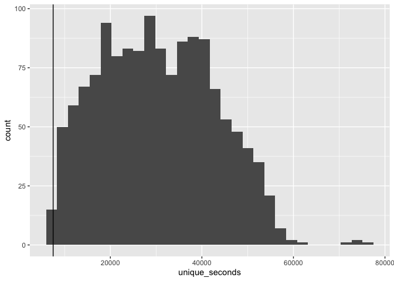
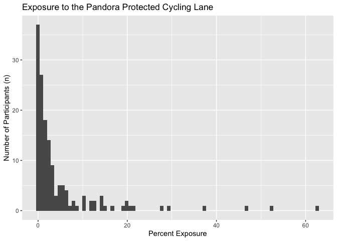
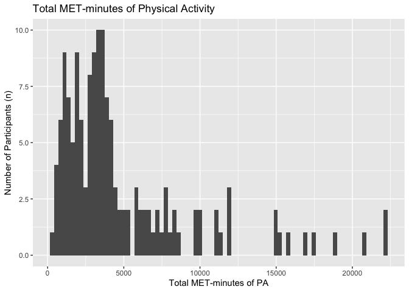
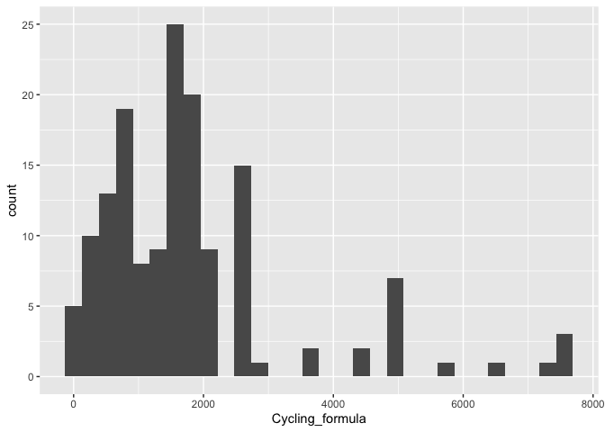

## Loading Packages

```r
library(lmtest)
```

```
## Loading required package: zoo
```

```
## 
## Attaching package: 'zoo'
```

```
## The following objects are masked from 'package:base':
## 
##     as.Date, as.Date.numeric
```

```r
library(tidyverse)
```

```
## ── Attaching packages ──────────────────────────────────────────────────────────────────────────────────────────────────── tidyverse 1.2.1 ──
```

```
## ✔ ggplot2 3.1.1     ✔ purrr   0.3.2
## ✔ tibble  2.1.1     ✔ dplyr   0.8.1
## ✔ tidyr   0.8.3     ✔ stringr 1.4.0
## ✔ readr   1.1.1     ✔ forcats 0.3.0
```

```
## ── Conflicts ─────────────────────────────────────────────────────────────────────────────────────────────────────── tidyverse_conflicts() ──
## ✖ dplyr::filter() masks stats::filter()
## ✖ dplyr::lag()    masks stats::lag()
```

```r
library(ggplot2)
library(haven)
library(janitor)
library(pastecs)
```

```
## 
## Attaching package: 'pastecs'
```

```
## The following objects are masked from 'package:dplyr':
## 
##     first, last
```

```
## The following object is masked from 'package:tidyr':
## 
##     extract
```

```r
library(psych)
```

```
## 
## Attaching package: 'psych'
```

```
## The following objects are masked from 'package:ggplot2':
## 
##     %+%, alpha
```

```r
library(car)
```

```
## Loading required package: carData
```

```
## 
## Attaching package: 'car'
```

```
## The following object is masked from 'package:psych':
## 
##     logit
```

```
## The following object is masked from 'package:dplyr':
## 
##     recode
```

```
## The following object is masked from 'package:purrr':
## 
##     some
```

```r
library(Hmisc)
```

```
## Loading required package: lattice
```

```
## Loading required package: survival
```

```
## Loading required package: Formula
```

```
## 
## Attaching package: 'Hmisc'
```

```
## The following object is masked from 'package:psych':
## 
##     describe
```

```
## The following objects are masked from 'package:dplyr':
## 
##     src, summarize
```

```
## The following objects are masked from 'package:base':
## 
##     format.pval, units
```

```r
library(ggm)
```

```
## Loading required package: igraph
```

```
## 
## Attaching package: 'igraph'
```

```
## The following objects are masked from 'package:dplyr':
## 
##     as_data_frame, groups, union
```

```
## The following objects are masked from 'package:purrr':
## 
##     compose, simplify
```

```
## The following object is masked from 'package:tidyr':
## 
##     crossing
```

```
## The following object is masked from 'package:tibble':
## 
##     as_data_frame
```

```
## The following objects are masked from 'package:stats':
## 
##     decompose, spectrum
```

```
## The following object is masked from 'package:base':
## 
##     union
```

```
## 
## Attaching package: 'ggm'
```

```
## The following object is masked from 'package:igraph':
## 
##     pa
```

```
## The following object is masked from 'package:Hmisc':
## 
##     rcorr
```

```r
library(polycor)
```

```
## 
## Attaching package: 'polycor'
```

```
## The following object is masked from 'package:psych':
## 
##     polyserial
```

```r
library(tableone)
library(forcats)
library(gmodels)
library(QuantPsyc)
```

```
## Loading required package: boot
```

```
## 
## Attaching package: 'boot'
```

```
## The following object is masked from 'package:survival':
## 
##     aml
```

```
## The following object is masked from 'package:lattice':
## 
##     melanoma
```

```
## The following object is masked from 'package:car':
## 
##     logit
```

```
## The following object is masked from 'package:psych':
## 
##     logit
```

```
## Loading required package: MASS
```

```
## 
## Attaching package: 'MASS'
```

```
## The following object is masked from 'package:dplyr':
## 
##     select
```

```
## 
## Attaching package: 'QuantPsyc'
```

```
## The following object is masked from 'package:base':
## 
##     norm
```

```r
library(KernSmooth)
```

```
## KernSmooth 2.23 loaded
## Copyright M. P. Wand 1997-2009
```

```r
library(raster)
```

```
## Loading required package: sp
```

```
## 
## Attaching package: 'raster'
```

```
## The following objects are masked from 'package:MASS':
## 
##     area, select
```

```
## The following objects are masked from 'package:Hmisc':
## 
##     mask, zoom
```

```
## The following object is masked from 'package:pastecs':
## 
##     extract
```

```
## The following object is masked from 'package:janitor':
## 
##     crosstab
```

```
## The following object is masked from 'package:dplyr':
## 
##     select
```

```
## The following object is masked from 'package:tidyr':
## 
##     extract
```

```r
library(sp)
library(sf)
```

```
## Linking to GEOS 3.6.1, GDAL 2.1.3, PROJ 4.9.3
```

```r
library(lubridate)
```

```
## 
## Attaching package: 'lubridate'
```

```
## The following object is masked from 'package:igraph':
## 
##     %--%
```

```
## The following object is masked from 'package:base':
## 
##     date
```

```r
library(anytime)
library(stringr)
library(stringi)
library(finalfit)
```

## Reading in Data to make sure timestamps code was right

```r
wear_time_stamps_updated_final <- read_csv("wear_time_stamps_updated_final.csv")
```

```
## Parsed with column specification:
## cols(
##   doy = col_integer(),
##   interact_id.y = col_integer(),
##   unique_days = col_integer(),
##   unique_seconds = col_integer(),
##   n_traces = col_integer(),
##   min_time = col_datetime(format = ""),
##   max_time = col_datetime(format = ""),
##   total_time = col_double(),
##   unique_hours = col_double(),
##   hours_per_day = col_double()
## )
```

```r
#wear_time_stamps <- read_csv("wear_time_stamps.csv")
#wear_time_stamps_updated <- read_csv("wear_time_stamps_updated.csv")
##everything looks great

colnames(wear_time_stamps_updated_final)[colnames(wear_time_stamps_updated_final)== "interact_id.y"] <- "interact_id"
```

## Reading in other data

```r
gps_join_all_percent_updated <- read_csv("gps_join_all_percent_updated.csv")
```

```
## Parsed with column specification:
## cols(
##   interact_id.y = col_integer(),
##   n.x = col_integer(),
##   n.y = col_integer(),
##   amount = col_double(),
##   percent = col_double()
## )
```

```r
victoria_gps_only <- read_csv("victoria_gps_only.csv")
```

```
## Parsed with column specification:
## cols(
##   .default = col_integer(),
##   date_of_survey.x = col_date(format = ""),
##   month = col_character(),
##   day = col_character(),
##   gender_vic.x = col_character(),
##   residence_cp = col_character(),
##   date_of_survey.y = col_date(format = ""),
##   preferred_mode_f_txt = col_character(),
##   car_share = col_character(),
##   car_share_txt = col_character(),
##   house_tenure_txt = col_character(),
##   dwelling_type_txt = col_character(),
##   living_arrange = col_character(),
##   living_arrange_txt = col_character(),
##   residence = col_date(format = ""),
##   group_id = col_character(),
##   gender_vic.y = col_character(),
##   sensedoc_ID = col_character(),
##   ethica_ID = col_character(),
##   age_categories = col_character(),
##   gender = col_character()
##   # ... with 27 more columns
## )
```

```
## See spec(...) for full column specifications.
```

```r
sd_days <- read_csv("all_sds_victoria_phase_1.csv")
```

```
## Parsed with column specification:
## cols(
##   `Sensedoc ID` = col_character(),
##   `Serial #` = col_character(),
##   `Dates Worn` = col_character(),
##   Notes = col_character()
## )
```

```r
weather_data <- read_csv("weather_data_1.csv")
```

```
## Parsed with column specification:
## cols(
##   .default = col_character(),
##   `Date/Time` = col_date(format = ""),
##   Year = col_integer(),
##   Month = col_integer(),
##   Day = col_integer(),
##   `Max Temp (°C)` = col_double(),
##   `Min Temp` = col_double(),
##   `Mean Temp` = col_double(),
##   `Heat Deg Days (°C)` = col_double(),
##   `Cool Deg Days (°C)` = col_double(),
##   `Total Rain (mm)` = col_double(),
##   `Total Snow (cm)` = col_double(),
##   `Total Precip (mm)` = col_double(),
##   `Snow on Grnd (cm)` = col_integer(),
##   `Snow on Grnd Flag` = col_logical(),
##   `Dir of Max Gust (10s deg)` = col_integer()
## )
## See spec(...) for full column specifications.
```

```r
doy_start_end_filtered <- read_csv("doy_start_end_filtered.csv")
```

```
## Parsed with column specification:
## cols(
##   interact_id = col_integer(),
##   gps_id = col_integer(),
##   doy = col_integer(),
##   doy_start = col_integer(),
##   doy_end = col_integer(),
##   unique_seconds = col_integer()
## )
```


## Total hours, number of days and average hours 

```r
wear_time_stamps_updated_final <- wear_time_stamps_updated_final %>% group_by(interact_id) %>% mutate(total_hours = sum(unique_hours))

wear_time_stamps_updated_final <- wear_time_stamps_updated_final %>% group_by(interact_id) %>% mutate(number_days = sum(unique_days))

wear_time_stamps_updated_final <- wear_time_stamps_updated_final %>% group_by(interact_id) %>% mutate(average_hours = total_hours/number_days)
```

## Weather data

```r
weather_data_updated <- weather_data %>% dplyr::select("Date/Time", "Year", "Month", "Day", "Mean Temp", "Total Precip (mm)")

weather_data_updated <- weather_data_updated %>% mutate(doy = lubridate::yday(`Date/Time`))

colnames(weather_data_updated)[colnames(weather_data_updated)== "Mean Temp"] <- "mean_temp"
colnames(weather_data_updated)[colnames(weather_data_updated)== "Total Precip (mm)"] <- "total_precip"

weather_time_stamps_1 <- left_join(wear_time_stamps_updated_final, weather_data_updated, by = "doy")

weather_time_stamps_2 <- weather_time_stamps_1 %>% group_by(interact_id) %>%
  mutate(mean_temp_date = mean(mean_temp, na.rm = TRUE),
           total_precip_date = sum(total_precip, na.rm = TRUE))

summary_wear_stamps  <- dplyr::select(weather_time_stamps_2, "interact_id", "total_hours", "number_days", "average_hours", "mean_temp_date", "total_precip_date") #creating a new data frame with just this info. Includes wear stamps and weather data

summary_wear_stamps <- summary_wear_stamps %>% distinct(interact_id, .keep_all = TRUE) #removes duplicates

write_csv(summary_wear_stamps, "summary_wear_stamps.csv")
```

## Wear time plots 

```r
histo_gps_points_updated <- ggplot(wear_time_stamps_updated_final) + 
                      geom_histogram(aes(unique_seconds)) + 
                      geom_vline(xintercept=7500)
plot(histo_gps_points_updated)
```

```
## `stat_bin()` using `bins = 30`. Pick better value with `binwidth`.
```

<!-- -->

```r
##plot is correct. No GPS days under 7500
```


## Renaming columns in exposure file and filtering for NA

```r
colnames(gps_join_all_percent_updated)[colnames(gps_join_all_percent_updated)== "interact_id.y"] <- "interact_id" #changing to interact_id to help make joining easier later
gps_join_all_percent_updated[is.na(gps_join_all_percent_updated <- gps_join_all_percent_updated)] <- 0 #converted NA's to zero to make merging easier. 

colnames(gps_join_all_percent_updated)[colnames(gps_join_all_percent_updated)== "n.x"] <- "total_points" 

colnames(gps_join_all_percent_updated)[colnames(gps_join_all_percent_updated)== "n.y"] <- "exposure_points" 
```

## Merge gps_join_all_percent_updated with victoria_gps_only 

```r
gps_join_all_percent_updated[, "interact_id"] <- apply(gps_join_all_percent_updated[, "interact_id"], 1, function(x) as.integer(x))
victoria_gps_only[, "interact_id"] <- apply(victoria_gps_only[, "interact_id"], 1, function(x) as.integer(x))
#converting to integar first so both interact_id are using the same data format

victoria_gps_only_merged <- left_join(victoria_gps_only, gps_join_all_percent_updated, by = "interact_id") #successfully merged 
```

## Recoding PA total and cycling PA for outlier 

```r
victoria_gps_only_merged$total_pa_met_formula[victoria_gps_only_merged$total_pa_met_formula == 29622.0] <- 22309
tabyl(victoria_gps_only_merged$Cycling_formula)
```

```
##  victoria_gps_only_merged$Cycling_formula  n     percent
##                                         0  4 0.026143791
##                                       120  1 0.006535948
##                                       180  3 0.019607843
##                                       300  2 0.013071895
##                                       360  5 0.032679739
##                                       420  2 0.013071895
##                                       480  2 0.013071895
##                                       540  2 0.013071895
##                                       600  6 0.039215686
##                                       630  1 0.006535948
##                                       720  8 0.052287582
##                                       750  3 0.019607843
##                                       810  1 0.006535948
##                                       840  1 0.006535948
##                                       900  6 0.039215686
##                                       960  2 0.013071895
##                                      1080  6 0.039215686
##                                      1200  1 0.006535948
##                                      1260  4 0.026143791
##                                      1350  5 0.032679739
##                                      1440 13 0.084967320
##                                      1470  1 0.006535948
##                                      1500  1 0.006535948
##                                      1560  1 0.006535948
##                                      1620  3 0.019607843
##                                      1680  7 0.045751634
##                                      1800 15 0.098039216
##                                      1890  5 0.032679739
##                                      1980  1 0.006535948
##                                      2160  8 0.052287582
##                                      2520 15 0.098039216
##                                      2880  1 0.006535948
##                                      3600  2 0.013071895
##                                      4320  2 0.013071895
##                                      5040  7 0.045751634
##                                      5760  1 0.006535948
##                                      6480  1 0.006535948
##                                      7200  1 0.006535948
##                                      7560  2 0.013071895
##                                     10080  1 0.006535948
```

```r
victoria_gps_only_merged$Cycling_formula[victoria_gps_only_merged$Cycling_formula == 10080] <- 7561
```

##Filtering for participants who GPS data isn't valid

```r
victoria_gps_only_merged_updated <- victoria_gps_only_merged %>% filter(total_points >= 0)

write_csv(victoria_gps_only_merged_updated, "victoria_gps_only_merged_updated.csv")
```

## Connect PA total and cycling PA with exposure data

```r
PA_total_and_cycling <- dplyr::select(victoria_gps_only_merged_updated, "interact_id", "Cycling_formula", "total_pa_met_formula", "proportion_PA", "total_points", "exposure_points", "amount", "percent")

write_csv(PA_total_and_cycling, "PA_total_and_cycling.csv")
```

## Filtering for file with just SD Days 

```r
doy_start_end_final <- doy_start_end_filtered %>% dplyr::select("interact_id", "gps_id", "doy_start", "doy_end")

victoria_gps_only_merged_updated_1 <- left_join(victoria_gps_only_merged_updated, doy_start_end_final, by = "interact_id")
write_csv(victoria_gps_only_merged_updated_1, "victoria_gps_only_merged_updated_1.csv")
```

## Reducing Data frame into a more manageable file

```r
victoria_small <- victoria_gps_only_merged_updated_1 %>% dplyr::select("interact_id", "sensedoc_ID", "ethica_ID", "gps_id.x", "residence_cp", "age_calculated", "age_categories", "gender", "health_status", "marital", "income_1", "income_2", "income_satisfy", "ethnicity", "born_canada", "children_1", "car_access", "transp_bikes_adults", "bike_safety",  "bike_freq_a", "bike_freq_b", "bike_freq_c", "bike_freq_d", "path_comf", "residential_street_comf", "res_street_traffic_calming_comf", "major_street_no_bike_lane", "major_street_bike_lane", "major_street_separated_bike_lane", "aaa_familiarity_1", "aaa_idea_1", "aaa_bike_more_1", "Cycling_formula", "total_pa_met_formula", "proportion_PA", "total_points", "exposure_points", "amount", "percent", "doy_start", "doy_end")

write_csv(victoria_small, "victoria_small.csv")

##merging summary time stamps with victoria small

victoria_small_merged <- left_join(victoria_small, summary_wear_stamps, by = "interact_id")

write_csv(victoria_small_merged, "victoria_small_merged.csv")
```

## Recoding and ordering variables for regression 

```r
victoria_small_merged <- victoria_small_merged %>% mutate(ethnicity_updated = case_when(
  ethnicity == "Caucasian" ~ "Caucasian",
  ethnicity == "Aboriginal" ~ "Racialized Group",
  ethnicity == "Asian" ~ "Racialized Group",
 ethnicity == "Latin American" ~ "Racialized Group",
  ethnicity == "Unknown" ~ "Racialized Group",
))

victoria_small_merged$income_2 <- factor(victoria_small_merged$income_2, c("$49,000 or less", "$50,000 to $99,999", "$100,000 to $149,999", "$150,000 or more", "I don't know/Prefer not to answer")) 

victoria_small_merged <- victoria_small_merged %>% mutate(gender_updated = case_when(
  gender == "Women" ~ "Women",
  gender == "Men" ~ "Men"
)) 
tabyl(victoria_small_merged$gender_updated)
```

```
##  victoria_small_merged$gender_updated  n    percent valid_percent
##                                   Men 71 0.47019868     0.4765101
##                                 Women 78 0.51655629     0.5234899
##                                  <NA>  2 0.01324503            NA
```

```r
victoria_small_merged <- victoria_small_merged %>% mutate (gender_check = case_when(
  gender == "Women" ~ 1,
  gender == "Men" ~ 1
))

victoria_small_merged_1 <- filter(victoria_small_merged, gender_check == 1) 

write_csv(victoria_small_merged_1, "victoria_small_merged_1.csv")
```

##Plotting exposure 

```r
exposure_plot <- ggplot(victoria_small_merged_1) + 
                      geom_density(aes(percent)) +
  labs(title = "Total Exposure",
       x = "Percent Exposure",
       y = "Percentage of Participants")
                
plot(exposure_plot)
```

<!-- -->

```r
summary(victoria_small_merged_1$percent)
```

```
##    Min. 1st Qu.  Median    Mean 3rd Qu.    Max. 
##   0.000   0.400   1.639   5.004   5.068  62.648
```

```r
sd(victoria_small_merged_1$percent)
```

```
## [1] 9.42698
```

```r
describeBy(victoria_small_merged_1$percent)
```

```
## Warning in describeBy(victoria_small_merged_1$percent): no grouping
## variable requested
```

```
##    vars   n mean   sd median trimmed  mad min   max range skew kurtosis
## X1    1 149    5 9.43   1.64    2.84 2.16   0 62.65 62.65 3.58       15
##      se
## X1 0.77
```

## Self-report PA stats

```r
summary(victoria_small_merged_1$total_pa_met_formula)
```

```
##    Min. 1st Qu.  Median    Mean 3rd Qu.    Max. 
##     408    1986    3450    4818    5932   22309
```

```r
sd(victoria_small_merged_1$total_pa_met_formula)
```

```
## [1] 4486.3
```

```r
describeBy(victoria_small_merged_1$total_pa_met_formula)
```

```
## Warning in describeBy(victoria_small_merged_1$total_pa_met_formula): no
## grouping variable requested
```

```
##    vars   n    mean     sd median trimmed     mad min   max range skew
## X1    1 149 4817.76 4486.3   3450  3969.8 2389.95 408 22309 21901 1.97
##    kurtosis     se
## X1      3.8 367.53
```

## Plotting outcome 

```r
pa_total_plot <- ggplot(victoria_small_merged_1) + 
                      geom_histogram(aes(total_pa_met_formula), bins = 60) +
  labs(title = "Total MET-minutes of Physical Activity",
       x = "Total MET-minutes of PA",
       y = "Percentage of Participants")
                
plot(pa_total_plot)
```

<!-- -->

```r
cycling_plot <- ggplot(PA_total_and_cycling) + 
                      geom_histogram(aes(Cycling_formula))
                
plot(cycling_plot)
```

```
## `stat_bin()` using `bins = 30`. Pick better value with `binwidth`.
```

<!-- -->

## GPS Wear Time 

```r
summary(victoria_small_merged_1$total_hours)
```

```
##    Min. 1st Qu.  Median    Mean 3rd Qu.    Max. 
##   7.406  57.066  80.848  77.452  97.601 140.328
```

```r
sd(victoria_small_merged_1$total_hours)
```

```
## [1] 29.37937
```

```r
summary(victoria_small_merged_1$number_days)
```

```
##    Min. 1st Qu.  Median    Mean 3rd Qu.    Max. 
##   2.000   9.000  10.000   9.221  10.000  13.000
```

```r
sd(victoria_small_merged_1$number_days)
```

```
## [1] 1.663786
```

```r
summary(victoria_small_merged_1$average_hours)
```

```
##    Min. 1st Qu.  Median    Mean 3rd Qu.    Max. 
##   2.368   6.473   8.284   8.175   9.760  14.033
```

```r
sd(victoria_small_merged_1$average_hours)
```

```
## [1] 2.430844
```


