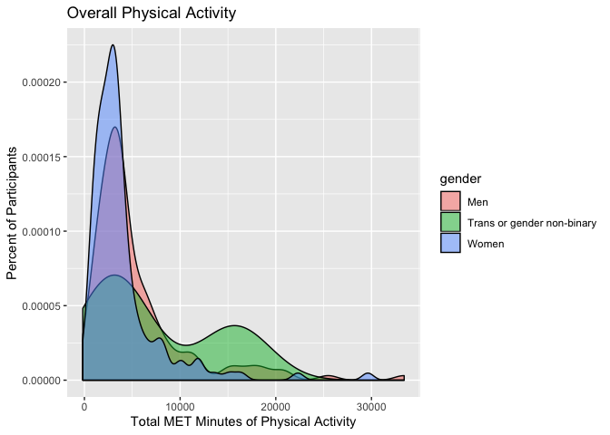
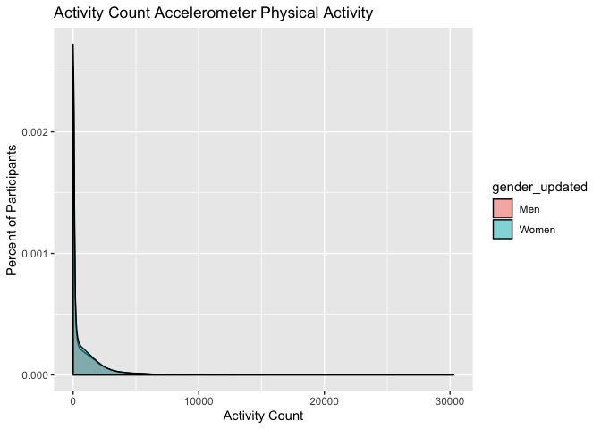

## Loading Packages

```r
library(lmtest)
```

```
## Loading required package: zoo
```

```
## 
## Attaching package: 'zoo'
```

```
## The following objects are masked from 'package:base':
## 
##     as.Date, as.Date.numeric
```

```r
library(tidyverse)
```

```
## ── Attaching packages ─────────────────────────────────────────────────────────────────────────────────── tidyverse 1.2.1 ──
```

```
## ✔ ggplot2 3.2.0     ✔ purrr   0.3.2
## ✔ tibble  2.1.3     ✔ dplyr   0.8.1
## ✔ tidyr   0.8.3     ✔ stringr 1.4.0
## ✔ readr   1.1.1     ✔ forcats 0.3.0
```

```
## ── Conflicts ────────────────────────────────────────────────────────────────────────────────────── tidyverse_conflicts() ──
## ✖ dplyr::filter() masks stats::filter()
## ✖ dplyr::lag()    masks stats::lag()
```

```r
library(ggplot2)
library(haven)
library(janitor)
library(pastecs)
```

```
## 
## Attaching package: 'pastecs'
```

```
## The following objects are masked from 'package:dplyr':
## 
##     first, last
```

```
## The following object is masked from 'package:tidyr':
## 
##     extract
```

```r
library(psych)
```

```
## 
## Attaching package: 'psych'
```

```
## The following objects are masked from 'package:ggplot2':
## 
##     %+%, alpha
```

```r
library(car)
```

```
## Loading required package: carData
```

```
## 
## Attaching package: 'car'
```

```
## The following object is masked from 'package:psych':
## 
##     logit
```

```
## The following object is masked from 'package:dplyr':
## 
##     recode
```

```
## The following object is masked from 'package:purrr':
## 
##     some
```

```r
library(Hmisc)
```

```
## Loading required package: lattice
```

```
## Loading required package: survival
```

```
## Loading required package: Formula
```

```
## 
## Attaching package: 'Hmisc'
```

```
## The following object is masked from 'package:psych':
## 
##     describe
```

```
## The following objects are masked from 'package:dplyr':
## 
##     src, summarize
```

```
## The following objects are masked from 'package:base':
## 
##     format.pval, units
```

```r
library(ggm)
```

```
## Loading required package: igraph
```

```
## 
## Attaching package: 'igraph'
```

```
## The following objects are masked from 'package:dplyr':
## 
##     as_data_frame, groups, union
```

```
## The following objects are masked from 'package:purrr':
## 
##     compose, simplify
```

```
## The following object is masked from 'package:tidyr':
## 
##     crossing
```

```
## The following object is masked from 'package:tibble':
## 
##     as_data_frame
```

```
## The following objects are masked from 'package:stats':
## 
##     decompose, spectrum
```

```
## The following object is masked from 'package:base':
## 
##     union
```

```
## 
## Attaching package: 'ggm'
```

```
## The following object is masked from 'package:igraph':
## 
##     pa
```

```
## The following object is masked from 'package:Hmisc':
## 
##     rcorr
```

```r
library(polycor)
```

```
## 
## Attaching package: 'polycor'
```

```
## The following object is masked from 'package:psych':
## 
##     polyserial
```

```r
library(tableone)
library(forcats)
library(gmodels)
library(QuantPsyc)
```

```
## Loading required package: boot
```

```
## 
## Attaching package: 'boot'
```

```
## The following object is masked from 'package:survival':
## 
##     aml
```

```
## The following object is masked from 'package:lattice':
## 
##     melanoma
```

```
## The following object is masked from 'package:car':
## 
##     logit
```

```
## The following object is masked from 'package:psych':
## 
##     logit
```

```
## Loading required package: MASS
```

```
## 
## Attaching package: 'MASS'
```

```
## The following object is masked from 'package:dplyr':
## 
##     select
```

```
## 
## Attaching package: 'QuantPsyc'
```

```
## The following object is masked from 'package:base':
## 
##     norm
```

```r
library(KernSmooth)
```

```
## KernSmooth 2.23 loaded
## Copyright M. P. Wand 1997-2009
```

```r
library(raster)
```

```
## Loading required package: sp
```

```
## 
## Attaching package: 'raster'
```

```
## The following objects are masked from 'package:MASS':
## 
##     area, select
```

```
## The following objects are masked from 'package:Hmisc':
## 
##     mask, zoom
```

```
## The following object is masked from 'package:pastecs':
## 
##     extract
```

```
## The following object is masked from 'package:janitor':
## 
##     crosstab
```

```
## The following object is masked from 'package:dplyr':
## 
##     select
```

```
## The following object is masked from 'package:tidyr':
## 
##     extract
```

```r
library(sp)
library(sf)
```

```
## Linking to GEOS 3.6.1, GDAL 2.1.3, PROJ 4.9.3
```

```r
library(data.table)
```

```
## 
## Attaching package: 'data.table'
```

```
## The following object is masked from 'package:raster':
## 
##     shift
```

```
## The following objects are masked from 'package:pastecs':
## 
##     first, last
```

```
## The following objects are masked from 'package:dplyr':
## 
##     between, first, last
```

```
## The following object is masked from 'package:purrr':
## 
##     transpose
```

## Plotting self-report PA by gender

```r
victoria_new_ID_gps <- read_csv("victoria_new_ID_gps.csv")
```

```
## Parsed with column specification:
## cols(
##   .default = col_integer(),
##   date_of_survey.x = col_date(format = ""),
##   month = col_character(),
##   day = col_character(),
##   gender_vic.x = col_character(),
##   residence_cp = col_character(),
##   date_of_survey.y = col_date(format = ""),
##   preferred_mode_f_txt = col_character(),
##   car_share = col_character(),
##   car_share_txt = col_character(),
##   house_tenure_txt = col_character(),
##   dwelling_type_txt = col_character(),
##   living_arrange = col_character(),
##   living_arrange_txt = col_character(),
##   residence = col_date(format = ""),
##   group_id = col_character(),
##   gender_vic.y = col_character(),
##   sensedoc_ID = col_character(),
##   ethica_ID = col_character(),
##   age_categories = col_character(),
##   gender = col_character()
##   # ... with 27 more columns
## )
```

```
## See spec(...) for full column specifications.
```

```r
tabyl(victoria_new_ID_gps$gender)
```

```
##  victoria_new_ID_gps$gender   n    percent
##                         Men 132 0.46975089
##  Trans or gender non-binary   3 0.01067616
##                       Women 146 0.51957295
```

```r
PA_plot <- ggplot (data = victoria_new_ID_gps, aes(total_pa_met_formula)) + 
    geom_density(aes(fill = gender), position = "dodge", alpha = 0.5) + 
      labs(title = "Overall Physical Activity", 
          x = "Total MET Minutes of Physical Activity", 
          y = "Percent of Participants")
plot(PA_plot)
```

```
## Warning: Removed 6 rows containing non-finite values (stat_density).
```

```
## Warning: Width not defined. Set with `position_dodge(width = ?)`
```

<!-- -->

## Plotting activity count PA by gender


```r
power_victoria_merged_filtered <- fread("power_victoria_merged_filtered.csv")

activity_count_plot <- ggplot (data = power_victoria_merged_filtered, aes(summary_count)) + 
    geom_density(aes(fill = gender_updated), position = "dodge", alpha = 0.5) + 
      labs(title = "Activity Count Accelerometer Physical Activity", 
          x = "Activity Count", 
          y = "Percent of Participants")
plot(activity_count_plot)
```

```
## Warning: Width not defined. Set with `position_dodge(width = ?)`
```

<!-- -->

## Plotting summary PA by gender

```r
summary_power_victoria_merged_filtered <- fread("summary_power_victoria_merged_filtered.csv")

summary_activity_count_plot <- ggplot (data = summary_power_victoria_merged_filtered, aes(total_pa)) + 
    geom_density(aes(fill = gender_updated), position = "dodge", alpha = 0.5) + 
      labs(title = "Summary Accelerometer Physical Activity", 
          x = "Activity Count", 
          y = "Percent of Participants")
plot(summary_activity_count_plot)
```

```
## Warning: Width not defined. Set with `position_dodge(width = ?)`
```

<!-- -->

## Plotting Moderate PA by gender

```r
moderate_pa_plot <- ggplot (data = summary_power_victoria_merged_filtered, aes(total_moderate)) + 
    geom_density(aes(fill = gender_updated), position = "dodge", alpha = 0.5) + 
      labs(title = "Summary Accelerometer Physical Activity", 
          x = "Activity Count", 
          y = "Percent of Participants")
plot(moderate_pa_plot)
```

```
## Warning: Width not defined. Set with `position_dodge(width = ?)`
```

<!-- -->

## Plotting vigorous PA by gender

```r
vigorous_pa_plot <- ggplot (data = summary_power_victoria_merged_filtered, aes(total_vigorous)) + 
    geom_density(aes(fill = gender_updated), position = "dodge", alpha = 0.5) + 
      labs(title = "Summary Accelerometer Physical Activity", 
          x = "Activity Count", 
          y = "Percent of Participants")
plot(vigorous_pa_plot)
```

```
## Warning: Width not defined. Set with `position_dodge(width = ?)`
```

<!-- -->

## Plotting light PA by gender

```r
light_pa_plot <- ggplot (data = summary_power_victoria_merged_filtered, aes(total_light)) + 
    geom_histogram(aes(fill = gender_updated), position = "dodge", alpha = 0.5) + 
      labs(title = "Summary Accelerometer Physical Activity", 
          x = "Activity Count", 
          y = "Percent of Participants")
plot(light_pa_plot)
```

```
## `stat_bin()` using `bins = 30`. Pick better value with `binwidth`.
```

<!-- -->

## PLotting Sedentary PA by gender

```r
sedentary_pa_plot <- ggplot (data = summary_power_victoria_merged_filtered, aes(total_sedentary)) + 
    geom_histogram(aes(fill = gender_updated), position = "dodge", alpha = 0.5) + 
      labs(title = "Summary Accelerometer Physical Activity", 
          x = "Activity Count", 
          y = "Percent of Participants")
plot(sedentary_pa_plot)
```

```
## `stat_bin()` using `bins = 30`. Pick better value with `binwidth`.
```

<!-- -->

