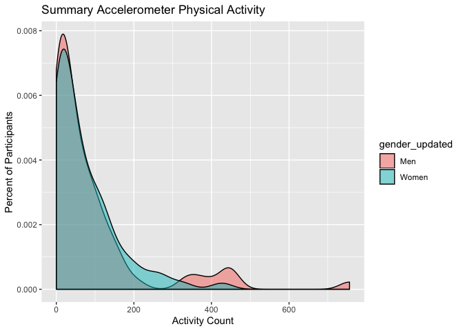
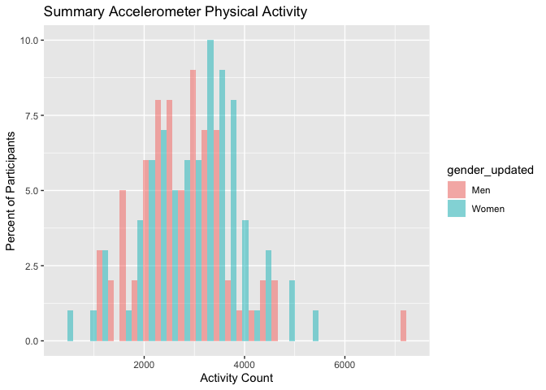

## Loading Packages

```r
library(lmtest)
```

```
## Loading required package: zoo
```

```
## 
## Attaching package: 'zoo'
```

```
## The following objects are masked from 'package:base':
## 
##     as.Date, as.Date.numeric
```

```r
library(tidyverse)
```

```
## ── Attaching packages ─────────────────────────────────────────────────────────────────────────────────── tidyverse 1.2.1 ──
```

```
## ✔ ggplot2 3.2.0     ✔ purrr   0.3.2
## ✔ tibble  2.1.3     ✔ dplyr   0.8.1
## ✔ tidyr   0.8.3     ✔ stringr 1.4.0
## ✔ readr   1.1.1     ✔ forcats 0.3.0
```

```
## ── Conflicts ────────────────────────────────────────────────────────────────────────────────────── tidyverse_conflicts() ──
## ✖ dplyr::filter() masks stats::filter()
## ✖ dplyr::lag()    masks stats::lag()
```

```r
library(ggplot2)
library(haven)
library(janitor)
library(pastecs)
```

```
## 
## Attaching package: 'pastecs'
```

```
## The following objects are masked from 'package:dplyr':
## 
##     first, last
```

```
## The following object is masked from 'package:tidyr':
## 
##     extract
```

```r
library(psych)
```

```
## 
## Attaching package: 'psych'
```

```
## The following objects are masked from 'package:ggplot2':
## 
##     %+%, alpha
```

```r
library(car)
```

```
## Loading required package: carData
```

```
## 
## Attaching package: 'car'
```

```
## The following object is masked from 'package:psych':
## 
##     logit
```

```
## The following object is masked from 'package:dplyr':
## 
##     recode
```

```
## The following object is masked from 'package:purrr':
## 
##     some
```

```r
library(Hmisc)
```

```
## Loading required package: lattice
```

```
## Loading required package: survival
```

```
## Loading required package: Formula
```

```
## 
## Attaching package: 'Hmisc'
```

```
## The following object is masked from 'package:psych':
## 
##     describe
```

```
## The following objects are masked from 'package:dplyr':
## 
##     src, summarize
```

```
## The following objects are masked from 'package:base':
## 
##     format.pval, units
```

```r
library(ggm)
```

```
## Loading required package: igraph
```

```
## 
## Attaching package: 'igraph'
```

```
## The following objects are masked from 'package:dplyr':
## 
##     as_data_frame, groups, union
```

```
## The following objects are masked from 'package:purrr':
## 
##     compose, simplify
```

```
## The following object is masked from 'package:tidyr':
## 
##     crossing
```

```
## The following object is masked from 'package:tibble':
## 
##     as_data_frame
```

```
## The following objects are masked from 'package:stats':
## 
##     decompose, spectrum
```

```
## The following object is masked from 'package:base':
## 
##     union
```

```
## 
## Attaching package: 'ggm'
```

```
## The following object is masked from 'package:igraph':
## 
##     pa
```

```
## The following object is masked from 'package:Hmisc':
## 
##     rcorr
```

```r
library(polycor)
```

```
## 
## Attaching package: 'polycor'
```

```
## The following object is masked from 'package:psych':
## 
##     polyserial
```

```r
library(tableone)
library(forcats)
library(gmodels)
library(QuantPsyc)
```

```
## Loading required package: boot
```

```
## 
## Attaching package: 'boot'
```

```
## The following object is masked from 'package:survival':
## 
##     aml
```

```
## The following object is masked from 'package:lattice':
## 
##     melanoma
```

```
## The following object is masked from 'package:car':
## 
##     logit
```

```
## The following object is masked from 'package:psych':
## 
##     logit
```

```
## Loading required package: MASS
```

```
## 
## Attaching package: 'MASS'
```

```
## The following object is masked from 'package:dplyr':
## 
##     select
```

```
## 
## Attaching package: 'QuantPsyc'
```

```
## The following object is masked from 'package:base':
## 
##     norm
```

```r
library(KernSmooth)
```

```
## KernSmooth 2.23 loaded
## Copyright M. P. Wand 1997-2009
```

```r
library(raster)
```

```
## Loading required package: sp
```

```
## 
## Attaching package: 'raster'
```

```
## The following objects are masked from 'package:MASS':
## 
##     area, select
```

```
## The following objects are masked from 'package:Hmisc':
## 
##     mask, zoom
```

```
## The following object is masked from 'package:pastecs':
## 
##     extract
```

```
## The following object is masked from 'package:janitor':
## 
##     crosstab
```

```
## The following object is masked from 'package:dplyr':
## 
##     select
```

```
## The following object is masked from 'package:tidyr':
## 
##     extract
```

```r
library(sp)
library(sf)
```

```
## Linking to GEOS 3.6.1, GDAL 2.1.3, PROJ 4.9.3
```

```r
library(data.table)
```

```
## 
## Attaching package: 'data.table'
```

```
## The following object is masked from 'package:raster':
## 
##     shift
```

```
## The following objects are masked from 'package:pastecs':
## 
##     first, last
```

```
## The following objects are masked from 'package:dplyr':
## 
##     between, first, last
```

```
## The following object is masked from 'package:purrr':
## 
##     transpose
```

## Reading in Data

```r
power_victoria_merged_updated <- fread("power_victoria_merged_updated.csv") #big file with all summary counts - 151
victoria_new_ID_gps <- read_csv("victoria_new_ID_gps.csv") #all survey participant data - 281
```

```
## Parsed with column specification:
## cols(
##   .default = col_integer(),
##   date_of_survey.x = col_date(format = ""),
##   month = col_character(),
##   day = col_character(),
##   gender_vic.x = col_character(),
##   residence_cp = col_character(),
##   date_of_survey.y = col_date(format = ""),
##   preferred_mode_f_txt = col_character(),
##   car_share = col_character(),
##   car_share_txt = col_character(),
##   house_tenure_txt = col_character(),
##   dwelling_type_txt = col_character(),
##   living_arrange = col_character(),
##   living_arrange_txt = col_character(),
##   residence = col_date(format = ""),
##   group_id = col_character(),
##   gender_vic.y = col_character(),
##   sensedoc_ID = col_character(),
##   ethica_ID = col_character(),
##   age_categories = col_character(),
##   gender = col_character()
##   # ... with 27 more columns
## )
```

```
## See spec(...) for full column specifications.
```

```r
victoria_small_merged_1 <- read_csv("victoria_small_merged_1.csv") #GPS participant survey data - 149
```

```
## Parsed with column specification:
## cols(
##   .default = col_character(),
##   interact_id = col_integer(),
##   gps_id.x = col_integer(),
##   age_calculated = col_integer(),
##   car_access = col_integer(),
##   transp_bikes_adults = col_integer(),
##   bike_safety = col_integer(),
##   bike_freq_a = col_integer(),
##   bike_freq_b = col_integer(),
##   bike_freq_c = col_integer(),
##   bike_freq_d = col_integer(),
##   Cycling_formula = col_integer(),
##   total_pa_met_formula = col_double(),
##   proportion_PA = col_double(),
##   total_points = col_integer(),
##   exposure_points = col_integer(),
##   amount = col_double(),
##   percent = col_double(),
##   doy_start = col_integer(),
##   doy_end = col_integer(),
##   total_hours = col_double()
##   # ... with 5 more columns
## )
## See spec(...) for full column specifications.
```

```r
power_victoria_merged_filtered <- fread("power_victoria_merged_filtered.csv") #summary counts for 149 participants
summary_power_victoria_merged_filtered <- fread("summary_power_victoria_merged_filtered.csv")
```


```r
describeBy(victoria_new_ID_gps$age_calculated, victoria_new_ID_gps$gender)
```

```
## 
##  Descriptive statistics by group 
## group: Men
##    vars   n  mean    sd median trimmed   mad min max range skew kurtosis
## X1    1 132 45.75 13.92     44   45.16 15.57  21  79    58 0.31    -0.79
##      se
## X1 1.21
## -------------------------------------------------------- 
## group: Trans or gender non-binary
##    vars n mean    sd median trimmed  mad min max range  skew kurtosis   se
## X1    1 3   44 12.17     50      44 2.97  30  52    22 -0.37    -2.33 7.02
## -------------------------------------------------------- 
## group: Women
##    vars   n  mean    sd median trimmed   mad min max range skew kurtosis
## X1    1 146 42.86 12.91   40.5   42.37 14.08  21  71    50 0.36    -1.04
##      se
## X1 1.07
```

## Plotting self-report PA by gender

```r
tabyl(victoria_new_ID_gps$gender)
```

```
##  victoria_new_ID_gps$gender   n    percent
##                         Men 132 0.46975089
##  Trans or gender non-binary   3 0.01067616
##                       Women 146 0.51957295
```

```r
PA_plot <- ggplot (data = victoria_new_ID_gps, aes(total_pa_met_formula)) + 
    geom_histogram(aes(fill = gender), position = "dodge", alpha = 0.5) + 
      labs(title = "Overall Physical Activity", 
          x = "Total MET Minutes of Physical Activity", 
          y = "Percent of Participants")
plot(PA_plot)
```

```
## `stat_bin()` using `bins = 30`. Pick better value with `binwidth`.
```

```
## Warning: Removed 6 rows containing non-finite values (stat_bin).
```

<!-- -->

```r
CrossTable(victoria_new_ID_gps$total_pa_met_formula, victoria_new_ID_gps$gender)
```

```
## 
##  
##    Cell Contents
## |-------------------------|
## |                       N |
## | Chi-square contribution |
## |           N / Row Total |
## |           N / Col Total |
## |         N / Table Total |
## |-------------------------|
## 
##  
## Total Observations in Table:  275 
## 
##  
##                                          | victoria_new_ID_gps$gender 
## victoria_new_ID_gps$total_pa_met_formula |                        Men | Trans or gender non-binary |                      Women |                  Row Total | 
## -----------------------------------------|----------------------------|----------------------------|----------------------------|----------------------------|
##                                     -168 |                          0 |                          0 |                          1 |                          1 | 
##                                          |                      0.480 |                      0.011 |                      0.473 |                            | 
##                                          |                      0.000 |                      0.000 |                      1.000 |                      0.004 | 
##                                          |                      0.000 |                      0.000 |                      0.007 |                            | 
##                                          |                      0.000 |                      0.000 |                      0.004 |                            | 
## -----------------------------------------|----------------------------|----------------------------|----------------------------|----------------------------|
##                                      192 |                          1 |                          0 |                          0 |                          1 | 
##                                          |                      0.563 |                      0.011 |                      0.509 |                            | 
##                                          |                      1.000 |                      0.000 |                      0.000 |                      0.004 | 
##                                          |                      0.008 |                      0.000 |                      0.000 |                            | 
##                                          |                      0.004 |                      0.000 |                      0.000 |                            | 
## -----------------------------------------|----------------------------|----------------------------|----------------------------|----------------------------|
##                                      408 |                          1 |                          0 |                          0 |                          1 | 
##                                          |                      0.563 |                      0.011 |                      0.509 |                            | 
##                                          |                      1.000 |                      0.000 |                      0.000 |                      0.004 | 
##                                          |                      0.008 |                      0.000 |                      0.000 |                            | 
##                                          |                      0.004 |                      0.000 |                      0.000 |                            | 
## -----------------------------------------|----------------------------|----------------------------|----------------------------|----------------------------|
##                                      525 |                          1 |                          0 |                          0 |                          1 | 
##                                          |                      0.563 |                      0.011 |                      0.509 |                            | 
##                                          |                      1.000 |                      0.000 |                      0.000 |                      0.004 | 
##                                          |                      0.008 |                      0.000 |                      0.000 |                            | 
##                                          |                      0.004 |                      0.000 |                      0.000 |                            | 
## -----------------------------------------|----------------------------|----------------------------|----------------------------|----------------------------|
##                                      568 |                          0 |                          0 |                          1 |                          1 | 
##                                          |                      0.480 |                      0.011 |                      0.473 |                            | 
##                                          |                      0.000 |                      0.000 |                      1.000 |                      0.004 | 
##                                          |                      0.000 |                      0.000 |                      0.007 |                            | 
##                                          |                      0.000 |                      0.000 |                      0.004 |                            | 
## -----------------------------------------|----------------------------|----------------------------|----------------------------|----------------------------|
##                                      570 |                          0 |                          0 |                          1 |                          1 | 
##                                          |                      0.480 |                      0.011 |                      0.473 |                            | 
##                                          |                      0.000 |                      0.000 |                      1.000 |                      0.004 | 
##                                          |                      0.000 |                      0.000 |                      0.007 |                            | 
##                                          |                      0.000 |                      0.000 |                      0.004 |                            | 
## -----------------------------------------|----------------------------|----------------------------|----------------------------|----------------------------|
##                                      582 |                          0 |                          0 |                          1 |                          1 | 
##                                          |                      0.480 |                      0.011 |                      0.473 |                            | 
##                                          |                      0.000 |                      0.000 |                      1.000 |                      0.004 | 
##                                          |                      0.000 |                      0.000 |                      0.007 |                            | 
##                                          |                      0.000 |                      0.000 |                      0.004 |                            | 
## -----------------------------------------|----------------------------|----------------------------|----------------------------|----------------------------|
##                                      670 |                          0 |                          0 |                          1 |                          1 | 
##                                          |                      0.480 |                      0.011 |                      0.473 |                            | 
##                                          |                      0.000 |                      0.000 |                      1.000 |                      0.004 | 
##                                          |                      0.000 |                      0.000 |                      0.007 |                            | 
##                                          |                      0.000 |                      0.000 |                      0.004 |                            | 
## -----------------------------------------|----------------------------|----------------------------|----------------------------|----------------------------|
##                                      690 |                          1 |                          0 |                          0 |                          1 | 
##                                          |                      0.563 |                      0.011 |                      0.509 |                            | 
##                                          |                      1.000 |                      0.000 |                      0.000 |                      0.004 | 
##                                          |                      0.008 |                      0.000 |                      0.000 |                            | 
##                                          |                      0.004 |                      0.000 |                      0.000 |                            | 
## -----------------------------------------|----------------------------|----------------------------|----------------------------|----------------------------|
##                                      729 |                          1 |                          0 |                          1 |                          2 | 
##                                          |                      0.002 |                      0.022 |                      0.000 |                            | 
##                                          |                      0.500 |                      0.000 |                      0.500 |                      0.007 | 
##                                          |                      0.008 |                      0.000 |                      0.007 |                            | 
##                                          |                      0.004 |                      0.000 |                      0.004 |                            | 
## -----------------------------------------|----------------------------|----------------------------|----------------------------|----------------------------|
##                                      742 |                          0 |                          0 |                          1 |                          1 | 
##                                          |                      0.480 |                      0.011 |                      0.473 |                            | 
##                                          |                      0.000 |                      0.000 |                      1.000 |                      0.004 | 
##                                          |                      0.000 |                      0.000 |                      0.007 |                            | 
##                                          |                      0.000 |                      0.000 |                      0.004 |                            | 
## -----------------------------------------|----------------------------|----------------------------|----------------------------|----------------------------|
##                                      798 |                          0 |                          0 |                          1 |                          1 | 
##                                          |                      0.480 |                      0.011 |                      0.473 |                            | 
##                                          |                      0.000 |                      0.000 |                      1.000 |                      0.004 | 
##                                          |                      0.000 |                      0.000 |                      0.007 |                            | 
##                                          |                      0.000 |                      0.000 |                      0.004 |                            | 
## -----------------------------------------|----------------------------|----------------------------|----------------------------|----------------------------|
##                                      800 |                          0 |                          0 |                          1 |                          1 | 
##                                          |                      0.480 |                      0.011 |                      0.473 |                            | 
##                                          |                      0.000 |                      0.000 |                      1.000 |                      0.004 | 
##                                          |                      0.000 |                      0.000 |                      0.007 |                            | 
##                                          |                      0.000 |                      0.000 |                      0.004 |                            | 
## -----------------------------------------|----------------------------|----------------------------|----------------------------|----------------------------|
##                                      904 |                          0 |                          0 |                          1 |                          1 | 
##                                          |                      0.480 |                      0.011 |                      0.473 |                            | 
##                                          |                      0.000 |                      0.000 |                      1.000 |                      0.004 | 
##                                          |                      0.000 |                      0.000 |                      0.007 |                            | 
##                                          |                      0.000 |                      0.000 |                      0.004 |                            | 
## -----------------------------------------|----------------------------|----------------------------|----------------------------|----------------------------|
##                                      907 |                          1 |                          0 |                          0 |                          1 | 
##                                          |                      0.563 |                      0.011 |                      0.509 |                            | 
##                                          |                      1.000 |                      0.000 |                      0.000 |                      0.004 | 
##                                          |                      0.008 |                      0.000 |                      0.000 |                            | 
##                                          |                      0.004 |                      0.000 |                      0.000 |                            | 
## -----------------------------------------|----------------------------|----------------------------|----------------------------|----------------------------|
##                                      912 |                          0 |                          0 |                          1 |                          1 | 
##                                          |                      0.480 |                      0.011 |                      0.473 |                            | 
##                                          |                      0.000 |                      0.000 |                      1.000 |                      0.004 | 
##                                          |                      0.000 |                      0.000 |                      0.007 |                            | 
##                                          |                      0.000 |                      0.000 |                      0.004 |                            | 
## -----------------------------------------|----------------------------|----------------------------|----------------------------|----------------------------|
##                                      963 |                          0 |                          0 |                          1 |                          1 | 
##                                          |                      0.480 |                      0.011 |                      0.473 |                            | 
##                                          |                      0.000 |                      0.000 |                      1.000 |                      0.004 | 
##                                          |                      0.000 |                      0.000 |                      0.007 |                            | 
##                                          |                      0.000 |                      0.000 |                      0.004 |                            | 
## -----------------------------------------|----------------------------|----------------------------|----------------------------|----------------------------|
##                                      996 |                          1 |                          0 |                          1 |                          2 | 
##                                          |                      0.002 |                      0.022 |                      0.000 |                            | 
##                                          |                      0.500 |                      0.000 |                      0.500 |                      0.007 | 
##                                          |                      0.008 |                      0.000 |                      0.007 |                            | 
##                                          |                      0.004 |                      0.000 |                      0.004 |                            | 
## -----------------------------------------|----------------------------|----------------------------|----------------------------|----------------------------|
##                                     1032 |                          1 |                          0 |                          0 |                          1 | 
##                                          |                      0.563 |                      0.011 |                      0.509 |                            | 
##                                          |                      1.000 |                      0.000 |                      0.000 |                      0.004 | 
##                                          |                      0.008 |                      0.000 |                      0.000 |                            | 
##                                          |                      0.004 |                      0.000 |                      0.000 |                            | 
## -----------------------------------------|----------------------------|----------------------------|----------------------------|----------------------------|
##                                     1058 |                          0 |                          0 |                          1 |                          1 | 
##                                          |                      0.480 |                      0.011 |                      0.473 |                            | 
##                                          |                      0.000 |                      0.000 |                      1.000 |                      0.004 | 
##                                          |                      0.000 |                      0.000 |                      0.007 |                            | 
##                                          |                      0.000 |                      0.000 |                      0.004 |                            | 
## -----------------------------------------|----------------------------|----------------------------|----------------------------|----------------------------|
##                                     1081 |                          0 |                          0 |                          1 |                          1 | 
##                                          |                      0.480 |                      0.011 |                      0.473 |                            | 
##                                          |                      0.000 |                      0.000 |                      1.000 |                      0.004 | 
##                                          |                      0.000 |                      0.000 |                      0.007 |                            | 
##                                          |                      0.000 |                      0.000 |                      0.004 |                            | 
## -----------------------------------------|----------------------------|----------------------------|----------------------------|----------------------------|
##                                     1110 |                          0 |                          0 |                          1 |                          1 | 
##                                          |                      0.480 |                      0.011 |                      0.473 |                            | 
##                                          |                      0.000 |                      0.000 |                      1.000 |                      0.004 | 
##                                          |                      0.000 |                      0.000 |                      0.007 |                            | 
##                                          |                      0.000 |                      0.000 |                      0.004 |                            | 
## -----------------------------------------|----------------------------|----------------------------|----------------------------|----------------------------|
##                                     1164 |                          0 |                          0 |                          1 |                          1 | 
##                                          |                      0.480 |                      0.011 |                      0.473 |                            | 
##                                          |                      0.000 |                      0.000 |                      1.000 |                      0.004 | 
##                                          |                      0.000 |                      0.000 |                      0.007 |                            | 
##                                          |                      0.000 |                      0.000 |                      0.004 |                            | 
## -----------------------------------------|----------------------------|----------------------------|----------------------------|----------------------------|
##                                     1182 |                          1 |                          0 |                          0 |                          1 | 
##                                          |                      0.563 |                      0.011 |                      0.509 |                            | 
##                                          |                      1.000 |                      0.000 |                      0.000 |                      0.004 | 
##                                          |                      0.008 |                      0.000 |                      0.000 |                            | 
##                                          |                      0.004 |                      0.000 |                      0.000 |                            | 
## -----------------------------------------|----------------------------|----------------------------|----------------------------|----------------------------|
##                                     1191 |                          1 |                          0 |                          0 |                          1 | 
##                                          |                      0.563 |                      0.011 |                      0.509 |                            | 
##                                          |                      1.000 |                      0.000 |                      0.000 |                      0.004 | 
##                                          |                      0.008 |                      0.000 |                      0.000 |                            | 
##                                          |                      0.004 |                      0.000 |                      0.000 |                            | 
## -----------------------------------------|----------------------------|----------------------------|----------------------------|----------------------------|
##                                     1209 |                          1 |                          0 |                          0 |                          1 | 
##                                          |                      0.563 |                      0.011 |                      0.509 |                            | 
##                                          |                      1.000 |                      0.000 |                      0.000 |                      0.004 | 
##                                          |                      0.008 |                      0.000 |                      0.000 |                            | 
##                                          |                      0.004 |                      0.000 |                      0.000 |                            | 
## -----------------------------------------|----------------------------|----------------------------|----------------------------|----------------------------|
##                                     1212 |                          0 |                          0 |                          1 |                          1 | 
##                                          |                      0.480 |                      0.011 |                      0.473 |                            | 
##                                          |                      0.000 |                      0.000 |                      1.000 |                      0.004 | 
##                                          |                      0.000 |                      0.000 |                      0.007 |                            | 
##                                          |                      0.000 |                      0.000 |                      0.004 |                            | 
## -----------------------------------------|----------------------------|----------------------------|----------------------------|----------------------------|
##                                     1230 |                          0 |                          0 |                          1 |                          1 | 
##                                          |                      0.480 |                      0.011 |                      0.473 |                            | 
##                                          |                      0.000 |                      0.000 |                      1.000 |                      0.004 | 
##                                          |                      0.000 |                      0.000 |                      0.007 |                            | 
##                                          |                      0.000 |                      0.000 |                      0.004 |                            | 
## -----------------------------------------|----------------------------|----------------------------|----------------------------|----------------------------|
##                                     1236 |                          0 |                          0 |                          1 |                          1 | 
##                                          |                      0.480 |                      0.011 |                      0.473 |                            | 
##                                          |                      0.000 |                      0.000 |                      1.000 |                      0.004 | 
##                                          |                      0.000 |                      0.000 |                      0.007 |                            | 
##                                          |                      0.000 |                      0.000 |                      0.004 |                            | 
## -----------------------------------------|----------------------------|----------------------------|----------------------------|----------------------------|
##                                   1236.5 |                          0 |                          0 |                          1 |                          1 | 
##                                          |                      0.480 |                      0.011 |                      0.473 |                            | 
##                                          |                      0.000 |                      0.000 |                      1.000 |                      0.004 | 
##                                          |                      0.000 |                      0.000 |                      0.007 |                            | 
##                                          |                      0.000 |                      0.000 |                      0.004 |                            | 
## -----------------------------------------|----------------------------|----------------------------|----------------------------|----------------------------|
##                                     1272 |                          0 |                          0 |                          1 |                          1 | 
##                                          |                      0.480 |                      0.011 |                      0.473 |                            | 
##                                          |                      0.000 |                      0.000 |                      1.000 |                      0.004 | 
##                                          |                      0.000 |                      0.000 |                      0.007 |                            | 
##                                          |                      0.000 |                      0.000 |                      0.004 |                            | 
## -----------------------------------------|----------------------------|----------------------------|----------------------------|----------------------------|
##                                     1310 |                          0 |                          0 |                          1 |                          1 | 
##                                          |                      0.480 |                      0.011 |                      0.473 |                            | 
##                                          |                      0.000 |                      0.000 |                      1.000 |                      0.004 | 
##                                          |                      0.000 |                      0.000 |                      0.007 |                            | 
##                                          |                      0.000 |                      0.000 |                      0.004 |                            | 
## -----------------------------------------|----------------------------|----------------------------|----------------------------|----------------------------|
##                                     1366 |                          1 |                          0 |                          0 |                          1 | 
##                                          |                      0.563 |                      0.011 |                      0.509 |                            | 
##                                          |                      1.000 |                      0.000 |                      0.000 |                      0.004 | 
##                                          |                      0.008 |                      0.000 |                      0.000 |                            | 
##                                          |                      0.004 |                      0.000 |                      0.000 |                            | 
## -----------------------------------------|----------------------------|----------------------------|----------------------------|----------------------------|
##                                     1380 |                          1 |                          0 |                          0 |                          1 | 
##                                          |                      0.563 |                      0.011 |                      0.509 |                            | 
##                                          |                      1.000 |                      0.000 |                      0.000 |                      0.004 | 
##                                          |                      0.008 |                      0.000 |                      0.000 |                            | 
##                                          |                      0.004 |                      0.000 |                      0.000 |                            | 
## -----------------------------------------|----------------------------|----------------------------|----------------------------|----------------------------|
##                                     1401 |                          0 |                          0 |                          1 |                          1 | 
##                                          |                      0.480 |                      0.011 |                      0.473 |                            | 
##                                          |                      0.000 |                      0.000 |                      1.000 |                      0.004 | 
##                                          |                      0.000 |                      0.000 |                      0.007 |                            | 
##                                          |                      0.000 |                      0.000 |                      0.004 |                            | 
## -----------------------------------------|----------------------------|----------------------------|----------------------------|----------------------------|
##                                     1444 |                          0 |                          0 |                          1 |                          1 | 
##                                          |                      0.480 |                      0.011 |                      0.473 |                            | 
##                                          |                      0.000 |                      0.000 |                      1.000 |                      0.004 | 
##                                          |                      0.000 |                      0.000 |                      0.007 |                            | 
##                                          |                      0.000 |                      0.000 |                      0.004 |                            | 
## -----------------------------------------|----------------------------|----------------------------|----------------------------|----------------------------|
##                                     1452 |                          1 |                          0 |                          0 |                          1 | 
##                                          |                      0.563 |                      0.011 |                      0.509 |                            | 
##                                          |                      1.000 |                      0.000 |                      0.000 |                      0.004 | 
##                                          |                      0.008 |                      0.000 |                      0.000 |                            | 
##                                          |                      0.004 |                      0.000 |                      0.000 |                            | 
## -----------------------------------------|----------------------------|----------------------------|----------------------------|----------------------------|
##                                     1465 |                          0 |                          0 |                          1 |                          1 | 
##                                          |                      0.480 |                      0.011 |                      0.473 |                            | 
##                                          |                      0.000 |                      0.000 |                      1.000 |                      0.004 | 
##                                          |                      0.000 |                      0.000 |                      0.007 |                            | 
##                                          |                      0.000 |                      0.000 |                      0.004 |                            | 
## -----------------------------------------|----------------------------|----------------------------|----------------------------|----------------------------|
##                                     1516 |                          1 |                          0 |                          0 |                          1 | 
##                                          |                      0.563 |                      0.011 |                      0.509 |                            | 
##                                          |                      1.000 |                      0.000 |                      0.000 |                      0.004 | 
##                                          |                      0.008 |                      0.000 |                      0.000 |                            | 
##                                          |                      0.004 |                      0.000 |                      0.000 |                            | 
## -----------------------------------------|----------------------------|----------------------------|----------------------------|----------------------------|
##                                     1554 |                          0 |                          0 |                          1 |                          1 | 
##                                          |                      0.480 |                      0.011 |                      0.473 |                            | 
##                                          |                      0.000 |                      0.000 |                      1.000 |                      0.004 | 
##                                          |                      0.000 |                      0.000 |                      0.007 |                            | 
##                                          |                      0.000 |                      0.000 |                      0.004 |                            | 
## -----------------------------------------|----------------------------|----------------------------|----------------------------|----------------------------|
##                                     1578 |                          1 |                          0 |                          0 |                          1 | 
##                                          |                      0.563 |                      0.011 |                      0.509 |                            | 
##                                          |                      1.000 |                      0.000 |                      0.000 |                      0.004 | 
##                                          |                      0.008 |                      0.000 |                      0.000 |                            | 
##                                          |                      0.004 |                      0.000 |                      0.000 |                            | 
## -----------------------------------------|----------------------------|----------------------------|----------------------------|----------------------------|
##                                     1602 |                          1 |                          0 |                          0 |                          1 | 
##                                          |                      0.563 |                      0.011 |                      0.509 |                            | 
##                                          |                      1.000 |                      0.000 |                      0.000 |                      0.004 | 
##                                          |                      0.008 |                      0.000 |                      0.000 |                            | 
##                                          |                      0.004 |                      0.000 |                      0.000 |                            | 
## -----------------------------------------|----------------------------|----------------------------|----------------------------|----------------------------|
##                                     1632 |                          2 |                          0 |                          0 |                          2 | 
##                                          |                      1.127 |                      0.022 |                      1.018 |                            | 
##                                          |                      1.000 |                      0.000 |                      0.000 |                      0.007 | 
##                                          |                      0.015 |                      0.000 |                      0.000 |                            | 
##                                          |                      0.007 |                      0.000 |                      0.000 |                            | 
## -----------------------------------------|----------------------------|----------------------------|----------------------------|----------------------------|
##                                     1656 |                          1 |                          0 |                          0 |                          1 | 
##                                          |                      0.563 |                      0.011 |                      0.509 |                            | 
##                                          |                      1.000 |                      0.000 |                      0.000 |                      0.004 | 
##                                          |                      0.008 |                      0.000 |                      0.000 |                            | 
##                                          |                      0.004 |                      0.000 |                      0.000 |                            | 
## -----------------------------------------|----------------------------|----------------------------|----------------------------|----------------------------|
##                                     1668 |                          0 |                          0 |                          1 |                          1 | 
##                                          |                      0.480 |                      0.011 |                      0.473 |                            | 
##                                          |                      0.000 |                      0.000 |                      1.000 |                      0.004 | 
##                                          |                      0.000 |                      0.000 |                      0.007 |                            | 
##                                          |                      0.000 |                      0.000 |                      0.004 |                            | 
## -----------------------------------------|----------------------------|----------------------------|----------------------------|----------------------------|
##                                     1690 |                          1 |                          0 |                          0 |                          1 | 
##                                          |                      0.563 |                      0.011 |                      0.509 |                            | 
##                                          |                      1.000 |                      0.000 |                      0.000 |                      0.004 | 
##                                          |                      0.008 |                      0.000 |                      0.000 |                            | 
##                                          |                      0.004 |                      0.000 |                      0.000 |                            | 
## -----------------------------------------|----------------------------|----------------------------|----------------------------|----------------------------|
##                                     1694 |                          0 |                          0 |                          1 |                          1 | 
##                                          |                      0.480 |                      0.011 |                      0.473 |                            | 
##                                          |                      0.000 |                      0.000 |                      1.000 |                      0.004 | 
##                                          |                      0.000 |                      0.000 |                      0.007 |                            | 
##                                          |                      0.000 |                      0.000 |                      0.004 |                            | 
## -----------------------------------------|----------------------------|----------------------------|----------------------------|----------------------------|
##                                   1716.5 |                          0 |                          0 |                          1 |                          1 | 
##                                          |                      0.480 |                      0.011 |                      0.473 |                            | 
##                                          |                      0.000 |                      0.000 |                      1.000 |                      0.004 | 
##                                          |                      0.000 |                      0.000 |                      0.007 |                            | 
##                                          |                      0.000 |                      0.000 |                      0.004 |                            | 
## -----------------------------------------|----------------------------|----------------------------|----------------------------|----------------------------|
##                                     1764 |                          1 |                          0 |                          0 |                          1 | 
##                                          |                      0.563 |                      0.011 |                      0.509 |                            | 
##                                          |                      1.000 |                      0.000 |                      0.000 |                      0.004 | 
##                                          |                      0.008 |                      0.000 |                      0.000 |                            | 
##                                          |                      0.004 |                      0.000 |                      0.000 |                            | 
## -----------------------------------------|----------------------------|----------------------------|----------------------------|----------------------------|
##                                     1776 |                          0 |                          0 |                          1 |                          1 | 
##                                          |                      0.480 |                      0.011 |                      0.473 |                            | 
##                                          |                      0.000 |                      0.000 |                      1.000 |                      0.004 | 
##                                          |                      0.000 |                      0.000 |                      0.007 |                            | 
##                                          |                      0.000 |                      0.000 |                      0.004 |                            | 
## -----------------------------------------|----------------------------|----------------------------|----------------------------|----------------------------|
##                                   1780.5 |                          0 |                          0 |                          1 |                          1 | 
##                                          |                      0.480 |                      0.011 |                      0.473 |                            | 
##                                          |                      0.000 |                      0.000 |                      1.000 |                      0.004 | 
##                                          |                      0.000 |                      0.000 |                      0.007 |                            | 
##                                          |                      0.000 |                      0.000 |                      0.004 |                            | 
## -----------------------------------------|----------------------------|----------------------------|----------------------------|----------------------------|
##                                     1838 |                          0 |                          0 |                          1 |                          1 | 
##                                          |                      0.480 |                      0.011 |                      0.473 |                            | 
##                                          |                      0.000 |                      0.000 |                      1.000 |                      0.004 | 
##                                          |                      0.000 |                      0.000 |                      0.007 |                            | 
##                                          |                      0.000 |                      0.000 |                      0.004 |                            | 
## -----------------------------------------|----------------------------|----------------------------|----------------------------|----------------------------|
##                                     1866 |                          1 |                          0 |                          0 |                          1 | 
##                                          |                      0.563 |                      0.011 |                      0.509 |                            | 
##                                          |                      1.000 |                      0.000 |                      0.000 |                      0.004 | 
##                                          |                      0.008 |                      0.000 |                      0.000 |                            | 
##                                          |                      0.004 |                      0.000 |                      0.000 |                            | 
## -----------------------------------------|----------------------------|----------------------------|----------------------------|----------------------------|
##                                     1886 |                          0 |                          0 |                          1 |                          1 | 
##                                          |                      0.480 |                      0.011 |                      0.473 |                            | 
##                                          |                      0.000 |                      0.000 |                      1.000 |                      0.004 | 
##                                          |                      0.000 |                      0.000 |                      0.007 |                            | 
##                                          |                      0.000 |                      0.000 |                      0.004 |                            | 
## -----------------------------------------|----------------------------|----------------------------|----------------------------|----------------------------|
##                                     1892 |                          0 |                          0 |                          1 |                          1 | 
##                                          |                      0.480 |                      0.011 |                      0.473 |                            | 
##                                          |                      0.000 |                      0.000 |                      1.000 |                      0.004 | 
##                                          |                      0.000 |                      0.000 |                      0.007 |                            | 
##                                          |                      0.000 |                      0.000 |                      0.004 |                            | 
## -----------------------------------------|----------------------------|----------------------------|----------------------------|----------------------------|
##                                     1907 |                          0 |                          0 |                          1 |                          1 | 
##                                          |                      0.480 |                      0.011 |                      0.473 |                            | 
##                                          |                      0.000 |                      0.000 |                      1.000 |                      0.004 | 
##                                          |                      0.000 |                      0.000 |                      0.007 |                            | 
##                                          |                      0.000 |                      0.000 |                      0.004 |                            | 
## -----------------------------------------|----------------------------|----------------------------|----------------------------|----------------------------|
##                                     1910 |                          0 |                          0 |                          1 |                          1 | 
##                                          |                      0.480 |                      0.011 |                      0.473 |                            | 
##                                          |                      0.000 |                      0.000 |                      1.000 |                      0.004 | 
##                                          |                      0.000 |                      0.000 |                      0.007 |                            | 
##                                          |                      0.000 |                      0.000 |                      0.004 |                            | 
## -----------------------------------------|----------------------------|----------------------------|----------------------------|----------------------------|
##                                     1913 |                          0 |                          0 |                          1 |                          1 | 
##                                          |                      0.480 |                      0.011 |                      0.473 |                            | 
##                                          |                      0.000 |                      0.000 |                      1.000 |                      0.004 | 
##                                          |                      0.000 |                      0.000 |                      0.007 |                            | 
##                                          |                      0.000 |                      0.000 |                      0.004 |                            | 
## -----------------------------------------|----------------------------|----------------------------|----------------------------|----------------------------|
##                                     1951 |                          0 |                          0 |                          1 |                          1 | 
##                                          |                      0.480 |                      0.011 |                      0.473 |                            | 
##                                          |                      0.000 |                      0.000 |                      1.000 |                      0.004 | 
##                                          |                      0.000 |                      0.000 |                      0.007 |                            | 
##                                          |                      0.000 |                      0.000 |                      0.004 |                            | 
## -----------------------------------------|----------------------------|----------------------------|----------------------------|----------------------------|
##                                     1968 |                          0 |                          0 |                          1 |                          1 | 
##                                          |                      0.480 |                      0.011 |                      0.473 |                            | 
##                                          |                      0.000 |                      0.000 |                      1.000 |                      0.004 | 
##                                          |                      0.000 |                      0.000 |                      0.007 |                            | 
##                                          |                      0.000 |                      0.000 |                      0.004 |                            | 
## -----------------------------------------|----------------------------|----------------------------|----------------------------|----------------------------|
##                                     1972 |                          1 |                          0 |                          0 |                          1 | 
##                                          |                      0.563 |                      0.011 |                      0.509 |                            | 
##                                          |                      1.000 |                      0.000 |                      0.000 |                      0.004 | 
##                                          |                      0.008 |                      0.000 |                      0.000 |                            | 
##                                          |                      0.004 |                      0.000 |                      0.000 |                            | 
## -----------------------------------------|----------------------------|----------------------------|----------------------------|----------------------------|
##                                   1986.5 |                          0 |                          0 |                          1 |                          1 | 
##                                          |                      0.480 |                      0.011 |                      0.473 |                            | 
##                                          |                      0.000 |                      0.000 |                      1.000 |                      0.004 | 
##                                          |                      0.000 |                      0.000 |                      0.007 |                            | 
##                                          |                      0.000 |                      0.000 |                      0.004 |                            | 
## -----------------------------------------|----------------------------|----------------------------|----------------------------|----------------------------|
##                                     1992 |                          0 |                          0 |                          1 |                          1 | 
##                                          |                      0.480 |                      0.011 |                      0.473 |                            | 
##                                          |                      0.000 |                      0.000 |                      1.000 |                      0.004 | 
##                                          |                      0.000 |                      0.000 |                      0.007 |                            | 
##                                          |                      0.000 |                      0.000 |                      0.004 |                            | 
## -----------------------------------------|----------------------------|----------------------------|----------------------------|----------------------------|
##                                     2021 |                          0 |                          0 |                          1 |                          1 | 
##                                          |                      0.480 |                      0.011 |                      0.473 |                            | 
##                                          |                      0.000 |                      0.000 |                      1.000 |                      0.004 | 
##                                          |                      0.000 |                      0.000 |                      0.007 |                            | 
##                                          |                      0.000 |                      0.000 |                      0.004 |                            | 
## -----------------------------------------|----------------------------|----------------------------|----------------------------|----------------------------|
##                                     2056 |                          1 |                          0 |                          0 |                          1 | 
##                                          |                      0.563 |                      0.011 |                      0.509 |                            | 
##                                          |                      1.000 |                      0.000 |                      0.000 |                      0.004 | 
##                                          |                      0.008 |                      0.000 |                      0.000 |                            | 
##                                          |                      0.004 |                      0.000 |                      0.000 |                            | 
## -----------------------------------------|----------------------------|----------------------------|----------------------------|----------------------------|
##                                     2065 |                          0 |                          0 |                          1 |                          1 | 
##                                          |                      0.480 |                      0.011 |                      0.473 |                            | 
##                                          |                      0.000 |                      0.000 |                      1.000 |                      0.004 | 
##                                          |                      0.000 |                      0.000 |                      0.007 |                            | 
##                                          |                      0.000 |                      0.000 |                      0.004 |                            | 
## -----------------------------------------|----------------------------|----------------------------|----------------------------|----------------------------|
##                                   2073.5 |                          1 |                          0 |                          0 |                          1 | 
##                                          |                      0.563 |                      0.011 |                      0.509 |                            | 
##                                          |                      1.000 |                      0.000 |                      0.000 |                      0.004 | 
##                                          |                      0.008 |                      0.000 |                      0.000 |                            | 
##                                          |                      0.004 |                      0.000 |                      0.000 |                            | 
## -----------------------------------------|----------------------------|----------------------------|----------------------------|----------------------------|
##                                   2146.5 |                          1 |                          0 |                          0 |                          1 | 
##                                          |                      0.563 |                      0.011 |                      0.509 |                            | 
##                                          |                      1.000 |                      0.000 |                      0.000 |                      0.004 | 
##                                          |                      0.008 |                      0.000 |                      0.000 |                            | 
##                                          |                      0.004 |                      0.000 |                      0.000 |                            | 
## -----------------------------------------|----------------------------|----------------------------|----------------------------|----------------------------|
##                                     2164 |                          0 |                          0 |                          1 |                          1 | 
##                                          |                      0.480 |                      0.011 |                      0.473 |                            | 
##                                          |                      0.000 |                      0.000 |                      1.000 |                      0.004 | 
##                                          |                      0.000 |                      0.000 |                      0.007 |                            | 
##                                          |                      0.000 |                      0.000 |                      0.004 |                            | 
## -----------------------------------------|----------------------------|----------------------------|----------------------------|----------------------------|
##                                     2170 |                          1 |                          0 |                          0 |                          1 | 
##                                          |                      0.563 |                      0.011 |                      0.509 |                            | 
##                                          |                      1.000 |                      0.000 |                      0.000 |                      0.004 | 
##                                          |                      0.008 |                      0.000 |                      0.000 |                            | 
##                                          |                      0.004 |                      0.000 |                      0.000 |                            | 
## -----------------------------------------|----------------------------|----------------------------|----------------------------|----------------------------|
##                                     2182 |                          1 |                          0 |                          0 |                          1 | 
##                                          |                      0.563 |                      0.011 |                      0.509 |                            | 
##                                          |                      1.000 |                      0.000 |                      0.000 |                      0.004 | 
##                                          |                      0.008 |                      0.000 |                      0.000 |                            | 
##                                          |                      0.004 |                      0.000 |                      0.000 |                            | 
## -----------------------------------------|----------------------------|----------------------------|----------------------------|----------------------------|
##                                   2192.5 |                          1 |                          0 |                          0 |                          1 | 
##                                          |                      0.563 |                      0.011 |                      0.509 |                            | 
##                                          |                      1.000 |                      0.000 |                      0.000 |                      0.004 | 
##                                          |                      0.008 |                      0.000 |                      0.000 |                            | 
##                                          |                      0.004 |                      0.000 |                      0.000 |                            | 
## -----------------------------------------|----------------------------|----------------------------|----------------------------|----------------------------|
##                                     2203 |                          0 |                          1 |                          0 |                          1 | 
##                                          |                      0.480 |                     89.678 |                      0.509 |                            | 
##                                          |                      0.000 |                      1.000 |                      0.000 |                      0.004 | 
##                                          |                      0.000 |                      0.333 |                      0.000 |                            | 
##                                          |                      0.000 |                      0.004 |                      0.000 |                            | 
## -----------------------------------------|----------------------------|----------------------------|----------------------------|----------------------------|
##                                     2248 |                          0 |                          0 |                          1 |                          1 | 
##                                          |                      0.480 |                      0.011 |                      0.473 |                            | 
##                                          |                      0.000 |                      0.000 |                      1.000 |                      0.004 | 
##                                          |                      0.000 |                      0.000 |                      0.007 |                            | 
##                                          |                      0.000 |                      0.000 |                      0.004 |                            | 
## -----------------------------------------|----------------------------|----------------------------|----------------------------|----------------------------|
##                                     2260 |                          0 |                          0 |                          1 |                          1 | 
##                                          |                      0.480 |                      0.011 |                      0.473 |                            | 
##                                          |                      0.000 |                      0.000 |                      1.000 |                      0.004 | 
##                                          |                      0.000 |                      0.000 |                      0.007 |                            | 
##                                          |                      0.000 |                      0.000 |                      0.004 |                            | 
## -----------------------------------------|----------------------------|----------------------------|----------------------------|----------------------------|
##                                     2264 |                          0 |                          0 |                          1 |                          1 | 
##                                          |                      0.480 |                      0.011 |                      0.473 |                            | 
##                                          |                      0.000 |                      0.000 |                      1.000 |                      0.004 | 
##                                          |                      0.000 |                      0.000 |                      0.007 |                            | 
##                                          |                      0.000 |                      0.000 |                      0.004 |                            | 
## -----------------------------------------|----------------------------|----------------------------|----------------------------|----------------------------|
##                                     2341 |                          0 |                          0 |                          1 |                          1 | 
##                                          |                      0.480 |                      0.011 |                      0.473 |                            | 
##                                          |                      0.000 |                      0.000 |                      1.000 |                      0.004 | 
##                                          |                      0.000 |                      0.000 |                      0.007 |                            | 
##                                          |                      0.000 |                      0.000 |                      0.004 |                            | 
## -----------------------------------------|----------------------------|----------------------------|----------------------------|----------------------------|
##                                     2356 |                          1 |                          0 |                          0 |                          1 | 
##                                          |                      0.563 |                      0.011 |                      0.509 |                            | 
##                                          |                      1.000 |                      0.000 |                      0.000 |                      0.004 | 
##                                          |                      0.008 |                      0.000 |                      0.000 |                            | 
##                                          |                      0.004 |                      0.000 |                      0.000 |                            | 
## -----------------------------------------|----------------------------|----------------------------|----------------------------|----------------------------|
##                                     2390 |                          1 |                          0 |                          0 |                          1 | 
##                                          |                      0.563 |                      0.011 |                      0.509 |                            | 
##                                          |                      1.000 |                      0.000 |                      0.000 |                      0.004 | 
##                                          |                      0.008 |                      0.000 |                      0.000 |                            | 
##                                          |                      0.004 |                      0.000 |                      0.000 |                            | 
## -----------------------------------------|----------------------------|----------------------------|----------------------------|----------------------------|
##                                     2400 |                          1 |                          0 |                          0 |                          1 | 
##                                          |                      0.563 |                      0.011 |                      0.509 |                            | 
##                                          |                      1.000 |                      0.000 |                      0.000 |                      0.004 | 
##                                          |                      0.008 |                      0.000 |                      0.000 |                            | 
##                                          |                      0.004 |                      0.000 |                      0.000 |                            | 
## -----------------------------------------|----------------------------|----------------------------|----------------------------|----------------------------|
##                                   2410.5 |                          1 |                          0 |                          0 |                          1 | 
##                                          |                      0.563 |                      0.011 |                      0.509 |                            | 
##                                          |                      1.000 |                      0.000 |                      0.000 |                      0.004 | 
##                                          |                      0.008 |                      0.000 |                      0.000 |                            | 
##                                          |                      0.004 |                      0.000 |                      0.000 |                            | 
## -----------------------------------------|----------------------------|----------------------------|----------------------------|----------------------------|
##                                   2435.5 |                          0 |                          0 |                          1 |                          1 | 
##                                          |                      0.480 |                      0.011 |                      0.473 |                            | 
##                                          |                      0.000 |                      0.000 |                      1.000 |                      0.004 | 
##                                          |                      0.000 |                      0.000 |                      0.007 |                            | 
##                                          |                      0.000 |                      0.000 |                      0.004 |                            | 
## -----------------------------------------|----------------------------|----------------------------|----------------------------|----------------------------|
##                                     2443 |                          0 |                          0 |                          1 |                          1 | 
##                                          |                      0.480 |                      0.011 |                      0.473 |                            | 
##                                          |                      0.000 |                      0.000 |                      1.000 |                      0.004 | 
##                                          |                      0.000 |                      0.000 |                      0.007 |                            | 
##                                          |                      0.000 |                      0.000 |                      0.004 |                            | 
## -----------------------------------------|----------------------------|----------------------------|----------------------------|----------------------------|
##                                     2506 |                          0 |                          0 |                          1 |                          1 | 
##                                          |                      0.480 |                      0.011 |                      0.473 |                            | 
##                                          |                      0.000 |                      0.000 |                      1.000 |                      0.004 | 
##                                          |                      0.000 |                      0.000 |                      0.007 |                            | 
##                                          |                      0.000 |                      0.000 |                      0.004 |                            | 
## -----------------------------------------|----------------------------|----------------------------|----------------------------|----------------------------|
##                                     2532 |                          0 |                          0 |                          1 |                          1 | 
##                                          |                      0.480 |                      0.011 |                      0.473 |                            | 
##                                          |                      0.000 |                      0.000 |                      1.000 |                      0.004 | 
##                                          |                      0.000 |                      0.000 |                      0.007 |                            | 
##                                          |                      0.000 |                      0.000 |                      0.004 |                            | 
## -----------------------------------------|----------------------------|----------------------------|----------------------------|----------------------------|
##                                     2562 |                          1 |                          0 |                          0 |                          1 | 
##                                          |                      0.563 |                      0.011 |                      0.509 |                            | 
##                                          |                      1.000 |                      0.000 |                      0.000 |                      0.004 | 
##                                          |                      0.008 |                      0.000 |                      0.000 |                            | 
##                                          |                      0.004 |                      0.000 |                      0.000 |                            | 
## -----------------------------------------|----------------------------|----------------------------|----------------------------|----------------------------|
##                                     2586 |                          1 |                          0 |                          0 |                          1 | 
##                                          |                      0.563 |                      0.011 |                      0.509 |                            | 
##                                          |                      1.000 |                      0.000 |                      0.000 |                      0.004 | 
##                                          |                      0.008 |                      0.000 |                      0.000 |                            | 
##                                          |                      0.004 |                      0.000 |                      0.000 |                            | 
## -----------------------------------------|----------------------------|----------------------------|----------------------------|----------------------------|
##                                   2599.5 |                          0 |                          0 |                          1 |                          1 | 
##                                          |                      0.480 |                      0.011 |                      0.473 |                            | 
##                                          |                      0.000 |                      0.000 |                      1.000 |                      0.004 | 
##                                          |                      0.000 |                      0.000 |                      0.007 |                            | 
##                                          |                      0.000 |                      0.000 |                      0.004 |                            | 
## -----------------------------------------|----------------------------|----------------------------|----------------------------|----------------------------|
##                                     2617 |                          1 |                          0 |                          0 |                          1 | 
##                                          |                      0.563 |                      0.011 |                      0.509 |                            | 
##                                          |                      1.000 |                      0.000 |                      0.000 |                      0.004 | 
##                                          |                      0.008 |                      0.000 |                      0.000 |                            | 
##                                          |                      0.004 |                      0.000 |                      0.000 |                            | 
## -----------------------------------------|----------------------------|----------------------------|----------------------------|----------------------------|
##                                     2671 |                          0 |                          0 |                          1 |                          1 | 
##                                          |                      0.480 |                      0.011 |                      0.473 |                            | 
##                                          |                      0.000 |                      0.000 |                      1.000 |                      0.004 | 
##                                          |                      0.000 |                      0.000 |                      0.007 |                            | 
##                                          |                      0.000 |                      0.000 |                      0.004 |                            | 
## -----------------------------------------|----------------------------|----------------------------|----------------------------|----------------------------|
##                                     2688 |                          0 |                          0 |                          1 |                          1 | 
##                                          |                      0.480 |                      0.011 |                      0.473 |                            | 
##                                          |                      0.000 |                      0.000 |                      1.000 |                      0.004 | 
##                                          |                      0.000 |                      0.000 |                      0.007 |                            | 
##                                          |                      0.000 |                      0.000 |                      0.004 |                            | 
## -----------------------------------------|----------------------------|----------------------------|----------------------------|----------------------------|
##                                     2710 |                          0 |                          0 |                          1 |                          1 | 
##                                          |                      0.480 |                      0.011 |                      0.473 |                            | 
##                                          |                      0.000 |                      0.000 |                      1.000 |                      0.004 | 
##                                          |                      0.000 |                      0.000 |                      0.007 |                            | 
##                                          |                      0.000 |                      0.000 |                      0.004 |                            | 
## -----------------------------------------|----------------------------|----------------------------|----------------------------|----------------------------|
##                                     2712 |                          1 |                          0 |                          0 |                          1 | 
##                                          |                      0.563 |                      0.011 |                      0.509 |                            | 
##                                          |                      1.000 |                      0.000 |                      0.000 |                      0.004 | 
##                                          |                      0.008 |                      0.000 |                      0.000 |                            | 
##                                          |                      0.004 |                      0.000 |                      0.000 |                            | 
## -----------------------------------------|----------------------------|----------------------------|----------------------------|----------------------------|
##                                     2732 |                          1 |                          0 |                          0 |                          1 | 
##                                          |                      0.563 |                      0.011 |                      0.509 |                            | 
##                                          |                      1.000 |                      0.000 |                      0.000 |                      0.004 | 
##                                          |                      0.008 |                      0.000 |                      0.000 |                            | 
##                                          |                      0.004 |                      0.000 |                      0.000 |                            | 
## -----------------------------------------|----------------------------|----------------------------|----------------------------|----------------------------|
##                                     2744 |                          1 |                          0 |                          0 |                          1 | 
##                                          |                      0.563 |                      0.011 |                      0.509 |                            | 
##                                          |                      1.000 |                      0.000 |                      0.000 |                      0.004 | 
##                                          |                      0.008 |                      0.000 |                      0.000 |                            | 
##                                          |                      0.004 |                      0.000 |                      0.000 |                            | 
## -----------------------------------------|----------------------------|----------------------------|----------------------------|----------------------------|
##                                     2762 |                          0 |                          0 |                          1 |                          1 | 
##                                          |                      0.480 |                      0.011 |                      0.473 |                            | 
##                                          |                      0.000 |                      0.000 |                      1.000 |                      0.004 | 
##                                          |                      0.000 |                      0.000 |                      0.007 |                            | 
##                                          |                      0.000 |                      0.000 |                      0.004 |                            | 
## -----------------------------------------|----------------------------|----------------------------|----------------------------|----------------------------|
##                                     2768 |                          1 |                          0 |                          0 |                          1 | 
##                                          |                      0.563 |                      0.011 |                      0.509 |                            | 
##                                          |                      1.000 |                      0.000 |                      0.000 |                      0.004 | 
##                                          |                      0.008 |                      0.000 |                      0.000 |                            | 
##                                          |                      0.004 |                      0.000 |                      0.000 |                            | 
## -----------------------------------------|----------------------------|----------------------------|----------------------------|----------------------------|
##                                     2776 |                          0 |                          0 |                          1 |                          1 | 
##                                          |                      0.480 |                      0.011 |                      0.473 |                            | 
##                                          |                      0.000 |                      0.000 |                      1.000 |                      0.004 | 
##                                          |                      0.000 |                      0.000 |                      0.007 |                            | 
##                                          |                      0.000 |                      0.000 |                      0.004 |                            | 
## -----------------------------------------|----------------------------|----------------------------|----------------------------|----------------------------|
##                                     2784 |                          0 |                          0 |                          1 |                          1 | 
##                                          |                      0.480 |                      0.011 |                      0.473 |                            | 
##                                          |                      0.000 |                      0.000 |                      1.000 |                      0.004 | 
##                                          |                      0.000 |                      0.000 |                      0.007 |                            | 
##                                          |                      0.000 |                      0.000 |                      0.004 |                            | 
## -----------------------------------------|----------------------------|----------------------------|----------------------------|----------------------------|
##                                     2788 |                          0 |                          0 |                          1 |                          1 | 
##                                          |                      0.480 |                      0.011 |                      0.473 |                            | 
##                                          |                      0.000 |                      0.000 |                      1.000 |                      0.004 | 
##                                          |                      0.000 |                      0.000 |                      0.007 |                            | 
##                                          |                      0.000 |                      0.000 |                      0.004 |                            | 
## -----------------------------------------|----------------------------|----------------------------|----------------------------|----------------------------|
##                                     2790 |                          1 |                          0 |                          1 |                          2 | 
##                                          |                      0.002 |                      0.022 |                      0.000 |                            | 
##                                          |                      0.500 |                      0.000 |                      0.500 |                      0.007 | 
##                                          |                      0.008 |                      0.000 |                      0.007 |                            | 
##                                          |                      0.004 |                      0.000 |                      0.004 |                            | 
## -----------------------------------------|----------------------------|----------------------------|----------------------------|----------------------------|
##                                     2798 |                          1 |                          0 |                          0 |                          1 | 
##                                          |                      0.563 |                      0.011 |                      0.509 |                            | 
##                                          |                      1.000 |                      0.000 |                      0.000 |                      0.004 | 
##                                          |                      0.008 |                      0.000 |                      0.000 |                            | 
##                                          |                      0.004 |                      0.000 |                      0.000 |                            | 
## -----------------------------------------|----------------------------|----------------------------|----------------------------|----------------------------|
##                                     2806 |                          0 |                          0 |                          1 |                          1 | 
##                                          |                      0.480 |                      0.011 |                      0.473 |                            | 
##                                          |                      0.000 |                      0.000 |                      1.000 |                      0.004 | 
##                                          |                      0.000 |                      0.000 |                      0.007 |                            | 
##                                          |                      0.000 |                      0.000 |                      0.004 |                            | 
## -----------------------------------------|----------------------------|----------------------------|----------------------------|----------------------------|
##                                   2829.5 |                          0 |                          0 |                          1 |                          1 | 
##                                          |                      0.480 |                      0.011 |                      0.473 |                            | 
##                                          |                      0.000 |                      0.000 |                      1.000 |                      0.004 | 
##                                          |                      0.000 |                      0.000 |                      0.007 |                            | 
##                                          |                      0.000 |                      0.000 |                      0.004 |                            | 
## -----------------------------------------|----------------------------|----------------------------|----------------------------|----------------------------|
##                                     2922 |                          1 |                          0 |                          0 |                          1 | 
##                                          |                      0.563 |                      0.011 |                      0.509 |                            | 
##                                          |                      1.000 |                      0.000 |                      0.000 |                      0.004 | 
##                                          |                      0.008 |                      0.000 |                      0.000 |                            | 
##                                          |                      0.004 |                      0.000 |                      0.000 |                            | 
## -----------------------------------------|----------------------------|----------------------------|----------------------------|----------------------------|
##                                     2930 |                          0 |                          0 |                          1 |                          1 | 
##                                          |                      0.480 |                      0.011 |                      0.473 |                            | 
##                                          |                      0.000 |                      0.000 |                      1.000 |                      0.004 | 
##                                          |                      0.000 |                      0.000 |                      0.007 |                            | 
##                                          |                      0.000 |                      0.000 |                      0.004 |                            | 
## -----------------------------------------|----------------------------|----------------------------|----------------------------|----------------------------|
##                                     2947 |                          0 |                          0 |                          1 |                          1 | 
##                                          |                      0.480 |                      0.011 |                      0.473 |                            | 
##                                          |                      0.000 |                      0.000 |                      1.000 |                      0.004 | 
##                                          |                      0.000 |                      0.000 |                      0.007 |                            | 
##                                          |                      0.000 |                      0.000 |                      0.004 |                            | 
## -----------------------------------------|----------------------------|----------------------------|----------------------------|----------------------------|
##                                     2949 |                          0 |                          0 |                          1 |                          1 | 
##                                          |                      0.480 |                      0.011 |                      0.473 |                            | 
##                                          |                      0.000 |                      0.000 |                      1.000 |                      0.004 | 
##                                          |                      0.000 |                      0.000 |                      0.007 |                            | 
##                                          |                      0.000 |                      0.000 |                      0.004 |                            | 
## -----------------------------------------|----------------------------|----------------------------|----------------------------|----------------------------|
##                                     2954 |                          0 |                          0 |                          1 |                          1 | 
##                                          |                      0.480 |                      0.011 |                      0.473 |                            | 
##                                          |                      0.000 |                      0.000 |                      1.000 |                      0.004 | 
##                                          |                      0.000 |                      0.000 |                      0.007 |                            | 
##                                          |                      0.000 |                      0.000 |                      0.004 |                            | 
## -----------------------------------------|----------------------------|----------------------------|----------------------------|----------------------------|
##                                     2985 |                          0 |                          0 |                          1 |                          1 | 
##                                          |                      0.480 |                      0.011 |                      0.473 |                            | 
##                                          |                      0.000 |                      0.000 |                      1.000 |                      0.004 | 
##                                          |                      0.000 |                      0.000 |                      0.007 |                            | 
##                                          |                      0.000 |                      0.000 |                      0.004 |                            | 
## -----------------------------------------|----------------------------|----------------------------|----------------------------|----------------------------|
##                                     3012 |                          0 |                          0 |                          1 |                          1 | 
##                                          |                      0.480 |                      0.011 |                      0.473 |                            | 
##                                          |                      0.000 |                      0.000 |                      1.000 |                      0.004 | 
##                                          |                      0.000 |                      0.000 |                      0.007 |                            | 
##                                          |                      0.000 |                      0.000 |                      0.004 |                            | 
## -----------------------------------------|----------------------------|----------------------------|----------------------------|----------------------------|
##                                   3031.5 |                          0 |                          0 |                          1 |                          1 | 
##                                          |                      0.480 |                      0.011 |                      0.473 |                            | 
##                                          |                      0.000 |                      0.000 |                      1.000 |                      0.004 | 
##                                          |                      0.000 |                      0.000 |                      0.007 |                            | 
##                                          |                      0.000 |                      0.000 |                      0.004 |                            | 
## -----------------------------------------|----------------------------|----------------------------|----------------------------|----------------------------|
##                                     3050 |                          0 |                          0 |                          1 |                          1 | 
##                                          |                      0.480 |                      0.011 |                      0.473 |                            | 
##                                          |                      0.000 |                      0.000 |                      1.000 |                      0.004 | 
##                                          |                      0.000 |                      0.000 |                      0.007 |                            | 
##                                          |                      0.000 |                      0.000 |                      0.004 |                            | 
## -----------------------------------------|----------------------------|----------------------------|----------------------------|----------------------------|
##                                     3068 |                          1 |                          0 |                          0 |                          1 | 
##                                          |                      0.563 |                      0.011 |                      0.509 |                            | 
##                                          |                      1.000 |                      0.000 |                      0.000 |                      0.004 | 
##                                          |                      0.008 |                      0.000 |                      0.000 |                            | 
##                                          |                      0.004 |                      0.000 |                      0.000 |                            | 
## -----------------------------------------|----------------------------|----------------------------|----------------------------|----------------------------|
##                                     3074 |                          0 |                          0 |                          1 |                          1 | 
##                                          |                      0.480 |                      0.011 |                      0.473 |                            | 
##                                          |                      0.000 |                      0.000 |                      1.000 |                      0.004 | 
##                                          |                      0.000 |                      0.000 |                      0.007 |                            | 
##                                          |                      0.000 |                      0.000 |                      0.004 |                            | 
## -----------------------------------------|----------------------------|----------------------------|----------------------------|----------------------------|
##                                     3080 |                          1 |                          0 |                          0 |                          1 | 
##                                          |                      0.563 |                      0.011 |                      0.509 |                            | 
##                                          |                      1.000 |                      0.000 |                      0.000 |                      0.004 | 
##                                          |                      0.008 |                      0.000 |                      0.000 |                            | 
##                                          |                      0.004 |                      0.000 |                      0.000 |                            | 
## -----------------------------------------|----------------------------|----------------------------|----------------------------|----------------------------|
##                                     3082 |                          0 |                          0 |                          1 |                          1 | 
##                                          |                      0.480 |                      0.011 |                      0.473 |                            | 
##                                          |                      0.000 |                      0.000 |                      1.000 |                      0.004 | 
##                                          |                      0.000 |                      0.000 |                      0.007 |                            | 
##                                          |                      0.000 |                      0.000 |                      0.004 |                            | 
## -----------------------------------------|----------------------------|----------------------------|----------------------------|----------------------------|
##                                     3110 |                          1 |                          0 |                          0 |                          1 | 
##                                          |                      0.563 |                      0.011 |                      0.509 |                            | 
##                                          |                      1.000 |                      0.000 |                      0.000 |                      0.004 | 
##                                          |                      0.008 |                      0.000 |                      0.000 |                            | 
##                                          |                      0.004 |                      0.000 |                      0.000 |                            | 
## -----------------------------------------|----------------------------|----------------------------|----------------------------|----------------------------|
##                                     3158 |                          1 |                          0 |                          0 |                          1 | 
##                                          |                      0.563 |                      0.011 |                      0.509 |                            | 
##                                          |                      1.000 |                      0.000 |                      0.000 |                      0.004 | 
##                                          |                      0.008 |                      0.000 |                      0.000 |                            | 
##                                          |                      0.004 |                      0.000 |                      0.000 |                            | 
## -----------------------------------------|----------------------------|----------------------------|----------------------------|----------------------------|
##                                     3168 |                          0 |                          0 |                          1 |                          1 | 
##                                          |                      0.480 |                      0.011 |                      0.473 |                            | 
##                                          |                      0.000 |                      0.000 |                      1.000 |                      0.004 | 
##                                          |                      0.000 |                      0.000 |                      0.007 |                            | 
##                                          |                      0.000 |                      0.000 |                      0.004 |                            | 
## -----------------------------------------|----------------------------|----------------------------|----------------------------|----------------------------|
##                                     3206 |                          1 |                          0 |                          0 |                          1 | 
##                                          |                      0.563 |                      0.011 |                      0.509 |                            | 
##                                          |                      1.000 |                      0.000 |                      0.000 |                      0.004 | 
##                                          |                      0.008 |                      0.000 |                      0.000 |                            | 
##                                          |                      0.004 |                      0.000 |                      0.000 |                            | 
## -----------------------------------------|----------------------------|----------------------------|----------------------------|----------------------------|
##                                     3248 |                          0 |                          0 |                          1 |                          1 | 
##                                          |                      0.480 |                      0.011 |                      0.473 |                            | 
##                                          |                      0.000 |                      0.000 |                      1.000 |                      0.004 | 
##                                          |                      0.000 |                      0.000 |                      0.007 |                            | 
##                                          |                      0.000 |                      0.000 |                      0.004 |                            | 
## -----------------------------------------|----------------------------|----------------------------|----------------------------|----------------------------|
##                                     3268 |                          0 |                          0 |                          1 |                          1 | 
##                                          |                      0.480 |                      0.011 |                      0.473 |                            | 
##                                          |                      0.000 |                      0.000 |                      1.000 |                      0.004 | 
##                                          |                      0.000 |                      0.000 |                      0.007 |                            | 
##                                          |                      0.000 |                      0.000 |                      0.004 |                            | 
## -----------------------------------------|----------------------------|----------------------------|----------------------------|----------------------------|
##                                     3282 |                          1 |                          0 |                          0 |                          1 | 
##                                          |                      0.563 |                      0.011 |                      0.509 |                            | 
##                                          |                      1.000 |                      0.000 |                      0.000 |                      0.004 | 
##                                          |                      0.008 |                      0.000 |                      0.000 |                            | 
##                                          |                      0.004 |                      0.000 |                      0.000 |                            | 
## -----------------------------------------|----------------------------|----------------------------|----------------------------|----------------------------|
##                                     3284 |                          0 |                          0 |                          1 |                          1 | 
##                                          |                      0.480 |                      0.011 |                      0.473 |                            | 
##                                          |                      0.000 |                      0.000 |                      1.000 |                      0.004 | 
##                                          |                      0.000 |                      0.000 |                      0.007 |                            | 
##                                          |                      0.000 |                      0.000 |                      0.004 |                            | 
## -----------------------------------------|----------------------------|----------------------------|----------------------------|----------------------------|
##                                   3313.5 |                          1 |                          0 |                          0 |                          1 | 
##                                          |                      0.563 |                      0.011 |                      0.509 |                            | 
##                                          |                      1.000 |                      0.000 |                      0.000 |                      0.004 | 
##                                          |                      0.008 |                      0.000 |                      0.000 |                            | 
##                                          |                      0.004 |                      0.000 |                      0.000 |                            | 
## -----------------------------------------|----------------------------|----------------------------|----------------------------|----------------------------|
##                                     3318 |                          0 |                          0 |                          1 |                          1 | 
##                                          |                      0.480 |                      0.011 |                      0.473 |                            | 
##                                          |                      0.000 |                      0.000 |                      1.000 |                      0.004 | 
##                                          |                      0.000 |                      0.000 |                      0.007 |                            | 
##                                          |                      0.000 |                      0.000 |                      0.004 |                            | 
## -----------------------------------------|----------------------------|----------------------------|----------------------------|----------------------------|
##                                     3326 |                          0 |                          0 |                          1 |                          1 | 
##                                          |                      0.480 |                      0.011 |                      0.473 |                            | 
##                                          |                      0.000 |                      0.000 |                      1.000 |                      0.004 | 
##                                          |                      0.000 |                      0.000 |                      0.007 |                            | 
##                                          |                      0.000 |                      0.000 |                      0.004 |                            | 
## -----------------------------------------|----------------------------|----------------------------|----------------------------|----------------------------|
##                                     3336 |                          1 |                          0 |                          0 |                          1 | 
##                                          |                      0.563 |                      0.011 |                      0.509 |                            | 
##                                          |                      1.000 |                      0.000 |                      0.000 |                      0.004 | 
##                                          |                      0.008 |                      0.000 |                      0.000 |                            | 
##                                          |                      0.004 |                      0.000 |                      0.000 |                            | 
## -----------------------------------------|----------------------------|----------------------------|----------------------------|----------------------------|
##                                     3344 |                          0 |                          0 |                          1 |                          1 | 
##                                          |                      0.480 |                      0.011 |                      0.473 |                            | 
##                                          |                      0.000 |                      0.000 |                      1.000 |                      0.004 | 
##                                          |                      0.000 |                      0.000 |                      0.007 |                            | 
##                                          |                      0.000 |                      0.000 |                      0.004 |                            | 
## -----------------------------------------|----------------------------|----------------------------|----------------------------|----------------------------|
##                                     3350 |                          0 |                          0 |                          1 |                          1 | 
##                                          |                      0.480 |                      0.011 |                      0.473 |                            | 
##                                          |                      0.000 |                      0.000 |                      1.000 |                      0.004 | 
##                                          |                      0.000 |                      0.000 |                      0.007 |                            | 
##                                          |                      0.000 |                      0.000 |                      0.004 |                            | 
## -----------------------------------------|----------------------------|----------------------------|----------------------------|----------------------------|
##                                     3363 |                          1 |                          0 |                          0 |                          1 | 
##                                          |                      0.563 |                      0.011 |                      0.509 |                            | 
##                                          |                      1.000 |                      0.000 |                      0.000 |                      0.004 | 
##                                          |                      0.008 |                      0.000 |                      0.000 |                            | 
##                                          |                      0.004 |                      0.000 |                      0.000 |                            | 
## -----------------------------------------|----------------------------|----------------------------|----------------------------|----------------------------|
##                                     3374 |                          0 |                          0 |                          1 |                          1 | 
##                                          |                      0.480 |                      0.011 |                      0.473 |                            | 
##                                          |                      0.000 |                      0.000 |                      1.000 |                      0.004 | 
##                                          |                      0.000 |                      0.000 |                      0.007 |                            | 
##                                          |                      0.000 |                      0.000 |                      0.004 |                            | 
## -----------------------------------------|----------------------------|----------------------------|----------------------------|----------------------------|
##                                     3376 |                          0 |                          0 |                          1 |                          1 | 
##                                          |                      0.480 |                      0.011 |                      0.473 |                            | 
##                                          |                      0.000 |                      0.000 |                      1.000 |                      0.004 | 
##                                          |                      0.000 |                      0.000 |                      0.007 |                            | 
##                                          |                      0.000 |                      0.000 |                      0.004 |                            | 
## -----------------------------------------|----------------------------|----------------------------|----------------------------|----------------------------|
##                                   3387.5 |                          0 |                          0 |                          1 |                          1 | 
##                                          |                      0.480 |                      0.011 |                      0.473 |                            | 
##                                          |                      0.000 |                      0.000 |                      1.000 |                      0.004 | 
##                                          |                      0.000 |                      0.000 |                      0.007 |                            | 
##                                          |                      0.000 |                      0.000 |                      0.004 |                            | 
## -----------------------------------------|----------------------------|----------------------------|----------------------------|----------------------------|
##                                   3393.5 |                          1 |                          0 |                          0 |                          1 | 
##                                          |                      0.563 |                      0.011 |                      0.509 |                            | 
##                                          |                      1.000 |                      0.000 |                      0.000 |                      0.004 | 
##                                          |                      0.008 |                      0.000 |                      0.000 |                            | 
##                                          |                      0.004 |                      0.000 |                      0.000 |                            | 
## -----------------------------------------|----------------------------|----------------------------|----------------------------|----------------------------|
##                                     3432 |                          1 |                          0 |                          0 |                          1 | 
##                                          |                      0.563 |                      0.011 |                      0.509 |                            | 
##                                          |                      1.000 |                      0.000 |                      0.000 |                      0.004 | 
##                                          |                      0.008 |                      0.000 |                      0.000 |                            | 
##                                          |                      0.004 |                      0.000 |                      0.000 |                            | 
## -----------------------------------------|----------------------------|----------------------------|----------------------------|----------------------------|
##                                     3436 |                          1 |                          0 |                          0 |                          1 | 
##                                          |                      0.563 |                      0.011 |                      0.509 |                            | 
##                                          |                      1.000 |                      0.000 |                      0.000 |                      0.004 | 
##                                          |                      0.008 |                      0.000 |                      0.000 |                            | 
##                                          |                      0.004 |                      0.000 |                      0.000 |                            | 
## -----------------------------------------|----------------------------|----------------------------|----------------------------|----------------------------|
##                                     3450 |                          0 |                          0 |                          1 |                          1 | 
##                                          |                      0.480 |                      0.011 |                      0.473 |                            | 
##                                          |                      0.000 |                      0.000 |                      1.000 |                      0.004 | 
##                                          |                      0.000 |                      0.000 |                      0.007 |                            | 
##                                          |                      0.000 |                      0.000 |                      0.004 |                            | 
## -----------------------------------------|----------------------------|----------------------------|----------------------------|----------------------------|
##                                     3454 |                          0 |                          0 |                          1 |                          1 | 
##                                          |                      0.480 |                      0.011 |                      0.473 |                            | 
##                                          |                      0.000 |                      0.000 |                      1.000 |                      0.004 | 
##                                          |                      0.000 |                      0.000 |                      0.007 |                            | 
##                                          |                      0.000 |                      0.000 |                      0.004 |                            | 
## -----------------------------------------|----------------------------|----------------------------|----------------------------|----------------------------|
##                                     3456 |                          0 |                          0 |                          1 |                          1 | 
##                                          |                      0.480 |                      0.011 |                      0.473 |                            | 
##                                          |                      0.000 |                      0.000 |                      1.000 |                      0.004 | 
##                                          |                      0.000 |                      0.000 |                      0.007 |                            | 
##                                          |                      0.000 |                      0.000 |                      0.004 |                            | 
## -----------------------------------------|----------------------------|----------------------------|----------------------------|----------------------------|
##                                     3458 |                          0 |                          0 |                          1 |                          1 | 
##                                          |                      0.480 |                      0.011 |                      0.473 |                            | 
##                                          |                      0.000 |                      0.000 |                      1.000 |                      0.004 | 
##                                          |                      0.000 |                      0.000 |                      0.007 |                            | 
##                                          |                      0.000 |                      0.000 |                      0.004 |                            | 
## -----------------------------------------|----------------------------|----------------------------|----------------------------|----------------------------|
##                                     3498 |                          0 |                          0 |                          1 |                          1 | 
##                                          |                      0.480 |                      0.011 |                      0.473 |                            | 
##                                          |                      0.000 |                      0.000 |                      1.000 |                      0.004 | 
##                                          |                      0.000 |                      0.000 |                      0.007 |                            | 
##                                          |                      0.000 |                      0.000 |                      0.004 |                            | 
## -----------------------------------------|----------------------------|----------------------------|----------------------------|----------------------------|
##                                     3499 |                          0 |                          0 |                          1 |                          1 | 
##                                          |                      0.480 |                      0.011 |                      0.473 |                            | 
##                                          |                      0.000 |                      0.000 |                      1.000 |                      0.004 | 
##                                          |                      0.000 |                      0.000 |                      0.007 |                            | 
##                                          |                      0.000 |                      0.000 |                      0.004 |                            | 
## -----------------------------------------|----------------------------|----------------------------|----------------------------|----------------------------|
##                                     3502 |                          1 |                          0 |                          0 |                          1 | 
##                                          |                      0.563 |                      0.011 |                      0.509 |                            | 
##                                          |                      1.000 |                      0.000 |                      0.000 |                      0.004 | 
##                                          |                      0.008 |                      0.000 |                      0.000 |                            | 
##                                          |                      0.004 |                      0.000 |                      0.000 |                            | 
## -----------------------------------------|----------------------------|----------------------------|----------------------------|----------------------------|
##                                   3528.5 |                          1 |                          0 |                          0 |                          1 | 
##                                          |                      0.563 |                      0.011 |                      0.509 |                            | 
##                                          |                      1.000 |                      0.000 |                      0.000 |                      0.004 | 
##                                          |                      0.008 |                      0.000 |                      0.000 |                            | 
##                                          |                      0.004 |                      0.000 |                      0.000 |                            | 
## -----------------------------------------|----------------------------|----------------------------|----------------------------|----------------------------|
##                                     3549 |                          1 |                          0 |                          0 |                          1 | 
##                                          |                      0.563 |                      0.011 |                      0.509 |                            | 
##                                          |                      1.000 |                      0.000 |                      0.000 |                      0.004 | 
##                                          |                      0.008 |                      0.000 |                      0.000 |                            | 
##                                          |                      0.004 |                      0.000 |                      0.000 |                            | 
## -----------------------------------------|----------------------------|----------------------------|----------------------------|----------------------------|
##                                     3554 |                          0 |                          0 |                          1 |                          1 | 
##                                          |                      0.480 |                      0.011 |                      0.473 |                            | 
##                                          |                      0.000 |                      0.000 |                      1.000 |                      0.004 | 
##                                          |                      0.000 |                      0.000 |                      0.007 |                            | 
##                                          |                      0.000 |                      0.000 |                      0.004 |                            | 
## -----------------------------------------|----------------------------|----------------------------|----------------------------|----------------------------|
##                                     3590 |                          1 |                          0 |                          0 |                          1 | 
##                                          |                      0.563 |                      0.011 |                      0.509 |                            | 
##                                          |                      1.000 |                      0.000 |                      0.000 |                      0.004 | 
##                                          |                      0.008 |                      0.000 |                      0.000 |                            | 
##                                          |                      0.004 |                      0.000 |                      0.000 |                            | 
## -----------------------------------------|----------------------------|----------------------------|----------------------------|----------------------------|
##                                     3593 |                          0 |                          0 |                          1 |                          1 | 
##                                          |                      0.480 |                      0.011 |                      0.473 |                            | 
##                                          |                      0.000 |                      0.000 |                      1.000 |                      0.004 | 
##                                          |                      0.000 |                      0.000 |                      0.007 |                            | 
##                                          |                      0.000 |                      0.000 |                      0.004 |                            | 
## -----------------------------------------|----------------------------|----------------------------|----------------------------|----------------------------|
##                                     3616 |                          1 |                          0 |                          0 |                          1 | 
##                                          |                      0.563 |                      0.011 |                      0.509 |                            | 
##                                          |                      1.000 |                      0.000 |                      0.000 |                      0.004 | 
##                                          |                      0.008 |                      0.000 |                      0.000 |                            | 
##                                          |                      0.004 |                      0.000 |                      0.000 |                            | 
## -----------------------------------------|----------------------------|----------------------------|----------------------------|----------------------------|
##                                     3637 |                          1 |                          0 |                          0 |                          1 | 
##                                          |                      0.563 |                      0.011 |                      0.509 |                            | 
##                                          |                      1.000 |                      0.000 |                      0.000 |                      0.004 | 
##                                          |                      0.008 |                      0.000 |                      0.000 |                            | 
##                                          |                      0.004 |                      0.000 |                      0.000 |                            | 
## -----------------------------------------|----------------------------|----------------------------|----------------------------|----------------------------|
##                                     3663 |                          1 |                          0 |                          0 |                          1 | 
##                                          |                      0.563 |                      0.011 |                      0.509 |                            | 
##                                          |                      1.000 |                      0.000 |                      0.000 |                      0.004 | 
##                                          |                      0.008 |                      0.000 |                      0.000 |                            | 
##                                          |                      0.004 |                      0.000 |                      0.000 |                            | 
## -----------------------------------------|----------------------------|----------------------------|----------------------------|----------------------------|
##                                     3680 |                          1 |                          0 |                          0 |                          1 | 
##                                          |                      0.563 |                      0.011 |                      0.509 |                            | 
##                                          |                      1.000 |                      0.000 |                      0.000 |                      0.004 | 
##                                          |                      0.008 |                      0.000 |                      0.000 |                            | 
##                                          |                      0.004 |                      0.000 |                      0.000 |                            | 
## -----------------------------------------|----------------------------|----------------------------|----------------------------|----------------------------|
##                                     3698 |                          1 |                          0 |                          0 |                          1 | 
##                                          |                      0.563 |                      0.011 |                      0.509 |                            | 
##                                          |                      1.000 |                      0.000 |                      0.000 |                      0.004 | 
##                                          |                      0.008 |                      0.000 |                      0.000 |                            | 
##                                          |                      0.004 |                      0.000 |                      0.000 |                            | 
## -----------------------------------------|----------------------------|----------------------------|----------------------------|----------------------------|
##                                     3705 |                          1 |                          0 |                          0 |                          1 | 
##                                          |                      0.563 |                      0.011 |                      0.509 |                            | 
##                                          |                      1.000 |                      0.000 |                      0.000 |                      0.004 | 
##                                          |                      0.008 |                      0.000 |                      0.000 |                            | 
##                                          |                      0.004 |                      0.000 |                      0.000 |                            | 
## -----------------------------------------|----------------------------|----------------------------|----------------------------|----------------------------|
##                                     3707 |                          0 |                          0 |                          1 |                          1 | 
##                                          |                      0.480 |                      0.011 |                      0.473 |                            | 
##                                          |                      0.000 |                      0.000 |                      1.000 |                      0.004 | 
##                                          |                      0.000 |                      0.000 |                      0.007 |                            | 
##                                          |                      0.000 |                      0.000 |                      0.004 |                            | 
## -----------------------------------------|----------------------------|----------------------------|----------------------------|----------------------------|
##                                     3709 |                          0 |                          0 |                          1 |                          1 | 
##                                          |                      0.480 |                      0.011 |                      0.473 |                            | 
##                                          |                      0.000 |                      0.000 |                      1.000 |                      0.004 | 
##                                          |                      0.000 |                      0.000 |                      0.007 |                            | 
##                                          |                      0.000 |                      0.000 |                      0.004 |                            | 
## -----------------------------------------|----------------------------|----------------------------|----------------------------|----------------------------|
##                                     3716 |                          1 |                          0 |                          0 |                          1 | 
##                                          |                      0.563 |                      0.011 |                      0.509 |                            | 
##                                          |                      1.000 |                      0.000 |                      0.000 |                      0.004 | 
##                                          |                      0.008 |                      0.000 |                      0.000 |                            | 
##                                          |                      0.004 |                      0.000 |                      0.000 |                            | 
## -----------------------------------------|----------------------------|----------------------------|----------------------------|----------------------------|
##                                     3732 |                          0 |                          0 |                          1 |                          1 | 
##                                          |                      0.480 |                      0.011 |                      0.473 |                            | 
##                                          |                      0.000 |                      0.000 |                      1.000 |                      0.004 | 
##                                          |                      0.000 |                      0.000 |                      0.007 |                            | 
##                                          |                      0.000 |                      0.000 |                      0.004 |                            | 
## -----------------------------------------|----------------------------|----------------------------|----------------------------|----------------------------|
##                                     3776 |                          1 |                          0 |                          0 |                          1 | 
##                                          |                      0.563 |                      0.011 |                      0.509 |                            | 
##                                          |                      1.000 |                      0.000 |                      0.000 |                      0.004 | 
##                                          |                      0.008 |                      0.000 |                      0.000 |                            | 
##                                          |                      0.004 |                      0.000 |                      0.000 |                            | 
## -----------------------------------------|----------------------------|----------------------------|----------------------------|----------------------------|
##                                     3814 |                          1 |                          0 |                          0 |                          1 | 
##                                          |                      0.563 |                      0.011 |                      0.509 |                            | 
##                                          |                      1.000 |                      0.000 |                      0.000 |                      0.004 | 
##                                          |                      0.008 |                      0.000 |                      0.000 |                            | 
##                                          |                      0.004 |                      0.000 |                      0.000 |                            | 
## -----------------------------------------|----------------------------|----------------------------|----------------------------|----------------------------|
##                                     3820 |                          1 |                          0 |                          0 |                          1 | 
##                                          |                      0.563 |                      0.011 |                      0.509 |                            | 
##                                          |                      1.000 |                      0.000 |                      0.000 |                      0.004 | 
##                                          |                      0.008 |                      0.000 |                      0.000 |                            | 
##                                          |                      0.004 |                      0.000 |                      0.000 |                            | 
## -----------------------------------------|----------------------------|----------------------------|----------------------------|----------------------------|
##                                     3831 |                          1 |                          0 |                          0 |                          1 | 
##                                          |                      0.563 |                      0.011 |                      0.509 |                            | 
##                                          |                      1.000 |                      0.000 |                      0.000 |                      0.004 | 
##                                          |                      0.008 |                      0.000 |                      0.000 |                            | 
##                                          |                      0.004 |                      0.000 |                      0.000 |                            | 
## -----------------------------------------|----------------------------|----------------------------|----------------------------|----------------------------|
##                                   3837.5 |                          1 |                          0 |                          0 |                          1 | 
##                                          |                      0.563 |                      0.011 |                      0.509 |                            | 
##                                          |                      1.000 |                      0.000 |                      0.000 |                      0.004 | 
##                                          |                      0.008 |                      0.000 |                      0.000 |                            | 
##                                          |                      0.004 |                      0.000 |                      0.000 |                            | 
## -----------------------------------------|----------------------------|----------------------------|----------------------------|----------------------------|
##                                     3856 |                          0 |                          0 |                          1 |                          1 | 
##                                          |                      0.480 |                      0.011 |                      0.473 |                            | 
##                                          |                      0.000 |                      0.000 |                      1.000 |                      0.004 | 
##                                          |                      0.000 |                      0.000 |                      0.007 |                            | 
##                                          |                      0.000 |                      0.000 |                      0.004 |                            | 
## -----------------------------------------|----------------------------|----------------------------|----------------------------|----------------------------|
##                                     3869 |                          1 |                          0 |                          0 |                          1 | 
##                                          |                      0.563 |                      0.011 |                      0.509 |                            | 
##                                          |                      1.000 |                      0.000 |                      0.000 |                      0.004 | 
##                                          |                      0.008 |                      0.000 |                      0.000 |                            | 
##                                          |                      0.004 |                      0.000 |                      0.000 |                            | 
## -----------------------------------------|----------------------------|----------------------------|----------------------------|----------------------------|
##                                     3911 |                          1 |                          0 |                          0 |                          1 | 
##                                          |                      0.563 |                      0.011 |                      0.509 |                            | 
##                                          |                      1.000 |                      0.000 |                      0.000 |                      0.004 | 
##                                          |                      0.008 |                      0.000 |                      0.000 |                            | 
##                                          |                      0.004 |                      0.000 |                      0.000 |                            | 
## -----------------------------------------|----------------------------|----------------------------|----------------------------|----------------------------|
##                                     3924 |                          0 |                          0 |                          1 |                          1 | 
##                                          |                      0.480 |                      0.011 |                      0.473 |                            | 
##                                          |                      0.000 |                      0.000 |                      1.000 |                      0.004 | 
##                                          |                      0.000 |                      0.000 |                      0.007 |                            | 
##                                          |                      0.000 |                      0.000 |                      0.004 |                            | 
## -----------------------------------------|----------------------------|----------------------------|----------------------------|----------------------------|
##                                     3938 |                          1 |                          0 |                          0 |                          1 | 
##                                          |                      0.563 |                      0.011 |                      0.509 |                            | 
##                                          |                      1.000 |                      0.000 |                      0.000 |                      0.004 | 
##                                          |                      0.008 |                      0.000 |                      0.000 |                            | 
##                                          |                      0.004 |                      0.000 |                      0.000 |                            | 
## -----------------------------------------|----------------------------|----------------------------|----------------------------|----------------------------|
##                                     3942 |                          1 |                          0 |                          0 |                          1 | 
##                                          |                      0.563 |                      0.011 |                      0.509 |                            | 
##                                          |                      1.000 |                      0.000 |                      0.000 |                      0.004 | 
##                                          |                      0.008 |                      0.000 |                      0.000 |                            | 
##                                          |                      0.004 |                      0.000 |                      0.000 |                            | 
## -----------------------------------------|----------------------------|----------------------------|----------------------------|----------------------------|
##                                     3974 |                          1 |                          0 |                          0 |                          1 | 
##                                          |                      0.563 |                      0.011 |                      0.509 |                            | 
##                                          |                      1.000 |                      0.000 |                      0.000 |                      0.004 | 
##                                          |                      0.008 |                      0.000 |                      0.000 |                            | 
##                                          |                      0.004 |                      0.000 |                      0.000 |                            | 
## -----------------------------------------|----------------------------|----------------------------|----------------------------|----------------------------|
##                                     3998 |                          1 |                          0 |                          0 |                          1 | 
##                                          |                      0.563 |                      0.011 |                      0.509 |                            | 
##                                          |                      1.000 |                      0.000 |                      0.000 |                      0.004 | 
##                                          |                      0.008 |                      0.000 |                      0.000 |                            | 
##                                          |                      0.004 |                      0.000 |                      0.000 |                            | 
## -----------------------------------------|----------------------------|----------------------------|----------------------------|----------------------------|
##                                     4004 |                          0 |                          0 |                          1 |                          1 | 
##                                          |                      0.480 |                      0.011 |                      0.473 |                            | 
##                                          |                      0.000 |                      0.000 |                      1.000 |                      0.004 | 
##                                          |                      0.000 |                      0.000 |                      0.007 |                            | 
##                                          |                      0.000 |                      0.000 |                      0.004 |                            | 
## -----------------------------------------|----------------------------|----------------------------|----------------------------|----------------------------|
##                                     4046 |                          1 |                          0 |                          0 |                          1 | 
##                                          |                      0.563 |                      0.011 |                      0.509 |                            | 
##                                          |                      1.000 |                      0.000 |                      0.000 |                      0.004 | 
##                                          |                      0.008 |                      0.000 |                      0.000 |                            | 
##                                          |                      0.004 |                      0.000 |                      0.000 |                            | 
## -----------------------------------------|----------------------------|----------------------------|----------------------------|----------------------------|
##                                     4049 |                          0 |                          1 |                          0 |                          1 | 
##                                          |                      0.480 |                     89.678 |                      0.509 |                            | 
##                                          |                      0.000 |                      1.000 |                      0.000 |                      0.004 | 
##                                          |                      0.000 |                      0.333 |                      0.000 |                            | 
##                                          |                      0.000 |                      0.004 |                      0.000 |                            | 
## -----------------------------------------|----------------------------|----------------------------|----------------------------|----------------------------|
##                                   4063.5 |                          0 |                          0 |                          1 |                          1 | 
##                                          |                      0.480 |                      0.011 |                      0.473 |                            | 
##                                          |                      0.000 |                      0.000 |                      1.000 |                      0.004 | 
##                                          |                      0.000 |                      0.000 |                      0.007 |                            | 
##                                          |                      0.000 |                      0.000 |                      0.004 |                            | 
## -----------------------------------------|----------------------------|----------------------------|----------------------------|----------------------------|
##                                     4070 |                          0 |                          0 |                          1 |                          1 | 
##                                          |                      0.480 |                      0.011 |                      0.473 |                            | 
##                                          |                      0.000 |                      0.000 |                      1.000 |                      0.004 | 
##                                          |                      0.000 |                      0.000 |                      0.007 |                            | 
##                                          |                      0.000 |                      0.000 |                      0.004 |                            | 
## -----------------------------------------|----------------------------|----------------------------|----------------------------|----------------------------|
##                                     4071 |                          1 |                          0 |                          0 |                          1 | 
##                                          |                      0.563 |                      0.011 |                      0.509 |                            | 
##                                          |                      1.000 |                      0.000 |                      0.000 |                      0.004 | 
##                                          |                      0.008 |                      0.000 |                      0.000 |                            | 
##                                          |                      0.004 |                      0.000 |                      0.000 |                            | 
## -----------------------------------------|----------------------------|----------------------------|----------------------------|----------------------------|
##                                     4108 |                          0 |                          0 |                          1 |                          1 | 
##                                          |                      0.480 |                      0.011 |                      0.473 |                            | 
##                                          |                      0.000 |                      0.000 |                      1.000 |                      0.004 | 
##                                          |                      0.000 |                      0.000 |                      0.007 |                            | 
##                                          |                      0.000 |                      0.000 |                      0.004 |                            | 
## -----------------------------------------|----------------------------|----------------------------|----------------------------|----------------------------|
##                                     4176 |                          1 |                          0 |                          0 |                          1 | 
##                                          |                      0.563 |                      0.011 |                      0.509 |                            | 
##                                          |                      1.000 |                      0.000 |                      0.000 |                      0.004 | 
##                                          |                      0.008 |                      0.000 |                      0.000 |                            | 
##                                          |                      0.004 |                      0.000 |                      0.000 |                            | 
## -----------------------------------------|----------------------------|----------------------------|----------------------------|----------------------------|
##                                     4190 |                          2 |                          0 |                          0 |                          2 | 
##                                          |                      1.127 |                      0.022 |                      1.018 |                            | 
##                                          |                      1.000 |                      0.000 |                      0.000 |                      0.007 | 
##                                          |                      0.015 |                      0.000 |                      0.000 |                            | 
##                                          |                      0.007 |                      0.000 |                      0.000 |                            | 
## -----------------------------------------|----------------------------|----------------------------|----------------------------|----------------------------|
##                                     4209 |                          1 |                          0 |                          0 |                          1 | 
##                                          |                      0.563 |                      0.011 |                      0.509 |                            | 
##                                          |                      1.000 |                      0.000 |                      0.000 |                      0.004 | 
##                                          |                      0.008 |                      0.000 |                      0.000 |                            | 
##                                          |                      0.004 |                      0.000 |                      0.000 |                            | 
## -----------------------------------------|----------------------------|----------------------------|----------------------------|----------------------------|
##                                     4224 |                          0 |                          0 |                          1 |                          1 | 
##                                          |                      0.480 |                      0.011 |                      0.473 |                            | 
##                                          |                      0.000 |                      0.000 |                      1.000 |                      0.004 | 
##                                          |                      0.000 |                      0.000 |                      0.007 |                            | 
##                                          |                      0.000 |                      0.000 |                      0.004 |                            | 
## -----------------------------------------|----------------------------|----------------------------|----------------------------|----------------------------|
##                                     4274 |                          0 |                          0 |                          1 |                          1 | 
##                                          |                      0.480 |                      0.011 |                      0.473 |                            | 
##                                          |                      0.000 |                      0.000 |                      1.000 |                      0.004 | 
##                                          |                      0.000 |                      0.000 |                      0.007 |                            | 
##                                          |                      0.000 |                      0.000 |                      0.004 |                            | 
## -----------------------------------------|----------------------------|----------------------------|----------------------------|----------------------------|
##                                   4287.5 |                          0 |                          0 |                          1 |                          1 | 
##                                          |                      0.480 |                      0.011 |                      0.473 |                            | 
##                                          |                      0.000 |                      0.000 |                      1.000 |                      0.004 | 
##                                          |                      0.000 |                      0.000 |                      0.007 |                            | 
##                                          |                      0.000 |                      0.000 |                      0.004 |                            | 
## -----------------------------------------|----------------------------|----------------------------|----------------------------|----------------------------|
##                                     4315 |                          0 |                          0 |                          1 |                          1 | 
##                                          |                      0.480 |                      0.011 |                      0.473 |                            | 
##                                          |                      0.000 |                      0.000 |                      1.000 |                      0.004 | 
##                                          |                      0.000 |                      0.000 |                      0.007 |                            | 
##                                          |                      0.000 |                      0.000 |                      0.004 |                            | 
## -----------------------------------------|----------------------------|----------------------------|----------------------------|----------------------------|
##                                     4360 |                          0 |                          0 |                          1 |                          1 | 
##                                          |                      0.480 |                      0.011 |                      0.473 |                            | 
##                                          |                      0.000 |                      0.000 |                      1.000 |                      0.004 | 
##                                          |                      0.000 |                      0.000 |                      0.007 |                            | 
##                                          |                      0.000 |                      0.000 |                      0.004 |                            | 
## -----------------------------------------|----------------------------|----------------------------|----------------------------|----------------------------|
##                                     4406 |                          0 |                          0 |                          1 |                          1 | 
##                                          |                      0.480 |                      0.011 |                      0.473 |                            | 
##                                          |                      0.000 |                      0.000 |                      1.000 |                      0.004 | 
##                                          |                      0.000 |                      0.000 |                      0.007 |                            | 
##                                          |                      0.000 |                      0.000 |                      0.004 |                            | 
## -----------------------------------------|----------------------------|----------------------------|----------------------------|----------------------------|
##                                     4446 |                          1 |                          0 |                          0 |                          1 | 
##                                          |                      0.563 |                      0.011 |                      0.509 |                            | 
##                                          |                      1.000 |                      0.000 |                      0.000 |                      0.004 | 
##                                          |                      0.008 |                      0.000 |                      0.000 |                            | 
##                                          |                      0.004 |                      0.000 |                      0.000 |                            | 
## -----------------------------------------|----------------------------|----------------------------|----------------------------|----------------------------|
##                                     4486 |                          0 |                          0 |                          1 |                          1 | 
##                                          |                      0.480 |                      0.011 |                      0.473 |                            | 
##                                          |                      0.000 |                      0.000 |                      1.000 |                      0.004 | 
##                                          |                      0.000 |                      0.000 |                      0.007 |                            | 
##                                          |                      0.000 |                      0.000 |                      0.004 |                            | 
## -----------------------------------------|----------------------------|----------------------------|----------------------------|----------------------------|
##                                     4602 |                          0 |                          0 |                          1 |                          1 | 
##                                          |                      0.480 |                      0.011 |                      0.473 |                            | 
##                                          |                      0.000 |                      0.000 |                      1.000 |                      0.004 | 
##                                          |                      0.000 |                      0.000 |                      0.007 |                            | 
##                                          |                      0.000 |                      0.000 |                      0.004 |                            | 
## -----------------------------------------|----------------------------|----------------------------|----------------------------|----------------------------|
##                                     4616 |                          0 |                          0 |                          1 |                          1 | 
##                                          |                      0.480 |                      0.011 |                      0.473 |                            | 
##                                          |                      0.000 |                      0.000 |                      1.000 |                      0.004 | 
##                                          |                      0.000 |                      0.000 |                      0.007 |                            | 
##                                          |                      0.000 |                      0.000 |                      0.004 |                            | 
## -----------------------------------------|----------------------------|----------------------------|----------------------------|----------------------------|
##                                     4704 |                          1 |                          0 |                          0 |                          1 | 
##                                          |                      0.563 |                      0.011 |                      0.509 |                            | 
##                                          |                      1.000 |                      0.000 |                      0.000 |                      0.004 | 
##                                          |                      0.008 |                      0.000 |                      0.000 |                            | 
##                                          |                      0.004 |                      0.000 |                      0.000 |                            | 
## -----------------------------------------|----------------------------|----------------------------|----------------------------|----------------------------|
##                                     4905 |                          1 |                          0 |                          0 |                          1 | 
##                                          |                      0.563 |                      0.011 |                      0.509 |                            | 
##                                          |                      1.000 |                      0.000 |                      0.000 |                      0.004 | 
##                                          |                      0.008 |                      0.000 |                      0.000 |                            | 
##                                          |                      0.004 |                      0.000 |                      0.000 |                            | 
## -----------------------------------------|----------------------------|----------------------------|----------------------------|----------------------------|
##                                     5022 |                          1 |                          0 |                          0 |                          1 | 
##                                          |                      0.563 |                      0.011 |                      0.509 |                            | 
##                                          |                      1.000 |                      0.000 |                      0.000 |                      0.004 | 
##                                          |                      0.008 |                      0.000 |                      0.000 |                            | 
##                                          |                      0.004 |                      0.000 |                      0.000 |                            | 
## -----------------------------------------|----------------------------|----------------------------|----------------------------|----------------------------|
##                                     5044 |                          1 |                          0 |                          0 |                          1 | 
##                                          |                      0.563 |                      0.011 |                      0.509 |                            | 
##                                          |                      1.000 |                      0.000 |                      0.000 |                      0.004 | 
##                                          |                      0.008 |                      0.000 |                      0.000 |                            | 
##                                          |                      0.004 |                      0.000 |                      0.000 |                            | 
## -----------------------------------------|----------------------------|----------------------------|----------------------------|----------------------------|
##                                     5056 |                          0 |                          0 |                          1 |                          1 | 
##                                          |                      0.480 |                      0.011 |                      0.473 |                            | 
##                                          |                      0.000 |                      0.000 |                      1.000 |                      0.004 | 
##                                          |                      0.000 |                      0.000 |                      0.007 |                            | 
##                                          |                      0.000 |                      0.000 |                      0.004 |                            | 
## -----------------------------------------|----------------------------|----------------------------|----------------------------|----------------------------|
##                                     5183 |                          0 |                          0 |                          1 |                          1 | 
##                                          |                      0.480 |                      0.011 |                      0.473 |                            | 
##                                          |                      0.000 |                      0.000 |                      1.000 |                      0.004 | 
##                                          |                      0.000 |                      0.000 |                      0.007 |                            | 
##                                          |                      0.000 |                      0.000 |                      0.004 |                            | 
## -----------------------------------------|----------------------------|----------------------------|----------------------------|----------------------------|
##                                     5198 |                          0 |                          0 |                          1 |                          1 | 
##                                          |                      0.480 |                      0.011 |                      0.473 |                            | 
##                                          |                      0.000 |                      0.000 |                      1.000 |                      0.004 | 
##                                          |                      0.000 |                      0.000 |                      0.007 |                            | 
##                                          |                      0.000 |                      0.000 |                      0.004 |                            | 
## -----------------------------------------|----------------------------|----------------------------|----------------------------|----------------------------|
##                                     5325 |                          0 |                          0 |                          1 |                          1 | 
##                                          |                      0.480 |                      0.011 |                      0.473 |                            | 
##                                          |                      0.000 |                      0.000 |                      1.000 |                      0.004 | 
##                                          |                      0.000 |                      0.000 |                      0.007 |                            | 
##                                          |                      0.000 |                      0.000 |                      0.004 |                            | 
## -----------------------------------------|----------------------------|----------------------------|----------------------------|----------------------------|
##                                     5402 |                          0 |                          0 |                          1 |                          1 | 
##                                          |                      0.480 |                      0.011 |                      0.473 |                            | 
##                                          |                      0.000 |                      0.000 |                      1.000 |                      0.004 | 
##                                          |                      0.000 |                      0.000 |                      0.007 |                            | 
##                                          |                      0.000 |                      0.000 |                      0.004 |                            | 
## -----------------------------------------|----------------------------|----------------------------|----------------------------|----------------------------|
##                                     5484 |                          0 |                          0 |                          1 |                          1 | 
##                                          |                      0.480 |                      0.011 |                      0.473 |                            | 
##                                          |                      0.000 |                      0.000 |                      1.000 |                      0.004 | 
##                                          |                      0.000 |                      0.000 |                      0.007 |                            | 
##                                          |                      0.000 |                      0.000 |                      0.004 |                            | 
## -----------------------------------------|----------------------------|----------------------------|----------------------------|----------------------------|
##                                   5686.5 |                          1 |                          0 |                          0 |                          1 | 
##                                          |                      0.563 |                      0.011 |                      0.509 |                            | 
##                                          |                      1.000 |                      0.000 |                      0.000 |                      0.004 | 
##                                          |                      0.008 |                      0.000 |                      0.000 |                            | 
##                                          |                      0.004 |                      0.000 |                      0.000 |                            | 
## -----------------------------------------|----------------------------|----------------------------|----------------------------|----------------------------|
##                                   5741.5 |                          1 |                          0 |                          0 |                          1 | 
##                                          |                      0.563 |                      0.011 |                      0.509 |                            | 
##                                          |                      1.000 |                      0.000 |                      0.000 |                      0.004 | 
##                                          |                      0.008 |                      0.000 |                      0.000 |                            | 
##                                          |                      0.004 |                      0.000 |                      0.000 |                            | 
## -----------------------------------------|----------------------------|----------------------------|----------------------------|----------------------------|
##                                     5742 |                          1 |                          0 |                          0 |                          1 | 
##                                          |                      0.563 |                      0.011 |                      0.509 |                            | 
##                                          |                      1.000 |                      0.000 |                      0.000 |                      0.004 | 
##                                          |                      0.008 |                      0.000 |                      0.000 |                            | 
##                                          |                      0.004 |                      0.000 |                      0.000 |                            | 
## -----------------------------------------|----------------------------|----------------------------|----------------------------|----------------------------|
##                                     5744 |                          1 |                          0 |                          0 |                          1 | 
##                                          |                      0.563 |                      0.011 |                      0.509 |                            | 
##                                          |                      1.000 |                      0.000 |                      0.000 |                      0.004 | 
##                                          |                      0.008 |                      0.000 |                      0.000 |                            | 
##                                          |                      0.004 |                      0.000 |                      0.000 |                            | 
## -----------------------------------------|----------------------------|----------------------------|----------------------------|----------------------------|
##                                     5756 |                          1 |                          0 |                          0 |                          1 | 
##                                          |                      0.563 |                      0.011 |                      0.509 |                            | 
##                                          |                      1.000 |                      0.000 |                      0.000 |                      0.004 | 
##                                          |                      0.008 |                      0.000 |                      0.000 |                            | 
##                                          |                      0.004 |                      0.000 |                      0.000 |                            | 
## -----------------------------------------|----------------------------|----------------------------|----------------------------|----------------------------|
##                                     5768 |                          0 |                          0 |                          1 |                          1 | 
##                                          |                      0.480 |                      0.011 |                      0.473 |                            | 
##                                          |                      0.000 |                      0.000 |                      1.000 |                      0.004 | 
##                                          |                      0.000 |                      0.000 |                      0.007 |                            | 
##                                          |                      0.000 |                      0.000 |                      0.004 |                            | 
## -----------------------------------------|----------------------------|----------------------------|----------------------------|----------------------------|
##                                     5899 |                          1 |                          0 |                          0 |                          1 | 
##                                          |                      0.563 |                      0.011 |                      0.509 |                            | 
##                                          |                      1.000 |                      0.000 |                      0.000 |                      0.004 | 
##                                          |                      0.008 |                      0.000 |                      0.000 |                            | 
##                                          |                      0.004 |                      0.000 |                      0.000 |                            | 
## -----------------------------------------|----------------------------|----------------------------|----------------------------|----------------------------|
##                                     5932 |                          1 |                          0 |                          0 |                          1 | 
##                                          |                      0.563 |                      0.011 |                      0.509 |                            | 
##                                          |                      1.000 |                      0.000 |                      0.000 |                      0.004 | 
##                                          |                      0.008 |                      0.000 |                      0.000 |                            | 
##                                          |                      0.004 |                      0.000 |                      0.000 |                            | 
## -----------------------------------------|----------------------------|----------------------------|----------------------------|----------------------------|
##                                   6100.5 |                          1 |                          0 |                          0 |                          1 | 
##                                          |                      0.563 |                      0.011 |                      0.509 |                            | 
##                                          |                      1.000 |                      0.000 |                      0.000 |                      0.004 | 
##                                          |                      0.008 |                      0.000 |                      0.000 |                            | 
##                                          |                      0.004 |                      0.000 |                      0.000 |                            | 
## -----------------------------------------|----------------------------|----------------------------|----------------------------|----------------------------|
##                                     6103 |                          1 |                          0 |                          0 |                          1 | 
##                                          |                      0.563 |                      0.011 |                      0.509 |                            | 
##                                          |                      1.000 |                      0.000 |                      0.000 |                      0.004 | 
##                                          |                      0.008 |                      0.000 |                      0.000 |                            | 
##                                          |                      0.004 |                      0.000 |                      0.000 |                            | 
## -----------------------------------------|----------------------------|----------------------------|----------------------------|----------------------------|
##                                     6302 |                          0 |                          0 |                          1 |                          1 | 
##                                          |                      0.480 |                      0.011 |                      0.473 |                            | 
##                                          |                      0.000 |                      0.000 |                      1.000 |                      0.004 | 
##                                          |                      0.000 |                      0.000 |                      0.007 |                            | 
##                                          |                      0.000 |                      0.000 |                      0.004 |                            | 
## -----------------------------------------|----------------------------|----------------------------|----------------------------|----------------------------|
##                                     6312 |                          1 |                          0 |                          0 |                          1 | 
##                                          |                      0.563 |                      0.011 |                      0.509 |                            | 
##                                          |                      1.000 |                      0.000 |                      0.000 |                      0.004 | 
##                                          |                      0.008 |                      0.000 |                      0.000 |                            | 
##                                          |                      0.004 |                      0.000 |                      0.000 |                            | 
## -----------------------------------------|----------------------------|----------------------------|----------------------------|----------------------------|
##                                     6313 |                          1 |                          0 |                          0 |                          1 | 
##                                          |                      0.563 |                      0.011 |                      0.509 |                            | 
##                                          |                      1.000 |                      0.000 |                      0.000 |                      0.004 | 
##                                          |                      0.008 |                      0.000 |                      0.000 |                            | 
##                                          |                      0.004 |                      0.000 |                      0.000 |                            | 
## -----------------------------------------|----------------------------|----------------------------|----------------------------|----------------------------|
##                                     6318 |                          0 |                          0 |                          1 |                          1 | 
##                                          |                      0.480 |                      0.011 |                      0.473 |                            | 
##                                          |                      0.000 |                      0.000 |                      1.000 |                      0.004 | 
##                                          |                      0.000 |                      0.000 |                      0.007 |                            | 
##                                          |                      0.000 |                      0.000 |                      0.004 |                            | 
## -----------------------------------------|----------------------------|----------------------------|----------------------------|----------------------------|
##                                     6396 |                          0 |                          0 |                          1 |                          1 | 
##                                          |                      0.480 |                      0.011 |                      0.473 |                            | 
##                                          |                      0.000 |                      0.000 |                      1.000 |                      0.004 | 
##                                          |                      0.000 |                      0.000 |                      0.007 |                            | 
##                                          |                      0.000 |                      0.000 |                      0.004 |                            | 
## -----------------------------------------|----------------------------|----------------------------|----------------------------|----------------------------|
##                                     6526 |                          1 |                          0 |                          0 |                          1 | 
##                                          |                      0.563 |                      0.011 |                      0.509 |                            | 
##                                          |                      1.000 |                      0.000 |                      0.000 |                      0.004 | 
##                                          |                      0.008 |                      0.000 |                      0.000 |                            | 
##                                          |                      0.004 |                      0.000 |                      0.000 |                            | 
## -----------------------------------------|----------------------------|----------------------------|----------------------------|----------------------------|
##                                     6586 |                          1 |                          0 |                          0 |                          1 | 
##                                          |                      0.563 |                      0.011 |                      0.509 |                            | 
##                                          |                      1.000 |                      0.000 |                      0.000 |                      0.004 | 
##                                          |                      0.008 |                      0.000 |                      0.000 |                            | 
##                                          |                      0.004 |                      0.000 |                      0.000 |                            | 
## -----------------------------------------|----------------------------|----------------------------|----------------------------|----------------------------|
##                                     6716 |                          1 |                          0 |                          0 |                          1 | 
##                                          |                      0.563 |                      0.011 |                      0.509 |                            | 
##                                          |                      1.000 |                      0.000 |                      0.000 |                      0.004 | 
##                                          |                      0.008 |                      0.000 |                      0.000 |                            | 
##                                          |                      0.004 |                      0.000 |                      0.000 |                            | 
## -----------------------------------------|----------------------------|----------------------------|----------------------------|----------------------------|
##                                     6728 |                          1 |                          0 |                          0 |                          1 | 
##                                          |                      0.563 |                      0.011 |                      0.509 |                            | 
##                                          |                      1.000 |                      0.000 |                      0.000 |                      0.004 | 
##                                          |                      0.008 |                      0.000 |                      0.000 |                            | 
##                                          |                      0.004 |                      0.000 |                      0.000 |                            | 
## -----------------------------------------|----------------------------|----------------------------|----------------------------|----------------------------|
##                                     6806 |                          0 |                          0 |                          1 |                          1 | 
##                                          |                      0.480 |                      0.011 |                      0.473 |                            | 
##                                          |                      0.000 |                      0.000 |                      1.000 |                      0.004 | 
##                                          |                      0.000 |                      0.000 |                      0.007 |                            | 
##                                          |                      0.000 |                      0.000 |                      0.004 |                            | 
## -----------------------------------------|----------------------------|----------------------------|----------------------------|----------------------------|
##                                     7004 |                          1 |                          0 |                          0 |                          1 | 
##                                          |                      0.563 |                      0.011 |                      0.509 |                            | 
##                                          |                      1.000 |                      0.000 |                      0.000 |                      0.004 | 
##                                          |                      0.008 |                      0.000 |                      0.000 |                            | 
##                                          |                      0.004 |                      0.000 |                      0.000 |                            | 
## -----------------------------------------|----------------------------|----------------------------|----------------------------|----------------------------|
##                                     7216 |                          1 |                          0 |                          0 |                          1 | 
##                                          |                      0.563 |                      0.011 |                      0.509 |                            | 
##                                          |                      1.000 |                      0.000 |                      0.000 |                      0.004 | 
##                                          |                      0.008 |                      0.000 |                      0.000 |                            | 
##                                          |                      0.004 |                      0.000 |                      0.000 |                            | 
## -----------------------------------------|----------------------------|----------------------------|----------------------------|----------------------------|
##                                     7305 |                          0 |                          0 |                          1 |                          1 | 
##                                          |                      0.480 |                      0.011 |                      0.473 |                            | 
##                                          |                      0.000 |                      0.000 |                      1.000 |                      0.004 | 
##                                          |                      0.000 |                      0.000 |                      0.007 |                            | 
##                                          |                      0.000 |                      0.000 |                      0.004 |                            | 
## -----------------------------------------|----------------------------|----------------------------|----------------------------|----------------------------|
##                                     7496 |                          0 |                          0 |                          1 |                          1 | 
##                                          |                      0.480 |                      0.011 |                      0.473 |                            | 
##                                          |                      0.000 |                      0.000 |                      1.000 |                      0.004 | 
##                                          |                      0.000 |                      0.000 |                      0.007 |                            | 
##                                          |                      0.000 |                      0.000 |                      0.004 |                            | 
## -----------------------------------------|----------------------------|----------------------------|----------------------------|----------------------------|
##                                     7604 |                          1 |                          0 |                          0 |                          1 | 
##                                          |                      0.563 |                      0.011 |                      0.509 |                            | 
##                                          |                      1.000 |                      0.000 |                      0.000 |                      0.004 | 
##                                          |                      0.008 |                      0.000 |                      0.000 |                            | 
##                                          |                      0.004 |                      0.000 |                      0.000 |                            | 
## -----------------------------------------|----------------------------|----------------------------|----------------------------|----------------------------|
##                                     7720 |                          0 |                          0 |                          1 |                          1 | 
##                                          |                      0.480 |                      0.011 |                      0.473 |                            | 
##                                          |                      0.000 |                      0.000 |                      1.000 |                      0.004 | 
##                                          |                      0.000 |                      0.000 |                      0.007 |                            | 
##                                          |                      0.000 |                      0.000 |                      0.004 |                            | 
## -----------------------------------------|----------------------------|----------------------------|----------------------------|----------------------------|
##                                     7814 |                          1 |                          0 |                          0 |                          1 | 
##                                          |                      0.563 |                      0.011 |                      0.509 |                            | 
##                                          |                      1.000 |                      0.000 |                      0.000 |                      0.004 | 
##                                          |                      0.008 |                      0.000 |                      0.000 |                            | 
##                                          |                      0.004 |                      0.000 |                      0.000 |                            | 
## -----------------------------------------|----------------------------|----------------------------|----------------------------|----------------------------|
##                                     7866 |                          1 |                          0 |                          0 |                          1 | 
##                                          |                      0.563 |                      0.011 |                      0.509 |                            | 
##                                          |                      1.000 |                      0.000 |                      0.000 |                      0.004 | 
##                                          |                      0.008 |                      0.000 |                      0.000 |                            | 
##                                          |                      0.004 |                      0.000 |                      0.000 |                            | 
## -----------------------------------------|----------------------------|----------------------------|----------------------------|----------------------------|
##                                     7953 |                          0 |                          0 |                          1 |                          1 | 
##                                          |                      0.480 |                      0.011 |                      0.473 |                            | 
##                                          |                      0.000 |                      0.000 |                      1.000 |                      0.004 | 
##                                          |                      0.000 |                      0.000 |                      0.007 |                            | 
##                                          |                      0.000 |                      0.000 |                      0.004 |                            | 
## -----------------------------------------|----------------------------|----------------------------|----------------------------|----------------------------|
##                                     8032 |                          1 |                          0 |                          0 |                          1 | 
##                                          |                      0.563 |                      0.011 |                      0.509 |                            | 
##                                          |                      1.000 |                      0.000 |                      0.000 |                      0.004 | 
##                                          |                      0.008 |                      0.000 |                      0.000 |                            | 
##                                          |                      0.004 |                      0.000 |                      0.000 |                            | 
## -----------------------------------------|----------------------------|----------------------------|----------------------------|----------------------------|
##                                     8266 |                          0 |                          0 |                          1 |                          1 | 
##                                          |                      0.480 |                      0.011 |                      0.473 |                            | 
##                                          |                      0.000 |                      0.000 |                      1.000 |                      0.004 | 
##                                          |                      0.000 |                      0.000 |                      0.007 |                            | 
##                                          |                      0.000 |                      0.000 |                      0.004 |                            | 
## -----------------------------------------|----------------------------|----------------------------|----------------------------|----------------------------|
##                                     8362 |                          0 |                          0 |                          1 |                          1 | 
##                                          |                      0.480 |                      0.011 |                      0.473 |                            | 
##                                          |                      0.000 |                      0.000 |                      1.000 |                      0.004 | 
##                                          |                      0.000 |                      0.000 |                      0.007 |                            | 
##                                          |                      0.000 |                      0.000 |                      0.004 |                            | 
## -----------------------------------------|----------------------------|----------------------------|----------------------------|----------------------------|
##                                     8406 |                          0 |                          0 |                          1 |                          1 | 
##                                          |                      0.480 |                      0.011 |                      0.473 |                            | 
##                                          |                      0.000 |                      0.000 |                      1.000 |                      0.004 | 
##                                          |                      0.000 |                      0.000 |                      0.007 |                            | 
##                                          |                      0.000 |                      0.000 |                      0.004 |                            | 
## -----------------------------------------|----------------------------|----------------------------|----------------------------|----------------------------|
##                                     8542 |                          1 |                          0 |                          0 |                          1 | 
##                                          |                      0.563 |                      0.011 |                      0.509 |                            | 
##                                          |                      1.000 |                      0.000 |                      0.000 |                      0.004 | 
##                                          |                      0.008 |                      0.000 |                      0.000 |                            | 
##                                          |                      0.004 |                      0.000 |                      0.000 |                            | 
## -----------------------------------------|----------------------------|----------------------------|----------------------------|----------------------------|
##                                     8554 |                          1 |                          0 |                          0 |                          1 | 
##                                          |                      0.563 |                      0.011 |                      0.509 |                            | 
##                                          |                      1.000 |                      0.000 |                      0.000 |                      0.004 | 
##                                          |                      0.008 |                      0.000 |                      0.000 |                            | 
##                                          |                      0.004 |                      0.000 |                      0.000 |                            | 
## -----------------------------------------|----------------------------|----------------------------|----------------------------|----------------------------|
##                                     8652 |                          1 |                          0 |                          0 |                          1 | 
##                                          |                      0.563 |                      0.011 |                      0.509 |                            | 
##                                          |                      1.000 |                      0.000 |                      0.000 |                      0.004 | 
##                                          |                      0.008 |                      0.000 |                      0.000 |                            | 
##                                          |                      0.004 |                      0.000 |                      0.000 |                            | 
## -----------------------------------------|----------------------------|----------------------------|----------------------------|----------------------------|
##                                     9591 |                          1 |                          0 |                          0 |                          1 | 
##                                          |                      0.563 |                      0.011 |                      0.509 |                            | 
##                                          |                      1.000 |                      0.000 |                      0.000 |                      0.004 | 
##                                          |                      0.008 |                      0.000 |                      0.000 |                            | 
##                                          |                      0.004 |                      0.000 |                      0.000 |                            | 
## -----------------------------------------|----------------------------|----------------------------|----------------------------|----------------------------|
##                                     9797 |                          0 |                          0 |                          1 |                          1 | 
##                                          |                      0.480 |                      0.011 |                      0.473 |                            | 
##                                          |                      0.000 |                      0.000 |                      1.000 |                      0.004 | 
##                                          |                      0.000 |                      0.000 |                      0.007 |                            | 
##                                          |                      0.000 |                      0.000 |                      0.004 |                            | 
## -----------------------------------------|----------------------------|----------------------------|----------------------------|----------------------------|
##                                     9854 |                          1 |                          0 |                          0 |                          1 | 
##                                          |                      0.563 |                      0.011 |                      0.509 |                            | 
##                                          |                      1.000 |                      0.000 |                      0.000 |                      0.004 | 
##                                          |                      0.008 |                      0.000 |                      0.000 |                            | 
##                                          |                      0.004 |                      0.000 |                      0.000 |                            | 
## -----------------------------------------|----------------------------|----------------------------|----------------------------|----------------------------|
##                                    10032 |                          0 |                          0 |                          1 |                          1 | 
##                                          |                      0.480 |                      0.011 |                      0.473 |                            | 
##                                          |                      0.000 |                      0.000 |                      1.000 |                      0.004 | 
##                                          |                      0.000 |                      0.000 |                      0.007 |                            | 
##                                          |                      0.000 |                      0.000 |                      0.004 |                            | 
## -----------------------------------------|----------------------------|----------------------------|----------------------------|----------------------------|
##                                    10216 |                          1 |                          0 |                          0 |                          1 | 
##                                          |                      0.563 |                      0.011 |                      0.509 |                            | 
##                                          |                      1.000 |                      0.000 |                      0.000 |                      0.004 | 
##                                          |                      0.008 |                      0.000 |                      0.000 |                            | 
##                                          |                      0.004 |                      0.000 |                      0.000 |                            | 
## -----------------------------------------|----------------------------|----------------------------|----------------------------|----------------------------|
##                                    10470 |                          0 |                          0 |                          1 |                          1 | 
##                                          |                      0.480 |                      0.011 |                      0.473 |                            | 
##                                          |                      0.000 |                      0.000 |                      1.000 |                      0.004 | 
##                                          |                      0.000 |                      0.000 |                      0.007 |                            | 
##                                          |                      0.000 |                      0.000 |                      0.004 |                            | 
## -----------------------------------------|----------------------------|----------------------------|----------------------------|----------------------------|
##                                    11098 |                          1 |                          0 |                          0 |                          1 | 
##                                          |                      0.563 |                      0.011 |                      0.509 |                            | 
##                                          |                      1.000 |                      0.000 |                      0.000 |                      0.004 | 
##                                          |                      0.008 |                      0.000 |                      0.000 |                            | 
##                                          |                      0.004 |                      0.000 |                      0.000 |                            | 
## -----------------------------------------|----------------------------|----------------------------|----------------------------|----------------------------|
##                                    11204 |                          1 |                          0 |                          0 |                          1 | 
##                                          |                      0.563 |                      0.011 |                      0.509 |                            | 
##                                          |                      1.000 |                      0.000 |                      0.000 |                      0.004 | 
##                                          |                      0.008 |                      0.000 |                      0.000 |                            | 
##                                          |                      0.004 |                      0.000 |                      0.000 |                            | 
## -----------------------------------------|----------------------------|----------------------------|----------------------------|----------------------------|
##                                    11352 |                          1 |                          0 |                          0 |                          1 | 
##                                          |                      0.563 |                      0.011 |                      0.509 |                            | 
##                                          |                      1.000 |                      0.000 |                      0.000 |                      0.004 | 
##                                          |                      0.008 |                      0.000 |                      0.000 |                            | 
##                                          |                      0.004 |                      0.000 |                      0.000 |                            | 
## -----------------------------------------|----------------------------|----------------------------|----------------------------|----------------------------|
##                                    11646 |                          1 |                          0 |                          0 |                          1 | 
##                                          |                      0.563 |                      0.011 |                      0.509 |                            | 
##                                          |                      1.000 |                      0.000 |                      0.000 |                      0.004 | 
##                                          |                      0.008 |                      0.000 |                      0.000 |                            | 
##                                          |                      0.004 |                      0.000 |                      0.000 |                            | 
## -----------------------------------------|----------------------------|----------------------------|----------------------------|----------------------------|
##                                    11792 |                          0 |                          0 |                          1 |                          1 | 
##                                          |                      0.480 |                      0.011 |                      0.473 |                            | 
##                                          |                      0.000 |                      0.000 |                      1.000 |                      0.004 | 
##                                          |                      0.000 |                      0.000 |                      0.007 |                            | 
##                                          |                      0.000 |                      0.000 |                      0.004 |                            | 
## -----------------------------------------|----------------------------|----------------------------|----------------------------|----------------------------|
##                                    11902 |                          0 |                          0 |                          1 |                          1 | 
##                                          |                      0.480 |                      0.011 |                      0.473 |                            | 
##                                          |                      0.000 |                      0.000 |                      1.000 |                      0.004 | 
##                                          |                      0.000 |                      0.000 |                      0.007 |                            | 
##                                          |                      0.000 |                      0.000 |                      0.004 |                            | 
## -----------------------------------------|----------------------------|----------------------------|----------------------------|----------------------------|
##                                    11952 |                          1 |                          0 |                          0 |                          1 | 
##                                          |                      0.563 |                      0.011 |                      0.509 |                            | 
##                                          |                      1.000 |                      0.000 |                      0.000 |                      0.004 | 
##                                          |                      0.008 |                      0.000 |                      0.000 |                            | 
##                                          |                      0.004 |                      0.000 |                      0.000 |                            | 
## -----------------------------------------|----------------------------|----------------------------|----------------------------|----------------------------|
##                                    11968 |                          0 |                          0 |                          1 |                          1 | 
##                                          |                      0.480 |                      0.011 |                      0.473 |                            | 
##                                          |                      0.000 |                      0.000 |                      1.000 |                      0.004 | 
##                                          |                      0.000 |                      0.000 |                      0.007 |                            | 
##                                          |                      0.000 |                      0.000 |                      0.004 |                            | 
## -----------------------------------------|----------------------------|----------------------------|----------------------------|----------------------------|
##                                    13576 |                          0 |                          0 |                          1 |                          1 | 
##                                          |                      0.480 |                      0.011 |                      0.473 |                            | 
##                                          |                      0.000 |                      0.000 |                      1.000 |                      0.004 | 
##                                          |                      0.000 |                      0.000 |                      0.007 |                            | 
##                                          |                      0.000 |                      0.000 |                      0.004 |                            | 
## -----------------------------------------|----------------------------|----------------------------|----------------------------|----------------------------|
##                                    14836 |                          1 |                          0 |                          0 |                          1 | 
##                                          |                      0.563 |                      0.011 |                      0.509 |                            | 
##                                          |                      1.000 |                      0.000 |                      0.000 |                      0.004 | 
##                                          |                      0.008 |                      0.000 |                      0.000 |                            | 
##                                          |                      0.004 |                      0.000 |                      0.000 |                            | 
## -----------------------------------------|----------------------------|----------------------------|----------------------------|----------------------------|
##                                    15100 |                          1 |                          0 |                          0 |                          1 | 
##                                          |                      0.563 |                      0.011 |                      0.509 |                            | 
##                                          |                      1.000 |                      0.000 |                      0.000 |                      0.004 | 
##                                          |                      0.008 |                      0.000 |                      0.000 |                            | 
##                                          |                      0.004 |                      0.000 |                      0.000 |                            | 
## -----------------------------------------|----------------------------|----------------------------|----------------------------|----------------------------|
##                                    15126 |                          0 |                          0 |                          1 |                          1 | 
##                                          |                      0.480 |                      0.011 |                      0.473 |                            | 
##                                          |                      0.000 |                      0.000 |                      1.000 |                      0.004 | 
##                                          |                      0.000 |                      0.000 |                      0.007 |                            | 
##                                          |                      0.000 |                      0.000 |                      0.004 |                            | 
## -----------------------------------------|----------------------------|----------------------------|----------------------------|----------------------------|
##                                    15771 |                          0 |                          1 |                          0 |                          1 | 
##                                          |                      0.480 |                     89.678 |                      0.509 |                            | 
##                                          |                      0.000 |                      1.000 |                      0.000 |                      0.004 | 
##                                          |                      0.000 |                      0.333 |                      0.000 |                            | 
##                                          |                      0.000 |                      0.004 |                      0.000 |                            | 
## -----------------------------------------|----------------------------|----------------------------|----------------------------|----------------------------|
##                                    15821 |                          1 |                          0 |                          0 |                          1 | 
##                                          |                      0.563 |                      0.011 |                      0.509 |                            | 
##                                          |                      1.000 |                      0.000 |                      0.000 |                      0.004 | 
##                                          |                      0.008 |                      0.000 |                      0.000 |                            | 
##                                          |                      0.004 |                      0.000 |                      0.000 |                            | 
## -----------------------------------------|----------------------------|----------------------------|----------------------------|----------------------------|
##                                    16384 |                          0 |                          0 |                          1 |                          1 | 
##                                          |                      0.480 |                      0.011 |                      0.473 |                            | 
##                                          |                      0.000 |                      0.000 |                      1.000 |                      0.004 | 
##                                          |                      0.000 |                      0.000 |                      0.007 |                            | 
##                                          |                      0.000 |                      0.000 |                      0.004 |                            | 
## -----------------------------------------|----------------------------|----------------------------|----------------------------|----------------------------|
##                                    16950 |                          1 |                          0 |                          0 |                          1 | 
##                                          |                      0.563 |                      0.011 |                      0.509 |                            | 
##                                          |                      1.000 |                      0.000 |                      0.000 |                      0.004 | 
##                                          |                      0.008 |                      0.000 |                      0.000 |                            | 
##                                          |                      0.004 |                      0.000 |                      0.000 |                            | 
## -----------------------------------------|----------------------------|----------------------------|----------------------------|----------------------------|
##                                    17558 |                          1 |                          0 |                          0 |                          1 | 
##                                          |                      0.563 |                      0.011 |                      0.509 |                            | 
##                                          |                      1.000 |                      0.000 |                      0.000 |                      0.004 | 
##                                          |                      0.008 |                      0.000 |                      0.000 |                            | 
##                                          |                      0.004 |                      0.000 |                      0.000 |                            | 
## -----------------------------------------|----------------------------|----------------------------|----------------------------|----------------------------|
##                                    18416 |                          1 |                          0 |                          0 |                          1 | 
##                                          |                      0.563 |                      0.011 |                      0.509 |                            | 
##                                          |                      1.000 |                      0.000 |                      0.000 |                      0.004 | 
##                                          |                      0.008 |                      0.000 |                      0.000 |                            | 
##                                          |                      0.004 |                      0.000 |                      0.000 |                            | 
## -----------------------------------------|----------------------------|----------------------------|----------------------------|----------------------------|
##                                    18896 |                          1 |                          0 |                          0 |                          1 | 
##                                          |                      0.563 |                      0.011 |                      0.509 |                            | 
##                                          |                      1.000 |                      0.000 |                      0.000 |                      0.004 | 
##                                          |                      0.008 |                      0.000 |                      0.000 |                            | 
##                                          |                      0.004 |                      0.000 |                      0.000 |                            | 
## -----------------------------------------|----------------------------|----------------------------|----------------------------|----------------------------|
##                                    20786 |                          2 |                          0 |                          0 |                          2 | 
##                                          |                      1.127 |                      0.022 |                      1.018 |                            | 
##                                          |                      1.000 |                      0.000 |                      0.000 |                      0.007 | 
##                                          |                      0.015 |                      0.000 |                      0.000 |                            | 
##                                          |                      0.007 |                      0.000 |                      0.000 |                            | 
## -----------------------------------------|----------------------------|----------------------------|----------------------------|----------------------------|
##                                    22308 |                          0 |                          0 |                          1 |                          1 | 
##                                          |                      0.480 |                      0.011 |                      0.473 |                            | 
##                                          |                      0.000 |                      0.000 |                      1.000 |                      0.004 | 
##                                          |                      0.000 |                      0.000 |                      0.007 |                            | 
##                                          |                      0.000 |                      0.000 |                      0.004 |                            | 
## -----------------------------------------|----------------------------|----------------------------|----------------------------|----------------------------|
##                                    25470 |                          1 |                          0 |                          0 |                          1 | 
##                                          |                      0.563 |                      0.011 |                      0.509 |                            | 
##                                          |                      1.000 |                      0.000 |                      0.000 |                      0.004 | 
##                                          |                      0.008 |                      0.000 |                      0.000 |                            | 
##                                          |                      0.004 |                      0.000 |                      0.000 |                            | 
## -----------------------------------------|----------------------------|----------------------------|----------------------------|----------------------------|
##                                    29622 |                          0 |                          0 |                          1 |                          1 | 
##                                          |                      0.480 |                      0.011 |                      0.473 |                            | 
##                                          |                      0.000 |                      0.000 |                      1.000 |                      0.004 | 
##                                          |                      0.000 |                      0.000 |                      0.007 |                            | 
##                                          |                      0.000 |                      0.000 |                      0.004 |                            | 
## -----------------------------------------|----------------------------|----------------------------|----------------------------|----------------------------|
##                                    33416 |                          1 |                          0 |                          0 |                          1 | 
##                                          |                      0.563 |                      0.011 |                      0.509 |                            | 
##                                          |                      1.000 |                      0.000 |                      0.000 |                      0.004 | 
##                                          |                      0.008 |                      0.000 |                      0.000 |                            | 
##                                          |                      0.004 |                      0.000 |                      0.000 |                            | 
## -----------------------------------------|----------------------------|----------------------------|----------------------------|----------------------------|
##                             Column Total |                        132 |                          3 |                        140 |                        275 | 
##                                          |                      0.480 |                      0.011 |                      0.509 |                            | 
## -----------------------------------------|----------------------------|----------------------------|----------------------------|----------------------------|
## 
## 
```

```r
table(victoria_new_ID_gps$total_pa_met_formula, victoria_new_ID_gps$gender)
```

```
##         
##          Men Trans or gender non-binary Women
##   -168     0                          0     1
##   192      1                          0     0
##   408      1                          0     0
##   525      1                          0     0
##   568      0                          0     1
##   570      0                          0     1
##   582      0                          0     1
##   670      0                          0     1
##   690      1                          0     0
##   729      1                          0     1
##   742      0                          0     1
##   798      0                          0     1
##   800      0                          0     1
##   904      0                          0     1
##   907      1                          0     0
##   912      0                          0     1
##   963      0                          0     1
##   996      1                          0     1
##   1032     1                          0     0
##   1058     0                          0     1
##   1081     0                          0     1
##   1110     0                          0     1
##   1164     0                          0     1
##   1182     1                          0     0
##   1191     1                          0     0
##   1209     1                          0     0
##   1212     0                          0     1
##   1230     0                          0     1
##   1236     0                          0     1
##   1236.5   0                          0     1
##   1272     0                          0     1
##   1310     0                          0     1
##   1366     1                          0     0
##   1380     1                          0     0
##   1401     0                          0     1
##   1444     0                          0     1
##   1452     1                          0     0
##   1465     0                          0     1
##   1516     1                          0     0
##   1554     0                          0     1
##   1578     1                          0     0
##   1602     1                          0     0
##   1632     2                          0     0
##   1656     1                          0     0
##   1668     0                          0     1
##   1690     1                          0     0
##   1694     0                          0     1
##   1716.5   0                          0     1
##   1764     1                          0     0
##   1776     0                          0     1
##   1780.5   0                          0     1
##   1838     0                          0     1
##   1866     1                          0     0
##   1886     0                          0     1
##   1892     0                          0     1
##   1907     0                          0     1
##   1910     0                          0     1
##   1913     0                          0     1
##   1951     0                          0     1
##   1968     0                          0     1
##   1972     1                          0     0
##   1986.5   0                          0     1
##   1992     0                          0     1
##   2021     0                          0     1
##   2056     1                          0     0
##   2065     0                          0     1
##   2073.5   1                          0     0
##   2146.5   1                          0     0
##   2164     0                          0     1
##   2170     1                          0     0
##   2182     1                          0     0
##   2192.5   1                          0     0
##   2203     0                          1     0
##   2248     0                          0     1
##   2260     0                          0     1
##   2264     0                          0     1
##   2341     0                          0     1
##   2356     1                          0     0
##   2390     1                          0     0
##   2400     1                          0     0
##   2410.5   1                          0     0
##   2435.5   0                          0     1
##   2443     0                          0     1
##   2506     0                          0     1
##   2532     0                          0     1
##   2562     1                          0     0
##   2586     1                          0     0
##   2599.5   0                          0     1
##   2617     1                          0     0
##   2671     0                          0     1
##   2688     0                          0     1
##   2710     0                          0     1
##   2712     1                          0     0
##   2732     1                          0     0
##   2744     1                          0     0
##   2762     0                          0     1
##   2768     1                          0     0
##   2776     0                          0     1
##   2784     0                          0     1
##   2788     0                          0     1
##   2790     1                          0     1
##   2798     1                          0     0
##   2806     0                          0     1
##   2829.5   0                          0     1
##   2922     1                          0     0
##   2930     0                          0     1
##   2947     0                          0     1
##   2949     0                          0     1
##   2954     0                          0     1
##   2985     0                          0     1
##   3012     0                          0     1
##   3031.5   0                          0     1
##   3050     0                          0     1
##   3068     1                          0     0
##   3074     0                          0     1
##   3080     1                          0     0
##   3082     0                          0     1
##   3110     1                          0     0
##   3158     1                          0     0
##   3168     0                          0     1
##   3206     1                          0     0
##   3248     0                          0     1
##   3268     0                          0     1
##   3282     1                          0     0
##   3284     0                          0     1
##   3313.5   1                          0     0
##   3318     0                          0     1
##   3326     0                          0     1
##   3336     1                          0     0
##   3344     0                          0     1
##   3350     0                          0     1
##   3363     1                          0     0
##   3374     0                          0     1
##   3376     0                          0     1
##   3387.5   0                          0     1
##   3393.5   1                          0     0
##   3432     1                          0     0
##   3436     1                          0     0
##   3450     0                          0     1
##   3454     0                          0     1
##   3456     0                          0     1
##   3458     0                          0     1
##   3498     0                          0     1
##   3499     0                          0     1
##   3502     1                          0     0
##   3528.5   1                          0     0
##   3549     1                          0     0
##   3554     0                          0     1
##   3590     1                          0     0
##   3593     0                          0     1
##   3616     1                          0     0
##   3637     1                          0     0
##   3663     1                          0     0
##   3680     1                          0     0
##   3698     1                          0     0
##   3705     1                          0     0
##   3707     0                          0     1
##   3709     0                          0     1
##   3716     1                          0     0
##   3732     0                          0     1
##   3776     1                          0     0
##   3814     1                          0     0
##   3820     1                          0     0
##   3831     1                          0     0
##   3837.5   1                          0     0
##   3856     0                          0     1
##   3869     1                          0     0
##   3911     1                          0     0
##   3924     0                          0     1
##   3938     1                          0     0
##   3942     1                          0     0
##   3974     1                          0     0
##   3998     1                          0     0
##   4004     0                          0     1
##   4046     1                          0     0
##   4049     0                          1     0
##   4063.5   0                          0     1
##   4070     0                          0     1
##   4071     1                          0     0
##   4108     0                          0     1
##   4176     1                          0     0
##   4190     2                          0     0
##   4209     1                          0     0
##   4224     0                          0     1
##   4274     0                          0     1
##   4287.5   0                          0     1
##   4315     0                          0     1
##   4360     0                          0     1
##   4406     0                          0     1
##   4446     1                          0     0
##   4486     0                          0     1
##   4602     0                          0     1
##   4616     0                          0     1
##   4704     1                          0     0
##   4905     1                          0     0
##   5022     1                          0     0
##   5044     1                          0     0
##   5056     0                          0     1
##   5183     0                          0     1
##   5198     0                          0     1
##   5325     0                          0     1
##   5402     0                          0     1
##   5484     0                          0     1
##   5686.5   1                          0     0
##   5741.5   1                          0     0
##   5742     1                          0     0
##   5744     1                          0     0
##   5756     1                          0     0
##   5768     0                          0     1
##   5899     1                          0     0
##   5932     1                          0     0
##   6100.5   1                          0     0
##   6103     1                          0     0
##   6302     0                          0     1
##   6312     1                          0     0
##   6313     1                          0     0
##   6318     0                          0     1
##   6396     0                          0     1
##   6526     1                          0     0
##   6586     1                          0     0
##   6716     1                          0     0
##   6728     1                          0     0
##   6806     0                          0     1
##   7004     1                          0     0
##   7216     1                          0     0
##   7305     0                          0     1
##   7496     0                          0     1
##   7604     1                          0     0
##   7720     0                          0     1
##   7814     1                          0     0
##   7866     1                          0     0
##   7953     0                          0     1
##   8032     1                          0     0
##   8266     0                          0     1
##   8362     0                          0     1
##   8406     0                          0     1
##   8542     1                          0     0
##   8554     1                          0     0
##   8652     1                          0     0
##   9591     1                          0     0
##   9797     0                          0     1
##   9854     1                          0     0
##   10032    0                          0     1
##   10216    1                          0     0
##   10470    0                          0     1
##   11098    1                          0     0
##   11204    1                          0     0
##   11352    1                          0     0
##   11646    1                          0     0
##   11792    0                          0     1
##   11902    0                          0     1
##   11952    1                          0     0
##   11968    0                          0     1
##   13576    0                          0     1
##   14836    1                          0     0
##   15100    1                          0     0
##   15126    0                          0     1
##   15771    0                          1     0
##   15821    1                          0     0
##   16384    0                          0     1
##   16950    1                          0     0
##   17558    1                          0     0
##   18416    1                          0     0
##   18896    1                          0     0
##   20786    2                          0     0
##   22308    0                          0     1
##   25470    1                          0     0
##   29622    0                          0     1
##   33416    1                          0     0
```

## Plotting activity count PA by gender


```r
power_victoria_merged_filtered <- fread("power_victoria_merged_filtered.csv")

activity_count_plot <- ggplot (data = power_victoria_merged_filtered, aes(summary_count)) + 
    geom_density(aes(fill = gender_updated), position = "dodge", alpha = 0.5) + 
      labs(title = "Activity Count Accelerometer Physical Activity", 
          x = "Activity Count", 
          y = "Percent of Participants")
plot(activity_count_plot)
```

```
## Warning: Width not defined. Set with `position_dodge(width = ?)`
```

<!-- -->

## Plotting summary PA by gender

```r
summary_power_victoria_merged_filtered <- fread("summary_power_victoria_merged_filtered.csv")

summary_activity_count_plot <- ggplot (data = summary_power_victoria_merged_filtered, aes(total_pa)) + 
    geom_density(aes(fill = gender_updated), position = "dodge", alpha = 0.5) + 
      labs(title = "Summary Accelerometer Physical Activity", 
          x = "Activity Count", 
          y = "Percent of Participants")
plot(summary_activity_count_plot)
```

```
## Warning: Width not defined. Set with `position_dodge(width = ?)`
```

<!-- -->

## Plotting Moderate PA by gender

```r
moderate_pa_plot <- ggplot (data = summary_power_victoria_merged_filtered, aes(total_moderate)) + 
    geom_density(aes(fill = gender_updated), position = "dodge", alpha = 0.5) + 
      labs(title = "Summary Accelerometer Physical Activity", 
          x = "Activity Count", 
          y = "Percent of Participants")
plot(moderate_pa_plot)
```

```
## Warning: Width not defined. Set with `position_dodge(width = ?)`
```

<!-- -->

## Plotting vigorous PA by gender

```r
vigorous_pa_plot <- ggplot (data = summary_power_victoria_merged_filtered, aes(total_vigorous)) + 
    geom_density(aes(fill = gender_updated), position = "dodge", alpha = 0.5) + 
      labs(title = "Summary Accelerometer Physical Activity", 
          x = "Activity Count", 
          y = "Percent of Participants")
plot(vigorous_pa_plot)
```

```
## Warning: Width not defined. Set with `position_dodge(width = ?)`
```

<!-- -->

## Plotting light PA by gender

```r
light_pa_plot <- ggplot (data = summary_power_victoria_merged_filtered, aes(total_light)) + 
    geom_histogram(aes(fill = gender_updated), position = "dodge", alpha = 0.5) + 
      labs(title = "Summary Accelerometer Physical Activity", 
          x = "Activity Count", 
          y = "Percent of Participants")
plot(light_pa_plot)
```

```
## `stat_bin()` using `bins = 30`. Pick better value with `binwidth`.
```

<!-- -->

## PLotting Sedentary PA by gender

```r
sedentary_pa_plot <- ggplot (data = summary_power_victoria_merged_filtered, aes(total_sedentary)) + 
    geom_histogram(aes(fill = gender_updated), position = "dodge", alpha = 0.5) + 
      labs(title = "Summary Accelerometer Physical Activity", 
          x = "Activity Count", 
          y = "Percent of Participants")
plot(sedentary_pa_plot)
```

```
## `stat_bin()` using `bins = 30`. Pick better value with `binwidth`.
```

<!-- -->

## 

```r
gender_regression <- lm(total_pa_met_formula ~ gender_updated,  data = victoria_small_merged_1)

summary(gender_regression)
```

```
## 
## Call:
## lm(formula = total_pa_met_formula ~ gender_updated, data = victoria_small_merged_1)
## 
## Residuals:
##     Min      1Q  Median      3Q     Max 
## -5026.5 -2791.4 -1388.5   668.5 18052.6 
## 
## Coefficients:
##                     Estimate Std. Error t value Pr(>|t|)    
## (Intercept)           5434.5      529.6  10.262   <2e-16 ***
## gender_updatedWomen  -1178.0      732.0  -1.609     0.11    
## ---
## Signif. codes:  0 '***' 0.001 '**' 0.01 '*' 0.05 '.' 0.1 ' ' 1
## 
## Residual standard error: 4462 on 147 degrees of freedom
## Multiple R-squared:  0.01732,	Adjusted R-squared:  0.01063 
## F-statistic:  2.59 on 1 and 147 DF,  p-value: 0.1097
```

```r
gender_regression_1 <- lm(Cycling_formula ~ gender_updated,  data = victoria_small_merged_1)

summary(gender_regression_1)
```

```
## 
## Call:
## lm(formula = Cycling_formula ~ gender_updated, data = victoria_small_merged_1)
## 
## Residuals:
##     Min      1Q  Median      3Q     Max 
## -1978.3  -935.4  -215.4   234.6  5905.6 
## 
## Coefficients:
##                     Estimate Std. Error t value Pr(>|t|)    
## (Intercept)           1978.3      183.7  10.770   <2e-16 ***
## gender_updatedWomen   -322.9      253.9  -1.272    0.205    
## ---
## Signif. codes:  0 '***' 0.001 '**' 0.01 '*' 0.05 '.' 0.1 ' ' 1
## 
## Residual standard error: 1548 on 147 degrees of freedom
## Multiple R-squared:  0.01089,	Adjusted R-squared:  0.004157 
## F-statistic: 1.618 on 1 and 147 DF,  p-value: 0.2054
```


```r
gender_regression_2 <- lm(percent ~ gender_updated,  data = victoria_small_merged_1)
summary(gender_regression_2)
```

```
## 
## Call:
## lm(formula = percent ~ gender_updated, data = victoria_small_merged_1)
## 
## Residuals:
##    Min     1Q Median     3Q    Max 
## -5.164 -4.515 -3.313  0.162 57.484 
## 
## Coefficients:
##                     Estimate Std. Error t value Pr(>|t|)    
## (Intercept)           4.8282     1.1224   4.302 3.08e-05 ***
## gender_updatedWomen   0.3356     1.5513   0.216    0.829    
## ---
## Signif. codes:  0 '***' 0.001 '**' 0.01 '*' 0.05 '.' 0.1 ' ' 1
## 
## Residual standard error: 9.457 on 147 degrees of freedom
## Multiple R-squared:  0.0003182,	Adjusted R-squared:  -0.006482 
## F-statistic: 0.0468 on 1 and 147 DF,  p-value: 0.829
```

##AAA Support

```r
table(victoria_new_ID_gps$aaa_bike_more_1, victoria_new_ID_gps$gender)
```

```
##      
##       Men Trans or gender non-binary Women
##   No   30                          1    29
##   Yes 102                          2   117
```

```r
tabyl(victoria_new_ID_gps$aaa_idea_1)
```

```
##  victoria_new_ID_gps$aaa_idea_1   n     percent
##                    I don't know   3 0.010676157
##               Somewhat bad idea   3 0.010676157
##              Somewhat good idea  31 0.110320285
##                   Very bad idea   1 0.003558719
##                  Very good idea 243 0.864768683
```

```r
table(victoria_new_ID_gps$aaa_familiarity_1, victoria_new_ID_gps$gender)
```

```
##      
##       Men Trans or gender non-binary Women
##   No   42                          1    49
##   Yes  90                          2    97
```

```r
table(victoria_new_ID_gps$aaa_idea_1, victoria_new_ID_gps$gender)
```

```
##                     
##                      Men Trans or gender non-binary Women
##   I don't know         3                          0     0
##   Somewhat bad idea    1                          0     2
##   Somewhat good idea  14                          1    16
##   Very bad idea        0                          0     1
##   Very good idea     114                          2   127
```

```r
tabyl(victoria_new_ID_gps$bike_safety)
```

```
##  victoria_new_ID_gps$bike_safety   n    percent
##                                1  23 0.08185053
##                                2 167 0.59430605
##                                3  32 0.11387900
##                                4  55 0.19572954
##                                5   4 0.01423488
```

```r
table(victoria_new_ID_gps$bike_safety, victoria_new_ID_gps$gender)
```

```
##    
##     Men Trans or gender non-binary Women
##   1  18                          0     5
##   2  70                          1    96
##   3  19                          2    11
##   4  24                          0    31
##   5   1                          0     3
```

```r
describeBy(victoria_new_ID_gps$bike_freq_a, victoria_new_ID_gps$gender)
```

```
## 
##  Descriptive statistics by group 
## group: Men
##    vars   n  mean    sd median trimmed   mad min max range skew kurtosis
## X1    1 132 64.09 21.63     65    66.3 19.27   3  91    88 -0.8     -0.1
##      se
## X1 1.88
## -------------------------------------------------------- 
## group: Trans or gender non-binary
##    vars n  mean   sd median trimmed mad min max range skew kurtosis   se
## X1    1 3 56.33 7.51     52   56.33   0  52  65    13 0.38    -2.33 4.33
## -------------------------------------------------------- 
## group: Women
##    vars   n  mean    sd median trimmed   mad min max range  skew kurtosis
## X1    1 146 56.46 23.37     65   57.82 19.27   0  91    91 -0.52    -0.54
##      se
## X1 1.93
```

```r
describeBy(victoria_new_ID_gps$bike_freq_b, victoria_new_ID_gps$gender)
```

```
## 
##  Descriptive statistics by group 
## group: Men
##    vars   n  mean    sd median trimmed   mad min max range  skew kurtosis
## X1    1 132 52.58 26.75     65   53.89 19.27   0  91    91 -0.42    -0.88
##      se
## X1 2.33
## -------------------------------------------------------- 
## group: Trans or gender non-binary
##    vars n  mean    sd median trimmed   mad min max range  skew kurtosis
## X1    1 3 34.67 19.86     39   34.67 19.27  13  52    39 -0.21    -2.33
##       se
## X1 11.46
## -------------------------------------------------------- 
## group: Women
##    vars   n  mean    sd median trimmed   mad min max range  skew kurtosis
## X1    1 145 44.57 27.68     52   44.85 19.27   0  91    91 -0.21    -1.17
##     se
## X1 2.3
```

```r
describeBy(victoria_new_ID_gps$bike_freq_c, victoria_new_ID_gps$gender)
```

```
## 
##  Descriptive statistics by group 
## group: Men
##    vars   n  mean    sd median trimmed   mad min max range  skew kurtosis
## X1    1 132 65.89 21.55     65   68.73 19.27   3  91    88 -0.99      0.4
##      se
## X1 1.88
## -------------------------------------------------------- 
## group: Trans or gender non-binary
##    vars n mean sd median trimmed   mad min max range skew kurtosis   se
## X1    1 3   65 13     65      65 19.27  52  78    26    0    -2.33 7.51
## -------------------------------------------------------- 
## group: Women
##    vars   n  mean    sd median trimmed   mad min max range  skew kurtosis
## X1    1 146 59.62 22.61     65   61.21 19.27   0  91    91 -0.62     -0.3
##      se
## X1 1.87
```

```r
describeBy(victoria_new_ID_gps$bike_freq_d, victoria_new_ID_gps$gender)
```

```
## 
##  Descriptive statistics by group 
## group: Men
##    vars   n  mean    sd median trimmed   mad min max range  skew kurtosis
## X1    1 131 71.85 18.16     78   74.33 19.27   6  91    85 -1.06     1.11
##      se
## X1 1.59
## -------------------------------------------------------- 
## group: Trans or gender non-binary
##    vars n mean sd median trimmed   mad min max range skew kurtosis   se
## X1    1 3   78 13     78      78 19.27  65  91    26    0    -2.33 7.51
## -------------------------------------------------------- 
## group: Women
##    vars   n mean   sd median trimmed   mad min max range  skew kurtosis
## X1    1 146 64.1 20.9     65    66.1 19.27   0  91    91 -0.77     0.18
##      se
## X1 1.73
```


```r
bike_frequency_1 <- data.frame(season = c("fall", "fall", "fall", "winter", "winter", "winter", "spring", "spring",  "spring", "summer", "summer", "summer"), 
                           average_days = c(64.1, 56.5, 60.0, 52.6, 44.6, 48.2, 65.9, 59.6, 62.6, 71.8, 64.1, 67.9),
                           gender = c("men", "women", "total", "men", "women", "total", "men", "women", "total", "men", "women", "total"))

bike_frequency_plot <- ggplot(bike_frequency_1) +
  geom_point(aes(x = season, y = average_days, colour = gender, size = 1)) + 
  labs(title = "Average Number of Cycling Days per Season", 
          x = "Season", 
          y = "Average Number of Days") 
```

