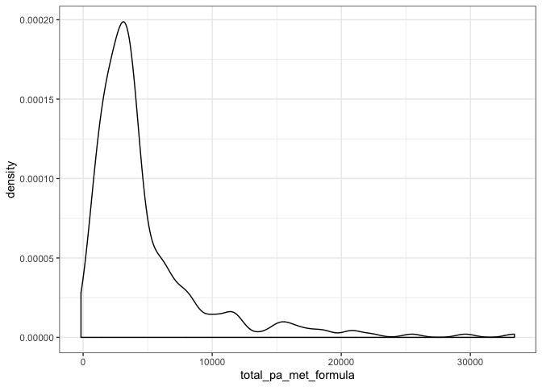

## Loading Packages

```r
library(lmtest)
```

```
## Loading required package: zoo
```

```
## 
## Attaching package: 'zoo'
```

```
## The following objects are masked from 'package:base':
## 
##     as.Date, as.Date.numeric
```

```r
library(tidyverse)
```

```
## ── Attaching packages ─────────────────────────────────────────────────────────────────────────────────── tidyverse 1.2.1 ──
```

```
## ✔ ggplot2 3.2.0     ✔ purrr   0.3.2
## ✔ tibble  2.1.3     ✔ dplyr   0.8.1
## ✔ tidyr   0.8.3     ✔ stringr 1.4.0
## ✔ readr   1.1.1     ✔ forcats 0.3.0
```

```
## ── Conflicts ────────────────────────────────────────────────────────────────────────────────────── tidyverse_conflicts() ──
## ✖ dplyr::filter() masks stats::filter()
## ✖ dplyr::lag()    masks stats::lag()
```

```r
library(ggplot2)
library(haven)
library(janitor)
library(pastecs)
```

```
## 
## Attaching package: 'pastecs'
```

```
## The following objects are masked from 'package:dplyr':
## 
##     first, last
```

```
## The following object is masked from 'package:tidyr':
## 
##     extract
```

```r
library(psych)
```

```
## 
## Attaching package: 'psych'
```

```
## The following objects are masked from 'package:ggplot2':
## 
##     %+%, alpha
```

```r
library(car)
```

```
## Loading required package: carData
```

```
## 
## Attaching package: 'car'
```

```
## The following object is masked from 'package:psych':
## 
##     logit
```

```
## The following object is masked from 'package:dplyr':
## 
##     recode
```

```
## The following object is masked from 'package:purrr':
## 
##     some
```

```r
library(Hmisc)
```

```
## Loading required package: lattice
```

```
## Loading required package: survival
```

```
## Loading required package: Formula
```

```
## 
## Attaching package: 'Hmisc'
```

```
## The following object is masked from 'package:psych':
## 
##     describe
```

```
## The following objects are masked from 'package:dplyr':
## 
##     src, summarize
```

```
## The following objects are masked from 'package:base':
## 
##     format.pval, units
```

```r
library(ggm)
```

```
## Loading required package: igraph
```

```
## 
## Attaching package: 'igraph'
```

```
## The following objects are masked from 'package:dplyr':
## 
##     as_data_frame, groups, union
```

```
## The following objects are masked from 'package:purrr':
## 
##     compose, simplify
```

```
## The following object is masked from 'package:tidyr':
## 
##     crossing
```

```
## The following object is masked from 'package:tibble':
## 
##     as_data_frame
```

```
## The following objects are masked from 'package:stats':
## 
##     decompose, spectrum
```

```
## The following object is masked from 'package:base':
## 
##     union
```

```
## 
## Attaching package: 'ggm'
```

```
## The following object is masked from 'package:igraph':
## 
##     pa
```

```
## The following object is masked from 'package:Hmisc':
## 
##     rcorr
```

```r
library(polycor)
```

```
## 
## Attaching package: 'polycor'
```

```
## The following object is masked from 'package:psych':
## 
##     polyserial
```

```r
library(tableone)
library(forcats)
library(gmodels)
library(QuantPsyc)
```

```
## Loading required package: boot
```

```
## 
## Attaching package: 'boot'
```

```
## The following object is masked from 'package:survival':
## 
##     aml
```

```
## The following object is masked from 'package:lattice':
## 
##     melanoma
```

```
## The following object is masked from 'package:car':
## 
##     logit
```

```
## The following object is masked from 'package:psych':
## 
##     logit
```

```
## Loading required package: MASS
```

```
## 
## Attaching package: 'MASS'
```

```
## The following object is masked from 'package:dplyr':
## 
##     select
```

```
## 
## Attaching package: 'QuantPsyc'
```

```
## The following object is masked from 'package:base':
## 
##     norm
```

```r
library(KernSmooth)
```

```
## KernSmooth 2.23 loaded
## Copyright M. P. Wand 1997-2009
```

```r
library(raster)
```

```
## Loading required package: sp
```

```
## 
## Attaching package: 'raster'
```

```
## The following objects are masked from 'package:MASS':
## 
##     area, select
```

```
## The following objects are masked from 'package:Hmisc':
## 
##     mask, zoom
```

```
## The following object is masked from 'package:pastecs':
## 
##     extract
```

```
## The following object is masked from 'package:janitor':
## 
##     crosstab
```

```
## The following object is masked from 'package:dplyr':
## 
##     select
```

```
## The following object is masked from 'package:tidyr':
## 
##     extract
```

```r
library(sp)
library(sf)
```

```
## Linking to GEOS 3.6.1, GDAL 2.1.3, PROJ 4.9.3
```

## Reading in Data

```r
getwd()
```

```
## [1] "/Volumes/hkr-storage/Research/dfuller/Walkabilly/people/Melissa Tobin/Thesis Results/INTERACT Thesis Analysis"
```

```r
#setwd("/Volumes/hkr-storage/Research/dfuller/Walkabilly/people/Melissa Tobin/HKR 6000/Data Analysis") #only use on lab computer
#setwd("/Users/MelissaTobin/Documents/HKR 6000/Major Assignment/Data Analysis")
victoria_new <- read_csv("health_1vic_main.bf53654.csv") #victoria health survey
```

```
## Parsed with column specification:
## cols(
##   .default = col_integer(),
##   date_of_survey = col_date(format = ""),
##   preferred_mode_f_txt = col_character(),
##   car_share = col_character(),
##   car_share_txt = col_character(),
##   house_tenure_txt = col_character(),
##   dwelling_type_txt = col_character(),
##   living_arrange = col_character(),
##   living_arrange_txt = col_character(),
##   residence = col_date(format = ""),
##   group_id = col_character(),
##   gender_vic = col_character()
## )
```

```
## See spec(...) for full column specifications.
```

```r
victoria_eligibility <- read_csv("eligibility_1vic_main.f209866.csv") #victoria eligibility survey
```

```
## Parsed with column specification:
## cols(
##   interact_id = col_character(),
##   treksoft_id = col_integer(),
##   date_of_survey = col_date(format = ""),
##   birth_date = col_date(format = ""),
##   gender_vic = col_character(),
##   gender_vic_1 = col_integer(),
##   gender_vic_2 = col_integer(),
##   gender_vic_3 = col_integer(),
##   gender_vic_4 = col_integer(),
##   residence_vic = col_integer(),
##   moving_plans_vic = col_integer(),
##   bike_weekly_vic = col_integer(),
##   participation_option = col_integer(),
##   residence_cp = col_character()
## )
```

```r
victoria_eligibility[, "interact_id"] <- apply(victoria_eligibility[, "interact_id"], 1, function(x) as.integer(x))
victoria_new[, "interact_id"] <- apply(victoria_new[, "interact_id"], 1, function(x) as.integer(x)) #getting both health and elibiligity survey to have the same INTERACT ID (one file started with 0101 and the other started with 101)

victoria_merged <- full_join(victoria_eligibility, victoria_new, by = "interact_id") #merging eligibility and health survey together 

victoria_merged_filter <- filter(victoria_merged, transp_bikes_adults >= 0) #filtering for participants who did eligibility but didn't actually complete the health survey (308 completed eligiblity but only 281 completed health survey)
```

## Reading in ID relationship and GPS ID relationship data

```r
ID_relationship <- read_csv("Victoria participation_wave1_IDrelationship.csv") #this is the file from Karen with the INTERACT ID's that she created
```

```
## Warning: Missing column names filled in: 'X5' [5], 'X6' [6], 'X7' [7],
## 'X8' [8], 'X9' [9], 'X10' [10], 'X11' [11], 'X12' [12], 'X13' [13],
## 'X14' [14], 'X15' [15], 'X16' [16], 'X17' [17], 'X18' [18], 'X19' [19],
## 'X20' [20]
```

```
## Parsed with column specification:
## cols(
##   .default = col_character(),
##   `INTERACT ID` = col_integer(),
##   treksoft_id = col_integer()
## )
```

```
## See spec(...) for full column specifications.
```

```r
gps_ID_relationship <- read_csv("pairings_with_sdid_updated.csv") #this is the other file with the "INTERACT ID's" that are actually GPS IDs
```

```
## Parsed with column specification:
## cols(
##   interact_id = col_integer(),
##   sensedoc_id = col_character(),
##   ethica_id = col_integer(),
##   treksoft_id = col_character()
## )
```

```r
tabyl(gps_ID_relationship$sensedoc_id)
```

```
##  gps_ID_relationship$sensedoc_id   n     percent valid_percent
##                           008T24   1 0.003937008   0.006493506
##                           0A0NTR   1 0.003937008   0.006493506
##                           0DKOQY   1 0.003937008   0.006493506
##                           0HFK6K   1 0.003937008   0.006493506
##                           0HV9NV   1 0.003937008   0.006493506
##                           0NJLBW   1 0.003937008   0.006493506
##                           18Y91Y   1 0.003937008   0.006493506
##                           1B414K   1 0.003937008   0.006493506
##                           1K545W   1 0.003937008   0.006493506
##                           1KHTIU   1 0.003937008   0.006493506
##                           1MOGO0   1 0.003937008   0.006493506
##                           1YM9ZC   1 0.003937008   0.006493506
##                           24Y90Z   1 0.003937008   0.006493506
##                           27VXMD   1 0.003937008   0.006493506
##                           2AGRDW   1 0.003937008   0.006493506
##                           2DZ3S3   1 0.003937008   0.006493506
##                           2QCMPY   1 0.003937008   0.006493506
##                           38Q1JO   1 0.003937008   0.006493506
##                           3FBYLQ   1 0.003937008   0.006493506
##                           41AVU2   1 0.003937008   0.006493506
##                           43AUZF   1 0.003937008   0.006493506
##                           4LUCBS   1 0.003937008   0.006493506
##                           4PU8NB   1 0.003937008   0.006493506
##                           4QY107   1 0.003937008   0.006493506
##                           4R38FI   1 0.003937008   0.006493506
##                           55NOO7   1 0.003937008   0.006493506
##                           5B4MBN   1 0.003937008   0.006493506
##                           5Y0PMR   1 0.003937008   0.006493506
##                           63GLVU   1 0.003937008   0.006493506
##                           6HRRIZ   1 0.003937008   0.006493506
##                           6SYVX6   1 0.003937008   0.006493506
##                           6Z5TPS   1 0.003937008   0.006493506
##                           76PU1Q   1 0.003937008   0.006493506
##                           7BB789   1 0.003937008   0.006493506
##                           7PNPAP   1 0.003937008   0.006493506
##                           7YNA4L   1 0.003937008   0.006493506
##                           7Z17W4   1 0.003937008   0.006493506
##                           87TJ8C   1 0.003937008   0.006493506
##                           8OCWNX   1 0.003937008   0.006493506
##                           8XSG3V   1 0.003937008   0.006493506
##                           9IQS4M   1 0.003937008   0.006493506
##                           9PE9E7   1 0.003937008   0.006493506
##                           9URBGE   1 0.003937008   0.006493506
##                           9YHSWZ   1 0.003937008   0.006493506
##                           A9ZVNV   1 0.003937008   0.006493506
##                           AAQIWJ   1 0.003937008   0.006493506
##                           ADQYRK   1 0.003937008   0.006493506
##                           AERO7C   1 0.003937008   0.006493506
##                           AG1VQ2   1 0.003937008   0.006493506
##                           APXO6C   1 0.003937008   0.006493506
##                           B4W5UJ   1 0.003937008   0.006493506
##                           B9J2GH   1 0.003937008   0.006493506
##                           BD0HY0   1 0.003937008   0.006493506
##                           BDA2W5   1 0.003937008   0.006493506
##                           BVSM2F   1 0.003937008   0.006493506
##                           BWEUB4   1 0.003937008   0.006493506
##                           C6W8Z0   1 0.003937008   0.006493506
##                           CBXDKI   1 0.003937008   0.006493506
##                           CFSIPU   1 0.003937008   0.006493506
##                           COJPJQ   1 0.003937008   0.006493506
##                           CR7ACM   1 0.003937008   0.006493506
##                           DAJDUM   1 0.003937008   0.006493506
##                           DB3KB0   1 0.003937008   0.006493506
##                           DCADCA   1 0.003937008   0.006493506
##                           DG840N   1 0.003937008   0.006493506
##                           EADPYR   1 0.003937008   0.006493506
##                           EEHLC1   1 0.003937008   0.006493506
##                           EFR7QL   1 0.003937008   0.006493506
##                           ELWUFA   1 0.003937008   0.006493506
##                           EU2AHN   1 0.003937008   0.006493506
##                           EZKWP8   1 0.003937008   0.006493506
##                           F6RVJ9   1 0.003937008   0.006493506
##                           FIQ9HY   1 0.003937008   0.006493506
##                           FR9ZIZ   1 0.003937008   0.006493506
##                           FZSIIW   1 0.003937008   0.006493506
##                           GCD74E   1 0.003937008   0.006493506
##                           GG8OEB   1 0.003937008   0.006493506
##                           GHGMLS   1 0.003937008   0.006493506
##                           GMO35W   1 0.003937008   0.006493506
##                           GNYOGC   1 0.003937008   0.006493506
##                           GWCKMP   1 0.003937008   0.006493506
##                           H5350P   1 0.003937008   0.006493506
##                           H6O9C7   1 0.003937008   0.006493506
##                           HPODZC   1 0.003937008   0.006493506
##                           HR06N5   1 0.003937008   0.006493506
##                           HXCYPW   1 0.003937008   0.006493506
##                           I41RBE   1 0.003937008   0.006493506
##                           I9VOLX   1 0.003937008   0.006493506
##                           IMEFMH   1 0.003937008   0.006493506
##                           IPY14R   1 0.003937008   0.006493506
##                           ISKCN8   1 0.003937008   0.006493506
##                           IX46LT   1 0.003937008   0.006493506
##                           J8MJPR   1 0.003937008   0.006493506
##                           JG5ZKH   1 0.003937008   0.006493506
##                           JVNEIC   1 0.003937008   0.006493506
##                           K7SMQF   1 0.003937008   0.006493506
##                           K9G6MY   1 0.003937008   0.006493506
##                           KBZHOQ   1 0.003937008   0.006493506
##                           KITK0H   1 0.003937008   0.006493506
##                           KSMGMZ   1 0.003937008   0.006493506
##                           KWXUEC   1 0.003937008   0.006493506
##                           KYNMUR   1 0.003937008   0.006493506
##                           L948L7   1 0.003937008   0.006493506
##                           LNSCCZ   1 0.003937008   0.006493506
##                           LYC6Z1   1 0.003937008   0.006493506
##                           MO96B4   1 0.003937008   0.006493506
##                           MOD60H   1 0.003937008   0.006493506
##                           MSCW7S   1 0.003937008   0.006493506
##                           N12AAY   1 0.003937008   0.006493506
##                           NQ37MY   1 0.003937008   0.006493506
##                           NQPT5O   1 0.003937008   0.006493506
##                           OEOWE5   1 0.003937008   0.006493506
##                           PASR7D   1 0.003937008   0.006493506
##                           PEK3VH   1 0.003937008   0.006493506
##                           PNNVUU   1 0.003937008   0.006493506
##                           PQ9JSQ   1 0.003937008   0.006493506
##                           Q3NFSM   1 0.003937008   0.006493506
##                           QHK0G1   1 0.003937008   0.006493506
##                           R4BRYE   1 0.003937008   0.006493506
##                           R58LF4   1 0.003937008   0.006493506
##                           RTLHSV   1 0.003937008   0.006493506
##                           RUFFLT   1 0.003937008   0.006493506
##                           RW5D6Z   1 0.003937008   0.006493506
##                           SBYNGL   1 0.003937008   0.006493506
##                           SCQCUE   1 0.003937008   0.006493506
##                           SN88P8   1 0.003937008   0.006493506
##                           TDJ6MV   1 0.003937008   0.006493506
##                           TJEKYN   1 0.003937008   0.006493506
##                           TKOEE0   1 0.003937008   0.006493506
##                           U3GLXZ   1 0.003937008   0.006493506
##                           U99WL2   1 0.003937008   0.006493506
##                           UE5NAX   1 0.003937008   0.006493506
##                           UNYMHZ   1 0.003937008   0.006493506
##                           US0PTK   1 0.003937008   0.006493506
##                           UYWAGV   1 0.003937008   0.006493506
##                           V3CXXO   1 0.003937008   0.006493506
##                           VN0Z52   1 0.003937008   0.006493506
##                           VQWQ5H   1 0.003937008   0.006493506
##                           VZLOH9   1 0.003937008   0.006493506
##                           W1GECN   1 0.003937008   0.006493506
##                           W7CGWE   1 0.003937008   0.006493506
##                           WEVIQY   1 0.003937008   0.006493506
##                           WFQRGD   1 0.003937008   0.006493506
##                           WIQX3H   1 0.003937008   0.006493506
##                           WM9COW   1 0.003937008   0.006493506
##                           WQG1KF   1 0.003937008   0.006493506
##                           WYCXXO   1 0.003937008   0.006493506
##                           WZ5JBU   1 0.003937008   0.006493506
##                           X15U5T   1 0.003937008   0.006493506
##                           X7EDQ4   1 0.003937008   0.006493506
##                           Y1WQ7U   1 0.003937008   0.006493506
##                           ZD7QBE   1 0.003937008   0.006493506
##                           ZI3K5L   1 0.003937008   0.006493506
##                           ZYJ38U   1 0.003937008   0.006493506
##                             <NA> 100 0.393700787            NA
```

## Changing column names and selecting important columns and filtering data

```r
ID_relationship <- mutate(ID_relationship, ID_data = 1)

#changing column names to match other data sets and make them easier to work with in R 
colnames(ID_relationship)[colnames(ID_relationship) == "INTERACT ID"] <- "interact_id"
colnames(ID_relationship)[colnames(ID_relationship) == "Sensedoc ID"] <- "sensedoc_ID"
colnames(ID_relationship)[colnames(ID_relationship) == "Ethica ID"] <- "ethica_ID"

ID_relationship_1 <- dplyr::select(ID_relationship, "interact_id", "sensedoc_ID", "ethica_ID", "ID_data", "treksoft_id") #selecting only the important columns (there were a bunch of columns with all NA's (X5 to X20))

typeof(ID_relationship_1$treksoft_id)
```

```
## [1] "integer"
```

```r
as.numeric(ID_relationship_1$treksoft_id)
```

```
##   [1] 108 110 113 115 116 117 120 121 122 124 127 131 132 134 135 140 142
##  [18] 147 152 156 158 160 161 162 163 166 177 178 180 184 186 187 190 191
##  [35] 193 194 198 202 209 210 213 215 223 225 227 232 236 240 241 244 250
##  [52] 251 253 254 260 262 263 267 272 275 276 278 280 281 282 284 286 287
##  [69] 288 290 291 292 293 297 299 302 306 309 310 311 312 313 314 315 316
##  [86] 318 324 325 326 329 330 333 336 344 345 347 348 352 359 360 363 366
## [103] 368 372 374 376 378 381 382 383 384 385 392 394 395 398 399 404 406
## [120] 408 409 416 417 420 422 424 425 426 427 428 434 435 437 441 442 446
## [137] 453 458 463 470 487 488 489 491 494 497 504 505 507 509 511 514 515
## [154] 519 522 524 529 532 534 537 540 544 548 549 551 556 557 559 560 565
## [171] 568 573 577 582 587 588 596 598 599 600 601 607 610 614 620 623 624
## [188] 625 626 627 628 631 633 635 636 637 639 642 644 646 648 653 655 656
## [205] 657 662 663 664 677 678 680 687 689 690 693 696 699 700 701 702 703
## [222] 704 705 707 710 711 713 715 716 721 726 734 735 736 737 739 740 742
## [239] 743 744 746 755 757 758 759 762 763 764 768 773 776 779 780 784 788
## [256] 795 797 800 806 808 809 812 819 820 822 823 826 828 830 831 833 834
## [273] 836 844 846 847 848 853 855 859 860 862 863 864 866 868 869 871 872
## [290] 876 877 880 881 883 885 887 888 889 890 893 896 898 900 903 904 908
## [307] 914 916 919
```

```r
ID_relationship_2 <- ID_relationship_1 %>% mutate(NA_checker = case_when(
  treksoft_id < 908 ~ "1",
  treksoft_id == 908 ~ "2",
  treksoft_id > 908 ~ "1"
)) #participant 908 didn't complete the health survey and was giving alot of problems so we filtered 908 out. 

ID_relationship_3 <- ID_relationship_2 %>% filter(NA_checker == 1) #brings it down to the 308 people who completed eligibility survey
```

## GPS linking data - changing column names, selecting out important data and working with NA

```r
#changing column names to match other data sets and make them easier to work with in R 
colnames(gps_ID_relationship)[colnames(gps_ID_relationship)== "interact_id"] <- "gps_id" #changed this INTERACT ID to GPS ID since this is actually the gps ID not the INTERACT ID's that Karen assigned. 
colnames(gps_ID_relationship)[colnames(gps_ID_relationship)== "sensedoc_id"] <- "sensedoc_ID"

gps_ID_relationship <- dplyr::select(gps_ID_relationship, "gps_id", "sensedoc_ID")  #selecting only the important columns. The treksoft ID and ethica in this file were not complete

gps_ID_relationship_1 <- mutate(gps_ID_relationship, gps_checker = 1) 
```

## Joining Data

```r
merged_ID <- left_join(ID_relationship_3, gps_ID_relationship_1, by = "sensedoc_ID") #merging both ID relationship files together using Sensedoc ID - common variable in both files


merged_ID_gps <- filter(merged_ID, gps_checker == 1) #filtering to just get the IDS for participants who did GPS analysis. If you leave everybody, then you have to deal with NA issues
tabyl(merged_ID$gps_checker)
```

```
##  merged_ID$gps_checker   n   percent valid_percent
##                      1 153 0.4967532             1
##                     NA 155 0.5032468            NA
```

```r
tabyl(merged_ID$gps_checker)
```

```
##  merged_ID$gps_checker   n   percent valid_percent
##                      1 153 0.4967532             1
##                     NA 155 0.5032468            NA
```

```r
victoria_new_ID_gps <- left_join(victoria_merged_filter, merged_ID_gps, by = "interact_id") #merging health/eligibility survey with ID relationships


tabyl(victoria_new_ID_gps$gps_checker) #checking to make sure that all of the GPS IDs transferred over correctly. 
```

```
##  victoria_new_ID_gps$gps_checker   n  percent valid_percent
##                                1 153 0.544484             1
##                               NA 128 0.455516            NA
```

```r
write_csv(victoria_new_ID_gps, "victoria_new_ID_gps.csv") #writing CSV
```

## Descriptive Statistics 

## Separating Birth Date into Year/Month/Day

```r
victoria_new_ID_gps <- separate(victoria_new_ID_gps, birth_date, c("year", "month", "day"), sep = "-")
```

## Adding new column for age

```r
victoria_new_ID_gps$year <- as.numeric(victoria_new_ID_gps$year)
victoria_new_ID_gps <- mutate(victoria_new_ID_gps, "age_calculated" = 2017 - year)
```

## Age descriptive Statistics for Victoria

```r
summary(victoria_new_ID_gps$age_calculated, na.rm = TRUE)
```

```
##    Min. 1st Qu.  Median    Mean 3rd Qu.    Max. 
##   21.00   34.00   42.00   44.23   56.00   79.00
```

```r
sd(victoria_new_ID_gps$age_calculated)
```

```
## [1] 13.42192
```

## Age descriptive Statistics for Victoria

```r
summary(victoria_new_ID_gps$age_calculated, na.rm = TRUE)
```

```
##    Min. 1st Qu.  Median    Mean 3rd Qu.    Max. 
##   21.00   34.00   42.00   44.23   56.00   79.00
```

```r
sd(victoria_new_ID_gps$age_calculated)
```

```
## [1] 13.42192
```

## Age Categories (using stats can age groups)

```r
victoria_new_ID_gps <- victoria_new_ID_gps %>% mutate(age_categories = case_when(
  age_calculated < 25 ~ "20-29",
  age_calculated >= 25 & age_calculated <= 29 ~ "20-29",
  age_calculated >= 30 & age_calculated <= 34 ~ "30-39", 
  age_calculated >= 35 & age_calculated <= 39 ~ "30-39",
  age_calculated >= 40 & age_calculated <= 44 ~ "40-49",
  age_calculated >= 45 & age_calculated <= 49 ~ "40-49",
  age_calculated >= 50 & age_calculated <= 54 ~ "50-59",
  age_calculated >= 55 & age_calculated <= 59 ~ "50-59", 
  age_calculated >= 60 & age_calculated <= 64 ~ "60+",
  age_calculated >= 65 & age_calculated <= 69 ~ "60+",
  age_calculated >= 70 & age_calculated <= 74 ~ "60+", 
  age_calculated >= 75 & age_calculated <= 79 ~ "60+",
  age_calculated >= 80 & age_calculated <= 84 ~ "60+"
))
tabyl(victoria_new_ID_gps$age_categories)
```

```
##  victoria_new_ID_gps$age_categories  n   percent
##                               20-29 41 0.1459075
##                               30-39 83 0.2953737
##                               40-49 58 0.2064057
##                               50-59 52 0.1850534
##                                 60+ 47 0.1672598
```

```r
typeof(victoria_new_ID_gps$age_categories)
```

```
## [1] "character"
```


```r
age_categories_plot <- ggplot (data = victoria_new_ID_gps, aes(age_categories)) + 
    geom_bar() + 
        labs(title = "Age ", 
           x = "Age Categories", 
            y = "Number of Participants (n)") + theme(axis.text.x = element_text(angle=60, hjust=1))
plot(age_categories_plot)
```

<!-- -->

## Age histogram 

```r
age_histogram <- ggplot (data = victoria_new_ID_gps, aes(age_calculated)) + 
    geom_histogram(aes(y = ..density..), color = "black", binwidth = 0.05) + 
      labs(title = "Barriers to Exercise ", 
          x = "Barriers to Exercise Score", 
          y = "Density (% of Participants)") 
plot(age_histogram)
```

<!-- -->


## Gender Victoria

```r
victoria_new_ID_gps <- victoria_new_ID_gps %>% mutate(gender = case_when(
  gender_vic_1.x == 1 & gender_vic_4.x == 1 ~ "Men",
  gender_vic_1.x == 1 ~ "Men",
  gender_vic_2.x == 1 ~ "Women", 
  gender_vic_3.x == 1 ~ "Trans or gender non-binary",
  gender_vic_4.x == 1 ~ "Trans or gender non-binary"
)) #CHECK!!!!!!!!!!!
##gender non-binary
tabyl(victoria_new_ID_gps$gender)
```

```
##  victoria_new_ID_gps$gender   n    percent
##                         Men 132 0.46975089
##  Trans or gender non-binary   3 0.01067616
##                       Women 146 0.51957295
```

```r
#victoria_new_ID_gps$gender <- factor(victoria_new_ID_gps$gender, c("Women", "Men", "Trans")) #not sure why I did this. 
tabyl(victoria_new_ID_gps$gender)
```

```
##  victoria_new_ID_gps$gender   n    percent
##                         Men 132 0.46975089
##  Trans or gender non-binary   3 0.01067616
##                       Women 146 0.51957295
```

## Gender

```r
tabyl(victoria_new_ID_gps$gender)
```

```
##  victoria_new_ID_gps$gender   n    percent
##                         Men 132 0.46975089
##  Trans or gender non-binary   3 0.01067616
##                       Women 146 0.51957295
```

```r
gender_plot <- ggplot(data = victoria_new_ID_gps, aes(gender)) +
  geom_bar(aes(fill = gender)) +
  labs(title = "Gender",
       x = "Gender Type",
       y = "Number of Participants (n)")
plot(gender_plot)
```

<!-- -->

## Creating Gender in numbers for correlation

```r
#victoria_merged_filter <- victoria_merged_filter %>% mutate(gender_number = case_when(
  #gender_vic_1.x == 1 & gender_vic_4.x == 1 ~ "3",
  #gender_vic_1.x == 1 ~ "1",
  #gender_vic_2.x == 1 ~ "2", 
  #gender_vic_3.x == 1 ~ "3",
  #gender_vic_4.x == 1 ~ "3"
#)) 
#victoria_merged_filter$gender_number <- as.numeric(victoria_merged_filter$gender_number)
#tabyl(victoria_merged_filter$gender_number)

##update this once you determine what exactly to do with gender
```


## Housing 

```r
victoria_new_ID_gps <- victoria_new_ID_gps %>% mutate(housing = case_when(
  house_tenure == 1 ~ "Owner",
  house_tenure == 2 ~ "Tenant", 
  house_tenure == 3 ~ "Resident with friends or relatives",
  house_tenure == 4 ~ "Resident not with friends or relatives", 
  house_tenure == 5 ~ "Other"
))

victoria_new_ID_gps$housing <- factor(victoria_new_ID_gps$housing, c("Other", "Resident not with friends or relatives", "Resident with friends or relatives", "Tenant", "Owner")) 
tabyl(victoria_new_ID_gps$housing)
```

```
##             victoria_new_ID_gps$housing   n     percent
##                                   Other   2 0.007117438
##  Resident not with friends or relatives   2 0.007117438
##      Resident with friends or relatives  11 0.039145907
##                                  Tenant  91 0.323843416
##                                   Owner 175 0.622775801
```

## Table for housing and gender

```r
table(victoria_new_ID_gps$housing, victoria_new_ID_gps$gender)
```

```
##                                         
##                                          Men Trans or gender non-binary
##   Other                                    0                          0
##   Resident not with friends or relatives   1                          0
##   Resident with friends or relatives       4                          1
##   Tenant                                  48                          1
##   Owner                                   79                          1
##                                         
##                                          Women
##   Other                                      2
##   Resident not with friends or relatives     1
##   Resident with friends or relatives         6
##   Tenant                                    42
##   Owner                                     95
```

```r
CrossTable(victoria_new_ID_gps$housing, victoria_new_ID_gps$gender)
```

```
## 
##  
##    Cell Contents
## |-------------------------|
## |                       N |
## | Chi-square contribution |
## |           N / Row Total |
## |           N / Col Total |
## |         N / Table Total |
## |-------------------------|
## 
##  
## Total Observations in Table:  281 
## 
##  
##                                        | victoria_new_ID_gps$gender 
##            victoria_new_ID_gps$housing |                        Men | Trans or gender non-binary |                      Women |                  Row Total | 
## ---------------------------------------|----------------------------|----------------------------|----------------------------|----------------------------|
##                                  Other |                          0 |                          0 |                          2 |                          2 | 
##                                        |                      0.940 |                      0.021 |                      0.888 |                            | 
##                                        |                      0.000 |                      0.000 |                      1.000 |                      0.007 | 
##                                        |                      0.000 |                      0.000 |                      0.014 |                            | 
##                                        |                      0.000 |                      0.000 |                      0.007 |                            | 
## ---------------------------------------|----------------------------|----------------------------|----------------------------|----------------------------|
## Resident not with friends or relatives |                          1 |                          0 |                          1 |                          2 | 
##                                        |                      0.004 |                      0.021 |                      0.001 |                            | 
##                                        |                      0.500 |                      0.000 |                      0.500 |                      0.007 | 
##                                        |                      0.008 |                      0.000 |                      0.007 |                            | 
##                                        |                      0.004 |                      0.000 |                      0.004 |                            | 
## ---------------------------------------|----------------------------|----------------------------|----------------------------|----------------------------|
##     Resident with friends or relatives |                          4 |                          1 |                          6 |                         11 | 
##                                        |                      0.264 |                      6.633 |                      0.014 |                            | 
##                                        |                      0.364 |                      0.091 |                      0.545 |                      0.039 | 
##                                        |                      0.030 |                      0.333 |                      0.041 |                            | 
##                                        |                      0.014 |                      0.004 |                      0.021 |                            | 
## ---------------------------------------|----------------------------|----------------------------|----------------------------|----------------------------|
##                                 Tenant |                         48 |                          1 |                         42 |                         91 | 
##                                        |                      0.645 |                      0.001 |                      0.590 |                            | 
##                                        |                      0.527 |                      0.011 |                      0.462 |                      0.324 | 
##                                        |                      0.364 |                      0.333 |                      0.288 |                            | 
##                                        |                      0.171 |                      0.004 |                      0.149 |                            | 
## ---------------------------------------|----------------------------|----------------------------|----------------------------|----------------------------|
##                                  Owner |                         79 |                          1 |                         95 |                        175 | 
##                                        |                      0.125 |                      0.404 |                      0.183 |                            | 
##                                        |                      0.451 |                      0.006 |                      0.543 |                      0.623 | 
##                                        |                      0.598 |                      0.333 |                      0.651 |                            | 
##                                        |                      0.281 |                      0.004 |                      0.338 |                            | 
## ---------------------------------------|----------------------------|----------------------------|----------------------------|----------------------------|
##                           Column Total |                        132 |                          3 |                        146 |                        281 | 
##                                        |                      0.470 |                      0.011 |                      0.520 |                            | 
## ---------------------------------------|----------------------------|----------------------------|----------------------------|----------------------------|
## 
## 
```

## Dwelling Type 

```r
tabyl(victoria_new_ID_gps$dwelling_type)
```

```
##  victoria_new_ID_gps$dwelling_type   n     percent
##                                  1 165 0.587188612
##                                  2  15 0.053380783
##                                  3  16 0.056939502
##                                  4  15 0.053380783
##                                  5  44 0.156583630
##                                  6  19 0.067615658
##                                  7   1 0.003558719
##                                  9   6 0.021352313
```

```r
victoria_new_ID_gps <- victoria_new_ID_gps %>% mutate(housing_type = case_when(
  dwelling_type == 1 ~ "Single-detached house",
  dwelling_type == 2 ~ "Semi-detached house", 
  dwelling_type == 3 ~ "Row house",
  dwelling_type == 4 ~ "Apartment/Condo in a duplex or triplex", 
  dwelling_type == 5 ~ "Apartment/Condo with fewer than 5 storeys",
  dwelling_type == 6 ~ "Apartment/Condo with more than 5 storeys",
  dwelling_type == 7 ~ "Mobile Home",
  dwelling_type == 8 ~ "Seniors Home",
  dwelling_type == 9 ~ "Other"
))

victoria_new_ID_gps$housing_type <- factor(victoria_new_ID_gps$housing_type, c("Other", "Seniors Home", "Mobile Home", "Apartment/Condo with more than 5 storeys", "Apartment/Condo with fewer than 5 storeys", "Apartment/Condo in a duplex or triplex", "Row house", "Semi-detached house", "Single-detached house" )) 
tabyl(victoria_new_ID_gps$housing_type)
```

```
##           victoria_new_ID_gps$housing_type   n     percent
##                                      Other   6 0.021352313
##                               Seniors Home   0 0.000000000
##                                Mobile Home   1 0.003558719
##   Apartment/Condo with more than 5 storeys  19 0.067615658
##  Apartment/Condo with fewer than 5 storeys  44 0.156583630
##     Apartment/Condo in a duplex or triplex  15 0.053380783
##                                  Row house  16 0.056939502
##                        Semi-detached house  15 0.053380783
##                      Single-detached house 165 0.587188612
```

## Health Status

```r
tabyl(victoria_new_ID_gps$sf1)
```

```
##  victoria_new_ID_gps$sf1   n     percent
##                        1  69 0.245551601
##                        2 138 0.491103203
##                        3  60 0.213523132
##                        4  13 0.046263345
##                        5   1 0.003558719
```

```r
victoria_new_ID_gps <- victoria_new_ID_gps %>% mutate(health_status = case_when(
  sf1 == 1 ~ "Excellent",
  sf1 == 2 ~ "Very Good", 
  sf1 == 3 ~ "Good",
  sf1 == 4 ~ "Fair", 
  sf1 == 5 ~ "Poor"
))

victoria_new_ID_gps$health_status <- factor(victoria_new_ID_gps$health_status, c("Poor", "Fair", "Good", "Very Good", "Excellent")) #WORKED - puts the graph in order
tabyl(victoria_new_ID_gps$health_status)
```

```
##  victoria_new_ID_gps$health_status   n     percent
##                               Poor   1 0.003558719
##                               Fair  13 0.046263345
##                               Good  60 0.213523132
##                          Very Good 138 0.491103203
##                          Excellent  69 0.245551601
```

## Health Status

```r
victoria_new_ID_gps$health_status <- factor(victoria_new_ID_gps$health_status, c("Poor", "Fair", "Good", "Very Good", "Excellent"))
tabyl(victoria_new_ID_gps$health_status)
```

```
##  victoria_new_ID_gps$health_status   n     percent
##                               Poor   1 0.003558719
##                               Fair  13 0.046263345
##                               Good  60 0.213523132
##                          Very Good 138 0.491103203
##                          Excellent  69 0.245551601
```

```r
health_plot <- ggplot(data = victoria_new_ID_gps, aes(health_status)) +
  geom_bar() +
  labs(title = "Health Status",
       x = "Health Status",
       y = "Number of Participants (n)") 
plot(health_plot)
```

<!-- -->

## Marital Status

```r
tabyl(victoria_new_ID_gps$marital_status)
```

```
##  victoria_new_ID_gps$marital_status   n     percent
##                                   1  54 0.192170819
##                                   2 202 0.718861210
##                                   3  23 0.081850534
##                                   4   2 0.007117438
```

```r
victoria_new_ID_gps <- victoria_new_ID_gps %>% mutate(marital = case_when(
  marital_status == 1 ~ "Single (never married)",
  marital_status == 2 ~ "Married (or common law)", 
  marital_status == 3 ~ "Separated or divorced",
  marital_status == 4 ~ "Widowed"
))
tabyl(victoria_new_ID_gps$marital)
```

```
##  victoria_new_ID_gps$marital   n     percent
##      Married (or common law) 202 0.718861210
##        Separated or divorced  23 0.081850534
##       Single (never married)  54 0.192170819
##                      Widowed   2 0.007117438
```

## Marital Status

```r
tabyl(victoria_new_ID_gps$marital)
```

```
##  victoria_new_ID_gps$marital   n     percent
##      Married (or common law) 202 0.718861210
##        Separated or divorced  23 0.081850534
##       Single (never married)  54 0.192170819
##                      Widowed   2 0.007117438
```

```r
marital_plot <- ggplot(data = victoria_new_ID_gps, aes(marital)) +
  geom_bar() +
  labs(title = "Marital Status",
       x = "Marital Status",
       y = "Number of Participants (n)") + theme(axis.text.x = element_text(angle=60, hjust=1))
plot(marital_plot)
```

<!-- -->

## Children (Yes/No)

```r
tabyl(victoria_new_ID_gps$children)
```

```
##  victoria_new_ID_gps$children   n   percent
##                             1 151 0.5373665
##                             2 130 0.4626335
```

```r
victoria_new_ID_gps <- victoria_new_ID_gps %>% mutate(children_1 = case_when(
  children == 1 ~ "Yes",
  children == 2 ~ "No"
))
tabyl(victoria_new_ID_gps$children_1)
```

```
##  victoria_new_ID_gps$children_1   n   percent
##                              No 130 0.4626335
##                             Yes 151 0.5373665
```

```r
tabyl(victoria_new_ID_gps$living_children)
```

```
##  victoria_new_ID_gps$living_children   n     percent
##                                   -7 130 0.462633452
##                                    1  39 0.138790036
##                                    2  84 0.298932384
##                                    3  23 0.081850534
##                                    4   2 0.007117438
##                                    5   2 0.007117438
##                                    6   1 0.003558719
```

## Born in Canada

```r
tabyl(victoria_new_ID_gps$born_can)
```

```
##  victoria_new_ID_gps$born_can   n   percent
##                             1 209 0.7437722
##                             2  72 0.2562278
```

```r
victoria_new_ID_gps <- victoria_new_ID_gps %>% mutate(born_canada = case_when(
  born_can == 1 ~ "Yes",
  born_can == 2 ~ "No"
))
tabyl(victoria_new_ID_gps$born_canada)
```

```
##  victoria_new_ID_gps$born_canada   n   percent
##                               No  72 0.2562278
##                              Yes 209 0.7437722
```

## Ethinic/Cultural Groups

```r
tabyl(victoria_new_ID_gps$group_id)
```

```
##  victoria_new_ID_gps$group_id   n     percent
##                     [1, 2, 4]   1 0.003558719
##                        [1, 4]   1 0.003558719
##                        [2, 4]   2 0.007117438
##                           [2]  16 0.056939502
##                        [4, 1]   2 0.007117438
##                        [4, 6]   1 0.003558719
##                           [4] 244 0.868327402
##                           [5]   4 0.014234875
##                          [77]  10 0.035587189
```

```r
victoria_new_ID_gps <- victoria_new_ID_gps %>% mutate(ethnicity = case_when(
  group_id_1 == 1 & group_id_2 == 1 & group_id_4 == 1 ~ "Aboriginal",
  group_id_1 == 1 & group_id_4 == 1 ~ "Aboriginal",
  group_id_2 == 1 & group_id_4 == 1 ~ "Asian", 
  group_id_4 == 1 & group_id_1 == 1 ~ "Aboriginal",
  group_id_4 == 1 & group_id_6 == 1 ~ "Middle Eastern",
  group_id_2 == 1 ~ "Asian",
  group_id_4 == 1 ~ "Caucasian",
  group_id_5 == 1 ~ "Latin American",
  group_id_77 == 1 ~ "Unknown"
)) ##RATIONALE FOR WHY YOU DID THIS THE WAY YOU DID!!!!

victoria_new_ID_gps$ethnicity <- factor(victoria_new_ID_gps$ethnicity, c("Middle Eastern", "Latin American", "Aboriginal", "Asian", "Caucasian", "Unknown"))
tabyl(victoria_new_ID_gps$ethnicity)
```

```
##  victoria_new_ID_gps$ethnicity   n     percent
##                 Middle Eastern   1 0.003558719
##                 Latin American   4 0.014234875
##                     Aboriginal   4 0.014234875
##                          Asian  18 0.064056940
##                      Caucasian 244 0.868327402
##                        Unknown  10 0.035587189
```

## Ethnicity 

```r
tabyl(victoria_new_ID_gps$ethnicity)
```

```
##  victoria_new_ID_gps$ethnicity   n     percent
##                 Middle Eastern   1 0.003558719
##                 Latin American   4 0.014234875
##                     Aboriginal   4 0.014234875
##                          Asian  18 0.064056940
##                      Caucasian 244 0.868327402
##                        Unknown  10 0.035587189
```

```r
ethnicity_plot <- ggplot(data = victoria_new_ID_gps, aes(ethnicity)) +
  geom_bar() +
  labs(title = "Ethnicity",
       x = "Ethnic Group",
       y = "Number of Participants (n)") + theme(axis.text.x = element_text(angle=60, hjust=1))
plot(ethnicity_plot)
```

<!-- -->

## Ethnicity recoded as numbers for correlation

```r
victoria_new_ID_gps <- victoria_new_ID_gps %>% mutate(ethnicity_number = case_when(
  group_id_1 == 1 & group_id_2 == 1 & group_id_4 == 1 ~ "1",
  group_id_1 == 1 & group_id_4 == 1 ~ "1",
  group_id_2 == 1 & group_id_4 == 1 ~ "2", 
  group_id_4 == 1 & group_id_1 == 1 ~ "1",
  group_id_4 == 1 & group_id_6 == 1 ~ "3",
  group_id_2 == 1 ~ "2",
  group_id_4 == 1 ~ "5",
  group_id_5 == 1 ~ "4",
  group_id_77 == 1 ~ "6"
)) 
victoria_new_ID_gps$ethnicity_number <- as.numeric(victoria_new_ID_gps$ethnicity_number)
```

## Income

```r
tabyl(victoria_new_ID_gps$income)
```

```
##  victoria_new_ID_gps$income   n     percent
##                           2   3 0.010676157
##                           3   2 0.007117438
##                           4   5 0.017793594
##                           5   9 0.032028470
##                           6  11 0.039145907
##                           7  16 0.056939502
##                           8 107 0.380782918
##                           9  65 0.231316726
##                          10  34 0.120996441
##                          11   9 0.032028470
##                          77  20 0.071174377
```

```r
victoria_new_ID_gps <- victoria_new_ID_gps %>% mutate(income_1 = case_when(
  income == 1 ~ "No income",
  income == 2 ~ "$1 to $9,999", 
  income == 3 ~ "$10,000 to $14,999",
  income == 4 ~ "$15,000 to $19,999", 
  income == 5 ~ "$20,000 to $29,999",
  income == 6 ~ "$30,000 to $39,999",
  income == 7 ~ "$40,000 to $49,999",
  income == 8 ~ "$50,000 to $99,999",
  income == 9 ~ "$100,000 to $149,999",
  income == 10 ~ "$150,000 to $199,999",
  income == 11 ~ "$200,000 or more",
  income == 77 ~ "I don't know/Prefer not to answer"
))

victoria_new_ID_gps$income_1 <- factor(victoria_new_ID_gps$income_1, c("No income", "$1 to $9,999", "$10,000 to $14,999", "$15,000 to $19,999", "$20,000 to $29,999", "$30,000 to $39,999", "$40,000 to $49,999","$50,000 to $99,999","$100,000 to $149,999","$150,000 to $199,999", "$200,000 or more", "I don't know/Prefer not to answer"))

tabyl(victoria_new_ID_gps$income_1)
```

```
##       victoria_new_ID_gps$income_1   n     percent
##                          No income   0 0.000000000
##                       $1 to $9,999   3 0.010676157
##                 $10,000 to $14,999   2 0.007117438
##                 $15,000 to $19,999   5 0.017793594
##                 $20,000 to $29,999   9 0.032028470
##                 $30,000 to $39,999  11 0.039145907
##                 $40,000 to $49,999  16 0.056939502
##                 $50,000 to $99,999 107 0.380782918
##               $100,000 to $149,999  65 0.231316726
##               $150,000 to $199,999  34 0.120996441
##                   $200,000 or more   9 0.032028470
##  I don't know/Prefer not to answer  20 0.071174377
```

```r
summary(victoria_new_ID_gps$income)
```

```
##    Min. 1st Qu.  Median    Mean 3rd Qu.    Max. 
##    2.00    8.00    8.00   13.08    9.00   77.00
```

## Recoding income into 4 categories

```r
tabyl(victoria_new_ID_gps$income)
```

```
##  victoria_new_ID_gps$income   n     percent
##                           2   3 0.010676157
##                           3   2 0.007117438
##                           4   5 0.017793594
##                           5   9 0.032028470
##                           6  11 0.039145907
##                           7  16 0.056939502
##                           8 107 0.380782918
##                           9  65 0.231316726
##                          10  34 0.120996441
##                          11   9 0.032028470
##                          77  20 0.071174377
```

```r
victoria_new_ID_gps <- victoria_new_ID_gps %>% mutate(income_2 = case_when(
  income == 1 ~ "$49,000 or less",
  income == 2 ~ "$49,000 or less", 
  income == 3 ~ "$49,000 or less",
  income == 4 ~ "$49,000 or less", 
  income == 5 ~ "$49,000 or less",
  income == 6 ~ "$49,000 or less",
  income == 7 ~ "$49,000 or less",
  income == 8 ~ "$50,000 to $99,999",
  income == 9 ~ "$100,000 to $149,999",
  income == 10 ~ "$150,000 or more",
  income == 11 ~ "$150,000 or more",
  income == 77 ~ "I don't know/Prefer not to answer"
))

victoria_new_ID_gps$income_1 <- factor(victoria_new_ID_gps$income_1, c("No income", "$1 to $9,999", "$10,000 to $14,999", "$15,000 to $19,999", "$20,000 to $29,999", "$30,000 to $39,999", "$40,000 to $49,999","$50,000 to $99,999","$100,000 to $149,999","$150,000 to $199,999", "$200,000 or more", "I don't know/Prefer not to answer"))

tabyl(victoria_new_ID_gps$income_2)
```

```
##       victoria_new_ID_gps$income_2   n    percent
##               $100,000 to $149,999  65 0.23131673
##                   $150,000 or more  43 0.15302491
##                    $49,000 or less  46 0.16370107
##                 $50,000 to $99,999 107 0.38078292
##  I don't know/Prefer not to answer  20 0.07117438
```

```r
summary(victoria_new_ID_gps$income)
```

```
##    Min. 1st Qu.  Median    Mean 3rd Qu.    Max. 
##    2.00    8.00    8.00   13.08    9.00   77.00
```


## Income

```r
income_plot <- ggplot(data = victoria_new_ID_gps, aes(income_1)) +
  geom_bar() +
  labs(title = "Income",
       x = "Income Level",
       y = "Number of Participants (n)") + theme(axis.text.x = element_text(angle=60, hjust=1))
plot(income_plot)
```

<!-- -->

## Income needs

```r
tabyl(victoria_new_ID_gps$income_needs)
```

```
##  victoria_new_ID_gps$income_needs   n    percent
##                                 1 108 0.38434164
##                                 2 124 0.44128114
##                                 3  33 0.11743772
##                                 4   5 0.01779359
##                                77  11 0.03914591
```

```r
victoria_new_ID_gps <- victoria_new_ID_gps %>% mutate(income_satisfy = case_when(
  income_needs == 1 ~ "Very well",
  income_needs == 2 ~ "Well", 
  income_needs == 3 ~ "Not so well",
  income_needs == 4 ~ "Not at all", 
  income_needs == 77 ~ "I don't know/Prefer not to answer"
))

tabyl(victoria_new_ID_gps$income_satisfy)
```

```
##  victoria_new_ID_gps$income_satisfy   n    percent
##   I don't know/Prefer not to answer  11 0.03914591
##                          Not at all   5 0.01779359
##                         Not so well  33 0.11743772
##                           Very well 108 0.38434164
##                                Well 124 0.44128114
```

## Income Needs

```r
tabyl(victoria_new_ID_gps$income_satisfy)
```

```
##  victoria_new_ID_gps$income_satisfy   n    percent
##   I don't know/Prefer not to answer  11 0.03914591
##                          Not at all   5 0.01779359
##                         Not so well  33 0.11743772
##                           Very well 108 0.38434164
##                                Well 124 0.44128114
```

## Bicycle Facility Preference - Path 

```r
tabyl(victoria_new_ID_gps$bike_comf_a)
```

```
##  victoria_new_ID_gps$bike_comf_a   n    percent
##                                1  21 0.07473310
##                                3  18 0.06405694
##                                4 242 0.86120996
```

```r
victoria_new_ID_gps <- victoria_new_ID_gps %>% mutate(path_comf = case_when(
  bike_comf_a == 1 ~ "Very uncomfortable",
  bike_comf_a == 2 ~ "Somewhat uncomfortable", 
  bike_comf_a == 3 ~ "Somewhat comfortable",
  bike_comf_a == 4 ~ "Very comfortable"
))

victoria_new_ID_gps$path_comf <- factor(victoria_new_ID_gps$path_comf, c("Very uncomfortable", "Somewhat comfortable", "Very comfortable"))

tabyl(victoria_new_ID_gps$path_comf)
```

```
##  victoria_new_ID_gps$path_comf   n    percent
##             Very uncomfortable  21 0.07473310
##           Somewhat comfortable  18 0.06405694
##               Very comfortable 242 0.86120996
```

## Bicycle Facility Preference - Residential street 

```r
tabyl(victoria_new_ID_gps$bike_comf_b)
```

```
##  victoria_new_ID_gps$bike_comf_b   n    percent
##                                1  21 0.07473310
##                                2  20 0.07117438
##                                3  87 0.30960854
##                                4 153 0.54448399
```

```r
victoria_new_ID_gps <- victoria_new_ID_gps %>% mutate(residential_street_comf = case_when(
  bike_comf_b == 1 ~ "Very uncomfortable",
  bike_comf_b == 2 ~ "Somewhat uncomfortable", 
  bike_comf_b == 3 ~ "Somewhat comfortable",
  bike_comf_b == 4 ~ "Very comfortable"
))

victoria_new_ID_gps$residential_street_comf <- factor(victoria_new_ID_gps$residential_street_comf, c("Very uncomfortable", "Somewhat uncomfortable", "Somewhat comfortable", "Very comfortable"))
tabyl(victoria_new_ID_gps$residential_street_comf)
```

```
##  victoria_new_ID_gps$residential_street_comf   n    percent
##                           Very uncomfortable  21 0.07473310
##                       Somewhat uncomfortable  20 0.07117438
##                         Somewhat comfortable  87 0.30960854
##                             Very comfortable 153 0.54448399
```

## Bicycle Facility Preference - Residential street with traffic calming measures

```r
tabyl(victoria_new_ID_gps$bike_comf_c)
```

```
##  victoria_new_ID_gps$bike_comf_c   n     percent
##                                1  22 0.078291815
##                                2   4 0.014234875
##                                3  39 0.138790036
##                                4 215 0.765124555
##                               77   1 0.003558719
```

```r
victoria_new_ID_gps <- victoria_new_ID_gps %>% mutate(res_street_traffic_calming_comf = case_when(
  bike_comf_c == 1 ~ "Very uncomfortable",
  bike_comf_c == 2 ~ "Somewhat uncomfortable", 
  bike_comf_c == 3 ~ "Somewhat comfortable",
  bike_comf_c == 4 ~ "Very comfortable",
  bike_comf_c == 77 ~ "I don't know/Prefer not to answer"
))

victoria_new_ID_gps$res_street_traffic_calming_comf <- factor(victoria_new_ID_gps$res_street_traffic_calming_comf, c( "Very uncomfortable", "Somewhat uncomfortable", "Somewhat comfortable", "Very comfortable", "I don't know/Prefer not to answer"))
tabyl(victoria_new_ID_gps$res_street_traffic_calming_comf)
```

```
##  victoria_new_ID_gps$res_street_traffic_calming_comf   n     percent
##                                   Very uncomfortable  22 0.078291815
##                               Somewhat uncomfortable   4 0.014234875
##                                 Somewhat comfortable  39 0.138790036
##                                     Very comfortable 215 0.765124555
##                    I don't know/Prefer not to answer   1 0.003558719
```

## Bicycle Facility Preference - Major Street with no bike lane 

```r
victoria_new_ID_gps <- victoria_new_ID_gps %>% mutate(major_street_no_bike_lane = case_when(
  bike_comf_d == 1 ~ "Very uncomfortable",
  bike_comf_d == 2 ~ "Somewhat uncomfortable", 
  bike_comf_d == 3 ~ "Somewhat comfortable",
  bike_comf_d == 4 ~ "Very comfortable"
))

victoria_new_ID_gps$major_street_no_bike_lane <- factor(victoria_new_ID_gps$major_street_no_bike_lane, c("Very uncomfortable", "Somewhat uncomfortable", "Somewhat comfortable", "Very comfortable"))
```

## Bicycle Facility Preference - Major Street with bike lane 

```r
tabyl(victoria_new_ID_gps$bike_comf_e)
```

```
##  victoria_new_ID_gps$bike_comf_e   n    percent
##                                1  25 0.08896797
##                                2  89 0.31672598
##                                3 128 0.45551601
##                                4  39 0.13879004
```

```r
victoria_new_ID_gps <- victoria_new_ID_gps %>% mutate(major_street_bike_lane = case_when(
  bike_comf_e == 1 ~ "Very uncomfortable",
  bike_comf_e == 2 ~ "Somewhat uncomfortable", 
  bike_comf_e == 3 ~ "Somewhat comfortable",
  bike_comf_e == 4 ~ "Very comfortable"
))

victoria_new_ID_gps$major_street_bike_lane <- factor(victoria_new_ID_gps$major_street_bike_lane, c("Very uncomfortable", "Somewhat uncomfortable", "Somewhat comfortable", "Very comfortable"))
tabyl(victoria_new_ID_gps$major_street_bike_lane)
```

```
##  victoria_new_ID_gps$major_street_bike_lane   n    percent
##                          Very uncomfortable  25 0.08896797
##                      Somewhat uncomfortable  89 0.31672598
##                        Somewhat comfortable 128 0.45551601
##                            Very comfortable  39 0.13879004
```

## Bicycle Facility Preference - Major Street with separated bike lane 

```r
tabyl(victoria_new_ID_gps$bike_comf_f)
```

```
##  victoria_new_ID_gps$bike_comf_f   n    percent
##                                1  20 0.07117438
##                                2   9 0.03202847
##                                3  58 0.20640569
##                                4 191 0.67971530
##                               77   3 0.01067616
```

```r
victoria_new_ID_gps <- victoria_new_ID_gps %>% mutate(major_street_separated_bike_lane = case_when(
  bike_comf_f == 1 ~ "Very uncomfortable",
  bike_comf_f == 2 ~ "Somewhat uncomfortable", 
  bike_comf_f == 3 ~ "Somewhat comfortable",
  bike_comf_f == 4 ~ "Very comfortable",
  bike_comf_f == 77 ~ "I don't know/Prefer not to answer"
))

victoria_new_ID_gps$major_street_separated_bike_lane <- factor(victoria_new_ID_gps$major_street_separated_bike_lane, c( "Very uncomfortable", "Somewhat uncomfortable", "Somewhat comfortable", "Very comfortable", "I don't know/Prefer not to answer"))
tabyl(victoria_new_ID_gps$major_street_separated_bike_lane)
```

```
##  victoria_new_ID_gps$major_street_separated_bike_lane   n    percent
##                                    Very uncomfortable  20 0.07117438
##                                Somewhat uncomfortable   9 0.03202847
##                                  Somewhat comfortable  58 0.20640569
##                                      Very comfortable 191 0.67971530
##                     I don't know/Prefer not to answer   3 0.01067616
```

## Support for AAA
### AAA Familiarity 

```r
tabyl(victoria_new_ID_gps$aaa_familiarity)
```

```
##  victoria_new_ID_gps$aaa_familiarity   n   percent
##                                    1 189 0.6725979
##                                    2  92 0.3274021
```

```r
victoria_new_ID_gps <- victoria_new_ID_gps %>% mutate(aaa_familiarity_1 = case_when(
  aaa_familiarity == 1 ~ "Yes",
  aaa_familiarity == 2 ~ "No"
))

tabyl(victoria_new_ID_gps$aaa_familiarity_1)
```

```
##  victoria_new_ID_gps$aaa_familiarity_1   n   percent
##                                     No  92 0.3274021
##                                    Yes 189 0.6725979
```

## Familiarity AAA

```r
tabyl(victoria_new_ID_gps$aaa_familiarity_1)
```

```
##  victoria_new_ID_gps$aaa_familiarity_1   n   percent
##                                     No  92 0.3274021
##                                    Yes 189 0.6725979
```

```r
AAA_familiarity_plot <- ggplot(data = victoria_new_ID_gps, aes(aaa_familiarity_1)) +
  geom_bar() +
  labs(title = "All Ages and Abilities Cycling Network Familiarity",
       x = "Yes/No",
       y = "Number of Participants (n)") 
plot(AAA_familiarity_plot)
```

<!-- -->

## AAA Familiarity - mutate #NOT SURE WHY I DID THIS. DON'T THINK IT's IMPORTANT 

```r
victoria_new_ID_gps <- victoria_new_ID_gps %>% mutate(aaa_familiarity_2 = case_when(
  aaa_familiarity_1 == "Yes" ~ "1",
  aaa_familiarity_1 == "No" ~ "0"
))
tabyl(victoria_new_ID_gps$aaa_familiarity_2)
```

```
##  victoria_new_ID_gps$aaa_familiarity_2   n   percent
##                                      0  92 0.3274021
##                                      1 189 0.6725979
```

## AAA Good idea

```r
tabyl(victoria_new_ID_gps$aaa_idea)
```

```
##  victoria_new_ID_gps$aaa_idea   n     percent
##                             1 243 0.864768683
##                             2  31 0.110320285
##                             3   3 0.010676157
##                             4   1 0.003558719
##                            77   3 0.010676157
```

```r
victoria_new_ID_gps <- victoria_new_ID_gps %>% mutate(aaa_idea_1 = case_when(
  aaa_idea == 1 ~ "Very good idea",
  aaa_idea == 2 ~ "Somewhat good idea",
  aaa_idea == 3 ~ "Somewhat bad idea",
  aaa_idea == 4 ~ "Very bad idea",
  aaa_idea == 77 ~ "I don't know"
))

victoria_new_ID_gps$aaa_idea_1 <- factor(victoria_new_ID_gps$aaa_idea_1, c("I don't know", "Very bad idea", "Somewhat bad idea", "Somewhat good idea", "Very good idea"))
tabyl(victoria_new_ID_gps$aaa_idea_1)
```

```
##  victoria_new_ID_gps$aaa_idea_1   n     percent
##                    I don't know   3 0.010676157
##                   Very bad idea   1 0.003558719
##               Somewhat bad idea   3 0.010676157
##              Somewhat good idea  31 0.110320285
##                  Very good idea 243 0.864768683
```

## AAA Idea

```r
AAA_idea_plot <- ggplot(data = victoria_new_ID_gps, aes(aaa_idea_1)) +
  geom_bar() +
  labs(title = "All Ages and Abilities Cycling Network Idea",
       x = "AAA Idea",
       y = "Number of Participants (n)") + theme(axis.text.x = element_text(angle=60, hjust=1))
plot(AAA_idea_plot)
```

<!-- -->

## AAA Cycle More

```r
tabyl(victoria_new_ID_gps$aaa_bike_more)
```

```
##  victoria_new_ID_gps$aaa_bike_more   n   percent
##                                  1 221 0.7864769
##                                  2  60 0.2135231
```

```r
victoria_new_ID_gps <- victoria_new_ID_gps %>% mutate(aaa_bike_more_1 = case_when(
  aaa_bike_more == 1 ~ "Yes",
  aaa_bike_more == 2 ~ "No"
))

tabyl(victoria_new_ID_gps$aaa_bike_more_1)
```

```
##  victoria_new_ID_gps$aaa_bike_more_1   n   percent
##                                   No  60 0.2135231
##                                  Yes 221 0.7864769
```

## AAA Bike More

```r
AAA_bike_more_plot <- ggplot(data = victoria_new_ID_gps, aes(aaa_bike_more_1)) +
  geom_bar() +
  labs(title = "All Ages and Abilities Cycling Network Bike More",
       x = "AAA Bike More",
       y = "Number of Participants (n)")
plot(AAA_bike_more_plot)
```

<!-- -->

## Plotting separated 

```r
victoria_new_ID_gps$major_street_separated_bike_lane <- factor(victoria_new_ID_gps$major_street_separated_bike_lane, c( "Very uncomfortable", "Somewhat uncomfortable", "Somewhat comfortable", "Very comfortable", "I don't know/Prefer not to answer"))
separated_preference <- ggplot(data = victoria_new_ID_gps, aes(major_street_separated_bike_lane)) +
  geom_bar() +
  labs(title = "Preference for Major Street with Separated Bike Lane",
       x = "Level of Preference",
       y = "Number of Participants (n)") + theme(axis.text.x = element_text(angle=45, hjust=1))
plot(separated_preference)
```

<!-- -->

## Attempting regression between support index and PA

```r
#support_regression <- lm(Cycling_formula ~ factor(support_index), data = victoria_new_ID_gps)
#summary(support_regression)
#REGRESSION FOR LATER
```

## Checking self-report exposure

```r
tabyl(victoria_new_ID_gps$vicroads_f)
```

```
##  victoria_new_ID_gps$vicroads_f   n percent
##                               1 242 0.86121
##                               2  39 0.13879
```

```r
#86% bike on pandora 
```

## Self-report Physcial Activity Data - Total PA - Outcome Variable 

## Physical Activity - Cycling 

```r
tabyl(victoria_new_ID_gps$travel_bike)
```

```
##  victoria_new_ID_gps$travel_bike  n    percent
##                                0  8 0.02846975
##                                1 13 0.04626335
##                                2 13 0.04626335
##                                3 30 0.10676157
##                                4 35 0.12455516
##                                5 76 0.27046263
##                                6 41 0.14590747
##                                7 65 0.23131673
```

```r
victoria_new_ID_gps <- mutate(victoria_new_ID_gps, "Cycling_formula" = 6 * travel_bike_freq * travel_bike)
victoria_new_ID_gps <- mutate(victoria_new_ID_gps, "Walking_formula" = 3.3 * travel_walk_freq * travel_walk)
victoria_new_ID_gps <- mutate(victoria_new_ID_gps, "Total_transport_formula" = Cycling_formula + Walking_formula)
```
## Plotting PA

```r
PA_cycling_plot <- ggplot (data = victoria_new_ID_gps, aes(Cycling_formula)) + 
    geom_density(aes(fill = gender), position = "dodge", alpha = 0.5) + 
      labs(title = "Cycling for Transport Physical Activity", 
          x = "Cycling MET Minutes of Physical Activity", 
          y = "Percent of Participants")
plot(PA_cycling_plot)
```

```
## Warning: Removed 3 rows containing non-finite values (stat_density).
```

```
## Warning: Width not defined. Set with `position_dodge(width = ?)`
```

<!-- -->

## Adding normal distribution to PA plot 

```r
victoria_new_ID_gps$Cycling_formula <- as.numeric(victoria_new_ID_gps$Cycling_formula)

PA_cycling_normal_plot  <- PA_cycling_plot +
  stat_function(fun = dnorm, args = list(mean = mean(victoria_new_ID_gps$Cycling_formula, na.rm = TRUE), sd =sd(victoria_new_ID_gps$Cycling_formula, na.rm = TRUE)), color = "red", size = 1)
plot(PA_cycling_normal_plot)
```

```
## Warning: Removed 3 rows containing non-finite values (stat_density).
```

```
## Warning: Width not defined. Set with `position_dodge(width = ?)`
```

<!-- -->

## Descriptive Stats for Cycling PA

```r
summary(victoria_new_ID_gps$Cycling_formula)
```

```
##    Min. 1st Qu.  Median    Mean 3rd Qu.    Max.    NA's 
##       0     750    1440    1727    2160   10080       3
```

```r
describeBy(victoria_new_ID_gps$Cycling_formula)
```

```
## Warning in describeBy(victoria_new_ID_gps$Cycling_formula): no grouping
## variable requested
```

```
##    vars   n    mean      sd median trimmed     mad min   max range skew
## X1    1 278 1727.09 1565.53   1440 1441.34 1022.99   0 10080 10080 2.48
##    kurtosis    se
## X1     7.84 93.89
```

```r
describeBy(victoria_new_ID_gps$Cycling_formula, victoria_merged_filter$gender)
```

```
## Warning: Unknown or uninitialised column: 'gender'.
```

```
## Warning in describeBy(victoria_new_ID_gps$Cycling_formula,
## victoria_merged_filter$gender): no grouping variable requested
```

```
##    vars   n    mean      sd median trimmed     mad min   max range skew
## X1    1 278 1727.09 1565.53   1440 1441.34 1022.99   0 10080 10080 2.48
##    kurtosis    se
## X1     7.84 93.89
```

```r
tabyl(victoria_new_ID_gps$Cycling_formula)
```

```
##  victoria_new_ID_gps$Cycling_formula  n     percent valid_percent
##                                    0  8 0.028469751   0.028776978
##                                   42  1 0.003558719   0.003597122
##                                   90  1 0.003558719   0.003597122
##                                  120  2 0.007117438   0.007194245
##                                  150  1 0.003558719   0.003597122
##                                  180  4 0.014234875   0.014388489
##                                  270  1 0.003558719   0.003597122
##                                  300  2 0.007117438   0.007194245
##                                  360 13 0.046263345   0.046762590
##                                  420  2 0.007117438   0.007194245
##                                  450  2 0.007117438   0.007194245
##                                  480  3 0.010676157   0.010791367
##                                  540  4 0.014234875   0.014388489
##                                  600  7 0.024911032   0.025179856
##                                  630  1 0.003558719   0.003597122
##                                  720 13 0.046263345   0.046762590
##                                  750  6 0.021352313   0.021582734
##                                  810  3 0.010676157   0.010791367
##                                  840  3 0.010676157   0.010791367
##                                  900 13 0.046263345   0.046762590
##                                  960  4 0.014234875   0.014388489
##                                 1050  3 0.010676157   0.010791367
##                                 1080 12 0.042704626   0.043165468
##                                 1200  6 0.021352313   0.021582734
##                                 1260  6 0.021352313   0.021582734
##                                 1350 10 0.035587189   0.035971223
##                                 1440 23 0.081850534   0.082733813
##                                 1470  1 0.003558719   0.003597122
##                                 1500  4 0.014234875   0.014388489
##                                 1560  1 0.003558719   0.003597122
##                                 1620  4 0.014234875   0.014388489
##                                 1650  1 0.003558719   0.003597122
##                                 1680  9 0.032028470   0.032374101
##                                 1800 24 0.085409253   0.086330935
##                                 1890  7 0.024911032   0.025179856
##                                 1980  1 0.003558719   0.003597122
##                                 2160 19 0.067615658   0.068345324
##                                 2520 22 0.078291815   0.079136691
##                                 2880  4 0.014234875   0.014388489
##                                 3600  5 0.017793594   0.017985612
##                                 4320  3 0.010676157   0.010791367
##                                 5040  9 0.032028470   0.032374101
##                                 5760  1 0.003558719   0.003597122
##                                 6480  2 0.007117438   0.007194245
##                                 7200  1 0.003558719   0.003597122
##                                 7560  4 0.014234875   0.014388489
##                                10080  2 0.007117438   0.007194245
##                                   NA  3 0.010676157            NA
```

## Work - Vigorous 

```r
victoria_new_ID_gps <- mutate(victoria_new_ID_gps, "work_formula" = 8 * work_vigpa * work_vigpa_freq)
tabyl(victoria_new_ID_gps$work_formula)
```

```
##  victoria_new_ID_gps$work_formula   n     percent valid_percent
##                                 0 212 0.754448399   0.757142857
##                                80   1 0.003558719   0.003571429
##                               240   2 0.007117438   0.007142857
##                               360   1 0.003558719   0.003571429
##                               400   1 0.003558719   0.003571429
##                               480   4 0.014234875   0.014285714
##                               720   2 0.007117438   0.007142857
##                               960   8 0.028469751   0.028571429
##                              1440   2 0.007117438   0.007142857
##                              1600   1 0.003558719   0.003571429
##                              1920   4 0.014234875   0.014285714
##                              2400   4 0.014234875   0.014285714
##                              2880   5 0.017793594   0.017857143
##                              3360   2 0.007117438   0.007142857
##                              3840   3 0.010676157   0.010714286
##                              4320   1 0.003558719   0.003571429
##                              4800   1 0.003558719   0.003571429
##                              5760   4 0.014234875   0.014285714
##                              6720   3 0.010676157   0.010714286
##                              7200   4 0.014234875   0.014285714
##                              7680   2 0.007117438   0.007142857
##                              9600   3 0.010676157   0.010714286
##                             10080   2 0.007117438   0.007142857
##                             11520   2 0.007117438   0.007142857
##                             14400   3 0.010676157   0.010714286
##                             15360   1 0.003558719   0.003571429
##                             19200   1 0.003558719   0.003571429
##                             26880   1 0.003558719   0.003571429
##                                NA   1 0.003558719            NA
```

## Travel Walking 

```r
victoria_new_ID_gps <- mutate(victoria_new_ID_gps, "travel_walk_formula" = 3.3 * travel_walk_freq * travel_walk)
tabyl(victoria_new_ID_gps$travel_walk_formula)
```

```
##  victoria_new_ID_gps$travel_walk_formula  n     percent valid_percent
##                                      0.0 40 0.142348754   0.143369176
##                                     33.0  3 0.010676157   0.010752688
##                                     49.5  5 0.017793594   0.017921147
##                                     66.0 13 0.046263345   0.046594982
##                                     82.5  1 0.003558719   0.003584229
##                                     99.0 14 0.049822064   0.050179211
##                                    132.0 10 0.035587189   0.035842294
##                                    148.5  3 0.010676157   0.010752688
##                                    165.0  3 0.010676157   0.010752688
##                                    198.0 29 0.103202847   0.103942652
##                                    231.0  1 0.003558719   0.003584229
##                                    247.5  7 0.024911032   0.025089606
##                                    264.0  7 0.024911032   0.025089606
##                                    297.0 10 0.035587189   0.035842294
##                                    330.0  2 0.007117438   0.007168459
##                                    346.5  4 0.014234875   0.014336918
##                                    396.0 20 0.071174377   0.071684588
##                                    445.5  2 0.007117438   0.007168459
##                                    462.0  8 0.028469751   0.028673835
##                                    495.0  9 0.032028470   0.032258065
##                                    528.0  1 0.003558719   0.003584229
##                                    577.5  1 0.003558719   0.003584229
##                                    594.0 11 0.039145907   0.039426523
##                                    660.0  1 0.003558719   0.003584229
##                                    693.0 15 0.053380783   0.053763441
##                                    742.5  4 0.014234875   0.014336918
##                                    792.0  4 0.014234875   0.014336918
##                                    825.0  1 0.003558719   0.003584229
##                                    891.0  1 0.003558719   0.003584229
##                                    924.0  2 0.007117438   0.007168459
##                                    990.0  5 0.017793594   0.017921147
##                                   1039.5  5 0.017793594   0.017921147
##                                   1155.0  1 0.003558719   0.003584229
##                                   1188.0  4 0.014234875   0.014336918
##                                   1386.0 16 0.056939502   0.057347670
##                                   1584.0  1 0.003558719   0.003584229
##                                   1782.0  2 0.007117438   0.007168459
##                                   1980.0  1 0.003558719   0.003584229
##                                   2772.0  9 0.032028470   0.032258065
##                                   2970.0  1 0.003558719   0.003584229
##                                   4158.0  1 0.003558719   0.003584229
##                                   4950.0  1 0.003558719   0.003584229
##                                       NA  2 0.007117438            NA
```

## Leisure Walking

```r
victoria_new_ID_gps <- mutate(victoria_new_ID_gps, "leisure_walk_formula" = 3.3 * leisure_walk_freq * leisure_walk)
tabyl(victoria_new_ID_gps$leisure_walk_formula)
```

```
##  victoria_new_ID_gps$leisure_walk_formula  n     percent valid_percent
##                                       0.0 59 0.209964413   0.211469534
##                                      33.0  1 0.003558719   0.003584229
##                                      49.5  4 0.014234875   0.014336918
##                                      66.0  6 0.021352313   0.021505376
##                                      99.0 14 0.049822064   0.050179211
##                                     132.0  6 0.021352313   0.021505376
##                                     148.5  9 0.032028470   0.032258065
##                                     165.0  1 0.003558719   0.003584229
##                                     198.0 23 0.081850534   0.082437276
##                                     247.5  1 0.003558719   0.003584229
##                                     264.0  6 0.021352313   0.021505376
##                                     297.0 16 0.056939502   0.057347670
##                                     330.0  7 0.024911032   0.025089606
##                                     396.0 28 0.099644128   0.100358423
##                                     445.5  3 0.010676157   0.010752688
##                                     462.0  5 0.017793594   0.017921147
##                                     495.0  5 0.017793594   0.017921147
##                                     594.0  8 0.028469751   0.028673835
##                                     693.0 13 0.046263345   0.046594982
##                                     726.0  1 0.003558719   0.003584229
##                                     742.5  2 0.007117438   0.007168459
##                                     792.0 11 0.039145907   0.039426523
##                                     891.0  1 0.003558719   0.003584229
##                                     924.0  3 0.010676157   0.010752688
##                                     990.0  9 0.032028470   0.032258065
##                                    1039.5  4 0.014234875   0.014336918
##                                    1188.0  3 0.010676157   0.010752688
##                                    1386.0 13 0.046263345   0.046594982
##                                    1584.0  1 0.003558719   0.003584229
##                                    1782.0  2 0.007117438   0.007168459
##                                    1980.0  1 0.003558719   0.003584229
##                                    2772.0  7 0.024911032   0.025089606
##                                    3168.0  2 0.007117438   0.007168459
##                                    4158.0  2 0.007117438   0.007168459
##                                    8910.0  1 0.003558719   0.003584229
##                                   20790.0  1 0.003558719   0.003584229
##                                        NA  2 0.007117438            NA
```

## Total Walking MET-minutes/week

```r
victoria_new_ID_gps <- mutate(victoria_new_ID_gps, "total_walk_formula" = leisure_walk_formula + travel_walk_formula)
tabyl(victoria_new_ID_gps$total_walk_formula)
```

```
##  victoria_new_ID_gps$total_walk_formula  n     percent valid_percent
##                                     0.0 16 0.056939502   0.057347670
##                                    49.5  3 0.010676157   0.010752688
##                                    66.0  7 0.024911032   0.025089606
##                                    99.0  9 0.032028470   0.032258065
##                                   132.0  6 0.021352313   0.021505376
##                                   148.5  1 0.003558719   0.003584229
##                                   165.0  4 0.014234875   0.014336918
##                                   198.0  9 0.032028470   0.032258065
##                                   214.5  2 0.007117438   0.007168459
##                                   231.0  1 0.003558719   0.003584229
##                                   247.5  3 0.010676157   0.010752688
##                                   264.0  5 0.017793594   0.017921147
##                                   280.5  2 0.007117438   0.007168459
##                                   297.0  7 0.024911032   0.025089606
##                                   313.5  1 0.003558719   0.003584229
##                                   330.0  3 0.010676157   0.010752688
##                                   346.5  5 0.017793594   0.017921147
##                                   363.0  2 0.007117438   0.007168459
##                                   379.5  2 0.007117438   0.007168459
##                                   396.0 13 0.046263345   0.046594982
##                                   445.5  1 0.003558719   0.003584229
##                                   462.0  8 0.028469751   0.028673835
##                                   495.0  7 0.024911032   0.025089606
##                                   544.5  1 0.003558719   0.003584229
##                                   561.0  1 0.003558719   0.003584229
##                                   594.0 13 0.046263345   0.046594982
##                                   627.0  1 0.003558719   0.003584229
##                                   643.5  2 0.007117438   0.007168459
##                                   660.0  3 0.010676157   0.010752688
##                                   693.0  1 0.003558719   0.003584229
##                                   709.5  1 0.003558719   0.003584229
##                                   726.0  2 0.007117438   0.007168459
##                                   742.5  2 0.007117438   0.007168459
##                                   792.0  8 0.028469751   0.028673835
##                                   808.5  1 0.003558719   0.003584229
##                                   841.5  2 0.007117438   0.007168459
##                                   858.0  2 0.007117438   0.007168459
##                                   891.0 10 0.035587189   0.035842294
##                                   907.5  1 0.003558719   0.003584229
##                                   924.0  1 0.003558719   0.003584229
##                                   940.5  2 0.007117438   0.007168459
##                                   957.0  1 0.003558719   0.003584229
##                                   990.0  6 0.021352313   0.021505376
##                                  1023.0  1 0.003558719   0.003584229
##                                  1039.5  7 0.024911032   0.025089606
##                                  1072.5  1 0.003558719   0.003584229
##                                  1089.0  2 0.007117438   0.007168459
##                                  1122.0  2 0.007117438   0.007168459
##                                  1138.5  2 0.007117438   0.007168459
##                                  1155.0  2 0.007117438   0.007168459
##                                  1171.5  1 0.003558719   0.003584229
##                                  1188.0  4 0.014234875   0.014336918
##                                  1221.0  1 0.003558719   0.003584229
##                                  1254.0  3 0.010676157   0.010752688
##                                  1287.0  4 0.014234875   0.014336918
##                                  1320.0  1 0.003558719   0.003584229
##                                  1386.0  7 0.024911032   0.025089606
##                                  1419.0  2 0.007117438   0.007168459
##                                  1435.5  2 0.007117438   0.007168459
##                                  1452.0  1 0.003558719   0.003584229
##                                  1485.0  1 0.003558719   0.003584229
##                                  1518.0  1 0.003558719   0.003584229
##                                  1534.5  1 0.003558719   0.003584229
##                                  1567.5  1 0.003558719   0.003584229
##                                  1584.0  5 0.017793594   0.017921147
##                                  1617.0  1 0.003558719   0.003584229
##                                  1716.0  1 0.003558719   0.003584229
##                                  1732.5  2 0.007117438   0.007168459
##                                  1782.0  3 0.010676157   0.010752688
##                                  1831.5  1 0.003558719   0.003584229
##                                  1848.0  3 0.010676157   0.010752688
##                                  1881.0  2 0.007117438   0.007168459
##                                  1980.0  1 0.003558719   0.003584229
##                                  2079.0  4 0.014234875   0.014336918
##                                  2178.0  1 0.003558719   0.003584229
##                                  2376.0  2 0.007117438   0.007168459
##                                  2425.5  1 0.003558719   0.003584229
##                                  2574.0  1 0.003558719   0.003584229
##                                  2673.0  1 0.003558719   0.003584229
##                                  2772.0  2 0.007117438   0.007168459
##                                  2920.5  1 0.003558719   0.003584229
##                                  3168.0  1 0.003558719   0.003584229
##                                  3267.0  1 0.003558719   0.003584229
##                                  3366.0  1 0.003558719   0.003584229
##                                  3465.0  2 0.007117438   0.007168459
##                                  3564.0  4 0.014234875   0.014336918
##                                  3960.0  1 0.003558719   0.003584229
##                                  4158.0  2 0.007117438   0.007168459
##                                  4554.0  1 0.003558719   0.003584229
##                                  5148.0  1 0.003558719   0.003584229
##                                  5197.5  1 0.003558719   0.003584229
##                                  5544.0  3 0.010676157   0.010752688
##                                  5742.0  1 0.003558719   0.003584229
##                                  6930.0  1 0.003558719   0.003584229
##                                  8910.0  1 0.003558719   0.003584229
##                                 21780.0  1 0.003558719   0.003584229
##                                      NA  2 0.007117438            NA
```

## Moderate Leisure

```r
victoria_new_ID_gps <- mutate(victoria_new_ID_gps, "mod_leisure_formula" = 4* modpa_leisure_freq + modpa_leisure)
tabyl(victoria_new_ID_gps$mod_leisure_formula)
```

```
##  victoria_new_ID_gps$mod_leisure_formula   n     percent valid_percent
##                                      -28 108 0.384341637   0.388489209
##                                       41   1 0.003558719   0.003597122
##                                       42   1 0.003558719   0.003597122
##                                       61   2 0.007117438   0.007194245
##                                       63   1 0.003558719   0.003597122
##                                       81   3 0.010676157   0.010791367
##                                       82   2 0.007117438   0.007194245
##                                       83   1 0.003558719   0.003597122
##                                       84   1 0.003558719   0.003597122
##                                       85   1 0.003558719   0.003597122
##                                       86   1 0.003558719   0.003597122
##                                      103   1 0.003558719   0.003597122
##                                      105   1 0.003558719   0.003597122
##                                      121  10 0.035587189   0.035971223
##                                      122   7 0.024911032   0.025179856
##                                      123   6 0.021352313   0.021582734
##                                      125   6 0.021352313   0.021582734
##                                      126   1 0.003558719   0.003597122
##                                      127   4 0.014234875   0.014388489
##                                      162   3 0.010676157   0.010791367
##                                      163   1 0.003558719   0.003597122
##                                      166   1 0.003558719   0.003597122
##                                      167   1 0.003558719   0.003597122
##                                      181   4 0.014234875   0.014388489
##                                      182   2 0.007117438   0.007194245
##                                      183   1 0.003558719   0.003597122
##                                      186   1 0.003558719   0.003597122
##                                      187   2 0.007117438   0.007194245
##                                      241  17 0.060498221   0.061151079
##                                      242  16 0.056939502   0.057553957
##                                      243   9 0.032028470   0.032374101
##                                      244   7 0.024911032   0.025179856
##                                      245   7 0.024911032   0.025179856
##                                      246   7 0.024911032   0.025179856
##                                      247   6 0.021352313   0.021582734
##                                      481   7 0.024911032   0.025179856
##                                      482   4 0.014234875   0.014388489
##                                      483   6 0.021352313   0.021582734
##                                      484   3 0.010676157   0.010791367
##                                      486   1 0.003558719   0.003597122
##                                      487   1 0.003558719   0.003597122
##                                      721   1 0.003558719   0.003597122
##                                      722   3 0.010676157   0.010791367
##                                      723   2 0.007117438   0.007194245
##                                      726   1 0.003558719   0.003597122
##                                      961   2 0.007117438   0.007194245
##                                      962   1 0.003558719   0.003597122
##                                      967   1 0.003558719   0.003597122
##                                     1203   1 0.003558719   0.003597122
##                                     1441   1 0.003558719   0.003597122
##                                       NA   3 0.010676157            NA
```

Vigorous Leisure

```r
victoria_new_ID_gps <- mutate(victoria_new_ID_gps, "vig_leisure_formula" = 8* leisure_vigpa_freq + leisure_vigpa)
tabyl(victoria_new_ID_gps$vig_leisure_formula)
```

```
##  victoria_new_ID_gps$vig_leisure_formula  n     percent valid_percent
##                                      -56 86 0.306049822   0.307142857
##                                        1  1 0.003558719   0.003571429
##                                      121  1 0.003558719   0.003571429
##                                      123  1 0.003558719   0.003571429
##                                      126  1 0.003558719   0.003571429
##                                      161  1 0.003558719   0.003571429
##                                      162  2 0.007117438   0.007142857
##                                      163  2 0.007117438   0.007142857
##                                      164  1 0.003558719   0.003571429
##                                      203  1 0.003558719   0.003571429
##                                      231  1 0.003558719   0.003571429
##                                      241  3 0.010676157   0.010714286
##                                      242  8 0.028469751   0.028571429
##                                      243  2 0.007117438   0.007142857
##                                      244  1 0.003558719   0.003571429
##                                      246  1 0.003558719   0.003571429
##                                      281  1 0.003558719   0.003571429
##                                      282  1 0.003558719   0.003571429
##                                      283  1 0.003558719   0.003571429
##                                      284  1 0.003558719   0.003571429
##                                      286  1 0.003558719   0.003571429
##                                      322  1 0.003558719   0.003571429
##                                      323  3 0.010676157   0.010714286
##                                      324  1 0.003558719   0.003571429
##                                      326  1 0.003558719   0.003571429
##                                      361  3 0.010676157   0.010714286
##                                      362  3 0.010676157   0.010714286
##                                      363  6 0.021352313   0.021428571
##                                      364  2 0.007117438   0.007142857
##                                      366  1 0.003558719   0.003571429
##                                      401  1 0.003558719   0.003571429
##                                      481  6 0.021352313   0.021428571
##                                      482 24 0.085409253   0.085714286
##                                      483 17 0.060498221   0.060714286
##                                      484 16 0.056939502   0.057142857
##                                      485 13 0.046263345   0.046428571
##                                      486  4 0.014234875   0.014285714
##                                      487  4 0.014234875   0.014285714
##                                      961 10 0.035587189   0.035714286
##                                      962  4 0.014234875   0.014285714
##                                      963  9 0.032028470   0.032142857
##                                      964  6 0.021352313   0.021428571
##                                      965  3 0.010676157   0.010714286
##                                      966  3 0.010676157   0.010714286
##                                      967  5 0.017793594   0.017857143
##                                     1441  3 0.010676157   0.010714286
##                                     1442  2 0.007117438   0.007142857
##                                     1443  2 0.007117438   0.007142857
##                                     1444  3 0.010676157   0.010714286
##                                     1922  2 0.007117438   0.007142857
##                                     1923  1 0.003558719   0.003571429
##                                     1924  1 0.003558719   0.003571429
##                                     1925  1 0.003558719   0.003571429
##                                     2403  1 0.003558719   0.003571429
##                                       NA  1 0.003558719            NA
```

## Total Leisure 

```r
victoria_new_ID_gps <- mutate(victoria_new_ID_gps, "total_leisure_formula" = leisure_walk_formula + mod_leisure_formula + vig_leisure_formula)
tabyl(victoria_new_ID_gps$total_leisure_formula)
```

```
##  victoria_new_ID_gps$total_leisure_formula  n     percent valid_percent
##                                      -84.0 14 0.049822064   0.050541516
##                                      -18.0  2 0.007117438   0.007220217
##                                       15.0  2 0.007117438   0.007220217
##                                       25.0  1 0.003558719   0.003610108
##                                       48.0  1 0.003558719   0.003610108
##                                       64.5  2 0.007117438   0.007220217
##                                       65.0  2 0.007117438   0.007220217
##                                       93.0  1 0.003558719   0.003610108
##                                      114.0  5 0.017793594   0.018050542
##                                      137.0  1 0.003558719   0.003610108
##                                      158.0  1 0.003558719   0.003610108
##                                      163.5  1 0.003558719   0.003610108
##                                      180.0  2 0.007117438   0.007220217
##                                      185.0  1 0.003558719   0.003610108
##                                      186.0  1 0.003558719   0.003610108
##                                      194.0  1 0.003558719   0.003610108
##                                      203.0  1 0.003558719   0.003610108
##                                      213.0  4 0.014234875   0.014440433
##                                      257.0  1 0.003558719   0.003610108
##                                      263.0  1 0.003558719   0.003610108
##                                      286.0  1 0.003558719   0.003610108
##                                      295.0  2 0.007117438   0.007220217
##                                      304.0  1 0.003558719   0.003610108
##                                      312.0  3 0.010676157   0.010830325
##                                      334.0  1 0.003558719   0.003610108
##                                      363.0  2 0.007117438   0.007220217
##                                      384.0  1 0.003558719   0.003610108
##                                      388.0  1 0.003558719   0.003610108
##                                      390.0  1 0.003558719   0.003610108
##                                      422.0  2 0.007117438   0.007220217
##                                      437.5  1 0.003558719   0.003610108
##                                      454.0  1 0.003558719   0.003610108
##                                      455.0  1 0.003558719   0.003610108
##                                      456.0  2 0.007117438   0.007220217
##                                      457.0  1 0.003558719   0.003610108
##                                      458.0  1 0.003558719   0.003610108
##                                      461.0  1 0.003558719   0.003610108
##                                      477.0  1 0.003558719   0.003610108
##                                      478.0  1 0.003558719   0.003610108
##                                      491.0  1 0.003558719   0.003610108
##                                      493.0  1 0.003558719   0.003610108
##                                      496.0  1 0.003558719   0.003610108
##                                      510.0  2 0.007117438   0.007220217
##                                      512.5  1 0.003558719   0.003610108
##                                      533.0  1 0.003558719   0.003610108
##                                      544.0  1 0.003558719   0.003610108
##                                      556.0  1 0.003558719   0.003610108
##                                      581.0  1 0.003558719   0.003610108
##                                      604.5  2 0.007117438   0.007220217
##                                      607.0  1 0.003558719   0.003610108
##                                      607.5  1 0.003558719   0.003610108
##                                      608.0  1 0.003558719   0.003610108
##                                      609.0  1 0.003558719   0.003610108
##                                      610.0  2 0.007117438   0.007220217
##                                      612.5  1 0.003558719   0.003610108
##                                      619.0  1 0.003558719   0.003610108
##                                      622.0  1 0.003558719   0.003610108
##                                      630.0  1 0.003558719   0.003610108
##                                      653.0  1 0.003558719   0.003610108
##                                      654.0  1 0.003558719   0.003610108
##                                      659.0  1 0.003558719   0.003610108
##                                      665.0  1 0.003558719   0.003610108
##                                      666.0  1 0.003558719   0.003610108
##                                      668.0  1 0.003558719   0.003610108
##                                      676.0  1 0.003558719   0.003610108
##                                      683.0  2 0.007117438   0.007220217
##                                      691.5  1 0.003558719   0.003610108
##                                      705.0  1 0.003558719   0.003610108
##                                      708.0  2 0.007117438   0.007220217
##                                      721.0  1 0.003558719   0.003610108
##                                      723.0  1 0.003558719   0.003610108
##                                      724.0  1 0.003558719   0.003610108
##                                      727.0  1 0.003558719   0.003610108
##                                      729.0  1 0.003558719   0.003610108
##                                      734.0  1 0.003558719   0.003610108
##                                      752.5  1 0.003558719   0.003610108
##                                      753.0  1 0.003558719   0.003610108
##                                      758.5  1 0.003558719   0.003610108
##                                      760.0  1 0.003558719   0.003610108
##                                      765.0  1 0.003558719   0.003610108
##                                      779.0  1 0.003558719   0.003610108
##                                      785.0  1 0.003558719   0.003610108
##                                      786.0  1 0.003558719   0.003610108
##                                      791.0  1 0.003558719   0.003610108
##                                      799.0  1 0.003558719   0.003610108
##                                      802.0  3 0.010676157   0.010830325
##                                      822.0  2 0.007117438   0.007220217
##                                      827.0  1 0.003558719   0.003610108
##                                      850.0  1 0.003558719   0.003610108
##                                      851.0  3 0.010676157   0.010830325
##                                      859.0  1 0.003558719   0.003610108
##                                      864.0  1 0.003558719   0.003610108
##                                      872.0  1 0.003558719   0.003610108
##                                      882.0  1 0.003558719   0.003610108
##                                      911.0  1 0.003558719   0.003610108
##                                      922.0  1 0.003558719   0.003610108
##                                      927.5  1 0.003558719   0.003610108
##                                      928.0  2 0.007117438   0.007220217
##                                      938.0  1 0.003558719   0.003610108
##                                      942.0  1 0.003558719   0.003610108
##                                      962.0  1 0.003558719   0.003610108
##                                      965.0  1 0.003558719   0.003610108
##                                      967.0  2 0.007117438   0.007220217
##                                      980.0  1 0.003558719   0.003610108
##                                      986.5  1 0.003558719   0.003610108
##                                      994.5  1 0.003558719   0.003610108
##                                      999.0  1 0.003558719   0.003610108
##                                     1001.0  1 0.003558719   0.003610108
##                                     1003.0  1 0.003558719   0.003610108
##                                     1006.0  1 0.003558719   0.003610108
##                                     1007.0  1 0.003558719   0.003610108
##                                     1020.0  1 0.003558719   0.003610108
##                                     1023.0  1 0.003558719   0.003610108
##                                     1024.0  1 0.003558719   0.003610108
##                                     1028.0  1 0.003558719   0.003610108
##                                     1037.0  1 0.003558719   0.003610108
##                                     1054.0  1 0.003558719   0.003610108
##                                     1059.0  1 0.003558719   0.003610108
##                                     1066.0  1 0.003558719   0.003610108
##                                     1072.0  1 0.003558719   0.003610108
##                                     1076.0  1 0.003558719   0.003610108
##                                     1092.0  1 0.003558719   0.003610108
##                                     1100.0  1 0.003558719   0.003610108
##                                     1107.0  1 0.003558719   0.003610108
##                                     1118.0  1 0.003558719   0.003610108
##                                     1119.0  1 0.003558719   0.003610108
##                                     1120.0  1 0.003558719   0.003610108
##                                     1127.0  1 0.003558719   0.003610108
##                                     1136.0  1 0.003558719   0.003610108
##                                     1139.0  1 0.003558719   0.003610108
##                                     1154.0  1 0.003558719   0.003610108
##                                     1168.5  1 0.003558719   0.003610108
##                                     1175.0  1 0.003558719   0.003610108
##                                     1182.0  1 0.003558719   0.003610108
##                                     1204.0  2 0.007117438   0.007220217
##                                     1218.0  1 0.003558719   0.003610108
##                                     1221.0  1 0.003558719   0.003610108
##                                     1224.0  1 0.003558719   0.003610108
##                                     1230.0  1 0.003558719   0.003610108
##                                     1239.0  1 0.003558719   0.003610108
##                                     1246.0  1 0.003558719   0.003610108
##                                     1247.0  1 0.003558719   0.003610108
##                                     1256.0  1 0.003558719   0.003610108
##                                     1264.0  1 0.003558719   0.003610108
##                                     1267.0  1 0.003558719   0.003610108
##                                     1301.0  2 0.007117438   0.007220217
##                                     1302.0  1 0.003558719   0.003610108
##                                     1309.0  1 0.003558719   0.003610108
##                                     1312.0  1 0.003558719   0.003610108
##                                     1320.0  1 0.003558719   0.003610108
##                                     1329.0  1 0.003558719   0.003610108
##                                     1330.0  1 0.003558719   0.003610108
##                                     1331.0  2 0.007117438   0.007220217
##                                     1334.5  1 0.003558719   0.003610108
##                                     1378.0  1 0.003558719   0.003610108
##                                     1408.0  1 0.003558719   0.003610108
##                                     1413.0  2 0.007117438   0.007220217
##                                     1416.0  2 0.007117438   0.007220217
##                                     1434.0  1 0.003558719   0.003610108
##                                     1442.0  1 0.003558719   0.003610108
##                                     1447.0  1 0.003558719   0.003610108
##                                     1479.0  1 0.003558719   0.003610108
##                                     1493.5  1 0.003558719   0.003610108
##                                     1496.5  1 0.003558719   0.003610108
##                                     1517.0  1 0.003558719   0.003610108
##                                     1519.0  1 0.003558719   0.003610108
##                                     1521.0  1 0.003558719   0.003610108
##                                     1536.0  1 0.003558719   0.003610108
##                                     1572.0  1 0.003558719   0.003610108
##                                     1577.0  1 0.003558719   0.003610108
##                                     1596.0  1 0.003558719   0.003610108
##                                     1642.0  2 0.007117438   0.007220217
##                                     1653.5  1 0.003558719   0.003610108
##                                     1658.0  1 0.003558719   0.003610108
##                                     1683.0  1 0.003558719   0.003610108
##                                     1686.0  1 0.003558719   0.003610108
##                                     1687.0  1 0.003558719   0.003610108
##                                     1714.0  1 0.003558719   0.003610108
##                                     1721.0  1 0.003558719   0.003610108
##                                     1733.5  1 0.003558719   0.003610108
##                                     1742.0  1 0.003558719   0.003610108
##                                     1755.0  1 0.003558719   0.003610108
##                                     1763.5  1 0.003558719   0.003610108
##                                     1813.0  1 0.003558719   0.003610108
##                                     1843.0  1 0.003558719   0.003610108
##                                     1924.0  1 0.003558719   0.003610108
##                                     1926.0  1 0.003558719   0.003610108
##                                     1930.0  1 0.003558719   0.003610108
##                                     1954.5  1 0.003558719   0.003610108
##                                     1972.0  1 0.003558719   0.003610108
##                                     1990.0  1 0.003558719   0.003610108
##                                     1992.0  1 0.003558719   0.003610108
##                                     2006.0  1 0.003558719   0.003610108
##                                     2008.0  1 0.003558719   0.003610108
##                                     2027.0  1 0.003558719   0.003610108
##                                     2076.0  1 0.003558719   0.003610108
##                                     2083.0  1 0.003558719   0.003610108
##                                     2084.0  1 0.003558719   0.003610108
##                                     2086.0  1 0.003558719   0.003610108
##                                     2110.0  1 0.003558719   0.003610108
##                                     2121.0  1 0.003558719   0.003610108
##                                     2266.0  1 0.003558719   0.003610108
##                                     2318.0  1 0.003558719   0.003610108
##                                     2321.0  1 0.003558719   0.003610108
##                                     2377.0  1 0.003558719   0.003610108
##                                     2392.0  1 0.003558719   0.003610108
##                                     2398.0  1 0.003558719   0.003610108
##                                     2465.0  1 0.003558719   0.003610108
##                                     2512.0  1 0.003558719   0.003610108
##                                     2619.0  1 0.003558719   0.003610108
##                                     2666.0  1 0.003558719   0.003610108
##                                     2677.0  1 0.003558719   0.003610108
##                                     2688.0  1 0.003558719   0.003610108
##                                     2883.0  1 0.003558719   0.003610108
##                                     2969.0  1 0.003558719   0.003610108
##                                     2989.0  1 0.003558719   0.003610108
##                                     3068.0  1 0.003558719   0.003610108
##                                     3499.0  2 0.007117438   0.007220217
##                                     3502.0  1 0.003558719   0.003610108
##                                     3504.0  1 0.003558719   0.003610108
##                                     3835.0  1 0.003558719   0.003610108
##                                     3986.0  1 0.003558719   0.003610108
##                                     4584.0  1 0.003558719   0.003610108
##                                     4612.0  1 0.003558719   0.003610108
##                                     6052.0  1 0.003558719   0.003610108
##                                    10057.0  1 0.003558719   0.003610108
##                                    21249.0  1 0.003558719   0.003610108
##                                         NA  4 0.014234875            NA
```

## Total Moderate MET-minutes/week

```r
victoria_new_ID_gps <- mutate(victoria_new_ID_gps, "total_moderate_met_formula" = mod_leisure_formula + Cycling_formula)
tabyl(victoria_new_ID_gps$total_moderate_met_formula)
```

```
##  victoria_new_ID_gps$total_moderate_met_formula  n     percent
##                                             -28  7 0.024911032
##                                              62  1 0.003558719
##                                             122  1 0.003558719
##                                             152  2 0.007117438
##                                             272  2 0.007117438
##                                             285  1 0.003558719
##                                             332  3 0.010676157
##                                             362  1 0.003558719
##                                             392  1 0.003558719
##                                             421  2 0.007117438
##                                             424  1 0.003558719
##                                             441  1 0.003558719
##                                             481  1 0.003558719
##                                             482  1 0.003558719
##                                             483  1 0.003558719
##                                             512  3 0.010676157
##                                             541  1 0.003558719
##                                             572  4 0.014234875
##                                             601  1 0.003558719
##                                             602  5 0.017793594
##                                             603  1 0.003558719
##                                             642  1 0.003558719
##                                             661  3 0.010676157
##                                             685  1 0.003558719
##                                             692  4 0.014234875
##                                             722  3 0.010676157
##                                             782  1 0.003558719
##                                             802  1 0.003558719
##                                             812  1 0.003558719
##                                             831  1 0.003558719
##                                             841  2 0.007117438
##                                             842  1 0.003558719
##                                             843  2 0.007117438
##                                             872  6 0.021352313
##                                             931  1 0.003558719
##                                             932  2 0.007117438
##                                             962  3 0.010676157
##                                             963  1 0.003558719
##                                             964  1 0.003558719
##                                             965  1 0.003558719
##                                             991  1 0.003558719
##                                             992  1 0.003558719
##                                             994  1 0.003558719
##                                            1001  1 0.003558719
##                                            1022  1 0.003558719
##                                            1052  4 0.014234875
##                                            1084  1 0.003558719
##                                            1123  1 0.003558719
##                                            1141  4 0.014234875
##                                            1146  1 0.003558719
##                                            1171  1 0.003558719
##                                            1172  6 0.021352313
##                                            1175  1 0.003558719
##                                            1203  3 0.010676157
##                                            1207  1 0.003558719
##                                            1321  2 0.007117438
##                                            1322  5 0.017793594
##                                            1323  1 0.003558719
##                                            1324  1 0.003558719
##                                            1381  1 0.003558719
##                                            1382  1 0.003558719
##                                            1387  1 0.003558719
##                                            1411  1 0.003558719
##                                            1412 11 0.039145907
##                                            1422  1 0.003558719
##                                            1434  1 0.003558719
##                                            1442  1 0.003558719
##                                            1472  4 0.014234875
##                                            1503  1 0.003558719
##                                            1506  1 0.003558719
##                                            1521  1 0.003558719
##                                            1532  1 0.003558719
##                                            1543  1 0.003558719
##                                            1561  1 0.003558719
##                                            1562  1 0.003558719
##                                            1563  1 0.003558719
##                                            1566  1 0.003558719
##                                            1592  4 0.014234875
##                                            1596  1 0.003558719
##                                            1606  1 0.003558719
##                                            1621  1 0.003558719
##                                            1622  1 0.003558719
##                                            1652  3 0.010676157
##                                            1681  2 0.007117438
##                                            1682  2 0.007117438
##                                            1742  1 0.003558719
##                                            1772  6 0.021352313
##                                            1842  1 0.003558719
##                                            1862  2 0.007117438
##                                            1882  1 0.003558719
##                                            1921  3 0.010676157
##                                            1922  1 0.003558719
##                                            1923  2 0.007117438
##                                            1925  1 0.003558719
##                                            1927  1 0.003558719
##                                            1953  1 0.003558719
##                                            1981  1 0.003558719
##                                            1982  1 0.003558719
##                                            1984  1 0.003558719
##                                            1987  1 0.003558719
##                                            1995  1 0.003558719
##                                            2041  2 0.007117438
##                                            2042  2 0.007117438
##                                            2044  1 0.003558719
##                                            2045  1 0.003558719
##                                            2047  1 0.003558719
##                                            2073  1 0.003558719
##                                            2077  1 0.003558719
##                                            2131  1 0.003558719
##                                            2132  5 0.017793594
##                                            2163  1 0.003558719
##                                            2281  2 0.007117438
##                                            2283  1 0.003558719
##                                            2285  1 0.003558719
##                                            2343  1 0.003558719
##                                            2371  2 0.007117438
##                                            2401  1 0.003558719
##                                            2402  4 0.014234875
##                                            2405  2 0.007117438
##                                            2406  3 0.010676157
##                                            2461  1 0.003558719
##                                            2492  2 0.007117438
##                                            2523  1 0.003558719
##                                            2641  1 0.003558719
##                                            2642  2 0.007117438
##                                            2643  1 0.003558719
##                                            2645  1 0.003558719
##                                            2647  1 0.003558719
##                                            2682  1 0.003558719
##                                            2687  1 0.003558719
##                                            2701  1 0.003558719
##                                            2706  1 0.003558719
##                                            2761  1 0.003558719
##                                            2763  3 0.010676157
##                                            2765  3 0.010676157
##                                            2767  3 0.010676157
##                                            2791  1 0.003558719
##                                            2852  2 0.007117438
##                                            3003  1 0.003558719
##                                            3004  1 0.003558719
##                                            3007  1 0.003558719
##                                            3122  1 0.003558719
##                                            3572  4 0.014234875
##                                            4084  1 0.003558719
##                                            4292  2 0.007117438
##                                            4563  1 0.003558719
##                                            5012  2 0.007117438
##                                            5126  1 0.003558719
##                                            5161  1 0.003558719
##                                            5165  1 0.003558719
##                                            5282  1 0.003558719
##                                            5284  1 0.003558719
##                                            5285  1 0.003558719
##                                            5732  1 0.003558719
##                                            5766  1 0.003558719
##                                            6452  1 0.003558719
##                                            7283  1 0.003558719
##                                            7441  1 0.003558719
##                                            7532  1 0.003558719
##                                            7807  2 0.007117438
##                                            8046  1 0.003558719
##                                           11042  1 0.003558719
##                                           11047  1 0.003558719
##                                              NA  5 0.017793594
##  valid_percent
##    0.025362319
##    0.003623188
##    0.003623188
##    0.007246377
##    0.007246377
##    0.003623188
##    0.010869565
##    0.003623188
##    0.003623188
##    0.007246377
##    0.003623188
##    0.003623188
##    0.003623188
##    0.003623188
##    0.003623188
##    0.010869565
##    0.003623188
##    0.014492754
##    0.003623188
##    0.018115942
##    0.003623188
##    0.003623188
##    0.010869565
##    0.003623188
##    0.014492754
##    0.010869565
##    0.003623188
##    0.003623188
##    0.003623188
##    0.003623188
##    0.007246377
##    0.003623188
##    0.007246377
##    0.021739130
##    0.003623188
##    0.007246377
##    0.010869565
##    0.003623188
##    0.003623188
##    0.003623188
##    0.003623188
##    0.003623188
##    0.003623188
##    0.003623188
##    0.003623188
##    0.014492754
##    0.003623188
##    0.003623188
##    0.014492754
##    0.003623188
##    0.003623188
##    0.021739130
##    0.003623188
##    0.010869565
##    0.003623188
##    0.007246377
##    0.018115942
##    0.003623188
##    0.003623188
##    0.003623188
##    0.003623188
##    0.003623188
##    0.003623188
##    0.039855072
##    0.003623188
##    0.003623188
##    0.003623188
##    0.014492754
##    0.003623188
##    0.003623188
##    0.003623188
##    0.003623188
##    0.003623188
##    0.003623188
##    0.003623188
##    0.003623188
##    0.003623188
##    0.014492754
##    0.003623188
##    0.003623188
##    0.003623188
##    0.003623188
##    0.010869565
##    0.007246377
##    0.007246377
##    0.003623188
##    0.021739130
##    0.003623188
##    0.007246377
##    0.003623188
##    0.010869565
##    0.003623188
##    0.007246377
##    0.003623188
##    0.003623188
##    0.003623188
##    0.003623188
##    0.003623188
##    0.003623188
##    0.003623188
##    0.003623188
##    0.007246377
##    0.007246377
##    0.003623188
##    0.003623188
##    0.003623188
##    0.003623188
##    0.003623188
##    0.003623188
##    0.018115942
##    0.003623188
##    0.007246377
##    0.003623188
##    0.003623188
##    0.003623188
##    0.007246377
##    0.003623188
##    0.014492754
##    0.007246377
##    0.010869565
##    0.003623188
##    0.007246377
##    0.003623188
##    0.003623188
##    0.007246377
##    0.003623188
##    0.003623188
##    0.003623188
##    0.003623188
##    0.003623188
##    0.003623188
##    0.003623188
##    0.003623188
##    0.010869565
##    0.010869565
##    0.010869565
##    0.003623188
##    0.007246377
##    0.003623188
##    0.003623188
##    0.003623188
##    0.003623188
##    0.014492754
##    0.003623188
##    0.007246377
##    0.003623188
##    0.007246377
##    0.003623188
##    0.003623188
##    0.003623188
##    0.003623188
##    0.003623188
##    0.003623188
##    0.003623188
##    0.003623188
##    0.003623188
##    0.003623188
##    0.003623188
##    0.003623188
##    0.007246377
##    0.003623188
##    0.003623188
##    0.003623188
##             NA
```

## Total Vigorous MET-minutes/week

```r
victoria_new_ID_gps <- mutate(victoria_new_ID_gps, "total_vigorous_met_formula" = work_formula + vig_leisure_formula)
tabyl(victoria_new_ID_gps$total_vigorous_met_formula)
```

```
##  victoria_new_ID_gps$total_vigorous_met_formula  n     percent
##                                             -56 71 0.252669039
##                                               1  1 0.003558719
##                                              24  1 0.003558719
##                                             121  1 0.003558719
##                                             126  1 0.003558719
##                                             161  1 0.003558719
##                                             162  2 0.007117438
##                                             163  1 0.003558719
##                                             164  1 0.003558719
##                                             203  1 0.003558719
##                                             231  1 0.003558719
##                                             241  3 0.010676157
##                                             242  5 0.017793594
##                                             243  1 0.003558719
##                                             244  1 0.003558719
##                                             246  1 0.003558719
##                                             281  1 0.003558719
##                                             283  1 0.003558719
##                                             284  1 0.003558719
##                                             286  1 0.003558719
##                                             304  1 0.003558719
##                                             322  1 0.003558719
##                                             323  3 0.010676157
##                                             324  1 0.003558719
##                                             326  1 0.003558719
##                                             361  2 0.007117438
##                                             362  3 0.010676157
##                                             363  3 0.010676157
##                                             364  2 0.007117438
##                                             366  1 0.003558719
##                                             401  1 0.003558719
##                                             481  4 0.014234875
##                                             482 13 0.046263345
##                                             483 13 0.046263345
##                                             484 14 0.049822064
##                                             485 11 0.039145907
##                                             486  3 0.010676157
##                                             487  4 0.014234875
##                                             722  1 0.003558719
##                                             723  1 0.003558719
##                                             725  1 0.003558719
##                                             882  1 0.003558719
##                                             904  1 0.003558719
##                                             961  9 0.032028470
##                                             962  4 0.014234875
##                                             963  7 0.024911032
##                                             964  3 0.010676157
##                                             965  3 0.010676157
##                                             966  1 0.003558719
##                                             967  4 0.014234875
##                                            1002  1 0.003558719
##                                            1323  1 0.003558719
##                                            1441  2 0.007117438
##                                            1442  3 0.010676157
##                                            1443  4 0.014234875
##                                            1444  2 0.007117438
##                                            1723  1 0.003558719
##                                            1921  1 0.003558719
##                                            1922  1 0.003558719
##                                            1923  1 0.003558719
##                                            1924  1 0.003558719
##                                            2162  1 0.003558719
##                                            2344  2 0.007117438
##                                            2763  1 0.003558719
##                                            2824  1 0.003558719
##                                            2881  2 0.007117438
##                                            2882  1 0.003558719
##                                            2884  1 0.003558719
##                                            3241  1 0.003558719
##                                            3363  1 0.003558719
##                                            3523  1 0.003558719
##                                            3784  1 0.003558719
##                                            3844  2 0.007117438
##                                            4322  1 0.003558719
##                                            4323  1 0.003558719
##                                            4744  1 0.003558719
##                                            4802  2 0.007117438
##                                            4803  1 0.003558719
##                                            6002  1 0.003558719
##                                            6242  1 0.003558719
##                                            6726  1 0.003558719
##                                            7144  2 0.007117438
##                                            7201  1 0.003558719
##                                            7204  1 0.003558719
##                                            7205  1 0.003558719
##                                            7206  1 0.003558719
##                                            7624  1 0.003558719
##                                            8166  1 0.003558719
##                                            8644  1 0.003558719
##                                            9605  1 0.003558719
##                                           10562  1 0.003558719
##                                           10564  1 0.003558719
##                                           11042  1 0.003558719
##                                           11047  1 0.003558719
##                                           11883  1 0.003558719
##                                           12003  2 0.007117438
##                                           14344  2 0.007117438
##                                           15842  1 0.003558719
##                                           16322  1 0.003558719
##                                           19144  1 0.003558719
##                                           27362  1 0.003558719
##                                              NA  2 0.007117438
##  valid_percent
##    0.254480287
##    0.003584229
##    0.003584229
##    0.003584229
##    0.003584229
##    0.003584229
##    0.007168459
##    0.003584229
##    0.003584229
##    0.003584229
##    0.003584229
##    0.010752688
##    0.017921147
##    0.003584229
##    0.003584229
##    0.003584229
##    0.003584229
##    0.003584229
##    0.003584229
##    0.003584229
##    0.003584229
##    0.003584229
##    0.010752688
##    0.003584229
##    0.003584229
##    0.007168459
##    0.010752688
##    0.010752688
##    0.007168459
##    0.003584229
##    0.003584229
##    0.014336918
##    0.046594982
##    0.046594982
##    0.050179211
##    0.039426523
##    0.010752688
##    0.014336918
##    0.003584229
##    0.003584229
##    0.003584229
##    0.003584229
##    0.003584229
##    0.032258065
##    0.014336918
##    0.025089606
##    0.010752688
##    0.010752688
##    0.003584229
##    0.014336918
##    0.003584229
##    0.003584229
##    0.007168459
##    0.010752688
##    0.014336918
##    0.007168459
##    0.003584229
##    0.003584229
##    0.003584229
##    0.003584229
##    0.003584229
##    0.003584229
##    0.007168459
##    0.003584229
##    0.003584229
##    0.007168459
##    0.003584229
##    0.003584229
##    0.003584229
##    0.003584229
##    0.003584229
##    0.003584229
##    0.007168459
##    0.003584229
##    0.003584229
##    0.003584229
##    0.007168459
##    0.003584229
##    0.003584229
##    0.003584229
##    0.003584229
##    0.007168459
##    0.003584229
##    0.003584229
##    0.003584229
##    0.003584229
##    0.003584229
##    0.003584229
##    0.003584229
##    0.003584229
##    0.003584229
##    0.003584229
##    0.003584229
##    0.003584229
##    0.003584229
##    0.007168459
##    0.007168459
##    0.003584229
##    0.003584229
##    0.003584229
##    0.003584229
##             NA
```

## Total physical activity MET-minutes/week

```r
victoria_new_ID_gps <- mutate(victoria_new_ID_gps, "total_pa_met_formula" = total_leisure_formula + total_moderate_met_formula + total_vigorous_met_formula)
tabyl(victoria_new_ID_gps$total_pa_met_formula)
```

```
##  victoria_new_ID_gps$total_pa_met_formula n     percent valid_percent
##                                    -168.0 1 0.003558719   0.003636364
##                                     192.0 1 0.003558719   0.003636364
##                                     408.0 1 0.003558719   0.003636364
##                                     525.0 1 0.003558719   0.003636364
##                                     568.0 1 0.003558719   0.003636364
##                                     570.0 1 0.003558719   0.003636364
##                                     582.0 1 0.003558719   0.003636364
##                                     670.0 1 0.003558719   0.003636364
##                                     690.0 1 0.003558719   0.003636364
##                                     729.0 2 0.007117438   0.007272727
##                                     742.0 1 0.003558719   0.003636364
##                                     798.0 1 0.003558719   0.003636364
##                                     800.0 1 0.003558719   0.003636364
##                                     904.0 1 0.003558719   0.003636364
##                                     907.0 1 0.003558719   0.003636364
##                                     912.0 1 0.003558719   0.003636364
##                                     963.0 1 0.003558719   0.003636364
##                                     996.0 2 0.007117438   0.007272727
##                                    1032.0 1 0.003558719   0.003636364
##                                    1058.0 1 0.003558719   0.003636364
##                                    1081.0 1 0.003558719   0.003636364
##                                    1110.0 1 0.003558719   0.003636364
##                                    1164.0 1 0.003558719   0.003636364
##                                    1182.0 1 0.003558719   0.003636364
##                                    1191.0 1 0.003558719   0.003636364
##                                    1209.0 1 0.003558719   0.003636364
##                                    1212.0 1 0.003558719   0.003636364
##                                    1230.0 1 0.003558719   0.003636364
##                                    1236.0 1 0.003558719   0.003636364
##                                    1236.5 1 0.003558719   0.003636364
##                                    1272.0 1 0.003558719   0.003636364
##                                    1310.0 1 0.003558719   0.003636364
##                                    1366.0 1 0.003558719   0.003636364
##                                    1380.0 1 0.003558719   0.003636364
##                                    1401.0 1 0.003558719   0.003636364
##                                    1444.0 1 0.003558719   0.003636364
##                                    1452.0 1 0.003558719   0.003636364
##                                    1465.0 1 0.003558719   0.003636364
##                                    1516.0 1 0.003558719   0.003636364
##                                    1554.0 1 0.003558719   0.003636364
##                                    1578.0 1 0.003558719   0.003636364
##                                    1602.0 1 0.003558719   0.003636364
##                                    1632.0 2 0.007117438   0.007272727
##                                    1656.0 1 0.003558719   0.003636364
##                                    1668.0 1 0.003558719   0.003636364
##                                    1690.0 1 0.003558719   0.003636364
##                                    1694.0 1 0.003558719   0.003636364
##                                    1716.5 1 0.003558719   0.003636364
##                                    1764.0 1 0.003558719   0.003636364
##                                    1776.0 1 0.003558719   0.003636364
##                                    1780.5 1 0.003558719   0.003636364
##                                    1838.0 1 0.003558719   0.003636364
##                                    1866.0 1 0.003558719   0.003636364
##                                    1886.0 1 0.003558719   0.003636364
##                                    1892.0 1 0.003558719   0.003636364
##                                    1907.0 1 0.003558719   0.003636364
##                                    1910.0 1 0.003558719   0.003636364
##                                    1913.0 1 0.003558719   0.003636364
##                                    1951.0 1 0.003558719   0.003636364
##                                    1968.0 1 0.003558719   0.003636364
##                                    1972.0 1 0.003558719   0.003636364
##                                    1986.5 1 0.003558719   0.003636364
##                                    1992.0 1 0.003558719   0.003636364
##                                    2021.0 1 0.003558719   0.003636364
##                                    2056.0 1 0.003558719   0.003636364
##                                    2065.0 1 0.003558719   0.003636364
##                                    2073.5 1 0.003558719   0.003636364
##                                    2146.5 1 0.003558719   0.003636364
##                                    2164.0 1 0.003558719   0.003636364
##                                    2170.0 1 0.003558719   0.003636364
##                                    2182.0 1 0.003558719   0.003636364
##                                    2192.5 1 0.003558719   0.003636364
##                                    2203.0 1 0.003558719   0.003636364
##                                    2248.0 1 0.003558719   0.003636364
##                                    2260.0 1 0.003558719   0.003636364
##                                    2264.0 1 0.003558719   0.003636364
##                                    2341.0 1 0.003558719   0.003636364
##                                    2356.0 1 0.003558719   0.003636364
##                                    2390.0 1 0.003558719   0.003636364
##                                    2400.0 1 0.003558719   0.003636364
##                                    2410.5 1 0.003558719   0.003636364
##                                    2435.5 1 0.003558719   0.003636364
##                                    2443.0 1 0.003558719   0.003636364
##                                    2506.0 1 0.003558719   0.003636364
##                                    2532.0 1 0.003558719   0.003636364
##                                    2562.0 1 0.003558719   0.003636364
##                                    2586.0 1 0.003558719   0.003636364
##                                    2599.5 1 0.003558719   0.003636364
##                                    2617.0 1 0.003558719   0.003636364
##                                    2671.0 1 0.003558719   0.003636364
##                                    2688.0 1 0.003558719   0.003636364
##                                    2710.0 1 0.003558719   0.003636364
##                                    2712.0 1 0.003558719   0.003636364
##                                    2732.0 1 0.003558719   0.003636364
##                                    2744.0 1 0.003558719   0.003636364
##                                    2762.0 1 0.003558719   0.003636364
##                                    2768.0 1 0.003558719   0.003636364
##                                    2776.0 1 0.003558719   0.003636364
##                                    2784.0 1 0.003558719   0.003636364
##                                    2788.0 1 0.003558719   0.003636364
##                                    2790.0 2 0.007117438   0.007272727
##                                    2798.0 1 0.003558719   0.003636364
##                                    2806.0 1 0.003558719   0.003636364
##                                    2829.5 1 0.003558719   0.003636364
##                                    2922.0 1 0.003558719   0.003636364
##                                    2930.0 1 0.003558719   0.003636364
##                                    2947.0 1 0.003558719   0.003636364
##                                    2949.0 1 0.003558719   0.003636364
##                                    2954.0 1 0.003558719   0.003636364
##                                    2985.0 1 0.003558719   0.003636364
##                                    3012.0 1 0.003558719   0.003636364
##                                    3031.5 1 0.003558719   0.003636364
##                                    3050.0 1 0.003558719   0.003636364
##                                    3068.0 1 0.003558719   0.003636364
##                                    3074.0 1 0.003558719   0.003636364
##                                    3080.0 1 0.003558719   0.003636364
##                                    3082.0 1 0.003558719   0.003636364
##                                    3110.0 1 0.003558719   0.003636364
##                                    3158.0 1 0.003558719   0.003636364
##                                    3168.0 1 0.003558719   0.003636364
##                                    3206.0 1 0.003558719   0.003636364
##                                    3248.0 1 0.003558719   0.003636364
##                                    3268.0 1 0.003558719   0.003636364
##                                    3282.0 1 0.003558719   0.003636364
##                                    3284.0 1 0.003558719   0.003636364
##                                    3313.5 1 0.003558719   0.003636364
##                                    3318.0 1 0.003558719   0.003636364
##                                    3326.0 1 0.003558719   0.003636364
##                                    3336.0 1 0.003558719   0.003636364
##                                    3344.0 1 0.003558719   0.003636364
##                                    3350.0 1 0.003558719   0.003636364
##                                    3363.0 1 0.003558719   0.003636364
##                                    3374.0 1 0.003558719   0.003636364
##                                    3376.0 1 0.003558719   0.003636364
##                                    3387.5 1 0.003558719   0.003636364
##                                    3393.5 1 0.003558719   0.003636364
##                                    3432.0 1 0.003558719   0.003636364
##                                    3436.0 1 0.003558719   0.003636364
##                                    3450.0 1 0.003558719   0.003636364
##                                    3454.0 1 0.003558719   0.003636364
##                                    3456.0 1 0.003558719   0.003636364
##                                    3458.0 1 0.003558719   0.003636364
##                                    3498.0 1 0.003558719   0.003636364
##                                    3499.0 1 0.003558719   0.003636364
##                                    3502.0 1 0.003558719   0.003636364
##                                    3528.5 1 0.003558719   0.003636364
##                                    3549.0 1 0.003558719   0.003636364
##                                    3554.0 1 0.003558719   0.003636364
##                                    3590.0 1 0.003558719   0.003636364
##                                    3593.0 1 0.003558719   0.003636364
##                                    3616.0 1 0.003558719   0.003636364
##                                    3637.0 1 0.003558719   0.003636364
##                                    3663.0 1 0.003558719   0.003636364
##                                    3680.0 1 0.003558719   0.003636364
##                                    3698.0 1 0.003558719   0.003636364
##                                    3705.0 1 0.003558719   0.003636364
##                                    3707.0 1 0.003558719   0.003636364
##                                    3709.0 1 0.003558719   0.003636364
##                                    3716.0 1 0.003558719   0.003636364
##                                    3732.0 1 0.003558719   0.003636364
##                                    3776.0 1 0.003558719   0.003636364
##                                    3814.0 1 0.003558719   0.003636364
##                                    3820.0 1 0.003558719   0.003636364
##                                    3831.0 1 0.003558719   0.003636364
##                                    3837.5 1 0.003558719   0.003636364
##                                    3856.0 1 0.003558719   0.003636364
##                                    3869.0 1 0.003558719   0.003636364
##                                    3911.0 1 0.003558719   0.003636364
##                                    3924.0 1 0.003558719   0.003636364
##                                    3938.0 1 0.003558719   0.003636364
##                                    3942.0 1 0.003558719   0.003636364
##                                    3974.0 1 0.003558719   0.003636364
##                                    3998.0 1 0.003558719   0.003636364
##                                    4004.0 1 0.003558719   0.003636364
##                                    4046.0 1 0.003558719   0.003636364
##                                    4049.0 1 0.003558719   0.003636364
##                                    4063.5 1 0.003558719   0.003636364
##                                    4070.0 1 0.003558719   0.003636364
##                                    4071.0 1 0.003558719   0.003636364
##                                    4108.0 1 0.003558719   0.003636364
##                                    4176.0 1 0.003558719   0.003636364
##                                    4190.0 2 0.007117438   0.007272727
##                                    4209.0 1 0.003558719   0.003636364
##                                    4224.0 1 0.003558719   0.003636364
##                                    4274.0 1 0.003558719   0.003636364
##                                    4287.5 1 0.003558719   0.003636364
##                                    4315.0 1 0.003558719   0.003636364
##                                    4360.0 1 0.003558719   0.003636364
##                                    4406.0 1 0.003558719   0.003636364
##                                    4446.0 1 0.003558719   0.003636364
##                                    4486.0 1 0.003558719   0.003636364
##                                    4602.0 1 0.003558719   0.003636364
##                                    4616.0 1 0.003558719   0.003636364
##                                    4704.0 1 0.003558719   0.003636364
##                                    4905.0 1 0.003558719   0.003636364
##                                    5022.0 1 0.003558719   0.003636364
##                                    5044.0 1 0.003558719   0.003636364
##                                    5056.0 1 0.003558719   0.003636364
##                                    5183.0 1 0.003558719   0.003636364
##                                    5198.0 1 0.003558719   0.003636364
##                                    5325.0 1 0.003558719   0.003636364
##                                    5402.0 1 0.003558719   0.003636364
##                                    5484.0 1 0.003558719   0.003636364
##                                    5686.5 1 0.003558719   0.003636364
##                                    5741.5 1 0.003558719   0.003636364
##                                    5742.0 1 0.003558719   0.003636364
##                                    5744.0 1 0.003558719   0.003636364
##                                    5756.0 1 0.003558719   0.003636364
##                                    5768.0 1 0.003558719   0.003636364
##                                    5899.0 1 0.003558719   0.003636364
##                                    5932.0 1 0.003558719   0.003636364
##                                    6100.5 1 0.003558719   0.003636364
##                                    6103.0 1 0.003558719   0.003636364
##                                    6302.0 1 0.003558719   0.003636364
##                                    6312.0 1 0.003558719   0.003636364
##                                    6313.0 1 0.003558719   0.003636364
##                                    6318.0 1 0.003558719   0.003636364
##                                    6396.0 1 0.003558719   0.003636364
##                                    6526.0 1 0.003558719   0.003636364
##                                    6586.0 1 0.003558719   0.003636364
##                                    6716.0 1 0.003558719   0.003636364
##                                    6728.0 1 0.003558719   0.003636364
##                                    6806.0 1 0.003558719   0.003636364
##                                    7004.0 1 0.003558719   0.003636364
##                                    7216.0 1 0.003558719   0.003636364
##                                    7305.0 1 0.003558719   0.003636364
##                                    7496.0 1 0.003558719   0.003636364
##                                    7604.0 1 0.003558719   0.003636364
##                                    7720.0 1 0.003558719   0.003636364
##                                    7814.0 1 0.003558719   0.003636364
##                                    7866.0 1 0.003558719   0.003636364
##                                    7953.0 1 0.003558719   0.003636364
##                                    8032.0 1 0.003558719   0.003636364
##                                    8266.0 1 0.003558719   0.003636364
##                                    8362.0 1 0.003558719   0.003636364
##                                    8406.0 1 0.003558719   0.003636364
##                                    8542.0 1 0.003558719   0.003636364
##                                    8554.0 1 0.003558719   0.003636364
##                                    8652.0 1 0.003558719   0.003636364
##                                    9591.0 1 0.003558719   0.003636364
##                                    9797.0 1 0.003558719   0.003636364
##                                    9854.0 1 0.003558719   0.003636364
##                                   10032.0 1 0.003558719   0.003636364
##                                   10216.0 1 0.003558719   0.003636364
##                                   10470.0 1 0.003558719   0.003636364
##                                   11098.0 1 0.003558719   0.003636364
##                                   11204.0 1 0.003558719   0.003636364
##                                   11352.0 1 0.003558719   0.003636364
##                                   11646.0 1 0.003558719   0.003636364
##                                   11792.0 1 0.003558719   0.003636364
##                                   11902.0 1 0.003558719   0.003636364
##                                   11952.0 1 0.003558719   0.003636364
##                                   11968.0 1 0.003558719   0.003636364
##                                   13576.0 1 0.003558719   0.003636364
##                                   14836.0 1 0.003558719   0.003636364
##                                   15100.0 1 0.003558719   0.003636364
##                                   15126.0 1 0.003558719   0.003636364
##                                   15771.0 1 0.003558719   0.003636364
##                                   15821.0 1 0.003558719   0.003636364
##                                   16384.0 1 0.003558719   0.003636364
##                                   16950.0 1 0.003558719   0.003636364
##                                   17558.0 1 0.003558719   0.003636364
##                                   18416.0 1 0.003558719   0.003636364
##                                   18896.0 1 0.003558719   0.003636364
##                                   20786.0 2 0.007117438   0.007272727
##                                   22308.0 1 0.003558719   0.003636364
##                                   25470.0 1 0.003558719   0.003636364
##                                   29622.0 1 0.003558719   0.003636364
##                                   33416.0 1 0.003558719   0.003636364
##                                        NA 6 0.021352313            NA
```

## Plot 

```r
PA_total_plot <- ggplot (data = victoria_new_ID_gps, aes(total_pa_met_formula)) + 
    geom_density() + theme_bw()
    
plot(PA_total_plot)
```

```
## Warning: Removed 6 rows containing non-finite values (stat_density).
```

<!-- -->

##Determining the proportion of cycling PA in total PA

```r
victoria_new_ID_gps <- mutate(victoria_new_ID_gps, "proportion_PA" = (Cycling_formula/total_pa_met_formula)*100)
tabyl(victoria_new_ID_gps$proportion_PA)
```

```
##  victoria_new_ID_gps$proportion_PA n     percent valid_percent
##                           0.000000 7 0.024911032   0.025454545
##                           1.368970 1 0.003558719   0.003636364
##                           1.731935 1 0.003558719   0.003636364
##                           2.605675 1 0.003558719   0.003636364
##                           2.689618 1 0.003558719   0.003636364
##                           3.038282 1 0.003558719   0.003636364
##                           4.085338 1 0.003558719   0.003636364
##                           4.305190 1 0.003558719   0.003636364
##                           4.946996 1 0.003558719   0.003636364
##                           5.937655 1 0.003558719   0.003636364
##                           5.996573 1 0.003558719   0.003636364
##                           6.532785 1 0.003558719   0.003636364
##                           6.802721 1 0.003558719   0.003636364
##                           7.234145 1 0.003558719   0.003636364
##                           7.339450 1 0.003558719   0.003636364
##                           7.530120 1 0.003558719   0.003636364
##                           8.417115 1 0.003558719   0.003636364
##                           8.763389 1 0.003558719   0.003636364
##                           8.789062 1 0.003558719   0.003636364
##                           9.130683 1 0.003558719   0.003636364
##                           9.646302 1 0.003558719   0.003636364
##                          10.944625 1 0.003558719   0.003636364
##                          11.396011 1 0.003558719   0.003636364
##                          11.405037 1 0.003558719   0.003636364
##                          11.920530 1 0.003558719   0.003636364
##                          12.186865 1 0.003558719   0.003636364
##                          12.372835 1 0.003558719   0.003636364
##                          13.359723 1 0.003558719   0.003636364
##                          13.446215 1 0.003558719   0.003636364
##                          13.652740 1 0.003558719   0.003636364
##                          14.354067 1 0.003558719   0.003636364
##                          14.470384 1 0.003558719   0.003636364
##                          14.867257 1 0.003558719   0.003636364
##                          15.113350 1 0.003558719   0.003636364
##                          15.434084 1 0.003558719   0.003636364
##                          15.668524 1 0.003558719   0.003636364
##                          16.549188 1 0.003558719   0.003636364
##                          16.901408 1 0.003558719   0.003636364
##                          17.391304 1 0.003558719   0.003636364
##                          17.753814 1 0.003558719   0.003636364
##                          17.982018 1 0.003558719   0.003636364
##                          18.750000 1 0.003558719   0.003636364
##                          19.396552 1 0.003558719   0.003636364
##                          20.038965 1 0.003558719   0.003636364
##                          20.972910 1 0.003558719   0.003636364
##                          21.056150 1 0.003558719   0.003636364
##                          21.143305 1 0.003558719   0.003636364
##                          21.327014 1 0.003558719   0.003636364
##                          21.638331 1 0.003558719   0.003636364
##                          21.699819 1 0.003558719   0.003636364
##                          21.937843 1 0.003558719   0.003636364
##                          22.018349 1 0.003558719   0.003636364
##                          22.471910 1 0.003558719   0.003636364
##                          22.706794 1 0.003558719   0.003636364
##                          22.791221 1 0.003558719   0.003636364
##                          23.166023 1 0.003558719   0.003636364
##                          23.244552 1 0.003558719   0.003636364
##                          23.749208 1 0.003558719   0.003636364
##                          24.247089 1 0.003558719   0.003636364
##                          24.410917 1 0.003558719   0.003636364
##                          24.590164 1 0.003558719   0.003636364
##                          24.640657 1 0.003558719   0.003636364
##                          24.665043 1 0.003558719   0.003636364
##                          24.752475 1 0.003558719   0.003636364
##                          25.213447 1 0.003558719   0.003636364
##                          25.450689 1 0.003558719   0.003636364
##                          25.971528 1 0.003558719   0.003636364
##                          26.447252 1 0.003558719   0.003636364
##                          27.367507 1 0.003558719   0.003636364
##                          27.522936 1 0.003558719   0.003636364
##                          27.527446 1 0.003558719   0.003636364
##                          27.777778 1 0.003558719   0.003636364
##                          28.355388 1 0.003558719   0.003636364
##                          28.562361 1 0.003558719   0.003636364
##                          28.704864 1 0.003558719   0.003636364
##                          29.114436 1 0.003558719   0.003636364
##                          29.126214 1 0.003558719   0.003636364
##                          29.204976 1 0.003558719   0.003636364
##                          29.978587 1 0.003558719   0.003636364
##                          30.165190 1 0.003558719   0.003636364
##                          31.195841 1 0.003558719   0.003636364
##                          31.290743 1 0.003558719   0.003636364
##                          32.249808 1 0.003558719   0.003636364
##                          32.296651 1 0.003558719   0.003636364
##                          32.642487 1 0.003558719   0.003636364
##                          32.942899 1 0.003558719   0.003636364
##                          33.692092 1 0.003558719   0.003636364
##                          33.771107 1 0.003558719   0.003636364
##                          34.008097 1 0.003558719   0.003636364
##                          34.433286 1 0.003558719   0.003636364
##                          34.892737 1 0.003558719   0.003636364
##                          35.601266 1 0.003558719   0.003636364
##                          35.653650 1 0.003558719   0.003636364
##                          35.682426 1 0.003558719   0.003636364
##                          36.018009 1 0.003558719   0.003636364
##                          36.329386 1 0.003558719   0.003636364
##                          36.412677 1 0.003558719   0.003636364
##                          36.437247 1 0.003558719   0.003636364
##                          36.478599 1 0.003558719   0.003636364
##                          36.533387 1 0.003558719   0.003636364
##                          36.839951 1 0.003558719   0.003636364
##                          37.334071 1 0.003558719   0.003636364
##                          37.447989 1 0.003558719   0.003636364
##                          37.522335 1 0.003558719   0.003636364
##                          37.526060 1 0.003558719   0.003636364
##                          38.032454 1 0.003558719   0.003636364
##                          38.054968 1 0.003558719   0.003636364
##                          38.103302 1 0.003558719   0.003636364
##                          38.129823 1 0.003558719   0.003636364
##                          38.824481 1 0.003558719   0.003636364
##                          39.130435 1 0.003558719   0.003636364
##                          39.312039 1 0.003558719   0.003636364
##                          39.577836 1 0.003558719   0.003636364
##                          39.691290 1 0.003558719   0.003636364
##                          39.823009 1 0.003558719   0.003636364
##                          39.914469 1 0.003558719   0.003636364
##                          39.985191 1 0.003558719   0.003636364
##                          40.178571 1 0.003558719   0.003636364
##                          40.955631 1 0.003558719   0.003636364
##                          41.267502 1 0.003558719   0.003636364
##                          41.982507 1 0.003558719   0.003636364
##                          42.410320 1 0.003558719   0.003636364
##                          42.434065 1 0.003558719   0.003636364
##                          42.509225 1 0.003558719   0.003636364
##                          42.617960 1 0.003558719   0.003636364
##                          42.679312 1 0.003558719   0.003636364
##                          42.682927 1 0.003558719   0.003636364
##                          42.823156 1 0.003558719   0.003636364
##                          42.840143 1 0.003558719   0.003636364
##                          42.955766 1 0.003558719   0.003636364
##                          43.887147 1 0.003558719   0.003636364
##                          43.902439 1 0.003558719   0.003636364
##                          43.923865 1 0.003558719   0.003636364
##                          44.063647 1 0.003558719   0.003636364
##                          44.117647 1 0.003558719   0.003636364
##                          44.315484 1 0.003558719   0.003636364
##                          44.488384 1 0.003558719   0.003636364
##                          45.107399 1 0.003558719   0.003636364
##                          45.161290 1 0.003558719   0.003636364
##                          46.134131 1 0.003558719   0.003636364
##                          46.378092 1 0.003558719   0.003636364
##                          47.046524 1 0.003558719   0.003636364
##                          47.213115 1 0.003558719   0.003636364
##                          47.885076 1 0.003558719   0.003636364
##                          48.013718 1 0.003558719   0.003636364
##                          48.149799 1 0.003558719   0.003636364
##                          48.241206 1 0.003558719   0.003636364
##                          48.530601 1 0.003558719   0.003636364
##                          48.669695 1 0.003558719   0.003636364
##                          48.863251 1 0.003558719   0.003636364
##                          49.253731 1 0.003558719   0.003636364
##                          49.258837 1 0.003558719   0.003636364
##                          49.476440 1 0.003558719   0.003636364
##                          49.554274 1 0.003558719   0.003636364
##                          49.861496 1 0.003558719   0.003636364
##                          50.161108 1 0.003558719   0.003636364
##                          50.179211 1 0.003558719   0.003636364
##                          50.314465 1 0.003558719   0.003636364
##                          50.340850 1 0.003558719   0.003636364
##                          50.511124 1 0.003558719   0.003636364
##                          50.718512 1 0.003558719   0.003636364
##                          51.399200 1 0.003558719   0.003636364
##                          51.585785 1 0.003558719   0.003636364
##                          51.734757 1 0.003558719   0.003636364
##                          52.053210 1 0.003558719   0.003636364
##                          52.173913 1 0.003558719   0.003636364
##                          52.478134 1 0.003558719   0.003636364
##                          52.516411 1 0.003558719   0.003636364
##                          52.549265 1 0.003558719   0.003636364
##                          52.646240 1 0.003558719   0.003636364
##                          53.128689 1 0.003558719   0.003636364
##                          53.346505 1 0.003558719   0.003636364
##                          53.456878 1 0.003558719   0.003636364
##                          53.571429 1 0.003558719   0.003636364
##                          54.308472 1 0.003558719   0.003636364
##                          54.850178 1 0.003558719   0.003636364
##                          54.961832 1 0.003558719   0.003636364
##                          55.005821 1 0.003558719   0.003636364
##                          55.356228 1 0.003558719   0.003636364
##                          55.418719 1 0.003558719   0.003636364
##                          55.776892 1 0.003558719   0.003636364
##                          56.004978 1 0.003558719   0.003636364
##                          56.144729 1 0.003558719   0.003636364
##                          56.654676 1 0.003558719   0.003636364
##                          56.818182 1 0.003558719   0.003636364
##                          57.203390 1 0.003558719   0.003636364
##                          57.898499 1 0.003558719   0.003636364
##                          58.400927 1 0.003558719   0.003636364
##                          58.526012 1 0.003558719   0.003636364
##                          59.121622 1 0.003558719   0.003636364
##                          59.755545 1 0.003558719   0.003636364
##                          60.215054 1 0.003558719   0.003636364
##                          61.215814 1 0.003558719   0.003636364
##                          61.916462 1 0.003558719   0.003636364
##                          62.015504 1 0.003558719   0.003636364
##                          62.761506 1 0.003558719   0.003636364
##                          63.372312 1 0.003558719   0.003636364
##                          63.380282 1 0.003558719   0.003636364
##                          63.412179 1 0.003558719   0.003636364
##                          63.424947 1 0.003558719   0.003636364
##                          63.428140 1 0.003558719   0.003636364
##                          64.073227 1 0.003558719   0.003636364
##                          64.111262 1 0.003558719   0.003636364
##                          64.209275 1 0.003558719   0.003636364
##                          64.841499 1 0.003558719   0.003636364
##                          65.352697 1 0.003558719   0.003636364
##                          65.593684 1 0.003558719   0.003636364
##                          65.779170 1 0.003558719   0.003636364
##                          66.420664 1 0.003558719   0.003636364
##                          66.543438 1 0.003558719   0.003636364
##                          66.604995 1 0.003558719   0.003636364
##                          67.390490 1 0.003558719   0.003636364
##                          68.552775 1 0.003558719   0.003636364
##                          68.993840 1 0.003558719   0.003636364
##                          69.844789 1 0.003558719   0.003636364
##                          70.129870 1 0.003558719   0.003636364
##                          70.266753 1 0.003558719   0.003636364
##                          72.206304 1 0.003558719   0.003636364
##                          75.392670 1 0.003558719   0.003636364
##                          77.166480 1 0.003558719   0.003636364
##                          77.170418 1 0.003558719   0.003636364
##                          77.586207 1 0.003558719   0.003636364
##                          77.690855 1 0.003558719   0.003636364
##                          79.646018 1 0.003558719   0.003636364
##                          80.071174 1 0.003558719   0.003636364
##                          80.597015 1 0.003558719   0.003636364
##                          80.862534 1 0.003558719   0.003636364
##                          82.304527 2 0.007117438   0.007272727
##                          82.493126 1 0.003558719   0.003636364
##                          82.616179 1 0.003558719   0.003636364
##                          82.949309 1 0.003558719   0.003636364
##                          83.526682 1 0.003558719   0.003636364
##                          84.691648 1 0.003558719   0.003636364
##                          84.951456 1 0.003558719   0.003636364
##                          85.227273 1 0.003558719   0.003636364
##                          85.308057 1 0.003558719   0.003636364
##                          85.452696 1 0.003558719   0.003636364
##                          85.551331 1 0.003558719   0.003636364
##                          85.918854 1 0.003558719   0.003636364
##                          86.006826 1 0.003558719   0.003636364
##                          86.330935 1 0.003558719   0.003636364
##                          88.503863 1 0.003558719   0.003636364
##                          89.330025 1 0.003558719   0.003636364
##                          90.361446 2 0.007117438   0.007272727
##                          92.307692 1 0.003558719   0.003636364
##                          93.750000 1 0.003558719   0.003636364
##                          94.736842 1 0.003558719   0.003636364
##                          96.941720 1 0.003558719   0.003636364
##                          97.297297 1 0.003558719   0.003636364
##                          97.826087 1 0.003558719   0.003636364
##                         101.095198 1 0.003558719   0.003636364
##                         102.661597 1 0.003558719   0.003636364
##                         102.915952 1 0.003558719   0.003636364
##                         103.092784 1 0.003558719   0.003636364
##                         104.895105 1 0.003558719   0.003636364
##                         104.925054 1 0.003558719   0.003636364
##                         106.194690 1 0.003558719   0.003636364
##                         108.433735 1 0.003558719   0.003636364
##                         110.294118 2 0.007117438   0.007272727
##                         111.570248 1 0.003558719   0.003636364
##                         112.781955 1 0.003558719   0.003636364
##                         113.207547 1 0.003558719   0.003636364
##                         114.213198 1 0.003558719   0.003636364
##                         116.279070 1 0.003558719   0.003636364
##                         128.865979 1 0.003558719   0.003636364
##                         187.500000 1 0.003558719   0.003636364
##                                 NA 6 0.021352313            NA
```

```r
PA_proportion_plot <- ggplot (data = victoria_new_ID_gps, aes(proportion_PA)) + 
    geom_density() + theme_bw()
    
plot(PA_proportion_plot)
```

```
## Warning: Removed 6 rows containing non-finite values (stat_density).
```

<!-- -->

## Filter data to get just GPS participants 

```r
victoria_gps_only <- dplyr::filter(victoria_new_ID_gps, gps_checker == 1) #maybe should do this once all of the variables are added. come back and run at bottom
tabyl(victoria_gps_only$gps_checker)
```

```
##  victoria_gps_only$gps_checker   n percent
##                              1 153       1
```

```r
##should also write a new csv with 1. all survey participants and 2. gps participants
```

## Write CSV

```r
write_csv(victoria_gps_only, "victoria_gps_only.csv")
write_csv(victoria_new_ID_gps, "victoria_new_ID_gps.csv")
```


```r
victoria_new_ID_GPS <- read_csv("victoria_new_ID_gps.csv")
```

```
## Parsed with column specification:
## cols(
##   .default = col_integer(),
##   date_of_survey.x = col_date(format = ""),
##   month = col_character(),
##   day = col_character(),
##   gender_vic.x = col_character(),
##   residence_cp = col_character(),
##   date_of_survey.y = col_date(format = ""),
##   preferred_mode_f_txt = col_character(),
##   car_share = col_character(),
##   car_share_txt = col_character(),
##   house_tenure_txt = col_character(),
##   dwelling_type_txt = col_character(),
##   living_arrange = col_character(),
##   living_arrange_txt = col_character(),
##   residence = col_date(format = ""),
##   group_id = col_character(),
##   gender_vic.y = col_character(),
##   sensedoc_ID = col_character(),
##   ethica_ID = col_character(),
##   age_categories = col_character(),
##   gender = col_character()
##   # ... with 27 more columns
## )
```

```
## See spec(...) for full column specifications.
```

## Car Access

```r
tabyl(victoria_new_ID_gps$car_access)
```

```
##  victoria_new_ID_gps$car_access   n    percent
##                              -7   8 0.02846975
##                               1 255 0.90747331
##                               2  18 0.06405694
```

```r
victoria_new_ID_gps <- victoria_new_ID_gps %>% mutate(car_access_1 = case_when(
  car_access == 1 ~ "Yes",
  car_access == 2 ~ "No"
))
tabyl(victoria_new_ID_gps$car_access_1)
```

```
##  victoria_new_ID_gps$car_access_1   n    percent valid_percent
##                                No  18 0.06405694    0.06593407
##                               Yes 255 0.90747331    0.93406593
##                              <NA>   8 0.02846975            NA
```

```r
tabyl(victoria_new_ID_gps$cars_household)
```

```
##  victoria_new_ID_gps$cars_household   n    percent
##                                  -7  26 0.09252669
##                                   0  25 0.08896797
##                                   1 150 0.53380783
##                                   2  61 0.21708185
##                                   3  15 0.05338078
##                                   4   4 0.01423488
```

## Percieved Cycling Safety in Victoria

```r
victoria_new_ID_gps <- victoria_new_ID_gps %>% mutate(bike_safety_1 = case_when(
  bike_safety == 1 ~ "Very safe",
  bike_safety == 2 ~ "Somewhat safe",
  bike_safety == 3 ~ "Neither safe nor unsafe",
  bike_safety == 4 ~ "Somewhat dangerous",
  bike_safety == 5 ~ "Very dangerous",
))
tabyl(victoria_new_ID_gps$bike_safety_1)
```

```
##  victoria_new_ID_gps$bike_safety_1   n    percent
##            Neither safe nor unsafe  32 0.11387900
##                 Somewhat dangerous  55 0.19572954
##                      Somewhat safe 167 0.59430605
##                     Very dangerous   4 0.01423488
##                          Very safe  23 0.08185053
```

```r
victoria_new_ID_gps$bike_safety_1 <- factor(victoria_new_ID_gps$bike_safety_1, c( "Very safe", "Somewhat safe", "Neither safe nor unsafe", "Somewhat dangerous", "Very dangerous"))
tabyl(victoria_new_ID_gps$bike_safety_1)
```

```
##  victoria_new_ID_gps$bike_safety_1   n    percent
##                          Very safe  23 0.08185053
##                      Somewhat safe 167 0.59430605
##            Neither safe nor unsafe  32 0.11387900
##                 Somewhat dangerous  55 0.19572954
##                     Very dangerous   4 0.01423488
```

## Bike frequency by season

```r
tabyl(victoria_new_ID_gps$bike_freq_a)
```

```
##  victoria_new_ID_gps$bike_freq_a  n     percent
##                                0  2 0.007117438
##                                3  1 0.003558719
##                                6  1 0.003558719
##                                9  1 0.003558719
##                               12  4 0.014234875
##                               13  8 0.028469751
##                               15  2 0.007117438
##                               18  1 0.003558719
##                               21  1 0.003558719
##                               26 20 0.071174377
##                               30  1 0.003558719
##                               39 27 0.096085409
##                               45  3 0.010676157
##                               48  1 0.003558719
##                               52 26 0.092526690
##                               60  6 0.021352313
##                               65 83 0.295373665
##                               75  2 0.007117438
##                               78 53 0.188612100
##                               90  2 0.007117438
##                               91 36 0.128113879
```

```r
summary(victoria_new_ID_gps$bike_freq_a)
```

```
##    Min. 1st Qu.  Median    Mean 3rd Qu.    Max. 
##    0.00   45.00   65.00   60.04   78.00   91.00
```

```r
sd(victoria_new_ID_gps$bike_freq_a)
```

```
## [1] 22.73225
```

```r
tabyl(victoria_new_ID_gps$bike_freq_b)
```

```
##  victoria_new_ID_gps$bike_freq_b  n     percent valid_percent
##                                0 18 0.064056940   0.064285714
##                                3  6 0.021352313   0.021428571
##                                6 10 0.035587189   0.035714286
##                                9  5 0.017793594   0.017857143
##                               13 18 0.064056940   0.064285714
##                               15  1 0.003558719   0.003571429
##                               18  1 0.003558719   0.003571429
##                               26 23 0.081850534   0.082142857
##                               30  1 0.003558719   0.003571429
##                               39 30 0.106761566   0.107142857
##                               45  6 0.021352313   0.021428571
##                               48  1 0.003558719   0.003571429
##                               52 30 0.106761566   0.107142857
##                               60  4 0.014234875   0.014285714
##                               65 72 0.256227758   0.257142857
##                               75  1 0.003558719   0.003571429
##                               78 29 0.103202847   0.103571429
##                               90  1 0.003558719   0.003571429
##                               91 23 0.081850534   0.082142857
##                               NA  1 0.003558719            NA
```

```r
summary(victoria_new_ID_gps$bike_freq_b)
```

```
##    Min. 1st Qu.  Median    Mean 3rd Qu.    Max.    NA's 
##    0.00   26.00   52.00   48.24   65.00   91.00       1
```

```r
sd(victoria_new_ID_gps$bike_freq_b, na.rm = TRUE)
```

```
## [1] 27.42304
```

```r
tabyl(victoria_new_ID_gps$bike_freq_c)
```

```
##  victoria_new_ID_gps$bike_freq_c  n     percent
##                                0  1 0.003558719
##                                3  2 0.007117438
##                                6  2 0.007117438
##                                9  1 0.003558719
##                               12  3 0.010676157
##                               13  5 0.017793594
##                               15  1 0.003558719
##                               18  1 0.003558719
##                               21  1 0.003558719
##                               24  2 0.007117438
##                               26 15 0.053380783
##                               30  1 0.003558719
##                               39 20 0.071174377
##                               45  3 0.010676157
##                               52 35 0.124555160
##                               54  1 0.003558719
##                               60  2 0.007117438
##                               65 72 0.256227758
##                               66  1 0.003558719
##                               75  4 0.014234875
##                               78 64 0.227758007
##                               90  3 0.010676157
##                               91 41 0.145907473
```

```r
summary(victoria_new_ID_gps$bike_freq_c)
```

```
##    Min. 1st Qu.  Median    Mean 3rd Qu.    Max. 
##    0.00   52.00   65.00   62.63   78.00   91.00
```

```r
sd(victoria_new_ID_gps$bike_freq_c)
```

```
## [1] 22.20326
```

```r
tabyl(victoria_new_ID_gps$bike_freq_d)
```

```
##  victoria_new_ID_gps$bike_freq_d  n     percent valid_percent
##                                0  1 0.003558719   0.003571429
##                                3  1 0.003558719   0.003571429
##                                6  1 0.003558719   0.003571429
##                               12  1 0.003558719   0.003571429
##                               13  2 0.007117438   0.007142857
##                               15  1 0.003558719   0.003571429
##                               18  1 0.003558719   0.003571429
##                               26  8 0.028469751   0.028571429
##                               30  2 0.007117438   0.007142857
##                               36  2 0.007117438   0.007142857
##                               39 16 0.056939502   0.057142857
##                               45  4 0.014234875   0.014285714
##                               52 29 0.103202847   0.103571429
##                               54  1 0.003558719   0.003571429
##                               60  2 0.007117438   0.007142857
##                               65 73 0.259786477   0.260714286
##                               72  1 0.003558719   0.003571429
##                               75  2 0.007117438   0.007142857
##                               78 67 0.238434164   0.239285714
##                               84  1 0.003558719   0.003571429
##                               90  3 0.010676157   0.010714286
##                               91 61 0.217081851   0.217857143
##                               NA  1 0.003558719            NA
```

```r
summary(victoria_new_ID_gps$bike_freq_d)
```

```
##    Min. 1st Qu.  Median    Mean 3rd Qu.    Max.    NA's 
##    0.00   58.50   65.00   67.87   78.00   91.00       1
```

```r
sd(victoria_new_ID_gps$bike_freq_d, na.rm = TRUE)
```

```
## [1] 19.94611
```

## Cycling with children

```r
filter(victoria_new_ID_gps, children_1 == "Yes") %>% tabyl(victoria_new_ID_gps$bike_children) #not sure exactly what I'm trying to do here. 
```

```
##  interact_id n     percent
##    101004270 1 0.006622517
##    101005415 1 0.006622517
##    101008351 1 0.006622517
##    101012486 1 0.006622517
##    101044327 1 0.006622517
##    101050476 1 0.006622517
##    101053220 1 0.006622517
##    101060587 1 0.006622517
##    101061024 1 0.006622517
##    101064475 1 0.006622517
##    101079795 1 0.006622517
##    101079910 1 0.006622517
##    101089993 1 0.006622517
##    101100339 1 0.006622517
##    101101636 1 0.006622517
##    101104979 1 0.006622517
##    101107086 1 0.006622517
##    101108964 1 0.006622517
##    101121835 1 0.006622517
##    101139637 1 0.006622517
##    101143070 1 0.006622517
##    101145369 1 0.006622517
##    101146823 1 0.006622517
##    101158091 1 0.006622517
##    101167946 1 0.006622517
##    101170040 1 0.006622517
##    101180124 1 0.006622517
##    101185528 1 0.006622517
##    101191098 1 0.006622517
##    101198287 1 0.006622517
##    101201381 1 0.006622517
##    101204317 1 0.006622517
##    101206957 1 0.006622517
##    101228883 1 0.006622517
##    101236115 1 0.006622517
##    101245824 1 0.006622517
##    101251139 1 0.006622517
##    101251422 1 0.006622517
##    101251965 1 0.006622517
##    101253378 1 0.006622517
##    101261525 1 0.006622517
##    101267829 1 0.006622517
##    101301146 1 0.006622517
##    101302952 1 0.006622517
##    101307761 1 0.006622517
##    101310422 1 0.006622517
##    101315590 1 0.006622517
##    101315702 1 0.006622517
##    101326622 1 0.006622517
##    101332602 1 0.006622517
##    101335934 1 0.006622517
##    101341923 1 0.006622517
##    101352417 1 0.006622517
##    101355811 1 0.006622517
##    101359479 1 0.006622517
##    101365793 1 0.006622517
##    101372253 1 0.006622517
##    101389337 1 0.006622517
##    101393503 1 0.006622517
##    101409815 1 0.006622517
##    101413973 1 0.006622517
##    101417831 1 0.006622517
##    101423098 1 0.006622517
##    101424699 1 0.006622517
##    101432781 1 0.006622517
##    101434871 1 0.006622517
##    101437898 1 0.006622517
##    101439815 1 0.006622517
##    101446496 1 0.006622517
##    101452903 1 0.006622517
##    101461451 1 0.006622517
##    101479579 1 0.006622517
##    101482753 1 0.006622517
##    101489602 1 0.006622517
##    101515583 1 0.006622517
##    101518271 1 0.006622517
##    101533248 1 0.006622517
##    101537130 1 0.006622517
##    101541425 1 0.006622517
##    101543647 1 0.006622517
##    101550026 1 0.006622517
##    101555830 1 0.006622517
##    101564348 1 0.006622517
##    101570960 1 0.006622517
##    101580601 1 0.006622517
##    101600464 1 0.006622517
##    101608071 1 0.006622517
##    101612244 1 0.006622517
##    101620576 1 0.006622517
##    101635017 1 0.006622517
##    101636205 1 0.006622517
##    101657771 1 0.006622517
##    101662461 1 0.006622517
##    101664312 1 0.006622517
##    101668945 1 0.006622517
##    101678664 1 0.006622517
##    101687664 1 0.006622517
##    101688714 1 0.006622517
##    101694726 1 0.006622517
##    101710208 1 0.006622517
##    101726531 1 0.006622517
##    101740289 1 0.006622517
##    101745494 1 0.006622517
##    101747215 1 0.006622517
##    101747521 1 0.006622517
##    101751848 1 0.006622517
##    101752544 1 0.006622517
##    101754686 1 0.006622517
##    101760592 1 0.006622517
##    101761435 1 0.006622517
##    101786972 1 0.006622517
##    101787606 1 0.006622517
##    101788177 1 0.006622517
##    101789491 1 0.006622517
##    101791850 1 0.006622517
##    101792710 1 0.006622517
##    101794991 1 0.006622517
##    101797186 1 0.006622517
##    101798447 1 0.006622517
##    101807305 1 0.006622517
##    101818131 1 0.006622517
##    101830987 1 0.006622517
##    101841825 1 0.006622517
##    101844841 1 0.006622517
##    101853385 1 0.006622517
##    101864035 1 0.006622517
##    101865370 1 0.006622517
##    101869520 1 0.006622517
##    101878887 1 0.006622517
##    101891054 1 0.006622517
##    101891218 1 0.006622517
##    101899128 1 0.006622517
##    101901502 1 0.006622517
##    101912079 1 0.006622517
##    101915841 1 0.006622517
##    101920281 1 0.006622517
##    101923600 1 0.006622517
##    101931045 1 0.006622517
##    101933765 1 0.006622517
##    101933830 1 0.006622517
##    101941765 1 0.006622517
##    101955991 1 0.006622517
##    101960171 1 0.006622517
##    101962906 1 0.006622517
##    101965746 1 0.006622517
##    101978683 1 0.006622517
##    101978739 1 0.006622517
##    101981972 1 0.006622517
##    101985914 1 0.006622517
##    101988646 1 0.006622517
##    101996732 1 0.006622517
```

## Bike More

```r
tabyl(victoria_new_ID_gps$bike_more)
```

```
##  victoria_new_ID_gps$bike_more   n    percent
##                              1 109 0.38790036
##                              2 126 0.44839858
##                              3  22 0.07829181
##                              4  16 0.05693950
##                             77   8 0.02846975
```

## Cycling Streets #not sure if this is important

```r
tabyl(victoria_new_ID_gps$vicroads_a)
```

```
##  victoria_new_ID_gps$vicroads_a   n     percent
##                               1 179 0.637010676
##                               2 100 0.355871886
##                              77   2 0.007117438
```

```r
tabyl(victoria_new_ID_gps$vicroads_b)
```

```
##  victoria_new_ID_gps$vicroads_b   n     percent
##                               1 140 0.498220641
##                               2 139 0.494661922
##                              77   2 0.007117438
```

```r
tabyl(victoria_new_ID_gps$vicroads_c)
```

```
##  victoria_new_ID_gps$vicroads_c   n   percent
##                               1 219 0.7793594
##                               2  62 0.2206406
```

```r
tabyl(victoria_new_ID_gps$vicroads_d)
```

```
##  victoria_new_ID_gps$vicroads_d   n   percent
##                               1 214 0.7615658
##                               2  67 0.2384342
```

```r
tabyl(victoria_new_ID_gps$vicroads_e)
```

```
##  victoria_new_ID_gps$vicroads_e   n    percent
##                               1 165 0.58718861
##                               2 111 0.39501779
##                              77   5 0.01779359
```

```r
tabyl(victoria_new_ID_gps$vicroads_f)
```

```
##  victoria_new_ID_gps$vicroads_f   n percent
##                               1 242 0.86121
##                               2  39 0.13879
```

```r
tabyl(victoria_new_ID_gps$vicroads_g)
```

```
##  victoria_new_ID_gps$vicroads_g   n     percent
##                               1 117 0.416370107
##                               2 162 0.576512456
##                              77   2 0.007117438
```

```r
tabyl(victoria_new_ID_gps$vicroads_h)
```

```
##  victoria_new_ID_gps$vicroads_h   n     percent
##                               1 220 0.782918149
##                               2  59 0.209964413
##                              77   2 0.007117438
```

```r
tabyl(victoria_new_ID_gps$vicroads_i)
```

```
##  victoria_new_ID_gps$vicroads_i   n   percent
##                               1 245 0.8718861
##                               2  36 0.1281139
```

## Belonging to a cycling club

```r
tabyl(victoria_new_ID_gps$bike_advocacy)
```

```
##  victoria_new_ID_gps$bike_advocacy   n   percent
##                                  1  62 0.2206406
##                                  2 219 0.7793594
```

```r
tabyl(victoria_new_ID_gps$cycling_club)
```

```
##  victoria_new_ID_gps$cycling_club   n   percent
##                                 1  45 0.1601423
##                                 2 236 0.8398577
```

```r
#only a small number of participants belonged to the bike advocacy group or a club
```

## Gender Analysis

```r
CrossTable(victoria_new_ID_GPS$aaa_bike_more, victoria_new_ID_gps$gender)
```

```
## 
##  
##    Cell Contents
## |-------------------------|
## |                       N |
## | Chi-square contribution |
## |           N / Row Total |
## |           N / Col Total |
## |         N / Table Total |
## |-------------------------|
## 
##  
## Total Observations in Table:  281 
## 
##  
##                                   | victoria_new_ID_gps$gender 
## victoria_new_ID_GPS$aaa_bike_more |                        Men | Trans or gender non-binary |                      Women |                  Row Total | 
## ----------------------------------|----------------------------|----------------------------|----------------------------|----------------------------|
##                                 1 |                        102 |                          2 |                        117 |                        221 | 
##                                   |                      0.032 |                      0.055 |                      0.041 |                            | 
##                                   |                      0.462 |                      0.009 |                      0.529 |                      0.786 | 
##                                   |                      0.773 |                      0.667 |                      0.801 |                            | 
##                                   |                      0.363 |                      0.007 |                      0.416 |                            | 
## ----------------------------------|----------------------------|----------------------------|----------------------------|----------------------------|
##                                 2 |                         30 |                          1 |                         29 |                         60 | 
##                                   |                      0.117 |                      0.202 |                      0.152 |                            | 
##                                   |                      0.500 |                      0.017 |                      0.483 |                      0.214 | 
##                                   |                      0.227 |                      0.333 |                      0.199 |                            | 
##                                   |                      0.107 |                      0.004 |                      0.103 |                            | 
## ----------------------------------|----------------------------|----------------------------|----------------------------|----------------------------|
##                      Column Total |                        132 |                          3 |                        146 |                        281 | 
##                                   |                      0.470 |                      0.011 |                      0.520 |                            | 
## ----------------------------------|----------------------------|----------------------------|----------------------------|----------------------------|
## 
## 
```

```r
tabyl(victoria_new_ID_GPS$gender_vic.y)
```

```
##  victoria_new_ID_GPS$gender_vic.y   n     percent
##                            [1, 4]   1 0.003558719
##                               [1] 131 0.466192171
##                               [2] 146 0.519572954
##                               [3]   1 0.003558719
##                               [4]   2 0.007117438
```

